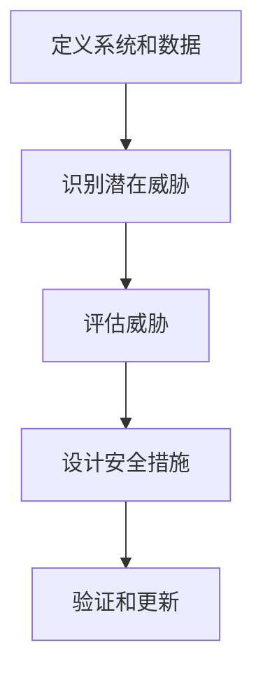

                 

# 威胁建模：系统性识别安全威胁的方法

> 关键词：威胁建模、安全威胁、风险评估、系统安全性

> 摘要：本文旨在深入探讨威胁建模在系统安全性评估中的应用。通过系统性识别和分析安全威胁，威胁建模提供了有效的方法来保护系统和数据免受潜在攻击。本文将详细解析威胁建模的基本概念、方法和实际应用，帮助读者理解如何在实际项目中实施威胁建模，以及其重要性和挑战。

## 目录大纲设计思考过程

在设计《威胁建模：系统性识别安全威胁的方法》的目录大纲时，我们需要遵循以下步骤，以确保目录结构合理、内容完整、逻辑清晰：

### 1. 确定核心章节
首先，我们需要明确这本书的核心内容。根据书名，可以确定以下几个关键主题：
- 威胁建模的基本概念和背景
- 威胁建模的方法和流程
- 不同类型的威胁及其特征
- 威胁建模在实际项目中的应用
- 威胁建模的工具和技术
- 威胁建模的未来趋势和挑战

这些主题将构成书的主要章节。

### 2. 设计章节结构
接下来，我们需要设计每个章节的结构，确保每个章节都能够涵盖核心概念、原理讲解、案例分析和最佳实践等内容。

#### 第1章：威胁建模概述
- **背景介绍**：介绍威胁建模的概念、背景和重要性。
- **核心概念与联系**：定义威胁、威胁建模的定义和目的，使用Mermaid流程图展示威胁建模的流程。
- **威胁建模的边界与外延**：明确威胁建模的应用范围和限制。

#### 第2章：威胁建模的方法和流程
- **威胁建模的方法**：介绍常见的威胁建模方法，如STRIDE、DREAD、OWASP Top 10等。
- **威胁建模的流程**：详细讲解威胁建模的步骤和注意事项。

#### 第3章：不同类型的威胁
- **常见威胁类型**：列举和描述常见的威胁类型，如网络威胁、系统威胁、社会工程学威胁等。
- **威胁特征**：对比不同类型威胁的属性特征，使用表格形式展示。

#### 第4章：威胁建模在实际项目中的应用
- **案例介绍**：介绍一个或多个实际项目中的威胁建模案例。
- **案例分析**：分析案例中的威胁建模过程、结果和效果。
- **实践技巧**：总结案例中的经验和教训，提供实际操作技巧。

#### 第5章：威胁建模的工具和技术
- **工具介绍**：介绍常见的威胁建模工具，如OWASP Threat Dragon、ThreatModeler等。
- **技术对比**：对比不同工具的特点和适用场景。
- **工具使用指南**：提供工具的安装、配置和使用指南。

#### 第6章：威胁建模的未来趋势和挑战
- **未来趋势**：预测威胁建模的发展方向和趋势。
- **挑战与对策**：讨论威胁建模面临的挑战和可能的解决方案。

### 3. 完善细节
在每个章节中，我们还需要进一步细化小节，确保内容详实、逻辑连贯。

- **核心概念与联系**：在每个章节的介绍部分，使用Mermaid流程图展示关键概念和流程，便于读者理解。
- **数学模型和公式**：在讲解算法原理时，使用LaTeX格式嵌入数学公式，并进行详细解释。
- **图表和示例**：在描述概念和算法时，使用图表和示例来帮助读者理解。
- **案例分析**：在每个案例分析部分，提供详细的案例背景、实现步骤和结果分析。

### 4. 检查和调整
在设计完成后，我们需要对目录大纲进行全面的检查和调整，确保：
- 目录结构清晰，层次分明。
- 每个章节都包含核心内容。
- 内容完整且逻辑连贯。

最终，我们将得到一个详细且结构合理的《威胁建模：系统性识别安全威胁的方法》目录大纲。

## 威胁建模的核心概念

### 威胁建模的定义

威胁建模是一种系统性的方法，用于识别、分析和理解潜在的安全威胁，以便更好地保护系统和数据。它是一种结构化的过程，通过定义、识别和评估威胁，来构建系统安全性的整体视图。

### 威胁建模的重要性

威胁建模在系统安全性评估中扮演着至关重要的角色。以下是威胁建模的重要性：
- **预防性保护**：通过提前识别潜在威胁，威胁建模有助于采取预防措施，防止威胁的发生。
- **风险评估**：威胁建模提供了评估系统和数据面临威胁的风险的方法。
- **合规要求**：许多行业和地区都要求进行安全威胁评估，以符合法律法规。
- **资源优化**：威胁建模有助于确定安全资源的最优分配，以提高系统安全性。

### 威胁建模的边界与外延

威胁建模虽然是一个通用的方法，但它也有其适用的范围和限制。以下是其边界与外延：
- **适用范围**：威胁建模适用于各种系统和数据环境，包括但不限于计算机网络、移动应用、云服务和企业信息系统。
- **限制因素**：威胁建模可能受到时间、资源和专业知识等因素的限制。此外，它并不能保证系统完全免受威胁。

### 威胁建模的核心概念与联系

为了更好地理解威胁建模，我们需要定义一些核心概念，并展示它们之间的关系。

#### 威胁的定义

威胁是一种潜在的风险或攻击，可能对系统和数据造成损害。威胁可以是恶意的，如黑客攻击和恶意软件，也可以是非恶意的，如系统故障和自然灾难。

#### 威胁建模的定义

威胁建模是一种系统性的方法，用于识别、分析和理解潜在的安全威胁，以便更好地保护系统和数据。它是通过定义、识别和评估威胁，来构建系统安全性的整体视图。

#### 威胁建模的目的

威胁建模的主要目的是：
- 识别潜在的安全威胁。
- 评估威胁的风险和影响。
- 设计和实施有效的安全措施来保护系统和数据。

#### 威胁建模流程

威胁建模的流程通常包括以下步骤：

1. **定义系统和数据**：明确要保护的系统和数据。
2. **识别潜在威胁**：通过分析系统和数据的特性，识别潜在的威胁。
3. **评估威胁**：评估威胁的风险和可能的影响。
4. **设计安全措施**：根据威胁评估的结果，设计和实施相应的安全措施。
5. **验证和更新**：验证安全措施的有效性，并根据需要更新威胁模型。

为了便于读者理解，我们使用Mermaid流程图来展示威胁建模的流程：

## 威胁建模的方法和流程

威胁建模的方法和流程是识别和管理安全威胁的关键。以下我们将详细介绍常用的威胁建模方法和整个流程。

### 常用的威胁建模方法

威胁建模有多种方法，以下是一些常用的方法：

#### STRIDE方法

STRIDE方法是一种基于攻击目标的分类法，它包括以下六个威胁类别：
- **S：欺骗**（Spoofing）
- **T：篡改**（Tampering）
- **R：拒绝服务**（Repudiation）
- **I：非法入侵**（Information disclosure）
- **D：数据篡改**（Data alteration）
- **E：执行权限提升**（Elevation of privilege）

#### DREAD方法

DREAD方法是一种评估威胁严重性的方法，它包括以下五个评估因素：
- **D：损害程度**（Damage potential）
- **R：重现性**（Reproducibility）
- **E：易用性**（Exploitability）
- **A：影响范围**（Affected users）
- **D：发现难度**（Discoverability）

#### OWASP Top 10方法

OWASP Top 10 是一个广泛接受的安全威胁分类法，它列出了最常见和最危险的10种Web应用程序安全风险，包括：
- **A1：注入**（Injection）
- **A2：跨站脚本（XSS）**（Cross-site Scripting (XSS)）
- **A3：跨站请求伪造（CSRF）**（Cross-site Request Forgery (CSRF)）
- **A4：不安全的对象引用**（Insecure Object References）
- **A5：用户认证**（User Authentication）
- **A6：敏感数据披露**（Sensitive Data Exposure）
- **A7：XML外部实体**（XML External Entities (XXE)）
- **A8：失败后的恶意利用**（Broken Access Control）
- **A9：安全配置错误**（Security Misconfiguration）
- **A10：跨站脚本（XSS）**（Insecure Deserialization）

### 威胁建模的流程

威胁建模的流程是一个系统性的过程，包括以下几个步骤：

#### 1. 定义系统和数据

在开始威胁建模之前，需要明确要保护的系统和数据。这包括了解系统的功能、数据流和数据存储位置。

#### 2. 识别潜在威胁

识别潜在威胁是威胁建模的核心步骤。可以通过以下方法进行：
- **资产识别**：识别系统中的关键资产，如数据库、网络设备和应用程序。
- **威胁库**：使用预定义的威胁库来识别可能威胁。
- **历史数据**：分析历史安全事件和攻击，了解可能面临的威胁。

#### 3. 评估威胁

评估威胁的严重性和可能性。可以使用DREAD方法或其他评估工具来评估威胁的严重性。

#### 4. 设计安全措施

根据威胁评估的结果，设计和实施相应的安全措施。这包括：
- **技术控制**：如防火墙、加密和安全协议。
- **管理控制**：如安全政策和程序、员工培训。

#### 5. 验证和更新

验证安全措施的有效性，并根据需要更新威胁模型。这可以通过定期的安全审计和测试来完成。

## 常见类型的威胁

在威胁建模过程中，识别和理解不同类型的威胁至关重要。以下是几种常见的威胁类型及其特征：

### 网络威胁

网络威胁是指通过网络对系统进行攻击或破坏的行为。常见的网络威胁包括：

#### DDoS攻击

**定义**：分布式拒绝服务（DDoS）攻击是一种通过大量恶意流量使目标系统无法正常服务的攻击。

**特征**：攻击者控制多个受感染的计算机（僵尸网络），同时向目标系统发送大量请求，导致系统过载。

#### 恶意软件

**定义**：恶意软件是一种旨在破坏、窃取或干扰计算机系统正常运行的可执行程序。

**特征**：包括病毒、蠕虫、木马和勒索软件等，能够自我复制、传播，并对系统造成损害。

### 系统威胁

系统威胁是指对系统内部组件的攻击或破坏行为。常见的系统威胁包括：

#### 注入攻击

**定义**：注入攻击是指攻击者将恶意代码注入到系统内部，以执行未经授权的操作。

**特征**：如SQL注入、命令注入等，攻击者可以通过构造特定的输入数据来欺骗系统执行恶意操作。

#### 系统漏洞

**定义**：系统漏洞是指系统中的缺陷或弱点，可能被攻击者利用来入侵或破坏系统。

**特征**：如操作系统漏洞、应用程序漏洞等，通常需要及时更新和打补丁来修复。

### 社会工程学威胁

社会工程学威胁是指利用人类心理和社会行为漏洞进行欺骗和攻击的行为。常见的威胁包括：

#### 社会工程攻击

**定义**：社会工程攻击是指攻击者利用人类心理和社会信任来获取敏感信息或权限。

**特征**：如钓鱼攻击、诈骗电话等，攻击者通过伪装成可信实体来诱骗受害者泄露信息。

#### 勾结攻击

**定义**：勾结攻击是指攻击者与系统内部员工或合作伙伴勾结，利用其权限进行未经授权的操作。

**特征**：如内部人员泄露敏感信息、协助攻击者入侵系统等。

## 威胁建模在实际项目中的应用

在实际项目中，威胁建模是一种关键的实践活动，用于识别、评估和缓解潜在的安全威胁。以下我们将通过具体案例来展示威胁建模的应用过程。

### 案例背景

某金融公司开发了一款在线银行应用程序，用户可以通过该应用程序进行账户管理、转账和支付等功能。随着应用程序的上线，公司需要对其进行全面的安全评估，以确保用户数据和系统安全。

### 案例目标

通过威胁建模，公司希望达到以下目标：
- 识别和评估在线银行应用程序面临的潜在威胁。
- 设计和实施相应的安全措施来保护应用程序和用户数据。
- 为未来系统更新和维护提供安全指南。

### 案例过程

#### 1. 定义系统和数据

首先，公司明确了在线银行应用程序的保护对象，包括：
- 用户账户信息（如用户名、密码、邮箱、电话等）。
- 财务交易数据（如转账记录、支付信息等）。
- 系统配置和日志数据。

#### 2. 识别潜在威胁

公司使用以下方法识别潜在威胁：
- **资产识别**：通过资产清单识别应用程序中的关键资产。
- **威胁库**：参考OWASP Top 10 和其他安全威胁库来识别可能威胁。
- **历史数据**：分析历史安全事件和攻击，了解可能面临的威胁。

识别到的潜在威胁包括：
- **网络威胁**：如DDoS攻击、SQL注入、跨站脚本（XSS）等。
- **系统威胁**：如操作系统漏洞、应用程序漏洞、弱密码等。
- **社会工程学威胁**：如钓鱼攻击、诈骗电话、内部人员泄露信息等。

#### 3. 评估威胁

公司使用DREAD方法评估威胁的严重性和可能性，得到以下结果：

| 威胁类型        | D   | R   | E   | A   | D   | 得分 |
|----------------|-----|-----|-----|-----|-----|------|
| DDoS攻击        | 4   | 4   | 4   | 4   | 5   | 17   |
| SQL注入        | 4   | 4   | 4   | 3   | 4   | 15   |
| 钓鱼攻击        | 3   | 3   | 4   | 3   | 3   | 15   |

根据评估结果，DDoS攻击和SQL注入被列为高风险威胁，钓鱼攻击为中风险威胁。

#### 4. 设计安全措施

基于威胁评估结果，公司设计并实施以下安全措施：
- **网络安全**：部署防火墙、入侵检测系统和DDoS防护服务，以防止DDoS攻击。
- **应用程序安全**：实施输入验证和输出编码，防止SQL注入和跨站脚本攻击。
- **用户安全**：使用多因素认证、密码强度要求和安全提醒，提高用户安全性。
- **社会工程防范**：提供员工安全培训，增强对钓鱼攻击和诈骗电话的防范意识。

#### 5. 验证和更新

公司定期进行安全审计和测试，验证安全措施的有效性，并根据需要更新威胁模型和措施。例如，在发现新的安全漏洞时，公司会及时打补丁和更新安全策略。

### 案例总结

通过威胁建模，公司成功地识别并评估了在线银行应用程序面临的潜在威胁，并采取了相应的安全措施来保护系统和用户数据。这个案例展示了威胁建模在确保系统安全中的重要作用，并为其他项目提供了宝贵的经验。

## 威胁建模的工具和技术

威胁建模不仅需要系统的过程和方法，还依赖于合适的工具和技术。以下是一些常见的威胁建模工具和技术，以及它们的特点和应用。

### OWASP Threat Dragon

**特点**：OWASP Threat Dragon是一个在线的威胁建模工具，它提供了直观的界面来创建和编辑威胁模型。

**应用场景**：适用于Web应用程序的威胁建模，能够帮助开发人员和安全专家快速创建和共享威胁模型。

### ThreatModeler

**特点**：ThreatModeler是一个专业的威胁建模平台，它提供了丰富的功能和模板，支持多种威胁建模方法。

**应用场景**：适用于复杂的系统项目，能够帮助团队进行全面的威胁建模和风险评估。

### OWASP ZAP

**特点**：OWASP ZAP是一个开源的Web应用程序安全扫描工具，它也提供了威胁建模功能。

**应用场景**：适用于Web应用程序的安全测试，能够自动识别潜在的安全威胁并提供修复建议。

### Microsoft Threat Modeling Tool

**特点**：这是一个由微软开发的免费威胁建模工具，易于使用，适用于Microsoft Azure和Microsoft 365环境。

**应用场景**：适用于云服务和企业的威胁建模，能够帮助用户快速识别和评估云应用程序的潜在安全威胁。

### 比较与选择

在选择威胁建模工具时，需要考虑以下因素：

- **易用性**：工具的界面是否直观，用户是否容易上手。
- **功能丰富性**：工具是否支持多种威胁建模方法和评估工具。
- **适用场景**：工具是否适合项目类型和需求。
- **社区支持**：是否有活跃的社区和用户支持。

根据具体需求和项目特点，选择合适的威胁建模工具，将有助于提高威胁建模的效率和效果。

## 威胁建模的未来趋势和挑战

随着技术的不断进步和网络安全威胁的日益复杂，威胁建模也面临着新的趋势和挑战。

### 未来趋势

1. **自动化和智能化**：随着人工智能和机器学习技术的发展，威胁建模工具将更加智能化，能够自动识别和评估潜在威胁，提高威胁建模的效率和准确性。
2. **整合性**：威胁建模将与其他安全管理和风险管理体系更加整合，形成一套完整的网络安全框架。
3. **云安全**：随着云计算的普及，云安全威胁建模将成为重要趋势，针对云环境中的威胁进行专门的建模和分析。

### 挑战

1. **复杂性**：随着系统和网络的复杂度增加，威胁建模将面临更大的挑战，需要更精细和全面的模型来识别和管理威胁。
2. **资源限制**：威胁建模需要大量的人力和时间投入，组织可能面临资源不足的挑战。
3. **实时性**：威胁建模需要实时性和动态性，以适应快速变化的安全环境，这要求建模工具和方法具有高度的灵活性和适应性。

### 对策

1. **持续培训**：提高团队的安全意识和技能，确保他们能够有效地参与威胁建模过程。
2. **定期评估**：定期评估和更新威胁模型，以适应新的威胁和环境变化。
3. **整合技术**：利用自动化工具和技术，提高威胁建模的效率和准确性。

## 结论

威胁建模是确保系统和数据安全的关键方法。通过系统性地识别和分析安全威胁，威胁建模提供了有效的途径来保护系统和数据免受潜在攻击。本文详细介绍了威胁建模的基本概念、方法和实际应用，以及常用的工具和技术。随着网络安全威胁的日益复杂，威胁建模的重要性也在不断提升。未来，随着自动化和智能化的发展，威胁建模将变得更加高效和精确。通过不断学习和实践，我们可以更好地应对网络安全挑战，确保系统和数据的安全。让我们继续关注威胁建模的发展，为构建更安全的数字世界贡献力量。

## 最佳实践 tips

在威胁建模过程中，以下是一些最佳实践，可以帮助您更有效地识别和管理安全威胁：

1. **全面理解系统**：在开始威胁建模之前，确保您对系统、应用程序和数据有全面的理解。
2. **定期更新模型**：安全威胁和环境是不断变化的，定期更新威胁模型以反映最新的情况。
3. **多方面参与**：让开发人员、安全专家、管理人员和用户等多方面参与威胁建模，以获得更全面的视角。
4. **利用专业工具**：使用专业的威胁建模工具可以提高效率和准确性。
5. **培训和教育**：对团队成员进行安全培训和知识教育，提高他们的安全意识和技能。
6. **持续监控**：威胁建模不是一次性的任务，而是持续的过程。使用安全监控工具来实时识别新的威胁。
7. **风险评估**：在建模过程中，对识别的威胁进行风险评估，重点关注高风险威胁。

通过遵循这些最佳实践，您可以确保威胁建模过程更加有效，从而提高系统和数据的安全性。

## 小结

本文深入探讨了威胁建模的基本概念、方法和实际应用，强调了其在系统安全性评估中的重要性。通过系统地识别和分析安全威胁，威胁建模为我们提供了一种有效的手段来保护系统和数据免受潜在攻击。文章介绍了常用的威胁建模方法，如STRIDE、DREAD和OWASP Top 10，并展示了如何在实际项目中实施威胁建模。同时，我们还讨论了威胁建模的工具和技术，以及未来趋势和挑战。通过这些内容，读者可以更好地理解威胁建模的原理和应用，提升系统安全防护能力。

## 注意事项

在进行威胁建模时，需要注意以下几点：

1. **全面性**：确保威胁模型覆盖系统的所有组件和功能，避免遗漏潜在的威胁。
2. **准确性**：在识别和评估威胁时，确保信息的准确性，避免基于不准确的数据做出错误的决策。
3. **及时性**：威胁建模应是一个持续的过程，需要定期更新以反映新的威胁和环境变化。
4. **参与度**：确保团队成员的积极参与，包括开发人员、安全专家和业务人员，以提高模型的全面性和有效性。
5. **安全意识**：提高团队成员的安全意识，使他们能够识别潜在的安全威胁和采取相应的措施。

## 拓展阅读

如果您对威胁建模有更深入的了解需求，以下是一些推荐阅读资源：

1. **书籍**：《威胁建模：系统性和实践指南》（Threat Modeling: Designing for Security）和《软件安全性：实践指南》（Software Security: Building Security In）。
2. **在线课程**：Coursera上的“网络安全与加密”和edX上的“威胁建模与网络安全”。
3. **专业网站**：OWASP（Open Web Application Security Project）和NIST（National Institute of Standards and Technology）提供了丰富的威胁建模资源和指南。

通过这些资源，您可以进一步提升对威胁建模的理解和技能。

