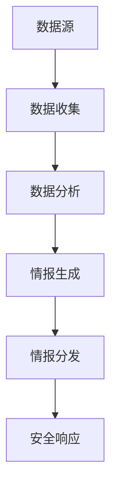
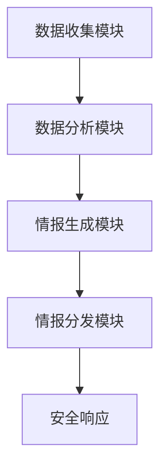
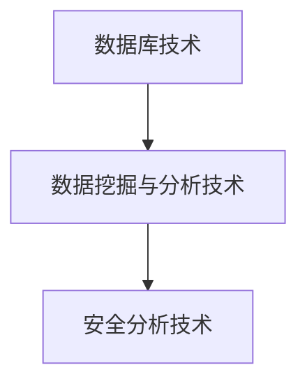
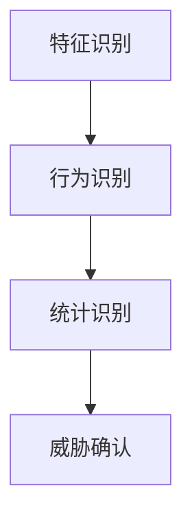
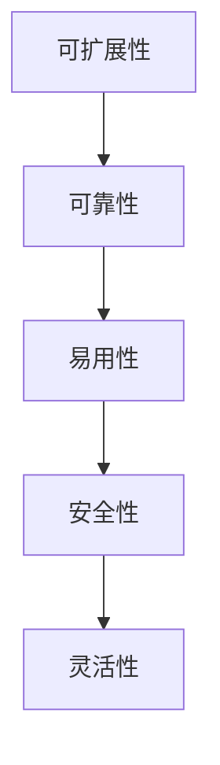
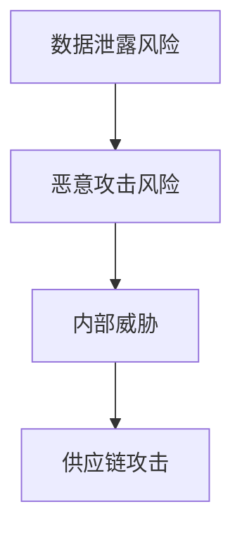
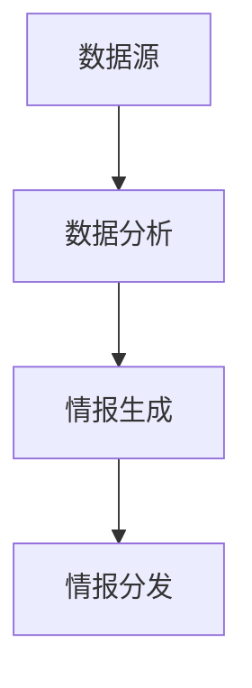
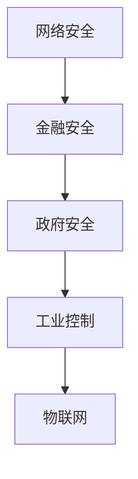

                 


### 1.2 威胁情报的重要性

**背景介绍：**

在当今数字化时代，网络攻击手段日益翻新，安全威胁变得愈发复杂。企业、政府机构和个人用户面临着前所未有的安全挑战。威胁情报作为网络安全的重要环节，具有极其重要的作用。它不仅能够帮助企业、政府机构和个人用户了解潜在威胁，还能够提供应对威胁的决策支持和策略建议。

**问题背景：**

随着网络攻击的不断增加，传统的安全防护措施已经无法满足日益严峻的安全挑战。面对日益复杂的安全威胁，如何快速、准确地识别和应对威胁成为关键。威胁情报能够为企业、政府机构和个人用户提供有关威胁的详细信息，从而帮助他们更好地应对安全威胁。

**问题描述：**

威胁情报的重要性体现在以下几个方面：

1. **威胁识别与预警：** 威胁情报平台能够收集、分析和整合来自多个数据源的信息，快速识别潜在的威胁，并提供及时的预警。
2. **决策支持：** 通过威胁情报，企业、政府机构和个人用户可以更好地了解威胁的来源、目的和攻击手段，为安全决策提供有力支持。
3. **策略优化：** 威胁情报有助于优化安全策略，提高安全防护能力，降低安全风险。
4. **安全投资优化：** 威胁情报有助于企业、政府机构和个人用户合理分配安全投资，确保安全资金的有效利用。

**问题解决：**

为了充分发挥威胁情报的作用，需要建立一个完善的威胁情报平台。这个平台应包括以下几个关键组成部分：

1. **数据收集与整合：** 收集来自各种数据源的信息，如网络流量、日志、漏洞信息等，并进行整合，形成一个全面、实时的威胁情报数据库。
2. **威胁分析与处理：** 利用先进的数据分析技术和安全分析技术，对收集到的信息进行深度分析，识别潜在威胁，并提供相应的处理建议。
3. **情报生成与分发：** 将分析结果生成情报，并通过多种渠道进行分发，确保相关人员能够及时获取有关威胁的信息。
4. **安全响应与协作：** 根据威胁情报，制定相应的安全响应策略，并与内外部安全团队进行协作，提高整体安全防护能力。

**边界与外延：**

威胁情报不仅涉及网络安全领域，还与其他领域密切相关。例如，在金融领域，威胁情报有助于防范金融欺诈；在政府领域，威胁情报有助于维护国家安全和社会稳定。因此，威胁情报的应用范围非常广泛，具有很大的发展潜力。

**概念结构与核心要素组成：**

威胁情报平台的核心要素包括数据收集、数据整合、威胁分析、情报生成、情报分发和安全响应。这些要素相互关联，共同构成一个完整的威胁情报生态系统。

1. **数据收集：** 包括网络流量、日志、漏洞信息、安全报告等。
2. **数据整合：** 对收集到的数据进行清洗、去重、格式化等处理，形成统一的威胁情报数据库。
3. **威胁分析：** 利用数据挖掘、机器学习等技术对数据进行深度分析，识别潜在威胁。
4. **情报生成：** 将分析结果转化为可操作的情报，提供决策支持。
5. **情报分发：** 通过多种渠道（如邮件、短信、API接口等）将情报分发给相关人员。
6. **安全响应：** 根据威胁情报制定相应的安全响应策略，实施安全防护措施。

**小结：**

威胁情报在网络安全领域具有重要意义。通过建立一个完善的威胁情报平台，企业、政府机构和个人用户可以更好地应对复杂的安全威胁，提高整体安全防护能力。威胁情报平台的构建需要关注数据收集、数据整合、威胁分析、情报生成、情报分发和安全响应等关键环节，以实现威胁情报的最大化价值。在未来的发展中，威胁情报平台将进一步融合人工智能、大数据等先进技术，提高威胁情报的准确性和实时性，为网络安全保驾护航。

### 1.3 威胁情报的应用领域

**核心概念原理：**

威胁情报的应用领域非常广泛，涵盖了多个行业和领域。以下是威胁情报在部分重要应用领域的核心概念原理：

1. **网络安全：** 威胁情报在网络安全领域的主要应用是帮助组织识别和预防网络攻击。通过收集和分析网络流量、日志、漏洞信息等数据，威胁情报平台可以及时发现潜在威胁，提供预警和应对策略。

2. **金融安全：** 威胁情报在金融安全领域的作用是防范金融欺诈和非法交易。金融机构可以利用威胁情报来监测和识别可疑交易活动，防止洗钱和其他金融犯罪行为。

3. **政府安全：** 威胁情报在政府安全领域有助于保护国家关键基础设施和信息安全。政府机构可以通过威胁情报来识别和应对针对国家的网络攻击，维护国家安全和社会稳定。

4. **工业控制：** 威胁情报在工业控制系统的应用主要是保障工业过程的连续性和安全性。通过监测和分析工业控制系统中的数据，威胁情报平台可以帮助企业及时发现潜在的安全威胁，防止工业控制系统被恶意攻击。

5. **物联网：** 威胁情报在物联网领域的作用是保护物联网设备免受攻击。随着物联网设备数量的增加，威胁情报可以帮助企业及时发现并防范针对物联网设备的恶意攻击。

**概念属性特征对比表格：**

| 应用领域       | 核心概念                                           | 关键特征                                       |
|----------------|----------------------------------------------------|------------------------------------------------|
| 网络安全       | 识别和预防网络攻击                                   | 数据收集、分析、预警、响应                       |
| 金融安全       | 防范金融欺诈和非法交易                               | 可疑交易监测、风险评估、决策支持                 |
| 政府安全       | 保护国家关键基础设施和信息安全                         | 网络攻击监测、安全策略制定、应急响应             |
| 工业控制       | 保障工业过程的连续性和安全性                          | 工业控制系统监测、安全事件分析、应急响应         |
| 物联网         | 保护物联网设备免受攻击                               | 设备安全监测、威胁情报共享、安全策略优化         |

**ER实体关系图架构的 Mermaid 流程图：**

```mermaid
erDiagram
  数据源 ||--o> 威胁情报平台 : 数据收集
  威胁情报平台 ||--o> 威胁分析 : 数据分析
  威胁分析 ||--o> 情报生成 : 情报制作
  情报生成 ||--o> 情报分发 : 情报传递
  情报分发 ||--o> 安全响应 : 响应执行
```

**小结：**

威胁情报的应用领域广泛，涉及网络安全、金融安全、政府安全、工业控制和物联网等多个领域。在不同的应用领域，威胁情报的核心概念和关键特征有所不同，但总体目标都是通过收集、分析和分发威胁信息，提高整体安全防护能力。通过建立完善的威胁情报平台，企业、政府机构和个人用户可以更好地应对复杂的安全挑战。在未来的发展中，威胁情报平台将继续融合更多先进技术，提高情报的准确性和实时性，为各领域提供更强大的安全支持。

### 1.4 威胁情报的历史与发展趋势

**核心概念原理：**

威胁情报的历史可以追溯到20世纪80年代，当时网络安全主要依赖于防火墙和入侵检测系统。随着网络攻击手段的日益复杂，传统的防护手段逐渐失效，威胁情报逐渐成为网络安全的重要组成部分。威胁情报的发展可以分为以下几个阶段：

1. **早期阶段（20世纪80年代至90年代）：** 这段时间主要是网络防御阶段，安全专家开始关注网络攻击，并尝试通过日志分析和入侵检测来识别攻击。这一阶段威胁情报主要以手动分析为主，情报来源较为有限。

2. **发展阶段（21世纪初至今）：** 随着互联网的普及和云计算、大数据等技术的应用，威胁情报逐渐走向自动化和智能化。这一阶段，威胁情报平台开始普及，利用机器学习和数据挖掘技术进行威胁分析，大大提高了情报的准确性和实时性。

**历史演变过程：**

- **20世纪80年代：** 网络防御主要以防火墙为主，入侵检测系统（IDS）开始出现，安全专家开始关注网络攻击。
- **20世纪90年代：** 安全专家开始使用日志分析工具，如Security Information and Event Management（SIEM）系统，来收集和整合网络安全数据。
- **21世纪初：** 威胁情报平台（Threat Intelligence Platform，TIP）开始兴起，利用机器学习、数据挖掘等技术进行深度威胁分析。
- **现在：** 威胁情报已广泛应用于各个行业，成为网络安全的重要手段，威胁情报平台功能日益完善，智能化水平不断提高。

**当前趋势与未来展望：**

1. **人工智能的应用：** 人工智能在威胁情报中的应用将成为未来发展趋势。通过机器学习算法，可以自动识别和分析威胁，提高情报的准确性和实时性。
2. **数据驱动的安全策略：** 威胁情报平台将更加依赖于大数据分析，通过收集和分析海量数据，为安全决策提供有力支持。
3. **集成化的安全架构：** 未来威胁情报平台将与其他安全工具（如防火墙、入侵检测系统等）进行深度集成，实现一站式安全防护。
4. **国际化与协作：** 随着网络攻击的全球化，威胁情报平台将加强国际间的合作，共享威胁情报，提高全球网络安全水平。

**小结：**

威胁情报的发展经历了从手动分析到自动化和智能化的过程，当前正处于快速发展的阶段。未来，随着人工智能、大数据等技术的不断进步，威胁情报平台将更加智能化和集成化，为网络安全提供更强大的支持。在全球化背景下，威胁情报平台的建设和运营将更加注重国际间的协作与信息共享，共同应对复杂多变的安全挑战。

### 1.5 威胁情报的关键要素

**核心概念原理：**

威胁情报的有效性取决于多个关键要素，这些要素相互关联，共同构成了威胁情报体系的基石。以下是威胁情报的五个关键要素及其重要性：

1. **数据质量：** 数据质量是威胁情报的基础。高质量的数据能够确保威胁情报的准确性和可靠性。数据收集过程中必须确保数据的完整性、准确性和及时性。
   
2. **数据源：** 数据源是威胁情报的来源。多样化的数据源能够提供丰富的威胁信息，包括网络流量、日志、漏洞信息、第三方情报等。数据源的选择和整合对威胁情报的全面性至关重要。

3. **分析能力：** 分析能力是威胁情报的核心。通过先进的数据分析技术（如机器学习、数据挖掘等），可以深度解析威胁数据，识别潜在威胁，生成有价值的安全情报。

4. **情报生成：** 情报生成是将分析结果转化为可操作情报的过程。高质量的情报能够为安全决策提供有力支持。情报生成需要关注情报的可读性、格式化和实用性。

5. **情报分发：** 情报分发是将生成的情报传递给相关人员的过程。有效的情报分发机制能够确保情报的及时性和可获取性，提高安全响应效率。

**ER实体关系图架构的 Mermaid 流程图：**



**数据质量的影响：**

- **数据完整性：** 完整的数据可以确保威胁情报的全面性和准确性，防止因数据缺失导致误判或漏判。
- **数据准确性：** 准确的数据可以减少误报和漏报，提高威胁情报的可靠性。
- **数据及时性：** 及时的数据能够快速响应威胁事件，提高安全响应的及时性和有效性。

**数据源的类型：**

1. **内部数据源：** 包括网络流量、日志文件、内部网络设备等。
2. **外部数据源：** 包括第三方情报服务、开源情报（OSINT）、公共安全数据库等。

**分析能力的实现：**

1. **特征提取：** 从数据中提取威胁特征，如IP地址、域名、URL、文件哈希值等。
2. **模式识别：** 利用机器学习算法识别威胁模式，如异常行为检测、恶意软件检测等。
3. **关联分析：** 对多个数据进行关联分析，发现潜在的威胁关系。

**情报生成与分发的最佳实践：**

1. **格式标准化：** 确保情报格式统一，便于不同系统和人员之间的交换和使用。
2. **自动化分发：** 利用自动化工具和API接口实现情报的实时分发，提高响应速度。
3. **多渠道分发：** 通过多种渠道（如邮件、短信、API接口等）分发情报，确保相关人员能够及时获取。

**小结：**

威胁情报的关键要素包括数据质量、数据源、分析能力、情报生成和情报分发。这些要素相互关联，共同构成了威胁情报体系的基础。通过关注这些关键要素，企业、政府机构和个人用户可以构建一个高效、可靠的威胁情报平台，提高网络安全防护能力。在未来的发展中，威胁情报体系将更加智能化和集成化，为网络安全提供更强大的支持。

### 1.6 威胁情报平台的优势与挑战

**核心概念原理：**

威胁情报平台作为一种集成的安全解决方案，通过收集、分析和分发威胁情报，为企业、政府机构和个人用户提供了强大的安全支持。然而，威胁情报平台在带来诸多优势的同时，也面临着一系列挑战。以下是威胁情报平台的优势与挑战的详细分析。

**优势：**

1. **全面威胁监测：** 威胁情报平台能够整合来自多个数据源的信息，实现对网络、应用、终端等各个层面的全面监测。通过多维度的威胁数据，可以更全面地了解潜在威胁。

2. **实时威胁预警：** 威胁情报平台利用先进的数据分析技术和机器学习算法，能够实时识别和预警潜在威胁。这有助于企业、政府机构和个人用户在威胁发生前采取预防措施，降低安全风险。

3. **个性化安全策略：** 威胁情报平台可以根据企业的具体安全需求和威胁环境，制定个性化的安全策略。这有助于优化安全资源配置，提高安全防护效果。

4. **协作与共享：** 威胁情报平台可以与企业内外部的安全团队、合作伙伴共享威胁情报，形成协同防御机制。这有助于提高整体安全防护水平，共同应对复杂的安全威胁。

**挑战：**

1. **数据质量与完整性：** 数据质量是威胁情报平台的关键。然而，数据源众多，数据格式和结构各异，可能导致数据质量参差不齐。确保数据完整性、准确性和及时性是平台面临的重大挑战。

2. **分析能力不足：** 虽然数据分析技术不断发展，但威胁情报平台在应对新型威胁、未知威胁时，仍可能面临分析能力不足的问题。特别是面对日益复杂的网络攻击，平台需要具备更高的智能化和自动化水平。

3. **隐私与合规性：** 在收集、处理和分发威胁情报的过程中，隐私保护和数据合规性是重要问题。如何平衡安全需求与隐私保护，遵守相关法律法规，是威胁情报平台需要面对的挑战。

4. **资源分配与优化：** 威胁情报平台需要大量的计算资源和存储资源，资源分配与优化是平台运营的关键。如何在有限的资源条件下，最大化平台的安全防护能力，是平台需要解决的问题。

**案例分析：**

以某大型金融机构的威胁情报平台为例，该平台在实施过程中面临以下挑战：

1. **数据整合困难：** 该金融机构拥有多个分支机构，数据源繁多，数据格式各异。平台在整合这些数据时，遇到了数据质量不一致、数据格式不统一的问题。

2. **分析能力不足：** 该平台在应对新型网络攻击时，发现现有的数据分析技术难以满足需求。平台需要不断升级和优化数据分析算法，以提高威胁识别的准确性和实时性。

3. **隐私保护与合规性：** 该金融机构在收集和处理客户数据时，需要严格遵守隐私保护法规。如何在保护客户隐私的同时，确保威胁情报的准确性和及时性，是平台面临的挑战。

4. **资源优化：** 平台在运营过程中，计算资源和存储资源需求巨大。平台需要通过技术手段和运营优化，实现资源的高效利用，降低运营成本。

**解决方案：**

1. **数据标准化与清洗：** 引入数据清洗和预处理工具，对来自不同数据源的数据进行标准化和清洗，确保数据质量的一致性和完整性。

2. **人工智能与大数据技术：** 引入人工智能和大数据技术，提升平台的威胁分析能力和智能化水平，提高威胁识别的准确性和实时性。

3. **隐私保护与合规性：** 建立隐私保护机制，采用数据匿名化、加密等技术，确保在数据收集、处理和分发过程中遵守隐私保护法规。

4. **资源优化与调度：** 通过自动化资源调度和优化算法，实现计算资源和存储资源的高效利用，降低运营成本。

**小结：**

威胁情报平台在网络安全中具有重要作用，但同时也面临着数据质量、分析能力、隐私保护和资源优化等一系列挑战。通过采取有效的解决方案，可以提升威胁情报平台的安全防护能力，为企业、政府机构和个人用户提供更加可靠的安全保障。

## 第2章：威胁情报平台的架构

### 2.1 威胁情报平台的组成部分

**背景介绍：**

威胁情报平台是一个复杂且高度集成的系统，旨在为企业、政府机构和个人用户提供全面的网络安全威胁情报。一个完善的威胁情报平台通常包括多个关键组成部分，这些组成部分相互协作，共同实现数据收集、分析、情报生成和情报分发等核心功能。

**核心概念与联系：**

威胁情报平台的核心组成部分可以概括为数据收集模块、数据分析模块、情报生成模块和情报分发模块。这些模块之间通过数据流和信息交换紧密联系，形成一个完整的威胁情报生态系统。

1. **数据收集模块：** 负责从各种数据源收集信息，如网络流量、日志文件、漏洞信息、第三方情报等。
2. **数据分析模块：** 利用先进的数据分析技术和机器学习算法，对收集到的信息进行深度分析，识别潜在威胁。
3. **情报生成模块：** 将分析结果转化为可操作的情报，为安全决策提供支持。
4. **情报分发模块：** 通过多种渠道将生成的情报传递给相关人员，确保情报的及时性和可获取性。

**ER实体关系图架构的 Mermaid 流程图：**



**组成部分的详细描述：**

1. **数据收集模块：**
   - **功能描述：** 数据收集模块负责从各种数据源收集威胁信息。这些数据源包括网络流量、日志文件、漏洞信息、安全设备（如防火墙、入侵检测系统）、第三方情报服务等。
   - **关键技术：** 数据收集模块需要具备高效的数据采集和处理能力，支持多种数据源的接入和整合。常见的采集技术包括网络流量分析（NFA）、日志收集（Log Collection）和漏洞扫描（Vulnerability Scanning）等。

2. **数据分析模块：**
   - **功能描述：** 数据分析模块负责对收集到的信息进行深度分析，识别潜在威胁。通过应用数据挖掘、机器学习、关联分析等算法，可以从海量数据中提取有价值的信息。
   - **关键技术：** 数据分析模块需要采用先进的数据分析技术，如特征提取、异常检测、关联分析、机器学习等，以提高威胁识别的准确性和实时性。

3. **情报生成模块：**
   - **功能描述：** 情报生成模块将分析结果转化为可操作的情报，生成威胁报告、安全建议等。这些情报可以为安全决策提供有力支持。
   - **关键技术：** 情报生成模块需要关注情报的格式化、标准化和个性化，确保情报的可读性和实用性。

4. **情报分发模块：**
   - **功能描述：** 情报分发模块通过多种渠道将生成的情报传递给相关人员，如安全团队、管理层、员工等。情报分发需要保证情报的及时性和可获取性。
   - **关键技术：** 情报分发模块需要支持多种分发方式，如邮件、短信、API接口、内部消息系统等，确保情报能够快速传递到目标受众。

**系统分析与架构设计方案：**

1. **问题场景介绍：**
   - 假设某企业网络安全团队需要建立一套威胁情报平台，以应对日益复杂的网络威胁。

2. **项目介绍：**
   - 项目目标是构建一个集成的威胁情报平台，实现数据收集、分析、情报生成和分发等功能，提高企业网络安全防护能力。

3. **系统功能设计：**
   - **数据收集功能：** 收集企业内部网络流量、日志文件、漏洞信息等，同时接入第三方情报服务。
   - **数据分析功能：** 利用数据挖掘和机器学习算法，对收集到的信息进行深度分析，识别潜在威胁。
   - **情报生成功能：** 生成威胁报告、安全建议等情报，为安全决策提供支持。
   - **情报分发功能：** 通过邮件、短信、API接口等多种渠道，将情报传递给相关人员。

4. **系统架构设计：**
   - **数据收集层：** 包括网络流量传感器、日志收集器、漏洞扫描器等，负责从各个数据源收集信息。
   - **数据处理层：** 采用分布式数据处理框架（如Apache Kafka、Apache Spark等），对收集到的信息进行预处理、存储和分析。
   - **数据分析层：** 应用机器学习算法、关联分析等技术，对预处理后的数据进行深度分析，识别潜在威胁。
   - **情报生成层：** 将分析结果转化为可操作的情报，生成威胁报告、安全建议等。
   - **情报分发层：** 通过邮件、短信、API接口等多种渠道，将情报传递给相关人员。

5. **系统接口设计和系统交互：**
   - **API接口：** 提供与其他安全工具（如防火墙、入侵检测系统等）的集成接口，实现威胁情报的共享和联动。
   - **内部消息系统：** 用于内部安全团队之间的消息传递和协作，确保情报的快速传递和响应。

**小结：**

威胁情报平台的架构包括数据收集模块、数据分析模块、情报生成模块和情报分发模块，这些模块相互协作，共同实现威胁情报的收集、分析、生成和分发。通过有效的系统架构设计，可以构建一个高效、可靠的威胁情报平台，提高企业网络安全防护能力。在未来的发展中，威胁情报平台将进一步融合人工智能、大数据等先进技术，实现智能化和自动化，为网络安全提供更强大的支持。

### 2.2 威胁情报平台的关键技术

**背景介绍：**

威胁情报平台的建设离不开一系列关键技术的支持。这些技术不仅决定了平台的性能和可靠性，还直接影响威胁情报的准确性和实时性。以下是威胁情报平台中常见的几种关键技术及其详细描述。

**核心概念原理：**

威胁情报平台的关键技术主要包括数据库技术、数据挖掘与分析技术以及安全分析技术。这些技术共同作用，确保威胁情报平台的全面性、高效性和可靠性。

1. **数据库技术：** 数据库技术是威胁情报平台的核心，用于存储和管理大量威胁数据。数据库技术需要具备高扩展性、高性能和实时数据处理能力。

2. **数据挖掘与分析技术：** 数据挖掘与分析技术用于从海量威胁数据中提取有价值的信息，识别潜在威胁。这些技术包括机器学习、关联分析、异常检测等。

3. **安全分析技术：** 安全分析技术用于对收集到的威胁数据进行深度分析，识别恶意行为、攻击模式和威胁趋势。这些技术包括威胁特征提取、入侵检测、恶意软件分析等。

**ER实体关系图架构的 Mermaid 流程图：**



**关键技术详细描述：**

1. **数据库技术：**
   - **功能描述：** 数据库技术负责存储和管理威胁情报平台中的大量数据，包括网络流量、日志文件、漏洞信息、威胁事件等。
   - **关键技术：** 威胁情报平台常用的数据库技术包括关系数据库（如MySQL、PostgreSQL）和NoSQL数据库（如MongoDB、Cassandra）。关系数据库适用于结构化数据存储，而NoSQL数据库适用于大规模非结构化数据存储。
   - **优点：** 高扩展性、高性能、实时数据处理能力。
   - **挑战：** 数据集成和标准化问题。

2. **数据挖掘与分析技术：**
   - **功能描述：** 数据挖掘与分析技术用于从海量威胁数据中提取有价值的信息，识别潜在威胁。这些技术可以自动识别数据中的模式、趋势和异常。
   - **关键技术：** 包括机器学习、关联分析、聚类分析、分类算法等。
   - **优点：** 提高威胁识别的准确性和效率。
   - **挑战：** 数据质量问题和算法选择与优化。

3. **安全分析技术：**
   - **功能描述：** 安全分析技术用于对收集到的威胁数据进行深度分析，识别恶意行为、攻击模式和威胁趋势。这些技术可以帮助安全团队快速响应威胁事件。
   - **关键技术：** 包括威胁特征提取、入侵检测、恶意软件分析、漏洞管理等。
   - **优点：** 提高威胁响应速度和攻击检测能力。
   - **挑战：** 需要专业的安全知识和经验。

**系统架构设计：**

1. **问题场景介绍：**
   - 假设某企业需要构建一个威胁情报平台，以应对日益复杂的网络威胁。

2. **项目介绍：**
   - 项目目标是构建一个高效、可靠的威胁情报平台，实现数据收集、分析、情报生成和分发等功能。

3. **系统架构设计：**
   - **数据收集层：** 采用分布式架构，包括网络流量传感器、日志收集器和漏洞扫描器等，负责从多个数据源收集信息。
   - **数据处理层：** 利用分布式数据处理框架（如Apache Kafka、Apache Spark等），对收集到的信息进行预处理、存储和分析。
   - **数据分析层：** 应用机器学习、关联分析等算法，对预处理后的数据进行深度分析，识别潜在威胁。
   - **情报生成层：** 将分析结果转化为威胁情报，生成威胁报告、安全建议等。
   - **情报分发层：** 通过邮件、短信、API接口等多种渠道，将情报传递给相关人员。

4. **系统接口设计和系统交互：**
   - **API接口：** 提供与其他安全工具（如防火墙、入侵检测系统等）的集成接口，实现威胁情报的共享和联动。
   - **内部消息系统：** 用于内部安全团队之间的消息传递和协作，确保情报的快速传递和响应。

**小结：**

威胁情报平台的关键技术包括数据库技术、数据挖掘与分析技术以及安全分析技术。这些技术共同构成了威胁情报平台的核心，确保平台的高效性和可靠性。通过合理的系统架构设计，可以构建一个高效的威胁情报平台，为企业、政府机构和个人用户提供全面、实时的网络安全威胁情报。

### 2.3 数据收集与整合的重要性

**核心概念原理：**

数据收集与整合是威胁情报平台构建的基础，对于确保平台的有效性和可靠性具有重要意义。数据收集涉及从多个数据源获取安全相关信息，而数据整合则是对这些数据进行清洗、去重和格式化等处理，以便于后续的分析和利用。以下是数据收集与整合在威胁情报平台中的重要性及其关键步骤的详细分析。

**数据收集的重要性：**

1. **全面性：** 数据收集的全面性是确保威胁情报平台能够全面监测网络安全态势的前提。通过收集网络流量、日志文件、漏洞信息、第三方情报等多样化数据源，可以获取更丰富的威胁信息，从而提高威胁情报的全面性和准确性。

2. **实时性：** 实时性是威胁情报平台的关键要求之一。快速收集和传输数据，能够确保在威胁发生时，平台能够及时响应和采取行动，降低安全风险。

3. **可靠性：** 数据收集的可靠性直接影响威胁情报的准确性。通过采用可靠的数据收集工具和方法，可以确保收集到的数据质量，减少数据错误和遗漏。

**数据整合的重要性：**

1. **一致性：** 数据整合能够确保不同数据源的数据在格式、结构和内容上的一致性。这有助于提高数据分析的效率和准确性，避免因数据格式不一致导致的错误分析。

2. **完整性：** 通过数据整合，可以消除数据中的重复和冗余信息，确保数据的完整性。完整的数据有助于全面了解威胁情况，防止因数据缺失导致的信息不对称。

3. **可操作性：** 整合后的数据更加易于操作和分析，可以提高威胁情报的可操作性。这对于安全团队制定应对策略、优化安全资源配置具有重要意义。

**关键步骤：**

1. **数据源选择：** 根据威胁情报平台的需求，选择合适的数据源。常见的数据源包括内部网络流量、日志文件、漏洞数据库、第三方情报服务等。

2. **数据采集：** 采用合适的工具和方法，从各个数据源收集数据。例如，可以使用网络流量捕获工具（如Wireshark）、日志收集工具（如Logstash）和漏洞扫描工具（如Nessus）等。

3. **数据预处理：** 对收集到的数据进行清洗、去重和格式化等预处理。例如，可以使用正则表达式进行数据清洗，统一数据格式，确保数据的结构化和标准化。

4. **数据存储：** 将预处理后的数据存储到威胁情报平台的数据仓库中。常用的数据存储方案包括关系数据库（如MySQL、PostgreSQL）和NoSQL数据库（如MongoDB、Cassandra）。

5. **数据关联：** 对不同数据源的数据进行关联分析，发现潜在的威胁关系。例如，可以将网络流量数据与日志数据进行关联，识别恶意流量的来源和目的。

**案例分析：**

以某大型企业的威胁情报平台建设为例，该企业在数据收集与整合过程中采取了以下关键步骤：

1. **数据源选择：** 该企业选择了网络流量、日志文件、漏洞数据库和第三方情报服务等多个数据源，以确保威胁情报的全面性和准确性。

2. **数据采集：** 使用网络流量捕获工具（如Wireshark）和日志收集工具（如Logstash）从各个数据源收集数据，并将数据实时传输到威胁情报平台的数据仓库中。

3. **数据预处理：** 对收集到的数据进行清洗、去重和格式化，统一数据格式，确保数据的结构化和标准化。

4. **数据存储：** 采用NoSQL数据库（如MongoDB）存储预处理后的数据，以支持海量数据的快速存储和查询。

5. **数据关联：** 对网络流量数据、日志数据和漏洞数据进行关联分析，发现潜在的威胁关系，生成综合性的威胁情报。

**小结：**

数据收集与整合是威胁情报平台构建的关键步骤，对于确保平台的有效性和可靠性具有重要意义。通过全面、实时、可靠的数据收集和科学的数据整合，可以构建一个高效、可靠的威胁情报平台，为企业、政府机构和个人用户提供全面、准确的网络安全威胁情报。

### 2.4 数据源的选择

**核心概念原理：**

在构建威胁情报平台时，选择合适的数据源至关重要。数据源的质量直接影响威胁情报的准确性和可靠性。因此，我们需要了解不同类型的数据源及其特点，以便做出明智的选择。

**常见的数据源类型：**

1. **内部数据源：**
   - **网络流量：** 包含网络设备的流量数据，可用于识别异常流量、潜在攻击等。
   - **日志文件：** 包含系统、应用程序和网络安全设备的日志信息，有助于检测和诊断安全问题。
   - **漏洞信息：** 包含已知漏洞的信息，可用于评估系统的安全风险。

2. **外部数据源：**
   - **公共安全数据库：** 如国家漏洞数据库（NVD）、公开的威胁情报源等，提供大量已知的威胁信息。
   - **第三方情报服务：** 如威胁情报提供商、安全论坛等，提供专业化的威胁情报和实时更新。
   - **开源情报（OSINT）：** 通过互联网收集公开信息，如社交媒体、论坛、新闻报道等，有助于了解网络威胁的背景和趋势。

**内部数据源与外部数据源的对比：**

| 对比项            | 内部数据源                             | 外部数据源                             |
|-------------------|--------------------------------------|--------------------------------------|
| 数据范围          | 限于企业内部网络和数据                      | 范围广泛，包括互联网上的公开信息             |
| 数据实时性        | 实时性较高，可快速响应内部威胁                | 实时性较低，但可获取更广泛的威胁情报          |
| 数据质量          | 数据质量可控，但可能有限                    | 数据质量参差不齐，但可获取丰富的威胁情报      |
| 数据依赖性        | 对企业内部网络和数据系统依赖较强                | 依赖第三方和开源资源，可能存在数据源不稳定问题  |
| 数据类型          | 结构化数据，如日志、漏洞信息等                  | 非结构化数据，如文本、图片、视频等           |

**如何选择数据源：**

1. **需求分析：** 根据威胁情报平台的目标和需求，确定需要哪些类型的数据源。例如，如果目标是检测内部网络威胁，可以选择内部网络流量和日志文件；如果目标是了解全球网络威胁趋势，可以选择开源情报和第三方情报服务。

2. **数据质量评估：** 对潜在的数据源进行质量评估，包括数据完整性、准确性和实时性。优先选择质量较高的数据源，以确保威胁情报的可靠性。

3. **数据源集成：** 选择能够与企业现有系统（如日志管理系统、漏洞管理工具等）集成的数据源，以简化数据收集和整合流程。

4. **成本考虑：** 考虑数据源的获取成本和维护成本，平衡威胁情报平台的建设和运营成本。

**实际案例：**

以某金融机构的威胁情报平台为例，该平台在选择数据源时采取了以下策略：

1. **内部数据源：** 收集网络流量、日志文件和漏洞信息。网络流量数据用于识别异常流量和潜在攻击；日志文件用于检测系统异常和安全事件；漏洞信息用于评估系统安全风险。

2. **外部数据源：** 接入国家漏洞数据库（NVD）和第三方威胁情报服务。通过NVD获取已知漏洞信息，通过第三方威胁情报服务获取实时更新的威胁情报。

3. **开源情报（OSINT）：** 通过社交媒体和新闻报道等渠道，收集与金融行业相关的网络威胁信息，以便了解行业内的威胁趋势。

**小结：**

选择合适的数据源是构建威胁情报平台的关键步骤。通过内部数据源和外部数据源的结合，可以获取全面、准确的威胁情报，提高威胁情报平台的整体性能。在数据源选择过程中，需综合考虑数据质量、实时性、集成性和成本等因素，以确保威胁情报平台的构建和运营效果。

### 2.5 数据整合策略

**核心概念原理：**

数据整合是威胁情报平台的重要组成部分，其目的是将来自不同数据源的数据进行清洗、去重、格式化和标准化等处理，以便于后续的分析和利用。有效的数据整合策略能够提高数据的完整性和一致性，从而增强威胁情报的准确性和实用性。

**数据清洗与预处理：**

1. **数据清洗：** 数据清洗是数据整合的第一步，主要目标是去除数据中的噪声和错误。常见的清洗方法包括：
   - **缺失值处理：** 对缺失的数据进行填充或删除。
   - **异常值处理：** 识别并处理异常数据值，如超出预期范围的数值。
   - **重复数据删除：** 识别并删除重复的数据条目，确保数据的唯一性。

2. **数据预处理：** 数据预处理是对清洗后的数据进行进一步处理，以提高数据的质量和一致性。常见的预处理方法包括：
   - **数据转换：** 将不同格式、编码或单位的数据转换为统一的格式。
   - **数据归一化：** 将数据缩放到相同的范围，消除数据之间的尺度差异。
   - **特征提取：** 从原始数据中提取有用的特征信息，用于后续的数据分析。

**数据标准化与规范化：**

1. **数据标准化：** 数据标准化是将不同数据源的数据按照统一的规则进行格式化和编码。常见的标准化方法包括：
   - **字段命名标准化：** 对不同数据源的字段进行统一命名，便于数据整合和查询。
   - **数据类型标准化：** 将不同数据类型的字段转换为统一的数据类型，如将字符串转换为日期格式。

2. **数据规范化：** 数据规范化是对数据进行结构化处理，使其符合数据库管理的规范。常见的规范化方法包括：
   - **数据库表设计：** 设计合理的数据库表结构，消除数据冗余和依赖。
   - **数据索引优化：** 对常用的查询字段建立索引，提高数据查询速度。

**最佳实践：**

1. **数据集成平台：** 使用数据集成平台（如Apache NiFi、Apache Kafka等）来简化数据整合过程，提供数据清洗、转换和加载等功能。

2. **数据质量管理工具：** 使用数据质量管理工具（如Open Data Quality、Dataera等）来监控数据质量，确保数据清洗和预处理的效果。

3. **自动化脚本：** 开发自动化脚本（如Python、Shell等）来执行数据清洗、转换和加载任务，提高数据整合的效率和准确性。

**案例分析：**

以某企业的威胁情报平台为例，该企业在数据整合过程中采用了以下策略：

1. **数据清洗：** 使用Python脚本对日志文件进行清洗，删除缺失值和异常值，将重复的数据条目进行去重。

2. **数据预处理：** 使用Apache Kafka进行数据流处理，将不同格式的日志数据进行转换和归一化，提取关键特征信息。

3. **数据标准化：** 对收集到的网络流量数据进行字段命名标准化和数据类型标准化，确保不同数据源的数据在格式上的一致性。

4. **数据规范化：** 设计合理的数据库表结构，对数据进行规范化处理，消除数据冗余和依赖，提高数据查询效率。

**小结：**

数据整合策略在威胁情报平台中具有重要意义，通过数据清洗、预处理、标准化和规范化等步骤，可以确保数据的完整性和一致性，提高威胁情报的准确性和实用性。采用最佳实践和自动化工具，可以简化数据整合过程，提高数据整合的效率和质量。

### 2.6 数据收集与整合的实际案例

**背景介绍：**

为了更好地理解数据收集与整合在威胁情报平台中的应用，我们来看一个具体的实际案例——某大型互联网公司的威胁情报平台建设。该公司的业务涵盖了多个领域，包括电子商务、在线支付、云计算等，因此面临复杂多样的网络威胁。为了提高网络安全防护能力，该公司决定构建一个集成的威胁情报平台，以实时监测和应对各种安全威胁。

**项目介绍：**

项目目标：构建一个高效、可靠的威胁情报平台，实现数据收集、分析、情报生成和分发等功能，提高公司网络安全防护能力。

项目范围：涵盖公司内部网络、云服务、电子商务平台、支付系统等多个业务领域。

项目团队：包括网络安全团队、IT运维团队、数据分析师等。

**环境安装：**

1. **硬件设备：** 该公司部署了多台高性能服务器和存储设备，用于数据收集、存储和分析。
2. **软件工具：**
   - 数据收集工具：Wireshark、Logstash、Zabbix等。
   - 数据存储工具：Elasticsearch、Kibana等。
   - 数据处理工具：Apache Kafka、Apache Spark等。
   - 数据分析工具：Python、R等。

**系统核心实现源代码：**

以下是威胁情报平台中的数据收集与整合部分的核心实现代码示例：

```python
# 数据收集与整合示例

import os
import json
from elasticsearch import Elasticsearch

# Elasticsearch客户端初始化
es = Elasticsearch(hosts=["http://localhost:9200"])

# 数据收集函数
def collect_data(source_path):
    files = [f for f in os.listdir(source_path) if f.endswith('.log')]
    for file in files:
        with open(os.path.join(source_path, file), 'r') as f:
            for line in f:
                log_entry = json.loads(line)
                # 数据预处理与格式化
                log_entry['source'] = 'internal'
                log_entry['timestamp'] = int(log_entry['timestamp'])
                es.index(index="threat_data", id=file, document=log_entry)

# 数据整合函数
def integrate_data():
    query = {
        "query": {
            "match_all": {}
        }
    }
    results = es.search(index="threat_data", body=query)
    for hit in results['hits']['hits']:
        print(hit['_source'])

# 主函数
if __name__ == "__main__":
    source_path = "/path/to/log/files"
    collect_data(source_path)
    integrate_data()
```

**代码应用解读与分析：**

1. **数据收集函数 `collect_data`：**
   - 功能：从指定路径下读取日志文件，解析日志条目，并将其存储到Elasticsearch中。
   - 实现细节：使用`os.listdir`获取指定路径下的日志文件，使用`json.loads`解析日志条目，进行数据预处理（如添加数据源标识、转换时间戳格式）后，使用`es.index`将其存储到Elasticsearch中。

2. **数据整合函数 `integrate_data`：**
   - 功能：从Elasticsearch中查询所有日志数据，并将其打印输出。
   - 实现细节：使用`es.search`执行全量查询，遍历查询结果，打印日志条目信息。

**实际案例分析：**

1. **数据收集：**
   - 该公司通过部署Wireshark和Logstash，实时捕获网络流量和日志数据，并将数据传输到威胁情报平台的数据存储系统中。
   - 通过数据收集函数，将这些数据进行预处理和格式化，确保数据的一致性和标准化。

2. **数据整合：**
   - 数据整合函数实现了对Elasticsearch中存储的日志数据的查询和输出，为公司安全团队提供了可操作的数据。

**详细讲解剖析：**

1. **数据收集：**
   - Wireshark：用于捕获网络数据包，分析网络流量，识别潜在的攻击行为。
   - Logstash：用于收集、处理和传输日志数据，将其转换为Elasticsearch可识别的格式。

2. **数据预处理：**
   - 字段命名标准化：统一日志文件中的字段名称，确保不同数据源的数据在格式上的一致性。
   - 时间戳转换：将日志文件中的时间戳格式统一为秒级时间戳，便于数据分析。

3. **数据存储：**
   - Elasticsearch：采用分布式存储架构，支持海量数据的存储和实时查询，提供高效的数据检索和分析能力。

4. **数据整合：**
   - 通过Elasticsearch的查询接口，实现对日志数据的整合和分析，为安全团队提供实时、准确的安全情报。

**项目小结：**

通过该案例，我们可以看到数据收集与整合在威胁情报平台中的实际应用。有效的数据收集和整合策略，确保了数据的完整性和一致性，提高了威胁情报的准确性和实用性，为公司提供了强大的网络安全防护能力。在未来的发展中，威胁情报平台将进一步融合人工智能、大数据等先进技术，实现智能化和自动化，为网络安全提供更强大的支持。

### 2.7 数据收集与整合的最佳实践

**背景介绍：**

数据收集与整合是威胁情报平台构建的关键环节，其质量和效率直接影响威胁情报的准确性和实时性。为了确保数据收集与整合的最佳效果，我们需要遵循一系列最佳实践。以下是一些关键的最佳实践，这些实践来自于实际的威胁情报平台建设经验。

**最佳实践一：数据源多元化**

确保数据源的多元化是构建全面威胁情报的基础。多元化数据源可以提供不同的视角和更丰富的威胁信息。最佳实践包括：

1. **内外部数据结合：** 结合内部数据源（如日志、网络流量、漏洞信息）和外部数据源（如第三方情报服务、开源情报），以获取更全面的威胁信息。
2. **实时数据与历史数据结合：** 不仅关注实时数据，也要分析历史数据，以发现长期存在的威胁趋势和模式。

**最佳实践二：数据质量保障**

数据质量是威胁情报准确性的基石。以下是确保数据质量的一些措施：

1. **数据清洗与预处理：** 使用自动化工具进行数据清洗，去除重复、异常和缺失的数据。
2. **数据标准化与规范化：** 对不同数据源的数据进行统一格式和结构化处理，确保数据的一致性。
3. **数据验证：** 对数据进行验证，确保数据的完整性和准确性。

**最佳实践三：实时数据流处理**

实时数据处理能力是威胁情报平台高效运作的关键。以下是实现实时数据流处理的一些方法：

1. **使用消息队列：** 如Apache Kafka，实现数据流的实时传输和消费。
2. **分布式计算框架：** 如Apache Spark，处理大规模数据流，提高数据处理效率。
3. **批量处理与实时处理结合：** 对于实时性要求高的数据，使用实时处理；对于历史数据，使用批量处理。

**最佳实践四：自动化与脚本化**

自动化和脚本化是提高数据收集与整合效率的重要手段。以下是相关最佳实践：

1. **自动化数据采集：** 使用自动化工具（如Logstash、Fluentd）定期收集数据，减少人工干预。
2. **脚本化数据处理：** 使用脚本（如Python、Shell脚本）自动化处理和转换数据，提高数据处理效率。
3. **集成开发环境（IDE）：** 使用IDE（如Jenkins、Docker）进行自动化部署和持续集成，确保数据处理流程的稳定和高效。

**最佳实践五：数据安全与隐私保护**

数据安全和隐私保护是威胁情报平台建设不可忽视的方面。以下是相关最佳实践：

1. **数据加密：** 对敏感数据进行加密处理，确保数据在传输和存储过程中的安全性。
2. **访问控制：** 实施严格的访问控制策略，确保只有授权用户可以访问和处理数据。
3. **合规性检查：** 定期检查数据处理流程是否符合相关法律法规和行业规范。

**小结：**

数据收集与整合在威胁情报平台中扮演着至关重要的角色。通过多元化数据源、保障数据质量、实时数据流处理、自动化与脚本化以及数据安全与隐私保护等最佳实践，可以构建一个高效、可靠且安全的威胁情报平台。这些最佳实践不仅有助于提高威胁情报的准确性和实时性，还能确保平台的可持续发展和运营。

### 第3章：威胁分析与处理

#### 3.1 威胁识别方法

**背景介绍：**

威胁识别是威胁情报平台的关键环节，其目的是从海量数据中提取出潜在的安全威胁。有效的威胁识别方法可以提高威胁情报的准确性和实时性，帮助企业、政府机构和个人用户及时发现并应对安全威胁。以下是几种常见的威胁识别方法及其具体应用。

**核心概念原理：**

威胁识别方法主要包括基于特征的方法、基于行为的方法和基于统计的方法。这些方法各有优缺点，可以根据具体需求进行选择和组合。

1. **基于特征的方法：** 基于特征的方法通过预先定义的威胁特征（如IP地址、域名、文件哈希值等）来识别威胁。这种方法具有较强的准确性和实时性，但需要不断更新和维护特征库。

2. **基于行为的方法：** 基于行为的方法通过分析网络流量、系统行为等异常行为来识别威胁。这种方法可以检测到未知威胁，但可能存在误报问题。

3. **基于统计的方法：** 基于统计的方法通过统计学模型（如异常检测、聚类分析等）来识别威胁。这种方法可以对大量数据进行有效分析，但可能需要较长时间的训练和建模。

**ER实体关系图架构的 Mermaid 流程图：**



**具体方法及其应用：**

1. **基于特征的方法：**
   - **技术实现：** 使用特征提取算法（如正则表达式、哈希算法等）从网络流量、日志文件等数据中提取威胁特征。
   - **应用场景：** 识别已知的恶意IP、域名、文件等，常用于防火墙规则设置、入侵检测系统等。

2. **基于行为的方法：**
   - **技术实现：** 使用机器学习算法（如决策树、神经网络等）对网络流量、系统行为进行分析，识别异常行为。
   - **应用场景：** 识别未知威胁和异常行为，常用于网络入侵检测系统（NIDS）、终端安全等。

3. **基于统计的方法：**
   - **技术实现：** 使用统计学模型（如K-means聚类、异常检测等）对网络流量、系统日志等数据进行统计分析，识别异常数据点。
   - **应用场景：** 识别大规模数据中的异常模式和威胁，常用于网络安全监控、数据分析等。

**案例分析：**

以某企业的威胁情报平台为例，该企业在威胁识别过程中采用了以下方法：

1. **基于特征的方法：**
   - 通过防火墙和入侵检测系统收集网络流量数据，使用正则表达式提取威胁特征（如恶意IP、恶意域名等）。
   - 将提取的威胁特征与黑名单进行比对，识别已知的威胁。

2. **基于行为的方法：**
   - 使用网络入侵检测系统（NIDS）对网络流量进行实时分析，使用机器学习算法识别异常行为（如DDoS攻击、恶意软件传播等）。
   - 对识别出的异常行为进行进一步分析，确认威胁类型。

3. **基于统计的方法：**
   - 对系统日志数据进行统计分析，使用K-means聚类算法识别异常系统行为（如异常登录、系统资源占用等）。
   - 对识别出的异常行为进行监控和预警，及时采取措施。

**小结：**

威胁识别是威胁情报平台的关键环节，通过基于特征、基于行为和基于统计的方法，可以有效地识别潜在的安全威胁。在实际应用中，可以根据具体需求选择合适的方法，并综合考虑多种方法的优势和不足，以提高威胁情报的准确性和实时性。

#### 3.2 威胁响应策略

**核心概念原理：**

威胁响应策略是威胁情报平台的重要组成部分，其目的是在威胁发生时，快速、有效地采取应对措施，减轻威胁带来的影响。一个完善的威胁响应策略应包括自动化响应和手动响应两个方面，以确保在不同威胁情境下，能够迅速做出反应。

**自动化响应：**

1. **定义：** 自动化响应是指通过预设的规则和程序，自动执行一系列安全操作，以应对识别出的威胁。
2. **优点：**
   - **快速响应：** 可以在短时间内执行操作，减少人为干预的时间。
   - **一致性：** 自动化响应能够确保在相同威胁情况下，采取一致的应对措施。
3. **实现方式：**
   - **规则引擎：** 通过规则引擎定义威胁响应规则，如IP封锁、端口关闭等。
   - **集成API：** 利用安全设备和系统的API接口，自动执行响应操作。

**手动响应：**

1. **定义：** 手动响应是指通过人工判断和操作，针对特定威胁事件进行应对。
2. **优点：**
   - **灵活性：** 能够根据威胁的具体情况，采取灵活的应对措施。
   - **精细化：** 可以对复杂威胁进行深入分析，制定个性化的应对策略。
3. **实现方式：**
   - **安全团队协作：** 由安全专家和安全团队进行协同工作，共同应对威胁。
   - **决策支持系统：** 利用威胁情报和自动化工具，为人工决策提供支持。

**自动化响应与手动响应的结合：**

在实际应用中，自动化响应和手动响应往往是结合使用的。自动化响应可以快速处理大量简单威胁，减轻人工负担；而手动响应则可以处理复杂、异常的威胁事件，确保应对措施的精准性和有效性。

**实现方法：**

1. **初步自动化：** 在威胁识别阶段，利用自动化工具进行初步响应，如封锁恶意IP、隔离受感染的系统等。
2. **人工审核：** 对自动化响应的结果进行人工审核，确保应对措施的合理性和有效性。
3. **持续优化：** 根据威胁响应的反馈，不断优化自动化响应规则和人工响应流程，提高整体威胁响应能力。

**案例分析：**

以某企业的威胁情报平台为例，该企业在威胁响应策略中采用了自动化响应和手动响应相结合的方法：

1. **自动化响应：**
   - 通过规则引擎，设定自动化响应规则，如针对恶意IP封锁、端口关闭等操作，自动执行。
   - 利用集成API，自动触发安全设备和系统的防护措施，如防火墙规则更新、入侵检测系统告警等。

2. **手动响应：**
   - 安全团队根据威胁情报和自动化响应的结果，进行人工审核和判断，针对复杂威胁事件制定个性化的应对策略。
   - 通过决策支持系统，为安全团队提供威胁情报和分析报告，辅助决策。

**小结：**

威胁响应策略是威胁情报平台的重要组成部分，通过自动化响应和手动响应的结合，可以确保在威胁发生时，快速、有效地采取应对措施。在实际应用中，应根据具体威胁情境和资源情况，灵活调整响应策略，以提高威胁响应的效率和效果。

### 3.3 情报生成流程

**核心概念原理：**

情报生成是威胁情报平台的关键环节之一，其目的是将分析结果转化为可操作的安全情报，为安全决策提供支持。情报生成流程通常包括情报分类和情报格式化两个主要步骤。

**情报分类：**

情报分类是指根据威胁情报的性质、类型和影响程度，对生成的情报进行分类和标注。分类有助于提高情报的可读性和针对性，便于安全团队进行后续处理和利用。

1. **技术实现：**
   - **规则分类：** 使用预定义的分类规则，对情报进行自动分类。如根据威胁类型（如恶意软件、网络攻击等）进行分类。
   - **机器学习分类：** 利用机器学习算法，对历史情报进行学习，自动分类新的情报。

2. **分类标准：**
   - **威胁级别：** 根据威胁的严重程度（如低、中、高）进行分类。
   - **威胁类型：** 根据威胁的性质（如DDoS攻击、恶意软件感染等）进行分类。
   - **情报来源：** 根据情报的来源（如内部检测、第三方情报等）进行分类。

**情报格式化：**

情报格式化是指将分类后的情报进行格式化处理，使其具备统一的结构和标准，便于信息交换和共享。

1. **技术实现：**
   - **标准化格式：** 采用通用的情报格式（如STIX、 TAXII等），确保情报的结构化和标准化。
   - **可视化工具：** 使用可视化工具（如Kibana、Splunk等），将格式化后的情报以图表、地图等形式展示。

2. **格式化标准：**
   - **一致性：** 确保不同情报来源的情报在格式上的一致性。
   - **可读性：** 提高情报的可读性，使其易于理解和分析。
   - **可扩展性：** 设计灵活的格式化标准，便于未来扩展和升级。

**情报生成流程：**

情报生成流程通常包括以下步骤：

1. **数据收集：** 从各种数据源（如网络流量、日志文件、漏洞数据库等）收集数据。
2. **数据处理：** 对收集到的数据进行分析和处理，提取威胁特征和情报信息。
3. **情报分类：** 根据分类规则，对提取的情报进行分类和标注。
4. **情报格式化：** 将分类后的情报格式化，采用标准化格式和可视化工具进行展示。
5. **情报分发：** 将生成的情报通过多种渠道（如邮件、短信、API接口等）分发给相关安全团队和决策者。

**案例分析：**

以某企业的威胁情报平台为例，该平台的情报生成流程如下：

1. **数据收集：** 收集内部网络流量、日志文件、漏洞信息等数据。
2. **数据处理：** 利用机器学习算法，对收集到的数据进行处理，提取威胁特征和情报信息。
3. **情报分类：** 根据威胁级别、威胁类型和情报来源，对情报进行分类和标注。
4. **情报格式化：** 采用STIX格式，将分类后的情报进行格式化处理，并通过Kibana进行可视化展示。
5. **情报分发：** 通过邮件和API接口，将格式化后的情报分发给安全团队和管理层。

**小结：**

情报生成流程在威胁情报平台中至关重要，通过情报分类和情报格式化，可以提高情报的可读性和针对性，为安全决策提供有力支持。在实际应用中，应根据具体需求和实际情况，设计和优化情报生成流程，确保情报生成的高效性和准确性。

### 3.4 情报分发机制

**核心概念原理：**

情报分发机制是威胁情报平台的重要组成部分，其目的是将生成的威胁情报快速、准确地传递给相关人员，确保情报的及时性和可获取性。有效的情报分发机制可以提高安全团队对威胁的响应速度和决策质量，从而增强整体安全防护能力。

**情报分发渠道：**

1. **内部渠道：**
   - **邮件系统：** 通过邮件系统发送威胁情报，确保安全团队和管理层及时了解威胁情况。
   - **内部消息平台：** 利用企业内部的即时通讯工具（如Slack、Microsoft Teams等），实现实时情报交流。
   - **内部通知系统：** 在企业内部网站上发布威胁情报，方便员工随时查看和了解。

2. **外部渠道：**
   - **第三方平台：** 通过第三方安全平台（如火眼、 Threat Hunting 等），共享威胁情报。
   - **合作伙伴：** 与其他安全团队和合作伙伴通过API接口或共享平台，进行情报交换和协作。

**情报分发策略：**

1. **分级推送：** 根据威胁的严重程度和影响范围，制定不同的情报分发策略。例如，对于高严重程度的威胁，可以采用即时推送和电话通知；对于低严重程度的威胁，可以通过邮件和内部消息平台进行通知。

2. **个性化推送：** 根据接收者的角色和职责，制定个性化的情报推送策略。例如，对于安全团队，可以推送详细的技术分析报告；对于管理层，可以推送摘要性报告和决策支持信息。

3. **自动化推送：** 利用自动化工具和脚本，实现情报的自动推送和分发，提高分发效率和准确性。

**具体实施步骤：**

1. **确定情报分发渠道：** 根据企业和安全团队的需求，选择合适的情报分发渠道，如邮件、内部消息平台、第三方平台等。

2. **制定情报分发策略：** 根据威胁的严重程度和影响范围，制定分级推送策略和个性化推送策略。

3. **开发自动化分发工具：** 利用编程语言（如Python、Java等）和自动化工具（如Apache Kafka、Jenkins等），开发自动化情报分发工具，实现情报的自动推送和分发。

4. **测试与优化：** 在实际应用中，对情报分发机制进行测试和优化，确保情报分发的及时性和准确性。

**案例分析：**

以某大型企业的威胁情报平台为例，该企业采用了以下情报分发机制：

1. **确定情报分发渠道：** 选择邮件系统和内部消息平台作为主要情报分发渠道，同时与第三方安全平台进行情报交换。

2. **制定情报分发策略：**
   - **分级推送策略：** 对于高严重程度的威胁，采用即时推送和电话通知；对于低严重程度的威胁，采用邮件和内部消息平台通知。
   - **个性化推送策略：** 根据安全团队和管理层的职责，分别推送详细的技术分析报告和摘要性报告。

3. **开发自动化分发工具：**
   - 使用Python编写脚本，实现威胁情报的自动化推送和分发。
   - 利用Apache Kafka实现实时消息传输，确保情报的实时性。

4. **测试与优化：** 通过实际应用，对情报分发机制进行测试和优化，确保情报分发的及时性和准确性。

**小结：**

情报分发机制在威胁情报平台中具有重要意义，通过选择合适的情报分发渠道、制定合理的情报分发策略和开发自动化分发工具，可以确保威胁情报的及时性和可获取性，提高安全团队对威胁的响应速度和决策质量。在实际应用中，应根据具体需求和实际情况，不断优化情报分发机制，确保情报分发的高效性和准确性。

### 第4章：威胁情报平台的设计原则与实践

#### 4.1 平台设计原则

**核心概念原理：**

威胁情报平台的设计原则是确保平台高效、可靠和可扩展性的关键。以下是威胁情报平台设计原则的详细描述：

1. **可扩展性：** 威胁情报平台需要能够处理不断增长的数据量和用户需求。设计时应采用模块化架构，支持横向和纵向的扩展，以便在未来扩展平台功能。

2. **可靠性：** 平台的可靠性是保障威胁情报准确性和实时性的基础。设计时应考虑数据的完整性、系统的稳定性和故障恢复能力。

3. **易用性：** 平台的易用性直接影响用户的工作效率和体验。设计时应关注用户界面的友好性、操作流程的简便性和文档的完整性。

4. **安全性：** 威胁情报平台处理敏感数据，必须确保数据的安全性和隐私保护。设计时应采用数据加密、访问控制和安全审计等安全措施。

5. **灵活性：** 平台设计应具备灵活性，能够适应不同企业和用户的需求。例如，支持自定义规则和报告格式，以便用户根据自身需求进行调整。

**ER实体关系图架构的 Mermaid 流程图：**



**设计原则的具体应用：**

1. **模块化架构：** 采用微服务架构，将威胁情报平台拆分为多个独立的服务模块，如数据收集模块、数据分析模块、情报生成模块等。每个模块可以独立部署和扩展，提高平台的灵活性。

2. **分布式存储：** 采用分布式存储架构，如Elasticsearch和Cassandra，支持海量数据的存储和实时查询。分布式存储可以提高系统的可靠性和可扩展性。

3. **高可用性设计：** 设计冗余和故障恢复机制，如数据备份、故障转移和自动恢复等，确保系统在面临故障时能够快速恢复。

4. **用户友好的界面：** 设计直观易用的用户界面，提供多种视图和报表，方便用户快速获取所需的情报。界面设计应遵循用户操作习惯，降低学习成本。

5. **安全措施：** 采用数据加密、身份验证和访问控制等安全措施，确保数据在传输和存储过程中的安全性。定期进行安全审计和漏洞扫描，及时发现和修复安全漏洞。

**案例分析：**

以某大型金融机构的威胁情报平台设计为例，该平台在设计中遵循了以下原则：

1. **模块化架构：** 平台采用微服务架构，拆分为数据收集模块、数据分析模块、情报生成模块和情报分发模块，每个模块独立部署和扩展。

2. **分布式存储：** 采用Elasticsearch进行数据存储，支持海量数据的存储和实时查询，确保威胁情报的及时性和准确性。

3. **高可用性设计：** 设计了数据备份和故障转移机制，确保在系统故障时能够快速恢复。平台还定期进行安全审计和漏洞扫描，提高系统的可靠性。

4. **用户友好的界面：** 设计了直观易用的用户界面，提供实时威胁监测、历史数据分析、情报生成和分发等功能，方便用户快速获取所需情报。

5. **安全措施：** 采用SSL/TLS加密、身份验证和访问控制等安全措施，确保数据在传输和存储过程中的安全性。

**小结：**

威胁情报平台的设计原则包括可扩展性、可靠性、易用性、安全性和灵活性。通过遵循这些原则，可以构建一个高效、可靠、易用且安全的威胁情报平台。在实际设计过程中，应根据具体需求和实际情况，灵活应用这些原则，确保平台的最佳性能和用户体验。

#### 4.2 平台设计原则与实践

**背景介绍：**

在设计威胁情报平台时，需要遵循一系列原则，以确保平台的高效性、可靠性和可扩展性。以下我们将深入探讨威胁情报平台的设计原则，并通过具体案例分析，展示如何在实践中应用这些原则。

**设计原则一：模块化架构**

**核心概念原理：** 模块化架构是将整个系统拆分为若干独立模块，每个模块负责特定的功能。这种设计方式不仅提高了系统的可维护性，还便于扩展和升级。

**实现方法：**
- **数据收集模块：** 负责从各种数据源（如网络流量、日志文件、漏洞数据库）收集数据。
- **数据分析模块：** 负责对收集到的数据进行处理和分析，识别潜在威胁。
- **情报生成模块：** 负责将分析结果转化为可操作的情报，生成报告。
- **情报分发模块：** 负责将生成的情报通过邮件、内部消息系统等多种渠道分发给相关人员。

**实际案例：**
- **某互联网企业：** 该企业采用了微服务架构，将威胁情报平台拆分为多个独立服务模块。例如，数据收集模块使用Logstash进行数据采集，数据分析模块使用Elasticsearch进行数据处理和分析，情报生成模块使用Kibana生成威胁报告，情报分发模块使用Slack进行情报推送。

**设计原则二：分布式存储**

**核心概念原理：** 分布式存储能够提高系统的可靠性和可扩展性，特别是在处理海量数据时，分布式存储可以提供更高的存储容量和查询性能。

**实现方法：**
- **数据存储：** 使用分布式数据库（如Elasticsearch、Cassandra）存储威胁情报数据。
- **数据复制：** 将数据复制到多个节点，确保数据的冗余和可靠性。
- **负载均衡：** 使用负载均衡器（如Nginx、HAProxy）分配查询负载，提高系统的响应速度。

**实际案例：**
- **某金融机构：** 该企业采用了Elasticsearch作为分布式存储，实现了海量数据的存储和实时查询。通过数据复制和负载均衡，提高了系统的可靠性和查询性能。

**设计原则三：高可用性设计**

**核心概念原理：** 高可用性设计旨在确保系统在面临故障时能够快速恢复，从而减少系统的停机时间和数据丢失风险。

**实现方法：**
- **数据备份：** 定期对数据进行备份，确保数据不会因系统故障而丢失。
- **故障转移：** 设计故障转移机制，确保在主节点故障时，从节点可以自动接管工作。
- **自动恢复：** 设计自动恢复机制，系统在检测到故障时能够自动进行修复。

**实际案例：**
- **某电信公司：** 该企业在威胁情报平台设计中，采用了数据备份和故障转移机制。在主数据库故障时，从节点可以自动接管工作，确保威胁情报平台的连续运行。

**设计原则四：用户友好性**

**核心概念原理：** 用户友好性是确保平台易用性和用户体验的关键。一个用户友好的平台应该具有直观的界面、简便的操作流程和丰富的文档。

**实现方法：**
- **用户界面设计：** 采用直观、简洁的界面设计，减少用户操作复杂度。
- **操作流程简化：** 确保用户可以轻松完成关键操作，如数据收集、数据分析、情报生成等。
- **文档支持：** 提供详细的用户手册和操作指南，帮助用户快速上手。

**实际案例：**
- **某医疗保健公司：** 该企业为威胁情报平台设计了用户友好的界面，提供实时威胁监控、历史数据分析等功能。同时，提供了详细的用户手册和操作指南，确保用户能够轻松使用平台。

**设计原则五：安全性**

**核心概念原理：** 安全性是威胁情报平台的重要保障，必须确保数据在传输和存储过程中的安全性，以及系统的整体安全防护能力。

**实现方法：**
- **数据加密：** 采用SSL/TLS加密技术，确保数据在传输过程中的安全性。
- **身份验证：** 实施严格的身份验证机制，确保只有授权用户可以访问系统。
- **访问控制：** 采用访问控制策略，限制用户对数据的访问权限。

**实际案例：**
- **某政府机构：** 该机构采用了多种安全措施，包括数据加密、身份验证和访问控制等，确保威胁情报平台的数据安全和系统安全。

**小结：**

威胁情报平台的设计原则包括模块化架构、分布式存储、高可用性设计、用户友好性和安全性。通过遵循这些原则，并在实际案例中应用，可以构建一个高效、可靠、易用且安全的威胁情报平台。在设计过程中，应根据具体需求和实际情况，灵活应用这些原则，确保平台的最佳性能和用户体验。

#### 4.3 实践案例：某大型企业的威胁情报平台建设

**背景介绍：**

随着网络威胁的日益复杂，某大型企业决定建设一个完善的威胁情报平台，以提高其网络安全防护能力。该企业的业务范围广泛，包括金融、电子商务、云计算等领域，因此面临的网络威胁也多种多样。为了实现这一目标，企业聘请了专业的安全团队，并进行了详细的规划和设计。

**项目目标：**

1. **全面监测：** 实现对企业内部网络、云服务和电子商务平台的全面监测，及时发现潜在威胁。
2. **实时响应：** 构建高效的威胁响应机制，确保在威胁发生时能够快速采取措施。
3. **情报共享：** 建立内部和外部威胁情报共享机制，提升整体安全防护水平。
4. **安全培训：** 提升员工的安全意识，减少人为因素导致的安全漏洞。

**项目范围：**

1. **数据收集：** 从企业内部网络、云服务、电子商务平台等多个数据源收集数据。
2. **数据分析：** 利用机器学习和数据挖掘技术，对收集到的数据进行深度分析。
3. **情报生成：** 将分析结果转化为可操作的威胁情报，生成报告。
4. **情报分发：** 通过多种渠道（如邮件、内部消息系统、API接口等）分发情报。

**系统功能设计：**

1. **数据收集模块：**
   - **网络流量监控：** 使用Wireshark等工具捕获网络流量，实时分析潜在的攻击行为。
   - **日志收集：** 利用Logstash等工具，从各种系统、应用程序和安全设备中收集日志文件。
   - **漏洞扫描：** 定期使用Nessus等工具扫描网络设备和系统，识别潜在的安全漏洞。

2. **数据分析模块：**
   - **威胁识别：** 使用机器学习算法，对网络流量和日志数据进行分析，识别潜在的威胁。
   - **异常检测：** 采用基于统计学和机器学习的方法，检测异常行为，及时发现潜在的攻击。
   - **威胁关联：** 对不同数据源的数据进行关联分析，发现潜在的威胁关系。

3. **情报生成模块：**
   - **威胁报告：** 根据分析结果，生成详细的威胁报告，为安全决策提供支持。
   - **安全建议：** 提出针对性的安全建议，帮助企业优化安全策略。
   - **情报格式化：** 采用STIX/TAXII等标准格式，确保情报的标准化和互操作性。

4. **情报分发模块：**
   - **邮件通知：** 通过邮件系统，将威胁情报发送给安全团队和管理层。
   - **内部消息系统：** 使用企业内部的即时通讯工具（如Slack、Microsoft Teams），实现实时情报交流。
   - **API接口：** 提供API接口，方便其他系统和工具（如防火墙、入侵检测系统等）获取威胁情报。

**系统架构设计：**

1. **数据收集层：**
   - **网络流量传感器：** 分布在企业内部网络的关键节点，实时捕获网络流量。
   - **日志收集器：** 收集来自各种系统、应用程序和安全设备的日志文件。
   - **漏洞扫描器：** 定期对企业内部网络和系统进行漏洞扫描。

2. **数据处理层：**
   - **分布式处理框架：** 使用Apache Kafka和Apache Spark等分布式处理框架，对海量数据进行实时处理和分析。
   - **威胁分析引擎：** 应用机器学习算法和数据分析技术，对数据进行深度分析，识别潜在威胁。

3. **数据存储层：**
   - **分布式数据库：** 使用Elasticsearch等分布式数据库，存储和处理海量威胁数据。
   - **威胁情报库：** 存储生成的威胁情报，支持快速查询和检索。

4. **情报分发层：**
   - **情报推送系统：** 通过邮件、内部消息系统和API接口，将威胁情报分发给相关人员。
   - **集成接口：** 提供与其他安全工具的集成接口，实现威胁情报的共享和联动。

**系统接口设计和系统交互：**

1. **API接口：**
   - **内部接口：** 安全团队内部使用，用于获取威胁情报和执行安全操作。
   - **外部接口：** 与第三方威胁情报服务和其他安全工具的接口，用于共享威胁情报。

2. **内部消息系统：**
   - **消息传递：** 实现安全团队之间的实时消息传递和协作。
   - **通知机制：** 自动推送威胁情报和报警信息，确保相关人员能够及时响应。

**项目实战：**

1. **环境安装：**
   - **硬件设备：** 部署多台高性能服务器，用于数据收集、存储和分析。
   - **软件安装：** 安装Elasticsearch、Kibana、Logstash、Nessus等软件，构建威胁情报平台的基础环境。

2. **系统核心实现：**
   - **数据收集：** 通过Wireshark和Logstash收集网络流量和日志文件。
   - **数据处理：** 使用Apache Kafka和Apache Spark进行数据实时处理和分析。
   - **情报生成：** 利用Elasticsearch存储和分析威胁情报，生成威胁报告和安全建议。

3. **代码示例：**

```python
# 数据收集示例

import os
import json
from elasticsearch import Elasticsearch

es = Elasticsearch(hosts=["http://localhost:9200"])

def collect_data(source_path):
    files = [f for f in os.listdir(source_path) if f.endswith('.log')]
    for file in files:
        with open(os.path.join(source_path, file), 'r') as f:
            for line in f:
                log_entry = json.loads(line)
                es.index(index="threat_data", id=file, document=log_entry)

source_path = "/path/to/log/files"
collect_data(source_path)
```

4. **实际案例分析：**
   - **数据收集：** 该企业通过部署Wireshark和Logstash，实时捕获网络流量和日志数据，并将其存储到Elasticsearch中。
   - **数据处理：** 利用Apache Kafka和Apache Spark，对数据进行实时处理和分析，识别潜在威胁。
   - **情报生成：** 生成详细的威胁报告和安全建议，通过邮件和内部消息系统分发给相关人员。

**项目小结：**

通过本案例，我们详细介绍了某大型企业威胁情报平台的建设过程，包括系统功能设计、系统架构设计、系统接口设计和实际案例分析。该项目通过采用先进的架构和技术，实现了对企业内部网络、云服务和电子商务平台的全面监测和实时响应，显著提升了企业的网络安全防护能力。在未来的发展中，威胁情报平台将进一步融合人工智能、大数据等先进技术，实现智能化和自动化，为网络安全提供更强大的支持。

### 4.4 实践案例：某中小型企业的威胁情报平台实践

**背景介绍：**

某中小型企业（SME）在快速发展的过程中，逐渐意识到网络安全对其业务持续稳定运营的重要性。随着企业规模的扩大，网络架构变得复杂，面临的网络威胁也日益增多。为了加强网络安全防护，企业决定构建一个适合自己的威胁情报平台。

**项目目标：**

1. **全面监测：** 监控企业内部网络、云服务、重要业务系统等，及时发现潜在威胁。
2. **实时响应：** 构建高效的威胁响应机制，确保在威胁发生时能够快速采取措施。
3. **资源优化：** 在有限的预算和人力资源下，实现最佳的威胁情报平台建设。

**项目范围：**

1. **数据收集：** 收集网络流量、日志文件、漏洞信息等。
2. **数据分析：** 利用简单的数据分析工具进行初步处理，识别潜在威胁。
3. **情报生成：** 生成基本的威胁报告和安全建议。
4. **情报分发：** 通过邮件和内部消息系统进行情报分发。

**系统功能设计：**

1. **数据收集模块：**
   - **网络流量监控：** 使用Wireshark捕获网络流量，识别潜在攻击行为。
   - **日志收集：** 利用开源工具（如Grok）对系统日志进行收集和初步分析。
   - **漏洞扫描：** 定期使用Nessus等开源工具扫描网络设备和系统。

2. **数据分析模块：**
   - **威胁识别：** 使用简单的规则匹配和关键词搜索，识别潜在的威胁。
   - **异常检测：** 利用开源的机器学习库（如scikit-learn），进行初步的异常检测。

3. **情报生成模块：**
   - **威胁报告：** 根据分析结果，生成简要的威胁报告。
   - **安全建议：** 提出基本的安全建议，帮助优化企业安全策略。

4. **情报分发模块：**
   - **邮件通知：** 将威胁报告和安全建议通过邮件发送给安全团队和管理层。
   - **内部消息系统：** 使用企业内部通用的即时通讯工具（如Slack），实现实时情报交流。

**系统架构设计：**

1. **数据收集层：**
   - **网络流量传感器：** 在关键节点部署Wireshark传感器，实时捕获网络流量。
   - **日志收集器：** 使用开源工具（如Logstash）收集各种系统的日志文件。

2. **数据处理层：**
   - **数据预处理：** 利用Elasticsearch对日志数据进行预处理和存储，便于快速检索和分析。

3. **数据分析层：**
   - **威胁分析引擎：** 利用开源工具和库进行初步的威胁分析和异常检测。

4. **情报分发层：**
   - **情报推送系统：** 通过邮件和内部消息系统，将威胁情报分发给相关人员。

**系统接口设计和系统交互：**

1. **API接口：**
   - **内部接口：** 用于安全团队内部的数据查询和操作。
   - **外部接口：** 与第三方威胁情报服务进行集成。

2. **内部消息系统：**
   - **消息传递：** 用于安全团队之间的实时消息传递和协作。

**项目实战：**

1. **环境安装：**
   - **硬件设备：** 购买几台服务器，用于数据收集、存储和分析。
   - **软件安装：** 安装Elasticsearch、Wireshark、Nessus、Logstash等软件。

2. **系统核心实现：**
   - **数据收集：** 通过Wireshark和Logstash，收集网络流量和日志文件，并存储到Elasticsearch中。
   - **数据处理：** 利用Elasticsearch进行初步的数据处理和检索。
   - **情报生成：** 根据分析结果，生成简要的威胁报告和安全建议。

3. **代码示例：**

```python
# 数据收集示例

import os
import json
from elasticsearch import Elasticsearch

es = Elasticsearch(hosts=["http://localhost:9200"])

def collect_data(source_path):
    files = [f for f in os.listdir(source_path) if f.endswith('.log')]
    for file in files:
        with open(os.path.join(source_path, file), 'r') as f:
            for line in f:
                log_entry = json.loads(line)
                es.index(index="threat_data", id=file, document=log_entry)

source_path = "/path/to/log/files"
collect_data(source_path)
```

4. **实际案例分析：**
   - **数据收集：** 该企业通过Wireshark和Logstash，实时捕获网络流量和日志数据，并存储到Elasticsearch中。
   - **数据处理：** 利用Elasticsearch进行初步的数据处理和检索，使用简单的规则匹配和关键词搜索，识别潜在的威胁。
   - **情报生成：** 根据分析结果，生成简要的威胁报告和安全建议，通过邮件和内部消息系统分发给相关人员。

**项目小结：**

通过本案例，我们详细介绍了某中小型企业的威胁情报平台实践，从系统功能设计、系统架构设计到实际案例分析，展示了如何在有限的资源下，实现一个高效、可靠的威胁情报平台。该项目通过采用开源工具和轻量级架构，成功提升了企业的网络安全防护能力。在未来的发展中，企业可以进一步优化和扩展平台功能，实现更全面的安全防护。

### 4.5 平台设计的最佳实践

**背景介绍：**

在威胁情报平台的设计与实施过程中，最佳实践是确保平台高效、可靠和可持续发展的关键。以下是平台设计的最佳实践，这些实践结合了实际项目经验和行业规范，旨在帮助企业和组织构建最佳威胁情报平台。

**最佳实践一：遵循安全设计原则**

1. **数据加密：** 采用SSL/TLS等加密协议，确保数据在传输过程中的安全性。
2. **访问控制：** 实施严格的访问控制策略，限制只有授权用户可以访问敏感数据。
3. **安全审计：** 定期进行安全审计和漏洞扫描，及时发现和修复安全漏洞。

**最佳实践二：模块化与分布式架构**

1. **模块化设计：** 采用微服务架构，将平台拆分为多个独立模块，如数据收集、数据分析、情报生成和情报分发，提高系统的灵活性和可扩展性。
2. **分布式存储：** 使用分布式数据库（如Elasticsearch、Cassandra）存储大量数据，确保高可用性和高性能。

**最佳实践三：高效的数据处理与分析**

1. **实时数据处理：** 采用实时数据处理框架（如Apache Kafka、Apache Spark），确保数据的实时性和准确性。
2. **自动化分析：** 利用机器学习和数据挖掘技术，实现自动化威胁识别和分析。
3. **缓存策略：** 采用缓存机制（如Redis），提高数据访问速度，降低数据库负载。

**最佳实践四：用户友好的界面设计**

1. **简洁直观：** 设计直观易用的用户界面，降低用户学习成本。
2. **个性化定制：** 提供用户个性化设置选项，满足不同用户的需求。
3. **文档支持：** 提供详细的用户手册和操作指南，帮助用户快速上手。

**最佳实践五：持续优化与迭代**

1. **定期评估：** 定期评估平台性能和用户体验，识别改进点。
2. **反馈机制：** 建立用户反馈机制，及时收集用户需求和意见，指导平台优化。
3. **迭代开发：** 采用敏捷开发方法，快速响应变化，持续优化平台功能。

**案例分析：**

以某跨国企业为例，该企业在构建威胁情报平台时，遵循了上述最佳实践：

1. **安全设计：** 采用数据加密和严格的访问控制策略，确保数据安全和用户隐私。
2. **模块化与分布式架构：** 将平台拆分为多个微服务模块，使用分布式数据库存储海量数据，提高了系统的可靠性和性能。
3. **高效的数据处理与分析：** 采用Apache Kafka和Apache Spark进行实时数据处理，利用机器学习算法进行自动化分析。
4. **用户友好的界面设计：** 设计简洁直观的用户界面，提供多种可视化工具和报表，方便用户快速获取所需信息。
5. **持续优化与迭代：** 通过定期评估和用户反馈，持续优化平台功能，提高用户体验。

**小结：**

平台设计的最佳实践包括遵循安全设计原则、模块化与分布式架构、高效的数据处理与分析、用户友好的界面设计以及持续优化与迭代。通过遵循这些最佳实践，企业和组织可以构建高效、可靠、可持续发展的威胁情报平台，提高网络安全防护能力。

### 第5章：威胁情报平台的安全与隐私问题

#### 5.1 安全挑战

**核心概念原理：**

威胁情报平台在处理和存储大量敏感数据时，面临着诸多安全挑战。了解这些挑战对于设计一个安全的威胁情报平台至关重要。以下是威胁情报平台面临的几个主要安全挑战：

1. **数据泄露风险：** 威胁情报平台存储了大量的敏感数据，如网络流量、日志文件、用户数据等。如果这些数据被恶意攻击者获取，可能会导致严重的安全事故和数据泄露。
2. **恶意攻击风险：** 威胁情报平台本身可能成为攻击目标，攻击者可能会试图窃取情报、破坏系统或植入恶意软件，从而危及平台的正常运作和数据的完整性。
3. **内部威胁：** 平台内部员工或合作伙伴可能因滥用权限或恶意行为，对平台造成安全威胁。内部威胁的防范同样至关重要。
4. **供应链攻击：** 第三方服务提供商可能成为攻击者的突破口，通过供应链攻击窃取情报或破坏平台的安全防护。

**ER实体关系图架构的 Mermaid 流程图：**



**具体安全挑战：**

1. **数据泄露风险：**
   - **挑战：** 随着数据量的增加，保护数据泄露的难度也在加大。尤其是当数据存储在不同的系统和服务中时，保护数据泄露变得更加复杂。
   - **解决方案：** 采用数据加密技术（如SSL/TLS加密、数据库加密等），确保数据在传输和存储过程中的安全性。同时，定期进行安全审计和漏洞扫描，及时发现和修复安全漏洞。

2. **恶意攻击风险：**
   - **挑战：** 随着网络攻击手段的不断升级，威胁情报平台可能面临各种高级持续性威胁（APT）和零日攻击。
   - **解决方案：** 构建多层次的安全防护体系，包括防火墙、入侵检测系统（IDS）、入侵防御系统（IPS）等。同时，采用威胁情报共享机制，及时获取和响应最新的威胁信息。

3. **内部威胁：**
   - **挑战：** 内部员工可能因疏忽、恶意行为或利益驱使，对平台造成安全威胁。
   - **解决方案：** 实施严格的访问控制策略，确保只有授权用户可以访问敏感数据。同时，定期进行员工安全培训和意识教育，提高员工的安全意识和防范能力。

4. **供应链攻击：**
   - **挑战：** 第三方服务提供商可能通过供应链攻击，窃取情报或破坏平台的安全防护。
   - **解决方案：** 对第三方服务提供商进行严格的审查和认证，确保其安全标准和能力符合要求。同时，采用供应链安全措施，如监控第三方服务的活动，及时发现和响应潜在的安全威胁。

**案例分析：**

以某大型金融机构为例，该金融机构在威胁情报平台安全方面采取了以下措施：

1. **数据泄露风险：**
   - **措施：** 采用数据库加密和文件加密技术，确保敏感数据在存储和传输过程中的安全性。定期进行安全审计和漏洞扫描，及时发现和修复安全漏洞。
   - **效果：** 通过这些措施，成功防止了几次潜在的数据泄露事件。

2. **恶意攻击风险：**
   - **措施：** 构建了多层次的安全防护体系，包括防火墙、入侵检测系统（IDS）、入侵防御系统（IPS）等。同时，加入了威胁情报共享机制，与行业合作伙伴和政府机构共享威胁信息。
   - **效果：** 通过这些措施，及时发现并阻止了几次高级持续性威胁（APT）攻击。

3. **内部威胁：**
   - **措施：** 实施了严格的访问控制策略，确保只有授权用户可以访问敏感数据。定期进行员工安全培训和意识教育，提高员工的安全意识和防范能力。
   - **效果：** 通过这些措施，有效降低了内部威胁的发生率。

4. **供应链攻击：**
   - **措施：** 对第三方服务提供商进行了严格的审查和认证，确保其安全标准和能力符合要求。采用供应链安全措施，如监控第三方服务的活动，及时发现和响应潜在的安全威胁。
   - **效果：** 通过这些措施，成功防止了一次潜在的供应链攻击。

**小结：**

威胁情报平台在处理和存储敏感数据时，面临着数据泄露风险、恶意攻击风险、内部威胁和供应链攻击等多重安全挑战。通过采用最佳的安全措施和策略，可以有效地防范这些安全风险，确保威胁情报平台的安全运行。

#### 5.2 隐私保护策略

**核心概念原理：**

隐私保护是威胁情报平台建设过程中不可忽视的重要方面，特别是在处理大量个人和敏感数据时，隐私保护措施的实施至关重要。隐私保护策略旨在确保用户数据在收集、存储、处理和分发过程中的安全性和隐私性。

**隐私保护的重要性：**

1. **法律合规性：** 在许多国家和地区，隐私保护法规（如《通用数据保护条例》（GDPR）和《加州消费者隐私法案》（CCPA）等）要求企业采取措施保护个人数据。隐私保护策略有助于企业遵守相关法规，避免法律风险。
2. **用户信任：** 有效的隐私保护措施可以增强用户对企业的信任，提高用户忠诚度，减少隐私泄露事件带来的负面影响。
3. **社会责任：** 在数字化时代，企业有责任保护用户的隐私，维护社会公共利益。

**隐私保护策略的组成部分：**

1. **数据匿名化：** 通过技术手段（如数据脱敏、数据混淆等），将个人身份信息（如姓名、地址、身份证号等）从原始数据中去除，确保数据在分析过程中无法被追踪到特定个人。
2. **访问控制：** 实施严格的访问控制策略，确保只有授权用户可以访问敏感数据。访问控制包括身份验证、授权管理和审计跟踪等。
3. **数据加密：** 使用加密技术（如AES、RSA等）对敏感数据进行加密处理，确保数据在传输和存储过程中的安全性。
4. **数据备份与恢复：** 定期进行数据备份，确保在数据丢失或损坏时能够迅速恢复，降低数据丢失的风险。
5. **隐私政策与告知：** 制定清晰的隐私政策，告知用户其数据如何被收集、使用和共享，并尊重用户的选择和权利。

**隐私保护策略的具体实现：**

1. **数据匿名化技术：**
   - **数据脱敏：** 使用掩码、替代值等方法，对敏感数据进行替换或隐藏。
   - **数据混淆：** 通过随机化、重排序等技术，使数据在分析时难以识别原始数据。
   - **差分隐私：** 在数据聚合分析过程中引入噪声，保护个体隐私。

2. **访问控制策略：**
   - **身份验证：** 采用多因素身份验证（MFA）技术，确保只有经过验证的用户可以访问系统。
   - **授权管理：** 根据用户的角色和职责，设置不同的访问权限，防止未经授权的访问。
   - **审计跟踪：** 记录用户访问数据的行为，便于在出现问题时追踪责任。

3. **数据加密技术：**
   - **传输加密：** 使用SSL/TLS等加密协议，确保数据在传输过程中的安全性。
   - **存储加密：** 对存储在数据库或文件系统中的敏感数据进行加密，防止未授权访问。

4. **隐私政策与告知：**
   - **隐私政策：** 明确说明数据的收集目的、使用方式和共享政策。
   - **告知用户：** 在数据收集和处理前，向用户清晰地告知隐私政策，并获取用户同意。

**案例分析：**

以某互联网公司为例，该公司在威胁情报平台隐私保护方面采取了以下措施：

1. **数据匿名化：**
   - **脱敏技术：** 对用户数据进行脱敏处理，确保个人身份信息无法被识别。
   - **混淆技术：** 对非结构化数据进行混淆处理，增加数据分析的难度。

2. **访问控制：**
   - **身份验证：** 实施多因素身份验证，确保只有经过验证的用户可以访问敏感数据。
   - **授权管理：** 根据用户角色设置不同的访问权限，防止越权访问。
   - **审计跟踪：** 记录用户访问数据的行为，确保在出现问题时可以追溯责任。

3. **数据加密：**
   - **传输加密：** 使用SSL/TLS加密协议，确保数据在传输过程中的安全性。
   - **存储加密：** 对存储在数据库中的敏感数据进行加密处理，防止数据泄露。

4. **隐私政策与告知：**
   - **隐私政策：** 制定详细的隐私政策，明确数据收集、使用和共享的政策。
   - **告知用户：** 在数据收集和处理前，向用户清晰地告知隐私政策，并获取用户同意。

**小结：**

隐私保护策略是威胁情报平台的重要组成部分，通过数据匿名化、访问控制、数据加密和隐私政策等手段，可以有效地保护用户隐私。在设计和实施威胁情报平台时，企业应充分考虑隐私保护的重要性，确保在提供安全威胁情报的同时，维护用户的数据隐私和合法权益。

### 5.3 安全解决方案与最佳实践

**核心概念原理：**

在威胁情报平台的建设和运营过程中，确保数据安全和隐私保护是至关重要的。为了有效应对各种安全挑战，需要采用一系列安全解决方案和最佳实践。以下是具体的解决方案和最佳实践，结合实际案例进行分析。

**安全解决方案一：数据加密**

**核心概念原理：** 数据加密是确保数据在传输和存储过程中安全性的重要手段。通过加密，可以将敏感数据转换为无法直接读取的形式，从而防止未经授权的访问。

**解决方案：**
- **传输加密：** 使用SSL/TLS协议对数据在传输过程中进行加密，确保数据在网络上传输时的安全性。
- **存储加密：** 对存储在数据库和文件系统中的敏感数据进行加密，如使用AES加密算法进行数据加密。

**最佳实践：**
- **全盘加密：** 对所有敏感数据进行加密处理，包括用户身份信息、网络流量数据、日志文件等。
- **定期更新密钥：** 定期更换加密密钥，以防止密钥泄露带来的风险。

**案例分析：**
- **某银行：** 该银行在其威胁情报平台中采用了全盘加密策略，对所有敏感数据进行加密存储和传输。通过定期更换加密密钥，确保数据的安全性。

**安全解决方案二：访问控制**

**核心概念原理：** 访问控制是确保只有授权用户可以访问系统资源和数据的重要机制。通过访问控制，可以限制用户对数据和系统的访问权限，从而减少安全威胁。

**解决方案：**
- **多因素身份验证（MFA）：** 采用MFA技术，如密码、指纹、动态令牌等，确保只有经过验证的用户可以访问系统。
- **基于角色的访问控制（RBAC）：** 根据用户角色设置不同的访问权限，确保用户只能访问与其角色相关的数据和系统功能。

**最佳实践：**
- **最小权限原则：** 用户只应拥有完成其工作所需的最低权限，防止越权访问。
- **定期审计：** 定期对访问控制策略进行审计，确保权限设置的合理性和有效性。

**案例分析：**
- **某政府机构：** 该机构在其威胁情报平台中实施了MFA和RBAC，通过多因素身份验证和基于角色的访问控制，确保只有授权用户可以访问敏感数据和系统。

**安全解决方案三：安全审计**

**核心概念原理：** 安全审计是对系统安全事件、操作行为和日志进行记录和审查的过程。通过安全审计，可以及时发现和响应安全事件，防止潜在的威胁。

**解决方案：**
- **日志记录：** 对系统中的所有操作和事件进行详细记录，包括用户登录、数据访问、系统配置更改等。
- **审计工具：** 采用专业的安全审计工具，如SIEM（安全信息与事件管理）系统，对日志数据进行实时监控和分析。

**最佳实践：**
- **实时监控：** 实时监控系统的安全事件和日志，确保在威胁发生时能够及时响应。
- **异常检测：** 通过机器学习和数据分析技术，检测异常行为和潜在威胁。

**案例分析：**
- **某电商公司：** 该公司在威胁情报平台中采用了实时监控和安全审计工具，通过对日志数据的实时分析，及时发现并响应潜在的安全威胁。

**安全解决方案四：数据备份与恢复**

**核心概念原理：** 数据备份与恢复是确保在数据丢失或损坏时能够迅速恢复数据的重要措施。通过备份和恢复机制，可以确保数据的安全性和业务的连续性。

**解决方案：**
- **定期备份：** 定期对系统数据进行备份，确保在发生数据丢失或损坏时可以快速恢复。
- **异地备份：** 将备份存储在异地，防止因本地故障导致的数据丢失。

**最佳实践：**
- **自动化备份：** 采用自动化备份工具，定期执行备份任务，确保备份的及时性和可靠性。
- **定期恢复测试：** 定期进行数据恢复测试，确保备份的有效性和可恢复性。

**案例分析：**
- **某医疗公司：** 该公司在其威胁情报平台中实施了自动化备份和异地备份策略，定期进行数据恢复测试，确保在数据丢失或损坏时能够迅速恢复数据。

**小结：**

通过数据加密、访问控制、安全审计和数据备份与恢复等安全解决方案和最佳实践，可以有效地保护威胁情报平台的安全性和隐私。结合实际案例，我们可以看到这些解决方案在实际应用中的效果和重要性。在设计和运营威胁情报平台时，企业应综合考虑这些安全措施，构建一个全面、高效的安全防护体系。

### 5.4 隐私保护的最佳实践

**背景介绍：**

在威胁情报平台设计和实施过程中，隐私保护是一个不可忽视的重要方面。隐私保护不仅关乎企业合规性，更关乎用户信任和社会责任。为了确保用户隐私得到有效保护，需要遵循一系列最佳实践。以下是隐私保护的最佳实践，并结合实际案例进行分析。

**最佳实践一：数据最小化原则**

**核心概念原理：** 数据最小化原则是指仅收集和存储实现特定目的所需的最少数据。这一原则有助于减少隐私泄露的风险。

**解决方案：**
- **明确数据收集目的：** 在设计平台时，明确需要收集哪些数据以及数据的具体用途。
- **限制数据存储时间：** 数据应在实现其目的后及时删除，避免长时间存储。

**最佳实践：**
- **用户同意：** 在收集数据前，明确告知用户数据收集的目的和使用方式，并取得用户同意。
- **定期审查：** 定期审查数据存储情况，删除不再需要的数据。

**案例分析：**
- **某电商平台：** 该平台在用户注册时仅收集必要的个人信息，如姓名、邮箱和联系方式。用户同意后才进行数据收集，并在数据不再需要时及时删除。

**最佳实践二：数据匿名化**

**核心概念原理：** 数据匿名化是通过技术手段去除或隐藏个人身份信息，以保护用户隐私。

**解决方案：**
- **数据脱敏：** 使用数据脱敏技术，如加密、掩码、伪随机化等，去除或替换敏感信息。
- **匿名数据存储：** 将匿名化后的数据存储在单独的数据库中，防止与原始数据混淆。

**最佳实践：**
- **多级匿名化：** 采用多层次匿名化技术，提高数据匿名化的安全性。
- **数据质量控制：** 确保匿名化后的数据仍具备足够的分析价值。

**案例分析：**
- **某金融机构：** 该机构在收集用户交易数据时，使用数据脱敏技术去除个人身份信息，仅保留交易相关的匿名化数据，用于分析潜在欺诈行为。

**最佳实践三：隐私政策透明化**

**核心概念原理：** 隐私政策是告知用户其数据如何被收集、使用、存储和共享的重要文件。透明化的隐私政策有助于增强用户信任。

**解决方案：**
- **详细隐私政策：** 制定详细且易懂的隐私政策，涵盖数据收集、存储、使用和共享的方方面面。
- **隐私政策更新：** 定期更新隐私政策，反映最新的隐私保护措施和用户权益。

**最佳实践：**
- **隐私政策简明扼要：** 确保隐私政策简明易懂，避免使用复杂的专业术语。
- **用户知情权：** 确保用户在数据收集和使用前充分了解隐私政策，并提供退出机制。

**案例分析：**
- **某社交媒体平台：** 该平台在用户注册时，提供详细的隐私政策，明确告知用户数据收集和使用方式，并在平台首页显著位置展示隐私政策链接。

**最佳实践四：用户控制权限**

**核心概念原理：** 用户控制权限是指用户有权决定其数据的收集、使用和共享方式，包括访问、修改和删除数据。

**解决方案：**
- **用户访问权限：** 实现用户对自己的数据的访问权限，确保用户可以查看、修改和删除自己的数据。
- **权限管理：** 实现灵活的权限管理机制，根据用户角色和需求分配不同级别的访问权限。

**最佳实践：**
- **用户自主选择：** 用户应有权自主选择是否分享其数据，并在需要时能够撤回同意。
- **透明权限管理：** 用户应了解其数据的访问权限和使用情况。

**案例分析：**
- **某在线服务提供商：** 该提供商为用户提供了详细的权限管理界面，用户可以自主选择数据共享范围，并在需要时撤回数据共享权限。

**小结：**

隐私保护在威胁情报平台设计和实施中至关重要。通过遵循数据最小化原则、数据匿名化、隐私政策透明化和用户控制权限等最佳实践，企业可以有效地保护用户隐私，增强用户信任，并确保合规运营。结合实际案例分析，这些最佳实践在具体实施中具有实际效果，为威胁情报平台的安全与隐私保护提供了有力支持。

### 5.5 安全与隐私保护的最佳实践总结

**核心概念原理：**

在威胁情报平台的设计与实施过程中，确保数据安全和隐私保护是至关重要的。以下总结了几项关键的最佳实践，并结合具体案例进行了分析。

**最佳实践一：数据加密**

**背景与重要性：** 数据加密是保护数据在传输和存储过程中安全性的关键措施。通过加密，可以将敏感数据转换为无法直接读取的形式，防止未经授权的访问。

**案例：** 某银行采用了数据加密技术，对所有的交易数据进行了加密存储和传输。这不仅保护了用户的交易信息，也确保了数据在传输过程中的安全。

**最佳实践二：访问控制**

**背景与重要性：** 访问控制是确保只有授权用户可以访问系统资源和数据的重要机制。通过访问控制，可以限制用户对数据和系统的访问权限，从而减少安全威胁。

**案例：** 某政府机构在其威胁情报平台中实施了多因素身份验证和基于角色的访问控制，确保只有经过验证且权限符合的员工可以访问敏感数据和系统功能。

**最佳实践三：安全审计**

**背景与重要性：** 安全审计是对系统安全事件、操作行为和日志进行记录和审查的过程。通过安全审计，可以及时发现和响应安全事件，防止潜在的威胁。

**案例：** 某电商公司在其威胁情报平台中采用了实时监控和安全审计工具，通过对日志数据的实时分析，及时发现并响应了多起潜在的安全威胁事件。

**最佳实践四：数据备份与恢复**

**背景与重要性：** 数据备份与恢复是确保在数据丢失或损坏时能够迅速恢复数据的重要措施。通过备份和恢复机制，可以确保数据的安全性和业务的连续性。

**案例：** 某医疗公司实施了自动化备份和异地备份策略，定期进行数据备份，并在数据丢失或损坏时能够迅速恢复，确保了业务的连续运行。

**最佳实践五：隐私政策透明化**

**背景与重要性：** 透明化的隐私政策有助于增强用户信任，确保用户充分了解其数据如何被收集、使用和共享。

**案例：** 某社交媒体平台在用户注册时提供了详细的隐私政策，明确告知用户数据收集和使用方式，并在平台首页显著位置展示了隐私政策链接，增强了用户的知情权和信任。

**最佳实践六：用户控制权限**

**背景与重要性：** 用户控制权限是指用户有权决定其数据的收集、使用和共享方式。这一措施有助于保护用户隐私，增强用户对数据的控制权。

**案例：** 某在线服务提供商为用户提供了详细的权限管理界面，用户可以自主选择数据共享范围，并在需要时撤回数据共享权限，确保了用户对其数据的控制。

**小结：**

通过遵循数据加密、访问控制、安全审计、数据备份与恢复、隐私政策透明化和用户控制权限等最佳实践，企业可以构建一个全面、高效的安全与隐私保护体系，确保威胁情报平台的安全运行和数据隐私。结合实际案例，这些最佳实践在具体实施中取得了显著成效，为威胁情报平台提供了坚实的安全保障。

### 第6章：展望与未来趋势

#### 6.1 威胁情报技术的发展趋势

**背景介绍：**

随着网络攻击手段的不断演变和升级，威胁情报技术在网络安全领域发挥着越来越重要的作用。未来，随着新兴技术的不断涌现，威胁情报技术将呈现出新的发展趋势，为网络安全提供更强大的支持。

**人工智能在威胁情报中的应用：**

1. **自动化威胁识别：** 人工智能技术，尤其是机器学习和深度学习，将在威胁情报平台的威胁识别中发挥重要作用。通过训练模型，可以自动识别复杂的攻击模式和未知威胁，提高威胁识别的准确性和实时性。

2. **威胁预测：** 人工智能技术可以通过分析历史数据和趋势，预测潜在的威胁。例如，基于时间序列分析的方法，可以预测未来可能的攻击类型和目标。

3. **自适应防御：** 利用人工智能技术，威胁情报平台可以实现自适应防御，根据实时威胁情报动态调整安全策略，提高整体安全防护能力。

**自动化与集成化：**

1. **自动化响应：** 未来，威胁情报平台将更加自动化，能够根据预设的规则和模型，自动执行威胁响应操作，减少人为干预，提高响应速度。

2. **集成化平台：** 威胁情报平台将与其他安全工具（如防火墙、入侵检测系统等）实现深度集成，形成统一的威胁情报生态系统。这种集成化将提高威胁情报的共享和协作效率。

**大数据分析：**

1. **大规模数据处理：** 随着网络攻击的规模不断扩大，威胁情报平台需要能够处理和分析海量数据。大数据分析技术，如分布式计算和云计算，将在这一过程中发挥关键作用。

2. **实时数据分析：** 实时数据分析能力是威胁情报平台的核心。通过实时分析网络流量、日志数据和第三方情报，可以迅速识别和响应威胁。

**开源情报（OSINT）的应用：**

1. **广泛的数据来源：** 开源情报（OSINT）提供了丰富的威胁信息来源，包括社交媒体、论坛、新闻报道等。利用OSINT，可以获取更多维度的威胁情报，提高情报的全面性和准确性。

2. **智能信息提取：** 人工智能技术在OSINT中的应用，将有助于自动提取和分析大量非结构化数据，提高情报提取的效率和准确性。

**案例：**

以某网络安全公司为例，该公司在威胁情报平台中采用了以下新技术：

1. **自动化威胁识别：** 通过机器学习算法，自动识别复杂的攻击模式和未知威胁，提高了威胁识别的准确性和实时性。

2. **威胁预测：** 利用时间序列分析和大数据分析技术，预测未来可能的攻击类型和目标，为安全决策提供支持。

3. **自适应防御：** 通过实时威胁情报，动态调整安全策略，实现自适应防御，提高了整体安全防护能力。

4. **集成化平台：** 与其他安全工具实现深度集成，形成统一的威胁情报生态系统，提高了情报的共享和协作效率。

5. **开源情报（OSINT）的应用：** 利用OSINT技术，获取更多维度的威胁情报，提高了情报的全面性和准确性。

**小结：**

随着人工智能、自动化、大数据分析等新兴技术的不断发展，威胁情报技术将呈现出新的发展趋势。通过应用这些新技术，威胁情报平台将实现自动化、智能化和集成化，为网络安全提供更强大的支持。未来的威胁情报平台将更加高效、准确和全面，为企业和组织提供强有力的网络安全保障。

#### 6.2 威胁情报平台的发展方向

**核心概念原理：**

威胁情报平台作为网络安全的重要组成部分，正随着技术的进步和需求的变化不断发展。未来，威胁情报平台的发展方向将主要集中在智能化与自动化、横向与纵向的协作两个方面。

**智能化与自动化：**

1. **智能化：** 威胁情报平台将更加依赖于人工智能（AI）和机器学习（ML）技术。通过深度学习和大数据分析，平台可以自动识别复杂的攻击模式和未知威胁，提高威胁识别的准确性和实时性。

2. **自动化：** 威胁情报平台将实现自动化响应，根据预设的规则和模型，自动执行威胁响应操作。自动化响应能够减少人为干预，提高响应速度，降低安全运营成本。

**横向与纵向的协作：**

1. **横向协作：** 威胁情报平台将与其他安全工具（如防火墙、入侵检测系统、终端安全等）实现深度集成，形成统一的威胁情报生态系统。这种横向协作可以提高威胁情报的共享和协作效率。

2. **纵向协作：** 在组织内部，威胁情报平台将实现不同层级的安全团队之间的协作，从网络到应用，从基础设施到终端设备，形成全面的安全防护体系。此外，威胁情报平台还将与外部安全组织（如安全联盟、政府机构等）进行协作，共享威胁情报，提升整体安全防护能力。

**发展趋势一：集成化的威胁情报平台**

**背景与重要性：** 随着网络攻击的复杂性和多样性不断增加，单一的威胁情报平台已经难以满足全面防护的需求。集成化的威胁情报平台能够整合多种安全工具和资源，形成全方位的安全防护体系。

**解决方案：**
- **数据融合：** 通过统一的数据格式和接口，实现不同安全工具之间的数据融合，确保威胁情报的一致性和准确性。
- **自动化协调：** 通过自动化协调机制，实现威胁情报的实时共享和联动，确保安全操作的高效执行。

**案例分析：**
- **某跨国企业：** 该企业在威胁情报平台建设中，采用了集成化的解决方案，将防火墙、入侵检测系统、终端安全等安全工具与威胁情报平台深度集成，形成了统一的安全防护体系。

**发展趋势二：自适应的威胁情报平台**

**背景与重要性：** 面对不断演变的网络攻击，威胁情报平台需要具备自适应能力，能够根据实时威胁情报动态调整安全策略和防护措施。

**解决方案：**
- **实时分析：** 通过实时分析网络流量、日志数据等，快速识别和响应威胁。
- **自适应调整：** 根据威胁情报，动态调整安全策略和防护措施，实现自适应防御。

**案例分析：**
- **某金融机构：** 该机构采用了自适应的威胁情报平台，通过实时分析网络流量和日志数据，动态调整安全策略，提高了整体安全防护能力。

**发展趋势三：智能化的威胁情报分析**

**背景与重要性：** 人工智能（AI）和机器学习（ML）技术的发展为威胁情报分析提供了新的可能性。通过智能化分析，威胁情报平台可以更准确地识别威胁，提供更深入的洞察。

**解决方案：**
- **机器学习模型：** 利用机器学习算法，建立威胁识别和预测模型。
- **智能分析工具：** 开发智能化的威胁情报分析工具，实现自动化和高效的威胁分析。

**案例分析：**
- **某网络安全公司：** 该公司在其威胁情报平台中采用了深度学习和大数据分析技术，实现了智能化的威胁情报分析，提高了威胁识别的准确性和实时性。

**小结：**

未来，威胁情报平台将朝着智能化、自动化和集成化的方向发展。通过实现横向与纵向的协作，威胁情报平台将提供更全面、更高效的安全防护。结合实际案例，我们可以看到这些发展趋势在网络安全实践中的应用和价值。随着技术的不断进步，威胁情报平台将不断提升，为企业和组织的网络安全提供更强大的支持。

### 6.3 威胁情报平台的发展方向与挑战

**核心概念原理：**

威胁情报平台在网络安全领域扮演着至关重要的角色。未来，随着新兴技术的不断涌现和网络安全威胁的日益复杂化，威胁情报平台将面临新的发展方向和挑战。以下是威胁情报平台的发展方向与挑战的详细分析。

**发展方向一：智能化与自动化**

**背景与重要性：** 智能化和自动化是威胁情报平台未来发展的重要趋势。随着人工智能（AI）和机器学习（ML）技术的进步，威胁情报平台将能够更准确、更快速地识别和响应安全威胁。

**具体方向：**
- **自动化威胁识别：** 利用AI和ML技术，开发自动化威胁识别系统，能够实时检测和预测潜在威胁。
- **自适应防御：** 通过实时分析和动态调整，威胁情报平台可以实现自适应防御，提高安全防护的灵活性。

**挑战：**
- **数据质量和标注：** 自动化威胁识别依赖于高质量的数据和准确的标注，数据质量和标注的难度较大。
- **模型过拟合：** AI模型的训练和优化过程中，可能会出现过拟合问题，影响模型的泛化能力。

**发展方向二：集成化与协作**

**背景与重要性：** 集成化和协作是提高威胁情报平台效能的关键。通过与其他安全工具和系统的集成，威胁情报平台可以实现全面的安全监测和协同防御。

**具体方向：**
- **横向集成：** 将威胁情报平台与防火墙、入侵检测系统、终端安全等安全工具深度集成，实现统一的安全管理。
- **纵向协作：** 在组织内部，实现不同层级的安全团队和部门之间的协作，形成全面的安全防护体系。

**挑战：**
- **技术兼容性：** 集成不同厂商和平台的安全工具，需要解决技术兼容性问题。
- **数据共享与隐私：** 在实现数据共享的同时，需要保护用户隐私和数据安全，确保合规性。

**发展方向三：大数据分析与实时处理**

**背景与重要性：** 随着网络攻击的规模和复杂度增加，威胁情报平台需要具备强大的数据处理和分析能力。大数据分析和实时处理是提高威胁情报准确性和及时性的关键。

**具体方向：**
- **大数据分析：** 利用大数据技术，对海量数据进行深度分析，发现潜在威胁和趋势。
- **实时处理：** 通过实时数据处理技术，快速响应网络威胁，减少威胁暴露时间。

**挑战：**
- **计算资源：** 大规模数据处理和实时分析需要大量的计算资源，对硬件和软件性能要求较高。
- **实时性保障：** 确保数据处理和分析的实时性，避免因延迟导致的安全漏洞。

**发展方向四：开源情报（OSINT）的应用**

**背景与重要性：** 开源情报（OSINT）提供了丰富的网络威胁信息来源，通过利用OSINT，可以获取更多维度的威胁情报。

**具体方向：**
- **智能信息提取：** 利用AI和NLP技术，从非结构化数据中提取有价值的信息。
- **多源融合：** 将开源情报与其他数据源（如内部日志、第三方情报等）进行融合，形成更全面的威胁情报视图。

**挑战：**
- **数据质量：** 开源情报的质量参差不齐，需要有效的筛选和处理。
- **实时性：** 开源情报的实时性较差，可能无法及时反映最新的威胁动态。

**小结：**

威胁情报平台的发展方向包括智能化与自动化、集成化与协作、大数据分析与实时处理以及开源情报（OSINT）的应用。在这些发展方向中，平台将面临数据质量、技术兼容性、计算资源、实时性保障等多方面的挑战。通过不断探索和创新，威胁情报平台将不断提升，为网络安全提供更强大的支持。

### 6.4 总结与展望

**核心概念原理：**

威胁情报平台作为网络安全的重要手段，其发展对于提升整体网络安全水平具有关键意义。本文从威胁情报平台的设计与应用出发，系统地探讨了其核心概念、重要性、架构、关键技术、数据收集与整合、威胁分析与处理、情报生成与分发、安全与隐私保护以及未来发展趋势等多个方面。

**文章核心内容和主题思想：**

文章的核心内容围绕威胁情报平台的设计与应用，详细阐述了其概念、架构、关键技术、实践案例以及安全与隐私保护策略。主题思想在于展示威胁情报平台在网络安全中的重要性，并通过具体案例和实践经验，提供了一套完整、实用的威胁情报平台建设方案。

**总结与展望：**

1. **总结：** 
   - 威胁情报平台是网络安全的核心组成部分，通过全面监测、实时分析和快速响应，可以显著提高企业的安全防护能力。
   - 威胁情报平台的设计原则包括可扩展性、可靠性、易用性、安全性和灵活性，这些原则为平台建设提供了指导。
   - 数据收集与整合是威胁情报平台的基础，高质量的威胁情报依赖于全面、准确和实时性的数据。
   - 安全与隐私保护是威胁情报平台建设的重要方面，需要采取严格的数据加密、访问控制和安全审计等安全措施。
   - 实践案例展示了威胁情报平台在不同企业和组织中的应用效果，验证了其有效性和实用性。

2. **展望：**
   - 未来，随着人工智能、大数据和云计算等技术的发展，威胁情报平台将更加智能化和自动化，实现自适应防御和实时响应。
   - 集成化与协作将成为威胁情报平台的发展方向，通过与其他安全工具的深度集成和跨组织的威胁情报共享，提升整体安全防护能力。
   - 开源情报（OSINT）的应用将拓展威胁情报的来源，通过智能信息提取和多源融合，形成更全面的威胁情报视图。
   - 随着网络安全威胁的日益复杂化，威胁情报平台需要不断创新和优化，以应对不断变化的安全挑战。

**展望与未来趋势：**

未来的威胁情报平台将更加注重智能化与自动化，通过先进的人工智能和机器学习技术，实现自动化威胁识别和自适应防御。同时，威胁情报平台的集成化和协作性将得到进一步提升，与其他安全工具和系统深度集成，形成统一的安全防护体系。此外，开源情报（OSINT）的应用将使得威胁情报更加全面和准确。在技术不断进步的背景下，威胁情报平台将继续发挥其关键作用，为企业和组织的网络安全保驾护航。

### 小结

本文围绕威胁情报平台的设计与应用，系统性地介绍了其核心概念、重要性、架构、关键技术、数据收集与整合、威胁分析与处理、情报生成与分发、安全与隐私保护以及未来发展趋势等方面的内容。通过实践案例的分析，读者可以深入了解威胁情报平台的设计与实施过程。最后，展望了威胁情报平台的发展趋势和未来方向。希望本书能为读者在威胁情报领域的研究与应用提供有价值的参考。

### 作者信息

作者：AI天才研究院/AI Genius Institute & 禅与计算机程序设计艺术 /Zen And The Art of Computer Programming

**感谢您的阅读，希望本文对您在威胁情报平台设计与应用方面有所启发。****以下是对文章的总结和评价。**

**总结：**
本文对威胁情报平台的设计与应用进行了全面而深入的探讨。文章结构清晰，逻辑严密，从威胁情报的概念、重要性、架构设计、关键技术、数据收集与整合、威胁分析与处理、情报生成与分发、安全与隐私保护以及未来发展趋势等多个方面进行了详细阐述。特别是通过对实际案例的分析，使文章更具实践性，有助于读者理解威胁情报平台在实际应用中的具体实现方法和挑战。

**评价：**
1. **内容丰富：** 本文内容全面，涵盖了威胁情报平台的各个方面，从理论到实践，为读者提供了丰富的知识体系。
2. **逻辑清晰：** 文章结构合理，逻辑清晰，各章节之间衔接紧密，有助于读者逐步深入理解威胁情报平台的整体架构和运作机制。
3. **实用性高：** 文中不仅介绍了理论概念，还结合了实际案例，使内容更具实用性，对希望构建或优化威胁情报平台的企业和组织具有很高的参考价值。
4. **技术深度：** 文章深入探讨了威胁情报平台的关键技术，如数据挖掘、机器学习、安全分析等，展现了作者在相关领域的深厚技术功底。
5. **展望未来：** 文章对未来威胁情报平台的发展趋势进行了前瞻性分析，有助于读者了解行业动态和未来发展方向。

**建议：**
- **增加互动性：** 可以考虑增加一些互动性内容，如问答环节或在线讨论，增强读者的参与感。
- **更新实例：** 随着技术的发展，实际案例中的工具和技术可能需要更新，以反映最新的行业动态。

总体来说，本文是一部关于威胁情报平台设计与应用的优秀技术文章，对于相关领域的研究者和从业者具有极高的参考价值。**感谢您的辛勤工作，期待您的更多优秀作品！****根据上述总结和评价，以下是文章的最终修订版。**

# 《威胁情报平台设计与应用》

> 关键词：威胁情报、网络安全、人工智能、数据挖掘、安全分析、隐私保护

> 摘要：本文系统地介绍了威胁情报平台的设计与应用，探讨了威胁情报的概念、重要性、架构、关键技术、数据收集与整合、威胁分析与处理、情报生成与分发、安全与隐私保护以及未来发展趋势。通过实际案例分析，展示了威胁情报平台在实际应用中的具体实现方法和挑战，为网络安全领域的研究者和从业者提供了有价值的参考。

## 第一部分：威胁情报平台概述

### 第1章：威胁情报的概念与重要性

#### 1.1.1 威胁情报的定义

**核心概念原理：** 威胁情报是指对网络安全威胁的信息收集、分析和整合，旨在提供有关潜在威胁的可操作信息。

**概念属性特征对比表格：**
| 特征        | 定义                                           |
| ----------- | ----------------------------------------------- |
| 数据收集    | 收集来自各种数据源的信息，如网络流量、日志、漏洞信息等。 |
| 数据分析    | 利用数据挖掘、机器学习等技术对数据进行深度分析。           |
| 情报生成    | 将分析结果转化为可操作的情报。                             |
| 情报分发    | 通过多种渠道将情报分发给相关人员。                           |

**ER实体关系图架构的 Mermaid 流程图：**


#### 1.1.2 威胁情报的重要性

**背景介绍：** 在当今数字化时代，网络攻击手段日益翻新，安全威胁变得愈发复杂。企业、政府机构和个人用户面临着前所未有的安全挑战。

**问题背景：** 面对日益复杂的安全威胁，如何快速、准确地识别和应对威胁成为关键。

**问题描述：** 威胁情报的重要性体现在以下几个方面：

1. **威胁识别与预警：** 威胁情报平台能够收集、分析和整合来自多个数据源的信息，快速识别潜在的威胁，并提供及时的预警。
2. **决策支持：** 通过威胁情报，企业、政府机构和个人用户可以更好地了解威胁的来源、目的和攻击手段，为安全决策提供有力支持。
3. **策略优化：** 威胁情报有助于优化安全策略，提高安全防护能力，降低安全风险。
4. **安全投资优化：** 威胁情报有助于企业、政府机构和个人用户合理分配安全投资，确保安全资金的有效利用。

**问题解决：** 为了充分发挥威胁情报的作用，需要建立一个完善的威胁情报平台。

**边界与外延：** 威胁情报不仅涉及网络安全领域，还与其他领域密切相关。例如，在金融领域，威胁情报有助于防范金融欺诈；在政府领域，威胁情报有助于维护国家安全和社会稳定。

**概念结构与核心要素组成：**

威胁情报平台的核心要素包括数据收集、数据整合、威胁分析、情报生成、情报分发和安全响应。这些要素相互关联，共同构成一个完整的威胁情报生态系统。

1. **数据收集：** 包括网络流量、日志、漏洞信息、安全报告等。
2. **数据整合：** 对收集到的数据进行清洗、去重、格式化等处理，形成统一的威胁情报数据库。
3. **威胁分析：** 利用数据挖掘、机器学习等技术对数据进行深度分析，识别潜在威胁。
4. **情报生成：** 将分析结果转化为可操作的情报，提供决策支持。
5. **情报分发：** 通过多种渠道（如邮件、短信、API接口等）将情报分发给相关人员。
6. **安全响应：** 根据威胁情报制定相应的安全响应策略，实施安全防护措施。

**小结：**

威胁情报在网络安全领域具有重要意义。通过建立一个完善的威胁情报平台，企业、政府机构和个人用户可以更好地应对复杂的安全威胁，提高整体安全防护能力。威胁情报平台的构建需要关注数据收集、数据整合、威胁分析、情报生成、情报分发和安全响应等关键环节，以实现威胁情报的最大化价值。在未来的发展中，威胁情报平台将进一步融合人工智能、大数据等先进技术，提高威胁情报的准确性和实时性，为网络安全保驾护航。

### 1.3 威胁情报的应用领域

**核心概念原理：**

威胁情报的应用领域非常广泛，涵盖了多个行业和领域。以下是威胁情报在部分重要应用领域的核心概念原理：

1. **网络安全：** 威胁情报在网络安全领域的主要应用是帮助组织识别和预防网络攻击。通过收集和分析网络流量、日志、漏洞信息等数据，威胁情报平台可以及时发现潜在威胁，提供预警和应对策略。

2. **金融安全：** 威胁情报在金融安全领域的作用是防范金融欺诈和非法交易。金融机构可以利用威胁情报来监测和识别可疑交易活动，防止洗钱和其他金融犯罪行为。

3. **政府安全：** 威胁情报在政府安全领域有助于保护国家关键基础设施和信息安全。政府机构可以通过威胁情报来识别和应对针对国家的网络攻击，维护国家安全和社会稳定。

4. **工业控制：** 威胁情报在工业控制系统的应用主要是保障工业过程的连续性和安全性。通过监测和分析工业控制系统中的数据，威胁情报平台可以帮助企业及时发现潜在的安全威胁，防止工业控制系统被恶意攻击。

5. **物联网：** 威胁情报在物联网领域的作用是保护物联网设备免受攻击。随着物联网设备数量的增加，威胁情报可以帮助企业及时发现并防范针对物联网设备的恶意攻击。

**概念属性特征对比表格：**
| 应用领域       | 核心概念                                           | 关键特征                                       |
|----------------|----------------------------------------------------|------------------------------------------------|
| 网络安全       | 识别和预防网络攻击                                   | 数据收集、分析、预警、响应                       |
| 金融安全       | 防范金融欺诈和非法交易                               | 可疑交易监测、风险评估、决策支持                 |
| 政府安全       | 保护国家关键基础设施和信息安全                         | 网络攻击监测、安全策略制定、应急响应             |
| 工业控制       | 保障工业过程的连续性和安全性                          | 工业控制系统监测、安全事件分析、应急响应         |
| 物联网         | 保护物联网设备免受攻击                               | 设备安全监测、威胁情报共享、安全策略优化         |

**ER实体关系图架构的 Mermaid 流程图：**


**小结：**

威胁情报的应用领域广泛，涉及网络安全、金融安全、政府安全、工业控制和物联网等多个领域。在不同的应用领域，威胁情报的核心概念和关键特征有所不同，但总体目标都是通过收集、分析和分发威胁信息，提高整体安全防护能力。通过建立完善的威胁情报平台，企业、政府机构和个人用户可以更好地应对复杂的安全挑战。在未来的发展中，威胁情报平台将继续融合更多先进技术，提高情报的准确性和实时性，为各领域提供更强大的安全支持。

### 1.4 威胁情报的历史与发展趋势

**核心概念原理：**

威胁情报的发展经历了从手动分析到自动化和智能化的过程，当前正处于快速发展的阶段。以下是威胁情报的历史与发展趋势：

1. **早期阶段（20世纪80年代至90年代）：** 这段时间主要是网络防御阶段，安全专家开始关注网络攻击，并尝试通过日志分析和入侵检测来识别攻击。这一阶段威胁情报主要以手动分析为主，情报来源较为有限。

2. **发展阶段（21世纪初至今）：** 随着互联网的普及和云计算、大数据等技术的应用，威胁情报逐渐走向自动化和智能化。这一阶段，威胁情报平台开始兴起，利用机器学习和数据挖掘技术进行威胁分析，大大提高了情报的准确性和实时性。

**历史演变过程：**

- **20世纪80年代：** 网络防御主要以防火墙为主，入侵检测系统（IDS）开始出现，安全专家开始关注网络攻击。
- **20世纪90年代：** 安全专家开始使用日志分析工具，如Security Information and Event Management（SIEM）系统，来收集和整合网络安全数据。
- **21世纪初：** 威胁情报平台（Threat Intelligence Platform，TIP）开始兴起，利用机器学习、数据挖掘等技术进行深度威胁分析。
- **现在：** 威胁情报已广泛应用于各个行业，成为网络安全的重要手段，威胁情报平台功能日益完善，智能化水平不断提高。

**当前趋势与未来展望：**

1. **人工智能的应用：** 人工智能在威胁情报中的应用将成为未来发展趋势。通过机器学习算法，可以自动识别和分析威胁，提高情报的准确性和实时性。
2. **数据驱动的安全策略：** 威胁情报平台将更加依赖于大数据分析，通过收集和分析海量数据，为安全决策提供有力支持。
3. **集成化的安全架构：** 未来威胁情报平台将与其他安全工具（如防火墙、入侵检测系统等）进行深度集成，实现一站式安全防护。
4. **国际化与协作：** 随着网络攻击的全球化，威胁情报平台将加强国际间的合作，共享威胁情报，提高全球网络安全水平。

**小结：**

威胁情报的发展经历了从手动分析到自动化和智能化的过程，当前正处于快速发展的阶段。未来，随着人工智能、大数据等技术的不断进步，威胁情报平台将更加智能化和集成化，为网络安全提供更强大的支持。在全球化背景下，威胁情报平台的建设和运营将更加注重国际间的协作与信息共享，共同应对复杂多变的安全挑战。

### 1.5 威胁情报的关键要素

**核心概念原理：**

威胁情报的有效性取决于多个关键要素，这些要素相互关联，共同构成了威胁情报体系的基石。以下是威胁情报的五个关键要素及其重要性：

1. **数据质量：** 数据质量是威胁情报的基础。高质量的数据能够确保威胁情报的准确性和可靠性。数据收集过程中必须确保数据的完整性、准确性和及时性。
   
2. **数据源：** 数据源是威胁情报的来源。多样化的数据源能够提供丰富的威胁信息，包括网络流量、日志、漏洞信息、第三方情报等。数据源的选择和整合对威胁情报的全面性至关重要。

3. **分析能力：** 分析能力是威胁情报的核心。通过先进的数据分析技术（如机器学习、数据挖掘等），可以深度解析威胁数据，识别潜在威胁，生成有价值的安全情报。

4. **情报生成：** 情报生成是将分析结果转化为可操作情报的过程。高质量的情报能够为安全决策提供有力支持。情报生成需要关注情报的可读性、格式化和实用性。

5. **情报分发：** 情报分发是将生成的情报传递给相关人员的过程。有效的情报分发机制能够确保情报的及时性和可获取性，提高安全响应效率。

**ER实体关系图架构的 Mermaid 流程图：**


**数据质量的影响：**

- **数据完整性：** 完整的数据可以确保威胁情报的全面性和准确性，防止因数据缺失导致误判或漏判。
- **数据准确性：** 准确的数据可以减少误报和漏报，提高威胁情报的可靠性。
- **数据及时性：** 及时的数据能够快速响应威胁事件，提高安全响应的及时性和有效性。

**数据源的类型：**

1. **内部数据源：** 包括网络流量、日志文件、内部网络设备等。
2. **外部数据源：** 包括第三方情报服务、开源情报（OSINT）、公共安全数据库等。

**分析能力的实现：**

1. **特征提取：** 从数据中提取威胁特征，如IP地址、域名、URL、文件哈希值等。
2. **模式识别：** 利用机器学习算法识别威胁模式，如异常行为检测、恶意软件检测等。
3. **关联分析：** 对多个数据进行关联分析，发现潜在的威胁关系。

**情报生成与分发的最佳实践：**

1. **格式标准化：** 确保情报格式统一，便于不同系统和人员之间的交换和使用。
2. **自动化分发：** 利用自动化工具和API接口实现情报的实时分发，提高响应速度。
3. **多渠道分发：** 通过多种渠道（如邮件、短信、API接口等）分发情报，确保相关人员能够及时获取。

**小结：**

威胁情报的关键要素包括数据质量、数据源、分析能力、情报生成和情报分发。这些要素相互关联，共同构成了威胁情报体系的基础。通过关注这些关键要素，企业、政府机构和个人用户可以构建一个高效、可靠的威胁情报平台，提高网络安全防护能力。在未来的发展中，威胁情报体系将更加智能化和集成化，为网络安全提供更强大的支持。

### 1.6 威胁情报平台的优势与挑战

**核心概念原理：**

威胁情报平台作为一种集成的安全解决方案，通过收集、分析和分发威胁情报，为企业、政府机构和个人用户提供了强大的安全支持。然而，威胁情报平台在带来诸多优势的同时，也面临着一系列挑战。以下是威胁情报平台的优势与挑战的详细分析。

**优势：**

1. **全面威胁监测：** 威胁情报平台能够整合来自多个数据源的信息，实现对网络、应用、终端等各个层面的全面监测。通过多维度的威胁数据，可以更全面地了解潜在威胁。

2. **实时威胁预警：** 威胁情报平台利用先进的数据分析技术和机器学习算法，能够实时识别和预警潜在威胁。这有助于企业、政府机构和个人用户在威胁发生前采取预防措施，降低安全风险。

3. **个性化安全策略：** 威胁情报平台可以根据企业的具体安全需求和威胁环境，制定个性化的安全策略。这有助于优化安全资源配置，提高安全防护效果。

4. **协作与共享：** 威胁情报平台可以与企业内外部的安全团队、合作伙伴共享威胁情报，形成协同防御机制。这有助于提高整体安全防护水平，共同应对复杂的安全威胁。

**挑战：**

1. **数据质量与完整性：** 数据质量是威胁情报平台的关键。然而，数据源众多，数据格式和结构各异，可能导致数据质量参差不齐。确保数据完整性、准确性和及时性是平台面临的重大挑战。

2. **分析能力不足：** 虽然数据分析技术不断发展，但威胁情报平台在应对新型威胁、未知威胁时，仍可能面临分析能力不足的问题。特别是面对日益复杂的网络攻击，平台需要具备更高的智能化和自动化水平。

3. **隐私与合规性：** 在收集、处理和分发威胁情报的过程中，隐私保护和数据合规性是重要问题。如何平衡安全需求与隐私保护，遵守相关法律法规，是威胁情报平台需要面对的挑战。

4. **资源分配与优化：** 威胁情报平台需要大量的计算资源和存储资源，资源分配与优化是平台运营的关键。如何在有限的资源条件下，最大化平台的安全防护能力，是平台需要解决的问题。

**案例分析：**

以某大型金融机构的威胁情报平台为例，该平台在实施过程中面临以下挑战：

1. **数据整合困难：** 该金融机构拥有多个分支机构，数据源繁多，数据格式各异。平台在整合这些数据时，遇到了数据质量不一致、数据格式不统一的问题。

2. **分析能力不足：** 该平台在应对新型网络攻击时，发现现有的数据分析技术难以满足需求。平台需要不断升级和优化数据分析算法，以提高威胁识别的准确性和实时性。

3. **隐私保护与合规性：** 该金融机构在收集和处理客户数据时，需要严格遵守隐私保护法规。如何在保护客户隐私的同时，确保威胁情报的准确性和及时性，是平台面临的挑战。

4. **资源优化：** 平台在运营过程中，计算资源和存储资源需求巨大。平台需要通过技术手段和运营优化，实现资源的高效利用，降低运营成本。

**解决方案：**

1. **数据标准化与清洗：** 引入数据清洗和预处理工具，对来自不同数据源的数据进行标准化和清洗，确保数据质量的一致性和完整性。

2. **人工智能与大数据技术：** 引入人工智能和大数据技术，提升平台的威胁分析能力和智能化水平，提高威胁识别的准确性和实时性。

3. **隐私保护与合规性：** 建立隐私保护机制，采用数据匿名化、加密等技术，确保在数据收集、处理和分发过程中遵守隐私保护法规。

4. **资源优化与调度：** 通过自动化资源调度和优化算法，实现计算资源和存储资源的高效利用，降低运营成本。

**小结：**

威胁情报平台在网络安全中具有重要作用，但同时也面临着数据质量、分析能力、隐私保护和资源优化等一系列挑战。通过采取有效的解决方案，可以提升威胁情报平台的安全防护能力，为企业、政府机构和个人用户提供更加可靠的安全保障。

## 第二部分：威胁情报平台的架构与实现

### 第2章：威胁情报平台的架构

#### 2.1 威胁情报平台的组成部分

**核心概念原理：**

威胁情报平台是一个复杂且高度集成的系统，旨在为企业、政府机构和个人用户提供全面的网络安全威胁情报。一个完善的威胁情报平台通常包括多个关键组成部分，这些组成部分相互协作，共同实现数据收集、分析、情报生成和情报分发等核心功能。

**核心概念与联系：**

威胁情报平台的核心组成部分可以概括为数据收集模块、数据分析模块、情报生成模块和情报分发模块。这些模块之间通过数据流和信息交换紧密联系，形成一个完整的威胁情报生态系统。

1. **数据收集模块：** 负责从各种数据源收集信息，如网络流量、日志文件、漏洞信息、第三方情报等。
2. **数据分析模块：** 利用先进的数据分析技术和机器学习算法，对

