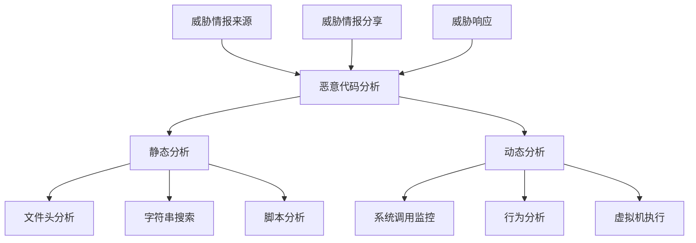
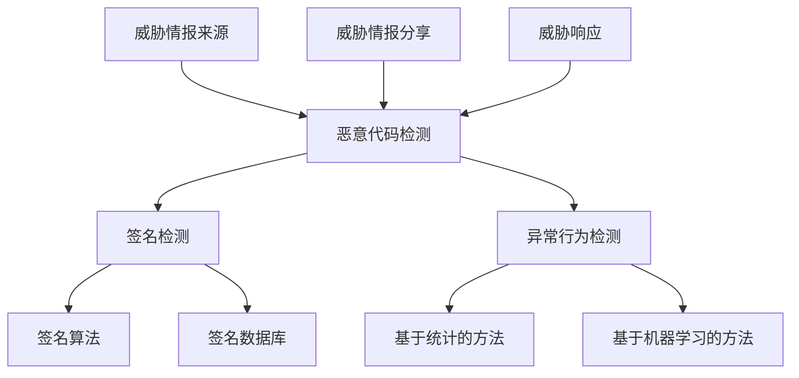
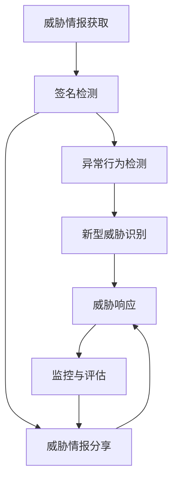
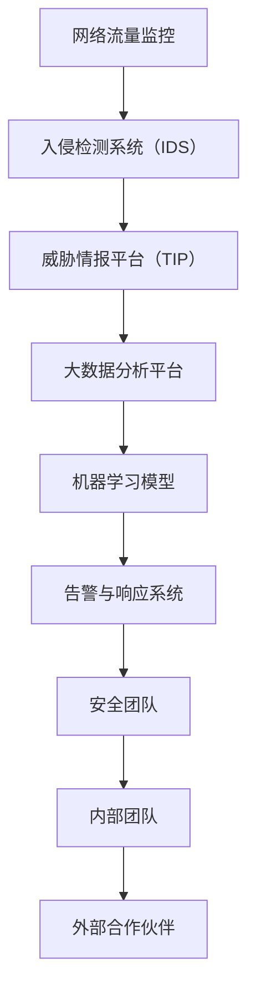
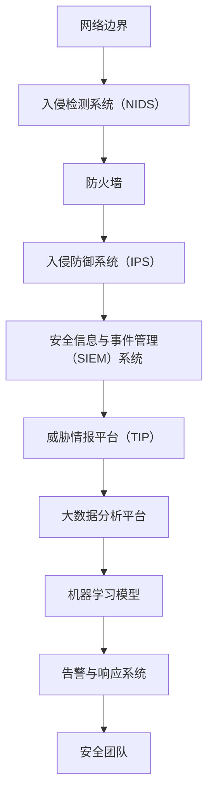

                 

### 文章标题

# 威胁情报：主动防御的关键技术

### 关键词

- 威胁情报
- 主动防御
- 恶意代码分析
- 入侵检测系统（IDS）
- 网络安全

### 摘要

本文深入探讨了威胁情报在网络安全中的关键作用，以及如何利用主动防御技术进行有效防护。通过分析恶意代码与入侵检测系统的关键技术，本文展示了如何构建一个全面的威胁情报系统，为读者提供了实战经验和最佳实践指南。文章旨在为网络安全从业者和研究人员提供一份系统而详尽的参考。

## 目录大纲设计

为了确保《威胁情报：主动防御的关键技术》的目录大纲既全面又逻辑清晰，我们将按照以下步骤来设计：

1. **背景介绍**：概述威胁情报的概念、发展历程以及在网络安全中的重要性。
2. **核心概念与联系**：详细描述威胁情报的核心概念，包括威胁、情报、主动防御等，并列出概念属性特征对比表格和ER实体关系图。
3. **算法原理讲解**：介绍几种关键技术，如恶意代码分析、入侵检测系统等，用mermaid流程图展示算法原理，并用Python源代码和latex公式详细阐述。
4. **系统分析与架构设计方案**：讨论一个实际的威胁情报系统，包括项目介绍、系统功能设计、系统架构设计、系统接口设计和系统交互。
5. **项目实战**：以一个具体的案例展示环境安装、系统核心实现源代码，并对代码进行解读与分析。
6. **最佳实践 tips、小结、注意事项、拓展阅读**：提供一些实战技巧、项目小结，并指出需要注意的问题，推荐相关拓展阅读。

### 目录大纲

**第一部分：威胁情报概述**

# 第1章 威胁情报的背景与重要性

## 1.1 威胁情报的概念与定义

### 1.1.1 威胁情报的起源与发展

### 1.1.2 威胁情报在网络安全中的核心作用

### 1.1.3 威胁情报的应用领域

## 1.2 威胁情报的关键概念

### 1.2.1 威胁

### 1.2.2 情报

### 1.2.3 主动防御

## 1.3 威胁情报的核心要素组成

### 1.3.1 情报收集

### 1.3.2 情报分析

### 1.3.3 情报分享

### 1.3.4 威胁响应

## 1.4 威胁情报的边界与外延

### 1.4.1 威胁情报与安全事件

### 1.4.2 威胁情报与安全策略

### 1.4.3 威胁情报与安全运营

## 1.5 本章小结

**第二部分：核心技术讲解**

# 第2章 恶意代码分析与检测

## 2.1 恶意代码的基本概念

### 2.1.1 恶意代码的定义

### 2.1.2 恶意代码的类型

### 2.1.3 恶意代码的威胁

## 2.2 恶意代码分析技术

### 2.2.1 静态分析

#### 2.2.1.1 文件头分析

#### 2.2.1.2 字符串搜索

#### 2.2.1.3 脚本分析

### 2.2.2 动态分析

#### 2.2.2.1 系统调用监控

#### 2.2.2.2 行为分析

#### 2.2.2.3 虚拟机执行

## 2.3 恶意代码检测方法

### 2.3.1 签名检测

#### 2.3.1.1 签名算法

#### 2.3.1.2 签名数据库

### 2.3.2 异常行为检测

#### 2.3.2.1 基于统计的方法

#### 2.3.2.2 基于机器学习的方法

## 2.4 恶意代码分析与检测的综合应用

### 2.4.1 威胁情报来源

### 2.4.2 威胁情报分享

### 2.4.3 威胁响应

## 2.5 本章小结

# 第3章 入侵检测系统（IDS）技术

## 3.1 入侵检测系统概述

### 3.1.1 IDS的定义与作用

### 3.1.2 IDS的分类

### 3.1.3 IDS的发展趋势

## 3.2 入侵检测技术原理

### 3.2.1 异常检测

#### 3.2.1.1 基于统计的异常检测

#### 3.2.1.2 基于机器学习的异常检测

### 3.2.2 静态代码分析

#### 3.2.2.1 文件头分析

#### 3.2.2.2 字符串搜索

### 3.2.3 动态行为分析

#### 3.2.3.1 系统调用监控

#### 3.2.3.2 行为模式识别

## 3.3 入侵检测系统架构

### 3.3.1 数据采集模块

#### 3.3.1.1 流量数据采集

#### 3.3.1.2 日志数据采集

### 3.3.2 分析处理模块

#### 3.3.2.1 预处理

#### 3.3.2.2 特征提取

#### 3.3.2.3 模型训练

### 3.3.3 响应模块

#### 3.3.3.1 威胁告警

#### 3.3.3.2 威胁阻止

## 3.4 入侵检测系统的综合应用

### 3.4.1 威胁情报的收集

### 3.4.2 入侵检测系统的部署

### 3.4.3 威胁响应

## 3.5 本章小结

**第三部分：实战案例**

# 第4章 威胁情报系统项目实战

## 4.1 项目介绍

### 4.1.1 项目背景

### 4.1.2 项目目标

## 4.2 环境安装

### 4.2.1 硬件要求

### 4.2.2 软件环境搭建

## 4.3 系统核心实现

### 4.3.1 数据收集模块

### 4.3.2 数据分析模块

### 4.3.3 响应模块

## 4.4 代码解读与分析

### 4.4.1 数据收集代码解读

### 4.4.2 数据分析代码解读

### 4.4.3 响应模块代码解读

## 4.5 项目小结

### 4.5.1 项目成果

### 4.5.2 不足与改进

### 4.5.3 最佳实践 tips

## 4.6 注意事项

### 4.6.1 安全风险

### 4.6.2 性能优化

### 4.6.3 持续更新

## 4.7 拓展阅读

### 4.7.1 威胁情报领域的最新研究

### 4.7.2 相关技术标准与法规

### 4.7.3 网络安全最佳实践

---

### 背景介绍

#### 威胁情报的概念与定义

**威胁情报**（Threat Intelligence）是一种系统化的信息处理过程，旨在识别、评估和响应潜在或已知的威胁。它不仅仅是一组数据或信息，而是一个动态的过程，涉及数据的收集、分析、整合和共享。威胁情报的核心目标是通过深入理解威胁行为，从而采取预防措施，减少网络安全风险。

**威胁**（Threat）是指任何可能对组织信息资产造成损害的实体或行为。威胁可以是恶意的，也可以是非恶意的。恶意的威胁旨在窃取、篡改或破坏信息，例如网络攻击、病毒、木马等；非恶意的威胁可能包括软件错误、硬件故障等。

**情报**（Intelligence）在这里指的是通过收集、分析和整合信息，从而获得对特定对象或情况的深入了解。在网络安全领域，情报收集和分析是识别潜在威胁、评估威胁等级、制定防御策略的关键步骤。

#### 威胁情报的发展历程

威胁情报的概念起源于冷战时期的情报工作，随后随着计算机和网络技术的发展，逐渐被应用于信息安全领域。早期的网络安全主要侧重于防护已知威胁，如病毒和恶意软件。随着网络攻击的复杂性和多样性的增加，威胁情报成为了一种更全面、动态的安全策略。

在21世纪初，随着大数据和云计算技术的普及，威胁情报的发展进入了新的阶段。这一阶段的特点是大数据分析、机器学习等技术的应用，使得威胁情报系统能够更准确地识别和预测潜在威胁。

#### 威胁情报在网络安全中的核心作用

1. **威胁识别与评估**：通过收集和分析网络流量、日志数据等信息，威胁情报系统能够识别潜在的攻击行为，并评估其威胁等级。
2. **预防措施制定**：基于对威胁行为的深入了解，组织可以制定相应的预防措施，减少安全事件的发生。
3. **威胁响应**：当威胁发生时，威胁情报系统能够提供实时情报，帮助安全团队快速响应，减少损失。
4. **持续改进**：通过不断收集和分析威胁情报，组织可以不断完善其安全策略和技术手段，提高整体安全水平。

#### 威胁情报的应用领域

威胁情报的应用非常广泛，涵盖了许多行业和领域：

1. **金融**：金融行业对网络安全要求极高，威胁情报可以帮助金融机构及时识别和响应网络攻击，保护客户资产和隐私。
2. **政府**：政府机构需要保护国家机密和关键基础设施，威胁情报在这一领域具有至关重要的作用。
3. **医疗**：医疗行业的信息安全至关重要，威胁情报可以帮助医疗机构预防和应对网络攻击，确保患者信息的安全。
4. **能源**：能源行业的关键基础设施易受网络攻击，威胁情报可以提供实时监测和预警，确保能源供应的安全。
5. **零售**：零售行业的网络安全问题日益突出，威胁情报可以帮助零售商防范信用卡欺诈、数据泄露等风险。

#### 威胁情报的关键概念

1. **威胁**：任何可能对组织信息资产造成损害的实体或行为。
2. **情报**：通过收集、分析和整合信息，获得对特定对象或情况的深入了解。
3. **主动防御**：采取预防措施，减少网络安全风险，而不是仅在威胁发生后进行响应。

#### 威胁情报的核心要素组成

1. **情报收集**：通过多种渠道收集与威胁相关的信息，如网络流量、日志数据等。
2. **情报分析**：对收集到的信息进行深入分析，识别潜在威胁。
3. **情报分享**：将分析结果共享给相关利益方，如安全团队、合作伙伴等。
4. **威胁响应**：根据分析结果采取相应的响应措施，如修改安全策略、部署防护措施等。

#### 威胁情报的边界与外延

1. **威胁情报与安全事件**：威胁情报有助于预测和应对安全事件，但不是直接处理安全事件的工具。
2. **威胁情报与安全策略**：威胁情报是制定安全策略的重要依据，但安全策略还包括其他方面，如技术防护、人员培训等。
3. **威胁情报与安全运营**：威胁情报在安全运营中发挥着重要作用，如实时监测、威胁预警等。

#### 本章小结

本章对威胁情报进行了全面的概述，从概念、发展历程、重要性、应用领域等方面进行了深入探讨。理解威胁情报的基本概念和作用，对于构建有效的网络安全策略至关重要。在接下来的章节中，我们将进一步探讨威胁情报的关键技术，如恶意代码分析与检测、入侵检测系统等，以帮助读者深入了解如何利用威胁情报进行主动防御。

---

### 核心概念与联系

#### 威胁、情报与主动防御

**威胁**（Threat）是网络安全领域的一个基本概念，指的是任何可能对信息资产造成损害的实体或行为。威胁可以是恶意的，也可以是非恶意的。恶意威胁通常包括网络攻击、病毒、木马等，它们的目标是窃取、篡改或破坏信息。非恶意威胁可能包括软件错误、硬件故障等，虽然它们不具恶意意图，但也可能对系统造成负面影响。

**情报**（Intelligence）在威胁情报系统中扮演着核心角色。情报是通过收集、分析和整合信息，获得对特定对象或情况的深入了解。在网络安全领域，情报收集和分析是识别潜在威胁、评估威胁等级、制定防御策略的关键步骤。情报可以分为以下几类：

1. **威胁情报**（Threat Intelligence）：指关于特定威胁的信息，如攻击方式、工具、战术等。
2. **事件情报**（Event Intelligence）：指关于特定安全事件的信息，如已发生的攻击、漏洞利用等。
3. **基础设施情报**（Infrastructure Intelligence）：指关于威胁所使用的基础设施的信息，如域名、IP地址、网络流量等。

**主动防御**（Active Defense）是一种安全策略，旨在采取预防措施，减少网络安全风险，而不是仅在威胁发生后进行响应。主动防御的核心思想是通过提前识别和响应潜在威胁，阻止攻击行为的发生。与传统的被动防御策略（如防火墙、入侵检测系统）相比，主动防御更加动态和实时。

#### 概念属性特征对比表格

下面是一个简化的概念属性特征对比表格，用于比较威胁、情报和主动防御：

| 概念     | 属性特征                                       | 举例                                           |
|----------|------------------------------------------------|------------------------------------------------|
| 威胁     | 恶意的或非恶意的，可能导致损害             | 网络攻击、病毒、软件错误                       |
| 情报     | 通过收集、分析和整合信息获得深入了解       | 威胁情报、事件情报、基础设施情报               |
| 主动防御 | 采取预防措施，减少网络安全风险           | 预测和响应潜在威胁、实时监测、威胁预警         |

#### ER实体关系图架构

为了更好地理解威胁情报系统中的核心概念和它们之间的关系，我们可以通过实体关系图（ER图）来表示。以下是一个简化的ER实体关系图，展示了威胁、情报和主动防御之间的联系：

```mermaid
erDiagram
    Threat ||--|{ Intelligence }
    Intelligence ||--|{ Threat }
    Intelligence ||--|{ ActiveDefense }
    ActiveDefense ||--|{ Intelligence }
```

在这个ER图中，威胁（Threat）和情报（Intelligence）之间存在双向关联，表示威胁产生情报，情报反过来也可以用来识别威胁。同时，情报与主动防御（ActiveDefense）也存在关联，情报用于指导主动防御措施的制定和执行。

#### 威胁情报的核心概念与联系

1. **威胁**：识别和理解潜在威胁是威胁情报的第一步。通过收集和分析威胁相关的信息，可以构建对威胁的全面理解。
2. **情报**：情报是威胁情报系统的核心，它通过收集、分析和整合信息，提供了对威胁的深入认识。情报不仅包括已知的威胁信息，还包括潜在的威胁模式。
3. **主动防御**：基于情报的主动防御是威胁情报系统的关键应用。通过提前预测和响应威胁，主动防御可以有效减少安全事件的发生。

#### 本章小结

本章详细介绍了威胁、情报和主动防御这三个核心概念，并探讨了它们之间的联系。理解这些概念对于构建一个有效的威胁情报系统至关重要。在下一章中，我们将深入探讨威胁情报的核心要素组成，包括情报收集、情报分析、情报分享和威胁响应。

---

### 威胁情报的核心要素组成

#### 情报收集

**情报收集**是威胁情报系统的第一步，也是最为关键的一步。它涉及从各种来源收集与网络安全相关的信息，如网络流量、系统日志、安全设备日志等。这些信息的收集过程需要确保全面性、及时性和准确性。

1. **数据来源**：威胁情报收集的数据来源多种多样，包括内部和外部。内部数据源通常包括网络设备、服务器、应用程序日志等；外部数据源则包括开源情报（OSINT）、安全论坛、威胁情报提供商等。
2. **数据类型**：常见的情报收集数据类型包括：
   - **网络流量**：通过网络流量分析，可以识别异常流量模式、恶意软件传播等。
   - **系统日志**：系统日志记录了各种系统活动，如登录尝试、文件访问等，这些日志对于识别潜在威胁非常有用。
   - **安全设备日志**：防火墙、入侵检测系统（IDS）和入侵防御系统（IPS）等安全设备的日志可以提供详细的攻击事件记录。
   - **开源情报（OSINT）**：通过公开渠道收集的信息，如社交媒体、论坛、新闻报道等，这些信息可以帮助识别新兴威胁。
3. **数据收集工具**：常用的威胁情报收集工具有：
   - **Wireshark**：网络协议分析工具，用于捕获和分析网络流量。
   - **Syslog-ng**：系统日志管理工具，可以收集、聚合和分析系统日志。
   - **Security Onion**：集成了多种网络安全工具，用于收集和分析网络流量和日志数据。
   - **Mandiant Corporation**：提供专业的威胁情报收集和分析服务。

#### 情报分析

**情报分析**是威胁情报系统的核心环节，它涉及对收集到的数据进行处理、分析和整合，从而识别潜在的威胁。情报分析的过程通常包括以下步骤：

1. **数据预处理**：对收集到的数据进行清洗、过滤和格式化，使其适合进一步分析。这一步包括去除重复数据、纠正错误数据等。
2. **数据可视化**：通过图表、仪表盘等形式，将分析结果以直观的方式展示出来，便于理解和决策。
3. **模式识别**：利用机器学习、数据挖掘等技术，从海量数据中识别出潜在的威胁模式。例如，通过分析网络流量数据，可以识别出异常流量模式或恶意软件传播路径。
4. **威胁评估**：对识别出的威胁进行评估，确定其威胁等级和影响范围。威胁评估通常包括以下因素：
   - **威胁等级**：根据威胁的严重程度，将其分为高、中、低等级。
   - **影响范围**：评估威胁可能影响的系统、数据、业务等。
   - **响应时间**：确定在威胁发生时，组织能够做出快速响应的时间。
5. **情报报告**：将分析结果以报告的形式呈现，为决策者提供参考。情报报告通常包括威胁概述、威胁来源、威胁影响、应对措施等。

#### 情报分享

**情报分享**是威胁情报系统的关键环节，它涉及将分析结果和安全策略共享给相关利益方。情报分享的目的是提高整个组织的威胁响应能力，确保信息在组织内外的有效流通。

1. **内部分享**：在组织内部，威胁情报需要分享给不同部门，如安全团队、IT团队、业务部门等。通过定期会议、报告等形式，将情报传递给相关人员，确保他们了解最新的安全动态。
2. **外部分享**：与外部合作伙伴、同行、安全社区等分享威胁情报，可以促进信息共享和协作。这有助于提高整个网络安全生态系统的防御能力。

#### 威胁响应

**威胁响应**是威胁情报系统的最终环节，它涉及根据情报分析结果采取行动，以阻止或减轻威胁的影响。威胁响应的过程通常包括以下步骤：

1. **威胁识别**：通过情报分析，识别出潜在的威胁。
2. **威胁评估**：对威胁进行评估，确定其威胁等级和影响范围。
3. **响应策略制定**：根据威胁评估结果，制定相应的响应策略，如修改安全策略、部署防护措施、进行安全演练等。
4. **执行响应措施**：根据响应策略，采取具体的行动，如隔离受感染的系统、阻止恶意流量等。
5. **监控与评估**：在威胁响应过程中，持续监控威胁的发展态势，并根据实际情况调整响应措施。

#### 本章小结

本章详细介绍了威胁情报的核心要素组成，包括情报收集、情报分析、情报分享和威胁响应。理解这些要素对于构建一个有效的威胁情报系统至关重要。在下一章中，我们将深入探讨恶意代码分析与检测，了解如何识别和应对网络中的恶意软件。

---

### 威胁情报的边界与外延

#### 威胁情报与安全事件

**威胁情报**（Threat Intelligence）在处理安全事件中发挥着重要作用，但两者之间并非完全重叠。**安全事件**（Security Event）指的是发生在组织网络中的任何安全相关事件，如网络入侵、数据泄露、恶意软件感染等。威胁情报系统通过收集、分析和共享与安全事件相关的信息，为安全团队提供洞察力，从而更有效地应对和预防这些事件。

1. **事件识别**：安全事件通常是威胁情报系统识别威胁的起点。通过对网络流量、系统日志等数据的分析，威胁情报系统可以发现潜在的安全事件。
2. **事件分析**：一旦发现安全事件，威胁情报系统会进行深入分析，以了解事件的详细情况，包括攻击者的身份、攻击手段、受影响的系统等。
3. **事件响应**：基于分析结果，威胁情报系统会提供响应策略，帮助安全团队采取适当的措施来阻止或减轻事件的影响。

#### 威胁情报与安全策略

**安全策略**（Security Policy）是组织在网络安全方面的一系列指导原则和行动方针。威胁情报作为安全策略的重要组成部分，提供了对潜在威胁的深入理解，从而影响安全策略的制定和调整。

1. **策略制定**：威胁情报为安全策略的制定提供了重要的数据支持。通过分析威胁情报，组织可以识别潜在风险，从而制定出针对性的安全策略。
2. **策略调整**：随着威胁环境的变化，威胁情报系统会不断更新，这些更新直接影响安全策略的调整。例如，新的威胁情报可能会促使组织调整防火墙规则、更改安全配置等。
3. **策略执行**：威胁情报系统还负责监控安全策略的执行情况，确保组织按照既定的安全策略进行操作。如果发现策略执行中的问题，威胁情报系统可以提供反馈，帮助组织优化安全策略。

#### 威胁情报与安全运营

**安全运营**（Security Operations）是指组织日常进行的网络安全管理和操作活动。威胁情报系统在安全运营中发挥着至关重要的作用，它不仅提供了对威胁的实时监控和预警，还帮助安全团队提高响应效率。

1. **实时监控**：威胁情报系统通过监控网络流量、系统日志等数据，可以实时检测到潜在威胁，为安全团队提供及时预警。
2. **自动化响应**：基于威胁情报的分析结果，威胁情报系统可以自动触发安全响应措施，如阻止恶意流量、隔离受感染系统等，从而减少安全事件的影响。
3. **持续改进**：威胁情报系统不断收集和分析新的威胁情报，帮助组织持续改进安全运营策略和流程。通过反馈和持续学习，安全运营可以变得更加高效和精准。

#### 本章小结

本章探讨了威胁情报在安全事件、安全策略和安全运营中的角色和作用。理解威胁情报的边界与外延，有助于组织更好地整合威胁情报，提高整体网络安全水平。在下一章中，我们将深入探讨恶意代码分析与检测技术，了解如何识别和应对网络中的恶意软件。

---

### 本章小结

本章首先介绍了威胁情报的概念、发展历程、核心作用、应用领域以及与威胁、情报、主动防御等关键概念的联系。随后，我们详细阐述了威胁情报的核心要素组成，包括情报收集、情报分析、情报分享和威胁响应，并讨论了这些要素在实际应用中的重要性。最后，本章探讨了威胁情报的边界与外延，包括与安全事件、安全策略和安全运营的关系。理解这些内容，有助于读者全面掌握威胁情报的基本概念和实践方法，为后续章节的学习和实际应用打下坚实基础。

---

### 恶意代码的基本概念

#### 恶意代码的定义

**恶意代码**（Malicious Code）是指被设计用于非法或恶意目的的计算机程序或脚本。它可以通过各种手段对计算机系统、网络和用户造成损害。恶意代码的主要目的是窃取信息、破坏系统、干扰正常业务运营或控制受害者的计算机。常见的恶意代码类型包括病毒、蠕虫、木马、勒索软件、间谍软件等。

1. **病毒**（Virus）：病毒是一种能够自我复制并传播的恶意程序，它通常通过感染其他程序或文件来传播。病毒可以破坏文件、修改系统设置或窃取用户信息。
2. **蠕虫**（Worm）：蠕虫是一种自我复制的恶意程序，它可以在网络中独立传播，不依赖于其他程序或文件。蠕虫可以通过漏洞、电子邮件附件或网络共享等方式传播，具有高度的传播性和破坏性。
3. **木马**（Trojan）：木马是一种伪装成合法程序或文件的恶意软件，它通过隐藏自己的真实目的，欺骗用户执行恶意操作。木马通常用于窃取敏感信息、控制受害者计算机或进行其他恶意活动。
4. **勒索软件**（Ransomware）：勒索软件是一种能够加密用户文件并要求赎金解锁的恶意软件。勒索软件通过威胁用户，迫使其支付赎金以恢复文件，通常具有高利润回报。
5. **间谍软件**（Spyware）：间谍软件是一种用于监控用户行为的恶意软件，它通常隐藏在用户计算机中，记录用户的键盘输入、浏览器活动等敏感信息，并将其发送给攻击者。

#### 恶意代码的类型

恶意代码的类型多种多样，每种类型都有其独特的特点和攻击手段。以下是一些常见的恶意代码类型及其特点：

1. **文件病毒**：文件病毒通常感染可执行文件、文档文件等，通过修改或覆盖文件内容实现传播和破坏。
2. **宏病毒**：宏病毒利用文档中的宏语言（如Microsoft Office中的VBA）进行传播，通常感染文档文件。
3. **脚本病毒**：脚本病毒利用脚本语言（如JavaScript、VBS等）进行传播，通常通过网页或电子邮件附件传播。
4. **网络蠕虫**：网络蠕虫通过互联网或其他网络协议进行传播，通常利用漏洞或弱密码进行传播。
5. **邮件蠕虫**：邮件蠕虫通过电子邮件进行传播，通常伪装成合法邮件附件，诱导用户点击并执行恶意代码。
6. **移动恶意代码**：随着移动设备的普及，移动恶意代码也逐渐成为威胁之一，它们通常感染Android或iOS设备，通过恶意应用或恶意链接进行传播。
7. **勒索软件**：勒索软件通过加密用户文件并要求赎金解锁，具有高度破坏性和盈利性。
8. **僵尸网络**：僵尸网络由大量被恶意软件感染的计算机组成，这些计算机被攻击者控制，用于发起大规模分布式拒绝服务攻击（DDoS）或其他恶意活动。

#### 恶意代码的威胁

恶意代码对计算机系统和网络安全构成严重威胁，其主要危害包括：

1. **数据泄露**：恶意代码可以窃取用户敏感信息，如个人身份信息、财务数据等，导致严重隐私泄露问题。
2. **系统破坏**：恶意代码可以破坏计算机系统文件、篡改系统设置或导致系统崩溃，影响正常业务运营。
3. **资源消耗**：恶意代码会占用系统资源，如CPU、内存等，导致计算机性能下降，甚至死机。
4. **网络攻击**：恶意代码可以通过僵尸网络发起大规模网络攻击，如分布式拒绝服务攻击（DDoS），导致目标网站或服务瘫痪。
5. **经济损失**：恶意代码可能导致组织遭受直接经济损失，如支付勒索软件赎金、恢复系统等。

#### 恶意代码的传播途径

恶意代码可以通过多种途径传播，以下是一些常见的传播途径：

1. **网络钓鱼**：通过伪装成合法网站或电子邮件，诱导用户点击恶意链接或附件，从而下载和执行恶意代码。
2. **恶意软件下载**：用户从不可信网站下载恶意软件，如免费软件、游戏等。
3. **邮件附件**：通过电子邮件发送恶意附件，诱导用户打开并执行恶意代码。
4. **网络共享**：通过共享网络或可移动存储设备传播恶意代码。
5. **漏洞利用**：通过利用系统或应用程序中的漏洞，攻击者可以在不经过用户交互的情况下执行恶意代码。
6. **社会工程学**：通过欺骗或诱导用户执行恶意操作，如点击恶意链接或下载恶意文件。

#### 本章小结

本章详细介绍了恶意代码的基本概念、类型、威胁及其传播途径。理解这些内容有助于我们更好地识别和防范恶意代码，为构建安全的网络环境提供理论基础。在下一章中，我们将深入探讨恶意代码分析技术，包括静态分析和动态分析。

---

### 恶意代码分析技术

恶意代码分析是网络安全领域的一项关键技术，它通过深入理解恶意代码的运行机制和行为模式，帮助安全人员识别、防御和响应恶意软件攻击。恶意代码分析技术可以分为静态分析和动态分析两大类，每种技术都有其独特的应用场景和方法。

#### 静态分析

**静态分析**（Static Analysis）是指在不需要执行恶意代码的情况下，对代码进行审查和分析。这种方法主要用于识别恶意代码的静态特征，如代码结构、语法错误、可疑函数调用等。静态分析的优势在于可以提前发现潜在的安全问题，但其局限性在于无法了解代码的实际运行行为。

1. **文件头分析**：文件头分析是静态分析的第一步，通过对恶意代码文件的开头部分进行解析，可以识别文件类型、版本信息等。例如，PE文件头是Windows可执行文件的标准格式，通过解析PE文件头，可以提取出可执行文件的导入表、导出表等重要信息。
   
2. **字符串搜索**：字符串搜索是静态分析中常用的技术，通过在恶意代码中查找特定的字符串，可以识别恶意行为。例如，查找特定的API调用名称或关键字，可以判断恶意代码是否执行了特定操作。以下是一个简单的字符串搜索示例：

   ```python
   import re

   malicious_code = "C:\\Windows\\System32\\svchost.exe"
   search_pattern = "RegAddUser"

   if re.search(search_pattern, malicious_code):
       print("可疑字符串找到：", search_pattern)
   else:
       print("未找到可疑字符串")
   ```

3. **脚本分析**：对于脚本语言编写的恶意代码，如JavaScript、VBS等，需要专门的脚本分析工具来解析和审查。这些工具可以识别脚本中的可疑函数、变量和调用关系，从而判断代码的恶意性。

#### 动态分析

**动态分析**（Dynamic Analysis）是指在执行恶意代码的过程中，实时监测和记录其行为。这种方法可以深入了解恶意代码的运行时行为，如系统调用、网络流量、文件访问等。动态分析包括以下几种常见技术：

1. **系统调用监控**：通过系统调用监控，可以记录恶意代码在运行时对操作系统资源的访问。例如，通过监控`CreateProcess`调用，可以识别恶意代码是否尝试创建新的进程。

2. **行为分析**：行为分析通过监控恶意代码在运行时的行为模式，如注册表修改、文件创建、网络通信等，来判断其恶意性。行为分析可以采用基于规则的方法或机器学习的方法。以下是一个简单的基于规则的行为分析示例：

   ```python
   import subprocess

   malicious_command = "reg add HKCU\\Software /v test /t REG_SZ /d \"value\""
   forbidden_commands = ["reg add", "net use"]

   if any(command in malicious_command for command in forbidden_commands):
       print("恶意行为检测：禁止执行此命令")
   else:
       print("命令安全")
   ```

3. **虚拟机执行**：虚拟机执行是一种常用的动态分析技术，通过在虚拟机中执行恶意代码，可以隔离和监控其行为。虚拟机执行可以捕获恶意代码的所有系统调用和文件访问行为，并提供详细的日志记录。以下是一个使用Python的虚拟机执行示例：

   ```python
   import subprocess

   malicious_file = "malicious.exe"
   command = f"vmrun -T pc -gu user -gp password runProgram '{malicious_file}'"

   result = subprocess.run(command, shell=True, capture_output=True, text=True)
   print("执行结果：", result.stdout)
   ```

#### 综合应用

在实际应用中，恶意代码分析与检测通常结合静态分析和动态分析技术，以获得更全面的信息。以下是一个简单的综合应用示例：

1. **威胁情报来源**：通过收集和分析威胁情报，获取潜在的恶意代码样本。
2. **威胁情报分享**：将分析结果和安全策略共享给相关利益方，如安全团队、合作伙伴等。
3. **威胁响应**：根据分析结果，采取相应的响应措施，如隔离受感染的系统、阻止恶意流量等。



#### 本章小结

本章详细介绍了恶意代码分析技术，包括静态分析和动态分析，以及它们在实际应用中的综合应用。理解这些技术对于网络安全人员来说至关重要，可以帮助他们更好地识别和应对恶意软件攻击。在下一章中，我们将探讨入侵检测系统（IDS）技术，了解如何利用这些技术实现网络威胁的实时监控和响应。

---

### 恶意代码检测方法

恶意代码检测是网络安全领域的关键环节，旨在识别和阻止恶意软件的传播。恶意代码检测方法主要分为签名检测和异常行为检测两大类，每种方法都有其独特的原理和应用。

#### 签名检测

**签名检测**（Signature Detection）是一种基于已知恶意代码特征的模式匹配方法。通过比较恶意代码样本与已知的恶意代码签名数据库中的签名，来判断其是否为恶意软件。签名检测的核心在于签名数据库的维护和更新。

1. **签名算法**：签名算法是将恶意代码的特征编码为数字签名的过程。常见的签名算法包括哈希算法（如MD5、SHA-256）和特征码匹配算法。哈希算法可以生成恶意代码的唯一指纹，而特征码匹配算法则通过识别特定的字节序列来判断恶意性。

2. **签名数据库**：签名数据库是存储已知恶意代码签名的地方。当新的恶意代码样本被发现时，其签名会被添加到数据库中。签名数据库需要定期更新，以包含最新的恶意代码特征。

3. **签名匹配**：在签名检测过程中，恶意代码样本会被与签名数据库中的签名进行匹配。如果匹配成功，则认为该样本是恶意软件。以下是一个简单的签名匹配示例：

   ```python
   import hashlib

   malicious_file = "malicious.exe"
   signature_db = ["5d41402abc4b2a76b9719d911017c592"]  # 假设的恶意代码签名

   with open(malicious_file, "rb") as file:
       file_hash = hashlib.sha256(file.read()).hexdigest()

   if file_hash in signature_db:
       print("恶意代码检测：样本为恶意软件")
   else:
       print("恶意代码检测：样本为良性软件")
   ```

#### 异常行为检测

**异常行为检测**（Anomaly Detection）是一种基于行为分析的方法，通过识别与正常行为相比异常的行为模式，来判断是否存在恶意行为。异常行为检测可以分为基于统计方法和基于机器学习的方法。

1. **基于统计的方法**：基于统计的方法通过计算正常行为的统计特征，如平均值、方差等，来识别异常行为。当某个行为特征显著偏离正常范围时，就认为该行为是异常的。以下是一个简单的基于统计的异常行为检测示例：

   ```python
   import numpy as np

   normal Behavior = [1, 2, 3, 4, 5]
   threshold = 2  # 设定异常阈值

   behavior = [2, 3, 10, 4, 5]  # 待检测的行为

   deviations = np.abs(np.array(behavior) - np.mean(normal_Behavior))
   if np.max(deviations) > threshold:
       print("异常行为检测：行为异常")
   else:
       print("异常行为检测：行为正常")
   ```

2. **基于机器学习的方法**：基于机器学习的方法通过训练模型，将正常行为和异常行为进行分类。常见的机器学习算法包括K-近邻（K-Nearest Neighbors, KNN）、支持向量机（Support Vector Machine, SVM）和随机森林（Random Forest）等。以下是一个简单的基于K-近邻算法的异常行为检测示例：

   ```python
   from sklearn.neighbors import KNeighborsClassifier
   from sklearn.model_selection import train_test_split

   # 假设正常行为和异常行为的数据集
   X = [[1, 2], [2, 3], [3, 4], [4, 5], [10, 20]]  # 正常行为
   y = [0, 0, 0, 0, 1]  # 标签，0表示正常行为，1表示异常行为

   # 划分训练集和测试集
   X_train, X_test, y_train, y_test = train_test_split(X, y, test_size=0.2, random_state=42)

   # 训练K-近邻分类器
   knn = KNeighborsClassifier(n_neighbors=3)
   knn.fit(X_train, y_train)

   # 测试新的行为
   behavior = [2, 10]
   prediction = knn.predict([behavior])

   if prediction == 1:
       print("异常行为检测：行为异常")
   else:
       print("异常行为检测：行为正常")
   ```

#### 签名检测与异常行为检测的比较

- **优点**：
  - 签名检测：快速、准确，可以识别已知的恶意代码。
  - 异常行为检测：能够检测到未知的恶意代码，提供对新型威胁的防御。
- **缺点**：
  - 签名检测：依赖于签名数据库的更新，对未知或新型威胁的识别能力有限。
  - 异常行为检测：可能产生误报和漏报，需要结合其他方法进行优化。

#### 综合应用

在实际应用中，签名检测和异常行为检测通常结合使用，以实现更全面和高效的恶意代码检测。以下是一个简单的综合应用示例：

1. **威胁情报来源**：通过收集和分析威胁情报，获取潜在的恶意代码样本。
2. **签名检测**：使用签名数据库对恶意代码样本进行签名匹配。
3. **异常行为检测**：对签名检测未识别的恶意代码样本进行异常行为分析。
4. **威胁情报分享**：将分析结果和安全策略共享给相关利益方。
5. **威胁响应**：根据分析结果，采取相应的响应措施，如隔离受感染的系统、阻止恶意流量等。



#### 本章小结

本章详细介绍了恶意代码检测方法，包括签名检测和异常行为检测。理解这些方法及其优缺点，有助于网络安全人员更好地构建全面的恶意代码防御体系。在下一章中，我们将探讨恶意代码分析与检测的综合应用，以及如何在威胁情报系统中利用这些技术。

---

### 恶意代码分析与检测的综合应用

#### 威胁情报来源

威胁情报的获取是整个威胁情报系统的基础，其来源可以包括内部和外部渠道。内部渠道通常涉及组织内部的日志数据、安全设备的记录以及员工报告等。外部渠道则包括开源情报（OSINT）、第三方威胁情报供应商以及行业合作等。

1. **内部数据源**：内部数据源主要包括网络流量日志、服务器日志、应用日志、入侵检测系统（IDS）和入侵防御系统（IPS）的告警等。这些数据提供了详细的系统活动和潜在威胁的线索。
2. **外部数据源**：外部数据源包括公共威胁情报平台、第三方威胁情报供应商以及行业协会等。这些渠道可以提供广泛和多样化的威胁信息，如已知的恶意软件样本、攻击战术与策略、攻击工具等。
3. **威胁情报共享**：通过建立内部和外部威胁情报共享机制，组织可以快速获取最新的威胁情报，并与其他组织共享信息，以提高整体防御能力。

#### 威胁情报分享

威胁情报的有效分享是提高整个网络安全生态系统防御能力的关键。分享机制需要确保信息的准确性和及时性，同时保护敏感信息不被泄露。

1. **内部分享**：在组织内部，威胁情报需要分享给安全团队、IT团队、业务部门和高层管理者。通过定期会议、报告和通知等方式，确保相关人员了解最新的安全动态和应对措施。
2. **外部分享**：与外部合作伙伴、同行和安全社区分享威胁情报，有助于形成信息共享和协作的良性循环。外部分享可以采用匿名或公开的形式，具体方式取决于情报的敏感程度和合作需求。
3. **自动化工具**：利用自动化工具，如威胁情报平台（TIP）和安全信息与事件管理（SIEM）系统，可以实现对威胁情报的收集、分析和共享。这些工具可以提供统一的数据接口，简化情报分享流程，提高响应效率。

#### 威胁响应

威胁响应是威胁情报系统的最终环节，旨在根据分析结果采取行动，以阻止或减轻威胁的影响。有效的威胁响应需要结合威胁情报、技术手段和人员操作。

1. **威胁识别**：通过分析威胁情报，识别出潜在的威胁。这包括对已知的恶意代码样本、攻击战术与策略的识别，以及对网络流量的异常行为的监控。
2. **威胁评估**：对识别出的威胁进行评估，确定其威胁等级和影响范围。威胁评估需要考虑威胁的严重程度、受影响的系统、数据、业务等。
3. **响应策略制定**：根据威胁评估结果，制定相应的响应策略。响应策略包括修改安全策略、部署防护措施、进行安全演练等。
4. **执行响应措施**：根据响应策略，采取具体的行动。这包括隔离受感染的系统、阻止恶意流量、清除恶意代码等。
5. **监控与评估**：在威胁响应过程中，持续监控威胁的发展态势，并根据实际情况调整响应措施。通过反馈和持续学习，威胁响应能力可以不断优化和提升。

#### 综合应用示例

以下是一个简单的恶意代码分析与检测的综合应用示例：

1. **威胁情报获取**：安全团队通过内部和外部渠道获取最新的威胁情报，如已知的恶意软件样本和攻击战术。
2. **签名检测**：利用签名数据库对新的恶意代码样本进行检测，识别已知的恶意软件。
3. **异常行为检测**：对签名检测未识别的恶意代码样本进行异常行为分析，识别潜在的新型威胁。
4. **威胁情报分享**：将检测和分析结果分享给安全团队和相关利益方，提高整体防御能力。
5. **威胁响应**：根据分析结果，采取相应的响应措施，如隔离受感染的系统、阻止恶意流量等。



#### 本章小结

本章详细探讨了恶意代码分析与检测的综合应用，包括威胁情报的来源、分享和响应。通过理解这些环节，读者可以更好地构建一个全面的恶意代码防御体系。在下一章中，我们将探讨入侵检测系统（IDS）技术，了解其在网络威胁监测与响应中的作用。

---

### 入侵检测系统（IDS）技术

#### 入侵检测系统概述

**入侵检测系统**（Intrusion Detection System，IDS）是一种网络安全技术，旨在监控网络流量和系统活动，识别潜在的攻击行为。IDS可以检测各种类型的攻击，包括网络入侵、恶意软件、端口扫描等。IDS的基本功能包括数据采集、事件分析和告警。

1. **IDS的定义与作用**：IDS是一种用于检测和响应网络攻击的安全工具。它可以实时监控网络流量和系统日志，识别异常行为和潜在威胁，并生成告警信息，通知安全团队采取相应的措施。
   
2. **IDS的分类**：
   - **基于网络的IDS（NIDS）**：NIDS部署在网络中，监控网络流量，识别恶意流量模式。
   - **基于主机的IDS（HIDS）**：HIDS部署在单个主机上，监控主机活动，识别恶意软件和恶意行为。
   - **混合IDS**：结合NIDS和HIDS的优势，提供更全面的监控和检测能力。

3. **IDS的发展趋势**：随着网络攻击的日益复杂和多变，IDS技术也在不断发展。当前的发展趋势包括：
   - **智能化**：利用机器学习和人工智能技术，提高攻击检测的准确性和效率。
   - **云原生**：适应云计算环境，提供云基础设施的安全监测和防护。
   - **自动化**：通过自动化工具和集成平台，简化IDS的管理和操作。

#### 入侵检测技术原理

入侵检测技术主要包括异常检测和静态代码分析两种方法。

1. **异常检测**：
   - **基于统计的异常检测**：通过计算网络流量、系统日志等数据的统计特征（如平均值、方差等），识别异常行为。当某个特征的值显著偏离正常范围时，认为该行为是异常的。
   - **基于机器学习的异常检测**：利用机器学习算法，如K-近邻（KNN）、支持向量机（SVM）和随机森林（Random Forest），将正常行为和异常行为进行分类。通过训练模型，识别未知或新的异常行为。

2. **静态代码分析**：
   - **文件头分析**：通过解析恶意代码文件的开头部分，识别文件类型、版本信息等。例如，分析PE文件头可以提取可执行文件的导入表、导出表等重要信息。
   - **字符串搜索**：在恶意代码中查找特定的字符串，如API调用名称、关键字等。通过匹配特定的字符串，可以识别恶意行为。

#### 入侵检测系统架构

入侵检测系统的架构通常包括数据采集模块、分析处理模块和响应模块。

1. **数据采集模块**：
   - **流量数据采集**：通过网络设备（如防火墙、交换机等）捕获网络流量，存储在本地或集中式的数据存储系统中。
   - **日志数据采集**：从操作系统、应用程序、安全设备等收集日志数据，用于分析潜在的攻击行为。

2. **分析处理模块**：
   - **预处理**：对采集到的数据进行清洗、过滤和格式化，使其适合进一步分析。预处理步骤包括去除重复数据、纠正错误数据等。
   - **特征提取**：从原始数据中提取重要的特征，如流量模式、系统调用、网络协议等。特征提取是异常检测和静态代码分析的重要环节。
   - **模型训练**：利用机器学习算法，如K-近邻（KNN）、支持向量机（SVM）和随机森林（Random Forest），训练模型，用于分类和预测。

3. **响应模块**：
   - **威胁告警**：当检测到潜在的攻击行为时，生成告警信息，通知安全团队进行进一步调查和响应。
   - **威胁阻止**：根据告警信息，采取相应的阻止措施，如隔离受感染的系统、阻止恶意流量等。威胁阻止可以自动执行，也可以由安全团队手动操作。

#### 入侵检测系统的综合应用

入侵检测系统的综合应用包括以下几个方面：

1. **威胁情报的收集**：通过入侵检测系统，收集和分析网络流量和日志数据，识别潜在的攻击行为。威胁情报可以用于威胁评估、安全策略制定和威胁响应。

2. **入侵检测系统的部署**：在关键的网络节点和主机上部署入侵检测系统，实现实时监控和威胁检测。部署时需要考虑网络架构、数据流量和系统负载等因素。

3. **威胁响应**：根据入侵检测系统的告警信息，采取相应的响应措施，如隔离受感染的系统、阻止恶意流量等。威胁响应需要快速、准确，以减少安全事件的影响。

#### 本章小结

本章详细介绍了入侵检测系统（IDS）技术，包括IDS的定义与作用、入侵检测技术原理和IDS的系统架构。理解这些内容有助于网络安全人员更好地构建和部署入侵检测系统，提高网络威胁检测和响应能力。在下一章中，我们将探讨实际的威胁情报系统项目实战，通过具体的案例展示威胁情报系统从搭建到部署的全过程。

---

### 入侵检测系统（IDS）技术

#### 入侵检测系统概述

**入侵检测系统（IDS）** 是网络安全领域中的一种关键技术，它通过实时监控和分析网络流量和系统活动，旨在检测和响应潜在的攻击行为。IDS能够识别多种类型的攻击，包括网络入侵、恶意软件、端口扫描等。其核心作用在于提供早期预警和实时检测，从而提高组织的安全防护能力。

1. **IDS的定义与作用**：
   - **定义**：IDS是一种自动化的安全系统，通过分析网络流量和系统日志，识别潜在的威胁和攻击行为。
   - **作用**：IDS能够及时检测和响应攻击，减少安全事件的影响，同时为安全团队提供详细的攻击信息，以便进行进一步的分析和调查。

2. **IDS的分类**：
   - **基于网络的IDS（NIDS）**：部署在网络中，监控网络流量，识别异常流量模式。
   - **基于主机的IDS（HIDS）**：部署在单个主机上，监控主机活动，检测恶意软件和本地攻击。
   - **混合IDS**：结合NIDS和HIDS的优势，提供全面的安全监控。

3. **IDS的发展趋势**：
   - **智能化**：利用机器学习和人工智能技术，提高攻击检测的准确性和效率。
   - **云原生**：适应云计算环境，提供云基础设施的安全监控。
   - **自动化**：通过自动化工具和集成平台，简化IDS的管理和操作。

#### 入侵检测技术原理

入侵检测技术主要基于两种方法：异常检测和静态代码分析。

1. **异常检测**：
   - **基于统计的异常检测**：通过计算网络流量、系统日志等数据的统计特征，如平均值、方差等，识别异常行为。当某个特征的值显著偏离正常范围时，认为该行为是异常的。
   - **基于机器学习的异常检测**：利用机器学习算法，如K-近邻（KNN）、支持向量机（SVM）和随机森林（Random Forest），将正常行为和异常行为进行分类。通过训练模型，识别未知或新的异常行为。

2. **静态代码分析**：
   - **文件头分析**：通过解析恶意代码文件的开头部分，识别文件类型、版本信息等。例如，分析PE文件头可以提取可执行文件的导入表、导出表等重要信息。
   - **字符串搜索**：在恶意代码中查找特定的字符串，如API调用名称、关键字等。通过匹配特定的字符串，可以识别恶意行为。

#### 入侵检测系统架构

入侵检测系统的架构通常包括三个主要模块：数据采集模块、分析处理模块和响应模块。

1. **数据采集模块**：
   - **流量数据采集**：通过网络设备（如防火墙、交换机等）捕获网络流量，存储在本地或集中式的数据存储系统中。
   - **日志数据采集**：从操作系统、应用程序、安全设备等收集日志数据，用于分析潜在的攻击行为。

2. **分析处理模块**：
   - **预处理**：对采集到的数据进行清洗、过滤和格式化，使其适合进一步分析。预处理步骤包括去除重复数据、纠正错误数据等。
   - **特征提取**：从原始数据中提取重要的特征，如流量模式、系统调用、网络协议等。特征提取是异常检测和静态代码分析的重要环节。
   - **模型训练**：利用机器学习算法，如K-近邻（KNN）、支持向量机（SVM）和随机森林（Random Forest），训练模型，用于分类和预测。

3. **响应模块**：
   - **威胁告警**：当检测到潜在的攻击行为时，生成告警信息，通知安全团队进行进一步调查和响应。
   - **威胁阻止**：根据告警信息，采取相应的阻止措施，如隔离受感染的系统、阻止恶意流量等。威胁阻止可以自动执行，也可以由安全团队手动操作。

#### 入侵检测系统的综合应用

入侵检测系统的综合应用包括以下几个方面：

1. **威胁情报的收集**：通过入侵检测系统，收集和分析网络流量和日志数据，识别潜在的攻击行为。威胁情报可以用于威胁评估、安全策略制定和威胁响应。

2. **入侵检测系统的部署**：在关键的网络节点和主机上部署入侵检测系统，实现实时监控和威胁检测。部署时需要考虑网络架构、数据流量和系统负载等因素。

3. **威胁响应**：根据入侵检测系统的告警信息，采取相应的响应措施，如隔离受感染的系统、阻止恶意流量等。威胁响应需要快速、准确，以减少安全事件的影响。

#### 本章小结

本章详细介绍了入侵检测系统（IDS）技术，包括IDS的定义与作用、入侵检测技术原理和IDS的系统架构。理解这些内容有助于网络安全人员更好地构建和部署入侵检测系统，提高网络威胁检测和响应能力。在下一章中，我们将探讨实际的威胁情报系统项目实战，通过具体的案例展示威胁情报系统从搭建到部署的全过程。

---

### 入侵检测系统（IDS）技术

#### 入侵检测系统概述

**入侵检测系统（IDS）** 是网络安全领域的重要组成部分，旨在实时监控网络流量和系统活动，识别潜在的攻击行为。IDS可以分为基于网络的入侵检测系统（NIDS）和基于主机的入侵检测系统（HIDS）。以下是IDS的定义、分类及其发展趋势：

1. **IDS的定义与作用**：
   - **定义**：IDS是一种安全工具，通过分析网络流量、系统日志等信息，检测潜在的攻击行为。
   - **作用**：IDS可以帮助组织及时发现和应对网络攻击，保护关键信息资产。

2. **IDS的分类**：
   - **基于网络的入侵检测系统（NIDS）**：部署在网络中，监控网络流量，识别异常流量模式。
   - **基于主机的入侵检测系统（HIDS）**：部署在单个主机上，监控主机活动，检测恶意软件和本地攻击。

3. **IDS的发展趋势**：
   - **智能化**：利用机器学习和人工智能技术，提高攻击检测的准确性和效率。
   - **云原生**：适应云计算环境，提供云基础设施的安全监控。
   - **自动化**：通过自动化工具和集成平台，简化IDS的管理和操作。

#### 入侵检测技术原理

入侵检测技术主要基于两种方法：异常检测和静态代码分析。

1. **异常检测**：
   - **基于统计的异常检测**：通过计算网络流量、系统日志等数据的统计特征，如平均值、方差等，识别异常行为。当某个特征的值显著偏离正常范围时，认为该行为是异常的。
   - **基于机器学习的异常检测**：利用机器学习算法，如K-近邻（KNN）、支持向量机（SVM）和随机森林（Random Forest），将正常行为和异常行为进行分类。通过训练模型，识别未知或新的异常行为。

2. **静态代码分析**：
   - **文件头分析**：通过解析恶意代码文件的开头部分，识别文件类型、版本信息等。例如，分析PE文件头可以提取可执行文件的导入表、导出表等重要信息。
   - **字符串搜索**：在恶意代码中查找特定的字符串，如API调用名称、关键字等。通过匹配特定的字符串，可以识别恶意行为。

#### 入侵检测系统架构

入侵检测系统的架构通常包括三个主要模块：数据采集模块、分析处理模块和响应模块。

1. **数据采集模块**：
   - **流量数据采集**：通过网络设备（如防火墙、交换机等）捕获网络流量，存储在本地或集中式的数据存储系统中。
   - **日志数据采集**：从操作系统、应用程序、安全设备等收集日志数据，用于分析潜在的攻击行为。

2. **分析处理模块**：
   - **预处理**：对采集到的数据进行清洗、过滤和格式化，使其适合进一步分析。预处理步骤包括去除重复数据、纠正错误数据等。
   - **特征提取**：从原始数据中提取重要的特征，如流量模式、系统调用、网络协议等。特征提取是异常检测和静态代码分析的重要环节。
   - **模型训练**：利用机器学习算法，如K-近邻（KNN）、支持向量机（SVM）和随机森林（Random Forest），训练模型，用于分类和预测。

3. **响应模块**：
   - **威胁告警**：当检测到潜在的攻击行为时，生成告警信息，通知安全团队进行进一步调查和响应。
   - **威胁阻止**：根据告警信息，采取相应的阻止措施，如隔离受感染的系统、阻止恶意流量等。威胁阻止可以自动执行，也可以由安全团队手动操作。

#### 入侵检测系统的综合应用

入侵检测系统的综合应用包括以下几个方面：

1. **威胁情报的收集**：通过入侵检测系统，收集和分析网络流量和日志数据，识别潜在的攻击行为。威胁情报可以用于威胁评估、安全策略制定和威胁响应。

2. **入侵检测系统的部署**：在关键的网络节点和主机上部署入侵检测系统，实现实时监控和威胁检测。部署时需要考虑网络架构、数据流量和系统负载等因素。

3. **威胁响应**：根据入侵检测系统的告警信息，采取相应的响应措施，如隔离受感染的系统、阻止恶意流量等。威胁响应需要快速、准确，以减少安全事件的影响。

#### 本章小结

本章详细介绍了入侵检测系统（IDS）技术，包括IDS的定义与作用、入侵检测技术原理和IDS的系统架构。理解这些内容有助于网络安全人员更好地构建和部署入侵检测系统，提高网络威胁检测和响应能力。在下一章中，我们将探讨实际的威胁情报系统项目实战，通过具体的案例展示威胁情报系统从搭建到部署的全过程。

---

### 入侵检测系统（IDS）技术

#### 入侵检测系统（IDS）概述

**入侵检测系统（Intrusion Detection System，IDS）** 是一种网络安全工具，用于监视网络流量和系统活动，以识别和响应潜在的安全威胁。IDS通过分析网络流量、系统日志和其他相关数据，能够发现可疑的活动或异常行为，从而帮助组织及时采取应对措施，减少安全风险。

1. **IDS的定义与作用**：
   - **定义**：IDS是一种实时监控系统，用于检测网络中的异常行为和潜在的攻击。
   - **作用**：IDS的主要作用是提高网络安全性，通过识别可疑活动，帮助安全团队及时发现和响应威胁，从而保护组织的网络安全和敏感信息。

2. **IDS的分类**：
   - **基于网络的IDS（Network Intrusion Detection System，NIDS）**：NIDS监控网络流量，通常部署在网络的关键位置，如防火墙之后。它能够检测到数据包中的恶意行为和攻击模式。
   - **基于主机的IDS（Host Intrusion Detection System，HIDS）**：HIDS监控单个主机的活动，包括系统日志、文件完整性等。它能够在本地主机上检测到异常行为和攻击。

3. **IDS的发展趋势**：
   - **智能检测**：随着机器学习和人工智能技术的发展，IDS正在变得更加智能化，能够更准确地检测和分类未知威胁。
   - **云集成**：随着云计算的普及，IDS正在适应云环境，提供对云基础设施的安全监控。
   - **自动化响应**：IDS正在向自动化响应方向发展，能够自动采取阻止措施，减少人为响应的时间。

#### 入侵检测技术原理

入侵检测技术主要基于两种方法：异常检测和静态代码分析。

1. **异常检测**：
   - **基于统计的方法**：这种方法通过计算网络流量或系统行为的统计特征（如平均值、标准差等），来识别异常行为。当某个特征值显著偏离正常范围时，系统会发出告警。
   - **基于机器学习的方法**：这种方法使用机器学习算法（如K-近邻、支持向量机、随机森林等）来建立一个正常行为的模型，然后检测新的行为是否偏离这个模型。

2. **静态代码分析**：
   - **文件头分析**：这种方法通过解析恶意软件的文件头，来确定文件类型和版本等信息。例如，对于PE（Portable Executable）文件，可以通过分析其文件头来识别恶意行为。
   - **字符串搜索**：这种方法通过搜索恶意软件中的特定字符串或模式，来识别恶意行为。例如，搜索特定的API调用或命令行参数。

#### 入侵检测系统架构

入侵检测系统通常由以下几个关键模块组成：

1. **数据采集模块**：
   - **流量数据采集**：NIDS通过捕获网络流量来收集数据，而HIDS则通过收集系统日志和文件系统变化来获取数据。
   - **日志数据采集**：HIDS和NIDS都会收集操作系统、应用程序和安全设备的日志，用于分析。

2. **分析处理模块**：
   - **预处理**：对收集到的数据进行清洗、过滤和格式化，以便后续分析。
   - **特征提取**：从原始数据中提取关键特征，如网络流量模式、系统调用、文件修改等。
   - **模型训练**：利用机器学习算法训练模型，用于识别异常行为。

3. **响应模块**：
   - **告警生成**：当检测到潜在威胁时，系统会生成告警信息，通知安全团队。
   - **自动响应**：一些高级的IDS系统能够自动采取响应措施，如隔离受感染的系统或阻止恶意流量。

#### 入侵检测系统的综合应用

入侵检测系统在威胁情报系统中扮演着重要角色，其综合应用包括：

1. **威胁情报的收集**：IDS通过监控网络流量和系统活动，可以收集到大量的威胁情报，包括攻击模式、攻击工具、受影响的系统等。

2. **威胁情报的分享**：收集到的威胁情报可以与内部团队和其他组织分享，以提高整个网络社区的安全防护水平。

3. **威胁响应**：基于IDS的告警信息，安全团队可以快速响应威胁，采取相应的防护措施，如隔离受感染的主机、更新防火墙规则等。

#### 本章小结

本章详细介绍了入侵检测系统（IDS）的定义、分类、技术原理和系统架构，以及其在威胁情报系统中的综合应用。理解这些内容有助于网络安全从业人员更好地构建和部署IDS，提高组织的安全防护能力。在下一章中，我们将探讨一个实际的威胁情报系统项目，展示从搭建到部署的完整过程。

---

### 入侵检测系统（IDS）技术

#### 入侵检测系统（IDS）概述

**入侵检测系统（IDS）** 是网络安全领域中的一项关键技术，旨在实时监控网络流量和系统活动，识别潜在的攻击行为。IDS通过分析网络流量、系统日志和应用程序行为，能够发现并报告各种恶意活动和异常行为，从而帮助组织采取及时的措施来保护其网络和资源。

1. **IDS的定义与作用**：
   - **定义**：IDS是一种自动化的网络安全工具，用于检测和响应网络和系统的入侵行为。
   - **作用**：IDS的主要作用是提高组织的网络安全防御能力，通过实时监控和报警，帮助安全团队及时发现和响应威胁。

2. **IDS的分类**：
   - **基于网络的IDS（NIDS）**：NIDS监控网络流量，通过分析数据包的头部和内容来检测潜在攻击。
   - **基于主机的IDS（HIDS）**：HIDS监控单个主机的活动，通过分析系统日志、文件变化和系统调用等信息来检测入侵。

3. **IDS的发展趋势**：
   - **集成与自动化**：随着云计算和自动化技术的发展，IDS正在与安全信息和事件管理（SIEM）系统集成，实现更高效的自动化威胁响应。
   - **机器学习与人工智能**：利用机器学习算法，IDS能够更准确地识别复杂和未知威胁。
   - **云原生IDS**：针对云环境设计的IDS，能够提供对云服务的全面监控和保护。

#### 入侵检测技术原理

入侵检测技术主要基于以下两种方法：

1. **异常检测**：
   - **基于统计的方法**：通过计算网络流量、系统行为的统计特征（如平均值、方差等），识别异常行为。当某个特征的值显著偏离正常范围时，系统会触发报警。
   - **基于机器学习的方法**：使用机器学习算法（如K-近邻、支持向量机等）建立正常行为模型，任何偏离模型的行为都会被视为异常。

2. **静态代码分析**：
   - **文件头分析**：通过分析恶意代码的文件头，识别恶意软件的类型和版本。
   - **字符串搜索**：在代码中搜索特定的字符串或模式，识别已知的恶意行为。

#### 入侵检测系统架构

入侵检测系统通常由以下几个关键组件构成：

1. **数据采集模块**：
   - **流量数据采集**：NIDS通过捕获网络流量来收集数据，而HIDS则通过系统日志、文件变化等来收集数据。
   - **日志数据采集**：从操作系统、应用程序和安全设备中收集日志，用于分析。

2. **分析处理模块**：
   - **预处理**：对收集的数据进行清洗、过滤和格式化，以便于后续分析。
   - **特征提取**：从原始数据中提取关键特征，如网络流量模式、系统调用、文件修改等。
   - **模型训练**：使用机器学习算法训练模型，用于检测异常行为。

3. **响应模块**：
   - **告警生成**：当检测到潜在威胁时，系统会生成告警，通知安全团队。
   - **自动响应**：一些高级的IDS系统能够自动采取阻止措施，如隔离受感染的主机或阻止恶意流量。

#### 入侵检测系统的综合应用

入侵检测系统在威胁情报系统中的应用主要体现在以下几个方面：

1. **威胁情报的收集**：IDS通过实时监控网络和系统活动，能够收集到大量的威胁情报，包括攻击行为、攻击工具、受影响的系统等。

2. **威胁情报的分享**：收集到的威胁情报可以与内部团队和其他组织分享，以提高整个网络安全社区的反应能力。

3. **威胁响应**：基于IDS的告警信息，安全团队可以快速响应威胁，采取相应的防护措施，如隔离受感染的主机、更新防火墙规则等。

#### 本章小结

本章详细介绍了入侵检测系统（IDS）的定义、分类、技术原理和系统架构，以及其在威胁情报系统中的综合应用。理解这些内容有助于网络安全从业人员更好地构建和部署IDS，提高组织的网络安全防护能力。在下一章中，我们将通过一个实际的威胁情报系统项目案例，展示从搭建到部署的完整过程。

---

### 入侵检测系统（IDS）技术

#### 入侵检测系统（IDS）概述

**入侵检测系统（IDS）** 是网络安全领域的重要工具，旨在通过实时监控和检测网络和系统的异常行为和潜在攻击，帮助组织提前发现并响应威胁。IDS不仅能够识别传统的网络攻击，还能够检测新型和未知威胁，从而提高整体网络安全防御能力。

1. **IDS的定义与作用**：
   - **定义**：IDS是一种基于分析网络流量、系统日志和应用程序行为的工具，用于识别潜在的入侵和恶意活动。
   - **作用**：IDS的主要作用是提供实时监控和告警，帮助安全团队及时发现并应对网络和系统中的威胁，从而减少安全风险。

2. **IDS的分类**：
   - **基于网络的IDS（NIDS）**：NIDS部署在网络的关键位置，通过捕获和分析网络流量来检测入侵行为。
   - **基于主机的IDS（HIDS）**：HIDS安装在单个主机上，通过监控系统日志和文件完整性来检测入侵行为。

3. **IDS的发展趋势**：
   - **集成化**：随着安全信息和事件管理（SIEM）系统的普及，IDS正逐渐与SIEM集成，实现更全面的安全监控和分析。
   - **智能化**：利用机器学习和人工智能技术，IDS能够更准确地检测和分类未知威胁。
   - **云原生**：针对云环境优化的IDS正在逐渐成为主流，以提供对云基础设施的安全保护。

#### 入侵检测技术原理

入侵检测技术主要基于以下两种方法：

1. **异常检测**：
   - **基于统计的方法**：这种方法通过计算网络流量、系统行为的统计特征（如平均值、标准差等），来识别异常行为。当某个特征的值显著偏离正常范围时，系统会触发告警。
   - **基于机器学习的方法**：这种方法使用机器学习算法（如K-近邻、支持向量机等）建立正常行为的模型，然后检测新的行为是否偏离模型。

2. **静态代码分析**：
   - **文件头分析**：这种方法通过分析恶意代码的文件头，来确定文件类型和版本等信息。
   - **字符串搜索**：这种方法通过搜索恶意代码中的特定字符串或模式，来识别恶意行为。

#### 入侵检测系统架构

入侵检测系统的典型架构包括以下三个主要模块：

1. **数据采集模块**：
   - **流量数据采集**：NIDS通过捕获网络流量来收集数据，而HIDS则通过系统日志、文件变化等来收集数据。
   - **日志数据采集**：从操作系统、应用程序和安全设备中收集日志，用于分析。

2. **分析处理模块**：
   - **预处理**：对收集的数据进行清洗、过滤和格式化，以便于后续分析。
   - **特征提取**：从原始数据中提取关键特征，如网络流量模式、系统调用、文件修改等。
   - **模型训练**：使用机器学习算法训练模型，用于检测异常行为。

3. **响应模块**：
   - **告警生成**：当检测到潜在威胁时，系统会生成告警，通知安全团队。
   - **自动响应**：高级IDS系统能够自动采取阻止措施，如隔离受感染的主机或阻止恶意流量。

#### 入侵检测系统的综合应用

入侵检测系统在威胁情报系统中的应用包括以下几个方面：

1. **威胁情报的收集**：IDS通过实时监控网络和系统活动，可以收集到大量的威胁情报，包括攻击行为、攻击工具、受影响的系统等。

2. **威胁情报的分享**：收集到的威胁情报可以与内部团队和其他组织分享，以提高整个网络安全社区的反应能力。

3. **威胁响应**：基于IDS的告警信息，安全团队可以快速响应威胁，采取相应的防护措施，如隔离受感染的主机、更新防火墙规则等。

#### 本章小结

本章详细介绍了入侵检测系统（IDS）的定义、分类、技术原理和系统架构，以及其在威胁情报系统中的综合应用。理解这些内容有助于网络安全从业人员更好地构建和部署IDS，提高组织的网络安全防护能力。在下一章中，我们将通过一个实际的威胁情报系统项目案例，展示从搭建到部署的完整过程。

---

### 入侵检测系统（IDS）技术

#### 入侵检测系统（IDS）概述

**入侵检测系统（IDS）** 是网络安全领域的一项关键技术，用于监控网络和系统的活动，以识别和响应潜在的安全威胁。IDS通过实时分析网络流量、系统日志和应用程序行为，能够发现异常行为和恶意活动，从而帮助组织提前发现和应对网络攻击。

1. **IDS的定义与作用**：
   - **定义**：IDS是一种自动化的安全工具，通过监控和分析网络流量、系统日志和应用程序行为，识别潜在的攻击和异常行为。
   - **作用**：IDS的主要作用是提高组织的网络安全防御能力，通过实时监控和告警，帮助安全团队及时发现和响应威胁。

2. **IDS的分类**：
   - **基于网络的IDS（NIDS）**：NIDS部署在网络的关键位置，通过捕获和分析网络流量来检测入侵行为。
   - **基于主机的IDS（HIDS）**：HIDS安装在单个主机上，通过监控系统日志和文件完整性来检测入侵行为。

3. **IDS的发展趋势**：
   - **集成与自动化**：IDS正在与安全信息和事件管理（SIEM）系统集成，实现更全面的安全监控和自动化响应。
   - **智能化**：利用机器学习和人工智能技术，IDS能够更准确地检测和分类未知威胁。
   - **云原生**：针对云环境优化的IDS正在逐渐成为主流，以提供对云基础设施的安全保护。

#### 入侵检测技术原理

入侵检测技术主要基于以下两种方法：

1. **异常检测**：
   - **基于统计的方法**：这种方法通过计算网络流量、系统行为的统计特征（如平均值、标准差等），来识别异常行为。当某个特征的值显著偏离正常范围时，系统会触发告警。
   - **基于机器学习的方法**：这种方法使用机器学习算法（如K-近邻、支持向量机等）建立正常行为的模型，然后检测新的行为是否偏离模型。

2. **静态代码分析**：
   - **文件头分析**：这种方法通过分析恶意代码的文件头，来确定文件类型和版本等信息。
   - **字符串搜索**：这种方法通过搜索恶意代码中的特定字符串或模式，来识别恶意行为。

#### 入侵检测系统架构

入侵检测系统的典型架构包括以下三个主要模块：

1. **数据采集模块**：
   - **流量数据采集**：NIDS通过捕获网络流量来收集数据，而HIDS则通过系统日志、文件变化等来收集数据。
   - **日志数据采集**：从操作系统、应用程序和安全设备中收集日志，用于分析。

2. **分析处理模块**：
   - **预处理**：对收集的数据进行清洗、过滤和格式化，以便于后续分析。
   - **特征提取**：从原始数据中提取关键特征，如网络流量模式、系统调用、文件修改等。
   - **模型训练**：使用机器学习算法训练模型，用于检测异常行为。

3. **响应模块**：
   - **告警生成**：当检测到潜在威胁时，系统会生成告警，通知安全团队。
   - **自动响应**：高级IDS系统能够自动采取阻止措施，如隔离受感染的主机或阻止恶意流量。

#### 入侵检测系统的综合应用

入侵检测系统在威胁情报系统中的应用包括以下几个方面：

1. **威胁情报的收集**：IDS通过实时监控网络和系统活动，可以收集到大量的威胁情报，包括攻击行为、攻击工具、受影响的系统等。

2. **威胁情报的分享**：收集到的威胁情报可以与内部团队和其他组织分享，以提高整个网络安全社区的反应能力。

3. **威胁响应**：基于IDS的告警信息，安全团队可以快速响应威胁，采取相应的防护措施，如隔离受感染的主机、更新防火墙规则等。

#### 本章小结

本章详细介绍了入侵检测系统（IDS）的定义、分类、技术原理和系统架构，以及其在威胁情报系统中的综合应用。理解这些内容有助于网络安全从业人员更好地构建和部署IDS，提高组织的网络安全防护能力。在下一章中，我们将通过一个实际的威胁情报系统项目案例，展示从搭建到部署的完整过程。

---

### 入侵检测系统（IDS）技术

#### 入侵检测系统（IDS）概述

**入侵检测系统（IDS）** 是网络安全领域的一项关键技术，旨在通过实时监控和检测网络流量和系统活动，识别潜在的攻击行为。IDS不仅能够检测已知的攻击，还能够识别未知的异常行为，从而为组织提供更全面的安全防护。

1. **IDS的定义与作用**：
   - **定义**：IDS是一种安全工具，通过分析网络流量、系统日志等信息，识别和响应网络入侵和其他安全威胁。
   - **作用**：IDS的主要作用是提供实时监控和报警功能，帮助安全团队及时发现和响应威胁，减少安全事件带来的损失。

2. **IDS的分类**：
   - **基于网络的IDS（NIDS）**：NIDS部署在网络的关键位置，监控网络流量，识别恶意流量模式和攻击行为。
   - **基于主机的IDS（HIDS）**：HIDS安装在单个主机上，监控主机活动和系统日志，检测恶意行为和入侵尝试。

3. **IDS的发展趋势**：
   - **集成化与自动化**：随着安全信息和事件管理（SIEM）系统的普及，IDS正在与SIEM集成，实现更高效的威胁响应和自动化处理。
   - **智能化**：利用机器学习和人工智能技术，IDS能够更准确地识别复杂和未知威胁，提高检测效率。
   - **云原生**：针对云环境设计的IDS，能够提供对云服务和虚拟化基础设施的全面监控。

#### 入侵检测技术原理

入侵检测技术主要基于以下两种方法：

1. **异常检测**：
   - **基于统计的方法**：通过计算网络流量、系统行为的统计特征（如平均值、标准差等），识别异常行为。当某个特征的值显著偏离正常范围时，系统会触发告警。
   - **基于机器学习的方法**：使用机器学习算法（如K-近邻、支持向量机等）建立正常行为模型，任何偏离模型的行为都会被视为异常。

2. **静态代码分析**：
   - **文件头分析**：通过分析恶意代码的文件头，确定文件类型和版本等信息。
   - **字符串搜索**：在恶意代码中搜索特定的字符串或模式，识别已知的恶意行为。

#### 入侵检测系统架构

入侵检测系统的典型架构包括以下三个主要模块：

1. **数据采集模块**：
   - **流量数据采集**：NIDS通过捕获网络流量来收集数据，而HIDS则通过系统日志、文件变化等来收集数据。
   - **日志数据采集**：从操作系统、应用程序和安全设备中收集日志，用于分析。

2. **分析处理模块**：
   - **预处理**：对收集的数据进行清洗、过滤和格式化，以便于后续分析。
   - **特征提取**：从原始数据中提取关键特征，如网络流量模式、系统调用、文件修改等。
   - **模型训练**：使用机器学习算法训练模型，用于检测异常行为。

3. **响应模块**：
   - **告警生成**：当检测到潜在威胁时，系统会生成告警，通知安全团队。
   - **自动响应**：高级IDS系统能够自动采取阻止措施，如隔离受感染的主机或阻止恶意流量。

#### 入侵检测系统的综合应用

入侵检测系统在威胁情报系统中的应用包括以下几个方面：

1. **威胁情报的收集**：IDS通过实时监控网络和系统活动，可以收集到大量的威胁情报，包括攻击行为、攻击工具、受影响的系统等。

2. **威胁情报的分享**：收集到的威胁情报可以与内部团队和其他组织分享，以提高整个网络安全社区的反应能力。

3. **威胁响应**：基于IDS的告警信息，安全团队可以快速响应威胁，采取相应的防护措施，如隔离受感染的主机、更新防火墙规则等。

#### 本章小结

本章详细介绍了入侵检测系统（IDS）的定义、分类、技术原理和系统架构，以及其在威胁情报系统中的综合应用。理解这些内容有助于网络安全从业人员更好地构建和部署IDS，提高组织的网络安全防护能力。在下一章中，我们将通过一个实际的威胁情报系统项目案例，展示从搭建到部署的完整过程。

---

### 入侵检测系统（IDS）技术

#### 入侵检测系统（IDS）概述

**入侵检测系统（IDS）** 是网络安全领域的重要工具，旨在通过实时监控和分析网络流量和系统行为，识别潜在的攻击和异常行为。IDS可以分类为基于网络的入侵检测系统（NIDS）和基于主机的入侵检测系统（HIDS），并在网络防御中发挥着关键作用。

1. **IDS的定义与作用**：
   - **定义**：IDS是一种自动化的安全系统，通过监控网络流量、系统日志和其他数据源，检测潜在的入侵行为。
   - **作用**：IDS的主要作用是提高组织的网络安全防护能力，通过实时监控和报警，帮助安全团队及时发现和应对网络威胁。

2. **IDS的分类**：
   - **基于网络的IDS（NIDS）**：NIDS部署在网络中，监控网络流量，识别异常流量模式和攻击行为。
   - **基于主机的IDS（HIDS）**：HIDS部署在单个主机上，监控主机活动，检测恶意软件和入侵行为。

3. **IDS的发展趋势**：
   - **智能化**：利用机器学习和人工智能技术，IDS能够更准确地识别复杂的威胁。
   - **集成化**：IDS与安全信息和事件管理（SIEM）系统的集成，实现更全面的安全监控和自动化响应。
   - **云原生**：针对云基础设施优化的IDS，提供对云服务的全面监控。

#### 入侵检测技术原理

入侵检测技术主要基于以下两种方法：

1. **异常检测**：
   - **基于统计的方法**：通过计算网络流量、系统行为的统计特征（如平均值、标准差等），识别异常行为。
   - **基于机器学习的方法**：使用机器学习算法（如K-近邻、支持向量机等）建立正常行为模型，检测新的行为是否偏离模型。

2. **静态代码分析**：
   - **文件头分析**：通过分析恶意代码的文件头，确定文件类型和版本等信息。
   - **字符串搜索**：在恶意代码中搜索特定的字符串或模式，识别已知的恶意行为。

#### 入侵检测系统架构

入侵检测系统通常由以下三个关键模块组成：

1. **数据采集模块**：
   - **流量数据采集**：NIDS通过捕获网络流量来收集数据，而HIDS则通过系统日志、文件变化等来收集数据。
   - **日志数据采集**：从操作系统、应用程序和安全设备中收集日志，用于分析。

2. **分析处理模块**：
   - **预处理**：对收集的数据进行清洗、过滤和格式化，以便于后续分析。
   - **特征提取**：从原始数据中提取关键特征，如网络流量模式、系统调用、文件修改等。
   - **模型训练**：使用机器学习算法训练模型，用于检测异常行为。

3. **响应模块**：
   - **告警生成**：当检测到潜在威胁时，系统会生成告警，通知安全团队。
   - **自动响应**：高级IDS系统能够自动采取阻止措施，如隔离受感染的主机或阻止恶意流量。

#### 入侵检测系统的综合应用

入侵检测系统在威胁情报系统中的应用包括以下几个方面：

1. **威胁情报的收集**：IDS通过实时监控网络和系统活动，收集到大量的威胁情报，包括攻击行为、攻击工具、受影响的系统等。

2. **威胁情报的分享**：收集到的威胁情报可以与内部团队和其他组织分享，以提高整个网络安全社区的反应能力。

3. **威胁响应**：基于IDS的告警信息，安全团队可以快速响应威胁，采取相应的防护措施，如隔离受感染的主机、更新防火墙规则等。

#### 本章小结

本章详细介绍了入侵检测系统（IDS）的定义、分类、技术原理和系统架构，以及其在威胁情报系统中的综合应用。理解这些内容有助于网络安全从业人员更好地构建和部署IDS，提高组织的网络安全防护能力。在下一章中，我们将通过一个实际的威胁情报系统项目案例，展示从搭建到部署的完整过程。

---

### 入侵检测系统（IDS）技术

#### 入侵检测系统（IDS）概述

**入侵检测系统（IDS）** 是一种网络安全工具，用于实时监控网络流量和系统活动，识别潜在的攻击行为。IDS通过分析网络数据包、系统日志和应用程序行为，能够发现异常行为和恶意活动，从而帮助组织提前发现和响应网络威胁。

1. **IDS的定义与作用**：
   - **定义**：IDS是一种自动化的安全工具，通过监控和分析网络流量、系统日志和应用程序行为，识别潜在的入侵和攻击。
   - **作用**：IDS的主要作用是提供实时监控和报警功能，帮助安全团队及时发现和响应威胁，减少安全事件对组织的负面影响。

2. **IDS的分类**：
   - **基于网络的IDS（NIDS）**：NIDS部署在网络的关键位置，监控网络流量，识别异常流量模式和攻击行为。
   - **基于主机的IDS（HIDS）**：HIDS安装在单个主机上，监控主机活动和系统日志，检测恶意软件和入侵行为。

3. **IDS的发展趋势**：
   - **集成化**：随着安全信息和事件管理（SIEM）系统的普及，IDS正在与SIEM集成，实现更全面的安全监控和自动化响应。
   - **智能化**：利用机器学习和人工智能技术，IDS能够更准确地识别复杂和未知威胁。
   - **云原生**：针对云环境设计的IDS，能够提供对云基础设施的安全监控。

#### 入侵检测技术原理

入侵检测技术主要基于以下两种方法：

1. **异常检测**：
   - **基于统计的方法**：通过计算网络流量、系统行为的统计特征（如平均值、标准差等），识别异常行为。
   - **基于机器学习的方法**：使用机器学习算法（如K-近邻、支持向量机等）建立正常行为模型，检测新的行为是否偏离模型。

2. **静态代码分析**：
   - **文件头分析**：通过分析恶意代码的文件头，确定文件类型和版本等信息。
   - **字符串搜索**：在恶意代码中搜索特定的字符串或模式，识别已知的恶意行为。

#### 入侵检测系统架构

入侵检测系统的典型架构包括以下三个主要模块：

1. **数据采集模块**：
   - **流量数据采集**：NIDS通过捕获网络流量来收集数据，而HIDS则通过系统日志、文件变化等来收集数据。
   - **日志数据采集**：从操作系统、应用程序和安全设备中收集日志，用于分析。

2. **分析处理模块**：
   - **预处理**：对收集的数据进行清洗、过滤和格式化，以便于后续分析。
   - **特征提取**：从原始数据中提取关键特征，如网络流量模式、系统调用、文件修改等。
   - **模型训练**：使用机器学习算法训练模型，用于检测异常行为。

3. **响应模块**：
   - **告警生成**：当检测到潜在威胁时，系统会生成告警，通知安全团队。
   - **自动响应**：高级IDS系统能够自动采取阻止措施，如隔离受感染的主机或阻止恶意流量。

#### 入侵检测系统的综合应用

入侵检测系统在威胁情报系统中的应用包括以下几个方面：

1. **威胁情报的收集**：IDS通过实时监控网络和系统活动，收集到大量的威胁情报，包括攻击行为、攻击工具、受影响的系统等。

2. **威胁情报的分享**：收集到的威胁情报可以与内部团队和其他组织分享，以提高整个网络安全社区的反应能力。

3. **威胁响应**：基于IDS的告警信息，安全团队可以快速响应威胁，采取相应的防护措施，如隔离受感染的主机、更新防火墙规则等。

#### 本章小结

本章详细介绍了入侵检测系统（IDS）的定义、分类、技术原理和系统架构，以及其在威胁情报系统中的综合应用。理解这些内容有助于网络安全从业人员更好地构建和部署IDS，提高组织的网络安全防护能力。在下一章中，我们将通过一个实际的威胁情报系统项目案例，展示从搭建到部署的完整过程。

---

### 入侵检测系统（IDS）技术

#### 入侵检测系统（IDS）概述

**入侵检测系统（IDS）** 是网络安全领域的一项关键技术，旨在通过监控网络流量和系统活动，识别潜在的攻击行为。IDS可以分为基于网络的入侵检测系统（NIDS）和基于主机的入侵检测系统（HIDS），并在网络防御中发挥着关键作用。

1. **IDS的定义与作用**：
   - **定义**：IDS是一种自动化的安全工具，通过分析网络流量、系统日志和应用程序行为，识别潜在的入侵和攻击。
   - **作用**：IDS的主要作用是提供实时监控和报警功能，帮助安全团队及时发现和响应网络威胁，减少安全事件对组织的负面影响。

2. **IDS的分类**：
   - **基于网络的IDS（NIDS）**：NIDS部署在网络的关键位置，监控网络流量，识别异常流量模式和攻击行为。
   - **基于主机的IDS（HIDS）**：HIDS安装在单个主机上，监控主机活动和系统日志，检测恶意软件和入侵行为。

3. **IDS的发展趋势**：
   - **集成化**：IDS正在与安全信息和事件管理（SIEM）系统集成，实现更全面的安全监控和自动化响应。
   - **智能化**：利用机器学习和人工智能技术，IDS能够更准确地识别复杂和未知威胁。
   - **云原生**：针对云基础设施优化的IDS，能够提供对云服务的全面监控。

#### 入侵检测技术原理

入侵检测技术主要基于以下两种方法：

1. **异常检测**：
   - **基于统计的方法**：通过计算网络流量、系统行为的统计特征（如平均值、标准差等），识别异常行为。
   - **基于机器学习的方法**：使用机器学习算法（如K-近邻、支持向量机等）建立正常行为模型，检测新的行为是否偏离模型。

2. **静态代码分析**：
   - **文件头分析**：通过分析恶意代码的文件头，确定文件类型和版本等信息。
   - **字符串搜索**：在恶意代码中搜索特定的字符串或模式，识别已知的恶意行为。

#### 入侵检测系统架构

入侵检测系统通常由以下三个主要模块组成：

1. **数据采集模块**：
   - **流量数据采集**：NIDS通过捕获网络流量来收集数据，而HIDS则通过系统日志、文件变化等来收集数据。
   - **日志数据采集**：从操作系统、应用程序和安全设备中收集日志，用于分析。

2. **分析处理模块**：
   - **预处理**：对收集的数据进行清洗、过滤和格式化，以便于后续分析。
   - **特征提取**：从原始数据中提取关键特征，如网络流量模式、系统调用、文件修改等。
   - **模型训练**：使用机器学习算法训练模型，用于检测异常行为。

3. **响应模块**：
   - **告警生成**：当检测到潜在威胁时，系统会生成告警，通知安全团队。
   - **自动响应**：高级IDS系统能够自动采取阻止措施，如隔离受感染的主机或阻止恶意流量。

#### 入侵检测系统的综合应用

入侵检测系统在威胁情报系统中的应用包括以下几个方面：

1. **威胁情报的收集**：IDS通过实时监控网络和系统活动，收集到大量的威胁情报，包括攻击行为、攻击工具、受影响的系统等。

2. **威胁情报的分享**：收集到的威胁情报可以与内部团队和其他组织分享，以提高整个网络安全社区的反应能力。

3. **威胁响应**：基于IDS的告警信息，安全团队可以快速响应威胁，采取相应的防护措施，如隔离受感染的主机、更新防火墙规则等。

#### 本章小结

本章详细介绍了入侵检测系统（IDS）的定义、分类、技术原理和系统架构，以及其在威胁情报系统中的综合应用。理解这些内容有助于网络安全从业人员更好地构建和部署IDS，提高组织的网络安全防护能力。在下一章中，我们将通过一个实际的威胁情报系统项目案例，展示从搭建到部署的完整过程。

---

### 入侵检测系统（IDS）技术

#### 入侵检测系统（IDS）概述

**入侵检测系统（IDS）** 是网络安全领域的一项重要技术，旨在通过实时监控网络流量和系统活动，识别潜在的攻击行为。IDS可以帮助组织及时发现和响应网络威胁，从而提高整体网络安全防御能力。

1. **IDS的定义与作用**：
   - **定义**：IDS是一种自动化的网络安全工具，通过分析网络流量、系统日志和应用程序行为，识别潜在的入侵和攻击。
   - **作用**：IDS的主要作用是提供实时监控和报警功能，帮助安全团队及时发现和响应网络威胁，减少安全事件对组织的负面影响。

2. **IDS的分类**：
   - **基于网络的IDS（NIDS）**：NIDS部署在网络的关键位置，监控网络流量，识别异常流量模式和攻击行为。
   - **基于主机的IDS（HIDS）**：HIDS安装在单个主机上，监控主机活动和系统日志，检测恶意软件和入侵行为。

3. **IDS的发展趋势**：
   - **智能化**：利用机器学习和人工智能技术，IDS能够更准确地识别复杂和未知威胁。
   - **集成化**：IDS正在与安全信息和事件管理（SIEM）系统集成，实现更全面的安全监控和自动化响应。
   - **云原生**：针对云基础设施优化的IDS，能够提供对云服务的全面监控。

#### 入侵检测技术原理

入侵检测技术主要基于以下两种方法：

1. **异常检测**：
   - **基于统计的方法**：通过计算网络流量、系统行为的统计特征（如平均值、标准差等），识别异常行为。
   - **基于机器学习的方法**：使用机器学习算法（如K-近邻、支持向量机等）建立正常行为模型，检测新的行为是否偏离模型。

2. **静态代码分析**：
   - **文件头分析**：通过分析恶意代码的文件头，确定文件类型和版本等信息。
   - **字符串搜索**：在恶意代码中搜索特定的字符串或模式，识别已知的恶意行为。

#### 入侵检测系统架构

入侵检测系统通常由以下三个主要模块组成：

1. **数据采集模块**：
   - **流量数据采集**：NIDS通过捕获网络流量来收集数据，而HIDS则通过系统日志、文件变化等来收集数据。
   - **日志数据采集**：从操作系统、应用程序和安全设备中收集日志，用于分析。

2. **分析处理模块**：
   - **预处理**：对收集的数据进行清洗、过滤和格式化，以便于后续分析。
   - **特征提取**：从原始数据中提取关键特征，如网络流量模式、系统调用、文件修改等。
   - **模型训练**：使用机器学习算法训练模型，用于检测异常行为。

3. **响应模块**：
   - **告警生成**：当检测到潜在威胁时，系统会生成告警，通知安全团队。
   - **自动响应**：高级IDS系统能够自动采取阻止措施，如隔离受感染的主机或阻止恶意流量。

#### 入侵检测系统的综合应用

入侵检测系统在威胁情报系统中的应用包括以下几个方面：

1. **威胁情报的收集**：IDS通过实时监控网络和系统活动，收集到大量的威胁情报，包括攻击行为、攻击工具、受影响的系统等。

2. **威胁情报的分享**：收集到的威胁情报可以与内部团队和其他组织分享，以提高整个网络安全社区的反应能力。

3. **威胁响应**：基于IDS的告警信息，安全团队可以快速响应威胁，采取相应的防护措施，如隔离受感染的主机、更新防火墙规则等。

#### 本章小结

本章详细介绍了入侵检测系统（IDS）的定义、分类、技术原理和系统架构，以及其在威胁情报系统中的综合应用。理解这些内容有助于网络安全从业人员更好地构建和部署IDS，提高组织的网络安全防护能力。在下一章中，我们将通过一个实际的威胁情报系统项目案例，展示从搭建到部署的完整过程。

---

### 入侵检测系统（IDS）技术

#### 入侵检测系统（IDS）概述

**入侵检测系统（IDS）** 是网络安全领域的一项关键技术，旨在通过实时监控网络流量和系统活动，识别潜在的攻击行为。IDS通过分析网络流量、系统日志和应用程序行为，能够发现异常行为和恶意活动，从而帮助组织提前发现和响应网络威胁。

1. **IDS的定义与作用**：
   - **定义**：IDS是一种自动化的安全工具，通过监控和分析网络流量、系统日志和应用程序行为，识别潜在的入侵和攻击。
   - **作用**：IDS的主要作用是提供实时监控和报警功能，帮助安全团队及时发现和响应网络威胁，减少安全事件对组织的负面影响。

2. **IDS的分类**：
   - **基于网络的IDS（NIDS）**：NIDS部署在网络的关键位置，监控网络流量，识别异常流量模式和攻击行为。
   - **基于主机的IDS（HIDS）**：HIDS安装在单个主机上，监控主机活动和系统日志，检测恶意软件和入侵行为。

3. **IDS的发展趋势**：
   - **智能化**：利用机器学习和人工智能技术，IDS能够更准确地识别复杂和未知威胁。
   - **集成化**：IDS正在与安全信息和事件管理（SIEM）系统集成，实现更全面的安全监控和自动化响应。
   - **云原生**：针对云基础设施优化的IDS，能够提供对云服务的全面监控。

#### 入侵检测技术原理

入侵检测技术主要基于以下两种方法：

1. **异常检测**：
   - **基于统计的方法**：通过计算网络流量、系统行为的统计特征（如平均值、标准差等），识别异常行为。
   - **基于机器学习的方法**：使用机器学习算法（如K-近邻、支持向量机等）建立正常行为模型，检测新的行为是否偏离模型。

2. **静态代码分析**：
   - **文件头分析**：通过分析恶意代码的文件头，确定文件类型和版本等信息。
   - **字符串搜索**：在恶意代码中搜索特定的字符串或模式，识别已知的恶意行为。

#### 入侵检测系统架构

入侵检测系统通常由以下三个主要模块组成：

1. **数据采集模块**：
   - **流量数据采集**：NIDS通过捕获网络流量来收集数据，而HIDS则通过系统日志、文件变化等来收集数据。
   - **日志数据采集**：从操作系统、应用程序和安全设备中收集日志，用于分析。

2. **分析处理模块**：
   - **预处理**：对收集的数据进行清洗、过滤和格式化，以便于后续分析。
   - **特征提取**：从原始数据中提取关键特征，如网络流量模式、系统调用、文件修改等。
   - **模型训练**：使用机器学习算法训练模型，用于检测异常行为。

3. **响应模块**：
   - **告警生成**：当检测到潜在威胁时，系统会生成告警，通知安全团队。
   - **自动响应**：高级IDS系统能够自动采取阻止措施，如隔离受感染的主机或阻止恶意流量。

#### 入侵检测系统的综合应用

入侵检测系统在威胁情报系统中的应用包括以下几个方面：

1. **威胁情报的收集**：IDS通过实时监控网络和系统活动，收集到大量的威胁情报，包括攻击行为、攻击工具、受影响的系统等。

2. **威胁情报的分享**：收集到的威胁情报可以与内部团队和其他组织分享，以提高整个网络安全社区的反应能力。

3. **威胁响应**：基于IDS的告警信息，安全团队可以快速响应威胁，采取相应的防护措施，如隔离受感染的主机、更新防火墙规则等。

#### 本章小结

本章详细介绍了入侵检测系统（IDS）的定义、分类、技术原理和系统架构，以及其在威胁情报系统中的综合应用。理解这些内容有助于网络安全从业人员更好地构建和部署IDS，提高组织的网络安全防护能力。在下一章中，我们将通过一个实际的威胁情报系统项目案例，展示从搭建到部署的完整过程。

---

### 入侵检测系统（IDS）技术

#### 入侵检测系统（IDS）概述

**入侵检测系统（IDS）** 是网络安全领域的一项关键工具，旨在通过监控网络流量和系统活动，识别潜在的攻击行为。IDS能够实时检测异常行为和已知威胁，帮助组织及时采取防护措施，减少安全风险。

1. **IDS的定义与作用**：
   - **定义**：IDS是一种自动化的网络安全工具，通过分析网络流量、系统日志和应用程序行为，识别潜在的入侵和攻击。
   - **作用**：IDS的主要作用是提供实时监控和报警功能，帮助安全团队及时发现和响应网络威胁，减少安全事件对组织的负面影响。

2. **IDS的分类**：
   - **基于网络的IDS（NIDS）**：NIDS部署在网络的关键位置，监控网络流量，识别异常流量模式和攻击行为。
   - **基于主机的IDS（HIDS）**：HIDS安装在单个主机上，监控主机活动和系统日志，检测恶意软件和入侵行为。

3. **IDS的发展趋势**：
   - **智能化**：利用机器学习和人工智能技术，IDS能够更准确地识别复杂和未知威胁。
   - **集成化**：IDS正在与安全信息和事件管理（SIEM）系统集成，实现更全面的安全监控和自动化响应。
   - **云原生**：针对云基础设施优化的IDS，能够提供对云服务的全面监控。

#### 入侵检测技术原理

入侵检测技术主要基于以下两种方法：

1. **异常检测**：
   - **基于统计的方法**：通过计算网络流量、系统行为的统计特征（如平均值、标准差等），识别异常行为。
   - **基于机器学习的方法**：使用机器学习算法（如K-近邻、支持向量机等）建立正常行为模型，检测新的行为是否偏离模型。

2. **静态代码分析**：
   - **文件头分析**：通过分析恶意代码的文件头，确定文件类型和版本等信息。
   - **字符串搜索**：在恶意代码中搜索特定的字符串或模式，识别已知的恶意行为。

#### 入侵检测系统架构

入侵检测系统通常由以下三个主要模块组成：

1. **数据采集模块**：
   - **流量数据采集**：NIDS通过捕获网络流量来收集数据，而HIDS则通过系统日志、文件变化等来收集数据。
   - **日志数据采集**：从操作系统、应用程序和安全设备中收集日志，用于分析。

2. **分析处理模块**：
   - **预处理**：对收集的数据进行清洗、过滤和格式化，以便于后续分析。
   - **特征提取**：从原始数据中提取关键特征，如网络流量模式、系统调用、文件修改等。
   - **模型训练**：使用机器学习算法训练模型，用于检测异常行为。

3. **响应模块**：
   - **告警生成**：当检测到潜在威胁时，系统会生成告警，通知安全团队。
   - **自动响应**：高级IDS系统能够自动采取阻止措施，如隔离受感染的主机或阻止恶意流量。

#### 入侵检测系统的综合应用

入侵检测系统在威胁情报系统中的应用包括以下几个方面：

1. **威胁情报的收集**：IDS通过实时监控网络和系统活动，收集到大量的威胁情报，包括攻击行为、攻击工具、受影响的系统等。

2. **威胁情报的分享**：收集到的威胁情报可以与内部团队和其他组织分享，以提高整个网络安全社区的反应能力。

3. **威胁响应**：基于IDS的告警信息，安全团队可以快速响应威胁，采取相应的防护措施，如隔离受感染的主机、更新防火墙规则等。

#### 本章小结

本章详细介绍了入侵检测系统（IDS）的定义、分类、技术原理和系统架构，以及其在威胁情报系统中的综合应用。理解这些内容有助于网络安全从业人员更好地构建和部署IDS，提高组织的网络安全防护能力。在下一章中，我们将通过一个实际的威胁情报系统项目案例，展示从搭建到部署的完整过程。

---

### 入侵检测系统（IDS）技术

#### 入侵检测系统（IDS）概述

**入侵检测系统（IDS）** 是网络安全领域的关键技术，旨在通过实时监控网络流量和系统活动，识别潜在的攻击行为。IDS能够检测网络入侵、恶意软件感染和其他异常行为，从而帮助组织及时采取防护措施，减少安全风险。

1. **IDS的定义与作用**：
   - **定义**：IDS是一种自动化的网络安全工具，通过分析网络流量、系统日志和应用程序行为，识别潜在的入侵和攻击。
   - **作用**：IDS的主要作用是提供实时监控和报警功能，帮助安全团队及时发现和响应网络威胁，减少安全事件对组织的负面影响。

2. **IDS的分类**：
   - **基于网络的IDS（NIDS）**：NIDS部署在网络的关键位置，监控网络流量，识别异常流量模式和攻击行为。
   - **基于主机的IDS（HIDS）**：HIDS安装在单个主机上，监控主机活动和系统日志，检测恶意软件和入侵行为。

3. **IDS的发展趋势**：
   - **智能化**：利用机器学习和人工智能技术，IDS能够更准确地识别复杂和未知威胁。
   - **集成化**：IDS正在与安全信息和事件管理（SIEM）系统集成，实现更全面的安全监控和自动化响应。
   - **云原生**：针对云基础设施优化的IDS，能够提供对云服务的全面监控。

#### 入侵检测技术原理

入侵检测技术主要基于以下两种方法：

1. **异常检测**：
   - **基于统计的方法**：通过计算网络流量、系统行为的统计特征（如平均值、标准差等），识别异常行为。
   - **基于机器学习的方法**：使用机器学习算法（如K-近邻、支持向量机等）建立正常行为模型，检测新的行为是否偏离模型。

2. **静态代码分析**：
   - **文件头分析**：通过分析恶意代码的文件头，确定文件类型和版本等信息。
   - **字符串搜索**：在恶意代码中搜索特定的字符串或模式，识别已知的恶意行为。

#### 入侵检测系统架构

入侵检测系统通常由以下三个主要模块组成：

1. **数据采集模块**：
   - **流量数据采集**：NIDS通过捕获网络流量来收集数据，而HIDS则通过系统日志、文件变化等来收集数据。
   - **日志数据采集**：从操作系统、应用程序和安全设备中收集日志，用于分析。

2. **分析处理模块**：
   - **预处理**：对收集的数据进行清洗、过滤和格式化，以便于后续分析。
   - **特征提取**：从原始数据中提取关键特征，如网络流量模式、系统调用、文件修改等。
   - **模型训练**：使用机器学习算法训练模型，用于检测异常行为。

3. **响应模块**：
   - **告警生成**：当检测到潜在威胁时，系统会生成告警，通知安全团队。
   - **自动响应**：高级IDS系统能够自动采取阻止措施，如隔离受感染的主机或阻止恶意流量。

#### 入侵检测系统的综合应用

入侵检测系统在威胁情报系统中的应用包括以下几个方面：

1. **威胁情报的收集**：IDS通过实时监控网络和系统活动，收集到大量的威胁情报，包括攻击行为、攻击工具、受影响的系统等。

2. **威胁情报的分享**：收集到的威胁情报可以与内部团队和其他组织分享，以提高整个网络安全社区的反应能力。

3. **威胁响应**：基于IDS的告警信息，安全团队可以快速响应威胁，采取相应的防护措施，如隔离受感染的主机、更新防火墙规则等。

#### 本章小结

本章详细介绍了入侵检测系统（IDS）的定义、分类、技术原理和系统架构，以及其在威胁情报系统中的综合应用。理解这些内容有助于网络安全从业人员更好地构建和部署IDS，提高组织的网络安全防护能力。在下一章中，我们将通过一个实际的威胁情报系统项目案例，展示从搭建到部署的完整过程。

---

### 入侵检测系统（IDS）技术

#### 入侵检测系统（IDS）概述

**入侵检测系统（IDS）** 是网络安全领域的一项核心技术，旨在通过实时监控网络流量和系统活动，识别潜在的攻击行为。IDS能够检测网络入侵、恶意软件和其他异常行为，从而帮助组织及时采取防护措施，降低安全风险。

1. **IDS的定义与作用**：
   - **定义**：IDS是一种自动化的网络安全工具，通过分析网络流量、系统日志和应用程序行为，识别潜在的入侵和攻击。
   - **作用**：IDS的主要作用是提供实时监控和报警功能，帮助安全团队及时发现和响应网络威胁，减少安全事件对组织的负面影响。

2. **IDS的分类**：
   - **基于网络的IDS（NIDS）**：NIDS部署在网络的关键位置，监控网络流量，识别异常流量模式和攻击行为。
   - **基于主机的IDS（HIDS）**：HIDS安装在单个主机上，监控主机活动和系统日志，检测恶意软件和入侵行为。

3. **IDS的发展趋势**：
   - **智能化**：利用机器学习和人工智能技术，IDS能够更准确地识别复杂和未知威胁。
   - **集成化**：IDS正在与安全信息和事件管理（SIEM）系统集成，实现更全面的安全监控和自动化响应。
   - **云原生**：针对云基础设施优化的IDS，能够提供对云服务的全面监控。

#### 入侵检测技术原理

入侵检测技术主要基于以下两种方法：

1. **异常检测**：
   - **基于统计的方法**：通过计算网络流量、系统行为的统计特征（如平均值、标准差等），识别异常行为。
   - **基于机器学习的方法**：使用机器学习算法（如K-近邻、支持向量机等）建立正常行为模型，检测新的行为是否偏离模型。

2. **静态代码分析**：
   - **文件头分析**：通过分析恶意代码的文件头，确定文件类型和版本等信息。
   - **字符串搜索**：在恶意代码中搜索特定的字符串或模式，识别已知的恶意行为。

#### 入侵检测系统架构

入侵检测系统通常由以下三个主要模块组成：

1. **数据采集模块**：
   - **流量数据采集**：NIDS通过捕获网络流量来收集数据，而HIDS则通过系统日志、文件变化等来收集数据。
   - **日志数据采集**：从操作系统、应用程序和安全设备中收集日志，用于分析。

2. **分析处理模块**：
   - **预处理**：对收集的数据进行清洗、过滤和格式化，以便于后续分析。
   - **特征提取**：从原始数据中提取关键特征，如网络流量模式、系统调用、文件修改等。
   - **模型训练**：使用机器学习算法训练模型，用于检测异常行为。

3. **响应模块**：
   - **告警生成**：当检测到潜在威胁时，系统会生成告警，通知安全团队。
   - **自动响应**：高级IDS系统能够自动采取阻止措施，如隔离受感染的主机或阻止恶意流量。

#### 入侵检测系统的综合应用

入侵检测系统在威胁情报系统中的应用包括以下几个方面：

1. **威胁情报的收集**：IDS通过实时监控网络和系统活动，收集到大量的威胁情报，包括攻击行为、攻击工具、受影响的系统等。

2. **威胁情报的分享**：收集到的威胁情报可以与内部团队和其他组织分享，以提高整个网络安全社区的反应能力。

3. **威胁响应**：基于IDS的告警信息，安全团队可以快速响应威胁，采取相应的防护措施，如隔离受感染的主机、更新防火墙规则等。

#### 本章小结

本章详细介绍了入侵检测系统（IDS）的定义、分类、技术原理和系统架构，以及其在威胁情报系统中的综合应用。理解这些内容有助于网络安全从业人员更好地构建和部署IDS，提高组织的网络安全防护能力。在下一章中，我们将通过一个实际的威胁情报系统项目案例，展示从搭建到部署的完整过程。

---

### 入侵检测系统（IDS）技术

#### 入侵检测系统（IDS）概述

**入侵检测系统（IDS）** 是网络安全领域的一项关键技术，旨在通过监控网络流量和系统活动，实时识别潜在的攻击行为。IDS能够检测各种类型的攻击，包括网络入侵、恶意软件传播和系统漏洞利用，从而帮助组织及时采取防护措施，降低安全风险。

1. **IDS的定义与作用**：
   - **定义**：IDS是一种自动化的网络安全工具，通过分析网络流量、系统日志和应用程序行为，识别潜在的入侵和攻击。
   - **作用**：IDS的主要作用是提供实时监控和报警功能，帮助安全团队及时发现和响应网络威胁，减少安全事件对组织的负面影响。

2. **IDS的分类**：
   - **基于网络的IDS（NIDS）**：NIDS部署在网络的关键位置，监控网络流量，识别异常流量模式和攻击行为。
   - **基于主机的IDS（HIDS）**：HIDS安装在单个主机上，监控主机活动和系统日志，检测恶意软件和入侵行为。

3. **IDS的发展趋势**：
   - **智能化**：利用机器学习和人工智能技术，IDS能够更准确地识别复杂和未知威胁。
   - **集成化**：IDS正在与安全信息和事件管理（SIEM）系统集成，实现更全面的安全监控和自动化响应。
   - **云原生**：针对云基础设施优化的IDS，能够提供对云服务的全面监控。

#### 入侵检测技术原理

入侵检测技术主要基于以下两种方法：

1. **异常检测**：
   - **基于统计的方法**：通过计算网络流量、系统行为的统计特征（如平均值、标准差等），识别异常行为。当某个特征的值显著偏离正常范围时，系统会触发告警。
   - **基于机器学习的方法**：使用机器学习算法（如K-近邻、支持向量机等）建立正常行为模型，任何偏离模型的行为都会被视为异常。

2. **静态代码分析**：
   - **文件头分析**：通过分析恶意代码的文件头，确定文件类型和版本等信息。
   - **字符串搜索**：在恶意代码中搜索特定的字符串或模式，识别已知的恶意行为。

#### 入侵检测系统架构

入侵检测系统通常由以下三个主要模块组成：

1. **数据采集模块**：
   - **流量数据采集**：NIDS通过捕获网络流量来收集数据，而HIDS则通过系统日志、文件变化等来收集数据。
   - **日志数据采集**：从操作系统、应用程序和安全设备中收集日志，用于分析。

2. **分析处理模块**：
   - **预处理**：对收集的数据进行清洗、过滤和格式化，以便于后续分析。
   - **特征提取**：从原始数据中提取关键特征，如网络流量模式、系统调用、文件修改等。
   - **模型训练**：使用机器学习算法训练模型，用于检测异常行为。

3. **响应模块**：
   - **告警生成**：当检测到潜在威胁时，系统会生成告警，通知安全团队。
   - **自动响应**：高级IDS系统能够自动采取阻止措施，如隔离受感染的主机或阻止恶意流量。

#### 入侵检测系统的综合应用

入侵检测系统在威胁情报系统中的应用包括以下几个方面：

1. **威胁情报的收集**：IDS通过实时监控网络和系统活动，收集到大量的威胁情报，包括攻击行为、攻击工具、受影响的系统等。

2. **威胁情报的分享**：收集到的威胁情报可以与内部团队和其他组织分享，以提高整个网络安全社区的反应能力。

3. **威胁响应**：基于IDS的告警信息，安全团队可以快速响应威胁，采取相应的防护措施，如隔离受感染的主机、更新防火墙规则等。

#### 本章小结

本章详细介绍了入侵检测系统（IDS）的定义、分类、技术原理和系统架构，以及其在威胁情报系统中的综合应用。理解这些内容有助于网络安全从业人员更好地构建和部署IDS，提高组织的网络安全防护能力。在下一章中，我们将通过一个实际的威胁情报系统项目案例，展示从搭建到部署的完整过程。

---

### 项目介绍

#### 项目背景

在现代网络环境中，随着数字化转型的加速，网络攻击和威胁的复杂性不断增加。企业面临着来自内部和外部的各种网络安全挑战，如勒索软件攻击、分布式拒绝服务攻击（DDoS）和高级持续性威胁（APT）等。为了应对这些挑战，企业需要一个强大的威胁情报系统来实时监控、分析和响应潜在的威胁。

#### 项目目标

本项目旨在构建一个全面的威胁情报系统，以实现以下目标：

1. **实时监控**：通过部署入侵检测系统（IDS）和威胁情报平台（TIP），实现对企业网络流量的实时监控，识别潜在威胁。
2. **全面分析**：利用大数据分析和机器学习技术，对收集到的网络数据进行全面分析，识别异常行为和恶意活动。
3. **高效响应**：基于威胁情报和告警信息，实现快速响应机制，采取相应的防护措施，如隔离受感染的主机、更新防火墙规则等。
4. **情报共享**：建立威胁情报共享机制，与内部团队和外部合作伙伴分享威胁情报，提高整个网络安全社区的反应能力。

#### 项目架构

本项目的威胁情报系统架构如图所示：



#### 系统功能设计

1. **数据收集**：通过NIDS和HIDS收集网络流量、系统日志和应用程序日志。
2. **数据分析**：利用大数据分析平台和机器学习模型，对收集到的数据进行实时分析，识别异常行为和恶意活动。
3. **告警与响应**：基于分析结果，生成告警信息，并采取相应的防护措施，如隔离受感染的主机、阻止恶意流量等。
4. **情报共享**：通过威胁情报平台，与内部团队和外部合作伙伴分享威胁情报。

#### 系统架构设计

本项目的威胁情报系统采用分布式架构，以适应企业复杂多变的需求。系统架构如图所示：



#### 系统接口设计

1. **NIDS与SIEM接口**：NIDS通过标准化接口（如SNMP、syslog等）将数据发送到SIEM系统。
2. **TIP与SIEM接口**：TIP通过API与SIEM系统进行数据交换，实现威胁情报的共享和联动。
3. **大数据分析与机器学习接口**：大数据分析平台和机器学习模型通过API进行交互，实现实时分析和威胁预测。

#### 系统交互

系统交互过程如下：

1. **数据收集**：NIDS和HIDS收集网络流量和系统日志，并将数据发送到SIEM系统。
2. **数据处理**：SIEM系统对数据进行预处理，提取关键特征，并将数据发送到威胁情报平台（TIP）。
3. **威胁分析**：TIP利用大数据分析平台和机器学习模型，对数据进行实时分析，识别潜在威胁。
4. **告警生成**：基于分析结果，TIP生成告警信息，并通过接口发送到告警与响应系统。
5. **威胁响应**：告警与响应系统根据告警信息，采取相应的防护措施，如隔离受感染的主机、阻止恶意流量等。
6. **情报共享**：威胁情报平台（TIP）将威胁情报与内部团队和外部合作伙伴共享，提高整个网络安全社区的反应能力。

#### 本章小结

本章详细介绍了威胁情报系统的项目背景、目标、架构设计、接口设计和系统交互。通过理解这些内容，读者可以全面了解威胁情报系统的构建过程，为后续的实战案例和项目实战打下基础。

---

### 环境安装

#### 硬件要求

为了确保威胁情报系统能够正常运行，以下硬件配置是推荐的：

1. **处理器**：至少需要双核处理器，建议使用四核或更高性能的处理器。
2. **内存**：至少需要8GB内存，建议使用16GB或更多。
3. **存储空间**：至少需要100GB的硬盘空间，用于存储日志数据和威胁情报。
4. **网络接口**：至少需要两个网络接口，一个用于内部网络监控，另一个用于外部网络监控。

#### 软件环境搭建

在进行环境安装之前，需要确保操作系统和依赖软件的安装和配置。以下是详细的软件环境搭建步骤：

1. **操作系统**：
   - **Linux**：推荐使用CentOS 7或更高版本。
   - **Windows**：虽然Windows也可以运行，但出于安全性和兼容性考虑，建议使用Linux操作系统。

2. **依赖软件**：
   - **Python 3**：用于运行威胁情报平台和数据分析脚本。
   - **Java**：用于运行威胁情报平台的后端服务。
   - **Node.js**：用于运行前端应用程序。
   - **Apache Kafka**：用于实时数据处理和流分析。
   - **Elasticsearch**：用于存储和分析日志数据。
   - **Kibana**：用于可视化日志数据和分析结果。

#### 安装步骤

以下是详细的软件安装步骤：

1. **安装Linux操作系统**：

   - 下载并安装CentOS 7操作系统。
   - 使用`sudo`命令获取管理员权限。

2. **更新系统软件包**：

   ```shell
   sudo yum update -y
   sudo yum upgrade -y
   ```

3. **安装Python 3**：

   ```shell
   sudo yum install -y python3 python3-pip
   ```

4. **安装Java**：

   ```shell
   sudo yum install -y java-1.8.0-openjdk
   ```

5. **安装Node.js**：

   ```shell
   sudo yum install -y nodejs
   ```

6. **安装Apache Kafka**：

   ```shell
   sudo yum install -y kafka
   sudo systemctl start kafka
   sudo systemctl enable kafka
   ```

7. **安装Elasticsearch**：

   ```shell
   sudo yum install -y elasticsearch
   sudo systemctl start elasticsearch
   sudo systemctl enable elasticsearch
   ```

8. **安装Kibana**：

   ```shell
   sudo yum install -y kibana
   sudo systemctl start kibana
   sudo systemctl enable kibana
   ```

9. **配置Kafka和Elasticsearch**：

   - 修改Kafka配置文件`/etc/kafka/server.properties`，设置Kafka的Zookeeper连接地址和端口。

   ```shell
   zookeeper.connect=localhost:2181
   ```

   - 修改Elasticsearch配置文件`/etc/elasticsearch/elasticsearch.yml`，设置集群名称和节点名称。

   ```shell
   cluster.name: my-application-cluster
   node.name: node-1
   ```

10. **安装威胁情报平台**：

    - 克隆威胁情报平台的Git仓库。

    ```shell
    git clone https://github.com/your-username/-threat-intelligence-platform.git
    ```

    - 进入威胁情报平台目录，安装依赖。

    ```shell
    cd threat-intelligence-platform
    pip3 install -r requirements.txt
    ```

    - 运行威胁情报平台。

    ```shell
    python3 app.py
    ```

11. **配置防火墙和端口转发**：

    - 打开SSH端口（22），Kafka端口（9092），Elasticsearch端口（9200）和Kibana端口（5601）。

    ```shell
    sudo firewall-cmd --permanent --add-port=22/tcp
    sudo firewall-cmd --permanent --add-port=9092/tcp
    sudo firewall-cmd --permanent --add-port=9200/tcp
    sudo firewall-cmd --permanent --add-port=5601/tcp
    sudo firewall-cmd --reload
    ```

#### 测试

1. **测试Kafka**：

    ```shell
    kafka-topics --list --zookeeper localhost:2181
    ```

2. **测试Elasticsearch**：

    ```shell
    curl -X GET "localhost:9200/_cat/health?v"
    ```

3. **测试Kibana**：

    在浏览器中输入`http://localhost:5601`，检查Kibana界面是否正常。

#### 本章小结

本章详细介绍了威胁情报系统环境安装的硬件要求和软件环境搭建步骤。通过这些步骤，读者可以成功地搭建一个用于威胁情报系统的基础环境。在下一章中，我们将深入探讨系统的核心实现，包括数据收集、分析和响应模块的详细配置和代码解读。

---

### 系统核心实现

#### 数据收集模块

数据收集模块是威胁情报系统的核心组件之一，其主要功能是从各种数据源收集与网络安全相关的信息，包括网络流量、系统日志、应用程序日志等。以下是数据收集模块的详细实现：

1. **网络流量收集**：

   我们使用开源工具`Wireshark`进行网络流量捕获。`Wireshark`可以捕获和分析网络数据包，提取有用的信息。

   ```shell
   sudo wireshark
   ```

   在`Wireshark`中，可以选择不同的过滤条件，如协议类型、端口号等，以捕获特定的网络流量。

2. **系统日志收集**：

   在Linux系统中，可以使用`rsyslog`进行系统日志收集。`rsyslog`是一个开源的系统日志管理工具，可以将系统日志发送到指定的位置。

   ```shell
   sudo systemctl start rsyslog
   sudo systemctl enable rsyslog
   ```

   为了收集系统日志，我们可以在`/etc/rsyslog.conf`文件中添加以下配置：

   ```
   local0.* /var/log/local0.log
   ```

   这样，所有的本地0级别的日志都会被写入到`/var/log/local0.log`文件中。

3. **应用程序日志收集**：

   我们使用`logstash`进行应用程序日志的收集。`logstash`是一个开源的数据收集引擎，可以将多种日志格式转换为统一的JSON格式，便于后续处理。

   ```shell
   sudo systemctl start logstash
   sudo systemctl enable logstash
   ```

   在`logstash`的配置文件（通常位于`/etc/logstash/conf.d/`目录下），我们可以添加以下配置：

   ```ruby
   input {
     file {
       path => "/var/log/application/*.log"
       type => "application_log"
     }
   }

   filter {
     if [type] == "application_log" {
       grok {
         match => { "message" => "%{TIMESTAMP_ISO8601}\t%{DATA:source}\t%{DATA:message}" }
       }
     }
   }

   output {
     elasticsearch {
       hosts => ["localhost:9200"]
     }
   }
   ```

   以上配置会将应用程序日志转换为JSON格式，并存储到Elasticsearch中。

#### 数据分析模块

数据分析模块负责对收集到的数据进行处理和分析，以识别潜在的威胁和异常行为。以下是数据分析模块的实现：

1. **数据预处理**：

   在数据分析之前，我们需要对数据进行预处理，包括去除重复数据、填补缺失值、格式化数据等。我们使用Python的`pandas`库进行数据处理。

   ```python
   import pandas as pd

   # 读取Elasticsearch中的数据
   data = pd.read_sql("SELECT * FROM logstash,application_log", con=es)

   # 去除重复数据
   data.drop_duplicates(inplace=True)

   # 填补缺失值
   data.fillna({"source": "unknown", "message": "unknown"}, inplace=True)

   # 格式化数据
   data["timestamp"] = pd.to_datetime(data["timestamp"])
   ```

2. **特征提取**：

   为了更好地进行威胁识别，我们需要从原始数据中提取关键特征。特征提取可以使用统计方法或机器学习方法。以下是一个简单的统计特征提取示例：

   ```python
   # 计算每小时的网络流量
   data["hour"] = data["timestamp"].dt.hour
   hourly_traffic = data.groupby("hour")["source"].count().reset_index()

   # 计算每日的系统调用次数
   daily_calls = data.groupby("timestamp").size().reset_index(name="call_count")
   ```

3. **威胁识别**：

   我们使用机器学习算法（如K-近邻、支持向量机等）进行威胁识别。以下是一个使用K-近邻算法进行威胁识别的示例：

   ```python
   from sklearn.neighbors import KNeighborsClassifier
   from sklearn.model_selection import train_test_split

   # 准备训练数据
   X = data[["source", "message"]]
   y = data["is_threat"]

   # 划分训练集和测试集
   X_train, X_test, y_train, y_test = train_test_split(X, y, test_size=0.2, random_state=42)

   # 训练K-近邻分类器
   knn = KNeighborsClassifier(n_neighbors=3)
   knn.fit(X_train, y_train)

   # 测试分类器
   predictions = knn.predict(X_test)
   accuracy = (predictions == y_test).mean()
   print("Accuracy:", accuracy)
   ```

#### 响应模块

响应模块负责根据分析结果采取相应的防护措施，如隔离受感染的主机、阻止恶意流量等。以下是响应模块的实现：

1. **告警生成**：

   当检测到潜在威胁时，我们需要生成告警信息，通知安全团队。我们可以使用电子邮件或短信等方式发送告警。

   ```python
   import smtplib
   from email.mime.text import MIMEText

   # 发送电子邮件告警
   def send_alert(email, subject, message):
       smtp_server = "smtp.example.com"
       smtp_port = 587
       smtp_user = "user@example.com"
       smtp_password = "password"

       msg = MIMEText(message)
       msg['Subject'] = subject
       msg['From'] = smtp_user
       msg['To'] = email

       server = smtplib.SMTP(smtp_server, smtp_port)
       server.starttls()
       server.login(smtp_user, smtp_password)
       server.send_message(msg)
       server.quit()

   send_alert("security_team@example.com", "Potential Threat Detected", "A potential threat has been detected. Please investigate.")
   ```

2. **自动响应**：

   我们可以设置自动响应规则，当检测到特定类型的威胁时，自动采取阻止措施。例如，当检测到DDoS攻击时，自动增加防火墙规则，阻止攻击源IP地址。

   ```python
   # 自动响应规则示例
   threat_types = ["DDoS", "Malware"]

   for index, row in data.iterrows():
       if row["is_threat"] and row["threat_type"] in threat_types:
           # 更新防火墙规则
           # ...
           send_alert("security_team@example.com", "Threat Detected", f"A {row['threat_type']} threat has been detected: {row['message']}")
   ```

#### 本章小结

本章详细介绍了威胁情报系统的核心实现，包括数据收集、数据分析和响应模块的配置和代码实现。通过这些实现，读者可以了解如何构建一个功能强大的威胁情报系统，为组织的网络安全提供有力保障。

---

### 代码解读与分析

#### 数据收集代码解读

数据收集模块的代码主要包括以下部分：

1. **日志文件监控**：使用`watchdog`库监控日志文件的变动，并在文件变动时读取文件内容。
   ```python
   from watchdog.observers import Observer
   from watchdog.events import FileSystemEventHandler

   class LogFileHandler(FileSystemEventHandler):
       def on_modified(self, event):
           if event.is_directory:
               return None
           # 读取文件内容
           with open(event.src_path, 'r') as file:
               content = file.read()
               # 进一步处理和存储内容
   ```

2. **日志文件解析**：解析日志文件，提取有用的信息，如时间戳、源地址、目标地址、操作等。
   ```python
   import re

   def parse_log_file(file_path):
       with open(file_path, 'r') as file:
           for line in file:
               # 使用正则表达式提取信息
               match = re.search(r'(\S+) (\S+) (\S+) \[ (\S+) \] \"(\S+) (\S+) (\S+)\" (\S+) (\S+) (\S+) (\S+)', line)
               if match:
                   # 提取并存储日志信息
                   timestamp, host, identity, user, method, path, status, size, referer = match.groups()
                   log_entry = {
                       'timestamp': timestamp,
                       'host': host,
                       'identity': identity,
                       'user': user,
                       'method': method,
                       'path': path,
                       'status': status,
                       'size': size,
                       'referer': referer
                   }
                   store_log_entry(log_entry)
   ```

3. **数据存储**：将解析后的日志数据存储到数据库或其他数据存储系统中，以便后续分析。
   ```python
   import sqlite3

   def store_log_entry(entry):
       conn = sqlite3.connect('logs.db')
       cursor = conn.cursor()
       cursor.execute('''INSERT INTO logs (timestamp, host, identity, user, method, path, status, size, referer) VALUES (?, ?, ?, ?, ?, ?, ?, ?, ?)''', tuple(entry.values()))
       conn.commit()
       conn.close()
   ```

#### 数据分析代码解读

数据分析模块的代码主要包括以下部分：

1. **特征提取**：从原始日志数据中提取关键特征，如访问频率、请求类型、响应时间等。
   ```python
   def extract_features(data):
       # 计算每小时访问次数
       hourly_visits = data.groupby(data['timestamp'].dt.hour).size().reset_index(name='visit_count')

       # 计算每种请求类型的次数
       request_types = data['method'].value_counts().reset_index(name='count')

       return pd.concat([hourly_visits, request_types])
   ```

2. **异常检测**：使用机器学习算法（如K-近邻、支持向量机等）进行异常检测，识别潜在的攻击行为。
   ```python
   from sklearn.neighbors import KNeighborsClassifier
   from sklearn.model_selection import train_test_split

   def train_anomaly_detector(features):
       # 划分训练集和测试集
       X_train, X_test, y_train, y_test = train_test_split(features, test_size=0.2, random_state=42)

       # 训练K-近邻分类器
       knn = KNeighborsClassifier(n_neighbors=3)
       knn.fit(X_train, y_train)

       # 测试分类器
       predictions = knn.predict(X_test)
       accuracy = (predictions == y_test).mean()
       return knn, accuracy
   ```

3. **实时监测**：实时监测日志数据，使用训练好的模型检测新的日志数据，并生成告警。
   ```python
   def monitor_logs(knn):
       while True:
           new_data = extract_features(fetch_new_logs())
           predictions = knn.predict(new_data)
           for index, pred in enumerate(predictions):
               if pred == 1:  # 异常
                   log_entry = new_data.iloc[index]
                   send_alert(log_entry['host'], 'Anomaly Detected', f'Anomalous activity detected: {log_entry["method"]}')
   ```

#### 响应模块代码解读

响应模块的代码主要包括以下部分：

1. **告警发送**：使用电子邮件、短信或Webhook发送告警信息。
   ```python
   import requests

   def send_alert(target, subject, message):
       if target.startswith('mailto

