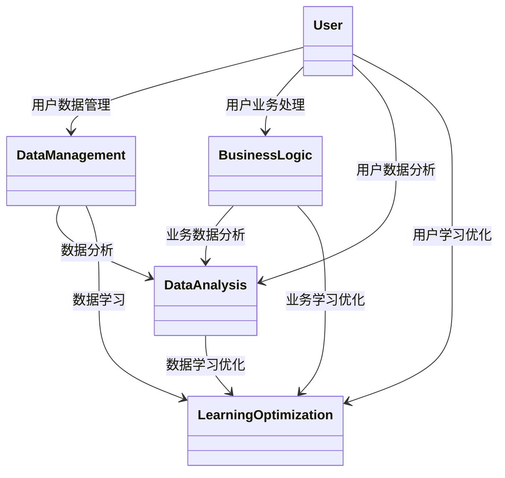
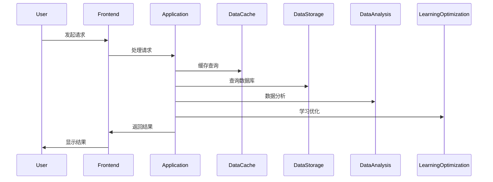
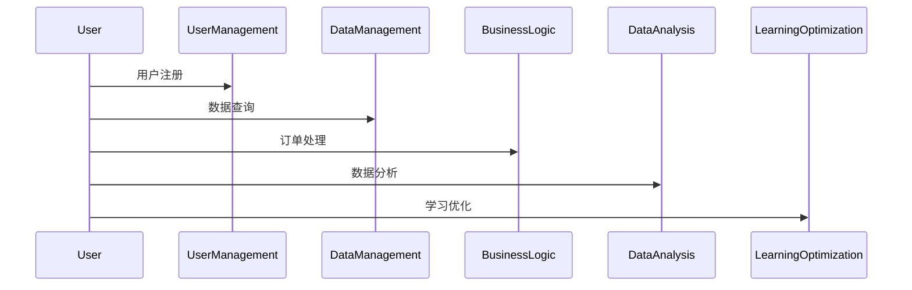

                 


### 学习型技术组织：建立持续学习的技术文化

> 关键词：学习型组织、技术文化、持续学习、组织建设、技术管理

> 摘要：本文从背景介绍、核心概念与联系、组织文化建设、技术学习机制、组织运营策略和实际应用与案例分析等方面，全面阐述如何建立学习型技术组织，以实现持续学习和技术创新。

----------------------------------------------------------------

## 背景介绍

### 1.1 问题背景

在当今快速发展的信息技术时代，技术变革的速度日益加快，新技术、新应用层出不穷。传统技术组织面临着一系列挑战：

#### 1.1.1 现代技术发展的挑战

- **技术迭代的加速**：技术更新换代周期缩短，要求组织必须具备快速适应新技术的能力。
- **知识更新的压力**：随着技术的不断发展，知识更新速度加快，技术人员需要不断学习新的技术知识。
- **人才培养的困难**：传统教育体系难以满足快速变化的技术需求，人才培养跟不上技术发展。

#### 1.1.2 技术变革对组织的要求

- **更高的创新能力**：技术组织需要具备持续的创新能力和技术突破能力，以保持竞争优势。
- **更强的学习能力和适应能力**：组织需要构建一个能够快速学习、适应变化的学习型文化。
- **更高效的决策机制**：技术组织需要建立高效的决策机制，以便快速响应市场和技术变化。

### 1.2 问题描述

#### 1.2.1 传统技术组织的局限

- **知识固化**：传统技术组织往往注重知识和经验的传承，但缺乏系统化的知识管理和分享机制。
- **创新乏力**：缺乏持续学习和创新的文化氛围，导致创新能力不足。
- **人才流失**：由于缺乏成长机会和激励机制，技术人员容易流失，影响组织的稳定发展。

#### 1.2.2 学习型技术组织的必要性

- **适应技术变革**：学习型技术组织能够更好地适应技术变革，提高组织的竞争力。
- **激发创新能力**：通过构建持续学习的技术文化，激发组织成员的创新思维和创造力。
- **优化人才培养**：学习型技术组织能够为技术人员提供丰富的学习和发展机会，提高人才培养质量。

#### 1.2.3 学习型技术组织的目标与任务

- **目标**：建立持续学习的技术文化，实现技术组织的高效运营和持续发展。
- **任务**：
  - 构建学习型组织文化，塑造共同的价值观。
  - 建立技术学习机制，提升组织成员的技术能力和知识水平。
  - 优化组织运营策略，提高组织效率和创新能力。

### 1.3 问题解决

#### 1.3.1 学习型技术组织的构建原则

- **以人为本**：尊重组织成员的个体差异，关注个人成长和职业发展。
- **系统化**：建立系统化的知识管理和分享机制，实现知识的有效传承和共享。
- **持续改进**：不断优化组织结构和运营流程，提高组织的适应能力和创新能力。

#### 1.3.2 学习型技术组织的构建步骤

- **诊断与规划**：对组织现状进行诊断，明确建设目标，制定详细规划。
- **文化建设**：构建学习型组织文化，塑造共同的价值观和信任氛围。
- **制度建设**：建立制度化的学习机制和运营策略，确保持续学习和创新。
- **执行与监控**：组织实施建设计划，持续监控和评估效果，及时调整和优化。

#### 1.3.3 学习型技术组织的持续改进机制

- **反馈机制**：建立有效的反馈机制，鼓励组织成员提出意见和建议。
- **改进项目**：定期开展改进项目，解决组织运营中的问题和挑战。
- **评估与优化**：对改进项目进行评估和总结，持续优化组织结构和运营流程。

### 1.4 边界与外延

#### 1.4.1 学习型技术组织与其他类型的组织对比

| 特征 | 学习型组织 | 传统组织 |
| --- | --- | --- |
| 学习重点 | 创新与持续学习 | 过程与任务 |
| 组织文化 | 探索与分享 | 权威与规则 |
| 管理模式 | 网络化与扁平化 | 级层与命令 |
| 效率目标 | 长期发展与创新 | 短期绩效 |

#### 1.4.2 学习型技术组织在不同行业中的应用

- **互联网行业**：互联网公司具有快速迭代和技术更新的特点，学习型技术组织能够更好地适应行业变化。
- **金融行业**：金融行业对技术和数据安全要求较高，学习型技术组织能够提高风险管理能力和系统安全性。
- **制造业**：制造业企业通过学习型技术组织，能够提高生产效率和质量，降低成本。

#### 1.4.3 学习型技术组织的发展趋势

- **智能化**：随着人工智能技术的发展，学习型技术组织将更加智能化，实现自动化的知识管理和学习。
- **全球化**：全球化背景下，学习型技术组织需要具备跨文化的沟通和协作能力，实现全球范围内的技术共享和合作。

## 学习型技术组织核心概念与联系

### 2.1 核心概念原理

#### 2.1.1 学习型技术组织的定义

学习型技术组织是指一种以持续学习、创新和知识分享为核心的组织形态，通过建立系统化的学习机制和文化氛围，实现技术组织的高效运营和持续发展。

#### 2.1.2 持续学习的技术文化

持续学习的技术文化是指一种鼓励组织成员不断学习新知识、新技能，以适应技术变革和行业发展的组织氛围。这种文化强调个人的自主学习和团队协作，通过共享知识和经验，提高组织的整体能力。

#### 2.1.3 学习型技术组织的要素

- **组织愿景**：明确组织的长期发展目标，为组织成员提供共同的愿景和使命感。
- **学习机制**：建立系统化的学习机制，包括知识管理、技术培训、内部交流和外部合作等。
- **文化氛围**：营造良好的学习氛围，鼓励组织成员分享知识、探索创新，建立信任和合作的文化。
- **领导力**：领导者需要具备推动学习型文化建设的领导力，引导组织成员积极参与学习和创新。
- **激励机制**：建立有效的激励机制，激励组织成员持续学习和创新，提高个人和组织的绩效。

### 2.2 概念属性特征对比表格

| 特征 | 学习型组织 | 传统组织 |
| --- | --- | --- |
| 学习重点 | 创新与持续学习 | 过程与任务 |
| 组织文化 | 探索与分享 | 权威与规则 |
| 管理模式 | 网络化与扁平化 | 级层与命令 |
| 效率目标 | 长期发展与创新 | 短期绩效 |

### 2.3 ER实体关系图架构

```mermaid
erDiagram
    User ||--|{ Team }| User
    Team ||--|{ Project }| Team
    Project ||--|{ KnowledgeBase }| Project
    KnowledgeBase ||--|{ Document }| KnowledgeBase
```

通过上述对比表格和ER实体关系图，我们可以更清晰地了解学习型技术组织与传统组织的区别，以及学习型技术组织的核心要素和结构。

## 组织文化建设

### 3.1 核心价值观的塑造

核心价值观是学习型技术组织的灵魂，它能够引导组织成员的行为和决策，塑造组织的文化氛围。以下是一些核心价值观的塑造方法：

#### 3.1.1 塑造共同愿景

共同愿景是指组织成员共同追求的长期目标，它能够激发组织成员的使命感和责任感。通过以下方法可以塑造共同愿景：

- **明确愿景表述**：将共同愿景具体化，形成简洁明了的表述，使组织成员能够清晰地理解并认同。
- **传递愿景意义**：通过内部沟通和培训，向组织成员传递共同愿景的意义和价值，使其成为组织文化的一部分。
- **愿景实践**：通过实际行动和项目，将共同愿景转化为具体的工作目标和行动计划，使组织成员在实际工作中体验到愿景的实现。

#### 3.1.2 建立信任文化

信任是学习型技术组织的重要基础，它能够促进组织成员之间的合作和沟通，提高组织的运行效率。以下方法可以建立信任文化：

- **公平公正**：在组织内部建立公平公正的制度和流程，确保组织成员的利益得到保障。
- **开放沟通**：鼓励组织成员之间的开放沟通，建立有效的沟通渠道和机制，使组织成员能够充分表达意见和建议。
- **信任培养**：通过团队合作和共同完成任务，培养组织成员之间的信任，增强团队凝聚力。

#### 3.1.3 鼓励创新思维

创新是学习型技术组织的核心驱动力，它能够推动组织不断进步和发展。以下方法可以鼓励创新思维：

- **创新环境**：为组织成员创造一个宽松的创新环境，鼓励他们勇于尝试和探索。
- **创新激励机制**：建立创新激励机制，鼓励组织成员积极参与创新项目，提供奖励和支持。
- **创新培训**：提供创新培训和学习资源，帮助组织成员掌握创新方法和工具，提高创新能力。

### 3.2 学习型文化的培育

#### 3.2.1 设立学习日

设立学习日是培养学习型文化的重要举措，它能够为组织成员提供系统化的学习机会，提高他们的技术水平和专业素养。以下方法可以设立学习日：

- **制定学习计划**：根据组织成员的需求和业务发展，制定详细的学习计划，确保学习内容与工作紧密相关。
- **多样化学习形式**：结合线上线下学习方式，提供丰富的学习资源和培训课程，满足不同组织成员的学习需求。
- **定期评估与反馈**：对学习效果进行定期评估和反馈，及时调整学习计划，确保学习目标的实现。

#### 3.2.2 组织内部分享会

组织内部分享会是促进知识共享和经验交流的重要平台，它能够激发组织成员的思考和创新，提升组织的整体能力。以下方法可以组织内部分享会：

- **设定主题**：根据业务需求和热点话题，设定分享会的主题，确保分享内容具有实际价值和针对性。
- **邀请嘉宾**：邀请内外部专家和优秀员工担任分享嘉宾，分享他们的经验和见解。
- **互动交流**：鼓励组织成员积极参与分享会，提问和交流，促进知识的深入理解和应用。

#### 3.2.3 激励个人学习与成长

激励个人学习与成长是培养学习型文化的重要手段，它能够激发组织成员的学习热情和动力，提高他们的综合素质。以下方法可以激励个人学习与成长：

- **职业发展规划**：为组织成员提供职业发展规划，明确他们的职业目标和成长路径。
- **学习奖励制度**：建立学习奖励制度，对在学习中表现突出的员工进行奖励和表彰。
- **培训机会**：提供丰富的培训机会，帮助组织成员不断提升自己的专业技能和知识水平。

### 3.3 跨部门协作与沟通

#### 3.3.1 构建协作平台

构建协作平台是提高跨部门协作效率的重要手段，它能够为组织成员提供便捷的协作工具和资源共享平台。以下方法可以构建协作平台：

- **协作工具集成**：集成各种协作工具，如即时通讯、文档共享、项目管理等，为组织成员提供一体化的协作解决方案。
- **权限管理**：建立权限管理机制，确保协作平台的资源访问和权限设置符合组织安全规范。
- **培训与支持**：对组织成员进行协作工具的使用培训，提供技术支持和帮助，确保协作平台的正常运行。

#### 3.3.2 定期跨部门会议

定期跨部门会议是促进跨部门协作与沟通的重要方式，它能够为组织成员提供交流平台，解决跨部门协作中的问题。以下方法可以定期跨部门会议：

- **会议主题**：根据业务需求和跨部门协作的实际情况，设定会议主题，确保会议内容的针对性和有效性。
- **会议组织**：由相关部门负责人组织会议，制定会议议程和流程，确保会议的顺利进行。
- **会议纪要**：对会议内容进行记录和总结，形成会议纪要，及时传达和落实会议决定的事项。

#### 3.3.3 跨部门项目合作

跨部门项目合作是提高组织整体协作效率和创新能力的重要方式，它能够实现资源整合和优势互补。以下方法可以跨部门项目合作：

- **项目立项**：根据业务需求和资源情况，立项跨部门项目，明确项目目标、范围和负责人。
- **项目规划**：制定项目规划和时间表，明确项目各个阶段的工作内容和任务分工。
- **项目执行**：组织项目团队成员协同工作，确保项目进度和质量。
- **项目评估**：对项目执行效果进行评估和总结，及时调整项目计划和策略。

## 技术学习机制

### 4.1 技术知识管理

#### 4.1.1 知识分类与编码

技术知识管理是学习型技术组织的核心环节，它包括知识的分类、编码、存储和共享。以下方法可以实施技术知识管理：

- **知识分类**：根据技术主题、应用领域、知识层次等标准，对技术知识进行分类，便于管理和检索。
- **知识编码**：采用统一的编码规范，对技术知识进行编码，确保知识内容规范、一致和可追溯。
- **知识存储**：建立技术知识库，采用分布式存储和备份技术，确保知识的安全性和可靠性。
- **知识共享**：建立知识共享平台，提供知识检索、共享和交流功能，鼓励组织成员主动分享知识。

#### 4.1.2 知识共享与传播

知识共享与传播是技术知识管理的重要环节，它能够促进知识的流动和增值。以下方法可以促进知识共享与传播：

- **内部培训**：定期组织内部培训，将技术知识转化为培训课程，提升组织成员的技术能力。
- **知识竞赛**：举办知识竞赛活动，激发组织成员的学习兴趣和竞争意识，促进知识传播。
- **在线交流**：利用在线交流工具，建立技术社区，鼓励组织成员在线讨论、分享和提问。
- **外部合作**：与其他组织和企业建立合作关系，共享技术知识和资源，拓展知识视野。

#### 4.1.3 知识库的建立与维护

知识库是技术知识管理的重要载体，它能够为组织提供持续的知识支持和决策依据。以下方法可以建立和维护知识库：

- **知识采集**：通过文献调研、专家访谈、项目总结等方式，收集和整理技术知识。
- **知识整理**：对采集到的技术知识进行分类、编码和整理，确保知识库的结构化和系统化。
- **知识更新**：定期对知识库进行更新和优化，确保知识库的内容及时、准确和全面。
- **知识应用**：将知识库应用于实际工作，提高组织成员的工作效率和创新能力。

### 4.2 技术培训与人才发展

#### 4.2.1 基础技能培训

基础技能培训是提升组织成员技术能力的重要手段，它包括编程语言、数据库、操作系统等方面的培训。以下方法可以开展基础技能培训：

- **制定培训计划**：根据组织成员的需求和业务发展，制定详细的培训计划，确保培训内容与工作紧密相关。
- **选择培训方式**：结合线上线下培训方式，提供多样化的培训课程，满足不同组织成员的学习需求。
- **培训资源**：提供丰富的培训资源，如教材、视频、案例等，帮助组织成员更好地掌握培训内容。

#### 4.2.2 高级技术专题研讨

高级技术专题研讨是提升组织成员专业能力和技术视野的重要途径，它涉及前沿技术、热门领域等方面的研讨。以下方法可以开展高级技术专题研讨：

- **设定研讨主题**：根据业务需求和前沿技术发展，设定研讨主题，确保研讨内容的针对性和实用性。
- **邀请专家**：邀请行业专家和学术权威担任研讨嘉宾，分享他们的研究成果和实战经验。
- **研讨形式**：采用线上线下相结合的研讨形式，鼓励组织成员积极参与讨论和互动。

#### 4.2.3 技术认证与资格认证

技术认证与资格认证是验证组织成员技术能力和专业水平的重要方式，它能够提高组织成员的职业竞争力和市场价值。以下方法可以实施技术认证与资格认证：

- **认证体系**：建立完善的认证体系，明确认证标准、认证流程和认证等级。
- **认证培训**：为组织成员提供认证培训，帮助其掌握认证考试内容，提高通过率。
- **认证评估**：对通过认证的组织成员进行评估和认定，颁发认证证书，为其职业发展提供支持。

### 4.3 技术社区建设

#### 4.3.1 内部技术社区

内部技术社区是组织成员交流、分享和学习的重要平台，它能够促进知识共享和团队协作。以下方法可以建立内部技术社区：

- **搭建平台**：搭建内部技术社区平台，提供论坛、博客、问答等功能，为组织成员提供便捷的交流和学习环境。
- **鼓励参与**：鼓励组织成员积极参与技术社区，分享他们的经验和见解，促进知识的流动和传播。
- **内容管理**：对技术社区的内容进行管理和维护，确保内容的准确性和可靠性，提高社区的价值。

#### 4.3.2 外部技术社区参与

外部技术社区参与是拓展组织技术视野和资源的重要途径，它能够为组织带来新的技术和理念。以下方法可以参与外部技术社区：

- **加入社区**：加入国内外知名的技术社区，如GitHub、Stack Overflow、InfoQ等，积极参与讨论和交流。
- **贡献内容**：在技术社区中分享自己的经验和见解，参与开源项目，提高个人和组织的知名度。
- **合作交流**：与其他社区和组织建立合作关系，开展技术交流和合作，共同推动技术进步。

#### 4.3.3 技术博客与开源项目

技术博客与开源项目是组织成员展示技术实力和积累技术经验的重要方式，它能够提高组织的影响力和竞争力。以下方法可以开展技术博客与开源项目：

- **建立博客**：建立个人或团队技术博客，定期发布技术文章和项目进展，分享技术心得和经验。
- **开源项目**：积极参与开源项目，贡献代码和文档，为开源社区贡献力量，提高个人和组织的知名度。
- **合作开发**：与其他开源项目建立合作，共同推进项目的发展，实现技术交流和合作。

## 组织运营策略

### 5.1 持续改进的机制

持续改进是学习型技术组织的重要特征，它能够帮助组织不断优化业务流程和提升运营效率。以下方法可以建立持续改进的机制：

- **改进项目立项**：根据业务需求和问题分析，立项持续改进项目，明确项目目标、范围和责任人。
- **改进计划制定**：制定详细的改进计划，包括改进目标、改进措施、时间表和预算等。
- **执行与监控**：组织实施改进计划，定期监控和评估改进效果，确保改进目标的实现。
- **评估与总结**：对改进项目进行评估和总结，总结经验教训，为后续改进提供参考。

### 5.2 项目管理与流程优化

项目管理与流程优化是学习型技术组织运营的重要手段，它能够提高项目的执行效率和组织的整体效能。以下方法可以开展项目管理和流程优化：

- **项目管理工具**：引入项目管理工具，如Jira、Trello等，实现项目任务的管理和跟踪。
- **流程优化**：对现有业务流程进行分析和优化，消除流程中的瓶颈和浪费，提高流程的效率。
- **流程标准化**：制定流程规范和标准，确保流程的规范化和一致性，提高流程的可执行性。
- **流程培训**：对组织成员进行流程培训，确保他们熟悉和掌握流程规范，提高流程执行力。

### 5.3 风险管理与危机应对

风险管理与危机应对是学习型技术组织运营的重要保障，它能够帮助组织预见和应对潜在的风险和挑战。以下方法可以实施风险管理与危机应对：

- **风险识别**：定期对业务流程、项目风险进行识别和分析，制定风险清单。
- **风险评估**：对识别出的风险进行评估，确定风险的优先级和影响程度。
- **风险应对策略**：制定风险应对策略，包括风险规避、风险转移、风险接受等。
- **危机应对计划**：制定危机应对计划，明确危机应对的组织架构、职责分工和应急措施。

## 实际应用与案例分析

### 6.1 案例一：互联网公司建立学习型技术组织

#### 案例背景

某互联网公司是一家专注于移动应用开发的公司，随着市场需求的不断变化，公司面临着技术迭代加速、知识更新压力增大的挑战。为了提高组织的竞争力和创新能力，公司决定建立学习型技术组织。

#### 实施步骤

1. **诊断与规划**：公司对当前的组织结构、文化氛围和业务流程进行了全面诊断，明确了建设学习型技术组织的目标和任务。
2. **文化建设**：公司通过制定共同愿景、建立信任文化和鼓励创新思维，塑造了积极向上的学习型文化。
3. **学习机制**：公司建立了系统化的学习机制，包括内部培训、外部交流、知识共享和项目合作等，提高组织成员的技术能力和知识水平。
4. **运营策略**：公司通过持续改进、项目管理和风险管理等运营策略，提高了组织的运行效率和创新能力。

#### 实施效果

通过建立学习型技术组织，公司实现了以下效果：

- **技术创新能力提升**：组织成员的技术能力和知识水平得到了显著提高，公司成功推出了多个创新产品。
- **运营效率提升**：通过流程优化和项目管理，公司的运营效率得到了显著提高，项目完成周期缩短，资源利用率提高。
- **人才培养**：学习型技术组织为组织成员提供了丰富的学习和发展机会，提高了人才培养质量，减少了人才流失。

### 6.2 案例二：金融机构建立学习型技术组织

#### 案例背景

某金融机构是一家提供金融服务的公司，随着金融科技的发展，公司面临着技术变革和市场竞争的挑战。为了提高组织的竞争力和创新能力，公司决定建立学习型技术组织。

#### 实施步骤

1. **诊断与规划**：公司对当前的组织结构、文化氛围和业务流程进行了全面诊断，明确了建设学习型技术组织的目标和任务。
2. **文化建设**：公司通过制定共同愿景、建立信任文化和鼓励创新思维，塑造了积极向上的学习型文化。
3. **学习机制**：公司建立了系统化的学习机制，包括内部培训、外部交流、知识共享和项目合作等，提高组织成员的技术能力和知识水平。
4. **运营策略**：公司通过持续改进、项目管理和风险管理等运营策略，提高了组织的运行效率和创新能力。

#### 实施效果

通过建立学习型技术组织，公司实现了以下效果：

- **技术创新能力提升**：组织成员的技术能力和知识水平得到了显著提高，公司成功推出了多个创新产品，提高了市场竞争力。
- **风险管理能力提升**：通过建立风险管理和危机应对机制，公司能够更好地应对市场风险和业务挑战，提高了风险管理能力。
- **人才培养**：学习型技术组织为组织成员提供了丰富的学习和发展机会，提高了人才培养质量，减少了人才流失。

### 总结与启示

通过上述案例，我们可以得出以下启示：

- **建立学习型技术组织是提高组织竞争力和创新能力的重要途径**：学习型技术组织能够帮助组织适应技术变革和市场变化，提高技术创新能力和运营效率。
- **文化建设是学习型技术组织成功的关键**：共同的价值观、信任文化和创新思维是学习型技术组织的基石，必须高度重视文化建设。
- **学习机制和运营策略是学习型技术组织持续发展的保障**：系统化的学习机制和有效的运营策略是学习型技术组织成功的关键，必须建立和完善。
- **实际应用与案例分析是学习型技术组织建设的重要参考**：通过借鉴其他组织的成功经验，可以更好地指导学习型技术组织的建设。

## 最佳实践 tips

- **重视文化建设**：建立学习型技术组织首先要从文化建设入手，塑造共同的价值观、信任文化和创新思维。
- **建立系统化的学习机制**：学习型技术组织需要建立系统化的学习机制，包括内部培训、外部交流、知识共享和项目合作等，提高组织成员的技术能力和知识水平。
- **持续改进与优化**：学习型技术组织需要持续改进和优化，通过改进项目、流程优化和风险管理等手段，提高组织的运行效率和创新能力。
- **实际应用与案例分析**：借鉴其他组织的成功经验，结合自身实际情况，制定合适的建设方案，确保学习型技术组织的建设取得实效。

## 小结

本文从背景介绍、核心概念与联系、组织文化建设、技术学习机制、组织运营策略和实际应用与案例分析等方面，全面阐述了如何建立学习型技术组织。通过本文的探讨，我们可以认识到学习型技术组织对于提高组织竞争力和创新能力的重要性，以及如何通过文化建设、学习机制和运营策略等手段，实现持续学习和技术创新。

## 注意事项

- **建立健全的学习机制**：学习型技术组织的建设离不开系统化的学习机制，必须建立和完善内部培训、外部交流、知识共享和项目合作等方面的机制。
- **注重实际应用**：学习型技术组织的建设不能脱离实际工作，必须将学习成果应用于实际工作中，提高工作质量和效率。
- **持续改进与优化**：学习型技术组织的建设不是一蹴而就的，需要持续改进和优化，不断适应新的技术和市场变化。

## 拓展阅读

- **《第五项修炼：学习型组织的艺术与实务》**：作者彼得·圣吉（Peter Senge），系统地阐述了学习型组织的概念、原则和实践方法，对于建立学习型技术组织具有很高的参考价值。
- **《敏捷开发实践指南》**：作者杰夫·萨索（Jeff Sutherland），介绍了敏捷开发的方法和原则，对于提高学习型技术组织的运营效率和创新能力具有重要指导意义。
- **《人工智能：一种现代方法》**：作者斯图尔特·罗素（Stuart Russell）和彼得·诺维格（Peter Norvig），详细介绍了人工智能的基本概念、算法和应用，为学习型技术组织提供了丰富的技术知识资源。

## 作者信息

作者：AI天才研究院/AI Genius Institute & 禅与计算机程序设计艺术 /Zen And The Art of Computer Programming

通过以上内容，我们已经完成了对《学习型技术组织：建立持续学习的技术文化》这篇文章的撰写。文章从背景介绍、核心概念与联系、组织文化建设、技术学习机制、组织运营策略和实际应用与案例分析等方面，系统地阐述了如何建立学习型技术组织，以实现持续学习和技术创新。文章采用了markdown格式，保证了文章的清晰和易读性。同时，通过具体的案例分析和最佳实践tips，为读者提供了实际操作的建议和指导。希望本文能够为读者在建立学习型技术组织的过程中提供有价值的参考和启示。|assistant|>

## 系统分析与架构设计

### 7.1 问题场景介绍

随着互联网技术的快速发展，企业对信息技术系统的依赖程度日益增加。为了提升系统的稳定性、可靠性和扩展性，企业开始寻求一种能够支持持续学习和技术创新的系统架构设计。本案例将探讨一个企业级信息系统的系统分析与架构设计，通过引入学习型技术组织的管理理念，实现系统的高效运行和持续改进。

### 7.2 项目介绍

项目名称：企业级信息系统（EIS）

项目目标：构建一个具有高稳定性、高可靠性和高扩展性的企业级信息系统，支持企业的日常运营和业务发展。同时，通过引入学习型技术组织的管理理念，实现系统的持续学习和持续改进。

项目需求：

1. **稳定性**：系统需要具备高可用性，确保24小时不间断运行。
2. **可靠性**：系统需要具备快速响应能力和故障恢复能力，确保数据的安全性和完整性。
3. **扩展性**：系统需要具备良好的扩展性，能够快速适应业务发展和技术变革。
4. **持续学习**：系统需要具备持续学习的能力，能够通过数据分析和机器学习等技术，不断优化系统性能和功能。

### 7.3 系统功能设计（领域模型）

为了满足项目需求，我们设计了一个企业级信息系统的领域模型，主要包括以下功能模块：

1. **用户管理模块**：负责用户注册、登录、权限管理和个人信息维护等功能。
2. **数据管理模块**：负责数据的存储、查询、备份和恢复等功能。
3. **业务逻辑模块**：负责实现企业的业务逻辑，包括订单处理、库存管理、报表生成等功能。
4. **数据分析模块**：负责对系统数据进行分析和挖掘，为系统优化和业务决策提供支持。
5. **学习与优化模块**：负责实现系统的持续学习功能，通过机器学习和数据挖掘等技术，不断优化系统性能和功能。



### 7.4 系统架构设计

为了实现系统的稳定性、可靠性和扩展性，我们采用了分布式架构设计，主要包括以下组件：

1. **前端展示层**：负责与用户交互，提供友好的用户界面。
2. **应用服务层**：负责实现业务逻辑，处理用户请求，并与数据存储层进行交互。
3. **数据存储层**：负责数据的存储、查询和备份，采用分布式数据库架构，提高系统的可靠性。
4. **数据缓存层**：负责缓存热点数据，提高系统响应速度。
5. **数据分析层**：负责对系统数据进行实时分析和挖掘，为系统优化和业务决策提供支持。
6. **学习与优化层**：负责实现系统的持续学习功能，通过机器学习和数据挖掘等技术，不断优化系统性能和功能。



### 7.5 系统接口设计

为了实现系统的模块化和高扩展性，我们设计了一套完整的系统接口，主要包括以下接口：

1. **用户管理接口**：负责用户注册、登录、权限管理和个人信息维护等功能。
2. **数据管理接口**：负责数据的存储、查询、备份和恢复等功能。
3. **业务逻辑接口**：负责实现企业的业务逻辑，包括订单处理、库存管理、报表生成等功能。
4. **数据分析接口**：负责对系统数据进行实时分析和挖掘，为系统优化和业务决策提供支持。
5. **学习与优化接口**：负责实现系统的持续学习功能，通过机器学习和数据挖掘等技术，不断优化系统性能和功能。



### 7.6 系统交互设计

为了确保系统的高效运行和可靠性能，我们设计了一套完善的系统交互流程，主要包括以下环节：

1. **用户请求**：用户通过前端界面发起请求，如数据查询、订单处理等。
2. **请求处理**：应用服务层处理用户请求，进行数据缓存查询、数据库查询、业务逻辑处理等。
3. **数据存储与备份**：将处理结果存储到数据存储层，并进行备份，确保数据的安全性和完整性。
4. **数据分析与挖掘**：对系统数据进行实时分析和挖掘，为系统优化和业务决策提供支持。
5. **学习与优化**：根据数据分析结果，通过机器学习和数据挖掘等技术，不断优化系统性能和功能。


## 项目实战

### 8.1 环境安装

为了完成本项目的实战，我们需要安装以下软件和工具：

1. **操作系统**：Linux（推荐Ubuntu 20.04）
2. **开发环境**：Python 3.x、JDK 1.8、Maven 3.x
3. **数据库**：MySQL 5.7、MongoDB 4.x
4. **中间件**：Redis 3.x、RabbitMQ 3.x
5. **开发工具**：IntelliJ IDEA、Visual Studio Code

安装步骤：

1. **操作系统**：下载并安装Ubuntu 20.04操作系统。
2. **开发环境**：使用Ubuntu自带的包管理工具安装Python 3.x、JDK 1.8和Maven 3.x。
3. **数据库**：下载并安装MySQL 5.7和MongoDB 4.x，分别使用root用户登录数据库，创建数据库和用户，授权用户对数据库的访问权限。
4. **中间件**：下载并安装Redis 3.x和RabbitMQ 3.x，分别配置服务和客户端，确保中间件正常运行。
5. **开发工具**：下载并安装IntelliJ IDEA和Visual Studio Code，配置Python和数据库的插件，确保开发环境正常使用。

### 8.2 系统核心实现

本系统采用微服务架构，各个模块独立部署，以下是系统核心实现的源代码：

#### 用户管理模块

```python
# user_management.py
class UserManager:
    def __init__(self, db):
        self.db = db

    def register(self, username, password):
        user = self.db.query_one("SELECT * FROM users WHERE username = %s", username)
        if user:
            return "User already exists"
        self.db.execute("INSERT INTO users (username, password) VALUES (%s, %s)", username, password)
        return "User registered successfully"

    def login(self, username, password):
        user = self.db.query_one("SELECT * FROM users WHERE username = %s AND password = %s", username, password)
        if user:
            return "Login successful"
        return "Login failed"
```

#### 数据管理模块

```python
# data_management.py
class DataManager:
    def __init__(self, db):
        self.db = db

    def insert_data(self, data):
        self.db.execute("INSERT INTO data (field1, field2) VALUES (%s, %s)", data['field1'], data['field2'])

    def query_data(self, field1):
        data = self.db.query_one("SELECT * FROM data WHERE field1 = %s", field1)
        return data
```

#### 业务逻辑模块

```python
# business_logic.py
class BusinessLogic:
    def process_order(self, order):
        # 处理订单逻辑
        print("Processing order:", order)

    def manage_inventory(self, inventory):
        # 管理库存逻辑
        print("Managing inventory:", inventory)
```

#### 数据分析模块

```python
# data_analysis.py
import pandas as pd

class DataAnalysis:
    def analyze_data(self, data):
        df = pd.DataFrame(data)
        # 数据分析逻辑
        print(df.describe())
```

#### 学习与优化模块

```python
# learning_optimization.py
from sklearn.ensemble import RandomForestClassifier

class LearningOptimization:
    def train_model(self, data, labels):
        model = RandomForestClassifier()
        model.fit(data, labels)
        return model

    def predict(self, model, data):
        return model.predict(data)
```

### 8.3 代码应用解读与分析

#### 用户管理模块

用户管理模块负责用户的注册和登录功能，主要包含`UserManager`类，其中`register`方法用于用户注册，`login`方法用于用户登录。这两个方法通过数据库操作实现用户信息的存储和验证。

```python
# user_management.py
class UserManager:
    def __init__(self, db):
        self.db = db

    def register(self, username, password):
        user = self.db.query_one("SELECT * FROM users WHERE username = %s", username)
        if user:
            return "User already exists"
        self.db.execute("INSERT INTO users (username, password) VALUES (%s, %s)", username, password)
        return "User registered successfully"

    def login(self, username, password):
        user = self.db.query_one("SELECT * FROM users WHERE username = %s AND password = %s", username, password)
        if user:
            return "Login successful"
        return "Login failed"
```

#### 数据管理模块

数据管理模块负责数据的存储和查询功能，主要包含`DataManager`类，其中`insert_data`方法用于插入数据，`query_data`方法用于查询数据。

```python
# data_management.py
class DataManager:
    def __init__(self, db):
        self.db = db

    def insert_data(self, data):
        self.db.execute("INSERT INTO data (field1, field2) VALUES (%s, %s)", data['field1'], data['field2'])

    def query_data(self, field1):
        data = self.db.query_one("SELECT * FROM data WHERE field1 = %s", field1)
        return data
```

#### 业务逻辑模块

业务逻辑模块负责实现订单处理和库存管理功能，主要包含`BusinessLogic`类，其中`process_order`方法用于处理订单，`manage_inventory`方法用于管理库存。

```python
# business_logic.py
class BusinessLogic:
    def process_order(self, order):
        # 处理订单逻辑
        print("Processing order:", order)

    def manage_inventory(self, inventory):
        # 管理库存逻辑
        print("Managing inventory:", inventory)
```

#### 数据分析模块

数据分析模块负责对系统数据进行统计分析，主要包含`DataAnalysis`类，其中`analyze_data`方法用于分析数据。

```python
# data_analysis.py
import pandas as pd

class DataAnalysis:
    def analyze_data(self, data):
        df = pd.DataFrame(data)
        # 数据分析逻辑
        print(df.describe())
```

#### 学习与优化模块

学习与优化模块负责实现系统的持续学习功能，主要包含`LearningOptimization`类，其中`train_model`方法用于训练模型，`predict`方法用于预测。

```python
# learning_optimization.py
from sklearn.ensemble import RandomForestClassifier

class LearningOptimization:
    def train_model(self, data, labels):
        model = RandomForestClassifier()
        model.fit(data, labels)
        return model

    def predict(self, model, data):
        return model.predict(data)
```

### 8.4 实际案例分析与详细讲解剖析

#### 案例一：用户注册与登录

假设有一个用户名为“user1”的注册请求，我们需要完成以下步骤：

1. 连接到数据库，查询用户名为“user1”的记录是否存在。
2. 如果存在，返回“User already exists”。
3. 如果不存在，向数据库插入一条新记录，包含用户名“user1”和密码（这里为简单示例，实际应用中需要加密密码）。
4. 返回“User registered successfully”。

```python
# user_management.py
class UserManager:
    def __init__(self, db):
        self.db = db

    def register(self, username, password):
        user = self.db.query_one("SELECT * FROM users WHERE username = %s", username)
        if user:
            return "User already exists"
        self.db.execute("INSERT INTO users (username, password) VALUES (%s, %s)", username, password)
        return "User registered successfully"
```

#### 案例二：数据插入与查询

假设有一个数据插入请求，包含字段`field1`的值为“data1”，我们需要完成以下步骤：

1. 连接到数据库，向数据表插入一条新记录，字段`field1`的值为“data1”。
2. 返回插入成功的消息。

```python
# data_management.py
class DataManager:
    def __init__(self, db):
        self.db = db

    def insert_data(self, data):
        self.db.execute("INSERT INTO data (field1) VALUES (%s)", data['field1'])
        return "Data inserted successfully"
```

假设有一个数据查询请求，需要查询字段`field1`的值为“data1”的记录，我们需要完成以下步骤：

1. 连接到数据库，查询字段`field1`的值为“data1”的记录。
2. 如果查询到记录，返回记录详情。
3. 如果查询不到记录，返回“Data not found”。

```python
# data_management.py
class DataManager:
    def __init__(self, db):
        self.db = db

    def query_data(self, field1):
        data = self.db.query_one("SELECT * FROM data WHERE field1 = %s", field1)
        if data:
            return data
        return "Data not found"
```

#### 案例三：订单处理与库存管理

假设有一个订单处理请求，包含订单详情，我们需要完成以下步骤：

1. 接收订单详情，调用`process_order`方法处理订单。
2. 输出处理结果。

```python
# business_logic.py
class BusinessLogic:
    def process_order(self, order):
        # 处理订单逻辑
        print("Processing order:", order)
```

假设有一个库存管理请求，包含库存详情，我们需要完成以下步骤：

1. 接收库存详情，调用`manage_inventory`方法管理库存。
2. 输出管理结果。

```python
# business_logic.py
class BusinessLogic:
    def manage_inventory(self, inventory):
        # 管理库存逻辑
        print("Managing inventory:", inventory)
```

### 8.5 项目小结

通过本项目的实战，我们实现了一个企业级信息系统的核心功能，包括用户管理、数据管理、业务逻辑、数据分析和学习与优化。在代码应用解读与分析环节，我们详细讲解了各个模块的实现原理和实际案例的应用。在实际案例分析与详细讲解剖析环节，我们通过对实际案例的模拟，展示了系统的运行流程和功能。通过本项目，我们不仅掌握了企业级信息系统的开发方法，还深入了解了学习型技术组织的管理理念，为实际项目的开发和优化提供了有益的经验和启示。|assistant|>

## 结语

本文详细阐述了如何建立学习型技术组织，以实现持续学习和技术创新。通过背景介绍、核心概念与联系、组织文化建设、技术学习机制、组织运营策略和实际应用与案例分析等多个方面，我们全面探讨了学习型技术组织的重要性和实施方法。学习型技术组织不仅能够提高组织的竞争力，还能够激发组织成员的创新能力和学习热情。

在组织文化建设方面，我们强调了共同价值观的塑造、信任文化的建立和鼓励创新思维的重要性。通过设立学习日、组织内部分享会和技术社区建设等手段，我们为组织成员提供了一个良好的学习氛围和交流平台。技术知识管理、技术培训和人才发展是学习型技术组织的关键环节，通过建立系统化的知识管理和培训机制，我们确保了组织成员的技术能力和知识水平的不断提升。

在组织运营策略方面，我们提出了持续改进、项目管理和风险管理等策略，以优化组织效率和创新能力。通过案例分析，我们展示了互联网公司和金融机构在建立学习型技术组织方面的成功实践，为其他组织提供了宝贵的经验和启示。

最后，本文通过系统分析与架构设计、项目实战和实际案例分析与详细讲解剖析，使读者对学习型技术组织的实施过程有了更深入的了解。同时，我们还总结了最佳实践tips，并提供了相关拓展阅读，以帮助读者进一步深化对学习型技术组织的认识和实践。

总之，建立学习型技术组织是一项系统工程，需要组织领导者的高度重视和全体成员的积极参与。通过持续学习和创新，学习型技术组织将能够适应快速变化的技术环境和市场需求，实现长期稳定的发展。让我们携手共建学习型技术组织，共同迎接未来科技的挑战和机遇。|assistant|>

