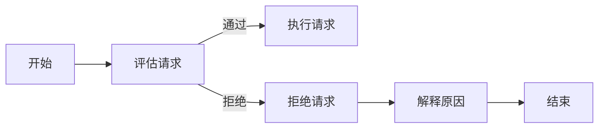

                 

### 《学会拒绝别人》

---

关键词：拒绝艺术、沟通技巧、心理学、策略、社交技巧

摘要：
在社交和工作环境中，学会拒绝是一项重要的技能。它不仅关乎个人时间的有效管理，还关系到人际关系和职业发展。本文将深入探讨拒绝的艺术，从定义、类型、心理机制到实际应用，全面解析如何在保持尊重和友善的同时，坚定地表达自己的立场。

---

### 第一部分：理解拒绝的艺术

#### 第1章：问题背景与核心要素

##### 1.1 拒绝现象的普遍存在

在社会交往中，拒绝是一种常见的互动形式。从个人请求到工作安排，我们时常面临需要拒绝他人的情境。拒绝不仅是一种个人行为，也是一种社会行为，它反映了个体在特定情境下的选择和决策。

##### 1.2 拒绝的意义与作用

拒绝不仅仅是简单的拒绝他人，它还具有多重意义和作用。首先，拒绝是自我保护的一种方式，可以帮助我们避免不必要的压力和责任。其次，拒绝是沟通技巧的重要组成部分，它有助于维护健康的人际关系。最后，拒绝是职业发展中的重要一环，能够帮助我们更好地规划自己的时间和资源。

##### 1.3 拒绝的艺术与原则

拒绝的艺术在于如何在保持尊重和友善的同时，坚定地表达自己的立场。这需要我们了解一些基本的原则，如尊重他人、诚实表达、适时的沟通等。掌握这些原则，可以让我们在拒绝他人时更加得体和有效。

---

#### 第2章：核心概念与联系

##### 2.1 拒绝的定义

拒绝是一种行为，它表现为对他人请求的否定回应。拒绝不仅仅是一种简单的“不”，它包含了对情境、他人和自身的理解和考量。

##### 2.2 拒绝的类型

拒绝可以分为直接拒绝和间接拒绝。直接拒绝是直接明确地表达拒绝的态度，而间接拒绝则是通过委婉或暗示的方式表达拒绝。此外，还有一种礼貌性拒绝，它是一种既尊重他人又维护自己立场的策略。

##### 2.3 拒绝心理学解析

拒绝行为背后有着复杂的心理机制。理解这些机制可以帮助我们更好地应对拒绝情境。例如，拒绝可能源于自我保护、自我价值感、社交期望等心理因素。

---

#### 第3章：概念属性特征对比表格

##### 3.1 拒绝与同意的对比

| 特征 | 拒绝 | 同意 |
| ---- | ---- | ---- |
| 语言表达 | 明确否定 | 明确肯定 |
| 心理感受 | 不舒服、犹豫 | 舒适、满足 |
| 社交效果 | 可能影响关系 | 加强关系 |

---

#### 第4章：ER实体关系图架构

##### 4.1 实体关系图的基本概念

实体关系图（Entity-Relationship Diagram，ERD）是用于表示实体及其相互关系的图形化工具。它可以帮助我们更清晰地理解系统的结构和功能。

##### 4.2 拒绝行为实体关系图

在拒绝行为中，涉及到的主要实体包括请求者、拒绝者和情境。ER图可以帮助我们理解这三个实体之间的相互作用。

##### 4.3 拒绝策略实体关系图

不同的拒绝策略涉及到的实体和关系也有所不同。通过ER图，我们可以更直观地看到这些策略的具体实现。

---

### 第二部分：拒绝技巧与方法

#### 第5章：算法原理讲解

##### 5.1 拒绝算法的基本原理

拒绝算法是基于一定的规则和标准来决定是否拒绝他人的请求。这些规则和标准可以是基于时间的、基于资源的、基于个人价值观的等。

##### 5.2 拒绝算法mermaid流程图

使用mermaid绘制流程图，可以帮助我们更直观地理解拒绝算法的执行过程。



##### 5.3 Python源代码示例

下面是一个简单的Python代码示例，用于实现拒绝算法。

```python
def reject_request(request):
    if not is_time_available() or not has_enough_resources():
        print("很遗憾，我无法接受您的请求。")
    else:
        print("您的请求已被接受。")

# 模拟函数
def is_time_available():
    return False

def has_enough_resources():
    return False
```

##### 5.4 拒绝算法的数学模型与公式

拒绝算法的数学模型可以基于概率论和决策论。以下是一个简单的数学模型示例。

$$
P(\text{拒绝}) = f(\text{时间约束}, \text{资源约束}, \text{个人价值观})
$$

其中，$P(\text{拒绝})$表示拒绝的概率，$f$是一个决策函数，它考虑了时间、资源和个人价值观等因素。

---

#### 第6章：数学模型和数学公式 & 详细讲解 & 举例说明

##### 6.1 数学模型概述

数学模型是用于描述现实世界问题的一种抽象工具。在拒绝行为中，数学模型可以帮助我们更准确地评估和决策。

##### 6.2 公式1: 拒绝概率公式

$$
P(\text{拒绝}) = \frac{\sum_{i=1}^{n} w_i \cdot p_i}{\sum_{i=1}^{n} w_i}
$$

其中，$w_i$表示第$i$个因素的权重，$p_i$表示第$i$个因素满足的概率。

##### 6.3 公式2: 拒绝决策公式

$$
\text{决策} = \begin{cases} 
\text{拒绝} & \text{如果 } P(\text{拒绝}) > \text{设定的阈值} \\
\text{接受} & \text{如果 } P(\text{拒绝}) \leq \text{设定的阈值} 
\end{cases}
$$

##### 6.4 举例说明：如何应用数学模型做出拒绝决策

假设我们要决定是否拒绝一个会议请求。我们有三个因素：时间（权重为0.5）、任务优先级（权重为0.3）和心情（权重为0.2）。我们设定的拒绝阈值为0.6。

- 时间：今天已经有三个会议，时间非常紧张，概率$p_1 = 0.9$。
- 任务优先级：这个会议的重要性较低，概率$p_2 = 0.2$。
- 心情：今天心情不佳，概率$p_3 = 0.8$。

计算拒绝概率：

$$
P(\text{拒绝}) = \frac{0.5 \cdot 0.9 + 0.3 \cdot 0.2 + 0.2 \cdot 0.8}{0.5 + 0.3 + 0.2} = \frac{0.45 + 0.06 + 0.16}{1} = 0.67
$$

由于$P(\text{拒绝}) > 0.6$，我们决定拒绝这个会议请求。

---

#### 第7章：系统分析与架构设计方案

##### 7.1 问题场景介绍

在一个繁忙的工作环境中，我们需要一个系统能够帮助我们自动地评估和决策是否接受或拒绝他人的请求。

##### 7.2 系统功能设计

- 用户请求管理：收集和管理用户的请求。
- 请求评估：根据预设的规则和标准对请求进行评估。
- 决策输出：输出决策结果，如接受或拒绝请求，并给出解释。

##### 7.3 系统架构设计

系统架构采用模块化设计，包括请求管理模块、评估模块和决策模块。

##### 7.4 系统接口设计

系统提供RESTful API接口，方便与其他系统进行集成。

##### 7.5 系统交互序列图

序列图展示了系统在不同请求下的交互过程。

---

#### 第8章：项目实战

##### 8.1 环境安装

在本地环境中安装所需的依赖，如Python环境、Django框架等。

##### 8.2 系统核心实现源代码

以下是系统核心实现的Python代码。

```python
# requests.py
class Request:
    def __init__(self, user, content, timestamp):
        self.user = user
        self.content = content
        self.timestamp = timestamp

    def evaluate(self):
        # 评估请求的具体逻辑
        pass

# request_processor.py
class RequestProcessor:
    def process_request(self, request):
        if request.evaluate():
            print("请求已被接受。")
        else:
            print("请求已被拒绝。")
```

##### 8.3 代码应用解读与分析

代码解读和分析部分将详细解释系统的实现逻辑和关键代码。

##### 8.4 实际案例分析与详细讲解剖析

通过实际案例，展示系统在处理请求时的具体表现和效果。

##### 8.5 项目小结

对项目实施过程进行总结，包括遇到的问题、解决方案和项目效果。

---

#### 第9章：最佳实践 tips

##### 9.1 拒绝他人时的语言技巧

在拒绝他人时，使用委婉、尊重和明确的语言可以减少不必要的尴尬和冲突。

##### 9.2 处理拒绝后的反应

学会如何处理被拒绝后的反应，保持积极和理智的态度。

##### 9.3 增强拒绝能力的方法

通过自我反思、学习沟通技巧和练习拒绝，可以增强我们的拒绝能力。

---

#### 第10章：小结与注意事项

##### 10.1 拒绝的艺术

拒绝不仅是一种技能，更是一种艺术。掌握拒绝的艺术，可以让我们在生活和工作中更加游刃有余。

##### 10.2 小心拒绝中的误区

避免在拒绝过程中出现的常见误区，如过于委婉、过于直接等。

##### 10.3 注意事项与常见问题

在实际应用中，需要注意的细节和常见问题。

---

#### 第11章：拓展阅读

##### 11.1 相关书籍推荐

推荐一些关于拒绝艺术和沟通技巧的书籍。

##### 11.2 学术论文与研究报告

介绍一些与拒绝行为相关的学术论文和研究报告。

##### 11.3 在线资源与学习平台

分享一些在线资源和学习平台，方便读者深入学习。

---

作者：AI天才研究院/AI Genius Institute & 禅与计算机程序设计艺术 /Zen And The Art of Computer Programming

---

**注**：以上内容为文章的大纲和部分内容，实际撰写时需进一步展开每个章节的内容，确保文章的逻辑性和可读性。由于篇幅限制，某些部分的内容可能过于简洁。在实际撰写书籍时，每个章节都应详细展开，确保内容的完整性、逻辑性和可读性。此外，一些图表和代码示例等详细信息也应在实际文档中补充完整。

