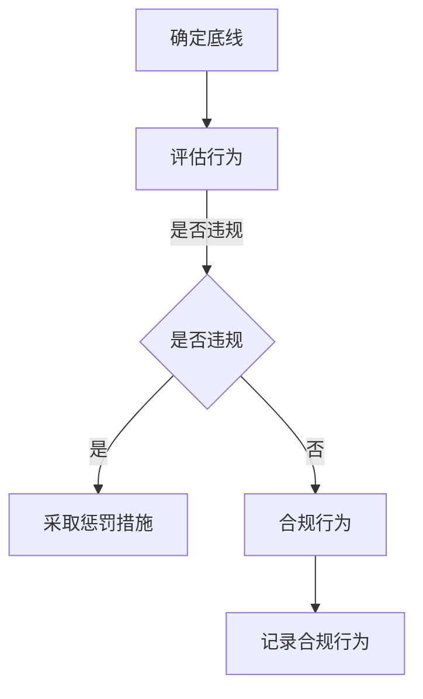
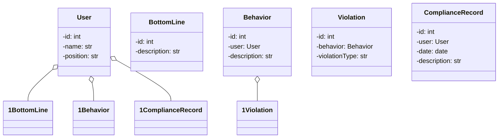
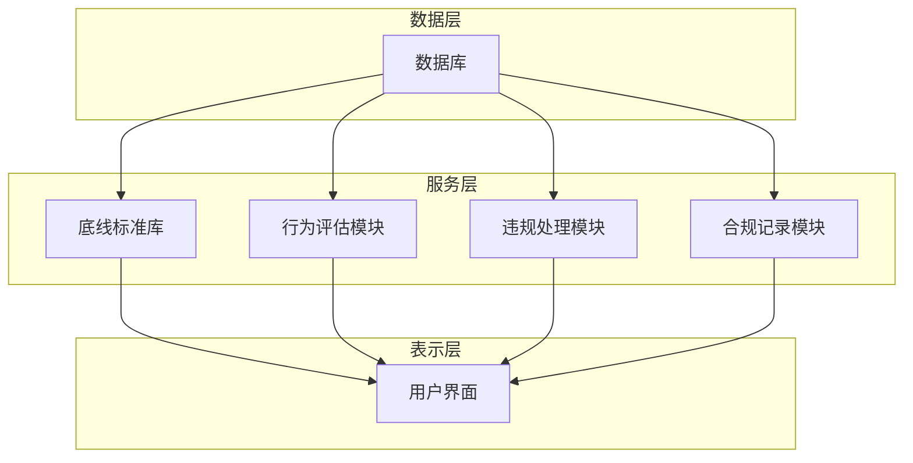
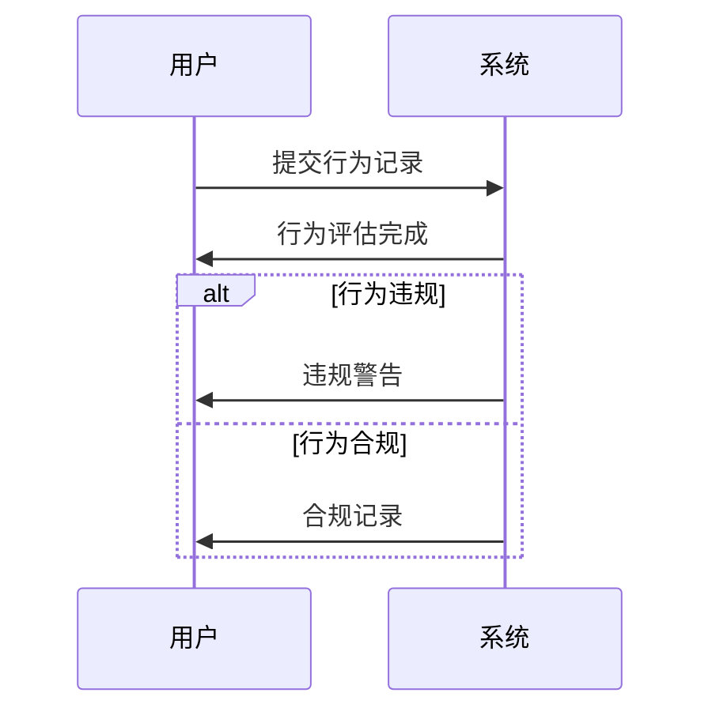
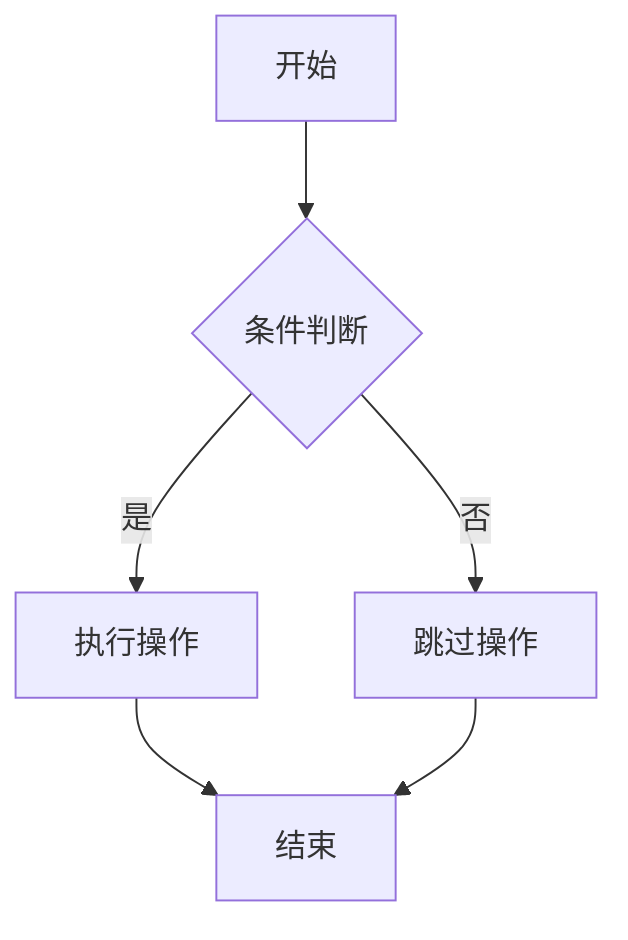

                 

# 守住底线

## 关键词
- 底线
- 道德准则
- 法律法规
- 心理建设
- 复杂决策
- 社会责任

## 摘要
在快速变化的社会和技术环境中，守住底线成为每个个体和组织面临的挑战。本文将探讨守住底线的重要性，以及如何通过道德准则、法律法规、心理建设和复杂决策等方面的策略来保持个人的原则和职业操守。文章将结合实际案例，提供实用的最佳实践和思考，帮助读者在现实环境中守住底线。

## 一、背景介绍

### 1.1 问题背景

现代社会的发展带来了前所未有的信息爆炸和决策压力。人们在日常工作和生活中需要处理大量信息，并作出快速而准确的决策。这种环境使得守住底线变得尤为重要。底线是社会行为、道德规范和职业操守的最低要求，是保障社会秩序和个体发展的基石。

### 1.2 问题描述

守住底线不仅涉及个人的道德选择，还与社会的法律和规范紧密相连。在复杂的社会环境中，如何保持原则和立场，成为每个人都需要面对的问题。本文将探讨如何在各种诱惑和压力面前守住底线。

### 1.3 问题解决

守住底线需要从多个方面入手，包括心理建设、道德修养、法律法规知识等。本文将提供一系列策略和方法，帮助读者在复杂的社会环境中保持清醒的头脑和坚定的原则。

### 1.4 边界与外延

守住底线不仅适用于个人，也适用于企业和组织。无论是在个人生活中还是在职业生涯中，守住底线都是成功的关键。此外，守住底线还涉及到多个领域的知识，包括心理学、伦理学和法律学等。

## 二、核心概念与联系

### 2.1 核心概念

**底线**：底线是个人或组织在社会行为和职业操守中的最低标准，是不可逾越的界限。

**道德准则**：道德准则是行为规范，是社会和职业生活中的基本道德要求。

**法律法规**：法律法规是国家制定或认可的行为规范，具有强制力。

**心理建设**：心理建设是提高个体心理素质和应对能力的过程。

### 2.2 概念属性特征对比表格

| 概念         | 定义                                                                 | 特征                                                         |
| ------------ | -------------------------------------------------------------------- | ------------------------------------------------------------ |
| 底线         | 最低标准，不可逾越的界限                                            | 稳定性、公正性、原则性                                       |
| 道德准则     | 行为规范，道德规范的基本要求                                        | 社会性、普遍性、主观性                                       |
| 法律法规     | 国家制定或认可的行为规范，具有强制力                                  | 规定性、强制性、稳定性                                       |
| 心理建设     | 通过自我调节和外部干预，提高心理素质和应对能力                          | 发展性、个体性、自主性                                       |

### 2.3 ER实体关系图架构

```mermaid
erDiagram
    User ||--|{ BottomLine }|
    User ||--|{ MoralCode }|
    User ||--|{ LegalRegulation }|
    User ||--|{ PsychologicalBuilding }|
```

## 三、算法原理讲解

### 3.1 算法Mermaid流程图



### 3.2 算法原理

底线守卫算法通过评估行为是否符合底线标准，来判断是否需要采取惩罚措施。算法的核心思想是通过对行为的分析，识别出违反底线的行为，并给予相应的处理。

### 3.3 数学模型和公式

底线守卫算法可以表示为：

$$
违规 = f(行为, 底线标准)
$$

其中，$f$ 是一个映射函数，将行为映射到是否违规。

### 3.4 举例说明

假设底线标准为不欺骗、不盗窃，当前行为为盗窃。根据底线守卫算法，可以判断出当前行为违反了底线标准，需要采取惩罚措施。具体步骤如下：

1. 确定底线标准：不欺骗、不盗窃。
2. 评估行为：当前行为为盗窃。
3. 判断是否违规：是。
4. 采取惩罚措施：警告或处罚。

## 四、系统分析与架构设计方案

### 4.1 问题场景介绍

在现代企业中，守住底线的重要性不言而喻。为了帮助企业员工和决策者更好地守住底线，我们需要设计一套完整的系统，包括底线评估、违规处理、合规记录等功能。

### 4.2 项目介绍

本项目旨在开发一套底线守卫系统，帮助企业和个人在复杂的社会环境中守住底线。系统将包括以下几个核心模块：

- 底线标准库：存储底线标准及相关法律法规。
- 行为评估模块：对员工行为进行实时评估。
- 违规处理模块：对违规行为进行处理。
- 合规记录模块：记录合规行为，用于绩效评估和奖励。

### 4.3 系统功能设计（领域模型mermaid类图）



### 4.4 系统架构设计（mermaid架构图）



### 4.5 系统接口设计和系统交互（mermaid序列图）



## 五、项目实战

### 5.1 环境安装

在开始项目实战之前，我们需要安装必要的开发环境和工具。以下是一个简化的安装步骤：

1. 安装Python环境（版本3.8以上）。
2. 安装数据库（如MySQL或PostgreSQL）。
3. 安装前端框架（如Django或Flask）。

### 5.2 系统核心实现源代码

以下是一个简单的底线守卫系统的实现示例：

```python
# 底线评估模块示例代码
class BehaviorAssessment:
    def __init__(self, behavior_desc):
        self.behavior_desc = behavior_desc
    
    def assess(self):
        if "欺骗" in self.behavior_desc or "盗窃" in self.behavior_desc:
            return "违规"
        else:
            return "合规"

# 违规处理模块示例代码
class ViolationHandler:
    def __init__(self, behavior, violation_type):
        self.behavior = behavior
        self.violation_type = violation_type
    
    def handle_violation(self):
        if self.violation_type == "违规":
            print("警告或处罚：", self.behavior)
        else:
            print("合规记录：", self.behavior)

# 用户界面示例代码
def user_interface():
    user_input = input("请输入您的行为描述：")
    assessment = BehaviorAssessment(user_input)
    violation_handler = ViolationHandler(user_input, assessment.assess())
    violation_handler.handle_violation()

user_interface()
```

### 5.3 代码应用解读与分析

这段代码实现了底线守卫系统的核心功能，包括行为评估和违规处理。用户输入行为描述，系统会根据预设的底线标准进行评估，并给出相应的处理结果。以下是代码的解读和分析：

1. **行为评估模块**：`BehaviorAssessment` 类用于评估用户输入的行为描述。它包含一个 `assess` 方法，该方法检查行为描述中是否包含“欺骗”或“盗窃”等关键词，以判断行为是否违规。

2. **违规处理模块**：`ViolationHandler` 类用于处理违规行为。它包含一个 `handle_violation` 方法，根据行为评估结果来决定是否发出警告或处罚。

3. **用户界面**：`user_interface` 函数提供了一个简单的命令行界面，允许用户输入行为描述，并接收系统的评估和处理结果。

### 5.4 实际案例分析和详细讲解剖析

以下是一个实际案例，用于展示底线守卫系统的应用：

**案例**：一名员工在午休时间偷窃了公司的一台笔记本电脑。

**步骤**：

1. 用户通过用户界面输入行为描述：“我在午休时间偷窃了一台笔记本电脑。”
2. 系统评估行为描述，判断是否违规。
3. 系统发现行为描述中包含“盗窃”关键词，判断为违规。
4. 系统调用违规处理模块，发出警告或处罚。

**分析**：

1. **行为评估**：系统通过关键词匹配来判断行为是否违规。这种评估方法简单有效，但可能无法涵盖所有复杂情况。在实际应用中，可能需要更复杂的评估算法。

2. **违规处理**：系统根据评估结果来决定处理方式。在实际应用中，违规处理可能包括多种措施，如警告、罚款、停职等。系统需要根据公司政策和法律法规来制定具体的处理方案。

### 5.5 项目小结

底线守卫系统的开发为企业和个人提供了一个有效的工具，用于评估行为和应对违规情况。虽然示例代码较为简单，但为实际系统的开发提供了基础。在实际应用中，系统需要更复杂的算法和更全面的法律法规库来提高评估的准确性和处理的有效性。

## 六、最佳实践 Tips

1. **明确底线标准**：制定明确的底线标准，确保所有员工都清楚公司的底线要求。

2. **定期培训**：定期对员工进行道德准则和法律法规的培训，提高他们的法律意识和道德素养。

3. **透明处理**：对于违规行为，要透明处理，确保公正性和合规性。

4. **心理支持**：为员工提供心理支持，帮助他们应对工作中的压力和挑战。

5. **技术手段**：利用技术手段，如行为分析算法和监控软件，来提高底线守卫的效率。

## 七、小结

守住底线是每个个人和组织的责任。通过道德准则、法律法规、心理建设和复杂决策等方面的策略，我们可以更好地守住底线。底线守卫系统的开发为企业和个人提供了一个有力的工具，帮助他们在复杂的社会环境中保持原则和职业操守。本文通过实际案例和项目实战，详细讲解了守住底线的核心概念、算法原理和系统设计，为读者提供了实用的指导。

## 八、注意事项

1. 底线守卫系统需要定期更新底线标准和法律法规库，以适应社会变化。

2. 系统设计要考虑用户隐私和数据安全，确保用户数据的安全性和保密性。

3. 在实际应用中，系统需要与人力资源和合规部门紧密合作，确保处理过程的公正性和合规性。

## 九、拓展阅读

1. 《计算机编程心理学》 - 作者：艾伦·J·乌尔夫
2. 《底线管理：如何在复杂环境中保持原则》 - 作者：詹姆斯·K·惠特曼
3. 《道德困境：在商业和职业生涯中的决策》 - 作者：理查德·德沃金

## 十、作者信息

作者：AI天才研究院/AI Genius Institute & 禅与计算机程序设计艺术 /Zen And The Art of Computer Programming

## 附录

### A. Mermaid图表代码示例



### B. Python源代码示例

```python
def calculate_sum(a, b):
    return a + b

print(calculate_sum(3, 5))
```

### C. LaTeX数学公式示例

```
$$
E = mc^2
$$

$$
f(x) = \frac{1}{1+x}
$$
```

### D. Markdown格式示例

```
# 标题

这是一个段落。

## 二级标题

这是另一个段落。
```

