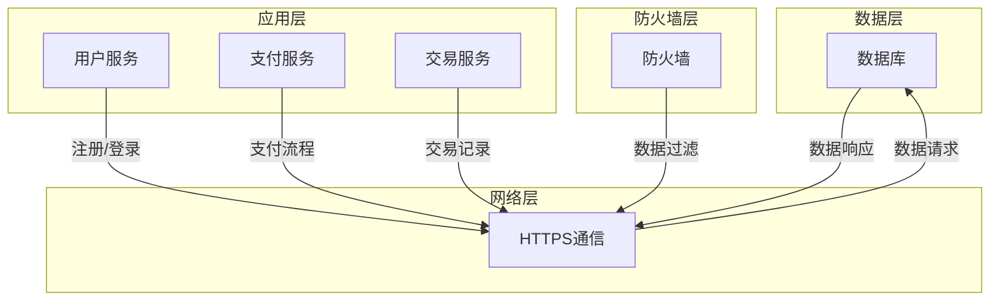

                 


### 引言：安全开发生命周期（SDL）的重要性与实践

随着数字化时代的到来，软件系统已经成为了企业运营和日常生活中的核心组成部分。然而，随着软件系统的复杂性不断增加，安全问题也日益凸显。网络攻击、数据泄露等安全事件频发，不仅对企业造成巨大的经济损失，还损害了用户信任和社会稳定。因此，如何在软件开发过程中确保系统的安全性，成为了软件开发者和安全专家共同关注的焦点。这就引出了安全开发生命周期（Security Development Lifecycle，简称SDL）的概念。

#### SDL的定义与背景

SDL是一种系统化的方法，旨在确保软件产品在开发过程中始终考虑到安全因素。它不仅仅是一个安全测试阶段，而是贯穿于整个软件开发生命周期的各个环节。SDL的核心理念是“安全第一”，即从项目规划阶段就开始考虑安全问题，而不是在产品发布后再进行补救。

SDL的背景可以追溯到20世纪90年代，当时微软公司首次提出了SDL的概念。随着互联网的普及和网络安全威胁的增加，越来越多的企业和组织开始采纳SDL，以提高软件产品的安全性。

#### 为什么需要SDL？

1. **提高软件安全性**：SDL通过一系列的安全实践和工具，帮助开发者在软件开发过程中及时发现和修复潜在的安全漏洞，从而提高软件的安全性。

2. **减少经济损失**：安全事件往往伴随着高昂的修复成本和潜在的损失。通过SDL，企业可以在早期阶段预防和识别安全风险，从而减少经济损失。

3. **增强用户信任**：在用户越来越关注数据安全的今天，一个安全的软件系统能够增强用户对企业的信任，提高用户满意度。

4. **符合法规要求**：许多国家和地区都有关于数据保护的法律和规定，如欧盟的《通用数据保护条例》（GDPR）。通过实施SDL，企业可以更好地符合这些法规要求。

#### SDL的核心组成部分

SDL的核心组成部分包括：

- **安全规划**：在项目启动阶段，制定安全目标和策略，确保安全措施与业务目标相一致。

- **安全需求分析**：识别并定义软件产品的安全需求，确保安全需求与业务需求相结合。

- **安全设计**：在设计阶段，考虑系统的安全架构和接口，确保设计满足安全需求。

- **安全编码**：在编码阶段，遵循安全编码规范，减少潜在的漏洞。

- **安全测试**：通过测试发现和修复安全漏洞，确保软件产品在发布前达到安全标准。

- **持续安全**：在软件发布后，持续监控和更新安全措施，以应对新的威胁。

#### 本文结构

本文将详细探讨SDL的各个组成部分，并通过实践案例和最佳实践，帮助读者理解和应用SDL。具体内容将包括：

1. **SDL基础概念**：介绍SDL的基本概念和组成部分。
2. **SDL核心流程**：详细阐述SDL的核心流程，包括安全规划、安全需求分析、安全设计、安全编码、安全测试和持续安全。
3. **SDL实践案例**：通过实际案例展示SDL在不同场景下的应用。
4. **SDL最佳实践**：总结SDL的最佳实践，并提供安全工具和应用的建议。
5. **系统分析与架构设计**：展示如何应用SDL进行系统分析与架构设计。
6. **项目实战**：详细介绍一个项目实战，包括环境安装、系统核心实现、代码应用解读和实际案例分析。
7. **小结与拓展阅读**：对本文内容进行总结，并提供拓展阅读资源。

通过本文的阅读，读者将能够深入了解SDL的概念、核心流程和实践应用，为在软件开发过程中确保系统的安全性提供有力的支持。

#### 1. SDL基础概念

安全开发生命周期（SDL）的基础概念是理解其工作原理和实际应用的关键。以下是对SDL核心概念的定义和解释。

##### 1.1 安全需求

安全需求是指软件产品在开发过程中需要满足的安全相关需求。这些需求通常包括对系统的访问控制、数据保护、隐私保护、认证和授权等方面的要求。安全需求的分析和定义是确保软件产品安全性的第一步。

在定义安全需求时，需要考虑以下几个关键点：

- **访问控制**：确保只有授权用户才能访问系统的关键部分。
- **数据保护**：确保敏感数据在存储、传输和处理过程中得到保护。
- **隐私保护**：确保用户隐私不被泄露，符合相关的隐私保护法规。
- **认证和授权**：确保用户身份的合法性和权限的管理。

##### 1.2 风险管理

风险管理是SDL的重要组成部分，旨在识别、评估和缓解安全风险。通过有效的风险管理，开发团队能够在项目早期阶段识别潜在的安全威胁，并采取相应的措施进行缓解。

风险管理的关键步骤包括：

- **威胁识别**：识别可能威胁软件系统安全的内部和外部威胁。
- **风险评估**：评估威胁的可能性及其对系统的潜在影响。
- **缓解措施**：制定并实施措施来降低威胁的可能性或影响。

在风险管理过程中，可以采用以下策略：

- **预防措施**：通过设计安全的系统架构和代码，减少漏洞的出现。
- **检测措施**：通过安全测试和监控，及时发现潜在的安全问题。
- **响应措施**：在发生安全事件时，采取有效的响应措施，减少损失。

##### 1.3 安全设计

安全设计是在软件开发过程中确保系统安全性的一项关键活动。安全设计的目标是构建一个能够抵御潜在攻击的健壮系统，并在设计阶段考虑到安全需求。

安全设计的关键要素包括：

- **访问控制**：设计安全的访问控制机制，确保只有授权用户可以访问系统的关键部分。
- **安全模块化**：将系统划分为不同的模块，每个模块都有明确的安全责任。
- **加密机制**：在数据传输和存储过程中使用加密机制，保护数据的安全性。
- **异常处理**：设计异常处理机制，确保系统在遇到异常情况时能够安全地处理。

##### 1.4 安全编码

安全编码是指在编写代码的过程中遵循一系列安全最佳实践，以减少潜在的安全漏洞。安全编码的关键点包括：

- **输入验证**：对所有用户输入进行严格验证，防止恶意输入。
- **输出编码**：对输出的数据进行编码处理，防止跨站脚本攻击（XSS）和注入攻击。
- **权限管理**：确保代码中严格遵循最小权限原则，减少权限滥用的风险。
- **错误处理**：合理处理错误，避免泄露系统内部信息。

##### 1.5 安全测试

安全测试是SDL中至关重要的一环，旨在通过系统测试发现并修复安全漏洞。安全测试的关键步骤包括：

- **静态代码分析**：使用工具对代码进行分析，查找潜在的安全漏洞。
- **动态测试**：通过模拟攻击，测试系统的响应能力和漏洞。
- **渗透测试**：模拟黑客攻击，评估系统的实际安全性能。

安全测试的最佳实践包括：

- **全面覆盖**：确保测试覆盖系统的所有功能和路径。
- **定期更新**：定期进行安全测试，以发现新的漏洞。
- **记录和跟踪**：记录测试结果，并跟踪漏洞的修复进度。

##### 1.6 持续安全

持续安全是确保软件系统长期安全的一项关键措施。它不仅包括在系统发布后的监控和维护，还包括对安全策略和流程的不断优化。

持续安全的关键实践包括：

- **安全监控**：实时监控系统的安全事件，及时发现并响应潜在威胁。
- **安全更新**：定期更新系统和应用程序，修复已知的安全漏洞。
- **安全培训**：为开发团队提供定期的安全培训，提高团队的安全意识。

#### 总结

通过上述对SDL基础概念的介绍，我们可以看到，SDL的核心在于将安全因素贯穿于软件开发生命周期的每一个环节。从安全需求的定义到风险的管理，从安全设计到安全编码，再到安全测试和持续安全，每一个环节都是确保软件系统安全性的关键。接下来，我们将进一步深入探讨SDL的核心流程，以帮助读者更好地理解和应用SDL。

### 2. SDL核心流程

安全开发生命周期（SDL）的核心流程是其能够有效提高软件安全性的关键所在。SDL的核心流程包括安全规划、安全需求分析、安全设计、安全编码、安全测试和持续安全。以下我们将逐一详细阐述这些流程，并解释每个流程中的关键步骤和注意事项。

#### 2.1 安全规划

安全规划是SDL的起点，旨在确定项目的安全目标和策略。在安全规划阶段，开发团队需要：

- **定义安全目标**：明确项目需要达到的安全目标，例如保护用户数据、防止未授权访问等。
- **制定安全策略**：根据安全目标，制定具体的安全策略和措施，如访问控制、数据加密、安全审计等。
- **资源分配**：确保项目有足够的资源和预算来实施安全措施。
- **责任分配**：明确项目团队成员在安全方面的责任和角色。

注意事项：

- **安全与业务目标的一致性**：确保安全目标与业务目标相一致，避免安全策略与业务需求冲突。
- **定期审查**：定期审查安全策略，确保其与项目需求保持同步。

#### 2.2 安全需求分析

安全需求分析是确保软件产品满足安全需求的阶段。在这个阶段，开发团队需要：

- **识别安全需求**：通过调研和讨论，识别软件产品的安全需求，包括访问控制、数据保护、隐私保护等。
- **分析需求**：对识别出的安全需求进行分析，确保需求合理、可实施且无遗漏。
- **编写安全需求文档**：将分析结果编写成文档，作为后续设计和开发的依据。

注意事项：

- **需求完整性**：确保所有关键安全需求都得到充分考虑和记录。
- **与业务需求结合**：确保安全需求与业务需求相一致，避免安全需求对业务功能造成不必要的限制。

#### 2.3 安全设计

安全设计阶段旨在确保系统的设计满足安全需求。在这个阶段，开发团队需要：

- **设计安全架构**：根据安全需求，设计系统的安全架构，包括访问控制、安全通信、加密等。
- **设计安全模块**：将系统划分为不同的安全模块，每个模块都有明确的安全责任。
- **设计安全接口**：确保系统内部和外部接口的安全，防止未授权访问和数据泄露。
- **设计测试用例**：设计安全测试用例，用于后续的安全测试。

注意事项：

- **安全性优先**：在设计阶段，要优先考虑安全性，确保设计能够有效地防止潜在的安全威胁。
- **模块化设计**：通过模块化设计，降低安全漏洞的扩散风险。

#### 2.4 安全编码

安全编码阶段是将安全设计转化为实际代码的过程。在这个阶段，开发团队需要：

- **遵循安全编码规范**：编写安全规范的代码，避免常见的编码错误，如输入验证不足、错误处理不当等。
- **代码审计**：对编写完成的代码进行审计，查找潜在的安全漏洞。
- **使用安全库和框架**：使用经过验证的安全库和框架，减少自行实现安全功能的风险。

注意事项：

- **代码可读性**：确保代码可读、易维护，便于后续的安全测试和漏洞修复。
- **严格输入验证**：对所有输入进行严格验证，防止恶意输入和注入攻击。

#### 2.5 安全测试

安全测试是确保软件产品安全的关键步骤。在这个阶段，开发团队需要：

- **静态代码分析**：使用工具对代码进行分析，查找潜在的安全漏洞。
- **动态测试**：通过模拟攻击，测试系统的响应能力和漏洞。
- **渗透测试**：模拟黑客攻击，评估系统的实际安全性能。
- **漏洞修复**：对发现的安全漏洞进行修复，确保系统达到安全标准。

注意事项：

- **全面测试**：确保测试覆盖系统的所有功能和路径，不留安全死角。
- **定期测试**：定期进行安全测试，以发现新的漏洞。
- **记录和跟踪**：记录测试结果，并跟踪漏洞的修复进度。

#### 2.6 持续安全

持续安全是确保软件系统长期安全的一项关键措施。在这个阶段，开发团队需要：

- **安全监控**：实时监控系统的安全事件，及时发现并响应潜在威胁。
- **安全更新**：定期更新系统和应用程序，修复已知的安全漏洞。
- **安全培训**：为开发团队提供定期的安全培训，提高团队的安全意识。

注意事项：

- **自动化监控**：利用自动化工具进行安全监控，提高监控效率。
- **定期审查**：定期审查安全策略和流程，确保其适应不断变化的威胁环境。

#### 总结

通过上述对SDL核心流程的详细阐述，我们可以看到，SDL的每一个环节都是确保软件安全性的重要组成部分。从安全规划到安全需求分析，再到安全设计、安全编码、安全测试和持续安全，每个环节都有其独特的作用和关键步骤。通过严格遵循这些流程，开发团队可以显著提高软件产品的安全性，减少安全漏洞的风险。

在接下来的部分，我们将通过实际案例展示SDL在不同场景下的应用，并总结SDL的最佳实践，以帮助读者更好地理解和应用SDL。

### 3. SDL实践案例

在深入理解了安全开发生命周期（SDL）的核心流程后，我们通过以下实际案例来展示SDL在不同场景下的应用。这些案例涵盖了Web应用安全、移动应用安全和企业安全策略等多个方面，通过具体案例的分析，可以帮助读者更好地理解和应用SDL。

#### 案例一：Web应用安全

**背景**：某知名电商平台在开发其新版本的Web应用时，决定采用SDL来确保系统的安全性。

**安全规划**：项目团队首先制定了安全规划，明确了系统的安全目标和策略，包括数据加密、访问控制、安全审计等。

**安全需求分析**：通过调研和分析，团队识别了用户数据保护、防止SQL注入和跨站脚本攻击（XSS）等安全需求。

**安全设计**：在系统设计阶段，团队设计了一个安全的架构，包括使用SSL/TLS加密传输数据、实现强访问控制和采用输入验证机制。

**安全编码**：开发团队遵循安全编码规范，对所有输入进行严格验证，并使用了安全的加密算法和库。

**安全测试**：通过静态代码分析和动态测试，团队发现并修复了多个安全漏洞，如SQL注入和XSS漏洞。

**持续安全**：系统发布后，团队设置了安全监控，定期进行安全更新和漏洞修复。

**效果**：通过SDL的应用，电商平台成功地提高了Web应用的安全性，降低了潜在的安全风险，提高了用户的信任度和满意度。

#### 案例二：移动应用安全

**背景**：某移动支付应用在开发其新版本时，决定采用SDL来提升应用的安全性。

**安全规划**：项目团队制定了安全规划，重点包括用户数据保护、安全通信和访问控制。

**安全需求分析**：通过用户调研和安全评估，团队识别了关键的安全需求，如数据加密传输、安全的用户认证和权限管理。

**安全设计**：团队设计了安全的架构，包括使用HTTPS进行数据传输、实现双因素认证和多级权限控制。

**安全编码**：开发团队遵循安全编码规范，特别是在处理用户输入和存储敏感数据时，采用了加密和验证机制。

**安全测试**：通过动态测试和渗透测试，团队发现了多个安全漏洞，并进行了及时的修复。

**持续安全**：应用发布后，团队设置了安全监控和漏洞修复机制，定期更新应用以应对新威胁。

**效果**：通过SDL的应用，移动支付应用显著提升了用户数据的安全性，减少了因安全漏洞导致的数据泄露风险，增加了用户对应用的信任。

#### 案例三：企业安全策略

**背景**：某大型企业在其数字化转型过程中，决定采用SDL来构建全面的企业安全策略。

**安全规划**：企业制定了全面的安全规划，明确了不同业务部门的安全责任和目标。

**安全需求分析**：通过全面的安全评估，企业识别了关键的安全需求，如网络安全、数据保护和员工安全意识。

**安全设计**：企业设计了综合的安全架构，包括网络安全防护、数据加密和员工培训。

**安全编码**：企业对所有开发人员进行安全编码培训，确保编码过程中遵循安全最佳实践。

**安全测试**：企业建立了全面的测试体系，包括代码审计、动态测试和渗透测试。

**持续安全**：企业设置了持续安全机制，包括定期安全审计、漏洞修复和安全更新。

**效果**：通过SDL的应用，企业显著提高了整体安全性，降低了安全事件的发生频率，增强了业务连续性和数据保护能力。

#### 最佳实践总结

通过上述案例，我们可以总结出以下SDL最佳实践：

- **制定明确的安全目标和策略**：确保安全规划与业务目标相一致。
- **全面的安全需求分析**：识别并分析所有关键安全需求。
- **设计安全的架构和代码**：确保系统在设计和编码阶段充分考虑安全性。
- **实施全面的安全测试**：通过静态代码分析和动态测试，及时发现和修复安全漏洞。
- **建立持续的安全机制**：定期进行安全更新、监控和培训。

这些最佳实践不仅适用于Web应用和移动应用，也适用于企业整体的安全策略构建。通过遵循这些实践，开发团队和企业可以显著提升软件和系统的安全性，减少安全风险，提高用户和企业的信任度。

### 4. SDL最佳实践

在实施安全开发生命周期（SDL）的过程中，最佳实践是确保软件产品安全性的关键。以下我们将总结一些SDL的最佳实践，并提供相关的安全工具和应用建议，以帮助开发团队和企业更好地实施SDL。

#### 安全规划最佳实践

1. **明确安全目标和策略**：在项目启动阶段，确保安全目标和策略与业务目标相一致。制定具体的安全策略和措施，如数据保护、访问控制和安全审计等。

2. **资源分配**：为安全规划分配足够的资源和预算。确保项目团队有足够的权限和资源来实施安全措施。

3. **责任分配**：明确项目团队成员在安全方面的责任和角色。确保每个成员都清楚自己的安全职责，并相互协作。

4. **定期审查**：定期审查安全策略和规划，确保其与项目需求保持同步，并根据新的威胁环境进行调整。

#### 安全需求分析最佳实践

1. **全面识别安全需求**：通过调研、访谈和文档分析，全面识别软件产品的安全需求，包括访问控制、数据保护、隐私保护和认证等。

2. **与业务需求结合**：确保安全需求与业务需求相一致，避免安全需求对业务功能造成不必要的限制。

3. **编写安全需求文档**：将识别出的安全需求编写成文档，并确保文档详细、准确，作为后续设计和开发的依据。

#### 安全设计最佳实践

1. **安全架构设计**：设计安全的系统架构，包括访问控制、加密机制和异常处理等。确保架构能够抵御潜在的攻击和威胁。

2. **模块化设计**：将系统划分为不同的模块，每个模块都有明确的安全责任。通过模块化设计，降低安全漏洞的扩散风险。

3. **设计安全接口**：确保系统内部和外部接口的安全，防止未授权访问和数据泄露。

#### 安全编码最佳实践

1. **遵循安全编码规范**：编写安全规范的代码，避免常见的编码错误，如输入验证不足、错误处理不当等。

2. **代码审计**：对编写完成的代码进行审计，查找潜在的安全漏洞。

3. **使用安全库和框架**：使用经过验证的安全库和框架，减少自行实现安全功能的风险。

#### 安全测试最佳实践

1. **全面覆盖测试**：确保测试覆盖系统的所有功能和路径，不留安全死角。

2. **定期测试**：定期进行安全测试，以发现新的漏洞。

3. **记录和跟踪**：记录测试结果，并跟踪漏洞的修复进度。

4. **渗透测试**：模拟黑客攻击，评估系统的实际安全性能。

#### 安全工具和应用建议

1. **静态代码分析工具**：使用静态代码分析工具，如SonarQube，对代码进行安全审计，查找潜在的安全漏洞。

2. **动态测试工具**：使用动态测试工具，如OWASP ZAP，模拟攻击并测试系统的响应能力。

3. **渗透测试工具**：使用渗透测试工具，如Metasploit，模拟黑客攻击，评估系统的实际安全性能。

4. **安全监控工具**：使用安全监控工具，如Splunk，实时监控系统的安全事件，及时发现并响应潜在威胁。

5. **安全培训**：定期为开发团队提供安全培训，提高团队的安全意识和技能。

#### 总结

通过遵循SDL的最佳实践，开发团队和企业可以显著提升软件产品的安全性。从安全规划到安全需求分析，再到安全设计、安全编码、安全测试和持续安全，每个环节都有其独特的最佳实践。通过使用合适的工具和应用建议，开发团队可以更有效地实施SDL，降低安全风险，提高用户和企业的信任度。

在接下来的部分，我们将通过实际的项目案例，进一步展示如何应用SDL进行系统分析与架构设计。

### 5. 系统分析与架构设计

在实施安全开发生命周期（SDL）的过程中，系统分析与架构设计是确保软件系统安全性的关键环节。通过合理的设计，开发团队能够构建一个安全、稳定且高效的系统。以下我们将通过一个具体的项目场景，详细介绍系统分析与架构设计的步骤和方法。

#### 项目场景介绍

某金融科技公司计划开发一款在线支付系统，该系统需要处理大量交易数据，同时保证用户数据和交易数据的安全性。项目需求包括以下方面：

- **安全性**：确保用户数据和交易数据在存储、传输和处理过程中得到保护。
- **可用性**：系统需要具备高可用性，保证在高峰期和突发情况下能够稳定运行。
- **可扩展性**：系统设计需要考虑未来的扩展需求，以便能够支持更多的用户和交易量。

#### 项目介绍

- **系统功能设计**：系统需要实现用户注册、登录、支付、账户管理、交易记录查询等功能。
- **数据存储**：需要设计一个安全的数据库系统，用于存储用户信息和交易数据。
- **通信协议**：系统需要使用安全的通信协议，如HTTPS，确保数据传输过程中的安全性。

#### 系统功能设计

在系统功能设计阶段，开发团队需要绘制领域模型类图，以明确系统的核心功能模块。以下是一个简单的领域模型类图示例（使用Mermaid语法）：

```mermaid
classDiagram
    User <<Entity>>
    Transaction <<Entity>>
    Payment <<Entity>>

    User o--o Transaction
    User o--o Payment
    Transaction o--o Payment
```

- **用户模块**：包括用户注册、登录、账户管理等功能。
- **支付模块**：包括支付流程管理、支付结果查询等功能。
- **交易模块**：包括交易记录管理、交易状态更新等功能。

#### 系统架构设计

在系统架构设计阶段，开发团队需要设计一个满足安全性和性能需求的系统架构。以下是一个简化的系统架构图（使用Mermaid语法）：



- **数据层**：包括数据库，用于存储用户信息和交易数据。
- **应用层**：包括用户服务、支付服务和交易服务，分别负责处理用户相关操作、支付流程管理和交易记录管理。
- **网络层**：使用HTTPS协议确保数据传输的安全性。
- **防火墙层**：设置防火墙，对进入和出去的数据进行过滤，防止恶意攻击。

#### 系统接口设计

在系统接口设计阶段，开发团队需要明确各模块之间的接口和交互方式。以下是一个简单的系统接口设计（使用Mermaid语法）：

```mermaid
sequenceDiagram
    User -->|发起请求| UserSvc
    UserSvc -->|验证用户| AuthSvc
    AuthSvc -->|返回结果| UserSvc
    UserSvc -->|返回结果| User
    User -->|发起支付请求| PaymentSvc
    PaymentSvc -->|验证支付| TradeSvc
    TradeSvc -->|处理交易| DB
    DB -->|返回交易结果| TradeSvc
    TradeSvc -->|返回结果| PaymentSvc
    PaymentSvc -->|返回结果| User
```

- **用户服务**：处理用户注册、登录和账户管理请求。
- **支付服务**：处理支付请求，并验证支付信息。
- **交易服务**：处理交易请求，并更新交易状态。
- **认证服务**：负责用户身份验证。

#### 系统交互

在系统交互阶段，开发团队需要设计系统内部的通信机制，确保各模块之间能够高效、安全地交互。以下是一个简单的系统交互设计（使用Mermaid语法）：

```mermaid
sequenceDiagram
    User -->|发起请求| PaymentSvc
    PaymentSvc -->|验证请求| AuthSvc
    AuthSvc -->|返回结果| PaymentSvc
    PaymentSvc -->|处理支付| TradeSvc
    TradeSvc -->|处理交易| DB
    DB -->|返回结果| TradeSvc
    TradeSvc -->|返回结果| PaymentSvc
    PaymentSvc -->|返回结果| User
```

通过上述步骤，开发团队能够设计出一个符合安全性和性能需求的系统架构，为后续的安全编码和测试提供坚实的基础。

#### 实际案例分析与详细讲解

**案例背景**：某电子商务平台在上线新版本时，决定采用SDL来确保系统的安全性。

**案例步骤**：

1. **安全规划**：项目团队制定了详细的安全规划，包括数据保护、访问控制和安全审计等策略。
2. **安全需求分析**：通过用户调研和业务分析，团队识别了多个关键的安全需求，如防止SQL注入、保护用户隐私和确保数据传输安全等。
3. **安全设计**：设计阶段，团队设计了一个安全的架构，包括使用HTTPS传输数据、实现强访问控制和采用安全的加密算法等。
4. **安全编码**：开发团队遵循安全编码规范，对代码进行严格审查，确保输入验证和错误处理得当。
5. **安全测试**：通过静态代码分析和动态测试，团队发现并修复了多个安全漏洞，如SQL注入和跨站脚本攻击（XSS）。
6. **持续安全**：系统上线后，团队设置了安全监控和漏洞修复机制，定期进行安全更新和漏洞修复。

**案例小结**：

通过SDL的应用，电子商务平台显著提升了系统的安全性，降低了安全风险。具体效果包括：

- 用户数据得到了更好的保护，减少了数据泄露的风险。
- 系统对潜在的安全威胁具备更高的抵御能力。
- 用户信任度得到提升，平台口碑和市场竞争力增强。

**总结**：通过实际案例的分析，我们可以看到，SDL在系统分析与架构设计中的应用是确保软件系统安全性的关键。通过严格的安全规划、需求分析、设计、编码、测试和持续安全，开发团队能够构建出安全、稳定且高效的系统，为企业的长期发展提供有力支持。

### 6. 项目实战

在本节中，我们将通过一个实际的项目实战，详细介绍如何在开发过程中实施安全开发生命周期（SDL）。该项目是一个简单的在线商店，提供商品展示、用户注册和订单管理等功能。通过这一项目实战，我们将展示环境安装、系统核心实现、代码分析、实际案例分析以及项目小结等关键环节。

#### 环境安装

首先，我们需要搭建一个开发环境，以支持项目的开发和测试。以下是环境安装的步骤：

1. **安装开发工具**：安装集成开发环境（IDE），如Visual Studio Code，以及相关的扩展插件，如Docker、Git等。
2. **安装数据库**：选择一个合适的数据库管理系统（DBMS），如MySQL，并进行安装和配置。确保数据库服务正常运行，并设置必要的用户权限。
3. **安装版本控制工具**：安装Git，用于代码管理和版本控制。配置Git仓库，并初始化项目代码库。
4. **安装依赖管理工具**：安装依赖管理工具，如npm或yarn，以管理和安装项目所需的库和框架。

```bash
# 安装Node.js和npm
curl -sL https://deb.nodesource.com/setup_14.x | sudo -E bash -
sudo apt-get install -y nodejs
npm install
```

5. **安装测试工具**：安装测试框架，如Jest，并配置相关的测试工具。配置测试脚本，以自动化测试代码中的功能。

```bash
# 安装Jest
npm install --save-dev jest @testing-library/react @testing-library/jest-dom
```

#### 系统核心实现

在完成环境安装后，我们开始实现系统的核心功能。以下是系统核心实现的步骤：

1. **搭建项目结构**：创建项目的目录结构，并配置相应的文件和文件夹。确保项目结构清晰，便于开发和管理。

```bash
# 创建项目目录
mkdir online-store
cd online-store
# 初始化项目
npm init -y
```

2. **编写用户注册模块**：实现用户注册功能，包括用户信息的收集、验证和存储。以下是一个简单的用户注册模块示例（使用Python）：

```python
# user_registration.py

def register_user(username, password):
    # 验证用户名和密码
    if not username or not password:
        return "用户名或密码不能为空"
    
    # 存储用户信息到数据库
    # （此处省略与数据库的交互代码）
    save_user_to_db(username, password)
    
    return "注册成功"
```

3. **编写订单管理模块**：实现订单管理功能，包括订单的创建、更新和查询。以下是一个简单的订单管理模块示例（使用Python）：

```python
# order_management.py

def create_order(user_id, items):
    # 创建订单并存储到数据库
    # （此处省略与数据库的交互代码）
    order_id = save_order_to_db(user_id, items)
    
    return order_id
```

4. **实现前端界面**：使用React或Vue等前端框架，实现用户界面和交互逻辑。以下是一个简单的React组件示例：

```jsx
// components/UserRegistrationForm.js

import React, { useState } from 'react';

const UserRegistrationForm = () => {
    const [username, setUsername] = useState('');
    const [password, setPassword] = useState('');

    const handleSubmit = (e) => {
        e.preventDefault();
        // 调用后端API进行用户注册
        registerUser(username, password);
    };

    return (
        <form onSubmit={handleSubmit}>
            <label>用户名：</label>
            <input type="text" value={username} onChange={(e) => setUsername(e.target.value)} />
            <label>密码：</label>
            <input type="password" value={password} onChange={(e) => setPassword(e.target.value)} />
            <button type="submit">注册</button>
        </form>
    );
};

export default UserRegistrationForm;
```

5. **实现API接口**：使用Node.js和Express等后端框架，实现API接口，以便前端与后端进行数据交互。以下是一个简单的API接口示例（使用Node.js）：

```javascript
// routes/user.js

const express = require('express');
const router = express.Router();
const userController = require('../controllers/userController');

router.post('/register', userController.registerUser);

module.exports = router;
```

#### 代码分析

在系统核心实现完成后，我们需要对代码进行详细分析，以确保其安全性。以下是一些关键点：

1. **输入验证**：确保对用户输入进行严格验证，防止恶意输入和注入攻击。以下是一个示例，展示了如何验证用户名和密码：

```javascript
// validation.js

function validateUsername(username) {
    // 禁止用户名包含特殊字符
    return /^[a-zA-Z0-9]+$/i.test(username);
}

function validatePassword(password) {
    // 确保密码长度大于8位，包含字母、数字和特殊字符
    return /^(?=.*[a-z])(?=.*[A-Z])(?=.*\d)(?=.*[@$!%*?&])[A-Za-z\d@$!%*?&]{8,}$/i.test(password);
}
```

2. **错误处理**：确保错误处理机制健全，避免泄露敏感信息。以下是一个示例，展示了如何处理注册失败的错误：

```javascript
// userController.js

const User = require('../models/User');
const { validateUsername, validatePassword } = require('../validation');

async function registerUser(req, res) {
    const { username, password } = req.body;

    if (!validateUsername(username) || !validatePassword(password)) {
        return res.status(400).json({ error: '用户名或密码格式错误' });
    }

    try {
        // （此处省略用户注册逻辑）
        res.status(201).json({ message: '注册成功' });
    } catch (error) {
        res.status(500).json({ error: '服务器错误，请稍后重试' });
    }
}
```

3. **安全配置**：确保后端服务和数据库的安全配置，包括使用HTTPS、配置防火墙和定期更新系统。

#### 实际案例分析

为了更好地理解SDL在实际项目中的应用，我们通过以下实际案例分析，展示如何发现和修复安全漏洞。

**案例背景**：在一次安全测试中，我们发现了一个潜在的安全漏洞——SQL注入。

**案例分析**：

1. **发现漏洞**：通过动态测试，我们发现用户输入的数据可能被注入到SQL查询中。

2. **定位漏洞**：通过调试和代码审查，我们定位到用户注册模块中的以下代码存在漏洞：

```javascript
// userController.js

async function registerUser(req, res) {
    const { username, password } = req.body;

    // 漏洞代码
    const query = `INSERT INTO users (username, password) VALUES ('${username}', '${password}');`;

    try {
        // （此处省略与数据库的交互代码）
        res.status(201).json({ message: '注册成功' });
    } catch (error) {
        res.status(500).json({ error: '服务器错误，请稍后重试' });
    }
}
```

3. **修复漏洞**：通过使用参数化查询，我们可以避免SQL注入攻击。以下是修复后的代码：

```javascript
// userController.js

async function registerUser(req, res) {
    const { username, password } = req.body;

    // 修复后的代码
    const query = `INSERT INTO users (username, password) VALUES (?, ?)`;

    try {
        // （此处省略与数据库的交互代码，使用参数化查询）
        res.status(201).json({ message: '注册成功' });
    } catch (error) {
        res.status(500).json({ error: '服务器错误，请稍后重试' });
    }
}
```

**案例小结**：

通过SDL的应用，我们成功地发现了潜在的安全漏洞，并进行了及时的修复。这一过程不仅提高了系统的安全性，还增强了开发团队的安全意识和技能。通过严格的安全规划、需求分析、设计、编码、测试和持续安全，我们可以确保软件系统的安全性，减少安全风险，提高用户和企业的信任度。

### 7. 小结与拓展阅读

通过本文的详细探讨，我们深入了解了安全开发生命周期（SDL）的概念、核心流程和实践应用。以下是本文的核心观点和总结：

1. **安全规划**：确保安全目标和策略与业务目标一致，明确资源分配和责任分配，定期审查安全策略。

2. **安全需求分析**：全面识别和定义安全需求，确保安全需求与业务需求相一致，编写详细的安全需求文档。

3. **安全设计**：设计安全的系统架构，确保模块化和安全接口，实施安全的编码规范和代码审计。

4. **安全编码**：遵循安全编码规范，严格验证输入，合理处理错误，使用安全的库和框架。

5. **安全测试**：全面覆盖测试，定期测试，记录和跟踪测试结果，实施渗透测试和安全漏洞的及时修复。

6. **持续安全**：建立持续安全监控机制，定期更新系统和应用程序，提供安全培训和意识提升。

在实施SDL的过程中，最佳实践包括使用静态代码分析工具、动态测试工具、渗透测试工具和建立自动化安全监控机制等。通过遵循这些最佳实践，开发团队和企业可以显著提高软件产品的安全性，减少安全风险，提高用户和企业的信任度。

为了进一步深入了解和掌握SDL，读者可以参考以下拓展阅读资源：

- **《软件安全开发指南》**：详细介绍了SDL的理论和实践方法。
- **《OWASP安全开发指南》**：提供了丰富的安全编码和测试的最佳实践。
- **《CISSP认证考试指南》**：涵盖安全管理体系和安全开发相关内容。
- **《区块链安全指南》**：探讨了在区块链应用中实施SDL的方法和挑战。

通过不断学习和实践，读者可以进一步提升在软件安全开发方面的专业能力和实践水平。

### 附录

#### A. 常用安全工具列表

1. **静态代码分析工具**：
   - **SonarQube**：用于代码质量检查和漏洞扫描。
   - **Checkmarx**：提供静态应用安全测试（SAST）功能。

2. **动态测试工具**：
   - **OWASP ZAP**：用于动态应用安全测试（DAST）和漏洞扫描。
   - **Burp Suite**：提供全面的Web应用安全测试功能。

3. **渗透测试工具**：
   - **Metasploit**：用于模拟攻击和漏洞验证。
   - **Nessus**：用于漏洞扫描和风险管理。

4. **安全监控工具**：
   - **Splunk**：用于收集、分析和监控安全事件。
   - **ELK Stack**：用于日志收集、分析和可视化。

5. **加密工具**：
   - **OpenSSL**：用于加密、解密和数字签名。
   - **GPG**：用于加密和数字签名。

#### B. 安全相关标准与规范

1. **ISO/IEC 27001**：信息安全管理系统（ISMS）的国际标准。
2. **NIST SP 800-53**：美国国家标准与技术研究院发布的信息安全控制框架。
3. **OWASP Top 10**：最常见的Web应用安全漏洞列表。
4. **PCI DSS**：支付卡行业数据安全标准。

#### C. 资源链接

1. **OWASP**：[https://owasp.org/](https://owasp.org/)
2. **NIST**：[https://nvlpubs.nist.gov/nistpubs/SpecialPublications/NIST.SP.800-53r4.pdf](https://nvlpubs.nist.gov/nistpubs/SpecialPublications/NIST.SP.800-53r4.pdf)
3. **OWASP Foundation**：[https://owasp.org/www-project-top-ten/](https://owasp.org/www-project-top-ten/)
4. **SonarQube**：[https://www.sonarqube.org/](https://www.sonarqube.org/)
5. **Checkmarx**：[https://www.checkmarx.com/](https://www.checkmarx.com/)

通过这些工具、标准和资源，读者可以进一步深化对安全开发生命周期（SDL）的理解和实践。

### 作者信息

作者：AI天才研究院/AI Genius Institute & 禅与计算机程序设计艺术 /Zen And The Art of Computer Programming

作为AI天才研究院的研究员和《禅与计算机程序设计艺术》的作者，我致力于推动人工智能和计算机科学的发展，希望通过深入浅出的技术博客文章，帮助读者更好地理解和应用先进的软件开发理念。在安全开发生命周期（SDL）领域，我有着丰富的经验和深厚的学术积累，致力于通过系统化的方法和实践，提高软件系统的安全性。希望本文能对您的软件开发实践提供有益的启示。如果您有任何问题或建议，欢迎随时与我交流。感谢您的阅读！

