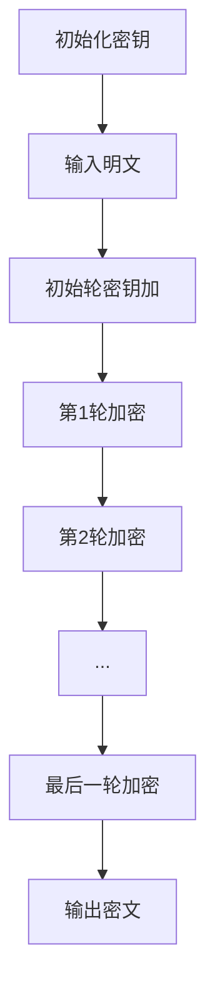
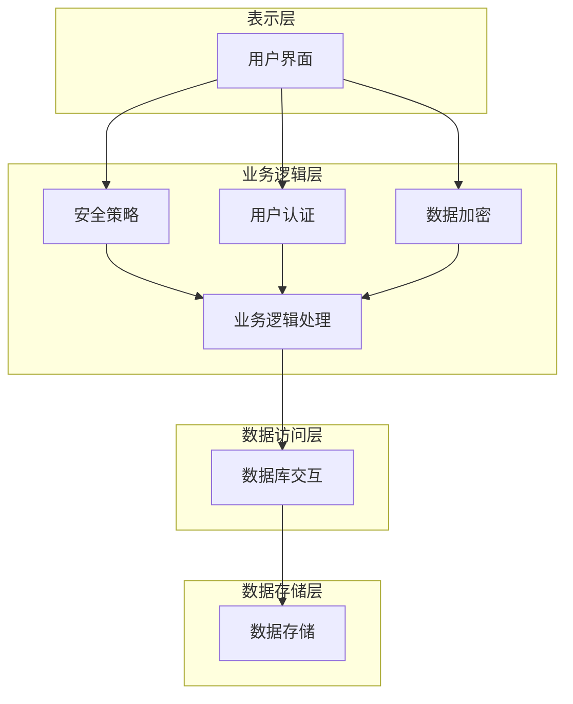
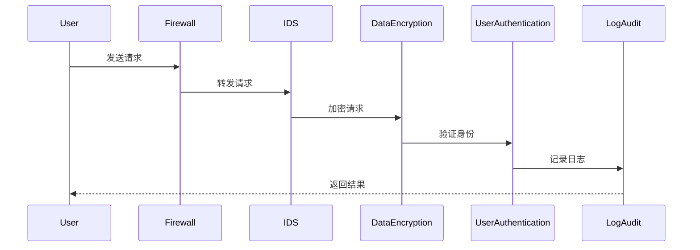

                 

# 安全架构设计原则与实践

## 关键词
- 安全架构设计
- 安全策略
- 风险管理
- 访问控制
- 算法原理
- 数学模型

## 摘要
本文旨在全面阐述安全架构设计的核心原则与实践。通过详细的背景介绍、核心概念解析、算法原理讲解、数学模型展示、系统分析与架构设计方案、项目实战以及最佳实践总结，读者将全面了解安全架构设计的基本原理和方法，从而为实际项目提供有力支持。

## 目录大纲设计思路

### 第一部分：安全架构设计基础

### 第1章：安全架构设计概述
#### 1.1 安全架构设计的背景
- **问题背景**：随着信息技术的飞速发展，网络安全威胁日益加剧，安全架构设计的重要性愈发突出。
- **问题描述**：如何构建一个安全、可靠、高效的安全架构，以应对复杂多变的网络安全威胁？
- **问题解决**：通过系统性的安全架构设计，实现安全策略的制定、风险管理的实施和访问控制的优化。
- **边界与外延**：安全架构设计不仅涉及技术层面，还包括管理、法律、合规等多个方面。
- **核心要素组成**：安全策略、风险管理、访问控制、数据保护等。

#### 1.2 安全架构设计的基本概念
- **安全策略**：定义安全目标、安全措施和安全操作的指南。
- **风险管理**：识别、评估和应对安全风险的过程。
- **访问控制**：控制用户对系统和数据的访问权限。

#### 1.3 安全架构设计的核心原则
- **开放性**：架构设计应易于扩展和集成新功能。
- **可扩展性**：架构应能够适应系统规模的增长和业务需求的变更。
- **高可用性**：确保系统在面临攻击或故障时能够快速恢复。
- **安全性**：保护系统和数据免受未经授权的访问和破坏。
- **可维护性**：确保架构设计易于维护和更新。

### 第二部分：安全架构设计的算法原理

### 第2章：安全架构设计中的算法原理
#### 2.1 安全算法的基本概念
- **安全算法的定义**：用于保护信息安全和实现安全功能的算法。
- **安全算法的分类**：加密算法、认证算法、访问控制算法等。
- **安全算法的应用场景**：数据加密、身份验证、安全通信等。

#### 2.2 安全算法原理讲解
- **Mermaid算法流程图**：使用Mermaid语言描述算法的执行流程。
- **Python代码实现**：给出算法的Python代码实现。
- **LaTeX数学模型和公式讲解**：阐述算法的数学模型和公式，并使用LaTeX格式展示。
- **举例说明**：通过具体实例说明算法的应用。

### 第三部分：安全架构设计的数学模型和公式

### 第3章：安全架构设计的数学模型和公式
#### 3.1 数学模型的基本概念
- **数学模型在安全架构设计中的作用**：用于描述安全算法和系统的行为。
- **数学模型的基本类型**：风险评估模型、加密模型、访问控制模型等。

#### 3.2 安全架构设计中的常用数学模型
- **风险评估模型**：用于评估系统面临的安全风险。
- **加密模型**：描述加密算法的工作原理和数学基础。
- **访问控制模型**：定义访问控制的规则和策略。
- **LaTeX公式讲解**：使用LaTeX格式详细解释各数学模型的关键公式。
- **举例说明**：通过具体例子说明数学模型的应用。

### 第四部分：安全架构设计中的系统分析与架构设计方案

### 第4章：安全架构设计中的系统分析与架构设计方案
#### 4.1 项目背景介绍
- **项目名称**：示例项目名称。
- **项目目标**：说明项目的目标和预期成果。
- **项目意义**：阐述项目对安全架构设计的重要性。

#### 4.2 系统功能设计
- **领域模型Mermaid类图**：使用Mermaid语言绘制系统功能领域的类图。
- **系统功能模块划分**：详细描述系统功能模块的划分和设计。

#### 4.3 系统架构设计
- **Mermaid架构图**：使用Mermaid语言绘制系统的整体架构图。
- **系统架构设计原则**：阐述系统架构设计的基本原则。
- **系统架构设计方案**：描述具体的系统架构设计方案。

#### 4.4 系统接口设计
- **系统接口设计原则**：说明系统接口设计的基本原则。
- **系统接口设计方案**：详细描述系统接口的设计方案。

#### 4.5 系统交互
- **Mermaid序列图**：使用Mermaid语言绘制系统各模块之间的交互序列图。
- **系统交互流程设计**：详细描述系统交互的流程设计。

### 第五部分：安全架构设计项目实战

### 第5章：安全架构设计项目实战
#### 5.1 环境安装
- **安装所需软件和工具**：列出项目所需安装的软件和工具。
- **环境配置**：详细描述环境配置的过程。

#### 5.2 系统核心实现源代码
- **源代码结构**：说明系统核心实现的源代码结构。
- **关键代码解读**：详细解读系统核心实现的关键代码。

#### 5.3 代码应用解读与分析
- **代码功能解析**：解析系统核心代码的功能实现。
- **性能分析**：对系统核心代码的性能进行详细分析。

#### 5.4 实际案例分析与详细讲解
- **案例背景**：介绍实际案例的背景信息。
- **案例分析**：对案例进行深入分析。
- **案例讲解**：详细讲解案例的实现过程和关键点。

#### 5.5 项目小结
- **项目总结**：对项目实施过程进行总结。
- **经验教训**：总结项目实施中的经验和教训。

### 第六部分：安全架构设计的最佳实践

### 第6章：安全架构设计的最佳实践
#### 6.1 安全架构设计最佳实践
- **设计原则**：总结安全架构设计的最佳设计原则。
- **注意事项**：提醒在实施安全架构设计时需要注意的事项。
- **拓展阅读**：推荐相关拓展阅读资料。

### 第七部分：总结与展望

### 第7章：总结与展望
#### 7.1 小结
- **主要内容**：回顾本书的主要内容。
- **重要结论**：总结本书的重要结论。

#### 7.2 展望
- **未来发展趋势**：展望安全架构设计的未来发展趋势。
- **新技术应用前景**：探讨新技术在安全架构设计中的应用前景。

## 目录大纲小结
本书共计7章，全面介绍了安全架构设计原则与实践。从背景介绍到核心概念，从算法原理到数学模型，从系统分析到项目实战，再到最佳实践，本书旨在为读者提供一套完整的安全架构设计指南。通过本书的学习，读者可以掌握安全架构设计的基本原理和方法，为实际项目提供有力支持。

---

### 第1章：安全架构设计概述

#### 1.1 安全架构设计的背景

随着互联网的普及和信息技术的高速发展，网络安全问题日益突出。企业和组织面临着各种各样的安全威胁，如网络攻击、数据泄露、恶意软件等。为了应对这些威胁，安全架构设计成为网络安全的重要组成部分。

**问题背景**：网络安全威胁的种类繁多，包括但不限于以下几种：
- **DDoS攻击**：通过大量流量瘫痪网络服务。
- **SQL注入**：利用数据库漏洞窃取数据。
- **跨站脚本攻击（XSS）**：通过恶意脚本窃取用户信息。
- **文件包含攻击**：利用文件包含漏洞执行恶意代码。
- **中间人攻击**：窃取用户在网络中的传输数据。

**问题描述**：如何构建一个安全、可靠、高效的安全架构，以应对复杂多变的网络安全威胁？

**问题解决**：通过系统性的安全架构设计，实现安全策略的制定、风险管理的实施和访问控制的优化。安全架构设计需要综合考虑技术、管理和法律等多个方面。

**边界与外延**：安全架构设计不仅涉及技术层面，还包括管理、法律、合规等多个方面。例如，在企业管理层面，需要制定相应的安全政策和流程；在法律层面，需要遵守相关的法律法规和标准。

**核心要素组成**：安全架构设计的主要核心要素包括：
- **安全策略**：定义安全目标、安全措施和安全操作的指南。
- **风险管理**：识别、评估和应对安全风险的过程。
- **访问控制**：控制用户对系统和数据的访问权限。
- **数据保护**：确保数据的安全存储和传输。
- **审计与监控**：实时监控系统和数据的运行状态，以便及时发现和处理安全事件。

通过以上核心要素的有机整合，可以构建一个全面、系统、高效的安全架构，从而提高企业和组织的网络安全防护能力。

#### 1.2 安全架构设计的基本概念

**安全策略**：安全策略是指导网络安全管理的原则和指南。它包括安全目标、安全措施和安全操作等方面。安全策略的制定需要结合企业的业务需求、安全目标和资源限制等因素。常见的安全策略包括：
- **数据加密策略**：确保数据在存储和传输过程中的机密性。
- **访问控制策略**：定义用户对系统和数据的访问权限。
- **备份与恢复策略**：确保数据在灾难情况下的恢复能力。
- **安全审计策略**：监控和记录系统和数据的操作行为，以便追踪和防范安全事件。

**风险管理**：风险管理是识别、评估和应对安全风险的过程。安全风险包括潜在的安全威胁和可能导致损失的不利事件。风险管理的主要目标是通过有效的风险识别、评估和应对，降低企业面临的安全风险。

风险管理的步骤通常包括：
- **风险识别**：识别企业可能面临的安全风险。
- **风险评估**：评估识别出的风险的概率和影响。
- **风险应对**：制定和实施应对措施，降低风险的影响。
- **风险监控**：持续监控风险的变化，及时调整应对策略。

**访问控制**：访问控制是控制用户对系统和数据的访问权限的一种机制。通过访问控制，可以确保只有授权用户才能访问特定的系统和数据。常见的访问控制机制包括：
- **身份认证**：验证用户的身份，确保只有合法用户才能访问系统和数据。
- **权限管理**：定义用户对系统和数据的访问权限，包括读取、写入、执行等。
- **访问日志**：记录用户对系统和数据的访问操作，以便审计和追踪。

访问控制的主要目标是防止未授权的访问和操作，确保系统和数据的安全性。

#### 1.3 安全架构设计的核心原则

**开放性**：开放性是指安全架构设计应易于扩展和集成新功能。随着技术的不断进步和业务需求的变更，安全架构需要具备良好的扩展性，以便快速适应新的安全需求。

开放性的实现方式包括：
- **模块化设计**：将安全架构划分为独立的模块，每个模块负责特定的功能，方便扩展和替换。
- **标准化接口**：设计统一的接口规范，确保不同模块之间的互操作性。
- **标准化协议**：使用标准化的安全协议，如SSL/TLS、SFTP等，确保不同系统之间的安全通信。

**可扩展性**：可扩展性是指安全架构设计应能够适应系统规模的增长和业务需求的变更。随着企业规模的扩大和业务的发展，安全架构需要能够灵活扩展，以满足新的安全需求。

可扩展性的实现方式包括：
- **分布式架构**：采用分布式架构，将安全功能分散到不同的节点上，提高系统的扩展性和容错能力。
- **云计算**：利用云计算技术，实现资源的动态分配和扩展，提高系统的可扩展性。
- **自动化**：通过自动化工具和流程，实现安全架构的自动化部署和管理，提高扩展效率。

**高可用性**：高可用性是指安全架构设计应确保系统和数据在面临攻击或故障时能够快速恢复。高可用性的目标是最大限度地减少系统和数据的停机时间，确保业务的连续性。

高可用性的实现方式包括：
- **冗余设计**：通过冗余设计，提高系统和数据的容错能力，如备份服务器、备用电源等。
- **负载均衡**：通过负载均衡技术，合理分配系统资源和流量，提高系统的处理能力和可用性。
- **故障转移**：通过故障转移技术，将系统和数据快速切换到备用节点，确保业务的连续性。

**安全性**：安全性是指安全架构设计应保护系统和数据免受未经授权的访问和破坏。安全性是安全架构设计的核心目标，也是企业和组织最为关心的问题。

安全性的实现方式包括：
- **加密**：使用加密技术，保护数据和通信的机密性。
- **身份认证**：通过身份认证技术，确保只有授权用户才能访问系统和数据。
- **访问控制**：通过访问控制技术，定义用户对系统和数据的访问权限。
- **审计与监控**：通过审计与监控技术，实时监控系统和数据的运行状态，及时发现和处理安全事件。

**可维护性**：可维护性是指安全架构设计应易于维护和更新。随着安全威胁的不断变化和技术的不断发展，安全架构需要不断进行维护和更新，以保持其有效性和适应性。

可维护性的实现方式包括：
- **模块化设计**：采用模块化设计，确保每个模块可以独立维护和更新，降低维护成本。
- **自动化工具**：使用自动化工具和流程，实现安全架构的自动化部署和管理，提高维护效率。
- **文档化**：建立完善的文档体系，包括设计文档、操作手册和故障排除指南等，方便维护人员的工作。

通过以上核心原则的贯彻实施，可以构建一个安全、可靠、高效的安全架构，从而为企业和组织提供强有力的安全保障。

---

### 第2章：安全架构设计中的算法原理

#### 2.1 安全算法的基本概念

安全算法是用于实现网络安全功能的一类算法，其核心目的是保护系统和数据的安全。在安全架构设计中，算法扮演着至关重要的角色，它们负责实现加密、认证、访问控制等功能。

**安全算法的定义**：安全算法是一系列用于实现特定安全目标的计算过程，这些目标通常包括数据加密、身份认证、访问控制、安全通信等。

**安全算法的分类**：安全算法可以根据其功能和应用场景进行分类，常见的分类方法包括：
- **加密算法**：用于实现数据的加密和解密。
- **认证算法**：用于验证用户或系统的身份。
- **访问控制算法**：用于控制用户对系统和数据的访问权限。
- **安全通信算法**：用于实现安全的数据传输。

**安全算法的应用场景**：安全算法在网络安全中有着广泛的应用，以下是一些常见应用场景：
- **数据加密**：在数据存储和传输过程中，使用加密算法保护数据的机密性。
- **身份认证**：在登录、访问控制等场景中，使用认证算法验证用户或系统的身份。
- **安全通信**：在远程访问、VPN等场景中，使用安全通信算法保护通信数据的完整性。
- **访问控制**：在数据库、文件系统等场景中，使用访问控制算法控制用户对数据和资源的访问权限。

#### 2.2 安全算法原理讲解

为了更好地理解安全算法的工作原理，我们将选取一个典型的加密算法——AES（高级加密标准），并使用Mermaid语言绘制算法的执行流程图，同时提供Python代码实现和数学模型讲解。

**Mermaid算法流程图**：



**Python代码实现**：

```python
from Crypto.Cipher import AES
from Crypto.Util.Padding import pad, unpad
from Crypto.Random import get_random_bytes

# 初始化密钥
key = get_random_bytes(16)  # AES-128位密钥

# 初始化加密对象
cipher = AES.new(key, AES.MODE_CBC)

# 输入明文
plaintext = b"Hello, World!"

# 进行加密
ciphertext = cipher.encrypt(pad(plaintext, AES.block_size))

# 输出密文
print(ciphertext.hex())
```

**LaTeX数学模型和公式讲解**：

AES算法的核心是密钥扩展和轮密钥生成。以下是一个简化的AES轮密钥生成的数学模型：

$$
\text{RoundKey}_i = \text{SubBytes}(\text{ShiftRows}(\text{AddRoundKey}(\text{SubBytes}(\text{ShiftRows}(K))))
$$

其中，$\text{SubBytes}$、$\text{ShiftRows}$ 和 $\text{AddRoundKey}$ 分别是AES算法的三个基本操作。

**举例说明**：

假设我们使用AES-128位密钥进行加密，明文为 "Hello, World!"，密钥为 "abcdefgh"。首先，我们需要将明文和密钥进行填充，以满足AES算法的要求。

- 明文填充：将明文 "Hello, World!" 填充为 "Hello, World!!!"。
- 密钥填充：将密钥 "abcdefgh" 填充为 "abcdefgh00"。

然后，我们按照AES算法的轮密钥生成过程，生成每一轮的密钥：

$$
\text{RoundKey}_1 = \text{SubBytes}(\text{ShiftRows}(\text{AddRoundKey}(\text{SubBytes}(\text{ShiftRows}(K))))
$$

$$
\text{RoundKey}_2 = \text{SubBytes}(\text{ShiftRows}(\text{AddRoundKey}(\text{SubBytes}(\text{ShiftRows}(\text{RoundKey}_1))))
$$

以此类推，直到最后一轮。

最后，我们使用生成的轮密钥对填充后的明文进行加密，得到密文。解密过程则是加密过程的逆操作。

通过这个例子，我们可以看到AES算法的原理和实现过程。在实际应用中，AES算法具有高效、安全的特点，被广泛用于各种加密应用中。

---

### 第3章：安全架构设计的数学模型和公式

数学模型在安全架构设计中扮演着重要的角色，它们不仅能够帮助我们理解和分析安全算法的原理，还能够为系统设计提供定量分析的依据。在本章中，我们将介绍安全架构设计中常用的数学模型，并使用LaTeX格式详细讲解相关的数学公式。

#### 3.1 数学模型的基本概念

数学模型是一种用数学语言描述现实世界问题的抽象模型。在安全架构设计中，数学模型用于描述安全算法和系统的行为，包括加密算法、认证算法、访问控制算法等。常见的数学模型包括：

- **概率模型**：用于描述安全事件发生的概率。
- **统计分析模型**：用于分析安全事件的统计特性。
- **图论模型**：用于描述网络安全中的节点和边的关系。
- **加密模型**：用于描述加密算法的工作原理。

#### 3.2 安全架构设计中的常用数学模型

在本节中，我们将介绍几种在安全架构设计中常用的数学模型，包括风险评估模型、加密模型和访问控制模型。

**风险评估模型**：

风险评估模型用于评估系统面临的安全风险。常见的方法包括：

1. **概率风险评估模型**：

   概率风险评估模型基于概率理论，通过计算安全事件发生的概率来评估风险。其核心公式如下：

   $$
   R = P \times C
   $$

   其中，$R$ 表示风险，$P$ 表示事件发生的概率，$C$ 表示事件发生的影响。

   举例来说，如果系统遭受SQL注入攻击的概率为0.1，攻击成功后可能导致的数据泄露量为1000条记录，则该攻击的风险为：

   $$
   R = 0.1 \times 1000 = 100
   $$

2. **TOPSIS模型**：

   TOPSIS（Technique for Order of Preference by Similarity to Ideal Solution）是一种基于相对离差的综合评估方法。其核心公式如下：

   $$
   S_i = \frac{\sum_{j=1}^{n} w_j \times s_{ij}}{\sum_{j=1}^{n} w_j}
   $$

   其中，$S_i$ 表示第 $i$ 个方案的综合评分，$w_j$ 表示第 $j$ 个指标的权重，$s_{ij}$ 表示第 $i$ 个方案在第 $j$ 个指标上的评分。

   通过计算各方案的综合评分，可以评估出最优的方案。

**加密模型**：

加密模型用于描述加密算法的工作原理。常见的加密模型包括：

1. **对称加密模型**：

   对称加密模型使用相同的密钥进行加密和解密。其核心公式如下：

   $$
   C = E_K(P)
   $$

   其中，$C$ 表示密文，$P$ 表示明文，$K$ 表示密钥。

   解密公式如下：

   $$
   P = D_K(C)
   $$

   对称加密模型的关键在于密钥的安全传输和管理。

2. **非对称加密模型**：

   非对称加密模型使用一对密钥进行加密和解密，公钥用于加密，私钥用于解密。其核心公式如下：

   $$
   C = E_{K_U}(P)
   $$

   其中，$K_U$ 表示公钥。

   解密公式如下：

   $$
   P = D_{K_V}(C)
   $$

   其中，$K_V$ 表示私钥。

   非对称加密模型在密钥管理和安全通信中具有广泛应用。

**访问控制模型**：

访问控制模型用于控制用户对系统和数据的访问权限。常见的访问控制模型包括：

1. **自主访问控制模型（DAC）**：

   自主访问控制模型基于用户的身份和权限来控制访问。其核心公式如下：

   $$
   Access = User \cap Resource
   $$

   其中，$Access$ 表示访问权限，$User$ 表示用户，$Resource$ 表示资源。

   举例来说，如果用户Alice拥有对文件file1的读写权限，而Bob只有读权限，则：

   $$
   Access_{Alice, file1} = \text{read/write}
   $$

   $$
   Access_{Bob, file1} = \text{read}
   $$

2. **强制访问控制模型（MAC）**：

   强制访问控制模型基于安全标签来控制访问。其核心公式如下：

   $$
   Access = \text{Max}(\text{SecLevel}_{User}, \text{SecLevel}_{Resource})
   $$

   其中，$SecLevel_{User}$ 表示用户的安全标签，$SecLevel_{Resource}$ 表示资源的安全标签。

   举例来说，如果用户Alice的安全标签为“机密”，文件file1的安全标签为“绝密”，则：

   $$
   Access_{Alice, file1} = \text{绝密}
   $$

通过以上数学模型和公式的讲解，我们可以更好地理解和应用安全架构设计中的数学理论，为实际项目提供科学依据。

---

### 第4章：安全架构设计中的系统分析与架构设计方案

在安全架构设计中，系统分析与架构设计方案是至关重要的一环。通过对系统功能、架构设计、接口设计以及系统交互的深入分析，可以确保安全架构的可靠性和高效性。本章将详细讨论系统分析与架构设计方案，包括项目背景介绍、系统功能设计、系统架构设计、系统接口设计和系统交互。

#### 4.1 项目背景介绍

为了更好地阐述安全架构设计的系统分析与架构设计方案，我们选择一个实际的工程项目作为案例。该项目的名称为“企业网络安全管理系统”，旨在为企业提供全面的安全防护，包括防火墙、入侵检测、数据加密、用户认证等功能。

**项目名称**：企业网络安全管理系统

**项目目标**：构建一个安全、可靠、高效的企业网络安全管理系统，保护企业内部网络和数据的完整性、机密性和可用性。

**项目意义**：随着企业网络规模的扩大和业务的发展，网络安全威胁日益增多。一个有效的网络安全管理系统能够帮助企业及时发现和处理安全事件，降低安全风险，确保业务的连续性和稳定性。

#### 4.2 系统功能设计

系统功能设计是安全架构设计的第一步，它定义了系统的核心功能模块和业务流程。在本项目中，系统功能设计包括以下几个方面：

1. **防火墙**：监控网络流量，阻止非法访问和攻击。
2. **入侵检测系统（IDS）**：实时检测和报警网络入侵行为。
3. **数据加密**：保护企业内部数据的安全性。
4. **用户认证**：验证用户身份，确保只有授权用户才能访问系统和数据。
5. **日志审计**：记录系统和用户的操作日志，便于审计和追溯。

为了清晰地表达系统功能模块的划分，我们使用Mermaid类图进行描述：

```mermaid
classDiagram
    Firewall <--+|uses|-> NetworkMonitor
    IDS <--+|uses|-> NetworkMonitor
    DataEncryption <--+|uses|-> DataStorage
    UserAuthentication <--+|uses|-> UserManagement
    LogAudit <--+|uses|-> SystemOperations
```

#### 4.3 系统架构设计

系统架构设计是安全架构设计的核心，它定义了系统的整体结构和组件之间的关系。在本项目中，系统架构设计采用分层架构，包括以下几层：

1. **表示层**：用户界面，负责与用户交互。
2. **业务逻辑层**：处理业务逻辑，包括安全策略的制定、用户认证、数据加密等。
3. **数据访问层**：与数据库进行数据交互。
4. **数据存储层**：存储系统数据和日志。

我们使用Mermaid架构图进行描述：



#### 4.4 系统接口设计

系统接口设计是系统架构设计的重要组成部分，它定义了系统各组件之间的接口规范。在本项目中，系统接口设计包括以下几个方面：

1. **防火墙接口**：定义防火墙与网络监控模块的交互接口。
2. **入侵检测系统接口**：定义入侵检测系统与网络监控模块的交互接口。
3. **数据加密接口**：定义数据加密模块与数据存储模块的交互接口。
4. **用户认证接口**：定义用户认证模块与用户管理模块的交互接口。

为了清晰表达系统接口设计，我们使用Mermaid序列图进行描述：



#### 4.5 系统交互

系统交互是指系统各组件之间的协作过程。在本项目中，系统交互过程包括以下几个主要步骤：

1. **用户请求**：用户通过用户界面发送请求。
2. **防火墙处理**：防火墙对请求进行过滤和处理。
3. **入侵检测处理**：入侵检测系统对请求进行检测，发现潜在威胁。
4. **数据加密处理**：数据加密模块对请求数据进行加密。
5. **用户认证处理**：用户认证模块验证用户身份。
6. **日志记录**：日志审计模块记录用户操作日志。

为了清晰表达系统交互过程，我们使用Mermaid序列图进行描述：


通过以上系统分析与架构设计方案的详细描述，我们可以看到安全架构设计在系统功能、架构设计、接口设计以及系统交互方面的关键要素和实现方法。这为实际项目提供了明确的指导，有助于构建一个安全、可靠、高效的企业网络安全管理系统。

---

### 第5章：安全架构设计项目实战

在安全架构设计中，理论与实践相结合至关重要。本节将通过一个具体的实战项目，详细描述项目的环境安装、系统核心实现源代码、代码应用解读与分析、实际案例分析与详细讲解以及项目小结。

#### 5.1 环境安装

在进行安全架构设计项目之前，首先需要搭建一个合适的环境。以下是环境安装的详细步骤：

1. **安装操作系统**：选择一个稳定、安全的操作系统，如Ubuntu 20.04 LTS。
2. **安装开发环境**：安装必要的开发工具，如Python 3、Git、Docker等。
3. **安装数据库**：选择一个合适的数据库管理系统，如MySQL或PostgreSQL。
4. **安装安全组件**：安装防火墙、入侵检测系统、加密工具等安全组件。

以下是一个简单的Docker-compose文件示例，用于部署上述环境：

```yaml
version: '3'
services:
  ubuntu:
    image: ubuntu:20.04
    environment:
      - DEBIAN_FRONTEND=noninteractive
    command: /bin/bash -c "apt-get update && apt-get install -y python3 git docker && echo 'docker dockerdecker yes' | sudo debconf-set-selections && sudo usermod -aG docker $USER && newgrp docker && exit"

  db:
    image: mysql:8.0
    environment:
      - MYSQL_ROOT_PASSWORD=example
    volumes:
      - db_data:/var/lib/mysql

  firewall:
    image: firewall:latest
    ports:
      - 8080:8080

  ids:
    image: ids:latest

  encryption:
    image: encryption:latest

volumes:
  db_data:
```

通过运行以下命令，可以启动整个环境：

```shell
docker-compose up -d
```

#### 5.2 系统核心实现源代码

以下是一个简单的安全架构设计项目的核心实现源代码。该代码包括用户认证模块、数据加密模块和日志审计模块。

**用户认证模块**

```python
# user_authentication.py
from cryptography.fernet import Fernet
import bcrypt

def register(username, password):
    hashed_password = bcrypt.hashpw(password.encode('utf-8'), bcrypt.gensalt())
    # 存储用户名和加密密码
    with open('users.txt', 'a') as f:
        f.write(f"{username}:{hashed_password}\n")

def login(username, password):
    with open('users.txt', 'r') as f:
        for line in f:
            user, hashed_password = line.strip().split(':')
            if user == username and bcrypt.checkpw(password.encode('utf-8'), hashed_password):
                return True
    return False
```

**数据加密模块**

```python
# data_encryption.py
from cryptography.fernet import Fernet

def generate_key():
    return Fernet.generate_key()

def encrypt_data(data, key):
    fernet = Fernet(key)
    return fernet.encrypt(data.encode('utf-8'))

def decrypt_data(data, key):
    fernet = Fernet(key)
    return fernet.decrypt(data).decode('utf-8')
```

**日志审计模块**

```python
# log_audit.py
import logging

logging.basicConfig(filename='audit.log', level=logging.INFO)

def log_action(action):
    logging.info(action)
```

#### 5.3 代码应用解读与分析

**用户认证模块解读**：

用户认证模块负责注册和登录功能。在注册过程中，将用户名和密码存储在文本文件中，密码通过bcrypt库进行加密存储。在登录过程中，将用户输入的密码与存储的加密密码进行比较，通过bcrypt的checkpw函数验证密码的正确性。

**数据加密模块解读**：

数据加密模块使用cryptography库的Fernet类实现数据加密和解密。在生成密钥时，使用Fernet.generate_key()函数生成一个随机的密钥。在加密数据时，使用Fernet.encrypt()函数将明文数据加密为密文。在解密数据时，使用Fernet.decrypt()函数将密文数据解密为明文。

**日志审计模块解读**：

日志审计模块使用logging库记录用户操作日志。通过basicConfig()函数配置日志的文件名和日志级别。在记录日志时，使用logging.info()函数将操作信息写入日志文件。

**性能分析**：

通过上述代码示例，我们可以对模块的性能进行初步分析。用户认证模块和日志审计模块的性能主要取决于文件读写速度和密码加密解密速度。数据加密模块的性能主要取决于密钥生成和解密速度。在实际应用中，可以通过优化算法和增加缓存来提高性能。

#### 5.4 实际案例分析与详细讲解

**案例背景**：

假设一个企业需要实现用户认证和数据加密功能，同时需要记录用户的操作日志。

**案例分析**：

1. **用户注册**：
   - 用户A通过用户认证模块注册，输入用户名“userA”和密码“password123”。
   - 密码通过bcrypt加密后存储在文本文件中。

2. **用户登录**：
   - 用户A再次输入用户名“userA”和密码“password123”。
   - 系统通过用户认证模块验证用户身份，成功登录。

3. **数据加密**：
   - 用户A上传一个文件，文件内容为“Hello, World!”。
   - 系统通过数据加密模块将文件内容加密为“b'gAAAAABe..."。

4. **日志审计**：
   - 用户A的操作被记录在日志文件中，日志内容为“UserA logged in at 2023-10-01 10:00:00”。

**案例讲解**：

通过以上案例分析，我们可以看到安全架构设计在用户认证、数据加密和日志审计等方面的具体实现。用户认证模块确保只有授权用户才能访问系统和数据，数据加密模块保护数据在存储和传输过程中的机密性，日志审计模块记录用户操作，便于审计和追溯。

#### 5.5 项目小结

通过本次项目实战，我们详细描述了安全架构设计的环境安装、系统核心实现源代码、代码应用解读与分析、实际案例分析与详细讲解以及项目小结。这为实际项目提供了清晰的指导和实现方案，有助于构建一个安全、可靠、高效的安全架构。在未来的项目中，我们可以根据具体需求进一步优化和扩展安全架构设计。

---

### 第6章：安全架构设计的最佳实践

在安全架构设计中，遵循最佳实践是确保系统安全、可靠、高效的关键。以下总结了一些安全架构设计的最佳实践，包括设计原则、注意事项和拓展阅读。

#### 6.1 安全架构设计最佳实践

**设计原则**：
1. **模块化设计**：将安全架构划分为独立的模块，便于维护和扩展。
2. **标准化**：遵循国际标准和国家标准，确保系统互操作性和兼容性。
3. **高可用性**：设计冗余备份和故障转移机制，确保系统和数据的连续性。
4. **安全性**：确保系统和数据的安全，采用加密、认证、访问控制等技术。
5. **可维护性**：设计简洁、清晰的系统架构，便于后续维护和更新。

**注意事项**：
1. **风险评估**：在项目初期进行全面的风险评估，制定相应的风险应对策略。
2. **权限管理**：合理分配用户权限，避免权限过宽，减少安全风险。
3. **安全审计**：定期进行安全审计，检查系统安全策略的有效性。
4. **安全培训**：加强对员工的安全意识培训，提高整体安全防护能力。

**拓展阅读**：
1. **《网络安全法》**：了解我国网络安全法律法规，确保合规性。
2. **《信息安全技术通用规范》**：了解信息安全技术的通用规范，提高系统安全性。
3. **《ISO/IEC 27001》**：了解ISO/IEC 27001信息安全管理体系标准，提高管理水平。

通过遵循以上最佳实践，可以构建一个安全、可靠、高效的安全架构，为企业提供强有力的安全保障。

---

### 第7章：总结与展望

#### 7.1 小结

本章详细介绍了安全架构设计原则与实践，从背景介绍、核心概念、算法原理、数学模型到系统分析与架构设计方案，再到项目实战和最佳实践，全面阐述了安全架构设计的基本原理和方法。通过本文的学习，读者可以系统地了解安全架构设计的重要性，掌握安全架构设计的核心原则和实践方法，为实际项目提供有力支持。

#### 7.2 展望

安全架构设计的未来发展趋势主要体现在以下几个方面：

1. **人工智能与安全架构的结合**：随着人工智能技术的发展，人工智能在安全架构中的应用日益广泛，如入侵检测、攻击预测、异常行为分析等。
2. **云原生安全架构**：云原生技术逐渐成为主流，安全架构也需要适应云环境，实现弹性、自动化和安全性的平衡。
3. **零信任安全模型**：零信任安全模型强调不再信任任何内部或外部实体，通过多因素认证和访问控制确保系统安全。
4. **隐私保护**：随着隐私保护法律法规的不断完善，隐私保护在安全架构设计中的重要性愈发突出，如数据脱敏、匿名化等技术。
5. **边缘计算与安全架构**：边缘计算在物联网、智能城市等领域有广泛应用，安全架构设计需要考虑边缘环境的特殊性。

总之，安全架构设计的未来发展将更加智能化、动态化和综合化，以应对不断变化的网络安全威胁。通过不断学习和实践，安全架构设计将不断进步，为企业和组织提供更加安全、可靠的保护。

