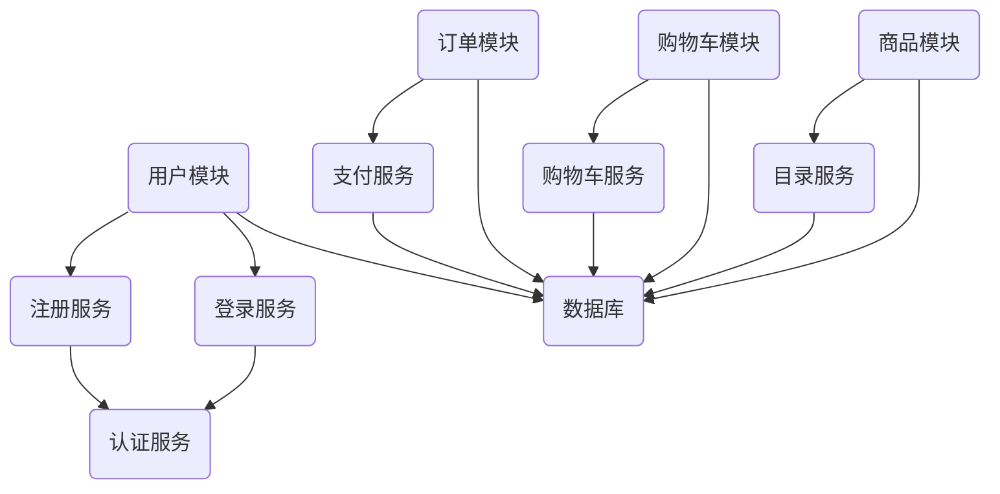
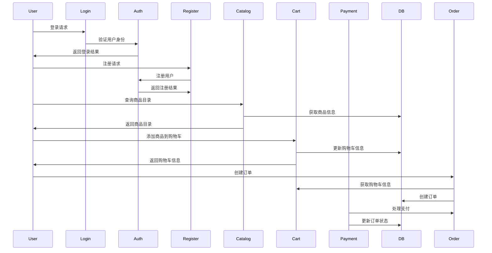

                 

### 文章标题

# 安全编码指南：构建安全可靠的应用系统

### 关键词

- 安全编码
- 应用系统
- 漏洞防护
- 加密技术
- 最佳实践

### 摘要

随着信息技术的快速发展，应用系统在各个行业中的作用越来越重要。然而，安全问题也日益凸显。本文将系统地探讨安全编码的重要性、核心概念、最佳实践以及常见漏洞防护方法，帮助开发者构建安全可靠的应用系统。

---

## 引言

在现代信息社会中，应用系统已经深入到我们日常生活的方方面面，从简单的网站到复杂的物联网系统，这些系统都需要处理大量的数据和信息。随着黑客攻击手段的不断升级，应用系统的安全性成为开发者关注的焦点。安全编码作为一种预防性措施，旨在从根本上提高软件的安全性和可靠性。

### 安全编码的重要性

安全编码不仅仅是为了防止系统被攻击，更是为了保护用户的隐私和数据安全。一个安全的应用系统能够有效减少以下风险：

1. **数据泄露**：敏感信息泄露可能导致严重的后果，如财务损失、个人隐私泄露等。
2. **业务中断**：系统被攻击可能导致服务中断，影响业务运营和客户体验。
3. **法律风险**：不安全的系统可能导致法律纠纷和罚款。

因此，安全编码不仅是技术问题，也是法律和道德问题。

### 安全编码的挑战

1. **复杂性和多样性**：现代应用系统通常非常复杂，涉及多种技术栈和平台。
2. **快速迭代**：在敏捷开发模式下，安全考虑可能被忽视。
3. **专业知识**：安全编码需要开发者具备一定的安全知识和经验。

### 安全编码的机遇

1. **安全工具和框架**：随着安全技术的发展，开发者可以利用各种安全工具和框架来提升编码安全性。
2. **安全意识提升**：越来越多的开发者开始重视安全编码，推动了整个行业的安全水平提升。

### 结论

安全编码是构建安全可靠应用系统的基石。通过本文的探讨，我们希望开发者能够认识到安全编码的重要性，并在实践中采取有效的措施来提升系统的安全性。

---

## 安全编码核心概念

### 安全威胁与攻击类型

安全威胁可以分为以下几类：

1. **恶意软件**：如病毒、木马等。
2. **网络攻击**：如DDoS攻击、中间人攻击等。
3. **社会工程学攻击**：如钓鱼攻击、社交工程攻击等。
4. **应用层攻击**：如SQL注入、XSS攻击等。

### 安全设计原则

1. **最小权限原则**：系统组件应仅拥有执行其任务所需的最低权限。
2. **隔离原则**：不同功能模块应相互隔离，以限制攻击的范围。
3. **防御性编程**：在设计和实现代码时，应考虑各种可能的攻击手段，并采取相应的防御措施。

### 安全编码原则

1. **代码审计**：定期进行代码审计，发现和修复潜在的安全漏洞。
2. **安全测试**：对代码进行安全测试，包括静态测试和动态测试。
3. **安全培训**：提高开发者的安全意识，确保他们了解安全编码的最佳实践。

### 背景介绍

安全编码的核心概念包括对安全威胁的理解、安全设计原则的遵循以及安全编码实践的实施。以下是对这些概念的具体说明：

#### 安全威胁

安全威胁是指那些可能对系统造成损害的因素。这些威胁可以来自外部，如黑客攻击、恶意软件等，也可以来自内部，如员工滥用权限。常见的安全威胁包括但不限于：

- **恶意软件**：恶意软件是一种通过互联网或其他途径传播的恶意程序，如病毒、木马等。它们可以窃取敏感信息、破坏系统或阻止系统正常运作。
- **网络攻击**：网络攻击是指针对计算机网络或其组件的非法入侵或攻击行为。常见的网络攻击包括拒绝服务攻击（DDoS）、中间人攻击（MITM）等。
- **社会工程学攻击**：社会工程学攻击利用人类的心理弱点，诱使受害者泄露敏感信息或执行不利操作。例如，钓鱼攻击通过伪装成合法的电子邮件或网站来获取受害者的个人信息。

#### 问题背景与问题描述

在现代数字化时代，应用系统的安全性问题愈发突出。随着互联网的普及和大数据技术的发展，越来越多的企业和个人依赖应用系统来处理和管理数据。这些系统涉及大量的敏感信息，如个人信息、财务数据等。如果这些系统存在安全漏洞，可能会被黑客攻击，导致数据泄露、系统瘫痪等严重后果。

因此，确保应用系统的安全性已经成为企业必须面对的挑战。开发者需要深入了解各种安全威胁，并采取相应的措施来防范。

#### 问题解决

要解决应用系统的安全性问题，开发者需要采取以下几种策略：

1. **安全需求分析**：在系统设计阶段，明确系统的安全需求，包括对数据的保护、用户身份验证、访问控制等。
2. **安全架构设计**：在设计系统架构时，考虑如何实现安全功能，如使用加密技术保护数据传输、采用多因素身份验证等。
3. **代码审计**：定期对代码进行审计，发现并修复潜在的安全漏洞。代码审计可以是静态的，也可以是动态的。
4. **安全测试**：对系统进行安全测试，包括渗透测试、漏洞扫描等，以验证系统的安全性。
5. **安全培训**：提高开发者的安全意识，确保他们了解并遵循安全编码的最佳实践。

#### 边界与外延

安全编码不仅涉及技术层面，还包括管理层面。例如，企业需要制定相应的安全政策和规范，确保所有员工都遵守。此外，安全编码还涉及法律和道德方面，开发者需要意识到他们的行为可能对社会和用户产生的影响。

#### 概念结构与核心要素组成

安全编码的概念结构主要包括以下几个核心要素：

1. **安全需求**：明确系统的安全目标和要求。
2. **安全设计**：制定系统的安全架构和策略。
3. **安全实现**：将安全设计转化为实际的代码和配置。
4. **安全测试**：验证系统的安全性，发现并修复漏洞。
5. **安全维护**：持续监控和更新系统，确保其安全性。

### 安全设计原则

在安全设计阶段，开发者需要遵循一些核心原则来确保系统的安全性。以下是一些关键原则：

#### 最小权限原则

最小权限原则是指系统组件（如用户、进程等）应仅拥有执行其任务所需的最低权限。这可以限制攻击者在系统中的活动范围，即使系统的一部分被攻破，攻击者也无法访问其他敏感资源。

#### 隔离原则

隔离原则是指将系统的不同功能模块隔离开来，以防止攻击从一个模块传播到另一个模块。例如，将用户数据和业务逻辑分开处理，可以降低攻击的风险。

#### 安全编码原则

安全编码原则是指在编写代码时遵循一些最佳实践，以减少潜在的安全漏洞。以下是一些常见的原则：

1. **输入验证**：对用户输入进行严格的验证，以防止恶意输入导致安全漏洞。
2. **输出编码**：对输出进行编码或过滤，以防止跨站脚本攻击（XSS）。
3. **使用安全的API和库**：避免使用已知的漏洞库，并定期更新依赖项。

### 安全编码原则

在编写代码时，开发者应遵循一系列安全编码原则，以确保代码的可靠性和安全性。以下是一些关键原则：

1. **输入验证**：对所有用户输入进行验证，确保输入数据的合法性。可以使用白名单或正则表达式进行验证。
2. **输出编码**：对输出进行编码或过滤，以防止跨站脚本攻击（XSS）。
3. **使用安全的API和库**：避免使用已知的漏洞库，并定期更新依赖项。
4. **避免硬编码密码**：使用配置文件或加密存储密码，而不是将密码硬编码在代码中。
5. **使用安全函数和库**：选择和使用经过严格测试的安全函数和库，以减少安全漏洞。
6. **权限控制**：确保系统中的所有操作都经过适当的权限验证，以防止未授权访问。

#### 概念属性特征对比表格

以下是安全编码原则的一些属性特征对比表格：

| 原则 | 特征 |
| --- | --- |
| 输入验证 | - 防止恶意输入<br>- 确保输入数据的合法性 |
| 输出编码 | - 防止跨站脚本攻击<br>- 确保输出数据的合法性 |
| 使用安全的API和库 | - 减少安全漏洞<br>- 提高代码质量 |
| 避免硬编码密码 | - 提高密码安全性<br>- 方便密码管理 |
| 使用安全函数和库 | - 减少安全漏洞<br>- 提高代码效率 |

#### ER实体关系图架构的Mermaid流程图

以下是安全编码核心概念的一个ER实体关系图架构的Mermaid流程图：

```mermaid
erDiagram
    User ||--|{ Request } : "sends"
    Request ||--|{ Response } : "receives"
    System ||--|{ SecurityRule } : "enforces"
    User ||--|{ Authentication } : "authenticates"
    Request ||--|{ Validation } : "validates"
    Response ||--|{ OutputEncoding } : "encodes"
```

这个流程图展示了用户、请求、系统、认证、验证和输出编码等实体之间的关系。

### 算法原理讲解

#### SQL注入原理

SQL注入是一种常见的网络攻击手段，通过在输入字段中插入恶意的SQL代码，攻击者可以执行未经授权的数据库操作。以下是一个简单的SQL注入攻击示例：

```python
user_input = input("请输入用户名：")
query = "SELECT * FROM users WHERE username = '" + user_input + "'"
cursor.execute(query)
```

在这个例子中，攻击者可以输入`" OR "1"="1`，使得查询条件永远为真：

```python
user_input = input("请输入用户名：")
query = "SELECT * FROM users WHERE username = '" + user_input + "'"
cursor.execute(query)
```

结果变为：

```sql
SELECT * FROM users WHERE username = '' OR "1"="1'
```

这会导致数据库返回所有用户的数据，从而泄露敏感信息。

#### SQL注入防护措施

为了防止SQL注入攻击，可以采取以下几种措施：

1. **使用预处理语句**：使用预处理语句（Prepared Statements）可以防止SQL注入。预处理语句将SQL语句和参数分离，由数据库引擎进行解析和编译，从而避免了恶意SQL代码的执行。

```python
user_input = input("请输入用户名：")
query = "SELECT * FROM users WHERE username = %s"
cursor.execute(query, (user_input,))
```

2. **使用参数化查询**：参数化查询与预处理语句类似，但更加灵活。它允许开发者传递多个参数，并确保参数的安全处理。

```python
user_input = input("请输入用户名：")
query = "SELECT * FROM users WHERE username = ?"
cursor.execute(query, (user_input,))
```

3. **输入验证**：对用户输入进行严格的验证，确保输入数据的合法性。可以使用正则表达式、白名单等方式进行验证。

```python
import re
valid_username = re.match("^[a-zA-Z0-9]+$", user_input)
if valid_username:
    query = "SELECT * FROM users WHERE username = %s"
    cursor.execute(query, (user_input,))
else:
    print("无效的用户名")
```

4. **使用安全的API和库**：避免使用已知的漏洞库，并定期更新依赖项。

```python
# 使用Python的sqlite3模块进行数据库操作
import sqlite3
conn = sqlite3.connect("database.db")
cursor = conn.cursor()
```

#### Python代码示例

以下是一个使用Python进行SQL注入防护的示例：

```python
import sqlite3
import re

def validate_username(username):
    return re.match("^[a-zA-Z0-9]+$", username)

def get_user(username):
    if validate_username(username):
        conn = sqlite3.connect("database.db")
        cursor = conn.cursor()
        query = "SELECT * FROM users WHERE username = ?"
        cursor.execute(query, (username,))
        user = cursor.fetchone()
        conn.close()
        return user
    else:
        return None

user_input = input("请输入用户名：")
user = get_user(user_input)
if user:
    print("用户找到：", user)
else:
    print("用户不存在")
```

在这个示例中，我们首先对用户输入进行验证，确保其符合正则表达式`^[a-zA-Z0-9]+$`，然后使用参数化查询来执行数据库查询操作，从而防止SQL注入。

### 系统分析与架构设计方案

#### 问题场景介绍

在一个在线购物平台中，用户需要注册账号、登录系统、浏览商品、添加购物车、下单等操作。为了提高系统的安全性，我们需要设计一个安全可靠的架构，以防止各种安全威胁。

#### 项目介绍

项目名称：安全在线购物平台

项目目标：构建一个安全、可靠、易于扩展的在线购物平台，满足用户的基本购物需求，并确保系统的安全性。

#### 系统功能设计（领域模型Mermaid类图）

以下是系统功能设计的领域模型Mermaid类图：

```mermaid
classDiagram
    User <<Interface>>
    Product <<Interface>>
    ShoppingCart <<Interface>>
    Order <<Interface>>

    UserhasClass "id" "name" "password" "email"
    ProducthasClass "id" "name" "price" "description"
    ShoppingCarthasClass "id" "user_id" "products"
    OrderhasClass "id" "user_id" "products" "total" "status"

    User --|> Product
    User --|> ShoppingCart
    User --|> Order
    ShoppingCart --|> Product
    Order --|> ShoppingCart
```

在这个类图中，我们定义了用户（User）、商品（Product）、购物车（ShoppingCart）和订单（Order）等核心实体，并展示了它们之间的关系。

#### 系统架构设计（Mermaid架构图）

以下是系统架构设计的Mermaid架构图：



在这个架构图中，我们展示了系统的各个模块以及它们与数据库之间的交互关系。

#### 系统接口设计和系统交互（Mermaid序列图）

以下是系统接口设计和系统交互的Mermaid序列图：



在这个序列图中，我们展示了用户与系统各模块之间的交互流程。

### 项目实战

#### 环境安装

1. 安装Python环境（版本3.8或以上）
2. 安装数据库（如MySQL或PostgreSQL）
3. 安装必要的依赖库（如Flask、SQLAlchemy等）

#### 系统核心实现源代码

以下是系统核心实现的源代码：

```python
# user.py
from flask import Flask, request, jsonify
from models import User
from db import db

app = Flask(__name__)

@app.route('/register', methods=['POST'])
def register():
    data = request.get_json()
    user = User.query.filter_by(username=data['username']).first()
    if user:
        return jsonify({'message': '用户已存在'})
    new_user = User(username=data['username'], password=data['password'], email=data['email'])
    db.session.add(new_user)
    db.session.commit()
    return jsonify({'message': '注册成功'})

@app.route('/login', methods=['POST'])
def login():
    data = request.get_json()
    user = User.query.filter_by(username=data['username'], password=data['password']).first()
    if user:
        return jsonify({'token': user.token})
    return jsonify({'message': '登录失败'})

# product.py
from flask import Flask, request, jsonify
from models import Product
from db import db

app = Flask(__name__)

@app.route('/catalog', methods=['GET'])
def catalog():
    products = Product.query.all()
    return jsonify(products)

@app.route('/product', methods=['POST'])
def add_product():
    data = request.get_json()
    new_product = Product(name=data['name'], price=data['price'], description=data['description'])
    db.session.add(new_product)
    db.session.commit()
    return jsonify({'message': '商品添加成功'})

# cart.py
from flask import Flask, request, jsonify
from models import ShoppingCart
from db import db

app = Flask(__name__)

@app.route('/cart', methods=['GET'])
def get_cart():
    user_id = request.args.get('user_id')
    cart = ShoppingCart.query.filter_by(user_id=user_id).first()
    if cart:
        return jsonify(cart.products)
    return jsonify({'message': '购物车为空'})

@app.route('/cart', methods=['POST'])
def add_to_cart():
    data = request.get_json()
    user_id = data['user_id']
    product_id = data['product_id']
    cart = ShoppingCart.query.filter_by(user_id=user_id).first()
    if not cart:
        cart = ShoppingCart(user_id=user_id, products=[product_id])
    else:
        cart.products.append(product_id)
    db.session.add(cart)
    db.session.commit()
    return jsonify({'message': '商品添加到购物车成功'})

# order.py
from flask import Flask, request, jsonify
from models import Order
from db import db

app = Flask(__name__)

@app.route('/order', methods=['POST'])
def create_order():
    data = request.get_json()
    user_id = data['user_id']
    products = data['products']
    total = sum([Product.query.get(product_id).price for product_id in products])
    new_order = Order(user_id=user_id, products=products, total=total, status='pending')
    db.session.add(new_order)
    db.session.commit()
    return jsonify({'message': '订单创建成功'})
```

#### 代码应用解读与分析

以上代码实现了用户注册、登录、商品目录管理、购物车管理和订单创建等功能。下面是对每个模块的解读和分析：

1. **用户模块（user.py）**：
   - 用户注册：接收用户名、密码和电子邮件，验证用户名是否存在，不存在则创建新用户。
   - 用户登录：接收用户名和密码，验证用户身份，返回Token用于后续接口的认证。

2. **商品模块（product.py）**：
   - 商品目录：返回所有商品信息。
   - 添加商品：接收商品信息，将商品添加到数据库。

3. **购物车模块（cart.py）**：
   - 获取购物车：根据用户ID返回购物车中的商品。
   - 添加到购物车：接收用户ID和商品ID，将商品添加到购物车。

4. **订单模块（order.py）**：
   - 创建订单：接收用户ID和商品列表，计算总金额，创建订单。

#### 实际案例分析和详细讲解剖析

以下是一个实际案例的分析和讲解：

假设用户张三想购买商品A和商品B，首先他会注册一个账号并登录系统。然后，他浏览商品目录并选择商品A和商品B添加到购物车。接着，他提交订单，系统会创建一个新订单并计算总金额。如果订单支付成功，系统会将订单状态更新为“已完成”。

##### 漏洞与风险

1. **SQL注入**：由于代码中使用了字符串拼接的方式构建SQL查询语句，如果用户输入包含SQL注入攻击代码，可能会导致数据库查询失败或数据泄露。

2. **未授权访问**：如果用户可以访问其他用户的购物车或订单，可能会导致隐私泄露。

##### 解决方案

1. **SQL注入防护**：使用参数化查询或ORM框架来避免SQL注入。
2. **权限控制**：确保用户只能访问自己的数据和操作。

#### 项目小结

通过实际案例的分析和讲解，我们可以看到系统在实际应用中可能存在的安全风险。开发者需要不断学习和改进，确保系统在设计和实现过程中遵循安全编码原则，从而构建安全可靠的应用系统。

### 最佳实践 Tips

1. **代码审计**：定期进行代码审计，发现并修复潜在的安全漏洞。
2. **安全测试**：进行渗透测试、漏洞扫描等安全测试，确保系统的安全性。
3. **安全培训**：提高开发者的安全意识，确保他们了解安全编码的最佳实践。

### 小结

本文系统地探讨了安全编码的重要性、核心概念、最佳实践以及常见漏洞防护方法。通过遵循安全编码原则和最佳实践，开发者可以构建安全可靠的应用系统，保护用户的隐私和数据安全。

### 注意事项

1. **持续更新**：随着安全威胁的演变，开发者需要持续关注安全动态，并及时更新系统和依赖库。
2. **合规性**：确保系统的安全措施符合相关法律法规和行业标准。

### 拓展阅读

1. 《网络安全法》
2. 《OWASP安全编码指南》
3. 《Web应用安全测试指南》

---

### 作者信息

- 作者：AI天才研究院/AI Genius Institute & 禅与计算机程序设计艺术 /Zen And The Art of Computer Programming

