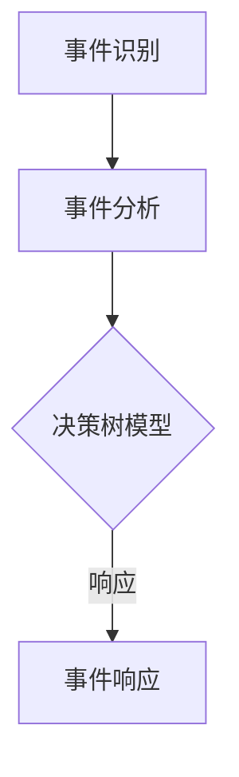

                 

### 文章标题与关键词

# 安全运营中心：企业级安全监控和响应

> 关键词：安全运营中心、企业级安全、监控和响应、安全监控技术、安全威胁、安全漏洞、安全术语、信息安全、网络安全、系统架构设计、算法原理、项目实战、最佳实践

### 摘要

本文将深入探讨企业级安全运营中心（SOC）的构建和运作，旨在为IT从业人员和安全管理专业人员提供一套系统的实践指南。文章首先介绍了安全运营中心的基本概念和重要性，随后详细解析了SOC的核心概念、术语以及构建过程。接着，文章将深入讨论安全监控和检测技术，包括监控策略的制定、入侵检测系统的实现和管理等内容。在此基础上，文章进一步探讨了事故响应计划和安全管理，从实战角度提供了详细的实施步骤和案例分析。最后，文章总结了最佳实践，并对未来的安全运营趋势进行了展望。通过本文的阅读，读者将能够全面了解并掌握企业级安全运营中心的运作机制，为企业在日益复杂的网络环境中提供坚实的安全保障。

### 引言

随着信息技术的发展，企业网络面临着越来越复杂的威胁环境。网络攻击的频率和种类都在不断增长，传统的安全防御手段已经难以应对这些新兴威胁。在这种背景下，安全运营中心（Security Operations Center，简称SOC）的概念应运而生。安全运营中心作为企业信息安全体系的基石，负责实时监控、检测和响应网络安全事件，确保企业的关键信息和资源得到有效保护。

安全运营中心的职责不仅仅局限于检测和响应攻击事件，还包括预防措施、风险评估、安全策略制定和合规性管理等。它的核心作用是提供一个集中的安全管理和监控平台，通过整合各种安全工具和技术，实现对网络和系统的全方位保护。

本文将围绕安全运营中心这一主题，系统性地探讨其构建和运营的各个方面。首先，我们将介绍安全运营中心的基本概念，解释其重要性和必要性。接下来，文章将深入探讨安全运营中心的核心概念和术语，帮助读者建立清晰的理解。然后，我们将详细解析安全运营中心的构建过程，包括设计、硬件和软件的选择，以及人员配备和培训。此外，文章还将讨论安全监控和检测技术，介绍入侵检测系统的实现和管理。在此基础上，我们将探讨事故响应计划和安全管理，提供实战经验和案例分析。最后，文章将总结最佳实践，并对未来的安全运营趋势进行展望。通过本文的阅读，读者将能够全面了解并掌握企业级安全运营中心的运作机制，为企业在复杂网络环境中的信息安全提供有力保障。

### 安全运营中心的基本概念

安全运营中心（Security Operations Center，简称SOC）是企业信息安全体系中的关键组成部分，其核心目的是通过集中的监控、检测和响应机制，保护企业的信息资产免受各种安全威胁。SOC不仅仅是一个物理场所，更是一个综合性的安全管理平台，它整合了各种安全工具、技术和资源，以实现实时监控和快速响应。

首先，让我们来定义什么是安全运营中心。SOC可以被理解为一种综合性的安全监控和管理中心，它通过集成的工具和流程，对企业的网络、系统、应用程序和数据进行实时监控，以便及时发现和应对潜在的安全威胁。SOC的核心功能包括：

1. **安全监控**：实时监控网络流量、系统日志、应用程序行为和用户活动，以便及时发现异常行为和潜在威胁。
2. **威胁检测**：利用入侵检测系统（IDS）、安全信息和事件管理（SIEM）系统等工具，对监控数据进行分析和处理，识别和评估安全威胁。
3. **事故响应**：制定和执行响应计划，以快速应对和解决安全事件，最大限度地减少损失和影响。
4. **合规管理**：确保企业遵守相关的安全法规和标准，如ISO 27001、PCI DSS等。

从职责来看，SOC涵盖了以下几个关键方面：

1. **威胁情报**：收集、分析和共享外部和内部的安全威胁情报，为安全策略的制定和调整提供数据支持。
2. **日志管理**：集中收集和存储系统日志、网络流量数据等，为威胁检测和事故响应提供数据基础。
3. **风险评估**：评估企业面临的各种安全风险，制定相应的风险管理策略和措施。
4. **安全培训与意识提升**：通过培训和教育，提高员工的安全意识和应对能力，减少人为错误导致的安全事件。

安全运营中心的重要性在于它为企业提供了一个全面的安全保护机制，使其能够迅速应对和响应各种安全事件，从而降低安全风险，保障业务的连续性和数据的完整性。随着企业对信息安全的重视程度不断提高，SOC的作用也越来越凸显。尤其是在当前复杂的网络环境中，安全运营中心成为企业抵御网络攻击、保障信息安全的核心阵地。

在企业的运营中，安全运营中心的作用不可忽视。首先，SOC能够实时监控和检测网络中的异常活动，及时发现和阻止潜在的安全威胁，防止数据泄露和其他安全事件的发生。其次，SOC通过集中的管理和响应机制，可以快速响应和处理安全事件，最大限度地减少事件的影响和损失。此外，SOC还为企业提供了合规性保障，确保企业符合各种安全法规和标准的要求，避免因违规而面临法律和财务风险。

总之，安全运营中心是企业信息安全体系的重要组成部分，它通过集成的监控、检测和响应功能，为企业提供全方位的安全保护。在复杂的网络环境中，SOC的作用至关重要，它不仅能够帮助企业预防安全事件，还能够迅速响应和处理事件，保障企业的安全运营和持续发展。因此，构建和运营一个高效、专业的安全运营中心，已经成为许多企业的必要选择。

### 安全运营中心的核心概念和术语

在深入了解安全运营中心（SOC）的构建和运作之前，我们需要先掌握一些核心概念和术语，这些概念和术语是构建和运行SOC的基础。以下是几个关键概念及其解释：

#### 安全信息和事件管理（SIEM）

安全信息和事件管理（Security Information and Event Management，简称SIEM）是一种安全技术，用于收集、存储、分析和关联各种安全数据，以识别潜在的安全威胁和事件。SIEM系统通常整合了多个数据源，包括网络流量、系统日志、入侵检测系统和安全事件日志等，通过对这些数据进行实时分析和关联，实现威胁检测和响应。

**概念属性特征对比表格**：

| 特征 | 安全信息和事件管理（SIEM） |
| --- | --- |
| **功能** | 收集、存储、分析和关联各种安全数据 |
| **目的** | 识别和响应安全威胁和事件 |
| **数据源** | 网络流量、系统日志、入侵检测系统等 |
| **优点** | 实时监控、集中管理、自动关联分析 |
| **缺点** | 需要大量配置和管理、成本较高 |

#### 入侵检测系统（IDS）

入侵检测系统（Intrusion Detection System，简称IDS）是一种监控网络和系统活动，以识别恶意行为和异常行为的工具。IDS可以分为网络入侵检测系统（NIDS）和主机入侵检测系统（HIDS），前者监控网络流量，后者监控主机上的活动。

**ER实体关系图架构**：

```mermaid
erDiagram
  IDS --> |检测| Network Traffic
  IDS --> |监控| System Activity
  NIDS ||--|| HIDS
```

#### 安全信息和事件响应（SIEM）

安全信息和事件响应（Security Information and Event Response，简称SIEM）是SOC中的一个关键流程，涉及识别、分析和响应安全事件。SIEM通常包括以下步骤：

1. **事件识别**：通过SIEM系统收集和分析数据，识别潜在的安全事件。
2. **事件分析**：对识别的事件进行详细分析，确定其性质和影响。
3. **事件响应**：根据事件响应计划，采取相应的措施，如隔离、修复和通知。

**算法原理**：



#### 安全运营中心（SOC）

安全运营中心（Security Operations Center，简称SOC）是企业信息安全体系中的核心部分，负责监控、检测和响应安全事件。SOC通常包括以下功能：

1. **日志管理**：集中收集和存储系统日志，为分析和响应提供数据基础。
2. **威胁检测**：通过SIEM、IDS等工具，实时检测和识别潜在的安全威胁。
3. **事故响应**：制定和执行响应计划，快速应对和处理安全事件。
4. **合规管理**：确保企业符合相关的安全法规和标准。

**数学模型**：

$$
SOC = \text{Log Management} + \text{Threat Detection} + \text{Incident Response} + \text{Compliance Management}
$$

通过这些核心概念和术语的理解，我们可以更好地构建和运营安全运营中心，确保企业的信息安全。在接下来的章节中，我们将进一步探讨安全运营中心的构建过程，包括设计、硬件和软件的选择，以及人员配备和培训。

### 安全运营中心的构建过程

构建一个高效、专业的安全运营中心（SOC）是企业确保信息安全的关键步骤。这一过程不仅涉及技术方面的选择和配置，还包括组织结构、人员配备和培训等多方面内容。以下是安全运营中心的构建过程，包括设计、硬件和软件的选择，以及人员配备和培训的具体步骤。

#### 设计

安全运营中心的设计是构建SOC的第一步，其目标是为运营提供一个高效、稳定和易于扩展的平台。设计过程可以分为以下几个阶段：

1. **需求分析**：首先，企业需要明确SOC的构建目标、功能和预期效果。需求分析包括确定所需的安全监控范围、威胁检测能力、事故响应机制等。

2. **架构设计**：基于需求分析，设计SOC的整体架构。架构设计需要考虑以下几个方面：
   - **数据处理**：确定数据收集、存储和分析的流程和工具。
   - **网络拓扑**：设计网络结构，确保数据能够高效、安全地传输。
   - **硬件布局**：规划硬件设备的布局，包括服务器、存储设备、网络设备等。

3. **安全性**：确保SOC设计的安全性，包括物理安全、网络安全和数据安全。物理安全涉及到设备的保护措施，如防火墙、入侵检测系统等；网络安全涉及到网络访问控制、加密传输等；数据安全涉及到数据加密、访问控制等。

4. **扩展性**：设计时需要考虑未来的扩展需求，确保SOC能够随着业务的发展而扩展。

#### 硬件和软件的选择

硬件和软件的选择是SOC构建的重要环节，它们决定了SOC的性能和功能。

1. **硬件选择**：
   - **服务器**：选择高性能、高可靠性的服务器，以支持数据存储和处理。
   - **存储设备**：选择大容量、高速的存储设备，确保数据存储的安全性和高效性。
   - **网络设备**：选择高带宽、低延迟的网络设备，确保数据传输的稳定性。

2. **软件选择**：
   - **操作系统**：选择安全性能好的操作系统，如Linux发行版，确保系统的稳定性和安全性。
   - **安全工具**：选择适合企业需求的入侵检测系统（IDS）、安全信息和事件管理（SIEM）系统、日志管理工具等。
   - **应用程序**：根据需求选择相应的应用程序，如防火墙、虚拟化软件、应用程序防火墙等。

#### 人员配备和培训

人员配备和培训是SOC成功运行的关键。SOC需要配备专业的安全人员，包括以下角色：

1. **安全分析师**：负责监控和检测安全事件，分析威胁情报，并采取相应的响应措施。
2. **安全工程师**：负责SOC的技术建设和维护，包括硬件和软件的安装、配置和优化。
3. **安全管理员**：负责日常的安全管理，如日志管理、权限控制、安全策略制定等。
4. **事故响应团队**：负责处理安全事件，制定和执行事故响应计划。

人员培训是确保SOC人员能够有效执行其职责的重要步骤。培训内容应包括：
- **安全基础知识**：如网络安全、系统安全、加密技术等。
- **安全工具使用**：如入侵检测系统、安全信息和事件管理系统的使用。
- **事故响应流程**：如事件识别、分析、响应和报告的流程。
- **应急演练**：定期进行应急演练，提高团队的事故响应能力和协作效率。

通过以上步骤，企业可以构建一个高效、专业的安全运营中心，确保信息安全。在SOC的运营过程中，持续改进和优化也是必不可少的。随着企业业务的发展和外部威胁的变化，SOC需要不断调整和更新，以保持其高效性和适应性。

#### 案例分析：构建一个大型企业的安全运营中心

为了更好地理解安全运营中心的构建过程，以下是一个大型企业的案例分析：

**企业背景**：该企业是一家全球知名的金融机构，业务涵盖银行、保险、证券等多个领域，拥有庞大的客户群体和复杂的IT基础设施。

**需求分析**：企业需要建立一个能够实时监控、检测和响应安全威胁的安全运营中心，确保客户数据和业务系统的安全。

**架构设计**：
- **数据处理**：采用分布式架构，将数据收集和存储分散在不同的数据中心。
- **网络拓扑**：设计双网架构，确保数据传输的高效性和安全性。
- **硬件布局**：配置高性能服务器和存储设备，布局合理，保证设备的可用性和扩展性。

**硬件和软件选择**：
- **硬件**：选择多个高性能服务器和存储设备，配置防火墙、入侵检测系统和路由器等网络设备。
- **软件**：选择Linux操作系统，配置SIEM系统、IDS工具、日志管理工具等。

**人员配备和培训**：
- **安全分析师**：招聘具有丰富经验的安全分析师，负责监控和检测安全事件。
- **安全工程师**：聘请专业安全工程师，负责SOC的技术建设和维护。
- **安全管理员**：设立专职安全管理员，负责日常的安全管理和日志管理。
- **事故响应团队**：建立事故响应团队，定期进行应急演练，提高事故响应能力。

**实施过程**：
- **需求分析**：明确SOC的构建目标、功能和预期效果。
- **架构设计**：设计SOC的整体架构，包括数据处理、网络拓扑和硬件布局。
- **硬件和软件配置**：采购和安装硬件设备，配置操作系统和各类安全工具。
- **人员培训**：对安全人员进行全面培训，确保其能够熟练操作和维护SOC系统。
- **试运行和优化**：在试运行过程中，发现和解决问题，不断优化SOC的运行效果。

通过以上步骤，该企业成功构建了一个高效、专业的安全运营中心，确保了其信息资产的安全。这个案例展示了构建安全运营中心的系统性和复杂性，同时也证明了SOC在保障企业信息安全中的重要性。

### 安全监控和检测技术

安全监控和检测是安全运营中心（SOC）的核心功能之一，它们在企业信息安全体系中起着至关重要的作用。有效的安全监控和检测技术能够帮助企业实时识别和应对各种安全威胁，从而保障关键信息和资源的安全。以下是关于安全监控和检测技术的详细介绍，包括监控策略的制定、常用工具和技术，以及监控过程中的关键步骤和注意事项。

#### 监控策略的制定

监控策略的制定是安全监控和检测工作的基础，一个有效的监控策略需要考虑以下几个方面：

1. **确定监控目标**：明确需要监控的系统和网络部分，如防火墙、入侵检测系统（IDS）、日志管理等。
2. **识别关键指标**：定义关键指标（KPIs），如网络流量、系统响应时间、错误率等，以便实时监测和评估系统状态。
3. **监控频率**：根据业务需求和系统特性，确定监控的频率，如实时监控、定期监控等。
4. **报警阈值**：设置合适的报警阈值，确保在异常情况发生时能够及时触发报警，但也要避免误报。

#### 常用工具和技术

在安全监控和检测过程中，常用的工具和技术包括：

1. **入侵检测系统（IDS）**：
   - **定义**：IDS是一种用于检测和响应网络中异常行为的工具。
   - **类型**：分为网络入侵检测系统（NIDS）和主机入侵检测系统（HIDS）。
   - **功能**：实时监控网络流量和主机活动，识别潜在的安全威胁。

2. **安全信息和事件管理（SIEM）系统**：
   - **定义**：SIEM是一种用于收集、存储、分析和关联安全数据的系统。
   - **功能**：整合多种数据源，提供实时威胁检测和响应功能。

3. **日志管理工具**：
   - **定义**：用于收集、存储和分析系统日志的工具。
   - **功能**：为威胁检测和事故响应提供数据支持。

4. **应用程序性能监控工具**：
   - **定义**：用于监控应用程序性能的工具。
   - **功能**：确保应用程序在正常和异常情况下都能高效运行。

#### 实施步骤

1. **数据收集**：从网络设备、主机、应用程序等不同来源收集监控数据。
2. **数据存储**：将收集到的数据存储在中央数据库或日志存储系统中，以便后续分析。
3. **数据分析**：利用SIEM系统或其他工具对数据进行实时分析，识别异常行为和潜在威胁。
4. **报警和响应**：在检测到异常时，触发报警并采取相应的响应措施。

#### 注意事项

1. **数据完整性**：确保监控数据的完整性和准确性，避免因数据丢失或错误而影响监控效果。
2. **安全性和隐私**：在监控过程中，需严格遵守隐私法律法规，确保监控活动不侵犯用户隐私。
3. **误报处理**：合理设置报警阈值，减少误报，同时也要确保不遗漏真正的安全威胁。

#### 监控案例

以下是一个具体的监控案例，用于展示如何实施安全监控和检测：

**案例背景**：某大型企业的网络安全部门希望提高网络安全性，通过实施安全监控和检测来实时发现和响应安全威胁。

**监控策略**：
- **监控目标**：监控企业内部网络和关键业务系统的流量和日志。
- **关键指标**：网络流量、系统响应时间、错误率等。
- **监控频率**：实时监控和定期监控相结合。
- **报警阈值**：根据历史数据和业务需求设置合理的报警阈值。

**实施步骤**：
1. **数据收集**：部署网络流量监控设备，如IDS，从企业内部网络和外部网络收集流量数据；部署日志管理工具，从服务器、数据库、应用程序等收集日志数据。
2. **数据存储**：将收集到的数据存储在SIEM系统中，实现集中化管理。
3. **数据分析**：使用SIEM系统对数据进行实时分析和关联，识别异常行为和潜在威胁。
4. **报警和响应**：在检测到异常时，触发报警通知网络安全部门，并按照事先制定的响应计划进行处理。

通过这个案例，我们可以看到安全监控和检测技术的实际应用，以及如何通过监控策略的制定和实施步骤的执行，提高企业的网络安全防护能力。

### 入侵检测系统（IDS）的实现和管理

入侵检测系统（Intrusion Detection System，简称IDS）是企业安全运营中心（SOC）中不可或缺的组成部分。IDS能够实时监控网络和系统的行为，识别和响应异常活动和潜在的安全威胁，从而有效提高企业的安全防护能力。在本节中，我们将详细介绍入侵检测系统的概念、类型、实现过程、管理方法以及如何优化其性能。

#### IDS的概念和类型

**概念**：

入侵检测系统（IDS）是一种网络安全技术，用于监控网络流量和系统活动，识别潜在的安全威胁和异常行为。IDS可以检测和分类攻击，如拒绝服务攻击（DoS）、分布式拒绝服务攻击（DDoS）、恶意软件感染等。

**类型**：

1. **基于网络的入侵检测系统（NIDS）**：NIDS部署在网络的边界或关键节点上，监控网络流量，识别流量中的恶意行为。
2. **基于主机的入侵检测系统（HIDS）**：HIDS安装在单个主机上，监控主机的活动日志，如系统调用、文件修改等，检测主机上的异常行为。

#### IDS的实现过程

1. **部署策略**：
   - **NIDS部署**：在网络的边界路由器、防火墙或交换机上部署NIDS，以捕获并分析流入和流出的网络流量。
   - **HIDS部署**：在关键服务器和工作站上安装HIDS，监控主机上的日志和活动。
2. **数据收集**：
   - **NIDS**：通过网络接口捕获数据包，提取关键信息。
   - **HIDS**：从系统日志、系统调用、文件系统更改等收集数据。
3. **数据处理**：
   - **NIDS**：对捕获的数据包进行预处理，提取特征，如源IP地址、目标IP地址、端口号、协议类型等。
   - **HIDS**：对收集到的日志文件进行分析，提取异常行为特征。
4. **特征匹配**：
   - **NIDS**：使用预定义的签名库匹配数据包特征，识别已知攻击。
   - **HIDS**：使用异常检测算法，如统计分析和机器学习，识别未知攻击和异常行为。
5. **报警和响应**：
   - **NIDS**：在检测到威胁时，触发报警，记录攻击信息，并通知管理员。
   - **HIDS**：在检测到威胁时，采取相应的响应措施，如隔离受感染的主机、执行系统修复等。

#### IDS的管理方法

1. **配置和管理**：
   - **NIDS**：配置监控规则和签名库，调整捕获策略，确保IDS能够准确识别威胁。
   - **HIDS**：配置监控策略，定期更新日志收集器和分析工具。
2. **监控和日志分析**：
   - **NIDS**：实时监控网络流量，分析日志，识别异常流量和攻击行为。
   - **HIDS**：定期分析主机日志，识别异常行为和系统漏洞。
3. **报警处理**：
   - **NIDS**：设置合适的报警阈值，确保及时识别威胁，同时减少误报。
   - **HIDS**：及时响应报警，采取相应的措施，防止攻击扩散。

#### 优化IDS性能

1. **算法优化**：
   - **NIDS**：使用高效的算法，如快速模式匹配和协议解析，减少数据处理延迟。
   - **HIDS**：优化日志分析算法，提高异常检测的准确性和效率。
2. **硬件升级**：
   - **NIDS**：使用高性能的网络接口卡和处理器，提高数据捕获和处理能力。
   - **HIDS**：升级主机硬件，确保有足够的计算资源进行实时监控和分析。
3. **数据去重**：
   - **NIDS**：对捕获的数据进行去重处理，减少冗余数据，提高分析效率。
   - **HIDS**：合并和过滤重复日志，减少日志存储和处理负担。

#### 案例分析

以下是一个具体案例，展示了如何实现和管理入侵检测系统：

**案例背景**：某企业网络面临频繁的网络攻击和内部主机威胁，决定部署NIDS和HIDS来提升安全防护能力。

**实现步骤**：
1. **部署NIDS**：在网络边界部署NIDS，配置监控规则和签名库，调整捕获策略。
2. **部署HIDS**：在关键服务器和工作站上安装HIDS，配置监控策略和日志收集器。
3. **数据收集**：NIDS实时捕获网络流量，HIDS定期收集主机日志。
4. **数据处理**：NIDS使用高效模式匹配算法分析流量数据，HIDS使用机器学习算法分析主机日志。
5. **报警和响应**：在检测到威胁时，NIDS触发报警并记录攻击信息，HIDS采取隔离和修复措施。

**管理方法**：
1. **配置和管理**：定期更新监控规则和签名库，调整捕获策略，确保IDS能够准确识别威胁。
2. **监控和日志分析**：实时监控网络流量和主机日志，识别异常行为和攻击事件。
3. **报警处理**：设置合适的报警阈值，及时响应报警，采取相应的措施。

通过这个案例，我们可以看到入侵检测系统在企业安全运营中的实际应用，以及如何通过配置、管理和优化来提升其性能，为企业提供有效的安全防护。

### 事故响应计划和安全管理

事故响应计划和安全管理是安全运营中心（SOC）中的关键环节，它们能够帮助企业快速、有效地应对和解决安全事件，从而降低事件的影响和损失。本节将详细探讨事故响应计划的制定、关键步骤、实际案例和最佳实践。

#### 事故响应计划的制定

事故响应计划（Incident Response Plan，简称IRP）是一套详细的操作流程和步骤，用于指导企业在安全事件发生时进行快速、有序的应对和处置。制定一个有效的事故响应计划，需要考虑以下几个方面：

1. **定义目标和范围**：明确事故响应计划的目标和适用范围，包括覆盖的事件类型、业务影响和应急资源等。
2. **组建事故响应团队**：组建专业的应急响应团队，包括团队成员的职责和角色，如事故协调员、技术专家、沟通协调员等。
3. **制定响应流程**：详细描述事故响应的各个阶段，包括事件识别、初步评估、应急响应、恢复和事后总结等。
4. **制定资源清单**：列出事故响应所需的硬件、软件、工具、数据和其他资源，确保在事件发生时能够迅速调用。
5. **制定沟通策略**：明确内部和外部的沟通机制，确保在事件发生时能够及时通知相关利益相关者，并保持信息的一致性和透明性。
6. **制定测试和演练计划**：定期进行事故响应演练，验证计划的可行性和团队成员的应急能力。

#### 事故响应的关键步骤

事故响应过程中，每个步骤都需要精准执行，以确保事件能够得到及时、有效的处理。以下是事故响应过程中的关键步骤：

1. **事件识别**：通过监控工具、用户报告或安全告警系统，快速识别潜在的安全事件。
2. **初步评估**：对事件进行初步评估，确定事件的性质、影响范围和严重程度，决定是否需要启动事故响应计划。
3. **应急响应**：根据事故响应计划，采取紧急措施，如隔离受影响的系统、启动应急工具、通知相关团队等。
4. **调查和分析**：对事件进行调查和分析，收集相关证据，确定事件的根本原因和影响，制定修复计划。
5. **事件处理和修复**：根据调查结果，采取具体的修复措施，如修复漏洞、删除恶意代码、恢复系统等。
6. **恢复和验证**：在事件得到处理后，进行系统恢复和验证，确保受影响的服务和系统恢复正常运行。
7. **事后总结和改进**：对整个事故响应过程进行总结，评估响应效果，提出改进建议，优化事故响应计划。

#### 实际案例

以下是一个具体的案例，展示了如何制定和执行事故响应计划：

**案例背景**：某公司发现其内部网络出现异常流量，经过初步分析，怀疑是遭受了网络攻击。

**事故响应步骤**：

1. **事件识别**：通过网络流量监控工具发现异常流量，并通过告警系统通知安全管理团队。
2. **初步评估**：安全管理团队进行初步评估，确认是网络攻击事件，启动事故响应计划。
3. **应急响应**：关闭受影响的网络端口，启动入侵检测系统，隔离受攻击的服务器。
4. **调查和分析**：对受攻击的系统进行详细分析，发现是DDoS攻击，收集攻击流量数据，分析攻击来源和手段。
5. **事件处理和修复**：通过调整防火墙规则和流量过滤策略，阻止攻击流量，修复系统漏洞，恢复正常运行。
6. **恢复和验证**：测试网络和系统，确保恢复正常运行，关闭应急措施。
7. **事后总结和改进**：总结事故响应过程，评估响应效果，改进安全策略和响应计划，加强员工安全培训。

#### 最佳实践

以下是事故响应和安全管理中的最佳实践：

1. **定期演练**：定期组织事故响应演练，提高团队应对紧急事件的能力和效率。
2. **标准化流程**：制定标准化的事故响应流程，确保每个团队成员都清楚自己的职责和任务。
3. **资源管理**：确保事故响应所需的资源得到充分保障，包括硬件、软件、工具和数据等。
4. **信息共享**：建立信息共享机制，确保事故响应过程中的信息传递畅通，提高协同效率。
5. **持续改进**：通过事后总结和反馈，不断优化事故响应计划和流程，提高整体的应急响应能力。

通过制定和执行有效的事故响应计划，企业能够在面临安全事件时保持冷静和有序，快速应对和解决问题，最大程度地降低事件对业务的负面影响。

### 安全运营中心的最佳实践

在构建和运营安全运营中心（SOC）的过程中，遵循最佳实践是确保其高效性和有效性的关键。以下是一些经过验证的最佳实践，旨在帮助企业和组织提高其安全运营水平。

#### 常见问题

1. **SOC如何实现自动化？**
   - 自动化是SOC高效运营的关键。通过使用自动化工具和脚本，可以减少人工操作，提高响应速度。例如，使用自动化工具进行日志收集、数据分析和报警处理，减轻安全分析师的工作负担。

2. **如何减少误报和漏报？**
   - 优化监控策略和规则，结合历史数据和威胁情报，可以降低误报率。同时，定期更新和调整检测模型，以提高对未知威胁的识别能力，减少漏报。

3. **如何提高团队的专业能力？**
   - 定期组织培训和教育，提高团队的专业知识和技能。可以邀请外部专家进行讲座，或参加行业会议，保持与最新安全技术和趋势的同步。

#### 注意事项

1. **数据隐私保护**：在监控和数据分析过程中，务必遵守数据隐私法规，确保用户数据的安全性和隐私性。

2. **持续监控和改进**：安全运营是一个持续的过程，需要定期评估和改进SOC的架构和流程。通过定期的安全审计和风险评估，发现和解决潜在的安全问题。

3. **备份和恢复策略**：确保SOC的数据和系统备份得到定期维护，并在发生灾难时能够迅速恢复，减少业务中断。

#### 拓展阅读

- 《网络安全运营实战指南》
- 《SIEM技术与应用》
- 《网络安全体系建设与运营》

通过遵循这些最佳实践，企业可以构建一个高效、专业的安全运营中心，为企业在复杂网络环境中的信息安全提供坚实的保障。

### 总结与展望

通过本文的探讨，我们系统地了解了安全运营中心（SOC）的构建和运营全过程。从基础概念和术语的讲解，到设计、硬件和软件的选择，再到人员配备和培训，以及安全监控、入侵检测和事故响应的具体技术实现，本文提供了一个全面的视角，帮助企业理解SOC在信息安全体系中的关键作用。

首先，安全运营中心作为企业信息安全的核心阵地，其重要性不可忽视。SOC不仅能够实时监控和检测安全威胁，还能快速响应和处置安全事件，保障企业的关键信息和资源不受侵害。

其次，本文详细介绍了安全运营中心的构建过程，包括设计、硬件和软件的选择，以及人员配备和培训。通过这些步骤，企业可以构建一个高效、专业的安全运营平台，确保其能够在复杂网络环境中保持安全。

此外，文章深入探讨了安全监控和检测技术，包括入侵检测系统的实现和管理，提供了实际案例和最佳实践，帮助企业优化SOC的运营效果。

展望未来，随着信息技术的发展，安全运营中心将面临更多的挑战和机遇。自动化、人工智能和机器学习等新兴技术将在SOC中发挥越来越重要的作用，帮助企业提高威胁检测和响应的效率。同时，随着网络攻击手段的不断演变，SOC需要不断更新和优化，以应对日益复杂的安全威胁。

总之，通过本文的阅读，读者将能够全面了解安全运营中心的运作机制，掌握关键技术和最佳实践，为企业在日益复杂的网络环境中提供坚实的安全保障。未来，随着技术和威胁环境的不断变化，SOC的作用将更加凸显，成为企业信息安全不可或缺的组成部分。

### 作者信息

**作者：AI天才研究院/AI Genius Institute & 禅与计算机程序设计艺术 /Zen And The Art of Computer Programming**

AI天才研究院（AI Genius Institute）是一支致力于推动人工智能技术和应用的科研团队，专注于研发先进的机器学习和深度学习算法。同时，研究院也致力于培养下一代人工智能领域的专业人才。此外，作者还著有《禅与计算机程序设计艺术》（Zen And The Art of Computer Programming），这是一部在计算机编程领域具有广泛影响力的经典之作。通过这两本书，作者展示了其在人工智能和计算机科学领域的深厚造诣和独特见解。

