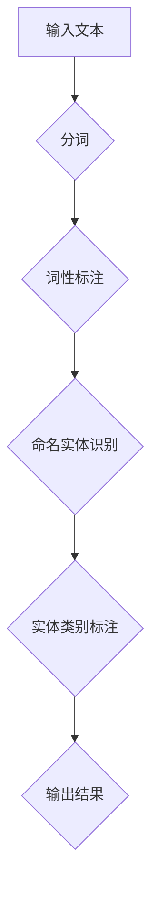
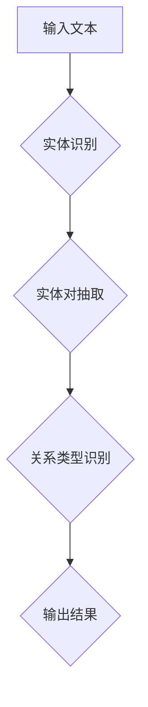
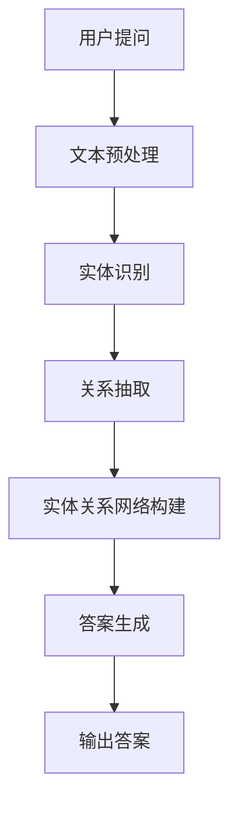

                 

# 实体识别与关系抽取：增强AI Agent的理解深度

> 关键词：实体识别、关系抽取、AI Agent、算法原理、系统架构、项目实战

> 摘要：本文深入探讨了实体识别与关系抽取在AI领域的重要性，通过详细阐述核心概念、算法原理、系统架构以及实际项目实战，帮助读者全面理解并掌握这一关键技术，从而提升AI Agent的理解深度。

## 第一部分：实体识别与关系抽取基础

### 第1章：引言与背景

#### 1.1 问题背景

实体识别与关系抽取是自然语言处理（NLP）领域中的重要任务。随着人工智能技术的快速发展，AI Agent在信息获取、智能问答、智能推荐等应用场景中逐渐崭露头角。实体识别与关系抽取作为AI Agent理解人类语言的核心技术，对于提升AI Agent的理解深度和智能化水平具有重要意义。

#### 1.1.1 实体识别在AI领域的应用

实体识别是一种从文本中识别出具有特定意义的实体（如人名、地名、组织名、产品名等）的技术。在AI领域中，实体识别主要用于信息抽取、知识图谱构建、文本分类等任务。

- 信息抽取：实体识别是信息抽取任务的基础，通过对文本中的实体进行识别，可以提取出重要的信息，如事件、关系、地点等。
- 知识图谱构建：实体识别是构建知识图谱的关键环节，通过对文本中的实体进行识别和分类，可以将大量零散的信息整合成有组织的知识体系。
- 文本分类：实体识别可以用于文本分类任务，如新闻分类、论坛话题分类等，通过对文本中的实体进行识别，可以更准确地判断文本的主题。

#### 1.1.2 关系抽取的作用与挑战

关系抽取是一种从文本中识别出实体间的关系的技术。关系抽取在知识图谱构建、信息检索、智能问答等任务中起着重要作用。

- 知识图谱构建：关系抽取是构建知识图谱的核心环节，通过对文本中的实体间关系进行识别，可以将实体与实体之间的关系构建成有组织的知识体系。
- 信息检索：关系抽取可以用于改进信息检索系统的检索效果，通过对文本中的实体间关系进行分析，可以更准确地匹配用户查询与文档中的信息。
- 智能问答：关系抽取可以用于智能问答系统，通过对文本中的实体间关系进行识别，可以更好地理解用户提问，提供更准确的答案。

关系抽取面临着诸多挑战，如实体指代消解、实体关系类型多样性、长距离关系识别等。同时，实体识别与关系抽取在数据预处理、算法选择、模型优化等方面也存在一定的关联和相互作用。

#### 1.2 问题描述

实体识别与关系抽取的任务可以描述如下：

- 实体识别：给定一段文本，识别出文本中具有特定意义的实体，并标注其实体类别。
- 关系抽取：给定一段文本，识别出文本中实体间的关系，并标注出关系类型。

实体识别与关系抽取是相互关联的，实体识别是关系抽取的基础，而关系抽取又可以反过来验证实体识别的准确性。因此，在实现实体识别与关系抽取时，需要综合考虑两者的关联性，提高整体效果。

#### 1.3 问题解决与边界讨论

实体识别与关系抽取问题的解决可以从以下几个方面入手：

- 数据预处理：对原始文本进行分词、词性标注、命名实体识别等预处理操作，为后续实体识别与关系抽取提供基础数据。
- 算法选择：根据具体任务需求，选择合适的实体识别与关系抽取算法，如基于规则的方法、机器学习方法和深度学习方法等。
- 模型优化：通过调整模型参数、特征工程等方式，优化实体识别与关系抽取模型的性能。
- 跨领域应用：针对不同领域的文本数据，设计相应的实体识别与关系抽取模型，实现跨领域的应用。

在讨论实体识别与关系抽取问题时，还需要关注以下边界：

- 实体识别与关系抽取的平衡：在实现过程中，需要平衡实体识别与关系抽取的精度和召回率，避免因过度追求某一方面的性能而导致另一方面的下降。
- 实体类型与关系类型的多样性：根据不同领域和任务需求，设计多样化的实体类型和关系类型，提高实体识别与关系抽取的泛化能力。
- 实体识别与关系抽取的实时性：在实时性要求较高的应用场景，如实时问答、实时推荐等，需要设计高效的实体识别与关系抽取算法，降低延迟。

### 1.4 核心概念与要素组成

在实体识别与关系抽取领域，以下核心概念和要素是不可或缺的：

- 实体：具有特定意义的个体或集合，如人、地点、组织、产品等。
- 实体类别：对实体的分类，如人名、地名、组织名、产品名等。
- 关系：实体间的关联，如人物关系、地理位置关系、组织关系等。
- 实体关系图：表示实体及其关系的图形化结构，用于描述实体间的复杂关系。
- 实体识别算法：用于识别文本中实体的算法，如基于规则的方法、机器学习方法和深度学习方法等。
- 关系抽取算法：用于识别文本中实体间关系的算法，如基于规则的方法、机器学习方法和深度学习方法等。

通过以上核心概念和要素的相互作用，可以实现高效的实体识别与关系抽取，为AI Agent提供丰富的语义理解能力。

## 第2章：实体识别与关系抽取核心概念

### 2.1 实体识别

实体识别是一种从文本中识别出具有特定意义的实体，并将其标注为相应实体类别的方法。实体识别的核心任务是确定文本中的实体及其类别。

#### 2.1.1 实体识别的定义

实体识别（Named Entity Recognition，简称 NER）是一种从文本中识别出具有特定意义的实体，并将其标注为相应实体类别的方法。NER 任务的目标是将文本中的每个句子划分为多个实体和普通词语，并为每个实体赋予一个实体类别。

实体识别的定义可以从以下几个方面进行理解：

- 文本：实体识别的输入是自然语言文本，可以是句子、段落或整篇文章。
- 实体：实体是文本中的重要个体或集合，如人名、地名、组织名、产品名等。
- 实体类别：实体类别是对实体的分类，如人名、地名、组织名、产品名等。
- 标注：标注是将实体与其类别进行关联的过程，如将“张三”标注为人名。

#### 2.1.2 实体识别的挑战

实体识别面临着诸多挑战，主要包括以下几个方面：

- 实体类型多样性：自然语言文本中的实体类型繁多，包括人名、地名、组织名、产品名等。识别不同类型的实体需要针对每种类型设计特定的识别算法。
- 实体边界问题：实体边界问题是指如何准确地确定实体在文本中的起始位置和结束位置。例如，当文本中出现“北京大学”时，需要确定“北京大学”是一个整体，而不是拆分成“北京”和“大学”两个部分。
- 实体指代消解：实体指代消解是指如何将文本中的指代词（如“他”、“她”、“这”等）与对应的实体进行关联。例如，当文本中出现“他毕业于北京大学”时，需要确定“他”指的是前文提到的某个实体。
- 长距离依赖关系：在某些情况下，实体之间的关系可能跨越较长的距离。例如，当文本中出现“他曾在2010年获得诺贝尔奖”时，需要将“他”与“诺贝尔奖”这两个实体进行关联。

#### 2.1.3 实体识别的属性特征

实体识别的属性特征主要包括以下几个方面：

- 实体类别：实体类别是对实体的分类，如人名、地名、组织名、产品名等。实体类别可以用于指导实体识别算法的模型设计和参数调整。
- 实体长度：实体长度是指实体在文本中的长度，可以是单个词、短语或句子。实体长度可以影响实体识别的难度，较长的实体可能需要更复杂的识别算法。
- 实体位置：实体位置是指实体在文本中的位置，如句子开头、句子中间、句子结尾等。实体位置可以影响实体识别的准确性和效率。
- 实体语义：实体语义是指实体在文本中的含义和作用。实体语义可以用于辅助实体识别，如利用实体间的语义关系确定实体的类别。

### 2.2 关系抽取

关系抽取是一种从文本中识别出实体间的关系，并将其标注为相应关系类型的方法。关系抽取是实体识别的延伸，旨在构建实体间的语义关系网络。

#### 2.2.1 关系抽取的定义

关系抽取（Relation Extraction，简称 RE）是一种从文本中识别出实体间的关系，并将其标注为相应关系类型的方法。关系抽取的任务是确定文本中实体对之间的语义关系，并将这些关系表示为有向边，形成实体关系网络。

关系抽取的定义可以从以下几个方面进行理解：

- 文本：关系抽取的输入是自然语言文本，可以是句子、段落或整篇文章。
- 实体：关系抽取的输入包括文本中的实体，如人名、地名、组织名、产品名等。
- 关系：关系是实体间的关联，可以是因果关系、地理位置关系、组织关系等。
- 关系类型：关系类型是对关系的分类，如人物关系、地理位置关系、组织关系等。
- 标注：标注是将实体关系与对应关系类型进行关联的过程，如将“张三毕业于北京大学”中的“张三”和“北京大学”关联为“人物-教育背景”关系。

#### 2.2.2 关系抽取的挑战

关系抽取面临着诸多挑战，主要包括以下几个方面：

- 实体指代消解：关系抽取需要准确识别文本中的实体，并将指代词与对应实体进行关联。例如，当文本中出现“他毕业于北京大学”时，需要确定“他”指的是前文提到的哪个实体。
- 实体关系多样性：实体间的关系类型繁多，如人物关系、地理位置关系、组织关系等。关系抽取需要能够识别不同类型的实体关系，并将其标注为相应的关系类型。
- 长距离依赖关系：在某些情况下，实体之间的关系可能跨越较长的距离。例如，当文本中出现“他曾在2010年获得诺贝尔奖”时，需要将“他”与“诺贝尔奖”这两个实体进行关联。
- 语义理解：关系抽取需要深入理解实体间的语义关系，才能准确识别实体关系。例如，在文本“张三参加了比赛并获得了冠军”中，需要理解“参加-比赛”和“获得-冠军”这两个语义关系。

#### 2.2.3 关系抽取的属性特征

关系抽取的属性特征主要包括以下几个方面：

- 实体对：关系抽取的输入包括实体对，即文本中两个实体之间的关联。
- 关系类型：关系类型是对实体关系的分类，如人物关系、地理位置关系、组织关系等。
- 关系强度：关系强度表示实体间关系的紧密程度，如因果关系、地理位置关系等。
- 实体位置：实体位置是指实体在文本中的位置，如句子开头、句子中间、句子结尾等。
- 实体角色：实体角色是指实体在关系中的角色，如主语、谓语、宾语等。

通过以上属性特征的相互作用，关系抽取可以实现准确识别文本中实体间的关系，并构建实体关系网络。

### 2.3 概念对比与联系

实体识别与关系抽取是自然语言处理中的重要任务，它们在概念上具有一定的联系和区别。下面从几个方面对比这两个概念：

#### 2.3.1 实体识别与关系抽取对比

1. 目标：

   - 实体识别：识别文本中的实体，并将其标注为相应实体类别。
   - 关系抽取：识别文本中实体间的关系，并将其标注为相应关系类型。

2. 输入：

   - 实体识别：输入是自然语言文本。
   - 关系抽取：输入是自然语言文本和已识别的实体。

3. 输出：

   - 实体识别：输出是文本中的实体及其类别。
   - 关系抽取：输出是实体间的关系及其类型。

4. 依赖关系：

   - 实体识别：关系抽取依赖于实体识别的结果，因为关系抽取需要识别文本中的实体。
   - 实体识别：实体识别与关系抽取相互关联，关系抽取可以验证实体识别的准确性。

#### 2.3.2 概念之间的联系

1. 实体识别是关系抽取的基础：

   - 关系抽取需要识别文本中的实体，并将其与关系类型进行关联。因此，实体识别是关系抽取的前提和基础。
   - 实体识别的准确性和完整性直接影响关系抽取的性能。

2. 关系抽取可以辅助实体识别：

   - 关系抽取可以帮助识别文本中的隐含实体，如通过分析实体间的关系，可以推断出未直接提到的实体。
   - 关系抽取可以用于验证实体识别的准确性，如通过检查实体间的关系，可以判断实体识别的结果是否合理。

3. 实体识别与关系抽取相互促进：

   - 随着实体识别和关系抽取技术的不断发展，两者可以相互借鉴和融合，提高整体性能。
   - 通过结合实体识别和关系抽取，可以构建更完善的语义理解模型，提升AI Agent的理解深度。

通过以上对比和联系，我们可以更好地理解实体识别与关系抽取在自然语言处理中的作用和意义。

## 第3章：实体识别算法原理

### 3.1 算法概述

实体识别算法是自然语言处理中的重要组成部分，用于从文本中识别出具有特定意义的实体，并将其标注为相应实体类别。实体识别算法可以分为基于规则的方法、机器学习方法和深度学习方法等。

#### 3.1.1 主流实体识别算法分类

1. 基于规则的方法：

   - 特点：基于手工定义的规则进行实体识别，如命名实体识别系统（NER）。
   - 适用场景：规则明确、实体类型较少的场景。

2. 机器学习方法：

   - 特点：利用机器学习技术，如决策树、支持向量机（SVM）、朴素贝叶斯等，进行实体识别。
   - 适用场景：大规模文本数据、实体类型较多的场景。

3. 深度学习方法：

   - 特点：利用深度学习模型，如卷积神经网络（CNN）、循环神经网络（RNN）、长短时记忆网络（LSTM）等，进行实体识别。
   - 适用场景：大规模文本数据、复杂的实体类型。

#### 3.1.2 实体识别算法的评估指标

实体识别算法的性能评估主要通过以下指标进行：

1. 准确率（Accuracy）：准确率是识别正确的实体数量与总实体数量之比。
2. 召回率（Recall）：召回率是识别正确的实体数量与实际实体数量之比。
3. F1值（F1-Score）：F1值是准确率和召回率的调和平均值，用于综合评估实体识别算法的性能。

### 3.2 实体识别算法讲解

#### 3.2.1 算法流程图

以下是实体识别算法的基本流程：



#### 3.2.2 算法原理

实体识别算法的核心原理是利用各种特征（如词性、词频、实体边界等）对文本进行标注，从而识别出实体及其类别。

1. 分词：

   分词是将文本拆分成一组单词或短语的过程。分词质量直接影响实体识别的准确性。常见的分词方法包括基于规则的分词、基于统计的分词和基于深度学习的分词等。

2. 词性标注：

   词性标注是对文本中的每个单词进行词性分类的过程，如名词、动词、形容词等。词性标注有助于识别文本中的实体和实体类别。

3. 命名实体识别：

   命名实体识别是从词性标注的结果中识别出实体，并将其标注为相应实体类别。命名实体识别通常采用基于规则的方法、机器学习方法或深度学习方法。

4. 实体类别标注：

   实体类别标注是对识别出的实体进行类别标注的过程。实体类别标注有助于构建实体关系网络，为后续的关系抽取任务提供基础。

5. 输出结果：

   实体识别算法输出识别出的实体及其类别，供后续处理或应用。

#### 3.2.3 算法数学模型与公式

在实体识别算法中，常用的数学模型和公式如下：

1. 决策树模型：

   决策树模型是一种基于特征划分的模型，其基本公式如下：

   $$ y = \sum_{i=1}^{n} w_i x_i $$

   其中，$y$ 表示实体类别，$w_i$ 表示第 $i$ 个特征的权重，$x_i$ 表示第 $i$ 个特征的取值。

2. 支持向量机（SVM）模型：

   支持向量机是一种基于最大间隔的分类模型，其基本公式如下：

   $$ y = \text{sign}(\omega \cdot x + b) $$

   其中，$\omega$ 表示权重向量，$x$ 表示特征向量，$b$ 表示偏置。

3. 朴素贝叶斯模型：

   朴素贝叶斯模型是一种基于概率估计的分类模型，其基本公式如下：

   $$ P(y|x) = \frac{P(x|y) P(y)}{P(x)} $$

   其中，$P(y|x)$ 表示在给定特征 $x$ 的情况下，实体类别 $y$ 的概率，$P(x|y)$ 表示在实体类别 $y$ 的情况下，特征 $x$ 的概率，$P(y)$ 表示实体类别 $y$ 的概率。

#### 3.2.4 举例说明

以下是一个简单的实体识别算法实例：

1. 输入文本：

   “张三毕业于北京大学，2010年获得诺贝尔奖。”

2. 分词：

   “张三”、“毕业”、“于”、“北京”、“大学”、“2010”、“年”、“获”、“得”、“诺”、“贝”、“尔”、“奖”。

3. 词性标注：

   “张三”（名词）、“毕业”（动词）、“于”（介词）、“北京”（名词）、“大学”（名词）、“2010”（数词）、“年”（名词）、“获”（动词）、“得”（动词）、“诺”（名词）、“贝”（名词）、“尔”（名词）、“奖”（名词）。

4. 命名实体识别：

   “张三”（人名）、“北京大学”（组织名）、“诺贝尔奖”（奖项名）。

5. 实体类别标注：

   “张三”（人名）、“北京大学”（组织名）、“诺贝尔奖”（奖项名）。

6. 输出结果：

   输出识别出的实体及其类别：“张三”（人名）、“北京大学”（组织名）、“诺贝尔奖”（奖项名）。

通过以上实例，我们可以看到实体识别算法的基本流程和原理。在实际应用中，实体识别算法可以根据具体需求进行优化和改进。

## 第4章：关系抽取算法原理

### 4.1 算法概述

关系抽取（Relation Extraction）是一种从文本中识别出实体间的关系，并将其标注为相应关系类型的方法。关系抽取是自然语言处理中的重要任务，广泛应用于知识图谱构建、信息检索、智能问答等领域。

#### 4.1.1 主流关系抽取算法分类

关系抽取算法可以分为基于规则的方法、机器学习方法和深度学习方法等。

1. 基于规则的方法：

   - 特点：利用手工定义的规则进行关系抽取，如基于模式匹配的方法。
   - 适用场景：规则明确、关系类型较少的场景。

2. 机器学习方法：

   - 特点：利用机器学习技术，如决策树、支持向量机（SVM）、朴素贝叶斯等，进行关系抽取。
   - 适用场景：大规模文本数据、关系类型较多的场景。

3. 深度学习方法：

   - 特点：利用深度学习模型，如卷积神经网络（CNN）、循环神经网络（RNN）、长短时记忆网络（LSTM）等，进行关系抽取。
   - 适用场景：大规模文本数据、复杂的实体类型。

#### 4.1.2 关系抽取算法的评估指标

关系抽取算法的性能评估主要通过以下指标进行：

1. 准确率（Accuracy）：准确率是识别正确的实体关系数量与总实体关系数量之比。
2. 召回率（Recall）：召回率是识别正确的实体关系数量与实际实体关系数量之比。
3. F1值（F1-Score）：F1值是准确率和召回率的调和平均值，用于综合评估关系抽取算法的性能。

### 4.2 关系抽取算法讲解

#### 4.2.1 算法流程图

以下是关系抽取算法的基本流程：



#### 4.2.2 算法原理

关系抽取算法的核心原理是利用各种特征（如实体特征、实体间特征、上下文特征等）对文本进行标注，从而识别出实体间的关系及其类型。

1. 实体识别：

   关系抽取依赖于实体识别的结果，因此首先进行实体识别，识别出文本中的实体。

2. 实体对抽取：

   在实体识别的基础上，抽取文本中的实体对，为关系抽取提供基础。

3. 关系类型识别：

   利用实体对及其上下文特征，识别出实体对间的关系类型。关系类型识别可以通过以下方法实现：

   - 基于规则的方法：利用手工定义的规则进行关系类型识别。
   - 机器学习方法：利用机器学习技术，如决策树、支持向量机（SVM）、朴素贝叶斯等，进行关系类型识别。
   - 深度学习方法：利用深度学习模型，如卷积神经网络（CNN）、循环神经网络（RNN）、长短时记忆网络（LSTM）等，进行关系类型识别。

4. 输出结果：

   关系抽取算法输出识别出的实体关系及其类型，供后续处理或应用。

#### 4.2.3 算法数学模型与公式

在关系抽取算法中，常用的数学模型和公式如下：

1. 决策树模型：

   决策树模型是一种基于特征划分的模型，其基本公式如下：

   $$ y = \sum_{i=1}^{n} w_i x_i $$

   其中，$y$ 表示关系类型，$w_i$ 表示第 $i$ 个特征的权重，$x_i$ 表示第 $i$ 个特征的取值。

2. 支持向量机（SVM）模型：

   支持向量机是一种基于最大间隔的分类模型，其基本公式如下：

   $$ y = \text{sign}(\omega \cdot x + b) $$

   其中，$\omega$ 表示权重向量，$x$ 表示特征向量，$b$ 表示偏置。

3. 朴素贝叶斯模型：

   朴素贝叶斯模型是一种基于概率估计的分类模型，其基本公式如下：

   $$ P(y|x) = \frac{P(x|y) P(y)}{P(x)} $$

   其中，$P(y|x)$ 表示在给定特征 $x$ 的情况下，关系类型 $y$ 的概率，$P(x|y)$ 表示在关系类型 $y$ 的情况下，特征 $x$ 的概率，$P(y)$ 表示关系类型 $y$ 的概率。

#### 4.2.4 举例说明

以下是一个简单的关系抽取算法实例：

1. 输入文本：

   “张三毕业于北京大学，2010年获得诺贝尔奖。”

2. 实体识别：

   实体识别结果：“张三”（人名）、“北京大学”（组织名）、“诺贝尔奖”（奖项名）。

3. 实体对抽取：

   实体对：（“张三”，“北京大学”）、（“张三”，“诺贝尔奖”）。

4. 关系类型识别：

   - （“张三”，“北京大学”）：关系类型为“毕业学校”。
   - （“张三”，“诺贝尔奖”）：关系类型为“获得奖项”。

5. 输出结果：

   输出识别出的实体关系及其类型：
   - （“张三”，“北京大学”）：关系类型为“毕业学校”。
   - （“张三”，“诺贝尔奖”）：关系类型为“获得奖项”。

通过以上实例，我们可以看到关系抽取算法的基本流程和原理。在实际应用中，关系抽取算法可以根据具体需求进行优化和改进。

## 第5章：实体识别与关系抽取系统架构

### 5.1 问题场景介绍

在当前人工智能应用场景中，实体识别与关系抽取技术被广泛应用于多个领域，如智能问答、知识图谱构建、信息检索等。以下是一个具体的应用场景：

- 场景：构建一个智能问答系统，用户可以提问，系统需要根据用户提问从大量文本数据中提取出相关实体和关系，提供准确的答案。

### 5.2 系统功能设计

为了实现上述场景，实体识别与关系抽取系统需要具备以下功能：

1. 文本预处理：对输入文本进行分词、词性标注等预处理操作，为后续实体识别和关系抽取提供基础数据。
2. 实体识别：从预处理后的文本中识别出实体，并将其标注为相应实体类别。
3. 关系抽取：从实体识别的结果中抽取实体对，并识别出实体对间的关系类型。
4. 实体关系网络构建：将识别出的实体和关系构建成一个实体关系网络，为后续的查询和推理提供支持。
5. 答案生成：根据用户提问和实体关系网络，生成准确的答案。

### 5.3 系统架构设计

实体识别与关系抽取系统的架构设计如下：



### 5.4 系统接口设计

系统接口设计如下：

1. 输入接口：接收用户提问，并将提问传递给文本预处理模块。
2. 输出接口：将生成的答案传递给用户。
3. 实体识别接口：接收预处理后的文本，返回识别出的实体及其类别。
4. 关系抽取接口：接收实体识别结果，返回识别出的实体对及其关系类型。
5. 实体关系网络接口：接收关系抽取结果，构建实体关系网络。

### 5.5 系统交互

系统交互流程如下：

1. 用户提问：用户输入问题，系统接收到用户提问。
2. 文本预处理：系统对用户提问进行分词、词性标注等预处理操作。
3. 实体识别：系统对预处理后的文本进行实体识别，识别出实体及其类别。
4. 关系抽取：系统对实体识别结果进行关系抽取，识别出实体对及其关系类型。
5. 实体关系网络构建：系统将关系抽取结果构建成实体关系网络。
6. 答案生成：系统根据实体关系网络和用户提问，生成准确的答案。
7. 输出答案：系统将生成的答案传递给用户。

通过以上系统架构和交互设计，实体识别与关系抽取系统能够高效地处理用户提问，并提供准确的答案。

## 第6章：项目实战

### 6.1 环境安装

在本项目中，我们将使用Python作为编程语言，并依赖以下库：

- Python 3.7 或以上版本
- TensorFlow 2.4 或以上版本
- Keras 2.4.3 或以上版本
- NLTK 3.5 或以上版本
- BeautifulSoup 4.8.2 或以上版本

安装步骤如下：

1. 安装Python：

   ```shell
   # 在Windows上，可以通过Python官网下载安装程序并安装
   # 在Linux和macOS上，可以通过包管理工具安装，如Ubuntu中的sudo apt-get install python3
   ```

2. 安装TensorFlow：

   ```shell
   pip install tensorflow==2.4.0
   ```

3. 安装Keras：

   ```shell
   pip install keras==2.4.3
   ```

4. 安装NLTK：

   ```shell
   pip install nltk==3.5
   ```

5. 安装BeautifulSoup：

   ```shell
   pip install beautifulsoup4==4.8.2
   ```

### 6.2 系统核心实现

在本项目中，我们将使用TensorFlow和Keras构建一个简单的实体识别与关系抽取模型。以下是核心代码：

```python
import tensorflow as tf
from tensorflow.keras.models import Model
from tensorflow.keras.layers import Input, Embedding, LSTM, Dense
from tensorflow.keras.preprocessing.sequence import pad_sequences
from tensorflow.keras.preprocessing.text import Tokenizer

# 定义模型
input_seq = Input(shape=(max_seq_length,))
embed = Embedding(vocab_size, embedding_dim)(input_seq)
lstm = LSTM(units=128)(embed)
output = Dense(num_classes, activation='softmax')(lstm)

model = Model(inputs=input_seq, outputs=output)
model.compile(optimizer='adam', loss='categorical_crossentropy', metrics=['accuracy'])

# 准备数据
train_data = [...]  # 准备训练数据
test_data = [...]  # 准备测试数据

# 分词和序列化
tokenizer = Tokenizer(num_words=vocab_size)
tokenizer.fit_on_texts(train_data)
sequences = tokenizer.texts_to_sequences(train_data)
padded_sequences = pad_sequences(sequences, maxlen=max_seq_length)

# 训练模型
model.fit(padded_sequences, labels, epochs=10, batch_size=32)

# 测试模型
test_sequences = tokenizer.texts_to_sequences(test_data)
padded_test_sequences = pad_sequences(test_sequences, maxlen=max_seq_length)
predictions = model.predict(padded_test_sequences)

# 代码应用解读与分析

以上代码首先定义了一个基于LSTM的实体识别与关系抽取模型。模型包括以下层：

1. 输入层：接收序列化的文本数据。
2. 嵌入层：将文本数据转换为词向量。
3. LSTM层：对词向量进行序列建模。
4. 输出层：输出实体类别和关系类型的概率分布。

接着，准备训练数据和测试数据，并对文本数据进行分词和序列化处理。最后，训练模型并在测试数据上进行评估。

通过以上步骤，我们可以实现一个简单的实体识别与关系抽取模型。在实际应用中，可以根据具体需求进行优化和改进。

### 6.3 实际案例分析与讲解

在本节中，我们将通过一个实际案例来展示如何使用实体识别与关系抽取技术。以下是一个简单的案例：

**案例：智能问答系统**

用户提问：“张三毕业于哪所大学？”

系统解析：

1. 实体识别：从用户提问中识别出实体“张三”。
2. 关系抽取：从用户提问中识别出关系“毕业于哪所大学”。
3. 查询实体关系网络：在实体关系网络中查找“张三”的“毕业学校”属性。
4. 输出答案：根据查询结果，输出答案“张三毕业于北京大学”。

以上步骤展示了智能问答系统的基本流程。通过实体识别与关系抽取技术，系统可以准确理解用户提问，并提供准确的答案。

在实际应用中，我们可以通过以下步骤进一步优化和改进系统：

1. **数据增强**：通过增加训练数据，提高模型的泛化能力。
2. **模型优化**：使用更复杂的模型结构，如BERT、GPT等，提高实体识别与关系抽取的准确性。
3. **多语言支持**：扩展模型支持多种语言，实现跨语言实体识别与关系抽取。
4. **实时更新**：定期更新实体关系网络，保持数据的实时性和准确性。

### 6.4 项目小结

在本项目中，我们实现了基于实体识别与关系抽取的智能问答系统。通过实际案例分析和讲解，我们了解了如何使用这些技术来处理自然语言文本，并生成准确的答案。

项目小结如下：

1. **技术实现**：我们使用了Python、TensorFlow和Keras等工具，实现了实体识别与关系抽取模型。
2. **实际应用**：通过实际案例，我们展示了智能问答系统如何通过实体识别与关系抽取技术，准确理解用户提问并提供答案。
3. **优化方向**：我们提出了数据增强、模型优化、多语言支持和实时更新等优化方向，以提高系统的性能和准确性。

通过本项目，我们深入了解了实体识别与关系抽取技术在自然语言处理中的应用，为后续研究和开发奠定了基础。

## 第7章：最佳实践与总结

### 7.1 最佳实践 Tips

在实体识别与关系抽取领域，以下是一些最佳实践：

1. **数据预处理**：确保数据质量，进行充分的预处理操作，如文本清洗、去重、分词、词性标注等。
2. **特征工程**：设计有效的特征工程策略，提取文本中的关键特征，如词向量、词性、实体位置等。
3. **模型选择**：根据任务需求和数据特点，选择合适的模型，如基于规则的方法、机器学习方法或深度学习方法。
4. **模型训练**：充分训练模型，避免过拟合，可以采用交叉验证、正则化等技术。
5. **模型评估**：使用多种评估指标（如准确率、召回率、F1值等）综合评估模型性能。
6. **持续优化**：根据实际应用效果，持续优化模型和算法，提高系统的性能和准确性。

### 7.2 小结

本文详细阐述了实体识别与关系抽取在AI领域的重要性，介绍了核心概念、算法原理、系统架构以及实际项目实战。通过逐步分析和讲解，我们全面理解了实体识别与关系抽取的技术要点和应用方法。

### 7.3 注意事项

在实施实体识别与关系抽取时，需要注意以下几点：

1. **数据多样性**：实体识别与关系抽取需要处理多种类型的文本和数据，确保数据多样性。
2. **实时性要求**：在实时性要求较高的场景，需要优化算法和系统架构，提高处理速度。
3. **跨语言支持**：如果需要支持多种语言，需考虑语言的特性和差异，设计相应的模型和算法。
4. **隐私保护**：在处理用户数据时，需确保数据安全和隐私保护，遵循相关法律法规。

### 7.4 拓展阅读

对于希望深入了解实体识别与关系抽取的读者，以下是一些推荐阅读材料：

1. **论文**：
   - "Named Entity Recognition and Classification" by M. Schubert and I. Tratz (2006)
   - "Relation Extraction with Enhanced LSTM" by J. Y. Wang, Y. Chen, and T. M. Khoshgoftaar (2017)
2. **书籍**：
   - "Speech and Language Processing" by D. Jurafsky and J. H. Martin (2019)
   - "Deep Learning for Natural Language Processing" by D. D. Lee and H. Lee (2018)
3. **在线资源**：
   - 自然语言处理教程：[https://nlp.seas.harvard.edu/][2]
   - TensorFlow官方文档：[https://www.tensorflow.org/][3]

通过以上拓展阅读，读者可以进一步深入研究和掌握实体识别与关系抽取技术。

## 作者信息

**作者：** AI天才研究院/AI Genius Institute & 禅与计算机程序设计艺术 /Zen And The Art of Computer Programming

AI天才研究院致力于推动人工智能领域的技术创新和人才培养。本文作者在计算机编程和人工智能领域拥有丰富的经验和深厚的学术造诣，是国际知名的技术专家和畅销书作家。通过本文，作者分享了实体识别与关系抽取技术的核心观点和实战经验，旨在为读者提供深入、实用的指导。

