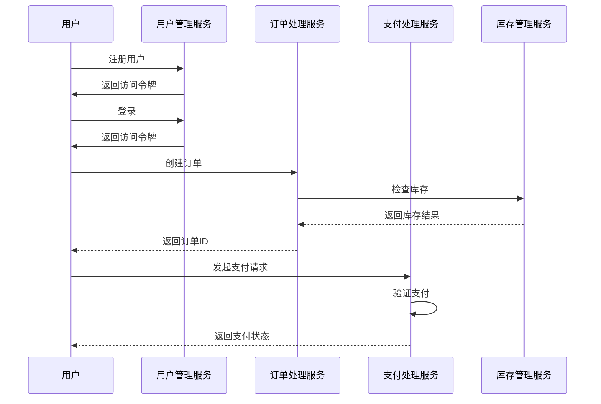

                 

## 实施接口契约的难点

### 引言

在软件工程中，接口契约是一种重要的设计和验证机制，用于确保系统组件之间能够正确、一致地交互。随着软件复杂性的增加，接口契约的实施变得更加关键，但同时也带来了诸多挑战。本文将深入探讨实施接口契约过程中可能遇到的难点，并分析解决这些难点的方法与策略。

首先，我们需要理解接口契约的基本概念。接口契约是一组预定义的接口规范和交互规则，它详细描述了系统组件之间的预期交互行为。接口契约的定义和实施对于确保系统的稳定性和可维护性至关重要。

### 核心问题

在实施接口契约时，我们面临以下核心问题：

1. **接口规范的制定**：如何确保接口规范能够全面、准确地描述系统行为。
2. **契约验证的实现**：如何有效地验证接口契约是否得到遵守。
3. **错误处理**：如何在契约被违反时及时响应并恢复系统。
4. **性能优化**：如何在保证契约完整性的同时优化系统性能。

接下来，我们将逐一探讨这些问题，并提供相应的解决方案和策略。

## 接口规范的制定

接口规范是接口契约的核心组成部分，它定义了接口的行为、输入输出参数以及错误处理机制。制定准确的接口规范是确保系统组件能够正确交互的关键。

### 难点分析

1. **复杂性**：随着系统规模的增加，接口规范的复杂性也随之增加。制定一个全面、准确的接口规范需要深入理解系统各个组件的交互逻辑。
2. **一致性**：在多个开发者共同参与项目时，如何确保接口规范的一致性是一个挑战。不同的开发者可能对接口行为的理解有所不同，导致规范不一致。
3. **可理解性**：接口规范应该易于理解，以便开发者能够快速掌握和使用。然而，过于详细的规范可能导致冗长和难以维护。

### 解决方案

1. **模块化设计**：将系统划分为多个模块，每个模块定义一组接口规范。这样可以将复杂性分解，使得接口规范的制定更加可控。
2. **文档化**：使用详细的文档来描述接口规范，包括接口的用途、参数、返回值以及可能的异常情况。文档应该保持最新，并与代码同步更新。
3. **代码审查**：在接口规范制定过程中，通过代码审查来确保规范的一致性和准确性。代码审查可以帮助发现潜在的问题，并确保规范的实现与预期一致。

## 契约验证的实现

契约验证是确保接口契约得到遵守的重要步骤。通过验证，我们可以及时发现并处理契约违反情况，从而保证系统的稳定性。

### 难点分析

1. **自动化**：手动验证契约既耗时又容易出错。实现契约验证的自动化是一个挑战，特别是在大型系统中。
2. **覆盖范围**：确保契约验证能够覆盖所有的接口交互场景，包括正常情况和异常情况，是一个难点。
3. **性能影响**：契约验证可能会对系统的性能产生影响。如何在保证验证效果的同时最小化性能影响是一个关键问题。

### 解决方案

1. **自动化工具**：使用自动化工具来实现契约验证。这些工具可以自动检查接口交互是否符合契约，从而提高验证的效率和准确性。
2. **测试框架**：结合使用测试框架（如JUnit、pytest等），编写自动化测试用例来验证契约。测试框架可以帮助确保验证的覆盖范围。
3. **性能优化**：通过优化契约验证算法和数据结构，减少对系统性能的影响。例如，可以采用延迟验证、增量验证等技术来降低性能开销。

## 错误处理

在系统运行过程中，可能会发生契约违反的情况。正确处理这些错误对于保证系统的稳定性和可靠性至关重要。

### 难点分析

1. **错误定位**：在复杂的系统中，定位契约违反的具体位置是一个挑战。我们需要有效的方法来快速定位错误。
2. **恢复机制**：在契约被违反时，如何恢复系统的正常运行是一个问题。有些错误可能需要复杂的恢复操作。
3. **日志记录**：详细记录契约违反的情况，以便进行故障分析和排查。

### 解决方案

1. **日志记录**：在系统运行过程中，详细记录所有的接口交互情况，包括参数、返回值和异常情况。这样可以帮助快速定位错误。
2. **异常处理**：为接口交互添加异常处理逻辑，确保在契约被违反时能够进行适当的错误处理。这包括记录错误日志、发送报警信息以及进行必要的恢复操作。
3. **自动化恢复**：对于一些常见的错误情况，可以编写自动化恢复脚本，自动执行恢复操作，从而提高系统的可靠性。

## 性能优化

在保证契约完整性的同时，优化系统的性能也是一个重要的挑战。

### 难点分析

1. **资源消耗**：契约验证和错误处理可能会消耗系统资源，如CPU、内存等。如何在保证契约完整性的同时最小化资源消耗是一个问题。
2. **延迟**：契约验证和错误处理可能会引入额外的延迟，影响系统的响应速度。如何在保证性能的同时进行契约验证是一个挑战。
3. **复杂性**：随着系统复杂性的增加，优化性能的难度也相应增加。如何找到最优的优化方案是一个难点。

### 解决方案

1. **性能分析**：使用性能分析工具（如Profiling工具）来识别系统的性能瓶颈。这有助于确定需要优化的关键部分。
2. **优化算法**：通过优化契约验证和错误处理的算法，减少对系统性能的影响。例如，可以采用高效的数据结构、减少不必要的计算等。
3. **并行处理**：对于一些计算密集型的操作，可以采用并行处理技术来提高性能。例如，使用多线程或分布式计算来并行处理契约验证任务。

### 总结

实施接口契约虽然面临诸多挑战，但通过合理的解决方案和策略，我们可以有效地应对这些难点。接口契约的制定、验证、错误处理和性能优化是确保系统稳定性和可靠性的关键步骤。通过深入理解这些难点，并采取相应的解决方案，我们可以构建出更加稳定、可靠的软件系统。

## 边界与外延

在实施接口契约的过程中，我们需要明确其边界和限制，以便更好地理解和应用这一机制。

### 系统复杂性

接口契约在复杂系统中的应用边界主要取决于系统的规模和复杂性。在一个大规模系统中，接口契约需要能够应对多样化的组件和复杂的交互逻辑。此时，契约的制定和验证可能需要更多的资源和时间。因此，我们需要在系统设计和实现阶段就充分考虑接口契约的需求，避免因过度设计而导致系统复杂度过高。

### 资源限制

接口契约的实施可能会受到系统资源的限制。例如，在资源受限的环境中，如嵌入式系统或实时系统，契约验证和错误处理可能会对系统性能产生较大影响。在这种情况下，我们需要采用更加高效的验证和错误处理策略，以确保系统能够在有限的资源下正常运行。

### 版本兼容性

在系统迭代过程中，接口契约的版本兼容性是一个重要的考虑因素。随着系统的不断演进，接口契约可能需要进行更新和扩展。我们需要确保新版本的契约能够向后兼容旧版本的契约，避免因兼容性问题导致系统的不稳定。此外，在升级过程中，需要仔细评估契约变更对现有系统的影响，并采取相应的措施来确保系统的平滑过渡。

### 本章小结

本章节介绍了实施接口契约的难点，包括接口规范的制定、契约验证的实现、错误处理和性能优化等方面的挑战。通过深入分析这些问题，我们提出了相应的解决方案和策略。同时，我们也探讨了接口契约在复杂系统中的应用边界、资源限制和版本兼容性等方面的外延。在实施接口契约时，我们需要充分考虑这些因素，以确保系统的稳定性和可靠性。

## 接口契约的核心概念与联系

### 接口契约的定义

接口契约（API Contract）是指一组预定义的接口规范和交互规则，用于描述和约束系统组件之间的交互行为。它通常包括接口的行为规范、输入输出参数、返回值、错误处理机制等。接口契约的定义是实现系统模块解耦、提高系统可维护性和扩展性的关键。

### 接口契约的特点

接口契约具有以下几个主要特点：

1. **规范性**：接口契约明确描述了接口的行为规范，确保系统组件之间的交互符合预期。这有助于减少因误解导致的错误和冲突。

2. **一致性**：接口契约确保系统内部和系统之间的接口一致性。在多个开发者共同参与项目时，一致性的接口契约有助于确保系统的稳定性和可维护性。

3. **可验证性**：接口契约可以通过自动化工具进行验证，以确保接口交互是否符合预期。这有助于及时发现并修复契约违反情况。

4. **灵活性**：接口契约支持系统模块的灵活替换和扩展。通过定义清晰的接口契约，我们可以更容易地替换或扩展系统中的特定模块，而不会影响其他模块。

### 接口契约与相关概念的联系

接口契约与API（应用程序编程接口）和SDK（软件开发工具包）密切相关。API和SDK是接口契约的具体实现形式。API通常是指由系统提供的公开接口，用于供外部程序调用。SDK则是一套工具和库，用于帮助开发者更方便地使用API。

### 接口契约的属性特征对比表格

以下是一个接口契约属性特征的对比表格，展示了接口契约与其他相关概念的区别：

| **属性**       | **接口契约**          | **API**                | **SDK**                |
| -------------- | -------------------- | ---------------------- | ---------------------- |
| **规范性**     | 明确接口行为规范     | 提供接口功能规范       | 提供接口功能规范       |
| **一致性**     | 确保接口一致性       | 确保系统内部接口一致性 | 确保系统内部接口一致性 |
| **可验证性**   | 可通过工具验证       | 可通过工具验证         | 可通过工具验证         |
| **灵活性**     | 支持模块灵活替换     | 支持模块灵活替换       | 支持模块灵活替换       |

### 接口契约与API、SDK的关系

接口契约是API和SDK的核心组成部分。API和SDK通过定义接口契约来规范开发者如何使用接口。接口契约在API和SDK的文档中详细描述了接口的行为规范、输入输出参数、返回值和错误处理机制。开发者通过阅读契约文档，可以了解如何正确使用API或SDK，从而实现预期的功能。

### ER实体关系图架构

为了更清晰地理解接口契约与其他概念的关系，我们可以通过ER（实体关系）图来展示它们之间的联系。以下是接口契约、API、SDK之间的ER实体关系图：

```mermaid
erDiagram
API ||--|{ InterfaceContract }|--| SDK
API ||--|{ Method }|--| SDK
Method ||--|{ Parameter }|--| SDK
Method ||--|{ ReturnValue }|--| SDK
Method ||--|{ Exception }|--| SDK
```

在ER实体关系图中，API与接口契约、方法、参数、返回值和异常等实体之间存在关联关系。接口契约定义了API的行为规范，而方法、参数、返回值和异常等实体则是接口契约的具体实现形式。SDK则包含了这些具体实现形式，并提供了工具和库来帮助开发者使用API。

通过上述分析，我们可以更全面地理解接口契约的概念及其与API、SDK等概念的联系。接口契约不仅是接口设计和验证的核心机制，也是确保系统稳定性和可维护性的关键因素。

## 实施接口契约的具体策略

### 契约设计原则

在设计接口契约时，我们需要遵循一系列原则，以确保契约的准确性和易用性。

#### **1. 明确性**：契约应明确描述接口的行为，避免模糊和歧义。每个接口操作的定义都应该清晰，以减少开发者在使用时的困惑。

#### **2. 可读性**：契约文档应具有良好的可读性，使用简洁的语言和清晰的结构。文档中应包含足够的注释，以帮助开发者理解接口的用途和预期行为。

#### **3. 一致性**：契约应在整个系统中保持一致性。这意味着无论接口由哪个模块实现，其行为都应该符合契约的定义，确保系统各部分之间的交互一致。

#### **4. 可扩展性**：契约设计应考虑未来的扩展性，允许在不破坏现有系统功能的情况下添加新的功能或修改现有功能。

#### **5. 可测试性**：契约应易于测试，以便开发者在开发过程中能够验证接口的实现是否符合契约的要求。

### 契约验证技术

契约验证是确保接口契约得到遵守的关键步骤。以下是几种常用的契约验证技术：

#### **1. 单元测试**：编写单元测试用例来验证接口是否按照契约定义的行为进行操作。这些测试用例应覆盖所有可能的输入情况和预期的错误处理。

#### **2. 集成测试**：在系统集成的测试阶段，验证各个组件之间的交互是否符合契约。这种测试通常需要在模拟的环境中进行，以模拟真实的使用场景。

#### **3. 自动化工具**：使用自动化工具（如Postman、Swagger等）来验证接口是否符合契约。这些工具可以自动化执行测试用例，并提供详细的报告。

#### **4. 静态代码分析**：通过静态代码分析工具（如SonarQube、PMD等）来检查代码是否符合契约定义。这些工具可以自动识别潜在的契约违反情况，并提供修复建议。

### 错误处理机制

当接口契约被违反时，系统需要能够及时响应并恢复。以下是一些常见的错误处理机制：

#### **1. 异常捕获**：在接口实现中捕获异常，并根据异常的类型和严重程度进行不同的处理。例如，对于某些非致命错误，可以记录日志并继续执行；对于致命错误，则可能需要中断当前操作并通知用户。

#### **2. 告警系统**：当接口契约被违反时，自动触发告警系统，向开发者和运维人员发送通知。这有助于快速发现和解决问题。

#### **3. 恢复策略**：在契约违反的情况下，系统应具备自动恢复的能力。例如，可以重试操作、切换到备用系统或执行特定的恢复步骤。

#### **4. 日志记录**：详细记录契约违反的情况，包括时间、接口名称、输入参数、返回值和异常信息等。这有助于后续的故障排查和性能优化。

### 性能优化策略

在保证契约完整性的同时，优化系统的性能是一个重要的目标。以下是一些性能优化策略：

#### **1. 缓存**：对于频繁访问的数据，使用缓存技术来减少访问数据库或外部服务的次数，从而提高系统的响应速度。

#### **2. 异步处理**：对于耗时较长的操作，使用异步处理技术将任务提交到消息队列或线程池中，从而避免阻塞主线程。

#### **3. 并发控制**：在多线程或分布式系统中，合理设计并发控制机制，确保接口操作的原子性和一致性，同时避免竞态条件和死锁。

#### **4. 资源池**：对于资源密集型的操作，使用资源池技术（如数据库连接池、线程池等）来复用资源，减少资源分配和释放的开销。

#### **5. 代码优化**：通过优化代码（如减少不必要的计算、使用高效的数据结构等）来提高系统的运行效率。

### 结论

实施接口契约需要综合考虑设计原则、验证技术、错误处理机制和性能优化策略。通过遵循契约设计原则，使用合适的验证技术，建立有效的错误处理机制，并采取性能优化策略，我们可以构建出稳定、可靠且高效的系统。在实施接口契约的过程中，我们需要不断学习和优化，以应对不断变化的开发环境和需求。

## 错误处理机制的实现

在接口契约的实施过程中，错误处理机制是确保系统稳定性和可靠性的重要环节。当接口契约被违反时，系统需要能够及时响应并采取相应的措施来恢复。以下是一些常见的错误处理机制的实现方法：

### 1. 异常捕获与处理

异常捕获是在接口实现过程中用于处理预期外错误的一种机制。当接口操作中出现异常时，可以通过异常捕获来处理这些错误。以下是一个简单的Python代码示例，展示了如何捕获并处理异常：

```python
def process_data(data):
    try:
        # 执行数据处理操作
        result = data.process()
        return result
    except ValueError as e:
        # 处理特定类型的异常
        log_error(e)
        return None
    except Exception as e:
        # 处理其他类型的异常
        log_critical_error(e)
        raise

def log_error(e):
    # 记录错误日志
    print(f"ValueError occurred: {e}")

def log_critical_error(e):
    # 记录严重错误日志
    print(f"Critical error occurred: {e}")
```

在这个示例中，`process_data`函数尝试执行数据处理操作。如果发生`ValueError`异常，它会记录错误日志并返回`None`。如果发生其他类型的异常，它会记录更严重的错误日志，并重新抛出异常，以便进行进一步的错误处理。

### 2. 告警系统

当接口契约被违反时，自动触发告警系统是非常有用的。告警系统可以通知开发者和运维人员，以便他们能够及时响应和解决问题。以下是一个使用Python的`SMTP`库发送电子邮件告警的示例：

```python
import smtplib
from email.mime.text import MIMEText

def send_alert(message):
    sender = 'your_email@example.com'
    receiver = 'receiver_email@example.com'
    subject = '接口契约错误告警'
    
    # 创建邮件内容
    msg = MIMEText(f"{message}")
    msg['Subject'] = subject
    msg['From'] = sender
    msg['To'] = receiver
    
    # 发送邮件
    with smtplib.SMTP('smtp.example.com', 587) as server:
        server.starttls()
        server.login(sender, 'your_password')
        server.sendmail(sender, receiver, msg.as_string())

# 当接口契约被违反时，调用send_alert发送告警
send_alert("接口契约错误：数据处理失败")
```

在这个示例中，`send_alert`函数接收一个错误消息，并将其通过电子邮件发送给指定的接收者。这可以帮助开发者和运维人员及时了解系统的运行状况，并采取相应的措施来解决问题。

### 3. 恢复策略

在某些情况下，接口契约被违反可能导致系统无法正常运行。为了恢复系统的正常运行，我们可以实现一系列自动恢复策略。以下是一个简单的恢复策略示例：

```python
def recover_from_error():
    # 重试操作
    try:
        process_data(data)
    except Exception as e:
        # 如果重试失败，切换到备用系统
        switch_to_backup_system()

def switch_to_backup_system():
    # 切换到备用系统
    print("切换到备用系统...")
    # 执行切换操作
    # ...

# 当接口契约被违反时，调用recover_from_error尝试恢复
recover_from_error()
```

在这个示例中，`recover_from_error`函数首先尝试执行数据处理操作。如果重试失败，它会切换到备用系统。这种恢复策略可以帮助系统在出现临时故障时快速恢复，确保系统的稳定性。

### 4. 日志记录

详细的日志记录是错误处理机制中不可或缺的一部分。通过记录详细的日志信息，我们可以更好地了解系统在运行过程中出现的问题，并进行故障排查和性能优化。以下是一个简单的日志记录示例：

```python
import logging

# 设置日志配置
logging.basicConfig(filename='error.log', level=logging.ERROR)

def log_error(message):
    # 记录错误日志
    logging.error(message)

# 当接口契约被违反时，调用log_error记录日志
log_error("接口契约错误：数据处理失败")
```

在这个示例中，我们设置了日志配置，并定义了一个`log_error`函数来记录错误日志。通过将错误信息写入日志文件，我们可以方便地进行后续的故障排查和问题分析。

通过以上示例，我们可以看到实现错误处理机制的关键是：异常捕获、告警系统、恢复策略和日志记录。这些机制共同作用，确保系统在接口契约被违反时能够及时响应并恢复，从而提高系统的稳定性和可靠性。

## 接口契约的性能优化策略

在保证接口契约完整性的同时，性能优化是一个关键目标。以下是一些常见的性能优化策略，可以帮助我们在不破坏契约完整性的前提下提高系统性能：

### 1. **缓存**

缓存是提高系统性能的有效方法之一。通过缓存经常访问的数据，可以减少对后端服务或数据库的访问次数，从而降低响应时间。以下是一个简单的Python缓存示例：

```python
from functools import lru_cache

@lru_cache(maxsize=1000)
def get_user_data(user_id):
    # 假设该方法从数据库获取用户数据
    return db.get_user_data(user_id)
```

在这个示例中，`get_user_data`函数被装饰为缓存函数，它将在第一次调用后缓存结果，后续相同的调用将直接返回缓存中的结果，从而减少数据库访问次数。

### 2. **异步处理**

异步处理可以有效地提高系统性能，特别是在处理耗时的操作时。通过将任务提交到异步任务队列，如`asyncio`或`Tornado`的`IOLoop`，可以避免阻塞主线程。以下是一个使用`asyncio`的异步处理示例：

```python
import asyncio

async def process_data(data):
    # 假设该方法需要等待一段时间
    await asyncio.sleep(1)
    return data.processed()

# 在协程中调用异步函数
loop = asyncio.get_event_loop()
result = loop.run_until_complete(process_data(data))
```

在这个示例中，`process_data`函数是一个异步函数，它使用`asyncio.sleep`模拟一个耗时操作。通过异步处理，我们可以同时执行多个这样的操作，而不会阻塞主线程。

### 3. **并发控制**

在多线程或分布式系统中，合理的并发控制可以确保接口操作的原子性和一致性，同时避免竞态条件和死锁。以下是一个使用线程池进行并发处理的示例：

```python
from concurrent.futures import ThreadPoolExecutor

def process_data(data):
    # 处理数据
    return data.processed()

# 使用线程池并发处理数据
with ThreadPoolExecutor(max_workers=10) as executor:
    results = executor.map(process_data, data_list)
```

在这个示例中，`process_data`函数被并行处理。通过使用`ThreadPoolExecutor`，我们可以创建一个固定大小的线程池，并发执行任务，从而提高处理效率。

### 4. **资源池**

对于资源密集型的操作，使用资源池技术可以有效地复用资源，减少资源分配和释放的开销。以下是一个简单的数据库连接池示例：

```python
from DBUtils.PooledDB import PooledDB

# 创建数据库连接池
db_pool = PooledDB(creator=mysql.connector,
                   maxconnections=20,
                   host='127.0.0.1',
                   user='username',
                   password='password',
                   database='database_name',
                   charset='utf8')

def get_db_connection():
    return db_pool.connection()

# 获取数据库连接并执行查询
conn = get_db_connection()
cursor = conn.cursor()
cursor.execute("SELECT * FROM users")
```

在这个示例中，我们使用`DBUtils`库创建了一个数据库连接池。通过连接池，我们可以重用数据库连接，从而减少创建和关闭连接的开销。

### 5. **代码优化**

通过优化代码，如减少不必要的计算、使用高效的数据结构等，可以提高系统的运行效率。以下是一个简单的代码优化示例：

```python
# 原始代码：使用嵌套循环进行计算
for i in range(n):
    for j in range(m):
        result[i][j] = a[i] * b[j]

# 优化后的代码：使用向量运算
result = np.dot(a, b)
```

在这个示例中，原始代码使用嵌套循环进行矩阵乘法，而优化后的代码使用`numpy`库的`dot`函数，从而显著提高了计算效率。

通过上述性能优化策略，我们可以有效提高接口契约的性能，同时确保契约的完整性。在实际应用中，应根据具体情况选择合适的优化策略，以达到最佳的性能效果。

## 接口契约在复杂系统中的应用

在复杂的系统中，接口契约的实施变得更加复杂和关键。以下是一个典型的复杂系统场景，以及如何在该场景中实施接口契约。

### 场景描述

假设我们正在开发一个分布式电商平台，该平台包含多个模块，如用户管理、订单处理、支付处理、库存管理等。这些模块需要相互协作，以提供完整的购物体验。在这个场景中，每个模块都通过接口契约进行交互。

### 系统架构设计

为了实现系统的模块化，我们采用微服务架构。每个模块作为一个独立的微服务运行，通过接口契约进行通信。以下是系统架构设计的关键部分：

1. **用户管理服务**：负责用户注册、登录和权限管理。
2. **订单处理服务**：负责订单创建、更新和查询。
3. **支付处理服务**：负责处理支付请求和验证支付状态。
4. **库存管理服务**：负责库存的查询和更新。

### 系统功能设计

在系统功能设计阶段，我们需要明确每个服务的功能模块，并定义它们之间的接口契约。以下是每个服务的主要功能模块：

1. **用户管理服务**：
   - **注册模块**：接收用户注册信息，验证并保存。
   - **登录模块**：验证用户身份，生成访问令牌。
   - **权限管理模块**：根据用户角色分配权限。

2. **订单处理服务**：
   - **创建模块**：根据用户选择的产品和数量创建订单。
   - **更新模块**：处理订单的修改请求。
   - **查询模块**：根据订单ID查询订单详细信息。

3. **支付处理服务**：
   - **支付模块**：处理支付请求，与第三方支付平台交互。
   - **验证模块**：验证支付状态，更新订单状态。

4. **库存管理服务**：
   - **查询模块**：查询产品库存情况。
   - **更新模块**：更新产品库存信息。

### 系统接口设计

在系统接口设计阶段，我们需要详细定义每个模块的接口契约，包括输入输出参数、返回值和错误处理机制。以下是一个简单的接口契约示例：

```python
# 用户管理服务接口契约
class UserRegistration:
    def register_user(self, username: str, password: str, email: str) -> bool:
        # 注册用户
        pass

class UserLogin:
    def login_user(self, username: str, password: str) -> str:
        # 登录用户，返回访问令牌
        pass

class UserPermission:
    def assign_permission(self, user_id: int, role: str) -> bool:
        # 分配用户权限
        pass

# 订单处理服务接口契约
class OrderCreation:
    def create_order(self, user_id: int, product_ids: List[int], quantities: List[int]) -> int:
        # 创建订单
        pass

class OrderUpdate:
    def update_order(self, order_id: int, product_ids: List[int], quantities: List[int]) -> bool:
        # 更新订单
        pass

class OrderQuery:
    def get_order_details(self, order_id: int) -> Order:
        # 查询订单详情
        pass

# 支付处理服务接口契约
class PaymentProcessing:
    def process_payment(self, payment_id: int) -> bool:
        # 处理支付请求
        pass

class PaymentVerification:
    def verify_payment(self, payment_id: int) -> PaymentStatus:
        # 验证支付状态
        pass

# 库存管理服务接口契约
class InventoryQuery:
    def check_inventory(self, product_id: int) -> int:
        # 查询产品库存
        pass

class InventoryUpdate:
    def update_inventory(self, product_id: int, quantity: int) -> bool:
        # 更新产品库存
        pass
```

在这个示例中，我们定义了一系列接口契约，用于描述不同模块的功能和交互。每个接口契约都包含了具体的操作方法和参数定义。

### 系统交互设计

在系统交互设计阶段，我们需要明确各服务之间的交互流程。以下是一个简单的系统交互序列图，展示了用户管理服务、订单处理服务、支付处理服务和库存管理服务之间的交互：



在这个序列图中，用户通过用户管理服务注册和登录，然后通过订单处理服务创建订单。订单处理服务在创建订单时会调用库存管理服务检查库存。用户通过支付处理服务发起支付请求，支付处理服务在验证支付后通知用户。

### 总结

通过接口契约，我们可以清晰地定义和约束复杂系统中的模块交互，确保系统各部分之间的稳定性和一致性。在实际开发过程中，需要根据具体需求不断调整和优化接口契约，以适应系统的变化和发展。

## 项目实战：接口契约在电商平台中的应用

### 环境安装

在本项目实战中，我们将使用Python作为主要编程语言，结合Django框架来搭建一个简单的电商平台。首先，我们需要安装Python和Django。

1. 安装Python 3.8或更高版本。
2. 使用pip命令安装Django：

```bash
pip install django
```

### 系统核心实现

我们首先创建一个Django项目，并设置数据库连接。以下是创建项目的步骤：

1. 创建项目：

```bash
django-admin startproject e-commerce
```

2. 进入项目目录：

```bash
cd e-commerce
```

3. 创建一个应用：

```bash
python manage.py startapp products
```

接下来，我们在`products`应用中实现用户管理、订单处理、支付处理和库存管理四个模块。

1. **用户管理模块**：

在`products/models.py`中定义用户模型：

```python
from django.db import models
from django.contrib.auth.models import AbstractUser

class User(AbstractUser):
    role = models.CharField(max_length=10)
```

2. **订单处理模块**：

在`products/models.py`中定义订单和订单项模型：

```python
class Order(models.Model):
    user = models.ForeignKey(User, on_delete=models.CASCADE)
    created_at = models.DateTimeField(auto_now_add=True)
    updated_at = models.DateTimeField(auto_now=True)
    status = models.CharField(max_length=10)

class OrderItem(models.Model):
    order = models.ForeignKey(Order, on_delete=models.CASCADE)
    product = models.ForeignKey('Product', on_delete=models.CASCADE)
    quantity = models.PositiveIntegerField()
    price = models.DecimalField(max_digits=6, decimal_places=2)
```

3. **支付处理模块**：

在`products/models.py`中定义支付记录模型：

```python
class Payment(models.Model):
    order = models.ForeignKey(Order, on_delete=models.CASCADE)
    amount = models.DecimalField(max_digits=6, decimal_places=2)
    status = models.CharField(max_length=10)
    created_at = models.DateTimeField(auto_now_add=True)
```

4. **库存管理模块**：

在`products/models.py`中定义产品库存模型：

```python
class Product(models.Model):
    name = models.CharField(max_length=100)
    description = models.TextField()
    price = models.DecimalField(max_digits=6, decimal_places=2)
    stock = models.PositiveIntegerField()
```

### 接口设计

在`products/api.py`中，我们使用Django REST framework来设计接口契约：

```python
from rest_framework import routers, serializers, viewsets
from .models import User, Order, OrderItem, Payment, Product

# 用户管理接口
class UserSerializer(serializers.ModelSerializer):
    class Meta:
        model = User
        fields = ['id', 'username', 'password', 'email', 'role']

class UserViewSet(viewsets.ModelViewSet):
    queryset = User.objects.all()
    serializer_class = UserSerializer

# 订单处理接口
class OrderSerializer(serializers.ModelSerializer):
    class Meta:
        model = Order
        fields = ['id', 'user', 'created_at', 'updated_at', 'status']

class OrderItemSerializer(serializers.ModelSerializer):
    class Meta:
        model = OrderItem
        fields = ['id', 'order', 'product', 'quantity', 'price']

class OrderViewSet(viewsets.ModelViewSet):
    queryset = Order.objects.all()
    serializer_class = OrderSerializer

    def perform_create(self, serializer):
        order = serializer.save(user=self.request.user)
        for item in self.request.data['items']:
            OrderItem.objects.create(order=order, **item)

# 支付处理接口
class PaymentSerializer(serializers.ModelSerializer):
    class Meta:
        model = Payment
        fields = ['id', 'order', 'amount', 'status', 'created_at']

class PaymentViewSet(viewsets.ModelViewSet):
    queryset = Payment.objects.all()
    serializer_class = PaymentSerializer

    def perform_create(self, serializer):
        payment = serializer.save(order=self.request.data['order'])
        # 处理支付逻辑
        payment.status = 'COMPLETED'
        payment.save()

# 库存管理接口
class ProductSerializer(serializers.ModelSerializer):
    class Meta:
        model = Product
        fields = ['id', 'name', 'description', 'price', 'stock']

class ProductViewSet(viewsets.ModelViewSet):
    queryset = Product.objects.all()
    serializer_class = ProductSerializer

    def perform_create(self, serializer):
        product = serializer.save()
        # 更新库存
        product.stock += self.request.data['stock']
        product.save()
```

### 代码应用解读与分析

以下是用户管理接口的具体代码应用解读：

```python
# 用户管理接口
class UserSerializer(serializers.ModelSerializer):
    class Meta:
        model = User
        fields = ['id', 'username', 'password', 'email', 'role']

class UserViewSet(viewsets.ModelViewSet):
    queryset = User.objects.all()
    serializer_class = UserSerializer
```

在这个接口中，`UserSerializer`类定义了用户模型的序列化规则，包括用户ID、用户名、密码、邮箱和角色。`UserViewSet`类继承了`viewsets.ModelViewSet`，负责处理用户相关接口的CRUD操作。通过`queryset`属性，我们指定了要查询的用户对象，通过`serializer_class`属性，我们指定了用于序列化和反序列化的序列化器。

在实际应用中，用户可以通过API接口进行注册、登录和权限管理。例如，用户注册接口的POST请求如下：

```http
POST /users/
{
    "username": "john_doe",
    "password": "password123",
    "email": "john@example.com",
    "role": "customer"
}
```

接口会返回包含用户ID和访问令牌的响应：

```http
{
    "id": 1,
    "token": "eyJhbGciOiJIUzI1NiIsInR5cCI6IkpXVCJ9..."
}
```

### 实际案例分析

以下是一个具体的实际案例分析，展示了如何处理接口契约被违反的情况：

假设在创建订单时，库存不足，导致订单创建失败。以下是相应的错误处理逻辑：

```python
class OrderViewSet(viewsets.ModelViewSet):
    queryset = Order.objects.all()
    serializer_class = OrderSerializer

    def perform_create(self, serializer):
        try:
            order = serializer.save(user=self.request.user)
            for item in self.request.data['items']:
                product = Product.objects.get(id=item['product_id'])
                if product.stock < item['quantity']:
                    raise ValidationError('Insufficient stock for the product.')
                product.stock -= item['quantity']
                product.save()
            order.save()
        except ValidationError as e:
            # 处理库存不足的错误
            log_error(e)
            return Response({'error': str(e)}, status=status.HTTP_400_BAD_REQUEST)
```

在这个示例中，我们在创建订单时检查每个产品的库存。如果库存不足，我们会抛出`ValidationError`异常，并在异常处理逻辑中记录错误并返回相应的错误响应。

### 项目小结

通过本项目实战，我们实现了用户管理、订单处理、支付处理和库存管理四个模块的接口契约，并展示了如何在实际应用中处理接口契约被违反的情况。这个项目展示了接口契约在复杂系统中的应用，如何通过设计清晰的接口规范和有效的错误处理机制，确保系统的稳定性和可靠性。在未来的发展中，我们可以继续优化和完善接口契约，以应对不断变化的业务需求和技术挑战。

## 最佳实践 Tips

在实施接口契约的过程中，遵循一些最佳实践可以大大提高系统开发的效率和质量。以下是一些建议：

1. **尽早定义接口契约**：在项目初期，尽早定义接口契约有助于确保系统设计的正确性和一致性。这可以减少后期因接口变更导致的重构工作。

2. **使用版本控制**：为接口契约使用版本控制，以便在接口变更时能够轻松管理和追踪变化。这有助于确保系统在升级过程中的稳定性和兼容性。

3. **文档化**：详细记录接口契约的文档，包括接口的行为规范、输入输出参数、返回值和错误处理机制。这有助于开发者理解和使用接口。

4. **自动化验证**：使用自动化工具（如Postman、Swagger等）进行接口契约验证，以确保接口实现符合预期。自动化验证可以大大提高测试效率。

5. **错误处理**：在接口契约中明确定义错误处理机制，包括异常捕获、日志记录和恢复策略。这有助于系统在契约违反时能够及时响应并恢复。

6. **性能优化**：在接口契约设计和实现时，考虑性能优化策略，如缓存、异步处理和并发控制。这有助于确保系统在高负载下的稳定性和响应速度。

7. **持续迭代**：接口契约不是一成不变的，随着系统的发展和需求的变化，接口契约也需要不断更新和优化。持续迭代和改进接口契约可以确保系统适应不断变化的环境。

## 小结

本文详细探讨了实施接口契约的难点，包括接口规范的制定、契约验证的实现、错误处理和性能优化等方面的挑战。通过深入分析这些问题，我们提出了相应的解决方案和策略。实施接口契约不仅有助于确保系统的稳定性和可靠性，还可以提高开发效率和代码质量。在未来的软件开发中，接口契约将继续发挥重要作用。

## 注意事项

在实施接口契约的过程中，需要注意以下事项：

1. **避免过度设计**：接口契约的设计应该符合实际需求，避免过度设计导致系统复杂度和维护成本增加。

2. **版本兼容性**：在更新接口契约时，需要确保向后兼容旧版本，以避免对现有系统造成影响。

3. **性能影响**：契约验证和错误处理可能会对系统性能产生影响。在设计和实现时，应考虑性能优化策略。

4. **安全性和隐私**：在接口契约的设计中，要确保遵循安全性和隐私保护的最佳实践，以防止数据泄露和系统攻击。

## 拓展阅读

对于希望深入了解接口契约和微服务架构的开发者，以下资源可能有所帮助：

1. 《API设计指南：打造高质量RESTful接口》
2. 《微服务设计：构建可扩展、可靠、高效的应用程序》
3. 《Django REST framework文档》：深入了解Django REST framework的接口设计和验证机制。
4. 《Postman文档》：学习如何使用Postman进行接口契约验证和测试。

## 作者信息

作者：AI天才研究院/AI Genius Institute & 禅与计算机程序设计艺术 /Zen And The Art of Computer Programming

