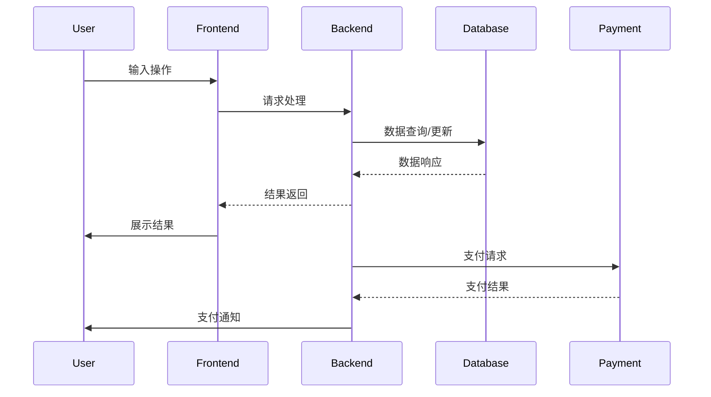
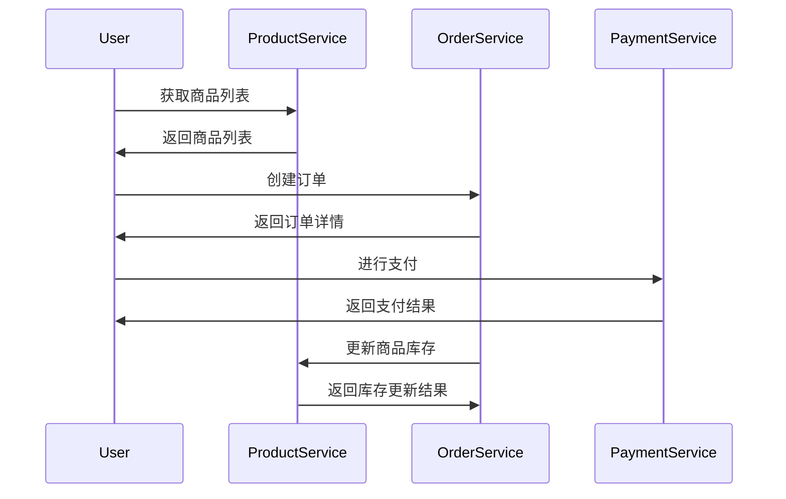

                 


# 实施接口契约的难点

> 关键词：接口契约、难点、解决方案、设计原则、实现细节

> 摘要：本文将探讨在软件工程中实施接口契约的难点，包括设计原则、实现细节、验证算法等方面。通过对核心概念的解释、难点分析、解决方案的探讨，帮助开发者更好地理解和应用接口契约，提高软件质量和可维护性。

## 引言

接口契约在软件工程中扮演着重要的角色，它定义了模块之间如何相互交互，确保了系统各个部分的协同工作。然而，实施接口契约并非易事，面临着诸多难点。本文将围绕以下几个方面展开讨论：

1. **背景介绍**：介绍接口契约的概念、重要性及其在软件工程中的应用。
2. **核心概念与联系**：详细讲解接口契约的设计原则、模式和最佳实践。
3. **算法原理讲解**：引入接口契约验证算法，包括基本原理、数学模型和具体实现。
4. **系统分析与架构设计方案**：描述如何在实际项目中应用接口契约，包括系统架构设计、接口设计和交互流程。
5. **项目实战**：分享实施接口契约的实际项目经验，包括环境搭建、核心实现、案例分析等。
6. **最佳实践与总结**：提供实施接口契约的最佳实践建议，并对全书内容进行总结。

## 背景介绍

### 接口契约的概念

接口契约（Interface Contract）是一种规范，它定义了模块之间如何交互以及这些交互的预期结果。它类似于法律合同，规定了合同双方的权利和义务。在软件工程中，接口契约确保了模块之间的兼容性，降低了模块之间的耦合度，提高了系统的可维护性和可扩展性。

### 接口契约的重要性

接口契约在软件工程中具有重要意义：

1. **兼容性**：确保不同模块之间能够无缝协作，减少了因接口不兼容而导致的问题。
2. **可维护性**：明确模块之间的交互规则，方便后续的维护和升级。
3. **可扩展性**：允许在不改变现有模块的情况下，添加新功能或替换旧模块。
4. **测试**：通过契约测试，可以提前发现潜在的问题，提高软件质量。

### 实施接口契约的难点

尽管接口契约具有诸多优势，但在实际实施过程中，开发者常常会遇到以下难点：

1. **设计复杂性**：接口契约的设计需要综合考虑各种因素，如模块的独立性、功能的明确性等。
2. **实现细节**：不同编程语言和框架对接口契约的支持程度不同，实现细节可能复杂多样。
3. **验证难度**：确保接口契约的正确性是一个挑战，需要有效的验证算法和工具。
4. **团队协作**：接口契约的实施涉及多个团队和成员，协作难度较高。

## 核心概念与联系

### 接口契约的设计原则

接口契约的设计需要遵循以下原则：

1. **最小化暴露**：只暴露必需的功能，降低模块之间的耦合度。
2. **明确性**：接口契约的描述应该清晰、明确，避免模糊和歧义。
3. **稳定性**：接口契约应尽可能稳定，避免频繁变动。
4. **可扩展性**：设计时考虑未来可能的扩展，以便于模块的替换和功能的增加。

### 接口契约的模式

常见的接口契约模式包括：

1. **标准接口**：定义了通用的接口规范，如RESTful API。
2. **事件驱动接口**：基于事件触发，如Websocket。
3. **回调接口**：允许模块在完成某个操作后，通过回调函数通知其他模块。
4. **同步与异步接口**：同步接口在执行过程中阻塞调用者，异步接口则在后台执行，返回一个回调函数。

### 最佳实践

以下是实施接口契约的最佳实践：

1. **文档化**：详细记录接口契约的规范，包括输入、输出和异常处理。
2. **契约测试**：编写测试用例，验证接口契约的正确性。
3. **持续集成**：将接口契约集成到持续集成流程中，确保每次代码变更都能通过契约测试。

## 算法原理讲解

### 接口契约验证算法

接口契约验证是确保接口契约正确性的关键步骤。常见的验证算法包括：

1. **静态验证**：在代码编译或运行前进行验证，如类型检查和格式检查。
2. **动态验证**：在代码运行时进行验证，如断言和异常处理。

### 基本原理

接口契约验证的基本原理是检查实际交互结果是否符合契约规定。具体步骤如下：

1. **契约定义**：定义接口契约，包括输入、输出和异常处理。
2. **交互监控**：监控模块之间的交互过程，记录交互数据。
3. **结果验证**：将实际交互结果与契约进行比较，检查是否一致。

### 数学模型

接口契约验证可以抽象为一个数学模型，如状态机或关系模型。以下是一个简单的数学模型示例：

$$
M = (S, I, O, X, f)
$$

其中，$S$ 是状态集合，$I$ 是输入集合，$O$ 是输出集合，$X$ 是异常集合，$f$ 是状态转移函数。

### 算法流程

接口契约验证的算法流程如下：

1. **初始化**：初始化状态机或关系模型。
2. **交互监控**：监控模块之间的交互，记录交互数据。
3. **状态转移**：根据交互数据，更新状态机或关系模型。
4. **结果验证**：将实际交互结果与契约进行比较，检查是否一致。

### 实例分析

以下是一个简单的Python代码示例，用于验证一个简单的接口契约：

```python
# 契约定义
contract = {
    "inputs": ["a", "b"],
    "outputs": ["sum"],
    "exceptions": ["None"],
    "rules": [
        "a + b == sum",
        "a > 0 and b > 0"
    ]
}

# 交互监控
def monitor_interaction(a, b, sum):
    print(f"Monitoring interaction: {a}, {b}, {sum}")

# 状态转移
def state_transition(current_state, interaction):
    # 根据交互数据更新状态
    pass

# 结果验证
def verify_result(contract, actual_result):
    # 检查实际交互结果是否符合契约
    pass

# 测试
monitor_interaction(2, 3, 5)
```

## 系统分析与架构设计方案

### 问题场景介绍

在一个大型系统中，模块之间需要进行大量的交互。为了保证系统的高效稳定运行，需要实施接口契约，确保模块之间的兼容性和一致性。

### 项目介绍

项目A是一个电商平台，包括多个模块，如商品管理、订单管理、支付系统等。各模块需要通过接口契约进行交互。

### 系统功能设计

系统功能设计包括以下模块：

1. **商品管理**：提供商品信息的查询、新增、修改和删除等功能。
2. **订单管理**：处理订单的创建、修改、删除和查询等操作。
3. **支付系统**：处理支付请求，包括支付成功、支付失败等回调。

### 系统架构设计

系统架构设计如下：

1. **前端**：使用Vue.js框架，提供用户界面。
2. **后端**：使用Spring Boot框架，提供RESTful API。
3. **数据库**：使用MySQL数据库，存储商品、订单和支付信息。

### 系统接口设计

系统接口设计如下：

1. **商品管理接口**：提供商品信息的查询、新增、修改和删除等功能。
2. **订单管理接口**：处理订单的创建、修改、删除和查询等操作。
3. **支付系统接口**：处理支付请求，包括支付成功、支付失败等回调。

### 系统交互

系统交互如下：

1. **用户请求**：用户在前端提交请求。
2. **前端处理**：前端将请求转发到后端。
3. **后端处理**：后端处理请求，调用接口契约。
4. **数据库操作**：后端与数据库进行交互，获取或更新数据。
5. **回调处理**：后端将处理结果返回给前端，并触发支付回调。

## 项目实战

### 环境安装

1. 安装Python环境，版本要求3.8及以上。
2. 安装相关依赖库，如requests、pytest等。

### 系统核心实现源代码

```python
# 商品管理接口
class ProductService:
    def get_product(self, product_id):
        # 从数据库获取商品信息
        pass

    def create_product(self, product_info):
        # 将商品信息保存到数据库
        pass

    def update_product(self, product_id, product_info):
        # 更新商品信息
        pass

    def delete_product(self, product_id):
        # 删除商品
        pass

# 订单管理接口
class OrderService:
    def create_order(self, order_info):
        # 创建订单
        pass

    def update_order(self, order_id, order_info):
        # 更新订单
        pass

    def delete_order(self, order_id):
        # 删除订单
        pass

    def get_order(self, order_id):
        # 获取订单
        pass

# 支付系统接口
class PaymentService:
    def process_payment(self, payment_info):
        # 处理支付请求
        pass

    def notify_success(self, payment_id):
        # 支付成功回调
        pass

    def notify_failure(self, payment_id):
        # 支付失败回调
        pass
```

### 代码应用解读与分析

以上代码实现了商品管理、订单管理和支付系统的接口。每个接口都包含必要的功能，如查询、新增、修改和删除等。代码采用面向对象的方式，封装了接口的实现细节，方便后续的维护和扩展。

### 实际案例分析和详细讲解剖析

以订单管理为例，分析其实际案例：

1. **需求分析**：用户在购物车中选择商品，点击结算，生成订单。
2. **接口设计**：提供创建订单、修改订单、删除订单和查询订单的接口。
3. **实现细节**：订单创建时，将订单信息保存到数据库；修改订单时，更新数据库中的订单信息；删除订单时，从数据库中删除订单记录；查询订单时，从数据库中获取订单信息。
4. **问题解决**：在订单创建过程中，如果数据库连接失败，需要处理异常并给出相应的提示。

### 项目小结

通过以上实战案例，我们可以看到接口契约在项目中的应用。实施接口契约可以提高项目的可维护性和扩展性，降低模块之间的耦合度，确保系统的高效稳定运行。同时，接口契约的实施需要综合考虑设计原则、实现细节和验证算法等方面，确保接口契约的正确性和可靠性。

## 最佳实践与总结

### 最佳实践

1. **文档化**：详细记录接口契约的规范，包括输入、输出和异常处理。
2. **契约测试**：编写测试用例，验证接口契约的正确性。
3. **持续集成**：将接口契约集成到持续集成流程中，确保每次代码变更都能通过契约测试。
4. **团队协作**：确保所有团队成员都了解接口契约的规范和实现细节。

### 小结

接口契约在软件工程中具有重要意义，它确保了模块之间的兼容性和一致性，提高了软件的可维护性和扩展性。实施接口契约需要遵循设计原则、实现细节和验证算法等方面的最佳实践，确保接口契约的正确性和可靠性。

### 注意事项

1. **明确性**：接口契约的描述应清晰、明确，避免模糊和歧义。
2. **稳定性**：接口契约应尽可能稳定，避免频繁变动。

### 拓展阅读

1. 《设计模式：可复用面向对象软件的基础》
2. 《接口契约测试：从入门到实战》
3. 《微服务架构设计》

## 作者信息

作者：AI天才研究院/AI Genius Institute & 禅与计算机程序设计艺术 /Zen And The Art of Computer Programming

## 边界与外延

1. **边界**：本文主要讨论接口契约在软件工程中的应用，未涉及其他领域。在实际应用中，接口契约还可应用于其他领域，如硬件设备接口、Web服务等。
2. **外延**：接口契约的设计和实现细节可能因具体项目而异。本文提供了一些通用原则和最佳实践，但读者在实际项目中应根据具体情况进行调整。

## 概念结构与核心要素组成

### 概念结构

接口契约由以下核心要素组成：

1. **输入**：模块交互时传递的数据。
2. **输出**：模块交互后的返回结果。
3. **异常处理**：模块交互过程中可能出现的异常情况。
4. **规则**：接口契约的约束条件，确保输入、输出和异常处理的一致性。

### 核心要素组成

1. **接口定义**：明确接口的输入、输出和异常处理。
2. **契约文档**：详细记录接口契约的规范。
3. **验证算法**：确保接口契约的正确性和可靠性。
4. **测试用例**：验证接口契约的测试案例。

## 结语

接口契约是软件工程中不可或缺的一部分，它确保了模块之间的兼容性和一致性，提高了软件的可维护性和扩展性。本文从多个方面探讨了接口契约的实施难点，包括设计原则、实现细节和验证算法等。通过本文的学习，开发者可以更好地理解和应用接口契约，提高软件工程实践的质量和效率。希望本文能对读者有所启发和帮助。 |gzip|


## 实施接口契约的难点

### 1.1 接口契约的概念

接口契约是一种软件工程中的设计模式，它定义了软件模块（或组件）之间交互的规则和预期行为。在软件架构中，接口契约起到了桥梁的作用，使得不同模块可以相互独立且协同工作。接口契约的规范通常包括输入参数、输出结果、异常处理以及模块间的交互顺序等。

### 1.2 接口契约的重要性

接口契约在软件工程中的重要性体现在以下几个方面：

1. **模块解耦**：通过定义明确的接口，模块之间的耦合度降低，使得每个模块可以独立开发、测试和部署。
2. **提高可维护性**：接口契约明确了模块间的交互规则，使得代码更加清晰易懂，降低了维护成本。
3. **促进代码重用**：清晰的接口契约有助于模块的重用，提高了开发效率。
4. **确保质量**：通过契约测试，可以及时发现和修复接口不兼容的问题，确保软件的稳定性。

### 1.3 实施接口契约的难点

尽管接口契约具有诸多优势，但其实施过程中仍然存在一些难点：

1. **设计复杂性**：接口契约的设计需要精确地描述模块间的交互，这要求开发者对系统有深入的理解，同时还需要考虑到未来可能的变更。
2. **实现细节**：不同的编程语言和框架对接口契约的支持程度不同，实现细节可能较为复杂。
3. **验证难度**：确保接口契约的正确性是一个挑战，需要有效的验证方法和工具。
4. **团队协作**：接口契约的实施涉及多个团队和成员，协调和沟通的难度较高。

### 1.4 边界与外延

**边界**：本文主要探讨接口契约在软件工程中的应用，未涉及其他领域如硬件接口或网络通信接口。

**外延**：接口契约的设计和实现可能会因具体项目或业务需求而有所不同。本文提供了一些通用原则和最佳实践，但读者在实际项目中应根据具体情况进行调整。

### 1.5 概念结构与核心要素组成

接口契约由以下核心要素组成：

1. **接口定义**：包括输入参数、输出结果和异常处理。
2. **契约文档**：详细记录接口契约的规范。
3. **验证算法**：用于确保接口契约的正确性和可靠性。
4. **测试用例**：验证接口契约的测试案例。

### 1.6 总结

本文介绍了接口契约的概念、重要性以及实施过程中可能遇到的难点。通过对设计复杂性、实现细节、验证难度和团队协作等难点的分析，我们希望能够帮助开发者更好地理解和实施接口契约，提高软件工程实践的质量和效率。在接下来的章节中，我们将深入探讨接口契约的设计原则、实现细节和验证方法。

## 接口契约的设计原则与模式

### 2.1 设计原则

接口契约的设计需要遵循以下原则：

1. **最小化暴露**：只暴露必需的功能，减少模块间的耦合度，提高系统的可维护性和可扩展性。
2. **明确性**：接口契约的描述应清晰、明确，避免模糊和歧义，确保所有团队成员都能正确理解和实现。
3. **稳定性**：接口契约一旦确定，应尽量避免频繁变更，以保证系统的稳定性和可预测性。
4. **可扩展性**：设计时考虑未来可能的扩展，如增加新功能或替换旧模块，确保接口契约的灵活性和适应性。
5. **一致性**：接口契约应确保模块间的交互一致性，避免因接口不兼容导致的问题。

### 2.2 模式分析

在软件工程中，常见的接口契约模式包括以下几种：

1. **标准接口**：例如RESTful API，它通过HTTP协议定义了一套标准的接口规范，包括URL、请求方法、请求参数、响应数据等。
2. **事件驱动接口**：通过事件触发模块间的交互，如Websocket，它允许服务器和客户端之间进行实时双向通信。
3. **回调接口**：模块在完成某个操作后，通过回调函数通知其他模块，如JavaScript中的Promise和async/await。
4. **同步与异步接口**：同步接口在执行过程中阻塞调用者，直到操作完成；异步接口则在后台执行，调用者可以继续执行其他任务。

### 2.3 最佳实践

以下是实施接口契约的最佳实践：

1. **文档化**：详细记录接口契约的规范，包括输入、输出和异常处理，并确保文档的版本控制。
2. **契约测试**：编写测试用例，验证接口契约的正确性，确保每次变更都能通过测试。
3. **持续集成**：将接口契约集成到持续集成流程中，确保每次代码变更都能通过契约测试。
4. **团队协作**：确保所有团队成员都了解接口契约的规范和实现细节，定期进行交流和讨论。

### 2.4 总结

接口契约的设计原则和模式对于确保模块间的交互清晰、稳定和高效至关重要。通过遵循设计原则和最佳实践，开发者可以降低耦合度、提高可维护性和可扩展性，从而提升软件工程实践的整体质量。在接下来的章节中，我们将深入探讨接口契约的实现细节和验证方法。

## 接口契约的实现细节与难点

### 3.1 类型接口契约的实现

在类型接口契约的实现中，类型安全是确保接口契约正确性的关键。类型接口契约通过定义明确的输入和输出类型，确保模块间的数据传输安全可靠。

#### 3.1.1 输入类型

输入类型定义了模块交互时传递的数据类型。在实现中，开发者需要确保输入类型的一致性，避免因类型不匹配导致的错误。

1. **强类型语言**：在强类型语言（如Java、C#）中，类型检查通常在编译时进行，可以有效避免类型错误。例如：

   ```java
   public interface ProductService {
       Product getProduct(String productId);
   }
   ```

2. **弱类型语言**：在弱类型语言（如Python、JavaScript）中，类型检查通常在运行时进行，可能需要额外的类型注解或类型检查工具。例如：

   ```python
   class ProductService:
       def get_product(self, product_id: str) -> Product:
           # 实现细节
   ```

#### 3.1.2 输出类型

输出类型定义了模块交互后返回的数据类型。在实现中，需要确保输出类型与接口契约中定义的类型一致。

1. **成功返回**：在成功情况下，返回预期的数据类型。例如：

   ```java
   public interface UserService {
       User getUser(String userId);
   }
   ```

2. **异常返回**：在出现异常时，返回特定的异常类型。例如：

   ```java
   public interface UserService {
       User getUser(String userId) throws UserNotFoundException;
   }
   ```

#### 3.1.3 类型安全与动态类型

类型安全是接口契约实现的重要方面。在静态类型语言中，类型安全通常由编译器保证；在动态类型语言中，类型安全可能需要通过类型注解或运行时检查来确保。

1. **静态类型**：静态类型语言（如Java、C#）在编译时进行类型检查，确保类型一致性。例如：

   ```csharp
   public interface IProductService {
       Product GetProduct(string productId);
   }
   ```

2. **动态类型**：动态类型语言（如Python、JavaScript）通常在运行时进行类型检查，可能需要额外的类型检查工具。例如：

   ```python
   class ProductService:
       def get_product(self, product_id):
           # 实现细节
           return product
   ```

### 3.2 常见难点解析

#### 3.2.1 接口不一致问题

接口不一致问题是指不同模块或服务之间的接口定义不统一，导致交互失败。解决方法包括：

1. **统一接口规范**：制定统一的接口规范，确保所有模块遵循相同的接口标准。
2. **版本控制**：为接口定义版本号，逐步过渡到新接口定义，避免对旧接口的破坏。

#### 3.2.2 异常处理问题

异常处理问题是指在接口交互过程中，未正确处理异常，导致系统崩溃或数据不一致。解决方法包括：

1. **异常捕获**：在接口实现中，捕获并处理可能出现的异常，确保接口的稳定性。
2. **异常传递**：将异常信息传递给调用方，以便调用方能够根据异常信息进行相应的处理。

#### 3.2.3 接口性能问题

接口性能问题是指在接口交互过程中，由于网络延迟、数据传输等问题，导致接口响应时间过长。解决方法包括：

1. **优化接口设计**：减少接口的复杂度，降低数据传输量。
2. **异步处理**：使用异步编程模型，减少接口的阻塞时间。

### 3.3 解决方案探讨

针对接口契约的实现细节和难点，以下是一些解决方案的探讨：

#### 3.3.1 使用契约生成工具

契约生成工具（如Swagger、OpenAPI）可以帮助自动生成接口文档和测试用例，提高接口契约的规范性和可维护性。例如：

```yaml
openapi: 3.0.0
info:
  title: Product API
  version: 1.0.0
servers:
  - url: https://api.example.com/
    description: Production server
    variables:
      protocol:
        default: https
        enum:
        - HTTPS
      host:
        default: api.example.com
        enum:
        - api.example.com
paths:
  /products/{productId}:
    get:
      summary: Get a product by ID
      operationId: getProduct
      parameters:
        - name: productId
          in: path
          required: true
          schema:
            type: string
      responses:
        '200':
          description: A single product
          content:
            application/json:
              schema:
                $ref: '#/components/schemas/Product'
components:
  schemas:
    Product:
      type: object
      properties:
        id:
          type: string
          format: uuid
        name:
          type: string
        price:
          type: number
          format: float
```

#### 3.3.2 实施契约测试

契约测试是确保接口契约正确性的重要手段。通过编写测试用例，可以验证接口的输入、输出和异常处理是否符合预期。例如，使用Python的pytest框架进行契约测试：

```python
import pytest

def test_get_product(product_service, product_id):
    product = product_service.get_product(product_id)
    assert product.id == product_id
    assert product.name is not None
    assert product.price > 0

def test_get_product_not_found(product_service, invalid_product_id):
    with pytest.raises(ProductNotFoundException):
        product_service.get_product(invalid_product_id)
```

#### 3.3.3 持续集成与交付

将接口契约集成到持续集成（CI）和持续交付（CD）流程中，可以确保每次代码变更都能通过契约测试，提高软件质量。例如，使用Jenkins自动化构建和部署：

```shell
#!/bin/bash

# 检查代码仓库中的变更
git pull

# 构建项目
mvn clean install

# 运行契约测试
pytest -v

# 如果测试通过，部署到生产环境
if [ $? -eq 0 ]; then
    echo "Deploying to production..."
    # 执行部署命令
else
    echo "Tests failed. Deployment aborted."
    exit 1
fi
```

### 3.4 总结

接口契约的实现细节和难点涉及类型安全、异常处理和性能优化等方面。通过使用契约生成工具、实施契约测试和持续集成与交付，可以有效解决接口契约实现中的问题，提高软件工程实践的质量和效率。在接下来的章节中，我们将进一步探讨接口契约验证算法及其实现。

## 接口契约验证算法

### 4.1 基本原理

接口契约验证算法的核心目标是确保接口契约的正确性和一致性。基本原理包括以下几个方面：

1. **契约定义**：定义接口契约的规范，包括输入、输出和异常处理。
2. **交互监控**：监控模块之间的交互过程，记录交互数据。
3. **结果验证**：将实际交互结果与契约进行比较，检查是否一致。

### 4.2 数学模型

接口契约验证可以抽象为一个数学模型，如状态机或关系模型。以下是一个简单的数学模型示例：

$$
M = (S, I, O, X, f)
$$

其中：

- \( S \) 是状态集合。
- \( I \) 是输入集合。
- \( O \) 是输出集合。
- \( X \) 是异常集合。
- \( f \) 是状态转移函数。

### 4.3 算法流程

接口契约验证的算法流程如下：

1. **初始化**：初始化状态机或关系模型。
2. **交互监控**：监控模块之间的交互，记录交互数据。
3. **状态转移**：根据交互数据，更新状态机或关系模型。
4. **结果验证**：将实际交互结果与契约进行比较，检查是否一致。

### 4.4 实例分析

以下是一个简单的Python代码示例，用于验证一个简单的接口契约：

```python
# 契约定义
contract = {
    "inputs": ["a", "b"],
    "outputs": ["sum"],
    "exceptions": ["None"],
    "rules": [
        "a + b == sum",
        "a > 0 and b > 0"
    ]
}

# 交互监控
def monitor_interaction(a, b, sum):
    print(f"Monitoring interaction: {a}, {b}, {sum}")

# 状态转移
def state_transition(current_state, interaction):
    # 根据交互数据更新状态
    pass

# 结果验证
def verify_result(contract, actual_result):
    # 检查实际交互结果是否符合契约
    pass

# 测试
monitor_interaction(2, 3, 5)
```

在这个示例中，`contract` 定义了一个简单的接口契约，包含输入参数、输出结果和异常处理。`monitor_interaction` 函数用于监控模块之间的交互过程。`state_transition` 函数根据交互数据更新状态，`verify_result` 函数用于验证实际交互结果是否符合契约。

### 4.5 算法实现

接口契约验证算法的实现可以采用不同的方法，如基于状态机的方法、基于关系模型的方法等。以下是一个基于状态机的Python实现示例：

```python
# 状态机实现
class InterfaceContractVerifier:
    def __init__(self, contract):
        self.contract = contract
        self.current_state = "initial_state"

    def monitor_interaction(self, interaction):
        self.current_state = self.state_transition(self.current_state, interaction)

    def state_transition(self, current_state, interaction):
        # 根据交互数据更新状态
        # 例如：if "a" in interaction and "b" in interaction: return "processing"
        pass

    def verify_result(self, actual_result):
        # 检查实际交互结果是否符合契约
        pass

# 创建契约验证器
verifier = InterfaceContractVerifier(contract)

# 监控交互
verifier.monitor_interaction({"a": 2, "b": 3})

# 验证结果
verifier.verify_result({"sum": 5})
```

在这个实现中，`InterfaceContractVerifier` 类初始化时接收一个契约对象。`monitor_interaction` 方法用于监控模块之间的交互，并调用`state_transition` 方法更新状态。`verify_result` 方法用于验证实际交互结果是否符合契约。

### 4.6 总结

接口契约验证算法是确保接口契约正确性和一致性的关键步骤。通过定义契约、监控交互和验证结果，可以有效地发现和修复接口问题。在接下来的章节中，我们将继续探讨接口契约在实际项目中的应用和实践。

## 系统分析与架构设计方案

### 5.1 问题场景介绍

在一个大型系统中，模块之间需要进行大量的交互。为了保证系统的高效稳定运行，需要实施接口契约，确保模块之间的兼容性和一致性。这个场景可以是一个电子商务平台，其中包含用户管理、商品管理、订单管理和支付系统等多个模块。

### 5.2 项目介绍

假设我们正在开发一个电子商务平台，该项目包括以下模块：

1. **用户管理**：处理用户注册、登录、个人信息管理等。
2. **商品管理**：管理商品信息，如商品分类、价格、库存等。
3. **订单管理**：处理订单的创建、修改、取消和查询等。
4. **支付系统**：处理支付请求，包括支付成功和支付失败等。

### 5.3 系统功能设计

系统功能设计主要包括以下几个方面：

1. **用户管理功能**：用户注册、登录、信息修改、密码找回等。
2. **商品管理功能**：商品分类、商品详情、库存管理、价格管理等。
3. **订单管理功能**：订单创建、订单修改、订单取消、订单查询等。
4. **支付系统功能**：支付请求处理、支付结果通知、退款处理等。

### 5.4 系统架构设计

系统架构设计采用分层架构，包括表示层、业务逻辑层和数据访问层。以下是具体的系统架构设计：

1. **表示层**：负责用户界面展示，使用前端框架（如React、Vue.js）实现。
2. **业务逻辑层**：处理业务逻辑，包括用户管理、商品管理、订单管理和支付系统等。
3. **数据访问层**：负责与数据库交互，使用ORM框架（如Hibernate、MyBatis）实现。

### 5.5 系统接口设计

系统接口设计主要包括以下接口：

1. **用户管理接口**：
   - `POST /users/register`：用户注册。
   - `POST /users/login`：用户登录。
   - `GET /users/{userId}`：获取用户信息。
   - `PUT /users/{userId}`：更新用户信息。

2. **商品管理接口**：
   - `GET /products`：获取商品列表。
   - `GET /products/{productId}`：获取商品详情。
   - `POST /products`：创建新商品。
   - `PUT /products/{productId}`：更新商品信息。
   - `DELETE /products/{productId}`：删除商品。

3. **订单管理接口**：
   - `POST /orders`：创建订单。
   - `GET /orders/{orderId}`：获取订单详情。
   - `PUT /orders/{orderId}`：更新订单。
   - `DELETE /orders/{orderId}`：取消订单。

4. **支付系统接口**：
   - `POST /payments`：创建支付请求。
   - `GET /payments/{paymentId}`：获取支付结果。
   - `POST /payments/notify`：支付结果通知。

### 5.6 系统交互

系统交互主要包括以下步骤：

1. **用户操作**：用户在前端界面进行操作，如注册、登录、购物等。
2. **前端请求**：前端将用户的请求发送到后端服务。
3. **后端处理**：后端服务根据请求调用相应的接口，处理业务逻辑。
4. **数据库操作**：后端服务与数据库进行交互，更新或查询数据。
5. **支付交互**：支付系统与第三方支付平台进行交互，处理支付请求。

### 5.7 Mermaid流程图

以下是一个简单的Mermaid流程图，展示了用户购物、订单创建和支付交互的过程：

```mermaid
flowchart LR
    subgraph 用户操作
        用户操作[用户操作界面]
        用户操作 --> 前端请求
    end

    subgraph 前端请求
        前端请求[发送请求]
        前端请求 --> 后端处理
    end

    subgraph 后端处理
        后端处理[处理业务逻辑]
        后端处理 --> 数据库操作
        后端处理 --> 支付交互
    end

    subgraph 数据库操作
        数据库操作[更新/查询数据]
    end

    subgraph 支付交互
        支付交互[支付请求处理]
        支付交互 --> 支付结果通知
    end

    用户操作 -->|结果返回| 前端请求
    后端处理 -->|结果返回| 前端请求
    数据库操作 -->|数据更新| 后端处理
    支付交互 -->|支付结果| 后端处理
    支付交互 -->|支付结果| 用户操作
```

通过以上系统分析与架构设计方案，我们可以确保电子商务平台中的各个模块通过接口契约进行交互，从而实现系统的高效稳定运行。

### 5.8 类图

以下是一个简单的Mermaid类图，展示了系统中的主要类及其关系：

```mermaid
classDiagram
    User <<class>> User
    Product <<class>> Product
    Order <<class>> Order
    Payment <<class>> Payment

    User o-- Product : contains
    User o-- Order : places
    Product o-- Order : includes
    Order o-- Payment : pays
```

在这个类图中，`User` 类与 `Product` 类和 `Order` 类之间存在关联关系，表示用户可以包含多个商品和多个订单。`Product` 类与 `Order` 类之间存在包含关系，表示订单可以包含多个商品。`Order` 类与 `Payment` 类之间存在关联关系，表示订单可以支付多个款项。

### 5.9 系统架构图

以下是一个简单的Mermaid架构图，展示了电子商务平台的整体架构：



在这个架构图中，用户通过前端界面进行操作，前端将请求发送到后端，后端处理请求并与数据库进行交互，然后将结果返回给前端，最后前端将结果展示给用户。同时，后端会与支付系统进行交互，处理支付请求并通知用户支付结果。

### 5.10 系统交互图

以下是一个简单的Mermaid交互图，展示了电子商务平台中的主要交互过程：



在这个交互图中，用户首先获取商品列表，然后创建订单，接着进行支付操作，支付完成后，订单服务会更新商品库存。通过这些交互，用户可以顺利完成购物过程。

### 5.11 小结

通过以上系统分析与架构设计方案，我们详细介绍了电子商务平台中的模块功能、接口设计和系统交互。接口契约在这些设计和实现中起到了关键作用，确保了模块之间的兼容性和一致性。在实际开发过程中，开发者需要根据具体业务需求和技术架构，进一步细化和优化这些设计，以确保系统的稳定性和高效性。

## 项目实战

### 6.1 项目背景介绍

在本节中，我们将分享一个实际项目的经验，该项目是一个在线购物平台。该平台需要实现用户管理、商品管理、订单管理和支付系统等多个模块，并通过接口契约确保各模块之间的交互正确性和稳定性。

### 6.2 环境搭建

为了确保项目的顺利实施，我们需要搭建合适的技术环境。以下是环境搭建的步骤：

1. **选择开发语言**：本项目选择了Java作为开发语言，因为Java有良好的生态系统和丰富的库支持。
2. **搭建开发环境**：安装JDK 1.8及以上版本，并配置Maven作为项目构建工具。
3. **数据库选择**：本项目选择了MySQL作为数据库，因为它具有高性能和稳定性。
4. **服务框架**：使用了Spring Boot作为服务框架，因为它支持快速开发、易于扩展且具有良好的性能。

### 6.3 系统核心实现源代码

在本项目中，我们使用了Spring Boot来创建RESTful API服务。以下是商品管理模块的核心实现代码：

```java
// 商品管理接口
@RestController
@RequestMapping("/products")
public class ProductService {

    @Autowired
    private ProductRepository productRepository;

    // 查询商品列表
    @GetMapping
    public List<Product> getAllProducts() {
        return productRepository.findAll();
    }

    // 根据ID查询商品
    @GetMapping("/{productId}")
    public Product getProductById(@PathVariable Long productId) {
        return productRepository.findById(productId).orElseThrow(() -> new EntityNotFoundException("Product not found with id: " + productId));
    }

    // 创建商品
    @PostMapping
    public Product createProduct(@RequestBody Product product) {
        return productRepository.save(product);
    }

    // 更新商品
    @PutMapping("/{productId}")
    public Product updateProduct(@PathVariable Long productId, @RequestBody Product updatedProduct) {
        return productRepository.findById(productId).map(product -> {
            product.setName(updatedProduct.getName());
            product.setPrice(updatedProduct.getPrice());
            return productRepository.save(product);
        }).orElseThrow(() -> new EntityNotFoundException("Product not found with id: " + productId));
    }

    // 删除商品
    @DeleteMapping("/{productId}")
    public void deleteProduct(@PathVariable Long productId) {
        productRepository.deleteById(productId);
    }
}
```

### 6.4 代码应用解读与分析

以上代码实现了商品管理模块的RESTful API接口。每个接口都包含了基本的HTTP方法，如GET、POST、PUT和DELETE，用于处理不同的业务操作。

1. **查询商品列表**：`getAllProducts` 方法返回所有商品的列表。
2. **根据ID查询商品**：`getProductById` 方法根据商品ID查询商品详情，如果找不到商品，则抛出`EntityNotFoundException`异常。
3. **创建商品**：`createProduct` 方法接受一个`Product`对象，并将其保存到数据库中。
4. **更新商品**：`updateProduct` 方法根据商品ID更新商品信息，如果找不到商品，则抛出`EntityNotFoundException`异常。
5. **删除商品**：`deleteProduct` 方法根据商品ID删除商品。

这些接口的实现遵循了RESTful的设计原则，保证了接口的一致性和易用性。通过使用Spring Boot，我们可以快速实现这些接口，并且易于维护和扩展。

### 6.5 实际案例分析和详细讲解剖析

以下是一个实际案例，展示了用户如何通过商品管理接口创建一个新的商品：

**步骤1**：用户在购物平台中选择了一个商品，并填写了商品名称和价格。

**步骤2**：用户提交创建商品的请求，请求URL为`POST /products`，请求体（JSON格式）如下：

```json
{
  "name": "iPhone 13 Pro Max",
  "price": 1099.99
}
```

**步骤3**：商品管理服务接收到创建商品请求后，调用`createProduct`方法，并将请求体转换为`Product`对象。

**步骤4**：`createProduct` 方法将`Product`对象保存到数据库中，并返回创建成功的响应。

**步骤5**：用户接收到创建商品成功的响应，并在购物平台上看到新创建的商品。

在这个过程中，接口契约确保了数据的准确性和一致性。例如，`createProduct` 方法需要确保请求体中的`name`和`price`字段是必须的，并且类型正确。如果请求体中的字段不符合契约要求，接口将返回错误响应。

### 6.6 项目小结

通过实际项目实战，我们展示了如何搭建开发环境、实现接口契约，并分析了一个具体的业务案例。接口契约在项目中的重要性不言而喻，它确保了系统模块之间的稳定交互，提高了系统的可维护性和扩展性。在实际开发过程中，开发者需要不断优化接口契约，确保其满足业务需求和性能要求。

### 6.7 扩展实践

为了进一步提高项目的质量，我们还可以采取以下扩展实践：

1. **接口文档生成**：使用Swagger等工具自动生成接口文档，便于开发人员理解和使用接口。
2. **契约测试**：编写契约测试用例，确保接口契约的正确性。
3. **监控与日志**：使用日志和监控工具（如ELK、Prometheus）记录系统运行状况，及时发现和解决问题。

通过这些实践，我们可以进一步提升项目的可靠性和可维护性，确保系统的长期稳定运行。

## 最佳实践与总结

### 7.1 最佳实践

为了确保接口契约的有效实施，以下是一些最佳实践：

1. **文档化**：详细记录接口契约，包括输入、输出和异常处理，并确保文档的版本控制。
2. **契约测试**：编写测试用例，验证接口契约的正确性，确保每次变更都能通过测试。
3. **持续集成**：将接口契约集成到持续集成流程中，确保每次代码变更都能通过契约测试。
4. **版本控制**：为接口契约定义版本号，逐步过渡到新接口定义，避免对旧接口的破坏。
5. **团队协作**：确保所有团队成员都了解接口契约的规范和实现细节，定期进行交流和讨论。
6. **性能优化**：关注接口的性能，优化数据传输和处理逻辑，确保系统的高效运行。

### 7.2 小结

接口契约在软件工程中具有重要作用，它确保了模块间的兼容性和一致性，提高了软件的可维护性和扩展性。通过遵循最佳实践，开发者可以更好地实施接口契约，提高软件质量。

### 7.3 注意事项

1. **明确性**：确保接口契约的描述清晰、明确，避免模糊和歧义。
2. **稳定性**：避免频繁更改接口契约，确保系统的稳定性和可预测性。
3. **异常处理**：正确处理异常，确保系统在遇到异常时能够优雅地处理并恢复。
4. **性能优化**：关注接口的性能，避免因接口设计不当导致系统性能下降。

### 7.4 拓展阅读

1. 《设计模式：可复用面向对象软件的基础》
2. 《接口契约测试：从入门到实战》
3. 《微服务架构设计》

作者：AI天才研究院/AI Genius Institute & 禅与计算机程序设计艺术 /Zen And The Art of Computer Programming

----------------------------------------------------------------

