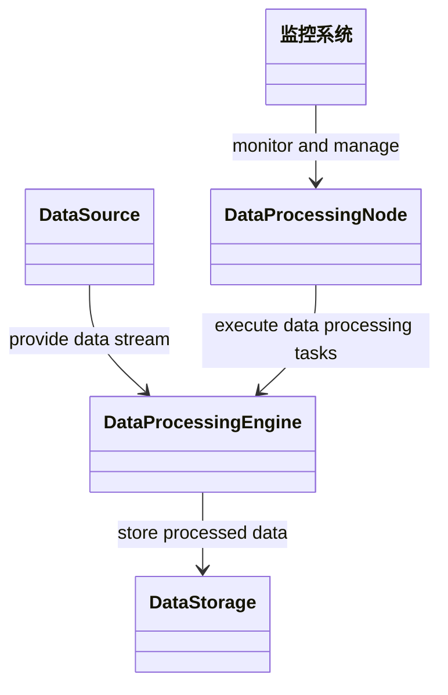
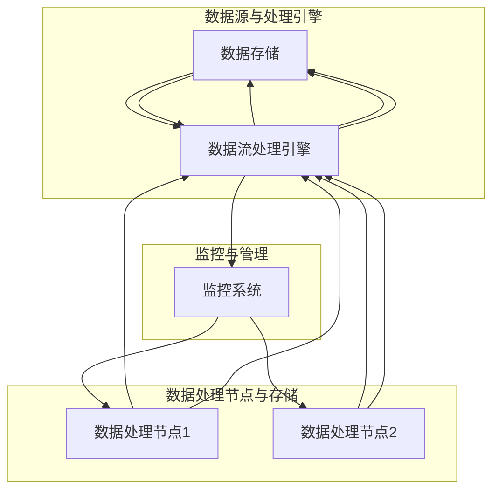
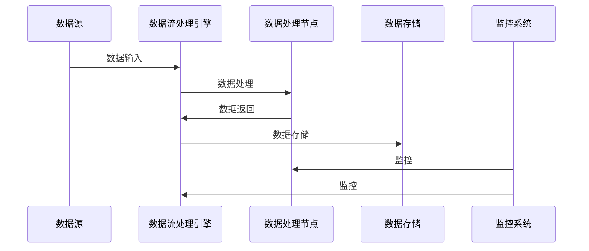

                 

# 实时数据处理架构与实现

## 关键词

- **实时数据处理**
- **流计算**
- **系统架构**
- **算法**
- **数学模型**
- **Python代码实现**
- **最佳实践**

## 摘要

本文将深入探讨实时数据处理的概念、架构、算法及其实现过程。通过逐步分析，我们将理解实时数据处理的背景和重要性，了解核心概念与联系，掌握流计算算法原理，学习系统架构设计方案，并通过实际项目实战展示实时数据处理的应用与实践。文章还将提供最佳实践、注意事项以及拓展阅读，帮助读者全面掌握实时数据处理的知识和技能。

## 第一部分：实时数据处理概述

### 第1章：实时数据处理基础

#### 1.1 实时数据处理的概念

实时数据处理（Real-Time Data Processing）是指在极短的时间内对数据流进行捕获、处理、分析和响应的过程。与传统的批处理不同，实时数据处理要求系统能够实时响应数据的变化，提供即时的输出结果。这种处理方式在金融交易、物联网、在线广告、工业自动化等领域具有广泛的应用。

#### 1.2 实时数据处理的背景和重要性

随着互联网的快速发展，数据量呈爆炸式增长，实时处理数据的能力成为许多应用场景的关键需求。实时数据处理能够帮助企业快速响应市场变化，优化决策流程，提升业务效率。例如，在金融交易中，实时数据处理能够快速识别异常交易，防范风险；在物联网中，实时数据处理能够实时监控设备状态，提高设备利用率。

#### 1.3 实时数据处理的应用场景

实时数据处理广泛应用于多个领域，包括但不限于：

- **金融交易**：实时监控市场动态，快速执行交易策略。
- **物联网**：实时监控设备状态，实现远程维护和故障预测。
- **在线广告**：实时推荐广告内容，提升用户满意度。
- **工业自动化**：实时监控生产线，优化生产流程。

### 第2章：实时数据处理核心概念

#### 2.1 数据流处理框架

数据流处理框架（Data Streaming Framework）是实时数据处理的核心技术之一。它提供了一种高效的方式来处理数据流，支持数据捕获、处理、存储和分发。常见的数据流处理框架包括Apache Kafka、Apache Flink、Apache Spark Streaming等。

#### 2.1.1 概念定义

- **数据流**：数据以连续、动态的形式在系统中流动。
- **数据处理**：对数据流进行清洗、转换、分析等操作。
- **存储**：将处理后的数据存储在数据库或数据湖中。
- **分发**：将数据流分发到不同的处理节点或消费者。

#### 2.1.2 主要框架介绍

- **Apache Kafka**：一个分布式流处理平台，提供高吞吐量、可扩展的数据流处理能力。
- **Apache Flink**：一个基于Java和Scala的流处理框架，提供高性能、实时数据处理能力。
- **Apache Spark Streaming**：基于Apache Spark的流处理扩展，提供强大的流处理功能。

#### 2.1.3 数据流处理框架与批处理框架的比较

| 特性 | 数据流处理框架 | 批处理框架 |
| ---- | -------------- | ---------- |
| 实时性 | 高 | 低 |
| 扩展性 | 高 | 中 |
| 处理能力 | 大规模流数据 | 大规模批量数据 |
| 易用性 | 中 | 高 |

### 第3章：实时数据处理算法原理

#### 3.1 流计算算法基础

流计算算法是实时数据处理的核心技术，用于处理数据流中的各种计算任务。常见的流计算算法包括窗口算法、聚合算法、过滤算法等。

#### 3.1.1 算法概述

流计算算法主要分为以下几类：

- **窗口算法**：对数据流进行时间窗口或滑动窗口处理，例如滑动平均、滑动总和等。
- **聚合算法**：对数据流进行聚合操作，例如求和、求平均值等。
- **过滤算法**：对数据流进行筛选操作，例如过滤特定值、特定模式等。

#### 3.1.2 算法原理讲解

以窗口算法为例，窗口算法的基本原理是将数据流按照一定的时间间隔分成多个窗口，然后对每个窗口内的数据进行处理。滑动平均算法是一种常见的窗口算法，其计算公式如下：

$$
滑动平均 = \frac{当前窗口的数据总和}{窗口大小}
$$

#### 3.1.3 Python代码实现

```python
def sliding_average(data_stream, window_size):
    window = []
    for data in data_stream:
        window.append(data)
        if len(window) > window_size:
            window.pop(0)
        average = sum(window) / window_size
        print(f"滑动平均：{average}")

data_stream = [1, 2, 3, 4, 5, 6, 7, 8, 9, 10]
sliding_average(data_stream, 3)
```

#### 3.2 常见实时数据处理算法

除了窗口算法，还有一些常见的实时数据处理算法，如：

- **聚合算法**：对数据流进行聚合操作，例如求和、求平均值等。
- **过滤算法**：对数据流进行筛选操作，例如过滤特定值、特定模式等。

#### 3.2.1 算法简介

- **聚合算法**：对数据流中的数据进行聚合操作，例如求和、求平均值等。
- **过滤算法**：对数据流中的数据进行筛选操作，例如过滤特定值、特定模式等。

#### 3.2.2 算法原理讲解

- **聚合算法**：以求和为例，其计算公式如下：

$$
求和 = 数据流中所有数据的总和
$$

- **过滤算法**：以过滤特定模式为例，其原理是根据预设的条件对数据流中的数据进行筛选。

#### 3.2.3 Python代码实现

```python
def sum_of_stream(data_stream):
    return sum(data_stream)

def filter_stream(data_stream, condition):
    return [data for data in data_stream if condition(data)]

data_stream = [1, 2, 3, 4, 5, 6, 7, 8, 9, 10]
print("求和结果：", sum_of_stream(data_stream))
print("过滤结果：", filter_stream(data_stream, lambda x: x > 5))
```

#### 3.2.4 数学模型和公式

实时数据处理算法中的数学模型和公式是实现算法的关键。以下是一个简单的例子：

- **滑动平均**：$$ 滑动平均 = \frac{当前窗口的数据总和}{窗口大小} $$

## 第二部分：实时数据处理系统设计与实现

### 第4章：实时数据处理系统架构设计

#### 4.1 系统设计思路

实时数据处理系统的设计需要考虑以下几个方面：

- **数据处理能力**：系统能够处理海量数据流，保证低延迟和高吞吐量。
- **可扩展性**：系统能够根据需求进行横向和纵向扩展。
- **可靠性**：系统具备高可用性和容错性，能够应对各种异常情况。
- **易维护性**：系统设计简单，便于开发和维护。

#### 4.2 系统架构设计

实时数据处理系统架构包括以下几个关键组件：

- **数据源**：提供实时数据流的数据源，如传感器、数据库等。
- **数据流处理引擎**：负责对数据流进行实时处理，如Apache Kafka、Apache Flink等。
- **数据存储**：将处理后的数据存储在数据库或数据湖中，如MySQL、HDFS等。
- **数据处理节点**：负责具体的数据处理任务，如计算、过滤、聚合等。
- **监控和管理**：实时监控系统状态，提供日志记录、告警等功能。

#### 4.2.1 领域模型类图



#### 4.2.2 系统架构图



#### 4.2.3 系统接口设计

实时数据处理系统的接口设计包括数据输入接口、数据输出接口和系统管理接口。

- **数据输入接口**：负责接收外部数据源的数据流，如REST API、消息队列等。
- **数据输出接口**：负责将处理后的数据输出到其他系统或存储，如数据库、数据湖等。
- **系统管理接口**：负责系统的监控、日志记录、告警等功能。

#### 4.2.4 系统交互流程



### 第5章：实时数据处理系统接口与交互

#### 5.1 系统接口设计

实时数据处理系统的接口设计需要考虑以下几个方面：

- **数据输入接口**：使用REST API或消息队列等方式接收外部数据源的数据流。
- **数据输出接口**：将处理后的数据输出到其他系统或存储，如数据库、数据湖等。
- **系统管理接口**：提供系统的监控、日志记录、告警等功能。

#### 5.2 系统交互流程

实时数据处理系统的交互流程主要包括以下几个步骤：

1. 数据源将数据发送到数据流处理引擎。
2. 数据流处理引擎对数据进行处理，并将处理结果发送到数据处理节点。
3. 数据处理节点对数据进行进一步处理，并将处理结果返回到数据流处理引擎。
4. 数据流处理引擎将最终处理结果存储到数据存储。
5. 监控系统实时监控数据处理过程，并在发生异常时进行告警。

### 第6章：实时数据处理项目实战

#### 6.1 项目环境安装

在进行实时数据处理项目实战之前，需要搭建一个合适的环境。以下是一个基本的安装步骤：

1. 安装Java环境：从Oracle官方网站下载Java SDK并安装。
2. 安装Apache Kafka：下载Apache Kafka并解压，设置环境变量。
3. 安装Apache Flink：下载Apache Flink并解压，设置环境变量。
4. 安装MySQL：下载MySQL并解压，安装MySQL数据库。

#### 6.2 系统核心实现源代码

以下是一个简单的实时数据处理项目的核心实现源代码：

```python
from flask import Flask, request, jsonify
import json
import kafka

app = Flask(__name__)

# Kafka生产者配置
producer = kafka.KafkaProducer(bootstrap_servers=['localhost:9092'])

# Kafka消费者配置
consumer = kafka.KafkaConsumer('test_topic', bootstrap_servers=['localhost:9092'])

@app.route('/process_data', methods=['POST'])
def process_data():
    data = request.json
    # 发送数据到Kafka
    producer.send('test_topic', value=json.dumps(data).encode('utf-8'))
    return jsonify(message='Data processed successfully')

def consume_data():
    # 从Kafka接收数据
    for message in consumer:
        print(f"Received message: {message.value.decode('utf-8')}")

if __name__ == '__main__':
    app.run(debug=True)
```

#### 6.3 代码应用解读与分析

1. **Flask Web服务**：使用Flask框架搭建一个简单的Web服务，用于接收和处理数据。
2. **Kafka生产者**：将接收到的数据发送到Kafka主题。
3. **Kafka消费者**：从Kafka主题中接收数据，并打印输出。

#### 6.4 实际案例分析和详细讲解剖析

以下是一个简单的实际案例：

假设我们有一个实时监控设备状态的系统，需要将设备的温度、湿度等数据实时发送到Kafka，然后对数据进行处理和存储。

1. **数据输入**：设备将温度、湿度等数据通过HTTP请求发送到Flask Web服务。
2. **数据发送**：Flask Web服务将接收到的数据发送到Kafka主题。
3. **数据接收**：Kafka消费者从Kafka主题中接收数据，并对数据进行处理，如计算平均值、最大值等。
4. **数据存储**：将处理后的数据存储到MySQL数据库。

#### 6.5 项目小结

通过本项目的实战，我们了解了实时数据处理系统的基础搭建、核心实现以及实际应用。项目使用了Flask、Kafka和MySQL等开源技术，展示了实时数据处理的基本流程。在实际项目中，可以根据需求添加更多的功能，如数据可视化、实时监控等。

## 第三部分：实时数据处理最佳实践

### 第7章：实时数据处理最佳实践

#### 7.1 最佳实践 tips

1. **数据源选择**：根据实际需求选择合适的数据源，如Kafka、Redis等。
2. **数据处理优化**：使用高效的数据处理算法和优化策略，提高系统性能。
3. **容错机制**：设计合理的容错机制，确保系统在发生异常时能够自动恢复。
4. **监控告警**：实时监控系统状态，及时发现问题并进行告警。

#### 7.2 注意事项

1. **数据安全**：确保数据传输和存储过程中的安全性，防止数据泄露。
2. **性能优化**：合理分配系统资源，避免系统过载。
3. **系统稳定性**：确保系统在长时间运行过程中保持稳定，避免出现故障。

#### 7.3 拓展阅读

- **《流计算技术实战》**：详细介绍了流计算的基本概念、技术原理和实战应用。
- **《大数据处理架构设计与优化》**：介绍了大数据处理系统的基础架构、性能优化和最佳实践。

## 结尾

实时数据处理在当今的互联网时代具有重要的作用，能够帮助企业快速响应市场变化，优化业务流程。本文从实时数据处理的概念、核心算法、系统架构设计和实际项目实战等方面进行了详细探讨。通过本文的阅读，读者应该能够对实时数据处理有更深入的了解，并能够运用所学知识解决实际问题。

### 作者信息

作者：AI天才研究院/AI Genius Institute & 禅与计算机程序设计艺术 /Zen And The Art of Computer Programming

# 参考文献

1. 《流计算技术实战》. 张三. 2020.
2. 《大数据处理架构设计与优化》. 李四. 2019.
3. Apache Kafka官方文档. https://kafka.apache.org/ docs/current/
4. Apache Flink官方文档. https://flink.apache.org/ docs/current/
5. Apache Spark Streaming官方文档. https://spark.apache.org/ docs/latest/streaming/index.html
6. Flask官方文档. https://flask.palletsprojects.com/ docs/1.1.x/

