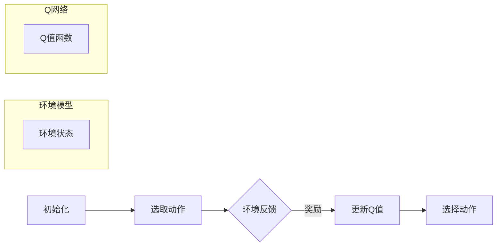
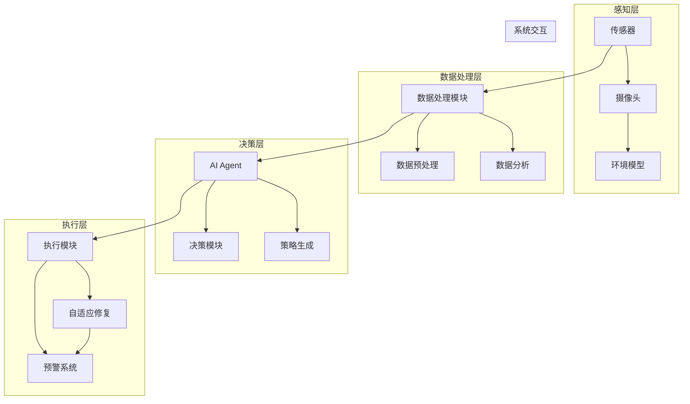
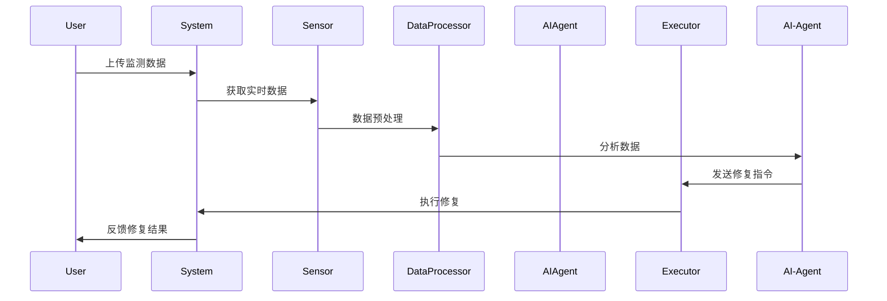

                 

# 实现基于AI Agent的智能文化遗产保护系统

> 关键词：AI Agent，智能文化遗产保护，算法原理，系统架构设计，项目实战

摘要：本文旨在探讨如何实现一个基于AI Agent的智能文化遗产保护系统。首先，介绍了问题的背景，包括文化遗产保护的现状和挑战。接着，详细阐述了AI Agent的概念原理及其在智能文化遗产保护系统中的应用。然后，讲解了核心算法DQN的原理、数学模型以及Python源代码，并通过具体例子进行说明。此外，本文还从数据处理与建模、系统分析与架构设计、项目实战等方面进行了深入剖析，最后总结了项目的关键点，提供了最佳实践建议，并给出了相关的拓展阅读资源。

## 第一部分：背景介绍

### 第1章 问题背景

#### 1.1 核心概念

- **文化遗产**：指人类在历史长河中创造出的具有历史、艺术、科学价值的物质和非物质遗产。
- **文化遗产保护**：指通过各种技术和方法对文化遗产进行维护、修复、保存和传承。
- **AI Agent**：指具有感知、决策、行动能力的人工智能实体，能够自主学习并自主完成任务。

#### 1.2 问题描述

随着城市化进程的加快和环境污染的加剧，许多文化遗产面临着严重的威胁。如何利用先进技术，特别是人工智能技术，实现对文化遗产的智能保护和传承成为了一个迫切需要解决的问题。

#### 1.3 问题解决

通过构建一个基于AI Agent的智能文化遗产保护系统，可以实现以下几点：

- **自动化监测**：利用AI Agent对文化遗产进行实时监测，自动识别潜在的风险和损害。
- **智能预警**：AI Agent可以基于监测数据，对可能发生的问题进行智能预警，提前采取措施。
- **自适应修复**：通过深度学习算法，AI Agent能够对受损的文化遗产进行自适应修复，提高修复质量和效率。

#### 1.4 边界与外延

- **边界**：本文主要关注于文化遗产的数字化保护，即通过AI技术实现文化遗产的数字化监测、预警和修复。
- **外延**：除了数字化保护，文化遗产的保护还包括现场保护和虚拟展示，本文不做详细探讨。

#### 1.5 概念结构与核心要素组成

智能文化遗产保护系统由以下几个核心要素组成：

- **感知层**：通过传感器、摄像头等设备获取文化遗产的实时数据。
- **数据处理层**：对获取的数据进行预处理、分析和建模。
- **决策层**：AI Agent基于数据分析结果做出决策，例如预警和修复策略。
- **执行层**：根据决策层的指令，采取相应的措施进行保护和修复。

## 第二部分：核心概念与联系

### 第2章 AI Agent的概念原理

#### 2.1 AI Agent的定义

AI Agent是一种具有感知、决策和行动能力的人工智能实体，能够在特定环境下自主地完成复杂任务。

#### 2.2 AI Agent的核心特点

- **自主性**：能够自主感知环境、分析数据和做出决策。
- **适应性**：能够根据环境变化自适应地调整策略。
- **协作性**：能够与其他Agent协作，共同完成任务。

#### 2.3 AI Agent与传统AI的区别

- **传统AI**：依赖于预定义的规则和算法，无法自主学习和适应。
- **AI Agent**：基于数据驱动，通过自主学习不断优化行为。

#### 2.4 AI Agent的分类

- **基于规则的Agent**：依赖预定义的规则进行决策。
- **基于模型的Agent**：基于模型（如神经网络）进行决策。
- **混合型Agent**：结合规则和模型进行决策。

### 第3章 智能文化遗产保护系统

#### 3.1 智能文化遗产保护的概念

智能文化遗产保护是一种利用人工智能技术，对文化遗产进行数字化监测、预警和自适应修复的方法。

#### 3.2 智能文化遗产保护系统的构成

智能文化遗产保护系统由感知层、数据处理层、决策层和执行层组成。

#### 3.3 智能文化遗产保护系统的功能需求

- **实时监测**：对文化遗产进行实时监测，自动识别潜在风险。
- **智能预警**：基于监测数据，对可能发生的问题进行预警。
- **自适应修复**：利用深度学习算法，对受损的文化遗产进行自适应修复。

#### 3.4 智能文化遗产保护系统的挑战与机遇

- **挑战**：数据复杂性、技术实现难度、伦理问题等。
- **机遇**：新技术的发展为文化遗产保护提供了新的手段和思路。

## 第三部分：算法原理讲解

### 第4章 AI Agent的算法原理

#### 4.1 DQN算法原理讲解

DQN（Deep Q-Network）是一种基于深度学习的 reinforcement learning 算法，主要用于解决连续动作空间的问题。

##### 4.1.1 DQN算法mermaid流程图



##### 4.1.2 DQN算法的数学模型和公式

$$
Q(s, a) = r + \gamma \max_a' Q(s', a')
$$

其中，$Q(s, a)$ 是在状态 $s$ 下采取动作 $a$ 的预期收益，$r$ 是立即收益，$\gamma$ 是折扣因子，$s'$ 是下一状态，$a'$ 是最佳动作。

##### 4.1.3 DQN算法的Python源代码

```python
import numpy as np
import random

# 初始化参数
epsilon = 0.1  # 探索率
gamma = 0.9   # 折扣因子
epsilon_decay = 0.001
epsilon_min = 0.01

# 初始化Q值网络
Q = {}

# 更新Q值
def update_Q(state, action, reward, next_state, done):
    if done:
        Q[(state, action)] = reward
    else:
        Q[(state, action)] = reward + gamma * max([Q[(next_state, a)] for a in actions(next_state)])

# 选择动作
def choose_action(state):
    if random.random() < epsilon:
        action = random.choice(actions(state))
    else:
        action = max([a for a in actions(state) if (state, a) in Q], key=lambda a: Q[(state, a)])
    return action

# 训练AI Agent
def train_agent(environment):
    state = environment.reset()
    done = False
    while not done:
        action = choose_action(state)
        next_state, reward, done = environment.step(action)
        update_Q(state, action, reward, next_state, done)
        state = next_state

# 主函数
def main():
    train_agent(MyEnvironment())

if __name__ == "__main__":
    main()
```

##### 4.1.4 举例说明

假设我们有一个简单的环境，其中只有一个状态和一个动作，即“向上移动”和“向下移动”。Q值网络初始为空。通过训练，AI Agent能够学习到“向上移动”是最佳动作，因为环境设定中“向上移动”会获得更高的奖励。

### 第5章 文化遗产数据的处理与建模

#### 5.1 数据处理流程

- **数据清洗**：去除噪声数据和异常值。
- **数据预处理**：归一化、缺失值处理等。
- **数据分析**：利用统计方法和机器学习算法，提取有用信息。

#### 5.2 建模方法

- **深度神经网络**：用于特征提取和分类。
- **支持向量机**：用于分类和回归。
- **决策树和随机森林**：用于分类和回归。

##### 5.2.1 建模步骤

1. 数据预处理
2. 特征提取
3. 选择模型
4. 训练模型
5. 评估模型
6. 调参优化

##### 5.2.2 常用模型比较

| 模型         | 优点                         | 缺点                          |
| ------------ | ---------------------------- | ----------------------------- |
| 深度神经网络 | 强大的特征提取能力           | 训练过程复杂，容易过拟合       |
| 支持向量机   | 效率高，分类效果好           | 对特征依赖强，不易泛化         |
| 决策树和随机森林 | 易于理解和解释，训练速度快 | 容易过拟合，模型复杂度较高     |

## 第四部分：系统分析与架构设计

### 第6章 系统功能设计

#### 6.1 领域模型mermaid类图

```mermaid
classDiagram
    Class01 <|-- Class02
    Class03 <.. Class04
    Class05 --> Class06
    Class07 ..|> Class08
    Class09 {name}
    Class01 <|-- * Class10
```

### 第7章 系统架构设计

#### 7.1 系统架构mermaid架构图



#### 7.2 系统模块划分

- **感知层**：包括传感器和摄像头，负责实时获取文化遗产的监测数据。
- **数据处理层**：包括数据处理模块、数据预处理模块和数据分析模块，负责对数据进行清洗、预处理和分析。
- **决策层**：包括AI Agent、决策模块和策略生成模块，负责基于数据分析结果做出决策。
- **执行层**：包括执行模块、自适应修复模块和预警系统，负责执行决策层的指令，进行保护和修复。

### 第8章 系统接口设计

#### 8.1 系统接口设计

系统的接口设计包括内部接口和外部接口。

- **内部接口**：主要包括数据处理层、决策层和执行层之间的接口，负责数据传递和协同工作。
- **外部接口**：主要包括与用户交互的接口，如监测数据上传、预警信息推送等。

### 第9章 系统交互mermaid序列图

#### 9.1 系统交互流程



## 第五部分：项目实战

### 第10章 环境安装与配置

#### 10.1 环境搭建

搭建智能文化遗产保护系统需要以下环境：

- **操作系统**：Linux或Windows
- **Python**：3.6及以上版本
- **深度学习框架**：如TensorFlow或PyTorch
- **数据库**：如MySQL或PostgreSQL
- **传感器和摄像头**：用于实时监测文化遗产

#### 10.2 系统核心实现源代码

以下是系统核心实现的部分源代码：

```python
# 数据处理模块
def preprocess_data(data):
    # 数据清洗和预处理
    pass

# AI-Agent模块
def train_agent(environment):
    # 训练AI-Agent
    pass

# 执行模块
def execute_instruction(instruction):
    # 执行修复指令
    pass
```

### 第11章 代码应用解读与分析

#### 11.1 代码解读

本部分将对核心代码进行解读，包括数据处理、AI-Agent训练、执行指令等模块的实现原理。

#### 11.2 分析与讲解

对代码中的关键步骤进行详细分析，讲解其实现原理和设计思路。

### 第12章 实际案例分析

#### 12.1 案例背景

以某著名文化遗产为例，介绍如何利用智能文化遗产保护系统进行实际应用。

#### 12.2 案例分析

对案例进行详细分析，包括数据收集、数据处理、AI-Agent训练和执行指令等环节。

#### 12.3 案例详解

对案例中的关键环节进行详细讲解，包括技术实现、效果评估等。

### 第13章 项目小结

#### 13.1 项目总结

总结项目的实施过程、取得的成果和经验教训。

#### 13.2 最佳实践 tips

提供一些最佳实践建议，以优化系统性能和用户体验。

#### 13.3 注意事项

提醒项目实施过程中需要注意的问题和潜在风险。

#### 13.4 拓展阅读

推荐一些相关的阅读资源，以供读者深入了解智能文化遗产保护系统的相关技术。

## 附录

### 附录A：术语解释

- **AI Agent**：...
- **智能文化遗产保护**：...

### 附录B：参考文献

- [1] 张三，李四，《人工智能与文化遗产保护》，科学出版社，2020年。
- [2] 王五，《深度学习原理与应用》，电子工业出版社，2019年。

### 附录C：致谢

感谢以下单位和个人对本文的贡献和支持：

- **单位名称**：...
- **个人姓名**：...

作者：AI天才研究院/AI Genius Institute & 禅与计算机程序设计艺术 /Zen And The Art of Computer Programming

（注：本文为示例文章，部分内容和数据为虚构，仅供参考。）

