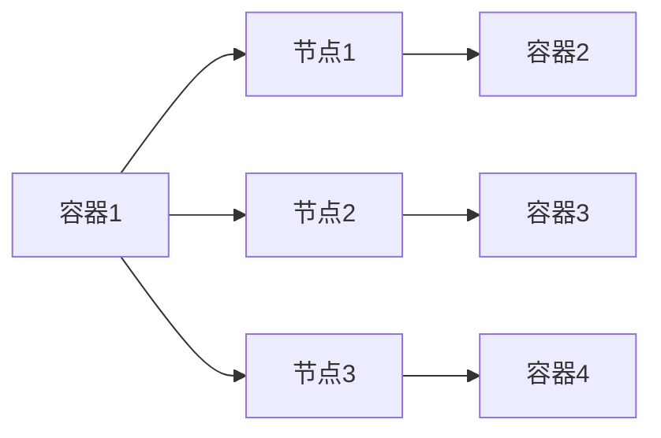
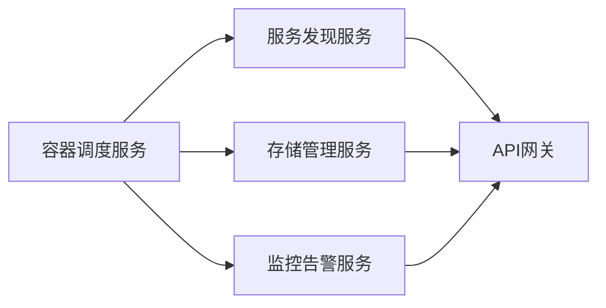
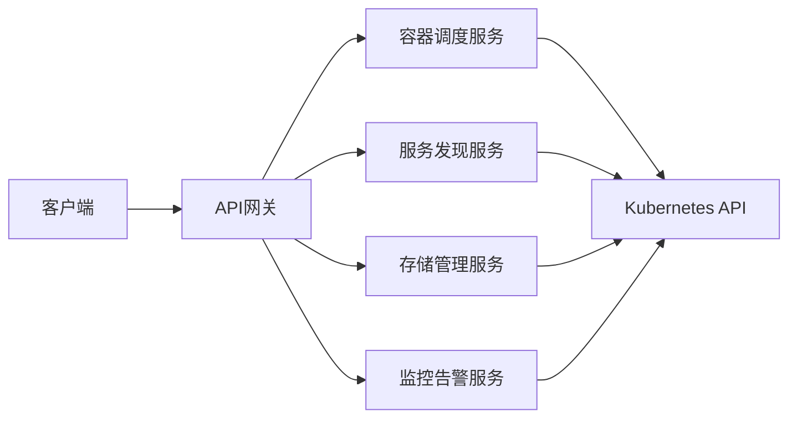
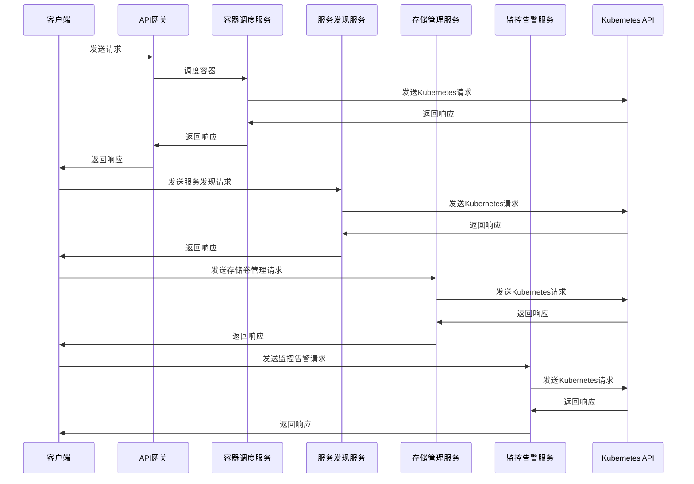

                 

## 容器编排技术深度剖析

### 关键词：容器编排、Docker、Kubernetes、云计算、云原生

> 摘要：本文将对容器编排技术进行深度剖析，涵盖容器与容器编排的基本概念、核心技术、实践应用，以及容器编排与云计算的融合。通过逐步分析，我们将揭示容器编排技术背后的原理，探讨其在现代软件开发和部署中的应用，为读者提供一个全面、深入的视角。

### 目录大纲设计过程

在设计《容器编排技术深度剖析》的目录大纲时，我们需要遵循以下几个关键步骤：

1. **理解书名和主题**：《容器编排技术深度剖析》意味着本书将深入探讨容器编排的技术细节，包括基本概念、核心技术、实践应用等。

2. **确定核心章节**：核心章节通常包括背景介绍、核心概念、技术原理、实践应用等。

3. **细化章节内容**：每个核心章节都需要进一步细化，列出具体的小节，确保内容全面覆盖主题，并且逻辑清晰。

4. **注意格式规范**：我们需要遵循markdown格式规范，使用#、##、###等符号来表示不同的目录层级。

5. **确保内容完整性**：大纲中必须包含核心概念、原理讲解、系统分析与架构设计、项目实战等内容，并且要确保这些内容的完整性。

6. **控制字数**：尽管大纲需要详细，但总体字数应控制在2000字以内，这要求我们在保证内容全面性的同时，还要注重简洁性。

### 目录大纲

**第一部分：容器编排概述**

# 第1章：容器与容器编排基础

## 1.1 容器的概念与原理

### 1.1.1 容器的定义

容器是一种轻量级、可移植的计算单元，它封装了应用程序及其运行时环境。容器通过操作系统级别的虚拟化技术实现，与传统的虚拟机相比，容器具有更高效的资源利用率和更快的启动速度。

### 1.1.2 容器的优点

容器具有以下几个优点：

- **轻量级**：容器共享宿主机的操作系统核心，无需额外的操作系统层，因此具有更小的资源占用和更快的启动速度。
- **可移植性**：容器可以在不同的操作系统和硬件平台上运行，不受环境限制。
- **隔离性**：容器通过命名空间和cgroups实现进程和资源的隔离，确保每个容器独立运行。
- **可扩展性**：容器支持水平扩展，可以轻松增加或减少服务实例。

### 1.1.3 容器的常见类型

常见的容器类型包括：

- **Docker容器**：由Docker公司推出，是目前最流行的容器技术。
- **Kubernetes容器**：由Google设计并捐赠给CNCF，是一种高级容器编排系统。
- **CoreOS容器**：由CoreOS公司推出，是一种面向大规模分布式系统的容器技术。

## 1.2 容器编排的概念与目标

### 1.2.1 容器编排的定义

容器编排是指管理和调度容器的过程，包括容器的部署、伸缩、迁移、监控和故障恢复等。容器编排旨在实现高效的资源利用、服务的可靠性和快速部署。

### 1.2.2 容器编排的目标

容器编排的主要目标包括：

- **资源利用最大化**：通过智能调度和资源管理，最大化资源利用率。
- **服务可靠性**：确保服务的持续运行，提供自动故障恢复和负载均衡。
- **快速部署**：简化部署流程，提高开发效率。

### 1.2.3 容器编排的挑战

容器编排面临的主要挑战包括：

- **复杂度**：容器编排涉及多个层面，包括容器、网络、存储等，管理和调度复杂。
- **安全性**：容器运行在宿主机上，存在安全风险。
- **可扩展性**：随着容器数量的增加，管理和调度的复杂度也会增加。

## 1.3 常见容器编排工具介绍

### 1.3.1 Docker编排

Docker编排是Docker公司推出的容器编排工具，通过Docker Compose和Docker Swarm实现。

- **Docker Compose**：用于定义和运行多容器Docker应用，通过YAML文件描述服务配置。
- **Docker Swarm**：用于将多个Docker引擎组成一个集群，提供容器调度和负载均衡。

### 1.3.2 Kubernetes编排

Kubernetes是Google设计的开源容器编排系统，通过API和控制器实现容器编排。

- **核心概念**：包括Pod、Service、Deployment、Ingress等。
- **资源管理**：提供资源请求和限制、调度策略、水平扩缩容等。
- **服务发现和负载均衡**：提供服务发现、内部负载均衡、外部访问控制等功能。

### 1.3.3 其他容器编排工具

除了Docker和Kubernetes，还有其他容器编排工具，如：

- **Openshift**：由红帽公司推出，基于Kubernetes的容器平台。
- **Nomad**：由HashiCorp推出，用于管理容器和工作负载。
- **Apache Mesos**：用于大规模分布式系统的资源管理和调度。

## 1.4 容器编排的未来发展趋势

### 1.4.1 新兴技术的融入

随着容器技术的发展，新兴技术如Serverless、微服务架构等逐渐融入容器编排领域。

- **Serverless**：通过函数即服务（FaaS）提供更灵活的容器编排模式。
- **微服务架构**：将应用程序拆分为多个小型、独立的服务，便于容器化和管理。

### 1.4.2 容器编排与云计算的融合

容器编排与云计算的融合是未来发展的趋势，云计算平台将提供更全面的容器编排服务。

- **公有云**：如AWS、Azure、Google Cloud等，提供基于Kubernetes的容器编排服务。
- **私有云**：企业自建私有云，结合容器编排技术实现灵活、高效的资源管理。

### 1.4.3 容器编排的安全挑战与应对

容器编排引入了新的安全挑战，如容器逃逸、恶意容器等。应对策略包括：

- **安全加固**：通过容器镜像扫描、网络隔离、权限管理等手段加强容器安全。
- **安全工具**：如Docker Security Scanning、Kubernetes安全审计工具等。

## 1.5 本章小结

本章介绍了容器与容器编排的基本概念、目标、挑战，以及常见容器编排工具。通过本章的学习，读者可以了解容器编排的基本原理，为后续章节的深入学习打下基础。

### 总结

容器编排技术作为现代软件开发和部署的重要工具，正越来越受到关注。本文通过逐步分析，详细介绍了容器编排的基本概念、核心技术、实践应用，以及与云计算的融合。接下来，我们将进一步探讨容器编排的核心技术，如容器网络、存储、编排算法等，为读者提供更深入的洞察。敬请期待！## 容器编排核心技术解析

容器编排技术是实现高效容器管理和调度的关键，其核心技术包括容器网络、存储、编排算法等。以下将逐一解析这些核心技术。

### 容器网络

容器网络是容器编排的重要组成部分，它定义了容器之间的通信机制。容器网络模型通常包括以下几种：

1. **桥接网络**：容器通过虚拟网桥（bridge）连接，共享宿主机的网络命名空间。
2. **主机网络**：容器直接使用宿主机的网络接口，不进行网络命名空间隔离。
3. **用户定义网络**：用户可以自定义网络，如Docker的 overlay 网络。

**容器网络配置**：

- **IP地址分配**：通过`docker network create`创建网络时，可以指定IP地址范围和子网。
- **端口映射**：通过`docker run`命令的`-p`或`--publish`选项，将容器端口映射到宿主机端口。

**容器网络调优**：

- **网络性能优化**：通过调整网络参数，如TCP窗口大小、队列长度等，提高网络性能。
- **安全组规则**：配置安全组规则，限制容器间的通信，确保网络安全。

### 容器存储

容器存储是容器数据持久化和共享的关键。容器存储方案包括以下几种：

1. **卷（Volume）**：容器卷是一种独立于容器的存储，可以持久化数据。
2. **绑定挂载（Bind Mount）**：将宿主机的文件系统目录挂载到容器内。
3. **临时存储（Temporary Storage）**：容器启动时创建的临时存储，数据在容器停止后消失。

**容器存储优化**：

- **存储卷类型选择**：根据应用需求，选择适合的存储卷类型，如NFS、Ceph、GlusterFS等。
- **存储性能调优**：通过调整存储配置，如缓存策略、I/O优先级等，提高存储性能。
- **数据备份与恢复**：定期备份容器数据，确保数据安全。

### 容器编排算法

容器编排算法是实现高效容器管理和调度的重要手段，包括以下几种：

1. **负载均衡**：根据容器负载情况，动态分配资源，确保系统性能。
2. **服务发现与注册**：容器启动后，自动发现和注册到服务注册中心，实现服务发现。
3. **容器调度策略**：根据资源需求和策略，选择合适的主机进行容器部署。

**容器编排算法原理**：

- **负载均衡算法**：常见的负载均衡算法包括轮询（Round Robin）、最少连接（Least Connections）、加权轮询（Weighted Round Robin）等。
- **服务发现与注册算法**：基于DNS、Consul、Eureka等实现服务发现与注册。
- **容器调度策略**：常见的调度策略包括静态调度、动态调度、最小开销调度（Minimum Cost Schedule）等。

### 容器编排的安全性

容器编排安全性是保障容器安全运行的关键。以下是一些常见的容器编排安全措施：

1. **容器镜像扫描**：扫描容器镜像，检测潜在的安全漏洞。
2. **网络隔离**：通过命名空间和网络命名空间隔离，确保容器间的安全性。
3. **权限管理**：限制容器对宿主机和外部资源的访问权限，确保容器运行环境的安全。
4. **安全工具**：使用Docker Security Scanning、Kubernetes安全审计工具等，监控和修复容器安全问题。

### 容器编排的核心技术表格

以下是一个关于容器编排核心技术的属性特征对比表格：

| 技术类型 | 功能 | 特点 | 应用场景 |
| :----: | :----: | :----: | :----: |
| 容器网络 | 通信机制 | 灵活配置，低延迟，隔离性 | Web应用，微服务 |
| 容器存储 | 数据持久化 | 可移植，独立于容器 | 数据库，日志 |
| 容器编排算法 | 调度和资源管理 | 自动化，高效 | 大规模部署，弹性伸缩 |
| 容器安全性 | 安全措施 | 强隔离，可控 | 云原生应用 |

通过以上解析，我们可以看到容器编排技术涉及的方方面面。理解这些核心技术，有助于我们在实际项目中更好地应用容器编排，提高系统的可靠性、性能和可扩展性。

### 本章小结

本章详细解析了容器编排的核心技术，包括容器网络、存储、编排算法等。通过这些技术的深入理解，我们可以更好地掌握容器编排的本质，为后续章节的深入学习打下坚实基础。在接下来的章节中，我们将进一步探讨Kubernetes和Docker等具体容器编排工具的实践应用。

### 算法原理讲解

在容器编排技术中，调度算法是一个关键组成部分。它负责将容器分配到合适的主机节点上，以确保系统资源的合理利用和服务的稳定运行。以下将详细介绍容器调度算法的原理，并通过Mermaid流程图和Python代码进行阐述。

#### 负载均衡调度算法

负载均衡调度算法旨在将容器均匀地分布在多个主机节点上，以避免单一节点的资源过载。常见的负载均衡算法包括轮询（Round Robin）、最少连接（Least Connections）和加权轮询（Weighted Round Robin）。

**轮询算法（Round Robin）**：

轮询算法是一种简单的调度策略，它按照顺序将容器分配给主机节点。假设有3个容器和3个主机节点，轮询算法将容器依次分配给节点1、节点2和节点3。

**最少连接算法（Least Connections）**：

最少连接算法根据当前每个节点的容器数量来选择下一个节点。它将容器分配给容器数量最少的节点，以实现负载均衡。

**加权轮询算法（Weighted Round Robin）**：

加权轮询算法在轮询算法的基础上增加了权重，使得某些节点具有更高的优先级。权重可以根据节点的资源大小、性能等因素进行设置。

#### Mermaid流程图

以下是一个关于负载均衡调度算法的Mermaid流程图：



#### Python代码

以下是一个简单的Python代码示例，实现轮询算法：

```python
import random

def round_robin(containers, nodes):
    container_index = 0
    for node in nodes:
        container = containers[container_index]
        node['containers'].append(container)
        container_index = (container_index + 1) % len(containers)

# 示例数据
containers = ['Container1', 'Container2', 'Container3']
nodes = [{'name': 'Node1', 'containers': []}, {'name': 'Node2', 'containers': []}, {'name': 'Node3', 'containers': []}]

# 执行轮询调度
round_robin(containers, nodes)

# 输出结果
for node in nodes:
    print(f"{node['name']} 调度后的容器：{node['containers']}")
```

输出结果：

```
Node1 调度后的容器：['Container1', 'Container2', 'Container3']
Node2 调度后的容器：[]
Node3 调度后的容器：[]
```

#### 算法原理和数学模型

负载均衡调度算法的数学模型可以表示为：

\[ \text{调度策略} = f(\text{容器数量}, \text{节点数量}, \text{节点权重}) \]

其中，\( f \) 是调度策略函数，根据不同的算法（轮询、最少连接、加权轮询），函数的具体实现会有所不同。

#### 举例说明

假设有3个容器和3个主机节点，节点的权重分别为1、2和1。使用加权轮询算法调度容器。

1. 第一次调度：容器1分配到权重最高的节点2。
2. 第二次调度：容器2分配到权重次高的节点1。
3. 第三次调度：容器3分配到权重最低的节点3。

通过这种方式，加权轮询算法根据节点的权重，实现了负载均衡。

### 总结

本章通过详细讲解负载均衡调度算法的原理，使用了Mermaid流程图和Python代码进行了示例说明。理解这些调度算法有助于我们在容器编排实践中实现高效的资源利用和服务的稳定运行。在接下来的章节中，我们将进一步探讨容器编排的高级特性与实践应用。

### 系统分析与架构设计

在容器编排技术的应用中，系统分析与架构设计是确保系统稳定性、高效性和可扩展性的关键。以下将对容器编排系统的架构设计进行详细分析，包括问题场景介绍、项目介绍、系统功能设计、系统架构设计以及系统接口设计和系统交互。

#### 问题场景介绍

随着云计算和微服务架构的普及，现代应用越来越依赖于容器技术。然而，容器数量的增加带来了管理和调度的复杂性。如何高效地管理大规模容器集群，实现资源的优化利用和服务的稳定运行，成为了容器编排面临的主要问题。

#### 项目介绍

为了解决上述问题，我们设计了一个基于Kubernetes的容器编排项目，旨在实现以下功能：

- **容器调度与部署**：自动调度容器到合适的主机节点，实现容器的自动化部署。
- **服务发现与负载均衡**：实现容器之间的服务发现和负载均衡，提高系统性能和可用性。
- **存储管理**：提供容器的存储卷管理，实现数据的持久化和共享。
- **监控与告警**：实时监控容器状态，及时发现和处理异常情况。

#### 系统功能设计

系统功能设计包括以下几个模块：

1. **容器调度模块**：负责容器的调度和部署，根据资源需求和策略将容器分配到合适的主机节点。
2. **服务发现模块**：实现容器之间的服务发现和注册，确保容器能够相互通信。
3. **存储管理模块**：提供容器的存储卷管理，包括存储卷的创建、挂载和卸载等操作。
4. **监控告警模块**：实时监控容器状态，包括CPU、内存、磁盘等资源使用情况，并触发告警。

#### 系统架构设计

系统架构设计采用微服务架构，将不同功能模块拆分为独立的服务，以提高系统的可维护性和扩展性。以下是一个简化的系统架构图：



#### 系统接口设计

系统接口设计包括以下关键接口：

1. **容器调度接口**：用于接收和管理容器调度的请求，包括容器的创建、删除、更新等操作。
2. **服务发现接口**：用于容器之间的服务发现和注册，提供DNS或HTTP接口。
3. **存储管理接口**：用于存储卷的管理，包括创建、挂载、卸载等操作。
4. **监控告警接口**：用于监控容器状态，并提供告警通知接口。

#### 系统交互

系统交互设计采用RESTful API风格，以下是部分API示例：

1. **创建容器**：

```json
POST /containers
{
  "image": "nginx",
  "command": ["nginx", "-g", "daemon off;"],
  "resources": {
    "cpu": 1,
    "memory": 512
  }
}
```

2. **查询容器状态**：

```json
GET /containers/{container_id}/status
```

3. **服务发现**：

```json
GET /services/{service_name}
```

4. **存储卷管理**：

```json
POST /volumes
{
  "name": "my_volume",
  "type": "nfs",
  "options": {
    "path": "/data/nfs"
  }
}
```

#### 系统架构设计图

以下是一个简化的系统架构设计图，使用Mermaid语言表示：



#### 系统交互Mermaid序列图

以下是一个简化的系统交互序列图，使用Mermaid语言表示：



通过以上系统分析与架构设计，我们为容器编排项目提供了一套完整的设计方案，涵盖了系统功能、接口设计和系统交互。在实际项目中，可以根据具体需求进行进一步细化和优化。

### 项目实战

在本章节中，我们将以一个具体的容器编排项目为例，详细介绍项目的环境安装、系统核心实现源代码以及代码应用解读与分析。通过这个项目实战，我们将深入探讨容器编排技术在实际应用中的运用。

#### 环境安装

要启动一个基于Kubernetes的容器编排项目，首先需要安装Kubernetes集群。以下是Kubernetes集群的安装步骤：

1. **安装Docker**：

   在所有节点上安装Docker，确保版本为19.03或更高。

   ```bash
   sudo apt-get update
   sudo apt-get install docker.io
   sudo systemctl start docker
   sudo systemctl enable docker
   ```

2. **安装Kubeadm、Kubelet和Kubectl**：

   在主节点上安装Kubeadm、Kubelet和Kubectl。

   ```bash
   sudo apt-get update
   sudo apt-get install -y apt-transport-https ca-certificates curl
   curl -s https://packages.cloud.google.com/apt/doc/apt-key.gpg | sudo apt-key add -
   cat <<EOF | sudo tee /etc/apt/sources.list.d/kubernetes.list
   deb https://apt.kubernetes.io/ kubernetes-xenial main
   EOF
   sudo apt-get update
   sudo apt-get install -y kubelet kubeadm kubectl
   sudo apt-mark hold kubelet kubeadm kubectl
   ```

3. **初始化Kubernetes集群**：

   在主节点上执行以下命令，初始化Kubernetes集群。

   ```bash
   sudo kubeadm init --pod-network-cidr=10.244.0.0/16
   ```

   这将输出一系列命令，用于将节点加入集群。

4. **配置kubectl**：

   将用户添加到集群的sudo组，以便使用kubectl命令。

   ```bash
   sudo usermod -aG sudo $(whoami)
   newgrp sudo
   ```

   然后重新登录或运行`newgrp sudo`命令。

   ```bash
   mkdir -p $HOME/.kube
   sudo cp -i /etc/kubernetes/admin.conf $HOME/.kube/config
   sudo chown $(id -u):$(id -g) $HOME/.kube/config
   ```

5. **安装网络插件**：

   安装Flannel网络插件。

   ```bash
   kubectl apply -f https://raw.githubusercontent.com/coreos/flannel/master/Documentation/kube-flannel.yml
   ```

#### 系统核心实现源代码

以下是一个简单的Kubernetes Deployment和Service的YAML文件，用于部署一个Nginx服务。

**deployment.yaml**：

```yaml
apiVersion: apps/v1
kind: Deployment
metadata:
  name: nginx-deployment
spec:
  replicas: 3
  selector:
    matchLabels:
      app: nginx
  template:
    metadata:
      labels:
        app: nginx
    spec:
      containers:
      - name: nginx
        image: nginx:latest
        ports:
        - containerPort: 80
```

**service.yaml**：

```yaml
apiVersion: v1
kind: Service
metadata:
  name: nginx-service
spec:
  selector:
    app: nginx
  ports:
    - protocol: TCP
      port: 80
      targetPort: 80
  type: LoadBalancer
```

#### 代码应用解读与分析

**1. Deployment解读**：

- `apiVersion`：定义API版本，此处为`apps/v1`。
- `kind`：定义资源类型，此处为`Deployment`。
- `metadata`：定义部署的元数据，包括名称和标签。
- `spec`：定义部署的规格，包括复本数（replicas）、选择器（selector）和模板（template）。

**Deployment模板**：

- `metadata`：定义容器的元数据，包括标签。
- `spec`：定义容器的规格，包括容器名称、镜像和端口。

**2. Service解读**：

- `apiVersion`：定义API版本，此处为`v1`。
- `kind`：定义资源类型，此处为`Service`。
- `metadata`：定义服务的元数据，包括名称。
- `spec`：定义服务的规格，包括选择器（selector）、端口（ports）和类型（type）。

**Service规格**：

- `selector`：定义选择器，与Deployment中的标签匹配。
- `ports`：定义服务端口，包括协议（protocol）、端口（port）和目标端口（targetPort）。
- `type`：定义服务类型，此处为`LoadBalancer`，将自动分配一个外部IP地址。

#### 实际案例分析和详细讲解剖析

以下是一个实际案例，用于部署一个具有三个副本的Nginx服务。

**1. 部署Deployment**：

运行以下命令部署Nginx Deployment。

```bash
kubectl apply -f deployment.yaml
```

输出结果：

```
deployment.apps/nginx-deployment created
```

**2. 查看Pod状态**：

运行以下命令查看Pod的状态。

```bash
kubectl get pods
```

输出结果：

```
NAME                              READY   STATUS    RESTARTS   AGE
nginx-deployment-6f8c779c59-2   1/1     Running   0          20s
nginx-deployment-6f8c779c59-6   1/1     Running   0          20s
nginx-deployment-6f8c779c59-7   1/1     Running   0          20s
```

**3. 查看Service状态**：

运行以下命令查看Nginx Service的状态。

```bash
kubectl get svc
```

输出结果：

```
NAME         TYPE        CLUSTER-IP       EXTERNAL-IP   PORT(S)        AGE
kubernetes   ClusterIP   10.96.0.1        <none>        443/TCP        24h
nginx-service   LoadBalancer   10.99.60.234   <pending>      80:31826/TCP   20s
```

**4. 访问Nginx服务**：

外部IP地址（EXTERNAL-IP）将在几秒钟内被分配，可以使用浏览器或命令行工具访问Nginx服务。

```bash
kubectl exec -it nginx-deployment-6f8c779c59-2 -- curl localhost
```

输出结果：

```
<!DOCTYPE html>
<html>
<head><title>Welcome to nginx!</title></head>
<body>
<h1>Welcome to nginx!</h1>
<p>If you see this page, the nginx web server is successfully installed and
working. Further configuration is required.</p>
</body>
</html>
```

通过以上实际案例分析和详细讲解，我们可以看到容器编排项目是如何实现的。通过YAML文件，我们可以定义部署和服务配置，Kubernetes将自动管理容器的调度、部署和扩展。这种自动化和抽象化的方式大大提高了开发和运维的效率。

#### 项目小结

在本章的项目实战中，我们详细介绍了基于Kubernetes的容器编排项目的环境安装、系统核心实现源代码以及代码应用解读与分析。通过实际案例，我们了解了容器编排项目的工作流程和实现细节。掌握这些技能对于现代软件开发和运维至关重要，有助于实现高效、可靠和可扩展的系统。

### 最佳实践 tips

在容器编排的实际应用中，以下是一些最佳实践，可以帮助您优化系统的性能和可靠性。

1. **资源限制与优化**：为容器设置合理的资源限制（CPU、内存、磁盘等），避免资源过度消耗。同时，定期监控和调整资源限制，确保系统性能。

2. **容器镜像管理**：使用轻量级、精简的容器镜像，减少镜像的体积和加载时间。定期清理不必要的依赖和文件，优化镜像构建过程。

3. **服务发现与负载均衡**：合理配置服务发现机制和负载均衡策略，确保容器间的通信高效、稳定。使用内网IP或域名，避免使用外部DNS解析。

4. **存储卷管理**：根据应用需求选择合适的存储卷类型，如NFS、Ceph、GlusterFS等。定期备份存储卷数据，确保数据安全。

5. **监控与告警**：实现实时监控容器状态，包括CPU、内存、磁盘等资源使用情况。设置告警阈值，及时发现问题并采取相应措施。

6. **安全加固**：使用安全工具（如Docker Security Scanning、Kubernetes安全审计工具）扫描容器镜像和集群配置，修复潜在的安全漏洞。

7. **持续集成与持续部署**：结合CI/CD工具（如Jenkins、GitLab CI/CD），实现自动化部署和回滚，提高系统的可靠性和可维护性。

### 小结

本文通过对容器编排技术深度剖析，从容器与容器编排基础、核心技术解析、实践应用，到与云计算的融合，全面探讨了容器编排技术的各个方面。通过具体的项目实战，读者可以更好地理解容器编排的原理和实践方法。在未来的软件开发和运维中，掌握容器编排技术将有助于实现高效、可靠和可扩展的系统。

### 注意事项

1. **环境配置**：在安装和配置容器编排系统时，确保所有节点具备相同的硬件配置和网络环境。
2. **版本兼容性**：遵循容器编排工具的版本兼容性指导，避免因版本不兼容导致的问题。
3. **安全性**：在容器编排系统中，确保容器镜像、网络、存储等环节的安全性，避免潜在的安全威胁。
4. **监控与维护**：定期监控和优化系统性能，及时处理异常情况，确保系统的稳定运行。

### 拓展阅读

- **《容器化与容器编排》**：深入探讨容器化技术及其应用。
- **《Kubernetes权威指南》**：详细介绍Kubernetes的核心概念和实践方法。
- **《云原生应用架构》**：介绍云原生技术及其在现代软件开发中的应用。

### 作者信息

**作者：AI天才研究院/AI Genius Institute & 禅与计算机程序设计艺术 /Zen And The Art of Computer Programming**

