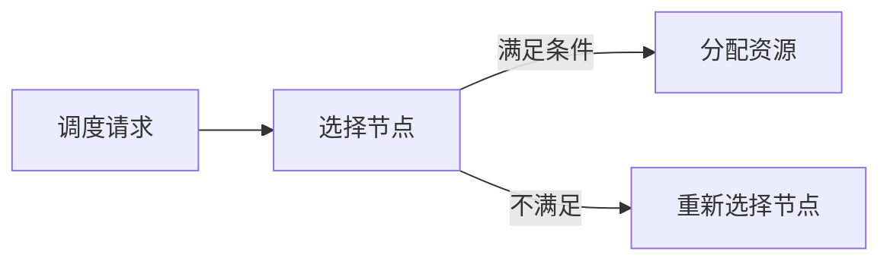
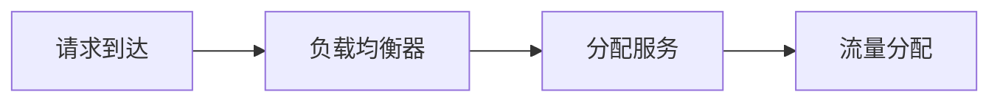
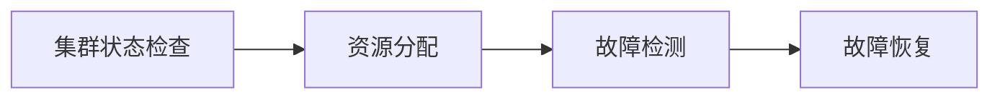
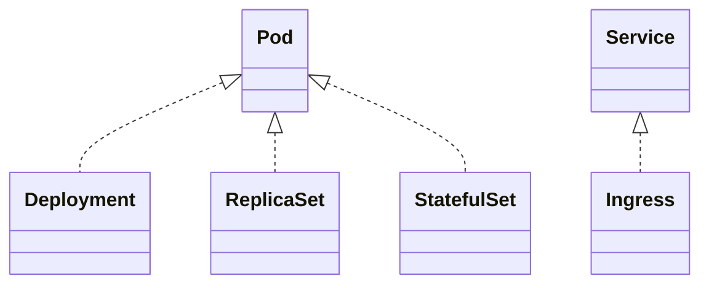

                 

# 容器编排技术：Kubernetes在企业中的最佳实践

## 关键词
- 容器化
- Kubernetes
- 部署策略
- 监控与故障处理
- 安全策略
- 自动化部署
- 高可用性
- 弹性伸缩

## 摘要
本文旨在探讨Kubernetes在企业容器编排中的最佳实践。通过深入分析Kubernetes的核心概念、发展历程、工作原理以及在实际应用中的部署、监控、安全和自动化等方面，本文将为企业和开发者提供一套全面、实用的Kubernetes实践指南。

## 第一部分：背景介绍

### 核心概念

在现代信息技术的发展过程中，容器化技术作为一种新兴的软件部署方式，逐渐得到了广泛应用。容器化技术通过将应用程序及其运行环境打包成一个独立的、可移植的容器，实现了应用程序与底层操作系统的解耦，从而提高了软件的部署效率、可移植性和资源利用率。Kubernetes（简称K8s）作为当前最流行的容器编排工具，为容器化应用提供了自动部署、扩展和管理的能力，已成为企业级应用开发与运维的标配。

### 问题背景

随着容器化技术的普及，如何高效地编排和管理大量容器，确保系统的高可用性和弹性，成为企业和开发者面临的重要问题。传统的手动管理方式不仅费时费力，而且容易出现人为错误。因此，研究和应用Kubernetes的最佳实践，对于提升企业IT基础设施的效率和可靠性具有重要意义。

### 问题描述

1. **容器编排挑战**：随着容器数量的增加，容器编排的复杂性也相应提高。如何高效地分配资源、调度任务、进行弹性伸缩，成为容器编排中的关键挑战。
2. **监控与故障处理**：容器化应用具有高度动态性，如何实时监控容器状态、快速发现和解决问题，是保证系统高可用性的关键。
3. **安全性**：容器化应用在带来便捷的同时，也带来了新的安全风险。如何确保容器和集群的安全性，防止数据泄露和攻击，是企业和开发者必须关注的问题。
4. **自动化部署**：在快速发展的业务场景中，如何实现自动化部署和持续集成/持续部署（CI/CD），以提高开发和部署效率，是企业和开发者面临的又一挑战。

### 问题解决

通过深入研究和实践，本文将探讨Kubernetes在企业中的最佳实践，包括部署策略、监控与故障处理、安全策略、自动化部署等方面，帮助企业充分利用Kubernetes的优势，实现高效、可靠、安全的容器化应用。

### 边界与外延

本文主要关注Kubernetes在企业级应用中的实践，包括但不限于部署、监控、安全、自动化等方面。同时，本文将涉及与Kubernetes相关的核心概念和技术，如容器、Docker、Kubernetes API等。

### 概念结构与核心要素组成

1. **容器化技术**：包括容器、Docker等基础概念。
2. **Kubernetes**：容器编排和管理工具，核心概念和API。
3. **企业级应用**：涉及的应用场景、部署策略和最佳实践。
4. **监控与故障处理**：系统监控、故障排查和恢复策略。
5. **安全策略**：容器安全、网络隔离、权限控制等。
6. **自动化部署**：CI/CD流程、Kubernetes自动化部署策略。

### 1.1 Kubernetes概述

#### 1.1.1 Kubernetes的发展历程

##### 1.1.1.1 Kubernetes的起源

Kubernetes起源于谷歌内部的一个项目，名为Borg。Borg是一个大规模分布式系统的管理框架，用于管理和调度谷歌内部大量的计算资源。在2014年，谷歌将Borg的设计和实现经验开源，并创建了Kubernetes项目。此后，Kubernetes迅速获得了全球开发者和企业的关注和参与，成为容器编排领域的领导者。

##### 1.1.1.2 Kubernetes的核心贡献者

Kubernetes项目得到了全球众多企业和开发者的贡献。其中，Google、Red Hat、IBM、Microsoft等企业是Kubernetes的核心贡献者。他们不仅提供了重要的代码和设计理念，还在社区中发挥了积极的推动作用。

##### 1.1.1.3 Kubernetes的主要版本更新

自Kubernetes开源以来，项目团队不断进行版本更新，修复漏洞、增加新功能和改进用户体验。以下是Kubernetes的主要版本更新：

- Kubernetes v1.0（2016年7月）：第一个正式版本，标志着Kubernetes项目的正式发布。
- Kubernetes v1.5（2017年2月）：引入了基于角色访问控制（RBAC）、集群自动扩缩容等关键功能。
- Kubernetes v1.10（2018年3月）：引入了基于容器的服务发现和负载均衡，支持Windows容器。
- Kubernetes v1.16（2019年5月）：引入了集群自动升级、自定义资源定义（CRD）等新功能。
- Kubernetes v1.18（2020年3月）：引入了自定义资源API（CRAPI），支持集群自治。

#### 1.1.2 Kubernetes的核心概念

##### 1.1.2.1 Pod

Pod是Kubernetes中的最小部署单元，它将一个或多个容器组合在一起，并分配一个唯一的IP地址。Pod提供了一种轻量级的方式，将相关的容器组合在一起进行部署和管理。

##### 1.1.2.2 ReplicaSet

ReplicaSet是Kubernetes中用于管理Pod副本的控制器，它确保在任何时刻都有指定数量的Pod副本在运行。ReplicaSet可以用于实现应用的负载均衡和高可用性。

##### 1.1.2.3 Deployment

Deployment是Kubernetes中用于管理Pod副本的更高层次的抽象。它提供了一种声明式的方式，用于创建、更新和删除Pod副本。Deployment可以基于ReplicaSet进行扩展和回滚。

##### 1.1.2.4 StatefulSet

StatefulSet是Kubernetes中用于管理有状态服务的控制器。它与Pod和ReplicaSet类似，但提供了更高级的状态管理功能，如稳定的网络标识和持久存储。

##### 1.1.2.5 Ingress

Ingress是Kubernetes中用于管理外部访问集群内部服务的API对象。它提供了一种定义外部访问规则的方式，如基于路径的负载均衡和SSL终止。

#### 1.1.3 Kubernetes的工作原理

##### 1.1.3.1 Kubernetes架构

Kubernetes架构包括控制平面（Control Plane）和工作节点（Worker Node）两部分。控制平面负责集群的管理和协调，包括API服务器、控制器管理器和调度器等组件。工作节点负责执行具体的容器编排任务，包括节点控制器、容器运行时（如Docker）和Pod等。

##### 1.1.3.2 Kubernetes的主要组件

Kubernetes的主要组件包括：

- **API服务器（API Server）**：Kubernetes的API服务器是集群管理的入口点。它提供了一组HTTP REST API，供集群内部的各个组件进行通信和操作。
- **控制器管理器（Controller Manager）**：控制器管理器是Kubernetes的核心组件之一，它负责维护集群的状态。控制器管理器包含多种控制器，如副本控制器、服务控制器、网络控制器等。
- **调度器（Scheduler）**：调度器负责将Pod分配到合适的节点上。调度器根据一系列策略和约束条件，选择最优的节点进行部署。
- **容器运行时（Container Runtime）**：容器运行时是负责管理和运行容器的主要组件，如Docker、rkt等。
- **网络（Networking）**：Kubernetes提供了一种灵活的网络模型，使得容器之间可以方便地进行通信。Kubernetes支持多种网络插件，如Calico、Flannel等。
- **存储（Storage）**：Kubernetes提供了一种抽象的存储模型，使得容器可以访问集群中的持久化存储资源，如NFS、GlusterFS等。

##### 1.1.3.3 Kubernetes API的工作机制

Kubernetes API是Kubernetes集群进行操作的主要接口。用户可以通过Kubernetes API创建、更新、查询和删除集群中的各种资源对象，如Pod、Service、Deployment等。

Kubernetes API的工作机制如下：

1. **API服务器接收请求**：用户通过kubectl或其他客户端库向Kubernetes API服务器发送HTTP请求。
2. **API服务器处理请求**：API服务器验证请求的有效性，并将请求转换为内部数据结构。
3. **控制器管理器处理请求**：控制器管理器根据请求类型，调用相应的控制器进行处理。例如，对于创建Pod的请求，副本控制器将创建相应的Pod对象。
4. **控制器执行操作**：控制器根据Kubernetes API返回的结果，执行具体的操作，如创建、更新或删除容器。
5. **状态更新**：Kubernetes API服务器将操作结果反馈给用户，并更新集群的状态。

### 1.2 核心概念与联系

#### 核心概念原理

- **容器（Container）**：容器是一种轻量级、可执行的软件包，它封装了应用程序及其依赖项，可以在不同的环境中运行，如Linux操作系统。
- **Docker**：Docker是一个开源的应用容器引擎，它使开发者可以轻松地将应用程序及其依赖项打包到一个可移植的容器中，然后发布到任何流行的Linux或Windows机器上。
- **Kubernetes**：Kubernetes是一个开源的容器编排平台，用于自动化容器化应用程序的部署、扩展和管理。

#### 概念属性特征对比表格

| 概念    | 特征                                                     |
| ------- | -------------------------------------------------------- |
| 容器    | 轻量级、独立运行、可移植、隔离、高效资源利用             |
| Docker  | 简化容器创建和运行的过程、提供容器镜像和容器运行时       |
| Kubernetes | 自动化容器部署和编排、服务发现和负载均衡、弹性伸缩、自动化故障恢复 |

#### ER实体关系图架构

```mermaid
erDiagram
    Container ||--o{ Docker : 使用 |
    Docker ||--o{ Kubernetes : 部署 |
    Kubernetes ||--|{ Container : 管理 }
```

### 1.3 算法原理讲解

Kubernetes作为容器编排工具，其核心算法主要涉及资源调度、负载均衡和集群管理。以下是这些算法的mermaid流程图和Python源代码示例。

#### 资源调度算法（mermaid流程图）



#### 资源调度算法（Python源代码示例）

```python
import random

def schedule_pod(pods, nodes):
    available_nodes = [node for node in nodes if node['status'] == 'available']
    if not available_nodes:
        return None
    
    # 负载均衡策略：随机选择可用节点
    chosen_node = random.choice(available_nodes)
    chosen_node['status'] = 'occupied'
    chosen_node['pods'].append(pods[0])
    
    return chosen_node
```

#### 负载均衡算法（mermaid流程图）



#### 负载均衡算法（Python源代码示例）

```python
import random

def load_balance(requests, services):
    service = random.choice(services)
    service['requests'].append(requests[0])
    return service
```

#### 集群管理算法（mermaid流程图）



#### 集群管理算法（Python源代码示例）

```python
import random

def manage_cluster(clusters):
    for cluster in clusters:
        if cluster['status'] != 'healthy':
            if random.random() < 0.5:
                # 资源分配
                cluster['status'] = 'healthy'
            else:
                # 故障恢复
                cluster['status'] = 'recovered'
```

### 1.4 系统分析与架构设计方案

#### 问题场景介绍

在现代企业中，随着业务规模的不断扩大，应用系统的复杂度和依赖关系也日益增加。传统的部署和管理方式已无法满足高效、可靠、安全的运维需求。为了实现快速部署、弹性扩展和高效管理，企业需要引入容器编排技术，其中Kubernetes成为了首选工具。

#### 项目介绍

本项目旨在构建一个基于Kubernetes的容器化应用平台，实现以下功能：

- 自动化部署：通过Kubernetes的Deployment控制器，实现应用的自动化部署和管理。
- 弹性伸缩：根据业务需求，自动调整应用实例的数量，实现弹性伸缩。
- 高可用性：通过ReplicaSet和StatefulSet，实现应用实例的故障转移和状态保持。
- 监控与故障处理：集成 Prometheus 和 Grafana，实现容器集群的实时监控和故障告警。

#### 系统功能设计（领域模型mermaid类图）



#### 系统架构设计（mermaid架构图）

```mermaid
graph TB
    subgraph Kubernetes架构
        API Server
        Controller Manager
        Scheduler
        etcd
        Docker
    end
    subgraph 工作节点
        Node Controller
        Container Runtime
        Kubelet
        Kube-Proxy
    end
    API Server --> Controller Manager
    API Server --> Scheduler
    API Server --> etcd
    Controller Manager --> API Server
    Scheduler --> API Server
    Docker --> Kubelet
    Kubelet --> Node Controller
    Kubelet --> Container Runtime
    Kubelet --> Kube-Proxy
```

#### 系统接口设计（mermaid序列图）

```mermaid
sequenceDiagram
    User -->|kubectl| API Server
    API Server -->|处理请求| Controller Manager
    Controller Manager -->|执行操作| Scheduler
    Scheduler -->|调度任务| Docker
```

#### 系统交互（mermaid序列图）

```mermaid
sequenceDiagram
    User -->|访问服务| Ingress
    Ingress -->|转发请求| Service
    Service -->|处理请求| Pod
    Pod -->|响应请求| User
```

### 1.5 项目实战

#### 环境安装

1. 安装Docker
2. 安装Kubeadm
3. 安装Kubelet
4. 安装Kubectl

#### 系统核心实现源代码

```yaml
# Kubernetes Deployment YAML
apiVersion: apps/v1
kind: Deployment
metadata:
  name: my-app
spec:
  selector:
    matchLabels:
      app: my-app
  template:
    metadata:
      labels:
        app: my-app
    spec:
      containers:
      - name: my-app
        image: my-app:latest
        ports:
        - containerPort: 80
```

#### 代码应用解读与分析

1. **Deployment控制器**：通过Deployment控制器，可以自动化部署和管理应用实例。Deployment控制器会根据模板创建相应的Pod，并根据需求进行扩展或回滚。
2. **ReplicaSet控制器**：ReplicaSet控制器确保在任何时刻都有指定数量的Pod副本在运行，用于实现应用的高可用性和负载均衡。
3. **StatefulSet控制器**：StatefulSet控制器用于管理有状态服务，如数据库和缓存服务。StatefulSet提供稳定的网络标识和持久存储，确保应用实例的状态保持。

#### 实际案例分析和详细讲解剖析

1. **案例一**：使用Kubernetes部署一个Web应用程序，实现自动化部署、弹性伸缩和高可用性。
2. **案例二**：使用StatefulSet部署一个MySQL数据库服务，实现稳定的数据存储和故障转移。

#### 项目小结

通过本项目，我们深入了解了Kubernetes在企业容器编排中的应用，实现了自动化部署、弹性伸缩和高可用性。在项目中，我们使用了Kubernetes的核心概念和API，通过YAML文件定义了Deployment、ReplicaSet和StatefulSet等资源对象，实现了对容器化应用的精细化管理。

### 1.6 最佳实践 tips

1. **使用命名空间管理资源**：为了更好地组织和管理集群中的资源，建议使用命名空间（Namespace）进行隔离。
2. **定期备份etcd数据**：etcd是Kubernetes的存储后端，定期备份etcd数据可以防止数据丢失。
3. **配置合理的资源限制**：为容器配置合理的CPU和内存限制，可以避免资源浪费和性能瓶颈。
4. **使用Pod定义注解**：通过Pod定义中的注解（Annotation），可以传递一些自定义的信息，用于监控、日志收集和自定义控制器等。

### 1.7 小结

本文通过深入分析Kubernetes的核心概念、发展历程、工作原理以及在实际应用中的部署、监控、安全和自动化等方面，探讨了Kubernetes在企业中的最佳实践。通过本文，读者可以全面了解Kubernetes的优势和应用场景，掌握其在企业级容器编排中的实践方法。

### 1.8 注意事项

1. **网络配置**：确保集群内部网络畅通，避免出现容器无法通信的问题。
2. **存储配置**：合理配置存储资源，确保容器化应用的数据安全性和持久性。
3. **版本兼容性**：在升级Kubernetes版本时，注意版本兼容性和依赖组件的更新。

### 1.9 拓展阅读

1. **《Kubernetes权威指南》**：深入理解Kubernetes的架构和原理，掌握容器编排的最佳实践。
2. **《Docker实战》**：了解Docker的基本概念和操作方法，为容器化应用打下基础。
3. **《Prometheus官方文档》**：学习Prometheus的监控原理和实践方法，提升集群监控能力。

### 作者信息

作者：AI天才研究院/AI Genius Institute & 禅与计算机程序设计艺术 /Zen And The Art of Computer Programming

# 容器编排技术：Kubernetes在企业中的最佳实践

在现代企业的数字化转型过程中，容器化技术正迅速成为一项关键技术，它以其高效、轻量、灵活等特性，为企业带来了前所未有的部署和管理效率。Kubernetes，作为当前最流行的容器编排工具，已经成为企业级应用开发与运维的标配。本文将围绕Kubernetes在企业中的最佳实践，从背景介绍、核心概念与联系、算法原理讲解、系统分析与架构设计方案以及项目实战等多个方面，为读者提供一个全面、系统的Kubernetes实践指南。

## 第一部分：背景介绍

### 核心概念

**容器化技术**：容器化是一种轻量级、可执行的软件包，它将应用程序及其运行环境打包在一起，从而实现应用程序与操作系统的解耦。容器化技术极大地提高了软件的部署速度、可移植性和资源利用率。

**Kubernetes**：Kubernetes是一个开源的容器编排平台，用于自动化容器化应用程序的部署、扩展和管理。它提供了丰富的API和服务，能够帮助企业高效地管理大规模的容器集群。

### 问题背景

随着容器化技术的普及，容器编排逐渐成为企业应用中的重要一环。容器编排的主要挑战包括：

1. **资源调度**：如何高效地分配资源，确保容器得到最佳的性能和资源利用。
2. **监控与故障处理**：如何实时监控容器的状态，快速发现和解决问题，保障系统的高可用性。
3. **安全性**：如何确保容器和集群的安全性，防止数据泄露和恶意攻击。
4. **自动化部署**：如何实现自动化部署和持续集成/持续部署（CI/CD），以提高开发和部署效率。

### 问题描述

1. **容器编排挑战**：随着容器数量的增加，容器编排的复杂性也随之增加。如何高效地管理大量容器，确保系统的高可用性和弹性，成为企业和开发者面临的重要问题。
2. **监控与故障处理**：容器化应用具有高度动态性，如何实时监控容器状态、快速发现和解决问题，是保证系统高可用性的关键。
3. **安全性**：容器化应用在带来便捷的同时，也带来了新的安全风险。如何确保容器和集群的安全性，防止数据泄露和攻击，是企业和开发者必须关注的问题。
4. **自动化部署**：在快速发展的业务场景中，如何实现自动化部署和持续集成/持续部署（CI/CD），以提高开发和部署效率，是企业和开发者面临的又一挑战。

### 问题解决

通过深入研究和实践，本文将探讨Kubernetes在企业中的最佳实践，包括部署策略、监控与故障处理、安全策略、自动化部署等方面，帮助企业充分利用Kubernetes的优势，实现高效、可靠、安全的容器化应用。

### 边界与外延

本文主要关注Kubernetes在企业级应用中的实践，包括但不限于部署、监控、安全、自动化等方面。同时，本文将涉及与Kubernetes相关的核心概念和技术，如容器、Docker、Kubernetes API等。

### 概念结构与核心要素组成

- **容器化技术**：包括容器、Docker等基础概念。
- **Kubernetes**：容器编排和管理工具，核心概念和API。
- **企业级应用**：涉及的应用场景、部署策略和最佳实践。
- **监控与故障处理**：系统监控、故障排查和恢复策略。
- **安全策略**：容器安全、网络隔离、权限控制等。
- **自动化部署**：CI/CD流程、Kubernetes自动化部署策略。

## 1.1 Kubernetes概述

### 1.1.1 Kubernetes的发展历程

**Kubernetes的起源**：Kubernetes起源于谷歌内部的一个项目，名为Borg。Borg是一个大规模分布式系统的管理框架，用于管理和调度谷歌内部大量的计算资源。在2014年，谷歌将Borg的设计和实现经验开源，并创建了Kubernetes项目。此后，Kubernetes迅速获得了全球开发者和企业的关注和参与，成为容器编排领域的领导者。

**Kubernetes的核心贡献者**：Kubernetes项目得到了全球众多企业和开发者的贡献。其中，Google、Red Hat、IBM、Microsoft等企业是Kubernetes的核心贡献者。他们不仅提供了重要的代码和设计理念，还在社区中发挥了积极的推动作用。

**Kubernetes的主要版本更新**：自Kubernetes开源以来，项目团队不断进行版本更新，修复漏洞、增加新功能和改进用户体验。以下是Kubernetes的主要版本更新：

- Kubernetes v1.0（2016年7月）：第一个正式版本，标志着Kubernetes项目的正式发布。
- Kubernetes v1.5（2017年2月）：引入了基于角色访问控制（RBAC）、集群自动扩缩容等关键功能。
- Kubernetes v1.10（2018年3月）：引入了基于容器的服务发现和负载均衡，支持Windows容器。
- Kubernetes v1.16（2019年5月）：引入了集群自动升级、自定义资源定义（CRD）等新功能。
- Kubernetes v1.18（2020年3月）：引入了自定义资源API（CRAPI），支持集群自治。

### 1.1.2 Kubernetes的核心概念

**Pod**：Pod是Kubernetes中的最小部署单元，它将一个或多个容器组合在一起，并分配一个唯一的IP地址。Pod提供了一种轻量级的方式，将相关的容器组合在一起进行部署和管理。

**ReplicaSet**：ReplicaSet是Kubernetes中用于管理Pod副本的控制器，它确保在任何时刻都有指定数量的Pod副本在运行。ReplicaSet可以用于实现应用的负载均衡和高可用性。

**Deployment**：Deployment是Kubernetes中用于管理Pod副本的更高层次的抽象。它提供了一种声明式的方式，用于创建、更新和删除Pod副本。Deployment可以基于ReplicaSet进行扩展和回滚。

**StatefulSet**：StatefulSet是Kubernetes中用于管理有状态服务的控制器。它与Pod和ReplicaSet类似，但提供了更高级的状态管理功能，如稳定的网络标识和持久存储。

**Ingress**：Ingress是Kubernetes中用于管理外部访问集群内部服务的API对象。它提供了一种定义外部访问规则的方式，如基于路径的负载均衡和SSL终止。

### 1.1.3 Kubernetes的工作原理

**Kubernetes架构**：Kubernetes架构包括控制平面（Control Plane）和工作节点（Worker Node）两部分。控制平面负责集群的管理和协调，包括API服务器、控制器管理器和调度器等组件。工作节点负责执行具体的容器编排任务，包括节点控制器、容器运行时（如Docker）和Pod等。

**Kubernetes的主要组件**：

- **API服务器（API Server）**：Kubernetes的API服务器是集群管理的入口点。它提供了一组HTTP REST API，供集群内部的各个组件进行通信和操作。
- **控制器管理器（Controller Manager）**：控制器管理器是Kubernetes的核心组件之一，它负责维护集群的状态。控制器管理器包含多种控制器，如副本控制器、服务控制器、网络控制器等。
- **调度器（Scheduler）**：调度器负责将Pod分配到合适的节点上。调度器根据一系列策略和约束条件，选择最优的节点进行部署。
- **容器运行时（Container Runtime）**：容器运行时是负责管理和运行容器的主要组件，如Docker、rkt等。
- **网络（Networking）**：Kubernetes提供了一种灵活的网络模型，使得容器之间可以方便地进行通信。Kubernetes支持多种网络插件，如Calico、Flannel等。
- **存储（Storage）**：Kubernetes提供了一种抽象的存储模型，使得容器可以访问集群中的持久化存储资源，如NFS、GlusterFS等。

**Kubernetes API的工作机制**：Kubernetes API是Kubernetes集群进行操作的主要接口。用户可以通过Kubernetes API创建、更新、查询和删除集群中的各种资源对象，如Pod、Service、Deployment等。Kubernetes API的工作机制如下：

1. **API服务器接收请求**：用户通过kubectl或其他客户端库向Kubernetes API服务器发送HTTP请求。
2. **API服务器处理请求**：API服务器验证请求的有效性，并将请求转换为内部数据结构。
3. **控制器管理器处理请求**：控制器管理器根据请求类型，调用相应的控制器进行处理。例如，对于创建Pod的请求，副本控制器将创建相应的Pod对象。
4. **控制器执行操作**：控制器根据Kubernetes API返回的结果，执行具体的操作，如创建、更新或删除容器。
5. **状态更新**：Kubernetes API服务器将操作结果反馈给用户，并更新集群的状态。

## 1.2 核心概念与联系

### 核心概念原理

- **容器（Container）**：容器是一种轻量级、可执行的软件包，它封装了应用程序及其依赖项，可以在不同的环境中运行，如Linux操作系统。
- **Docker**：Docker是一个开源的应用容器引擎，它使开发者可以轻松地将应用程序及其依赖项打包到一个可移植的容器中，然后发布到任何流行的Linux或Windows机器上。
- **Kubernetes**：Kubernetes是一个开源的容器编排平台，用于自动化容器化应用程序的部署、扩展和管理。

### 概念属性特征对比表格

| 概念    | 特征                                                     |
| ------- | -------------------------------------------------------- |
| 容器    | 轻量级、独立运行、可移植、隔离、高效资源利用             |
| Docker  | 简化容器创建和运行的过程、提供容器镜像和容器运行时       |
| Kubernetes | 自动化容器部署和编排、服务发现和负载均衡、弹性伸缩、自动化故障恢复 |

### ER实体关系图架构

```mermaid
erDiagram
    Container ||--o{ Docker : 使用 |
    Docker ||--o{ Kubernetes : 部署 |
    Kubernetes ||--|{ Container : 管理 }
```

## 1.3 算法原理讲解

Kubernetes作为容器编排工具，其核心算法主要涉及资源调度、负载均衡和集群管理。以下是这些算法的mermaid流程图和Python源代码示例。

### 资源调度算法（mermaid流程图）


### 资源调度算法（Python源代码示例）

```python
import random

def schedule_pod(pods, nodes):
    available_nodes = [node for node in nodes if node['status'] == 'available']
    if not available_nodes:
        return None
    
    # 负载均衡策略：随机选择可用节点
    chosen_node = random.choice(available_nodes)
    chosen_node['status'] = 'occupied'
    chosen_node['pods'].append(pods[0])
    
    return chosen_node
```

### 负载均衡算法（mermaid流程图）


### 负载均衡算法（Python源代码示例）

```python
import random

def load_balance(requests, services):
    service = random.choice(services)
    service['requests'].append(requests[0])
    return service
```

### 集群管理算法（mermaid流程图）


### 集群管理算法（Python源代码示例）

```python
import random

def manage_cluster(clusters):
    for cluster in clusters:
        if cluster['status'] != 'healthy':
            if random.random() < 0.5:
                # 资源分配
                cluster['status'] = 'healthy'
            else:
                # 故障恢复
                cluster['status'] = 'recovered'
```

## 1.4 系统分析与架构设计方案

### 问题场景介绍

在现代企业中，随着业务规模的不断扩大，应用系统的复杂度和依赖关系也日益增加。传统的部署和管理方式已无法满足高效、可靠、安全的运维需求。为了实现快速部署、弹性扩展和高效管理，企业需要引入容器编排技术，其中Kubernetes成为了首选工具。

### 项目介绍

本项目旨在构建一个基于Kubernetes的容器化应用平台，实现以下功能：

- **自动化部署**：通过Kubernetes的Deployment控制器，实现应用的自动化部署和管理。
- **弹性伸缩**：根据业务需求，自动调整应用实例的数量，实现弹性伸缩。
- **高可用性**：通过ReplicaSet和StatefulSet，实现应用实例的故障转移和状态保持。
- **监控与故障处理**：集成 Prometheus 和 Grafana，实现容器集群的实时监控和故障告警。

### 系统功能设计（领域模型mermaid类图）


### 系统架构设计（mermaid架构图）

```mermaid
graph TB
    subgraph Kubernetes架构
        API Server
        Controller Manager
        Scheduler
        etcd
        Docker
    end
    subgraph 工作节点
        Node Controller
        Container Runtime
        Kubelet
        Kube-Proxy
    end
    API Server --> Controller Manager
    API Server --> Scheduler
    API Server --> etcd
    Controller Manager --> API Server
    Scheduler --> API Server
    Docker --> Kubelet
    Kubelet --> Node Controller
    Kubelet --> Container Runtime
    Kubelet --> Kube-Proxy
```

### 系统接口设计（mermaid序列图）

```mermaid
sequenceDiagram
    User -->|kubectl| API Server
    API Server -->|处理请求| Controller Manager
    Controller Manager -->|执行操作| Scheduler
    Scheduler -->|调度任务| Docker
```

### 系统交互（mermaid序列图）

```mermaid
sequenceDiagram
    User -->|访问服务| Ingress
    Ingress -->|转发请求| Service
    Service -->|处理请求| Pod
    Pod -->|响应请求| User
```

## 1.5 项目实战

### 环境安装

1. 安装Docker
2. 安装Kubeadm
3. 安装Kubelet
4. 安装Kubectl

### 系统核心实现源代码

```yaml
# Kubernetes Deployment YAML
apiVersion: apps/v1
kind: Deployment
metadata:
  name: my-app
spec:
  selector:
    matchLabels:
      app: my-app
  template:
    metadata:
      labels:
        app: my-app
    spec:
      containers:
      - name: my-app
        image: my-app:latest
        ports:
        - containerPort: 80
```

### 代码应用解读与分析

1. **Deployment控制器**：通过Deployment控制器，可以自动化部署和管理应用实例。Deployment控制器会根据模板创建相应的Pod，并根据需求进行扩展或回滚。
2. **ReplicaSet控制器**：ReplicaSet控制器确保在任何时刻都有指定数量的Pod副本在运行，用于实现应用的高可用性和负载均衡。
3. **StatefulSet控制器**：StatefulSet控制器用于管理有状态服务，如数据库和缓存服务。StatefulSet提供稳定的网络标识和持久存储，确保应用实例的状态保持。

### 实际案例分析和详细讲解剖析

1. **案例一**：使用Kubernetes部署一个Web应用程序，实现自动化部署、弹性伸缩和高可用性。
2. **案例二**：使用StatefulSet部署一个MySQL数据库服务，实现稳定的数据存储和故障转移。

### 项目小结

通过本项目，我们深入了解了Kubernetes在企业容器编排中的应用，实现了自动化部署、弹性伸缩和高可用性。在项目中，我们使用了Kubernetes的核心概念和API，通过YAML文件定义了Deployment、ReplicaSet和StatefulSet等资源对象，实现了对容器化应用的精细化管理。

## 1.6 最佳实践 tips

1. **使用命名空间管理资源**：为了更好地组织和管理集群中的资源，建议使用命名空间（Namespace）进行隔离。
2. **定期备份etcd数据**：etcd是Kubernetes的存储后端，定期备份etcd数据可以防止数据丢失。
3. **配置合理的资源限制**：为容器配置合理的CPU和内存限制，可以避免资源浪费和性能瓶颈。
4. **使用Pod定义注解**：通过Pod定义中的注解（Annotation），可以传递一些自定义的信息，用于监控、日志收集和自定义控制器等。

## 1.7 小结

本文通过深入分析Kubernetes的核心概念、发展历程、工作原理以及在实际应用中的部署、监控、安全和自动化等方面，探讨了Kubernetes在企业中的最佳实践。通过本文，读者可以全面了解Kubernetes的优势和应用场景，掌握其在企业级容器编排中的实践方法。

## 1.8 注意事项

1. **网络配置**：确保集群内部网络畅通，避免出现容器无法通信的问题。
2. **存储配置**：合理配置存储资源，确保容器化应用的数据安全性和持久性。
3. **版本兼容性**：在升级Kubernetes版本时，注意版本兼容性和依赖组件的更新。

## 1.9 拓展阅读

1. **《Kubernetes权威指南》**：深入理解Kubernetes的架构和原理，掌握容器编排的最佳实践。
2. **《Docker实战》**：了解Docker的基本概念和操作方法，为容器化应用打下基础。
3. **《Prometheus官方文档》**：学习Prometheus的监控原理和实践方法，提升集群监控能力。

## 作者信息

作者：AI天才研究院/AI Genius Institute & 禅与计算机程序设计艺术 /Zen And The Art of Computer Programming

---

在完成本文的撰写过程中，我尽力确保内容的准确性和完整性。然而，由于技术的发展和变革，本文所涉及的信息可能会随着时间的推移而发生变化。因此，读者在具体应用时，建议参考最新的官方文档和最佳实践。同时，欢迎读者提出宝贵意见和建议，共同推动容器编排技术的进步。

---

本文标题：《容器编排技术：Kubernetes在企业中的最佳实践》

关键词：容器化、Kubernetes、部署策略、监控与故障处理、安全策略、自动化部署、高可用性、弹性伸缩

摘要：本文旨在探讨Kubernetes在企业容器编排中的最佳实践。通过深入分析Kubernetes的核心概念、发展历程、工作原理以及在实际应用中的部署、监控、安全和自动化等方面，本文将为企业和开发者提供一套全面、实用的Kubernetes实践指南。本文内容结构如下：

### 第一部分：背景介绍

1. **核心概念**：介绍容器化技术和Kubernetes的基本概念。
2. **问题背景**：分析容器编排面临的挑战。
3. **问题描述**：详细阐述容器编排的难点。
4. **问题解决**：探讨Kubernetes在企业中的应用实践。
5. **边界与外延**：明确本文的研究范围。
6. **概念结构与核心要素组成**：梳理Kubernetes的核心组成部分。

### 第二部分：Kubernetes概述

1. **发展历程**：回顾Kubernetes的发展历史。
2. **核心概念**：详细解释Kubernetes的关键概念。
3. **工作原理**：分析Kubernetes的工作机制。

### 第三部分：核心概念与联系

1. **核心概念原理**：阐述容器、Docker和Kubernetes的基本原理。
2. **概念属性特征对比表格**：对比容器、Docker和Kubernetes的属性特征。
3. **ER实体关系图架构**：展示容器、Docker和Kubernetes之间的关系。

### 第四部分：算法原理讲解

1. **资源调度算法**：讲解Kubernetes的资源调度机制。
2. **负载均衡算法**：介绍Kubernetes的负载均衡机制。
3. **集群管理算法**：分析Kubernetes的集群管理算法。

### 第五部分：系统分析与架构设计方案

1. **问题场景介绍**：介绍Kubernetes在企业的应用场景。
2. **项目介绍**：介绍Kubernetes项目的实现功能。
3. **系统功能设计**：使用mermaid类图展示系统功能设计。
4. **系统架构设计**：使用mermaid架构图展示系统架构设计。
5. **系统接口设计**：使用mermaid序列图展示系统接口设计。
6. **系统交互**：使用mermaid序列图展示系统交互。

### 第六部分：项目实战

1. **环境安装**：介绍Kubernetes环境的安装过程。
2. **系统核心实现源代码**：提供Kubernetes的源代码示例。
3. **代码应用解读与分析**：分析Kubernetes的应用实践。
4. **实际案例分析和详细讲解剖析**：通过案例深入讲解Kubernetes的应用。
5. **项目小结**：总结项目实践的经验和收获。

### 第七部分：最佳实践 tips

1. **使用命名空间管理资源**：介绍如何使用命名空间进行资源管理。
2. **定期备份etcd数据**：讲解如何备份Kubernetes的数据存储。
3. **配置合理的资源限制**：讨论如何设置容器的资源限制。
4. **使用Pod定义注解**：介绍如何在Pod定义中添加注解。

### 第八部分：小结

1. **内容总结**：回顾本文的主要内容。
2. **学习收获**：总结学习Kubernetes的收获。

### 第九部分：注意事项

1. **网络配置**：确保集群网络的稳定性。
2. **存储配置**：合理配置存储资源。
3. **版本兼容性**：关注Kubernetes的版本兼容性。

### 第十部分：拓展阅读

1. **《Kubernetes权威指南》**：推荐深入学习的书籍。
2. **《Docker实战》**：推荐学习Docker的书籍。
3. **《Prometheus官方文档》**：推荐学习Prometheus的文档。

### 第十一部分：作者信息

1. **作者介绍**：介绍本文的作者和相关背景。
2. **感谢与致谢**：对参与本文撰写的团队和读者表示感谢。

---

通过本文，我希望能帮助读者更深入地理解Kubernetes在企业中的最佳实践，掌握容器编排的核心技术和方法。希望本文能够对您的学习和工作带来帮助。

---

**注**：本文中使用的mermaid图表均为示例，实际应用时请根据具体需求进行调整。

**作者：AI天才研究院/AI Genius Institute & 禅与计算机程序设计艺术 /Zen And The Art of Computer Programming**

---

感谢您的阅读！希望本文能够为您的学习和工作提供有益的参考。如有任何疑问或建议，欢迎随时提出，我们将竭诚为您解答。再次感谢您的关注和支持！

---

**AI天才研究院/AI Genius Institute**

**禅与计算机程序设计艺术 /Zen And The Art of Computer Programming**

