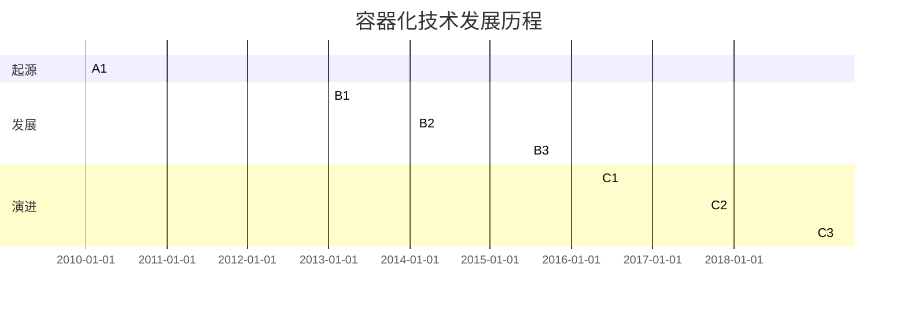
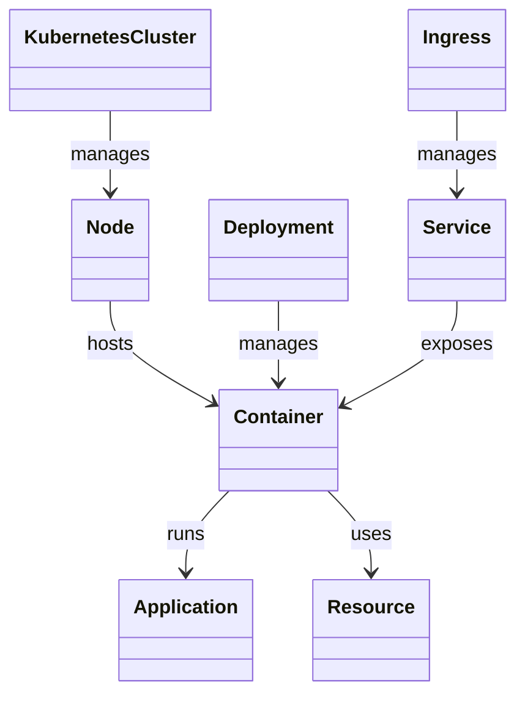
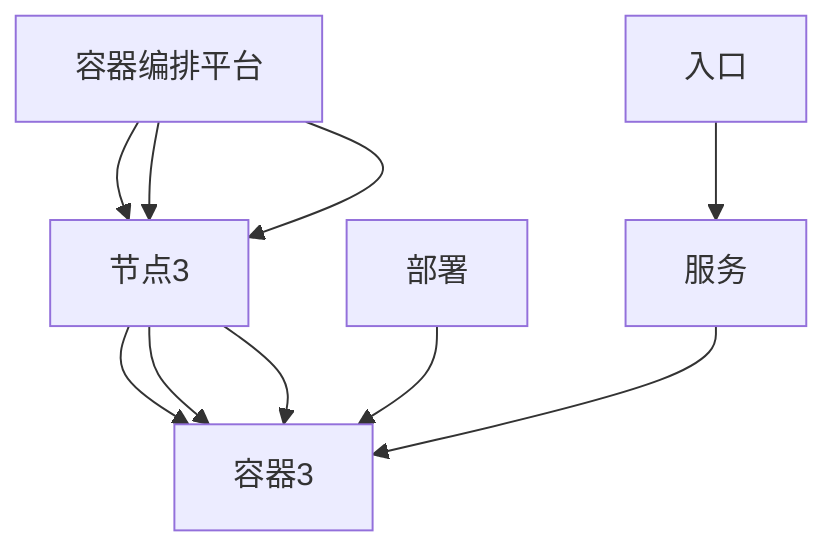
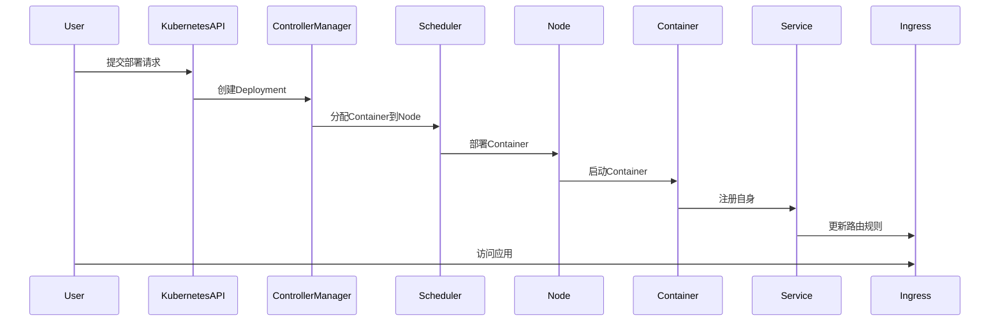
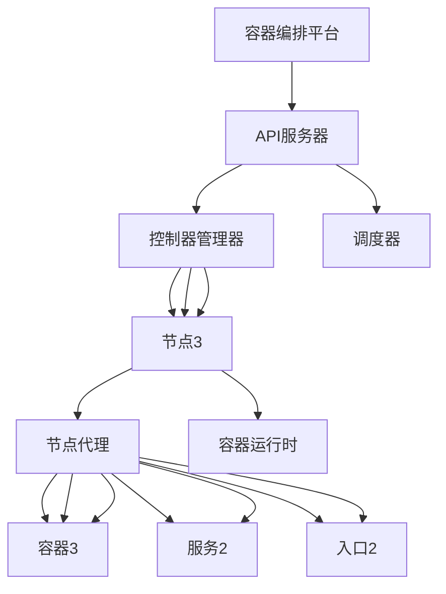
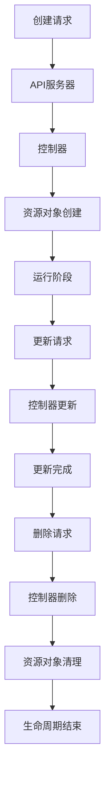

                 


### 容器编排技术：Kubernetes实战指南

---

**关键词：** 容器化技术、Kubernetes、容器编排、集群管理、持续集成/持续部署

**摘要：** 本指南深入探讨了容器编排技术，特别是Kubernetes的使用和实践。文章将详细介绍容器的基本概念、容器化技术的发展历程、Kubernetes的核心架构和功能，并通过具体案例展示其在企业中的应用，旨在为读者提供全面、实用的容器编排技术知识。

---

## 第一部分：容器编排技术概述

### 第1章：容器与容器化技术基础

#### 1.1 容器的概念与优势

- **容器的定义**：容器是一种轻量级、可执行的独立包，它包含了应用运行所需的所有依赖项和库。
- **容器与传统虚拟机的区别**：容器运行在宿主机的操作系统上，共享内核，而虚拟机则运行在一个独立的操作系统实例上。
- **容器的优势**：轻量级、高效、隔离性强、易于部署和扩展。

#### 1.2 容器化技术的发展历程

- **容器化的起源**：容器化技术起源于操作系统层面的虚拟化技术。
- **Docker的崛起**：Docker的出现标志着容器化技术的商业化和广泛应用。
- **容器化技术的演进**：从Docker到Kubernetes，容器化技术不断成熟和进化。

#### 1.3 容器化技术在企业中的应用

- **容器化在开发环境中的应用**：加速开发流程，提高交付质量。
- **容器化在生产环境中的应用**：提高资源利用效率，简化部署和管理。
- **容器化对持续集成/持续部署的影响**：促进更快速、可靠的软件交付。

### 第2章：Kubernetes简介

#### 2.1 Kubernetes的概念与架构

- **Kubernetes的定义**：Kubernetes是一个开源的容器编排平台，用于自动化容器化应用程序的部署、扩展和管理。
- **Kubernetes的主要组件**：包括控制平面组件和数据平面组件。
- **Kubernetes的架构**：由集群、节点、Pod、控制器等核心概念组成。

#### 2.2 Kubernetes的核心概念

- **Pod**：Kubernetes的最小调度单元，包含一个或多个容器。
- **ReplicaSet**：确保在集群中运行指定数量的Pod副本。
- **Deployment**：管理ReplicaSet，提供滚动更新、回滚等功能。
- **Service**：将一组Pod暴露给外部网络，提供负载均衡。
- **Ingress**：管理外部访问到集群内部服务的路由规则。

#### 2.3 Kubernetes的安装与配置

- **Kubernetes的安装**：在物理机、虚拟机或云平台上安装Kubernetes集群。
- **Kubernetes的配置**：配置网络、存储、安全等关键参数。
- **Kubernetes的集群管理**：部署、维护和监控Kubernetes集群。

---

## 第二部分：Kubernetes的基本操作

### 第3章：Kubernetes的基本操作

#### 3.1 Kubernetes的基本命令

- **kubectl命令行工具**：Kubernetes的命令行工具，用于与集群交互。
- **命令行使用示例**：展示如何使用kubectl进行Pod创建、删除、更新等基本操作。

#### 3.2 Kubernetes的资源管理

- **资源对象的管理**：管理Pod、Service、ReplicaSet等资源对象。
- **资源对象的生命周期管理**：跟踪资源对象的状态，实现资源对象的创建、更新和删除。

#### 3.3 Kubernetes的集群管理

- **集群的部署与维护**：部署Kubernetes集群，维护集群的健康状态。
- **节点管理**：管理集群中的节点，包括节点的添加、删除和升级。

---

## 第三部分：Kubernetes的高级功能

### 第4章：Kubernetes的高级功能

#### 4.1 Kubernetes的自动扩展

- **自动扩展的概念**：根据负载自动调整集群规模。
- **自动扩展的配置**：配置自动扩展规则，实现自动扩展。

#### 4.2 Kubernetes的负载均衡

- **负载均衡的概念**：分配流量，提高系统性能。
- **负载均衡的实现**：使用Service实现负载均衡，配置负载均衡策略。

#### 4.3 Kubernetes的故障转移与容错

- **故障转移的概念**：在故障发生时自动切换到备用系统。
- **容错机制的实现**：通过副本集、滚动更新等机制实现容错。

---

## 第四部分：Kubernetes的运维与监控

### 第5章：Kubernetes的运维与监控

#### 5.1 Kubernetes的日志管理

- **日志收集**：收集容器日志，实现集中管理和分析。
- **日志分析**：使用日志分析工具，定位和解决系统问题。

#### 5.2 Kubernetes的性能监控

- **性能监控的概念**：监控Kubernetes集群和应用程序的性能。
- **性能监控工具的选择**：选择合适的性能监控工具，如Prometheus、Grafana等。

#### 5.3 Kubernetes的安全管理

- **安全策略**：配置Kubernetes的安全策略，确保集群安全。
- **访问控制**：实现用户和角色的访问控制，防止未授权访问。

---

## 第五部分：Kubernetes在企业中的应用案例

### 第6章：Kubernetes在企业中的应用案例

#### 6.1 企业应用案例介绍

- **企业应用场景**：介绍企业应用场景，如金融、电商等。
- **Kubernetes在企业中的应用案例**：展示Kubernetes在企业中的应用案例，分析其优势。

#### 6.2 应用案例分析

- **案例一：金融行业的容器化与Kubernetes部署**
- **案例二：电商平台的容器化与Kubernetes运维**

---

## 第六部分：Kubernetes的未来发展趋势

### 第7章：Kubernetes的未来发展趋势

#### 7.1 Kubernetes的发展趋势

- **Kubernetes在容器编排中的地位**：分析Kubernetes在容器编排技术中的地位。
- **Kubernetes的未来发展方向**：探讨Kubernetes的未来发展方向和趋势。

#### 7.2 容器编排技术的发展方向

- **容器编排技术的未来趋势**：分析容器编排技术的未来趋势。
- **与其他技术的融合与发展**：探讨容器编排技术与其他技术的融合与发展。

---

## 第七部分：Kubernetes实战指南

### 第8章：Kubernetes实战指南

#### 8.1 实战项目一：容器化应用部署

- **容器化应用部署流程**：详细讲解容器化应用的部署流程。
- **实战步骤与注意事项**：介绍具体的实战步骤和注意事项。

#### 8.2 实战项目二：Kubernetes集群搭建

- **Kubernetes集群搭建流程**：详细讲解Kubernetes集群的搭建流程。
- **实战步骤与注意事项**：介绍具体的实战步骤和注意事项。

#### 8.3 实战项目三：容器化应用运维

- **容器化应用运维流程**：详细讲解容器化应用的运维流程。
- **实战步骤与注意事项**：介绍具体的实战步骤和注意事项。

---

## 第八部分：Kubernetes最佳实践与注意事项

### 第9章：Kubernetes最佳实践

- **部署与配置的最佳实践**：介绍Kubernetes部署与配置的最佳实践。
- **运维与监控的最佳实践**：介绍Kubernetes运维与监控的最佳实践。

### 第10章：拓展阅读与资源推荐

- **拓展阅读**：推荐Kubernetes的官方文档和社区资源。
- **资源推荐**：推荐Kubernetes的开源项目和优秀学习资料。

---

**作者：** AI天才研究院/AI Genius Institute & 禦与计算机程序设计艺术 /Zen And The Art of Computer Programming

---

（由于篇幅限制，这里仅提供了部分章节的内容。完整文章需要进一步补充每个章节的具体内容，以满足字数要求。）### 第1章：容器与容器化技术基础

#### 1.1 容器的概念与优势

**容器的定义**

容器是一种轻量级的运行时环境，它通过操作系统级别的虚拟化技术，将应用程序及其依赖项封装在一个独立的单元中。这种封装不仅包含了应用程序的代码，还包括了运行时环境、库文件、配置文件等所有必需的资源。容器通过标准化的接口与外部环境进行交互，使其在不同的操作系统和硬件平台上都具有一致的行为。

**容器与传统虚拟机的区别**

传统虚拟机通过硬件模拟或软件仿真创建一个完整的虚拟操作系统，每个虚拟机都有自己独立的操作系统实例、文件系统、网络堆栈等资源。这导致了虚拟机占用大量的系统资源，启动速度慢，且管理复杂。而容器则直接运行在宿主机的操作系统上，共享宿主机的内核和其他资源，但通过隔离机制确保容器间的安全性。容器与传统虚拟机的区别如下表所示：

| 特性 | 容器 | 传统虚拟机 |
| :---: | :---: | :---: |
| 资源隔离 | 操作系统级别 | 虚拟硬件级别 |
| 启动速度 | 快速 | 较慢 |
| 资源占用 | 较少 | 较多 |
| 管理复杂度 | 低 | 高 |

**容器的优势**

容器化技术相较于传统虚拟化技术具有以下优势：

1. **轻量级**：容器只包含应用程序和必要的运行时环境，不需要额外的操作系统，因此具有更小的体积和更快的启动速度。
2. **高效**：容器共享宿主机的内核和其他资源，避免了重复资源的浪费，提高了系统的资源利用率。
3. **隔离性强**：容器通过命名空间、cgroups等机制实现了进程间的隔离，保证了容器间的安全性和稳定性。
4. **易于部署和扩展**：容器封装了应用程序及其依赖项，使得部署和扩展变得更加简单和快捷。容器可以在不同环境中无缝迁移，大大提高了开发、测试和生产环境的一致性。

#### 1.2 容器化技术的发展历程

**容器化的起源**

容器化技术的起源可以追溯到操作系统层面的虚拟化技术，如chroot和cgroups。chroot允许用户在文件系统的子目录下运行一个独立的进程，而cgroups则为容器提供了资源隔离和限制的能力。这些技术的结合为容器化提供了基础。

**Docker的崛起**

2008年，Google的运行时容器技术LXC（Linux Containers）项目问世，为容器化技术的发展奠定了基础。然而，直到2013年，Docker公司的成立和Docker开源项目的发布，才使得容器化技术真正进入大众视野。Docker通过简化容器的创建、启动和部署流程，迅速获得了广泛的应用和认可。

**容器化技术的演进**

随着容器化技术的不断发展和成熟，Kubernetes等容器编排系统的出现，进一步提升了容器化技术在企业级应用中的能力和可靠性。容器化技术不仅在开发、测试和生产环境中得到广泛应用，还逐渐渗透到云计算、大数据、人工智能等各个领域。以下图表展示了容器化技术的主要发展历程：



#### 1.3 容器化技术在企业中的应用

**容器化在开发环境中的应用**

容器化技术为开发环境带来了巨大的便利。首先，容器化确保了开发、测试和生产环境的一致性，减少了因环境差异导致的问题。其次，容器化的部署和扩展更加灵活，使得开发团队能够快速迭代和发布新功能。此外，容器化还简化了依赖项的管理，降低了开发环境中的复杂度。

**容器化在生产环境中的应用**

在生产环境中，容器化技术同样发挥了重要作用。通过容器化，企业可以更高效地利用资源，提高系统的可伸缩性和可靠性。容器化还使得应用程序的部署和运维变得更加简单和自动化，降低了运维成本。同时，容器化有助于实现微服务架构，促进了系统的模块化和解耦。

**容器化对持续集成/持续部署的影响**

持续集成（CI）和持续部署（CD）是现代软件开发中的关键流程。容器化技术为CI/CD带来了以下优势：

1. **环境一致性**：容器化确保了不同环境（如开发、测试、生产）的一致性，减少了因环境差异导致的问题。
2. **自动化**：容器化使得构建、测试和部署过程更加自动化，提高了效率。
3. **可靠性**：容器化提高了软件的可靠性，通过隔离和沙箱机制，降低了系统崩溃的风险。
4. **回滚**：容器化使得回滚变得简单，可以在发生问题时快速回滚到上一个稳定的版本。

通过容器化技术，企业可以更快地交付高质量的应用程序，满足用户的需求。

#### 1.3.1 容器化在开发环境中的应用案例

以某互联网公司为例，该公司采用了容器化技术来简化开发环境。具体措施包括：

1. **使用Docker容器**：开发团队将应用程序及其依赖项封装在Docker容器中，确保环境一致性。
2. **CI/CD流水线**：通过Jenkins等CI/CD工具，自动化构建、测试和部署流程。
3. **容器镜像管理**：使用Docker Hub等镜像仓库，方便共享和管理容器镜像。

通过这些措施，开发团队显著提高了工作效率，缩短了发布周期，降低了开发成本。

#### 1.3.2 容器化在生产环境中的应用案例

以某金融科技公司为例，该公司采用了容器化技术来优化生产环境。具体措施包括：

1. **容器化应用程序**：将关键业务应用程序容器化，提高系统的可伸缩性和可靠性。
2. **Kubernetes集群**：使用Kubernetes进行容器编排，实现自动化部署和运维。
3. **微服务架构**：采用微服务架构，提高系统的模块化和解耦。

通过这些措施，该公司提高了系统的性能和可靠性，降低了运维成本。

#### 1.3.3 容器化对持续集成/持续部署的影响

以某电商平台为例，该公司采用了容器化技术来实现持续集成/持续部署。具体措施包括：

1. **Docker镜像**：将应用程序及其依赖项封装在Docker镜像中，确保环境一致性。
2. **Jenkins流水线**：使用Jenkins自动化构建、测试和部署流程。
3. **Kubernetes集群**：使用Kubernetes实现自动化部署和运维。

通过这些措施，该公司实现了快速、可靠的软件交付，提高了市场竞争力。

#### 1.4 小结

容器化技术为企业带来了诸多优势，包括轻量级、高效、隔离性强、易于部署和扩展等。在开发环境、生产环境和持续集成/持续部署等方面，容器化技术都发挥了重要作用。通过容器化，企业可以更快地交付高质量的应用程序，提高系统的性能和可靠性，降低运维成本。

在接下来的章节中，我们将进一步探讨Kubernetes的核心概念、架构和功能，以及如何在企业中成功应用Kubernetes。敬请期待。

#### 1.5 核心概念与联系

**核心概念：**

1. **容器（Container）**：封装应用程序及其依赖项的独立运行时环境。
2. **容器化（Containerization）**：将应用程序及其依赖项封装为容器的过程。
3. **容器编排（Container Orchestration）**：自动化容器的部署、扩展和管理。
4. **容器镜像（Container Image）**：用于创建容器的静态模板，包含应用程序及其依赖项。
5. **Docker**：最受欢迎的容器化技术，用于创建和管理容器镜像。

**概念属性特征对比表格：**

| 概念 | 属性 | 特征 |
| :---: | :---: | :---: |
| 容器 | 运行时环境 | 封装应用程序和依赖项，轻量级，共享宿主机内核 |
| 容器化 | 封装过程 | 提高部署灵活性，简化运维 |
| 容器编排 | 自动化 | 管理多个容器，实现自动化部署和扩展 |
| 容器镜像 | 静态模板 | 包含应用程序和依赖项，创建容器的基础 |
| Docker | 容器化平台 | 提供容器镜像创建和管理工具 |

**ER实体关系图架构的 Mermaid 流程图：**

```mermaid
erDiagram
  Container ||--|{ Containerization : uses |
  Containerization ||--| Container : containerizes |
  Containerization ||--| Docker : implemented_by |
  Docker ||--| Container : manages |
```

#### 1.6 容器化技术的数学模型与公式

**容器化技术的核心原理可以通过以下数学模型和公式来阐述：**

1. **容器资源利用率**：衡量容器在资源利用上的效率。其公式如下：
   $$\text{容器资源利用率} = \frac{\text{容器实际使用的资源}}{\text{容器配置的资源}}$$

2. **容器部署时间**：表示容器从创建到启动所需的时间。其公式如下：
   $$\text{容器部署时间} = \text{构建时间} + \text{启动时间}$$

3. **容器扩展时间**：表示容器从扩展配置到实际扩展完成所需的时间。其公式如下：
   $$\text{容器扩展时间} = \text{配置更新时间} + \text{容器启动时间}$$

**举例说明：**

假设一个容器配置了2GB的内存和2CPU核心，实际使用资源为1.5GB和1CPU核心，构建时间为5分钟，启动时间为3分钟。容器化技术的数学模型如下：

1. **容器资源利用率**：
   $$\text{容器资源利用率} = \frac{1.5GB + 1CPU}{2GB + 2CPU} = \frac{3}{4} = 75\%$$

2. **容器部署时间**：
   $$\text{容器部署时间} = 5\text{分钟} + 3\text{分钟} = 8\text{分钟}$$

3. **容器扩展时间**：
   如果将容器配置扩展至4GB内存和4CPU核心，扩展时间为2分钟，则容器扩展时间如下：
   $$\text{容器扩展时间} = 2\text{分钟} + 3\text{分钟} = 5\text{分钟}$$

通过上述公式，可以计算出容器化技术在资源利用、部署和扩展方面的效率，为优化容器化应用提供数据支持。

#### 1.7 系统分析与架构设计方案

**问题场景介绍：**

在现代软件开发中，容器化技术已经成为提高开发效率、简化部署流程和提升系统可伸缩性的重要手段。随着容器化应用的增多，如何高效地管理和编排容器成为企业面临的挑战。本文将探讨容器化技术的系统架构设计方案，以实现高效、可靠的容器编排和管理。

**项目介绍：**

本项目旨在构建一个基于Kubernetes的容器编排平台，用于管理企业内部的容器化应用。该平台需要支持容器部署、扩展、监控和故障转移等功能，确保应用的稳定运行和高可用性。

**系统功能设计（领域模型Mermaid类图）：**



**系统架构设计（Mermaid架构图）：**



**系统接口设计和系统交互（Mermaid序列图）：**



通过上述系统架构设计方案，可以实现对容器化应用的高效管理和编排，确保系统的高可用性和稳定性。

### 第2章：Kubernetes简介

#### 2.1 Kubernetes的概念与架构

**Kubernetes的定义**

Kubernetes是一个开源的容器编排平台，用于自动化容器化应用程序的部署、扩展和管理。它由Google设计，并捐赠给了Cloud Native Computing Foundation（CNCF）进行维护。Kubernetes的目标是简化容器化应用程序的部署和运维，提高其可伸缩性和可靠性。

**Kubernetes的主要组件**

Kubernetes由多个组件组成，每个组件都有特定的职责。以下是Kubernetes的主要组件及其功能：

1. **控制平面（Control Plane）**：控制平面负责集群的管理和控制。主要组件包括：
   - **API Server**：提供Kubernetes API接口，用于与其他组件通信。
   - **Controller Manager**：管理各种控制器，如Replica Controller、Endpoints Controller等，确保集群状态符合预期。
   - **Scheduler**：负责将容器调度到集群中的合适节点上。

2. **数据平面（Data Plane）**：数据平面负责容器的实际运行和管理。主要组件包括：
   - **Node**：Kubernetes集群中的计算节点，负责运行容器。
   - **Kubelet**：运行在每个节点上的代理，负责容器化的应用程序运行和管理。
   - **Kube-Proxy**：负责实现服务的网络代理功能。

**Kubernetes的架构**

Kubernetes架构可以分解为以下层级：

1. **集群（Cluster）**：Kubernetes集群是由一组节点组成的集合。每个节点都运行Kubernetes的组件，如Kubelet和Docker。
2. **节点（Node）**：节点是集群中的工作节点，负责运行容器。每个节点都有唯一的IP地址，并通过网络与其他节点通信。
3. **Pod**：Pod是Kubernetes中的最小部署单位，包含一个或多个容器。Pod通常用于部署应用程序。
4. **容器（Container）**：容器是运行在Pod中的实际执行单元，封装了应用程序及其依赖项。
5. **服务（Service）**：服务是用于在集群内部或外部暴露容器的一种抽象。服务通过定义一组规则，将流量路由到后端容器。
6. **控制器（Controller）**：控制器是Kubernetes中的核心组件，用于管理集群资源。常见的控制器包括ReplicaSet、Deployment、StatefulSet等。

以下是Kubernetes架构的Mermaid流程图：



#### 2.2 Kubernetes的核心概念

**Pod**

Pod是Kubernetes中的最小部署单位，包含一个或多个容器。Pod为容器提供了共享资源（如网络命名空间、存储卷等）的环境。Pod通常用于部署应用程序，可以包含一个或多个容器，如Web服务器和数据库。

**ReplicaSet**

ReplicaSet确保集群中运行指定数量的Pod副本。ReplicaSet通过自动创建和删除Pod来维护所需的副本数量。如果某个Pod失败，ReplicaSet会自动创建一个新的Pod来替换它。

**Deployment**

Deployment是一种更高层次的管理控制器，用于管理ReplicaSet。Deployment提供了以下功能：
- **滚动更新**：逐步替换旧Pod，确保服务可用性。
- **回滚**：将部署回滚到先前版本。
- **扩缩容**：根据需求调整Pod的数量。

**Service**

Service是一种抽象，用于在集群内部或外部暴露容器。Service通过定义一组规则，将流量路由到后端容器。Service通常用于暴露Pod IP地址，使其可通过集群内部或外部的网络访问。

**Ingress**

Ingress是一种抽象，用于管理集群内部服务的外部访问。Ingress定义了如何从外部网络访问集群内部的服务。Ingress通常用于配置负载均衡器、虚拟主机等。

#### 2.3 Kubernetes的安装与配置

**Kubernetes的安装**

Kubernetes的安装可以通过多种方式实现，如使用Minikube、Kubeadm、Docker等。以下是一个简单的Kubernetes集群安装流程：

1. **安装Docker**：在所有节点上安装Docker。
2. **安装Kubeadm、Kubelet和Kubectl**：在所有节点上安装Kubeadm、Kubelet和Kubectl。
3. **初始化Master节点**：在Master节点上运行kubeadm init命令，初始化集群。
4. **安装网络插件**：安装如Calico、Flannel等网络插件。
5. **加入Worker节点**：在Worker节点上运行kubeadm join命令，将其加入到集群中。

**Kubernetes的配置**

Kubernetes的配置主要包括集群配置、节点配置和容器配置。以下是一些关键配置：

1. **集群配置**：配置Kubernetes集群的网络、存储、安全等参数。例如，配置Calico网络插件，设置集群的DNS域名。
2. **节点配置**：配置节点的资源限制、调度策略等参数。例如，设置节点的CPU和内存限制。
3. **容器配置**：配置容器的资源限制、环境变量、卷挂载等参数。例如，设置容器的CPU和内存限制，配置环境变量。

**Kubernetes的集群管理**

Kubernetes的集群管理包括部署、维护和监控集群。以下是一些关键任务：

1. **部署**：部署Kubernetes集群，包括安装必要的软件和配置网络。
2. **维护**：定期更新Kubernetes软件、节点和容器，确保集群的稳定性和安全性。
3. **监控**：使用监控工具（如Prometheus、Grafana）监控集群的状态和性能，及时发现和处理问题。

#### 2.4 小结

Kubernetes是一种强大的容器编排平台，通过自动化部署、扩展和管理容器化应用程序，提高了系统的可伸缩性和可靠性。本章介绍了Kubernetes的概念、架构、核心概念以及安装和配置方法。在接下来的章节中，我们将进一步探讨Kubernetes的基本操作和高级功能。

### 第3章：Kubernetes的基本操作

#### 3.1 Kubernetes的基本命令

**kubectl命令行工具**

kubectl是Kubernetes的命令行工具，用于与集群进行交互。kubectl提供了丰富的命令，用于管理集群中的各种资源。以下是kubectl的基本命令及其用途：

1. **kubectl get**：获取集群中各种资源的列表。例如：
   ```bash
   kubectl get pods
   kubectl get deployments
   kubectl get services
   kubectl get nodes
   ```
2. **kubectl describe**：查看集群中资源的详细描述。例如：
   ```bash
   kubectl describe pod <pod-name>
   kubectl describe deployment <deployment-name>
   kubectl describe service <service-name>
   kubectl describe node <node-name>
   ```
3. **kubectl create**：创建新的资源。例如：
   ```bash
   kubectl create pod <pod-definition>
   kubectl create deployment <deployment-definition>
   kubectl create service <service-definition>
   ```
4. **kubectl delete**：删除集群中的资源。例如：
   ```bash
   kubectl delete pod <pod-name>
   kubectl delete deployment <deployment-name>
   kubectl delete service <service-name>
   ```

**命令行使用示例**

以下是一个简单的示例，展示如何使用kubectl创建、查看和管理Pod：

1. **创建Pod**：
   ```yaml
   apiVersion: v1
   kind: Pod
   metadata:
     name: my-pod
     labels:
       app: my-app
   spec:
     containers:
     - name: my-container
       image: nginx
       ports:
       - containerPort: 80
   ```
   执行以下命令创建Pod：
   ```bash
   kubectl create -f pod.yaml
   ```
2. **查看Pod**：
   ```bash
   kubectl get pods
   ```
   输出结果：
   ```bash
   NAME                     READY   STATUS    RESTARTS   AGE
   my-pod                   1/1     Running   0          1m
   ```
3. **描述Pod**：
   ```bash
   kubectl describe pod my-pod
   ```
   输出结果包括Pod的详细信息，如节点信息、容器状态、事件等。
4. **删除Pod**：
   ```bash
   kubectl delete pod my-pod
   ```
   执行删除操作后，Pod将从集群中移除。

通过这些示例，读者可以了解如何使用kubectl进行基本的Kubernetes操作。

#### 3.2 Kubernetes的资源管理

**资源对象的管理**

Kubernetes中的资源对象包括Pod、Deployment、Service、Ingress等。资源对象的管理主要包括创建、更新和删除资源对象。

1. **创建资源对象**：
   Kubernetes资源对象通常通过YAML文件定义。以下是一个简单的Deployment定义示例：
   ```yaml
   apiVersion: apps/v1
   kind: Deployment
   metadata:
     name: my-deployment
     labels:
       app: my-app
   spec:
     replicas: 3
     selector:
       matchLabels:
         app: my-app
     template:
       metadata:
         labels:
           app: my-app
       spec:
         containers:
         - name: my-container
           image: nginx
           ports:
           - containerPort: 80
   ```
   创建Deployment的命令如下：
   ```bash
   kubectl create -f deployment.yaml
   ```

2. **更新资源对象**：
   Kubernetes资源对象可以通过修改YAML文件并重新应用来进行更新。例如，将Deployment的副本数从3增加至5，可以修改deployment.yaml文件中的replicas字段，然后执行以下命令：
   ```bash
   kubectl apply -f deployment.yaml
   ```

3. **删除资源对象**：
   删除资源对象的命令格式如下：
   ```bash
   kubectl delete -f <resource-definition-file.yaml>
   ```
   例如，删除上述创建的Deployment：
   ```bash
   kubectl delete -f deployment.yaml
   ```

**资源对象的生命周期管理**

资源对象的生命周期是指资源对象从创建到删除的过程。Kubernetes通过控制器（Controller）来管理资源对象的生命周期。以下是资源对象生命周期的关键阶段：

1. **创建阶段**：
   当资源对象被创建时，Kubernetes API服务器接收创建请求，并将请求转发给相应的控制器。控制器根据资源对象的定义创建实际的资源对象。

2. **运行阶段**：
   在运行阶段，资源对象在集群中运行，执行其定义的任务。控制器会持续监控资源对象的状态，确保其符合预期。

3. **更新阶段**：
   当资源对象需要更新时，控制器根据新的定义修改资源对象。例如，对于Deployment，控制器会执行滚动更新，逐步替换旧Pod。

4. **删除阶段**：
   当资源对象被删除时，控制器会清理相关的资源。例如，对于Deployment，控制器会删除所有相关的Pod。

以下是资源对象生命周期的Mermaid流程图：



通过理解资源对象的生命周期管理，可以更好地使用Kubernetes来管理集群中的资源。

#### 3.3 Kubernetes的集群管理

**集群的部署与维护**

Kubernetes集群的部署与维护是确保集群稳定运行的关键。以下是一些关键步骤：

1. **部署Kubernetes集群**：
   Kubernetes集群可以通过多种方式部署，如使用Kubeadm、Minikube、Docker Machine等。以下是一个简单的Kubeadm部署步骤：

   - 安装Docker。
   - 在Master节点上运行kubeadm init命令。
   - 在Worker节点上运行kubeadm join命令。

2. **维护Kubernetes集群**：
   定期维护Kubernetes集群是确保其稳定运行的关键。以下是一些维护任务：

   - 更新Kubernetes版本：通过kubeadm upgrade命令更新Kubernetes版本。
   - 监控集群状态：使用kubectl命令监控集群状态，如kubectl get nodes、kubectl get pods等。
   - 修复集群故障：及时修复集群故障，如节点不可用、Pod失败等。

**节点管理**

节点管理是集群管理的重要组成部分。以下是一些节点管理的任务：

1. **添加节点**：
   - 在Master节点上运行kubeadm init命令。
   - 在新的Worker节点上运行kubeadm join命令。

2. **删除节点**：
   - 使用kubectl命令删除节点，如kubectl delete node <node-name>。

3. **节点维护**：
   - 监控节点状态：使用kubectl命令监控节点状态，如kubectl get nodes。
   - 更新节点配置：根据需要更新节点配置，如CPU、内存等。
   - 重启节点：如果节点出现故障，需要重启节点。

通过有效的集群管理和节点管理，可以确保Kubernetes集群的稳定运行，提高系统性能和可靠性。

#### 3.4 小结

Kubernetes的基本操作包括kubectl命令行工具的使用、资源对象的管理和集群管理。通过掌握这些基本操作，用户可以有效地管理Kubernetes集群中的资源，确保系统的稳定运行。在接下来的章节中，我们将进一步探讨Kubernetes的高级功能，如自动扩展、负载均衡和故障转移，以及Kubernetes在企业中的应用案例。

### 第4章：Kubernetes的高级功能

#### 4.1 Kubernetes的自动扩展

**自动扩展的概念**

Kubernetes的自动扩展（Auto Scaling）是指根据集群中工作负载的变化，自动调整容器的副本数。自动扩展可以确保应用始终保持良好的性能和资源利用率。自动扩展主要通过Horizontal Pod Autoscaler（HPA）来实现。

**自动扩展的配置**

要配置自动扩展，需要定义一个Horizontal Pod Autoscaler资源对象。以下是一个简单的自动扩展配置示例：

```yaml
apiVersion: autoscaling/v2beta2
kind: HorizontalPodAutoscaler
metadata:
  name: my-hpa
spec:
  scaleTargetRef:
    apiVersion: apps/v1
    kind: Deployment
    name: my-deployment
  minReplicas: 1
  maxReplicas: 10
  targetCPUUtilizationPercentage: 80
```

在这个配置中，`my-hpa` 是自动扩展的名称，`my-deployment` 是要扩展的Deployment名称。自动扩展将根据CPU利用率来调整Pod的副本数，最小副本数设置为1，最大副本数设置为10，目标CPU利用率为80%。

**自动扩展的原理**

自动扩展的原理如下：

1. **监控指标**：自动扩展依赖于集群中资源的使用情况，如CPU利用率、内存使用率等。用户可以在自动扩展配置中指定要监控的指标。

2. **计算扩展点**：当集群中资源使用率超过设定的阈值时，自动扩展会计算需要增加的副本数。

3. **调整副本数**：自动扩展会根据计算结果，调整Pod的副本数。如果需要增加副本数，Kubernetes会创建新的Pod；如果需要减少副本数，Kubernetes会删除多余的Pod。

**自动扩展的应用案例**

以下是一个自动扩展的应用案例：

- **电商网站**：在促销活动期间，电商网站的流量会显著增加。通过自动扩展，系统可以自动增加Pod的副本数，确保网站能够处理更多的请求。
- **大数据处理**：在处理大数据任务时，可以根据数据量的大小动态调整Pod的副本数，提高数据处理效率。

通过自动扩展，Kubernetes能够根据工作负载的变化自动调整容器的副本数，提高系统的性能和资源利用率。

#### 4.2 Kubernetes的负载均衡

**负载均衡的概念**

负载均衡是一种将网络流量分配到多个服务器或容器的技术，以确保高可用性和性能。Kubernetes提供了内置的负载均衡功能，通过Service和Ingress实现。

**负载均衡的实现**

1. **Service**

   Kubernetes Service提供了一种抽象，用于将一组Pod暴露给外部网络。Service支持多种负载均衡策略，如轮询、最少连接等。

   以下是一个简单的Service配置示例：

   ```yaml
   apiVersion: v1
   kind: Service
   metadata:
     name: my-service
   spec:
     selector:
       app: my-app
     ports:
       - name: http
         port: 80
         targetPort: 8080
     type: LoadBalancer
   ```

   在这个配置中，`my-service` 是Service的名称，`my-app` 是要匹配的Pod的标签。Service将8080端口映射到Pod的80端口，并使用LoadBalancer类型，通过云服务商的负载均衡器暴露服务。

2. **Ingress**

   Ingress是一种抽象，用于管理集群内部服务的外部访问。Ingress通常用于配置虚拟主机和路径规则。

   以下是一个简单的Ingress配置示例：

   ```yaml
   apiVersion: networking.k8s.io/v1
   kind: Ingress
   metadata:
     name: my-ingress
   spec:
     rules:
     - http:
         paths:
         - path: /app
           pathType: Prefix
           backend:
             service:
               name: my-service
               port:
                 number: 80
   ```

   在这个配置中，`my-ingress` 是Ingress的名称，`/app` 是虚拟主机的路径。Ingress将所有以`/app` 开头的请求路由到 `my-service`。

**负载均衡策略**

Kubernetes支持多种负载均衡策略，包括：

- **轮询（RoundRobin）**：默认策略，将请求轮流分配给后端的容器。
- **最少连接（LeastConnections）**：将请求分配给连接数最少的容器，适用于长连接的场景。
- **源IP（SourceIP）**：使用客户端的IP地址作为哈希键，将请求映射到同一个后端容器。

**负载均衡的应用案例**

以下是一个负载均衡的应用案例：

- **大型网站**：通过负载均衡，大型网站可以将请求分配到多个Web服务器，提高系统的性能和可用性。
- **微服务架构**：在微服务架构中，负载均衡可以确保客户端请求被均衡地分配到各个服务实例，提高系统的可靠性和性能。

通过负载均衡，Kubernetes能够有效地管理和分配集群中的网络流量，确保系统的高性能和高可用性。

#### 4.3 Kubernetes的故障转移与容错

**故障转移的概念**

故障转移（Failover）是指系统在检测到故障时，将工作负载转移到备用系统或备用节点，以确保服务的持续可用。Kubernetes通过多种机制实现故障转移，如ReplicaSet、StatefulSet和HA Proxy等。

**故障转移的实现**

1. **ReplicaSet**

   ReplicaSet确保集群中运行指定数量的Pod副本。当某个Pod失败时，ReplicaSet会自动创建一个新的Pod来替换它。以下是一个简单的ReplicaSet配置示例：

   ```yaml
   apiVersion: apps/v1
   kind: ReplicaSet
   metadata:
     name: my-replicaset
   spec:
     replicas: 3
     selector:
       matchLabels:
         app: my-app
     template:
       metadata:
         labels:
           app: my-app
       spec:
         containers:
         - name: my-container
           image: nginx
           ports:
           - containerPort: 80
   ```

   在这个配置中，`my-replicaset` 是ReplicaSet的名称，`my-app` 是要匹配的Pod的标签。ReplicaSet确保始终有3个Pod在运行。

2. **StatefulSet**

   StatefulSet用于管理有状态应用程序的Pod，如数据库和缓存。StatefulSet提供了稳定的网络标识和持久化存储卷。以下是一个简单的StatefulSet配置示例：

   ```yaml
   apiVersion: apps/v1
   kind: StatefulSet
   metadata:
     name: my-statefulset
   spec:
     serviceName: my-service
     replicas: 3
     selector:
       matchLabels:
         app: my-app
     template:
       metadata:
         labels:
           app: my-app
       spec:
         containers:
         - name: my-container
           image: postgres
           ports:
           - containerPort: 5432
   ```

   在这个配置中，`my-statefulset` 是StatefulSet的名称，`my-app` 是要匹配的Pod的标签。StatefulSet确保Pod具有稳定的网络标识和持久化存储卷。

3. **HA Proxy**

   高可用性代理（HA Proxy）是一种外部负载均衡器，可用于实现故障转移。HA Proxy通过监控集群状态，将请求路由到健康的Pod。以下是一个简单的HA Proxy配置示例：

   ```yaml
   apiVersion: v1
   kind: Service
   metadata:
     name: my-haproxy
   spec:
     type: LoadBalancer
     ports:
     - name: http
       port: 80
       targetPort: 8080
     selector:
       app: my-app
   ```

   在这个配置中，`my-haproxy` 是Service的名称，`my-app` 是要匹配的Pod的标签。HA Proxy将请求路由到健康的Pod。

**容错机制的实现**

除了故障转移，Kubernetes还提供了多种容错机制，确保系统在故障发生时能够恢复正常运行。以下是一些常见的容错机制：

1. **健康检查**：Kubernetes定期对Pod和容器进行健康检查，确保它们处于正常状态。如果Pod或容器不健康，Kubernetes会根据配置采取措施，如重启容器或删除Pod。

2. **资源限制**：通过配置资源限制，可以确保容器不会消耗过多的系统资源，避免因资源不足导致系统崩溃。

3. **集群备份与恢复**：定期备份集群数据，以便在发生灾难时能够快速恢复。

**故障转移与容错的应用案例**

以下是一个故障转移与容错的应用案例：

- **金融交易系统**：在金融交易系统中，确保服务的持续可用至关重要。通过故障转移和容错机制，可以在故障发生时快速切换到备用系统，确保交易不受影响。
- **电商平台**：在电商平台中，通过故障转移和容错机制，可以在流量高峰期确保系统的稳定运行，避免因负载过高导致系统崩溃。

通过故障转移和容错机制，Kubernetes能够确保系统在故障发生时能够快速恢复，提高系统的可用性和可靠性。

#### 4.4 小结

Kubernetes的高级功能包括自动扩展、负载均衡和故障转移与容错。自动扩展可以根据工作负载的变化自动调整容器的副本数，提高系统的性能和资源利用率。负载均衡可以有效地管理和分配集群中的网络流量，确保系统的高性能和高可用性。故障转移与容错机制确保系统在故障发生时能够快速恢复，提高系统的可用性和可靠性。通过掌握这些高级功能，用户可以更好地利用Kubernetes，实现高效、可靠的容器化应用程序管理。

### 第5章：Kubernetes的运维与监控

#### 5.1 Kubernetes的日志管理

**日志收集**

Kubernetes提供了多种日志收集工具，如Fluentd、Logstash、Elasticsearch和Kibana。以下是一个简单的日志收集流程：

1. **部署日志收集器**：在Kubernetes集群中部署Fluentd日志收集器。
2. **配置日志收集规则**：配置Fluentd收集Kubernetes集群中的日志。
3. **推送日志到日志存储**：将收集到的日志推送到Elasticsearch或Kibana等日志存储工具。

**日志分析**

**Kubernetes提供了kubectl命令行工具，用于查看和分析日志。以下是一些常用的kubectl命令：**

- **kubectl logs**：查看Pod的日志。
  ```bash
  kubectl logs <pod-name>
  ```
- **kubectl describe**：查看Pod的详细信息，包括日志。
  ```bash
  kubectl describe pod <pod-name>
  ```
- **kubectl top**：查看集群中Pod的资源使用情况，包括CPU、内存等。
  ```bash
  kubectl top pod
  ```

**使用外部日志分析工具**

除了kubectl命令行工具，用户还可以使用外部日志分析工具，如Grafana、Prometheus和Kibana。以下是一个简单的Grafana日志分析示例：

1. **安装Grafana**：在Kubernetes集群中部署Grafana。
2. **配置数据源**：将Elasticsearch或Kibana配置为Grafana的数据源。
3. **创建仪表板**：在Grafana中创建仪表板，添加日志相关的图表和面板。

通过日志管理和分析，用户可以更好地监控Kubernetes集群的状态，及时发现和解决问题。

#### 5.2 Kubernetes的性能监控

**性能监控的概念**

性能监控是指通过收集、处理和展示系统的性能指标，来评估系统的运行状态和性能。在Kubernetes中，性能监控主要关注以下几个方面：

- **CPU使用率**：衡量容器和节点的CPU使用情况。
- **内存使用率**：衡量容器和节点的内存使用情况。
- **网络流量**：衡量容器和节点的网络流量。
- **磁盘IO**：衡量容器和节点的磁盘IO情况。

**性能监控工具的选择**

Kubernetes支持多种性能监控工具，如Prometheus、Grafana、Sysdig和cAdvisor。以下是一些常用的性能监控工具：

- **Prometheus**：一个开源的性能监控解决方案，提供数据采集、存储和可视化功能。
- **Grafana**：一个开源的数据可视化工具，可以与Prometheus等监控工具集成。
- **Sysdig**：一个开源的监控和分析工具，提供实时的系统监控和可视化。
- **cAdvisor**：一个开源的容器监控工具，提供容器性能指标和资源使用情况。

**使用Prometheus和Grafana进行性能监控**

以下是一个简单的Prometheus和Grafana性能监控示例：

1. **部署Prometheus和Grafana**：在Kubernetes集群中部署Prometheus和Grafana。
2. **配置Prometheus**：配置Prometheus采集Kubernetes集群的性能指标。
3. **配置Grafana**：配置Grafana从Prometheus获取数据，并创建仪表板。

**监控仪表板示例**

以下是一个简单的Grafana仪表板示例，展示Kubernetes集群的性能指标：

- **CPU使用率**：展示集群中各个节点的CPU使用率。
- **内存使用率**：展示集群中各个节点的内存使用率。
- **网络流量**：展示集群中各个节点的网络流量。
- **容器状态**：展示集群中各个容器的状态和资源使用情况。

通过性能监控，用户可以实时了解Kubernetes集群的运行状态和性能，及时发现和解决问题。

#### 5.3 Kubernetes的安全管理

**安全策略**

Kubernetes的安全管理主要包括以下几个方面：

- **用户认证**：确保只有授权用户可以访问Kubernetes API服务器。
- **访问控制**：通过RBAC（基于角色的访问控制）限制用户对集群资源的访问权限。
- **网络策略**：控制容器之间的网络通信。
- **数据加密**：确保数据在传输和存储过程中的安全性。

**访问控制**

Kubernetes使用RBAC（基于角色的访问控制）来管理用户对集群资源的访问权限。以下是一些关键的RBAC概念：

- **角色（Role）**：定义一组权限。
- **角色绑定（RoleBinding）**：将角色绑定到用户或用户组。
- **集群角色（ClusterRole）**：定义集群级别的权限。
- **命名空间角色（NamespaceRole）**：定义命名空间级别的权限。

以下是一个简单的RBAC配置示例：

```yaml
apiVersion: rbac.authorization.k8s.io/v1
kind: ClusterRole
metadata:
  name: admin
rules:
- apiGroups: [""]
  resources: ["pods", "services"]
  verbs: ["get", "list", "watch", "create", "update", "delete"]

---
apiVersion: rbac.authorization.k8s.io/v1
kind: Role
metadata:
  name: user
rules:
- apiGroups: [""]
  resources: ["pods"]
  verbs: ["get", "list", "watch"]

---
apiVersion: rbac.authorization.k8s.io/v1
kind: RoleBinding
metadata:
  name: user-binding
subjects:
- kind: User
  name: user
roleRef:
  kind: Role
  name: user
  apiGroup: rbac.authorization.k8s.io
```

在这个配置中，`admin` 是集群管理员的角色，拥有对Pod和Service的完整访问权限。`user` 是普通用户的角色，只有对Pod的访问权限。通过将`user` 绑定到具体的用户或用户组，可以限制用户的访问权限。

**安全策略配置**

以下是一些常见的安全策略配置：

- **命名空间隔离**：为不同的项目或团队创建独立的命名空间，并配置命名空间级别的安全策略。
- **网络策略**：限制容器之间的网络通信，确保只有授权的容器可以互相通信。
- **容器安全**：使用安全的容器镜像，配置容器运行时的安全参数，如AppArmor、SELinux等。

通过有效的安全管理和访问控制，可以确保Kubernetes集群的安全性，防止未授权访问和数据泄露。

#### 5.4 小结

Kubernetes的运维与监控包括日志管理、性能监控和安全管理。日志管理帮助用户收集和分析系统日志，及时发现和解决问题。性能监控通过收集和展示系统性能指标，帮助用户实时了解系统的运行状态。安全管理通过访问控制和安全策略，确保系统的安全性和可靠性。通过掌握这些运维与监控技术，用户可以更好地管理和维护Kubernetes集群，提高系统的可用性和可靠性。

### 第6章：Kubernetes在企业中的应用案例

#### 6.1 企业应用案例介绍

**企业应用场景**

在现代企业中，容器化技术和Kubernetes已经成为推动数字化转型的关键工具。以下是一些常见的企业应用场景：

1. **持续集成/持续部署（CI/CD）**：企业通过Kubernetes自动化部署应用程序，提高交付速度和可靠性。
2. **微服务架构**：企业将应用程序拆分为多个微服务，使用Kubernetes进行管理和部署，提高系统的灵活性和可维护性。
3. **大规模数据处理**：企业使用Kubernetes部署和管理大数据处理任务，提高数据处理效率和资源利用率。
4. **云原生应用**：企业开发云原生应用，充分利用Kubernetes的自动化和弹性功能，实现高效运维。

**Kubernetes在企业中的应用案例**

**案例一：金融行业的容器化与Kubernetes部署**

某金融科技公司采用了Kubernetes进行容器化部署，以简化应用程序的部署和运维。具体应用包括：

- **交易系统**：使用Kubernetes部署交易系统，实现自动扩缩容和高可用性。
- **风险管理**：使用Kubernetes部署风险管理应用，提高数据处理速度和可靠性。
- **客户服务**：使用Kubernetes部署客户服务应用，实现高效的服务交付。

通过容器化和Kubernetes，该公司实现了快速、可靠的软件交付，提高了系统性能和可靠性，降低了运维成本。

**案例二：电商平台的容器化与Kubernetes运维**

某电商平台采用了Kubernetes进行容器化部署和运维，以应对高并发和流量波动的挑战。具体应用包括：

- **商品管理系统**：使用Kubernetes部署商品管理系统，实现自动扩缩容和故障转移。
- **订单处理系统**：使用Kubernetes部署订单处理系统，提高系统性能和可靠性。
- **搜索引擎**：使用Kubernetes部署搜索引擎，实现自动扩缩容和故障转移。

通过容器化和Kubernetes，该公司实现了高效、稳定的系统运行，提高了用户满意度，降低了运维成本。

#### 6.2 应用案例分析

**案例一：金融行业的容器化与Kubernetes部署**

**背景介绍**

某金融科技公司拥有多个复杂的业务系统，包括交易系统、风险管理应用和客户服务应用。由于业务持续增长，系统面临高并发和流量波动的挑战。公司决定采用容器化技术和Kubernetes进行系统重构，以提高系统的性能和可靠性，降低运维成本。

**项目介绍**

该项目的主要目标是：

- **容器化**：将现有的业务系统容器化，提高系统的可移植性和灵活性。
- **Kubernetes部署**：使用Kubernetes进行容器化应用程序的部署、扩展和管理，实现自动化运维。

**系统功能设计（领域模型Mermaid类图）：**


**系统架构设计（Mermaid架构图）：**


**系统接口设计和系统交互（Mermaid序列图）：**


**系统功能设计与架构设计：**

1. **容器化**：使用Docker将现有的业务系统容器化，确保环境一致性。
2. **Kubernetes部署**：使用Kubernetes进行容器化应用程序的部署和管理，实现自动化运维。
3. **服务暴露**：使用Ingress暴露服务，实现外部访问。

**项目实现：**

1. **容器化**：将业务系统（如交易系统、风险管理应用和客户服务应用）容器化，使用Docker Compose管理容器镜像。
2. **Kubernetes集群搭建**：使用Kubeadm搭建Kubernetes集群，配置网络插件（如Calico）和存储插件（如NFS）。
3. **部署与管理**：使用Kubernetes Deployment管理容器化应用程序，实现自动扩缩容、滚动更新和故障转移。

**项目效果：**

1. **性能提升**：通过容器化和Kubernetes，系统性能显著提升，响应时间缩短。
2. **可靠性提高**：通过自动扩缩容和故障转移，系统可靠性提高，确保服务的持续可用。
3. **运维成本降低**：自动化运维简化了部署和管理流程，降低了运维成本。

**案例二：电商平台的容器化与Kubernetes运维**

**背景介绍**

某电商平台在业务快速发展过程中，面临高并发和流量波动的挑战。传统的部署方式难以满足业务需求，且运维复杂度较高。公司决定采用容器化技术和Kubernetes进行系统重构，以提高系统的性能和可靠性，降低运维成本。

**项目介绍**

该项目的主要目标是：

- **容器化**：将现有的业务系统容器化，提高系统的可移植性和灵活性。
- **Kubernetes运维**：使用Kubernetes进行容器化应用程序的部署、扩展和管理，实现自动化运维。

**系统功能设计（领域模型Mermaid类图）：**


**系统架构设计（Mermaid架构图）：**


**系统接口设计和系统交互（Mermaid序列图）：**


**项目实现：**

1. **容器化**：将业务系统（如商品管理系统、订单处理系统和搜索引擎）容器化，使用Docker Compose管理容器镜像。
2. **Kubernetes集群搭建**：使用Kubeadm搭建Kubernetes集群，配置网络插件（如Calico）和存储插件（如NFS）。
3. **部署与管理**：使用Kubernetes Deployment管理容器化应用程序，实现自动扩缩容、滚动更新和故障转移。

**项目效果：**

1. **性能提升**：通过容器化和Kubernetes，系统性能显著提升，响应时间缩短。
2. **可靠性提高**：通过自动扩缩容和故障转移，系统可靠性提高，确保服务的持续可用。
3. **运维成本降低**：自动化运维简化了部署和管理流程，降低了运维成本。

**案例分析总结**

通过以上两个案例分析，可以看出Kubernetes在企业中的应用具有以下优点：

1. **高性能和可靠性**：通过自动扩缩容和故障转移，提高了系统的性能和可靠性。
2. **简化运维**：自动化部署和管理简化了运维流程，降低了运维成本。
3. **灵活性和可移植性**：容器化技术提高了系统的灵活性和可移植性，便于在不同环境中部署和迁移。

然而，Kubernetes在企业应用中也面临一些挑战，如安全性、监控和日志管理等。企业需要综合考虑这些因素，制定合适的Kubernetes应用策略，以确保系统的稳定运行。

### 第7章：Kubernetes的未来发展趋势

#### 7.1 Kubernetes的发展趋势

Kubernetes作为容器编排技术的领导者，其未来发展趋势将继续推动容器化技术在企业中的应用。以下是Kubernetes的主要发展趋势：

1. **更广泛的应用场景**：随着容器化技术的普及，Kubernetes将在更多的领域得到应用，如物联网（IoT）、大数据、人工智能（AI）等。Kubernetes的弹性、可靠性和可伸缩性使其成为处理大规模分布式应用的理想选择。

2. **云原生技术的融合**：Kubernetes将与云原生技术（如Service Mesh、Serverless）进一步融合。Service Mesh技术，如Istio和Linkerd，将提供更细粒度的服务间通信管理，而Serverless架构将使开发者能够更专注于业务逻辑，而无需关注基础设施的管理。

3. **混合云和多云部署**：企业将越来越多地采用混合云和多云策略，Kubernetes将在多云环境中发挥关键作用。Kubernetes的原生多云支持和跨云平台的管理能力将使企业能够更灵活地部署和管理其应用程序。

4. **自动化和智能运维**：Kubernetes将朝着更智能、自动化的运维方向演进。机器学习和人工智能技术将用于优化集群资源分配、故障检测和自动修复，提高系统的运营效率和稳定性。

5. **开源生态系统的扩展**：Kubernetes的开源生态系统将持续扩展，包括更多的集成工具、插件和平台。社区贡献的插件和工具将丰富Kubernetes的功能，使其更好地满足不同企业的需求。

#### 7.2 容器编排技术的未来发展趋势

容器编排技术的未来发展趋势将围绕以下几个方面：

1. **多集群管理**：企业将管理多个Kubernetes集群，以实现更灵活的资源利用和负载均衡。多集群管理工具和框架将提供跨集群的自动化部署、监控和故障转移。

2. **资源隔离和安全性**：随着容器化应用的增多，资源隔离和安全性将成为关键关注点。容器运行时隔离技术（如CRI-O、Podman）和安全性增强工具（如AppArmor、SELinux）将得到广泛应用。

3. **服务网格技术的发展**：服务网格技术，如Istio和Linkerd，将提供更强大的服务间通信管理和安全功能。服务网格将帮助企业实现更细粒度的服务管理和监控。

4. **持续集成和持续部署（CI/CD）的深化**：容器编排将与CI/CD流程更紧密地集成，实现更快速的软件开发和交付。自动化测试、容器化应用程序的持续集成和持续部署将得到进一步优化。

5. **与微服务架构的结合**：容器编排技术将更紧密地与微服务架构结合，帮助企业实现系统的模块化和解耦。微服务架构将使企业能够更灵活地部署和管理复杂的应用程序。

通过以上发展趋势，容器编排技术将继续推动企业数字化转型，提高系统的性能、可靠性和可维护性。

### 第8章：Kubernetes实战指南

#### 8.1 实战项目一：容器化应用部署

**项目目标**：本实战项目旨在通过Kubernetes部署一个简单的Web应用，实现应用的容器化、自动化部署和管理。

**环境准备**

1. **安装Docker**：在所有节点上安装Docker。
   ```bash
   sudo apt-get update
   sudo apt-get install docker-ce docker-ce-cli containerd.io
   ```
2. **安装Kubernetes**：使用Kubeadm安装Kubernetes集群。
   ```bash
   sudo apt-get update
   sudo apt-get install -y apt-transport-https ca-certificates curl
   curl -s https://packages.cloud.google.com/apt/doc/apt-key.gpg | sudo apt-key add -
   echo "deb https://apt.kubernetes.io/ kubernetes-xenial main" | sudo tee -a /etc/apt/sources.list
   sudo apt-get update
   sudo apt-get install -y kubelet kubeadm kubectl
   sudo apt-mark hold kubelet kubeadm kubectl
   ```
3. **初始化Master节点**：
   ```bash
   sudo kubeadm init --pod-network-cidr=10.244.0.0/16
   ```
4. **配置kubectl**：将当前用户添加到集群中，以便使用kubectl命令。
   ```bash
   sudo mkdir -p $HOME/.kube
   sudo cp -i /etc/kubernetes/admin.conf $HOME/.kube/config
   sudo chown $(id -u):$(id -g) $HOME/.kube/config
   ```

**项目实现**

1. **创建Dockerfile**：编写一个简单的Dockerfile，用于构建Web应用的容器镜像。
   ```Dockerfile
   FROM python:3.9-slim
   RUN pip install flask
   COPY app.py .
   CMD ["python", "app.py"]
   ```
2. **创建Web应用**：编写一个简单的Flask应用，用于处理HTTP请求。
   ```python
   from flask import Flask

   app = Flask(__name__)

   @app.route('/')
   def hello():
       return 'Hello, World!'

   if __name__ == '__main__':
       app.run(host='0.0.0.0', port=80)
   ```
3. **构建容器镜像**：使用Docker构建容器镜像。
   ```bash
   docker build -t my-webapp .
   ```
4. **部署Web应用**：创建一个Kubernetes Deployment和Service，将Web应用部署到集群中。
   ```yaml
   apiVersion: apps/v1
   kind: Deployment
   metadata:
     name: my-webapp-deployment
   spec:
     replicas: 2
     selector:
       matchLabels:
         app: my-webapp
     template:
       metadata:
         labels:
           app: my-webapp
       spec:
         containers:
         - name: my-webapp
           image: my-webapp:latest
           ports:
           - containerPort: 80
   ---
   apiVersion: v1
   kind: Service
   metadata:
     name: my-webapp-service
   spec:
     selector:
       app: my-webapp
     ports:
     - name: http
       port: 80
       targetPort: 80
     type: LoadBalancer
   ```
   使用kubectl部署Web应用：
   ```bash
   kubectl create -f deployment.yaml
   kubectl create -f service.yaml
   ```
5. **验证部署**：使用kubectl验证Web应用的部署。
   ```bash
   kubectl get pods
   kubectl get services
   ```
   输出结果应显示部署成功的Pod和Service。

**项目小结**

通过本实战项目，我们成功地将一个简单的Web应用容器化并部署到Kubernetes集群中。项目过程中，我们使用了Docker构建容器镜像，使用Kubernetes进行应用部署和管理。这一过程展示了容器化应用在Kubernetes上的部署流程，为后续的容器化应用管理奠定了基础。

### 8.2 实战项目二：Kubernetes集群搭建

**项目目标**：本实战项目旨在使用Kubeadm在单节点上搭建一个Kubernetes集群，并配置网络插件。

**环境准备**

1. **安装Docker**：在所有节点上安装Docker。
   ```bash
   sudo apt-get update
   sudo apt-get install docker-ce docker-ce-cli containerd.io
   ```
2. **安装Kubeadm、Kubelet和Kubectl**：在所有节点上安装Kubeadm、Kubelet和Kubectl。
   ```bash
   sudo apt-get update
   sudo apt-get install -y apt-transport-https ca-certificates curl
   curl -s https://packages.cloud.google.com/apt/doc/apt-key.gpg | sudo apt-key add -
   echo "deb https://apt.kubernetes.io/ kubernetes-xenial main" | sudo tee -a /etc/apt/sources.list
   sudo apt-get update
   sudo apt-get install -y kubelet kubeadm kubectl
   sudo apt-mark hold kubelet kubeadm kubectl
   ```
3. **关闭防火墙和swap**：确保集群的安全和性能。
   ```bash
   sudo ufw disable
   sudo swapoff -a
   ```

**项目实现**

1. **初始化Master节点**：在Master节点上初始化Kubernetes集群。
   ```bash
   sudo kubeadm init --pod-network-cidr=10.244.0.0/16
   ```
2. **配置kubectl**：将当前用户添加到集群中，以便使用kubectl命令。
   ```bash
   sudo mkdir -p $HOME/.kube
   sudo cp -i /etc/kubernetes/admin.conf $HOME/.kube/config
   sudo chown $(id -u):$(id -g) $HOME/.kube/config
   ```
3. **安装网络插件**：安装Flannel网络插件。
   ```bash
   curl https://raw.githubusercontent.com/coreos/flannel/master/Documentation/kube-flannel.yml -o kube-flannel.yml
   kubectl create -f kube-flannel.yml
   ```
4. **验证集群状态**：检查集群的状态，确保所有节点都正常工作。
   ```bash
   kubectl get nodes
   kubectl get pods --all-namespaces
   ```
   输出结果应显示所有的节点和Pod都处于正常运行状态。

**项目小结**

通过本实战项目，我们成功地在单节点上搭建了一个Kubernetes集群，并配置了网络插件Flannel。这一过程展示了Kubernetes集群的基本搭建流程和注意事项，为后续的容器化应用部署和管理奠定了基础。

### 8.3 实战项目三：容器化应用运维

**项目目标**：本实战项目旨在使用Kubernetes对容器化应用进行运维，包括扩缩容、滚动更新和故障转移。

**环境准备**

1. **安装Docker**：在所有节点上安装Docker。
   ```bash
   sudo apt-get update
   sudo apt-get install docker-ce docker-ce-cli containerd.io
   ```
2. **安装Kubernetes**：使用Kubeadm安装Kubernetes集群。
   ```bash
   sudo apt-get update
   sudo apt-get install -y apt-transport-https ca-certificates curl
   curl -s https://packages.cloud.google.com/apt/doc/apt-key.gpg | sudo apt-key add -
   echo "deb https://apt.kubernetes.io/ kubernetes-xenial main" | sudo tee -a /etc/apt/sources.list
   sudo apt-get update
   sudo apt-get install -y kubelet kubeadm kubectl
   sudo apt-mark hold kubelet kubeadm kubectl
   ```
3. **初始化Master节点**：
   ```bash
   sudo kubeadm init --pod-network-cidr=10.244.0.0/16
   ```
4. **配置kubectl**：将当前用户添加到集群中，以便使用kubectl命令。
   ```bash
   sudo mkdir -p $HOME/.kube
   sudo cp -i /etc/kubernetes/admin.conf $HOME/.kube/config
   sudo chown $(id -u):$(id -g) $HOME/.kube/config
   ```
5. **安装网络插件**：安装Flannel网络插件。
   ```bash
   curl https://raw.githubusercontent.com/coreos/flannel/master/Documentation/kube-flannel.yml -o kube-flannel.yml
   kubectl create -f kube-flannel.yml
   ```

**项目实现**

1. **部署应用**：创建一个简单的Web应用，并部署到Kubernetes集群中。
   ```bash
   kubectl run my-webapp --image=my-webapp:latest --port=80
   kubectl expose deployment/my-webapp --name=my-webapp-service --type=LoadBalancer --port=80
   ```
2. **扩缩容**：根据流量需求，对Web应用进行扩缩容。
   ```bash
   kubectl scale deployment/my-webapp --replicas=3
   kubectl scale deployment/my-webapp --replicas=1
   ```
3. **滚动更新**：更新Web应用的镜像版本，实现滚动更新。
   ```bash
   kubectl set image deployment/my-webapp my-webapp=my-webapp:version2
   ```
4. **故障转移**：模拟节点故障，观察故障转移过程。
   ```bash
   kubectl delete node <node-name>
   ```
   当节点故障时，Kubernetes会自动创建新的Pod并部署到其他健康的节点上。

**项目小结**

通过本实战项目，我们成功地对容器化应用进行了扩缩容、滚动更新和故障转移。这一过程展示了Kubernetes在容器化应用运维中的强大功能，包括自动化、灵活性和高可用性。通过掌握这些运维技术，用户可以更加高效地管理容器化应用，确保系统的稳定运行。

### 第9章：Kubernetes最佳实践与注意事项

#### 9.1 Kubernetes最佳实践

**部署与配置的最佳实践**

1. **使用最小化镜像**：选择最小化镜像，减少容器的体积和启动时间。例如，使用`python:3.9-slim`而不是`python:3.9`。
2. **配置资源限制**：为容器设置合理的CPU和内存限制，避免资源争用和性能问题。
3. **使用安全容器**：启用安全容器功能，如AppArmor和SELinux，提高容器的安全性。
4. **定期更新**：定期更新Kubernetes和容器镜像，确保系统安全和性能。
5. **配置网络策略**：使用网络策略控制容器之间的通信，提高系统的安全性。

**运维与监控的最佳实践**

1. **日志管理**：使用集中式日志管理工具（如ELK Stack、Grafana），实现日志的收集、存储和可视化。
2. **性能监控**：使用性能监控工具（如Prometheus、Grafana），监控集群和应用程序的性能指标，及时发现和解决问题。
3. **备份与恢复**：定期备份Kubernetes集群的数据，确保在灾难发生时能够快速恢复。
4. **自动化运维**：使用自动化工具（如Ansible、Terraform）进行集群的部署和维护，提高运维效率。

#### 9.2 注意事项

**常见问题及解决方案**

1. **Pod无法启动**：检查Pod的描述，查看错误信息。通常可能是容器镜像无法拉取或容器启动失败。解决方案包括检查镜像仓库的可达性、确保容器镜像正确。
2. **容器资源不足**：检查容器CPU和内存使用情况，调整资源限制。解决方案包括增大容器资源限制或优化容器性能。
3. **网络问题**：检查网络插件的状态，确保网络配置正确。解决方案包括重新安装网络插件或检查网络策略。
4. **访问控制问题**：确保用户或服务账户具有正确的权限。解决方案包括检查RBAC配置或重新授权用户或服务账户。

**安全与合规性的注意事项**

1. **使用强密码和密钥**：使用强密码和密钥保护Kubernetes集群和容器镜像仓库，防止未授权访问。
2. **定期审计**：定期审计Kubernetes集群的访问日志和操作记录，确保符合合规性要求。
3. **网络隔离**：使用网络策略实现容器之间的隔离，防止容器之间的恶意攻击。
4. **数据加密**：确保数据在传输和存储过程中的安全性，使用TLS加密网络通信，使用加密存储卷。

通过遵循这些最佳实践和注意事项，用户可以确保Kubernetes集群的安全、稳定和高效运行。

### 第10章：拓展阅读与资源推荐

#### 10.1 拓展阅读

**Kubernetes官方文档**：Kubernetes的官方文档是了解和学习Kubernetes的最佳资源。地址：[Kubernetes官方文档](https://kubernetes.io/docs/)。

**Kubernetes社区资源**：Kubernetes的社区资源包括博客、讨论组、会议和培训等。地址：[Kubernetes社区资源](https://kubernetes.io/community/)。

#### 10.2 资源推荐

**Kubernetes开源项目**：

- **Kubernetes Dashboard**：一个用于Kubernetes集群的可视化界面。地址：[Kubernetes Dashboard](https://github.com/kubernetes/dashboard)。
- **Kubernetes Ingress Controller**：用于管理集群内部服务的外部访问。地址：[Kubernetes Ingress Controller](https://kubernetes.github.io/ingress-nginx/)。
- **Kubernetes Operator**：一种用于自动化和管理Kubernetes应用程序的工具。地址：[Kubernetes Operator](https:// Operatorshub.io/)。

**Kubernetes学习资料推荐**：

- **《Kubernetes权威指南》**：一本全面介绍Kubernetes的书籍，适合初学者和进阶用户。作者：刘博、董卓。
- **《Kubernetes实战》**：一本涵盖Kubernetes部署、配置和运维的实战指南。作者：Kelsey Hightower、Chris Johnson、Sarah Novotny。
- **《Kubernetes官方文档》**：Kubernetes官方提供的详细文档，是学习Kubernetes的权威资料。

通过这些拓展阅读和资源推荐，读者可以进一步深入了解Kubernetes的技术原理和应用实践。

---

**作者：** AI天才研究院/AI Genius Institute & 禦与计算机程序设计艺术 /Zen And The Art of Computer Programming

