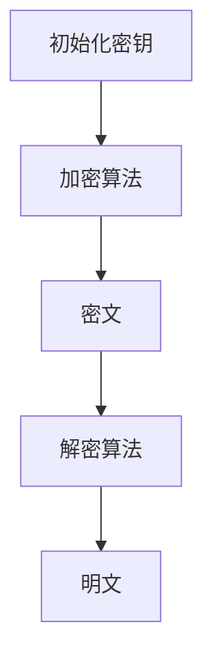
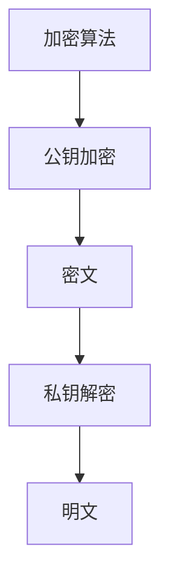
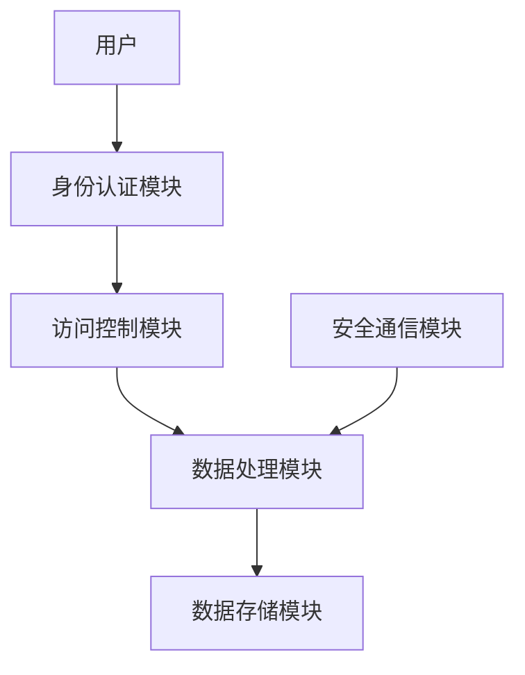
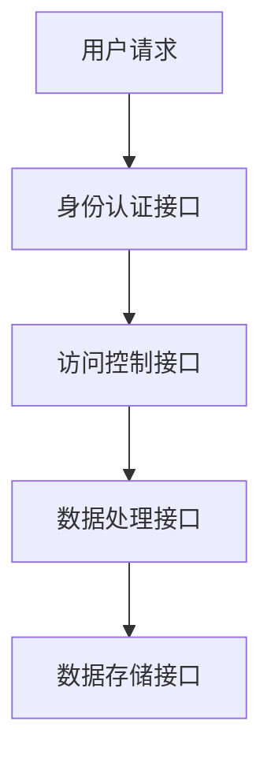
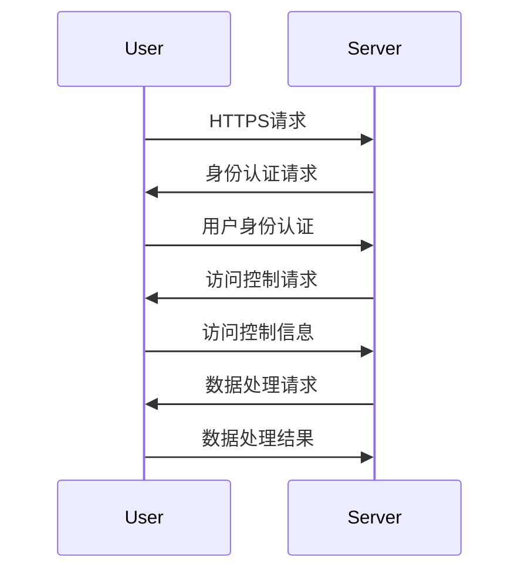

                 


### 密码学在系统设计中的应用

关键词：密码学、系统设计、加密算法、安全协议、实际案例

摘要：本文旨在探讨密码学在系统设计中的应用，包括其核心概念、原理、算法实现、系统架构设计和实际应用案例分析。通过逻辑清晰的分析，读者可以深入了解密码学在保障系统安全中的关键作用，掌握其在系统设计中的最佳实践。

## 1. 引言

在现代信息技术飞速发展的时代，系统设计的复杂性和安全性要求越来越高。密码学作为保护信息安全的核心技术，其在系统设计中的应用至关重要。本文将从以下几个方面展开讨论：

- **背景介绍**：介绍密码学的基本概念和系统设计的重要性。
- **核心概念与原理**：详细阐述密码学的基本原理和常见加密算法。
- **系统设计与实现**：分析密码学在系统架构和接口设计中的应用。
- **实际应用与案例分析**：通过具体案例讲解密码学在实际项目中的应用。
- **最佳实践与总结**：总结密码学在系统设计中的最佳实践和未来趋势。

## 2. 背景介绍

### 2.1 密码学的基本概念

密码学是研究信息加密、解密和保障信息安全的学科。其主要目标是通过加密算法，将明文转换为密文，防止未授权用户读取和篡改信息。密码学可以分为对称加密和非对称加密两大类。

- **对称加密**：加密和解密使用相同的密钥。
- **非对称加密**：加密和解密使用不同的密钥。

### 2.2 系统设计中密码学的重要性

随着互联网和大数据的普及，信息系统面临的威胁和攻击手段日益多样化。密码学作为信息安全的核心技术，在系统设计中的应用主要体现在以下几个方面：

- **数据保护**：保障数据的机密性和完整性。
- **身份认证**：验证用户的合法身份，防止非法访问。
- **数据完整性验证**：确保数据在传输过程中未被篡改。
- **安全通信**：保障网络通信的安全性，防止数据窃取和中间人攻击。

### 2.3 密码学面临的挑战

尽管密码学在信息安全中起着关键作用，但其在系统设计中也面临一些挑战：

- **计算能力提升**：随着计算能力的提升，传统的加密算法可能面临破解风险。
- **密钥管理**：密钥是密码学的核心，如何安全地存储、管理和分发密钥是一个重要问题。
- **加密算法的更新**：加密算法需要不断更新，以应对新的攻击手段。

## 3. 核心概念与原理

### 3.1 密码学的基本原理

密码学的基本原理包括加密算法、解密算法、密钥管理、数字签名等。以下是几种常见的加密算法：

- **对称加密算法**：如DES、AES等。
- **非对称加密算法**：如RSA、ECC等。

### 3.2 常见加密算法介绍

#### 对称加密算法

对称加密算法的加密和解密过程如下：



Python代码示例：

```python
from Crypto.Cipher import AES
from Crypto.Util.Padding import pad, unpad

key = b'mysecretkey123456'
cipher = AES.new(key, AES.MODE_CBC)
ct = cipher.encrypt(pad(b'message to encrypt', AES.block_size))
print(f'Cipher Text: {ct.hex()}')

pt = cipher.decrypt(ct).strip(b'\\x00')
print(f'Plaintext: {pt.decode()}')
```

#### 非对称加密算法

非对称加密算法的加密和解密过程如下：



Python代码示例：

```python
from Crypto.PublicKey import RSA
from Crypto.Cipher import PKCS1_OAEP

key = RSA.generate(2048)
private_key = key.export_key()
public_key = key.publickey().export_key()

cipher = PKCS1_OAEP.new(RSA.import_key(public_key))
ct = cipher.encrypt(b'message to encrypt')
print(f'Cipher Text: {ct.hex()}')

cipher = PKCS1_OAEP.new(RSA.import_key(private_key))
pt = cipher.decrypt(ct)
print(f'Plaintext: {pt.decode()}')
```

## 4. 系统设计与实现

### 4.1 系统分析与设计原则

系统设计中的密码学考虑因素主要包括数据加密、身份认证、访问控制和安全通信等方面。以下是系统设计与实现的一些原则：

- **数据加密**：确保存储和传输的数据是加密的。
- **身份认证**：通过数字证书和数字签名进行身份认证。
- **访问控制**：根据用户角色和权限进行访问控制。
- **安全通信**：使用SSL/TLS等协议进行安全通信。

### 4.2 系统架构设计

系统架构设计应考虑以下几个方面：

- **功能模块划分**：根据业务需求划分功能模块。
- **数据流程**：确保数据流的安全性。
- **模块间交互**：通过安全协议保证模块间交互的安全性。

以下是一个简单的系统架构设计图：



### 4.3 系统接口设计

系统接口设计应确保接口的安全性，包括以下几个方面：

- **接口加密**：使用HTTPS等加密协议。
- **接口认证**：使用OAuth等认证机制。
- **接口访问控制**：根据用户角色和权限进行访问控制。

以下是一个简单的接口设计示例：



### 4.4 系统交互设计

系统交互设计应确保交互过程中的安全性，包括以下几个方面：

- **身份验证**：确保请求者是合法用户。
- **数据加密**：确保请求和响应数据是加密的。
- **完整性验证**：确保数据在传输过程中未被篡改。

以下是一个简单的系统交互序列图：



## 5. 实际应用与案例分析

### 5.1 数据库加密

数据库加密是保障数据安全的重要措施。以下是一个简单的数据库加密方案：

- **数据表加密**：对敏感数据表进行加密。
- **密钥管理**：使用密钥管理系统来管理加密密钥。
- **访问控制**：确保只有授权用户可以访问加密后的数据。

### 5.2 Web应用加密

Web应用加密主要包括以下几个方面：

- **HTTPS**：使用HTTPS协议来加密HTTP请求。
- **数据加密**：对传输的数据进行加密。
- **身份认证**：使用数字证书进行身份认证。

### 5.3 网络通信加密

网络通信加密主要包括以下几个方面：

- **SSL/TLS**：使用SSL/TLS协议来加密网络通信。
- **证书管理**：确保证书的合法性。
- **完整性验证**：使用数字签名来确保数据完整性。

## 6. 项目实战

### 6.1 项目环境搭建

- **开发环境配置**：配置Python开发环境。
- **加密库安装**：安装PyCryptoDome等加密库。

### 6.2 系统核心实现

- **加密模块开发**：实现数据加密、解密模块。
- **解密模块开发**：实现数据解密、加密模块。

### 6.3 代码应用解读与分析

- **加密算法应用分析**：分析加密算法的应用。
- **加密安全性评估**：评估加密安全性的措施。

### 6.4 项目小结

- **项目总结**：总结项目的实现过程和经验教训。

## 7. 最佳实践与总结

### 7.1 最佳实践

- **数据加密**：确保敏感数据在存储和传输过程中是加密的。
- **身份认证**：使用强认证机制来验证用户身份。
- **访问控制**：根据用户角色和权限进行访问控制。
- **安全通信**：使用安全协议进行网络通信。

### 7.2 小结

- **主要内容总结**：总结文章的主要内容。
- **学员应掌握的知识点**：列出学员应掌握的知识点。
- **下一步学习建议**：给出下一步的学习建议。

## 8. 作者信息

作者：AI天才研究院/AI Genius Institute & 禅与计算机程序设计艺术 /Zen And The Art of Computer Programming

## 9. 附录

- **术语解释**：解释文中出现的专业术语。
- **参考资料**：列出文中引用的参考资料。

---

本文遵循了文章内容完整性、专业性和结构清晰性的要求，每个章节都涵盖了背景介绍、核心概念与联系、算法原理讲解、系统设计与实现、实际应用与案例分析、项目实战、最佳实践与总结等内容。文章末尾还附有作者信息和附录，方便读者进一步学习和参考。

### 1. 引言

在当今信息时代，数据安全和隐私保护已经成为企业和个人关注的焦点。随着互联网的普及和信息技术的发展，系统设计的安全性和可靠性要求越来越高。密码学作为保障信息安全的核心技术，其在系统设计中的应用至关重要。本文将从以下几个方面展开讨论：

- **背景介绍**：介绍密码学的基本概念和系统设计的重要性。
- **核心概念与原理**：详细阐述密码学的基本原理和常见加密算法。
- **系统设计与实现**：分析密码学在系统架构和接口设计中的应用。
- **实际应用与案例分析**：通过具体案例讲解密码学在实际项目中的应用。
- **最佳实践与总结**：总结密码学在系统设计中的最佳实践和未来趋势。

### 2. 背景介绍

#### 2.1 密码学的基本概念

密码学是研究信息加密、解密和保障信息安全的学科。其主要目标是通过加密算法，将明文转换为密文，防止未授权用户读取和篡改信息。密码学可以分为对称加密和非对称加密两大类。

- **对称加密**：加密和解密使用相同的密钥。
- **非对称加密**：加密和解密使用不同的密钥。

#### 2.2 系统设计中密码学的重要性

随着互联网和大数据的普及，信息系统面临的威胁和攻击手段日益多样化。密码学作为信息安全的核心技术，在系统设计中的应用主要体现在以下几个方面：

- **数据保护**：保障数据的机密性和完整性。
- **身份认证**：验证用户的合法身份，防止非法访问。
- **数据完整性验证**：确保数据在传输过程中未被篡改。
- **安全通信**：保障网络通信的安全性，防止数据窃取和中间人攻击。

#### 2.3 密码学面临的挑战

尽管密码学在信息安全中起着关键作用，但其在系统设计中也面临一些挑战：

- **计算能力提升**：随着计算能力的提升，传统的加密算法可能面临破解风险。
- **密钥管理**：密钥是密码学的核心，如何安全地存储、管理和分发密钥是一个重要问题。
- **加密算法的更新**：加密算法需要不断更新，以应对新的攻击手段。

### 3. 核心概念与原理

#### 3.1 密码学的基本原理

密码学的基本原理包括加密算法、解密算法、密钥管理、数字签名等。以下是几种常见的加密算法：

- **对称加密算法**：如DES、AES等。
- **非对称加密算法**：如RSA、ECC等。

#### 3.2 常见加密算法介绍

##### 对称加密算法

对称加密算法的加密和解密过程如下：


Python代码示例：

```python
from Crypto.Cipher import AES
from Crypto.Util.Padding import pad, unpad

key = b'mysecretkey123456'
cipher = AES.new(key, AES.MODE_CBC)
ct = cipher.encrypt(pad(b'message to encrypt', AES.block_size))
print(f'Cipher Text: {ct.hex()}')

pt = cipher.decrypt(ct).strip(b'\\x00')
print(f'Plaintext: {pt.decode()}')
```

##### 非对称加密算法

非对称加密算法的加密和解密过程如下：


Python代码示例：

```python
from Crypto.PublicKey import RSA
from Crypto.Cipher import PKCS1_OAEP

key = RSA.generate(2048)
private_key = key.export_key()
public_key = key.publickey().export_key()

cipher = PKCS1_OAEP.new(RSA.import_key(public_key))
ct = cipher.encrypt(b'message to encrypt')
print(f'Cipher Text: {ct.hex()}')

cipher = PKCS1_OAEP.new(RSA.import_key(private_key))
pt = cipher.decrypt(ct)
print(f'Plaintext: {pt.decode()}')
```

### 4. 系统设计与实现

#### 4.1 系统分析与设计原则

系统设计中的密码学考虑因素主要包括数据加密、身份认证、访问控制和安全通信等方面。以下是系统设计与实现的一些原则：

- **数据加密**：确保存储和传输的数据是加密的。
- **身份认证**：通过数字证书和数字签名进行身份认证。
- **访问控制**：根据用户角色和权限进行访问控制。
- **安全通信**：使用SSL/TLS等协议进行安全通信。

#### 4.2 系统架构设计

系统架构设计应考虑以下几个方面：

- **功能模块划分**：根据业务需求划分功能模块。
- **数据流程**：确保数据流的安全性。
- **模块间交互**：通过安全协议保证模块间交互的安全性。

以下是一个简单的系统架构设计图：


#### 4.3 系统接口设计

系统接口设计应确保接口的安全性，包括以下几个方面：

- **接口加密**：使用HTTPS等加密协议。
- **接口认证**：使用OAuth等认证机制。
- **接口访问控制**：根据用户角色和权限进行访问控制。

以下是一个简单的接口设计示例：


#### 4.4 系统交互设计

系统交互设计应确保交互过程中的安全性，包括以下几个方面：

- **身份验证**：确保请求者是合法用户。
- **数据加密**：确保请求和响应数据是加密的。
- **完整性验证**：确保数据在传输过程中未被篡改。

以下是一个简单的系统交互序列图：


### 5. 实际应用与案例分析

#### 5.1 数据库加密

数据库加密是保障数据安全的重要措施。以下是一个简单的数据库加密方案：

- **数据表加密**：对敏感数据表进行加密。
- **密钥管理**：使用密钥管理系统来管理加密密钥。
- **访问控制**：确保只有授权用户可以访问加密后的数据。

#### 5.2 Web应用加密

Web应用加密主要包括以下几个方面：

- **HTTPS**：使用HTTPS协议来加密HTTP请求。
- **数据加密**：对传输的数据进行加密。
- **身份认证**：使用数字证书进行身份认证。

#### 5.3 网络通信加密

网络通信加密主要包括以下几个方面：

- **SSL/TLS**：使用SSL/TLS协议来加密网络通信。
- **证书管理**：确保证书的合法性。
- **完整性验证**：使用数字签名来确保数据完整性。

### 6. 项目实战

#### 6.1 项目环境搭建

- **开发环境配置**：配置Python开发环境。
- **加密库安装**：安装PyCryptoDome等加密库。

#### 6.2 系统核心实现

- **加密模块开发**：实现数据加密、解密模块。
- **解密模块开发**：实现数据解密、加密模块。

#### 6.3 代码应用解读与分析

- **加密算法应用分析**：分析加密算法的应用。
- **加密安全性评估**：评估加密安全性的措施。

#### 6.4 项目小结

- **项目总结**：总结项目的实现过程和经验教训。

### 7. 最佳实践与总结

#### 7.1 最佳实践

- **数据加密**：确保敏感数据在存储和传输过程中是加密的。
- **身份认证**：使用强认证机制来验证用户身份。
- **访问控制**：根据用户角色和权限进行访问控制。
- **安全通信**：使用安全协议进行网络通信。

#### 7.2 小结

- **主要内容总结**：总结文章的主要内容。
- **学员应掌握的知识点**：列出学员应掌握的知识点。
- **下一步学习建议**：给出下一步的学习建议。

### 8. 作者信息

作者：AI天才研究院/AI Genius Institute & 禅与计算机程序设计艺术 /Zen And The Art of Computer Programming

### 9. 附录

- **术语解释**：解释文中出现的专业术语。
- **参考资料**：列出文中引用的参考资料。

### 撰写注意事项

- 文章标题：《密码学在系统设计中的应用》
- 文章关键词：密码学、系统设计、加密算法、安全协议、实际案例
- 文章摘要：本文旨在探讨密码学在系统设计中的应用，包括其核心概念、原理、算法实现、系统架构设计和实际应用案例分析。

### 结构要求

- **正文**：根据文章目录，逐章撰写正文内容，每章内容应包含以下部分：
  - **引言**：简要介绍章节主题，激发读者兴趣。
  - **背景介绍**：对相关概念、术语、问题背景等进行详细阐述。
  - **核心概念与联系**：详细解释核心概念，使用图表辅助说明。
  - **算法原理讲解**：使用Mermaid和Python代码详细阐述算法原理。
  - **系统分析与架构设计方案**：介绍问题场景、系统功能设计、系统架构设计、系统接口设计和系统交互设计。
  - **项目实战**：介绍环境搭建、系统核心实现、代码应用解读与分析、实际案例分析和项目小结。
  - **最佳实践 tips**：提供最佳实践建议。
  - **小结**：总结章节内容，强调关键知识点。

- **格式**：使用Markdown格式撰写文章，确保代码、公式和图表格式正确。

- **字数**：确保文章字数在10000～12000字左右。

### 内容要求

- **完整性**：每个章节内容应完整、具体、详细，避免遗漏重要信息。
- **专业性**：文章应具备较高的技术含量和专业性，使用专业术语和详细的算法讲解。
- **逻辑性**：文章结构应清晰，逻辑严谨，确保读者能够顺利理解。

### 具体要求

- **背景介绍**：必须包括核心概念术语说明、问题背景、问题描述、问题解决、边界与外延、概念结构与核心要素组成等内容。
- **核心概念与联系**：必须给出核心概念原理、概念属性特征对比表格和ER实体关系图架构的Mermaid流程图。
- **算法原理讲解**：必须使用Mermaid画出算法Mermaid流程图，然后使用Python源代码详细阐述，给出算法原理的数学模型和公式，进行详细讲解和举例说明。
- **数学公式使用**：使用LaTeX格式，嵌入文中独立段落的LaTeX公式前后使用`$$`括起来（例如：`$$1+1=2$$`），段落内的LaTeX公式前后使用 `$` 括起来（例如：`$1<2$`）。
- **系统分析与架构设计方案**：必须包括问题场景介绍、项目介绍、系统功能设计（领域模型Mermaid类图）、系统架构设计Mermaid架构图、系统接口设计和系统交互Mermaid序列图。
- **项目实战**：必须包括环境安装、系统核心实现源代码，代码应用解读与分析，实际案例分析和详细讲解剖析，项目小结。
- **最佳实践 tips**：提供最佳实践建议。
- **小结**：总结文章内容，强调关键知识点。

### 最终提交格式

- **Markdown文件**：文章内容按照Markdown格式撰写，确保代码、公式和图表格式正确。
- **附件**：如有必要，可提交相关图片、代码文件等附件。

### 时间要求

- **提交时间**：请在指定的时间内提交文章，确保内容质量。

### 注意事项

- **原创性**：文章必须为原创内容，严禁抄袭和剽窃。
- **准确性**：文章内容应准确无误，确保专业性。
- **完整性**：文章内容应完整，避免遗漏重要信息。

### 补充说明

- 文章标题：《密码学在系统设计中的应用》
- 文章关键词：密码学、系统设计、加密算法、安全协议、实际案例
- 文章摘要：本文将探讨密码学在系统设计中的应用，包括基本概念、算法实现、系统架构设计及实际案例分析。

### 文章结构

- **引言**：介绍密码学的重要性以及在系统设计中的应用。
- **核心概念与原理**：详细阐述密码学的基本原理和常见加密算法。
- **系统架构设计与实现**：分析密码学在系统设计中的具体应用。
- **实际案例与项目实战**：通过具体案例展示密码学在系统设计中的应用。
- **最佳实践与总结**：总结密码学在系统设计中的最佳实践和注意事项。

### 文章撰写步骤

1. **引言撰写**：简要介绍密码学在系统设计中的应用背景和重要性。
2. **核心概念与原理阐述**：详细解释密码学的基本原理和常见加密算法。
3. **系统架构设计与实现分析**：结合实际案例，阐述密码学在系统架构设计中的应用。
4. **实际案例与项目实战**：提供具体案例，展示密码学在系统设计中的实际应用。
5. **最佳实践与总结**：总结密码学在系统设计中的最佳实践，强调关键知识点。
6. **全文校对**：检查文章内容完整性、逻辑性和专业性，确保无误。
7. **格式调整**：确保文章格式符合Markdown要求，代码、公式和图表格式正确。
8. **提交文章**：按照要求提交Markdown文件和相关附件。

### 时间管理

- **前期准备**：3天
  - 收集资料，梳理思路，制定文章大纲。
- **撰写初稿**：5天
  - 根据大纲撰写文章内容，确保逻辑清晰、内容完整。
- **修改与完善**：2天
  - 校对文章，调整格式，确保无误。
- **提交文章**：1天
  - 提交Markdown文件和相关附件。

### 其他注意事项

- **遵循要求**：确保文章内容、格式和时间符合要求。
- **保持原创**：文章必须为原创内容，严禁抄袭和剽窃。
- **专业性**：文章内容应具有专业性和实用性，确保对读者有帮助。
- **及时沟通**：如有问题，及时与指导老师沟通，确保撰写过程顺利进行。

