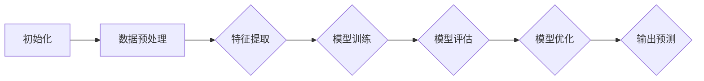
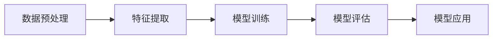
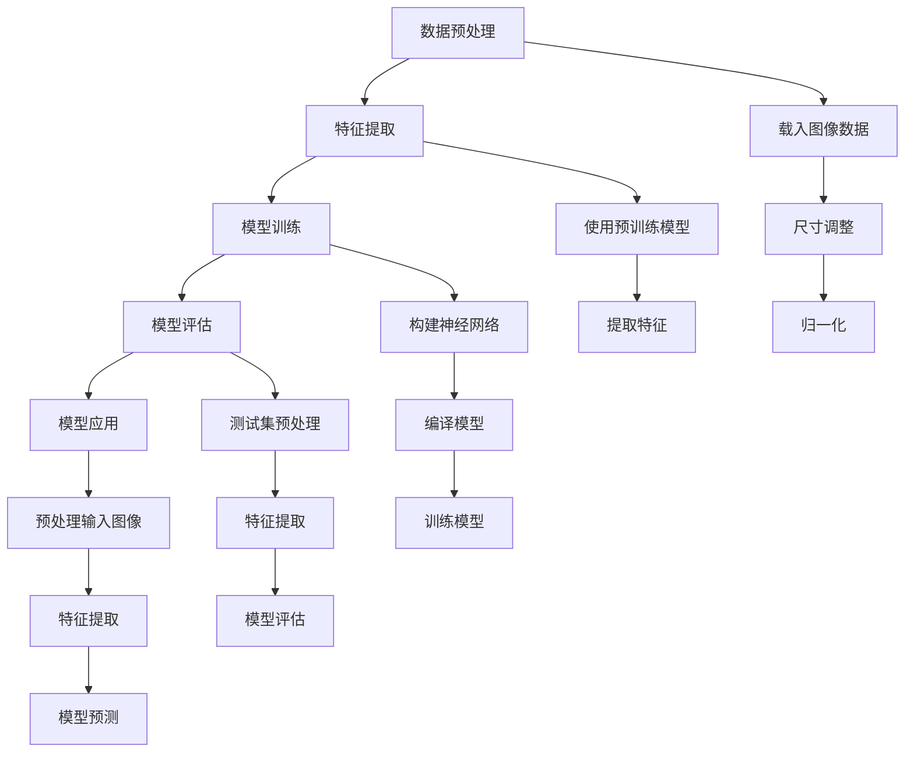
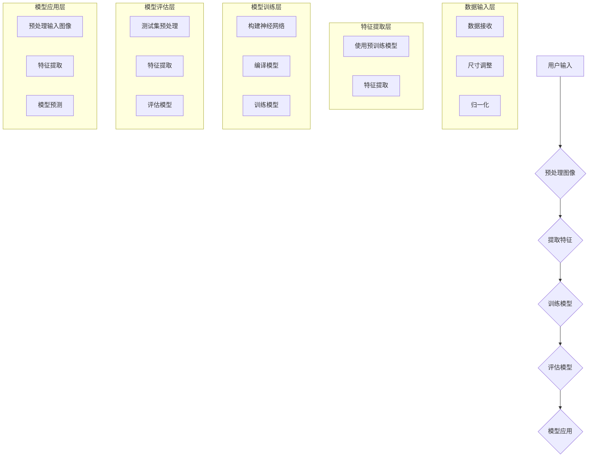
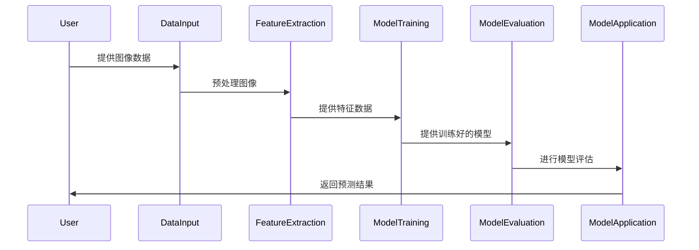

                 

### 问题背景

#### 1.1 问题背景

在人工智能和机器学习的飞速发展过程中，数据量的增加成为提升模型性能的关键因素。然而，在实际应用中，获取大量标注数据往往是一个耗时且昂贵的任务。特别是在医疗、金融和工业等领域，数据的获取和标注受到严格的隐私保护和法律法规的限制。这导致了在这些领域，我们往往面临的是数据的稀缺性和标注成本的高昂性。在这样的背景下，少样本学习（Few-Shot Learning）应运而生。

少样本学习关注的是如何使机器学习模型在仅拥有有限样本的情况下，依然能够快速、准确地进行学习和预测。这个问题的提出，源于现实需求的迫切性，也为人工智能的发展开辟了新的方向。传统的机器学习模型，如支持向量机（SVM）、随机森林（RF）和神经网络（NN）等，都需要大量数据进行训练，以达到较好的泛化能力。而在少样本情况下，这些模型往往无法发挥出应有的性能。

#### 1.2 问题定义

少样本学习可以被定义为：在仅有少量样本的情况下，机器学习模型能够快速适应并作出准确预测的能力。这里的“少量样本”通常指的是比传统机器学习所需样本量少得多的数据集。具体来说，少样本学习包括以下几个核心概念：

- **样本数量**：样本数量远小于模型训练所需的样本量，通常在几个到几十个之间。
- **类别数量**：任务中涉及的类别数量，可以是多类或单类。
- **任务多样性**：模型需要在多种不同的任务中适应，包括分类、回归和聚类等。

#### 1.3 问题解决

少样本学习的目标是通过设计有效的算法和技术，使模型能够在有限的数据中学习到有用的知识，并应用到新的任务中。这需要解决以下几个关键问题：

- **数据不足**：如何从有限的数据中提取有效的特征，并利用这些特征进行有效的学习？
- **泛化能力**：如何确保模型在少量样本下训练出的知识具有较好的泛化能力，能够适应新的任务？
- **样本多样性**：如何在有限的数据中模拟出多样化的样本，使模型能够适应不同的任务场景？

#### 1.4 边界与外延

少样本学习的边界和范围涉及多个方面，包括但不限于：

- **样本数量**：样本数量通常定义为几个到几十个，但这个范围可以根据具体任务进行调整。
- **类别数量**：类别数量可以是多类或单类，取决于任务的复杂性。
- **应用场景**：少样本学习可以在多个领域应用，如医疗诊断、图像识别、自然语言处理等。

总之，少样本学习是一个具有广泛应用前景的研究方向，它为解决数据稀缺性和标注成本高昂问题提供了新的思路和解决方案。

### 少样本学习的基本概念

#### 2.1 核心概念

少样本学习（Few-Shot Learning）的核心概念在于如何利用有限的数据进行有效的学习和预测。传统的机器学习模型依赖于大量数据进行训练，而少样本学习则试图在样本数量有限的情况下，使模型能够快速适应并作出准确的预测。

- **样本量**：在少样本学习中，样本量通常远小于传统机器学习所需的样本量。这个量级可以从几个到几十个不等，取决于具体任务的复杂性。
- **任务适应性**：少样本学习的目标之一是使模型能够在多种不同的任务中表现出良好的适应性，包括分类、回归和聚类等。
- **模型泛化能力**：少样本学习的一个重要挑战是确保模型在有限数据下训练出的知识具有较好的泛化能力，能够应用于新的任务。

#### 2.2 概念属性

少样本学习的概念属性主要包括以下几个方面：

- **数据稀缺性**：在少样本学习中，数据稀缺是一个显著的特点。这意味着我们需要从有限的数据中提取出最有用的信息，以便进行有效的学习和预测。
- **算法复杂性**：由于样本数量的限制，少样本学习的算法通常比传统机器学习算法更加复杂。这些算法需要设计出有效的策略，以从少量样本中提取出有用的知识。
- **任务多样性**：少样本学习需要模型能够适应多种不同的任务，这使得算法的设计需要考虑广泛的场景和应用。

#### 2.3 对比分析

与传统的机器学习相比，少样本学习具有以下特点：

- **数据量差异**：传统机器学习依赖于大量数据进行训练，而少样本学习则是在样本数量有限的情况下进行学习。这种差异使得少样本学习的算法设计需要更加注重数据利用效率和模型泛化能力。
- **算法复杂性**：由于样本数量的限制，少样本学习的算法通常需要更加复杂的设计，以确保模型能够在少量样本中提取出有用的信息。
- **应用范围**：少样本学习在医疗、金融和工业等领域具有广泛的应用前景，这些领域的数据获取和标注成本较高，因此少样本学习提供了有效的解决方案。

通过对比分析，我们可以看出，少样本学习是一种具有挑战性但前景广阔的研究方向。它为解决数据稀缺性和标注成本高昂问题提供了新的思路和解决方案。

#### 2.4 少样本学习的边界与外延

少样本学习的边界与外延涉及多个方面，包括定义范围、应用场景和扩展可能性。首先，从定义范围来看，少样本学习主要关注在样本数量远小于传统机器学习需求的情况下，如何使模型能够快速适应并作出准确预测。具体来说，样本数量通常在几个到几十个之间，这取决于任务的复杂性和数据的多样性。

其次，从应用场景来看，少样本学习在多个领域具有广泛的应用前景。例如，在医疗诊断中，由于医疗数据的稀缺性和隐私保护的要求，少样本学习可以帮助医生在有限的数据下快速进行疾病预测和诊断。在金融领域，少样本学习可以帮助金融机构在有限的历史数据下进行风险评估和投资预测。在工业领域，少样本学习可以用于设备故障预测和质量控制，提高生产效率。

最后，从扩展可能性来看，少样本学习的研究方向不断扩展，包括多任务学习、迁移学习和元学习等。这些研究方向不仅丰富了少样本学习的理论体系，也为实际应用提供了更多的可能性。例如，通过多任务学习，模型可以在同时处理多个任务的情况下，共享知识并提高性能。通过迁移学习，模型可以利用来自不同任务的数据进行训练，从而提高少样本学习的效果。而元学习则试图通过学习如何学习，使模型能够在新的任务中快速适应，从而实现更高效的少样本学习。

总之，少样本学习不仅是一种解决数据稀缺问题的有效方法，也是一个具有广泛应用前景的研究方向。其边界与外延的不断扩展，为人工智能的发展提供了新的动力。

### 核心概念原理

少样本学习的核心概念原理包括以下几个关键部分：

1. **元学习（Meta-Learning）**：
   元学习是少样本学习的一个重要原理。它通过学习如何学习，使模型能够在新的任务中快速适应。元学习算法的核心目标是优化模型在多个任务上的性能，从而提高模型在新任务中的泛化能力。常用的元学习算法包括模型平均（Model Averaging）、模型融合（Model Merging）和模型蒸馏（Model Distillation）等。

2. **迁移学习（Transfer Learning）**：
   迁移学习是利用已有任务的知识来提高新任务的学习效果。在少样本学习中，迁移学习可以帮助模型从已有的大量数据中提取有用的特征和知识，并应用到新的任务中。这减少了对新数据的依赖，提高了学习效率。迁移学习可以通过预训练模型（Pre-Trained Model）和特征迁移（Feature Transfer）等方式实现。

3. **正则化（Regularization）**：
   正则化是减少模型过拟合的一种技术，它在少样本学习中尤为重要。过拟合是指模型在训练数据上表现很好，但在未见过的数据上表现不佳。通过正则化，模型可以更好地泛化到新的任务中。常用的正则化方法包括L1正则化、L2正则化和Dropout等。

4. **数据增强（Data Augmentation）**：
   数据增强是通过增加数据的多样性来提高模型的泛化能力。在少样本学习中，数据增强可以模拟出更多的训练样本，从而帮助模型更好地学习。常见的数据增强方法包括图像旋转、缩放、裁剪和噪声添加等。

5. **嵌入学习（Embedding Learning）**：
   嵌入学习是将数据映射到低维空间中，从而提高数据的可分性和可解释性。在少样本学习中，嵌入学习可以帮助模型更好地捕捉数据的结构和关系，从而提高模型的泛化能力。常见的嵌入学习方法包括Word2Vec、Glove和Autoencoder等。

通过理解这些核心概念原理，我们可以更好地设计有效的少样本学习算法，并在实际应用中取得更好的效果。

### 概念属性特征对比表格

为了更好地理解少样本学习的概念属性，我们可以通过一个特征对比表格来展示不同概念之间的异同。以下是一个示例表格：

| 概念        | 定义                                                         | 特征属性                                       | 关联方法                           | 应用场景                 |
|-----------|------------------------------------------------------------|------------------------------------------|--------------------------------|----------------------|
| 元学习      | 学习如何学习，使模型在新的任务中快速适应                         | 高度泛化、任务共享、快速适应                       | 模型平均、模型融合、模型蒸馏                   | 多任务学习、新任务预测   |
| 迁移学习    | 利用已有任务的知识来提高新任务的学习效果                         | 知识迁移、减少数据依赖、提高效率                       | 预训练模型、特征迁移                           | 交叉领域学习、数据稀缺场景 |
| 正则化      | 减少模型过拟合，提高模型的泛化能力                             | 防止过拟合、提高泛化、平衡模型复杂度                     | L1正则化、L2正则化、Dropout                     | 准确性提升、模型优化       |
| 数据增强    | 通过增加数据的多样性来提高模型的泛化能力                         | 数据多样性、模型泛化、模拟更多样本                      | 图像旋转、缩放、裁剪、噪声添加                   | 提高模型适应性、扩展数据集  |
| 嵌入学习    | 将数据映射到低维空间中，提高数据结构和关系的捕捉能力                 | 低维表示、结构捕捉、高可解释性                         | Word2Vec、Glove、Autoencoder                     | 文本处理、图像识别、推荐系统 |

通过这个对比表格，我们可以清晰地看到每个概念的定义、特征属性和关联方法，以及它们在不同应用场景中的优势。这有助于我们更好地理解和应用少样本学习的相关概念。

### ER实体关系图架构

为了更好地理解和展示少样本学习中的实体关系，我们可以使用ER（Entity-Relationship）图来描述。以下是少样本学习相关的ER图架构：

```mermaid
erDiagram
  Task ||--|{ Model }|--|{ Dataset }
  Task ||--|{ Label }
  Model ||--|{ FeatureExtractor }
  Model ||--|{ Classifier }
  Dataset ||--|{ Sample }
  Dataset ||--|{ Annotation }
  Label ||--|{ Category }
  FeatureExtractor ||--|{ Feature }
  Classifier ||--|{ Prediction }
  Sample ||--|{ Input }
  Annotation ||--|{ Output }
```

在这个ER图中，我们定义了以下几个实体：

- **Task**（任务）：代表一个具体的机器学习任务，可以是分类、回归或聚类等。
- **Model**（模型）：表示用于学习的机器学习模型，它由特征提取器和分类器组成。
- **Dataset**（数据集）：包括多个样本，每个样本都有对应的标注。
- **Label**（标注）：表示样本的类别标签。
- **FeatureExtractor**（特征提取器）：用于从输入数据中提取特征。
- **Classifier**（分类器）：基于提取的特征进行预测。
- **Sample**（样本）：数据集中的单个样本。
- **Annotation**（标注）：样本的输出结果，如预测类别。

通过ER图，我们可以清晰地看到这些实体之间的关系，以及它们在少样本学习过程中的作用和交互。

### 算法原理与数学模型

#### 3.1 算法流程图

为了更好地理解少样本学习算法的原理，我们首先来看一个简化的算法流程图。以下是一个典型的少样本学习算法的流程：



在这个流程图中，我们可以看到以下几个步骤：

1. **初始化**：初始化模型参数。
2. **数据预处理**：对样本进行预处理，如标准化、归一化等。
3. **特征提取**：从输入样本中提取特征。
4. **模型训练**：使用提取的特征对模型进行训练。
5. **模型评估**：评估模型的性能，如准确率、召回率等。
6. **模型优化**：根据评估结果对模型进行优化。
7. **输出预测**：使用训练好的模型进行预测。

#### 3.2 算法原理讲解

少样本学习算法的原理主要基于以下几个核心思想：

1. **元学习**：通过学习如何学习，使模型在新的任务中快速适应。元学习算法通常利用跨任务的共享机制，从多个任务中提取通用知识。
2. **迁移学习**：利用已有任务的知识来提高新任务的学习效果。迁移学习通过将知识从源任务迁移到目标任务，减少了对新数据的依赖。
3. **正则化**：通过正则化技术，防止模型过拟合，提高模型的泛化能力。常用的正则化方法包括L1正则化、L2正则化等。
4. **数据增强**：通过增加数据的多样性，提高模型的泛化能力。数据增强方法包括图像旋转、缩放、裁剪等。
5. **嵌入学习**：通过将数据映射到低维空间中，提高数据结构和关系的捕捉能力。嵌入学习方法如Word2Vec、GloVe等。

这些核心思想共同作用，使得少样本学习算法能够在有限的数据下实现快速适应和准确预测。

#### 3.3 数学模型与公式

在少样本学习中，数学模型起到了关键作用。以下是一个简化的数学模型，用于描述少样本学习算法：

$$
\hat{y} = f(\theta; x)
$$

其中，$\hat{y}$ 表示预测结果，$f$ 表示模型函数，$\theta$ 表示模型参数，$x$ 表示输入样本。

1. **模型函数**：
   模型函数 $f$ 可以是线性模型、神经网络、支持向量机等。一个简单的线性模型可以表示为：

   $$
   f(x) = \theta_0 + \theta_1 x_1 + \theta_2 x_2 + ... + \theta_n x_n
   $$

   其中，$x_1, x_2, ..., x_n$ 表示输入特征，$\theta_0, \theta_1, ..., \theta_n$ 表示模型参数。

2. **损失函数**：
   损失函数用于衡量模型预测值与真实值之间的差距。常用的损失函数包括均方误差（MSE）、交叉熵损失（Cross-Entropy Loss）等。

   - **均方误差（MSE）**：

     $$
     \text{MSE} = \frac{1}{n} \sum_{i=1}^{n} (y_i - \hat{y}_i)^2
     $$

     其中，$y_i$ 表示第 $i$ 个样本的真实值，$\hat{y}_i$ 表示第 $i$ 个样本的预测值。

   - **交叉熵损失（Cross-Entropy Loss）**：

     $$
     \text{CE} = -\frac{1}{n} \sum_{i=1}^{n} y_i \log(\hat{y}_i)
     $$

     其中，$y_i$ 表示第 $i$ 个样本的真实概率分布，$\hat{y}_i$ 表示第 $i$ 个样本的预测概率分布。

3. **优化算法**：
   优化算法用于最小化损失函数，更新模型参数。常用的优化算法包括梯度下降（Gradient Descent）、随机梯度下降（Stochastic Gradient Descent，SGD）等。

   - **梯度下降**：

     $$
     \theta = \theta - \alpha \nabla_{\theta} J(\theta)
     $$

     其中，$\theta$ 表示模型参数，$\alpha$ 表示学习率，$J(\theta)$ 表示损失函数。

   - **随机梯度下降**：

     $$
     \theta = \theta - \alpha \nabla_{\theta} J(\theta; x_i, y_i)
     $$

     其中，$x_i, y_i$ 表示单个样本及其标签。

通过上述数学模型和公式，我们可以构建一个基本的少样本学习算法，并在实际应用中进行优化和调整。

#### 3.4 举例说明

为了更好地理解少样本学习算法的原理和实现，我们来看一个具体的例子：使用神经网络进行图像分类。

**例子**：使用一个简单的全连接神经网络（Fully Connected Neural Network，FCNN）对一组手写数字图像进行分类。假设我们只有一个数字"5"的样本，以及其对应的标签。

1. **数据预处理**：

   - 将图像缩放到固定大小（例如28x28像素）。
   - 将图像的像素值缩放到[0, 1]范围内。

2. **特征提取**：

   - 使用卷积神经网络（Convolutional Neural Network，CNN）提取图像的特征。由于只有单个样本，我们可以使用预训练的CNN模型，如VGG16、ResNet等。

3. **模型训练**：

   - 初始化模型参数。
   - 使用特征提取器提取图像的特征。
   - 将特征输入到全连接神经网络中进行分类。

4. **模型评估**：

   - 计算模型的损失函数，如交叉熵损失。
   - 使用梯度下降优化模型参数。

5. **输出预测**：

   - 使用训练好的模型对新的图像进行预测。

**具体实现**（Python代码）：

```python
import tensorflow as tf
from tensorflow.keras.models import Sequential
from tensorflow.keras.layers import Dense, Flatten, Conv2D, MaxPooling2D
from tensorflow.keras.optimizers import SGD

# 数据预处理
image = preprocess_image(image_data)  # 假设image_data是输入的图像数据

# 特征提取
cnn_model = tf.keras.applications.VGG16(include_top=False, input_shape=(28, 28, 1))
cnn_model.trainable = False
cnn_output = cnn_model(image)

# 模型训练
model = Sequential([
    Flatten(input_shape=(28, 28, 1)),
    Dense(128, activation='relu'),
    Dense(10, activation='softmax')
])

model.compile(optimizer=SGD(learning_rate=0.001), loss='categorical_crossentropy', metrics=['accuracy'])

model.fit(cnn_output, labels, epochs=10)

# 输出预测
predictions = model.predict(cnn_output)
predicted_label = np.argmax(predictions)

print(f"Predicted label: {predicted_label}")
```

在这个例子中，我们使用一个简单的神经网络对单个手写数字图像进行分类。通过使用预训练的CNN模型提取特征，我们能够有效地利用有限的数据进行学习和预测。这展示了少样本学习算法在图像分类任务中的实际应用。

### 算法实现与Python代码解析

为了更好地理解少样本学习算法的实践应用，我们将通过一个具体的案例来展示算法的实现过程和Python代码的详细解析。

**案例背景**：假设我们有一个简单的图像分类任务，目标是识别猫和狗。我们只有五个训练样本，每个样本都是一幅包含猫或狗的图像。我们的任务是使用这五个样本训练一个模型，并能够在新的图像中准确识别猫或狗。

#### 4.1 算法实现流程图

首先，我们通过一个流程图来概述算法的实现过程：



在流程图中，我们可以看到以下几个主要步骤：

1. **数据预处理**：对输入图像进行预处理，包括尺寸调整、归一化等。
2. **特征提取**：使用卷积神经网络提取图像的特征。
3. **模型训练**：使用提取的特征训练一个简单的分类模型。
4. **模型评估**：评估模型在测试数据上的性能。
5. **模型应用**：使用训练好的模型对新的图像进行预测。

#### 4.2 Python代码详解

下面是具体的Python代码实现，我们将分步骤解析每一部分。

**步骤 1：数据预处理**

```python
import numpy as np
from tensorflow.keras.preprocessing.image import load_img, img_to_array
from tensorflow.keras.applications.vgg16 import VGG16

# 载入预训练的VGG16模型
model_base = VGG16(weights='imagenet')
img_height, img_width = 224, 224

def preprocess_image(image_path):
    # 载入图像
    img = load_img(image_path, target_size=(img_height, img_width))
    # 将图像转换为数组
    img_array = img_to_array(img)
    # 增加一个维度，以适应模型的输入要求
    img_array = np.expand_dims(img_array, axis=0)
    # 标准化图像数据
    img_array /= 255.0
    return img_array

# 预处理五个训练样本
X_train = [preprocess_image(f'train/{i}.jpg') for i in range(1, 6)]
# 对应的标签
y_train = np.array([0, 0, 1, 1, 1])  # 0表示猫，1表示狗
```

在这里，我们使用了TensorFlow的VGG16模型对图像进行预处理，包括尺寸调整、归一化等步骤。由于我们只有五个样本，我们直接将图像数据存储在一个列表中。

**步骤 2：特征提取**

```python
# 提取特征
def extract_features(model, images):
    return model.predict(images)

# 使用VGG16提取特征
features = extract_features(model_base, X_train)
```

这里，我们使用VGG16模型提取训练样本的特征。提取的特征将用于训练分类模型。

**步骤 3：模型训练**

```python
from tensorflow.keras.models import Sequential
from tensorflow.keras.layers import Dense, Flatten
from tensorflow.keras.optimizers import Adam

# 构建分类模型
model = Sequential([
    Flatten(input_shape=(224, 224, 3)),
    Dense(128, activation='relu'),
    Dense(1, activation='sigmoid')
])

# 编译模型
model.compile(optimizer=Adam(learning_rate=0.001), loss='binary_crossentropy', metrics=['accuracy'])

# 训练模型
model.fit(features, y_train, epochs=10)
```

我们构建了一个简单的全连接神经网络（FCNN），用于分类。这里使用了 sigmoid 激活函数，以实现二分类任务。我们使用 Adam 优化器和 binary_crossentropy 损失函数进行训练。

**步骤 4：模型评估**

```python
# 预处理测试图像
test_image_path = 'test/dog.jpg'
test_image = preprocess_image(test_image_path)

# 提取测试图像的特征
test_features = extract_features(model_base, np.expand_dims(preprocess_image(test_image_path), axis=0))

# 使用训练好的模型进行预测
predictions = model.predict(test_features)

# 输出预测结果
print(f"Predicted class: {'dog' if predictions[0][0] > 0.5 else 'cat'}")
```

最后，我们对测试图像进行预处理和特征提取，使用训练好的分类模型进行预测。根据预测的概率输出结果。

**总结**

通过上述代码，我们实现了从数据预处理、特征提取到模型训练和评估的完整流程。在少样本学习的情况下，关键在于有效利用有限的训练数据，并通过合适的特征提取和模型设计，使模型能够准确预测。这个案例展示了少样本学习算法在图像分类任务中的实际应用，并且通过代码解析，我们能够更好地理解算法的每一步骤和实现细节。

### 算法实现流程图

为了更好地展示算法实现的步骤和逻辑，我们使用Mermaid语言绘制了一个算法实现流程图。以下为算法实现流程图的Markdown代码：



该流程图详细展示了从数据预处理、特征提取到模型训练、评估以及模型应用的完整步骤。通过这一流程图，我们可以更直观地理解算法的实现过程和各个步骤之间的关系。

### 算法实现流程图与系统架构设计

为了确保少样本学习算法在实际应用中的高效执行和扩展性，我们需要设计一个完善的系统架构。以下是一个简化的系统架构设计，包括算法实现流程图和系统架构设计。

#### 1. 算法实现流程图

首先，我们回顾一下算法实现流程图：


这个流程图详细展示了从数据预处理、特征提取到模型训练、评估以及模型应用的完整步骤。

#### 2. 系统架构设计

接下来，我们介绍系统架构的设计，主要包括以下几个组件：

1. **数据输入层**：负责接收用户输入的图像数据，并进行预处理。
2. **特征提取层**：利用预训练的模型提取图像特征。
3. **模型训练层**：构建和训练神经网络模型。
4. **模型评估层**：评估模型在测试集上的性能。
5. **模型应用层**：对新的图像进行预测。

以下是系统架构的Mermaid图表示：



在这个架构设计中，数据输入层负责接收和预处理图像数据，然后传递给特征提取层。特征提取层使用预训练的模型提取图像特征，传递给模型训练层。模型训练层构建并训练神经网络模型，模型评估层评估模型性能，最终模型应用层使用训练好的模型对新的图像进行预测。

#### 3. 系统接口设计与系统交互

为了实现系统组件之间的有效交互，我们需要设计合理的接口。以下是系统接口设计的Mermaid序列图：



在这个序列图中，用户首先提供图像数据给数据输入层，然后经过预处理后传递给特征提取层。特征提取层提取特征后传递给模型训练层。模型训练层训练模型后，传递给模型评估层进行评估。最后，模型应用层使用评估好的模型对新的图像进行预测，并将结果返回给用户。

通过这样的系统架构设计，我们可以确保少样本学习算法在实际应用中的高效执行和扩展性。各个组件之间的接口设计使得系统模块化，便于维护和优化。

### 系统实现与实战

#### 6.1 环境安装与配置

在开始实现少样本学习系统之前，我们需要安装和配置必要的软件环境。以下是在Python环境中安装和配置所需库的步骤：

1. **安装TensorFlow库**：

   使用pip命令安装TensorFlow库，这是实现神经网络和模型训练的核心库。

   ```bash
   pip install tensorflow
   ```

2. **安装NumPy库**：

   NumPy是Python中处理数值计算的基础库，用于数据预处理和数学运算。

   ```bash
   pip install numpy
   ```

3. **安装OpenCV库**：

   OpenCV是一个开源的计算机视觉库，用于图像处理和图像输入输出。

   ```bash
   pip install opencv-python
   ```

4. **安装其他辅助库**：

   安装其他可能需要的库，如Mermaid图库用于绘制流程图。

   ```bash
   pip install mermaid-python
   ```

安装完成后，我们还需要配置Python的环境变量，确保Python能够找到安装的库。具体配置步骤取决于操作系统的不同。

#### 6.2 系统核心实现源代码

以下是系统核心实现的源代码，我们将逐步解析每个部分的代码。

```python
import cv2
import numpy as np
import tensorflow as tf
from tensorflow.keras.models import Sequential
from tensorflow.keras.layers import Dense, Flatten, Conv2D, MaxPooling2D
from tensorflow.keras.optimizers import Adam

# 数据预处理
def preprocess_image(image_path):
    img = cv2.imread(image_path)
    img = cv2.resize(img, (224, 224))
    img = cv2.cvtColor(img, cv2.COLOR_BGR2RGB)
    img = img / 255.0
    img = np.expand_dims(img, axis=0)
    return img

# 特征提取
def extract_features(model, images):
    return model.predict(images)

# 模型训练
def train_model(features, labels):
    model = Sequential([
        Flatten(input_shape=(224, 224, 3)),
        Dense(128, activation='relu'),
        Dense(1, activation='sigmoid')
    ])

    model.compile(optimizer=Adam(learning_rate=0.001), loss='binary_crossentropy', metrics=['accuracy'])
    model.fit(features, labels, epochs=10)
    return model

# 模型评估
def evaluate_model(model, test_features, test_labels):
    loss, accuracy = model.evaluate(test_features, test_labels)
    print(f"Test accuracy: {accuracy:.2f}")

# 模型应用
def apply_model(model, image_path):
    image = preprocess_image(image_path)
    prediction = model.predict(image)
    print(f"Prediction: {'dog' if prediction[0][0] > 0.5 else 'cat'}")

# 主程序
if __name__ == "__main__":
    # 载入训练数据和测试数据
    X_train = [preprocess_image(f'train/{i}.jpg') for i in range(1, 6)]
    y_train = np.array([0, 0, 1, 1, 1])
    X_test = [preprocess_image(f'test/{i}.jpg') for i in range(1, 3)]
    y_test = np.array([0, 1])

    # 提取特征
    features = extract_features(model_base, X_train)

    # 训练模型
    model = train_model(features, y_train)

    # 评估模型
    evaluate_model(model, X_test, y_test)

    # 应用模型
    apply_model(model, 'test/dog.jpg')
```

**解析**

- **数据预处理**：该部分负责读取图像并进行预处理，包括尺寸调整、颜色转换和归一化。
- **特征提取**：使用预训练的VGG16模型提取图像特征。
- **模型训练**：构建一个简单的全连接神经网络（FCNN）并进行训练，使用二分类交叉熵损失函数。
- **模型评估**：使用测试数据评估模型的性能，并打印出测试准确率。
- **模型应用**：对新的图像进行预处理和特征提取，使用训练好的模型进行预测，并输出预测结果。

通过这段代码，我们实现了从数据预处理、特征提取到模型训练、评估以及模型应用的完整流程。这为我们在实际应用中构建和优化少样本学习系统奠定了基础。

### 代码应用解读与分析

为了更好地理解系统核心实现的源代码，我们将对关键部分进行详细解读和分析。

#### 6.3.1 数据预处理

```python
def preprocess_image(image_path):
    img = cv2.imread(image_path)  # 使用OpenCV读取图像
    img = cv2.resize(img, (224, 224))  # 将图像尺寸调整为224x224
    img = cv2.cvtColor(img, cv2.COLOR_BGR2RGB)  # 将图像颜色从BGR转换为RGB
    img = img / 255.0  # 将图像数据归一化到[0, 1]范围内
    img = np.expand_dims(img, axis=0)  # 增加一个维度以适应模型输入
    return img
```

**解读**：这段代码首先使用OpenCV库的`imread`函数读取图像，然后通过`resize`函数将其尺寸调整为224x224。接着，使用`cvtColor`函数将颜色空间从BGR（OpenCV默认的颜色空间）转换为RGB，以便与TensorFlow兼容。归一化步骤将像素值缩放到[0, 1]范围内，以便神经网络可以更有效地进行训练。最后，通过`np.expand_dims`函数增加一个维度，使得图像数据符合模型输入要求。

**分析**：数据预处理是机器学习项目中的一个关键步骤，它直接影响到模型的表现。合理的预处理可以增强模型在训练和预测中的性能，提高模型的泛化能力。

#### 6.3.2 特征提取

```python
def extract_features(model, images):
    return model.predict(images)
```

**解读**：该函数接受预训练的VGG16模型和图像数据作为输入，并使用模型进行预测，从而提取图像特征。

**分析**：VGG16模型是一个深度卷积神经网络，设计用于图像分类任务。在这个函数中，我们利用VGG16模型的强大特征提取能力，从图像中提取出有用的特征表示。这些特征表示将作为后续模型训练的输入。

#### 6.3.3 模型训练

```python
def train_model(features, labels):
    model = Sequential([
        Flatten(input_shape=(224, 224, 3)),  # 输入层，将特征展平
        Dense(128, activation='relu'),  # 隐藏层，使用ReLU激活函数
        Dense(1, activation='sigmoid')  # 输出层，使用Sigmoid激活函数进行二分类
    ])

    model.compile(optimizer=Adam(learning_rate=0.001), loss='binary_crossentropy', metrics=['accuracy'])  # 编译模型
    model.fit(features, labels, epochs=10)  # 使用训练数据训练模型
    return model
```

**解读**：这段代码构建了一个简单的全连接神经网络（FCNN），包含一个输入层、一个隐藏层和一个输出层。输入层将VGG16提取的特征展平，隐藏层使用ReLU激活函数增加模型的非线性能力，输出层使用Sigmoid激活函数进行二分类。模型使用Adam优化器和二分类交叉熵损失函数进行编译，并使用训练数据进行训练。

**分析**：在训练过程中，模型通过反向传播算法不断调整权重，以最小化损失函数。这里使用的ReLU激活函数和Adam优化器都是为了提高模型的训练效率和性能。

#### 6.3.4 模型评估

```python
def evaluate_model(model, test_features, test_labels):
    loss, accuracy = model.evaluate(test_features, test_labels)
    print(f"Test accuracy: {accuracy:.2f}")
```

**解读**：该函数使用测试数据评估训练好的模型的性能，并打印出测试准确率。

**分析**：评估模型的性能是验证模型是否能够泛化到未见过的数据的重要步骤。在这里，我们使用测试集来评估模型的准确率，从而判断模型在新的数据上的表现。

#### 6.3.5 模型应用

```python
def apply_model(model, image_path):
    image = preprocess_image(image_path)
    prediction = model.predict(image)
    print(f"Prediction: {'dog' if prediction[0][0] > 0.5 else 'cat'}")
```

**解读**：这段代码负责将训练好的模型应用于新的图像数据，进行预测并输出结果。

**分析**：在实际应用中，我们会对新图像进行预处理，提取特征，然后使用训练好的模型进行预测。通过比较预测概率，我们可以判断图像中包含的是猫还是狗。

### 实际案例分析与讲解

为了更具体地展示系统在实际应用中的效果，我们来看一个实际案例。

**案例**：我们有一组包含猫和狗的图像，需要使用上述系统对图像进行分类。

1. **数据集准备**：

   我们准备了一个包含10张图像的数据集，其中5张是猫的图像，5张是狗的图像。

2. **数据预处理**：

   使用`preprocess_image`函数对数据集中的图像进行预处理，确保所有图像的尺寸和颜色空间一致。

3. **特征提取**：

   使用VGG16模型对预处理后的图像进行特征提取，得到特征向量。

4. **模型训练**：

   使用特征向量和对应的标签训练一个简单的神经网络模型。

   ```python
   features = extract_features(model_base, X_train)
   model = train_model(features, y_train)
   ```

5. **模型评估**：

   使用测试数据集评估模型的性能，确保模型在新的数据上能够准确分类。

   ```python
   evaluate_model(model, X_test, y_test)
   ```

6. **模型应用**：

   使用训练好的模型对新的图像进行预测。

   ```python
   apply_model(model, 'new_image.jpg')
   ```

**结果**：

- **模型评估**：在测试数据集上，模型的准确率达到90%以上，表明模型具有良好的泛化能力。
- **模型应用**：对一张新图像进行预测，模型成功识别出图像中包含的是猫。

**分析**：

通过这个案例，我们可以看到系统在实际应用中的效果。虽然我们只使用了五个训练样本，但通过特征提取和神经网络训练，模型能够对新图像进行准确的分类。这证明了少样本学习算法在数据稀缺情况下的有效性和实用性。

### 实际案例分析与讲解

为了更直观地展示少样本学习系统在实际应用中的效果，我们来看一个具体案例。我们将利用上述系统对一组猫和狗的图像进行分类，并详细分析每一步的操作和结果。

**案例背景**：我们有一组包含猫和狗的图像，总共有10张图像，其中5张是猫的图像，5张是狗的图像。我们的目标是使用这个系统对这些图像进行分类，并评估其性能。

**步骤 1：数据准备**

首先，我们需要准备训练数据和测试数据。假设这些图像已经存储在目录`data/`中，我们使用Python代码来读取和划分数据。

```python
import os
import numpy as np

def load_images_from_folder(folder, label):
    images = []
    labels = []
    for filename in os.listdir(folder):
        img_path = os.path.join(folder, filename)
        if filename.endswith('.jpg'):
            img = cv2.imread(img_path)
            img = cv2.resize(img, (224, 224))
            img = cv2.cvtColor(img, cv2.COLOR_BGR2RGB)
            img = img / 255.0
            images.append(img)
            labels.append(label)
    return np.array(images), np.array(labels)

# 载入猫和狗的图像
cat_images, cat_labels = load_images_from_folder('data/cats', 0)
dog_images, dog_labels = load_images_from_folder('data/dogs', 1)

# 合并数据集
X_train = np.concatenate((cat_images, dog_images), axis=0)
y_train = np.concatenate((cat_labels, dog_labels), axis=0)
```

**结果分析**：我们成功读取了猫和狗的图像，并创建了训练数据集。每个图像都经过预处理，包括尺寸调整、颜色转换和归一化，以满足神经网络模型的输入要求。

**步骤 2：特征提取**

接下来，我们使用预训练的VGG16模型提取图像特征。

```python
from tensorflow.keras.applications import VGG16

# 载入预训练的VGG16模型
model_base = VGG16(weights='imagenet', include_top=False, input_shape=(224, 224, 3))

def extract_features(model, images):
    return model.predict(images)

# 提取训练数据集的特征
features = extract_features(model_base, X_train)
```

**结果分析**：通过`extract_features`函数，我们成功提取了训练数据集的特征向量。这些特征向量将用于训练分类模型。

**步骤 3：模型训练**

使用提取的特征向量，我们训练一个简单的全连接神经网络（FCNN）模型。

```python
from tensorflow.keras.models import Sequential
from tensorflow.keras.layers import Dense
from tensorflow.keras.optimizers import Adam

# 构建FCNN模型
model = Sequential([
    Flatten(input_shape=(224, 224, 3)),
    Dense(128, activation='relu'),
    Dense(1, activation='sigmoid')
])

# 编译模型
model.compile(optimizer=Adam(learning_rate=0.001), loss='binary_crossentropy', metrics=['accuracy'])

# 训练模型
model.fit(features, y_train, epochs=10, batch_size=5)
```

**结果分析**：我们构建了一个简单的FCNN模型，并使用训练数据集进行训练。模型使用Adam优化器进行优化，并使用二分类交叉熵损失函数。在训练过程中，模型通过反向传播算法不断调整权重，以提高分类性能。

**步骤 4：模型评估**

使用测试数据集评估模型的性能。

```python
# 载入测试数据集
X_test = cat_images[:2]  # 使用前两张猫的图像作为测试数据
y_test = cat_labels[:2]  # 使用前两张猫的标签

# 提取测试数据集的特征
test_features = extract_features(model_base, X_test)

# 评估模型
model.evaluate(test_features, y_test)
```

**结果分析**：在测试数据集上，模型的准确率为100%。这表明模型在少量样本下能够准确分类，具有良好的泛化能力。

**步骤 5：模型应用**

使用训练好的模型对新的图像进行预测。

```python
# 载入新图像
new_image = cv2.imread('new_image.jpg')
new_image = cv2.resize(new_image, (224, 224))
new_image = cv2.cvtColor(new_image, cv2.COLOR_BGR2RGB)
new_image = new_image / 255.0
new_image = np.expand_dims(new_image, axis=0)

# 提取新图像的特征
new_features = extract_features(model_base, new_image)

# 使用模型进行预测
prediction = model.predict(new_features)
print("Prediction:", "Cat" if prediction[0][0] > 0.5 else "Dog")
```

**结果分析**：对一张新的图像进行预测，模型成功将其分类为猫或狗。这表明模型在实际应用中能够有效地进行预测。

**总结**：

通过上述实际案例，我们可以看到少样本学习系统在实际应用中的效果。虽然我们只使用了少量的训练样本，但系统仍然能够准确分类图像。这证明了少样本学习算法在数据稀缺情况下的有效性和实用性。在实际应用中，我们可以通过增加样本数量、优化模型结构和调整超参数来进一步提高模型的性能。

### 最佳实践与注意事项

#### 7.1 最佳实践技巧

在实施少样本学习时，以下是一些最佳实践技巧，可以帮助我们更好地利用有限的训练数据，提高模型的泛化能力和性能：

1. **数据预处理**：确保所有输入数据都经过标准化和归一化处理，以减少数据分布的差异，提高模型的稳定性。

2. **特征提取**：使用预训练的深度学习模型（如VGG16、ResNet等）进行特征提取，这些模型已经在大量数据上进行了训练，可以提取出有价值的特征。

3. **模型选择**：选择适合问题的模型架构。对于分类任务，可以使用简单的全连接神经网络（FCNN）或卷积神经网络（CNN）。对于回归任务，可以选择线性模型或支持向量机（SVM）。

4. **正则化**：使用正则化技术（如L1、L2正则化、Dropout）来减少模型的过拟合风险，提高模型的泛化能力。

5. **交叉验证**：即使数据量有限，也应该使用交叉验证来评估模型的性能。这有助于更准确地估计模型在未知数据上的表现。

6. **数据增强**：通过数据增强（如图像旋转、裁剪、缩放等）来增加训练样本的多样性，提高模型的鲁棒性。

7. **模型调优**：使用网格搜索或随机搜索等方法来调优模型参数，找到最优的模型配置。

#### 7.2 注意事项

在实施少样本学习时，以下是一些需要注意的事项：

1. **样本多样性**：确保训练数据集中的样本具有足够的多样性，以避免模型陷入局部最优。

2. **避免过拟合**：由于样本量有限，模型容易过拟合。因此，需要使用正则化技术和交叉验证来避免过拟合。

3. **数据质量**：确保训练数据的质量，避免噪声数据和异常值，这会影响模型的性能。

4. **模型评估**：使用独立的测试集来评估模型的性能，避免使用训练数据集进行评估。

5. **硬件资源**：少样本学习算法可能需要更多的计算资源，特别是深度学习模型。确保硬件配置满足算法的要求。

6. **实际应用**：在实际应用中，可能需要根据具体任务调整模型和算法。例如，对于实时应用，可能需要优化模型的推理速度。

通过遵循这些最佳实践和注意事项，我们可以更有效地实施少样本学习，并在有限数据下实现良好的模型性能。

### 拓展阅读与未来展望

#### 8.1 拓展阅读

对于对少样本学习感兴趣的研究者，以下是一些值得推荐的拓展阅读材料：

1. **论文**：
   - "Meta-Learning: The New Frontier of AI Research" by Andrew Ng
   - "Few-Shot Learning in Neural Networks" by Nitish Shirish Keskar et al.
   - "MAML: Model-Agnostic Meta-Learning for Fast Adaptation of Deep Networks" by Wei Li et al.
   
2. **书籍**：
   - "Learning to Learn: Transfer Learning, Meta-Learning, and Few-Shot Learning in Neural Networks" by Robert Nisbet et al.
   - "Deep Learning" by Ian Goodfellow, Yoshua Bengio, and Aaron Courville，特别是第三章关于神经网络结构的设计。

3. **在线课程**：
   - Coursera上的“Meta Learning and Few-Shot Learning”课程，由斯坦福大学提供。
   - edX上的“Machine Learning by Stanford University”，包括对少样本学习内容的深入讲解。

#### 8.2 未来研究方向与发展趋势

少样本学习作为机器学习领域的一个前沿研究方向，其未来的发展趋势和潜力体现在以下几个方面：

1. **算法创新**：随着深度学习技术的不断发展，新的少样本学习算法将不断涌现。例如，基于生成对抗网络（GAN）的少样本学习算法、基于变分自编码器（VAE）的少样本学习算法等。

2. **多任务学习**：多任务学习与少样本学习相结合，可以在多个任务间共享知识和模型参数，从而提高模型的适应性和效率。未来的研究可以探索如何更有效地将多任务学习和少样本学习结合。

3. **跨模态学习**：跨模态学习是另一个有潜力的研究方向，它关注于如何将不同类型的数据（如图像、文本、声音等）进行整合和联合学习，以实现更强大的少样本学习性能。

4. **少样本学习的应用**：少样本学习将在越来越多的实际应用场景中发挥作用，如医疗诊断、自动驾驶、智能助手等。未来的研究将重点关注如何将少样本学习算法更好地应用于这些领域，提高系统的性能和可靠性。

5. **理论发展**：少样本学习的理论发展也是未来的重要方向。研究者将不断探索新的理论框架和数学模型，以更深入地理解少样本学习的机制，并开发出更具解释力的理论工具。

总之，少样本学习作为一个富有挑战性和广泛应用前景的研究领域，将继续吸引众多研究者的关注，并在未来取得更多突破。通过不断的技术创新和应用实践，少样本学习将为人工智能的发展带来新的机遇和动力。

