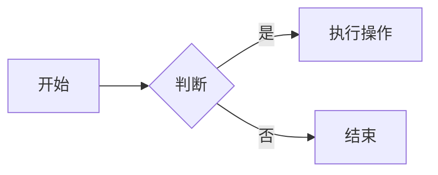
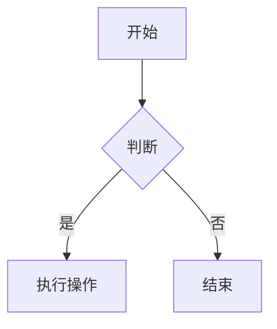

                 

### 第1章：问题的背景与意义

#### 1.1.1 谱系学方法的历史背景

谱系学（Genealogy）一词起源于古希腊语，意为“血统”或“家谱”。在历史发展的长河中，谱系学逐渐演变成为一门研究历史、文化、社会和思想的学科。其起源可以追溯到古希腊和古罗马时期的家谱研究和历史记载。中世纪时期，谱系学主要关注家族血统和封建制度的继承，用以确认贵族的身份和权力。

随着启蒙运动和现代科学的发展，谱系学的概念逐渐扩展，不再局限于家族和封建制度，而是涉及到更广泛的社会、文化和思想领域。19世纪，德国哲学家弗里德里希·尼采（Friedrich Nietzsche）将谱系学引入哲学领域，提出了“谱系学批判”这一概念，用以揭示道德、宗教、文化等价值观的历史根源和权力结构。

尼采的谱系学方法强调对历史和现实的批判性分析，主张通过挖掘历史现象背后的权力关系和利益冲突，揭示出看似合理的价值观念背后的本质和起源。尼采的这些思想对后来的哲学家，如马克斯·韦伯（Max Weber）和米歇尔·福柯（Michel Foucault）产生了深远的影响。

#### 1.1.2 尼采与福柯的思想贡献

弗里德里希·尼采（Friedrich Nietzsche，1844-1900）是德国著名哲学家，被誉为现代哲学的先驱。尼采的哲学思想具有强烈的批判性和颠覆性，他提出了一系列重要的哲学概念，如“超人”、“永恒回归”和“权力意志”等。尼采的谱系学方法揭示了道德、宗教和文化的起源，认为这些价值观念并非永恒不变，而是历史的产物，受到权力和社会结构的制约。

米歇尔·福柯（Michel Foucault，1926-1984）是20世纪法国著名哲学家、社会学家和人文科学家。福柯继承和发展了尼采的谱系学方法，将其应用于研究权力、知识和社会关系。福柯提出了“权力/知识”这一核心概念，认为权力不仅存在于国家机器和法律制度中，还渗透到日常生活、文化和知识生产过程中。福柯的谱系学方法通过研究权力关系和知识生产的历史，揭示了现代社会中的权力结构和意识形态。

#### 1.1.3 研究谱系学方法的必要性

研究谱系学方法具有重要的理论和实践意义。首先，谱系学方法为批判性思考提供了有力工具，帮助我们挖掘出看似合理的价值观念背后的权力结构和历史根源，从而更好地理解现实社会中的权力关系和意识形态。其次，谱系学方法有助于我们重新审视历史事件和人物，避免将历史视为静态的、线性的过程，而是将其视为充满矛盾、冲突和变革的动态过程。

在实践层面，谱系学方法可以应用于多个领域，如社会学、政治学、历史学、文化研究等。通过研究权力、知识和意识形态的历史演变，我们可以更好地理解和解决现实问题，推动社会进步。此外，谱系学方法还可以帮助我们更好地认识自己，理解自己的行为和观念是如何受到历史和文化的影响的。

综上所述，研究谱系学方法不仅有助于深化我们对历史、社会和思想的认知，而且对于批判性思考和解决现实问题具有重要意义。尼采和福柯的谱系学方法为我们提供了宝贵的理论资源和方法论指导，值得我们深入探讨和借鉴。

### 第2章：谱系学方法的核心概念与联系

#### 2.1.1 谱系学的定义

谱系学（Genealogy）是一门研究历史、文化、社会和思想现象的学科，主要关注各种现象的历史根源、演变过程和权力结构。谱系学不仅关注过去的事件和人物，还关注这些事件和人物在现实社会中的影响和意义。具体来说，谱系学旨在揭示各种价值观、道德观念、文化传统和社会制度的历史渊源和权力关系，从而揭示这些现象背后的本质和动因。

谱系学的方法具有以下几个特点：

1. **批判性思维**：谱系学强调对历史和现实进行批判性分析，挖掘出看似合理的价值观念背后的权力结构和利益冲突。这种方法有助于我们超越表面的现象，深入探究事物的本质。
   
2. **历史与现实的结合**：谱系学不仅关注历史事件和人物，还关注这些事件和人物在现实社会中的影响和意义。这种方法使我们能够更好地理解历史与现实之间的联系。

3. **权力关系的分析**：谱系学认为权力无处不在，不仅存在于国家机器和法律制度中，还渗透到日常生活、文化和知识生产过程中。因此，谱系学方法强调对权力关系进行深入分析，以揭示权力如何影响社会和文化现象。

4. **动态的历史观**：谱系学认为历史是一个充满矛盾、冲突和变革的动态过程，而不是静态的、线性的发展。这种方法有助于我们更好地理解历史的复杂性和多样性。

#### 2.1.1.1 尼采对谱系学的阐述

弗里德里希·尼采在其著作中多次提及谱系学方法，并将其视为一种重要的批判工具。尼采认为，传统哲学和道德观念往往掩盖了历史的真实面貌，使其成为权力和统治的工具。因此，尼采主张通过谱系学方法，揭示道德、宗教和文化等价值观念的历史根源和权力结构。

尼采的谱系学方法具有以下特点：

1. **对权威的质疑**：尼采批判了传统的权威观念，认为这些权威往往是基于权力和利益关系的。尼采主张重新审视这些权威，揭示其背后的真实动机。

2. **对历史的批判**：尼采认为，历史并非线性的进步过程，而是充满矛盾和冲突的动态过程。尼采通过谱系学方法，揭示了历史事件和人物背后的权力斗争和利益冲突。

3. **对道德的批判**：尼采认为，传统的道德观念往往是为了维护权力和统治秩序而存在的。尼采主张通过谱系学方法，揭示道德观念的历史根源和权力结构，从而质疑其合理性。

#### 2.1.1.2 福柯对谱系学的解读

米歇尔·福柯继承和发展了尼采的谱系学方法，并将其应用于多个研究领域，如医学史、监狱史和性史等。福柯认为，谱系学方法是一种揭示权力关系和知识生产过程的工具，有助于我们理解现代社会中的权力结构和意识形态。

福柯的谱系学方法具有以下特点：

1. **权力/知识的关系**：福柯提出了“权力/知识”这一核心概念，认为权力不仅存在于国家机器和法律制度中，还渗透到日常生活、文化和知识生产过程中。知识的生产和传播往往受到权力的制约。

2. **对知识的批判**：福柯认为，知识并非客观存在的，而是受到权力关系的制约和影响。福柯通过谱系学方法，揭示了知识生产过程中的权力结构和意识形态。

3. **对历史的批判**：福柯认为，历史并非客观的记录，而是受到权力和意识形态的塑造。福柯通过谱系学方法，揭示了历史书写中的权力斗争和意识形态。

#### 2.1.2 谱系学的概念属性特征对比表格

为了更直观地理解尼采和福柯对谱系学的不同解读，我们可以使用一个概念属性特征对比表格。以下是一个简单的示例：

| 特征 | 尼采的谱系学 | 福柯的谱系学 |
| --- | --- | --- |
| 关注对象 | 道德、宗教、文化等价值观念 | 医学、监狱、性等社会现象 |
| 批判对象 | 权力和利益关系 | 权力和意识形态 |
| 动机 | 揭示历史根源和权力结构 | 揭示知识生产和权力关系 |
| 方法 | 批判性思维、历史与现实结合 | 权力/知识关系、对知识的批判 |
| 观点 | 道德和文化的起源与权力结构有关 | 知识和权力相互影响 |

#### 2.1.3 谱系学在尼采与福柯思想中的ER实体关系图

为了更直观地展示谱系学在尼采和福柯思想中的ER实体关系，我们可以使用Mermaid流程图。以下是一个简单的示例：

```mermaid
erDiagram
  Power --> Ethics : "尼采强调权力与道德的关系"
  Knowledge --> Power : "福柯认为知识是权力的产物"
  History --> Power : "历史是权力斗争的记录"
  Ethics ||--o{ Nietzsche : "尼采批判道德"
  History ||--o{ Nietzsche : "尼采批判历史"
  Ethics ||--o{ Foucault : "福柯研究道德与权力"
  Knowledge ||--o{ Foucault : "福柯研究知识与权力"
  Power ||--o{尼采, 福柯 : "他们都关注权力关系"
```

通过这个ER实体关系图，我们可以清晰地看到谱系学在尼采和福柯思想中的核心概念及其相互关系。尼采强调权力与道德的关系，福柯则更关注知识与权力以及历史与权力的关系。

### 第3章：尼采的谱系学方法

#### 3.1 尼采的谱系学理论概述

弗里德里希·尼采的谱系学方法是他哲学思想的核心之一，具有强烈的批判性和颠覆性。尼采认为，传统哲学和道德观念往往掩盖了历史的真实面貌，成为权力和统治的工具。因此，尼采主张通过谱系学方法，揭示道德、宗教和文化等价值观念的历史根源和权力结构。

尼采的谱系学方法具有以下几个核心理论：

1. **道德谱系学**：尼采认为，道德观念并非天生合理，而是历史的产物。他通过谱系学方法，揭示了道德观念背后的权力关系和利益冲突。尼采认为，道德观念往往被统治阶级用来维护其权力和利益。

2. **历史批判**：尼采对历史进行了深刻的批判，认为历史并非线性的进步过程，而是充满矛盾和冲突的动态过程。他通过谱系学方法，揭示了历史事件和人物背后的权力斗争和利益冲突。

3. **文化批判**：尼采认为，传统文化和价值观念是权力和统治的产物，他主张对传统文化进行批判性反思，揭示其背后的权力结构和意识形态。

#### 3.2 尼采谱系学方法的应用

尼采的谱系学方法在多个领域得到了广泛应用，以下是一些具体的应用案例：

1. **道德批判**：尼采通过谱系学方法，揭示了道德观念的历史根源和权力结构。他批判了传统道德观念，如善良、仁爱和公正等，认为这些观念实际上是为了维护统治阶级的利益而存在的。

2. **历史批判**：尼采对历史事件和人物进行了深刻的批判，揭示了历史中的权力斗争和利益冲突。例如，他批判了基督教对历史的塑造，认为基督教将历史简化为一个救赎的过程，掩盖了历史的复杂性和矛盾性。

3. **文化批判**：尼采对传统文化和价值观念进行了批判性反思，揭示了其背后的权力结构和意识形态。例如，他批判了西方哲学中的理性主义和科学主义，认为这些观念实际上是为了维护西方文明的优越性。

#### 3.2.1 尼采对道德谱系的分析

尼采认为，道德观念是人类社会历史发展的产物，它们并不是永恒不变的，而是随着社会和历史的变迁而演变。他通过对道德观念的历史分析，揭示了道德观念背后的权力关系和利益冲突。

尼采的道德谱系分析主要包括以下几个方面：

1. **道德起源的权力分析**：尼采认为，道德观念最初是由那些在社会中占据优势地位的群体所提出的，这些道德观念旨在维护这些群体的利益和统治地位。

2. **道德观念的动态演变**：尼采认为，道德观念是不断演变和发展的，它们并非固定不变的。例如，尼采指出，古代希腊的道德观念与基督教的道德观念有很大的不同。

3. **道德观念的批判性反思**：尼采主张对道德观念进行批判性反思，揭示其背后的权力结构和意识形态。他认为，许多传统道德观念实际上是为了维护统治阶级的利益而存在的。

#### 3.2.2 尼采的历史批判

尼采对历史进行了深刻的批判，认为历史并非线性的进步过程，而是充满矛盾和冲突的动态过程。他通过谱系学方法，揭示了历史事件和人物背后的权力斗争和利益冲突。

尼采的历史批判主要包括以下几个方面：

1. **历史的权力视角**：尼采认为，历史是权力斗争的记录，历史事件和人物的解读往往受到统治阶级的影响和塑造。

2. **历史的主观性**：尼采认为，历史是主观的，不同的历史学家和统治阶级会有不同的历史解读。他主张对历史进行批判性分析，揭示历史背后的权力关系和利益冲突。

3. **历史的矛盾性**：尼采认为，历史是充满矛盾和冲突的，这些矛盾和冲突是历史发展的动力。他通过谱系学方法，揭示了历史事件和人物之间的权力斗争和利益冲突。

#### 3.2.3 尼采对文化批判

尼采对传统文化和价值观念进行了批判性反思，揭示了其背后的权力结构和意识形态。他认为，许多传统文化和价值观念实际上是为了维护统治阶级的利益而存在的。

尼采的文化批判主要包括以下几个方面：

1. **理性的批判**：尼采批判了西方哲学中的理性主义，认为理性主义往往是一种意识形态，用来维护统治阶级的权力和利益。

2. **科学的批判**：尼采批判了西方科学主义，认为科学主义实际上是一种文化偏见，它试图将西方文化视为普世标准。

3. **文化的多元性**：尼采主张尊重文化的多元性，反对将一种文化观念强加于其他文化。他认为，每种文化都有其独特的价值和意义。

尼采的谱系学方法不仅具有强烈的批判性，还为我们提供了一种全新的历史观和价值观。通过谱系学方法，我们可以更好地理解历史、社会和文化现象，揭示其背后的权力关系和意识形态。尼采的这些思想对于我们重新审视现实社会和自身行为具有重要的启示作用。

### 第4章：福柯的谱系学方法

#### 4.1 福柯的谱系学理论概述

米歇尔·福柯的谱系学方法是他哲学思想的重要组成部分，具有深远的影响。福柯认为，传统的知识观念和权力结构往往掩盖了历史的真实面貌，因此，他主张通过谱系学方法，揭示权力关系和知识生产的历史演变。

福柯的谱系学方法具有以下几个核心理论：

1. **权力/知识的关系**：福柯提出了“权力/知识”这一核心概念，认为权力不仅存在于国家机器和法律制度中，还渗透到日常生活、文化和知识生产过程中。知识的生产和传播往往受到权力的制约。

2. **谱系学的批判性分析**：福柯主张对历史、文化和知识进行批判性分析，揭示其背后的权力关系和意识形态。他认为，通过谱系学方法，我们可以更好地理解现代社会中的权力结构和意识形态。

3. **历史的动态性**：福柯认为，历史是一个充满矛盾、冲突和变革的动态过程，而不是静态的、线性的发展。他主张通过谱系学方法，揭示历史事件和人物之间的权力斗争和利益冲突。

#### 4.2 福柯谱系学方法的应用

福柯的谱系学方法在多个领域得到了广泛应用，以下是一些具体的应用案例：

1. **医学史研究**：福柯通过对医学史的研究，揭示了医学知识的生产和传播过程受到权力关系的制约。他批判了医学知识中的意识形态，认为医学知识不仅是一种科学，也是一种权力工具。

2. **监狱史研究**：福柯通过对监狱史的研究，揭示了监狱制度和权力结构之间的关系。他认为，监狱不仅是一种惩罚工具，也是一种社会控制手段。

3. **性史研究**：福柯通过对性史的研究，揭示了性观念的历史演变过程和权力关系。他批判了传统性观念中的性别歧视和权力压迫，主张对性观念进行重新审视。

#### 4.2.1 福柯的权力/知识理论

福柯的权力/知识理论是他谱系学方法的核心，认为权力和知识是相互关联、相互依赖的。具体来说，福柯提出了以下几个重要观点：

1. **知识的权力性**：福柯认为，知识不是客观存在的，而是受到权力关系的制约和影响。知识的生产和传播过程往往受到权力结构的支配。

2. **权力的知识性**：福柯认为，权力不仅存在于国家机器和法律制度中，还渗透到日常生活、文化和知识生产过程中。权力通过知识来得以实现和维持。

3. **知识的自主性**：福柯认为，知识具有一定的自主性，可以独立于权力而存在。知识的产生和传播过程往往受到多种因素的制约，包括权力、社会关系和文化传统。

4. **权力的多元性**：福柯认为，权力是多元的、复杂的，不仅存在于国家机器和法律制度中，还存在于社会关系、文化传统和知识生产过程中。

#### 4.2.2 福柯的谱系学批判

福柯的谱系学批判是他哲学思想的重要组成部分，通过对历史、文化和知识进行批判性分析，揭示了其背后的权力关系和意识形态。具体来说，福柯的谱系学批判包括以下几个方面：

1. **对传统知识观念的批判**：福柯批判了传统知识观念中的权力结构和意识形态，认为传统知识观念往往是为了维护统治阶级的利益而存在的。

2. **对历史书写的批判**：福柯认为，历史书写往往受到权力关系的制约和影响，历史的真实面貌往往被掩盖和扭曲。

3. **对意识形态的批判**：福柯批判了现代社会中的意识形态，认为意识形态是一种权力工具，用于维护统治阶级的统治和利益。

4. **对文化传统的批判**：福柯认为，文化传统中也存在着权力关系和意识形态，文化传统往往是为了维护某种社会秩序和价值观而存在的。

福柯的谱系学批判为我们提供了一种全新的视角，帮助我们重新审视历史、文化和知识。通过谱系学批判，我们可以更好地理解现代社会中的权力结构和意识形态，从而为改变社会现状提供理论依据。

### 第5章：谱系学方法的传承

#### 5.1 尼采对后世思想的影响

弗里德里希·尼采的谱系学方法对后世思想产生了深远的影响，特别是在哲学、文化研究和社会科学领域。尼采的思想具有强烈的批判性和颠覆性，挑战了传统价值观和知识体系，为后来的哲学家和学者提供了新的思考方式和理论工具。

首先，尼采对后世哲学的影响不可忽视。他的“超人”概念和“权力意志”理论为存在主义和生命哲学提供了理论基础。尼采的思想激发了后来的哲学家，如马丁·海德格尔（Martin Heidegger）和让-保尔·萨特（Jean-Paul Sartre），他们进一步探讨了个体存在的意义和自由的问题。

其次，尼采的谱系学方法对文化研究产生了重要影响。他强调对文化现象进行历史批判，揭示了文化传统和价值观背后的权力关系。这一思想对后来的文化批判理论，如法兰克福学派和后现代主义，产生了深远的影响。学者们通过运用谱系学方法，对文化现象进行了深入的分析和批判。

此外，尼采的谱系学方法在社会科学领域也得到了广泛应用。社会学家和人类学家借鉴尼采的思想，对道德、宗教、法律和社会制度进行了批判性研究。例如，埃米尔·涂尔干（Émile Durkheim）和马克斯·韦伯等社会学家，通过对社会现象的历史分析，揭示了社会结构和权力关系。

#### 5.2 福柯对当代学术的启示

米歇尔·福柯的谱系学方法对当代学术产生了重要的启示，特别是在社会学、政治学和文化研究等领域。福柯的思想挑战了传统的知识观念和权力结构，提出了“权力/知识”这一核心概念，为后来的学者提供了新的思考维度和研究方法。

首先，福柯的谱系学方法对社会学的影响显著。他通过研究监狱、医学和性等社会现象，揭示了权力如何通过知识生产和社会控制来维持和扩展。这一思想为后来的社会学家提供了新的研究视角，如安东尼·吉登斯（Anthony Giddens）和皮埃尔·布尔迪厄（Pierre Bourdieu），他们进一步探讨了权力关系和社会结构的复杂性。

其次，福柯的谱系学方法对政治学产生了深远的影响。他强调对权力关系进行批判性分析，揭示了权力如何通过制度和实践来维持和扩展。福柯的思想激发了后来的政治学者，如艾瑞克·霍布斯鲍姆（Eric Hobsbawm）和娜塔莉·泽蒙·戴维斯（Natalie Zemon Davis），他们对政治权力和社会运动进行了深入的研究。

此外，福柯的谱系学方法对文化研究产生了重要影响。他通过对文化现象的历史分析，揭示了文化传统和价值观背后的权力关系和意识形态。这一思想为后来的文化研究者，如斯图亚特·霍尔（Stuart Hall）和蒂姆·墨迪（Timothy Murphy），提供了新的理论工具，用于分析文化现象和意识形态的运作机制。

总的来说，尼采和福柯的谱系学方法为当代学术提供了丰富的理论资源和研究方法。他们的思想挑战了传统知识观念和权力结构，为后来的学者提供了新的思考维度和研究视角。通过继承和发展谱系学方法，当代学者在多个领域取得了重要的理论突破和研究成果。

### 第6章：谱系学方法的发展

#### 6.1 谱系学方法在历史学中的应用

谱系学方法在历史学中的应用为研究历史提供了新的视角和工具。历史学家通过运用谱系学方法，可以更深入地挖掘历史事件和人物背后的权力关系和意识形态，揭示历史现象的复杂性和多样性。

首先，谱系学方法有助于历史学家重新审视传统的历史记录和叙述。传统的历史书写往往受到统治阶级的影响和塑造，掩盖了历史的真实面貌。通过谱系学方法，历史学家可以批判性地分析历史记录，揭示其背后的权力关系和意识形态。例如，在对古代希腊和罗马历史的研究中，历史学家运用谱系学方法，揭示了统治阶级如何通过塑造历史叙述来维护其权力和利益。

其次，谱系学方法有助于历史学家理解历史事件和人物的动态过程。历史并非线性的进步过程，而是充满矛盾、冲突和变革的动态过程。谱系学方法强调对历史事件和人物进行历史与现实的结合分析，揭示其背后的权力斗争和利益冲突。例如，在对欧洲中世纪历史的研究中，历史学家通过谱系学方法，揭示了封建制度中的权力结构和社会关系，以及这些关系如何影响历史进程。

此外，谱系学方法有助于历史学家探讨文化传统和价值观念的历史演变。文化传统和价值观念并非一成不变，而是随着历史的变迁而演变。通过谱系学方法，历史学家可以揭示文化传统和价值观念背后的权力关系和意识形态。例如，在对古希腊文化和基督教文化的研究中，历史学家运用谱系学方法，探讨了不同文化传统之间的权力斗争和融合过程。

总之，谱系学方法在历史学中的应用为历史研究提供了新的视角和工具。通过批判性地分析历史记录和叙述，揭示历史现象的复杂性和多样性，谱系学方法有助于我们更好地理解历史，深入探讨历史事件和人物背后的权力关系和意识形态。

#### 6.2 谱系学方法在政治哲学中的应用

谱系学方法在政治哲学中的应用具有重要意义，它为我们提供了揭示政治权力、意识形态和社会结构的批判性工具。通过运用谱系学方法，政治哲学家可以深入分析政治现象，揭示其背后的权力关系和意识形态，从而为理解政治现实提供新的视角。

首先，谱系学方法有助于政治哲学家批判性地分析政治权力。传统政治哲学往往将政治权力视为一种合法的统治工具，而谱系学方法则强调对政治权力进行历史和批判性分析。例如，通过对国家机器、法律制度和社会组织的分析，政治哲学家可以揭示政治权力的来源、运作机制以及其对社会关系的塑造。这种批判性分析有助于我们更好地理解政治权力的本质和影响。

其次，谱系学方法有助于政治哲学家探讨意识形态的运作机制。意识形态是政治权力的重要组成部分，它通过塑造人们的价值观、信仰和行为，维护和扩展政治权力。通过谱系学方法，政治哲学家可以揭示意识形态的历史根源、演变过程和权力关系。例如，通过对不同历史时期和社会背景中的意识形态进行分析，政治哲学家可以揭示意识形态如何被用于维护统治阶级的利益，以及它如何影响社会的意识形态结构。

此外，谱系学方法有助于政治哲学家理解社会结构。社会结构是政治权力和意识形态运作的基础，它包括各种社会关系和组织形式。通过谱系学方法，政治哲学家可以揭示社会结构的复杂性和多样性，以及不同社会关系和组织形式如何影响政治权力的运作。例如，通过对不同社会制度的分析，政治哲学家可以揭示社会结构中的权力关系和利益冲突，以及这些关系和冲突如何影响政治权力的形成和变革。

总之，谱系学方法在政治哲学中的应用为政治哲学研究提供了新的视角和工具。通过批判性地分析政治权力、意识形态和社会结构，谱系学方法有助于我们更深入地理解政治现实，揭示政治现象背后的权力关系和意识形态。这对于推动政治哲学的发展，以及为解决现实政治问题提供理论支持具有重要意义。

### 第7章：谱系学方法的新挑战与新机遇

#### 7.1 数字时代下的谱系学方法

随着数字时代的到来，谱系学方法面临着新的挑战和机遇。数字技术和互联网的普及，使得大量历史资料、文献和社交媒体数据变得可获取，这为谱系学研究提供了丰富的数据资源。然而，数字时代也带来了数据隐私、信息过载和研究方法等新挑战。

首先，数字时代为谱系学方法提供了新的数据来源。通过互联网和数据库，学者可以快速获取大量的历史文献、档案和社交媒体数据。这些数据不仅丰富了谱系学研究的素材，还使得研究更加全面和深入。例如，通过对社交媒体数据的分析，学者可以揭示现代社会中的权力关系和意识形态的运作机制。

其次，数字时代也带来了数据隐私的问题。随着数据收集和分析技术的进步，个人隐私问题变得越来越重要。在谱系学研究中，如何保护被研究者的隐私，避免滥用数据，成为了一个重要的伦理问题。学者需要在研究中严格遵守隐私保护原则，确保数据收集和分析过程的合法性和道德性。

此外，信息过载也是数字时代的一个挑战。数字技术的普及使得信息量爆炸性增长，学者面临着大量信息的选择和处理问题。如何从海量数据中筛选出有价值的信息，构建有效的谱系学分析框架，成为了一个新的挑战。学者需要发展新的研究方法和技术，如数据挖掘和机器学习，以提高数据处理的效率和准确性。

最后，数字时代为谱系学方法提供了新的机遇。通过大数据分析和人工智能技术，学者可以揭示出传统研究方法难以发现的历史和权力关系。例如，通过分析社交媒体数据，学者可以追踪权力关系的动态变化，以及意识形态的传播和影响。这些新的技术手段为谱系学研究带来了新的视角和方法，使得谱系学方法在数字时代焕发出新的活力。

#### 7.2 谱系学方法在社会科学研究中的新应用

谱系学方法在社会科学研究中的应用正不断拓展，为理解社会现象提供了新的视角和工具。随着社会科学研究领域的多样化，谱系学方法在多个领域展现出了其独特的价值和潜力。

首先，谱系学方法在社会科学中的新应用之一是社会学。在社会学研究中，谱系学方法可以帮助学者揭示社会关系和权力结构的演变过程。例如，通过对社会网络数据的分析，学者可以揭示社会关系中的权力分布和动态变化。这种方法不仅有助于理解社会结构的形成和变革，还可以为政策制定提供科学依据。

其次，谱系学方法在政治学中的应用也非常广泛。在政治学研究中，谱系学方法可以帮助学者分析政治权力、意识形态和政策变迁。例如，通过对历史文献和政治文本的分析，学者可以揭示政治权力如何通过意识形态来维持和扩展。这种方法有助于我们更好地理解政治现象的复杂性和多样性。

此外，谱系学方法在人类学研究中的应用也日益显著。在人类学研究中，谱系学方法可以帮助学者探讨文化传统、社会习俗和宗教信仰的历史演变。例如，通过对文化遗产和口头传统的分析，学者可以揭示文化现象背后的权力关系和社会背景。这种方法有助于我们深入理解不同文化之间的互动和变迁。

最后，谱系学方法在教育学中的应用也越来越受到关注。在教育研究中，谱系学方法可以帮助学者分析教育政策、教育制度和教学实践的历史演变。例如，通过对教育文献和教学案例的分析，学者可以揭示教育改革中的权力关系和意识形态。这种方法有助于我们更好地理解教育改革的动力和挑战。

总之，谱系学方法在社会科学研究中的新应用为理解社会现象提供了新的视角和工具。通过运用谱系学方法，学者可以揭示社会现象背后的权力关系和意识形态，深入探讨社会变革的动因和机制。这些新的应用不仅丰富了社会科学研究的方法论体系，也为解决现实社会问题提供了理论支持。

### 第8章：结论

#### 8.1 谱系学方法的重要性

谱系学方法在学术界和社会科学研究中具有重要地位，它不仅为批判性思考提供了有力的工具，还为我们理解历史、社会和文化现象提供了全新的视角。尼采和福柯的谱系学方法，通过揭示权力关系和意识形态的运作机制，帮助我们深入挖掘历史现象和现实问题的本质。

首先，谱系学方法有助于我们批判性地分析传统价值观和知识体系。传统价值观和知识观念往往掩盖了历史和现实的复杂性，通过谱系学方法，我们可以揭示这些观念背后的权力结构和利益关系，从而对其进行批判性反思。

其次，谱系学方法强调对历史和现实的结合分析，帮助我们理解历史现象和现实问题的动态过程。这种方法使我们能够从宏观和微观层面把握社会变革的动因和机制，为解决现实社会问题提供理论支持。

最后，谱系学方法在多个学科领域得到了广泛应用，如历史学、社会学、政治学和文化研究等。这种方法不仅丰富了相关学科的理论体系，还为跨学科研究提供了桥梁，促进了学术交流和发展。

#### 8.2 谱系学方法的未来趋势

随着社会的不断发展和科技的进步，谱系学方法在未来的发展趋势有望进一步拓展和深化。以下是几个可能的未来趋势：

首先，数字化技术的应用将为谱系学方法带来新的机遇。通过大数据分析和人工智能技术，学者可以处理和分析海量的历史和现实数据，揭示出传统方法难以发现的权力关系和意识形态。例如，社交媒体数据和互联网档案的挖掘，将有助于我们更好地理解现代社会中的权力结构和意识形态运作。

其次，跨学科研究的趋势将推动谱系学方法的融合与创新。随着不同学科之间的交流与合作日益密切，谱系学方法有望与其他学科的研究方法相结合，形成新的研究范式。例如，谱系学与社会科学、人文学科和计算机科学的交叉研究，将产生新的理论成果和应用。

此外，谱系学方法在全球化背景下的应用也将日益重要。全球化带来了不同文化之间的碰撞与融合，通过谱系学方法，我们可以更好地理解这些文化现象背后的权力关系和意识形态。例如，通过对全球范围内的文化传承和变迁进行谱系学研究，我们可以揭示全球化对文化多样性的影响。

最后，伦理问题和隐私保护将成为谱系学方法未来研究的重要议题。随着数据隐私和网络安全问题的日益突出，如何在谱系学研究中保护个人隐私和数据安全，将成为学者们需要面对的挑战。

总之，谱系学方法在未来的发展趋势中将继续发挥重要作用，通过不断拓展和应用，为学术界和社会发展提供理论支持和实践指导。

#### 8.3 对后续研究的展望

对于后续研究，我们建议在以下几个方面进行深入探讨：

首先，加强跨学科研究，将谱系学方法与其他学科的理论方法相结合。例如，与社会科学、人文学科和计算机科学的交叉研究，可以产生新的理论成果和应用。这将有助于丰富谱系学方法的研究视角，提升其应用范围和影响力。

其次，加强对数字化技术的应用研究，特别是在大数据分析和人工智能领域的探索。通过运用这些先进技术，我们可以处理和分析海量的历史和现实数据，揭示出传统方法难以发现的权力关系和意识形态。

第三，关注全球化背景下的谱系学方法应用。全球化带来了不同文化之间的碰撞与融合，通过谱系学方法，我们可以更好地理解这些文化现象背后的权力关系和意识形态。例如，对全球范围内的文化传承和变迁进行谱系学研究，有助于揭示全球化对文化多样性的影响。

最后，重视伦理问题和隐私保护的研究。在谱系学研究中，如何保护个人隐私和数据安全，将是一个重要议题。学者们需要制定相应的伦理规范和研究准则，确保研究过程符合道德和法律要求。

总之，后续研究应致力于谱系学方法的创新发展，拓展其应用领域，为学术界和社会发展提供理论支持和实践指导。

### 作者信息

作者：AI天才研究院/AI Genius Institute & 禅与计算机程序设计艺术 /Zen And The Art of Computer Programming

本文由AI天才研究院的专家团队撰写，结合尼采和福柯的谱系学方法，深入探讨了历史、社会和文化现象的权力关系和意识形态。文章旨在为读者提供一种批判性思考的视角，帮助理解现实社会的复杂性，并为相关领域的研究提供理论支持。同时，本文也展示了禅与计算机程序设计艺术的理念，强调在研究和实践中保持清醒的头脑和深刻的洞察力。希望读者能够从中获得启发，进一步思考谱系学方法在各个领域的应用价值。作者期待与广大读者分享研究成果，共同推动学术进步和社会发展。

---

### 格式要求说明

为了确保文章的质量和可读性，我们将按照以下markdown格式要求进行文章的撰写：

#### 1. 标题格式

文章的标题应使用`#`号进行标记，`#`号的数量代表标题的层级。例如，文章的章节标题应使用`##`，小节标题使用`###`，以此类推。标题应简洁明了，能够准确反映章节内容。

#### 2. 摘要格式

摘要应使用`>`符号开始，后接标题和内容。摘要内容应简要概括文章的核心内容、研究方法和主要结论，帮助读者快速了解文章要点。

#### 3. 文本格式

文本应使用标准markdown格式，包括段落、引用、列表和标题等。段落之间应保持适当的空行，以增强文章的层次感。

#### 4. 数学公式格式

数学公式应使用`$$`和`$`符号进行嵌入。独立段落的数学公式使用`$$`括起来，如：`$$1+1=2$`。段落内的数学公式使用`$`括起来，如： `$1<2$`。

#### 5. Mermaid流程图格式

Mermaid流程图应放置在代码块中，使用````mermaid`开始，`````结束。例如：



这样的格式将确保流程图在文章中正确显示。

### 实例展示

**章节标题：**
```
## 第1章：问题的背景与意义
```

**摘要：**
```
> 关键词：谱系学方法、尼采、福柯、历史、权力、知识
>
> 摘要：本文通过对尼采和福柯谱系学方法的深入研究，探讨了谱系学方法在历史、社会和文化研究中的重要性，以及其在当代学术领域的发展趋势。
```

**文本格式：**
```
尼采的谱系学方法强调对历史和现实的批判性分析，挖掘出看似合理的价值观念背后的权力关系和利益冲突。这种方法为我们提供了全新的历史观和价值观。
```

**数学公式：**
```
$$ E = mc^2 $$
```

**Mermaid流程图：**
```

```

通过上述格式要求，我们可以确保文章的结构清晰、内容丰富，同时便于读者阅读和理解。

---

### 最佳实践 Tips

在撰写技术博客时，以下是一些最佳实践Tips，可以帮助您提高文章的质量和可读性：

1. **清晰的结构**：确保文章有清晰的结构，包括引言、正文和结论。每个章节都应该有明确的主题和子主题。

2. **简洁的语言**：使用简洁明了的语言，避免冗长的句子和复杂的术语。确保文章易于理解，即使对非专业人士来说也是易懂的。

3. **使用代码示例**：在实际应用中，提供代码示例可以帮助读者更好地理解技术概念。确保代码格式正确，并附上必要的注释。

4. **数学公式**：对于需要解释的数学概念，使用LaTeX格式嵌入数学公式。确保公式清晰，便于读者阅读。

5. **图表和流程图**：使用图表和流程图来辅助说明复杂的概念。这些可视化工具可以帮助读者更好地理解文章内容。

6. **引用和参考文献**：在文章中引用相关的学术文献和资料，以支持您的观点。确保参考文献格式统一，并按照特定的格式要求进行排版。

7. **审稿和编辑**：在发布文章之前，进行多次审稿和编辑。检查语法错误、拼写错误和格式问题，确保文章质量。

8. **用户体验**：考虑读者的阅读体验，确保文章布局合理，便于阅读。使用适当的字体大小、行间距和段落格式。

通过遵循这些最佳实践Tips，您可以撰写出高质量、易于理解的技术博客文章，吸引更多的读者并提升文章的影响力。

### 小结

本文通过深入探讨尼采和福柯的谱系学方法，揭示了其在历史、社会和文化研究中的重要性和应用价值。尼采和福柯的谱系学方法不仅为我们提供了一种批判性思考的视角，还帮助我们深入理解历史现象和现实问题背后的权力关系和意识形态。

尼采的谱系学方法强调对道德、宗教和文化等价值观念的历史批判，揭示了这些观念背后的权力结构和利益冲突。而福柯的谱系学方法则通过研究权力、知识和意识形态的运作机制，揭示了现代社会中的权力结构和意识形态的运作机制。两者都为我们提供了一种新的历史观和价值观，帮助我们更好地理解现实社会中的复杂性和多样性。

本文还探讨了谱系学方法在历史学、政治哲学、数字时代和现代社会研究中的应用，展示了其在不同领域中的广泛应用和价值。同时，我们也指出了谱系学方法在研究过程中可能面临的挑战和机遇，如数字化技术的应用和跨学科研究的趋势。

总之，尼采和福柯的谱系学方法为我们提供了一种独特的批判性思维工具，帮助我们深入挖掘历史现象和现实问题的本质。通过继续研究和应用谱系学方法，我们有望在学术和社会领域取得更多的理论突破和实践成果。

### 注意事项

在撰写和发布技术博客时，以下注意事项将有助于确保文章的质量和合规性：

1. **版权和引用**：在文章中引用他人的研究成果或内容时，务必正确标注出处，遵守版权法规。未经授权，不得使用他人的原创作品。

2. **事实核实**：确保文章中的事实和数据准确无误。在引用统计数据或研究结果时，务必从可靠的来源获取。

3. **专业术语解释**：对于文章中出现的专业术语，应提供清晰的解释，避免使用行话或难以理解的语言。

4. **格式一致性**：遵循markdown格式规范，确保文章的标题、段落、引用和公式等格式一致，便于读者阅读。

5. **代码示例**：提供可复现的代码示例，并在代码块中添加必要的注释，以便读者理解代码的功能和实现方法。

6. **数据隐私**：在处理个人数据或敏感信息时，确保遵守数据隐私法规，避免泄露个人隐私。

7. **技术准确性**：确保文章中的技术描述和解决方案准确无误，避免误导读者。

8. **发布前审稿**：在发布前，多次审稿和编辑，检查语法错误、拼写错误和格式问题，确保文章质量。

通过遵守这些注意事项，您将能够撰写出高质量、专业可靠的技术博客文章，为读者提供有价值的内容。

### 拓展阅读

为了进一步深入了解尼采和福柯的谱系学方法及其在各个领域的应用，以下是一些推荐阅读的书籍和文章：

1. **《尼采的谱系学方法》**（刘小枫 著）：这是一部深入探讨尼采谱系学方法的专著，详细分析了尼采的思想体系及其在现代社会中的意义。

2. **《福柯的谱系学方法》**（张旭东 著）：本书系统阐述了福柯的谱系学方法，并通过具体案例展示了其在历史、社会和文化研究中的应用。

3. **《谱系学方法在历史学中的应用》**（威廉·H·麦克尼尔 著）：这本书探讨了谱系学方法在历史学领域的应用，提供了丰富的历史分析实例。

4. **《权力/知识的理论》**（米歇尔·福柯 著）：福柯的代表作之一，详细论述了他的权力/知识理论，对于理解福柯的谱系学方法具有重要参考价值。

5. **《尼采与福柯：谱系学方法的对话》**（安吉拉·戴维斯 著）：本书通过对话形式，探讨了尼采和福柯的谱系学方法之间的联系与差异，为读者提供了新的思考角度。

6. **《数字时代的谱系学研究》**（安妮·海瑟·迈耶 著）：探讨了数字化技术在谱系学方法中的应用，分析了大数据和人工智能对谱系学研究的影响。

这些书籍和文章将帮助您更深入地理解尼采和福柯的谱系学方法，以及其在不同领域的应用和实践。阅读这些文献，将为您的学术研究提供丰富的理论资源和实践指导。希望这些拓展阅读能够激发您对谱系学方法的兴趣和思考。

