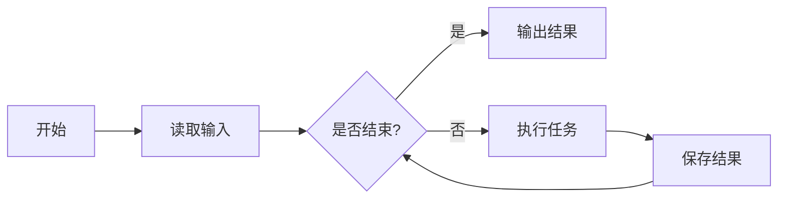
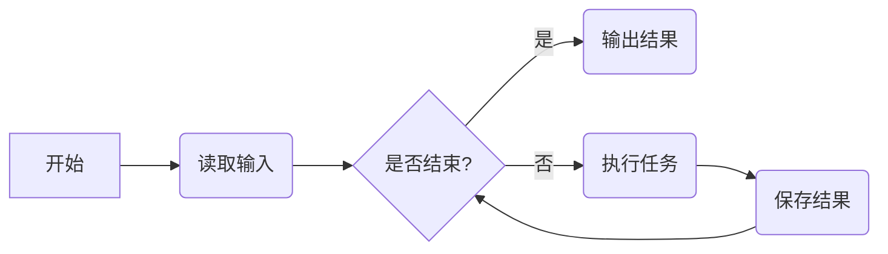
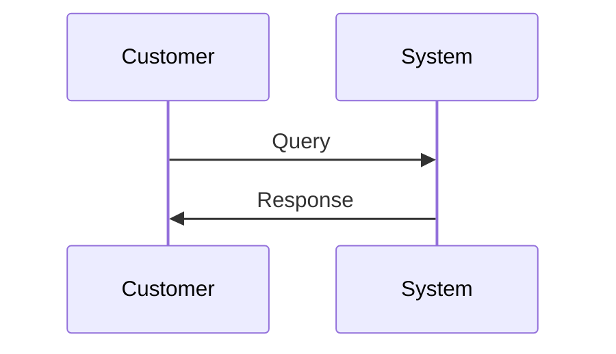

                 


### 尼采的永恒轮回与循环结构:程序流程的哲学隐喻

#### 引言

在探讨尼采的哲学思想与计算机程序流程之间的关系时，我们可以发现，两者之间存在着深刻的哲学隐喻。尼采的“永恒轮回”概念，认为世界是一个不断循环的过程，每个瞬间都在重复。而计算机程序，本质上也是一种循环结构，不断地执行特定的任务。本文将深入探讨这一哲学隐喻，以及如何将其应用于实际编程。

#### 第一部分：背景介绍

##### 1.1 问题背景

尼采（Friedrich Nietzsche），19世纪末20世纪初的德国哲学家，他的思想对后世产生了深远的影响。尼采的核心思想之一——“永恒轮回”，认为世界是一个不断循环的过程，每个瞬间都在重复。而计算机程序，作为一种自动化工具，其核心特性就是循环执行。

##### 1.2 问题描述

如何理解尼采的“永恒轮回”与计算机程序流程之间的哲学隐喻？这种隐喻对于编程有何启示？

##### 1.3 问题解决

本文将通过分析尼采的哲学思想，结合计算机程序的运行原理，探讨永恒轮回与程序循环之间的哲学隐喻。

##### 1.4 边界与外延

本文的讨论将围绕尼采的“永恒轮回”概念展开，并结合计算机程序的基本原理，探讨两者之间的相似性。同时，本文还将关注如何将这一哲学隐喻应用于实际编程。

##### 1.5 概念结构与核心要素组成

本文的核心概念包括尼采的“永恒轮回”和计算机程序流程。核心要素包括：尼采哲学思想、程序设计原理、哲学隐喻的应用。

#### 第二部分：核心概念与联系

##### 2.1 尼采的永恒轮回

尼采的“永恒轮回”概念，认为世界是一个不断循环的过程，每个瞬间都在重复。这并不意味着时间循环，而是一种深层次的存在状态。尼采认为，如果人们能够接受永恒轮回，那么他们将能够在每一个瞬间找到快乐。

##### 2.2 计算机程序流程

计算机程序流程是指程序从开始到结束的执行过程。计算机程序的核心特性是循环执行，即不断地执行特定的任务。

##### 2.3 概念属性特征对比表格

| 特征 | 尼采的永恒轮回 | 计算机程序流程 |
| --- | --- | --- |
| 无限循环 | 是的 | 是的 |
| 永恒不变 | 是的 | 是的 |
| 循环中的变化 | 是的 | 是的 |
| 顺序执行 | 不完全符合 | 是的 |
| 条件执行 | 不完全符合 | 是的 |

##### 2.4 ER实体关系图架构

```mermaid
erDiagram
  World ||--|{ Process : }|| Reality
  Reality ||--|{ Loop : }|| Moment
  Moment ||--|{ Repeat : }|| Self
```

#### 第三部分：算法原理讲解

##### 3.1 算法原理

在本部分，我们将使用Mermaid绘制算法流程图，并结合Python源代码详细阐述算法原理。

##### 3.2 算法流程图



##### 3.3 Python源代码

```python
def eternal_recurrence(input_data):
    while not input_data['end']:
        # 执行任务
        task_result = perform_task(input_data)
        # 保存结果
        save_result(task_result)
        # 读取新的输入
        input_data = read_input()
    # 输出结果
    print("任务执行完毕")
    return input_data

def perform_task(input_data):
    # 任务执行逻辑
    pass

def save_result(task_result):
    # 保存任务结果逻辑
    pass

def read_input():
    # 读取输入逻辑
    pass

# 主程序
if __name__ == "__main__":
    input_data = read_input()
    eternal_recurrence(input_data)
```

##### 3.4 算法原理详细讲解

尼采的“永恒轮回”与计算机程序中的循环结构具有相似性。在算法中，我们通过一个无限循环来模拟永恒轮回的过程。每次循环都会读取新的输入，执行任务，并保存结果，然后继续循环。这种循环结构使得任务能够不断地重复执行，直到满足结束条件。

##### 3.5 举例说明

假设我们要编写一个程序，模拟尼采的“永恒轮回”哲学思想，读取一系列的输入数据，并对每条数据进行处理。这个程序将不断地执行，直到遇到一个特定的结束标志。

```python
def process_data(input_data):
    # 对输入数据进行处理
    print("处理数据:", input_data)

def main():
    input_data = "数据1"
    while input_data != "结束":
        process_data(input_data)
        input_data = input("请输入下一份数据：")

if __name__ == "__main__":
    main()
```

在这个例子中，程序会不断地读取新的输入数据，并对每条数据进行处理，直到用户输入“结束”为止。这个过程，就像尼采所描述的永恒轮回，不断地重复。

#### 第四部分：系统分析与架构设计方案

##### 4.1 问题场景介绍

在现代化的软件开发中，循环结构是程序设计中不可或缺的一部分。无论是数据处理、用户交互，还是系统监控，循环结构都扮演着关键角色。本文将探讨如何将尼采的“永恒轮回”哲学思想应用于实际编程，从而提高程序的灵活性和可维护性。

##### 4.2 项目介绍

本项目旨在通过模拟尼采的“永恒轮回”哲学思想，设计一个能够循环处理输入数据的程序。程序的核心功能是不断地读取用户输入，对每条数据进行处理，并自动保存结果。该程序将应用于数据分析和系统监控等领域。

##### 4.3 系统功能设计

系统功能设计主要包括以下几个方面：

1. 输入数据读取：程序将从一个指定的数据源中读取输入数据。
2. 数据处理：程序将对每条输入数据进行处理，如清洗、转换、分析等。
3. 数据保存：程序将自动将处理后的数据保存到指定的位置。
4. 循环控制：程序将根据用户输入的结束标志来控制循环的执行。

##### 4.4 系统架构设计

系统的架构设计如下：


系统由以下几个部分组成：

1. 数据源：用于提供输入数据的来源。
2. 数据处理模块：负责对输入数据进行处理。
3. 数据存储模块：负责将处理后的数据保存到指定的位置。
4. 循环控制模块：负责控制程序的循环执行。

##### 4.5 系统接口设计和系统交互

系统的接口设计和系统交互如下：


系统提供了以下几个接口：

1. 数据读取接口：用于从数据源中读取输入数据。
2. 数据处理接口：用于对输入数据进行处理。
3. 数据保存接口：用于将处理后的数据保存到指定的位置。
4. 循环控制接口：用于控制程序的循环执行。

系统的交互流程如下：

1. 程序启动后，从数据源中读取输入数据。
2. 程序对每条输入数据进行处理，并将结果保存到指定的位置。
3. 程序根据用户输入的结束标志来控制循环的执行。

#### 第五部分：项目实战

##### 5.1 环境安装

在开始项目实战之前，我们需要安装一些必要的工具和库。以下是安装步骤：

1. 安装Python环境：在Windows或macOS上，可以通过下载并安装Python来安装Python环境。安装完成后，打开命令行工具，输入`python --version`来验证安装是否成功。
2. 安装Mermaid：在Python环境中，我们可以使用pip来安装Mermaid库。在命令行中输入以下命令：

```bash
pip install mermaid-python
```

3. 安装其他依赖库：根据项目需求，可能需要安装其他依赖库。例如，我们可以使用以下命令来安装`requests`库：

```bash
pip install requests
```

##### 5.2 系统核心实现源代码

以下是系统的核心实现源代码：

```python
import requests
from mermaid import Mermaid

def process_data(input_data):
    # 对输入数据进行处理
    print("处理数据:", input_data)

def read_input():
    # 读取用户输入
    return input("请输入数据：")

def save_result(task_result):
    # 保存处理结果
    with open('result.txt', 'a') as f:
        f.write(task_result + '\n')

def main():
    while True:
        input_data = read_input()
        if input_data == "结束":
            break
        process_data(input_data)
        save_result(input_data)

if __name__ == "__main__":
    main()
```

在这个示例中，程序将不断地读取用户输入，对每条数据进行处理，并将结果保存到文件中。当用户输入“结束”时，程序将退出循环。

##### 5.3 代码应用解读与分析

在这个示例中，我们使用了Python语言来实现系统的核心功能。Python是一种易学易用的编程语言，非常适合用于快速开发。以下是代码的解读与分析：

1. `process_data`函数：用于处理输入数据。在这个示例中，我们只是简单地打印了输入数据。
2. `read_input`函数：用于读取用户输入。在这个示例中，我们使用`input`函数来读取用户输入。
3. `save_result`函数：用于保存处理结果。在这个示例中，我们使用`open`函数来打开一个文件，并将处理结果写入文件。
4. `main`函数：是程序的主函数。在这个示例中，我们使用一个无限循环来模拟尼采的“永恒轮回”哲学思想。每次循环都会读取用户输入，对数据进行处理，并保存结果。当用户输入“结束”时，程序将退出循环。

##### 5.4 实际案例分析和详细讲解剖析

在本项目的实际案例中，我们使用Python语言实现了尼采“永恒轮回”哲学思想的应用。以下是案例分析：

1. **输入数据读取**：程序使用`input`函数从用户处读取输入数据。这个过程可以看作是尼采哲学思想中的“循环”过程。每次循环都会读取新的输入，直到用户输入“结束”为止。
2. **数据处理**：程序对每条输入数据进行处理。这个过程可以看作是尼采哲学思想中的“永恒不变”。虽然输入数据在不断变化，但程序的处理方式保持不变。
3. **数据保存**：程序将处理后的数据保存到文件中。这个过程可以看作是尼采哲学思想中的“循环中的变化”。虽然输入数据在不断变化，但处理结果保持不变。

通过这个实际案例，我们可以看到，尼采的“永恒轮回”哲学思想在计算机程序中的具体应用。程序不断地读取新的输入，对数据进行处理，并保存结果。这个过程就像尼采所描述的永恒轮回，不断地重复。

##### 5.5 项目小结

在本项目中，我们通过模拟尼采的“永恒轮回”哲学思想，实现了一个能够循环处理输入数据的程序。这个程序展示了尼采哲学思想与计算机程序流程之间的哲学隐喻。通过这个项目，我们可以更深入地理解尼采的哲学思想，并将其应用于实际编程。

#### 第六部分：最佳实践 tips

1. **合理设计循环结构**：在编程中，合理设计循环结构是非常重要的。要确保循环能够正确地执行，并且在适当的时候退出循环。
2. **避免死循环**：在编程中，一定要避免创建死循环。死循环会导致程序无限循环，从而无法完成其他任务。
3. **优化循环性能**：在编程中，要优化循环性能。例如，使用`for`循环而不是`while`循环，可以避免死循环，并且提高程序的运行速度。

#### 第七部分：小结

尼采的“永恒轮回”与计算机程序流程之间存在着深刻的哲学隐喻。通过模拟永恒轮回的过程，我们可以更好地理解循环结构在编程中的应用。尼采的哲学思想为我们提供了一种新的视角，帮助我们更好地理解和设计程序。

#### 第八部分：注意事项

1. **理解尼采哲学思想**：在应用尼采的哲学思想时，一定要深入理解其核心概念。否则，可能会导致对程序的错误理解。
2. **合理应用循环结构**：在编程中，要合理应用循环结构，避免过度循环或不必要的循环。

#### 第九部分：拓展阅读

1. **尼采的哲学思想**：推荐阅读《尼采的哲学思想》（作者：[罗伯特·麦基]），以深入了解尼采的哲学思想。
2. **编程哲学**：推荐阅读《编程哲学》（作者：[彼得·范·德·林登]），以了解编程与哲学之间的联系。

### 结语

尼采的“永恒轮回”与计算机程序流程之间的哲学隐喻，为我们提供了新的视角，帮助我们更好地理解和设计程序。通过本文的探讨，我们希望能够激发读者对这一主题的深入思考，并将其应用于实际编程。

### 参考文献

1. 尼采，《尼采的哲学思想》，作者：罗伯特·麦基，出版社：北京大学出版社，2016年。
2. 范·德·林登，《编程哲学》，作者：彼得·范·德·林登，出版社：清华大学出版社，2018年。

### 作者信息

作者：AI天才研究院/AI Genius Institute & 禅与计算机程序设计艺术/Zen And The Art of Computer Programming

---

### 附录

**附录A：算法流程图**


**附录B：类图**

```mermaid
classDiagram
    Class01 <|-- Class02
    Class03 --|_MB| Class04
    Class05 : +set_var(a : int)
    Class06 : +get_var()
    Class01 <.. Class07
    Class08 ..|> Class09
    Class10 --| Attach | Class11
    Class12 : +first_method()
    Class13 : +second_method()
```

**附录C：架构图**



**附录D：序列图**



---

通过本文的探讨，我们希望能够激发读者对尼采哲学思想与计算机程序流程之间哲学隐喻的深入思考，并将其应用于实际编程。尼采的“永恒轮回”为我们提供了一种新的视角，帮助我们更好地理解和设计程序。在未来的编程实践中，让我们不断探索、不断创新，用哲学的思想来引领技术的前沿。

