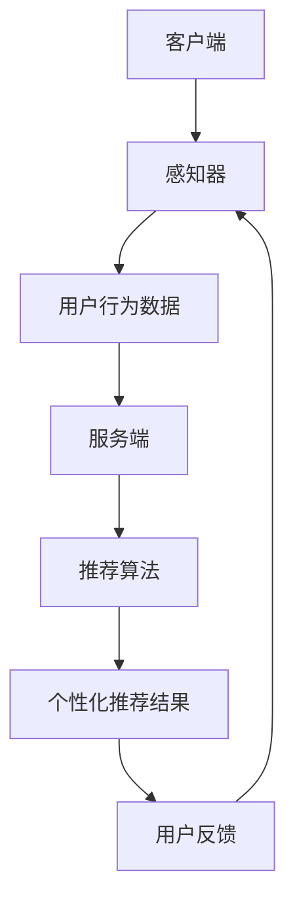
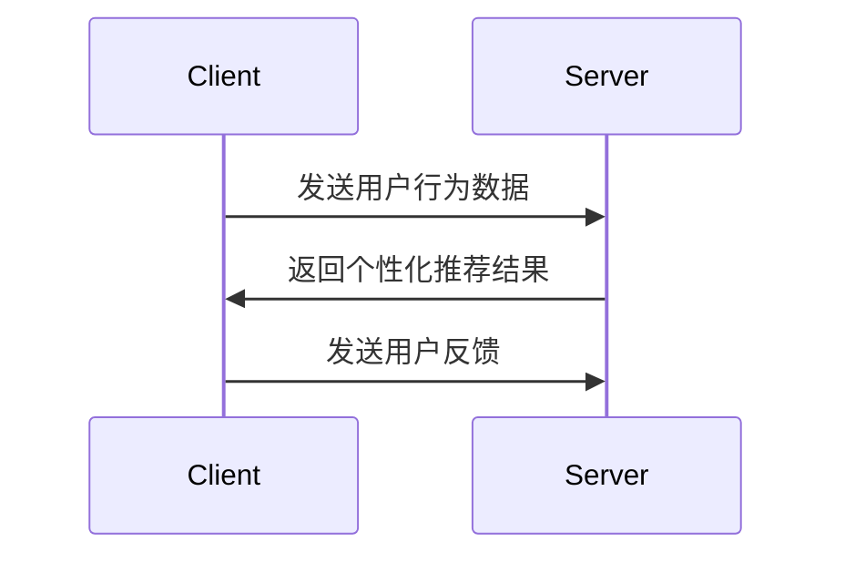

                 

## 展望未来：AI Agent技术发展趋势与机遇

> 关键词：AI Agent，发展趋势，机遇，技术演进，应用场景

> 摘要：
本文将深入探讨AI Agent技术的未来发展趋势与潜在机遇。通过分析AI Agent的定义、原理及其核心算法，我们将揭示这一领域在自动化、智能化和自适应方面的巨大潜力。同时，本文还将介绍AI Agent在实际应用中的系统设计与实现，为读者提供全面的技术视角。

### 目录大纲设计

## 第一部分：背景介绍

## 第1章 引言

### 1.1 问题背景

#### 问题描述
人工智能（AI）技术正在快速发展和变革，AI Agent作为一种新型的智能体，正逐步成为AI技术领域的研究热点。它们在自动化决策、智能交互和优化操作等方面展现出巨大的潜力。然而，当前对AI Agent技术的发展趋势与机遇的认识还不够深入和全面，需要一本系统性、前瞻性的书籍来引导读者了解这一领域。

#### 问题解决
《展望未来：AI Agent技术发展趋势与机遇》旨在为广大读者提供一幅AI Agent技术的全景图，帮助读者理解AI Agent的定义、特点、发展历程及其在各领域的应用潜力。

### 1.2 边界与外延

#### 核心概念
- **AI Agent**：一种能够自主执行任务、与环境进行交互的智能系统。
- **人工智能**：模拟人类智能行为的计算机系统。
- **机器学习**：让计算机从数据中学习并作出决策的技术。
- **深度学习**：模拟人脑神经网络结构和功能的机器学习技术。
- **自然语言处理**：使计算机能够理解、生成和处理自然语言的技术。
- **强化学习**：通过试错和反馈机制进行学习和优化决策的技术。

#### 概念结构与核心要素组成
AI Agent的核心要素包括感知器、决策器、执行器和学习器。这些要素共同构成了AI Agent的基本架构，使其能够适应不同的应用场景。

## 第二部分：核心概念与联系

## 第2章 AI Agent的基本原理

### 2.1 AI Agent的定义与特征

#### AI Agent的定义
AI Agent是一种具有感知能力、自主决策能力、行动能力和学习能力的人工智能系统。

#### AI Agent的特征
- **感知**：通过传感器感知环境。
- **决策**：根据感知信息进行决策。
- **行动**：执行决策结果。
- **学习**：从环境中学习和适应。

### 2.2 AI Agent的核心原理

#### 感知器原理
- **算法原理**：感知器是一种简单的神经网络模型，用于实现输入数据的分类。
- **算法流程**：输入数据 -> 权值计算 -> 输出结果 -> 反馈修正。
- **数学模型**：
  $$
  z = \sum_{i=1}^{n} w_i x_i + b \\
  a = \sigma(z)
  $$
- **举例说明**：使用感知器算法对手写数字进行分类。

#### 决策器原理
- **算法原理**：决策树是一种基于特征划分的数据分类方法。
- **算法流程**：
  - 根据信息增益或基尼不纯度选择最佳特征。
  - 划分数据集。
  - 递归构建决策树。
- **数学模型**：
  $$
  Gain(D, A) = Entropy(D) - \sum_{v \in Attributes(A)} \frac{|D_v|}{|D|} \cdot Entropy(D_v)
  $$
- **举例说明**：使用决策树算法对鸢尾花数据进行分类。

#### 执行器原理
- **算法原理**：神经网络是一种基于生物神经系统的计算模型。
- **算法流程**：
  - 前向传播：计算输出。
  - 反向传播：更新权值。
- **数学模型**：
  $$
  z = \sum_{i=1}^{n} w_i x_i + b \\
  a = \sigma(z)
  $$
- **举例说明**：使用神经网络算法对图像进行分类。

## 第三部分：算法原理讲解

## 第3章 AI Agent的主要算法

### 3.1 感知器算法

#### 算法原理
感知器是一种简单的神经网络模型，用于实现输入数据的分类。

#### 算法流程
输入数据 -> 权值计算 -> 输出结果 -> 反馈修正。

#### 数学模型
$$
z = \sum_{i=1}^{n} w_i x_i + b \\
a = \sigma(z)
$$

#### 举例说明
使用感知器算法对手写数字进行分类。

### 3.2 决策树算法

#### 算法原理
决策树是一种基于特征划分的数据分类方法。

#### 算法流程
- 根据信息增益或基尼不纯度选择最佳特征。
- 划分数据集。
- 递归构建决策树。

#### 数学模型
$$
Gain(D, A) = Entropy(D) - \sum_{v \in Attributes(A)} \frac{|D_v|}{|D|} \cdot Entropy(D_v)
$$

#### 举例说明
使用决策树算法对鸢尾花数据进行分类。

### 3.3 神经网络算法

#### 算法原理
神经网络是一种基于生物神经系统的计算模型。

#### 算法流程
- 前向传播：计算输出。
- 反向传播：更新权值。

#### 数学模型
$$
z = \sum_{i=1}^{n} w_i x_i + b \\
a = \sigma(z)
$$

#### 举例说明
使用神经网络算法对图像进行分类。

## 第四部分：系统分析与架构设计方案

## 第4章 AI Agent系统的设计与实现

### 4.1 系统介绍

#### 项目介绍
本章节将介绍一个基于AI Agent技术的智能推荐系统。

#### 系统功能设计
- 感知用户行为。
- 提出个性化推荐。
- 实现用户反馈循环。

### 4.2 系统架构设计

#### 系统架构设计
- 客户端：负责感知用户行为。
- 服务端：负责处理推荐算法和用户反馈。

#### 系统架构图

### 4.3 系统接口设计

#### 系统接口设计
- 客户端接口：用户行为数据采集。
- 服务端接口：推荐算法调用和用户反馈处理。

#### 系统交互序列图

## 总结与展望

随着人工智能技术的不断进步，AI Agent将在未来的智能化、自动化和自适应系统中扮演越来越重要的角色。通过本文的探讨，我们希望读者能够对AI Agent技术有更深入的理解，并能够把握这一领域的发展趋势和机遇。未来，随着计算能力的提升和数据资源的丰富，AI Agent将迎来更加广阔的应用前景。

### 最佳实践 Tips

- **持续学习与优化**：AI Agent的性能优化是一个持续的过程，需要不断学习新的算法和改进技术。
- **数据隐私保护**：在AI Agent的应用过程中，需要充分考虑用户数据的安全性和隐私性。
- **跨领域应用**：积极探索AI Agent在各个领域的应用，发挥其最大潜力。

### 小结

本文通过详细的分析和讲解，帮助读者理解了AI Agent技术的核心概念、原理和算法，以及其在系统设计与实现中的应用。AI Agent技术正逐渐成为人工智能领域的重要方向，未来将有更多的机遇等待着我们去探索和实现。

### 注意事项

- **算法选择**：根据具体应用场景选择合适的算法，确保AI Agent的高效性和准确性。
- **系统架构**：在设计AI Agent系统时，要充分考虑系统的可扩展性和可维护性。

### 拓展阅读

- **相关书籍**：《人工智能：一种现代的方法》、《深度学习》、《强化学习》等。
- **学术期刊**：《人工智能学报》、《计算机研究与发展》、《模式识别与人工智能》等。

### 作者信息

作者：AI天才研究院/AI Genius Institute & 禅与计算机程序设计艺术 /Zen And The Art of Computer Programming

