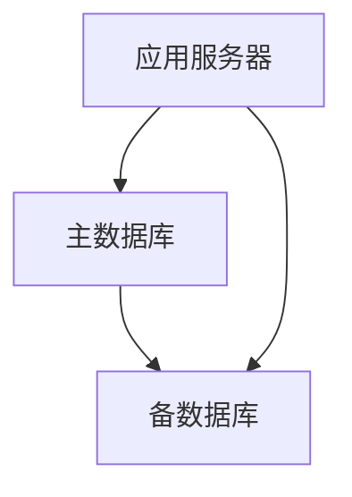
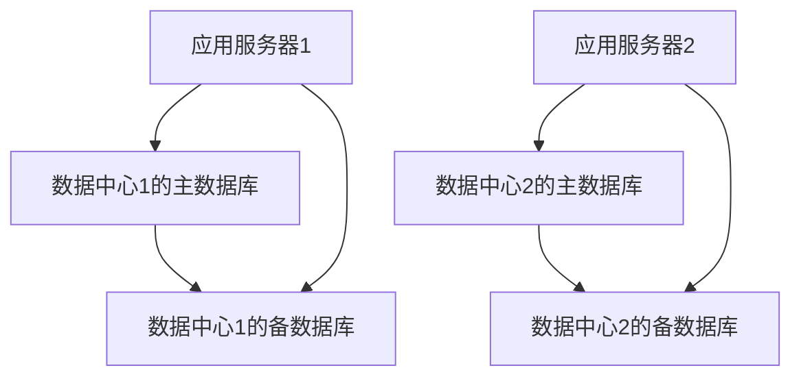
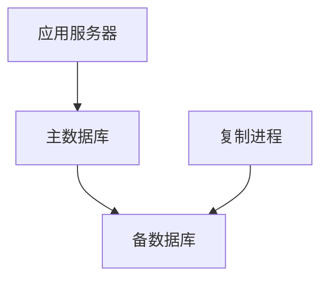
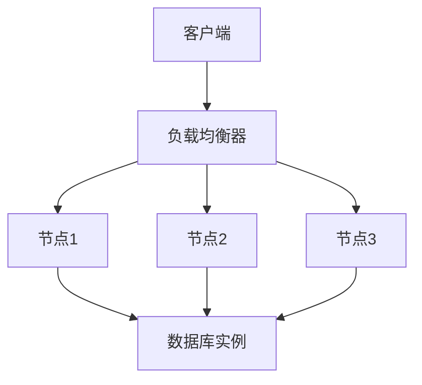
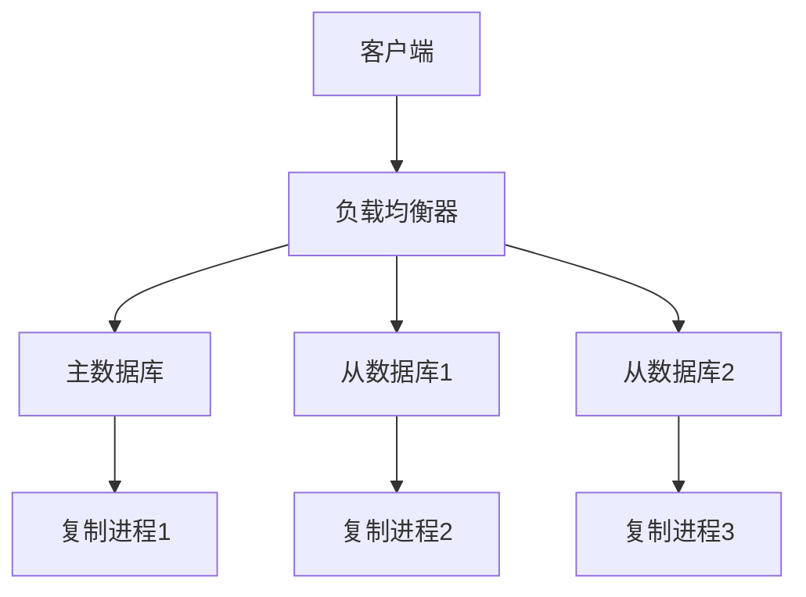

                 

### 文章标题

# 常见数据库的高可用方案及盲区

### 关键词

- 数据库高可用性
- 主备模式
- 数据库复制
- 集群
- 数据一致性
- 性能优化
- 网络分区解决方案
- 管理监控
- 成本考量

### 摘要

在当今的数据驱动的世界中，数据库的高可用性是确保业务连续性和数据完整性的一项关键要求。本文旨在深入探讨常见数据库的高可用性方案，包括主备模式、数据库复制、集群等技术，并分析这些方案的优劣及其潜在的盲点。通过实例和最佳实践，本文提供了对高可用性策略的实际应用指导，以帮助读者更好地理解和实施数据库高可用性方案。文章还讨论了未来高可用性技术的发展趋势和研究方向。

## 引言

在数字化转型的浪潮中，数据库已经成为支撑各类业务应用的核心组件。随着数据量的激增和业务需求的复杂化，确保数据库的高可用性成为企业必须面对的挑战。数据库的高可用性指的是在出现故障或异常情况下，系统能够迅速恢复，从而最小化对业务的影响。高可用性不仅涉及硬件和网络的可靠性，还包括软件层面的故障转移、数据备份与恢复机制等。

### 核心概念术语说明

- **高可用性（High Availability）**：系统在故障发生时，能够快速恢复并提供服务的能力。
- **主备模式（Master-Slave Model）**：一种数据库高可用性方案，其中主数据库处理所有读写操作，备数据库作为热备份，以备主数据库出现故障时快速切换。
- **数据库复制（Database Replication）**：将数据库的数据复制到其他数据库实例中，以实现数据冗余和分布。
- **集群（Cluster）**：通过将多个数据库实例集合在一起，提供负载均衡和数据冗余。
- **数据一致性（Data Consistency）**：确保多个数据库实例中的数据保持一致。
- **性能优化（Performance Optimization）**：通过优化数据库配置和查询，提高系统性能。
- **网络分区解决方案（Network Partition Solution）**：解决因网络故障导致的数据中心或服务器之间的通信问题。

### 问题背景

随着企业对数据依赖的加深，数据库系统的稳定性、可靠性和高可用性变得越来越重要。以下是几个背景因素：

1. **数据量大**：随着大数据技术的普及，数据库存储和处理的数据量呈指数级增长。
2. **业务连续性要求高**：许多业务对数据的实时性和可靠性有着极高的要求，任何系统故障都可能导致严重的业务中断和财务损失。
3. **多租户环境**：在云计算环境中，多个租户共享数据库资源，要求更高的隔离性和可靠性。
4. **全球化运营**：企业可能在全球多个地理位置运营，这要求数据库能够跨区域提供高可用性。

### 问题描述

数据库高可用性面临的主要问题包括：

- **故障切换**：在主数据库发生故障时，如何快速切换到备数据库，并确保数据一致性。
- **数据备份与恢复**：如何有效地备份数据并在需要时快速恢复。
- **性能优化**：在提供高可用性的同时，如何确保数据库性能不受影响。
- **成本考量**：高可用性方案的实施和维护通常涉及较高的成本。

### 问题解决

解决数据库高可用性问题的方法包括：

- **主备模式**：通过设置主备数据库，实现故障切换和数据冗余。
- **数据库复制**：将数据复制到其他数据库实例，提高数据冗余和可用性。
- **集群**：将多个数据库实例集合在一起，提供负载均衡和数据冗余。
- **数据一致性**：使用事务机制和一致性协议，确保数据一致性。
- **性能优化**：通过查询优化、索引优化等手段提高性能。
- **网络分区解决方案**：通过设计网络协议和故障恢复机制，解决网络分区问题。

### 边界与外延

- **边界**：本文主要探讨常见数据库的高可用性方案，不涉及特定数据库产品的实现细节。
- **外延**：本文还将探讨高可用性方案在特定场景下的应用，如云数据库、分布式数据库等。

### 概念结构与核心要素组成

- **高可用性结构**：包括主数据库、备数据库、故障检测和切换机制。
- **数据一致性机制**：如分布式一致性算法、事务机制等。
- **性能优化策略**：如查询优化、索引优化等。
- **成本考量**：包括硬件成本、软件成本、维护成本等。

### 关联性分析

- **主备模式与数据库复制**：主备模式是一种特殊的数据库复制方案，旨在实现故障切换。
- **集群与主备模式**：集群可以通过多个主数据库实例提供更高的可用性和性能。
- **数据一致性与故障切换**：在故障切换过程中，确保数据一致性是一项关键技术挑战。

### 未来展望

随着技术的不断进步，未来数据库高可用性将可能包括以下趋势：

- **自动化故障检测与切换**：通过自动化工具和AI技术，实现更智能的故障检测和切换。
- **云数据库高可用性**：随着云服务的普及，云数据库的高可用性将变得更加重要。
- **分布式数据库**：分布式数据库将在提供高可用性方面发挥更大的作用。

通过本文的深入探讨，我们希望读者能够更好地理解和实施数据库高可用性方案，为业务连续性和数据完整性提供坚实保障。在接下来的章节中，我们将详细分析常见的高可用性方案及其潜在盲点。

## 高可用性方案的分类与核心要素

在探讨常见数据库的高可用性方案之前，首先需要理解高可用性方案的基本分类及其核心要素。高可用性方案可以大致分为以下几类：主备模式、数据库复制、集群、数据一致性协议等。每种方案都有其特定的原理、优势和适用场景。

### 主备模式

**原理**：主备模式是一种常见的高可用性解决方案，其中主数据库处理所有读写操作，备数据库作为热备份。当主数据库发生故障时，备数据库可以迅速接管，从而确保业务的连续性。

**核心要素**：

- **主数据库**：负责处理所有的读写请求。
- **备数据库**：在主数据库故障时，提供快速接管的能力。
- **故障检测与切换机制**：通过监控工具定期检查主数据库的健康状态，并在检测到故障时自动切换到备数据库。

**优势**：

- **快速故障切换**：主备模式提供了快速的故障切换机制，可以在几秒内完成切换。
- **数据一致性**：由于主备模式是同步复制，主数据库和备数据库的数据保持一致。

**劣势**：

- **性能瓶颈**：主数据库需要处理所有的读写请求，可能会成为性能瓶颈。
- **资源浪费**：在主数据库正常运行时，备数据库的利用率通常较低。

**适用场景**：

- **对数据一致性要求较高**：如金融、电子商务等对数据一致性有极高要求的场景。
- **小规模应用**：适合小规模应用，因为主数据库和备数据库通常部署在同一数据中心。

### 数据库复制

**原理**：数据库复制是将数据从一个数据库实例复制到另一个或多个数据库实例中，以提高数据的冗余性和可用性。

**核心要素**：

- **主数据库**：作为数据源，处理所有的读写请求。
- **从数据库**：接收主数据库的复制数据，提供冗余和可用性。
- **复制协议**：如二进制日志、SQL复制等，用于同步数据。

**优势**：

- **高可用性**：通过复制，可以在多个数据库实例中存储数据，从而提高系统的可用性。
- **数据备份**：复制提供了数据的备份功能，可以在灾难发生时快速恢复。

**劣势**：

- **数据一致性**：由于复制通常是异步的，主数据库和从数据库的数据可能存在延迟。
- **性能影响**：复制过程可能会对主数据库的性能产生一定影响。

**适用场景**：

- **大规模应用**：适合大规模应用，可以在不同的数据中心部署从数据库，提高数据可用性。
- **数据备份与恢复**：用于数据的备份和恢复，提高系统的容灾能力。

### 集群

**原理**：集群是将多个数据库实例组合在一起，提供负载均衡和数据冗余。

**核心要素**：

- **节点**：组成集群的数据库实例。
- **负载均衡**：将请求分发到不同的节点，以平衡负载。
- **故障转移**：在某个节点发生故障时，自动将负载转移到其他节点。

**优势**：

- **高可用性**：通过负载均衡和故障转移，提供高效的高可用性。
- **性能优化**：通过负载均衡，可以提高系统的整体性能。

**劣势**：

- **复杂性**：集群的部署和管理较为复杂。
- **数据一致性**：在多个节点之间维护数据一致性可能是一项挑战。

**适用场景**：

- **高并发应用**：适合高并发应用，可以通过负载均衡提高系统的响应能力。
- **分布式应用**：在分布式系统中，集群可以提供高效的数据处理和存储能力。

### 数据一致性协议

**原理**：数据一致性协议是一种确保多个数据库实例之间数据一致性的方法。

**核心要素**：

- **一致性算法**：如Paxos、Raft等，用于确保数据一致性。
- **一致性检测**：定期检测数据一致性，并在不一致时进行修复。

**优势**：

- **数据一致性**：通过一致性协议，可以确保多个数据库实例之间的数据一致性。
- **容错性**：即使在某些节点发生故障时，系统仍能保持一致性。

**劣势**：

- **性能影响**：一致性协议通常会增加系统的开销，可能影响性能。
- **复杂性**：一致性协议的部署和管理较为复杂。

**适用场景**：

- **高一致性要求**：如金融交易系统、账务系统等，对数据一致性有极高要求的场景。
- **分布式系统**：在分布式系统中，数据一致性协议是确保系统整体一致性的一项关键技术。

### 高可用性方案的对比分析

以下是对常见高可用性方案的核心要素、优势和劣势的对比分析：

| 高可用性方案 | 核心要素 | 优势 | 劣势 | 适用场景 |
| --- | --- | --- | --- | --- |
| 主备模式 | 主数据库、备数据库、故障检测与切换机制 | 快速故障切换、数据一致性 | 性能瓶颈、资源浪费 | 对数据一致性要求较高、小规模应用 |
| 数据库复制 | 主数据库、从数据库、复制协议 | 高可用性、数据备份 | 数据一致性、性能影响 | 大规模应用、数据备份与恢复 |
| 集群 | 节点、负载均衡、故障转移 | 高可用性、性能优化 | 复杂性、数据一致性 | 高并发应用、分布式应用 |
| 数据一致性协议 | 一致性算法、一致性检测 | 数据一致性、容错性 | 性能影响、复杂性 | 高一致性要求、分布式系统 |

通过对比分析，我们可以根据具体业务需求选择最合适的高可用性方案。在下一章节中，我们将详细探讨每种高可用性方案的实现原理和具体应用场景。

### 主备模式

主备模式是数据库高可用性解决方案中最为常见的一种。它通过将数据存储在一个主数据库和一个或多个备数据库中，实现数据的冗余和快速故障切换。主备模式的主要目标是确保系统在主数据库出现故障时，能够迅速切换到备数据库，从而保证业务的连续性和数据完整性。

#### 实现原理

主备模式的基本原理是主数据库负责处理所有的读写请求，而备数据库则在后台异步或同步地复制主数据库的数据。当主数据库出现故障时，系统会自动检测到故障，并切换到备数据库，确保业务不受影响。

以下是主备模式的核心组件：

- **主数据库**：负责处理所有的读写请求，是数据的主要存储位置。
- **备数据库**：作为主数据库的热备份，用于在主数据库故障时接管业务。
- **复制机制**：用于将主数据库的数据复制到备数据库，确保数据一致性。
- **故障检测与切换机制**：通过监控工具定期检查主数据库的健康状态，并在检测到故障时自动切换到备数据库。

#### 优势

1. **快速故障切换**：主备模式提供了快速的故障切换机制，可以在几秒内完成切换，确保业务的连续性。
2. **数据一致性**：由于主备模式通常采用同步复制，主数据库和备数据库的数据保持一致。
3. **易于管理**：主备模式相对简单，易于部署和管理。

#### 劣势

1. **性能瓶颈**：主数据库需要处理所有的读写请求，可能会成为性能瓶颈。
2. **资源浪费**：在主数据库正常运行时，备数据库的利用率通常较低，可能会造成资源的浪费。

#### 应用场景

1. **对数据一致性要求较高的应用**：如金融系统、电子商务系统等，这些系统对数据的一致性和可靠性有非常高的要求。
2. **小规模应用**：由于主备模式相对简单，适合小规模应用，成本相对较低。

#### 实例解析

假设我们有一个电子商务平台，其数据库系统采用主备模式。以下是一个简化的架构图：



在这个架构中，主数据库负责处理所有的读写请求，而备数据库则在后台异步复制主数据库的数据。如果主数据库发生故障，系统会自动检测到故障，并切换到备数据库，确保业务的连续性。

#### 主备模式的实现步骤

1. **部署主数据库和备数据库**：在两个独立的物理服务器或虚拟机上部署主数据库和备数据库。
2. **配置复制机制**：根据数据库的类型和版本，配置相应的复制机制，如MySQL的 replication、PostgreSQL的streaming replication等。
3. **配置故障检测与切换机制**：部署监控工具，如Zabbix、Nagios等，定期检查主数据库的健康状态，并在检测到故障时自动切换到备数据库。
4. **测试切换过程**：在实际部署前，进行充分的测试，确保切换过程能够顺利进行。

通过以上步骤，可以确保主备模式的高可用性，为电子商务平台提供稳定的数据服务。

### 主备模式的优化策略

为了进一步提高主备模式的性能和可靠性，可以采用以下优化策略：

1. **读写分离**：将读请求分配到备数据库，减轻主数据库的负载。
2. **延迟复制**：允许备数据库在某些情况下稍微延迟复制主数据库的数据，以减少对主数据库的性能影响。
3. **多节点备库**：部署多个备数据库，提高故障切换的效率和可靠性。
4. **监控与告警**：加强监控与告警机制，确保能够及时发现故障并切换到备数据库。
5. **自动化运维**：采用自动化工具和脚本，简化主备模式的部署和管理。

通过这些优化策略，可以显著提升主备模式的性能和可靠性，为电子商务平台提供更稳定的数据服务。

### 主备模式在分布式系统中的应用

在分布式系统中，主备模式可以用于多个数据中心之间的数据同步和故障切换。以下是一个简化的分布式系统架构图：



在这个架构中，每个数据中心都有一个主数据库和一个备数据库。主数据库负责处理本地数据，同时也将数据复制到其他数据中心的主数据库。通过这种方式，可以确保在不同数据中心之间的数据一致性和故障切换能力。

### 总结

主备模式是一种简单而有效的高可用性解决方案，适用于对数据一致性有较高要求的小规模应用。通过合理的部署和优化策略，可以进一步提升主备模式的性能和可靠性。在分布式系统中，主备模式还可以实现跨数据中心的数据同步和故障切换，为大规模分布式应用提供稳定的数据服务。

### 数据库复制

数据库复制是一种通过将数据从一个数据库实例复制到其他数据库实例中，以实现数据冗余和分布的高可用性方案。复制技术可以确保在主数据库发生故障时，备数据库能够迅速接管，从而确保业务的连续性和数据完整性。在本节中，我们将详细探讨数据库复制的原理、实现方法、优缺点及其在分布式系统中的应用。

#### 原理

数据库复制的基本原理是将主数据库的操作（如插入、更新、删除）记录下来，然后将其复制到备数据库。根据复制过程中数据同步的方式，数据库复制可以分为同步复制和异步复制。

1. **同步复制**：在同步复制中，主数据库在每个操作执行后，都会等待备数据库的确认，确保操作在备数据库中也成功执行。这种方式的优点是数据一致性较高，但缺点是复制过程可能会影响主数据库的性能，因为主数据库需要等待备数据库的响应。
   
   - **同步复制优点**：数据一致性高，确保主备数据库状态一致。
   - **同步复制缺点**：性能开销较大，主数据库的响应时间可能较长。

2. **异步复制**：在异步复制中，主数据库在操作执行后，不等待备数据库的确认，而是将操作记录保存在日志中，随后异步地发送给备数据库。这种方式的优点是主数据库的性能不受影响，但缺点是备数据库可能在主数据库故障后仍存在一定的数据差异。

   - **异步复制优点**：性能开销较小，主数据库的性能不受影响。
   - **异步复制缺点**：数据一致性相对较低，可能存在一定延迟。

#### 实现方法

1. **基于日志的复制**：最常用的复制方法是基于日志的复制。主数据库在操作执行时，会将操作记录到二进制日志或归档日志中，然后通过复制进程将日志发送到备数据库。备数据库读取日志并执行相应的操作，以保持与主数据库的数据一致性。

2. **基于快照的复制**：基于快照的复制方法是在特定时间点生成主数据库的快照，然后将快照传输到备数据库。这种方式可以在无需实时同步数据的情况下，快速实现数据复制。然而，由于快照通常包含一定时间窗口内的数据变化，因此这种方法不适用于需要实时同步的场景。

3. **基于流数据的复制**：基于流数据的复制方法是将主数据库的实时操作以流的形式传输到备数据库。这种方式可以实现实时数据同步，但可能会对主数据库的性能产生一定影响。

#### 优缺点

1. **优势**：

   - **高可用性**：通过复制，可以在多个数据库实例中存储数据，从而提高系统的可用性。
   - **数据备份**：复制提供了数据的备份功能，可以在灾难发生时快速恢复。
   - **负载均衡**：通过将读请求分配到备数据库，可以减轻主数据库的负载。

2. **劣势**：

   - **数据一致性**：由于复制通常是异步的，主数据库和从数据库的数据可能存在延迟。
   - **性能影响**：复制过程可能会对主数据库的性能产生一定影响。

#### 应用场景

1. **大规模应用**：在需要处理大量数据和高并发访问的应用中，复制技术可以用于数据的冗余和负载均衡。
2. **分布式系统**：在分布式系统中，复制技术可以用于实现跨数据中心的数据同步和故障切换。
3. **数据备份**：复制技术可以作为数据备份的一种手段，确保在主数据库发生故障时能够快速恢复。

#### 实例解析

假设我们有一个电子商务平台，其数据库系统采用异步复制方案。以下是一个简化的架构图：



在这个架构中，主数据库负责处理所有的读写请求，并通过复制进程将操作记录异步地发送到备数据库。如果主数据库发生故障，系统会自动切换到备数据库，确保业务的连续性。

#### 实现步骤

1. **配置主数据库和备数据库**：在主数据库和备数据库上配置复制功能，确保数据能够同步。
2. **配置复制进程**：设置复制进程，确保主数据库的操作能够实时或异步地发送到备数据库。
3. **测试复制过程**：在实际部署前，进行充分的测试，确保数据能够在主备数据库之间保持一致性。

通过以上步骤，可以确保数据库复制的成功实施，为电子商务平台提供高可用性的数据服务。

#### 复制的优化策略

为了进一步提高数据库复制的性能和可靠性，可以采用以下优化策略：

1. **读写分离**：将读请求分配到备数据库，减轻主数据库的负载。
2. **延迟复制**：允许备数据库在某些情况下稍微延迟复制主数据库的数据，以减少对主数据库的性能影响。
3. **多节点备库**：部署多个备数据库，提高故障切换的效率和可靠性。
4. **监控与告警**：加强监控与告警机制，确保能够及时发现复制故障并修复。
5. **自动化运维**：采用自动化工具和脚本，简化数据库复制的部署和管理。

通过这些优化策略，可以显著提升数据库复制的性能和可靠性，为电子商务平台提供更稳定的数据服务。

### 数据库复制在分布式系统中的应用

在分布式系统中，数据库复制可以用于跨数据中心的数据同步和故障切换。以下是一个简化的分布式系统架构图：


在这个架构中，每个数据中心都有一个主数据库和一个备数据库。主数据库负责处理本地数据，同时也将数据复制到其他数据中心的主数据库。通过这种方式，可以确保在不同数据中心之间的数据一致性和故障切换能力。

### 总结

数据库复制是一种通过数据冗余和分布提高数据库系统高可用性的重要技术。它适用于大规模应用和分布式系统，但在数据一致性和性能方面存在一定的挑战。通过合理的部署和优化策略，可以最大限度地发挥数据库复制的优势，为电子商务平台提供稳定的数据服务。

### 数据库集群

数据库集群是将多个数据库实例组合在一起，提供高可用性、负载均衡和数据冗余的一种高可用性方案。在数据库集群中，多个节点协同工作，共同处理数据库操作，从而提高系统的性能和可靠性。在本节中，我们将详细探讨数据库集群的实现原理、架构设计、负载均衡和故障切换机制。

#### 实现原理

数据库集群的基本原理是将多个数据库实例组织在一起，通过负载均衡器将客户端请求分发到不同的节点上，从而实现负载均衡。当某个节点发生故障时，系统会自动将故障节点的请求转移到其他健康的节点上，确保业务的连续性。

以下是数据库集群的核心组件：

1. **节点**：组成集群的数据库实例，每个节点都可以独立处理数据库操作。
2. **负载均衡器**：将客户端请求分发到不同的节点，以平衡负载。
3. **故障检测与切换机制**：定期检查节点的健康状态，并在检测到故障时将故障节点的请求转移到其他节点。

#### 架构设计

数据库集群的架构设计可以根据具体需求和场景进行多种组合。以下是一种常见的数据库集群架构：



在这个架构中，客户端请求首先由负载均衡器接收，负载均衡器根据负载情况和健康状态将请求分发到不同的节点。每个节点都独立处理数据库操作，并将结果返回给负载均衡器。负载均衡器还负责监测节点的健康状态，并在检测到节点故障时自动切换到其他节点。

#### 负载均衡

负载均衡是数据库集群的关键技术之一，其目的是将客户端请求合理地分配到不同的节点，以充分利用集群的资源，提高系统的性能和响应速度。负载均衡的方法可以分为以下几种：

1. **轮询负载均衡**：将请求按照轮询顺序分配到各个节点，每个节点轮流处理请求。
2. **最小连接负载均衡**：将请求分配到当前连接数最少的节点，以平衡节点的负载。
3. **加权负载均衡**：根据节点的处理能力，为不同的节点分配不同的权重，从而影响请求的分发策略。

#### 故障切换机制

故障切换机制是确保数据库集群在节点发生故障时能够继续提供服务的关键技术。故障切换机制通常包括以下步骤：

1. **节点健康检查**：定期检查每个节点的健康状态，包括连接数、响应时间、错误率等。
2. **故障检测**：当检测到节点故障时，立即标记该节点为不可用。
3. **请求转移**：将故障节点的请求转移到其他健康的节点，确保业务连续性。
4. **故障恢复**：在故障节点修复后，将其重新加入到集群中，并重新分配请求。

#### 优缺点

1. **优势**：

   - **高可用性**：通过负载均衡和故障切换机制，数据库集群可以确保在节点故障时，业务不受影响。
   - **性能优化**：通过将请求分发到多个节点，可以充分利用集群的资源，提高系统的性能。
   - **可伸缩性**：可以根据业务需求动态增加或减少节点，以适应负载的变化。

2. **劣势**：

   - **复杂性**：数据库集群的部署和管理较为复杂，需要专业知识和经验。
   - **数据一致性**：在多个节点之间维护数据一致性可能是一项挑战。

#### 应用场景

1. **高并发应用**：如电子商务平台、在线支付系统等，这些系统需要处理大量并发请求，数据库集群可以提供高效的负载均衡和故障切换能力。
2. **分布式系统**：在分布式系统中，数据库集群可以提供高效的数据处理和存储能力。
3. **大规模应用**：在需要处理海量数据和高并发访问的场景中，数据库集群可以提高系统的性能和可靠性。

#### 实例解析

假设我们有一个电子商务平台，其数据库系统采用数据库集群方案。以下是一个简化的架构图：


在这个架构中，客户端请求首先由负载均衡器接收，负载均衡器根据轮询策略将请求分配到不同的节点。每个节点独立处理数据库操作，并将结果返回给负载均衡器。负载均衡器还负责监测节点的健康状态，并在检测到节点故障时自动切换到其他节点，确保业务的连续性。

#### 实现步骤

1. **部署节点**：在多个独立的物理服务器或虚拟机上部署数据库节点。
2. **配置负载均衡器**：根据具体需求，配置负载均衡器，将请求分发到不同的节点。
3. **配置故障检测与切换机制**：部署监控工具，如Zabbix、Nagios等，定期检查节点的健康状态，并在检测到故障时自动切换到其他节点。
4. **测试集群性能**：在实际部署前，进行充分的测试，确保集群性能满足业务需求。

通过以上步骤，可以确保数据库集群的高可用性和性能，为电子商务平台提供稳定的数据服务。

#### 集群的优化策略

为了进一步提高数据库集群的性能和可靠性，可以采用以下优化策略：

1. **读写分离**：将读请求分配到备库，减轻主库的负载。
2. **分库分表**：将数据按照不同的业务模块划分到不同的数据库实例中，以提高查询效率。
3. **缓存策略**：在节点之间部署缓存，如Redis、Memcached等，减少数据库的查询压力。
4. **监控与告警**：加强监控与告警机制，确保能够及时发现集群故障并快速处理。
5. **自动化运维**：采用自动化工具和脚本，简化集群的部署和管理。

通过这些优化策略，可以显著提升数据库集群的性能和可靠性，为电子商务平台提供更稳定的数据服务。

### 总结

数据库集群是一种通过多个节点协同工作提高数据库系统性能和可靠性的高可用性方案。它适用于高并发应用、分布式系统和大规模应用。通过合理的架构设计和优化策略，可以确保数据库集群的高性能和可靠性，为业务连续性和数据完整性提供坚实保障。

### 数据库复制与集群的比较

数据库复制和集群是两种常见的高可用性方案，它们在实现原理、性能和适用场景上有所不同。以下是对这两种方案的详细比较：

#### 实现原理

- **数据库复制**：数据库复制通过将主数据库的操作记录同步到备数据库，确保数据冗余和备份。复制可以是同步或异步的，取决于具体实现。
- **集群**：数据库集群通过多个节点协同工作，提供负载均衡和数据冗余。集群中的节点可以动态参与工作，实现故障转移。

#### 性能

- **数据库复制**：数据库复制的性能取决于复制协议和复制延迟。异步复制在性能上优于同步复制，但数据一致性可能较差。
- **集群**：集群的性能受节点数量和负载均衡策略的影响。通过合理配置负载均衡器，可以显著提高集群的性能。

#### 数据一致性

- **数据库复制**：由于复制是异步或同步的，主备数据库之间可能存在数据延迟，数据一致性依赖于复制协议。
- **集群**：集群通过一致性算法（如Raft、Paxos）确保节点之间数据一致性。然而，一致性算法可能引入额外的性能开销。

#### 适用场景

- **数据库复制**：适用于需要数据备份和冗余的场景，如大规模应用和跨数据中心部署。
- **集群**：适用于高并发、分布式系统，需要提供负载均衡和故障转移能力。

#### 对比表格

| 特性 | 数据库复制 | 集群 |
| --- | --- | --- |
| 实现原理 | 复制主数据库操作到备数据库 | 多节点协同工作，提供负载均衡和故障转移 |
| 性能 | 取决于复制协议和延迟 | 取决于节点数量和负载均衡策略 |
| 数据一致性 | 异步或同步复制 | 通过一致性算法保证 |
| 适用场景 | 数据备份和冗余 | 高并发、分布式系统 |

通过以上对比，可以看出数据库复制和集群各有优势，适用于不同的业务场景。选择合适的方案需要综合考虑业务需求、性能要求和高可用性目标。

### 高可用性方案的盲点分析

尽管数据库高可用性方案在理论和技术上已经相当成熟，但在实际应用中仍然存在一些盲点，这些盲点可能会导致系统在高负载或故障情况下出现性能瓶颈、数据一致性问题或其他潜在风险。以下我们将分析高可用性方案中常见的盲点，并提供相应的解决方案和最佳实践。

#### 数据一致性

**问题描述**：在实现高可用性时，数据一致性是一个至关重要的挑战。特别是当系统采用分布式架构或使用异步复制时，数据可能在不同节点之间存在延迟或不一致。

**原因分析**：分布式系统中的数据一致性问题通常源于以下几个方面：

- **异步复制**：异步复制在提高性能的同时，可能引入数据延迟。
- **网络延迟**：在跨数据中心的分布式系统中，网络延迟可能导致数据同步不及时。
- **并发操作**：在并发环境下，不同节点的操作可能会相互干扰，导致数据不一致。

**解决方案**：

- **强一致性协议**：采用强一致性协议（如Paxos、Raft）确保数据在不同节点之间的一致性。
- **一致性检测与修复**：定期检查数据一致性，并在检测到不一致时进行自动修复。
- **延迟容忍**：设计系统时，考虑一定的延迟容忍度，允许数据在一定时间内不完全一致。

**最佳实践**：

- **一致性设计**：在设计分布式系统时，明确数据一致性的需求，选择合适的一致性协议。
- **数据同步策略**：合理配置数据同步策略，平衡性能与数据一致性。

#### 性能优化

**问题描述**：在高可用性方案中，性能优化往往被忽视，导致系统在高负载情况下出现性能瓶颈。

**原因分析**：

- **查询优化不足**：数据库查询未经过充分优化，导致响应时间过长。
- **索引缺失**：未建立适当的索引，查询效率低下。
- **资源竞争**：在高并发场景下，资源竞争可能导致性能下降。

**解决方案**：

- **查询优化**：定期进行查询优化，包括创建适当的索引、优化查询语句等。
- **负载均衡**：使用负载均衡器合理分配请求，避免单一节点过载。
- **缓存策略**：部署缓存系统，如Redis、Memcached，减少数据库的查询压力。

**最佳实践**：

- **性能监控**：定期监控系统的性能指标，及时发现和解决问题。
- **性能测试**：在系统上线前进行充分性能测试，确保系统能够应对高负载。

#### 网络分区解决方案

**问题描述**：在网络分区的情况下，系统可能无法正常工作，导致业务中断。

**原因分析**：网络分区可能由以下原因导致：

- **物理网络故障**：如交换机故障、光纤断裂等。
- **网络配置问题**：如路由配置错误、DNS故障等。
- **高并发访问**：在大量请求同时访问时，可能引发网络拥塞。

**解决方案**：

- **冗余网络**：部署冗余的网络连接，确保数据在不同网络之间传输。
- **故障检测与切换**：使用故障检测工具，及时发现网络故障并切换到备用网络。
- **负载均衡**：使用负载均衡器，合理分配请求，避免单一网络过载。

**最佳实践**：

- **网络监控**：定期监控网络状态，确保网络稳定运行。
- **灾备中心**：在异地部署灾备中心，以应对极端网络故障。

#### 数据备份与恢复

**问题描述**：在系统故障或数据损坏时，数据备份和恢复机制可能无法有效执行，导致数据丢失。

**原因分析**：

- **备份策略不完善**：未定期进行数据备份，或备份策略不合理。
- **备份存储问题**：备份数据存储在相同物理位置，无法应对物理故障。
- **备份验证不足**：备份完成后未进行验证，导致备份数据不可用。

**解决方案**：

- **定期备份**：制定定期备份策略，确保数据安全。
- **多地点备份**：将备份数据存储在多个地点，以应对物理故障。
- **备份验证**：定期验证备份数据的完整性和可用性。

**最佳实践**：

- **备份策略文档化**：明确备份策略和流程，确保备份工作有序进行。
- **备份管理工具**：使用专业的备份管理工具，简化备份操作。

#### 管理与监控

**问题描述**：缺乏有效的管理和监控机制，导致高可用性方案难以持续运行。

**原因分析**：

- **缺乏监控工具**：未部署监控工具，无法及时发现系统问题。
- **告警机制不足**：告警机制不完善，导致故障无法及时处理。
- **运维管理经验不足**：缺乏专业的运维团队，难以应对复杂的高可用性系统。

**解决方案**：

- **部署监控工具**：选择合适的监控工具，如Zabbix、Prometheus，实时监控系统状态。
- **完善的告警机制**：设置合理的告警阈值和告警方式，确保故障能够及时被发现和处理。
- **运维团队培训**：加强对运维团队的培训，提高其应对高可用性系统的能力。

**最佳实践**：

- **自动化运维**：采用自动化工具和脚本，简化日常运维操作。
- **运维文档**：建立完善的运维文档，包括系统架构、配置文件、操作指南等。

#### 成本考量

**问题描述**：高可用性方案的实施和维护成本较高，可能导致企业在预算上的压力。

**原因分析**：

- **硬件成本**：部署高可用性系统需要昂贵的硬件资源。
- **软件成本**：选择合适的数据库软件和中间件，需要支付相应的许可证费用。
- **维护成本**：定期维护和更新系统，需要投入更多的人力和时间。

**解决方案**：

- **成本优化**：选择适合企业需求的硬件和软件，避免过度投资。
- **云服务**：利用云服务降低硬件和软件成本，同时获取更灵活的资源管理。
- **成本控制**：制定详细的成本预算和监控策略，确保成本在可控范围内。

**最佳实践**：

- **成本评估**：在项目启动前进行详细的成本评估，确保预算合理。
- **成本效益分析**：定期进行成本效益分析，评估高可用性方案的长期效益。

通过以上分析和解决方案，我们可以更好地理解和应对高可用性方案中的盲点，确保数据库系统在面临各种挑战时能够持续稳定地运行。在接下来的章节中，我们将通过实际案例和最佳实践，进一步探讨高可用性方案的实施细节。

### 实战案例：主备模式的实现

在本节中，我们将通过一个实际案例详细讲解主备模式的实现过程，包括环境安装、主备配置、故障切换和恢复步骤。该案例将采用MySQL数据库作为主备模式的核心组件，并通过常见的监控工具进行故障检测与告警。

#### 环境安装

**1. 安装MySQL数据库**

首先，在主数据库和备数据库的服务器上安装MySQL数据库。以下是使用yum包管理器安装MySQL的步骤：

- **主数据库服务器**：
  ```bash
  # 安装MySQL yum包
  sudo yum install mysql-server
  
  # 启动MySQL服务
  sudo systemctl start mysqld
  
  # 设置MySQL服务开机启动
  sudo systemctl enable mysqld
  ```

- **备数据库服务器**：
  ```bash
  # 安装MySQL yum包
  sudo yum install mysql-server
  
  # 启动MySQL服务
  sudo systemctl start mysqld
  
  # 设置MySQL服务开机启动
  sudo systemctl enable mysqld
  ```

**2. 配置主数据库**

在主数据库服务器上，我们需要修改配置文件 `/etc/my.cnf`，添加或修改以下配置项：

```ini
[mysqld]
server-id = 1
log-bin = yes
binlog-format = ROW
binlog-ignore-db = mysql
binlog-ignore-db = information_schema
binlog-ignore-db = performance_schema
```

启动MySQL服务，并初始化主数据库：

```bash
sudo systemctl restart mysqld

# 初始化主数据库
mysql -e "ALTER USER 'root'@'localhost' IDENTIFIED BY 'your_new_password';"

# 查看主数据库状态
mysql -e "SHOW MASTER STATUS;"
```

**3. 配置备数据库**

在备数据库服务器上，同样需要修改配置文件 `/etc/my.cnf`，添加或修改以下配置项：

```ini
[mysqld]
server-id = 2
log-bin = yes
binlog-format = ROW
binlog-ignore-db = mysql
binlog-ignore-db = information_schema
binlog-ignore-db = performance_schema
```

启动MySQL服务，并初始化备数据库：

```bash
sudo systemctl restart mysqld

# 初始化备数据库
mysql -e "ALTER USER 'root'@'localhost' IDENTIFIED BY 'your_new_password';"

# 查看备数据库状态
mysql -e "SHOW SLAVE STATUS \G"
```

#### 主备配置

**1. 主数据库配置**

在主数据库服务器上，我们需要创建一个用于复制的用户，并将其授权给备数据库：

```bash
# 创建复制用户
mysql -e "CREATE USER 'repl'@'%' IDENTIFIED BY 'your_password';"

# 授权用户
mysql -e "GRANT REPLICATION SLAVE ON *.* TO 'repl'@'%';"

# 查看用户权限
mysql -e "SHOW GRANTS FOR 'repl'@'%';"
```

**2. 备数据库配置**

在备数据库服务器上，我们需要设置备库连接主库：

```bash
# 停止备库
sudo systemctl stop mysqld

# 设置备库连接主库
sudo sed -i "s/SERVER_ID=1/SERVER_ID=2/g" /etc/my.cnf
sudo systemctl start mysqld

# 执行初始化SQL
mysql -e "STOP SLAVE;
RESET SLAVE ALL;
CHANGE MASTER TO
  MASTER_HOST='master_db_ip',
  MASTER_USER='repl',
  MASTER_PASSWORD='your_password',
  MASTER_LOG_FILE='mysql-bin.000001',
  MASTER_LOG_POS=154;
START SLAVE;"

# 查看备库状态
mysql -e "SHOW SLAVE STATUS \G"
```

#### 故障切换与恢复

**1. 故障切换**

当主数据库出现故障时，备数据库将自动接管。以下是一个简化的故障切换步骤：

```bash
# 停止主库
sudo systemctl stop mysqld

# 在备库上执行切换
sudo sed -i "s/MASTER_LOG_FILE='mysql-bin.000001'/MASTER_LOG_FILE='mysql-bin.000002'/g" /etc/my.cnf
sudo systemctl start mysqld

# 恢复主库故障
sudo systemctl start mysqld
```

**2. 数据恢复**

在故障切换后，备数据库将接管主数据库的工作，并继续同步主数据库的操作。如果需要恢复主数据库的数据，可以使用以下步骤：

```bash
# 在备库上恢复数据
mysql -e "STOP SLAVE;
RESET SLAVE ALL;
CHANGE MASTER TO
  MASTER_HOST='master_db_ip',
  MASTER_USER='repl',
  MASTER_PASSWORD='your_password',
  FORisséMASTER_LOG_FILE='mysql-bin.000002',
  FORisséMASTER_LOG_POS=154;
START SLAVE;"

# 查看备库状态
mysql -e "SHOW SLAVE STATUS \G"
```

通过以上步骤，我们可以确保主备模式在面临故障时能够快速切换，并保证数据的完整性和一致性。在实际应用中，还需要结合具体的业务需求和场景，对主备模式进行进一步的优化和调整。

### 主备模式的实现分析

在本节中，我们将对主备模式的实现过程进行详细分析，探讨其技术细节、潜在问题和解决方案。

#### 技术细节

**1. 主备配置**

- **主数据库配置**：主数据库需要配置`server-id`、`log-bin`和`binlog-format`等参数，确保能够记录操作日志。同时，需要创建用于复制的用户，并将其授权给备数据库。
- **备数据库配置**：备数据库同样需要配置`server-id`、`log-bin`和`binlog-format`等参数，并设置连接主数据库的信息，如主数据库的IP地址、复制的用户和密码。

**2. 复制机制**

- **基于日志的复制**：主数据库在操作执行后，会将操作记录到二进制日志中。备数据库通过读取二进制日志，执行相应的操作，以保持与主数据库的数据一致。

**3. 故障切换**

- **故障检测**：通过监控工具定期检查主数据库的健康状态，如响应时间、连接数等。
- **故障切换**：当检测到主数据库故障时，备数据库将自动接管。切换过程中，需要更新备数据库的配置，使其具备主数据库的功能。

#### 潜在问题

**1. 数据延迟**

- **异步复制**：由于异步复制可能导致数据延迟，备数据库在主数据库故障时可能无法立即提供完整的数据。

**解决方案**：

- **强一致性协议**：采用强一致性协议（如Paxos、Raft），确保数据在不同节点之间的一致性。
- **延迟容忍**：在设计系统时，考虑一定的延迟容忍度，允许数据在一定时间内不完全一致。

**2. 性能瓶颈**

- **主数据库负载**：主数据库需要处理所有的读写请求，可能会成为性能瓶颈。

**解决方案**：

- **读写分离**：将读请求分配到备数据库，减轻主数据库的负载。
- **负载均衡**：使用负载均衡器合理分配请求，避免单一节点过载。

**3. 数据一致性**

- **并发操作**：在并发环境下，不同节点的操作可能会相互干扰，导致数据不一致。

**解决方案**：

- **一致性检测与修复**：定期检查数据一致性，并在检测到不一致时进行自动修复。
- **一致性算法**：采用一致性算法（如Paxos、Raft），确保数据在不同节点之间的一致性。

#### 实际案例剖析

以下是一个实际案例中的主备模式配置和故障切换过程：

**1. 主备配置**

- **主数据库**：`server-id = 1`，`log-bin = yes`，`binlog-format = ROW`，`replication_user = repl`，`replication_password = your_password`
- **备数据库**：`server-id = 2`，`log-bin = yes`，`binlog-format = ROW`，连接主数据库的IP和用户密码信息

**2. 故障切换**

- **故障前**：主数据库正常运行，备数据库作为热备份。
- **故障发生**：主数据库发生故障，监控工具检测到故障并通知运维团队。
- **故障切换**：运维团队在备数据库上执行故障切换，更新备数据库的配置，使其成为主数据库。
- **故障恢复**：主数据库修复后，重新加入集群，并继续同步备数据库的数据。

通过以上分析，我们可以更好地理解主备模式的实现细节和潜在问题，为实际应用中的高可用性方案提供有力支持。

### 总结

主备模式是一种常见且有效的数据库高可用性方案。通过合理的配置和优化，可以在主数据库出现故障时，确保备数据库迅速接管，从而保障业务的连续性和数据完整性。在实际应用中，还需要结合具体的业务需求和场景，对主备模式进行进一步的优化和调整。通过以上案例和剖析，我们不仅了解了主备模式的实现过程，还掌握了如何在实践中解决潜在的故障和性能问题。接下来，我们将继续探讨数据库复制在分布式系统中的应用。

### 数据库复制在分布式系统中的应用

在现代分布式系统中，数据库复制已经成为保障系统可用性和数据完整性的重要技术。通过将数据复制到多个节点，分布式系统可以在面对故障、网络分区和高并发访问时，确保业务的连续性和数据一致性。以下将详细探讨数据库复制在分布式系统中的应用，包括架构设计、实现方法以及如何解决数据一致性问题。

#### 架构设计

分布式系统中的数据库复制架构可以根据具体需求进行多种设计，但通常包括以下几个核心组件：

1. **主数据库**：负责处理所有的读写请求，并将操作记录到二进制日志或归档日志中。
2. **从数据库**：接收主数据库的复制数据，进行数据同步，以实现数据的冗余和备份。
3. **复制进程**：负责从主数据库读取日志，并将其应用到从数据库。
4. **负载均衡器**：将客户端请求分发到不同的数据库节点，以实现负载均衡。
5. **监控与告警系统**：实时监控数据库状态，确保故障能够及时被发现和处理。

以下是一个典型的分布式数据库复制架构图：



在这个架构中，客户端请求首先由负载均衡器接收，负载均衡器将请求分发到主数据库或从数据库。主数据库在处理请求的同时，将操作记录到日志中，然后通过复制进程将日志同步到从数据库。从数据库通过读取日志，保持与主数据库的数据一致性。

#### 实现方法

分布式系统中的数据库复制可以通过以下几种常见方法实现：

1. **基于日志的复制**：这是最常用的复制方法，通过将主数据库的操作记录到日志中，然后通过复制进程将日志传输到从数据库。例如，MySQL的binlog复制、PostgreSQL的streaming replication等。

2. **基于快照的复制**：在某些情况下，可以通过生成主数据库的快照，然后将快照传输到从数据库，从而实现数据复制。这种方法适用于不需要实时同步数据，或者数据量较小的场景。

3. **基于流数据的复制**：实时复制主数据库的操作到从数据库，通常使用消息队列或流处理技术来实现。例如，使用Apache Kafka、Apache Pulsar等。

#### 数据一致性问题

在分布式系统中，数据一致性问题是一个关键挑战。以下是一些常见的数据一致性问题以及解决方案：

1. **最终一致性**：分布式系统中的数据一致性问题通常无法在瞬间解决，而是需要一定的时间。最终一致性模型允许在一定时间内，系统中的数据可能不一致，但最终会达到一致状态。

2. **分布式事务**：在分布式系统中，事务可能跨多个节点执行。保证分布式事务的一致性通常需要分布式事务协议，如两阶段提交（2PC）或三阶段提交（3PC）。

3. **一致性问题**：分布式系统中的数据一致性问题可能由网络延迟、节点故障等原因引起。常见的解决方法包括使用一致性算法（如Raft、Paxos）和一致性检测机制。

#### 实例解析

假设我们有一个分布式电子商务平台，其数据库系统采用MySQL的基于日志的复制方法。以下是一个简化的架构图：


在这个架构中，客户端请求首先由负载均衡器分发到主数据库或从数据库。主数据库在处理请求的同时，将操作记录到binlog中，然后通过复制进程将binlog同步到从数据库。从数据库通过读取binlog，保持与主数据库的数据一致性。

#### 故障切换与恢复

在分布式系统中，故障切换和数据恢复是确保系统高可用性的关键步骤。以下是一个简化的故障切换与恢复过程：

1. **故障检测**：监控工具检测到主数据库发生故障。
2. **故障切换**：运维团队将故障节点上的数据迁移到从数据库，并更新配置，使其成为主数据库。
3. **数据同步**：从数据库继续同步主数据库的binlog，确保数据一致性。
4. **故障恢复**：主数据库修复后，重新加入分布式系统，并继续同步数据。

通过以上步骤，分布式系统可以在面对故障时，快速切换到健康节点，并确保数据的完整性和一致性。

### 总结

数据库复制在分布式系统中发挥着重要作用，它不仅提高了系统的可用性和数据完整性，还增强了系统的容错性和扩展性。通过合理的架构设计和实现方法，我们可以有效地解决数据一致性问题，确保分布式系统的稳定运行。在接下来的章节中，我们将探讨数据库集群的高可用性方案，分析其原理和实际应用。

### 数据库集群的高可用性方案

数据库集群是将多个数据库节点组织在一起，以提供高可用性、负载均衡和数据冗余的一种高可用性方案。在数据库集群中，多个节点协同工作，共同处理数据库操作，从而提高系统的性能和可靠性。以下我们将详细探讨数据库集群的高可用性方案，包括其原理、架构设计、负载均衡和故障切换机制。

#### 原理

数据库集群的基本原理是通过多个节点协同工作，共同处理数据库操作。每个节点都可以独立处理数据库操作，并将结果返回给客户端。当某个节点发生故障时，系统会自动将故障节点的请求转移到其他健康的节点上，确保业务的连续性。

以下是数据库集群的核心组件：

1. **节点**：组成集群的数据库实例，每个节点都可以独立处理数据库操作。
2. **负载均衡器**：将客户端请求分发到不同的节点，以平衡负载。
3. **故障检测与切换机制**：定期检查节点的健康状态，并在检测到故障时将故障节点的请求转移到其他节点。
4. **一致性算法**：确保多个节点之间的数据一致性。

#### 架构设计

数据库集群的架构设计可以根据具体需求和场景进行多种组合。以下是一种常见的数据库集群架构：


在这个架构中，客户端请求首先由负载均衡器接收，负载均衡器根据负载情况和健康状态将请求分发到不同的节点。每个节点独立处理数据库操作，并将结果返回给负载均衡器。负载均衡器还负责监测节点的健康状态，并在检测到节点故障时自动切换到其他节点。

#### 负载均衡

负载均衡是数据库集群的关键技术之一，其目的是将客户端请求合理地分配到不同的节点，以充分利用集群的资源，提高系统的性能和响应速度。负载均衡的方法可以分为以下几种：

1. **轮询负载均衡**：将请求按照轮询顺序分配到各个节点，每个节点轮流处理请求。
2. **最小连接负载均衡**：将请求分配到当前连接数最少的节点，以平衡节点的负载。
3. **加权负载均衡**：根据节点的处理能力，为不同的节点分配不同的权重，从而影响请求的分发策略。

#### 故障切换机制

故障切换机制是确保数据库集群在节点发生故障时能够继续提供服务的关键技术。故障切换机制通常包括以下步骤：

1. **节点健康检查**：定期检查每个节点的健康状态，包括连接数、响应时间、错误率等。
2. **故障检测**：当检测到节点故障时，立即标记该节点为不可用。
3. **请求转移**：将故障节点的请求转移到其他健康的节点，确保业务连续性。
4. **故障恢复**：在故障节点修复后，将其重新加入到集群中，并重新分配请求。

#### 数据一致性

在数据库集群中，数据一致性是一项重要的挑战。为了确保节点之间数据的一致性，通常采用以下一致性算法：

1. **Raft算法**：一种分布式一致性算法，旨在确保多个节点之间达成一致状态。
2. **Paxos算法**：另一种分布式一致性算法，与Raft类似，用于确保节点之间数据的一致性。
3. **事务机制**：通过事务机制，确保多个节点之间的事务操作能够达成一致。

#### 实现步骤

1. **部署节点**：在多个独立的物理服务器或虚拟机上部署数据库节点。
2. **配置负载均衡器**：根据具体需求，配置负载均衡器，将请求分发到不同的节点。
3. **配置故障检测与切换机制**：部署监控工具，如Zabbix、Nagios等，定期检查节点的健康状态，并在检测到故障时自动切换到其他节点。
4. **测试集群性能**：在实际部署前，进行充分的测试，确保集群性能满足业务需求。

#### 优缺点

1. **优势**：

   - **高可用性**：通过负载均衡和故障切换机制，数据库集群可以确保在节点故障时，业务不受影响。
   - **性能优化**：通过将请求分发到多个节点，可以充分利用集群的资源，提高系统的性能。
   - **可伸缩性**：可以根据业务需求动态增加或减少节点，以适应负载的变化。

2. **劣势**：

   - **复杂性**：数据库集群的部署和管理较为复杂，需要专业知识和经验。
   - **数据一致性**：在多个节点之间维护数据一致性可能是一项挑战。

#### 实例解析

假设我们有一个电子商务平台，其数据库系统采用MySQL集群方案。以下是一个简化的架构图：


在这个架构中，客户端请求首先由负载均衡器接收，负载均衡器根据轮询策略将请求分配到不同的节点。每个节点独立处理数据库操作，并将结果返回给负载均衡器。负载均衡器还负责监测节点的健康状态，并在检测到节点故障时自动切换到其他节点，确保业务的连续性。

#### 实现步骤

1. **部署节点**：在多个独立的物理服务器或虚拟机上部署数据库节点。
2. **配置负载均衡器**：根据具体需求，配置负载均衡器，将请求分发到不同的节点。
3. **配置故障检测与切换机制**：部署监控工具，如Zabbix、Nagios等，定期检查节点的健康状态，并在检测到故障时自动切换到其他节点。
4. **测试集群性能**：在实际部署前，进行充分的测试，确保集群性能满足业务需求。

通过以上步骤，可以确保数据库集群的高可用性和性能，为电子商务平台提供稳定的数据服务。

### 总结

数据库集群是一种通过多个节点协同工作提高数据库系统性能和可靠性的高可用性方案。它适用于高并发应用、分布式系统和大规模应用。通过合理的架构设计和优化策略，可以确保数据库集群的高性能和可靠性，为业务连续性和数据完整性提供坚实保障。在接下来的章节中，我们将总结本文的主要观点，并讨论未来研究方向。

### 总结

本文系统地探讨了常见数据库的高可用性方案及其盲区，包括主备模式、数据库复制和数据库集群。通过深入分析每种方案的原理、实现方法和优缺点，我们能够更全面地理解数据库高可用性的复杂性和多样性。以下是本文的核心观点：

1. **主备模式**：主备模式是一种简单且有效的高可用性方案，适用于对数据一致性有较高要求的小规模应用。其优势在于快速故障切换和数据一致性，但可能存在性能瓶颈和资源浪费。

2. **数据库复制**：数据库复制通过在多个数据库实例间同步数据，提供数据冗余和备份。异步复制在性能上有优势，但可能影响数据一致性。数据库复制适用于大规模应用和分布式系统，但在维护数据一致性方面存在挑战。

3. **数据库集群**：数据库集群通过多个节点协同工作，提供负载均衡和数据冗余，适用于高并发、分布式系统和大规模应用。尽管复杂性较高，但通过合理设计和优化，可以显著提高系统的性能和可靠性。

4. **高可用性方案的盲区**：在实现高可用性方案时，需要特别关注数据一致性、性能优化、网络分区解决方案、数据备份与恢复、管理与监控以及成本考量等方面。这些盲区可能导致系统在高负载或故障情况下出现性能瓶颈、数据一致性问题或其他潜在风险。

通过本文的探讨，我们不仅了解了各种高可用性方案的技术细节，还学会了如何在实际应用中优化和调整这些方案，以确保数据库系统的稳定性和可靠性。以下是未来可能的研究方向：

1. **自动化与智能高可用性**：随着人工智能和自动化技术的发展，未来可以探索更加智能化的高可用性方案，如自动故障检测与切换、自动性能优化和自动化运维。

2. **分布式数据库技术**：随着分布式数据库的兴起，如何设计高效、可靠的分布式数据库系统将成为一个重要研究方向。分布式数据库在提供高可用性、数据一致性和扩展性方面具有巨大潜力。

3. **边缘计算与高可用性**：随着边缘计算的发展，如何在边缘设备上实现高效、可靠的数据存储和管理，确保边缘数据的高可用性，将成为未来研究的重点。

4. **绿色计算与高可用性**：如何在确保高可用性的同时，实现绿色计算和能源效率，是一个具有挑战性的研究方向。未来可以探索如何在数据库高可用性方案中集成能源管理和节能技术。

通过不断探索和研究，我们有望在未来构建更加高效、可靠和可持续的数据库高可用性解决方案，为各类业务应用提供更加坚实的支撑。

### 拓展阅读

为了深入了解数据库高可用性方案及其技术细节，以下是几本推荐的专业书籍和资源：

1. **《High Availability for MySQL》**（第2版）：由 Baron Schwartz、Peter Zaitsev 和 Vadim Tkachenko 著，详细介绍了MySQL数据库的高可用性解决方案，包括主备模式、数据库复制和集群等。

2. **《PostgreSQL High Availability and Replication》**：由 Greg Smith 和 David S. Reddig 著，涵盖了PostgreSQL数据库的高可用性和复制技术，提供了全面的案例和实践指南。

3. **《Designing Data-Intensive Applications》**（Martin Kleppmann 著）：本书从系统设计的角度，详细讲解了数据一致性和分布式系统的设计原则，对理解数据库高可用性方案有重要参考价值。

4. **《Mastering Distributed Systems》**（Hari Shreedharan 著）：探讨了分布式系统的设计、实现和优化，包括数据库集群、一致性算法和故障恢复机制等。

5. **《Database System Concepts》**（Abraham Silberschatz、Henry F. Korth 和 S. Sudarshan 著）：作为数据库领域的经典教材，本书涵盖了数据库系统的基础知识和高级主题，包括数据库复制和集群。

6. **《Consistency for Fun and Profit》**（NPR 著）：深入探讨了分布式系统中的数据一致性问题，介绍了各种一致性模型和算法，对理解数据库高可用性方案中的数据一致性挑战具有重要参考价值。

通过阅读以上书籍和资源，读者可以进一步深化对数据库高可用性方案的理解，并掌握实际应用中的关键技术和最佳实践。这些资料不仅提供了丰富的理论知识，还包含大量的实际案例和实战经验，有助于读者将理论应用到实践中，构建高效、可靠的数据库系统。

