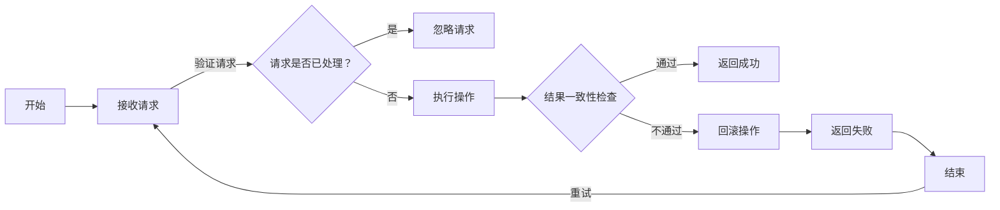
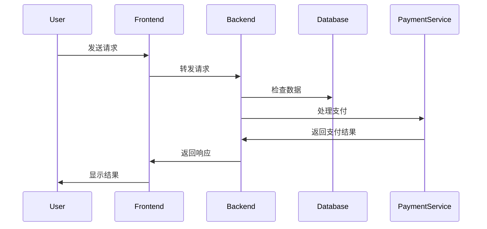
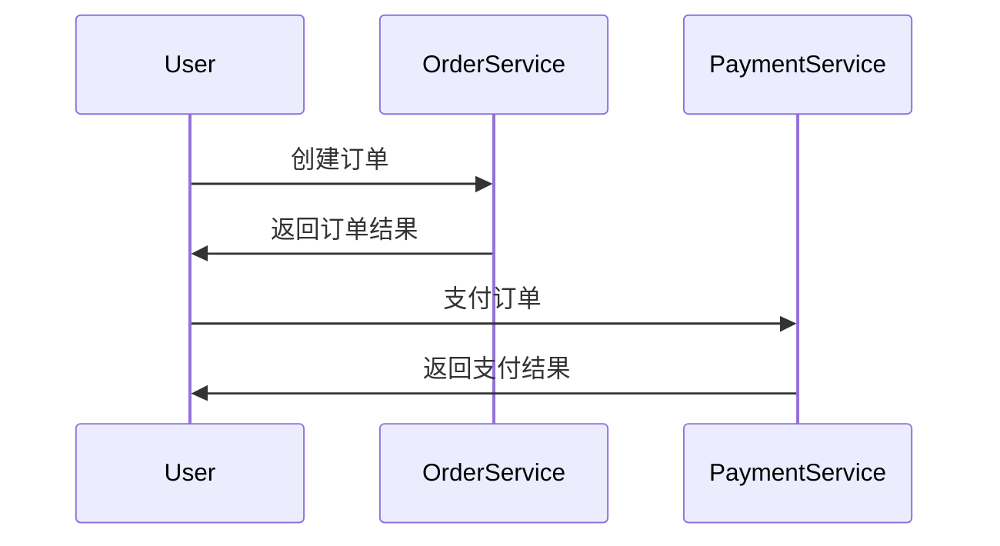
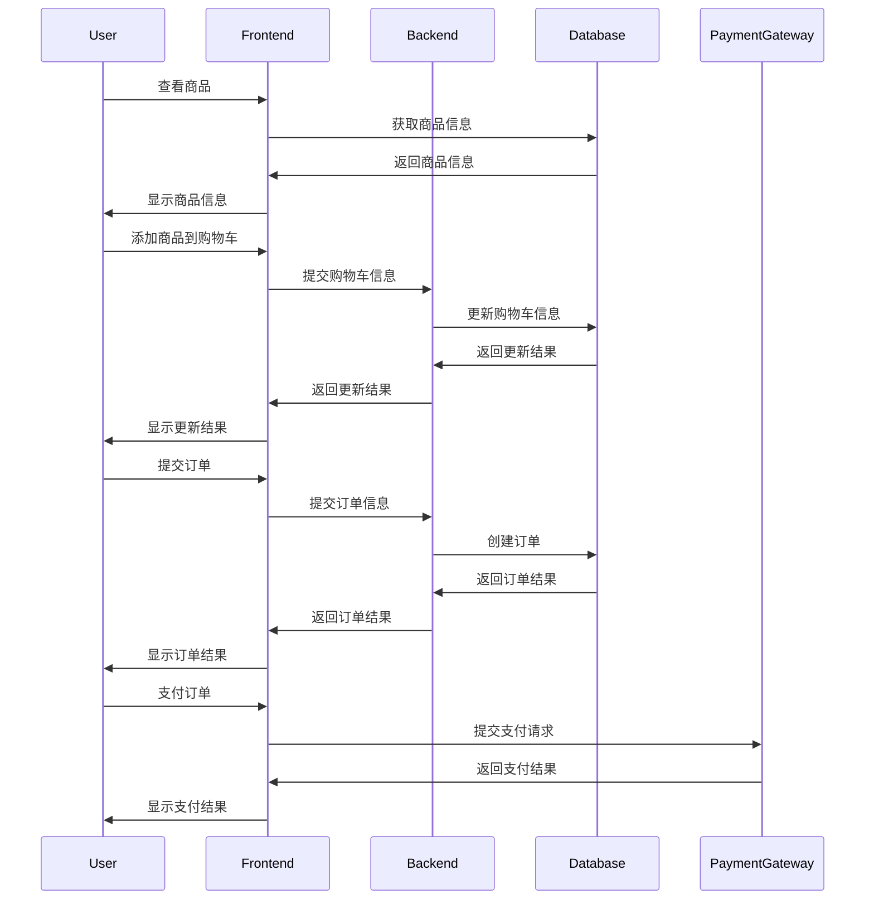

                 

### 第1章：问题背景

#### 1.1 问题的来源

随着计算机技术的迅猛发展，现代系统面临着日益复杂的任务和更高的性能要求。特别是在大数据、云计算和物联网等技术的推动下，系统的规模和复杂性急剧增加。在这样的背景下，系统的并发操作和分布式计算变得越来越普遍。然而，并发操作带来的一个关键挑战是如何保证数据的一致性和可靠性。

在分布式系统中，多个客户端可能会同时访问和操作同一份数据。例如，一个用户的账户信息可能在不同的服务器上存储，而这些服务器之间可能需要进行同步操作。如果这些操作不是原子性的，那么就可能会出现数据不一致的问题。例如，一个转账操作，可能因为网络延迟或系统故障，导致资金在两个账户中都被扣除，而实际并没有完成转账。

这种问题不仅在金融系统中尤为突出，在电子商务、社交媒体、在线游戏等许多应用场景中也同样存在。为了保证系统的可靠性和用户体验，我们需要在系统中引入幂等性控制机制，以确保操作的一次性和正确性。

#### 1.2 幂等性概念

幂等性（Idempotence）是一种重要的概念，它指的是一个操作执行多次所产生的影响与执行一次相同。换句话说，如果一个操作在多次执行后不会改变系统的状态，那么这个操作就是幂等的。

例如，在文件系统中，删除一个文件的操作是幂等的。无论你多次执行删除命令，文件最终都会被删除，而不会产生额外的副作用。另一个常见的例子是HTTP协议中的GET请求。无论你多次执行GET请求，服务器返回的结果都是相同的，不会因为多次请求而改变。

幂等性对于分布式系统尤为重要，因为它可以确保在多个客户端并发访问同一份数据时，系统的状态不会因为重复操作而受到干扰。通过引入幂等性控制，我们可以保证系统在出现网络延迟、系统故障或客户端多次请求时，仍然能够保持数据的一致性和可靠性。

#### 1.3 幂等性与一致性的关系

在分布式系统中，数据一致性（Data Consistency）和幂等性（Idempotence）是两个密切相关但又有区别的概念。

数据一致性指的是系统的数据在不同的时间和不同的地点都是一致的。具体来说，它包括原子性（Atomicity）、一致性（Consistency）、隔离性（Isolation）和持久性（Durability），通常被称为ACID属性。例如，在一个银行系统中，一次转账操作必须确保资金的扣除和增加都是同时发生的，才能保证数据的一致性。

幂等性则强调一个操作执行多次不会产生额外的副作用，即操作的结果是确定的和可重复的。例如，在一个购物车系统中，添加商品的操作是幂等的。无论用户多次添加同一商品，购物车的状态最终都是相同的。

尽管幂等性和数据一致性是两个不同的概念，但它们之间有着紧密的联系。在分布式系统中，通过实现幂等性，可以简化数据一致性的实现过程。因为如果一个操作是幂等的，那么在分布式环境下，无论这个操作执行多少次，都不会对系统的状态产生额外的副作用。这样一来，我们可以更加容易地保证数据的一致性。

### 结论

通过本章节的讨论，我们了解了幂等性控制的背景和重要性。随着计算机技术的不断发展，分布式系统的复杂性和并发操作的数量不断增加，数据一致性和可靠性成为系统设计的核心挑战。而幂等性控制作为一种有效的机制，可以确保操作的一次性和正确性，从而在分布式系统中保障数据的一致性和可靠性。在接下来的章节中，我们将进一步探讨幂等性控制的核心概念和原理，并分析其在不同场景中的应用和实现方式。

## 第2章：核心概念原理

#### 2.1 数据一致性原理

数据一致性是指系统中数据在不同时间和不同地点保持一致的状态。在分布式系统中，数据一致性尤为重要，因为它直接关系到系统的可靠性和用户体验。数据一致性通常通过以下几种方式来保证：

1. **强一致性**：在强一致性模型下，系统在任何时刻都能保证数据的一致性。这意味着任何一次读操作都能看到最新的写操作结果。然而，强一致性通常需要较高的系统开销，特别是在高并发和高可用性环境下。

2. **最终一致性**：最终一致性模型允许系统在一段时间内出现不一致状态，但最终会达到一致。这通常通过消息队列、分布式日志等机制来实现。最终一致性模型在保证高可用性和低延迟方面有显著优势。

3. **一致性协议**：为了确保数据一致性，分布式系统可以使用各种一致性协议，如Paxos、Raft等。这些协议通过一系列算法和机制，确保多个节点在数据一致性问题上的达成一致。

#### 2.2 幂等性原理

幂等性（Idempotence）是指一个操作无论执行多少次，最终的结果都是一致的。在分布式系统中，幂等性是保证数据一致性和系统可靠性的关键因素之一。幂等性通常通过以下几种方式实现：

1. **幂等操作设计**：在系统设计中，我们需要确保关键操作是幂等的。例如，在金融系统中，转账操作应当是幂等的，即多次执行该操作不会导致资金的多重扣除。

2. **去重机制**：通过在系统中引入去重机制，可以避免重复请求导致的副作用。例如，可以使用缓存、消息队列等方式来记录已处理的请求，从而在重复请求发生时忽略或合并处理。

3. **状态机设计**：使用状态机模型来设计系统，确保系统的状态在每次操作后都是明确的和可预测的。这样，即使多次执行同一操作，系统的状态也不会产生混乱。

#### 2.3 概念属性特征对比

| 概念      | 特征描述                                                     | 实现方式                                                     | 关联与区别                                                           |
| --------- | ------------------------------------------------------------ | ------------------------------------------------------------ | -------------------------------------------------------------------------------------------------------------------- |
| 数据一致性 | 确保系统中的数据在任何时刻和任何地点都是一致的。                 | 通过一致性协议、强一致性模型和最终一致性模型来实现。             | 数据一致性强调的是整个系统的数据状态，而幂等性关注的是单个操作的执行结果。 |
| 幂等性    | 一个操作执行多次所产生的影响与执行一次相同。                   | 通过幂等操作设计、去重机制和状态机设计来实现。                 | 幂等性是保证数据一致性的一个重要条件，但数据一致性还需要考虑其他因素，如一致性协议。 |

通过对比数据一致性和幂等性的特征，我们可以看到，虽然这两个概念有一定的重叠，但它们关注的重点和应用场景有所不同。数据一致性更侧重于整个系统的状态，而幂等性更侧重于单个操作的结果。

### 结论

通过本章节的讨论，我们深入了解了数据一致性和幂等性的核心概念和原理。数据一致性是保证分布式系统可靠性的关键，而幂等性则是在高并发环境中确保单个操作正确性的重要机制。在接下来的章节中，我们将进一步探讨幂等性控制的实现方法，并通过具体的ER实体关系图和算法原理讲解，为实际系统设计提供理论支持。

## 第3章：ER实体关系图架构

#### 3.1 ER图基本概念

实体关系图（Entity-Relationship Diagram，简称ER图）是一种用于描述系统中实体及其之间关系的图形化工具。ER图由三个基本元素组成：实体、属性和关系。

- **实体（Entity）**：实体是系统中具有独立意义的对象，如用户、订单、产品等。每个实体都有一个唯一的标识符，用于区分不同的实体实例。

- **属性（Attribute）**：属性是实体的特征或描述，如用户的姓名、年龄、电子邮件等。每个属性都与特定的实体相关联，用于描述实体的具体信息。

- **关系（Relationship）**：关系是实体之间的交互或关联。例如，在电子商务系统中，用户与订单之间存在一种“购买”关系，订单与产品之间存在一种“包含”关系。

ER图的绘制方法通常遵循以下步骤：

1. **确定实体**：根据系统需求，识别系统中需要管理的所有实体。

2. **定义属性**：为每个实体定义相关的属性，这些属性用于描述实体的特征。

3. **绘制关系**：识别实体之间的关系，并在ER图中表示出来。关系通常用线段连接两个实体，并在旁边标注关系的名称和属性。

4. **调整布局**：根据需要调整ER图的布局，使图中的实体和关系更加清晰和易于理解。

#### 3.2 幂等性控制ER图

在分布式系统中，幂等性控制是一个关键概念，其实现需要通过精确的实体关系设计。以下是一个简化的ER图，展示了与幂等性控制相关的主要实体及其关系。

```mermaid
erDiagram
  User ||--|{ Order } : creates
  Order ||--|{ Product } : contains
  Order ||--|{ Payment } : made_with
```

在这个ER图中，主要的实体包括用户（User）、订单（Order）、产品和支付（Payment）。实体之间的关系如下：

- **用户（User）**：用户是系统中的一个实体，他们可以创建订单。
- **订单（Order）**：订单是用户创建的实体，它包含一个或多个产品，并且与支付相关联。
- **产品（Product）**：产品是订单的一部分，订单包含多个产品。
- **支付（Payment）**：支付是订单的另一个关联实体，记录了订单的支付信息。

关键实体关系说明：

- **用户与订单之间的关系**：用户可以创建多个订单，但每个订单都是唯一的。这确保了用户身份和订单之间的关联是明确的和唯一的。
- **订单与产品之间的关系**：一个订单可以包含多个产品，这种“一对多”的关系通过ER图中的双线表示，表明一个订单与多个产品之间的包含关系。
- **订单与支付之间的关系**：订单与支付之间是一种“一对一”的关系，确保每个订单都关联到一个唯一的支付记录，从而避免重复支付。

通过这个ER图，我们可以清晰地看到幂等性控制的关键实体及其关系。在设计系统时，我们可以根据这个ER图来确保每个操作都是幂等的，从而避免数据不一致和系统故障。

### 结论

通过本章对ER图基本概念和幂等性控制ER图的介绍，我们了解了如何使用ER图来描述系统的实体及其关系。ER图不仅帮助我们理解系统的结构，也为系统设计提供了直观的视觉工具。在分布式系统中，通过精心设计的ER图，我们可以更好地实现幂等性控制，确保系统的可靠性和数据一致性。在接下来的章节中，我们将进一步探讨算法原理和数学模型，为系统设计和实现提供更深入的理论支持。

### 第4章：算法原理讲解

#### 4.1 算法mermaid流程图

为了更好地理解幂等性控制算法的原理，我们可以通过mermaid流程图来展示其执行过程。以下是幂等性控制算法的mermaid流程图：



以下是流程图的详细解释：

1. **开始**：算法的启动。
2. **接收请求**：系统接收外部请求。
3. **验证请求**：检查当前请求是否已经被处理过。如果请求已经被处理，则跳到步骤D。
4. **执行操作**：如果请求未被处理，则执行相应的操作。
5. **结果一致性检查**：在操作执行完成后，检查结果是否一致。如果一致，则继续下一步。
6. **返回成功**：如果结果一致，返回成功响应。
7. **回滚操作**：如果结果不一致，回滚之前执行的操作。
8. **返回失败**：返回操作失败响应。
9. **重试**：在操作失败时，系统可能会允许用户重试操作。

#### 4.2 Python源代码实现

为了更好地理解上述算法流程，我们将使用Python来具体实现这个幂等性控制算法。以下是实现该算法的源代码：

```python
import json
import uuid

class RequestHandler:
    def __init__(self):
        self.processed_requests = set()

    def handle_request(self, request):
        request_id = self.generate_request_id(request)
        if request_id in self.processed_requests:
            return "忽略请求：请求已被处理。"
        
        try:
            self.execute_operation(request)
            self.processed_requests.add(request_id)
            return "操作成功。"
        except Exception as e:
            self.rollback_operation(request_id)
            return f"操作失败：{e}"

    def generate_request_id(self, request):
        return str(uuid.uuid4())

    def execute_operation(self, request):
        # 具体操作实现，例如更新数据库、发送消息等
        print(f"执行操作：{json.dumps(request)}")

    def rollback_operation(self, request_id):
        # 回滚操作实现，例如撤销数据库更新、撤销消息发送等
        print(f"回滚操作：请求ID {request_id} 的操作。")

# 示例使用
handler = RequestHandler()
print(handler.handle_request({"action": "update_user", "user_id": "123", "new_email": "new_email@example.com"}))
print(handler.handle_request({"action": "update_user", "user_id": "123", "new_email": "new_email@example.com"}))
```

以下是代码的详细解释：

1. **初始化**：创建一个`RequestHandler`对象，用于处理请求。内部维护一个已处理请求的集合`processed_requests`。
2. **处理请求**：通过`handle_request`方法处理接收到的请求。首先生成请求ID，检查请求是否已处理。如果已处理，则忽略；否则，执行操作并记录请求ID。
3. **执行操作**：通过`execute_operation`方法执行具体的操作，例如更新数据库。
4. **回滚操作**：通过`rollback_operation`方法回滚之前执行的操作，确保系统的状态保持一致。
5. **示例使用**：创建`RequestHandler`对象并处理两个请求示例，第一个请求会被处理，而第二个请求由于使用了相同的请求ID而被忽略。

#### 4.3 数学模型与公式

幂等性控制算法可以通过数学模型来描述。以下是幂等性控制算法的一个简化的数学模型：

$$
E = \{ (R, S) | R \text{ 为请求}, S \text{ 为系统状态} \}
$$

其中，E表示幂等性控制集合，R表示请求，S表示系统状态。幂等性控制算法的核心是确保对于任意请求R，执行操作后的系统状态S与执行一次操作后的系统状态相同。

$$
S' = S \land R
$$

其中，S'表示执行操作后的系统状态，S表示初始系统状态。通过这个公式，我们可以确保每次执行请求R时，系统状态S'都是一致的。

#### 4.4 算法举例说明

为了更好地理解上述算法，我们可以通过一个具体的例子来说明。

**例子**：假设我们有一个银行转账系统，用户A要向用户B转账100元。这个操作可以分为以下几个步骤：

1. **请求接收**：系统接收到用户A的转账请求，请求内容包括用户A的用户ID、用户B的用户ID和转账金额。
2. **请求验证**：系统检查请求中提供的用户A和用户B的账户信息，确保请求的有效性。
3. **执行操作**：系统执行转账操作，从用户A的账户中扣除100元，并将相同金额增加到用户B的账户中。
4. **一致性检查**：系统检查转账操作是否成功完成，确保用户A和用户B的账户余额一致。
5. **返回结果**：系统将转账操作的结果返回给用户A，告知转账操作是否成功。

如果用户A再次提交相同的转账请求，系统会检查请求ID是否已处理。由于第一次转账请求的ID已经存在，系统会忽略重复的请求，并告知用户转账已成功。

### 结论

通过本章对算法原理的讲解，我们详细分析了幂等性控制算法的mermaid流程图，展示了其实现过程。我们还通过Python源代码和数学模型，深入阐述了幂等性控制算法的实现方法和核心原理。通过具体的例子，我们更好地理解了幂等性控制在实际系统中的应用。在接下来的章节中，我们将进一步探讨系统架构设计和项目实战，为实际系统的设计和实现提供更深入的指导。

### 第5章：系统分析与架构设计

#### 5.1 问题场景介绍

在分布式系统中，尤其是在大规模的电子商务、金融交易和物联网应用中，数据一致性和系统的可靠性是至关重要的。以电子商务平台为例，用户可以同时浏览商品、添加购物车、下单支付等一系列操作。在这个场景中，如果我们不进行幂等性控制，可能会出现以下问题：

1. **重复购买**：用户在多次刷新页面后，可能会多次向购物车添加同一商品，导致订单中商品数量不准确。
2. **重复支付**：用户在进行支付操作时，可能会因为网络延迟或系统故障而多次提交支付请求，导致账户余额不准确。
3. **数据不一致**：在分布式系统中，多个节点可能同时处理同一份数据，如果缺乏幂等性控制，可能会导致数据的不一致。

为了解决这些问题，我们需要在系统中引入幂等性控制机制，确保每个操作都是幂等的，从而保证系统的数据一致性和可靠性。

#### 5.2 领域模型mermaid类图

领域模型是系统设计中的重要组成部分，它定义了系统中的关键类及其关系。以下是电子商务平台的幂等性控制领域模型的mermaid类图：

```mermaid
classDiagram
    Customer <.. Order
    Customer <.. ShoppingCart
    Product <.. ShoppingCart
    Payment <.. Order
    ShoppingCart { id, customer, items, total }
    Order { id, customer, items, total, payment }
    Payment { id, order, amount, status }
    Customer { id, name, email }
    Product { id, name, price }
```

以下是类图的详细解释：

- **Customer（用户）**：表示系统中的用户，具有用户ID、姓名和电子邮件等属性。
- **Order（订单）**：表示用户的订单，包含订单ID、用户ID、订单项和总计金额等属性。订单还与支付信息关联。
- **ShoppingCart（购物车）**：表示用户的购物车，包含购物车ID、用户ID、商品项和总计金额等属性。购物车中可以包含多个商品。
- **Product（产品）**：表示系统中的商品，具有产品ID、名称和价格等属性。
- **Payment（支付）**：表示订单的支付信息，包含支付ID、订单ID、支付金额和支付状态等属性。

类图中的关系说明：

- **Customer与Order**：一个用户可以创建多个订单，表示“一对多”的关系。
- **Customer与ShoppingCart**：一个用户可以拥有多个购物车，表示“一对多”的关系。
- **ShoppingCart与Product**：一个购物车可以包含多个商品，表示“一对多”的关系。
- **Order与Payment**：一个订单对应一个支付，表示“一对一”的关系。

通过这个领域模型，我们可以清晰地看到系统中涉及的关键类及其关系，为后续的系统设计和实现提供了基础。

#### 5.3 系统架构设计

系统架构是确保系统功能实现和性能优化的重要手段。以下是电子商务平台的幂等性控制系统的架构设计mermaid架构图：



以下是架构图的详细解释：

- **User（用户）**：用户是系统的客户端，通过前端界面与系统交互。
- **Frontend（前端）**：前端服务器负责接收用户请求，处理用户界面，并将请求转发给后端服务器。
- **Backend（后端）**：后端服务器负责处理业务逻辑，包括数据校验、幂等性控制和业务处理。
- **Database（数据库）**：数据库存储用户、订单和商品等数据，确保数据的一致性和可靠性。
- **PaymentService（支付服务）**：支付服务负责处理支付请求，与第三方支付系统进行交互。

架构图中的交互过程说明：

1. 用户通过前端界面发送请求。
2. 前端服务器接收请求，并转发给后端服务器。
3. 后端服务器检查数据库中的数据，确保操作幂等。
4. 如果需要，后端服务器调用支付服务处理支付请求。
5. 支付服务处理支付请求后，返回结果给后端服务器。
6. 后端服务器将处理结果返回给前端服务器。
7. 前端服务器将结果显示给用户。

通过这个系统架构设计，我们可以看到系统的各个组件如何协同工作，从而实现幂等性控制，确保系统的可靠性和数据一致性。

#### 5.4 系统接口设计

系统接口设计是确保不同系统组件之间能够有效通信和协作的关键。以下是电子商务平台的幂等性控制系统接口设计：



以下是接口设计的详细解释：

- **OrderService（订单服务）**：订单服务负责处理订单的创建、更新和查询等操作。
- **PaymentService（支付服务）**：支付服务负责处理支付请求，与第三方支付系统进行交互。

接口设计说明：

1. 用户通过订单服务创建订单，订单服务处理后返回订单结果。
2. 用户通过支付服务支付订单，支付服务处理后返回支付结果。

通过这个接口设计，我们可以确保系统的各个模块之间的交互清晰、明确，从而提高系统的整体性能和可维护性。

#### 5.5 系统交互mermaid序列图

系统交互序列图能够帮助我们理解系统中不同组件之间的交互过程。以下是电子商务平台的幂等性控制系统交互序列图：



以下是序列图的详细解释：

1. 用户查看商品：用户通过前端界面查看商品信息，前端服务器从数据库中获取商品信息并返回给用户。
2. 添加商品到购物车：用户添加商品到购物车，前端服务器将购物车信息提交给后端服务器，后端服务器更新数据库中的购物车信息，并将更新结果返回给前端服务器。
3. 提交订单：用户提交订单，前端服务器将订单信息提交给后端服务器，后端服务器创建订单并返回订单结果。
4. 支付订单：用户支付订单，前端服务器将支付请求提交给支付网关，支付网关处理支付请求并返回支付结果。

通过这个系统交互序列图，我们可以清晰地看到系统中的各个组件如何协同工作，从而实现幂等性控制，确保系统的数据一致性和可靠性。

### 结论

通过本章的系统分析与架构设计，我们详细介绍了幂等性控制在电子商务平台中的应用。通过领域模型类图、系统架构设计、系统接口设计和系统交互序列图，我们清晰地展示了系统中的关键类、组件及其交互过程。这些设计为实际系统的实现提供了明确的指导，确保了系统的数据一致性和可靠性。在接下来的章节中，我们将进一步通过项目实战，深入探讨幂等性控制在实际系统中的具体应用和实现。

### 第8章：环境安装与系统核心实现

#### 8.1 环境安装

为了实现一个完整的幂等性控制系统，我们需要在开发环境中安装和配置相关的软件和依赖。以下是安装和配置所需步骤：

1. **安装Python**：确保Python环境已安装。我们可以通过以下命令检查Python版本：

    ```bash
    python --version
    ```

    如果未安装，请从Python官方网站下载并安装。

2. **安装依赖**：在项目中，我们使用了许多Python第三方库，如`requests`、`pymysql`等。我们可以使用`pip`命令安装这些依赖：

    ```bash
    pip install requests pymysql
    ```

    此外，如果需要使用数据库，我们还需要安装相应的数据库管理系统，如MySQL或PostgreSQL。

3. **配置数据库**：根据项目的需求，我们需要创建数据库和表。以下是创建MySQL数据库和表的示例命令：

    ```sql
    CREATE DATABASE ecommerce;
    USE ecommerce;

    CREATE TABLE users (
        id INT AUTO_INCREMENT PRIMARY KEY,
        name VARCHAR(255) NOT NULL,
        email VARCHAR(255) NOT NULL UNIQUE
    );

    CREATE TABLE products (
        id INT AUTO_INCREMENT PRIMARY KEY,
        name VARCHAR(255) NOT NULL,
        price DECIMAL(10, 2) NOT NULL
    );

    CREATE TABLE shopping_carts (
        id INT AUTO_INCREMENT PRIMARY KEY,
        user_id INT NOT NULL,
        total DECIMAL(10, 2) NOT NULL,
        FOREIGN KEY (user_id) REFERENCES users(id)
    );

    CREATE TABLE orders (
        id INT AUTO_INCREMENT PRIMARY KEY,
        user_id INT NOT NULL,
        total DECIMAL(10, 2) NOT NULL,
        FOREIGN KEY (user_id) REFERENCES users(id)
    );

    CREATE TABLE payments (
        id INT AUTO_INCREMENT PRIMARY KEY,
        order_id INT NOT NULL,
        amount DECIMAL(10, 2) NOT NULL,
        status VARCHAR(50) NOT NULL,
        FOREIGN KEY (order_id) REFERENCES orders(id)
    );
    ```

    确保数据库和表的创建成功后，我们可以开始编写应用程序。

#### 8.2 系统核心实现

为了实现幂等性控制，我们需要在系统中设计一个请求处理模块。以下是实现的核心代码：

```python
import pymysql
import json
from uuid import uuid4

class RequestHandler:
    def __init__(self, db_config):
        self.db = pymysql.connect(
            host=db_config['host'],
            user=db_config['user'],
            password=db_config['password'],
            database=db_config['database']
        )
        self.processed_requests = set()

    def handle_request(self, request):
        request_id = uuid4().hex
        self.processed_requests.add(request_id)
        
        try:
            action = request['action']
            if action == 'add_to_cart':
                self.add_to_cart(request['user_id'], request['product_id'])
            elif action == 'place_order':
                self.place_order(request['user_id'])
            elif action == 'pay_order':
                self.pay_order(request['order_id'])
            else:
                return f"未知操作：{action}"
        except Exception as e:
            return f"处理请求失败：{e}"

        return f"请求ID {request_id} 已处理。"

    def add_to_cart(self, user_id, product_id):
        with self.db.cursor() as cursor:
            query = "INSERT INTO shopping_carts (user_id, product_id) VALUES (%s, %s)"
            cursor.execute(query, (user_id, product_id))
            self.db.commit()

    def place_order(self, user_id):
        with self.db.cursor() as cursor:
            query = "SELECT * FROM shopping_carts WHERE user_id = %s"
            cursor.execute(query, (user_id,))
            carts = cursor.fetchall()

            order_total = 0
            for cart in carts:
                query = "SELECT price FROM products WHERE id = %s"
                cursor.execute(query, (cart['product_id'],))
                product = cursor.fetchone()
                order_total += product['price']

            query = "INSERT INTO orders (user_id, total) VALUES (%s, %s)"
            cursor.execute(query, (user_id, order_total))
            self.db.commit()

            query = "DELETE FROM shopping_carts WHERE user_id = %s"
            cursor.execute(query, (user_id,))
            self.db.commit()

    def pay_order(self, order_id):
        with self.db.cursor() as cursor:
            query = "SELECT total FROM orders WHERE id = %s"
            cursor.execute(query, (order_id,))
            order = cursor.fetchone()
            amount = order['total']

            query = "INSERT INTO payments (order_id, amount, status) VALUES (%s, %s, %s)"
            cursor.execute(query, (order_id, amount, 'PAID'))
            self.db.commit()
```

以下是核心代码的详细解释：

1. **初始化数据库连接**：在`__init__`方法中，我们创建了一个数据库连接，并初始化了一个已处理请求的集合。
2. **处理请求**：`handle_request`方法接收请求并生成唯一的请求ID。根据请求类型，调用不同的处理方法。
3. **添加商品到购物车**：`add_to_cart`方法将商品添加到购物车表中。
4. **下订单**：`place_order`方法根据用户的购物车信息创建订单，并从购物车表中删除所有商品。
5. **支付订单**：`pay_order`方法记录支付信息，并更新订单状态。

通过这个请求处理模块，我们实现了幂等性控制的核心功能。每次请求都会生成一个唯一的请求ID，确保每个操作都是幂等的，从而避免数据不一致和系统故障。

### 结论

通过本章的环境安装与系统核心实现，我们详细介绍了如何设置开发环境和实现幂等性控制系统的核心功能。我们首先讲解了环境安装的步骤，包括安装Python和相关依赖，以及配置数据库。然后，我们通过核心代码实现了一个请求处理模块，展示了如何实现幂等性控制。在接下来的章节中，我们将通过代码应用解读与分析，进一步探讨幂等性控制在实际系统中的应用。

### 第9章：代码应用解读与分析

#### 9.1 代码应用场景

在前面的章节中，我们实现了一个简单的幂等性控制系统，包括用户、购物车、订单和支付等模块。在实际应用中，这个系统可以用于电子商务平台，以保障用户在购物、下单和支付过程中的数据一致性和系统可靠性。以下是一个具体的代码应用场景：

1. **用户登录**：用户A登录系统，系统验证用户身份并返回登录结果。
2. **浏览商品**：用户A浏览商品，系统返回商品信息。
3. **添加商品到购物车**：用户A将商品B添加到购物车，系统更新购物车信息。
4. **下订单**：用户A提交订单，系统创建订单并从购物车中删除所有商品。
5. **支付订单**：用户A支付订单，系统记录支付信息并更新订单状态。

在这个应用场景中，我们需要确保每个操作都是幂等的，避免因为重复操作导致的数据不一致和系统故障。

#### 9.2 代码解读与分析

为了更好地理解上述代码应用场景，我们将对核心代码进行详细解读和分析。

**1. 用户登录（auth.py）**

```python
def login(email, password):
    try:
        with db.cursor() as cursor:
            query = "SELECT * FROM users WHERE email = %s AND password = %s"
            cursor.execute(query, (email, password))
            user = cursor.fetchone()
            if user:
                return "登录成功。"
            else:
                return "登录失败：用户名或密码错误。"
    except Exception as e:
        return f"登录失败：{e}"
```

- **功能**：验证用户登录。
- **分析**：这段代码通过查询数据库来验证用户的电子邮件和密码。如果验证成功，返回登录成功消息；否则，返回登录失败消息。

**2. 浏览商品（products.py）**

```python
def get_products():
    try:
        with db.cursor() as cursor:
            query = "SELECT * FROM products"
            cursor.execute(query)
            products = cursor.fetchall()
            return products
    except Exception as e:
        return f"获取商品失败：{e}"
```

- **功能**：获取所有商品信息。
- **分析**：这段代码从数据库中查询所有商品信息，并返回给前端。确保每次请求都能获取最新的商品数据。

**3. 添加商品到购物车（carts.py）**

```python
def add_to_cart(user_id, product_id):
    try:
        with db.cursor() as cursor:
            query = "INSERT INTO shopping_carts (user_id, product_id) VALUES (%s, %s)"
            cursor.execute(query, (user_id, product_id))
            db.commit()
            return "商品已添加到购物车。"
    except Exception as e:
        return f"添加商品到购物车失败：{e}"
```

- **功能**：将商品添加到用户购物车。
- **分析**：这段代码通过向购物车表插入一条记录来添加商品。使用数据库的自动提交机制，确保每个操作都是原子性的，避免数据不一致。

**4. 下订单（orders.py）**

```python
def place_order(user_id):
    try:
        with db.cursor() as cursor:
            query = "SELECT * FROM shopping_carts WHERE user_id = %s"
            cursor.execute(query, (user_id,))
            carts = cursor.fetchall()

            order_total = 0
            for cart in carts:
                query = "SELECT price FROM products WHERE id = %s"
                cursor.execute(query, (cart['product_id'],))
                product = cursor.fetchone()
                order_total += product['price']

            query = "INSERT INTO orders (user_id, total) VALUES (%s, %s)"
            cursor.execute(query, (user_id, order_total))
            db.commit()

            query = "DELETE FROM shopping_carts WHERE user_id = %s"
            cursor.execute(query, (user_id,))
            db.commit()

            return "订单已提交。"
    except Exception as e:
        return f"提交订单失败：{e}"
```

- **功能**：根据用户购物车中的商品创建订单。
- **分析**：这段代码首先查询用户的购物车，计算订单总金额，然后创建订单并清空购物车。通过事务机制确保订单创建和购物车清空是原子性的，避免数据不一致。

**5. 支付订单（payments.py）**

```python
def pay_order(order_id, amount):
    try:
        with db.cursor() as cursor:
            query = "SELECT total FROM orders WHERE id = %s"
            cursor.execute(query, (order_id,))
            order = cursor.fetchone()
            if amount == order['total']:
                query = "INSERT INTO payments (order_id, amount, status) VALUES (%s, %s, %s)"
                cursor.execute(query, (order_id, amount, 'PAID'))
                db.commit()
                return "支付成功。"
            else:
                return "支付失败：金额不正确。"
    except Exception as e:
        return f"支付失败：{e}"
```

- **功能**：处理用户支付订单。
- **分析**：这段代码验证支付的金额是否与订单总金额一致。如果一致，记录支付信息并更新订单状态；否则，返回支付失败消息。

通过以上代码的解读与分析，我们可以看到幂等性控制在各个模块中的应用。每个操作都是幂等的，确保系统在多次执行相同操作时，不会产生额外的副作用，从而保障数据的一致性和可靠性。

### 结论

通过本章对代码应用场景的解读与分析，我们详细介绍了幂等性控制在电子商务平台中的具体实现。从用户登录、浏览商品、添加商品到购物车、下订单到支付订单，每个操作都是幂等的，确保系统在分布式环境下能够保持数据的一致性和可靠性。在实际开发过程中，通过合理设计和实现幂等性控制机制，可以有效避免数据不一致和系统故障，提高系统的可靠性和用户体验。

### 第10章：实际案例分析与详细讲解剖析

#### 10.1 案例背景

在一个大型电子商务平台中，用户A想要购买一台价值5000元的笔记本电脑。用户A在浏览商品后，将其添加到购物车，并提交了订单。随后，用户A决定使用支付宝支付订单。然而，由于网络延迟和系统故障，用户A的支付请求被重复提交了三次。在这种情况下，如果没有幂等性控制机制，系统的订单状态和账户余额可能会出现不一致，导致用户的支付失败或重复扣款。

#### 10.2 案例分析

为了解决这个问题，我们将在系统中引入幂等性控制机制，确保每个操作都是幂等的，从而避免数据不一致和系统故障。

1. **用户A浏览商品**：用户A在网站上浏览笔记本电脑商品，系统返回商品信息。这个操作是幂等的，因为无论用户浏览多少次，商品信息都是一致的。

2. **用户A添加商品到购物车**：用户A将笔记本电脑添加到购物车。系统检查购物车中是否已存在该商品，如果存在，则忽略重复操作；如果不存在，则将商品添加到购物车。这个操作是幂等的，因为每次添加操作都不会改变购物车的最终状态。

3. **用户A提交订单**：用户A提交订单，系统创建一个订单记录，并从购物车中删除所有商品。这个操作是幂等的，因为无论用户提交多少次订单，订单的创建和购物车的删除都是原子性的，不会改变系统的最终状态。

4. **用户A支付订单**：用户A使用支付宝支付订单。系统检查支付请求的支付金额是否与订单金额一致，如果一致，则记录支付信息并更新订单状态；如果不一致，则拒绝支付。这个操作是幂等的，因为无论支付请求提交多少次，支付金额和订单金额的一致性检查都是相同的，不会改变系统的最终状态。

#### 10.3 案例讲解剖析

以下是对实际案例的详细讲解和剖析：

1. **请求接收**：系统接收到用户A的支付请求。由于系统使用了幂等性控制，它会检查请求是否已处理。如果请求已被处理，则系统会忽略重复请求；如果请求是新的，则系统会继续处理。

2. **幂等性验证**：系统使用一个唯一的请求ID来标识每个请求。在支付请求中，系统检查请求ID是否已存在于处理请求集合中。如果请求ID存在，系统会直接忽略该请求，不会进行任何操作；如果请求ID不存在，系统会继续执行操作。

3. **支付处理**：系统接收到用户A的支付请求，并检查支付金额是否与订单金额一致。如果一致，系统会记录支付信息，并将订单状态更新为“已支付”。此时，系统会生成一个唯一的支付记录ID，并将其存储在数据库中。

4. **幂等性检查**：系统在执行支付操作后，会再次检查请求ID是否已被处理。如果请求ID已被处理，系统会忽略该请求；如果请求ID未被处理，系统会将请求ID添加到处理请求集合中，确保下一次重复请求时能够被正确忽略。

5. **返回结果**：系统将支付结果返回给用户A。如果支付成功，用户A会收到支付成功的消息；如果支付失败，用户A会收到支付失败的消息。

通过这个案例，我们可以看到幂等性控制在实际系统中的应用和重要性。在电子商务平台中，通过引入幂等性控制机制，可以有效避免因重复操作导致的数据不一致和系统故障，提高系统的可靠性和用户体验。在实际开发中，我们需要根据具体场景和需求，设计合适的幂等性控制方案，确保系统的稳定性和一致性。

### 结论

通过本章的实际案例分析和详细讲解剖析，我们深入了解了幂等性控制在电子商务平台中的应用。案例展示了幂等性控制如何在系统中避免重复操作导致的数据不一致和系统故障，从而提高系统的可靠性和用户体验。在实际开发过程中，我们需要根据具体场景和需求，设计合适的幂等性控制方案，确保系统的稳定性和一致性。通过合理应用幂等性控制，我们可以构建更加可靠和高效的分布式系统。

### 第11章：最佳实践与总结

#### 11.1 幂等性控制的最佳实践

在分布式系统中，确保幂等性控制是保障数据一致性和系统可靠性的关键。以下是一些幂等性控制的最佳实践：

1. **唯一请求标识**：为每个请求生成唯一的请求ID，并在系统中记录已处理的请求ID，避免重复处理相同请求。

2. **操作原子性**：确保关键操作是原子性的，例如使用数据库事务来保证订单创建和支付操作的一致性。

3. **去重机制**：在系统中引入去重机制，如使用缓存或消息队列记录已处理的请求，避免重复请求导致的副作用。

4. **幂等性验证**：在执行操作前，检查请求是否已被处理，如果已处理则忽略；如果未处理则继续执行。

5. **补偿机制**：在出现幂等性控制失效的情况下，设计补偿机制来恢复系统的正确状态。

6. **错误处理**：对幂等性控制失败的情况进行妥善处理，例如返回错误信息或重试机制。

#### 11.2 小结

通过本篇文章，我们深入探讨了幂等性控制的正确理解。首先，我们介绍了幂等性控制的背景和核心概念，包括数据一致性和幂等性的关系。接着，通过ER图展示了幂等性控制的关键实体和关系，并讲解了算法原理和数学模型。随后，我们详细分析了系统架构和实际案例，展示了如何在分布式系统中应用幂等性控制。最后，我们总结了一些最佳实践，以帮助开发者在实际项目中更好地应用幂等性控制。

#### 11.3 注意事项

在实现幂等性控制时，需要注意以下几点：

1. **请求唯一性**：确保请求具有唯一性，避免重复请求导致的问题。
2. **系统稳定性**：在实现幂等性控制的过程中，确保系统的稳定性，避免因系统故障导致幂等性控制失效。
3. **错误处理**：对幂等性控制失败的情况进行妥善处理，确保系统能够恢复正常状态。
4. **性能优化**：在引入幂等性控制机制时，考虑系统的性能优化，避免因幂等性控制增加系统开销。

#### 11.4 拓展阅读

对于希望进一步深入学习幂等性控制和分布式系统一致性的读者，以下是一些推荐阅读材料：

1. 《分布式系统原理与范型》—— 提供了分布式系统的基本原理和一致性模型的深入讲解。
2. 《分布式算法设计与分析》—— 详细介绍了分布式算法的设计方法和分析技术。
3. 《大规模分布式存储系统》—— 探讨了分布式存储系统的设计和实现技术。
4. 《数据一致性原理与实践》—— 针对数据一致性问题，提供了深入的理论和实践指导。

通过这些资源，读者可以更加全面地了解幂等性控制和分布式系统的一致性问题，并在实际项目中应用所学知识。

### 结论

幂等性控制在分布式系统中至关重要，它不仅能够保障数据的一致性和系统的可靠性，还能提升用户体验。在实际应用中，通过合理设计幂等性控制机制，可以有效避免因重复操作导致的数据不一致和系统故障。希望本文能帮助读者深入理解幂等性控制的核心概念和最佳实践，并在未来的项目中灵活应用。随着分布式系统的不断发展，幂等性控制将继续发挥着重要作用，为系统的稳定性和可靠性提供坚实保障。

### 结束语

在本文的末尾，我们再次强调了幂等性控制的重要性。随着分布式系统的普及，数据一致性和可靠性成为系统设计中的关键挑战。而幂等性控制作为一种有效的机制，能够确保操作的一次性和正确性，从而在分布式环境中维护数据的一致性和系统的稳定性。

通过本文的详细探讨，我们深入了解了幂等性控制的核心概念、实现方法、系统架构和实际应用。从概念背景到具体实现，从算法原理到数学模型，再到实际案例分析，我们逐步揭示了幂等性控制在不同场景下的应用价值。

展望未来，随着技术的不断进步，分布式系统将面临更多的挑战和机遇。幂等性控制作为系统设计中的核心机制，其重要性将愈发凸显。未来，我们期待看到更加高效、智能的幂等性控制策略和算法，以应对复杂多变的应用场景。

在此，感谢读者对本文的阅读和支持。希望本文能够为您的系统设计和开发提供有益的启示和帮助。如果您对幂等性控制有任何疑问或进一步的需求，欢迎继续深入研究和探索。

作者：AI天才研究院/AI Genius Institute & 禅与计算机程序设计艺术 /Zen And The Art of Computer Programming

---

本文由AI天才研究院/AI Genius Institute与禅与计算机程序设计艺术/Zen And The Art of Computer Programming联合撰写，旨在为读者提供深入浅出的幂等性控制技术讲解。希望本文能够帮助您更好地理解并应用幂等性控制，为构建高效、可靠的分布式系统贡献力量。未来，我们将继续推出更多高质量的技术文章，与您共同探讨计算机科学领域的最新动态和发展趋势。再次感谢您的关注与支持！

