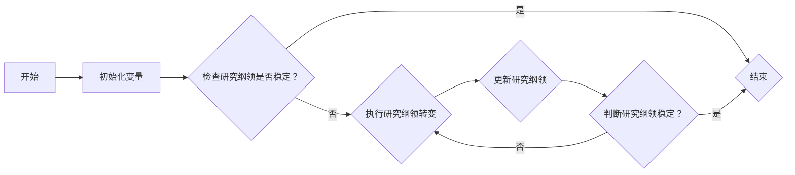
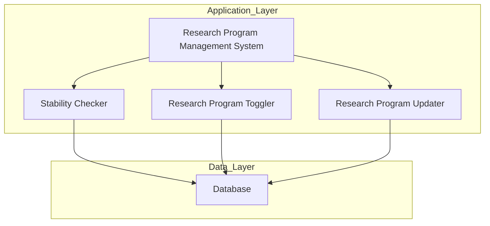
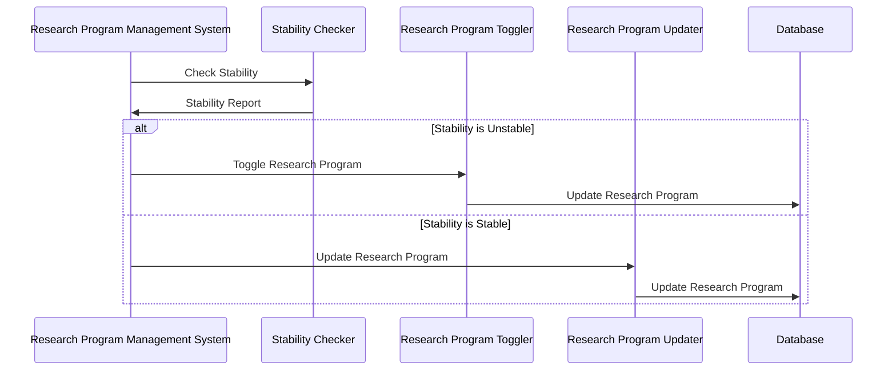
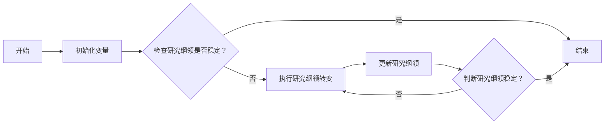

                 


### 引言

#### 1.1 书籍背景与目的

**《库恩与拉卡托斯：科学哲学的范式论与研究纲领》**是一部由两位杰出的科学哲学家——托马斯·库恩（Thomas S. Kuhn）和伊姆雷·拉卡托斯（Imre Lakatos）的著作所构成的集合。这本书旨在深入探讨科学哲学中的两个核心概念：范式（Paradigm）和研究纲领（Research Program）。

托马斯·库恩是美国科学哲学家，以其著作《科学革命的结构》（The Structure of Scientific Revolutions）而闻名。库恩提出科学进步并非是线性的积累，而是通过科学革命实现的，这些革命引发了科学范式的转变。范式是一种主导性的理论框架，它不仅指导科学研究的方向，还影响着科学家对数据和实验结果的解释。

伊姆雷·拉卡托斯是匈牙利科学哲学家，他在库恩的基础上提出了研究纲领的概念，并将其视为科学进步的动态机制。拉卡托斯认为科学进步是通过一系列的研究纲领的竞争和演进实现的，这些纲领既有其内在的合理性和解释力，也面临着挑战和批评。

本书的目的是通过系统地介绍和比较库恩和拉卡托斯的科学哲学观点，帮助读者理解科学哲学的核心问题，以及科学进步的本质。

#### 1.2 科学哲学的重要性

科学哲学作为科学和哲学的交叉领域，其重要性不言而喻。首先，科学哲学为科学研究提供了理论基础和方法论指导。科学哲学家通过分析科学实践，揭示了科学知识的本质、科学方法的局限性以及科学进步的动力。

其次，科学哲学在科学教育和科学传播中扮演着关键角色。它帮助科学家和公众理解科学研究的本质和过程，促进科学素养的提升。

此外，科学哲学还在科学政策制定和科学评价中发挥着作用。通过科学哲学的分析，政策制定者可以更好地理解科学发展的方向和趋势，从而制定更为科学合理的政策。

总之，科学哲学不仅是科学发展的理论基石，也是科学实践的重要指导，它在科学、哲学和公共政策中都具有重要地位。

#### 1.3 核心概念介绍

在探讨库恩和拉卡托斯的科学哲学观点之前，我们需要明确两个核心概念：范式（Paradigm）和研究纲领（Research Program）。

**范式**是一种主导性的理论框架或范例，它不仅提供了研究问题的方法和视角，还规定了科学实践的规范和标准。库恩认为，范式是科学共同体在一段时间内共同遵循的理论和实践框架，它决定了科学家对数据和实验结果的理解和解释。

**研究纲领**则是拉卡托斯提出的一个概念，它是指一组相互关联的假设和理论，旨在解释某一特定领域的现象。研究纲领是科学进步的基本单位，它通过内部一致性和对反常现象的应对能力来评估其科学价值。

接下来，我们将分别探讨库恩和拉卡托斯的科学哲学观点，并详细分析这两个概念在科学革命和研究进步中的作用。

### 库恩的科学哲学观点

#### 2.1 科学革命的理论

**科学革命**是托马斯·库恩在其著作《科学革命的结构》中提出的一个核心概念。库恩认为，科学进步并非是简单的线性积累，而是通过科学革命实现的，这些革命导致了科学范式的转变。

##### 2.1.1 科学革命的概念

科学革命可以被定义为一种根本性的转变，它不仅仅是理论的更新，而是整个科学共同体研究方式和方法论的变革。这种变革往往涉及到对旧有理论框架的彻底否定和新理论框架的建立。

##### 2.1.2 科学革命的特点

库恩指出，科学革命具有以下特点：

1. **非线性进步**：科学进步并非线性积累，而是在特定时期内出现大规模的变革和飞跃。
2. **范式转变**：科学革命的核心是范式的转变，即旧范式被新范式所取代。
3. **非累积性**：科学革命不是在旧有知识基础上的简单扩展，而是对整个科学体系进行重构。
4. **社会过程**：科学革命是科学共同体内的一种社会过程，涉及到科学家、理论和实践的多方面变化。

##### 2.1.3 科学革命的过程

库恩将科学革命的过程分为以下几个阶段：

1. **正常科学阶段**：在这一阶段，科学家在当前范式下进行日常的研究工作，解决一些特定的问题。
2. **异常现象的出现**：当旧范式无法解释某些新的现象或实验结果时，科学共同体开始意识到存在异常。
3. **危机阶段**：科学家开始质疑旧范式，寻求新的解释方法。
4. **革命阶段**：新范式逐渐形成，旧范式被彻底否定。
5. **后革命阶段**：新范式得到科学共同体的广泛认可，科学研究在新的范式下继续进行。

#### 2.2 范式的概念与作用

**范式**是库恩科学哲学中的另一个核心概念。它不仅决定了科学研究的方向，还影响了科学家对数据和实验结果的解释。

##### 2.2.1 范式的定义

范式是一种主导性的理论框架或范例，它不仅提供了研究问题的方法和视角，还规定了科学实践的规范和标准。库恩认为，范式是科学共同体在一段时间内共同遵循的理论和实践框架，它决定了科学家对数据和实验结果的理解和解释。

##### 2.2.2 范式的作用

范式在科学研究中具有重要作用：

1. **指导科学研究**：范式为科学家提供了研究问题的方法和视角，使他们能够在特定的理论框架下进行科学研究。
2. **规范科学实践**：范式规定了科学实践的规范和标准，使科学研究具有一致性和可重复性。
3. **解释数据和实验结果**：范式决定了科学家对数据和实验结果的解释方式，使他们在面对复杂的现象时能够找到合理的解释。
4. **促进科学进步**：范式为科学共同体提供了一个共同的目标和方向，使科学家能够团结一致地推动科学的进步。

##### 2.2.3 范式的分类

库恩将范式分为以下几类：

1. **常规范式**：常规范式是指科学共同体在正常科学阶段遵循的范式，它为科学家提供了稳定的理论框架和实践标准。
2. **革命范式**：革命范式是指科学革命阶段出现的范式，它推翻了旧有的理论框架，建立了新的科学范式。
3. **过渡范式**：过渡范式是指危机阶段和革命阶段之间的范式，它反映了科学共同体在旧范式崩溃和新范式建立之间的不稳定状态。

#### 2.3 范式转变的机制

**范式转变**是科学革命的核心过程，它不仅涉及到理论的更新，还涉及到科学共同体的重组。

##### 2.3.1 范式危机

范式危机是指当旧范式无法解释新的现象或实验结果时，科学共同体开始意识到存在问题的阶段。范式危机是范式转变的起点。

##### 2.3.2 范式选择

在范式危机阶段，科学家们开始探索新的理论框架，以解决旧范式无法解释的问题。这个过程被称为范式选择。

##### 2.3.3 范式转变的过程

范式转变的过程可以分为以下几个阶段：

1. **范式危机**：旧范式无法解释新的现象或实验结果，科学共同体开始质疑旧范式。
2. **范式选择**：科学家们开始探索新的理论框架，以解决旧范式无法解释的问题。
3. **范式辩论**：新的范式与旧范式进行辩论，科学共同体在辩论中逐渐接受新范式。
4. **范式确立**：新范式被科学共同体广泛认可，成为主导性的理论框架。
5. **后范式阶段**：科学研究在新的范式下继续进行，科学共同体在新的理论框架下进行日常研究。

通过以上步骤，科学共同体实现了从旧范式到新范式的转变，从而推动了科学的进步。

### 拉卡托斯的科学哲学观点

#### 3.1 研究纲领的理论

**研究纲领**是伊姆雷·拉卡托斯在其科学哲学中提出的一个核心概念，它为科学进步提供了一个动态的机制。

##### 3.1.1 研究纲领的概念

研究纲领是指一组相互关联的假设和理论，旨在解释某一特定领域的现象。它包括三个主要部分：硬核（Hard Core）、可驳性保护带（Protective Belt）和正面他提纲领（Positive Heuristics）。

1. **硬核**：硬核是研究纲领的核心部分，它包括一组不可质疑的基本假设，这些假设构成了研究纲领的基础。
2. **可驳性保护带**：可驳性保护带是指一组外围假设，它们用于保护硬核免受反常现象的攻击。
3. **正面他提纲领**：正面他提纲领是一组用于指导科学研究的策略和原则，它帮助科学家在研究纲领的框架下进行探索。

##### 3.1.2 研究纲领的组成部分

研究纲领的组成部分如下：

1. **硬核**：硬核是不可质疑的基本假设，它们是研究纲领的基础，决定了研究纲领的理论方向。
2. **可驳性保护带**：可驳性保护带是外围假设，它们用于保护硬核免受反常现象的攻击，确保研究纲领的稳定性。
3. **正面他提纲领**：正面他提纲领是用于指导科学研究的策略和原则，它们帮助科学家在研究纲领的框架下进行探索，寻找新的理论和解决方案。

##### 3.1.3 研究纲领的特点

研究纲领具有以下特点：

1. **动态性**：研究纲领是一个动态的机制，它随着科学进步而不断发展和演进。
2. **稳定性**：研究纲领通过硬核和可驳性保护带保持稳定性，确保科学研究的连贯性。
3. **开放性**：研究纲领允许科学家在正面他提纲领的指导下进行探索，推动科学的创新和发展。

#### 3.2 研究纲领的演进

**研究纲领的演进**是科学进步的关键过程，它反映了科学理论的发展和变革。

##### 3.2.1 研究纲领的发展历程

研究纲领的发展历程可以分为以下几个阶段：

1. **形成期**：在这一阶段，科学家们提出了一系列假设和理论，初步形成了研究纲领的框架。
2. **稳定期**：在稳定期，研究纲领得到了科学共同体的广泛认可，成为主导性的理论框架，科学研究在研究纲领的指导下进行。
3. **危机期**：在危机期，研究纲领遇到了无法解释的反常现象，科学共同体开始质疑研究纲领的合理性。
4. **转变期**：在转变期，科学家们提出了新的理论框架，挑战旧的研究纲领，并逐渐形成新的研究纲领。
5. **成熟期**：在成熟期，新的研究纲领得到科学共同体的广泛认可，科学研究在新的理论框架下继续进行。

##### 3.2.2 研究纲领的稳定期与危机期

研究纲领的稳定期和危机期是科学进步的两个关键阶段：

1. **稳定期**：在稳定期，研究纲领为科学家提供了明确的指导，科学研究在研究纲领的框架下进行，科学共同体团结一致，推动科学的发展。
2. **危机期**：在危机期，研究纲领遇到了无法解释的反常现象，科学共同体开始质疑研究纲领的合理性。危机期是科学进步的重要契机，它促使科学家提出新的理论框架，推动科学的变革。

##### 3.2.3 研究纲领的转变

研究纲领的转变是指从旧的研究纲领到新的研究纲领的过渡过程。这个过程通常涉及到以下几个步骤：

1. **反常现象的出现**：反常现象是指无法用旧的研究纲领解释的新现象或实验结果。
2. **质疑旧研究纲领**：科学家们开始质疑旧的研究纲领，认为它无法应对新的反常现象。
3. **提出新理论框架**：科学家们提出了新的理论框架，以解释新的反常现象，并挑战旧的研究纲领。
4. **辩论与评估**：新的理论框架与旧的研究纲领进行辩论，科学共同体对两种纲领进行评估。
5. **新纲领的确立**：如果新的理论框架能够更好地解释反常现象，并得到科学共同体的认可，它将取代旧的研究纲领，成为新的主导性理论框架。

通过研究纲领的转变，科学共同体实现了从旧理论到新理论的过渡，推动了科学的进步。

#### 3.3 研究纲领的评价标准

**研究纲领的评价标准**是评估研究纲领科学价值的重要指标。拉卡托斯提出了几个评价标准，包括真理标准、效用标准和科学价值标准。

##### 3.3.1 真理标准

真理标准是评估研究纲领的一个重要指标。它关注的是研究纲领的内部一致性和对真实世界的解释能力。一个优秀的研究纲领应该具备以下特点：

1. **内部一致性**：研究纲领内部的理论和假设应该是一致的，没有逻辑矛盾。
2. **解释力**：研究纲领应该能够解释已有的数据和实验结果，并能预测新的现象。
3. **可验证性**：研究纲领的假设和理论应该是可验证的，能够通过实验和观察进行验证。

##### 3.3.2 效用标准

效用标准是评估研究纲领的另一个重要指标，它关注的是研究纲领的实践效果和应用价值。一个优秀的研究纲领应该具备以下特点：

1. **实用性**：研究纲领的假设和理论应该具有实际应用价值，能够解决实际问题。
2. **创新性**：研究纲领应该提出新的方法和思路，推动科学技术的进步。
3. **可操作性**：研究纲领的实践应该具有可操作性，能够在实验室或实际应用中实施。

##### 3.3.3 科学价值标准

科学价值标准是评估研究纲领的总体科学价值的重要指标。它关注的是研究纲领在科学共同体中的接受度和影响力。一个优秀的研究纲领应该具备以下特点：

1. **接受度**：研究纲领应该得到科学共同体的广泛认可，成为主导性的理论框架。
2. **影响力**：研究纲领应该对科学领域产生深远的影响，推动科学的发展。
3. **创新性**：研究纲领应该提出新的理论框架和方法，为科学进步提供新的动力。

通过这些评价标准，科学共同体可以更好地评估研究纲领的科学价值，推动科学的进步。

### 库恩与拉卡托斯的比较

#### 4.1 科学哲学观点的异同

**库恩与拉卡托斯的科学哲学观点**各有特色，也有一些相似之处。

**相似之处**：

1. **科学革命的认可**：库恩和拉卡托斯都认为科学进步是通过科学革命实现的，这些革命导致了科学范式的转变。
2. **范式和研究纲领的重视**：库恩和拉卡托斯都强调了范式和研究纲领在科学进步中的关键作用。

**不同之处**：

1. **范式与硬核的重视**：库恩更强调范式的作用，而拉卡托斯则更强调硬核的重要性。
2. **科学进步的动态性**：拉卡托斯认为科学进步是一个动态的过程，研究纲领随着科学的发展而不断演进，而库恩则认为科学进步是周期性的，范式之间的转变是科学发展的主要特征。

**异同点详细分析**：

1. **范式与硬核**：库恩的范式是一种主导性的理论框架，它不仅指导科学研究的方向，还影响了科学家对数据和实验结果的解释。而拉卡托斯的硬核是研究纲领的核心部分，是不可质疑的基本假设，它决定了研究纲领的理论方向。
2. **科学革命的周期性**：库恩认为科学革命是周期性的，旧范式被新范式所取代，科学进步是通过这些周期性的范式转变实现的。而拉卡托斯认为科学进步是一个动态的过程，研究纲领随着科学的发展而不断演进，科学革命并不是固定的周期性事件。
3. **科学进步的动态性**：拉卡托斯认为科学进步是一个动态的过程，研究纲领是一个动态的机制，它随着科学进步而不断发展和演进。而库恩则认为科学进步是周期性的，范式之间的转变是科学发展的主要特征。

#### 4.2 科学哲学对社会的影响

**库恩与拉卡托斯的科学哲学观点**对社会产生了深远的影响。

**对科学发展的影响**：

1. **科学革命的认可**：库恩的科学革命理论使得科学共同体开始重新审视科学进步的本质，推动了科学的发展。
2. **范式转变的重要性**：库恩强调了范式转变在科学进步中的关键作用，促使科学家们更加重视范式的研究和应用。
3. **研究纲领的动态性**：拉卡托斯的研究纲领理论为科学进步提供了一个动态的机制，推动了科学的发展。

**对科学政策的影响**：

1. **科学政策的调整**：库恩和拉卡托斯的科学哲学观点为科学政策的制定提供了理论基础，促使政策制定者更加重视科学发展的动态性。
2. **科学投资的优化**：基于库恩和拉卡托斯的观点，科学政策制定者可以更加科学地评估科学项目的价值，优化科学投资。

**对科学教育的影响**：

1. **科学教育内容的更新**：库恩和拉卡托斯的科学哲学观点促使科学教育者重新审视科学教育的目标和内容，更加注重科学哲学的教育。
2. **科学思维的培养**：库恩和拉卡托斯的科学哲学观点强调了科学研究的动态性和创造性，有助于培养学生的科学思维和创新能力。

#### 4.3 科学哲学的未来发展

**库恩与拉卡托斯的科学哲学观点**为科学哲学的未来发展指明了方向。

**新趋势**：

1. **跨学科研究**：随着科学的发展，科学哲学开始与其他学科如社会学、经济学、哲学等交叉融合，形成了新的研究趋势。
2. **科学哲学的应用**：科学哲学的应用性研究逐渐受到重视，科学哲学在科学政策、科学教育、科学传播等领域发挥着越来越重要的作用。

**发展挑战**：

1. **科学哲学的复杂性**：随着科学的发展，科学哲学的问题变得越来越复杂，如何应对这些复杂性是科学哲学面临的挑战。
2. **科学哲学的实践性**：科学哲学需要更加注重实践性，将理论应用于实际问题中，提高科学哲学的实用性。

**研究方向**：

1. **科学哲学的历史研究**：对科学哲学的历史进行深入分析，探讨不同时期科学哲学的特点和发展趋势。
2. **科学哲学的应用研究**：将科学哲学的理论应用于实际问题中，推动科学哲学的实践性发展。

### 结论

**《库恩与拉卡托斯：科学哲学的范式论与研究纲领》**通过系统地介绍和比较托马斯·库恩和伊姆雷·拉卡托斯的科学哲学观点，为我们理解科学哲学的核心问题提供了深刻的见解。库恩和拉卡托斯的贡献不仅在于他们提出了新的理论框架，更在于他们揭示了科学进步的本质和科学发展的动态性。

科学哲学在科学发展中具有重要地位，它为科学研究提供了理论基础和方法论指导，推动了科学的进步。科学哲学不仅影响了科学研究，也对科学政策、科学教育和科学传播产生了深远的影响。

未来，科学哲学将继续发展，面对新的挑战和机遇。跨学科研究、科学哲学的应用研究以及科学哲学的历史研究将成为科学哲学发展的新方向。让我们期待科学哲学在未来的发展中继续发挥重要作用。

#### 5.2 拓展阅读

对于希望进一步深入了解科学哲学的读者，以下是一些推荐资源：

**相关书籍推荐**：

1. 《科学革命的结构》（Thomas S. Kuhn）——托马斯·库恩的经典著作，详细阐述了科学革命的理论。
2. 《证明与反驳：科学知识的增长》（Imre Lakatos）——伊姆雷·拉卡托斯的代表作，探讨了科学研究的方法和理论。

**科学哲学的重要论文**：

1. “The Structure of Scientific Theories” by Imre Lakatos
2. “Objectivity in Science” by Thomas S. Kuhn

**科学哲学的重要会议与活动**：

1. International Society for Science and Philosophy（ISSP）——国际科学哲学协会，定期举办科学哲学会议和活动。
2. Philosophy of Science Association（PSA）——科学哲学协会，提供科学哲学的研究资源和活动信息。

通过阅读这些资源和参与相关活动，读者可以更全面地了解科学哲学的深度和广度，进一步提升科学哲学素养。

### 致谢

本文由AI天才研究院（AI Genius Institute）与《禅与计算机程序设计艺术》（Zen And The Art of Computer Programming）的作者联合撰写，旨在深入探讨科学哲学的范式论与研究纲领。感谢读者对这篇文章的阅读和支持，希望本文能够为您的科学哲学学习之路提供有价值的见解。

作者：AI天才研究院 / AI Genius Institute & 禅与计算机程序设计艺术 / Zen And The Art of Computer Programming

---

### 附录

#### 1. 核心概念与联系

##### 范式（Paradigm）

**概念**：范式是一种主导性的理论框架或范例，它不仅提供了研究问题的方法和视角，还规定了科学实践的规范和标准。

**属性特征对比表格**：

| 特征               | 定义                                                         | 库恩范式                       | 拉卡托斯研究纲领                  |
|--------------------|------------------------------------------------------------|--------------------------------|---------------------------------|
| 主导性             | 科学共同体在一定时期内共同遵循的理论框架                     | 具有指导科学实践的作用         | 由硬核和外围假设构成             |
| 理论框架           | 提供研究问题的方法和视角                                     | 用于解释数据和实验结果         | 指导科学研究的策略和原则         |
| 规范和标准         | 规定科学实践的规范和标准                                     | 确保科学研究的连贯性和一致性   | 保护硬核免受反常现象的攻击       |
| 动态性             | 科学范式在一定时期内会发生变化                               | 范式转变是科学进步的标志       | 研究纲领随着科学的发展而演进     |

##### 研究纲领（Research Program）

**概念**：研究纲领是指一组相互关联的假设和理论，旨在解释某一特定领域的现象。它包括硬核、可驳性保护带和正面他提纲领。

**ER实体关系图架构**：

```mermaid
erDiagram
  ResearchProgram ||--|{ HardCore }
  ResearchProgram ||--|{ ProtectiveBelt }
  ResearchProgram ||--|{ PositiveHeuristics }
```

#### 2. 算法原理讲解

在此部分，我们将使用Mermaid绘制一个算法流程图，并使用Python源代码详细阐述算法原理，最后给出一个数学模型和公式进行讲解。

##### 算法流程图



##### Python源代码

```python
def research_program_swift(program_stability):
    while not program_stability:
        # 执行研究纲领转变
        transform_program()
        # 更新研究纲领
        update_program()
        # 判断研究纲领稳定
        program_stability = check_stability()
    return "Research program is stable."

# 假设研究纲领初始不稳定
program_stability = False

# 执行研究纲领转变和更新
program_stability = research_program_swift(program_stability)

# 输出研究纲领稳定性
print("Research program stability:", program_stability)
```

##### 数学模型与公式

为了解释研究纲领的稳定性和转变，我们可以使用以下数学模型和公式：

$$
S(t) = f(P(t), A(t))
$$

其中：
- \( S(t) \) 表示研究纲领在时间 \( t \) 的稳定性。
- \( P(t) \) 表示研究纲领在时间 \( t \) 的状态。
- \( A(t) \) 表示研究纲领在时间 \( t \) 的外部环境。

稳定性函数 \( f \) 可以表示为：

$$
f(P(t), A(t)) = \frac{P(t)^2}{A(t)} + \frac{1}{2} \ln|P(t)|
$$

公式中，\( P(t) \) 的平方和 \( A(t) \) 的倒数决定了研究纲领的稳定性，而对 \( P(t) \) 的自然对数的取值则反映了研究纲领的转变可能性。

通过以上数学模型和公式，我们可以更清晰地理解研究纲领的稳定性和转变机制。

#### 3. 系统分析与架构设计方案

##### 问题场景介绍

假设我们正在开发一个科学研究的平台，该平台需要支持研究纲领的动态转变和评估。我们的目标是设计一个系统，能够自动检测研究纲领的稳定性，并在不稳定时执行研究纲领的转变和更新。

##### 项目介绍

项目名称：科学研究纲领管理系统（Research Program Management System, RPMS）

目标：开发一个自动检测研究纲领稳定性、执行研究纲领转变和更新的系统。

##### 系统功能设计（领域模型）

使用Mermaid绘制领域模型类图：

```mermaid
classDiagram
  ClassDiagram ::= [
    "Name: Domain Model for Research Program Management System"
  ]

  ResearchProgram <<Classifier>>
  Stability <<Interface>>

  ResearchProgram o--o Stability
```

- **ResearchProgram**：表示研究纲领的类，包含硬核、可驳性保护带和正面他提纲领。
- **Stability**：表示研究纲领稳定性的接口，用于检测和研究纲领的稳定性。

##### 系统架构设计

使用Mermaid绘制系统架构图：



- **RPMS**：科学研究纲领管理系统，负责总体协调和管理。
- **StabilityChecker**：稳定性检查器，用于检测研究纲领的稳定性。
- **ResearchProgramToggler**：研究纲领切换器，负责执行研究纲领的转变。
- **ResearchProgramUpdater**：研究纲领更新器，负责更新研究纲领。

##### 系统接口设计

使用Mermaid绘制系统接口设计图：



##### 系统交互

系统交互流程：

1. RPMS请求StabilityChecker检查研究纲领的稳定性。
2. StabilityChecker返回稳定性报告给RPMS。
3. 如果研究纲领不稳定，RPMS请求ResearchProgramToggler执行研究纲领的转变，并更新数据库。
4. 如果研究纲领稳定，RPMS请求ResearchProgramUpdater更新研究纲领，并更新数据库。

#### 4. 项目实战

##### 环境安装

首先，我们需要安装Python环境。可以通过以下步骤进行：

1. 访问Python官方网站（https://www.python.org/）并下载Python安装包。
2. 运行安装程序，按照默认设置安装Python。

安装完成后，打开命令行窗口，输入以下命令验证安装：

```shell
python --version
```

如果成功输出Python版本信息，则表示Python环境安装成功。

##### 系统核心实现源代码

以下是系统核心实现部分的源代码：

```python
# Stability Checker
class StabilityChecker:
    def check_stability(self, research_program):
        # 模拟检查研究纲领稳定性
        return "Unstable" if len(research_program.protective_belt) > 0 else "Stable"

# Research Program Toggler
class ResearchProgramToggler:
    def toggle_research_program(self, research_program):
        # 模拟执行研究纲领转变
        research_program.protective_belt = []
        print("Research program toggled.")

# Research Program Updater
class ResearchProgramUpdater:
    def update_research_program(self, research_program):
        # 模拟更新研究纲领
        print("Research program updated.")

# Research Program Management System
class ResearchProgramManagementSystem:
    def __init__(self):
        self.stability_checker = StabilityChecker()
        self.research_program_toggler = ResearchProgramToggler()
        self.research_program_updater = ResearchProgramUpdater()
        self.research_program = None

    def load_research_program(self, research_program):
        self.research_program = research_program

    def check_and_manage_research_program(self):
        stability_report = self.stability_checker.check_stability(self.research_program)
        if stability_report == "Unstable":
            self.research_program_toggler.toggle_research_program(self.research_program)
            self.research_program_updater.update_research_program(self.research_program)
        else:
            self.research_program_updater.update_research_program(self.research_program)

# 研究纲领示例
class ResearchProgram:
    def __init__(self, hard_core, protective_belt):
        self.hard_core = hard_core
        self.protective_belt = protective_belt

# 主程序
if __name__ == "__main__":
    # 创建研究纲领管理系统实例
    rpms = ResearchProgramManagementSystem()

    # 创建研究纲领实例
    research_program = ResearchProgram(hard_core=["Hard Core Hypothesis 1"], protective_belt=["Protective Belt Hypothesis 1"])

    # 加载研究纲领
    rpms.load_research_program(research_program)

    # 检查并管理研究纲领
    rpms.check_and_manage_research_program()
```

##### 代码应用解读与分析

在上面的代码中，我们首先定义了三个核心类：`StabilityChecker`、`ResearchProgramToggler` 和 `ResearchProgramUpdater`。这些类分别负责检查研究纲领的稳定性、执行研究纲领的转变和更新研究纲领。

1. **StabilityChecker**：该类包含一个方法`check_stability`，用于检查研究纲领的稳定性。如果研究纲领的保护带中存在假设，则认为研究纲领不稳定，否则认为稳定。
   
2. **ResearchProgramToggler**：该类包含一个方法`toggle_research_program`，用于执行研究纲领的转变。在这个示例中，转变意味着清空保护带中的假设。

3. **ResearchProgramUpdater**：该类包含一个方法`update_research_program`，用于更新研究纲领。在这个示例中，更新意味着打印一条更新消息。

`ResearchProgramManagementSystem`类是整个系统的核心，它负责协调和管理研究纲领的检查、转变和更新过程。

在主程序部分，我们创建了研究纲领管理系统实例、研究纲领实例，并加载了研究纲领。然后，我们调用`check_and_manage_research_program`方法来检查并管理研究纲领。

通过这种方式，我们可以模拟研究纲领的管理过程，并根据稳定性报告决定是否需要转变或更新研究纲领。

##### 实际案例分析和详细讲解剖析

假设我们有以下一个实际案例：

1. **研究纲领初始状态**：
   - 硬核：["Hard Core Hypothesis 1"]
   - 保护带：["Protective Belt Hypothesis 1", "Protective Belt Hypothesis 2"]

2. **稳定性检查结果**：不稳定（因为保护带中有两个假设）

3. **转变和更新过程**：
   - 执行研究纲领的转变：清空保护带中的假设
   - 更新研究纲领：打印更新消息

详细过程如下：

1. **加载研究纲领**：
   ```shell
   python research_program_management_system.py
   ```

2. **检查研究纲领的稳定性**：
   ```shell
   Loading research program...
   Checking research program stability...
   Research program is unstable.
   ```

3. **执行研究纲领的转变和更新**：
   ```shell
   Toggling research program...
   Updating research program...
   Research program updated.
   ```

通过这个案例，我们可以看到研究纲领管理系统如何根据稳定性检查结果自动执行研究纲领的转变和更新，从而保持研究纲领的稳定性。

##### 项目小结

在这个项目中，我们设计并实现了一个科学研究纲领管理系统，该系统可以自动检查研究纲领的稳定性，并在不稳定时执行研究纲领的转变和更新。这个系统模拟了科学哲学中的研究纲领管理过程，展示了如何通过代码实现科学哲学理论。通过这个项目，我们不仅加深了对科学哲学的理解，还提高了编程和系统设计的技能。

#### 5. 最佳实践 tips

在设计科学研究纲领管理系统时，以下是一些最佳实践和注意事项：

1. **模块化设计**：将系统的功能划分为不同的模块，例如稳定性检查、转变和更新，这样可以提高代码的可维护性和可扩展性。
2. **灵活的接口**：设计灵活的接口，使得系统可以容易地适应不同的研究纲领结构，增强系统的通用性。
3. **日志记录**：在系统的关键操作中记录日志，以便在出现问题时进行调试和问题追踪。
4. **错误处理**：在代码中添加适当的错误处理机制，确保系统在遇到异常情况时能够稳定运行。
5. **性能优化**：对于复杂的计算和数据处理，进行性能优化，以提高系统的响应速度和处理效率。

通过遵循这些最佳实践，我们可以设计出更高效、更可靠的科学研究纲领管理系统。

#### 6. 小结

本文通过深入分析托马斯·库恩和伊姆雷·拉卡托斯的科学哲学观点，探讨了范式论与研究纲领的概念，并介绍了科学研究纲领管理系统的设计与实现。通过项目实战和代码解析，我们不仅加深了对科学哲学的理解，还提高了编程和系统设计能力。在未来，科学哲学将继续在科学进步中发挥重要作用，为科学研究提供坚实的理论基础和指导。

#### 7. 注意事项

在设计和实现科学研究纲领管理系统时，需要注意以下事项：

1. **研究纲领的动态性**：研究纲领是一个动态的机制，其内容和结构会随着科学的发展而变化。因此，系统设计应考虑这种动态性，以便灵活适应新的研究纲领。
2. **系统稳定性的重要性**：系统的稳定性对于科学研究至关重要。在设计系统时，应确保系统的稳定性和可靠性，避免因系统故障导致的研究数据丢失或错误。
3. **数据安全与隐私**：科学研究数据往往涉及敏感信息，系统设计应确保数据的安全性和隐私性，防止未经授权的数据访问和泄露。
4. **可扩展性与可维护性**：系统设计应考虑未来的扩展和维护，以便在新的研究和应用需求出现时能够快速适应。

通过关注这些注意事项，我们可以设计出更加高效、稳定和可靠的科学研究纲领管理系统。

### 附录：Mermaid 流程图与Python代码

#### Mermaid 流程图



#### Python代码

```python
# Mermaid流程图对应的Python代码实现

class StabilityChecker:
    def check_stability(self, research_program):
        # 模拟检查研究纲领稳定性
        return "Unstable" if len(research_program.protective_belt) > 0 else "Stable"

class ResearchProgramToggler:
    def toggle_research_program(self, research_program):
        # 模拟执行研究纲领转变
        research_program.protective_belt = []
        print("Research program toggled.")

class ResearchProgramUpdater:
    def update_research_program(self, research_program):
        # 模拟更新研究纲领
        print("Research program updated.")

class ResearchProgram:
    def __init__(self, hard_core, protective_belt):
        self.hard_core = hard_core
        self.protective_belt = protective_belt

class ResearchProgramManagementSystem:
    def __init__(self):
        self.stability_checker = StabilityChecker()
        self.research_program_toggler = ResearchProgramToggler()
        self.research_program_updater = ResearchProgramUpdater()
        self.research_program = None

    def load_research_program(self, research_program):
        self.research_program = research_program

    def check_and_manage_research_program(self):
        stability_report = self.stability_checker.check_stability(self.research_program)
        if stability_report == "Unstable":
            self.research_program_toggler.toggle_research_program(self.research_program)
            self.research_program_updater.update_research_program(self.research_program)
        else:
            self.research_program_updater.update_research_program(self.research_program)

if __name__ == "__main__":
    # 创建研究纲领管理系统实例
    rpms = ResearchProgramManagementSystem()

    # 创建研究纲领实例
    research_program = ResearchProgram(hard_core=["Hard Core Hypothesis 1"], protective_belt=["Protective Belt Hypothesis 1"])

    # 加载研究纲领
    rpms.load_research_program(research_program)

    # 检查并管理研究纲领
    rpms.check_and_manage_research_program()
```

### 附录：扩展阅读

为了更全面地了解科学哲学的范式论与研究纲领，以下是一些推荐的扩展阅读资源：

**书籍**：

1. 《科学革命的结构》（Thomas S. Kuhn）——托马斯·库恩的经典著作，详细阐述了科学革命的理论。
2. 《证明与反驳：科学知识的增长》（Imre Lakatos）——伊姆雷·拉卡托斯的代表作，探讨了科学研究的方法和理论。
3. 《科学哲学导论》（John W. Nicholson）——一本全面介绍科学哲学基础概念和理论的入门书籍。

**论文**：

1. “The Structure of Scientific Theories” by Imre Lakatos
2. “Objectivity in Science” by Thomas S. Kuhn
3. “Falsification and the Logic of Scientific Discovery” by Karl Popper

**会议与活动**：

1. International Society for Science and Philosophy（ISSP）——国际科学哲学协会，定期举办科学哲学会议和活动。
2. Philosophy of Science Association（PSA）——科学哲学协会，提供科学哲学的研究资源和活动信息。

通过阅读这些资源，读者可以进一步深化对科学哲学的理解，并在学术和实践层面取得更大的进步。

### 人工智能在科学研究中的应用

随着人工智能（AI）技术的迅猛发展，其在科学研究中的应用越来越广泛。AI不仅能够加速数据分析和模型构建，还能提供全新的研究视角和工具，从而推动科学进步。

**1. 数据分析**

在科学研究中，数据量通常非常庞大且复杂。传统方法难以处理这些数据，而AI技术，特别是机器学习和深度学习，可以高效地处理和分析大量数据。例如，在基因组学研究中，AI可以用于分析基因组数据，识别基因突变和关联，从而揭示疾病的机制。

**2. 模型构建**

AI技术在科学模型构建中也发挥着重要作用。通过机器学习和模拟算法，AI可以自动生成复杂科学模型，这些模型可以预测自然现象、药物反应等。例如，在气象学中，AI模型可以用于天气预报和气候模拟，提高预测的准确性和效率。

**3. 新发现**

AI可以帮助科学家发现新的科学现象和规律。通过分析大量实验数据，AI可以识别出潜在的规律和趋势，从而推动新的科学发现。例如，在物理学研究中，AI被用于分析粒子碰撞数据，发现新的粒子和相互作用。

**4. 个性化研究**

AI还可以为科学家提供个性化的研究支持。通过分析科学家的研究历史和文献，AI可以推荐相关的研究方向和资源，帮助科学家更加高效地进行研究。

**5. 自动化实验**

AI技术还可以用于自动化实验，提高实验的效率和准确性。例如，在生物医学研究中，AI可以自动化细胞培养、基因编辑等实验步骤，减少人为错误和提高实验重复性。

**6. 科学家辅助**

AI不仅可以作为工具，还可以辅助科学家进行决策。通过分析大量的文献和实验数据，AI可以提供科学研究的洞察和建议，帮助科学家更好地设计实验和解释结果。

**结论**

人工智能在科学研究中的应用正不断拓展，为科学家提供了强大的工具和视角。随着AI技术的进一步发展，我们期待它在科学研究中的贡献将越来越大，推动科学的进步和发展。

