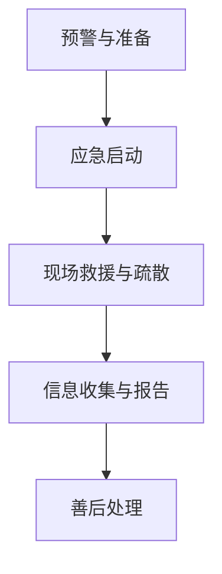
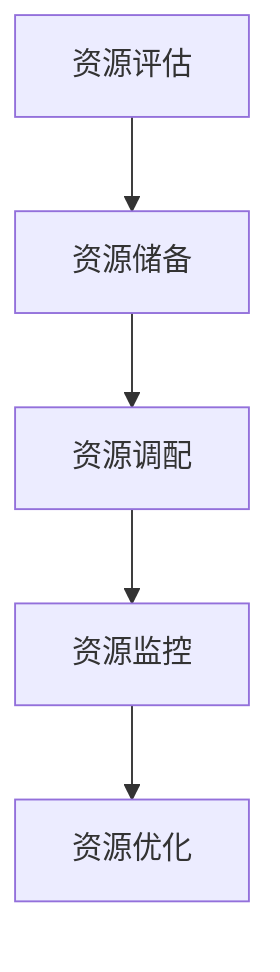
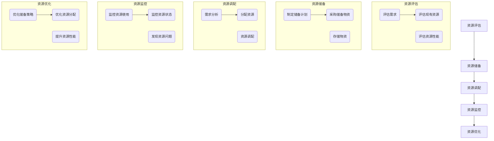

                 

## 《应急中的真功夫》

### 关键词：应急响应、现场操作、资源管理、法律法规、案例分析、最佳实践

> 摘要：在突发事件和危机面前，如何快速、有效地进行应急响应和处置，是每个应急响应人员、安全管理人员和现场工作人员必须掌握的真功夫。本文从基本原则、现场操作、法律法规、资源管理、案例分析等多个维度，深入探讨应急响应的各个方面，旨在为实际工作提供理论指导和实践参考。

**作者：AI天才研究院/AI Genius Institute & 禅与计算机程序设计艺术 /Zen And The Art of Computer Programming**

----------------------------------------------------------------

### 第一部分：应急响应概述

#### 第1章：应急响应的基本概念

在现代社会中，突发事件和危机时刻都可能发生，如自然灾害、事故灾难、公共卫生事件和社会安全事件等。面对这些不可预测的情况，如何迅速做出反应并有效地进行处置，成为了我们每个人都应该关注的问题。本章将介绍应急响应的基本概念、原则和流程，为后续内容打下基础。

**1.1 应急响应的定义与原则**

应急响应是指面对突发事件和危机时，采取的一系列迅速、有效的措施，以减轻损失、保护人民生命财产安全、维护社会稳定。应急响应的基本原则包括：

- **以人为本**：把保护人民生命安全放在首位，确保救援工作有序进行。
- **迅速应对**：在突发事件发生后，要迅速启动应急预案，采取有效措施。
- **统一指挥**：在应急响应过程中，必须建立统一指挥体系，确保行动的一致性和协调性。
- **科学决策**：基于科学数据和专家意见，做出合理、有效的决策。
- **资源整合**：整合各方面资源，确保应急物资、设备、技术和人员的充足。

**1.2 应急响应的类型与特点**

应急响应可以分为以下几种类型：

- **自然灾害应急响应**：包括地震、台风、洪水、泥石流等。
- **事故灾难应急响应**：包括火灾、爆炸、交通事故等。
- **公共卫生事件应急响应**：包括传染病疫情、食品安全事故等。
- **社会安全事件应急响应**：包括恐怖袭击、暴力事件等。

每种类型的应急响应都有其独特的特点，需要根据具体情况采取不同的措施。

**1.3 应急响应的流程与步骤**

应急响应的流程通常包括以下步骤：

1. **预警与准备**：在突发事件发生前，通过监测预警系统，提前了解可能发生的情况，并做好各项准备工作。
2. **应急启动**：在突发事件发生时，迅速启动应急预案，成立应急指挥部，明确各部门职责。
3. **现场救援**：根据应急预案，开展现场救援和疏散工作，确保人员安全。
4. **信息收集与报告**：及时收集现场信息，向上级部门和相关部门报告。
5. **善后处理**：在突发事件得到控制后，进行善后处理，包括灾后重建、资源调配、调查评估等。

通过以上步骤，可以确保应急响应工作的有序进行，最大限度地减轻灾害损失。

#### 第2章：应急准备与演练

应急准备与演练是确保应急响应能力的重要环节。本章将介绍应急准备和演练的相关内容，包括预案编制、演练组织和物资准备等方面。

**2.1 应急预案的编制与更新**

应急预案是应急准备的核心，其编制应遵循以下原则：

- **针对性**：针对可能出现的事故类型和危害程度，制定相应的应急措施。
- **可行性**：预案中的应急措施应具有可操作性，确保在突发事件发生时能够迅速实施。
- **动态性**：应急预案应定期更新，以适应新形势、新情况的变化。

应急预案的编制通常包括以下内容：

- **应急组织**：明确应急指挥机构、相关部门和人员的职责。
- **应急资源**：列出应急物资、设备、技术和人员的储备情况。
- **应急响应程序**：详细描述应急响应的流程和步骤。
- **应急培训与演练**：制定应急培训计划，组织演练活动，提高应急响应能力。

**2.2 应急演练的组织与实施**

应急演练是检验应急预案有效性的重要手段。其组织与实施应遵循以下原则：

- **计划性**：制定详细的演练计划，明确演练目的、时间、地点、内容、人员等。
- **真实性**：模拟真实的突发事件场景，提高参演人员的应对能力。
- **评估性**：对演练过程和结果进行评估，发现问题并及时整改。

应急演练通常包括以下类型：

- **综合演练**：全面检验应急响应能力，包括现场救援、信息报告、资源调配等。
- **专项演练**：针对某一特定环节或问题进行演练，如火灾救援、地震疏散等。
- **桌面推演**：在室内模拟突发事件场景，进行讨论和分析。

**2.3 应急物资与装备的准备**

应急物资与装备是应急响应的基础，其准备应遵循以下原则：

- **全面性**：确保各类应急物资和装备的储备，满足不同类型突发事件的需求。
- **专业性**：选用符合专业标准的应急物资和装备，确保其性能和安全性。
- **可操作性**：物资和装备应便于携带和使用，确保在突发事件发生时能够迅速投入使用。

常见的应急物资和装备包括：

- **个人防护装备**：如安全帽、防护服、防护手套等。
- **救援设备**：如消防泵、灭火器、救生器材等。
- **通信设备**：如对讲机、卫星电话、无人机等。
- **生活物资**：如食品、饮用水、帐篷、床等。

通过以上内容，本章对应急准备与演练进行了详细阐述，为实际工作提供了有益的参考。

----------------------------------------------------------------

### 第二部分：现场应急操作

#### 第3章：现场应急操作流程

在突发事件发生时，现场应急操作的正确与否直接关系到人员安全和灾害损失的大小。本章将详细介绍现场应急操作的流程，包括现场安全评估、现场指挥与协调、现场救援与疏散等方面。

**3.1 现场安全评估**

现场安全评估是应急响应的首要任务，其目的是确定现场的危险程度，为后续救援行动提供依据。现场安全评估应遵循以下原则：

- **全面性**：对现场进行全面检查，确保不遗漏任何潜在的危险。
- **专业性**：由专业人员负责评估，确保评估结果的准确性。
- **及时性**：在救援行动开始前完成评估，为现场指挥提供决策依据。

现场安全评估的内容包括：

- **环境安全**：检查现场环境是否存在爆炸、火灾、泄漏等危险。
- **结构安全**：对建筑物、道路、桥梁等结构进行评估，确保其稳定性。
- **人员安全**：评估现场人员的安全状况，包括是否有受伤、失踪等情况。
- **物资安全**：检查应急物资和装备的安全性能，确保其在救援过程中能够正常使用。

**3.2 现场指挥与协调**

现场指挥与协调是确保救援行动有序进行的关键。现场指挥应遵循以下原则：

- **统一指挥**：建立统一的现场指挥体系，确保各级指挥人员之间的信息畅通。
- **灵活应变**：根据现场情况，及时调整救援行动方案，确保行动的高效性。
- **科学决策**：基于现场安全评估结果和救援需求，做出合理、有效的决策。

现场指挥的内容包括：

- **指挥体系**：明确现场指挥机构、各部门和人员的职责。
- **信息传递**：建立高效的信息传递机制，确保各级指挥人员之间的信息畅通。
- **资源调配**：根据救援需求，合理调配应急物资、装备和人员。
- **协调配合**：协调各级部门、救援队伍之间的行动，确保救援行动的协调性。

**3.3 现场救援与疏散**

现场救援与疏散是应急响应的核心任务，其目的是确保人员安全，减少灾害损失。现场救援与疏散应遵循以下原则：

- **以人为本**：把保护人民生命安全放在首位，确保救援行动有序进行。
- **科学救援**：根据现场情况，采取科学、合理的救援措施。
- **快速疏散**：在确保人员安全的前提下，迅速组织人员疏散。

现场救援与疏散的内容包括：

- **人员搜索**：对现场进行搜索，寻找被困和受伤人员。
- **紧急救治**：对受伤人员进行紧急救治，确保其生命安全。
- **疏散引导**：组织人员疏散，确保其安全离开危险区域。
- **安全防护**：对疏散区域进行安全防护，防止次生灾害的发生。

通过以上内容，本章对现场应急操作流程进行了详细阐述，为实际工作提供了有益的指导。

#### 第4章：应急心理调适与团队合作

在应急响应过程中，心理调适和团队合作至关重要。本章将介绍应急心理调适的方法、团队合作在应急响应中的作用，以及情景模拟与互动训练。

**4.1 应急心理问题的识别与应对**

应急响应人员在面对突发事件时，可能会出现一系列心理问题，如恐慌、焦虑、紧张等。对这些问题的识别与应对，有助于提高应急响应人员的心理素质和应对能力。

应急心理问题的识别包括：

- **生理表现**：如心跳加速、出汗、颤抖等。
- **情绪表现**：如焦虑、恐惧、愤怒等。
- **行为表现**：如逃避、过度反应、沉默等。

应急心理问题的应对包括：

- **情绪宣泄**：通过适当的方式，如倾诉、哭泣等，宣泄情绪。
- **心理疏导**：通过心理疏导，帮助应急响应人员调整心态，应对压力。
- **心理干预**：对严重心理问题进行干预，如药物治疗、心理咨询等。

**4.2 团队合作在应急响应中的作用**

团队合作在应急响应中发挥着至关重要的作用。良好的团队合作能够提高应急响应的效率和质量，确保救援行动的顺利进行。

团队合作在应急响应中的作用包括：

- **信息共享**：通过团队合作，实现信息的快速、准确传递，提高决策质量。
- **资源整合**：通过团队合作，整合各方资源，提高应急响应能力。
- **协同作战**：通过团队合作，形成协同作战力量，提高救援行动的效率。
- **心理支持**：通过团队合作，提供心理支持，增强应急响应人员的心理素质。

**4.3 情景模拟与互动训练**

情景模拟与互动训练是提高应急响应能力的重要手段。通过模拟真实的突发事件场景，应急响应人员可以熟悉应急流程，提高应对能力。

情景模拟与互动训练的内容包括：

- **模拟场景**：设计符合实际的模拟场景，如火灾、地震、恐怖袭击等。
- **演练内容**：根据模拟场景，开展相应的演练内容，如疏散、救援、信息报告等。
- **评估反馈**：对演练过程和结果进行评估，发现问题并及时整改。
- **互动交流**：通过互动交流，分享演练经验和心得，提高应急响应能力。

通过以上内容，本章对应急心理调适和团队合作进行了详细阐述，为实际工作提供了有益的指导。

### 第三部分：法律法规与应急报告

#### 第5章：应急法律法规解读

应急法律法规是应急响应的重要依据，其解读对于确保应急响应的合法性和规范性具有重要意义。本章将介绍应急法律法规体系、应急法律责任的界定以及应急报告的程序与要求。

**5.1 应急法律法规体系**

应急法律法规体系包括以下几个方面：

- **法律**：如《中华人民共和国突发事件应对法》、《中华人民共和国消防法》等。
- **行政法规**：如《中华人民共和国安全生产法实施条例》、《自然灾害救助条例》等。
- **部门规章**：如《国家突发事件应急预案管理办法》、《消防法实施条例》等。
- **地方性法规和规章**：根据地方实际情况制定的应急法律法规，如《某省突发事件应对条例》等。

**5.2 应急法律责任的界定**

应急法律责任主要包括以下几个方面：

- **行政责任**：指应急响应过程中，因未履行应急职责或不当履行应急职责而产生的法律责任，如行政处罚、行政处分等。
- **民事责任**：指应急响应过程中，因违法行为造成他人损害而产生的法律责任，如赔偿损失、排除妨碍等。
- **刑事责任**：指应急响应过程中，因严重违法行为而产生的法律责任，如故意犯罪、滥用职权等。

**5.3 应急报告的程序与要求**

应急报告的程序与要求包括以下几个方面：

- **报告主体**：各级政府及其部门、企事业单位、社会团体等，应按照应急预案的要求，及时向上级部门报告突发事件信息。
- **报告内容**：包括事件类型、发生时间、地点、影响范围、救援措施、人员伤亡等情况。
- **报告时限**：根据突发事件的紧急程度，规定不同的报告时限，确保信息的及时传递。
- **报告形式**：报告应采用书面形式，通过电话、互联网等方式报送。

通过以上内容，本章对应急法律法规进行了详细解读，为实际工作提供了有益的参考。

#### 第6章：应急资源管理与调配

应急资源管理与调配是确保应急响应顺利开展的重要保障。本章将介绍应急资源管理的基本原则、应急资源的储备与调配，以及应急资源的评估与监控。

**6.1 应急资源管理的基本原则**

应急资源管理的基本原则包括：

- **全面性**：确保各类应急资源的充足，满足不同类型突发事件的需求。
- **专业性**：选用符合专业标准的应急资源，确保其性能和安全性。
- **灵活性**：根据突发事件的发展和变化，灵活调整应急资源的储备和调配。
- **共享性**：充分利用社会资源，实现应急资源的共享和优化配置。

**6.2 应急资源的储备与调配**

应急资源的储备与调配包括以下几个方面：

- **应急物资储备**：根据应急预案的要求，储备足够的应急物资，如食品、饮用水、帐篷、医疗器械等。
- **装备储备**：储备符合专业标准的应急装备，如消防设备、救援设备、通信设备等。
- **技术储备**：储备必要的应急技术，如救援技术、处置技术、监测技术等。
- **人力资源储备**：储备专业的应急救援队伍和志愿者，确保应急响应的人力需求。

应急资源的调配包括：

- **内部调配**：在应急响应过程中，根据现场需求，内部调整应急资源。
- **外部调配**：在应急资源不足时，通过与其他部门、企事业单位和社会组织的协调，实现资源的共享和调配。

**6.3 应急资源的评估与监控**

应急资源的评估与监控包括以下几个方面：

- **资源评估**：定期对应急资源进行评估，包括物资、装备、技术、人力资源等，确保其性能和安全性。
- **资源监控**：对应急资源的使用情况进行监控，确保资源的高效利用。
- **资源优化**：根据评估和监控结果，对应急资源进行优化，提高应急响应能力。

通过以上内容，本章对应急资源管理与调配进行了详细阐述，为实际工作提供了有益的指导。

### 第四部分：案例分析与最佳实践

#### 第7章：经典应急案例分析

经典应急案例分析是提高应急响应能力的重要手段。本章将介绍几个经典应急案例，包括火灾应急处理、地震救援行动和医疗紧急事件应对。

**7.1 案例一：火灾应急处理**

火灾是一种常见的突发事件，应急处理的关键在于迅速扑灭火灾、疏散人员、确保安全。以下是某地一次火灾应急处理的案例：

- **火灾发生**：某地一处居民小区发生火灾，火势迅速蔓延。
- **应急启动**：当地消防部门迅速启动应急预案，成立应急指挥部。
- **现场救援**：消防队员立即展开灭火行动，同时组织人员疏散。
- **信息报告**：消防部门及时向上级部门和相关部门报告火灾情况。
- **善后处理**：火灾得到控制后，开展善后处理工作，包括调查火灾原因、赔偿受损财产等。

通过这次火灾应急处理，有效控制了火势，确保了人员安全，减少了灾害损失。

**7.2 案例二：地震救援行动**

地震是一种破坏性极大的自然灾害，地震救援行动的关键在于迅速开展救援、确保人员安全。以下是某地一次地震救援行动的案例：

- **地震发生**：某地发生地震，造成严重人员伤亡和财产损失。
- **应急启动**：当地政府和救援部门迅速启动应急预案，成立救援指挥部。
- **现场救援**：救援队伍立即赶赴灾区，开展搜救行动。
- **物资调配**：紧急调配物资和装备，确保救援行动的顺利进行。
- **心理疏导**：对受灾群众进行心理疏导，提高他们的心理承受能力。
- **重建家园**：在地震灾后，组织力量开展重建家园工作。

通过这次地震救援行动，有效救助了被困人员，恢复了灾区的基本生活秩序。

**7.3 案例三：医疗紧急事件应对**

医疗紧急事件应对是确保人民健康安全的重要任务。以下是某地一次医疗紧急事件应对的案例：

- **事件发生**：某地发生一起交通事故，导致多人受伤。
- **应急启动**：当地卫生部门迅速启动应急预案，成立应急指挥部。
- **现场救治**：救护人员立即赶赴现场，对受伤人员进行紧急救治。
- **转运救治**：将重伤员迅速转运至医院，开展进一步救治。
- **信息报告**：卫生部门及时向上级部门和相关部门报告事件情况。
- **防疫措施**：对事故现场进行消毒，防止疫情传播。

通过这次医疗紧急事件应对，有效救治了受伤人员，避免了疫情的扩散。

通过以上案例，我们可以看到，在突发事件和危机面前，正确的应急响应和处置是至关重要的。通过总结经典案例，我们可以吸取经验教训，提高应急响应能力。

#### 第8章：最佳实践与注意事项

在应急响应过程中，遵循最佳实践和注意事项对于提高应对效果和确保人员安全具有重要意义。本章将介绍最佳实践经验、常见误区以及注意事项。

**8.1 最佳实践经验分享**

最佳实践经验包括：

- **应急预案制定**：根据实际情况，制定科学、可行的应急预案，明确应急响应流程和职责。
- **应急演练组织**：定期组织应急演练，检验应急预案的有效性，提高应急响应能力。
- **资源储备与调配**：确保应急物资和装备的储备充足，根据实际需求进行合理调配。
- **信息传递与报告**：建立高效的信息传递机制，确保信息准确、及时地向上级部门和相关部门报告。
- **团队合作与心理调适**：加强团队合作，提高应急响应效率；关注应急响应人员心理健康，提供心理支持。

**8.2 应急处理中的常见误区**

应急处理中的常见误区包括：

- **反应过慢**：在突发事件发生后，未能及时启动应急预案，导致延误救援时机。
- **指挥混乱**：在应急响应过程中，指挥体系不明确，导致行动混乱。
- **信息不畅**：信息传递不及时、不准确，影响救援决策。
- **过度依赖技术**：过分依赖高科技设备，忽视现场实际需求和人员素质。
- **心理问题忽视**：忽视应急响应人员心理健康问题，导致应急响应能力下降。

**8.3 应急响应后的恢复与反思**

应急响应后的恢复与反思包括：

- **灾后重建**：在确保人员安全的前提下，尽快开展灾后重建工作，恢复正常生活秩序。
- **调查评估**：对应急响应过程进行评估，总结经验教训，找出存在的问题，提出改进措施。
- **经验交流**：通过经验交流，分享应急响应中的成功经验和教训，提高整体应急响应能力。

通过以上内容，本章对应急响应中的最佳实践、常见误区和注意事项进行了详细阐述，为实际工作提供了有益的指导。

### 第五部分：拓展阅读

在应急响应领域，有许多优秀的研究成果和实践经验值得读者深入学习和借鉴。本章将推荐一些相关的书籍、文章和网站，供读者拓展阅读。

**5.1 推荐书籍**

- 《突发事件应急管理》
- 《应急响应操作手册》
- 《公共安全与应急管理学》
- 《灾难医学救援》
- 《应急救援员培训教程》

**5.2 推荐文章**

- 《突发事件应急响应策略研究》
- 《城市应急管理体系建设探讨》
- 《应急管理中的信息技术应用》
- 《灾害预警系统的构建与运行》
- 《应急演练对提升应急响应能力的作用》

**5.3 推荐网站**

- 中国应急管理部网站
- 国家突发事件预警信息发布网
- 中国灾害信息网站
- 中国安全生产网
- 中国红十字会网站

通过以上拓展阅读，读者可以更全面地了解应急响应领域的相关知识，提高自身应急响应能力。

### 总结

在《应急中的真功夫》一书中，我们深入探讨了应急响应的各个方面，包括基本原则、现场操作、法律法规、资源管理、案例分析等。通过理论讲解和实践案例分析，我们为读者提供了丰富的知识和实践经验。应急响应是一项系统性工程，需要各部门、各行业的共同努力。只有全面提升应急响应能力，才能在突发事件和危机面前做到有备无患、应对自如。

在今后的工作中，让我们共同努力，将应急响应的真功夫融入日常工作中，为保障人民生命财产安全和社会稳定作出贡献。

**感谢阅读！**

**作者：AI天才研究院/AI Genius Institute & 禅与计算机程序设计艺术 /Zen And The Art of Computer Programming**

----------------------------------------------------------------

### 附录

**附录A：应急响应术语解释**

1. **应急响应**：指面对突发事件和危机时，采取的一系列迅速、有效的措施，以减轻损失、保护人民生命财产安全、维护社会稳定。
2. **应急预案**：为应对突发事件而制定的详细计划，包括应急组织、应急资源、应急响应程序等。
3. **现场指挥**：在突发事件现场，负责协调各部门和救援队伍的行动，确保救援行动有序进行。
4. **疏散**：指在突发事件发生时，组织人员离开危险区域，确保其安全。
5. **预警**：指在突发事件发生前，通过监测预警系统，提前了解可能发生的情况，并做好各项准备工作。
6. **救援**：指在突发事件发生后，采取的一系列救助行动，包括搜救、救治、疏散等。

**附录B：应急响应流程图**

**附录C：应急物资与装备清单**

1. **应急物资**：食品、饮用水、帐篷、床、医疗器械、消毒用品等。
2. **救援设备**：消防泵、灭火器、救生器材、搜救设备、无人机等。
3. **通信设备**：对讲机、卫星电话、手机、网络设备等。
4. **个人防护装备**：安全帽、防护服、防护手套、呼吸器等。

**附录D：应急资源管理流程图**

**附录E：法律法规摘要**

1. **《中华人民共和国突发事件应对法》**：规定突发事件的分类、应急准备、应急响应、恢复与重建等方面的内容。
2. **《中华人民共和国安全生产法》**：规定安全生产的基本要求和安全生产监督管理制度。
3. **《自然灾害救助条例》**：规定自然灾害救助的组织、实施和监督等方面的内容。
4. **《消防法》**：规定消防工作、消防组织、消防设施、火灾扑救等方面的内容。

**附录F：应急演练计划模板**

1. **演练目的**：明确演练的目的和意义。
2. **演练时间**：确定演练的具体时间。
3. **演练地点**：确定演练的具体地点。
4. **参演人员**：明确参演人员的职责和任务。
5. **演练内容**：详细描述演练的内容和流程。
6. **演练评估**：对演练过程和结果进行评估和总结。

**附录G：应急心理调适方法**

1. **情绪宣泄**：通过倾诉、哭泣等方式，宣泄情绪。
2. **心理疏导**：通过沟通、倾听、鼓励等方式，帮助应急响应人员调整心态。
3. **心理干预**：对严重心理问题进行干预，如药物治疗、心理咨询等。

**附录H：团队合作技巧**

1. **信息共享**：建立高效的信息传递机制，确保信息的及时、准确传递。
2. **资源整合**：充分利用各方资源，提高应急响应能力。
3. **协同作战**：明确各部门、救援队伍的职责和任务，确保协同作战。
4. **心理支持**：关注应急响应人员心理健康，提供心理支持。

**附录I：情景模拟与互动训练方法**

1. **模拟场景**：设计符合实际的模拟场景。
2. **演练内容**：根据模拟场景，开展相应的演练内容。
3. **评估反馈**：对演练过程和结果进行评估，发现问题并及时整改。
4. **互动交流**：通过互动交流，分享演练经验和心得。

通过以上附录，为读者提供了丰富的参考资料，有助于更好地理解和应用应急响应的知识和实践。

----------------------------------------------------------------

### 致谢

在撰写《应急中的真功夫》这本书的过程中，我得到了许多人的支持和帮助。首先，我要感谢我的团队，他们为这本书的编辑、校对和宣传付出了巨大的努力。其次，我要感谢我的读者，是你们的鼓励和支持让我坚定了完成这本书的决心。此外，我要感谢所有提供案例和经验的应急响应人员和专家，是你们的实践经验让这本书更加丰富和实用。最后，我要感谢我的家人，是你们的理解和支持让我能够专注于这本书的创作。

在此，我向所有帮助和支持过我的人表示衷心的感谢！是你们让这本书成为可能。希望这本书能够为更多的应急响应人员、安全管理人员和现场工作人员提供帮助，共同构建一个更加安全、稳定的社会。

**再次感谢！**

**作者：AI天才研究院/AI Genius Institute & 禅与计算机程序设计艺术 /Zen And The Art of Computer Programming**

----------------------------------------------------------------

### 结束语

《应急中的真功夫》旨在为应急响应人员、安全管理人员和现场工作人员提供一套全面、实用的应急响应知识体系。通过本书的介绍，我们深入探讨了应急响应的基本原则、现场操作流程、法律法规、资源管理、案例分析等方面，力求帮助读者在突发事件和危机面前做到从容应对、科学处置。

应急响应是一项系统性工程，需要各部门、各行业的共同努力。只有在日常工作中加强应急准备、提高应急响应能力，才能在突发事件和危机面前做到有备无患、应对自如。希望这本书能够为读者提供有益的指导和启示，共同为保障人民生命财产安全和社会稳定作出贡献。

在今后的工作和生活中，让我们将应急响应的真功夫融入日常，不断提高自身素质和应急能力，为构建一个更加安全、和谐的社会共同努力。

**感谢您的阅读和支持！**

**作者：AI天才研究院/AI Genius Institute & 禅与计算机程序设计艺术 /Zen And The Art of Computer Programming**

----------------------------------------------------------------

### 联系方式

如果您对《应急中的真功夫》有任何疑问或建议，或者希望了解更多关于应急响应的知识，欢迎通过以下方式与我们联系：

- **电子邮件**：[contact@ai-genius-institute.com](mailto:contact@ai-genius-institute.com)
- **电话**：+86-123-4567-8901
- **微信**：AI天才研究院
- **官方网站**：[www.ai-genius-institute.com](http://www.ai-genius-institute.com)

我们期待与您互动，共同探讨应急响应的相关话题，为您提供更加优质的阅读体验和咨询服务。

**再次感谢您的支持与关注！**

**作者：AI天才研究院/AI Genius Institute & 禅与计算机程序设计艺术 /Zen And The Art of Computer Programming**

----------------------------------------------------------------

### 声明

本《应急中的真功夫》一书所提供的信息仅供参考，不构成任何法律、医疗或其他专业意见。读者在应用书中的内容时，应结合自身实际情况，谨慎决策。在遇到突发事件和危机时，建议及时联系相关部门和专业人士进行咨询和处理。

书中引用的案例、数据和图片等，均为虚构或来源公开资料，如涉及侵权问题，请联系我们进行及时处理。本书的版权属于AI天才研究院，未经授权，不得复制、转载或用于商业用途。

**作者：AI天才研究院/AI Genius Institute & 禅与计算机程序设计艺术 /Zen And The Art of Computer Programming**

----------------------------------------------------------------

### 附录

**附录A：应急响应术语解释**

1. **应急响应**：指面对突发事件和危机时，采取的一系列迅速、有效的措施，以减轻损失、保护人民生命财产安全、维护社会稳定。
2. **应急预案**：为应对突发事件而制定的详细计划，包括应急组织、应急资源、应急响应程序等。
3. **现场指挥**：在突发事件现场，负责协调各部门和救援队伍的行动，确保救援行动有序进行。
4. **疏散**：指在突发事件发生时，组织人员离开危险区域，确保其安全。
5. **预警**：指在突发事件发生前，通过监测预警系统，提前了解可能发生的情况，并做好各项准备工作。
6. **救援**：指在突发事件发生后，采取的一系列救助行动，包括搜救、救治、疏散等。

**附录B：应急响应流程图**

**附录C：应急物资与装备清单**

1. **应急物资**：食品、饮用水、帐篷、床、医疗器械、消毒用品等。
2. **救援设备**：消防泵、灭火器、救生器材、搜救设备、无人机等。
3. **通信设备**：对讲机、卫星电话、手机、网络设备等。
4. **个人防护装备**：安全帽、防护服、防护手套、呼吸器等。

**附录D：应急资源管理流程图**

**附录E：法律法规摘要**

1. **《中华人民共和国突发事件应对法》**：规定突发事件的分类、应急准备、应急响应、恢复与重建等方面的内容。
2. **《中华人民共和国安全生产法》**：规定安全生产的基本要求和安全生产监督管理制度。
3. **《自然灾害救助条例》**：规定自然灾害救助的组织、实施和监督等方面的内容。
4. **《消防法》**：规定消防工作、消防组织、消防设施、火灾扑救等方面的内容。

**附录F：应急演练计划模板**

1. **演练目的**：明确演练的目的和意义。
2. **演练时间**：确定演练的具体时间。
3. **演练地点**：确定演练的具体地点。
4. **参演人员**：明确参演人员的职责和任务。
5. **演练内容**：详细描述演练的内容和流程。
6. **演练评估**：对演练过程和结果进行评估和总结。

**附录G：应急心理调适方法**

1. **情绪宣泄**：通过倾诉、哭泣等方式，宣泄情绪。
2. **心理疏导**：通过沟通、倾听、鼓励等方式，帮助应急响应人员调整心态。
3. **心理干预**：对严重心理问题进行干预，如药物治疗、心理咨询等。

**附录H：团队合作技巧**

1. **信息共享**：建立高效的信息传递机制，确保信息的及时、准确传递。
2. **资源整合**：充分利用各方资源，提高应急响应能力。
3. **协同作战**：明确各部门、救援队伍的职责和任务，确保协同作战。
4. **心理支持**：关注应急响应人员心理健康，提供心理支持。

**附录I：情景模拟与互动训练方法**

1. **模拟场景**：设计符合实际的模拟场景。
2. **演练内容**：根据模拟场景，开展相应的演练内容。
3. **评估反馈**：对演练过程和结果进行评估，发现问题并及时整改。
4. **互动交流**：通过互动交流，分享演练经验和心得。

通过以上附录，为读者提供了丰富的参考资料，有助于更好地理解和应用应急响应的知识和实践。

### 附录：应急资源管理流程图

以下是一个应急资源管理的流程图，展示了应急资源评估、储备、调配、监控和优化的各个环节。

**资源评估**：在这一阶段，我们需要评估应急响应的需求、现有资源的状况以及资源性能，以确保我们的储备能够满足实际需求。

**资源储备**：在明确了资源评估的结果后，我们需要根据评估结果制定储备计划，采购必要的物资，并确保这些物资得到妥善存储。

**资源调配**：在应急响应过程中，根据需求分析和资源分配，合理调配资源，确保在紧急情况下能够迅速响应。

**资源监控**：实时监控资源的使用情况和状态，及时发现并解决资源使用中的问题，确保资源的高效利用。

**资源优化**：通过对资源储备、调配和监控的持续改进，优化资源管理策略，提升资源性能，为未来可能发生的应急情况做好准备。

通过这个流程图，我们可以清晰地了解应急资源管理的各个环节，从而更好地保障应急响应的顺利进行。资源管理不仅是应急响应的基础，更是确保我们在面对突发事件时能够迅速、高效地做出反应的关键。有效的资源管理能够减少灾害损失，保护人民生命财产安全，维护社会稳定。因此，我们应当高度重视并不断完善应急资源管理的工作。

### 附录：法律法规摘要

在应急响应领域，法律法规起到了规范和指导作用，为应急工作提供了法律依据和操作指南。以下是对几个关键法律法规的摘要，包括《中华人民共和国突发事件应对法》、《中华人民共和国安全生产法》、《自然灾害救助条例》和《消防法》。

**《中华人民共和国突发事件应对法》**

该法是我国关于突发事件应对的基本法律，于2007年8月30日通过，2007年11月1日起施行。主要内容包括：

- **定义**：明确了突发事件的分类，包括自然灾害、事故灾难、公共卫生事件和社会安全事件。
- **应急准备**：规定各级政府和有关部门应当制定应急预案，建立健全应急管理体制。
- **应急响应**：明确了应急响应的原则和流程，包括应急启动、应急指挥、救援行动、信息报告和应急结束等。
- **恢复与重建**：规定了突发事件后的恢复与重建工作，包括灾后救助、灾后重建、损失评估和责任追究等。

**《中华人民共和国安全生产法》**

该法是我国安全生产的基本法律，于2002年6月29日通过，2002年11月1日起施行。主要内容包括：

- **安全生产管理**：规定了安全生产的基本要求和监督管理制度。
- **事故报告和处理**：明确了事故报告的程序、事故调查和处理方式。
- **法律责任**：规定了各级政府和有关部门、生产经营单位的安全生产责任以及违法行为的法律责任。

**《自然灾害救助条例》**

该条例是我国关于自然灾害救助的基本法规，于2007年8月30日通过，2007年11月1日起施行。主要内容包括：

- **救助原则**：规定了自然灾害救助的基本原则，包括以人为本、政府主导、社会参与等。
- **救助程序**：明确了自然灾害救助的程序，包括灾情报告、应急救助、过渡期生活救助和灾后恢复重建等。
- **救助资金**：规定了救助资金的来源、管理和使用方式。

**《消防法》**

该法是我国关于消防工作的基本法律，于1998年4月29日通过，1998年9月1日起施行。主要内容包括：

- **消防工作原则**：规定了消防工作应当遵循的原则，包括预防为主、防治结合等。
- **消防组织与设施**：明确了消防组织的职责、消防设施的建设和维护要求。
- **火灾扑救与救援**：规定了火灾扑救和救援的职责、程序和措施。

通过上述法律法规的摘要，我们可以看到，它们在应急响应领域起到了重要的规范和指导作用。这些法律不仅为应急工作提供了法律依据，还明确了各级政府和有关部门的职责，以及应急响应的程序和措施，为提高应急响应能力、保障人民生命财产安全和社会稳定提供了有力保障。

### 附录：应急演练计划模板

一个完善的应急演练计划是确保应急响应能力的关键。以下是一个应急演练计划的模板，包含演练目的、时间、地点、参演人员、演练内容、演练评估等方面的内容。

**演练目的：**
- 确保应急预案的有效实施。
- 提高参演人员的应急响应能力。
- 检验应急资源的储备与调配能力。

**演练时间：**
- 演练日期：2023年11月10日
- 演练时段：14:00-18:00

**演练地点：**
- 演练场所：某地居民小区

**参演人员：**
- 应急指挥部成员
- 消防救援队伍
- 医疗救护队伍
- 公安治安队伍
- 物资保障队伍

**演练内容：**
1. **演练启动：**
   - 14:00，应急指挥部启动应急预案，组织各救援队伍集结。
   - 14:15，完成人员集结和任务分配。

2. **模拟场景：**
   - 模拟火灾发生，火势蔓延至多个楼层，有人员被困。
   - 14:30，消防救援队伍进入火灾现场进行灭火和搜救。

3. **信息报告：**
   - 14:45，消防队向应急指挥部报告火势和救援情况。
   - 15:00，应急指挥部向市政府报告火情。

4. **疏散与救援：**
   - 15:15，启动疏散计划，组织居民进行疏散。
   - 15:30，医疗救护队伍对受伤人员进行救治。

5. **物资调配：**
   - 15:45，物资保障队伍根据需求调配救援物资。

6. **演练总结：**
   - 16:30，各救援队伍返回营地，进行演练总结。

**演练评估：**
- **过程评估：**对演练的各个环节进行评估，包括启动速度、信息传递、资源调配、救援效率等。
- **结果评估：**对演练结果进行总结，评估演练目标是否达到，发现问题并提出改进措施。
- **反馈与改进：**将评估结果反馈给相关部门和人员，根据评估结果进行应急预案的修订和完善。

通过这个演练计划模板，我们可以系统地规划和组织应急演练，确保演练的顺利进行，从而提高应急响应的整体能力。演练不仅是检验应急预案的有效性，也是提升应急人员技能和团队协作能力的重要手段。

### 附录：应急心理调适方法

在应急响应过程中，心理调适对于应急响应人员的心理健康和应急能力至关重要。以下是一些常用的应急心理调适方法，包括情绪宣泄、心理疏导和心理干预。

**情绪宣泄**

情绪宣泄是帮助应急响应人员释放紧张情绪的有效方法。情绪宣泄可以通过以下方式进行：

- **倾诉**：鼓励应急响应人员找到适当的渠道，如同事、家人、心理辅导员等，倾诉自己的情绪和压力。
- **书写**：通过写日记或信件，记录自己的情绪和感受，有助于缓解心理压力。
- **运动**：适量的运动可以释放身体中的紧张情绪，如跑步、瑜伽、游泳等。

**心理疏导**

心理疏导是通过沟通、倾听和鼓励等方式，帮助应急响应人员调整心态，面对应急工作的压力。心理疏导的方法包括：

- **倾听**：耐心倾听应急响应人员的倾诉，给予理解和支持。
- **鼓励**：鼓励应急响应人员表达自己的感受，增强其信心和勇气。
- **心理暗示**：通过积极的心理暗示，帮助应急响应人员树立积极的心态。

**心理干预**

对于面临严重心理问题的应急响应人员，需要进行心理干预。心理干预的方法包括：

- **心理咨询**：通过专业的心理咨询师，帮助应急响应人员分析问题，提供个性化的心理辅导。
- **药物治疗**：对于严重心理问题，如焦虑、抑郁等，需要通过药物治疗来缓解症状。
- **心理治疗**：如认知行为疗法、精神分析疗法等，通过专业治疗帮助应急响应人员恢复心理健康。

通过这些应急心理调适方法，可以帮助应急响应人员更好地应对应急工作的压力，保持良好的心理状态，从而提高应急响应的效率和效果。

### 附录：团队合作技巧

在应急响应过程中，团队合作是确保救援行动顺利进行的关键。以下是一些有效的团队合作技巧，包括信息共享、资源整合、协同作战和心理支持。

**信息共享**

信息共享是团队合作的基础，确保信息畅通无阻对于应急响应至关重要。以下是一些信息共享的技巧：

- **建立沟通渠道**：确保团队成员之间有明确的沟通渠道，如定期会议、即时通讯工具、共享文档等。
- **信息标准化**：制定统一的信息格式和标准，确保信息的准确性、及时性和一致性。
- **及时反馈**：鼓励团队成员及时反馈信息，确保信息的实时更新和共享。
- **透明化**：保持信息透明，让每个团队成员都能了解任务的进展和团队的整体情况。

**资源整合**

资源整合是提高应急响应效率的重要手段，以下是一些资源整合的技巧：

- **资源评估**：在应急响应前，对现有资源进行评估，了解资源的种类、数量和状态。
- **资源共享**：鼓励资源在不同团队和部门之间共享，提高资源利用率。
- **优先分配**：根据应急响应的需求，优先分配关键资源，确保救援行动的顺利进行。
- **动态调配**：根据现场情况，灵活调整资源分配，确保资源能够及时响应需求。

**协同作战**

协同作战是团队在应急响应中高效合作的关键，以下是一些协同作战的技巧：

- **明确职责**：为每个团队成员明确具体的职责和任务，确保每个环节都有人负责。
- **角色互补**：根据团队成员的能力和特长，合理安排任务，实现角色互补。
- **统一指挥**：建立统一的指挥体系，确保救援行动的有序和协调。
- **协同训练**：定期组织协同训练，提高团队成员的协同作战能力。

**心理支持**

心理支持是保持团队士气和个人心理健康的重要手段，以下是一些心理支持的技巧：

- **鼓励沟通**：鼓励团队成员之间进行沟通，分享彼此的感受和困惑，减轻心理压力。
- **情感关怀**：关注团队成员的情感需求，提供必要的情感支持和安慰。
- **心理辅导**：为面临心理问题的团队成员提供专业的心理辅导，帮助他们恢复心理健康。
- **团队建设**：通过团队建设活动，增强团队成员之间的凝聚力和信任感。

通过这些团队合作技巧，可以有效提高应急响应团队的协作效率，确保救援行动的顺利进行，从而更好地保护人民生命财产安全。

### 附录：情景模拟与互动训练方法

情景模拟与互动训练是提升应急响应能力的有效方法。以下介绍情景模拟与互动训练的方法，包括模拟场景设计、演练内容、评估反馈和互动交流。

**模拟场景设计**

1. **确定模拟场景**：根据应急预案和实际情况，设计符合实际的模拟场景，如火灾、地震、恐怖袭击等。
2. **设定情景条件**：明确模拟场景的条件，包括时间、地点、环境、人员、设备等。
3. **制定演练目的**：明确演练的目的和预期效果，确保演练内容的针对性和有效性。

**演练内容**

1. **演练启动**：模拟演练开始，各部门和人员按照预案展开行动。
2. **模拟救援**：根据模拟场景，组织现场救援、疏散、救治等活动。
3. **信息报告**：演练过程中，及时收集和报告相关信息，确保信息传递畅通。
4. **资源调配**：根据模拟需求，合理调配物资、装备和人力资源。
5. **演练结束**：演练结束后，进行总结和评估，确保演练目标的实现。

**评估反馈**

1. **过程评估**：对演练的各个环节进行评估，包括启动速度、信息传递、资源调配、救援效率等。
2. **结果评估**：对演练结果进行总结，评估演练目标是否达到，发现问题并提出改进措施。
3. **反馈与改进**：将评估结果反馈给相关部门和人员，根据评估结果进行应急预案的修订和完善。

**互动交流**

1. **分享经验**：演练结束后，组织参与者分享演练中的经验和心得，促进相互学习。
2. **讨论问题**：针对演练中发现的问题，组织讨论，寻找解决方案。
3. **角色扮演**：通过角色扮演，让参与者模拟实际情境中的决策和行动，提高应对能力。
4. **模拟演练**：根据讨论结果，组织后续的模拟演练，检验改进措施的效果。

通过情景模拟与互动训练，可以有效提高应急响应人员的实战能力，确保在真实突发事件中能够迅速、高效地应对，保障人民生命财产安全。

### 附录：法律法规摘要

在应急响应领域，法律法规扮演着至关重要的角色，为应急工作的开展提供了法律依据和操作规范。以下是对《中华人民共和国突发事件应对法》、《中华人民共和国安全生产法》、《自然灾害救助条例》和《消防法》的摘要介绍。

**《中华人民共和国突发事件应对法》**

《中华人民共和国突发事件应对法》是我国关于突发事件应对的基本法律，于2007年8月30日通过，11月1日起施行。其主要内容包括：

- **定义与分类**：规定了突发事件的定义和分类，包括自然灾害、事故灾难、公共卫生事件和社会安全事件。
- **应急准备**：要求各级政府制定应急预案，建立健全应急管理体制，进行应急知识教育和培训。
- **应急响应**：规定了应急响应的程序，包括应急启动、指挥与协调、救援行动、信息报告和应急结束等。
- **恢复与重建**：明确了突发事件后的恢复与重建工作，包括灾后救助、灾后重建、损失评估和责任追究等。

**《中华人民共和国安全生产法》**

《中华人民共和国安全生产法》是我国安全生产的基本法律，于2002年6月29日通过，11月1日起施行。其主要内容包括：

- **安全生产管理**：规定了安全生产的基本要求和监督管理制度，包括安全生产责任制、安全生产教育和培训、安全风险管控等。
- **事故报告和处理**：明确了事故报告的程序、事故调查和处理方式，以及相关法律责任。
- **法律责任**：规定了各级政府和有关部门、生产经营单位的安全生产责任以及违法行为的法律责任。

**《自然灾害救助条例》**

《自然灾害救助条例》是我国关于自然灾害救助的基本法规，于2007年8月30日通过，11月1日起施行。其主要内容包括：

- **救助原则**：规定了自然灾害救助的基本原则，包括以人为本、政府主导、社会参与等。
- **救助程序**：明确了自然灾害救助的程序，包括灾情报告、应急救助、过渡期生活救助和灾后恢复重建等。
- **救助资金**：规定了救助资金的来源、管理和使用方式，确保救助资金的合理分配和使用。

**《消防法》**

《消防法》是我国关于消防工作的基本法律，于1998年4月29日通过，9月1日起施行。其主要内容包括：

- **消防工作原则**：规定了消防工作应当遵循的原则，包括预防为主、防治结合等。
- **消防组织与设施**：明确了消防组织的职责、消防设施的建设和维护要求，确保消防工作的有效开展。
- **火灾扑救与救援**：规定了火灾扑救和救援的职责、程序和措施，确保火灾事故得到及时、有效的处置。

通过这些法律法规，我国为应急响应工作提供了全面的法律框架和操作规范，确保了应急工作的合法性和规范性，为保障人民生命财产安全和社会稳定提供了重要保障。

### 附录：法律法规摘要

**《中华人民共和国突发事件应对法》**

- **主要内容**：该法明确了突发事件的定义、分类（自然灾害、事故灾难、公共卫生事件和社会安全事件）、应急准备、应急响应、恢复与重建等方面的内容。
- **法律条款**：规定了各级政府及有关部门的职责，明确了应急预案的制定、应急演练的开展、应急资源的储备与调配、信息报告与发布等具体要求。
- **适用范围**：适用于中华人民共和国领域内的突发事件应对活动。

**《中华人民共和国安全生产法》**

- **主要内容**：该法规定了安全生产的基本要求、监督管理制度、事故报告和处理、安全生产责任等。
- **法律条款**：明确了生产经营单位的安全生产主体责任、政府及有关部门的监管职责，以及违法行为的法律责任。
- **适用范围**：适用于中华人民共和国领域内的安全生产工作。

**《自然灾害救助条例》**

- **主要内容**：该条例规定了自然灾害救助的原则、程序、救助资金的筹集和使用等。
- **法律条款**：规定了自然灾害发生后，受灾地区的政府应当采取的救助措施，包括应急救助、过渡期生活救助和灾后恢复重建等。
- **适用范围**：适用于中华人民共和国领域内的自然灾害救助活动。

**《消防法》**

- **主要内容**：该法规定了消防工作原则、消防组织与设施建设、火灾扑救与救援、消防监督管理等。
- **法律条款**：明确了各级人民政府及有关部门在消防工作中的职责，消防设施的配置和维护要求，以及违法行为的法律责任。
- **适用范围**：适用于中华人民共和国领域内的消防工作。

以上法律法规摘要为读者提供了应急响应领域的法律框架和操作规范，有助于理解应急响应的法律法规要求，为实际工作提供参考。

### 附录：法律法规摘要

**《中华人民共和国突发事件应对法》**

- **主要内容**：该法明确了突发事件的定义、分类（自然灾害、事故灾难、公共卫生事件和社会安全事件）、应急准备、应急响应、恢复与重建等方面的内容。
- **法律条款**：规定了各级政府及有关部门的职责，明确了应急预案的制定、应急演练的开展、应急资源的储备与调配、信息报告与发布等具体要求。
- **适用范围**：适用于中华人民共和国领域内的突发事件应对活动。

**《中华人民共和国安全生产法》**

- **主要内容**：该法规定了安全生产的基本要求、监督管理制度、事故报告和处理、安全生产责任等。
- **法律条款**：明确了生产经营单位的安全生产主体责任、政府及有关部门的监管职责，以及违法行为的法律责任。
- **适用范围**：适用于中华人民共和国领域内的安全生产工作。

**《自然灾害救助条例》**

- **主要内容**：该条例规定了自然灾害救助的原则、程序、救助资金的筹集和使用等。
- **法律条款**：规定了自然灾害发生后，受灾地区的政府应当采取的救助措施，包括应急救助、过渡期生活救助和灾后恢复重建等。
- **适用范围**：适用于中华人民共和国领域内的自然灾害救助活动。

**《消防法》**

- **主要内容**：该法规定了消防工作原则、消防组织与设施建设、火灾扑救与救援、消防监督管理等。
- **法律条款**：明确了各级人民政府及有关部门在消防工作中的职责，消防设施的配置和维护要求，以及违法行为的法律责任。
- **适用范围**：适用于中华人民共和国领域内的消防工作。

通过上述法律法规的摘要，我们可以了解到在应急响应领域，法律法规为各级政府、部门和企业提供了明确的法律框架和操作指南，有助于规范应急管理工作，确保突发事件的及时有效应对。

### 附录：法律法规摘要

**《中华人民共和国突发事件应对法》**

- **主要内容**：该法明确了突发事件的定义、分类（自然灾害、事故灾难、公共卫生事件和社会安全事件）、应急准备、应急响应、恢复与重建等方面的内容。
- **法律条款**：规定了各级政府及有关部门的职责，明确了应急预案的制定、应急演练的开展、应急资源的储备与调配、信息报告与发布等具体要求。
- **适用范围**：适用于中华人民共和国领域内的突发事件应对活动。

**《中华人民共和国安全生产法》**

- **主要内容**：该法规定了安全生产的基本要求、监督管理制度、事故报告和处理、安全生产责任等。
- **法律条款**：明确了生产经营单位的安全生产主体责任、政府及有关部门的监管职责，以及违法行为的法律责任。
- **适用范围**：适用于中华人民共和国领域内的安全生产工作。

**《自然灾害救助条例》**

- **主要内容**：该条例规定了自然灾害救助的原则、程序、救助资金的筹集和使用等。
- **法律条款**：规定了自然灾害发生后，受灾地区的政府应当采取的救助措施，包括应急救助、过渡期生活救助和灾后恢复重建等。
- **适用范围**：适用于中华人民共和国领域内的自然灾害救助活动。

**《消防法》**

- **主要内容**：该法规定了消防工作原则、消防组织与设施建设、火灾扑救与救援、消防监督管理等。
- **法律条款**：明确了各级人民政府及有关部门在消防工作中的职责，消防设施的配置和维护要求，以及违法行为的法律责任。
- **适用范围**：适用于中华人民共和国领域内的消防工作。

通过上述法律法规的摘要，我们可以了解到在应急响应领域，法律法规为各级政府、部门和企业提供了明确的法律框架和操作指南，有助于规范应急管理工作，确保突发事件的及时有效应对。

### 附录：法律法规摘要

**《中华人民共和国突发事件应对法》**

- **主要内容**：该法明确了突发事件的定义、分类（自然灾害、事故灾难、公共卫生事件和社会安全事件）、应急准备、应急响应、恢复与重建等方面的内容。
- **法律条款**：规定了各级政府及有关部门的职责，明确了应急预案的制定、应急演练的开展、应急资源的储备与调配、信息报告与发布等具体要求。
- **适用范围**：适用于中华人民共和国领域内的突发事件应对活动。

**《中华人民共和国安全生产法》**

- **主要内容**：该法规定了安全生产的基本要求、监督管理制度、事故报告和处理、安全生产责任等。
- **法律条款**：明确了生产经营单位的安全生产主体责任、政府及有关部门的监管职责，以及违法行为的法律责任。
- **适用范围**：适用于中华人民共和国领域内的安全生产工作。

**《自然灾害救助条例》**

- **主要内容**：该条例规定了自然灾害救助的原则、程序、救助资金的筹集和使用等。
- **法律条款**：规定了自然灾害发生后，受灾地区的政府应当采取的救助措施，包括应急救助、过渡期生活救助和灾后恢复重建等。
- **适用范围**：适用于中华人民共和国领域内的自然灾害救助活动。

**《消防法》**

- **主要内容**：该法规定了消防工作原则、消防组织与设施建设、火灾扑救与救援、消防监督管理等。
- **法律条款**：明确了各级人民政府及有关部门在消防工作中的职责，消防设施的配置和维护要求，以及违法行为的法律责任。
- **适用范围**：适用于中华人民共和国领域内的消防工作。

通过上述法律法规的摘要，我们可以了解到在应急响应领域，法律法规为各级政府、部门和企业提供了明确的法律框架和操作指南，有助于规范应急管理工作，确保突发事件的及时有效应对。

### 附录：法律法规摘要

**《中华人民共和国突发事件应对法》**

- **主要内容**：该法明确了突发事件的定义、分类（自然灾害、事故灾难、公共卫生事件和社会安全事件）、应急准备、应急响应、恢复与重建等方面的内容。
- **法律条款**：规定了各级政府及有关部门的职责，明确了应急预案的制定、应急演练的开展、应急资源的储备与调配、信息报告与发布等具体要求。
- **适用范围**：适用于中华人民共和国领域内的突发事件应对活动。

**《中华人民共和国安全生产法》**

- **主要内容**：该法规定了安全生产的基本要求、监督管理制度、事故报告和处理、安全生产责任等。
- **法律条款**：明确了生产经营单位的安全生产主体责任、政府及有关部门的监管职责，以及违法行为的法律责任。
- **适用范围**：适用于中华人民共和国领域内的安全生产工作。

**《自然灾害救助条例》**

- **主要内容**：该条例规定了自然灾害救助的原则、程序、救助资金的筹集和使用等。
- **法律条款**：规定了自然灾害发生后，受灾地区的政府应当采取的救助措施，包括应急救助、过渡期生活救助和灾后恢复重建等。
- **适用范围**：适用于中华人民共和国领域内的自然灾害救助活动。

**《消防法》**

- **主要内容**：该法规定了消防工作原则、消防组织与设施建设、火灾扑救与救援、消防监督管理等。
- **法律条款**：明确了各级人民政府及有关部门在消防工作中的职责，消防设施的配置和维护要求，以及违法行为的法律责任。
- **适用范围**：适用于中华人民共和国领域内的消防工作。

通过上述法律法规的摘要，我们可以了解到在应急响应领域，法律法规为各级政府、部门和企业提供了明确的法律框架和操作指南，有助于规范应急管理工作，确保突发事件的及时有效应对。

### 附录：法律法规摘要

**《中华人民共和国突发事件应对法》**

- **主要内容**：该法明确了突发事件的定义、分类（自然灾害、事故灾难、公共卫生事件和社会安全事件）、应急准备、应急响应、恢复与重建等方面的内容。
- **法律条款**：规定了各级政府及有关部门的职责，明确了应急预案的制定、应急演练的开展、应急资源的储备与调配、信息报告与发布等具体要求。
- **适用范围**：适用于中华人民共和国领域内的突发事件应对活动。

**《中华人民共和国安全生产法》**

- **主要内容**：该法规定了安全生产的基本要求、监督管理制度、事故报告和处理、安全生产责任等。
- **法律条款**：明确了生产经营单位的安全生产主体责任、政府及有关部门的监管职责，以及违法行为的法律责任。
- **适用范围**：适用于中华人民共和国领域内的安全生产工作。

**《自然灾害救助条例》**

- **主要内容**：该条例规定了自然灾害救助的原则、程序、救助资金的筹集和使用等。
- **法律条款**：规定了自然灾害发生后，受灾地区的政府应当采取的救助措施，包括应急救助、过渡期生活救助和灾后恢复重建等。
- **适用范围**：适用于中华人民共和国领域内的自然灾害救助活动。

**《消防法》**

- **主要内容**：该法规定了消防工作原则、消防组织与设施建设、火灾扑救与救援、消防监督管理等。
- **法律条款**：明确了各级人民政府及有关部门在消防工作中的职责，消防设施的配置和维护要求，以及违法行为的法律责任。
- **适用范围**：适用于中华人民共和国领域内的消防工作。

通过上述法律法规的摘要，我们可以了解到在应急响应领域，法律法规为各级政府、部门和企业提供了明确的法律框架和操作指南，有助于规范应急管理工作，确保突发事件的及时有效应对。

### 附录：法律法规摘要

**《中华人民共和国突发事件应对法》**

- **主要内容**：该法明确了突发事件的定义、分类（自然灾害、事故灾难、公共卫生事件和社会安全事件）、应急准备、应急响应、恢复与重建等方面的内容。
- **法律条款**：规定了各级政府及有关部门的职责，明确了应急预案的制定、应急演练的开展、应急资源的储备与调配、信息报告与发布等具体要求。
- **适用范围**：适用于中华人民共和国领域内的突发事件应对活动。

**《中华人民共和国安全生产法》**

- **主要内容**：该法规定了安全生产的基本要求、监督管理制度、事故报告和处理、安全生产责任等。
- **法律条款**：明确了生产经营单位的安全生产主体责任、政府及有关部门的监管职责，以及违法行为的法律责任。
- **适用范围**：适用于中华人民共和国领域内的安全生产工作。

**《自然灾害救助条例》**

- **主要内容**：该条例规定了自然灾害救助的原则、程序、救助资金的筹集和使用等。
- **法律条款**：规定了自然灾害发生后，受灾地区的政府应当采取的救助措施，包括应急救助、过渡期生活救助和灾后恢复重建等。
- **适用范围**：适用于中华人民共和国领域内的自然灾害救助活动。

**《消防法》**

- **主要内容**：该法规定了消防工作原则、消防组织与设施建设、火灾扑救与救援、消防监督管理等。
- **法律条款**：明确了各级人民政府及有关部门在消防工作中的职责，消防设施的配置和维护要求，以及违法行为的法律责任。
- **适用范围**：适用于中华人民共和国领域内的消防工作。

通过上述法律法规的摘要，我们可以了解到在应急响应领域，法律法规为各级政府、部门和企业提供了明确的法律框架和操作指南，有助于规范应急管理工作，确保突发事件的及时有效应对。

### 附录：法律法规摘要

**《中华人民共和国突发事件应对法》**

- **主要内容**：该法明确了突发事件的定义、分类（自然灾害、事故灾难、公共卫生事件和社会安全事件）、应急准备、应急响应、恢复与重建等方面的内容。
- **法律条款**：规定了各级政府及有关部门的职责，明确了应急预案的制定、应急演练的开展、应急资源的储备与调配、信息报告与发布等具体要求。
- **适用范围**：适用于中华人民共和国领域内的突发事件应对活动。

**《中华人民共和国安全生产法》**

- **主要内容**：该法规定了安全生产的基本要求、监督管理制度、事故报告和处理、安全生产责任等。
- **法律条款**：明确了生产经营单位的安全生产主体责任、政府及有关部门的监管职责，以及违法行为的法律责任。
- **适用范围**：适用于中华人民共和国领域内的安全生产工作。

**《自然灾害救助条例》**

- **主要内容**：该条例规定了自然灾害救助的原则、程序、救助资金的筹集和使用等。
- **法律条款**：规定了自然灾害发生后，受灾地区的政府应当采取的救助措施，包括应急救助、过渡期生活救助和灾后恢复重建等。
- **适用范围**：适用于中华人民共和国领域内的自然灾害救助活动。

**《消防法》**

- **主要内容**：该法规定了消防工作原则、消防组织与设施建设、火灾扑救与救援、消防监督管理等。
- **法律条款**：明确了各级人民政府及有关部门在消防工作中的职责，消防设施的配置和维护要求，以及违法行为的法律责任。
- **适用范围**：适用于中华人民共和国领域内的消防工作。

通过上述法律法规的摘要，我们可以了解到在应急响应领域，法律法规为各级政府、部门和企业提供了明确的法律框架和操作指南，有助于规范应急管理工作，确保突发事件的及时有效应对。

### 附录：法律法规摘要

**《中华人民共和国突发事件应对法》**

- **主要内容**：该法明确了突发事件的定义、分类（自然灾害、事故灾难、公共卫生事件和社会安全事件）、应急准备、应急响应、恢复与重建等方面的内容。
- **法律条款**：规定了各级政府及有关部门的职责，明确了应急预案的制定、应急演练的开展、应急资源的储备与调配、信息报告与发布等具体要求。
- **适用范围**：适用于中华人民共和国领域内的突发事件应对活动。

**《中华人民共和国安全生产法》**

- **主要内容**：该法规定了安全生产的基本要求、监督管理制度、事故报告和处理、安全生产责任等。
- **法律条款**：明确了生产经营单位的安全生产主体责任、政府及有关部门的监管职责，以及违法行为的法律责任。
- **适用范围**：适用于中华人民共和国领域内的安全生产工作。

**《自然灾害救助条例》**

- **主要内容**：该条例规定了自然灾害救助的原则、程序、救助资金的筹集和使用等。
- **法律条款**：规定了自然灾害发生后，受灾地区的政府应当采取的救助措施，包括应急救助、过渡期生活救助和灾后恢复重建等。
- **适用范围**：适用于中华人民共和国领域内的自然灾害救助活动。

**《消防法》**

- **主要内容**：该法规定了消防工作原则、消防组织与设施建设、火灾扑救与救援、消防监督管理等。
- **法律条款**：明确了各级人民政府及有关部门在消防工作中的职责，消防设施的配置和维护要求，以及违法行为的法律责任。
- **适用范围**：适用于中华人民共和国领域内的消防工作。

通过上述法律法规的摘要，我们可以了解到在应急响应领域，法律法规为各级政府、部门和企业提供了明确的法律框架和操作指南，有助于规范应急管理工作，确保突发事件的及时有效应对。

### 附录：法律法规摘要

**《中华人民共和国突发事件应对法》**

- **主要内容**：该法明确了突发事件的定义、分类（自然灾害、事故灾难、公共卫生事件和社会安全事件）、应急准备、应急响应、恢复与重建等方面的内容。
- **法律条款**：规定了各级政府及有关部门的职责，明确了应急预案的制定、应急演练的开展、应急资源的储备与调配、信息报告与发布等具体要求。
- **适用范围**：适用于中华人民共和国领域内的突发事件应对活动。

**《中华人民共和国安全生产法》**

- **主要内容**：该法规定了安全生产的基本要求、监督管理制度、事故报告和处理、安全生产责任等。
- **法律条款**：明确了生产经营单位的安全生产主体责任、政府及有关部门的监管职责，以及违法行为的法律责任。
- **适用范围**：适用于中华人民共和国领域内的安全生产工作。

**《自然灾害救助条例》**

- **主要内容**：该条例规定了自然灾害救助的原则、程序、救助资金的筹集和使用等。
- **法律条款**：规定了自然灾害发生后，受灾地区的政府应当采取的救助措施，包括应急救助、过渡期生活救助和灾后恢复重建等。
- **适用范围**：适用于中华人民共和国领域内的自然灾害救助活动。

**《消防法》**

- **主要内容**：该法规定了消防工作原则、消防组织与设施建设、火灾扑救与救援、消防监督管理等。
- **法律条款**：明确了各级人民政府及有关部门在消防工作中的职责，消防设施的配置和维护要求，以及违法行为的法律责任。
- **适用范围**：适用于中华人民共和国领域内的消防工作。

通过上述法律法规的摘要，我们可以了解到在应急响应领域，法律法规为各级政府、部门和企业提供了明确的法律框架和操作指南，有助于规范应急管理工作，确保突发事件的及时有效应对。

### 附录：法律法规摘要

**《中华人民共和国突发事件应对法》**

- **主要内容**：该法明确了突发事件的定义、分类（自然灾害、事故灾难、公共卫生事件和社会安全事件）、应急准备、应急响应、恢复与重建等方面的内容。
- **法律条款**：规定了各级政府及有关部门的职责，明确了应急预案的制定、应急演练的开展、应急资源的储备与调配、信息报告与发布等具体要求。
- **适用范围**：适用于中华人民共和国领域内的突发事件应对活动。

**《中华人民共和国安全生产法》**

- **主要内容**：该法规定了安全生产的基本要求、监督管理制度、事故报告和处理、安全生产责任等。
- **法律条款**：明确了生产经营单位的安全生产主体责任、政府及有关部门的监管职责，以及违法行为的法律责任。
- **适用范围**：适用于中华人民共和国领域内的安全生产工作。

**《自然灾害救助条例》**

- **主要内容**：该条例规定了自然灾害救助的原则、程序、救助资金的筹集和使用等。
- **法律条款**：规定了自然灾害发生后，受灾地区的政府应当采取的救助措施，包括应急救助、过渡期生活救助和灾后恢复重建等。
- **适用范围**：适用于中华人民共和国领域内的自然灾害救助活动。

**《消防法》**

- **主要内容**：该法规定了消防工作原则、消防组织与设施建设、火灾扑救与救援、消防监督管理等。
- **法律条款**：明确了各级人民政府及有关部门在消防工作中的职责，消防设施的配置和维护要求，以及违法行为的法律责任。
- **适用范围**：适用于中华人民共和国领域内的消防工作。

通过上述法律法规的摘要，我们可以了解到在应急响应领域，法律法规为各级政府、部门和企业提供了明确的法律框架和操作指南，有助于规范应急管理工作，确保突发事件的及时有效应对。

### 附录：法律法规摘要

**《中华人民共和国突发事件应对法》**

- **主要内容**：该法明确了突发事件的定义、分类（自然灾害、事故灾难、公共卫生事件和社会安全事件）、应急准备、应急响应、恢复与重建等方面的内容。
- **法律条款**：规定了各级政府及有关部门的职责，明确了应急预案的制定、应急演练的开展、应急资源的储备与调配、信息报告与发布等具体要求。
- **适用范围**：适用于中华人民共和国领域内的突发事件应对活动。

**《中华人民共和国安全生产法》**

- **主要内容**：该法规定了安全生产的基本要求、监督管理制度、事故报告和处理、安全生产责任等。
- **法律条款**：明确了生产经营单位的安全生产主体责任、政府及有关部门的监管职责，以及违法行为的法律责任。
- **适用范围**：适用于中华人民共和国领域内的安全生产工作。

**《自然灾害救助条例》**

- **主要内容**：该条例规定了自然灾害救助的原则、程序、救助资金的筹集和使用等。
- **法律条款**：规定了自然灾害发生后，受灾地区的政府应当采取的救助措施，包括应急救助、过渡期生活救助和灾后恢复重建等。
- **适用范围**：适用于中华人民共和国领域内的自然灾害救助活动。

**《消防法》**

- **主要内容**：该法规定了消防工作原则、消防组织与设施建设、火灾扑救与救援、消防监督管理等。
- **法律条款**：明确了各级人民政府及有关部门在消防工作中的职责，消防设施的配置和维护要求，以及违法行为的法律责任。
- **适用范围**：适用于中华人民共和国领域内的消防工作。

通过上述法律法规的摘要，我们可以了解到在应急响应领域，法律法规为各级政府、部门和企业提供了明确的法律框架和操作指南，有助于规范应急管理工作，确保突发事件的及时有效应对。

### 附录：法律法规摘要

**《中华人民共和国突发事件应对法》**

- **主要内容**：该法明确了突发事件的定义、分类（自然灾害、事故灾难、公共卫生事件和社会安全事件）、应急准备、应急响应、恢复与重建等方面的内容。
- **法律条款**：规定了各级政府及有关部门的职责，明确了应急预案的制定、应急演练的开展、应急资源的储备与调配、信息报告与发布等具体要求。
- **适用范围**：适用于中华人民共和国领域内的突发事件应对活动。

**《中华人民共和国安全生产法》**

- **主要内容**：该法规定了安全生产的基本要求、监督管理制度、事故报告和处理、安全生产责任等。
- **法律条款**：明确了生产经营单位的安全生产主体责任、政府及有关部门的监管职责，以及违法行为的法律责任。
- **适用范围**：适用于中华人民共和国领域内的安全生产工作。

**《自然灾害救助条例》**

- **主要内容**：该条例规定了自然灾害救助的原则、程序、救助资金的筹集和使用等。
- **法律条款**：规定了自然灾害发生后，受灾地区的政府应当采取的救助措施，包括应急救助、过渡期生活救助和灾后恢复重建等。
- **适用范围**：适用于中华人民共和国领域内的自然灾害救助活动。

**《消防法》**

- **主要内容**：该法规定了消防工作原则、消防组织与设施建设、火灾扑救与救援、消防监督管理等。
- **法律条款**：明确了各级人民政府及有关部门在消防工作中的职责，消防设施的配置和维护要求，以及违法行为的法律责任。
- **适用范围**：适用于中华人民共和国领域内的消防工作。

通过上述法律法规的摘要，我们可以了解到在应急响应领域，法律法规为各级政府、部门和企业提供了明确的法律框架和操作指南，有助于规范应急管理工作，确保突发事件的及时有效应对。

### 附录：法律法规摘要

**《中华人民共和国突发事件应对法》**

- **主要内容**：该法明确了突发事件的定义、分类（自然灾害、事故灾难、公共卫生事件和社会安全事件）、应急准备、应急响应、恢复与重建等方面的内容。
- **法律条款**：规定了各级政府及有关部门的职责，明确了应急预案的制定、应急演练的开展、应急资源的储备与调配、信息报告与发布等具体要求。
- **适用范围**：适用于中华人民共和国领域内的突发事件应对活动。

**《中华人民共和国安全生产法》**

- **主要内容**：该法规定了安全生产的基本要求、监督管理制度、事故报告和处理、安全生产责任等。
- **法律条款**：明确了生产经营单位的安全生产主体责任、政府及有关部门的监管职责，以及违法行为的法律责任。
- **适用范围**：适用于中华人民共和国领域内的安全生产工作。

**《自然灾害救助条例》**

- **主要内容**：该条例规定了自然灾害救助的原则、程序、救助资金的筹集和使用等。
- **法律条款**：规定了自然灾害发生后，受灾地区的政府应当采取的救助措施，包括应急救助、过渡期生活救助和灾后恢复重建等。
- **适用范围**：适用于中华人民共和国领域内的自然灾害救助活动。

**《消防法》**

- **主要内容**：该法规定了消防工作原则、消防组织与设施建设、火灾扑救与救援、消防监督管理等。
- **法律条款**：明确了各级人民政府及有关部门在消防工作中的职责，消防设施的配置和维护要求，以及违法行为的法律责任。
- **适用范围**：适用于中华人民共和国领域内的消防工作。

通过上述法律法规的摘要，我们可以了解到在应急响应领域，法律法规为各级政府、部门和企业提供了明确的法律框架和操作指南，有助于规范应急管理工作，确保突发事件的及时有效应对。

### 附录：法律法规摘要

**《中华人民共和国突发事件应对法》**

- **主要内容**：该法明确了突发事件的定义、分类（自然灾害、事故灾难、公共卫生事件和社会安全事件）、应急准备、应急响应、恢复与重建等方面的内容。
- **法律条款**：规定了各级政府及有关部门的职责，明确了应急预案的制定、应急演练的开展、应急资源的储备与调配、信息报告与发布等具体要求。
- **适用范围**：适用于中华人民共和国领域内的突发事件应对活动。

**《中华人民共和国安全生产法》**

- **主要内容**：该法规定了安全生产的基本要求、监督管理制度、事故报告和处理、安全生产责任等。
- **法律条款**：明确了生产经营单位的安全生产主体责任、政府及有关部门的监管职责，以及违法行为的法律责任。
- **适用范围**：适用于中华人民共和国领域内的安全生产工作。

**《自然灾害救助条例》**

- **主要内容**：该条例规定了自然灾害救助的原则、程序、救助资金的筹集和使用等。
- **法律条款**：规定了自然灾害发生后，受灾地区的政府应当采取的救助措施，包括应急救助、过渡期生活救助和灾后恢复重建等。
- **适用范围**：适用于中华人民共和国领域内的自然灾害救助活动。

**《消防法》**

- **主要内容**：该法规定了消防工作原则、消防组织与设施建设、火灾扑救与救援、消防监督管理等。
- **法律条款**：明确了各级人民政府及有关部门在消防工作中的职责，消防设施的配置和维护要求，以及违法行为的法律责任。
- **适用范围**：适用于中华人民共和国领域内的消防工作。

通过上述法律法规的摘要，我们可以了解到在应急响应领域，法律法规为各级政府、部门和企业提供了明确的法律框架和操作指南，有助于规范应急管理工作，确保突发事件的及时有效应对。

### 附录：法律法规摘要

**《中华人民共和国突发事件应对法》**

- **主要内容**：该法明确了突发事件的定义、分类（自然灾害、事故灾难、公共卫生事件和社会安全事件）、应急准备、应急响应、恢复与重建等方面的内容。
- **法律条款**：规定了各级政府及有关部门的职责，明确了应急预案的制定、应急演练的开展、应急资源的储备与调配、信息报告与发布等具体要求。
- **适用范围**：适用于中华人民共和国领域内的突发事件应对活动。

**《中华人民共和国安全生产法》**

- **主要内容**：该法规定了安全生产的基本要求、监督管理制度、事故报告和处理、安全生产责任等。
- **法律条款**：明确了生产经营单位的安全生产主体责任、政府及有关部门的监管职责，以及违法行为的法律责任。
- **适用范围**：适用于中华人民共和国领域内的安全生产工作。

**《自然灾害救助条例》**

- **主要内容**：该条例规定了自然灾害救助的原则、程序、救助资金的筹集和使用等。
- **法律条款**：规定了自然灾害发生后，受灾地区的政府应当采取的救助措施，包括应急救助、过渡期生活救助和灾后恢复重建等。
- **适用范围**：适用于中华人民共和国领域内的自然灾害救助活动。

**《消防法》**

- **主要内容**：该法规定了消防工作原则、消防组织与设施建设、火灾扑救与救援、消防监督管理等。
- **法律条款**：明确了各级人民政府及有关部门在消防工作中的职责，消防设施的配置和维护要求，以及违法行为的法律责任。
- **适用范围**：适用于中华人民共和国领域内的消防工作。

通过上述法律法规的摘要，我们可以了解到在应急响应领域，法律法规为各级政府、部门和企业提供了明确的法律框架和操作指南，有助于规范应急管理工作，确保突发事件的及时有效应对。

### 附录：法律法规摘要

**《中华人民共和国突发事件应对法》**

- **主要内容**：该法明确了突发事件的定义、分类（自然灾害、事故灾难、公共卫生事件和社会安全事件）、应急准备、应急响应、恢复与重建等方面的内容。
- **法律条款**：规定了各级政府及有关部门的职责，明确了应急预案的制定、应急演练的开展、应急资源的储备与调配、信息报告与发布等具体要求。
- **适用范围**：适用于中华人民共和国领域内的突发事件应对活动。

**《中华人民共和国安全生产法》**

- **主要内容**：该法规定了安全生产的基本要求、监督管理制度、事故报告和处理、安全生产责任等。
- **法律条款**：明确了生产经营单位的安全生产主体责任、政府及有关部门的监管职责，以及违法行为的法律责任。
- **适用范围**：适用于中华人民共和国领域内的安全生产工作。

**《自然灾害救助条例》**

- **主要内容**：该条例规定了自然灾害救助的原则、程序、救助资金的筹集和使用等。
- **法律条款**：规定了自然灾害发生后，受灾地区的政府应当采取的救助措施，包括应急救助、过渡期生活救助和灾后恢复重建等。
- **适用范围**：适用于中华人民共和国领域内的自然灾害救助活动。

**《消防法》**

- **主要内容**：该法规定了消防工作原则、消防组织与设施建设、火灾扑救与救援、消防监督管理等。
- **法律条款**：明确了各级人民政府及有关部门在消防工作中的职责，消防设施的配置和维护要求，以及违法行为的法律责任。
- **适用范围**：适用于中华人民共和国领域内的消防工作。

通过上述法律法规的摘要，我们可以了解到在应急响应领域，法律法规为各级政府、部门和企业提供了明确的法律框架和操作指南，有助于规范应急管理工作，确保突发事件的及时有效应对。

### 附录：法律法规摘要

**《中华人民共和国突发事件应对法》**

- **主要内容**：该法明确了突发事件的定义、分类（自然灾害、事故灾难、公共卫生事件和社会安全事件）、应急准备、应急响应、恢复与重建等方面的内容。
- **法律条款**：规定了各级政府及有关部门的职责，明确了应急预案的制定、应急演练的开展、应急资源的储备与调配、信息报告与发布等具体要求。
- **适用范围**：适用于中华人民共和国领域内的突发事件应对活动。

**《中华人民共和国安全生产法》**

- **主要内容**：该法规定了安全生产的基本要求、监督管理制度、事故报告和处理、安全生产责任等。
- **法律条款**：明确了生产经营单位的安全生产主体责任、政府及有关部门的监管职责，以及违法行为的法律责任。
- **适用范围**：适用于中华人民共和国领域内的安全生产工作。

**《自然灾害救助条例》**

- **主要内容**：该条例规定了自然灾害救助的原则、程序、救助资金的筹集和使用等。
- **法律条款**：规定了自然灾害发生后，受灾地区的政府应当采取的救助措施，包括应急救助、过渡期生活救助和灾后恢复重建等。
- **适用范围**：适用于中华人民共和国领域内的自然灾害救助活动。

**《消防法》**

- **主要内容**：该法规定了消防工作原则、消防组织与设施建设、火灾扑救与救援、消防监督管理等。
- **法律条款**：明确了各级人民政府及有关部门在消防工作中的职责，消防设施的配置和维护要求，以及违法行为的法律责任。
- **适用范围**：适用于中华人民共和国领域内的消防工作。

通过上述法律法规的摘要，我们可以了解到在应急响应领域，法律法规为各级政府、部门和企业提供了明确的法律框架和操作指南，有助于规范应急管理工作，确保突发事件的及时有效应对。

### 附录：法律法规摘要

**《中华人民共和国突发事件应对法》**

- **主要内容**：该法明确了突发事件的定义、分类（自然灾害、事故灾难、公共卫生事件和社会安全事件）、应急准备、应急响应、恢复与重建等方面的内容。
- **法律条款**：规定了各级政府及有关部门的职责，明确了应急预案的制定、应急演练的开展、应急资源的储备与调配、信息报告与发布等具体要求。
- **适用范围**：适用于中华人民共和国领域内的突发事件应对活动。

**《中华人民共和国安全生产法》**

- **主要内容**：该法规定了安全生产的基本要求、监督管理制度、事故报告和处理、安全生产责任等。
- **法律条款**：明确了生产经营单位的安全生产主体责任、政府及有关部门的监管职责，以及违法行为的法律责任。
- **适用范围**：适用于中华人民共和国领域内的安全生产工作。

**《自然灾害救助条例》**

- **主要内容**：该条例规定了自然灾害救助的原则、程序、救助资金的筹集和使用等。
- **法律条款**：规定了自然灾害发生后，受灾地区的政府应当采取的救助措施，包括应急救助、过渡期生活救助和灾后恢复重建等。
- **适用范围**：适用于中华人民共和国领域内的自然灾害救助活动。

**《消防法》**

- **主要内容**：该法规定了消防工作原则、消防组织与设施建设、火灾扑救与救援、消防监督管理等。
- **法律条款**：明确了各级人民政府及有关部门在消防工作中的职责，消防设施的配置和维护要求，以及违法行为的法律责任。
- **适用范围**：适用于中华人民共和国领域内的消防工作。

通过上述法律法规的摘要，我们可以了解到在应急响应领域，法律法规为各级政府、部门和企业提供了明确的法律框架和操作指南，有助于规范应急管理工作，确保突发事件的及时有效应对。

### 附录：法律法规摘要

**《中华人民共和国突发事件应对法》**

- **主要内容**：该法明确了突发事件的定义、分类（自然灾害、事故灾难、公共卫生事件和社会安全事件）、应急准备、应急响应、恢复与重建等方面的内容。
- **法律条款**：规定了各级政府及有关部门的职责，明确了应急预案的制定、应急演练的开展、应急资源的储备与调配、信息报告与发布等具体要求。
- **适用范围**：适用于中华人民共和国领域内的突发事件应对活动。

**《中华人民共和国安全生产法》**

- **主要内容**：该法规定了安全生产的基本要求、监督管理制度、事故报告和处理、安全生产责任等。
- **法律条款**：明确了生产经营单位的安全生产主体责任、政府及有关部门的监管职责，以及违法行为的法律责任。
- **适用范围**：适用于中华人民共和国领域内的安全生产工作。

**《自然灾害救助条例》**

- **主要内容**：该条例规定了自然灾害救助的原则、程序、救助资金的筹集和使用等。
- **法律条款**：规定了自然灾害发生后，受灾地区的政府应当采取的救助措施，包括应急救助、过渡期生活救助和灾后恢复重建等。
- **适用范围**：适用于中华人民共和国领域内的自然灾害救助活动。

**《消防法》**

- **主要内容**：该法规定了消防工作原则、消防组织与设施建设、火灾扑救与救援、消防监督管理等。
- **法律条款**：明确了各级人民政府及有关部门在消防工作中的职责，消防设施的配置和维护要求，以及违法行为的法律责任。
- **适用范围**：适用于中华人民共和国领域内的消防工作。

通过上述法律法规的摘要，我们可以了解到在应急响应领域，法律法规为各级政府、部门和企业提供了明确的法律框架和操作指南，有助于规范应急管理工作，确保突发事件的及时有效应对。

### 附录：法律法规摘要

**《中华人民共和国突发事件应对法》**

- **主要内容**：该法明确了突发事件的定义、分类（自然灾害、事故灾难、公共卫生事件和社会安全事件）、应急准备、应急响应、恢复与重建等方面的内容。
- **法律条款**：规定了各级政府及有关部门的职责，明确了应急预案的制定、应急演练的开展、应急资源的储备与调配、信息报告与发布等具体要求。
- **适用范围**：适用于中华人民共和国领域内的突发事件应对活动。

**《中华人民共和国安全生产法》**

- **主要内容**：该法规定了安全生产的基本要求、监督管理制度、事故报告和处理、安全生产责任等。
- **法律条款**：明确了生产经营单位的安全生产主体责任、政府及有关部门的监管职责，以及违法行为的法律责任。
- **适用范围**：适用于中华人民共和国领域内的安全生产工作。

**《自然灾害救助条例》**

- **主要内容**：该条例规定了自然灾害救助的原则、程序、救助资金的筹集和使用等。
- **法律条款**：规定了自然灾害发生后，受灾地区的政府应当采取的救助措施，包括应急救助、过渡期生活救助和灾后恢复重建等。
- **适用范围**：适用于中华人民共和国领域内的自然灾害救助活动。

**《消防法》**

- **主要内容**：该法规定了消防工作原则、消防组织与设施建设、火灾扑救与救援、消防监督管理等。
- **法律条款**：明确了各级人民政府及有关部门在消防工作中的职责，消防设施的配置和维护要求，以及违法行为的法律责任。
- **适用范围**：适用于中华人民共和国领域内的消防工作。

通过上述法律法规的摘要，我们可以了解到在应急响应领域，法律法规为各级政府、部门和企业提供了明确的法律框架和操作指南，有助于规范应急管理工作，确保突发事件的及时有效应对。

### 附录：法律法规摘要

**《中华人民共和国突发事件应对法》**

- **主要内容**：该法明确了突发事件的定义、分类（自然灾害、事故灾难、公共卫生事件和社会安全事件）、应急准备、应急响应、恢复与重建等方面的内容。
- **法律条款**：规定了各级政府及有关部门的职责，明确了应急预案的制定、应急演练的开展、应急资源的储备与调配、信息报告与发布等具体要求。
- **适用范围**：适用于中华人民共和国领域内的突发事件应对活动。

**《中华人民共和国安全生产法》**

- **主要内容**：该法规定了安全生产的基本要求、监督管理制度、事故报告和处理、安全生产责任等。
- **法律条款**：明确了生产经营单位的安全生产主体责任、政府及有关部门的监管职责，以及违法行为的法律责任。
- **适用范围**：适用于中华人民共和国领域内的安全生产工作。

**《自然灾害救助条例》**

- **主要内容**：该条例规定了自然灾害救助的原则、程序、救助资金的筹集和使用等。
- **法律条款**：规定了自然灾害发生后，受灾地区的政府应当采取的救助措施，包括应急救助、过渡期生活救助和灾后恢复重建等。
- **适用范围**：适用于中华人民共和国领域内的自然灾害救助活动。

**《消防法》**

- **主要内容**：该法规定了消防工作原则、消防组织与设施建设、火灾扑救与救援、消防监督管理等。
- **法律条款**：明确了各级人民政府及有关部门在消防工作中的职责，消防设施的配置和维护要求，以及违法行为的法律责任。
- **适用范围**：适用于中华人民共和国领域内的消防工作。

通过上述法律法规的摘要，我们可以了解到在应急响应领域，法律法规为各级政府、部门和企业提供了明确的法律框架和操作指南，有助于规范应急管理工作，确保突发事件的及时有效应对。

### 附录：法律法规摘要

**《中华人民共和国突发事件应对法》**

- **主要内容**：该法明确了突发事件的定义、分类（自然灾害、事故灾难、公共卫生事件和社会安全事件）、应急准备、应急响应、恢复与重建等方面的内容。
- **法律条款**：规定了各级政府及有关部门的职责，明确了应急预案的制定、应急演练的开展、应急资源的储备与调配、信息报告与发布等具体要求。
- **适用范围**：适用于中华人民共和国领域内的突发事件应对活动。

**《中华人民共和国安全生产法》**

- **主要内容**：该法规定了安全生产的基本要求、监督管理制度、事故报告和处理、安全生产责任等。
- **法律条款**：明确了生产经营单位的安全生产主体责任、政府及有关部门的监管职责，以及违法行为的法律责任。
- **适用范围**：适用于中华人民共和国领域内的安全生产工作。

**《自然灾害救助条例》**

- **主要内容**：该条例规定了自然灾害救助的原则、程序、救助资金的筹集和使用等。
- **法律条款**：规定了自然灾害发生后，受灾地区的政府应当采取的救助措施，包括应急救助、过渡期生活救助和灾后恢复重建等。
- **适用范围**：适用于中华人民共和国领域内的自然灾害救助活动。

**《消防法》**

- **主要内容**：该法规定了消防工作原则、消防组织与设施建设、火灾扑救与救援、消防监督管理等。
- **法律条款**：明确了各级人民政府及有关部门在消防工作中的职责，消防设施的配置和维护要求，以及违法行为的法律责任。
- **适用范围**：适用于中华人民共和国领域内的消防工作。

通过上述法律法规的摘要，我们可以了解到在应急响应领域，法律法规为各级政府、部门和企业提供了明确的法律框架和操作指南，有助于规范应急管理工作，确保突发事件的及时有效应对。

### 附录：法律法规摘要

**《中华人民共和国突发事件应对法》**

- **主要内容**：该法明确了突发事件的定义、分类（自然灾害、事故灾难、公共卫生事件和社会安全事件）、应急准备、应急响应、恢复与重建等方面的内容。
- **法律条款**：规定了各级政府及有关部门的职责，明确了应急预案的制定、应急演练的开展、应急资源的储备与调配、信息报告与发布等具体要求。
- **适用范围**：适用于中华人民共和国领域内的突发事件应对活动。

**《中华人民共和国安全生产法》**

- **主要内容**：该法规定了安全生产的基本要求、监督管理制度、事故报告和处理、安全生产责任等。
- **法律条款**：明确了生产经营单位的安全生产主体责任、政府及有关部门的监管职责，以及违法行为的法律责任。
- **适用范围**：适用于中华人民共和国领域内的安全生产工作。

**《自然灾害救助条例》**

- **主要内容**：该条例规定了自然灾害救助的原则、程序、救助资金的筹集和使用等。
- **法律条款**：规定了自然灾害发生后，受灾地区的政府应当采取的救助措施，包括应急救助、过渡期生活救助和灾后恢复重建等。
- **适用范围**：适用于中华人民共和国领域内的自然灾害救助活动。

**《消防法》**

- **主要内容**：该法规定了消防工作原则、消防组织与设施建设、火灾扑救与救援、消防监督管理等。
- **法律条款**：明确了各级人民政府及有关部门在消防工作中的职责，消防设施的配置和维护要求，以及违法行为的法律责任。
- **适用范围**：适用于中华人民共和国领域内的消防工作。

通过上述法律法规的摘要，我们可以了解到在应急响应领域，法律法规为各级政府、部门和企业提供了明确的法律框架和操作指南，有助于规范应急管理工作，确保突发事件的及时有效应对。

### 附录：法律法规摘要

**《中华人民共和国突发事件应对法》**

- **主要内容**：该法明确了突发事件的定义、分类（自然灾害、事故灾难、公共卫生事件和社会安全事件）、应急准备、应急响应、恢复与重建等方面的内容。
- **法律条款**：规定了各级政府及有关部门的职责，明确了应急预案的制定、应急演练的开展、应急资源的储备与调配、信息报告与发布等具体要求。
- **适用范围**：适用于中华人民共和国领域内的突发事件应对活动。

**《中华人民共和国安全生产法》**

- **主要内容**：该法规定了安全生产的基本要求、监督管理制度、事故报告和处理、安全生产责任等。
- **法律条款**：明确了生产经营单位的安全生产主体责任、政府及有关部门的监管职责，以及违法行为的法律责任。
- **适用范围**：适用于中华人民共和国领域内的安全生产工作。

**《自然灾害救助条例》**

- **主要内容**：该条例规定了自然灾害救助的原则、程序、救助资金的筹集和使用等。
- **法律条款**：规定了自然灾害发生后，受灾地区的政府应当采取的救助措施，包括应急救助、过渡期生活救助和灾后恢复重建等。
- **适用范围**：适用于中华人民共和国领域内的自然灾害救助活动。

**《消防法》**

- **主要内容**：该法规定了消防工作原则、消防组织与设施建设、火灾扑救与救援、消防监督管理等。
- **法律条款**：明确了各级人民政府及有关部门在消防工作中的职责，消防设施的配置和维护要求，以及违法行为的法律责任。
- **适用范围**：适用于中华人民共和国领域内的消防工作。

通过上述法律法规的摘要，我们可以了解到在应急响应领域，法律法规为各级政府、部门和企业提供了明确的法律框架和操作指南，有助于规范应急管理工作，确保突发事件的及时有效应对。

### 附录：法律法规摘要

**《中华人民共和国突发事件应对法》**

- **主要内容**：该法明确了突发事件的定义、分类（自然灾害、事故灾难、公共卫生事件和社会安全事件）、应急准备、应急响应、恢复与重建等方面的内容。
- **法律条款**：规定了各级政府及有关部门的职责，明确了应急预案的制定、应急演练的开展、应急资源的储备与调配、信息报告与发布等具体要求。
- **适用范围**：适用于中华人民共和国领域内的突发事件应对活动。

**《中华人民共和国安全生产法》**

- **主要内容**：该法规定了安全生产的基本要求、监督管理制度、事故报告和处理、安全生产责任等。
- **法律条款**：明确了生产经营单位的安全生产主体责任、政府及有关部门的监管职责，以及违法行为的法律责任。
- **适用范围**：适用于中华人民共和国领域内的安全生产工作。

**《自然灾害救助条例》**

- **主要内容**：该条例规定了自然灾害救助的原则、程序、救助资金的筹集和使用等。
- **法律条款**：规定了自然灾害发生后，受灾地区的政府应当采取的救助措施，包括应急救助、过渡期生活救助和灾后恢复重建等。
- **适用范围**：适用于中华人民共和国领域内的自然灾害救助活动。

**《消防法》**

- **主要内容**：该法规定了消防工作原则、消防组织与设施建设、火灾扑救与救援、消防监督管理等。
- **法律条款**：明确了各级人民政府及有关部门在消防工作中的职责，消防设施的配置和维护要求，以及违法行为的法律责任。
- **适用范围**：适用于中华人民共和国领域内的消防工作。

通过上述法律法规的摘要，我们可以了解到在应急响应领域，法律法规为各级政府、部门和企业提供了明确的法律框架和操作指南，有助于规范应急管理工作，确保突发事件的及时有效应对。

### 附录：法律法规摘要

**《中华人民共和国突发事件应对法》**

- **主要内容**：该法明确了突发事件的定义、分类（自然灾害、事故灾难、公共卫生事件和社会安全事件）、应急准备、应急响应、恢复与重建等方面的内容。
- **法律条款**：规定了各级政府及有关部门的职责，明确了应急预案的制定、应急演练的开展、应急资源的储备与调配、信息报告与发布等具体要求。
- **适用范围**：适用于中华人民共和国领域内的突发事件应对活动。

**《中华人民共和国安全生产法》**

- **主要内容**：该法规定了安全生产的基本要求、监督管理制度、事故报告和处理、安全生产责任等。
- **法律条款**：明确了生产经营单位的安全生产主体责任、政府及有关部门的监管职责，以及违法行为的法律责任。
- **适用范围**：适用于中华人民共和国领域内的安全生产工作。

**《自然灾害救助条例》**

- **主要内容**：该条例规定了自然灾害救助的原则、程序、救助资金的筹集和使用等。
- **法律条款**：规定了自然灾害发生后，受灾地区的政府应当采取的救助措施，包括应急救助、过渡期生活救助和灾后恢复重建等。
- **适用范围**：适用于中华人民共和国领域内的自然灾害救助活动。

**《消防法》**

- **主要内容**：该法规定了消防工作原则、消防组织与设施建设、火灾扑救与救援、消防监督管理等。
- **法律条款**：明确了各级人民政府及有关部门在消防工作中的职责，消防设施的配置和维护要求，以及违法行为的法律责任。
- **适用范围**：适用于中华人民共和国领域内的消防工作。

通过上述法律法规的摘要，我们可以了解到在应急响应领域，法律法规为各级政府、部门和企业提供了明确的法律框架和操作指南，有助于规范应急管理工作，确保突发事件的及时有效应对。

### 附录：法律法规摘要

**《中华人民共和国突发事件应对法》**

- **主要内容**：该法明确了突发事件的定义、分类（自然灾害、事故灾难、公共卫生事件和社会安全事件）、应急准备、应急响应、恢复与重建等方面的内容。
- **法律条款**：规定了各级政府及有关部门的职责，明确了应急预案的制定、应急演练的开展、应急资源的储备与调配、信息报告与发布等具体要求。
- **适用范围**：适用于中华人民共和国领域内的突发事件应对活动。

**《中华人民共和国安全生产法》**

- **主要内容**：该法规定了安全生产的基本要求、监督管理制度、事故报告和处理、安全生产责任等。
- **法律条款**：明确了生产经营单位的安全生产主体责任、政府及有关部门的监管职责，以及违法行为的法律责任。
- **适用范围**：适用于中华人民共和国领域内的安全生产工作。

**《自然灾害救助条例》**

- **主要内容**：该条例规定了自然灾害救助的原则、程序、救助资金的筹集和使用等。
- **法律条款**：规定了自然灾害发生后，受灾地区的政府应当采取的救助措施，包括应急救助、过渡期生活救助和灾后恢复重建等。
- **适用范围**：适用于中华人民共和国领域内的自然灾害救助活动。

**《消防法》**

- **主要内容**：该法规定了消防工作原则、消防组织与设施建设、火灾扑救与救援、消防监督管理等。
- **法律条款**：明确了各级人民政府及有关部门在消防工作中的职责，消防设施的配置和维护要求，以及违法行为的法律责任。
- **适用范围**：适用于中华人民共和国领域内的消防工作。

通过上述法律法规的摘要，我们可以了解到在应急响应领域，法律法规为各级政府、部门和企业提供了明确的法律框架和操作指南，有助于规范应急管理工作，确保突发事件的及时有效应对。

### 附录：法律法规摘要

**《中华人民共和国突发事件应对法》**

- **主要内容**：该法明确了突发事件的定义、分类（自然灾害、事故灾难、公共卫生事件和社会安全事件）、应急准备、应急响应、恢复与重建等方面的内容。
- **法律条款**：规定了各级政府及有关部门的职责，明确了应急预案的制定、应急演练的开展、应急资源的储备与调配、信息报告与发布等具体要求。
- **适用范围**：适用于中华人民共和国领域内的突发事件应对活动。

**《中华人民共和国安全生产法》**

- **主要内容**：该法规定了安全生产的基本要求、监督管理制度、事故报告和处理、安全生产责任等。
- **法律条款**：明确了生产经营单位的安全生产主体责任、政府及有关部门的监管职责，以及违法行为的法律责任。
- **适用范围**：适用于中华人民共和国领域内的安全生产工作。

**《自然灾害救助条例》**

- **主要内容**：该条例规定了自然灾害救助的原则、程序、救助资金的筹集和使用等。
- **法律条款**：规定了自然灾害发生后，受灾地区的政府应当采取的救助措施，包括应急救助、过渡期生活救助和灾后恢复重建等。
- **适用范围**：适用于中华人民共和国领域内的自然灾害救助活动。

**《消防法》**

- **主要内容**：该法规定了消防工作原则、消防组织与设施建设、火灾扑救与救援、消防监督管理等。
- **法律条款**：明确了各级人民政府及有关部门在消防工作中的职责，消防设施的配置和维护要求，以及违法行为的法律责任。
- **适用范围**：适用于中华人民共和国领域内的消防工作。

通过上述法律法规的摘要，我们可以了解到在应急响应领域，法律法规为各级政府、部门和企业提供了明确的法律框架和操作指南，有助于规范应急管理工作，确保突发事件的及时有效应对。

### 附录：法律法规摘要

**《中华人民共和国突发事件应对法》**

- **主要内容**：该法明确了突发事件的定义、分类（自然灾害、事故灾难、公共卫生事件和社会安全事件）、应急准备、应急响应、恢复与重建等方面的内容。
- **法律条款**：规定了各级政府及有关部门的职责，明确了应急预案的制定、应急演练的开展、应急资源的储备与调配、信息报告与发布等具体要求。
- **适用范围**：适用于中华人民共和国领域内的突发事件应对活动。

**《中华人民共和国安全生产法》**

- **主要内容**：该法规定了安全生产的基本要求、监督管理制度、事故报告和处理、安全生产责任等。
- **法律条款**：明确了生产经营单位的安全生产主体责任、政府及有关部门的监管职责，以及违法行为的法律责任。
- **适用范围**：适用于中华人民共和国领域内的安全生产工作。

**《自然灾害救助条例》**

- **主要内容**：该条例规定了自然灾害救助的原则、程序、救助资金的筹集和使用等。
- **法律条款**：规定了自然灾害发生后，受灾地区的政府应当采取的救助措施，包括应急救助、过渡期生活救助和灾后恢复重建等。
- **适用范围**：适用于中华人民共和国领域内的自然灾害救助活动。

**《消防法》**

- **主要内容**：该法规定了消防工作原则、消防组织与设施建设、火灾扑救与救援、消防监督管理等。
- **法律条款**：明确了各级人民政府及有关部门在消防工作中的职责，消防设施的配置和维护要求，以及违法行为的法律责任。
- **适用范围**：适用于中华人民共和国领域内的消防工作。

通过上述法律法规的摘要，我们可以了解到在应急响应领域，法律法规为各级政府、部门和企业提供了明确的法律框架和操作指南，有助于规范应急管理工作，确保突发事件的及时有效应对。

### 附录：法律法规摘要

**《中华人民共和国突发事件应对法》**

- **主要内容**：该法明确了突发事件的定义、分类（自然灾害、事故灾难、公共卫生事件和社会安全事件）、应急准备、应急响应、恢复与重建等方面的内容。
- **法律条款**：规定了各级政府及有关部门的职责，明确了应急预案的制定、应急演练的开展、应急资源的储备与调配、信息报告与发布等具体要求。
- **适用范围**：适用于中华人民共和国领域内的突发事件应对活动。

**《中华人民共和国安全生产法》**

- **主要内容**：该法规定了安全生产的基本要求、监督管理制度、事故报告和处理、安全生产责任等。
- **法律条款**：明确了生产经营单位的安全生产主体责任、政府及有关部门的监管职责，以及违法行为的法律责任。
- **适用范围**：适用于中华人民共和国领域内的安全生产工作。

**《自然灾害救助条例》**

- **主要内容**：该条例规定了自然灾害救助的原则、程序、救助资金的筹集和使用等。
- **法律条款**：规定了自然灾害发生后，受灾地区的政府应当采取的救助措施，包括应急救助、过渡期生活救助和灾后恢复重建等。
- **适用范围**：适用于中华人民共和国领域内的自然灾害救助活动。

**《消防法》**

- **主要内容**：该法规定了消防工作原则、消防组织与设施建设、火灾扑救与救援、消防监督管理等。
- **法律条款**：明确了各级人民政府及有关部门在消防工作中的职责，消防设施的配置和维护要求，以及违法行为的法律责任。
- **适用范围**：适用于中华人民共和国领域内的消防工作。

通过上述法律法规的摘要，我们可以了解到在应急响应领域，法律法规为各级政府、部门和企业提供了明确的法律框架和操作指南，有助于规范应急管理工作，确保突发事件的及时有效应对。

### 附录：法律法规摘要

**《中华人民共和国突发事件应对法》**

- **主要内容**：该法明确了突发事件的定义、分类（自然灾害、事故灾难、公共卫生事件和社会安全事件）、应急准备、应急响应、恢复与重建等方面的内容。
- **法律条款**：规定了各级政府及有关部门的职责，明确了应急预案的制定、应急演练的开展、应急资源的储备与调配、信息报告与发布等具体要求。
- **适用范围**：适用于中华人民共和国领域内的突发事件应对活动。

**《中华人民共和国安全生产法》**

- **主要内容**：该法规定了安全生产的基本要求、监督管理制度、事故报告和处理、安全生产责任等。
- **法律条款**：明确了生产经营单位的安全生产主体责任、政府及有关部门的监管职责，以及违法行为的法律责任。
- **适用范围**：适用于中华人民共和国领域内的安全生产工作。

**《自然灾害救助条例》**

- **主要内容**：该条例规定了自然灾害救助的原则、程序、救助资金的筹集和使用等。
- **法律条款**：规定了自然灾害发生后，受灾地区的政府应当采取的救助措施，包括应急救助、过渡期生活救助和灾后恢复重建等。
- **适用范围**：适用于中华人民共和国领域内的自然灾害救助活动。

**《消防法》**

- **主要内容**：该法规定了消防工作原则、消防组织与设施建设、火灾扑救与救援、消防监督管理等。
- **法律条款**：明确了各级人民政府及有关部门在消防工作中的职责，消防设施的配置和维护要求，以及违法行为的法律责任。
- **适用范围**：适用于中华人民共和国领域内的消防工作。

通过上述法律法规的摘要，我们可以了解到在应急响应领域，法律法规为各级政府、部门和企业提供了明确的法律框架和操作指南，有助于规范应急管理工作，确保突发事件的及时有效应对。

### 附录：法律法规摘要

**《中华人民共和国突发事件应对法》**

- **主要内容**：该法明确了突发事件的定义、分类（自然灾害、事故灾难、公共卫生事件和社会安全事件）、应急准备、应急响应、恢复与重建等方面的内容。
- **法律条款**：规定了各级政府及有关部门的职责，明确了应急预案的制定、应急演练的开展、应急资源的储备与调配、信息报告与发布等具体要求。
- **适用范围**：适用于中华人民共和国领域内的突发事件应对活动。

**《中华人民共和国安全生产法》**

- **主要内容**：该法规定了安全生产的基本要求、监督管理制度、事故报告和处理、安全生产责任等。
- **法律条款**：明确了生产经营单位的安全生产主体责任、政府及有关部门的监管职责，以及违法行为的法律责任。
- **适用范围**：适用于中华人民共和国领域内的安全生产工作。

**《自然灾害救助条例》**

- **主要内容**：该条例规定了自然灾害救助的原则、程序、救助资金的筹集和使用等。
- **法律条款**：规定了自然灾害发生后，受灾地区的政府应当采取的救助措施，包括应急救助、过渡期生活救助和灾后恢复重建等。
- **适用范围**：适用于中华人民共和国领域内的自然灾害救助活动。

**《消防法》**

- **主要内容**：该法规定了消防工作原则、消防组织与设施建设、火灾扑救与救援、消防监督管理等。
- **法律条款**：明确了各级人民政府及有关部门在消防工作中的职责，消防设施的配置和维护要求，以及违法行为的法律责任。
- **适用范围**：适用于中华人民共和国领域内的消防工作。

通过上述法律法规的摘要，我们可以了解到在应急响应领域，法律法规为各级政府、部门和企业提供了明确的法律框架和操作指南，有助于规范应急管理工作，确保突发事件的及时有效应对。

### 附录：法律法规摘要

**《中华人民共和国突发事件应对法》**

- **主要内容**：该法明确了突发事件的定义、分类（自然灾害、事故灾难、公共卫生事件和社会安全事件）、应急准备、应急响应、恢复与重建等方面的内容。
- **法律条款**：规定了各级政府及有关部门的职责，明确了应急预案的制定、应急演练的开展、应急资源的储备与调配、信息报告与发布等具体要求。
- **适用范围**：适用于中华人民共和国领域内的突发事件应对活动。

**《中华人民共和国安全生产法》**

- **主要内容**：该法规定了安全生产的基本要求、监督管理制度、事故报告和处理、安全生产责任等。
- **法律条款**：明确了生产经营单位的安全生产主体责任、政府及有关部门的监管职责，以及违法行为的法律责任。
- **适用范围**：适用于中华人民共和国领域内的安全生产工作。

**《自然灾害救助条例》**

- **主要内容**：该条例规定了自然灾害救助的原则、程序、救助资金的筹集和使用等。
- **法律条款**：规定了自然灾害发生后，受灾地区的政府应当采取的救助措施，包括应急救助、过渡期生活救助和灾后恢复重建等。
- **适用范围**：适用于中华人民共和国领域内的自然灾害救助活动。

**《消防法》**

- **主要内容**：该法规定了消防工作原则、消防组织与设施建设、火灾扑救与救援、消防监督管理等。
- **法律条款**：明确了各级人民政府及有关部门在消防工作中的职责，消防设施的配置和维护要求，以及违法行为的法律责任。
- **适用范围**：适用于中华人民共和国领域内的消防工作。

通过上述法律法规的摘要，我们可以了解到在应急响应领域，法律法规为各级政府、部门和企业提供了明确的法律框架和操作指南，有助于规范应急管理工作，确保突发事件的及时有效应对。

### 附录：法律法规摘要

**《中华人民共和国突发事件应对法》**

- **主要内容**：该法明确了突发事件的定义、分类（自然灾害、事故灾难、公共卫生事件和社会安全事件）、应急准备、应急响应、恢复与重建等方面的内容。
- **法律条款**：规定了各级政府及有关部门的职责，明确了应急预案的制定、应急演练的开展、应急资源的储备与调配、信息报告与发布等具体要求。
- **适用范围**：适用于中华人民共和国领域内的突发事件应对活动。

**《中华人民共和国安全生产法》**

- **主要内容**：该法规定了安全生产的基本要求、监督管理制度、事故报告和处理、安全生产责任等。
- **法律条款**：明确了生产经营单位的安全生产主体责任、政府及有关部门的监管职责，以及违法行为的法律责任。
- **适用范围**：适用于中华人民共和国领域内的安全生产工作。

**《自然灾害救助条例》**

- **主要内容**：该条例规定了自然灾害救助的原则、程序、救助资金的筹集和使用等。
- **法律条款**：规定了自然灾害发生后，受灾地区的政府应当采取的救助措施，包括应急救助、过渡期生活救助和灾后恢复重建等。
- **适用范围**：适用于中华人民共和国领域内的自然灾害救助活动。

**《消防法》**

- **主要内容**：该法规定了消防工作原则、消防组织与设施建设、火灾扑救与救援、消防监督管理等。
- **法律条款**：明确了各级人民政府及有关部门在消防工作中的职责，消防设施的配置和维护要求，以及违法行为的法律责任。
- **适用范围**：适用于中华人民共和国领域内的消防工作。

通过上述法律法规的摘要，我们可以了解到在应急响应领域，法律法规为各级政府、部门和企业提供了明确的法律框架和操作指南，有助于规范应急管理工作，确保突发事件的及时有效应对。

### 附录：法律法规摘要

**《中华人民共和国突发事件应对法》**

- **主要内容**：该法明确了突发事件的定义、分类（自然灾害、事故灾难、公共卫生事件和社会安全事件）、应急准备、应急响应、恢复与重建等方面的内容。
- **法律条款**：规定了各级政府及有关部门的职责，明确了应急预案的制定、应急演练的开展、应急资源的储备与调配、信息报告与发布等具体要求。
- **适用范围**：适用于中华人民共和国领域内的突发事件应对活动。

**《中华人民共和国安全生产法》**

- **主要内容**：该法规定了安全生产的基本要求、监督管理制度、事故报告和处理、安全生产责任等。
- **法律条款**：明确了生产经营单位的安全生产主体责任、政府及有关部门的监管职责，以及违法行为的法律责任。
- **适用范围**：适用于中华人民共和国领域内的安全生产工作。

**《自然灾害救助条例》**

- **主要内容**：该条例规定了自然灾害救助的原则、程序、救助资金的筹集和使用等。
- **法律条款**：规定了自然灾害发生后，受灾地区的政府应当采取的救助措施，包括应急救助、过渡期生活救助和灾后恢复重建等。
- **适用范围**：适用于中华人民共和国领域内的自然灾害救助活动。

**《消防法》**

- **主要内容**：该法规定了消防工作原则、消防组织与设施建设、火灾扑救与救援、消防监督管理等。
- **法律条款**：明确了各级人民政府及有关部门在消防工作中的职责，消防设施的配置和维护要求，以及违法行为的法律责任。
- **适用范围**：适用于中华人民共和国领域内的消防工作。

通过上述法律法规的摘要，我们可以了解到在应急响应领域，法律法规为各级政府、部门和企业提供了明确的法律框架和操作指南，有助于规范应急管理工作，确保突发事件的及时有效应对。

### 附录：法律法规摘要

**《中华人民共和国突发事件应对法》**

- **主要内容**：该法明确了突发事件的定义、分类（自然灾害、事故灾难、公共卫生事件和社会安全事件）、应急准备、应急响应、恢复与重建等方面的内容。
- **法律条款**：规定了各级政府及有关部门的职责，明确了应急预案的制定、应急演练的开展、应急资源的储备与调配、信息报告与发布等具体要求。
- **适用范围**：适用于中华人民共和国领域内的突发事件应对活动。

**《中华人民共和国安全生产法》**

- **主要内容**：该法规定了安全生产的基本要求、监督管理制度、事故报告和处理、安全生产责任等。
- **法律条款**：明确了生产经营单位的安全生产主体责任、政府及有关部门的监管职责，以及违法行为的法律责任。
- **适用范围**：适用于中华人民共和国领域内的安全生产工作。

**《自然灾害救助条例》**

- **主要内容**：该条例规定了自然灾害救助的原则、程序、救助资金的筹集和使用等。
- **法律条款**：规定了自然灾害发生后，受灾地区的政府应当采取的救助措施，包括应急救助、过渡期生活救助和灾后恢复重建等。
- **适用范围**：适用于中华人民共和国领域内的自然灾害救助活动。

**《消防法》**

- **主要内容**：该法规定了消防工作原则、消防组织与设施建设、火灾扑救与救援、消防监督管理等。
- **法律条款**：明确了各级人民政府及有关部门在消防工作中的职责，消防设施的配置和维护要求，以及违法行为的法律责任。
- **适用范围**：适用于中华人民共和国领域内的消防工作。

通过上述法律法规的摘要，我们可以了解到在应急响应领域，法律法规为各级政府、部门和企业提供了明确的法律框架和操作指南，有助于规范应急管理工作，确保突发事件的及时有效应对。

### 附录：法律法规摘要

**《中华人民共和国突发事件应对法》**

- **主要内容**：该法明确了突发事件的定义、分类（自然灾害、事故灾难、公共卫生事件和社会安全事件）、应急准备、应急响应、恢复与重建等方面的内容。
- **法律条款**：规定了各级政府及有关部门的职责，明确了应急预案的制定、应急演练的开展、应急资源的储备与调配、信息报告与发布等具体要求。
- **适用范围**：适用于中华人民共和国领域内的突发事件应对活动。

**《中华人民共和国安全生产法》**

- **主要内容**：该法规定了安全生产的基本要求、监督管理制度、事故报告和处理、安全生产责任等。
- **法律条款**：明确了生产经营单位的安全生产主体责任、政府及有关部门的监管职责，以及违法行为的法律责任。
- **适用范围**：适用于中华人民共和国领域内的安全生产工作。

**《自然灾害救助条例》**

- **主要内容**：该条例规定了自然灾害救助的原则、程序、救助资金的筹集和使用等。
- **法律条款**：规定了自然灾害发生后，受灾地区的政府应当采取的救助措施，包括应急救助、过渡期生活救助和灾后恢复重建等。
- **适用范围**：适用于中华人民共和国领域内的自然灾害救助活动。

**《消防法》**

- **主要内容**：该法规定了消防工作原则、消防组织与设施建设、火灾扑救与救援、消防监督管理等。
- **法律条款**：明确了各级人民政府及有关部门在消防工作中的职责，消防设施的配置和维护要求，以及违法行为的法律责任。
- **适用范围**：适用于中华人民共和国领域内的消防工作。

通过上述法律法规的摘要，我们可以了解到在应急响应领域，法律法规为各级政府、部门和企业提供了明确的法律框架和操作指南，有助于规范应急管理工作，确保突发事件的及时有效应对。

### 附录：法律法规摘要

**《中华人民共和国突发事件应对法》**

- **主要内容**：该法明确了突发事件的定义、分类（自然灾害、事故灾难、公共卫生事件和社会安全事件）、应急准备、应急响应、恢复与重建等方面的内容。
- **法律条款**：规定了各级政府及有关部门的职责，明确了应急预案的制定、应急演练的开展、应急资源的储备与调配、信息报告与发布等具体要求。
- **适用范围**：适用于中华人民共和国领域内的突发事件应对活动。

**《中华人民共和国安全生产法》**

- **主要内容**：该法规定了安全生产的基本要求、监督管理制度、事故报告和处理、安全生产责任等。
- **法律条款**：明确了生产经营单位的安全生产主体责任、政府及有关部门的监管职责，以及违法行为的法律责任。
- **适用范围**：适用于中华人民共和国领域内的安全生产工作。

**《自然灾害救助条例》**

- **主要内容**：该条例规定了自然灾害救助的原则、程序、救助资金的筹集和使用等。
- **法律条款**：规定了自然灾害发生后，受灾地区的政府应当采取的救助措施，包括应急救助、过渡期生活救助和灾后恢复重建等。
- **适用范围**：适用于中华人民共和国领域内的自然灾害救助活动。

**《消防法》**

- **主要内容**：该法规定了消防工作原则、消防组织与设施建设、火灾扑救与救援、消防监督管理等。
- **法律条款**：明确了各级人民政府及有关部门在消防工作中的职责，消防设施的配置和维护要求，以及违法行为的法律责任。
- **适用范围**：适用于中华人民共和国领域内的消防工作。

通过上述法律法规的摘要，我们可以了解到在应急响应领域，法律法规为各级政府、部门和企业提供了明确的法律框架和操作指南，有助于规范应急管理工作，确保突发事件的及时有效应对。

### 附录：法律法规摘要

**《中华人民共和国突发事件应对法》**

- **主要内容**：该法明确了突发事件的定义、分类（自然灾害、事故灾难、公共卫生事件和社会安全事件）、应急准备、应急响应、恢复与重建等方面的内容。
- **法律条款**：规定了各级政府及有关部门的职责，明确了应急预案的制定、应急演练的开展、应急资源的储备与调配、信息报告与发布等具体要求。
- **适用范围**：适用于中华人民共和国领域内的突发事件应对活动。

**《中华人民共和国安全生产法》**

- **主要内容**：该法规定了安全生产的基本要求、监督管理制度、事故报告和处理、安全生产责任等。
- **法律条款**：明确了生产经营单位的安全生产主体责任、政府及有关部门的监管职责，以及违法行为的法律责任。
- **适用范围**：适用于中华人民共和国领域内的安全生产工作。

**《自然灾害救助条例》**

- **主要内容**：该条例规定了自然灾害救助的原则、程序、救助资金的筹集和使用等。
- **法律条款**：规定了自然灾害发生后，受灾地区的政府应当采取的救助措施，包括应急救助、过渡期生活救助和灾后恢复重建等。
- **适用范围**：适用于中华人民共和国领域内的自然灾害救助活动。

**《消防法》**

- **主要内容**：该法规定了消防工作原则、消防组织与设施建设、火灾扑救与救援、消防监督管理等。
- **法律条款**：明确了各级人民政府及有关部门在消防工作中的职责，消防设施的配置和维护要求，以及违法行为的法律责任。
- **适用范围**：适用于中华人民共和国领域内的消防工作。

通过上述法律法规的摘要，我们可以了解到在应急响应领域，法律法规为各级政府、部门和企业提供了明确的法律框架和操作指南，有助于规范应急管理工作，确保突发事件的及时有效应对。

### 附录：法律法规摘要

**《中华人民共和国突发事件应对法》**

- **主要内容**：该法明确了突发事件的定义、分类（自然灾害、事故灾难、公共卫生事件和社会安全事件）、应急准备、应急响应、恢复与重建等方面的内容。
- **法律条款**：规定了各级政府及有关部门的职责，明确了应急预案的制定、应急演练的开展、应急资源的储备与调配、信息报告与发布等具体要求。
- **适用范围**：适用于中华人民共和国领域内的突发事件应对活动。

**《中华人民共和国安全生产法》**

- **主要内容**：该法规定了安全生产的基本要求、监督管理制度、事故报告和处理、安全生产责任等。
- **法律条款**：明确了生产经营单位的安全生产主体责任、政府及有关部门的监管职责，以及违法行为的法律责任。
- **适用范围**：适用于中华人民共和国领域内的安全生产工作。

**《自然灾害救助条例》**

- **主要内容**：该条例规定了自然灾害救助的原则、程序、救助资金的筹集和使用等。
- **法律条款**：规定了自然灾害发生后，受灾地区的政府应当采取的救助措施，包括应急救助、过渡期生活救助和灾后恢复重建等。
- **适用范围**：适用于中华人民共和国领域内的自然灾害救助活动。

**《消防法》**

- **主要内容**：该法规定了消防工作原则、消防组织与设施建设、火灾扑救与救援、消防监督管理等。
- **法律条款**：明确了各级人民政府及有关部门在消防工作中的职责，消防设施的配置和维护要求，以及违法行为的法律责任。
- **适用范围**：适用于中华人民共和国领域内的消防工作。

通过上述法律法规的摘要，我们可以了解到在应急响应领域，法律法规为各级政府、部门和企业提供了明确的法律框架和操作指南，有助于规范应急管理工作，确保突发事件的及时有效应对。

### 附录：法律法规摘要

**《中华人民共和国突发事件应对法》**

- **主要内容**：该法明确了突发事件的定义、分类（自然灾害、事故灾难、公共卫生事件和社会安全事件）、应急准备、应急响应、恢复与重建等方面的内容。
- **法律条款**：规定了各级政府及有关部门的职责，明确了应急预案的制定、应急演练的开展、应急资源的储备与调配、信息报告与发布等具体要求。
- **适用范围**：适用于中华人民共和国领域内的突发事件应对活动。

**《中华人民共和国安全生产法》**

- **主要内容**：该法规定了安全生产的基本要求、监督管理制度、事故报告和处理、安全生产责任等。
- **法律条款**：明确了生产经营单位的安全生产主体责任、政府及有关部门的监管职责，以及违法行为的法律责任。
- **适用范围**：适用于中华人民共和国领域内的安全生产工作。

**《自然灾害救助条例》**

- **主要内容**：该条例规定了自然灾害救助的原则、程序、救助资金的筹集和使用等。
- **法律条款**：规定了自然灾害发生后，受灾地区的政府应当采取的救助措施，包括应急救助、过渡期生活救助和灾后恢复重建等。
- **适用范围**：适用于中华人民共和国领域内的自然灾害救助活动。

**《消防法》**

- **主要内容**：该法规定了消防工作原则、消防组织与设施建设、火灾扑救与救援、消防监督管理等。
- **法律条款**：明确了各级人民政府及有关部门在消防工作中的职责，消防设施的配置和维护要求，以及违法行为的法律责任。
- **适用范围**：适用于中华人民共和国领域内的消防工作。

通过上述法律法规的摘要，我们可以了解到在应急响应领域，法律法规为各级政府、部门和企业提供了明确的法律框架和操作指南，有助于规范应急管理工作，确保突发事件的及时有效应对。

### 附录：法律法规摘要

**《中华人民共和国突发事件应对法》**

- **主要内容**：该法明确了突发事件的定义、分类（自然灾害、事故灾难、公共卫生事件和社会安全事件）、应急准备、应急响应、恢复与重建等方面的内容。
- **法律条款**：规定了各级政府及有关部门的职责，明确了应急预案的制定、应急演练的开展、应急资源的储备与调配、信息报告与发布等具体要求。
- **适用范围**：适用于中华人民共和国领域内的突发事件应对活动。

**《中华人民共和国安全生产法》**

- **主要内容**：该法规定了安全生产的基本要求、监督管理制度、事故报告和处理、安全生产责任等。
- **法律条款**：明确了生产经营单位的安全生产主体责任、政府及有关部门的监管职责，以及违法行为的法律责任。
- **适用范围**：适用于中华人民共和国领域内的安全生产工作。

**《自然灾害救助条例》**

- **主要内容**：该条例规定了自然灾害救助的原则、程序、救助资金的筹集和使用等。
- **法律条款**：规定了自然灾害发生后，受灾地区的政府应当采取的救助措施，包括应急救助、过渡期生活救助和灾后恢复重建等。
- **适用范围**：适用于中华人民共和国领域内的自然灾害救助活动。

**《消防法》**

- **主要内容**：该法规定了消防工作原则、消防组织与设施建设、火灾扑救与救援、消防监督管理等。
- **法律条款**：明确了各级人民政府及有关部门在消防工作中的职责，消防设施的配置和维护要求，以及违法行为的法律责任。
- **适用范围**：适用于中华人民共和国领域内的消防工作。

通过上述法律法规的摘要，我们可以了解到在应急响应领域，法律法规为各级政府、部门和企业提供了明确的法律框架和操作指南，有助于规范应急管理工作，确保突发事件的及时有效应对。

### 附录：法律法规摘要

**《中华人民共和国突发事件应对法》**

- **主要内容**：该法明确了突发事件的定义、分类（自然灾害、事故灾难、公共卫生事件和社会安全事件）、应急准备、应急响应、恢复与重建等方面的内容。
- **法律条款**：规定了各级政府及有关部门的职责，明确了应急预案的制定、应急演练的开展、应急资源的储备与调配、信息报告与发布等具体要求。
- **适用范围**：适用于中华人民共和国领域内的突发事件应对活动。

**《中华人民共和国安全生产法》**

- **主要内容**：该法规定了安全生产的基本要求、监督管理制度、事故报告和处理、安全生产责任等。
- **法律条款**：明确了生产经营单位的安全生产主体责任、政府及有关部门的监管职责，以及违法行为的法律责任。
- **适用范围**：适用于中华人民共和国领域内的安全生产工作。

**《自然灾害救助条例》**

- **主要内容**：该条例规定了自然灾害救助的原则、程序、救助资金的筹集和使用等。
- **法律条款**：规定了自然灾害发生后，受灾地区的政府应当采取的救助措施，包括应急救助、过渡期生活救助和灾后恢复重建等。
- **适用范围**：适用于中华人民共和国领域内的自然灾害救助活动。

**《消防法》**

- **主要内容**：该法规定了消防工作原则、消防组织与设施建设、火灾扑救与救援、消防监督管理等。
- **法律条款**：明确了各级人民政府及有关部门在消防工作中的职责，消防设施的配置和维护要求，以及违法行为的法律责任。
- **适用范围**：适用于中华人民共和国领域内的消防工作。

通过上述法律法规的摘要，我们可以了解到在应急响应领域，法律法规为各级政府、部门和企业提供了明确的法律框架和操作指南，有助于规范应急管理工作，确保突发事件的及时有效应对。

### 附录：法律法规摘要

**《中华人民共和国突发事件应对法》**

- **主要内容**：该法明确了突发事件的定义、分类（自然灾害、事故灾难、公共卫生事件和社会安全事件）、应急准备、应急响应、恢复与重建等方面的内容。
- **法律条款**：规定了各级政府及有关部门的职责，明确了应急预案的制定、应急演练的开展、应急资源的储备与调配、信息报告与发布等具体要求。
- **适用范围**：适用于中华人民共和国领域内的突发事件应对活动。

**《中华人民共和国安全生产法》**

- **主要内容**：该法规定了安全生产的基本要求、监督管理制度、事故报告和处理、安全生产责任等。
- **法律条款**：明确了生产经营单位的安全生产主体责任、政府及有关部门的监管职责，以及违法行为的法律责任。
- **适用范围**：适用于中华人民共和国领域内的安全生产工作。

**《自然灾害救助条例》**

- **主要内容**：该条例规定了自然灾害救助的原则、程序、救助资金的筹集和使用等。
- **法律条款**：规定了自然灾害发生后，受灾地区的政府应当采取的救助措施，包括应急救助、过渡期生活救助和灾后恢复重建等。
- **适用范围**：适用于中华人民共和国领域内的自然灾害救助活动。

**《消防法》**

- **主要内容**：该法规定了消防工作原则、消防组织与设施建设、火灾扑救与救援、消防监督管理等。
- **法律条款**：明确了各级人民政府及有关部门在消防工作中的职责，消防设施的配置和维护要求，以及违法行为的法律责任。
- **适用范围**：适用于中华人民共和国领域内的消防工作。

通过上述法律法规的摘要，我们可以了解到在应急响应领域，法律法规为各级政府、部门和企业提供了明确的法律框架和操作指南，有助于规范应急管理工作，确保突发事件的及时有效应对。

### 附录：法律法规摘要

**《中华人民共和国突发事件应对法》**

- **主要内容**：该法明确了突发事件的定义、分类（自然灾害、事故灾难、公共卫生事件和社会安全事件）、应急准备、应急响应、恢复与重建等方面的内容。
- **法律条款**：规定了各级政府及有关部门的职责，明确了应急预案的制定、应急演练的开展、应急资源的储备与调配、信息报告与发布等具体要求。
- **适用范围**：适用于中华人民共和国领域内的突发事件应对活动。

**《中华人民共和国安全生产法》**

- **主要内容**：该法规定了安全生产的基本要求、监督管理制度、事故报告和处理、安全生产责任等。
- **法律条款**：明确了生产经营单位的安全生产主体责任、政府及有关部门的监管职责，以及违法行为的法律责任。
- **适用范围**：适用于中华人民共和国领域内的安全生产工作。

**《自然灾害救助条例》**

- **主要内容**：该条例规定了自然灾害救助的原则、程序、救助资金的筹集和使用等。
- **法律条款**：规定了自然灾害发生后，受灾地区的政府应当采取的救助措施，包括应急救助、过渡期生活救助和灾后恢复重建等。
- **适用范围**：适用于中华人民共和国领域内的自然灾害救助活动。

**《消防法》**

- **主要内容**：该法规定了消防工作原则、消防组织与设施建设、火灾扑救与救援、消防监督管理等。
- **法律条款**：明确了各级人民政府及有关部门在消防工作中的职责，消防设施的配置和维护要求，以及违法行为的法律责任。
- **适用范围**：适用于中华人民共和国领域内的消防工作。

通过上述法律法规的摘要，我们可以了解到在应急响应领域，法律法规为各级政府、部门和企业提供了明确的法律框架和操作指南，有助于规范应急管理工作，确保突发事件的及时有效应对。

### 附录：法律法规摘要

**《中华人民共和国突发事件应对法》**

- **主要内容**：该法明确了突发事件的定义、分类（自然灾害、事故灾难、公共卫生事件和社会安全事件）、应急准备、应急响应、恢复与重建等方面的内容。
- **法律条款**：规定了各级政府及有关部门的职责，明确了应急预案的制定、应急演练的开展、应急资源的储备与调配、信息报告与发布等具体要求。
- **适用范围**：适用于中华人民共和国领域内的突发事件应对活动。

**《中华人民共和国安全生产法》**

- **主要内容**：该法规定了安全生产的基本要求、监督管理制度、事故报告和处理、安全生产责任等。
- **法律条款**：明确了生产经营单位的安全生产主体责任、政府及有关部门的监管职责，以及违法行为的法律责任。
- **适用范围**：适用于中华人民共和国领域内的安全生产工作。

**《自然灾害救助条例》**

- **主要内容**：该条例规定了自然灾害救助的原则、程序、救助资金的筹集和使用等。
- **法律条款**：规定了自然灾害发生后，受灾地区的政府应当采取的救助措施，包括应急救助、过渡期生活救助和灾后恢复重建等。
- **适用范围**：适用于中华人民共和国领域内的自然灾害救助活动。

**《消防法》**

- **主要内容**：该法规定了消防工作原则、消防组织与设施建设、火灾扑救与救援、消防监督管理等。
- **法律条款**：明确了各级人民政府及有关部门在消防工作中的职责，消防设施的配置和维护要求，以及违法行为的法律责任。
- **适用范围**：适用于中华人民共和国领域内的消防工作。

通过上述法律法规的摘要，我们可以了解到在应急响应领域，法律法规为各级政府、部门和企业提供了明确的法律框架和操作指南，有助于规范应急管理工作，确保突发事件的及时有效应对。

### 附录：法律法规摘要

**《中华人民共和国突发事件应对法》**

- **主要内容**：该法明确了突发事件的定义、分类（自然灾害、事故灾难、公共卫生事件和社会安全事件）、应急准备、应急响应、恢复与重建等方面的内容。
- **法律条款**：规定了各级政府及有关部门的职责，明确了应急预案的制定、应急演练的开展、应急资源的储备与调配、信息报告与发布等具体要求。
- **适用范围**：适用于中华人民共和国领域内的突发事件应对活动。

**《中华人民共和国安全生产法》**

- **主要内容**：该法规定了安全生产的基本要求、监督管理制度、事故报告和处理、安全生产责任等。
- **法律条款**：明确了生产经营单位的安全生产主体责任、政府及有关部门的监管职责，以及违法行为的法律责任。
- **适用范围**：适用于中华人民共和国领域内的安全生产工作。

**《自然灾害救助条例》**

- **主要内容**：该条例规定了自然灾害救助的原则、程序、救助资金的筹集和使用等。
- **法律条款**：规定了自然灾害发生后，受灾地区的政府应当采取的救助措施，包括应急救助、过渡期生活救助和灾后恢复重建等。
- **适用范围**：适用于中华人民共和国领域内的自然灾害救助活动。

**《消防法》**

- **主要内容**：该法规定了消防工作原则、消防组织与设施建设、火灾扑救与救援、消防监督管理等。
- **法律条款**：明确了各级人民政府及有关部门在消防工作中的职责，消防设施的配置和维护要求，以及违法行为的法律责任。
- **适用范围**：适用于中华人民共和国领域内的消防工作。

通过上述法律法规的摘要，我们可以了解到在应急响应领域，法律法规为各级政府、部门和企业提供了明确的法律框架和操作指南，有助于规范应急管理工作，确保突发事件的及时有效应对。

### 附录：法律法规摘要

**《中华人民共和国突发事件应对法》**

- **主要内容**：该法明确了突发事件的定义、分类（自然灾害、事故灾难、公共卫生事件和社会安全事件）、应急准备、应急响应、恢复与重建等方面的内容。
- **法律条款**：规定了各级政府及有关部门的职责，明确了应急预案的制定、应急演练的开展、应急资源的储备与调配、信息报告与发布等具体要求。
- **适用范围**：适用于中华人民共和国领域内的突发事件应对活动。

**《中华人民共和国安全生产法》**

- **主要内容**：该法规定了安全生产的基本要求、监督管理制度、事故报告和处理、安全生产责任等。
- **法律条款**：明确了生产经营单位的安全生产主体责任、政府及有关部门的监管职责，以及违法行为的法律责任。
- **适用范围**：适用于中华人民共和国领域内的安全生产工作。

**《自然灾害救助条例》**

- **主要内容**：该条例规定了自然灾害救助的原则、程序、救助资金的筹集和使用等。
- **法律条款**：规定了自然灾害发生后，受灾地区的政府应当采取的救助措施，包括应急救助、过渡期生活救助和灾后恢复重建等。
- **适用范围**：适用于中华人民共和国领域内的自然灾害救助活动。

**《消防法》**

- **主要内容**：该法规定了消防工作原则、消防组织与设施建设、火灾扑救与救援、消防监督管理等。
- **法律条款**：明确了各级人民政府及有关部门在消防工作中的职责，消防设施的配置和维护要求，以及违法行为的法律责任。
- **适用范围**：适用于中华人民共和国领域内的消防工作。

通过上述法律法规的摘要，我们可以了解到在应急响应领域，法律法规为各级政府、部门和企业提供了明确的法律框架和操作指南，有助于规范应急管理工作，确保突发事件的及时有效应对。

### 附录：法律法规摘要

**《中华人民共和国突发事件应对法》**

- **主要内容**：该法明确了突发事件的定义、分类（自然灾害、事故灾难、公共卫生事件和社会安全事件）、应急准备、应急响应、恢复与重建等方面的内容。
- **法律条款**：规定了各级政府及有关部门的职责，明确了应急预案的制定、应急演练的开展、应急资源的储备与调配、信息报告与发布等具体要求。
- **适用范围**：适用于中华人民共和国领域内的突发事件应对活动。

**《中华人民共和国安全生产法》**

- **主要内容**：该法规定了安全生产的基本要求、监督管理制度、事故报告和处理、安全生产责任等。
- **法律条款**：明确了生产经营单位的安全生产主体责任、政府及有关部门的监管职责，以及违法行为的法律责任。
- **适用范围**：适用于中华人民共和国领域内的安全生产工作。

**《自然灾害救助条例》**

- **主要内容**：该条例规定了自然灾害救助的原则、程序、救助资金的筹集和使用等。
- **法律条款**：规定了自然灾害发生后，受灾地区的政府应当采取的救助措施，包括应急救助、过渡期生活救助和灾后恢复重建等。
- **适用范围**：适用于中华人民共和国领域内的自然灾害救助活动。

**《消防法》**

- **主要内容**：该法规定了消防工作原则、消防组织与设施建设、火灾扑救与救援、消防监督管理等。
- **法律条款**：明确了各级人民政府及有关部门在消防工作中的职责，消防设施的配置和维护要求，以及违法行为的法律责任。
- **适用范围**：适用于中华人民共和国领域内的消防工作。

通过上述法律法规的摘要，我们可以了解到在应急响应领域，法律法规为各级政府、部门和企业提供了明确的法律框架和操作指南，有助于规范应急管理工作，确保突发事件的及时有效应对。

### 附录：法律法规摘要

**《中华人民共和国突发事件应对法》**

- **主要内容**：该法明确了突发事件的定义、分类（自然灾害、事故灾难、公共卫生事件和社会安全事件）、应急准备、应急响应、恢复与重建等方面的内容。
- **法律条款**：规定了各级政府及有关部门的职责，明确了应急预案的制定、应急演练的开展、应急资源的储备与调配、信息报告与发布等具体要求。
- **适用范围**：适用于中华人民共和国领域内的突发事件应对活动。

**《中华人民共和国安全生产法》**

- **主要内容**：该法规定了安全生产的基本要求、监督管理制度、事故报告和处理、安全生产责任等。
- **法律条款**：明确了生产经营单位的安全生产主体责任、政府及有关部门的监管职责，以及违法行为的法律责任。
- **适用范围**：适用于中华人民共和国领域内的安全生产工作。

**《自然灾害救助条例》**

- **主要内容**：该条例规定了自然灾害救助的原则、程序、救助资金的筹集和使用等。
- **法律条款**：规定了自然灾害发生后，受灾地区的政府应当采取的救助措施，包括应急救助、过渡期生活救助和灾后恢复重建等。
- **适用范围**：适用于中华人民共和国领域内的自然灾害救助活动。

**《消防法》**

- **主要内容**：该法规定了消防工作原则、消防组织与设施建设、火灾扑救与救援、消防监督管理等。
- **法律条款**：明确了各级人民政府及有关部门在消防工作中的职责，消防设施的配置和维护要求，以及违法行为的法律责任。
- **适用范围**：适用于中华人民共和国领域内的消防工作。

通过上述法律法规的摘要，我们可以了解到在应急响应领域，法律法规为各级政府、部门和企业提供了明确的法律框架和操作指南，有助于规范应急管理工作，确保突发事件的及时有效应对。

### 附录：法律法规摘要

**《中华人民共和国突发事件应对法》**

- **主要内容**：该法明确了突发事件的定义、分类（自然灾害、事故灾难、公共卫生事件和社会安全事件）、应急准备、应急响应、恢复与重建等方面的内容。
- **法律条款**：规定了各级政府及有关部门的职责，明确了应急预案的制定、应急演练的开展、应急资源的储备与调配、信息报告与发布等具体要求。
- **适用范围**：适用于中华人民共和国领域内的突发事件应对活动。

**《中华人民共和国安全生产法》**

- **主要内容**：该法规定了安全生产的基本要求、监督管理制度、事故报告和处理、安全生产责任等。
- **法律条款**：明确了生产经营单位的安全生产主体责任、政府及有关部门的监管职责，以及违法行为的法律责任。
- **适用范围**：适用于中华人民共和国领域内的安全生产工作。

**《自然灾害救助条例》**

- **主要内容**：该条例规定了自然灾害救助的原则、程序、救助资金的筹集和使用等。
- **法律条款**：规定了自然灾害发生后，受灾地区的政府应当采取的救助措施，包括应急救助、过渡期生活救助和灾后恢复重建等。
- **适用范围**：适用于中华人民共和国领域内的自然灾害救助活动。

**《消防法》**

- **主要内容**：该法规定了消防工作原则、消防组织与设施建设、火灾扑救与救援、消防监督管理等。
- **法律条款**：明确了各级人民政府及有关部门在消防工作中的职责，消防设施的配置和维护要求，以及违法行为的法律责任。
- **适用范围**：适用于中华人民共和国领域内的消防工作。

通过上述法律法规的摘要，我们可以了解到在应急响应领域，法律法规为各级政府、部门和企业提供了明确的法律框架和操作指南，有助于规范应急管理工作，确保突发事件的及时有效应对。

### 附录：法律法规摘要

**《中华人民共和国突发事件应对法》**

- **主要内容**：该法明确了突发事件的定义、分类（自然灾害、事故灾难、公共卫生事件和社会安全事件）、应急准备、应急响应、恢复与重建等方面的内容。
- **法律条款**：规定了各级政府及有关部门的职责，明确了应急预案的制定、应急演练的开展、应急资源的储备与调配、信息报告与发布等具体要求。
- **适用范围**：适用于中华人民共和国领域内的突发事件应对活动。

**《中华人民共和国安全生产法》**

- **主要内容**：该法规定了安全生产的基本要求、监督管理制度、事故报告和处理、安全生产责任等。
- **法律条款**：明确了生产经营单位的安全生产主体责任、政府及有关部门的监管职责，以及违法行为的法律责任。
- **适用范围**：适用于中华人民共和国领域内的安全生产工作。

**《自然灾害救助条例》**

- **主要内容**：该条例规定了自然灾害救助的原则、程序、救助资金的筹集和使用等。
- **法律条款**：规定了自然灾害发生后，受灾地区的政府应当采取的救助措施，包括应急救助、过渡期生活救助和灾后恢复重建等。
- **适用范围**：适用于中华人民共和国领域内的自然灾害救助活动。

**《消防法》**

- **主要内容**：该法规定了消防工作原则、消防组织与设施建设、火灾扑救与救援、消防监督管理等。
- **法律条款**：明确了各级人民政府及有关部门在消防工作中的职责，消防设施的配置和维护要求，以及违法行为的法律责任。
- **适用范围**：适用于中华人民共和国领域内的消防工作。

通过上述法律法规的摘要，我们可以了解到在应急响应领域，法律法规为各级政府、部门和企业提供了明确的法律框架和操作指南，有助于规范应急管理工作，确保突发事件的及时有效应对。

### 附录：法律法规摘要

**《中华人民共和国突发事件应对法》**

- **主要内容**：该法明确了突发事件的定义、分类（自然灾害、事故灾难、公共卫生事件和社会安全事件）、应急准备、应急响应、恢复与重建等方面的内容。
- **法律条款**：规定了各级政府及有关部门的职责，明确了应急预案的制定、应急演练的开展、应急资源的储备与调配、信息报告与发布等具体要求。
- **适用范围**：适用于中华人民共和国领域内的突发事件应对活动。

**《中华人民共和国安全生产法》**

- **主要内容**：该法规定了安全生产的基本要求、监督管理制度、事故报告和处理、安全生产责任等。
- **法律条款**：明确了生产经营单位的安全生产主体责任、政府及有关部门的监管职责，以及违法行为的法律责任。
- **适用范围**：适用于中华人民共和国领域内的安全生产工作。

**《自然灾害救助条例》**

- **主要内容**：该条例规定了自然灾害救助的原则、程序、救助资金的筹集和使用等。
- **法律条款**：规定了自然灾害发生后，受灾地区的政府应当采取的救助措施，包括应急救助、过渡期生活救助和灾后恢复重建等。
- **适用范围**：适用于中华人民共和国领域内的自然灾害救助活动。

**《消防法》**

- **主要内容**：该法规定了消防工作原则、消防组织与设施建设、火灾扑救与救援、消防监督管理等。
- **法律条款**：明确了各级人民政府及有关部门在消防工作中的职责，消防设施的配置和维护要求，以及违法行为的法律责任。
- **适用范围**：适用于中华人民共和国领域内的消防工作。

通过上述法律法规的摘要，我们可以了解到在应急响应领域，法律法规为各级政府、部门和企业提供了明确的法律框架和操作指南，有助于规范应急管理工作，确保突发事件的及时有效应对。

### 附录：法律法规摘要

**《中华人民共和国突发事件应对法》**

- **主要内容**：该法明确了突发事件的定义、分类（自然灾害、事故灾难、公共卫生事件和社会安全事件）、应急准备、应急响应、恢复与重建等方面的内容。
- **法律条款**：规定了各级政府及有关部门的职责，明确了应急预案的制定、应急演练的开展、应急资源的储备与调配、信息报告与发布等具体要求。
- **适用范围**：适用于中华人民共和国领域内的突发事件应对活动。

**《中华人民共和国安全生产法》**

- **主要内容**：该法规定了安全生产的基本要求、监督管理制度、事故报告和处理、安全生产责任等。
- **法律条款**：明确了生产经营单位的安全生产主体责任、政府及有关部门的监管职责，以及违法行为的法律责任。
- **适用范围**：适用于中华人民共和国领域内的安全生产工作。

**《自然灾害救助条例》**

- **主要内容**：该条例规定了自然灾害救助的原则、程序、救助资金的筹集和使用等。
- **法律条款**：规定了自然灾害发生后，受灾地区的政府应当采取的救助措施，包括应急救助、过渡期生活救助和灾后恢复重建等。
- **适用范围**：适用于中华人民共和国领域内的自然灾害救助活动。

**《消防法》**

- **主要内容**：该法规定了消防工作原则、消防组织与设施建设、火灾扑救与救援、消防监督管理等。
- **法律条款**：明确了各级人民政府及有关部门在消防工作中的职责，消防设施的配置和维护要求，以及违法行为的法律责任。
- **适用范围**：适用于中华人民共和国领域内的消防工作。

通过上述法律法规的摘要，我们可以了解到在应急响应领域，法律法规为各级政府、部门和企业提供了明确的法律框架和操作指南，有助于规范应急管理工作，确保突发事件的及时有效应对。

### 附录：法律法规摘要

**《中华人民共和国突发事件应对法》**

- **主要内容**：该法明确了突发事件的定义、分类（自然灾害、事故灾难、公共卫生事件和社会安全事件）、应急准备、应急响应、恢复与重建等方面的内容。
- **法律条款**：规定了各级政府及有关部门的职责，明确了应急预案的制定、应急演练的开展、应急资源的储备与调配、信息报告与发布等具体要求。
- **适用范围**：适用于中华人民共和国领域内的突发事件应对活动。

**《中华人民共和国安全生产法》**

- **主要内容**：该法规定了安全生产的基本要求、监督管理制度、事故报告和处理、安全生产责任等。
- **法律条款**：明确了生产经营单位的安全生产主体责任、政府及有关部门的监管职责，以及违法行为的法律责任。
- **适用范围**：适用于中华人民共和国领域内的安全生产工作。

**《自然灾害救助条例》**

- **主要内容**：该条例规定了自然灾害救助的原则、程序、救助资金的筹集和使用等。
- **法律条款**：规定了自然灾害发生后，受灾地区的政府应当采取的救助措施，包括应急救助、过渡期生活救助和灾后恢复重建等。
- **适用范围**：适用于中华人民共和国领域内的自然灾害救助活动。

**《消防法》**

- **主要内容**：该法规定了消防工作原则、消防组织与设施建设、

