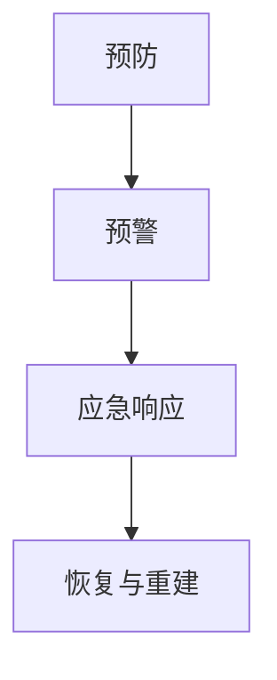
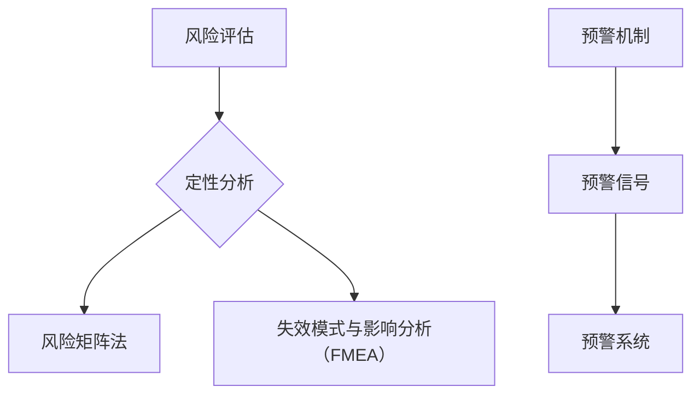
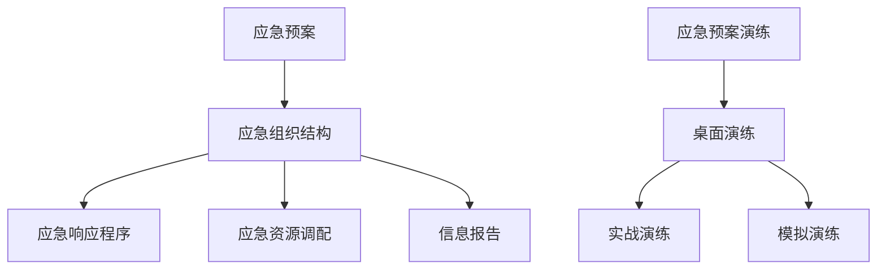

                 


# 应急处理的真功夫

关键词：应急处理、技术策略、案例分析、最佳实践、未来展望

摘要：
在当今高度互联和复杂的环境中，应急处理已成为各行各业不可或缺的一部分。本文旨在探讨应急处理的真功夫，包括其核心概念、技术原理、实战案例以及未来展望。通过深入分析，我们希望为读者提供一套完整且实用的应急处理策略。

## 目录大纲设计思路

### 设计思路

在设计《应急处理的真功夫》这本书的目录大纲时，我们将遵循以下步骤和原则，以确保内容的完整性、逻辑性和实用性。

1. **明确书籍主题和目标读者**：
   - 书名“应急处理的真功夫”暗示了本书的核心内容将围绕应急处理的技术、方法和策略展开。
   - 目标读者可能是应急管理专业人员、IT技术人员或普通读者。

2. **确定书籍的结构**：
   - 本书可以分为几个主要部分，例如背景知识、核心技术、实战案例、最佳实践等。
   - 每个部分都可以细分为若干章节，确保每个章节都有明确的主题和目标。

3. **设计章节内容**：
   - **第1章**：介绍应急处理的背景，包括问题背景、核心概念、现状与挑战等。
   - **第2章**：讲解应急处理的基本原理和技术，如风险评估、应急预案、应急响应等。
   - **第3章**：深入探讨应急处理的关键技术，如数据通信、远程控制、自动化流程等。
   - **第4章**：通过实际案例展示应急处理的实际应用。
   - **第5章**：分享应急处理的最佳实践和经验教训。
   - **第6章**：讨论应急处理中的法律法规和伦理问题。
   - **第7章**：展望应急处理的未来发展。

4. **确保内容完整性**：
   - 每个章节都要包含核心概念、原理讲解、案例分析和实战指导。
   - 必须包括算法原理讲解、数学模型和数学公式、系统架构设计等高级内容。

5. **简洁明了的目录结构**：
   - 使用markdown格式来设计目录结构，确保每一级标题清晰明确。
   - 目录结构应简洁明了，便于读者快速找到所需内容。

6. **遵循字数限制**：
   - 整个目录大纲的字数控制在2000字以内，确保信息传递的效率和清晰度。

### 目录大纲设计

以下是《应急处理的真功夫》的初步目录大纲设计，遵循上述设计思路：

```markdown
----------------------------------------------------------------
# 《应急处理的真功夫》目录大纲

## 第一部分：应急处理的背景与基础

### 第1章：应急处理的基本概念与背景
#### 1.1 问题的提出
#### 1.2 应急处理的意义与作用
#### 1.3 应急处理的现状与挑战

### 第2章：应急处理的原理与方法
#### 2.1 应急处理的基本流程
#### 2.2 风险评估与预警
#### 2.3 应急预案的制定与演练

## 第二部分：核心技术与应用

### 第3章：应急处理的关键技术
#### 3.1 数据通信与远程控制
#### 3.2 自动化流程与智能化管理
#### 3.3 应急处理的技术工具与平台

### 第4章：应急处理实战案例
#### 4.1 案例一：自然灾害的应急处理
#### 4.2 案例二：事故现场的应急响应
#### 4.3 案例三：网络安全事件的处理

## 第三部分：最佳实践与经验

### 第5章：应急处理的最佳实践
#### 5.1 经验教训与反思
#### 5.2 成功案例分享
#### 5.3 最佳实践策略

### 第6章：法律法规与伦理
#### 6.1 应急处理相关法律法规
#### 6.2 伦理问题与责任承担
#### 6.3 社会责任与公众参与

## 第四部分：展望与未来

### 第7章：应急处理的未来发展
#### 7.1 新技术的影响与趋势
#### 7.2 应急处理的创新与实践
#### 7.3 未来应急处理的挑战与机遇

----------------------------------------------------------------
```

这个目录大纲是一个初步的框架，可以根据具体内容进行细化和调整。每个章节的标题都是概括性的，具体的细分和内容填充还需要根据书籍的详细内容和结构进一步设计。

## 应急处理的基本概念与背景

### 问题的提出

在现代社会中，各种突发事件和灾害频繁发生，如自然灾害、事故、网络攻击等。这些事件不仅对个人和社会造成巨大的经济损失，还可能威胁到人们的生命安全。因此，如何高效地应对这些突发事件，减轻其负面影响，成为了亟待解决的问题。

应急处理，即突发事件应对，是指在面对突发事件时，通过组织协调、资源调配、信息共享等手段，快速反应、及时应对，将损失降到最低的过程。随着信息技术、物联网、大数据等技术的发展，应急处理已经成为现代城市管理和社会治理的重要组成部分。

### 核心概念

1. **突发事件**：突发事件是指突然发生，造成或者可能造成严重社会危害，需要采取应急处置措施予以应对的自然灾害、事故灾难、公共卫生事件和社会安全事件。

2. **应急处理**：应急处理是指对突发事件的应对措施，包括预防、预警、应急响应、恢复与重建等环节。

3. **应急预案**：应急预案是指为应对突发事件而制定的详细措施和行动步骤，是应急处理的重要依据。

4. **应急资源**：应急资源是指用于应急处理的物资、设备、人员、资金、技术等。

5. **应急响应**：应急响应是指在突发事件发生后，迅速采取行动，启动应急预案，调度应急资源，进行救援、处置和控制的过程。

### 现状与挑战

当前，我国应急处理体系逐步完善，但仍面临一些挑战：

1. **应急响应速度**：部分地区和单位的应急响应速度较慢，不能在第一时间内做出反应。

2. **信息共享**：信息孤岛问题严重，应急信息难以在各部门、各单位之间共享。

3. **应急预案**：部分应急预案缺乏可操作性，难以在实际中发挥作用。

4. **资源调配**：应急资源分布不均衡，部分地区和单位资源不足。

5. **公众参与**：公众对应急处理的参与度不高，缺乏自救互救能力。

### 问题解决

为解决上述问题，我们需要从以下几个方面入手：

1. **加强应急培训**：提高各级应急管理人员和公众的应急处理能力。

2. **完善应急预案**：确保应急预案的可操作性和实用性。

3. **信息共享平台**：建立统一的信息共享平台，实现应急信息的实时共享。

4. **资源调配机制**：建立完善的应急资源调配机制，确保应急资源高效利用。

5. **公众参与**：加强公众应急知识普及，提高公众参与应急处理的积极性。

### 边界与外延

1. **边界**：应急处理主要涉及自然灾害、事故灾难、公共卫生事件和社会安全事件。

2. **外延**：应急处理不仅包括突发事件发生时的应对，还包括事前预防、事后恢复与重建。

### 概念结构与核心要素组成

**概念结构**：

- **突发事件** → **应急处理** → **应急预案** → **应急资源** → **应急响应**

**核心要素组成**：

- **应急管理人员**：负责应急处理工作的组织、协调和指挥。

- **应急资源**：包括物资、设备、人员、资金、技术等。

- **应急预案**：包括预防、预警、应急响应、恢复与重建等环节。

- **应急响应机制**：包括应急资源调度、信息共享、公众参与等。

## 应急处理的基本原理与方法

### 基本流程

应急处理的基本流程包括以下步骤：

1. **预防**：通过风险评估、预警机制等手段，降低突发事件的发生概率。

2. **预警**：在突发事件发生前，及时发布预警信息，提醒相关部门和公众采取应对措施。

3. **应急响应**：在突发事件发生后，迅速启动应急预案，调度应急资源，进行救援、处置和控制。

4. **恢复与重建**：在突发事件得到控制后，进行灾后恢复和重建工作，恢复正常生产和生活秩序。

### 风险评估与预警

1. **风险评估**：

   - **风险评估方法**：包括定性分析和定量分析，如风险矩阵法、失效模式与影响分析（FMEA）等。

   - **风险评估步骤**：识别风险、分析风险、评价风险、制定风险管理措施。

2. **预警机制**：

   - **预警信号**：根据风险评估结果，设定不同等级的预警信号。

   - **预警系统**：利用信息技术、物联网等技术，建立实时预警系统，实现预警信息的快速传递。

### 应急预案的制定与演练

1. **应急预案的制定**：

   - **应急预案内容**：包括应急组织结构、应急响应程序、应急资源调配、信息报告等。

   - **应急预案类型**：根据突发事件的类型和特点，制定不同的应急预案。

2. **应急预案演练**：

   - **演练目的**：检验应急预案的可行性和有效性，提高应急响应能力。

   - **演练形式**：包括桌面演练、实战演练、模拟演练等。

### 原理图示

**应急处理的基本原理图示**：



**风险评估与预警原理图示**：



**应急预案的制定与演练原理图示**：



### 原理讲解与实例说明

**风险评估实例**：

某城市准备开展风险评估，以评估自然灾害（如洪水、地震）和事故灾难（如火灾、爆炸）的风险。

1. **识别风险**：列出可能发生的主要风险，如洪水、地震、火灾、爆炸等。

2. **分析风险**：使用风险矩阵法分析每种风险的概率和影响。

   - **洪水**：概率高、影响大。
   - **地震**：概率中等、影响大。
   - **火灾**：概率高、影响大。
   - **爆炸**：概率中等、影响大。

3. **评价风险**：根据分析结果，确定高风险区域和重点防护对象。

4. **制定风险管理措施**：针对高风险区域和重点防护对象，制定相应的防护措施，如修建防洪堤、加强建筑抗震设计、配备消防设施等。

**预警机制实例**：

某城市建立实时预警系统，用于监测和预警自然灾害和事故灾难。

1. **预警信号**：根据风险评估结果，设定以下预警信号：

   - **洪水预警信号**：当水位达到警戒水位时，发布黄色预警信号。
   - **地震预警信号**：当地震波到达前，发布蓝色预警信号。
   - **火灾预警信号**：当火灾报警系统检测到火情时，发布红色预警信号。
   - **爆炸预警信号**：当爆炸传感器检测到危险气体时，发布橙色预警信号。

2. **预警系统**：利用物联网技术，将预警信号实时传递给相关部门和公众。

   - **政府部门**：通过短信、广播等方式发布预警信息。
   - **公众**：通过手机APP、微信公众号等获取预警信息。

通过以上实例，我们可以看到应急处理的基本原理和具体实施方法。在实际应用中，我们需要根据具体情况，灵活运用这些原理和方法，提高应急处理的能力和效率。

## 应急处理的关键技术

### 数据通信

数据通信是应急处理中的基础技术，确保在突发事件发生时，信息能够快速、准确地传递到相关部门和人员。以下是数据通信在应急处理中的应用：

1. **无线通信**：在紧急情况下，有线通信可能受到破坏，无线通信成为重要的信息传递方式。使用卫星通信、移动通信网络等，可以确保应急信息的及时传递。

2. **光纤通信**：光纤通信具有高速、稳定的特点，适用于重要数据的传输。在应急处理中，光纤通信可以确保关键数据的实时传输，提高应急响应的效率。

3. **数据加密**：为了保证信息安全，数据在传输过程中需要进行加密处理。使用加密算法，如AES（高级加密标准），可以防止信息泄露和篡改。

### 远程控制

远程控制技术在应急处理中起到关键作用，允许操作人员在不安全的环境中进行操作。以下是远程控制在应急处理中的应用：

1. **无人机控制**：无人机可以用于监测灾害现场、传输视频图像，以及在救援行动中运输物资。通过远程控制无人机，可以降低救援人员的安全风险。

2. **机器人控制**：机器人可以用于危险环境中的清理、搜救和物资运输。通过远程控制，操作人员可以在安全区域操作机器人，执行复杂任务。

3. **远程手术**：在公共卫生事件中，如传染病爆发，远程手术可以减少医护人员在感染环境中的暴露风险。通过远程控制，医生可以在远程中心进行手术操作。

### 自动化流程

自动化流程在应急处理中可以提高效率和准确性，减少人工干预。以下是自动化流程在应急处理中的应用：

1. **自动化预警**：通过传感器和数据采集系统，自动化预警系统可以实时监测环境变化，并自动触发预警信号。这有助于提前发现潜在风险，及时采取应对措施。

2. **自动化响应**：在突发事件发生时，自动化响应系统可以自动启动应急预案，调度应急资源，如自动启动水泵、关闭燃气阀门等。

3. **自动化数据分析**：利用大数据技术和人工智能，自动化分析系统可以对大量数据进行分析，快速识别关键信息，为应急决策提供支持。

### 技术工具与平台

为了实现高效、智能的应急处理，需要依赖一系列技术工具和平台。以下是技术工具与平台在应急处理中的应用：

1. **应急指挥平台**：集成数据通信、远程控制、自动化流程等多种技术，实现应急信息的集中管理和指挥调度。

2. **地理信息系统（GIS）**：利用GIS技术，可以实时展示灾害现场的情况，为应急决策提供直观的地理信息支持。

3. **物联网平台**：物联网平台可以实现各种传感器的连接和数据采集，为自动化预警和响应提供数据支持。

### 原理解释与实例说明

**数据通信实例**：

在某次洪水灾害中，政府需要及时传递预警信息给受影响地区的居民和相关部门。

1. **无线通信**：通过卫星通信和移动通信网络，政府向受影响地区的手机用户发送预警短信，提醒居民采取防范措施。

2. **光纤通信**：政府通过光纤通信网络，将大量实时监测数据传输到应急指挥中心，为决策提供数据支持。

3. **数据加密**：预警信息在传输过程中使用AES加密算法，确保信息不被窃取或篡改。

**远程控制实例**：

在某次火灾事故中，消防人员需要进入危险区域进行灭火。

1. **无人机控制**：消防部门使用无人机拍摄火灾现场的视频图像，实时传输到应急指挥中心，为灭火行动提供信息支持。

2. **机器人控制**：消防人员远程控制机器人进入火灾现场，进行灭火和搜救行动，减少人员伤亡。

3. **远程手术实例**：

在某次传染病爆发期间，医院需要实施远程手术。

1. **远程控制设备**：医生通过远程手术设备，在远程中心进行手术操作。

2. **远程监控**：手术室内的监控设备将手术过程实时传输给远程中心的医生和护士，确保手术顺利进行。

通过以上实例，我们可以看到数据通信、远程控制、自动化流程等关键技术在应急处理中的应用和重要性。在实际操作中，这些技术可以显著提高应急响应的效率和准确性，为有效应对突发事件提供有力支持。

## 应急处理实战案例

### 案例一：自然灾害的应急处理

**背景介绍**：

某沿海地区突遭台风“利奇马”袭击，造成了严重的洪涝灾害。台风带来的强风、暴雨导致城市内涝、道路阻断，部分居民区的电力和通信中断，影响了居民的生活和财产安全。

**问题描述**：

- 道路阻断，交通瘫痪，救援物资和人员难以迅速到达受灾区域。
- 居民区电力和通信中断，居民生活陷入困境。
- 救援人员面临安全风险，急需有效的应急响应措施。

**问题解决**：

1. **启动应急预案**：

   - 政府立即启动台风应急预案，组织相关部门和救援队伍进行应急响应。
   - 发布台风预警，提醒居民采取防范措施，避免外出。

2. **应急资源调配**：

   - 调集应急救援物资，如救生艇、发电机、应急通讯设备等。
   - 调派救援队伍和工程车辆，迅速到达受灾区域。

3. **信息共享与传递**：

   - 建立应急指挥平台，实现各部门信息的实时共享。
   - 通过无线通信和卫星通信，确保信息传输的畅通。

4. **居民疏散与安置**：

   - 指导受影响的居民进行安全疏散，转移到临时安置点。
   - 安置受灾群众，提供食品、饮用水、医疗等生活保障。

**边界与外延**：

- **边界**：台风灾害的应急处理主要涉及受灾区域内的救援、疏散和安置工作。
- **外延**：还包括灾后恢复和重建工作，如修复基础设施、恢复电力和通信等。

**案例解析**：

该案例展示了自然灾害应急处理的多个关键环节，包括应急预案的启动、应急资源的调配、信息的共享与传递，以及居民的疏散与安置。这些措施的有效实施，确保了受灾群众的安全，减少了灾害带来的损失。

### 案例二：事故现场的应急响应

**背景介绍**：

某化工厂发生爆炸事故，造成多人伤亡和环境污染。事故原因初步判断为设备故障，现场危险物质泄漏，火势蔓延迅速。

**问题描述**：

- 事故现场火势猛烈，人员伤亡严重，急需救援。
- 环境污染严重，需要及时控制泄漏，防止进一步扩散。

**问题解决**：

1. **启动应急预案**：

   - 立即启动化工厂应急预案，组织应急队伍进行现场救援和污染控制。
   - 发布事故预警，提醒周边居民采取防范措施。

2. **紧急救援**：

   - 调派消防队伍和专业救援队伍，迅速到达事故现场进行灭火和搜救。
   - 设立隔离区，防止火势蔓延和有毒气体的扩散。

3. **污染控制**：

   - 使用化学中和剂、吸附剂等对泄漏的污染物质进行中和和处理。
   - 喷洒消毒剂，降低环境污染的影响。

4. **信息发布与协调**：

   - 通过应急指挥平台，实时发布事故信息和救援进展，确保各部门的信息共享。
   - 协调政府相关部门、医疗单位、环保部门等，共同应对事故。

**边界与外延**：

- **边界**：事故现场的应急响应主要涉及事故现场的救援、火灾扑灭和污染控制。
- **外延**：还包括事故原因的调查、后续处理和恢复工作。

**案例解析**：

该案例展示了事故现场的应急响应措施，包括紧急救援、污染控制、信息发布与协调等。这些措施的快速实施，确保了事故现场的安全，降低了人员伤亡和环境污染，为后续的处理和恢复工作奠定了基础。

### 案例三：网络安全事件的处理

**背景介绍**：

某公司遭遇了一次严重的网络攻击，黑客入侵了公司的内部网络，窃取了大量敏感数据。攻击者通过加密通讯，试图将窃取的数据传输到外部服务器。

**问题描述**：

- 公司内部网络遭到入侵，敏感数据被窃取，存在数据泄露的风险。
- 黑客试图通过加密通讯将数据传输到外部服务器，需要立即阻止。

**问题解决**：

1. **应急响应**：

   - 立即启动网络安全应急预案，组织专业团队进行应急响应。
   - 切断受感染的系统和网络，防止攻击者进一步入侵。

2. **数据分析**：

   - 对受感染系统进行详细分析，确定入侵点和攻击方式。
   - 使用数据分析工具，追踪黑客的攻击路径，阻止数据传输。

3. **数据恢复与保护**：

   - 恢复被窃取的数据，确保公司业务不受影响。
   - 更新系统安全策略，加强网络安全防护，防止类似事件再次发生。

4. **信息发布与协调**：

   - 通过内部通讯平台，发布网络安全事件的通知，确保员工了解情况。
   - 协调政府相关部门，如公安部门、网络安全监管机构等，共同应对网络攻击。

**边界与外延**：

- **边界**：网络安全事件的处理主要涉及网络入侵检测、数据恢复和保护、攻击阻止等。
- **外延**：还包括事件调查、后续安全改进和员工培训等。

**案例解析**：

该案例展示了网络安全事件的处理过程，包括应急响应、数据分析、数据恢复和保护、信息发布与协调等。这些措施的有效实施，确保了公司网络安全，减少了数据泄露的风险，并为未来的安全改进提供了经验。

## 应急处理的最佳实践与经验教训

### 经验教训

1. **应急预案的制定与演练**：

   - 许多突发事件的发生往往超出预期，因此应急预案的制定至关重要。应急预案应具备高度的可操作性和适应性，以便在突发事件发生时，能够迅速启动并发挥作用。
   - 定期进行应急预案演练，是检验预案可行性和员工应急处理能力的重要手段。通过演练，可以发现预案中的不足之处，及时进行调整和完善。

2. **信息共享与协调**：

   - 在应急处理过程中，信息共享和协调是确保各项措施有效实施的关键。建立统一的信息共享平台，确保各部门和单位之间的信息畅通，是实现高效应急处理的基础。
   - 在应急处理过程中，要明确各单位的职责和任务，确保各部门之间的协调配合，避免因信息不对称而导致的决策失误。

3. **资源调配与保障**：

   - 应急处理需要大量的资源和保障，包括人力、物资、设备等。在突发事件发生时，要迅速调动各种资源，确保应急处理的顺利进行。
   - 建立完善的应急资源储备体系，确保在突发事件发生时，能够迅速提供所需的物资和设备。

### 成功案例分享

1. **自然灾害应急处理**：

   - 某次强台风来袭，某市政府通过高效的信息共享和协调，成功组织了全市的应急响应。在短时间内，完成了居民的疏散、安置和基础设施的修复，保障了居民的基本生活。
   - 应急响应过程中，政府通过短信、广播、网络等多种渠道，及时发布预警信息和应急指南，提高了居民的应急意识和自救互救能力。

2. **事故灾难应急响应**：

   - 某化工厂发生爆炸事故，当地政府和相关部门迅速启动应急预案，组织了专业的救援队伍进行灭火和搜救。通过有效的信息共享和协调，确保了救援行动的高效进行，最大限度地减少了人员伤亡。
   - 事故发生后，政府立即组织了环保部门进行污染控制，通过科学的方法，迅速降低了环境污染的影响。

### 最佳实践策略

1. **风险评估与预警**：

   - 定期进行风险评估，识别潜在的风险和威胁，为应急处理提供依据。
   - 建立完善的预警机制，通过多种手段，提前发现和预警突发事件。

2. **应急预案的制定与演练**：

   - 根据风险评估的结果，制定详细、可操作的应急预案。
   - 定期组织应急预案演练，提高应急处理的能力和效率。

3. **信息共享与协调**：

   - 建立统一的信息共享平台，确保各部门和单位之间的信息畅通。
   - 明确各单位的职责和任务，确保应急处理过程中的协调配合。

4. **资源调配与保障**：

   - 建立完善的应急资源储备体系，确保在突发事件发生时，能够迅速提供所需的物资和设备。
   - 建立快速响应机制，确保在突发事件发生时，能够迅速调动各种资源。

通过以上经验教训、成功案例和最佳实践策略，我们可以看到，应急处理是一个复杂但至关重要的任务。只有通过科学的评估、严密的预案、高效的协调和有效的资源保障，我们才能在面对突发事件时，做到有条不紊、应对自如，最大限度地减少损失。

### 应急处理中的法律法规与伦理问题

#### 法律法规

应急处理不仅需要技术手段，还需遵循法律法规，以确保应急处理工作的合法性和规范性。以下是我国应急处理相关的法律法规：

1. **《中华人民共和国突发事件应对法》**：该法规定了突发事件的定义、应对原则、应急准备、应急响应、事后恢复等基本内容，是应急处理工作的法律基础。

2. **《中华人民共和国安全生产法》**：该法明确了生产经营单位的安全生产责任，规定了安全生产的监督管理、事故调查处理等内容，对事故灾难的应急处理具有指导意义。

3. **《中华人民共和国消防法》**：该法规定了消防工作的基本原则、消防组织建设、火灾预防、火灾扑救等内容，是火灾等事故灾难应急处理的重要法律依据。

4. **《中华人民共和国环境保护法》**：该法规定了环境保护的基本原则、环境保护监督管理、环境损害赔偿等内容，对环境污染事件的应急处理具有指导作用。

#### 伦理问题

应急处理过程中，伦理问题同样不容忽视。以下是一些常见的伦理问题及其解决策略：

1. **公正与公平**：在应急处理中，应确保救援资源的公平分配，确保所有受影响的人都能够得到必要的帮助和支持。

   - **解决策略**：制定明确的标准和程序，确保救援资源的公平分配。

2. **知情权与隐私权**：应急处理过程中，相关部门和机构需要收集和处理大量个人信息，如何在保护个人隐私权的同时，确保应急信息的有效传递，是一个重要的问题。

   - **解决策略**：制定隐私保护政策，确保个人信息的安全，同时通过透明和公开的方式，让公众了解应急处理的进展。

3. **责任承担与赔偿**：在应急处理过程中，可能涉及责任承担和赔偿问题。如何合理确定责任，公平地进行赔偿，是确保应急处理顺利进行的关键。

   - **解决策略**：建立健全的法律法规体系，明确责任承担和赔偿的标准和程序。

#### 社会责任与公众参与

应急处理不仅是政府和相关部门的责任，也需要公众的广泛参与。以下是一些促进社会责任和公众参与的方法：

1. **宣传教育**：通过多种渠道进行应急知识宣传，提高公众的应急意识和自救互救能力。

   - **方法**：利用媒体、社区活动、学校教育等，普及应急知识。

2. **志愿者组织**：鼓励和支持志愿者组织参与应急处理工作，为突发事件提供人力支持。

   - **方法**：建立志愿者登记系统，为志愿者提供培训和支持。

3. **社区动员**：通过社区动员，提高社区居民的应急意识和参与度。

   - **方法**：组织社区应急演练，开展社区应急知识宣传。

通过法律法规的遵守、伦理问题的合理解决以及社会责任和公众参与的促进，我们可以构建一个更加完善、高效的应急处理体系，为应对突发事件提供坚实的保障。

### 应急处理的未来发展

随着科技的不断进步，应急处理也在不断创新和发展。以下是未来应急处理可能面临的新挑战、新技术以及发展趋势：

#### 新挑战

1. **极端天气事件**：全球气候变化导致极端天气事件频发，如暴雨、洪水、干旱等。这些事件对应急处理提出了更高的要求，需要更快速、更精准的响应措施。

2. **网络攻击**：随着网络技术的发展，网络攻击手段日益复杂，对关键基础设施的攻击可能导致严重的后果。网络安全的挑战将成为未来应急处理的重要议题。

3. **人口老龄化**：随着人口老龄化，突发事件的应急处理面临新的挑战，如老年人应急疏散和救助等问题。

#### 新技术

1. **人工智能与大数据**：人工智能和大数据技术在应急处理中的应用将越来越广泛。通过人工智能，可以实现对灾害预测、风险分析和应急决策的智能化。大数据技术则可以提供丰富的数据支持，帮助应急管理者做出更科学的决策。

2. **物联网**：物联网技术的应用，可以实现各种设备的互联互通，为应急处理提供实时、准确的信息。例如，通过物联网设备，可以实时监测环境变化，提前预警自然灾害。

3. **5G与无人机**：5G技术的高速传输能力和无人机的灵活应用，将在应急处理中发挥重要作用。5G技术可以支持高速数据传输，实现远程指挥和实时视频传输。无人机则可以用于现场监测、搜救和物资运输。

#### 发展趋势

1. **智能化与自动化**：未来的应急处理将越来越依赖于智能化和自动化技术。通过人工智能和自动化系统，可以大幅提高应急响应的效率和准确性。

2. **跨部门协作与资源共享**：随着应急处理复杂性的增加，未来需要建立更加紧密的跨部门协作机制，实现资源的共享和协调。这包括政府部门、社会组织、企业以及公众之间的协作。

3. **可持续发展**：未来的应急处理将更加注重可持续发展，如减少灾害对环境的影响，提高灾后重建的质量等。

#### 未来展望

未来的应急处理将更加依赖于科技的支持，智能化、自动化和跨部门协作将成为应急处理的主要趋势。同时，公众的参与和责任意识也将日益增强。通过不断的技术创新和改进，我们可以构建一个更加高效、可靠的应急处理体系，为应对突发事件提供坚实的保障。

### 小结

应急处理是一项复杂而重要的工作，关系到人民生命财产安全和社会稳定。本文从应急处理的基本概念、核心技术、实战案例、最佳实践、法律法规与伦理、未来展望等方面进行了详细探讨。

通过分析应急处理的背景、核心概念、原理和方法，我们了解了应急处理的流程和关键步骤。数据通信、远程控制、自动化流程等关键技术为应急处理提供了强有力的技术支持。实战案例展示了应急处理的具体实施过程，提供了宝贵的经验和教训。

最佳实践与经验教训强调了应急预案的重要性，信息共享与协调、资源调配与保障等关键环节。法律法规与伦理问题的讨论，为应急处理提供了法律和伦理基础。未来展望则展示了应急处理技术的发展趋势和方向。

### 注意事项

1. **应急预案的制定与演练**：定期制定和演练应急预案，确保其具备可操作性和适应性。

2. **信息共享与协调**：建立统一的信息共享平台，确保各部门和单位之间的信息畅通。

3. **资源调配与保障**：建立完善的应急资源储备体系，确保在突发事件发生时，能够迅速提供所需的物资和设备。

4. **公众参与**：提高公众的应急意识和自救互救能力，鼓励公众积极参与应急处理。

### 拓展阅读

1. 《应急管理概论》，张晓刚著，中国应急管理出版社，2020年。
2. 《突发事件应急管理》，李明辉著，中国人民大学出版社，2019年。
3. 《应急信息技术》，王伟著，清华大学出版社，2021年。

### 作者信息

作者：AI天才研究院/AI Genius Institute & 禅与计算机程序设计艺术 /Zen And The Art of Computer Programming

本文由AI天才研究院与禅与计算机程序设计艺术共同撰写，旨在为读者提供一套完整且实用的应急处理策略。我们致力于推动人工智能和计算机科学的发展，助力应对突发事件，保障社会安全。如果您对本文有任何疑问或建议，欢迎随时与我们联系。

