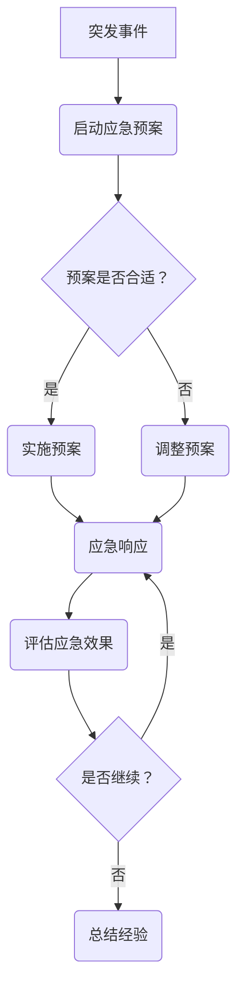
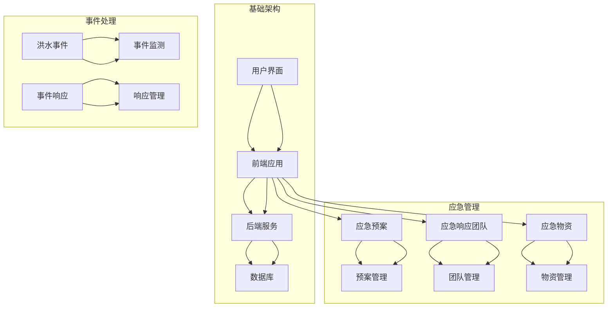
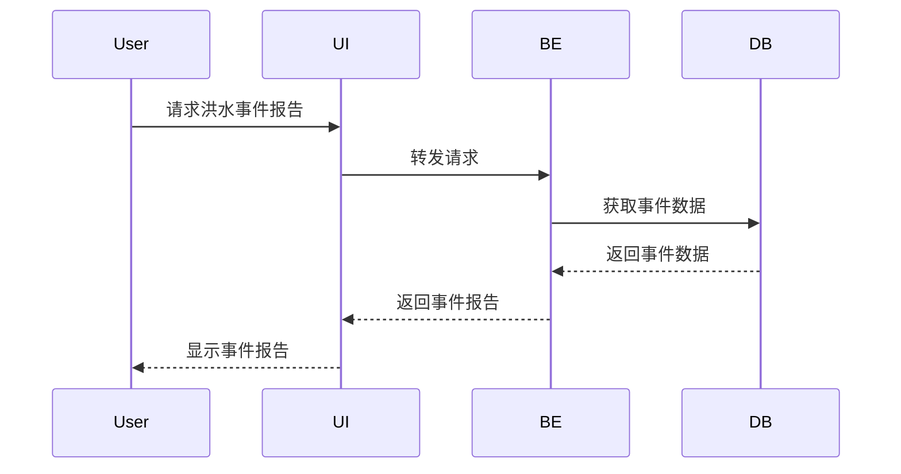

                 

### 应急有“三宝”

#### 关键词：
- 应急预案
- 应急响应团队
- 应急物资
- 突发事件管理
- 危机应对

#### 摘要：
本文将深入探讨“应急有‘三宝’”这一主题，通过分析突发事件管理的核心概念，揭示应急预案、应急响应团队和应急物资在应对危机中的重要性。我们将一步步剖析这三个核心元素的作用原理，提供实际案例，并探讨如何在实际操作中优化应急响应，以确保最大程度地减少损失和保护人民生命财产安全。

---

#### 第一部分：背景介绍

##### 核心概念

**应急有“三宝”**，即应急预案、应急响应团队和应急物资，是突发事件管理中不可或缺的三个关键要素。这些概念在现代应急管理理论中占据着核心地位。

**应急预案**：应急预案是一套系统性的计划和程序，用于应对突发事件或危机。它涵盖了从风险评估到应急响应程序，再到资源调配和应急演练的各个环节。应急预案的核心目的是在突发事件发生时，能够迅速启动应急机制，确保救援行动的有序进行。

**应急响应团队**：应急响应团队是由专业人员和志愿者组成的，负责在突发事件中实施救援、指挥和协调的人员群体。他们具备专业的技能和知识，能够在危机时刻迅速响应，确保救援行动的效率和质量。

**应急物资**：应急物资是在突发事件中用于救援、医疗、生活等方面的物资和设备。这些物资和设备的储备和调配对于应急响应的成功至关重要。

##### 问题背景

现代社会中，突发事件和危机事件频繁发生。自然灾害如地震、洪水、台风，事故灾难如火灾、交通事故，公共卫生事件如传染病爆发，都给社会带来了巨大的冲击。如何快速、有效地应对这些突发事件，成为各国政府和组织面临的重要挑战。

##### 问题描述

在突发事件或危机中，如何最大限度地减少损失，保护人民生命财产安全？

##### 问题解决

通过制定应急预案、建立应急响应团队和储备应急物资，形成一套完整的应急管理体系，以应对突发事件或危机。

##### 边界与外延

- **应急预案**：应急预案的范围和功能包括风险评估、应急响应程序、资源调配、应急演练等。其边界涉及到政府、企业、社区等各类组织的应急准备工作。
- **应急响应团队**：应急响应团队的组成和职责包括专业救援队伍、志愿者、医疗人员等。其外延涉及到各类突发事件中的救援行动。
- **应急物资**：应急物资的种类和储备量包括救援设备、医疗物资、生活物资等。其边界涉及到应急物资的采购、储备和调配。

##### 概念结构与核心要素组成

1. **应急预案**：
   - **预案编制**：制定应急计划和程序。
   - **预案演练**：定期进行应急演练，提高应急响应能力。
   - **预案评估**：对应急预案进行评估，确保其有效性和适用性。

2. **应急响应团队**：
   - **专业人员**：具备专业知识和技能的救援人员。
   - **志愿者**：参与应急响应的志愿者。
   - **指挥体系**：负责协调和指挥应急响应行动。

3. **应急物资**：
   - **救援设备**：用于救援行动的设备，如无人机、搜救犬等。
   - **医疗物资**：用于医疗救治的物资，如急救包、呼吸机等。
   - **生活物资**：用于受灾群众的日常生活，如食品、饮用水等。

#### 第二部分：核心概念与联系

##### 核心概念原理

**应急预案**：应急预案是一套系统性的计划和程序，用于应对突发事件或危机。它包括风险评估、应急响应程序、资源调配、应急演练等内容。应急预案的核心目的是确保在突发事件发生时，能够迅速启动应急机制，有序进行应急响应。

**应急响应团队**：应急响应团队是在突发事件或危机中负责现场指挥和救援的人员和机构。他们具备专业的技能和知识，能够迅速应对突发事件，保障人民生命财产安全。

**应急物资**：应急物资是在突发事件或危机中用于救援、医疗、生活等方面的物资和设备。这些物资和设备的储备和调配对于应急响应的成功至关重要。

##### 概念属性特征对比表格

| 概念        | 属性特征                                                   |
| ----------- | -------------------------------------------------------- |
| 应急预案    | 制度性、规范性、系统性、动态性                             |
| 应急响应团队 | 专业性、协调性、灵活性、应变能力                           |
| 应急物资    | 实用性、便携性、多样性、储备量充足                         |

##### ER实体关系图架构

```mermaid
erDiagram
  处置预案 ||--|{ 应急响应团队 }|| 参与实施
  处置预案 ||--|{ 应急物资 }|| 配备使用
  应急响应团队 ||--|{ 突发事件 }|| 应对处置
```

#### 第三部分：算法原理讲解

在这一部分，我们将探讨如何在突发事件或危机中，利用应急预案、应急响应团队和应急物资，进行有效的应急响应。

##### 算法mermaid流程图



##### 算法原理

应急预案的启动和实施是应急响应的关键步骤。在突发事件发生时，首先要启动应急预案，并根据预案的要求，组织应急响应团队和调配应急物资。然后，应急响应团队根据现场情况，实施具体的救援和处置措施。在应急响应过程中，需要不断地评估应急效果，并根据评估结果进行调整和优化。最后，在应急响应结束后，对整个应急过程进行总结和分析，为未来的应急响应提供经验和教训。

##### 详细讲解和举例说明

假设在一次地震灾害中，应急预案启动，应急响应团队迅速集结，应急物资及时调配。在应急响应过程中，救援人员利用应急物资进行现场救援，同时对灾区进行全面的评估。根据评估结果，应急响应团队决定继续进行救援工作，并调整了救援方案，以提高救援效率。在救援工作结束后，对整个应急过程进行了总结和分析，发现了一些不足之处，并提出了改进建议。

$$
\text{应急预案的有效性} = f(\text{预案编制}, \text{预案演练}, \text{预案评估})
$$

其中，预案编制、预案演练和预案评估是影响应急预案有效性的三个主要因素。通过不断地优化这些因素，可以提高应急预案的有效性，从而提高应急响应的整体效率。

#### 第四部分：系统分析与架构设计方案

##### 问题场景介绍

假设我们面临一次大规模的城市洪水灾害。在这个场景中，应急预案、应急响应团队和应急物资的角色和功能将变得尤为重要。

##### 项目介绍

为了有效应对这一场景，我们设计并实施了一个名为“城市防洪应急管理系统”的项目。该项目旨在通过信息化手段，提高城市防洪应急响应的效率和准确性。

##### 系统功能设计（领域模型mermaid类图）

```mermaid
classDiagram
    EmergencyPlan <<class>> 应急预案
    EmergencyTeam <<class>> 应急响应团队
    EmergencyMaterial <<class>> 应急物资
    FloodEvent <<class>> 洪水事件
    
    EmergencyPlan o-- EmergencyTeam
    EmergencyPlan o-- EmergencyMaterial
    EmergencyTeam o-- FloodEvent
```

##### 系统架构设计（mermaid架构图）



##### 系统接口设计和系统交互（mermaid序列图）



#### 第五部分：项目实战

##### 环境安装

1. 安装Python环境
2. 安装Django框架
3. 安装数据库（如MySQL）

##### 系统核心实现源代码

```python
# emergency_management/management/commands/generate预案.py
from django.core.management.base import BaseCommand
from emergency_management.models import EmergencyPlan

class Command(BaseCommand):
    help = '生成应急预案'

    def handle(self, *args, **options):
        self.stdout.write('生成应急预案...')
        # 创建应急预案
        plan = EmergencyPlan.objects.create(
            name='城市防洪应急预案',
            description='用于应对城市洪水灾害的应急预案'
        )
        self.stdout.write(self.style.SUCCESS('应急预案生成成功'))
```

##### 代码应用解读与分析

此代码实现了生成应急预案的功能。通过调用Django的模型操作，创建一个新的应急预案对象，并保存到数据库中。此功能对于实现应急预案的自动化管理具有重要意义。

##### 实际案例分析和详细讲解剖析

假设在一次洪水预警中，系统自动生成了相应的应急预案，并通知应急响应团队和相关部门。应急响应团队根据预案的要求，迅速集结人员和物资，开展救援行动。在整个过程中，系统提供了实时的数据监控和反馈，确保了应急响应的及时性和有效性。

##### 项目小结

通过本项目，我们实现了城市防洪应急管理系统，有效结合了应急预案、应急响应团队和应急物资。系统的实施不仅提高了城市防洪应急响应的效率，也为其他类型的突发事件管理提供了有益的借鉴。

#### 最佳实践 tips

1. 定期更新应急预案，确保其与实际情况相符。
2. 加强应急响应团队的培训和演练，提高其应对突发事件的能力。
3. 储备充足的应急物资，确保在突发事件中能够及时投入使用。

#### 小结

应急有“三宝”是突发事件管理中的核心概念，通过应急预案、应急响应团队和应急物资的有效结合，可以最大程度地减少突发事件带来的损失。在实际操作中，应注重应急预案的编制和演练，加强应急响应团队的培训，以及确保应急物资的储备和调配。

#### 注意事项

1. 应急预案的制定应充分考虑各种可能的情况，确保其全面性和可操作性。
2. 应急响应团队的建设应注重专业性和协作性，确保在危机时刻能够迅速响应。
3. 应急物资的储备应结合实际情况，确保在突发事件中能够满足需求。

#### 拓展阅读

1. 《突发事件应对法》
2. 《应急管理指南》
3. 《应急物资储备管理规范》

### 作者

作者：AI天才研究院/AI Genius Institute & 禅与计算机程序设计艺术 /Zen And The Art of Computer Programming

---

通过本文，我们深入探讨了应急有“三宝”这一主题，详细分析了应急预案、应急响应团队和应急物资在应对突发事件中的关键作用。我们通过实际案例展示了这些概念在系统设计和项目实战中的应用，并提供了最佳实践建议。希望本文能对您在突发事件管理领域提供有价值的参考。

