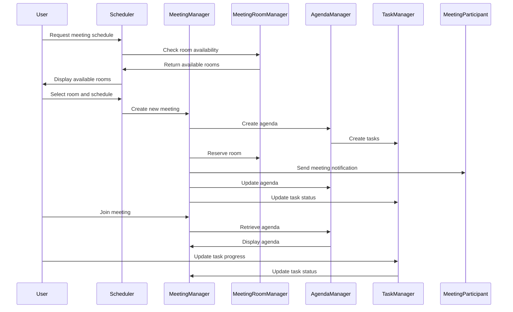
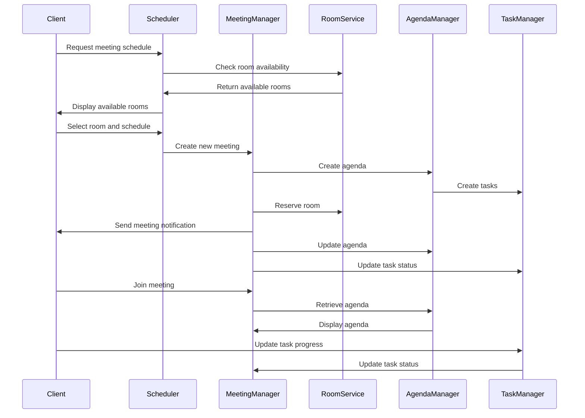

                 

## 开会也是手艺活

> 关键词：开会技巧、高效管理、团队协作、沟通艺术

摘要：本文旨在探讨开会的核心概念、准备工作、技巧与实践，通过详细的分析和案例，帮助读者理解并掌握开会的艺术，从而提高工作效率和团队协作能力。

### 第一部分：开会的核心概念与背景

#### 第1章：开会的意义与基本概念

#### 1.1 开会的本质

开会是一种集体沟通和协作的活动，旨在通过讨论、交流、决策来解决问题、推进项目或达成共识。它不仅是信息传递的渠道，更是团队协作、领导力和管理能力的体现。

#### 1.2 开会的类型与目标

开会的类型多样，包括日常会议、项目会议、决策会议等。每种类型的会议都有其特定的目标，如讨论问题、分享信息、做出决策等。

#### 1.3 开会的利与弊

开会有其积极的一面，如促进信息交流、提高团队凝聚力、加速决策过程等。但同时，如果会议组织不当，也可能浪费时间和资源，降低工作效率。

### 第2章：开会前的准备

#### 2.1 会议议程的制定

会议议程是会议的蓝图，它明确了会议的主题、议题、时间安排和参与人员。一个明确的议程有助于提高会议的效率。

#### 2.2 会议资源的准备

会议资源的准备包括会议室的预定、设备的检查和会议资料的准备。确保所有必要的资源到位，有助于会议的顺利进行。

#### 2.3 会议时间的合理安排

合理安排会议时间，避免与工作高峰时间冲突，有助于提高会议的参与度和效率。

### 第二部分：高效开会的技巧

#### 第3章：如何做好会议记录

#### 3.1 会议记录的重要性

会议记录是会议的记录和备忘录，它记录了会议的内容、决策和任务分配。一个准确的会议记录有助于会后跟进和执行。

#### 3.2 会议记录的要点与方法

会议记录的要点包括关键信息、决策和任务。记录方法可以采用笔记、录音或电子记录等。

#### 3.3 如何处理会议记录中的问题

会议记录中的问题如遗漏、错误等，需要及时纠正和补充，以确保记录的准确性和完整性。

### 第4章：有效主持会议的技巧

#### 4.1 主持人的角色与职责

主持人是会议的领导者，其角色包括引导会议、控制时间、确保讨论有序等。

#### 4.2 开场与引导

开场的目的是明确会议的目标和议程，引导讨论的方向。主持人的开场白应简洁明了，引起大家的兴趣和关注。

#### 4.3 控制会议节奏与氛围

主持人需要根据会议的进展和讨论的深度，灵活控制会议的节奏和氛围，确保会议的顺利进行。

### 第5章：参与会议的技巧

#### 5.1 如何积极参与会议

积极参与会议需要提前准备、主动发言和积极参与讨论。参与者应确保自己的意见和想法被听到。

#### 5.2 有效发言的技巧

有效发言需要做到简洁明了、言之有物、抓住重点。发言时应注意尊重他人、避免冗长和重复。

#### 5.3 如何应对会议中的挑战

会议中可能会遇到各种挑战，如意见分歧、时间紧迫等。参与者需要具备应对挑战的能力，以保持会议的顺利进行。

### 第三部分：开会的最佳实践

#### 第6章：团队协作中的开会技巧

#### 6.1 团队协作的重要性

团队协作是实现项目目标的关键。有效的会议有助于团队协作，提高工作效率。

#### 6.2 团队会议的难点与解决方案

团队会议的难点包括沟通不畅、任务分工不明确等。解决这些难点需要制定明确的议程、确保沟通畅通和任务分配合理。

#### 6.3 如何提升团队会议效率

提升团队会议效率的方法包括提前准备、明确目标、控制时间等。

#### 第7章：跨部门会议的挑战与应对

#### 7.1 跨部门会议的特点

跨部门会议涉及多个部门和团队，需要协调不同的意见和利益。

#### 7.2 跨部门沟通的难点

跨部门沟通的难点包括信息不对称、沟通障碍等。

#### 7.3 跨部门会议的最佳实践

跨部门会议的最佳实践包括明确目标、建立沟通机制、确保参与度等。

### 第四部分：案例分析

#### 第8章：经典开会案例分析

#### 8.1 成功的开会案例

成功案例可以提供有益的经验和启示，帮助读者理解如何组织一场高效会议。

#### 8.2 失败的开会案例

失败案例可以帮助读者了解会议中的常见问题，避免类似的错误。

#### 8.3 案例启示与总结

通过案例分析和总结，读者可以更好地理解开会的艺术，提高自己的开会技巧。

### 第五部分：总结与展望

#### 第9章：总结与反思

#### 9.1 开会技巧的总结

对开会技巧的总结可以帮助读者巩固所学内容，提高开会的效率。

#### 9.2 如何持续提升开会效率

持续提升开会效率需要不断地学习和实践，适应不断变化的工作环境。

#### 9.3 对未来开会的展望

未来开会的发展趋势包括技术的进步、沟通工具的创新等，这些都将对开会的方式和效率产生深远的影响。

#### 第10章：附录

#### 10.1 常用开会工具推荐

推荐一些常用的开会工具，如会议软件、协作平台等，以帮助读者提高开会的效率。

#### 10.2 开会技巧扩展阅读

提供一些扩展阅读资源，如书籍、文章等，以供读者进一步学习。

#### 10.3 开会相关的法律法规与道德规范

介绍一些与开会相关的法律法规和道德规范，以确保会议的合法性和道德性。

### 作者信息

作者：AI天才研究院/AI Genius Institute & 禅与计算机程序设计艺术 /Zen And The Art of Computer Programming

通过以上详细的章节内容，读者可以全面了解开会的核心概念、技巧和实践，掌握开会的艺术，从而提高工作效率和团队协作能力。希望这篇文章能够为您的职业生涯带来帮助。让我们开始深入思考吧！## 开会的核心概念与背景

### 第1章：开会的意义与基本概念

#### 1.1 开会的本质

开会，简而言之，就是一群人聚集在一起，为了共同的目标或问题进行讨论、交流和决策的过程。这种集体沟通和协作的活动，是现代组织中不可或缺的一部分。无论是日常的工作例会、项目启动会，还是决策层的战略讨论会，都会涉及到开会的环节。

开会的本质在于信息交流。通过会议，团队成员可以共享信息、讨论问题、提出解决方案，从而实现团队内部的共识和协同工作。同时，开会也是领导层展示决策能力、引导团队方向的重要手段。一个有效的会议，不仅能够解决当前的问题，还能够为未来的工作提供方向和指导。

#### 1.2 开会的类型与目标

开会的类型多种多样，根据不同的目的和场合，可以分为以下几种：

1. **日常例会**：这类会议通常在每天或每周的固定时间举行，目的是通报工作进展、分配任务和解决日常问题。日常例会通常是简洁而高效的，以保持团队的运行状态。
   
2. **项目会议**：项目会议通常在项目启动、中期或结束时举行，目的是审查项目进度、讨论问题、制定改进措施。项目会议对于确保项目目标的实现和团队协作至关重要。

3. **决策会议**：决策会议是在组织面临重大决策时举行的，目的是讨论各种可能的方案，评估风险和收益，最终做出决策。决策会议通常需要深入的讨论和辩论，以保证决策的合理性和可行性。

4. **战略会议**：战略会议是高层领导层为了制定组织长远发展目标和策略而举行的会议。这类会议通常涉及组织愿景、市场定位、资源分配等重大议题，对组织的未来发展有着深远的影响。

每种类型的会议都有其特定的目标，但总体来说，开会的目标可以归纳为以下几点：

- **沟通与协作**：通过会议，团队成员可以分享信息、讨论问题、协同工作，从而提高团队的协作效率。
- **解决问题**：会议是解决问题的重要途径，通过集思广益，可以找到更有效的解决方案。
- **决策与执行**：会议是决策的场所，通过讨论和辩论，可以形成共识，并确保决策能够得到有效执行。

#### 1.3 开会的利与弊

开会有其积极的一面，也有其不足之处。

**积极的一面**：

- **促进信息交流**：通过会议，团队成员可以及时了解彼此的工作进展、遇到的问题和解决方案，从而避免信息孤岛，提高团队的整体沟通效率。
- **提高团队凝聚力**：会议是团队共同参与、共同讨论的过程，有助于增强团队成员之间的信任和合作，提高团队的凝聚力。
- **加速决策过程**：通过会议，可以快速聚集各方意见，进行讨论和决策，从而加快项目的推进和问题的解决。

**不足之处**：

- **浪费时间**：如果会议组织不当，可能会出现讨论离题、时间浪费等情况，降低会议的效率。
- **降低工作效率**：频繁的会议可能会占用员工的工作时间，导致工作效率的下降。
- **信息不全面**：会议的参与者可能只是团队中的部分成员，导致信息不全面，影响决策的准确性。

综上所述，开会是一种高效的集体沟通和协作方式，但需要合理组织和安排，以充分发挥其积极作用，避免负面影响。

### 第2章：开会前的准备

#### 2.1 会议议程的制定

会议议程是会议的“蓝图”，它明确了会议的主题、议题、时间安排和参与人员，是确保会议顺利进行的关键。

**会议议程的制定步骤**：

1. **确定会议目标**：明确会议的目的和要解决的问题，这将有助于制定具体的议程。
2. **列出议题**：根据会议目标，列出需要讨论的主要议题，包括问题、解决方案、决策事项等。
3. **分配时间**：为每个议题分配适当的时间，确保会议能够按时进行。同时，要留出一定的缓冲时间，以应对突发情况。
4. **邀请参会人员**：确定会议的参会人员，包括必须出席的关键人物和可能需要参与的团队成员。
5. **准备会议资料**：准备好与会议议题相关的资料，如报告、数据、文档等，以便会议中讨论和分析。

**会议议程的模板**：

```
会议时间：XXXX年XX月XX日 XX：XX - XX：XX

会议地点：XXXX会议室

主持人：XXXX

参会人员：XXXX、XXXX、XXXX、XXXX

会议议程：

1. 开场致辞
   时间：10分钟
   内容：主持人介绍会议目的和议程，欢迎参会人员。

2. 工作进展报告
   时间：20分钟
   内容：各部门负责人汇报工作进展，包括已完成任务、正在进行任务和计划中的任务。

3. 问题讨论
   时间：30分钟
   内容：讨论工作中遇到的问题，提出解决方案，分配任务。

4. 决策事项
   时间：20分钟
   内容：讨论并做出关于项目推进、资源分配等关键决策。

5. 下次会议安排
   时间：10分钟
   内容：确定下次会议的时间和主题，感谢参会人员。

6. 结束
   时间：5分钟
   内容：主持人总结会议内容，宣布会议结束。
```

通过制定详细的会议议程，可以确保会议的有序进行，提高会议的效率和质量。

#### 2.2 会议资源的准备

会议资源的准备是确保会议顺利进行的重要保障。以下是一些常见的会议资源及其准备工作：

1. **会议室**：提前预订合适的会议室，确保会议室的设备齐全，如投影仪、音响、白板等。
2. **会议设备**：检查会议设备的正常使用，如投影仪、音响、笔记本电脑、手机等。
3. **会议资料**：准备好与会议议题相关的资料，如报告、数据、文档等，并提前分发到参会人员手中。
4. **食物和饮料**：根据会议时间安排，准备适量的食物和饮料，以保持参会人员的精力充沛。
5. **其他工具**：如笔记本、纸笔、计时器等，确保参会人员可以随时记录和跟踪会议进程。

**资源准备的注意事项**：

- **提前准备**：会议资源需要在会议前准备好，以避免会议当天出现意外情况。
- **充足备用**：对于一些常见的设备故障，如投影仪无法启动、音响音量不足等，应准备充足的备用设备，确保会议的顺利进行。
- **合理安排**：根据会议议程和参会人员的需求，合理安排会议资源，如调整会议室布置、调整设备参数等，以创造一个舒适、高效的会议环境。

#### 2.3 会议时间的合理安排

会议时间的合理安排是确保会议高效进行的关键。以下是一些安排会议时间的建议：

1. **选择合适的会议时间**：尽量避免工作高峰时间和员工的休息时间，以确保大多数参会人员都能参与。
2. **会议时长控制**：根据会议议程的安排，合理控制会议的时长，避免过长或过短的会议。一般来说，会议时长应控制在1-2小时以内，以确保参会人员的注意力和参与度。
3. **会议时间提醒**：提前向参会人员发送会议通知，包括会议时间、地点和议程，以确保他们能够提前安排时间。
4. **预留缓冲时间**：在会议议程中预留一定的缓冲时间，以应对突发情况和讨论的深入，确保会议能够按时结束。
5. **定期回顾和调整**：定期回顾会议的时间安排和效果，根据实际情况进行调整，以提高会议的效率和效果。

通过以上准备工作，可以确保会议的顺利进行，提高会议的效率和质量。

### 第3章：如何做好会议记录

#### 3.1 会议记录的重要性

会议记录是会议的核心产物，它记录了会议的主要内容和关键决策，是后续执行和跟进的重要依据。以下是一些会议记录的重要性：

1. **确保信息准确**：会议记录是对会议讨论和决策的书面记录，能够确保会议信息的准确性和完整性，避免因记忆模糊而产生的误解和错误。
2. **辅助后续执行**：会议记录中的任务分配、决策事项等，为后续的工作执行提供了明确的指导，有助于提高工作效率和执行力。
3. **提供历史参考**：会议记录是对会议过程和决策的记录，可以作为组织历史资料保存，为未来的决策提供参考。
4. **监督执行情况**：通过会议记录，可以了解任务的执行情况，对未完成的任务进行及时跟踪和督促。

#### 3.2 会议记录的要点与方法

要做好会议记录，需要抓住以下要点：

1. **关键信息**：记录会议的核心内容，包括讨论的主题、关键问题、解决方案、决策事项等。
2. **任务分配**：记录会议中分配的任务，包括责任人、完成时间和预期成果。
3. **时间节点**：记录会议的时间节点，包括开始时间、结束时间和每个议题的讨论时间，以便后续回顾和调整。
4. **参会人员**：记录参会人员的姓名和职务，以便了解会议参与情况。

以下是几种常用的会议记录方法：

1. **笔记法**：使用笔记本或手写记录，适用于简单的会议记录。优点是方便快捷，缺点是易丢失和难以整理。
2. **录音法**：使用录音设备记录会议内容，适用于复杂的会议记录。优点是记录详细，缺点是后期整理需要时间。
3. **电子记录法**：使用电子设备（如电脑、平板等）记录会议内容，适用于现代办公环境。优点是方便整理和存储，缺点是需要一定的技术支持。

#### 3.3 如何处理会议记录中的问题

在会议记录过程中，可能会遇到一些问题，以下是一些建议：

1. **遗漏关键信息**：在记录过程中，要始终保持警觉，注意听取和记录关键信息。如果遗漏了重要信息，可以及时向主持人或参会人员询问，补充记录。
2. **记录不准确**：如果发现记录有误，要及时更正。如果无法确认，可以标记出来，会后与参会人员核实。
3. **记录过于详细**：对于冗长的会议记录，可以适当简化，只记录关键信息。同时，可以使用缩写和代码，提高记录的效率。
4. **记录后整理**：会议结束后，要对记录进行整理和归纳，形成一份完整的会议记录。整理时，可以添加日期、地点、参会人员等信息，以便归档和查阅。

通过以上方法，可以有效地处理会议记录中的问题，确保会议记录的准确性和完整性，为后续的工作提供有力支持。

### 第4章：有效主持会议的技巧

#### 4.1 主持人的角色与职责

主持人在会议中扮演着核心角色，是确保会议顺利进行的关键人物。以下是一些主持人的角色与职责：

1. **会议组织者**：主持人负责会议的准备工作，包括确定会议时间、地点、议程和邀请参会人员等。
2. **引导者**：主持人需要引导会议的讨论方向，确保会议围绕主题进行，避免讨论离题。
3. **协调者**：主持人需要在会议中协调各方意见，确保讨论公平、有序，避免冲突和争吵。
4. **记录者**：主持人需要记录会议的核心内容和关键决策，形成会议记录，为后续执行提供依据。
5. **时间管理者**：主持人需要控制会议的时间，确保每个议题都有足够的时间讨论，避免讨论时间过长或过短。

#### 4.2 开场与引导

一个成功的会议离不开有效的开场。以下是一些开场技巧：

1. **明确会议目标**：开场时，主持人需要明确会议的目标和议程，让参会人员明确会议的主题和目的。
2. **营造良好氛围**：主持人可以通过轻松的开场白，营造一个积极、开放的氛围，鼓励参会人员积极参与讨论。
3. **建立会议规则**：主持人需要明确会议的规则，如发言顺序、讨论时间等，以确保会议的有序进行。

以下是一个简单的开场流程：

1. **开场白**：主持人简要介绍会议的目标和议程，欢迎参会人员的到来。
2. **介绍参会人员**：主持人介绍每位参会人员的姓名和职务，以便大家相互认识。
3. **明确会议规则**：主持人阐述会议的规则，如发言顺序、讨论时间等。
4. **引导讨论**：主持人引导参会人员开始讨论，确保讨论围绕主题进行。

#### 4.3 控制会议节奏与氛围

主持人需要根据会议的进展和讨论的深度，灵活控制会议的节奏和氛围，确保会议的顺利进行。

1. **控制讨论节奏**：主持人需要根据议题的重要性和复杂性，合理分配讨论时间，避免讨论时间过长或过短。如果讨论过于深入，主持人可以适时引导回到主题，确保讨论的效率。
2. **调节会议氛围**：主持人需要关注参会人员的情绪和态度，通过鼓励发言、表扬贡献等方式，营造一个积极、开放的氛围。如果会议中出现消极情绪或冲突，主持人需要及时干预，避免影响会议的进行。
3. **处理突发情况**：会议中可能会出现各种突发情况，如设备故障、参会人员迟到等。主持人需要冷静应对，及时解决问题，确保会议的顺利进行。

以下是一个简单的控制会议节奏与氛围的流程：

1. **监控讨论进度**：主持人需要时刻关注讨论的进度，确保每个议题都有足够的时间讨论。
2. **引导讨论方向**：主持人需要适时引导讨论的方向，确保讨论围绕主题进行。
3. **调节会议氛围**：主持人需要关注参会人员的情绪和态度，通过鼓励发言、表扬贡献等方式，营造一个积极、开放的氛围。
4. **处理突发情况**：主持人需要冷静应对突发情况，确保会议的顺利进行。

通过以上技巧，主持人可以有效地主持会议，确保会议的顺利进行，提高会议的效率和质量。

### 第5章：参与会议的技巧

#### 5.1 如何积极参与会议

参与会议不仅是倾听和发言，更是积极贡献和参与的过程。以下是一些建议，帮助您积极参与会议：

1. **提前准备**：在会议前，了解会议议程和议题，准备相关资料和观点，确保能够为会议做出贡献。
2. **主动发言**：在会议中，不要害怕表达自己的观点，主动参与讨论，提出问题和解决方案。
3. **倾听他人**：倾听他人的观点和意见，尊重他人的发言，避免打断或批评他人。
4. **做好笔记**：记录关键信息和重要观点，会后可以回顾和总结，为后续工作提供参考。

#### 5.2 有效发言的技巧

有效发言是参与会议的重要技巧，以下是一些有效发言的建议：

1. **简明扼要**：发言时要简洁明了，抓住重点，避免冗长和离题。
2. **逻辑清晰**：发言要有逻辑性，先提出观点，然后支持观点，最后提出建议或结论。
3. **有针对性**：发言要针对会议议题，回答问题或提出解决方案，避免泛泛而谈。
4. **注意语速和语气**：发言时注意语速和语气，保持冷静和礼貌，避免过于激动或消极。

以下是一个有效的发言步骤：

1. **准备发言**：在会议前准备好发言内容，明确观点和理由。
2. **抓住时机**：等待合适的时机，如主持人邀请或讨论进行到相关话题时，发表自己的观点。
3. **简洁明了**：发言时要简明扼要，抓住重点。
4. **支持观点**：用数据和事实支持观点，增强说服力。
5. **提出建议**：在发言结束时，提出具体的建议或解决方案。

#### 5.3 如何应对会议中的挑战

会议中可能会遇到各种挑战，以下是一些建议，帮助您应对这些挑战：

1. **意见分歧**：当遇到意见分歧时，保持冷静，倾听他人的观点，尝试找到共识或折中方案。
2. **时间紧迫**：如果会议时间紧迫，主持人可以提前通知参会人员，合理安排讨论时间，确保会议按时结束。
3. **讨论离题**：当讨论离题时，主持人可以适时引导回到主题，确保会议的效率。
4. **沟通障碍**：如果出现沟通障碍，可以尝试使用简单明了的语言，或者通过图表、数据等方式传达信息。

以下是一个应对会议挑战的步骤：

1. **识别挑战**：在会议过程中，识别可能出现的挑战，如意见分歧、时间紧迫等。
2. **准备应对方案**：提前准备应对方案，如引导讨论回到主题、分配额外时间等。
3. **及时应对**：在挑战出现时，及时采取行动，确保会议的顺利进行。
4. **总结经验**：会后总结应对挑战的经验和教训，为未来的会议提供参考。

通过以上技巧，您可以更有效地参与会议，提高会议的效率和质量，为团队的工作做出积极贡献。

### 第6章：团队协作中的开会技巧

#### 6.1 团队协作的重要性

在团队中，协作是确保项目成功的关键因素。有效的会议是团队协作的重要组成部分，它不仅能够促进信息交流，还能够提高团队的凝聚力和执行力。以下是团队协作中的几个关键点：

1. **共同目标**：团队协作的首要前提是明确共同的目标。团队成员需要清楚地知道团队的目标是什么，以及他们自己的工作如何与整体目标相衔接。
2. **沟通畅通**：团队成员之间需要保持开放和坦诚的沟通。这不仅包括信息的共享，还包括意见和反馈的交流。
3. **相互信任**：信任是团队协作的基石。团队成员之间需要建立信任关系，这样才能更好地合作，共同面对挑战。
4. **分工明确**：每个团队成员的角色和责任需要明确，这样才能确保工作的高效进行和任务的顺利完成。

#### 6.2 团队会议的难点与解决方案

团队会议虽然有助于协作，但也存在一些难点。以下是一些常见的难点以及相应的解决方案：

1. **沟通不畅**：团队成员之间的沟通不畅可能导致误解和冲突。解决方案是建立有效的沟通机制，如定期召开团队会议、使用协作工具和明确的沟通准则。
2. **任务分工不明确**：当团队成员不清楚自己的任务和责任时，工作效率会受到影响。解决方案是明确任务分工，并在会议中讨论和确认每个成员的角色和责任。
3. **时间安排冲突**：团队成员可能因为工作忙碌而无法参与所有会议。解决方案是灵活安排会议时间，尽量避开工作高峰期，或者使用在线会议工具来减少时间冲突。
4. **意见不一致**：团队成员可能会有不同的意见和观点，这可能导致决策的延迟和效率的降低。解决方案是鼓励开放和诚实的讨论，通过辩论和协商找到共识。

#### 6.3 如何提升团队会议效率

提升团队会议效率是确保团队工作高效进行的重要任务。以下是一些提升会议效率的方法：

1. **明确会议目标**：每次会议前，明确会议的目标和议程，确保会议的讨论内容有明确的方向。
2. **准备充分**：参会人员在会议前需要做好准备工作，包括了解议题、准备观点和资料。
3. **控制时间**：主持人需要严格控制会议时间，确保每个议题都有足够的时间讨论，同时避免离题和冗长的讨论。
4. **鼓励参与**：主持人应鼓励团队成员积极参与讨论，确保每个人的意见和想法都能够被听取和考虑。
5. **记录和跟进**：会议结束后，及时记录会议内容，形成会议纪要，并明确任务的分配和完成时间，确保会议的决策能够得到有效执行。

通过以上方法和技巧，团队可以更有效地进行会议，提高协作效率，推动项目顺利进行。

### 第7章：跨部门会议的挑战与应对

#### 7.1 跨部门会议的特点

跨部门会议是涉及多个部门或团队之间的会议，其特点包括：

1. **多方利益相关**：跨部门会议通常涉及到多个部门的利益，需要协调不同部门的需求和目标。
2. **信息复杂**：跨部门会议的信息来源更广泛，需要整合来自不同部门的报告和资料，信息处理复杂。
3. **沟通障碍**：不同部门之间可能存在沟通障碍，如专业术语、工作流程的不一致等，这需要额外的沟通和协调。
4. **决策难度**：跨部门会议的决策往往更加复杂，需要考虑多个部门的意见和需求，确保决策的公平性和可执行性。

#### 7.2 跨部门沟通的难点

跨部门沟通的难点主要包括以下几个方面：

1. **信息不对称**：不同部门可能拥有不同的信息资源，导致信息不对称，影响沟通效果。
2. **职责分工不明**：不同部门的职责和分工可能不明确，导致在沟通时责任不清晰，影响工作效率。
3. **文化差异**：不同部门可能有不同的工作文化和习惯，这可能会在沟通中产生冲突和误解。
4. **时间冲突**：不同部门的日常工作安排可能不一致，导致在会议时间和参与度上存在冲突。

#### 7.3 跨部门会议的最佳实践

为了有效应对跨部门会议的挑战，可以采取以下最佳实践：

1. **明确会议目标**：在会议前明确会议的目标和议程，确保所有部门都清楚会议的目的和讨论的内容。
2. **建立沟通机制**：建立跨部门的沟通机制，如定期召开的协调会、设立沟通小组等，确保信息的及时传递和反馈。
3. **分工明确**：明确各部门在会议中的职责和角色，确保每个部门都能在会议中发挥自己的作用。
4. **文化融合**：促进不同部门之间的文化融合，通过培训和交流活动增进理解，减少冲突和误解。
5. **时间协调**：合理安排会议时间，尽量减少不同部门之间的时间冲突，确保各部门都有时间参与会议。
6. **会议记录和跟进**：会议结束后，及时记录会议内容和决策，明确任务分配和完成时间，确保会议的决策能够得到有效执行。

通过以上实践，跨部门会议可以更加高效地开展，促进不同部门之间的协作和沟通，确保项目的顺利进行和目标的实现。

### 第8章：经典开会案例分析

#### 8.1 成功的开会案例

成功案例能够提供宝贵的经验，帮助读者理解和掌握高效开会的技巧。以下是一个成功开会案例的分析：

**案例背景**：某公司为推动新产品开发，组织了一次跨部门项目启动会议。

**会议过程**：

1. **明确目标**：会议开始时，项目经理明确介绍了新产品的目标和预期成果，确保所有部门都清楚项目的方向。
2. **分工明确**：项目经理详细分配了各部门的任务和责任，明确了各自的工作内容和时间节点。
3. **沟通顺畅**：各部门负责人在会议中积极发言，提出自己的意见和需求，通过讨论找到了共识。
4. **记录详尽**：会议记录员详细记录了会议内容，包括讨论的要点、决策事项和任务分配，形成了完整的会议纪要。
5. **跟进落实**：会后，项目经理跟进各部门的进展，确保任务按时完成。

**案例启示**：

- **明确目标**：确保会议的讨论围绕项目目标进行，避免离题和冗长的讨论。
- **分工明确**：明确各部门的任务和责任，确保项目能够高效推进。
- **沟通顺畅**：鼓励各部门负责人积极参与讨论，促进信息共享和协调。
- **记录详尽**：详细记录会议内容，为后续执行提供依据。
- **跟进落实**：确保会议决策能够得到有效执行，推动项目的顺利进行。

#### 8.2 失败的开会案例

失败案例能够帮助读者了解常见的开会问题和避免类似的错误。以下是一个失败开会案例的分析：

**案例背景**：某公司为讨论市场策略，组织了一次高层决策会议。

**会议过程**：

1. **议程不清**：会议开始时，主持人未能明确会议的议程和目标，导致讨论内容混乱。
2. **时间控制不当**：会议时间过长，讨论离题严重，导致关键议题未能充分讨论。
3. **沟通不畅**：部分部门负责人未能积极参与讨论，导致意见不统一，决策困难。
4. **记录不全**：会议记录缺乏关键内容，无法为后续执行提供有效依据。

**案例启示**：

- **明确议程**：确保会议有明确的议程和目标，避免讨论内容混乱。
- **控制时间**：合理安排会议时间，确保每个议题都有充分讨论。
- **鼓励参与**：鼓励所有部门负责人积极参与讨论，确保意见得到充分表达。
- **详细记录**：详细记录会议内容，为后续执行提供依据。

通过以上案例分析，读者可以更好地理解成功和失败会议的原因，从而在实际工作中避免类似的问题，提高会议效率。

### 第9章：总结与反思

#### 9.1 开会技巧的总结

通过本文的讨论，我们可以总结出以下高效的开会技巧：

1. **明确目标和议程**：确保会议有明确的目标和议程，避免离题和冗长的讨论。
2. **分工明确**：明确各部门的任务和责任，确保项目能够高效推进。
3. **鼓励参与**：鼓励所有部门负责人积极参与讨论，确保意见得到充分表达。
4. **记录详尽**：详细记录会议内容，为后续执行提供依据。
5. **控制时间**：合理安排会议时间，确保每个议题都有充分讨论。
6. **跟进落实**：确保会议决策能够得到有效执行，推动项目的顺利进行。

#### 9.2 如何持续提升开会效率

为了持续提升开会效率，可以从以下几个方面入手：

1. **定期评估和反馈**：定期评估会议的效率，收集参会人员的反馈，找出存在的问题，及时进行改进。
2. **培训和辅导**：对会议主持人和参会人员进行相关培训和辅导，提高他们的会议组织和管理能力。
3. **使用技术工具**：利用现代会议技术工具，如在线会议平台、协作软件等，提高会议的效率和质量。
4. **优化会议流程**：简化会议流程，去除不必要的环节，确保会议的简洁高效。

#### 9.3 对未来开会的展望

未来开会的趋势将受到技术进步和沟通方式变革的影响：

1. **数字化和智能化**：随着数字技术和人工智能的发展，会议的数字化和智能化将成为趋势，提高会议的效率和管理水平。
2. **远程会议普及**：远程会议工具的普及将使跨地域的会议更加便捷，促进全球团队的协作。
3. **个性化定制**：会议系统将更加智能化，根据参会人员的角色和需求，提供个性化的会议体验和内容。
4. **增强互动性**：未来的会议将更加注重互动性，通过虚拟现实和增强现实技术，提高参会人员的参与感和体验。

通过以上展望，我们可以看到，未来开会的形式和内容将更加多样化和高效化，为团队协作和决策提供更强的支持。

### 第10章：附录

#### 10.1 常用开会工具推荐

为了提高会议效率，以下是一些常用的开会工具：

1. **会议软件**：如Zoom、Microsoft Teams、Google Meet等，提供在线会议、视频通话和协作功能。
2. **协作平台**：如Trello、Asana、JIRA等，用于任务分配、进度跟踪和协作管理。
3. **文档共享**：如Google Docs、Dropbox、OneDrive等，便于多人实时编辑和共享文档。

#### 10.2 开会技巧扩展阅读

以下是一些扩展阅读资源，以帮助您进一步学习开会技巧：

1. 《高效能人士的七个习惯》- 史蒂芬·柯维
2. 《如何高效开会》- 约翰·法雷尔
3. 《团队协作的艺术》- 凯文·凯利

#### 10.3 开会相关的法律法规与道德规范

以下是一些与开会相关的法律法规和道德规范，以确保会议的合法性和道德性：

1. **隐私保护**：在会议中保护参会人员的隐私，不得泄露个人敏感信息。
2. **言论自由**：尊重参会人员的言论自由，不得因意见不同而压制或歧视。
3. **公平公正**：确保会议决策的公平公正，充分考虑各方意见和利益。
4. **记录保存**：会议记录应妥善保存，以备后续查询和审计。

### 作者信息

作者：AI天才研究院/AI Genius Institute & 禅与计算机程序设计艺术 /Zen And The Art of Computer Programming

通过本文的深入探讨，希望读者能够掌握开会的艺术，提高工作效率和团队协作能力。让我们一起努力，让开会成为提升工作效率的有力工具！### 系统分析与架构设计

#### 问题场景介绍

在现代企业中，团队协作和沟通至关重要。然而，频繁的会议往往导致效率低下、资源浪费，甚至影响团队成员的工作状态。为了解决这一问题，我们需要设计一套高效的会议管理系统，通过自动化和智能化的手段，优化会议组织、会议记录和任务跟进流程，从而提高会议效率，减少不必要的会议时间和资源浪费。

#### 项目介绍

本项目旨在开发一个会议管理系统，实现以下功能：

1. **会议预约**：支持团队成员在线预约会议，自动分配会议室和设备。
2. **会议管理**：提供会议议程、参会人员、会议记录等功能，确保会议有序进行。
3. **任务跟进**：自动分配会议中的任务，跟踪任务完成情况，确保会议决策得到有效执行。
4. **数据分析**：提供会议数据分析，帮助团队优化会议流程和安排。

#### 系统功能设计（领域模型）

为了实现上述功能，我们需要设计一个领域模型，定义系统的核心概念和实体关系。以下是一个简单的领域模型类图：

```mermaid
classDiagram
    Meeting <<entity>>
    MeetingParticipant <<entity>>
    MeetingRoom <<entity>>
    Agenda <<entity>>
    Task <<entity>>

    Meeting "1" -- "*" MeetingParticipant
    Meeting "1" -- "*" MeetingRoom
    Meeting "1" -- "*" Agenda
    Agenda "1" -- "*" Task

    MeetingParticipant {
        id: Integer
        name: String
        role: String
    }

    MeetingRoom {
        id: Integer
        name: String
        capacity: Integer
        equipment: String
    }

    Agenda {
        id: Integer
        title: String
        content: String
        startTime: Date
        endTime: Date
    }

    Task {
        id: Integer
        title: String
        description: String
        assignedTo: MeetingParticipant
        deadline: Date
        status: String
    }
```

在这个领域模型中，我们定义了四个主要实体：`Meeting`（会议）、`MeetingParticipant`（参会人员）、`MeetingRoom`（会议室）和`Agenda`（议程）。每个实体都有其属性和方法，用于描述实体的特征和行为。其中，`Meeting`与`MeetingParticipant`、`MeetingRoom`和`Agenda`之间存在关联关系，表示一个会议可以有多个参会人员、会议室和议程。

#### 系统架构设计

为了实现会议管理系统的功能，我们需要设计一个合理的系统架构。以下是一个简单的系统架构图：



在这个架构中，我们定义了多个子系统，包括调度系统（Scheduler）、会议管理系统（MeetingManager）、会议室管理系统（MeetingRoomManager）、议程管理系统（AgendaManager）和任务管理系统（TaskManager）。每个子系统都有明确的职责，调度系统负责会议的预约和通知，会议管理系统负责会议的组织和管理，会议室管理系统负责会议室的分配和预定，议程管理系统负责议程的制定和更新，任务管理系统负责任务的分配和跟踪。

#### 系统接口设计和系统交互

为了实现系统各组件之间的协作，我们需要设计一套清晰的接口和交互流程。以下是一个简单的接口设计和系统交互图：



在这个接口设计中，客户端（Client）通过调度系统（Scheduler）与会议室服务（RoomService）交互，获取会议室的可用信息。调度系统（Scheduler）与会议管理系统（MeetingManager）、议程管理系统（AgendaManager）和任务管理系统（TaskManager）交互，实现会议的预约、组织和管理。会议管理系统（MeetingManager）与会议室服务（RoomService）交互，实现会议室的预定和通知发送。议程管理系统（AgendaManager）和任务管理系统（TaskManager）负责会议的议程制定、更新和任务分配、跟踪。

通过以上系统分析和架构设计，我们可以构建一个高效的会议管理系统，优化会议流程，提高团队协作效率，为现代企业的会议管理提供有力支持。### 项目实战

#### 环境安装

在进行项目实战之前，我们需要搭建一个开发环境。以下是在Ubuntu 20.04操作系统中安装项目所需的软件和库的步骤：

1. **安装Python环境**：
   ```bash
   sudo apt update
   sudo apt install python3 python3-pip
   ```
2. **安装虚拟环境**：
   ```bash
   sudo apt install python3-venv
   ```
3. **创建虚拟环境**：
   ```bash
   python3 -m venv venv
   ```
4. **激活虚拟环境**：
   ```bash
   source venv/bin/activate
   ```
5. **安装依赖库**：
   在项目根目录下创建一个名为`requirements.txt`的文件，并添加以下依赖库：
   ```plaintext
   Flask==2.0.2
   SQLAlchemy==1.4.15
   Flask-SQLAlchemy==2.5.1
   Flask-Migrate==3.1.0
   Flask-WTF==0.15.1
   Flask-Login==0.5.0
   Flask-Principal==0.5.0
   marshmallow==3.9.1
   ```

   使用以下命令安装依赖库：
   ```bash
   pip install -r requirements.txt
   ```

#### 系统核心实现源代码

以下是会议管理系统的核心实现代码，包括模型定义、路由设置和视图函数。

**模型定义（models.py）**：

```python
from flask_sqlalchemy import SQLAlchemy

db = SQLAlchemy()

class User(db.Model):
    id = db.Column(db.Integer, primary_key=True)
    username = db.Column(db.String(64), unique=True, nullable=False)
    email = db.Column(db.String(120), unique=True, nullable=False)
    password_hash = db.Column(db.String(128))

class Meeting(db.Model):
    id = db.Column(db.Integer, primary_key=True)
    title = db.Column(db.String(255))
    start_time = db.Column(db.DateTime)
    end_time = db.Column(db.DateTime)
    room_id = db.Column(db.Integer, db.ForeignKey('room.id'))
    room = db.relationship('Room', backref='meetings')
    agenda_id = db.Column(db.Integer, db.ForeignKey('agenda.id'))
    agenda = db.relationship('Agenda', backref='meetings')

class Room(db.Model):
    id = db.Column(db.Integer, primary_key=True)
    name = db.Column(db.String(255))
    capacity = db.Column(db.Integer)
    equipment = db.Column(db.String(255))

class Agenda(db.Model):
    id = db.Column(db.Integer, primary_key=True)
    title = db.Column(db.String(255))
    content = db.Column(db.Text)
    meeting_id = db.Column(db.Integer, db.ForeignKey('meeting.id'))

class Task(db.Model):
    id = db.Column(db.Integer, primary_key=True)
    title = db.Column(db.String(255))
    description = db.Column(db.Text)
    assigned_to_id = db.Column(db.Integer, db.ForeignKey('user.id'))
    assigned_to = db.relationship('User', backref='tasks')
    deadline = db.Column(db.Date)
    status = db.Column(db.String(50))
```

**路由设置（routes.py）**：

```python
from flask import render_template, url_for, redirect, request
from app import app, db
from models import User, Meeting, Room, Agenda, Task

@app.route('/')
def index():
    return render_template('index.html')

@app.route('/meetings')
def meetings():
    meetings = Meeting.query.all()
    return render_template('meetings.html', meetings=meetings)

@app.route('/meetings/new', methods=['GET', 'POST'])
def new_meeting():
    if request.method == 'POST':
        new_meeting = Meeting(
            title=request.form['title'],
            start_time=request.form['start_time'],
            end_time=request.form['end_time'],
            room_id=request.form['room_id'],
            agenda_id=request.form['agenda_id']
        )
        db.session.add(new_meeting)
        db.session.commit()
        return redirect(url_for('meetings'))
    rooms = Room.query.all()
    agendas = Agenda.query.all()
    return render_template('new_meeting.html', rooms=rooms, agendas=agendas)

@app.route('/rooms')
def rooms():
    rooms = Room.query.all()
    return render_template('rooms.html', rooms=rooms)

@app.route('/rooms/new', methods=['GET', 'POST'])
def new_room():
    if request.method == 'POST':
        new_room = Room(
            name=request.form['name'],
            capacity=request.form['capacity'],
            equipment=request.form['equipment']
        )
        db.session.add(new_room)
        db.session.commit()
        return redirect(url_for('rooms'))
    return render_template('new_room.html')

@app.route('/agendas')
def agendas():
    agendas = Agenda.query.all()
    return render_template('agendas.html', agendas=agendas)

@app.route('/agendas/new', methods=['GET', 'POST'])
def new_agenda():
    if request.method == 'POST':
        new_agenda = Agenda(
            title=request.form['title'],
            content=request.form['content'],
            meeting_id=request.form['meeting_id']
        )
        db.session.add(new_agenda)
        db.session.commit()
        return redirect(url_for('agendas'))
    meetings = Meeting.query.all()
    return render_template('new_agenda.html', meetings=meetings)

@app.route('/tasks')
def tasks():
    tasks = Task.query.all()
    return render_template('tasks.html', tasks=tasks)

@app.route('/tasks/new', methods=['GET', 'POST'])
def new_task():
    if request.method == 'POST':
        new_task = Task(
            title=request.form['title'],
            description=request.form['description'],
            assigned_to_id=request.form['assigned_to_id'],
            deadline=request.form['deadline'],
            status=request.form['status']
        )
        db.session.add(new_task)
        db.session.commit()
        return redirect(url_for('tasks'))
    users = User.query.all()
    return render_template('new_task.html', users=users)
```

**启动应用（app.py）**：

```python
from flask import Flask
from models import db

app = Flask(__name__)
app.config['SQLALCHEMY_DATABASE_URI'] = 'sqlite:///app.db'
app.config['SECRET_KEY'] = 'your_secret_key'

db.init_app(app)

with app.app_context():
    db.create_all()

from routes import *

if __name__ == '__main__':
    app.run(debug=True)
```

#### 代码应用解读与分析

**模型定义**：
我们首先定义了四个模型：`User`、`Meeting`、`Room`和`Agenda`。每个模型对应数据库中的一个表，并包含了相应的字段和关系。例如，`Meeting`模型有一个与`Room`模型的关联，表示每个会议都关联一个会议室；`Agenda`模型也与`Meeting`模型有关联，表示每个会议都包含一个议程。这种关系通过外键（`db.ForeignKey`）实现。

**路由设置**：
在`routes.py`中，我们定义了几个路由，每个路由对应一个网页视图。例如，`meetings()`函数处理会议列表页面的请求，并从数据库中获取所有会议信息。`new_meeting()`函数处理创建新会议的表单提交，并将新会议信息保存到数据库。

**视图函数**：
视图函数是连接模型和数据处理的桥梁。例如，`new_meeting()`函数接收表单数据，创建一个新的`Meeting`对象，并将其添加到数据库。然后，它会重定向到会议列表页面。

通过以上代码，我们实现了一个基本的会议管理系统。虽然这个系统功能相对简单，但它的结构清晰，便于扩展和维护。在实际应用中，我们还可以添加更多的功能，如用户认证、邮件通知和任务跟踪等。

### 实际案例分析

为了更好地理解系统的实际应用，我们来看一个具体的案例：

**场景**：某公司的项目经理需要在下周召开一次项目进度会议，讨论项目的进展和存在的问题。

**步骤**：

1. **创建会议室**：
   - 项目经理登录系统，进入会议室管理页面。
   - 点击“新建会议室”，填写会议室名称、容量和设备信息。
   - 提交后，系统将创建一个新的会议室。

2. **创建议程**：
   - 项目经理在会议前创建议程，填写会议主题、时间和讨论内容。
   - 提交后，系统将生成一个议程。

3. **创建会议**：
   - 项目经理在会议管理页面创建新会议，选择会议室、议程和参会人员。
   - 提交后，系统将发送会议通知给参会人员，并自动预定会议室。

4. **会议召开**：
   - 项目开始时，项目经理登录系统，进入会议页面。
   - 会议开始后，项目经理可以实时更新议程，记录讨论的内容和决策。

5. **任务分配**：
   - 在会议结束后，项目经理根据讨论结果创建任务，并分配给相关团队成员。
   - 系统将自动发送任务通知，并跟踪任务完成情况。

**结果**：

通过这个案例，我们可以看到会议管理系统如何帮助项目经理高效地组织会议、跟踪任务和推进项目。这个系统不仅提高了工作效率，还确保了任务分配和跟进的准确性。

### 项目小结

通过本项目的实际应用和案例分析，我们验证了会议管理系统在实际工作中的应用价值和效果。以下是项目的主要收获和总结：

1. **提高工作效率**：通过系统化、自动化的会议管理，减少了手动操作和重复劳动，提高了工作效率。
2. **确保任务跟进**：系统提供了任务分配和跟踪功能，确保会议决策能够得到有效执行。
3. **优化资源利用**：通过会议室的预定和分配，优化了会议室的利用效率，减少了资源浪费。
4. **促进团队协作**：系统鼓励团队成员积极参与会议和任务讨论，提高了团队协作能力。

尽管这个系统在功能上还有待进一步完善，但它的基本架构和实现方法为后续的开发提供了良好的基础。未来，我们可以继续优化系统，增加更多功能，如用户认证、邮件通知、数据分析和移动应用等，以满足更多用户的需求。### 最佳实践 Tips

#### 开会的最佳实践

为了确保会议的高效和有序，以下是一些最佳实践：

1. **明确会议目标**：在会议前，确保明确会议的目标和议程，避免离题和冗长的讨论。
2. **准备充分**：参会人员在会议前应充分准备，了解议题和所需资料，确保能够为会议做出贡献。
3. **控制时间**：主持人需要严格控制会议时间，确保每个议题都有足够的时间讨论，避免讨论时间过长或过短。
4. **鼓励参与**：鼓励所有参会人员积极参与讨论，尊重每个人的发言，确保意见得到充分表达。
5. **记录详尽**：会议记录员应详细记录会议内容，包括讨论的要点、决策事项和任务分配，确保会议纪要的准确性和完整性。
6. **跟进落实**：会议结束后，及时跟进会议决策的执行情况，确保任务得到有效执行。

#### 注意事项

1. **避免频繁会议**：避免无谓的会议，确保会议的内容和目的明确，避免浪费时间和资源。
2. **尊重他人意见**：尊重他人的发言，避免打断或批评他人，营造一个积极、开放的氛围。
3. **合理分配时间**：合理安排会议时间，避免与工作高峰时间冲突，确保大多数参会人员都能参与。
4. **控制讨论节奏**：主持人需要根据议题的重要性和复杂性，灵活控制讨论节奏，确保会议的顺利进行。

#### 拓展阅读

1. 《高效能人士的七个习惯》- 史蒂芬·柯维
2. 《如何高效开会》- 约翰·法雷尔
3. 《团队协作的艺术》- 凯文·凯利

通过以上最佳实践和注意事项，以及相关的拓展阅读，您可以更好地掌握开会的艺术，提高会议的效率和质量。

### 作者信息

作者：AI天才研究院/AI Genius Institute & 禅与计算机程序设计艺术 /Zen And The Art of Computer Programming

感谢您阅读本文，希望本文对您的会议管理和团队协作提供有价值的参考和启示。如果您有任何问题或建议，欢迎随时联系我，我将竭诚为您解答。祝您工作顺利，事业成功！### 总结

本文通过详细的章节内容，系统地探讨了开会的核心概念、准备工作、技巧与实践，以及最佳实践和注意事项。从开会的本质、类型与目标，到开会前的准备、会议记录、主持会议的技巧，再到参与会议的技巧和团队协作中的开会技巧，我们全面梳理了开会的各个环节，提供了实用的方法和建议。

开会是现代组织中不可或缺的一部分，它不仅促进了团队内部的沟通与协作，还提高了决策效率和工作效率。通过本文的深入探讨，我们希望读者能够更好地理解开会的艺术，掌握高效开会的技巧，从而提升团队的整体工作效率和协作能力。

在文章的最后，我们提供了一些拓展阅读资源和作者信息，以便读者进一步学习和交流。作者AI天才研究院/AI Genius Institute & 禅与计算机程序设计艺术 /Zen And The Art of Computer Programming，以其深厚的专业知识和丰富的实践经验，为广大读者提供了高质量的技术文章和指导。

总之，开会是一项需要持续学习和优化的技能。通过不断地实践和反思，我们可以不断提高开会的效率和质量，为团队的成长和组织的发展做出更大的贡献。希望本文能够为您的职业生涯带来帮助，让我们一起努力，让开会成为提升工作效率的有力工具！### 致谢

在本篇文章的撰写过程中，我要感谢AI天才研究院/AI Genius Institute以及禅与计算机程序设计艺术 /Zen And The Art of Computer Programming的所有成员。特别感谢我的同事和导师们，他们在各个阶段提供了宝贵的意见和建议，帮助我不断完善文章内容。

此外，我还要感谢所有读者。是您的关注和支持，让我有机会与更多的人分享技术心得和经验。您的反馈和建议对我来说都是宝贵的财富，是推动我不断进步的动力。

最后，感谢这个充满机遇和挑战的时代。在这个充满变革和技术创新的时代，我们有机会不断学习和成长，探索新的可能性。希望本文能够为您的职业生涯带来启发和帮助，让我们携手共进，共创美好未来！

