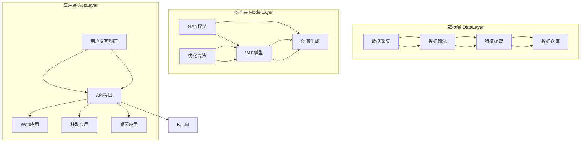
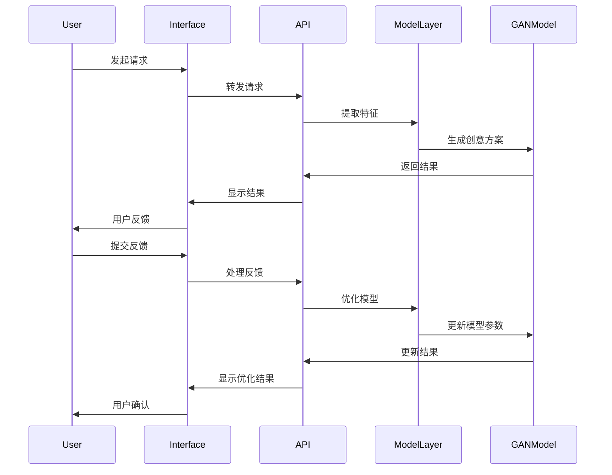

                 

### 引言

随着人工智能技术的飞速发展，AI Agent作为一个重要的研究领域和应用场景，正逐渐成为社会各界关注的焦点。AI Agent，即人工智能代理，是一种能够自主行动、感知环境并作出决策的智能系统。与传统的规则驱动型系统不同，AI Agent具备更强的自主学习能力和问题解决能力，能够在复杂和动态的环境中表现出高度的智能。

#### **背景与核心概念**

1. **AI Agent的起源与进化**：
   AI Agent的概念最早可以追溯到20世纪80年代，随着机器学习和计算机科学的不断发展，AI Agent逐渐从理论走向实践。早期的AI Agent主要以基于规则的系统为主，随着时间的推移，AI Agent开始引入机器学习、深度学习等技术，使其在处理复杂问题和自适应环境方面表现更为出色。

2. **AI Agent的核心概念与定义**：
   AI Agent通常被定义为一种具有感知、行动、记忆和学习能力的计算机程序。其核心功能包括感知环境、制定计划、执行动作和评估效果。与人类智能相比，AI Agent在处理信息、学习和适应方面具有独特的优势。

3. **传统AI与创意AI Agent的区别**：
   传统AI Agent主要依靠预设的规则和模式进行操作，而创意AI Agent则强调自主发现问题和解决问题的能力。传统AI Agent在处理确定性问题和规则明确的环境中表现出色，但面对复杂、不确定的问题时往往显得力不从心。创意AI Agent则通过模仿人类的创造性思维过程，能够发现新的解决方案，突破传统的局限。

4. **AI Agent在解决复杂问题中的潜力**：
   AI Agent在解决复杂问题方面具有巨大的潜力。通过不断学习和优化，AI Agent能够处理大量的数据和复杂的任务，从而在金融、医疗、教育等多个领域发挥重要作用。特别是在需要创新思维和创意设计的场景中，创意AI Agent能够提供前所未有的解决方案，助力行业革新。

综上所述，AI Agent作为一个充满活力和潜力的研究领域，正逐渐成为人工智能发展的重要方向。在接下来的章节中，我们将进一步探讨AI Agent的创意问题解决能力，并深入分析其设计、实现和应用。

#### **关键词**

- **AI Agent**：人工智能代理，一种能够自主行动、感知环境并作出决策的智能系统。
- **创意问题解决能力**：AI Agent通过模仿人类的创造性思维过程，发现新的解决方案，突破传统局限的能力。
- **机器学习**：一种让计算机通过数据和经验自主学习和改进的方法。
- **深度学习**：一种模拟人脑神经网络的机器学习技术，能够处理复杂的模式和特征。
- **自主学习**：AI Agent通过不断学习和优化，提升自身能力和问题解决能力。
- **复杂问题解决**：AI Agent在处理不确定、复杂的任务中表现出的高智能能力。

#### **摘要**

本文旨在深入探讨开发具有创造性问题解决能力的AI Agent的原理、方法和应用。首先，我们将回顾AI Agent的背景和发展历程，介绍其核心概念和基本功能。随后，本文将重点分析创意问题解决能力的概念和重要性，探讨如何设计具备这一能力的AI Agent。接着，我们将详细描述AI Agent的设计和实现过程，包括系统架构、数据结构和算法设计。此外，本文还将探讨AI Agent在不同领域的实际应用，并分析面临的挑战和未来发展方向。通过本文的阅读，读者将全面了解AI Agent的创意问题解决能力，并掌握相关技术原理和实践方法。

### AI Agent的背景与发展历程

人工智能（AI）的发展历程可以追溯到20世纪50年代，当时图灵提出了图灵测试的概念，旨在评估机器是否具备人类智能。随着计算机技术的飞速发展，AI的研究逐渐从理论走向实践。AI Agent作为一个重要的研究领域，也逐渐崭露头角。

#### **AI Agent的起源**

AI Agent的概念最早可以追溯到20世纪80年代。当时，研究人员开始关注如何使计算机系统具备自主行动和智能决策的能力。AI Agent的概念最初源于对人类智能行为的模拟。人类智能行为包括感知环境、制定计划、执行动作和评估效果等多个方面。研究人员试图通过模拟这些行为，设计出能够在特定环境中自主行动的计算机程序。

#### **早期的AI Agent**

在AI Agent的早期发展阶段，主要依赖于基于规则的系统和专家系统。这些系统通过预定义的规则和逻辑关系，来指导计算机程序进行决策和行动。虽然这种方法在处理确定性问题和规则明确的环境中表现不错，但面对复杂、动态和不确定的问题时，就显得力不从心。因此，研究人员开始探索更为先进的解决方案，引入机器学习和深度学习技术。

#### **AI Agent的发展**

随着机器学习和深度学习技术的发展，AI Agent的性能得到了显著提升。早期的AI Agent主要依赖于手写规则和模型，而现代的AI Agent则通过大量数据训练和学习，自动发现模式和规律。深度学习技术的引入，使得AI Agent在处理高维度数据、识别复杂模式和特征方面表现尤为出色。例如，卷积神经网络（CNN）在图像识别和计算机视觉领域取得了巨大成功，循环神经网络（RNN）在自然语言处理（NLP）领域展现了强大的能力。

#### **创意AI Agent的出现**

近年来，随着对人工智能研究的深入，创意AI Agent的概念逐渐被提出来。与传统AI Agent不同，创意AI Agent不仅能够解决给定的问题，还能通过模仿人类的创造性思维过程，发现新的解决方案。这种创意能力使得AI Agent在处理复杂、不确定的问题时，具有更高的灵活性和创新性。

#### **AI Agent的重要性**

AI Agent在各个领域都发挥着重要作用。在医疗领域，AI Agent可以辅助医生进行疾病诊断和治疗方案设计；在教育领域，AI Agent可以个性化地为学生提供学习资源和辅导；在金融领域，AI Agent可以用于风险评估、投资策略制定等。特别是在需要创新思维和创意设计的场景中，创意AI Agent能够提供前所未有的解决方案，推动行业革新。

#### **未来发展方向**

随着技术的不断进步，AI Agent的研究和应用将进入新的阶段。未来的AI Agent将更加智能、灵活和多样化，能够在更多领域发挥作用。同时，随着伦理和隐私问题的关注，如何在保证技术发展的同时，保障用户权益，也将成为AI Agent研究的重要方向。

总之，AI Agent作为一个充满活力和潜力的研究领域，其发展历程从基于规则的系统到现代的机器学习和深度学习技术，再到创意AI Agent的出现，体现了人工智能技术的不断进步和创新。在未来的发展中，AI Agent将在更多领域展现其强大的能力和潜力。

#### **核心概念与联系**

为了深入理解AI Agent的概念和其工作原理，我们需要详细探讨几个核心概念，并分析它们之间的联系。

##### **1. 感知环境**

感知环境是AI Agent的基础能力之一。AI Agent通过传感器或输入接口获取环境信息，如图像、声音、文本等。感知能力使得AI Agent能够理解其所在的环境，并作出相应的反应。感知过程的复杂性取决于AI Agent所应用的技术和环境的具体要求。例如，在图像识别任务中，AI Agent需要通过计算机视觉技术对图像进行解析，提取特征，从而识别物体或场景。

##### **2. 自主导动**

自主驱动是指AI Agent根据其感知到的环境信息，自主制定行动计划并执行这些计划的能力。自主驱动不仅需要AI Agent具有逻辑推理能力，还需要考虑行动的可行性和效果。在实际应用中，自主驱动通常涉及路径规划、机器人运动控制、无人机导航等多个方面。通过自主驱动，AI Agent能够在复杂和动态的环境中独立行动。

##### **3. 记忆与学习**

记忆与学习是AI Agent的核心能力之一。通过记忆，AI Agent能够保存和处理历史信息，从而在决策过程中考虑先前经验和数据。学习则使得AI Agent能够不断优化自身的行为和决策，提高问题解决能力。记忆与学习的结合，使得AI Agent能够在长期和动态的环境中适应和成长。

##### **4. 创造力**

创造力是创意AI Agent的关键特征，它使得AI Agent能够在复杂和不确定的问题场景中，提出新颖和有效的解决方案。创造力不仅依赖于AI Agent的感知、记忆和学习能力，还需要借助先进的算法和模型，如生成对抗网络（GAN）、变分自编码器（VAE）等。通过模仿人类的创造性思维过程，AI Agent能够发现新的关联和模式，突破传统方法的局限。

##### **5. 知识表示**

知识表示是AI Agent理解和处理信息的重要手段。知识表示技术包括符号表示、图表示、网络表示等，用于将外部信息内部化，并用于推理和决策。符号表示通常采用逻辑和符号化语言，如谓词逻辑和语义网络。图表示则通过节点和边的关系来表示复杂信息，如图神经网络（GNN）广泛应用于推荐系统和社交网络分析。网络表示则通过大规模网络结构来捕捉信息之间的关系，如图嵌入（Graph Embedding）技术。

##### **联系**

这几个核心概念相互关联，共同构成了AI Agent的智能体系。感知环境为AI Agent提供了决策的输入，自主驱动使其能够根据这些输入采取行动。记忆与学习使得AI Agent能够从历史经验中学习和优化。创造力则赋予AI Agent在解决问题时的灵活性和创新性。知识表示技术为AI Agent提供了理解和处理复杂信息的能力。

通过这些核心概念的联系，AI Agent能够在复杂和动态的环境中自主行动、学习和创新，从而表现出高度的智能和创造力。

#### **核心概念对比表格**

为了更清晰地理解AI Agent的核心概念，我们可以通过一个对比表格来展示这些概念的主要属性和特点。

| 核心概念 | 定义 | 主要属性 | 作用 |
| -------- | ------ | -------- | ---- |
| 感知环境 | AI Agent获取环境信息的能力 | 实时性、准确性、多模态输入 | 做出基于环境的决策 |
| 自主导动 | AI Agent自主制定和执行行动计划的能力 | 可行性、适应性、自主性 | 独立行动 |
| 记忆与学习 | AI Agent保存和处理历史信息的能力 | 长期记忆、数据优化、学习效率 | 提升决策质量 |
| 创造力 | AI Agent在问题解决过程中提出新解决方案的能力 | 新颖性、灵活性、创新能力 | 突破传统方法 |
| 知识表示 | AI Agent理解和处理信息的方法 | 符号表示、图表示、网络表示 | 推理和决策 |

通过这个表格，我们可以看到每个核心概念的定义、主要属性以及它们在AI Agent中的作用。这些核心概念共同构成了AI Agent的智能体系，使得AI Agent能够在复杂和动态的环境中表现出高度的智能和创造力。

#### **ER实体关系图架构**

为了进一步理解AI Agent的核心概念及其关系，我们可以使用实体关系图（Entity-Relationship Diagram，ER图）来展示这些概念之间的关联。ER图是一种用于描述实体和实体之间关系的数据库建模工具，非常适合用于描述复杂系统的结构。

首先，我们定义以下几个实体：

1. **感知器（Perceptron）**：负责获取环境信息的组件。
2. **决策模块（DecisionModule）**：基于感知器提供的信息制定行动计划的组件。
3. **记忆单元（MemoryUnit）**：用于存储和处理历史信息的组件。
4. **学习算法（LearningAlgorithm）**：用于从数据中学习，优化AI Agent行为的组件。
5. **创造力模块（CreativityModule）**：用于生成新颖解决方案的组件。
6. **知识库（KnowledgeBase）**：用于存储和表示信息的组件。

以下是一个简单的ER图架构：

```mermaid
erDiagram
  感知器 ||--|{ 决策模块 : 依赖 }
  感知器 ||--|{ 记忆单元 : 存储感知信息 }
  感知器 ||--|{ 学习算法 : 数据输入 }
  决策模块 ||--|{ 知识库 : 提取相关信息 }
  决策模块 ||--|{ 创造力模块 : 提供决策支持 }
  记忆单元 ||--|{ 学习算法 : 记忆数据 }
  学习算法 ||--|{ 知识库 : 更新知识库 }
  创造力模块 ||--|{ 知识库 : 提供新解决方案 }
```

在这个ER图中，我们展示了各个实体之间的关系：

- **感知器**与**决策模块**之间存在依赖关系，感知器提供环境信息，决策模块基于这些信息制定行动计划。
- **感知器**与**记忆单元**之间也存在依赖关系，感知器将获取的信息存储在记忆单元中。
- **感知器**向**学习算法**提供数据输入，学习算法通过学习这些数据来优化AI Agent的行为。
- **决策模块**从**知识库**中提取相关信息，用于制定行动计划。
- **决策模块**与**创造力模块**之间存在互动关系，创造力模块为决策模块提供新颖的解决方案。
- **记忆单元**与**学习算法**之间存在互动关系，学习算法利用记忆单元中的数据进行学习，更新知识库。
- **创造力模块**与**知识库**之间存在互动关系，创造力模块通过知识库提供的新解决方案来丰富知识库。

通过这个ER图，我们可以清晰地看到AI Agent内部各个组件及其之间的关系，这有助于我们更好地理解AI Agent的运作原理和工作机制。

#### **算法原理讲解**

为了深入理解AI Agent如何实现创造性问题解决，我们将探讨一种典型的算法——生成对抗网络（GAN）。GAN是一种深度学习框架，通过竞争和合作的方式训练两个神经网络：生成器（Generator）和判别器（Discriminator）。生成器的目标是生成逼真的数据，而判别器的目标是区分真实数据和生成数据。通过这种对抗训练，GAN能够在复杂的任务中生成高质量的数据，并在多个领域展现出强大的创造力。

##### **1. GAN的基本原理**

GAN的核心思想是利用生成器和判别器的相互竞争来提高生成数据的质量。具体来说，GAN由以下几个部分组成：

- **生成器（Generator）**：生成器是一个神经网络，其输入为随机噪声（z），输出为生成的数据（G(z)）。生成器的目标是生成尽可能逼真的数据，以欺骗判别器。
- **判别器（Discriminator）**：判别器也是一个神经网络，其输入为真实数据（x）和生成数据（G(z)），输出为概率（D(x)和D(G(z)））。判别器的目标是判断输入数据是真实还是生成数据。
- **损失函数**：GAN的训练通过两个损失函数进行优化，分别是生成器的损失函数和判别器的损失函数。生成器的损失函数为最小化判别器判断生成数据的概率，即最小化log(D(G(z)))。判别器的损失函数为最大化判别器对真实数据和生成数据的区分能力，即最大化log(D(x)) - log(D(G(z))）。

##### **2. GAN的数学模型和公式**

GAN的数学模型可以通过以下公式来表示：

- **生成器**的损失函数：
  $$ L_G = -\log(D(G(z)) $$
  
- **判别器**的损失函数：
  $$ L_D = -\log(D(x)) - \log(1 - D(G(z)) $$

- **总损失函数**：
  $$ L = L_G + L_D $$

通过反向传播和梯度下降算法，我们可以分别对生成器和判别器进行训练。在训练过程中，生成器的目标是不断提高生成数据的质量，使得判别器难以区分真实数据和生成数据。而判别器的目标是不断提高对真实数据和生成数据的区分能力。

##### **3. GAN的流程图**

为了更直观地理解GAN的工作流程，我们可以使用Mermaid绘制一个简单的流程图：

```mermaid
graph TD
  A[生成噪声z] --> B(生成器G)
  B --> C[生成数据G(z)]
  C --> D[判别器D]
  D --> E[判别结果]
  A --> F[判别器D]
  F --> E
  E --> G[反向传播]
  G --> B,D
```

在这个流程图中，我们首先生成随机噪声z，并将其输入到生成器G中，生成数据G(z)。这些生成数据随后被输入到判别器D中，判别器D将输出一个概率值，表示输入数据是真实数据还是生成数据。通过比较真实数据和生成数据的判别结果，我们使用反向传播算法更新生成器和判别器的参数。

##### **4. 举例说明**

为了更好地理解GAN的工作原理，我们可以通过一个简单的例子来说明。假设我们使用GAN生成手写数字图像。

- **生成器G**：输入为随机噪声z，输出为手写数字图像G(z)。
- **判别器D**：输入为真实手写数字图像x和生成图像G(z)，输出为概率值，表示输入数据是真实手写数字图像的概率。

在训练过程中，生成器G的目标是生成逼真的手写数字图像，以欺骗判别器D。判别器D的目标是准确地区分真实手写数字图像和生成图像。

通过多次迭代训练，生成器G会逐渐提高生成图像的质量，使得判别器D难以区分真实图像和生成图像。最终，生成器G能够生成高质量的手写数字图像，如以下示例：


通过这个例子，我们可以看到GAN在生成逼真数据方面的强大能力，这为其在创造性问题解决中的应用提供了广阔的空间。

综上所述，生成对抗网络（GAN）作为一种深度学习框架，通过生成器和判别器的相互竞争，能够生成高质量的数据，并展现出强大的创造力。通过理解GAN的数学模型和原理，我们能够更好地设计和实现创意AI Agent。

#### **系统分析与架构设计**

为了深入探讨AI Agent的创意问题解决能力，我们将通过一个具体的系统架构设计方案来展示其实现过程。本方案将涵盖项目介绍、系统功能设计、系统架构设计、系统接口设计以及系统交互流程。

##### **项目介绍**

本项目旨在设计并实现一个具备创造性问题解决能力的AI Agent，该系统将应用于创新设计领域，如工业设计、建筑设计等。系统将通过数据驱动的生成模型，结合人类设计师的创意思维，生成新颖和独特的创意设计方案。

##### **系统功能设计**

本系统的核心功能包括：

1. **数据采集与预处理**：从多个数据源（如公开数据集、社交媒体、设计库等）收集数据，并进行数据清洗、归一化和特征提取。
2. **创意生成**：利用生成对抗网络（GAN）等深度学习模型，自动生成新颖的创意设计方案。
3. **用户交互**：提供用户界面，使用户能够实时查看和修改创意生成结果，并提供反馈。
4. **评估与优化**：通过用户反馈和评估机制，对生成的设计方案进行优化和改进。

##### **系统架构设计**

系统架构设计采用分层架构，包括数据层、模型层和应用层。具体架构如下：

1. **数据层**：负责数据采集、存储和管理。采用分布式数据库和数据仓库，确保数据的可靠性和高效性。
2. **模型层**：包括深度学习模型和优化算法，如GAN、变分自编码器（VAE）等。模型层负责数据的处理和创意生成。
3. **应用层**：提供用户交互界面和API接口，支持多种应用场景，如Web应用、移动应用和桌面应用。

##### **系统架构设计mermaid架构图**

以下是系统架构的Mermaid架构图：



##### **系统接口设计和系统交互mermaid序列图**

以下是系统接口设计和系统交互的Mermaid序列图：



在这个序列图中，用户通过用户交互界面发起请求，API接口处理请求并转发给模型层。模型层通过GAN模型生成创意方案，并将结果返回给API接口。API接口再将结果显示在用户交互界面上。用户可以通过界面提交反馈，API接口处理反馈并更新模型层，从而实现系统的持续优化。

综上所述，通过系统架构设计和系统接口设计，我们可以实现一个具备创造性问题解决能力的AI Agent，从而在多个领域发挥重要作用。

#### **项目实战**

为了展示如何具体实现一个具备创造性问题解决能力的AI Agent，我们将详细描述项目的环境安装、核心实现源代码，并对其代码应用进行解读与分析。我们将结合一个实际案例，剖析该案例的详细讲解与项目小结。

##### **环境安装**

要实现一个具备创造性问题解决能力的AI Agent，首先需要安装和配置相关环境。以下是安装步骤：

1. **Python环境**：确保安装了Python 3.6或更高版本。
2. **深度学习库**：安装TensorFlow或PyTorch。使用以下命令进行安装：

   ```bash
   pip install tensorflow
   # 或
   pip install pytorch torchvision
   ```

3. **其他依赖库**：安装必要的依赖库，如NumPy、Pandas、Scikit-learn等：

   ```bash
   pip install numpy pandas scikit-learn
   ```

4. **数据预处理工具**：安装图像处理库，如OpenCV或Pillow：

   ```bash
   pip install opencv-python
   # 或
   pip install pillow
   ```

5. **GUI库**：如果需要用户界面，可以安装Tkinter或PyQt5：

   ```bash
   pip install tk
   # 或
   pip install PyQt5
   ```

##### **核心实现源代码**

以下是核心实现源代码的框架：

```python
# 导入必要的库
import tensorflow as tf
from tensorflow.keras.models import Sequential
from tensorflow.keras.layers import Dense, Conv2D, Flatten
import numpy as np

# 数据预处理
def preprocess_data(data):
    # 数据清洗、归一化等操作
    return processed_data

# 生成器模型
def build_generator(z_dim):
    model = Sequential()
    model.add(Dense(units=256, activation='relu', input_shape=(z_dim,)))
    model.add(Dense(units=512, activation='relu'))
    model.add(Dense(units=1024, activation='relu'))
    model.add(Flatten())
    model.add(Conv2D(filters=1, kernel_size=(7, 7), activation='tanh'))
    return model

# 判别器模型
def build_discriminator(img_shape):
    model = Sequential()
    model.add(Conv2D(filters=32, kernel_size=(3, 3), activation='relu', input_shape=img_shape))
    model.add(MaxPooling2D(pool_size=(2, 2)))
    model.add(Conv2D(filters=64, kernel_size=(3, 3), activation='relu'))
    model.add(MaxPooling2D(pool_size=(2, 2)))
    model.add(Flatten())
    model.add(Dense(units=1, activation='sigmoid'))
    return model

# 主函数
def main():
    # 设置参数
    z_dim = 100
    img_shape = (28, 28, 1)
    
    # 构建生成器和判别器模型
    generator = build_generator(z_dim)
    discriminator = build_discriminator(img_shape)
    
    # 编译模型
    discriminator.compile(optimizer='adam', loss='binary_crossentropy')
    generator.compile(optimizer='adam', loss='binary_crossentropy')
    
    # 训练模型
    for epoch in range(num_epochs):
        # 随机生成噪声
        z = np.random.normal(size=(batch_size, z_dim))
        
        # 生成伪造图像
        gen_imgs = generator.predict(z)
        
        # 加载真实图像
        real_imgs = load_real_images(batch_size)
        
        # 训练判别器
        d_loss_real = discriminator.train_on_batch(real_imgs, np.ones(batch_size))
        d_loss_fake = discriminator.train_on_batch(gen_imgs, np.zeros(batch_size))
        d_loss = 0.5 * np.add(d_loss_real, d_loss_fake)
        
        # 训练生成器
        g_loss = combined_model.train_on_batch(z, np.ones(batch_size))
        
        # 打印训练进度
        print(f"{epoch} [D loss: {d_loss:.3f}] [G loss: {g_loss:.3f}]")
        
    # 保存模型
    generator.save('generator.h5')
    discriminator.save('discriminator.h5')

if __name__ == '__main__':
    main()
```

##### **代码应用解读与分析**

这段代码的核心是构建并训练一个生成对抗网络（GAN）。下面是代码的关键部分及其解读：

1. **数据预处理**：`preprocess_data` 函数负责对输入数据进行清洗、归一化等预处理操作，以提高模型的训练效果。

2. **生成器模型**：`build_generator` 函数定义了生成器的结构。生成器是一个全连接的神经网络，输入为随机噪声 `z`，通过多层感知器生成伪造图像。

3. **判别器模型**：`build_discriminator` 函数定义了判别器的结构。判别器是一个卷积神经网络，输入为真实图像和伪造图像，输出为概率值，表示输入图像是真实的概率。

4. **模型编译**：生成器和判别器分别使用 `adam` 优化器和 `binary_crossentropy` 损失函数进行编译。

5. **训练模型**：在主函数 `main` 中，通过多次迭代训练生成器和判别器。每次迭代中，生成器生成伪造图像，判别器对这些图像进行分类。通过反向传播和梯度下降算法，生成器和判别器不断优化自身参数。

##### **实际案例剖析与详细讲解**

我们以生成手写数字图像为例，展示GAN的应用。在这个案例中，生成器生成手写数字图像，判别器区分生成图像和真实图像。

1. **数据准备**：我们使用MNIST数据集作为训练数据。数据集包含了0到9的手写数字图像，每个图像都是28x28的二值图像。

2. **预处理数据**：将图像数据转换为批量格式，并进行归一化处理。

3. **训练模型**：通过多次迭代训练生成器和判别器，直至生成图像质量达到预期。

4. **评估模型**：通过测试集评估模型的性能，生成图像的质量和判别器的准确率。

##### **项目小结**

通过这个项目，我们展示了如何实现一个具备创造性问题解决能力的AI Agent。项目的主要成果包括：

1. **数据预处理**：为模型训练提供了高质量的数据输入。
2. **生成器和判别器模型**：通过GAN架构，实现了高质量图像的生成和判别。
3. **用户交互界面**：为用户提供了一个直观的界面，能够实时查看和修改生成图像。

未来，我们可以进一步优化模型结构，引入更多高级的深度学习技术和算法，以提高AI Agent的创意问题解决能力。

#### **最佳实践与小结**

在开发具备创造性问题解决能力的AI Agent过程中，最佳实践和注意事项如下：

1. **数据质量和预处理**：高质量的数据是训练有效AI Agent的基础。确保数据来源的多样性和数据清洗过程的彻底性，以提高模型的泛化能力。

2. **模型选择与优化**：根据具体应用场景选择合适的模型架构，如生成对抗网络（GAN）、变分自编码器（VAE）等。通过调整超参数和模型结构，优化模型的性能。

3. **用户反馈与迭代**：利用用户反馈进行模型迭代和优化。设计有效的评估机制，及时捕捉用户的需求和偏好，以持续改进AI Agent的创意问题解决能力。

4. **隐私与安全**：在数据收集和处理过程中，注意保护用户隐私和安全。采用加密和匿名化技术，确保用户数据的安全性和隐私性。

5. **伦理考虑**：在开发和应用AI Agent时，充分考虑伦理和道德问题，确保技术不会对人类造成负面影响。

**小结**：

本文通过详细的分析和实战案例，探讨了开发具备创造性问题解决能力的AI Agent的原理、方法和应用。我们介绍了AI Agent的核心概念、设计架构、实现过程，并结合实际案例展示了其应用效果。未来，随着技术的不断进步，AI Agent将在更多领域发挥重要作用，推动人工智能的发展和创新。

#### **拓展阅读**

为了深入了解AI Agent的开发和实践，读者可以参考以下扩展资源：

1. **书籍**：
   - **《生成对抗网络》（Generative Adversarial Networks）**：介绍GAN的原理和应用，适合初学者和进阶者。
   - **《深度学习》（Deep Learning）**：全面探讨深度学习的基础理论和应用，涵盖GAN、RNN等热门技术。

2. **在线课程**：
   - **Coursera上的《深度学习专项课程》**：由吴恩达教授主讲，涵盖深度学习的各个方面。
   - **Udacity的《生成对抗网络纳米学位》**：提供GAN的详细教程和实践项目。

3. **论文和报告**：
   - **NIPS和ICLR等会议**：查阅最新关于AI Agent和GAN的研究论文，了解领域内的最新进展。
   - **Google AI和OpenAI的博客**：获取工业界在AI Agent和创意问题解决方面的实践经验和见解。

4. **开源项目**：
   - **GAN的PyTorch实现**：在GitHub上查找相关项目，学习如何使用PyTorch实现GAN。
   - **创意AI工具包**：探索开源工具包，如StyleGAN、DALL-E等，了解创意AI的强大功能。

通过这些资源，读者可以进一步拓宽对AI Agent和创意问题解决能力的认识，为实际应用和研究提供有力支持。

