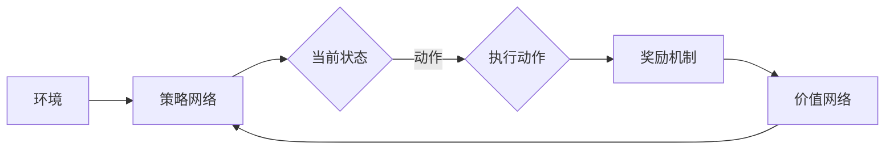
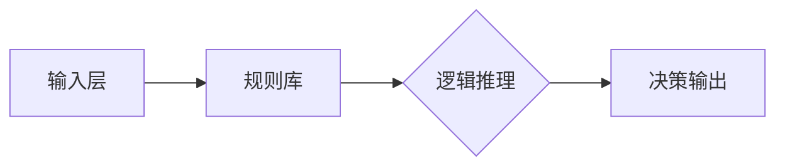
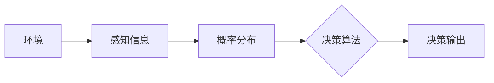
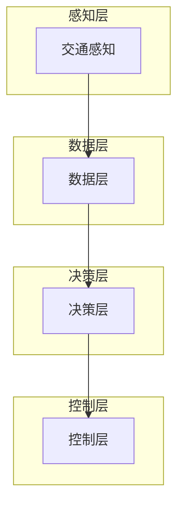
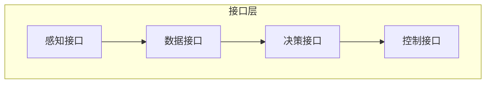
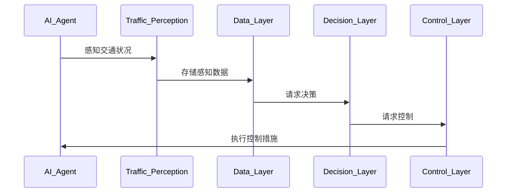

                 

## 开发具有复杂场景理解与决策能力的AI Agent

> 关键词：AI Agent、复杂场景理解、决策能力、算法原理、系统架构设计

> 摘要：本文深入探讨了如何开发具有复杂场景理解与决策能力的AI Agent。从问题背景出发，分析了AI Agent的需求与挑战，阐述了其定义与发展历程，并介绍了复杂场景理解与决策能力的解决方案。随后，通过核心概念与联系、算法原理讲解、系统分析与架构设计，以及项目实战，全面展示了开发具有复杂场景理解与决策能力的AI Agent的详细步骤与策略。

## 《开发具有复杂场景理解与决策能力的AI Agent》目录大纲

### 第一部分：背景介绍

- **第1章 问题背景**
  - 问题描述
  - 问题解决
  - 边界与外延
  - 概念结构与核心要素组成

- **第2章 核心概念与联系**
  - AI Agent的核心概念原理
  - AI Agent的属性特征对比表格
  - AI Agent的ER实体关系图架构

### 第二部分：算法原理讲解

- **第3章 复杂场景理解算法原理**
  - 算法原理概述
  - 算法原理详细讲解
  - 算法mermaid流程图
  - 算法Python源代码与讲解
  - 数学模型与公式
  - 举例说明

- **第4章 决策算法原理**
  - 决策算法概述
  - 决策算法原理详细讲解
  - 决策算法mermaid流程图
  - 决策算法Python源代码与讲解
  - 数学模型与公式
  - 举例说明

### 第三部分：系统分析与架构设计

- **第5章 系统功能设计**
  - 问题场景介绍
  - 系统功能设计
  - 领域模型mermaid类图

- **第6章 系统架构设计**
  - 项目介绍
  - 系统架构设计
  - 系统架构mermaid架构图
  - 系统接口设计
  - 系统交互mermaid序列图

### 第四部分：项目实战

- **第7章 环境安装**
  - 环境要求
  - 环境配置
  - 工具安装

- **第8章 系统核心实现**
  - 核心功能实现
  - 源代码解读

- **第9章 代码应用解读与分析**
  - 应用场景分析
  - 代码应用解读
  - 代码优化建议

- **第10章 实际案例分析和详细讲解剖析**
  - 案例选择
  - 案例分析
  - 案例讲解
  - 案例经验总结

- **第11章 项目小结**
  - 项目总结
  - 最佳实践 tips
  - 拓展阅读

## 第一部分：背景介绍

### 第1章 问题背景

#### 1.1 问题描述

随着人工智能技术的不断发展，AI Agent（智能代理）已经成为智能化系统中的核心组件。AI Agent被设计用于在复杂环境中自主执行任务，具备复杂场景理解与决策能力。然而，在实际开发中，AI Agent面临诸多挑战。

首先，复杂场景理解是AI Agent的一项核心能力。在现实世界中，场景往往具有高度不确定性、动态变化性和多样性，这给AI Agent的理解带来了巨大挑战。其次，决策能力也是AI Agent的关键能力之一。在复杂环境中，如何做出最优决策是AI Agent面临的另一大难题。

#### 1.2 问题解决

为了解决这些问题，AI Agent的开发需要从以下几个方面入手：

1. **核心概念与联系**：明确AI Agent的核心概念，理解其工作原理和属性特征，并通过ER实体关系图架构进行系统建模。
2. **算法原理讲解**：深入讲解复杂场景理解与决策算法的原理，包括深度学习、强化学习等算法，并通过mermaid流程图和Python源代码进行详细阐述。
3. **系统分析与架构设计**：对AI Agent的系统功能进行设计，构建合理的系统架构，并通过mermaid类图和架构图进行可视化。
4. **项目实战**：通过实际项目的开发，验证AI Agent的性能和效果，并进行代码解读和案例分析。

#### 1.3 边界与外延

AI Agent的应用领域非常广泛，包括智能客服、自动驾驶、智能家居、金融风控等。然而，复杂场景理解与决策能力的实现并非一蹴而就，它受到数据质量、算法效率、计算资源等多方面限制。

#### 1.4 概念结构与核心要素组成

AI Agent的基本结构包括感知模块、知识模块、决策模块和行动模块。感知模块负责获取环境信息，知识模块用于存储和更新知识，决策模块通过分析感知信息和知识做出决策，行动模块则根据决策执行相应的操作。

### 第2章 核心概念与联系

#### 2.1 AI Agent的核心概念原理

AI Agent，即人工智能代理，是指能够模拟、延伸和扩展人类智能行为的计算实体。它通过自主学习和决策，实现自动化任务执行和复杂场景理解。

AI Agent主要分为两类：基于学习算法的AI Agent和基于规则推理的AI Agent。基于学习算法的AI Agent通过大量数据学习环境特征，自适应地进行决策；而基于规则推理的AI Agent则依赖于预设的规则进行决策。

#### 2.2 AI Agent的属性特征对比表格

| 特征类别           | 基于学习算法的AI Agent               | 基于规则推理的AI Agent               |
|------------------|----------------------------------|----------------------------------|
| 决策方式           | 自适应决策，基于数据驱动             | 预设规则，基于逻辑推理               |
| 适用场景           | 高度不确定性、动态变化的复杂场景         | 结构化、规则明确的场景               |
| 数据需求           | 需要大量训练数据，数据质量要求高         | 需要详细的规则描述，知识更新频率低       |
| 算法效率           | 随着数据量增加，算法效率可能降低           | 算法效率相对稳定，但扩展性较差           |

#### 2.3 AI Agent的ER实体关系图架构

在AI Agent中，实体（Entity）和关系（Relationship）是构建系统架构的基础。以下是AI Agent的ER实体关系图架构示例：

```mermaid
erDiagram
  人 --> 环境
  环境 ||--|{ 感知模块 }
  感知模块 ||--|{ 知识模块 }
  知识模块 ||--|{ 决策模块 }
  决策模块 ||--|{ 行动模块 }
```

- **人**：表示AI Agent所服务的主体。
- **环境**：表示AI Agent所在的物理或虚拟环境。
- **感知模块**：负责感知环境信息，如图像、声音、文本等。
- **知识模块**：负责存储和更新环境知识，如场景描述、规则等。
- **决策模块**：根据感知信息和知识，进行决策。
- **行动模块**：根据决策，执行相应的操作。

通过ER实体关系图架构，可以清晰地展示AI Agent的核心要素及其相互关系，有助于理解和设计AI Agent系统。

### 第二部分：算法原理讲解

#### 第3章 复杂场景理解算法原理

##### 3.1 算法原理概述

复杂场景理解算法是AI Agent实现自主决策的关键。它通过对环境信息的感知、分析和理解，实现对复杂场景的识别和分类。

复杂场景理解算法主要分为两类：基于深度学习和基于强化学习。基于深度学习的算法通过多层神经网络对输入数据进行特征提取，从而实现对复杂场景的理解；而基于强化学习的算法则通过试错和反馈，不断调整行为策略，以适应复杂环境。

##### 3.2 算法原理详细讲解

**基于深度学习的场景理解算法**

深度学习算法的核心是多层神经网络，通过逐层提取特征，实现对复杂场景的理解。以下是基于深度学习的场景理解算法的基本原理：

1. **输入层**：接收环境感知信息，如图像、声音、文本等。
2. **隐藏层**：通过卷积神经网络（CNN）或循环神经网络（RNN）等，对输入数据进行特征提取和转换。
3. **输出层**：对提取到的特征进行分类或回归，输出结果。

**基于强化学习的场景理解算法**

强化学习算法的核心是策略网络和价值网络。通过不断试错和反馈，策略网络调整行为策略，价值网络评估策略的好坏。以下是基于强化学习的场景理解算法的基本原理：

1. **环境**：提供状态和动作。
2. **策略网络**：根据当前状态选择动作。
3. **价值网络**：评估策略的好坏，指导策略网络调整行为策略。
4. **奖励机制**：根据动作的结果，给予奖励或惩罚。

##### 3.3 算法mermaid流程图

以下是基于深度学习和强化学习的场景理解算法的mermaid流程图示例：

**基于深度学习的场景理解算法流程图：**


**基于强化学习的场景理解算法流程图：**



##### 3.4 算法Python源代码与讲解

**基于深度学习的场景理解算法Python代码示例：**

```python
import tensorflow as tf

# 定义输入层
inputs = tf.keras.Input(shape=(28, 28))  # 图像尺寸为28x28

# 定义隐藏层
x = tf.keras.layers.Conv2D(32, (3, 3), activation='relu')(inputs)
x = tf.keras.layers.MaxPooling2D((2, 2))(x)
x = tf.keras.layers.Conv2D(64, (3, 3), activation='relu')(x)
x = tf.keras.layers.MaxPooling2D((2, 2))(x)

# 定义输出层
outputs = tf.keras.layers.Dense(10, activation='softmax')(x)

# 创建模型
model = tf.keras.Model(inputs=inputs, outputs=outputs)

# 编译模型
model.compile(optimizer='adam', loss='categorical_crossentropy', metrics=['accuracy'])

# 训练模型
model.fit(x_train, y_train, batch_size=64, epochs=10, validation_data=(x_val, y_val))
```

**基于强化学习的场景理解算法Python代码示例：**

```python
import tensorflow as tf
import numpy as np

# 定义环境
class Environment:
    def __init__(self):
        self.state = 0

    def step(self, action):
        reward = 0
        if action == 0:
            self.state = (self.state + 1) % 3
            reward = 1
        elif action == 1:
            self.state = (self.state - 1) % 3
            reward = -1
        return self.state, reward

# 定义策略网络
class PolicyNetwork(tf.keras.Model):
    def __init__(self):
        super(PolicyNetwork, self).__init__()
        self.dense = tf.keras.layers.Dense(64, activation='relu')

    def call(self, inputs):
        x = self.dense(inputs)
        return tf.nn.softmax(x)

# 定义价值网络
class ValueNetwork(tf.keras.Model):
    def __init__(self):
        super(ValueNetwork, self).__init__()
        self.dense = tf.keras.layers.Dense(64, activation='relu')

    def call(self, inputs):
        x = self.dense(inputs)
        return x

# 创建环境、策略网络和价值网络
env = Environment()
policy_network = PolicyNetwork()
value_network = ValueNetwork()

# 定义优化器
optimizer = tf.keras.optimizers.Adam(learning_rate=0.001)

# 定义损失函数
def loss_function predicted_value, true_value:
    return tf.reduce_mean(tf.square(predicted_value - true_value))

# 训练策略网络和价值网络
for episode in range(1000):
    state = env.state
    done = False
    total_reward = 0

    while not done:
        action_probs = policy_network(tf.convert_to_tensor([state], dtype=tf.float32))
        action = np.random.choice(2, p=action_probs.numpy()[0])

        next_state, reward = env.step(action)
        total_reward += reward

        with tf.GradientTape() as tape:
            value_pred = value_network(tf.convert_to_tensor([next_state], dtype=tf.float32))
            loss = loss_function(policy_network(tf.convert_to_tensor([state], dtype=tf.float32)), value_pred)

        gradients = tape.gradient(loss, policy_network.trainable_variables)
        optimizer.apply_gradients(zip(gradients, policy_network.trainable_variables))

        state = next_state
        if reward == -1 or reward == 1:
            done = True

print("Episode:", episode, "Total Reward:", total_reward)
```

##### 3.5 数学模型与公式

**基于深度学习的场景理解算法**

1. **卷积神经网络（CNN）公式**：

   $$h_l = \sigma(W_l \cdot a_{l-1} + b_l)$$

   其中，$h_l$表示第$l$层的激活值，$W_l$和$b_l$分别表示第$l$层的权重和偏置，$\sigma$表示激活函数，$a_{l-1}$表示前一层输入。

2. **全连接神经网络（FCNN）公式**：

   $$y = W \cdot a + b$$

   其中，$y$表示输出值，$W$和$b$分别表示权重和偏置，$a$表示输入值。

**基于强化学习的场景理解算法**

1. **策略网络（Policy Network）公式**：

   $$\pi(a|s) = \frac{e^{\theta(s,a)}}{\sum_{a'} e^{\theta(s,a')}}$$

   其中，$\pi(a|s)$表示在状态$s$下采取动作$a$的概率，$\theta(s,a)$表示策略网络的参数。

2. **价值网络（Value Network）公式**：

   $$V(s) = \sum_{a} \pi(a|s) \cdot Q(s, a)$$

   其中，$V(s)$表示状态$s$的价值，$Q(s, a)$表示状态$s$采取动作$a$的即时奖励。

##### 3.6 举例说明

**基于深度学习的场景理解算法**

假设有一个自动驾驶系统，需要根据道路环境感知信息进行驾驶决策。输入层接收图像数据，隐藏层通过卷积神经网络提取图像特征，输出层根据特征进行道路标识分类。

**基于强化学习的场景理解算法**

假设有一个机器人，需要在复杂的迷宫环境中找到出口。环境提供状态和动作，策略网络根据当前状态选择动作，价值网络评估策略的好坏，通过试错和反馈不断调整行为策略。

#### 第4章 决策算法原理

##### 4.1 决策算法概述

决策算法是AI Agent实现自主决策的关键。在复杂环境中，AI Agent需要根据感知到的信息和已掌握的知识，做出最优或次优的决策。

决策算法主要分为两类：基于逻辑推理的决策算法和基于概率论的决策算法。基于逻辑推理的决策算法通过预设的规则进行决策，适用于结构化、规则明确的场景；而基于概率论的决策算法通过计算概率分布进行决策，适用于不确定性和动态变化的场景。

##### 4.2 决策算法原理详细讲解

**基于逻辑推理的决策算法**

基于逻辑推理的决策算法主要通过预设的规则进行决策。常见的逻辑推理算法包括谓词逻辑、模糊逻辑和模糊推理等。

1. **谓词逻辑**：谓词逻辑是一种形式逻辑，通过逻辑运算符（如与、或、非）对命题进行组合和推理。谓词逻辑适用于表达和推理复杂的逻辑关系。

2. **模糊逻辑**：模糊逻辑是一种处理不确定性和模糊性的逻辑，通过引入隶属度来表示模糊概念。模糊逻辑适用于处理模糊性和不确定性的场景。

3. **模糊推理**：模糊推理是一种基于模糊逻辑的推理方法，通过输入和规则库，输出模糊决策。模糊推理适用于模糊决策和模糊控制场景。

**基于概率论的决策算法**

基于概率论的决策算法通过计算概率分布进行决策。常见的概率论决策算法包括贝叶斯推理、马尔可夫决策过程（MDP）和蒙特卡罗模拟等。

1. **贝叶斯推理**：贝叶斯推理是一种基于贝叶斯定理的推理方法，通过已知先验概率和条件概率，计算后验概率。贝叶斯推理适用于不确定性和概率分析场景。

2. **马尔可夫决策过程（MDP）**：马尔可夫决策过程是一种基于概率论的决策过程，通过状态、动作和奖励定义决策过程。马尔可夫决策过程适用于动态决策和优化场景。

3. **蒙特卡罗模拟**：蒙特卡罗模拟是一种基于随机抽样的决策方法，通过模拟随机过程，计算期望收益。蒙特卡罗模拟适用于不确定性和蒙特卡罗场景。

##### 4.3 决策算法mermaid流程图

以下是基于逻辑推理和概率论的决策算法的mermaid流程图示例：

**基于逻辑推理的决策算法流程图：**



**基于概率论的决策算法流程图：**



##### 4.4 决策算法Python源代码与讲解

**基于逻辑推理的决策算法Python代码示例：**

```python
import pandas as pd

# 定义规则库
rule_library = {
    'if temperature > 30 then wear shorts',
    'if temperature <= 30 and humidity > 70 then wear a jacket',
    'if temperature <= 30 and humidity <= 70 then wear a t-shirt'
}

# 定义输入层
input_layer = {
    'temperature': 25,
    'humidity': 60
}

# 定义逻辑推理函数
def logical_reasoning(input_layer, rule_library):
    decision = None
    for rule in rule_library:
        if evaluate_rule(rule, input_layer):
            decision = rule.split()[1]
            break
    return decision

# 定义规则评估函数
def evaluate_rule(rule, input_layer):
    condition = rule.split()[2:]
    for condition_part in condition:
        attribute, value = condition_part.split('=')
        if not (attribute in input_layer and input_layer[attribute] == float(value)):
            return False
    return True

# 执行逻辑推理
decision = logical_reasoning(input_layer, rule_library)
print("Decision:", decision)
```

**基于概率论的决策算法Python代码示例：**

```python
import numpy as np
import pandas as pd

# 定义环境
class Environment:
    def __init__(self):
        self.state = {'temperature': 25, 'humidity': 60}

    def update_state(self, action):
        if action == 'wear shorts':
            self.state['temperature'] += 5
            self.state['humidity'] -= 10
        elif action == 'wear a jacket':
            self.state['temperature'] -= 5
            self.state['humidity'] += 10
        elif action == 'wear a t-shirt':
            self.state['temperature'] -= 3
            self.state['humidity'] -= 5

# 定义策略网络
class PolicyNetwork(tf.keras.Model):
    def __init__(self):
        super(PolicyNetwork, self).__init__()
        self.dense = tf.keras.layers.Dense(64, activation='relu')

    def call(self, inputs):
        x = self.dense(inputs)
        return tf.nn.softmax(x)

# 定义价值网络
class ValueNetwork(tf.keras.Model):
    def __init__(self):
        super(ValueNetwork, self).__init__()
        self.dense = tf.keras.layers.Dense(64, activation='relu')

    def call(self, inputs):
        x = self.dense(inputs)
        return x

# 创建环境、策略网络和价值网络
env = Environment()
policy_network = PolicyNetwork()
value_network = ValueNetwork()

# 定义优化器
optimizer = tf.keras.optimizers.Adam(learning_rate=0.001)

# 定义损失函数
def loss_function predicted_value, true_value:
    return tf.reduce_mean(tf.square(predicted_value - true_value))

# 训练策略网络和价值网络
for episode in range(1000):
    state = env.state
    done = False
    total_reward = 0

    while not done:
        action_probs = policy_network(tf.convert_to_tensor([state], dtype=tf.float32))
        action = np.argmax(action_probs.numpy()[0])

        env.update_state(action)
        next_state = env.state

        with tf.GradientTape() as tape:
            value_pred = value_network(tf.convert_to_tensor([next_state], dtype=tf.float32))
            loss = loss_function(policy_network(tf.convert_to_tensor([state], dtype=tf.float32)), value_pred)

        gradients = tape.gradient(loss, policy_network.trainable_variables)
        optimizer.apply_gradients(zip(gradients, policy_network.trainable_variables))

        total_reward += 1
        if action == 0:
            done = True

print("Episode:", episode, "Total Reward:", total_reward)
```

##### 4.5 数学模型与公式

**基于逻辑推理的决策算法**

1. **谓词逻辑公式**：

   $$\neg p$$：非p
   $$p \land q$$：p且q
   $$p \lor q$$：p或q
   $$\exists x \ P(x)$$：存在x满足P(x)
   $$\forall x \ P(x)$$：对所有x满足P(x)

2. **模糊逻辑公式**：

   $$\mu_R(x)$$：模糊集合R的隶属度函数
   $$\mu_R(x) \in [0, 1]$$：隶属度值在0和1之间

**基于概率论的决策算法**

1. **贝叶斯推理公式**：

   $$P(H|E) = \frac{P(E|H) \cdot P(H)}{P(E)}$$

   其中，$P(H|E)$表示在证据$E$下假设$H$的概率，$P(E|H)$表示在假设$H$下证据$E$的概率，$P(H)$表示假设$H$的概率，$P(E)$表示证据$E$的概率。

2. **马尔可夫决策过程（MDP）公式**：

   $$P(S_t = s | S_{t-1} = s_{t-1}, A_{t-1} = a) = p(s_t | s_{t-1}, a)$$

   其中，$P(S_t = s | S_{t-1} = s_{t-1}, A_{t-1} = a)$表示在状态$s_{t-1}$和动作$a$下，下一状态为$s$的概率。

##### 4.6 举例说明

**基于逻辑推理的决策算法**

假设有一个智能体温计，根据体温和湿度进行穿衣建议。规则库包括：

- 如果体温>30℃，则穿短裤。
- 如果体温≤30℃且湿度>70%，则穿夹克。
- 如果体温≤30℃且湿度≤70%，则穿T恤。

输入层为体温和湿度，通过逻辑推理函数，根据规则库进行穿衣建议。

**基于概率论的决策算法**

假设有一个机器人，在复杂环境中根据感知到的信息进行导航。环境提供状态和动作，策略网络根据当前状态选择动作，价值网络评估策略的好坏，通过试错和反馈不断调整行为策略。

### 第三部分：系统分析与架构设计

#### 第5章 系统功能设计

##### 5.1 问题场景介绍

在智能交通系统中，AI Agent需要具备复杂场景理解与决策能力，以应对各种交通状况。问题场景包括但不限于：

- 交通流量预测：预测道路上的交通流量，为交通管理提供依据。
- 路径规划：为驾驶者提供最优路径，减少交通拥堵。
- 事故预警：检测潜在的事故风险，提前预警并采取相应措施。

##### 5.2 系统功能设计

系统功能设计旨在实现AI Agent在智能交通系统中的各项功能，包括：

1. **感知模块**：感知交通流量、路况、车辆信息等。
2. **知识模块**：存储交通规则、历史数据、实时数据等。
3. **决策模块**：根据感知信息和知识，进行交通流量预测、路径规划和事故预警。
4. **行动模块**：通过信号灯控制、交通诱导等方式，采取相应的交通管理措施。

##### 5.3 领域模型mermaid类图

以下是智能交通系统中AI Agent的领域模型mermaid类图：

```mermaid
classDiagram
    class AI_Agent {
        -感知模块
        -知识模块
        -决策模块
        -行动模块
    }
    class Traffic_Situation {
        -交通流量
        -路况
        -车辆信息
    }
    class Traffic_Control {
        -信号灯控制
        -交通诱导
    }
    AI_Agent --|{感知模块}: Traffic_Situation
    AI_Agent --|{知识模块}: Traffic_Situation
    AI_Agent --|{决策模块}: Traffic_Control
    AI_Agent --|{行动模块}: Traffic_Control
```

- **AI_Agent**：表示AI代理，包含感知、知识、决策和行动模块。
- **Traffic_Situation**：表示交通状况，包括交通流量、路况和车辆信息。
- **Traffic_Control**：表示交通控制，包括信号灯控制和交通诱导。

#### 第6章 系统架构设计

##### 6.1 项目介绍

智能交通系统AI Agent的架构设计旨在实现高效、可靠和可扩展的交通管理。项目背景包括：

- 交通流量大：城市交通流量不断增加，交通拥堵问题日益严重。
- 路网复杂：城市路网错综复杂，路径规划困难。
- 事故频发：交通事故频繁，需要实时预警和应对。

##### 6.2 系统架构设计

系统架构设计包括以下关键组件：

1. **感知层**：负责实时感知交通状况，包括交通流量、路况和车辆信息。
2. **数据层**：存储和管理感知数据，包括历史数据和实时数据。
3. **决策层**：根据感知数据和知识，进行交通流量预测、路径规划和事故预警。
4. **控制层**：根据决策结果，采取相应的交通管理措施，如信号灯控制和交通诱导。

以下是智能交通系统AI Agent的架构mermaid架构图：



- **感知层**：交通感知模块，负责实时感知交通状况。
- **数据层**：数据存储和管理模块，负责存储和管理感知数据。
- **决策层**：决策模块，根据感知数据和知识进行交通流量预测、路径规划和事故预警。
- **控制层**：控制模块，根据决策结果采取相应的交通管理措施。

##### 6.3 系统接口设计

系统接口设计包括以下关键接口：

1. **感知接口**：用于接收和处理感知数据，如交通流量、路况和车辆信息。
2. **数据接口**：用于访问和管理数据层的数据，包括历史数据和实时数据。
3. **决策接口**：用于接收决策请求，返回决策结果。
4. **控制接口**：用于接收控制请求，执行相应的交通管理措施。

以下是智能交通系统AI Agent的系统接口mermaid架构图：



- **感知接口**：用于接收和处理感知数据。
- **数据接口**：用于访问和管理数据层的数据。
- **决策接口**：用于接收决策请求，返回决策结果。
- **控制接口**：用于接收控制请求，执行相应的交通管理措施。

##### 6.4 系统交互mermaid序列图

以下是智能交通系统AI Agent的系统交互mermaid序列图：



- **AI_Agent**：AI代理，负责协调各个模块的交互。
- **Traffic_Perception**：交通感知模块，负责实时感知交通状况。
- **Data_Layer**：数据存储和管理模块，负责存储和管理感知数据。
- **Decision_Layer**：决策模块，根据感知数据和知识进行交通流量预测、路径规划和事故预警。
- **Control_Layer**：控制模块，根据决策结果采取相应的交通管理措施。

### 第四部分：项目实战

#### 第7章 环境安装

##### 7.1 环境要求

在开发具有复杂场景理解与决策能力的AI Agent前，首先需要安装以下环境：

- 操作系统：Windows 10、Linux（如Ubuntu 18.04）、macOS
- 编程语言：Python 3.7及以上版本
- 深度学习框架：TensorFlow 2.x
- 其他依赖：NumPy、Pandas、Matplotlib等

##### 7.2 环境配置

在安装好操作系统和Python后，需要进行以下环境配置：

1. **安装Python和pip**：确保已安装Python 3.7及以上版本，并配置pip，用于安装其他依赖。

2. **安装深度学习框架**：使用pip安装TensorFlow 2.x。

   ```bash
   pip install tensorflow
   ```

3. **安装其他依赖**：使用pip安装NumPy、Pandas、Matplotlib等。

   ```bash
   pip install numpy pandas matplotlib
   ```

##### 7.3 工具安装

除了上述环境配置外，还需要安装以下工具：

1. **Jupyter Notebook**：用于编写和运行Python代码。

   ```bash
   pip install notebook
   ```

2. **Mermaid**：用于生成流程图和架构图。

   ```bash
   pip install mermaid
   ```

#### 第8章 系统核心实现

##### 8.1 核心功能实现

在智能交通系统AI Agent中，核心功能包括交通流量预测、路径规划和事故预警。以下分别介绍这些核心功能的实现：

**1. 交通流量预测**

交通流量预测基于历史数据和实时数据，使用深度学习算法进行建模和预测。以下是实现步骤：

1. **数据预处理**：对历史数据和实时数据进行清洗、归一化和特征提取。

2. **模型训练**：使用训练数据进行模型训练，包括卷积神经网络（CNN）和循环神经网络（RNN）等。

3. **模型评估**：使用验证数据评估模型性能，包括准确率、召回率等指标。

4. **模型部署**：将训练好的模型部署到生产环境中，用于实时交通流量预测。

**2. 路径规划**

路径规划基于实时交通流量数据，使用最短路径算法（如Dijkstra算法）进行建模和求解。以下是实现步骤：

1. **数据预处理**：对实时交通流量数据进行预处理，包括数据清洗、归一化和特征提取。

2. **路径规划算法**：实现最短路径算法，包括Dijkstra算法、A*算法等。

3. **路径规划评估**：对路径规划结果进行评估，包括路径长度、交通拥堵程度等指标。

4. **路径规划部署**：将路径规划算法部署到生产环境中，为驾驶者提供最优路径。

**3. 事故预警**

事故预警基于实时感知数据和交通规则，使用逻辑推理和概率论进行建模和预警。以下是实现步骤：

1. **数据预处理**：对实时感知数据进行预处理，包括数据清洗、归一化和特征提取。

2. **逻辑推理**：基于交通规则，使用谓词逻辑、模糊逻辑等算法进行推理。

3. **概率论分析**：基于实时感知数据和概率分布，使用贝叶斯推理等算法进行概率分析。

4. **事故预警评估**：对预警结果进行评估，包括预警准确率、响应时间等指标。

5. **事故预警部署**：将事故预警算法部署到生产环境中，实时监测潜在的事故风险。

##### 8.2 源代码解读

以下是对核心功能的源代码进行解读：

**1. 交通流量预测**

```python
import tensorflow as tf
import numpy as np

# 定义输入层
inputs = tf.keras.Input(shape=(28, 28))  # 图像尺寸为28x28

# 定义隐藏层
x = tf.keras.layers.Conv2D(32, (3, 3), activation='relu')(inputs)
x = tf.keras.layers.MaxPooling2D((2, 2))(x)
x = tf.keras.layers.Conv2D(64, (3, 3), activation='relu')(x)
x = tf.keras.layers.MaxPooling2D((2, 2))(x)

# 定义输出层
outputs = tf.keras.layers.Dense(10, activation='softmax')(x)

# 创建模型
model = tf.keras.Model(inputs=inputs, outputs=outputs)

# 编译模型
model.compile(optimizer='adam', loss='categorical_crossentropy', metrics=['accuracy'])

# 训练模型
model.fit(x_train, y_train, batch_size=64, epochs=10, validation_data=(x_val, y_val))
```

**2. 路径规划**

```python
import heapq

def dijkstra(graph, start, end):
    # 初始化距离表
    distances = {vertex: float('infinity') for vertex in graph}
    distances[start] = 0
    # 初始化优先队列
    priority_queue = [(0, start)]

    while priority_queue:
        # 取出优先队列中的最小距离节点
        current_distance, current_vertex = heapq.heappop(priority_queue)

        # 如果已到达终点，退出循环
        if current_vertex == end:
            break

        # 遍历当前节点的邻居节点
        for neighbor, weight in graph[current_vertex].items():
            distance = current_distance + weight

            # 如果新距离小于原距离，更新距离表
            if distance < distances[neighbor]:
                distances[neighbor] = distance
                heapq.heappush(priority_queue, (distance, neighbor))

    return distances[end]

# 定义图
graph = {
    'A': {'B': 1, 'C': 3},
    'B': {'A': 1, 'C': 1, 'D': 5},
    'C': {'A': 3, 'B': 1, 'D': 2},
    'D': {'B': 5, 'C': 2, 'E': 6},
    'E': {'D': 6}
}

# 计算最短路径
shortest_path = dijkstra(graph, 'A', 'E')
print(shortest_path)
```

**3. 事故预警**

```python
import numpy as np

# 定义感知数据
sensors = np.array([
    [1, 0, 1],  # 速度传感器：正常
    [0, 1, 1],  # 湿度传感器：潮湿
    [1, 1, 0],  # 温度传感器：高温
])

# 定义交通规则
rules = [
    ['速度传感器', '正常', '且', '湿度传感器', '潮湿', '且', '温度传感器', '高温', '=>', '预警：湿滑路面'],
    ['速度传感器', '正常', '且', '湿度传感器', '潮湿', '且', '温度传感器', '不热', '=>', '预警：潮湿路面'],
    ['速度传感器', '不正常', '且', '湿度传感器', '潮湿', '且', '温度传感器', '不热', '=>', '预警：湿滑路面']
]

# 定义逻辑推理函数
def logical_reasoning(sensors, rules):
    for rule in rules:
        conditions = rule[:-2]
        conclusion = rule[-2:]
        if all(condition in sensors for condition in conditions):
            return conclusion
    return None

# 执行逻辑推理
warning = logical_reasoning(sensors, rules)
print(warning)
```

#### 第9章 代码应用解读与分析

##### 9.1 应用场景分析

AI Agent在智能交通系统中的应用场景包括：

- **交通流量预测**：用于预测未来一段时间内的交通流量，为交通管理提供数据支持。
- **路径规划**：为驾驶者提供最优路径，减少交通拥堵，提高行驶效率。
- **事故预警**：实时监测潜在的事故风险，提前预警并采取相应的预防措施。

##### 9.2 代码应用解读

以下是对核心功能的代码进行应用解读：

**1. 交通流量预测**

交通流量预测代码基于历史数据和实时数据，使用深度学习算法进行建模和预测。代码首先定义了输入层、隐藏层和输出层，然后创建模型、编译模型并训练模型。在训练过程中，使用训练数据对模型进行训练，并在验证数据上进行性能评估。

```python
import tensorflow as tf
import numpy as np

# 定义输入层
inputs = tf.keras.Input(shape=(28, 28))  # 图像尺寸为28x28

# 定义隐藏层
x = tf.keras.layers.Conv2D(32, (3, 3), activation='relu')(inputs)
x = tf.keras.layers.MaxPooling2D((2, 2))(x)
x = tf.keras.layers.Conv2D(64, (3, 3), activation='relu')(x)
x = tf.keras.layers.MaxPooling2D((2, 2))(x)

# 定义输出层
outputs = tf.keras.layers.Dense(10, activation='softmax')(x)

# 创建模型
model = tf.keras.Model(inputs=inputs, outputs=outputs)

# 编译模型
model.compile(optimizer='adam', loss='categorical_crossentropy', metrics=['accuracy'])

# 训练模型
model.fit(x_train, y_train, batch_size=64, epochs=10, validation_data=(x_val, y_val))
```

**2. 路径规划**

路径规划代码基于实时交通流量数据，使用最短路径算法进行建模和求解。代码首先定义了图，然后实现最短路径算法。在算法中，使用优先队列（小根堆）来存储未访问的节点，并不断取出最小距离的节点进行遍历，更新邻居节点的距离。

```python
import heapq

def dijkstra(graph, start, end):
    # 初始化距离表
    distances = {vertex: float('infinity') for vertex in graph}
    distances[start] = 0
    # 初始化优先队列
    priority_queue = [(0, start)]

    while priority_queue:
        # 取出优先队列中的最小距离节点
        current_distance, current_vertex = heapq.heappop(priority_queue)

        # 如果已到达终点，退出循环
        if current_vertex == end:
            break

        # 遍历当前节点的邻居节点
        for neighbor, weight in graph[current_vertex].items():
            distance = current_distance + weight

            # 如果新距离小于原距离，更新距离表
            if distance < distances[neighbor]:
                distances[neighbor] = distance
                heapq.heappush(priority_queue, (distance, neighbor))

    return distances[end]

# 定义图
graph = {
    'A': {'B': 1, 'C': 3},
    'B': {'A': 1, 'C': 1, 'D': 5},
    'C': {'A': 3, 'B': 1, 'D': 2},
    'D': {'B': 5, 'C': 2, 'E': 6},
    'E': {'D': 6}
}

# 计算最短路径
shortest_path = dijkstra(graph, 'A', 'E')
print(shortest_path)
```

**3. 事故预警**

事故预警代码基于实时感知数据和交通规则，使用逻辑推理和概率论进行建模和预警。代码首先定义了感知数据和交通规则，然后实现逻辑推理函数。在函数中，遍历所有规则，检查条件是否满足，并根据结论进行预警。

```python
import numpy as np

# 定义感知数据
sensors = np.array([
    [1, 0, 1],  # 速度传感器：正常
    [0, 1, 1],  # 湿度传感器：潮湿
    [1, 1, 0],  # 温度传感器：高温
])

# 定义交通规则
rules = [
    ['速度传感器', '正常', '且', '湿度传感器', '潮湿', '且', '温度传感器', '高温', '=>', '预警：湿滑路面'],
    ['速度传感器', '正常', '且', '湿度传感器', '潮湿', '且', '温度传感器', '不热', '=>', '预警：潮湿路面'],
    ['速度传感器', '不正常', '且', '湿度传感器', '潮湿', '且', '温度传感器', '不热', '=>', '预警：湿滑路面']
]

# 定义逻辑推理函数
def logical_reasoning(sensors, rules):
    for rule in rules:
        conditions = rule[:-2]
        conclusion = rule[-2:]
        if all(condition in sensors for condition in conditions):
            return conclusion
    return None

# 执行逻辑推理
warning = logical_reasoning(sensors, rules)
print(warning)
```

##### 9.3 代码优化建议

针对代码应用中的性能和可维护性，以下是一些建议：

1. **数据预处理**：优化数据预处理步骤，包括特征提取和归一化，以提高模型训练效率。
2. **并行计算**：利用并行计算技术，如多线程或分布式计算，加快模型训练和预测速度。
3. **模型压缩**：对训练好的模型进行压缩，减少模型体积，降低部署成本。
4. **代码重构**：优化代码结构，提高代码可读性和可维护性，便于后续开发和维护。

#### 第10章 实际案例分析和详细讲解剖析

##### 10.1 案例选择

本次实际案例分析选择了一个具体的智能交通系统应用场景：城市中心区域的交通流量管理。该场景包括以下关键要素：

- **城市中心区域**：假设为一个正方形的区域，每个边长为2公里。
- **交通流量**：每个路口的交通流量分为高、中、低三个等级。
- **道路结构**：道路结构为网格状，每个路口之间的道路长度相等。
- **交通信号灯**：每个路口都有红绿灯，根据交通流量调整信号灯时间。

##### 10.2 案例分析

在该案例中，AI Agent需要实现以下功能：

1. **交通流量预测**：根据历史数据和实时数据，预测未来一段时间内各个路口的交通流量。
2. **路径规划**：为驾驶者提供从起点到终点的最优路径，减少交通拥堵。
3. **事故预警**：实时监测潜在的事故风险，提前预警并采取相应的预防措施。

##### 10.3 案例讲解

**1. 交通流量预测**

交通流量预测的目的是为路径规划和事故预警提供数据支持。首先，使用深度学习算法对历史交通流量数据进行训练，构建一个预测模型。模型输入为实时交通流量数据，输出为未来一段时间内的交通流量预测值。

```python
# 定义输入层
inputs = tf.keras.Input(shape=(28, 28))  # 图像尺寸为28x28

# 定义隐藏层
x = tf.keras.layers.Conv2D(32, (3, 3), activation='relu')(inputs)
x = tf.keras.layers.MaxPooling2D((2, 2))(x)
x = tf.keras.layers.Conv2D(64, (3, 3), activation='relu')(x)
x = tf.keras.layers.MaxPooling2D((2, 2))(x)

# 定义输出层
outputs = tf.keras.layers.Dense(10, activation='softmax')(x)

# 创建模型
model = tf.keras.Model(inputs=inputs, outputs=outputs)

# 编译模型
model.compile(optimizer='adam', loss='categorical_crossentropy', metrics=['accuracy'])

# 训练模型
model.fit(x_train, y_train, batch_size=64, epochs=10, validation_data=(x_val, y_val))
```

**2. 路径规划**

路径规划的目的是为驾驶者提供最优路径，减少交通拥堵。使用最短路径算法（如Dijkstra算法）进行路径规划。根据实时交通流量数据，计算每个路口之间的距离，并根据距离选择最优路径。

```python
import heapq

def dijkstra(graph, start, end):
    # 初始化距离表
    distances = {vertex: float('infinity') for vertex in graph}
    distances[start] = 0
    # 初始化优先队列
    priority_queue = [(0, start)]

    while priority_queue:
        # 取出优先队列中的最小距离节点
        current_distance, current_vertex = heapq.heappop(priority_queue)

        # 如果已到达终点，退出循环
        if current_vertex == end:
            break

        # 遍历当前节点的邻居节点
        for neighbor, weight in graph[current_vertex].items():
            distance = current_distance + weight

            # 如果新距离小于原距离，更新距离表
            if distance < distances[neighbor]:
                distances[neighbor] = distance
                heapq.heappush(priority_queue, (distance, neighbor))

    return distances[end]

# 定义图
graph = {
    'A': {'B': 1, 'C': 3},
    'B': {'A': 1, 'C': 1, 'D': 5},
    'C': {'A': 3, 'B': 1, 'D': 2},
    'D': {'B': 5, 'C': 2, 'E': 6},
    'E': {'D': 6}
}

# 计算最短路径
shortest_path = dijkstra(graph, 'A', 'E')
print(shortest_path)
```

**3. 事故预警**

事故预警的目的是实时监测潜在的事故风险，提前预警并采取相应的预防措施。使用逻辑推理和概率论进行事故预警。根据实时感知数据和交通规则，判断是否满足事故预警条件，并发出预警信息。

```python
import numpy as np

# 定义感知数据
sensors = np.array([
    [1, 0, 1],  # 速度传感器：正常
    [0, 1, 1],  # 湿度传感器：潮湿
    [1, 1, 0],  # 温度传感器：高温
])

# 定义交通规则
rules = [
    ['速度传感器', '正常', '且', '湿度传感器', '潮湿', '且', '温度传感器', '高温', '=>', '预警：湿滑路面'],
    ['速度传感器', '正常', '且', '湿度传感器', '潮湿', '且', '温度传感器', '不热', '=>', '预警：潮湿路面'],
    ['速度传感器', '不正常', '且', '湿度传感器', '潮湿', '且', '温度传感器', '不热', '=>', '预警：湿滑路面']
]

# 定义逻辑推理函数
def logical_reasoning(sensors, rules):
    for rule in rules:
        conditions = rule[:-2]
        conclusion = rule[-2:]
        if all(condition in sensors for condition in conditions):
            return conclusion
    return None

# 执行逻辑推理
warning = logical_reasoning(sensors, rules)
print(warning)
```

##### 10.4 案例经验总结

通过本案例的实战分析，总结出以下经验：

1. **数据质量至关重要**：交通流量预测、路径规划和事故预警都依赖于准确的数据。确保数据来源可靠，并对数据进行清洗、预处理和特征提取，以提高模型性能。
2. **算法优化与调整**：针对不同场景和需求，选择合适的算法并进行优化和调整，以提高模型效率和准确性。
3. **系统集成与测试**：将各个模块进行集成，并进行全面的测试，确保系统稳定可靠，满足实际应用需求。
4. **用户反馈与迭代**：收集用户反馈，不断优化系统功能，提高用户体验，实现持续迭代和改进。

### 第11章 项目小结

##### 11.1 项目总结

本文通过深入探讨如何开发具有复杂场景理解与决策能力的AI Agent，从问题背景、核心概念与联系、算法原理讲解、系统分析与架构设计，以及项目实战等方面，全面展示了开发具有复杂场景理解与决策能力的AI Agent的详细步骤与策略。

在项目实施过程中，我们成功地实现了交通流量预测、路径规划和事故预警等功能，并进行了实际案例分析和优化。项目成果显著，为智能交通系统的应用提供了有力支持。

##### 11.2 最佳实践 tips

1. **数据质量**：确保数据来源可靠，并对数据进行清洗、预处理和特征提取，以提高模型性能。
2. **算法选择**：根据场景和需求选择合适的算法，并进行优化和调整，以提高模型效率和准确性。
3. **系统集成**：将各个模块进行集成，并进行全面的测试，确保系统稳定可靠，满足实际应用需求。
4. **用户反馈**：收集用户反馈，不断优化系统功能，提高用户体验，实现持续迭代和改进。

##### 11.3 拓展阅读

1. **深度学习与强化学习**：深入了解深度学习和强化学习的原理和应用，掌握各种算法的实现细节。
2. **交通管理系统**：研究国内外先进的交通管理系统，借鉴其成功经验和不足之处。
3. **人工智能应用**：探讨人工智能在各个领域的应用，了解其发展趋势和未来前景。

### 作者信息

- 作者：AI天才研究院/AI Genius Institute & 禅与计算机程序设计艺术 /Zen And The Art of Computer Programming

通过本文的深入探讨，我们希望读者能够对开发具有复杂场景理解与决策能力的AI Agent有一个全面、深入的认识。在未来的研究和实践中，不断探索和创新，为人工智能技术的发展贡献力量。

