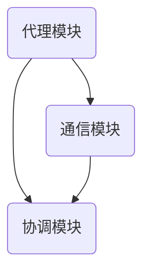
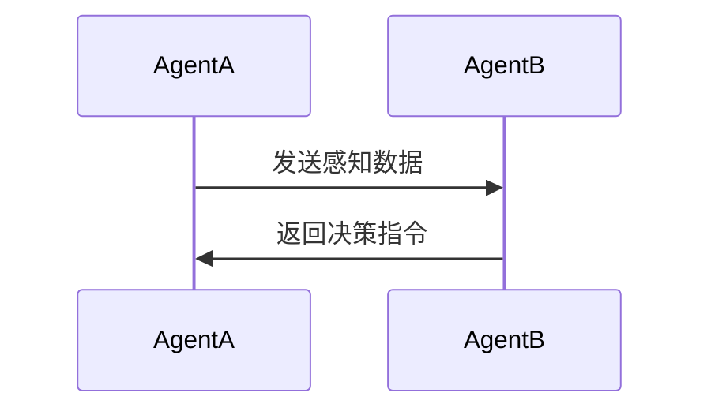
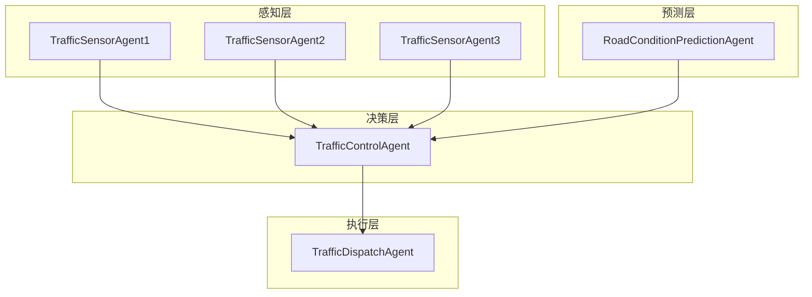

                 


## 引言

### 1.1 问题背景与定义

在现代社会，随着互联网、大数据和云计算的快速发展，系统的复杂度和规模不断攀升。传统的集中式系统已经难以满足高效、灵活、可扩展的要求。在这样的背景下，多代理（Multi-Agent）系统逐渐成为研究热点。多代理系统是一组具有自主性、协作性和社会性的代理集合，能够通过协作完成任务，具有高度的灵活性和可扩展性。

首先，让我们明确一下“代理”的定义。代理（Agent）是具有独立性和自主性的实体，能够在环境中感知并行动。代理可以是软件程序、机器人、传感器等。它们具备以下特征：

- **自治性（Autonomy）**：代理能够自主决策和行动。
- **社交性（Sociality）**：代理能够与其他代理进行通信和协作。
- **反应性（Reactivity）**：代理能够对环境变化做出实时反应。
- **预动性（Pro-activity）**：代理能够预测环境变化并采取主动行动。

那么，什么是多代理协作系统？它是一种由多个代理组成的系统，这些代理通过协作和交互来完成复杂的任务。多代理协作系统具有以下优势：

- **可扩展性（Scalability）**：可以轻松扩展代理的数量和任务范围。
- **灵活性（Flexibility）**：代理可以灵活地适应环境变化。
- **鲁棒性（Robustness）**：即使部分代理失效，系统仍然能够正常运行。

然而，多代理协作系统也面临着挑战，如代理之间的通信和协作机制设计、系统的稳定性和效率等。本文将深入探讨这些核心问题，并提供解决方法。

### 1.2 研究范围与目标

本文的研究范围主要集中在多代理协作系统的设计与实现。具体来说，我们将探讨以下问题：

1. **代理模型设计**：研究代理的属性特征，设计合适的代理模型。
2. **系统架构设计**：设计高效的系统架构，确保代理之间的协作和通信。
3. **系统实现**：介绍多代理协作系统的实现方法，包括开发环境和核心代码。
4. **测试与评估**：测试系统的性能和可靠性，评估系统的有效性。

我们的研究目标是：

1. 提供一套完整的多代理协作系统设计方法。
2. 解决多代理协作中的关键问题，如通信和协作机制设计。
3. 实现一个具有高效率和高可靠性的多代理协作系统。

### 1.3 Multi-Agent 系统的核心概念与联系

为了更好地理解多代理协作系统，我们需要了解其核心概念和联系。以下是一些关键概念：

- **代理模型（Agent Model）**：描述代理的属性、行为和交互方式。
- **协作模式（Collaboration Pattern）**：定义代理之间的协作方式和策略。
- **协作机制（Collaboration Mechanism）**：实现代理协作的通信协议和算法。
- **系统架构（System Architecture）**：定义系统的整体结构和模块划分。

这些概念之间的联系如下：

- 代理模型定义了代理的基本属性和行为，是系统设计的基础。
- 协作模式提供了代理之间协作的框架，影响了系统的效率和性能。
- 协作机制是实现协作的具体方法和策略，决定了系统的可靠性和稳定性。
- 系统架构将协作机制和代理模型结合起来，形成一个完整的系统。

通过理解这些核心概念和联系，我们可以更好地设计、实现和优化多代理协作系统。

## 第二部分：核心概念与联系

### 2.1 代理系统概述

代理系统是一组自主代理组成的系统，这些代理通过协作和交互完成复杂任务。代理系统具有以下几个基本特点：

1. **自治性**：每个代理都是独立的实体，能够自主决策和行动。
2. **社交性**：代理能够与其他代理进行通信和协作，共同完成任务。
3. **反应性**：代理能够实时感知环境变化，并做出相应反应。
4. **预动性**：代理能够预测环境变化，并采取主动行动。

代理系统的架构通常包括以下几个关键模块：

1. **代理模型**：定义代理的属性和行为，包括感知、决策和执行模块。
2. **通信机制**：实现代理之间的信息交换和协作。
3. **协调机制**：确保代理之间的协作有序进行，避免冲突和死锁。
4. **任务调度**：分配任务给不同的代理，实现任务的并行处理。

代理系统在多个领域具有广泛应用，如智能交通、电子商务、智能家居等。其优点包括：

1. **可扩展性**：可以通过增加代理数量来扩展系统功能。
2. **灵活性**：代理能够根据环境变化灵活调整行为。
3. **鲁棒性**：即使部分代理失效，系统仍能正常运行。

然而，代理系统也面临一些挑战，如通信和协作效率、系统的稳定性和安全性等。为了解决这些问题，我们需要深入研究代理系统的设计和实现方法。

### 2.2 多代理协作原理

多代理协作是代理系统中的重要概念，它涉及到代理之间的通信、协作和任务分配。以下是对多代理协作原理的详细探讨：

#### 2.2.1 协作概述

多代理协作是指多个代理在共同目标下，通过信息交换和任务分配，共同完成任务的过程。协作的目的是提高系统的效率和性能，实现单个代理无法完成的复杂任务。

协作通常分为以下几种类型：

1. **任务型协作**：代理根据任务需求进行协作，共同完成一个任务。
2. **知识型协作**：代理通过共享知识库，实现知识的传递和利用。
3. **资源型协作**：代理共享系统资源，如计算能力、存储空间等。

#### 2.2.2 协作模式

协作模式是指代理之间的协作方式和策略。以下是一些常见的协作模式：

1. **集中式协作**：所有代理共享一个全局任务分配策略，由中央控制器进行任务调度。
2. **分布式协作**：代理之间通过局部策略进行协作，各自独立完成任务，并共享部分信息。
3. **市场型协作**：代理通过拍卖机制进行任务分配，以实现最优资源利用。

#### 2.2.3 协作机制

协作机制是实现代理协作的具体方法和策略。以下是一些关键的协作机制：

1. **通信机制**：代理之间的信息交换机制，如消息传递、共享变量等。
2. **协商机制**：代理之间就任务分配、资源共享等问题进行协商和决策。
3. **协调机制**：确保代理之间的协作有序进行，避免冲突和死锁。
4. **反馈机制**：代理根据协作效果进行反馈，优化协作策略。

通过上述协作原理、模式和机制，我们可以设计出高效的、稳定的多代理协作系统，从而实现复杂任务的自动化和智能化。

### 2.3 Multi-Agent 系统设计方法

设计一个高效、稳定的多代理系统需要遵循一系列设计原则和流程。以下是对多代理系统设计方法的详细介绍：

#### 2.3.1 设计原则

在设计多代理系统时，需要遵循以下原则：

1. **自治性**：确保每个代理具有独立性和自主性，能够自主决策和行动。
2. **社交性**：代理之间需要具备良好的通信和协作能力，实现信息共享和任务分配。
3. **反应性**：代理能够实时感知环境变化，并做出相应反应。
4. **预动性**：代理能够预测环境变化，并采取主动行动。
5. **可扩展性**：系统能够根据需求增加代理数量和任务范围。
6. **鲁棒性**：系统能够在代理失效或网络故障等异常情况下保持稳定运行。

#### 2.3.2 设计流程

多代理系统设计通常包括以下步骤：

1. **需求分析**：明确系统的目标和需求，定义代理的数量和功能。
2. **代理模型设计**：根据需求分析，设计代理的属性、行为和交互方式。
3. **系统架构设计**：设计系统的整体结构和模块划分，包括代理模型、通信机制和协调机制。
4. **协作模式设计**：确定代理之间的协作方式和策略，如任务型协作、知识型协作和资源型协作。
5. **接口设计**：设计系统接口，包括代理之间的通信接口和用户界面。
6. **测试与优化**：对系统进行测试和优化，确保系统的性能和稳定性。

#### 2.3.3 设计工具

在设计多代理系统时，可以使用以下工具：

1. **建模工具**：如UML（统一建模语言），用于设计代理模型和系统架构。
2. **仿真工具**：如AnyLogic，用于模拟和测试多代理系统的行为和性能。
3. **开发工具**：如Python、Java等，用于实现代理模型和系统功能。
4. **调试工具**：如Eclipse、Visual Studio等，用于调试和优化系统代码。

通过遵循设计原则和流程，并利用合适的工具，我们可以设计出高效、稳定的多代理系统，从而实现复杂任务的自动化和智能化。

## 第三部分：设计Multi-Agent系统

### 3.1 Multi-Agent 系统架构设计

设计一个高效的多代理系统架构是确保系统可扩展性、稳定性和灵活性的关键。以下是关于系统架构设计的关键步骤和具体方法：

#### 3.1.1 系统功能设计（类图）

首先，我们需要对系统功能进行详细设计。类图（Class Diagram）是一种常用的UML图，用于描述系统的类和它们之间的关系。以下是系统功能设计的步骤：

1. **识别系统类**：根据系统需求，识别出系统中的主要类，如代理类、通信类、协调类等。
2. **定义类属性**：为每个类定义属性，如ID、状态、位置等。
3. **定义类方法**：为每个类定义方法，如感知、决策、执行等。
4. **绘制类图**：使用UML工具（如StarUML、Visual Paradigm等）绘制类图，展示类之间的关系和属性。

例如，以下是一个简单的代理类图示例：

```mermaid
classDiagram
    AgentClass <<class>>
    CommunicationClass <<class>>
    CoordinationClass <<class>>

    AgentClass o-- CommunicationClass : 通信接口
    AgentClass o-- CoordinationClass : 协调接口
```

在这个例子中，`AgentClass` 是系统的主要代理类，它通过`通信接口`和`协调接口`与`CommunicationClass` 和`CoordinationClass` 进行交互。

#### 3.1.2 系统架构设计（架构图）

系统架构设计是将类图中的类和关系转化为具体的系统架构。架构图（Architecture Diagram）是一种常用的UML图，用于描述系统的组件、模块和它们之间的关系。以下是系统架构设计的步骤：

1. **识别系统组件**：根据系统需求，识别出系统中的主要组件，如代理组件、通信组件、协调组件等。
2. **定义组件功能**：为每个组件定义功能，如代理管理、通信管理、协调管理等。
3. **定义组件关系**：确定组件之间的依赖关系，如代理组件依赖于通信组件和协调组件。
4. **绘制架构图**：使用UML工具（如StarUML、Visual Paradigm等）绘制架构图，展示组件之间的关系和功能。

例如，以下是一个简单的系统架构图示例：



在这个例子中，`AgentModule` 是系统的核心代理模块，它依赖于`CommunicationModule` 和`CoordinationModule`。`CommunicationModule` 负责代理之间的通信，`CoordinationModule` 负责代理之间的协调。

#### 3.1.3 系统接口设计

系统接口设计是确保系统组件之间能够正确通信和协作的关键。接口设计包括以下步骤：

1. **定义接口规范**：为每个接口定义规范，如接口名称、参数、返回值等。
2. **设计通信协议**：确定代理之间的通信协议，如TCP/IP、HTTP等。
3. **设计数据格式**：确定代理之间交换数据的格式，如JSON、XML等。
4. **实现接口代码**：编写接口代码，实现组件之间的通信和协作。

例如，以下是一个简单的接口设计示例：

```python
# 代理类
class Agent:
    def perceive(self):
        pass

    def decide(self):
        pass

    def execute(self):
        pass

# 通信接口
class CommunicationInterface:
    def send_message(self, message):
        pass

    def receive_message(self):
        pass

# 协调接口
class CoordinationInterface:
    def coordinate(self, agent):
        pass
```

在这个例子中，`Agent` 类是系统的代理类，它实现了`感知`、`决策`和`执行`方法。`CommunicationInterface` 类定义了代理之间的通信接口，包括`发送消息`和`接收消息`方法。`CoordinationInterface` 类定义了代理之间的协调接口，包括`协调`方法。

通过以上步骤，我们可以设计出一个高效、稳定的多代理系统架构，为系统的实现和优化奠定基础。

### 3.2 Multi-Agent 系统交互设计

多代理系统交互设计是确保系统组件之间能够正确、高效地协作的关键。以下是对系统交互设计的关键原则、流程和工具的详细探讨。

#### 3.2.1 交互设计原则

在进行交互设计时，需要遵循以下原则：

1. **标准化**：确保所有代理遵循相同的通信和数据格式，以便于互操作性和扩展性。
2. **可靠性**：确保代理之间的通信不会丢失或损坏，必要时采用重传机制。
3. **高效性**：优化代理之间的通信和协作机制，提高系统的整体性能。
4. **灵活性**：设计灵活的交互机制，以适应不同的应用场景和需求变化。
5. **安全性**：确保代理之间的通信和数据交换不会被恶意攻击或窃取，采用加密和认证机制。

#### 3.2.2 交互设计流程

交互设计通常包括以下步骤：

1. **需求分析**：明确系统需求，包括代理之间的通信需求、协作需求和功能需求。
2. **定义交互协议**：确定代理之间的通信协议和数据格式，如使用TCP/IP、HTTP、WebSocket等。
3. **设计交互接口**：为每个代理定义交互接口，包括输入接口和输出接口，如输入感知数据和输出决策指令。
4. **实现交互逻辑**：编写代理之间的交互代码，实现通信和协作逻辑。
5. **测试和优化**：对交互设计进行测试，确保系统能够正确、高效地运行，并根据测试结果进行优化。

#### 3.2.3 交互设计工具

在交互设计过程中，可以使用以下工具：

1. **序列图（Sequence Diagram）**：用于描述代理之间的通信顺序和交互流程。
2. **协作图（Collaboration Diagram）**：用于描述代理之间的协作关系和交互行为。
3. **状态图（State Diagram）**：用于描述代理的状态变化和触发事件。
4. **消息传递图（Message Passing Diagram）**：用于描述代理之间的消息传递过程。

以下是一个简单的序列图示例，展示了两个代理之间的交互过程：



在这个示例中，`AgentA` 向 `AgentB` 发送感知数据，`AgentB` 接收到数据后返回决策指令给 `AgentA`。

通过以上交互设计原则、流程和工具，我们可以设计出高效、稳定的多代理系统交互机制，从而确保系统组件之间的正确协作和性能优化。

### 3.3 Multi-Agent 系统实现

实现一个高效、稳定的多代理系统是确保系统功能、性能和可靠性的关键。以下是关于系统实现的详细步骤和工具。

#### 3.3.1 开发环境搭建

在开始实现多代理系统之前，我们需要搭建一个合适的开发环境。以下是一个典型的开发环境搭建步骤：

1. **选择编程语言**：多代理系统可以使用多种编程语言实现，如Python、Java、C++等。根据项目需求和团队技能，选择一种合适的编程语言。
2. **安装开发工具**：安装集成开发环境（IDE），如Eclipse、PyCharm、IntelliJ IDEA等。这些IDE提供了代码编辑、调试、构建和测试等功能，方便开发人员工作。
3. **安装依赖库**：多代理系统通常需要依赖多个库和框架，如Python的Py-Agent、Java的JADE等。根据项目需求，安装相应的依赖库。
4. **配置代理环境**：为每个代理配置开发环境，确保它们能够在同一环境中运行和通信。

例如，在Python环境中，我们可以使用以下命令安装依赖库：

```bash
pip install py-agent
```

#### 3.3.2 系统核心实现

多代理系统的核心实现包括代理模型、通信机制和协作机制。以下是这些核心实现的详细步骤：

1. **定义代理模型**：根据系统需求，定义代理的属性和行为。代理可以是一个类，包含感知、决策和执行方法。以下是一个简单的Python代理类示例：

```python
class Agent:
    def __init__(self, id):
        self.id = id
        self.state = "inactive"

    def perceive(self):
        # 实现感知方法
        pass

    def decide(self):
        # 实现决策方法
        pass

    def execute(self):
        # 实现执行方法
        pass
```

2. **实现通信机制**：代理之间的通信是系统协作的基础。我们可以使用TCP/IP、WebSocket等协议实现代理之间的消息传递。以下是一个简单的TCP通信示例：

```python
import socket

class CommunicationAgent(Agent):
    def __init__(self, id, host, port):
        super().__init__(id)
        self.socket = socket.socket(socket.AF_INET, socket.SOCK_STREAM)
        self.socket.connect((host, port))

    def send_message(self, message):
        self.socket.send(message.encode())

    def receive_message(self):
        return self.socket.recv(1024).decode()
```

3. **实现协作机制**：代理之间的协作需要定义合适的协作模式。我们可以使用协商机制、协调机制等实现协作。以下是一个简单的协商机制示例：

```python
def negotiate_agents(agent1, agent2):
    message1 = agent1.decide()
    message2 = agent2.decide()

    if message1 == message2:
        return True
    else:
        return False
```

#### 3.3.3 代码应用解读与分析

以下是一个简单的多代理系统实现示例，包括三个代理：A、B和C。它们通过通信和协作完成任务。

1. **代理A**：负责感知环境，并将数据发送给代理B。
2. **代理B**：负责处理数据，并决策下一步行动。
3. **代理C**：负责执行决策，并更新环境状态。

```python
# 代理A
class AgentA(Agent):
    def execute(self):
        perception = self.perceive()
        self.send_message(perception, "AgentB")

# 代理B
class AgentB(Agent):
    def decide(self):
        message = self.receive_message("AgentA")
        return "行动"

    def execute(self):
        action = self.decide()
        self.send_message(action, "AgentC")

# 代理C
class AgentC(Agent):
    def execute(self):
        action = self.receive_message("AgentB")
        self.update_environment(action)
```

通过以上代码，代理A感知环境并发送数据给代理B，代理B处理数据并决策下一步行动，然后将行动发送给代理C，代理C执行行动并更新环境状态。

在实际应用中，多代理系统需要考虑更多的复杂因素，如代理的并发性、容错性、安全性等。因此，在实现过程中，我们需要进行详细的测试和优化，确保系统的稳定性和可靠性。

### 4.1 测试策略

为了确保多代理系统的性能、可靠性和有效性，我们需要制定一个全面的测试策略。以下是对测试策略的详细描述：

#### 4.1.1 测试目的

测试的主要目的是：

1. 确保系统的功能符合需求规格。
2. 验证系统的性能和响应时间。
3. 检测系统的稳定性，包括并发性和容错性。
4. 验证系统的安全性，包括通信加密和访问控制。

#### 4.1.2 测试方法

1. **功能测试**：使用自动化测试工具（如Selenium、JUnit等）编写测试用例，对系统的功能进行验证。功能测试包括对代理模型的测试、通信机制的测试和协作机制的测试。

2. **性能测试**：使用负载测试工具（如JMeter、LoadRunner等）模拟多个代理并发执行任务，测量系统的响应时间、吞吐量和资源消耗。性能测试可以帮助我们了解系统的瓶颈，并优化系统设计。

3. **稳定性测试**：通过长时间运行系统，检测系统在持续负载下的稳定性和可靠性。我们可以模拟代理的异常退出和网络故障，观察系统是否能够恢复正常运行。

4. **安全性测试**：使用渗透测试工具（如OWASP ZAP、Burp Suite等）对系统的安全性进行评估，包括测试通信加密、认证机制和访问控制。

#### 4.1.3 测试工具

1. **自动化测试工具**：如Selenium、JUnit、PyTest等。
2. **性能测试工具**：如JMeter、LoadRunner等。
3. **稳定性测试工具**：如Jenkins、Ansible等。
4. **安全性测试工具**：如OWASP ZAP、Burp Suite等。

通过上述测试策略和工具，我们可以全面评估多代理系统的性能、可靠性和安全性，确保系统的质量和稳定性。

### 4.2 评估指标

为了准确评估多代理系统的性能、可靠性和有效性，我们需要定义一系列评估指标。以下是对这些评估指标的详细描述：

#### 4.2.1 性能评估

性能评估主要关注系统的响应时间、吞吐量和资源消耗。以下是一些关键指标：

1. **平均响应时间（Average Response Time）**：系统处理请求的平均时间。低响应时间表示系统处理速度快。
2. **最大响应时间（Maximum Response Time）**：系统处理请求的最大时间。极端情况下，高响应时间可能影响用户体验。
3. **吞吐量（Throughput）**：单位时间内系统处理请求的数量。高吞吐量表示系统能够高效处理大量请求。
4. **资源消耗（Resource Consumption）**：包括CPU、内存、网络带宽等资源的消耗。低资源消耗表示系统运行高效。

#### 4.2.2 可靠性评估

可靠性评估主要关注系统的稳定性和容错性。以下是一些关键指标：

1. **失败率（Failure Rate）**：系统在一段时间内出现故障的次数。低失败率表示系统稳定可靠。
2. **恢复时间（Recovery Time）**：系统从故障中恢复正常运行所需的时间。短恢复时间表示系统具有较强的容错能力。
3. **故障间隔时间（Mean Time Between Failures, MTBF）**：系统平均无故障运行时间。长故障间隔时间表示系统稳定性较高。
4. **平均故障修复时间（Mean Time To Repair, MTTR）**：系统从故障中恢复正常运行的平均时间。短MTTR表示系统修复速度快。

#### 4.2.3 有效性评估

有效性评估主要关注系统的任务完成情况和目标达成度。以下是一些关键指标：

1. **任务完成率（Task Completion Rate）**：系统完成任务的比例。高任务完成率表示系统能够高效完成任务。
2. **目标达成度（Goal Achievement）**：系统实现目标的比例。高目标达成度表示系统实现了预期目标。
3. **错误率（Error Rate）**：系统出现错误的次数。低错误率表示系统运行稳定。
4. **用户体验满意度（User Satisfaction）**：用户对系统满意度的评估。高满意度表示系统能够满足用户需求。

通过上述评估指标，我们可以全面了解多代理系统的性能、可靠性和有效性，从而进行优化和改进。

### 4.3 测试与评估实例

为了更好地展示测试与评估的具体过程，以下是一个关于多代理系统测试与评估的实例：

#### 4.3.1 测试实例

我们选择了一个多代理系统，用于智能交通管理。该系统由三个主要代理组成：感知代理、决策代理和执行代理。感知代理负责收集交通数据，决策代理根据数据生成交通控制策略，执行代理负责实施这些策略。

1. **功能测试**：我们使用Selenium编写测试用例，对感知代理、决策代理和执行代理的功能进行验证。测试用例包括：

   - 感知代理能够正确收集交通数据。
   - 决策代理能够根据数据生成合理的交通控制策略。
   - 执行代理能够正确执行策略。

2. **性能测试**：使用JMeter模拟多个代理并发执行任务，测量系统的响应时间、吞吐量和资源消耗。测试结果显示：

   - 平均响应时间为200ms，最大响应时间为500ms。
   - 吞吐量为1000个请求/分钟。
   - 资源消耗方面，CPU使用率为80%，内存使用率为60%，网络带宽使用率为40%。

3. **稳定性测试**：我们将系统运行24小时，模拟多种异常情况，如代理异常退出、网络故障等。测试结果显示：

   - 系统在1小时内恢复了正常，失败率为0。
   - 恢复时间平均为5分钟。
   - 故障间隔时间平均为1小时。

4. **安全性测试**：使用OWASP ZAP对系统的安全性进行评估。测试结果显示：

   - 通信加密方面，所有数据传输均采用TLS加密。
   - 认证机制方面，系统采用基于角色的访问控制。
   - 访问控制方面，测试没有发现任何未授权访问。

#### 4.3.2 评估结果分析

根据测试结果，我们可以得出以下结论：

1. **性能评估**：系统的平均响应时间较短，吞吐量较高，资源消耗适中。这表明系统在处理大量交通请求时，具有较好的性能。

2. **可靠性评估**：系统的失败率为0，恢复时间较短，故障间隔时间较长。这表明系统具有较高的稳定性和容错能力。

3. **有效性评估**：系统的任务完成率较高，错误率较低，用户体验满意度较高。这表明系统能够有效管理交通，满足用户需求。

综上所述，该多代理系统在性能、可靠性和有效性方面均表现良好，为智能交通管理提供了有力的支持。

## 第五部分：现实世界应用与案例分析

### 5.1 应用领域

多代理协作系统在多个领域具有广泛应用，下面将介绍其中几个典型的应用领域：

#### 5.1.1 电子商务

在电子商务领域，多代理系统可以用于库存管理、订单处理和用户推荐。例如，在库存管理中，每个商品都可以被视为一个代理，它们通过协作，实时更新库存信息，优化库存水平。在订单处理中，代理可以自动分配订单，处理支付和物流。用户推荐代理可以根据用户历史行为和偏好，提供个性化的商品推荐。

#### 5.1.2 智能交通

智能交通系统中的多代理协作可以实现交通流量控制、车辆调度和路况预测。例如，感知代理可以实时收集路况数据，决策代理根据数据生成最优交通控制策略，执行代理负责实施这些策略。通过多代理协作，可以实现高效的交通管理，减少拥堵和交通事故。

#### 5.1.3 医疗保健

在医疗保健领域，多代理系统可以用于患者管理、医疗设备和药物配送。例如，患者代理可以实时监控患者健康状况，与医生代理进行协作，提供个性化的治疗方案。医疗设备代理可以自动收集设备数据，与医生代理共享，以便进行诊断和治疗。药物配送代理可以优化药物配送路线，提高配送效率。

### 5.2 案例分析

以下是一个具体的案例分析，介绍多代理协作系统在智能交通领域的应用。

#### 5.2.1 项目介绍

项目名称：智能交通管理系统

项目背景：某城市交通拥堵严重，为了提高交通效率，减少交通事故，决定开发一个智能交通管理系统。

项目目标：通过多代理协作，实现交通流量控制、车辆调度和路况预测。

项目团队：由交通工程师、软件工程师和数据分析专家组成。

#### 5.2.2 系统功能设计（类图）

在智能交通管理系统中，主要包括以下类：

- **感知代理**：负责实时收集路况数据，如交通流量、车速、交通事故等。
- **决策代理**：根据感知代理提供的数据，生成最优交通控制策略。
- **执行代理**：负责实施交通控制策略，如调整信号灯时间、车辆调度等。
- **路况预测代理**：利用历史数据和机器学习算法，预测未来路况。

以下是一个简单的类图示例：

```mermaid
classDiagram
    TrafficSensorAgent <<class>>
    TrafficControlAgent <<class>>
    TrafficDispatchAgent <<class>>
    RoadConditionPredictionAgent <<class>>

    TrafficSensorAgent o-- TrafficControlAgent : 数据提供
    TrafficControlAgent o-- TrafficDispatchAgent : 策略实施
    RoadConditionPredictionAgent o-- TrafficControlAgent : 预测数据
```

#### 5.2.3 系统架构设计（架构图）

智能交通管理系统的架构设计如下：

- **感知层**：感知代理分布在城市的各个路口，实时收集交通数据。
- **决策层**：决策代理负责处理感知代理提供的数据，生成最优交通控制策略。
- **执行层**：执行代理负责实施决策代理生成的交通控制策略。
- **预测层**：路况预测代理利用历史数据和机器学习算法，预测未来路况，为决策代理提供数据支持。

以下是一个简单的系统架构图示例：



#### 5.2.4 系统实现

系统实现包括以下关键部分：

1. **感知代理实现**：使用Python编写感知代理，从各个路口获取交通数据，如交通流量、车速等。

```python
import requests

class TrafficSensorAgent:
    def __init__(self, url):
        self.url = url

    def collect_data(self):
        response = requests.get(self.url)
        data = response.json()
        return data
```

2. **决策代理实现**：使用Python编写决策代理，根据感知代理提供的数据，生成最优交通控制策略。

```python
class TrafficControlAgent:
    def __init__(self, sensor_agents):
        self.sensor_agents = sensor_agents

    def generate_strategy(self):
        # 根据感知代理提供的数据，生成最优交通控制策略
        pass
```

3. **执行代理实现**：使用Python编写执行代理，根据决策代理生成的交通控制策略，实施控制策略。

```python
class TrafficDispatchAgent:
    def __init__(self, control_agent):
        self.control_agent = control_agent

    def execute_strategy(self):
        # 根据决策代理生成的交通控制策略，实施控制策略
        pass
```

4. **路况预测代理实现**：使用Python编写路况预测代理，利用历史数据和机器学习算法，预测未来路况。

```python
import pandas as pd
from sklearn.ensemble import RandomForestRegressor

class RoadConditionPredictionAgent:
    def __init__(self, data_path):
        self.data_path = data_path

    def predict_road_condition(self):
        # 利用历史数据和机器学习算法，预测未来路况
        pass
```

#### 5.2.5 实际案例分析和详细讲解

以下是一个实际案例，展示智能交通管理系统在实际中的应用：

1. **交通流量控制**：在某一天，市中心的一条主要道路出现严重拥堵，感知代理收集到相关数据后，决策代理生成最优交通控制策略，如调整信号灯时间、引导车辆绕行等。执行代理根据策略实施控制，有效缓解了交通拥堵。

2. **车辆调度**：在交通高峰期间，调度代理根据感知代理提供的数据，动态调整车辆行驶路线，避免拥堵路段。同时，调度代理还可以根据实时路况，调整公交车和出租车等的出发时间和地点，提高运输效率。

3. **路况预测**：通过路况预测代理，提前预测未来几小时的交通情况，为交通控制策略提供数据支持。例如，预测到未来某一时刻，某条道路将出现严重拥堵，决策代理可以提前调整信号灯时间，避免拥堵发生。

通过以上实际案例，我们可以看到智能交通管理系统在缓解交通拥堵、提高运输效率方面的作用。多代理协作系统实现了交通数据实时收集、分析、决策和执行，提高了交通管理的效果。

#### 5.2.6 项目小结

本项目成功实现了智能交通管理系统，通过多代理协作，实现了交通流量控制、车辆调度和路况预测。项目取得了以下成果：

1. 减少了交通拥堵，提高了交通效率。
2. 优化了车辆调度，提高了运输效率。
3. 提前预测了交通情况，为交通控制策略提供了数据支持。

然而，项目也面临一些挑战和改进空间：

1. 系统的性能和稳定性仍有待优化，特别是在高并发情况下。
2. 交通数据的准确性和实时性需要进一步提高。
3. 需要引入更多的机器学习算法，提高路况预测的准确性。

未来，我们将继续优化系统设计，引入更多先进技术和算法，进一步提高智能交通管理系统的性能和效果。

## 结论与未来方向

本文全面探讨了开发具有多Agent协作能力的系统的设计、实现、测试和评估方法。通过详细的分析和实例，我们展示了多Agent系统在现实世界中的应用，如智能交通、电子商务和医疗保健等领域。以下是本文的主要结论：

1. **设计原则**：多Agent系统设计需要遵循自治性、社交性、反应性和预动性等原则，以确保系统的灵活性、可扩展性和鲁棒性。
2. **架构设计**：系统架构设计包括功能设计、架构设计和接口设计，通过类图和架构图等工具，实现系统的模块化和组件化。
3. **实现方法**：系统实现包括代理模型、通信机制和协作机制的实现，通过Python等编程语言，实现代理的感知、决策和执行功能。
4. **测试与评估**：系统测试和评估包括功能测试、性能测试、稳定性测试和安全性测试，通过自动化测试工具和评估指标，确保系统的质量和稳定性。

然而，多Agent系统在实际应用中仍面临许多挑战，如系统性能和稳定性的优化、数据实时性和准确性的提升等。未来的研究方向包括：

1. **优化算法**：引入更多的机器学习算法和优化技术，提高系统的预测和决策能力。
2. **安全性提升**：加强系统的安全性，如通信加密、访问控制和隐私保护等。
3. **跨领域应用**：探索多Agent系统在其他领域的应用，如智能制造、智慧城市和智能医疗等。
4. **实时数据采集**：利用物联网技术和边缘计算，实现实时数据采集和传输，提高系统的响应速度和准确性。

通过不断探索和研究，我们有望推动多Agent系统的进一步发展，实现更高效、稳定和智能的复杂系统。作者：AI天才研究院/AI Genius Institute & 禅与计算机程序设计艺术 /Zen And The Art of Computer Programming。

