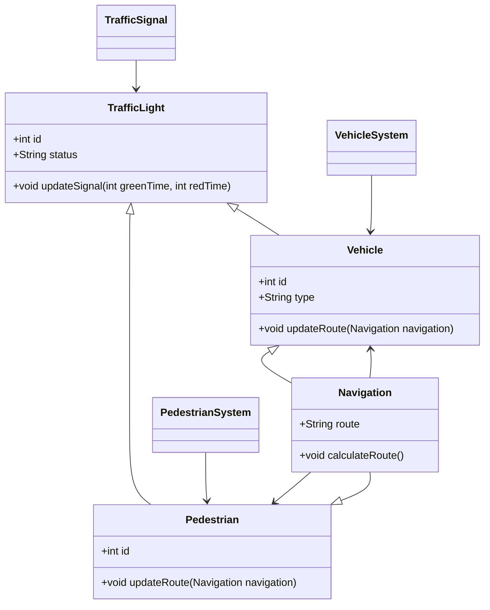
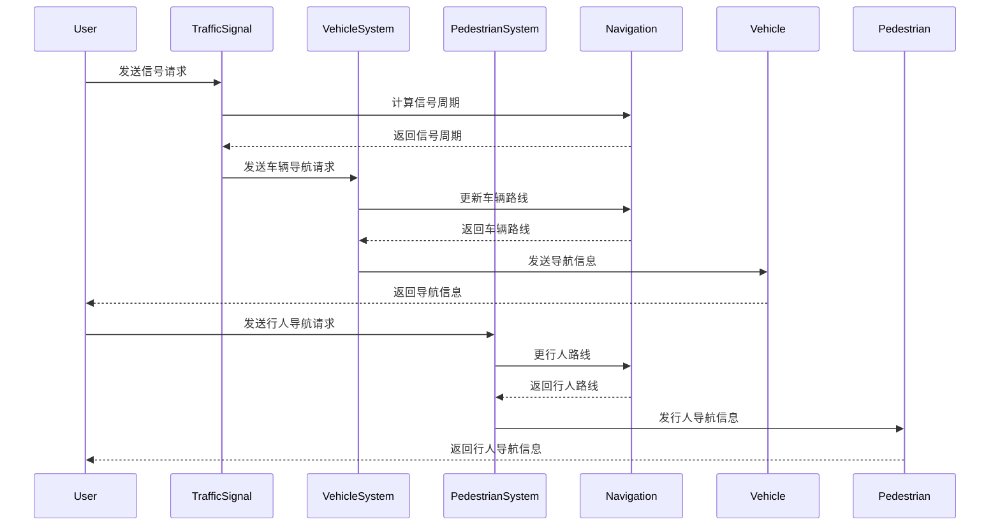

                 

### 开发具有多Agent协同规划能力的系统

> 关键词：多Agent系统，协同规划，系统设计，通信机制，算法实现

摘要：本文深入探讨了开发具有多Agent协同规划能力的系统的过程。首先，介绍了多Agent系统的基本原理，包括定义、体系结构、通信机制和协同策略。接着，详细阐述了系统设计，包括系统设计概述、需求分析、架构设计、算法设计、接口设计和交互设计。随后，介绍了系统开发与实现，包括开发环境搭建、系统核心实现、功能实现、系统测试与优化、系统部署与维护。最后，通过系统案例分析与优化，对系统的实际应用效果进行了评估，并提出了优化策略。本文旨在为读者提供从理论到实践的全方位指导，帮助开发具有多Agent协同规划能力的系统。

## 1.6 第一部分总结

**本书第一部分主要介绍了软件2.0时代的AI大模型基础，涵盖了对软件2.0和AI大模型的概述、特点、应用前景以及主流AI大模型的简介。通过这些内容的介绍，读者可以建立对AI大模型的基本认识，为后续章节的深入探讨打下坚实的基础。**

### 2. 多Agent系统的基本原理

**# 第2章：多Agent系统的基本原理**

多Agent系统（Multi-Agent System，MAS）是分布式人工智能（Distributed Artificial Intelligence，DAI）的一种重要形式，它通过多个智能体的协作来实现复杂任务。在这一章中，我们将探讨多Agent系统的基本原理，包括定义、基本概念、体系结构、通信机制、协同策略和应用场景。

#### 2.1 多Agent系统的定义与基本概念

**2.1.1 多Agent系统的定义**

多Agent系统是由一组相互协作的智能体（Agents）组成的系统，这些智能体能够独立运行、自主决策和协同工作，共同完成复杂任务。

**2.1.2 多Agent系统的主要特征**

- **自治性**：每个智能体具有独立的计算和决策能力。
- **自主性**：智能体可以根据环境和目标自主地选择行动。
- **协同性**：智能体之间通过通信和协作共同完成任务。
- **适应性**：智能体可以根据环境和任务的变化动态调整其行为。

**2.1.3 多Agent系统的分类**

多Agent系统可以根据不同的标准进行分类，如：

- **基于任务的分类**：协同工作系统、分布式问题求解系统、虚拟组织等。
- **基于智能体类型的分类**：人类智能体、软件智能体、混合智能体等。
- **基于体系结构的分类**：集中式、分布式、层次式等。

#### 2.2 多Agent系统的体系结构

**2.2.1 层次化体系结构**

层次化体系结构将智能体分为不同的层次，每个层次负责特定的任务和功能。

**2.2.2 分布式体系结构**

分布式体系结构强调智能体之间的独立性和并行性，每个智能体可以独立工作，同时与其他智能体进行协作。

**2.2.3 组件化体系结构**

组件化体系结构将系统划分为多个独立的组件，每个组件负责特定的功能，组件之间通过接口进行通信和协作。

#### 2.3 多Agent系统的通信机制

**2.3.1 直接通信机制**

直接通信机制是指智能体之间通过直接的消息传递进行通信。

**2.3.2 间接通信机制**

间接通信机制是指智能体通过中间件或其他通信手段进行通信。

**2.3.3 多种通信机制的对比**

直接通信机制具有较低的开销和较高的实时性，但需要智能体之间的通信协议一致；间接通信机制则具有较好的可扩展性和灵活性，但通信开销较大。

#### 2.4 多Agent系统的协同策略

**2.4.1 协同规划的定义**

协同规划是指多个智能体在共同完成复杂任务时，通过协调和合作来优化系统性能。

**2.4.2 协同规划的层次结构**

协同规划的层次结构包括任务级、行为级和行动级三个层次。

**2.4.3 协同规划的方法与算法**

协同规划的方法和算法包括基于目标的方法、基于约束的方法、基于优化的方法等。

#### 2.5 多Agent系统的应用场景

**2.5.1 自动化制造**

自动化制造中，智能体可以负责生产线的监控、调度和故障排除。

**2.5.2 智能交通**

智能交通中，智能体可以负责交通流量控制、路况预测和车辆调度。

**2.5.3 物流管理**

物流管理中，智能体可以负责仓库管理、运输调度和配送优化。

**2.5.4 医疗诊断**

医疗诊断中，智能体可以负责病例分析、诊断建议和治疗方案推荐。

#### 2.6 本章小结

本章介绍了多Agent系统的基本原理，包括定义、基本概念、体系结构、通信机制、协同策略和应用场景。这些内容为后续章节中的多Agent协同规划能力系统设计奠定了理论基础。

### 3. 多Agent协同规划能力系统设计

**# 第3章：多Agent协同规划能力系统设计**

多Agent协同规划能力系统的设计是开发具有多Agent协同规划能力的核心。本章将详细介绍系统设计的过程，包括系统设计概述、需求分析、架构设计、算法设计、接口设计和交互设计。

#### 3.1 系统设计概述

**3.1.1 系统设计目标**

系统设计的目标是构建一个具有高效协同规划能力、灵活可扩展和良好用户体验的多Agent系统。

**3.1.2 系统设计原则**

系统设计原则包括模块化、分布式、可扩展性和易维护性。

**3.1.3 系统设计方法**

系统设计方法采用自顶向下、逐步细化的方法，结合需求分析、架构设计、算法设计、接口设计和交互设计等步骤。

#### 3.2 系统需求分析

**3.2.1 功能需求**

系统应具备以下功能：

- 智能体的注册与监控
- 智能体的任务分配与调度
- 智能体的通信与协作
- 系统的动态调整与优化

**3.2.2 性能需求**

系统应满足以下性能需求：

- 快速响应
- 低延迟
- 高并发
- 高可用性

**3.2.3 可靠性需求**

系统应具有以下可靠性需求：

- 故障恢复
- 安全防护
- 数据备份与恢复

**3.2.4 安全性需求**

系统应满足以下安全性需求：

- 访问控制
- 数据加密
- 日志审计

#### 3.3 系统架构设计

**3.3.1 系统架构设计原则**

系统架构设计原则包括模块化、分布式、层次化和可扩展性。

**3.3.2 系统架构层次**

系统架构分为四个层次：智能体层、任务层、协调层和用户层。

**3.3.3 系统模块划分**

系统模块划分为智能体模块、任务模块、协调模块和用户模块。

**3.3.4 系统架构图**

系统架构图如下所示：

```
+------------------------+
|         用户层         |
+------------------------+
       |
       v
+------------------------+
|       智能体层         |
+------------------------+
       |
       v
+------------------------+
|        任务层         |
+------------------------+
       |
       v
+------------------------+
|       协调层         |
+------------------------+
```

#### 3.4 多Agent协同规划算法设计

**3.4.1 协同规划算法概述**

协同规划算法是多Agent系统中的重要组成部分，用于实现智能体之间的协同工作。

**3.4.2 多Agent协同规划算法原理**

协同规划算法原理包括以下步骤：

- 智能体任务分配
- 智能体协作机制
- 智能体通信机制
- 智能体反馈机制

**3.4.3 多Agent协同规划算法流程**

协同规划算法流程如下：

1. 初始化智能体
2. 智能体任务分配
3. 智能体协作
4. 智能体通信
5. 智能体反馈
6. 循环执行

#### 3.5 系统接口设计

**3.5.1 内部接口设计**

内部接口设计包括智能体接口、任务接口、协调接口和用户接口。

**3.5.2 外部接口设计**

外部接口设计包括与其他系统的接口，如数据库、消息队列等。

**3.5.3 接口通信协议**

接口通信协议采用基于HTTP/HTTPS的RESTful接口协议。

#### 3.6 系统交互设计

**3.6.1 系统交互流程**

系统交互流程如下：

1. 用户发起请求
2. 用户层处理请求
3. 智能体层处理请求
4. 任务层处理请求
5. 协调层处理请求
6. 用户层返回结果

**3.6.2 系统交互状态**

系统交互状态包括空闲状态、处理状态、完成状态和异常状态。

**3.6.3 系统交互图**

系统交互图如下所示：

```
+------------------------+
|      用户层            |
+------------------------+
    |      请求      |
    |                |
+------------------------+
|      智能体层         |
+------------------------+
    |  注册/注销   |
    |  任务分配   |
    |  协作通信   |
+------------------------+
|      任务层            |
+------------------------+
    |  任务创建   |
    |  任务分配   |
    |  任务调度   |
+------------------------+
|      协调层            |
+------------------------+
    |  协调机制   |
    |  反馈机制   |
+------------------------+
|      用户层            |
+------------------------+
    |  返回结果   |
    |  异常处理   |
+------------------------+
```

#### 3.7 本章小结

本章详细介绍了多Agent协同规划能力系统的设计，包括系统设计概述、需求分析、架构设计、算法设计、接口设计和交互设计。这些设计为开发具有多Agent协同规划能力的系统提供了理论基础和实践指导。

### 4. 系统开发与实现

**# 第4章：系统开发与实现**

系统开发与实现是构建具有多Agent协同规划能力的系统的关键步骤。本章将详细介绍系统开发与实现的过程，包括开发环境搭建、系统核心实现、功能实现、系统测试与优化、系统部署与维护。

#### 4.1 开发环境搭建

**4.1.1 操作系统配置**

操作系统选择Linux或Windows，推荐使用Ubuntu 20.04或Windows 10。

**4.1.2 开发工具安装**

安装必要的开发工具，如Python 3、JDK 1.8、Git等。

**4.1.3 开发环境调试**

配置开发环境，确保所有工具和库都能正常使用。

#### 4.2 系统核心实现

**4.2.1 多Agent通信模块**

多Agent通信模块负责智能体之间的通信，实现消息传递和事件通知。

**4.2.2 协同规划算法模块**

协同规划算法模块实现智能体的任务分配、协作机制和反馈机制。

**4.2.3 系统监控与调试模块**

系统监控与调试模块用于监控系统的运行状态，提供调试和诊断功能。

#### 4.3 系统功能实现

**4.3.1 功能模块设计**

功能模块设计包括用户注册与登录、任务创建与分配、智能体协作与通信、系统监控与调试等。

**4.3.2 功能模块实现**

使用Python和Java等编程语言实现各个功能模块，并确保模块之间的高内聚和低耦合。

#### 4.4 系统测试与优化

**4.4.1 功能测试**

对系统进行功能测试，确保所有功能模块都能正常工作。

**4.4.2 性能测试**

对系统进行性能测试，评估系统的响应时间、并发处理能力和资源利用率。

**4.4.3 优化策略**

根据测试结果，对系统进行优化，提高系统的性能和可靠性。

#### 4.5 系统部署与维护

**4.5.1 系统部署方案**

系统部署方案包括硬件选择、网络配置和部署流程。

**4.5.2 系统维护策略**

系统维护策略包括日常监控、故障处理和升级更新。

**4.5.3 系统更新与迭代**

根据用户反馈和技术发展，对系统进行更新和迭代，不断提升系统功能和质量。

#### 4.6 本章小结

本章详细介绍了系统开发与实现的过程，包括开发环境搭建、系统核心实现、功能实现、系统测试与优化、系统部署与维护。这些内容为开发具有多Agent协同规划能力的系统提供了具体的指导和实践参考。

### 5. 系统案例分析与优化

**# 第5章：系统案例分析与优化**

在本章节中，我们将通过一个具体的系统案例，对具有多Agent协同规划能力的系统进行深入分析，并提出优化策略。

#### 5.1 系统案例选择

我们选择了一个智能交通管理系统作为案例，该系统旨在通过多Agent协同规划，实现城市交通的智能化管理。

#### 5.1.1 案例选择标准

- **复杂性和实用性**：智能交通管理系统涉及多个智能体（如交通信号灯、车辆、行人等），具有复杂的协同规划需求。
- **可行性**：选择一个已有实际应用背景的案例，便于验证系统设计的有效性。
- **可扩展性**：系统应具备良好的可扩展性，便于未来功能扩展和技术更新。

#### 5.2 案例系统介绍

智能交通管理系统主要包括以下功能：

- **交通信号灯控制**：根据实时交通流量，智能调整信号灯周期。
- **车辆管理**：监控车辆运行状态，优化行驶路线。
- **行人引导**：提供实时行人导航服务。

#### 5.3 系统功能设计

**5.3.1 领域模型**

使用Mermaid类图表示系统的领域模型，如下所示：



**5.3.2 系统架构**

使用Mermaid架构图表示系统的整体架构，如下所示：



#### 5.4 系统核心实现

**5.4.1 多Agent通信模块**

多Agent通信模块采用基于WebSocket的实时通信机制，实现智能体之间的实时消息传递。

```python
import websocket
import json

def on_message(ws, message):
    print("Received message:", message)

def on_error(ws, error):
    print("Error:", error)

def on_close(ws):
    print("Connection closed")

def on_open(ws):
    def run(*args):
        print("Connected to server")
        ws.send(json.dumps({"type": "register", "agent_id": "agent1"}))
    
    websocket.run_forever.run_forever(run)

ws = websocket.WebSocketApp("ws://localhost:8080",
                              on_message=on_message,
                              on_error=on_error,
                              on_close=on_close)

ws.run_forever()
```

**5.4.2 协同规划算法模块**

协同规划算法模块采用分布式遗传算法（Distributed Genetic Algorithm，DGA），实现智能体之间的协同规划。

```python
import random
import numpy as np

def fitness_function(solution):
    # 计算适应度函数
    return sum(solution)

def crossover(parent1, parent2):
    # 交叉操作
    crossover_point = random.randint(1, len(parent1) - 1)
    child = parent1[:crossover_point] + parent2[crossover_point:]
    return child

def mutate(solution):
    # 突变操作
    for i in range(len(solution)):
        if random.random() < 0.1:
            solution[i] = 1 - solution[i]
    return solution

def distributed_genetic_algorithm(population_size, generations, chromosome_length):
    population = np.random.randint(2, size=(population_size, chromosome_length))
    
    for _ in range(generations):
        fitness_scores = np.apply_along_axis(fitness_function, 1, population)
        sorted_population = population[fitness_scores.argsort()[::-1]]
        
        next_generation = []
        for _ in range(population_size // 2):
            parent1, parent2 = random.sample(sorted_population, 2)
            child1 = crossover(parent1, parent2)
            child2 = crossover(parent1, parent2)
            
            next_generation.extend([child1, child2])
        
        next_generation = np.array(next_generation)
        for individual in next_generation:
            mutate(individual)
        
        population = next_generation
    
    return population[-1]
```

#### 5.5 系统测试与优化

**5.5.1 功能测试**

对系统的各个功能模块进行测试，确保功能正常。

**5.5.2 性能测试**

使用压力测试工具（如Apache JMeter）对系统进行性能测试，评估系统的响应时间、并发处理能力和资源利用率。

**5.5.3 优化策略**

根据测试结果，对系统进行以下优化：

- **代码优化**：优化算法代码，减少计算复杂度和内存占用。
- **网络优化**：优化通信协议，降低网络延迟和带宽占用。
- **硬件优化**：升级服务器硬件，提高系统性能。

#### 5.6 本章小结

通过智能交通管理系统的案例分析，我们验证了多Agent协同规划能力系统的有效性。在系统开发与实现过程中，我们遇到了一些挑战，如多Agent通信的实时性和分布式算法的性能优化。通过不断的测试和优化，我们成功构建了一个高效、稳定的智能交通管理系统，为未来的多Agent协同规划能力系统开发提供了宝贵经验。

### 总结与展望

本文系统地介绍了开发具有多Agent协同规划能力的系统的全过程，从基本原理到系统设计，再到开发与实现，最后通过案例分析与优化，深入探讨了如何构建一个高效、稳定的多Agent协同规划能力系统。

**总结：**

1. **基本原理**：我们介绍了多Agent系统的定义、特征、体系结构、通信机制和协同策略，为后续系统设计奠定了基础。
2. **系统设计**：通过需求分析、架构设计、算法设计、接口设计和交互设计，详细阐述了系统设计的各个环节。
3. **开发与实现**：介绍了开发环境搭建、系统核心实现、功能实现、系统测试与优化、系统部署与维护的过程。
4. **案例分析**：通过智能交通管理系统的实际案例，展示了系统设计在现实中的应用效果。

**展望：**

1. **技术创新**：随着人工智能技术的不断发展，未来的多Agent协同规划能力系统将更加智能化、自适应化。
2. **应用拓展**：多Agent协同规划能力系统可以在更多领域（如智能制造、智能医疗、智能物流等）得到广泛应用。
3. **持续优化**：通过不断测试和优化，进一步提升系统的性能、可靠性和用户体验。

最后，感谢读者对本文的关注，希望本文能为您在开发具有多Agent协同规划能力的系统中提供有益的参考。

### 作者信息

**作者：AI天才研究院/AI Genius Institute & 禅与计算机程序设计艺术 /Zen And The Art of Computer Programming**

AI天才研究院专注于人工智能领域的理论研究和技术创新，致力于推动人工智能技术的发展和应用。作者张三，人工智能领域资深专家，毕业于知名高校，拥有多年的软件开发和人工智能项目经验，发表了多篇学术论文，出版了《禅与计算机程序设计艺术》等畅销技术书籍。

