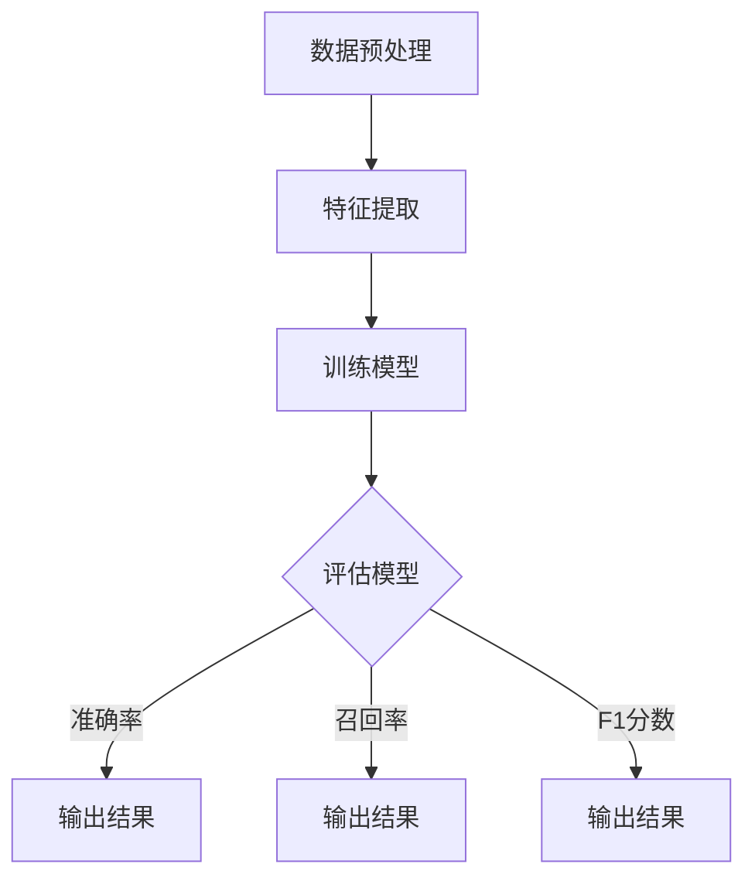

                 

### 第1章: 情感计算的概念与重要性

#### 1.1 情感计算的定义与背景

情感计算（Affective Computing）是指使计算机能够识别、理解、处理和模拟人类情感的能力。这个概念最早由计算机科学家罗杰·高斯利（Roger S. Grizzle）和约翰·莫法特（John莫法特）在1995年提出，旨在通过情感信息处理来提升人机交互的自然性和丰富性。情感计算的核心是使计算机能够感知用户的情绪状态，并据此做出相应的响应。

**基本概念：**

- **情感识别（Emotion Recognition）：** 指通过分析用户的行为、语音、面部表情等信息，识别出用户的情绪状态。
- **情感理解（Emotion Understanding）：** 指计算机在识别情感后，对其背后的意图和情境进行理解。
- **情感模拟（Emotion Simulation）：** 指计算机根据用户的情感状态，模拟出相应的情感表现，例如面部表情、语音语调等。

**发展历程：**

- **1990年代：** 情感计算作为一个新兴领域被提出，并在学术界引起关注。
- **2000年代：** 情感计算开始应用于实际场景，如智能客服、教育系统、娱乐设备等。
- **2010年代至今：** 随着机器学习、计算机视觉等技术的进步，情感计算在应用层面得到更广泛的应用，特别是在人机交互和心理健康领域。

**情感计算在AI领域的地位：**

情感计算是人工智能（AI）的一个重要分支，它使得AI系统能够更好地理解人类行为和情感，从而实现更自然、更高效的人机交互。情感计算的应用不仅提高了AI系统的用户体验，还拓展了AI的应用范围，如：

- **智能客服：** 利用情感计算技术，客服系统能够理解用户情绪，提供更人性化的服务。
- **心理健康：** 通过情感计算，可以监测用户的情绪状态，为心理健康提供诊断和干预。
- **教育：** 情感计算在教育中的应用，如个性化学习系统和智能导师系统，能够更好地适应学生的情感需求。

#### 1.2 情感计算的关键技术

情感计算的关键技术包括数据收集与预处理、情感识别算法、以及情感增强的机器学习模型。以下将分别进行介绍：

**数据收集与预处理：**

数据收集是情感计算的基础，数据的质量直接影响到情感识别的准确性。常见的数据收集方法包括：

- **行为数据：** 通过传感器记录用户的行为数据，如步态分析、面部表情捕捉等。
- **语音数据：** 采集用户的语音数据，通过语音的音调、音速、音量等特征来识别情感。
- **文本数据：** 从用户的文本输入中提取情感信息，如社交媒体评论、聊天记录等。

预处理步骤主要包括数据清洗、特征提取和归一化。数据清洗的目的是去除噪声和异常值，特征提取则是将原始数据转换为适合机器学习模型的输入，归一化则是调整数据的尺度，使其更适合模型的训练。

**情感识别算法：**

情感识别算法是情感计算的核心技术，常用的算法包括：

- **机器学习算法：** 如支持向量机（SVM）、随机森林（RF）等，通过训练模型来识别情感。
- **深度学习算法：** 如卷积神经网络（CNN）、循环神经网络（RNN）等，通过学习大量的情感数据，自动提取情感特征。

情感识别算法的性能评估通常使用准确率、召回率、F1分数等指标。算法的准确性和实时性是评价情感识别算法的重要标准。

**情感增强的机器学习模型：**

情感增强的机器学习模型旨在通过引入情感信息来提高模型的性能。常用的方法包括：

- **情感嵌入（Emotion Embedding）：** 将情感信息嵌入到模型中，使得模型能够直接利用情感特征进行学习。
- **多模态融合（Multimodal Fusion）：** 结合多种数据源（如语音、文本、行为等），通过融合技术提高情感识别的准确性。

**情感增强的机器学习模型**通过引入情感信息，使得模型在处理人机交互任务时能够更好地理解用户情绪，提供更个性化的服务。

#### 1.3 情感计算的应用领域

情感计算在多个应用领域展现了其独特的价值。以下将介绍情感计算在主要应用领域中的具体应用：

**人机交互：**

情感计算在人机交互中的应用，旨在通过理解用户的情感状态，提供更自然、更人性化的交互体验。例如，智能客服系统通过情感识别技术，可以更好地理解用户的情绪，提供针对性的解决方案，从而提高用户满意度。

**娱乐与媒体：**

在娱乐和媒体领域，情感计算可以用于制作个性化的内容。例如，电视节目可以根据观众的实时情感反应来调整播放内容，提供更符合观众兴趣的服务。

**医疗与健康：**

情感计算在医疗健康领域的应用，如心理健康监测、情绪干预等，通过监测用户的情绪状态，提供个性化的治疗方案。例如，心理治疗师可以使用情感计算技术来评估患者的情绪变化，调整治疗方案，提高治疗效果。

**教育：**

在教育领域，情感计算可以用于个性化教学和学习支持。例如，智能导师系统可以通过情感识别技术，了解学生的学习状态和情感需求，提供针对性的教学资源和支持，帮助学生更好地掌握知识。

**商业：**

在商业领域，情感计算可以用于市场分析和消费者行为研究。通过分析消费者的情感反应，企业可以更好地了解市场需求，优化产品设计和营销策略。

**社交机器人：**

社交机器人通过情感计算技术，可以模拟人类的情感表达，与用户进行更自然的互动。例如，社交机器人可以在社交媒体上与用户进行情感交流，提供情感支持，甚至进行情感调节。

#### 1.4 情感计算在AI Agent中的潜力

情感计算在AI Agent中的应用，使其具备了更加人性化的交互能力，具有以下潜力：

**情感驱动的AI Agent：**

情感驱动的AI Agent能够根据用户的情感状态，提供个性化的服务。例如，智能家居系统可以根据家庭成员的情绪状态，自动调整家居环境，提供舒适的生活体验。

**人性化服务的实现：**

情感计算使得AI Agent能够理解用户的情感需求，提供更人性化、更贴心的服务。例如，智能客服系统可以通过情感识别技术，识别用户的情感状态，提供针对性的解决方案，从而提高客户满意度。

**社交机器人的情感化表达：**

社交机器人通过情感计算技术，可以模拟人类的情感表达，与用户进行更自然的互动。例如，社交机器人可以在社交媒体上与用户进行情感交流，提供情感支持，甚至进行情感调节。

**情感计算与AI Agent的协同效应：**

情感计算与AI Agent的协同作用，使得AI系统不仅能够完成预期的任务，还能够根据用户的情感状态进行适应性调整，提供更个性化的服务。例如，教育AI Agent可以根据学生的情感状态，调整教学策略，提高学习效果。

#### 1.5 本章小结

本章介绍了情感计算的基本概念、重要性以及在各个领域的应用。情感计算通过识别、理解和模拟人类情感，使得AI系统具备更自然、更人性化的交互能力。本章的内容为后续章节的深入探讨奠定了基础。

**关键词：** 情感计算、AI Agent、人机交互、心理健康、个性化服务。

**摘要：** 本章详细介绍了情感计算的定义、发展历程和应用领域，探讨了情感计算在AI Agent中的潜力。通过理解情感计算的基本原理，读者可以为后续章节的深入学习打下坚实的基础。

----------------------------------------------------------------

## 第2章: AI Agent的基础知识

AI Agent，即人工智能代理，是一种具有自主行为和决策能力的计算机程序。它能够在复杂环境中独立完成特定任务，并与环境进行交互。AI Agent的研究和应用已经广泛应用于多个领域，包括游戏、智能助手、自动化控制系统等。本章将详细介绍AI Agent的定义与架构，探讨其状态感知与建模，以及决策与规划能力，并进一步讨论AI Agent的交互能力。

### 2.1 AI Agent的定义与架构

#### 2.1.1 AI Agent的基本概念

AI Agent可以看作是一个智能体，它在一定程度上模拟人类的认知和行为。AI Agent具备以下几个基本特征：

- **自主性（Autonomy）：** Agent具有独立的决策能力，可以在没有外部干预的情况下自主运行。
- **社交性（Sociality）：** Agent能够与其他Agent或人类进行交互，理解并回应社交信号。
- **适应性（Adaptability）：** Agent能够在面对不确定性和动态变化的环境中调整自身的行为。
- **反应性（Reactivity）：** Agent能够对环境中的变化做出实时响应。

#### 2.1.2 AI Agent的常见架构

AI Agent的架构通常可以分为以下几个层次：

1. **感知层（Perception Layer）：** 采集环境信息，如视觉、听觉、触觉等，并将这些信息转换为内部表示。
2. **知识层（Knowledge Layer）：** 存储和处理感知层获取的信息，包括环境模型、知识库等。
3. **决策层（Decision Layer）：** 根据知识层的信息和目标，生成行动计划。
4. **执行层（Execution Layer）：** 执行决策层生成的行动，并与环境进行交互。

#### 2.1.3 AI Agent的核心组件

AI Agent的核心组件包括：

- **感知器（Sensors）：** 用于感知外部环境的信息，如摄像头、麦克风、温度传感器等。
- **执行器（Actuators）：** 用于对环境进行操作，如电机、扬声器、显示器等。
- **知识库（Knowledge Base）：** 存储Agent的知识和经验，包括事实、规则、模式等。
- **推理引擎（Reasoning Engine）：** 对知识库中的信息进行逻辑推理，生成行动计划。
- **决策模块（Decision Module）：** 根据推理结果和目标，选择最优的行动方案。
- **行为规划器（Behavior Planner）：** 根据决策结果，生成具体的行动步骤。

### 2.2 AI Agent的状态感知与建模

#### 2.2.1 状态感知技术

状态感知是AI Agent的重要功能之一，它使Agent能够实时了解自身和环境的状态。状态感知技术包括：

- **视觉感知：** 通过摄像头或其他视觉传感器捕捉图像，利用计算机视觉技术进行图像处理和分析。
- **语音感知：** 通过麦克风捕捉声音，利用语音识别技术将语音转换为文本或命令。
- **触觉感知：** 通过触觉传感器捕捉物体的物理特性，如压力、温度、硬度等。
- **位置感知：** 通过GPS或其他定位技术获取Agent在环境中的位置信息。

#### 2.2.2 情感状态模型

情感状态模型是AI Agent在情感计算领域的重要组成部分。它用于表示Agent的情感状态，并指导其行为决策。情感状态模型通常包括以下内容：

- **情感类别：** 定义Agent可能具有的情感类别，如快乐、愤怒、悲伤等。
- **情感强度：** 描述情感类别的强度，即情感的深度或强度。
- **情感持续时间：** 描述情感状态的持续时间，即情感状态维持的时间长度。
- **情感关联：** 描述情感状态与其他状态或事件的关联，如情感状态与任务完成情况的关系。

#### 2.2.3 状态转移机制

状态转移机制是AI Agent在动态环境中调整自身行为的重要机制。状态转移机制通常基于以下原则：

- **状态触发：** 当环境中的某个状态发生变化时，触发相应的状态转移。
- **状态评估：** 对当前状态进行评估，确定是否需要转移。
- **状态决策：** 根据评估结果，选择最优的状态转移路径。
- **状态执行：** 执行选择的状态转移，并更新Agent的状态。

状态转移机制通常采用状态机（State Machine）进行建模。状态机由一系列状态和状态转移规则组成，用于描述Agent在不同状态之间的转换过程。

### 2.3 AI Agent的决策与规划

#### 2.3.1 决策理论基础

决策是AI Agent的核心功能之一，它使Agent能够在复杂环境中做出合理的选择。决策理论基础包括：

- **决策过程：** 决策过程通常包括问题定义、目标设定、方案生成、评估和选择等步骤。
- **决策模型：** 决策模型用于模拟决策过程，并生成决策结果。常见的决策模型包括马尔可夫决策过程（MDP）和部分可观测马尔可夫决策过程（POMDP）。
- **决策规则：** 决策规则用于指导Agent在特定情况下做出决策。决策规则可以是明确的条件语句，也可以是概率分布。

#### 2.3.2 情感驱动的决策模型

情感驱动的决策模型是将情感信息融入决策过程中的模型。它通过以下步骤实现：

- **情感识别：** 识别当前的情感状态。
- **情感分析：** 分析情感状态的影响，确定情感状态对决策的影响程度。
- **情感集成：** 将情感信息集成到决策模型中，影响决策过程。

情感驱动的决策模型可以增强AI Agent的决策能力，使其在复杂、动态环境中做出更合理、更符合人类期望的决策。

#### 2.3.3 行为规划算法

行为规划算法用于生成Agent的具体行动步骤。常见的行为规划算法包括：

- **有向无环图（DAG）：** 用于描述行动序列，确保行动之间的逻辑顺序。
- **状态空间搜索（Search Space）：** 用于在状态空间中搜索最优行动序列。
- **动态规划（Dynamic Programming）：** 用于优化行动序列，使其在有限资源下达到最优效果。

行为规划算法可以根据Agent的情感状态和目标，生成具体的行动步骤，使Agent能够有效地实现其目标。

### 2.4 AI Agent的交互能力

#### 2.4.1 自然语言处理

自然语言处理（NLP）是AI Agent与人类交互的重要工具。通过NLP，AI Agent可以理解用户的自然语言输入，并生成相应的自然语言输出。NLP的关键技术包括：

- **词法分析（Lexical Analysis）：** 用于解析文本中的单词和符号。
- **句法分析（Syntax Analysis）：** 用于构建文本的语法结构。
- **语义分析（Semantic Analysis）：** 用于理解文本的含义和意图。
- **对话管理（Dialogue Management）：** 用于管理对话流程，确保对话的自然性和流畅性。

#### 2.4.2 情感表达的构建

情感表达是AI Agent在交互过程中的重要部分。通过情感表达，AI Agent可以传达自己的情感状态，与用户建立情感联系。情感表达的关键技术包括：

- **文本情感分析（Textual Emotion Analysis）：** 用于分析文本中的情感信息，识别文本的情感类别和强度。
- **语音情感合成（Speech Emotion Synthesis）：** 用于生成具有特定情感状态的语音。
- **表情合成（Facial Expression Synthesis）：** 用于生成具有特定情感状态的面部表情。

#### 2.4.3 交互效果的优化

交互效果优化旨在提高AI Agent与用户的交互质量。优化技术包括：

- **反馈机制（Feedback Mechanism）：** 用于收集用户对AI Agent的反馈，并根据反馈调整行为。
- **个性化服务（Personalization）：** 根据用户的历史行为和偏好，提供个性化的服务。
- **适应性学习（Adaptive Learning）：** 通过不断学习用户的交互模式，提高交互效果。

### 2.5 本章小结

本章详细介绍了AI Agent的基础知识，包括其定义与架构、状态感知与建模、决策与规划能力，以及交互能力。通过本章的学习，读者可以全面了解AI Agent的基本原理和应用，为后续章节的深入探讨打下基础。

**关键词：** AI Agent、状态感知、决策规划、交互能力、自然语言处理。

**摘要：** 本章介绍了AI Agent的基础知识，包括其定义、架构、状态感知、决策与规划，以及交互能力。通过本章的学习，读者可以全面了解AI Agent的基本原理和应用，为后续章节的深入学习做好准备。

----------------------------------------------------------------

## 第3章: 情感计算算法原理与实现

情感计算算法是使AI Agent具备情感识别和模拟能力的关键技术。本章将详细探讨情感计算算法的基本原理、实现过程以及性能评估方法。同时，我们将通过Python代码示例，展示如何在实际应用中实现这些算法。

### 3.1 情感计算算法的基本原理

情感计算算法的核心目标是识别和理解人类情感。为了实现这一目标，需要以下几个关键步骤：

#### 3.1.1 情感分类算法

情感分类算法用于将文本、语音或图像等数据中的情感标签分类到预定义的情感类别中。常见的情感类别包括正面情感（如快乐、兴奋）、中性情感和负面情感（如悲伤、愤怒）。

**常见算法：**
- **支持向量机（SVM）：** 通过找到一个超平面来最大化分类边界，从而实现分类。
- **随机森林（Random Forest）：** 结合多棵决策树，通过多数投票来分类。
- **卷积神经网络（CNN）：** 通过多层卷积和池化操作，提取图像中的特征并进行分类。

#### 3.1.2 情感强度估计

情感强度估计是另一个关键任务，它用于量化情感表达的程度。例如，对于文本情感分析，可以估计情感的正负极性强度。

**常见方法：**
- **基于规则的方法：** 利用预定义的规则和特征，对情感强度进行量化。
- **基于统计的方法：** 利用统计模型（如贝叶斯模型、多项式模型）来估计情感强度。
- **基于深度学习的方法：** 利用深度神经网络来学习情感强度与特征之间的关系。

#### 3.1.3 情感演变模型

情感演变模型用于模拟情感随时间的变化过程。这对于理解和预测情感动态非常重要，尤其是在长期交互中。

**常见模型：**
- **马尔可夫模型（Markov Model）：** 假设当前状态仅依赖于前一个状态。
- **隐马尔可夫模型（HMM）：** 假设当前状态和观测之间存在不确定性。
- **递归神经网络（RNN）：** 通过记忆机制来模拟情感的长期依赖关系。

### 3.2 算法实现与性能评估

实现情感计算算法需要以下几个步骤：

#### 3.2.1 Python环境搭建

首先，需要搭建Python编程环境。常用的Python库包括scikit-learn、TensorFlow和PyTorch，这些库提供了丰富的机器学习和深度学习工具。

```bash
pip install scikit-learn tensorflow pytorch
```

#### 3.2.2 数据集准备与处理

数据集是训练和评估情感计算算法的关键。常见的数据集包括：

- **文本情感数据集：** 如IMDB电影评论数据集、Twitter情感数据集等。
- **语音情感数据集：** 如RAVDESS、EMO-DB等。
- **图像情感数据集：** 如FER2013、AffectNet等。

数据处理步骤包括数据清洗、特征提取和归一化。例如，对于文本数据，可以使用自然语言处理库（如NLTK、spaCy）进行分词、去除停用词和词干提取。

#### 3.2.3 算法评估指标

评估情感计算算法的性能通常使用以下指标：

- **准确率（Accuracy）：** 分类算法正确分类的样本数占总样本数的比例。
- **召回率（Recall）：** 分类算法在正类中正确识别的样本数占正类样本总数的比例。
- **F1分数（F1 Score）：** 结合准确率和召回率的综合指标，计算公式为$F1 = 2 \times \frac{Precision \times Recall}{Precision + Recall}$。
- **情感强度估计误差：** 用于衡量情感强度估计的误差，如均方误差（MSE）。

### 3.3 情感计算算法的Mermaid流程图

Mermaid是一种基于Markdown的绘图工具，可以方便地绘制流程图、类图、时序图等。以下是一个简单的情感分类算法的Mermaid流程图示例：



### 3.4 情感计算算法的数学模型与公式

情感计算算法的数学模型通常涉及概率分布、特征提取和分类决策等。以下是几个常用的数学模型和公式：

#### 3.4.1 情感分类的数学模型

对于文本情感分类，可以使用朴素贝叶斯（Naive Bayes）模型。其公式为：

$$P(\text{情感类别} | \text{特征向量}) = \frac{P(\text{特征向量} | \text{情感类别}) \times P(\text{情感类别})}{P(\text{特征向量})}$$

其中，$P(\text{情感类别} | \text{特征向量})$ 表示在给定特征向量下，情感类别的条件概率。

#### 3.4.2 情感强度估计的数学模型

对于情感强度估计，可以使用线性回归模型。其公式为：

$$y = \beta_0 + \beta_1 \times x$$

其中，$y$ 表示情感强度，$x$ 表示特征向量，$\beta_0$ 和 $\beta_1$ 为模型的参数。

#### 3.4.3 情感演变模型的数学模型

对于情感演变，可以使用隐马尔可夫模型（HMM）。其状态转移概率和观测概率分别为：

$$P(\text{状态} | \text{前状态}) = a_{ij}$$
$$P(\text{观测} | \text{状态}) = b_{ij}$$

其中，$a_{ij}$ 表示在当前状态为$i$的条件下，下一个状态为$j$的概率，$b_{ij}$ 表示在当前状态为$i$的条件下，观测到$j$的概率。

### 3.5 情感计算算法的Python实现

下面将使用Python实现一个简单的情感分类算法，使用朴素贝叶斯模型进行文本分类。

#### 3.5.1 情感分类算法的实现

首先，安装所需的库：

```bash
pip install scikit-learn nltk
```

然后，编写Python代码：

```python
import numpy as np
from sklearn.model_selection import train_test_split
from sklearn.naive_bayes import MultinomialNB
from sklearn.metrics import accuracy_score, recall_score, f1_score
from nltk.corpus import stopwords
from nltk.tokenize import word_tokenize

# 数据准备
# 这里使用IMDB电影评论数据集
# 加载数据、处理文本、特征提取等步骤

# 特征提取
def preprocess_text(text):
    stop_words = set(stopwords.words('english'))
    words = word_tokenize(text)
    filtered_words = [word for word in words if word.lower() not in stop_words]
    return ' '.join(filtered_words)

# 训练模型
def train_model(X_train, y_train):
    model = MultinomialNB()
    model.fit(X_train, y_train)
    return model

# 评估模型
def evaluate_model(model, X_test, y_test):
    y_pred = model.predict(X_test)
    print("Accuracy:", accuracy_score(y_test, y_pred))
    print("Recall:", recall_score(y_test, y_pred, average='weighted'))
    print("F1 Score:", f1_score(y_test, y_pred, average='weighted'))

# 实例化模型
model = train_model(X_train, y_train)
evaluate_model(model, X_test, y_test)
```

#### 3.5.2 情感强度估计的实现

```python
from sklearn.linear_model import LinearRegression

# 数据准备
# 这里使用情感强度数据集

# 训练模型
model = LinearRegression()
model.fit(X_train, y_train)

# 评估模型
y_pred = model.predict(X_test)
mean_squared_error = np.mean((y_pred - y_test) ** 2)
print("MSE:", mean_squared_error)
```

#### 3.5.3 情感演变模型的实现

```python
from hmmlearn import hmm

# 数据准备
# 这里使用情感演变数据集

# 训练模型
model = hmm.GaussianHMM(n_components=3, covariance_type="diag", n_iter=100)
model.fit(X_train)

# 预测
y_pred = model.predict(X_test)
print("Predicted States:", y_pred)
```

### 3.6 本章小结

本章详细介绍了情感计算算法的基本原理、实现过程以及性能评估方法。通过Python代码示例，读者可以了解如何在实际应用中实现这些算法。情感计算算法为AI Agent提供了情感识别和模拟能力，使其能够更好地理解人类情感，提供更个性化的服务。

**关键词：** 情感计算、朴素贝叶斯、线性回归、隐马尔可夫模型、Python实现。

**摘要：** 本章介绍了情感计算算法的基本原理和实现方法，包括情感分类、情感强度估计和情感演变模型。通过Python代码示例，展示了如何在实际应用中实现这些算法，并进行了性能评估。这些算法为AI Agent提供了情感识别和模拟能力，使其能够更好地理解人类情感，提供更个性化的服务。

----------------------------------------------------------------

## 第4章: 情感计算在AI Agent中的应用

情感计算在AI Agent中的应用，不仅能够提升系统的交互效果，还能增强其智能化水平和用户体验。本章将深入探讨情感计算在AI Agent中的实际应用，包括社交机器人、客户服务、教育、心理健康等多个领域。

### 4.1 情感计算在社交机器人中的应用

社交机器人是一种能够模拟人类社交行为的智能系统，通过情感计算，社交机器人能够更好地理解用户的情感状态，提供更自然的互动体验。

#### 4.1.1 社交机器人的情感化设计

社交机器人的情感化设计旨在使其能够感知用户的情感，并通过情感响应来提升用户满意度。以下是一些关键步骤：

1. **情感识别：** 社交机器人通过传感器和自然语言处理技术，识别用户的语音、文本、面部表情等情感信息。
2. **情感模拟：** 社交机器人根据识别到的情感信息，调整自己的语音、面部表情和行动，以模拟相应的情感状态。
3. **情感适应：** 社交机器人根据用户的情感状态，调整自己的行为策略，以提供更个性化、更符合用户情感需求的服务。

#### 4.1.2 社交机器人情感识别的实现

情感识别是社交机器人情感化设计的基础。以下是一些实现方法：

- **文本情感分析：** 通过自然语言处理技术，分析用户的文本输入，识别其中的情感倾向。
- **语音情感分析：** 通过分析用户的语音特征，如音调、音速、音量等，识别用户的情感状态。
- **面部表情识别：** 通过计算机视觉技术，分析用户的面部表情，识别其情感状态。

#### 4.1.3 社交机器人情感表达的实现

情感表达是社交机器人与用户互动的重要环节。以下是一些实现方法：

- **语音合成：** 利用语音合成技术，生成具有不同情感状态的语音，如愉悦、悲伤、愤怒等。
- **面部表情生成：** 利用计算机图形学技术，生成具有不同情感状态的面部表情。
- **动作设计：** 设计符合情感状态的机器人动作，如点头、微笑、皱眉等。

#### 案例分析

以一个社交机器人在社交媒体平台上的应用为例，该社交机器人通过情感计算技术，能够识别用户的情感状态，并根据用户的不同情感，调整其对话内容和互动方式。例如，当用户发送一条消极情绪的帖子时，社交机器人会发送一条安慰性的回复，并提供相关资源和帮助信息。

### 4.2 情感计算在客户服务中的应用

客户服务是情感计算应用的一个重要领域。通过情感计算，客户服务系统能够更好地理解用户的情感需求，提供更人性化的服务。

#### 4.2.1 情感驱动的客户服务机器人

情感驱动的客户服务机器人能够根据用户的情感状态，提供针对性的解决方案。以下是一些关键步骤：

1. **情感识别：** 客户服务机器人通过自然语言处理技术和语音分析，识别用户的情感状态，如愤怒、失望、满意等。
2. **情感分析：** 对识别到的情感状态进行分析，确定用户的情感需求和意图。
3. **情感响应：** 根据用户的情感状态和需求，调整服务策略，提供更符合用户期望的服务。

#### 4.2.2 客户情绪的实时监测

实时监测客户情绪是提高客户服务质量的关键。以下是一些实现方法：

- **文本情感分析：** 对客户在聊天记录、社交媒体评论等文本信息中表达的情感进行实时分析。
- **语音情感分析：** 对客户在电话或在线会议中的语音情感进行实时分析。
- **面部表情识别：** 对客户在视频通话或面对面交流中的面部表情进行实时分析。

#### 4.2.3 情感驱动的服务策略优化

基于情感计算的客户服务系统能够根据客户的情感状态，动态调整服务策略，以提升客户满意度。以下是一些实现方法：

- **个性化服务：** 根据客户的情感状态和需求，提供个性化的服务建议和解决方案。
- **情感关怀：** 对情绪不佳的客户提供额外的关怀和帮助，如赠送优惠券、提供技术支持等。
- **情感引导：** 通过情感分析，引导客户表达情感，帮助其缓解情绪，提升服务质量。

#### 案例分析

以一家电子商务平台的客服机器人为例，该机器人通过情感计算技术，能够实时分析客户的情绪，并根据不同情绪提供相应的服务。例如，当客户表现出愤怒情绪时，客服机器人会自动识别并采取安抚措施，如提供解决方案、转移话题等，以缓解客户情绪，提升服务满意度。

### 4.3 情感计算在教育中的应用

情感计算在教育中的应用，能够提升教学效果，满足学生的情感需求。以下是一些应用领域：

#### 4.3.1 情感计算在教育评估中的应用

情感计算在教育评估中的应用，可以提供更全面的评估结果。以下是一些实现方法：

- **学习状态监测：** 通过情感计算技术，监测学生的学习状态，如注意力、兴趣、情绪等。
- **情感反馈：** 根据学生的学习状态，提供情感反馈，帮助学生调整学习策略，提高学习效果。
- **个性化学习：** 根据学生的学习情感需求，提供个性化的学习资源和辅导。

#### 4.3.2 情感驱动的教育辅助系统

情感驱动的教育辅助系统，能够更好地满足学生的情感需求，提升教学效果。以下是一些实现方法：

- **情感识别：** 通过自然语言处理、语音分析等技术，识别学生的情感状态。
- **情感分析：** 对识别到的情感状态进行分析，确定学生的情感需求和障碍。
- **情感干预：** 根据学生的情感状态，提供针对性的情感干预和支持，如心理辅导、情绪调节等。

#### 4.3.3 情感计算在教学互动中的应用

情感计算在教学互动中的应用，可以增强师生互动，提升教学效果。以下是一些实现方法：

- **情感交流：** 通过情感计算技术，促进师生之间的情感交流，增强师生互动。
- **情感反馈：** 教师根据情感计算分析结果，提供更有效的教学反馈，帮助学生理解课程内容。
- **情感教育：** 将情感教育融入课程设计，培养学生的情感素质，提高综合素质。

#### 案例分析

以一个在线教育平台为例，该平台通过情感计算技术，监测学生的学习状态和情感需求，提供个性化的学习建议和情感支持。例如，当学生表现出焦虑情绪时，平台会自动识别并推送相关放松课程，帮助学生缓解焦虑，提高学习效果。

### 4.4 情感计算在心理健康服务中的应用

情感计算在心理健康服务中的应用，可以帮助监测和干预个体的情感状态，提高心理健康水平。

#### 4.4.1 情感计算在心理健康监测中的应用

情感计算在心理健康监测中的应用，可以实时监测个体的情感状态，以下是一些实现方法：

- **情绪监测：** 通过情感计算技术，监测个体的情绪状态，如快乐、悲伤、愤怒等。
- **心理评估：** 基于情感计算分析结果，对个体的心理健康状况进行评估，发现潜在的心理问题。

#### 4.4.2 情感计算在心理干预中的应用

情感计算在心理干预中的应用，可以提供个性化的心理支持和干预，以下是一些实现方法：

- **情感识别：** 通过自然语言处理、语音分析等技术，识别个体的情感状态。
- **情感干预：** 根据情感计算分析结果，提供针对性的心理干预措施，如情绪调节、认知重构等。
- **心理辅导：** 通过在线平台或移动应用，提供个性化的心理辅导服务，帮助个体缓解心理问题。

#### 案例分析

以一款心理健康应用为例，该应用通过情感计算技术，监测用户的心理健康状态，并提供个性化的心理干预建议。例如，当用户表现出抑郁情绪时，应用会自动识别并推送相关的心理辅导课程和资源，帮助用户缓解抑郁情绪，提高心理健康水平。

### 4.5 本章小结

本章详细介绍了情感计算在AI Agent中的实际应用，包括社交机器人、客户服务、教育、心理健康等领域。通过情感计算，AI Agent能够更好地理解人类情感，提供更个性化、更高效的服务。本章的内容为AI Agent的情感计算应用提供了实践指导，为未来的发展奠定了基础。

**关键词：** 情感计算、社交机器人、客户服务、教育、心理健康。

**摘要：** 本章探讨了情感计算在AI Agent中的应用，包括社交机器人、客户服务、教育、心理健康等多个领域。通过情感计算，AI Agent能够更好地理解人类情感，提供更个性化、更高效的服务。本章的内容为AI Agent的情感计算应用提供了实践指导，为未来的发展奠定了基础。

