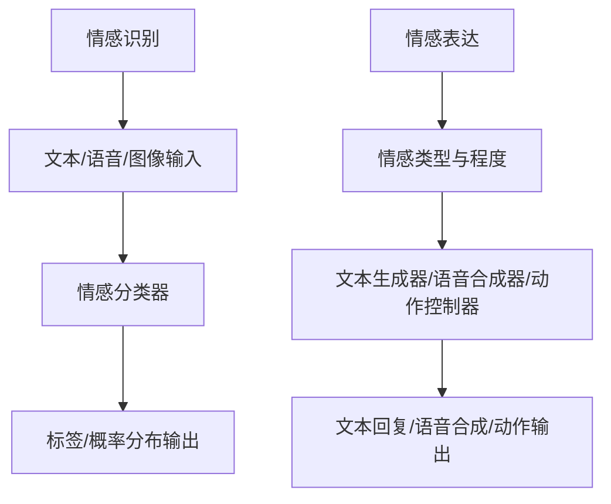
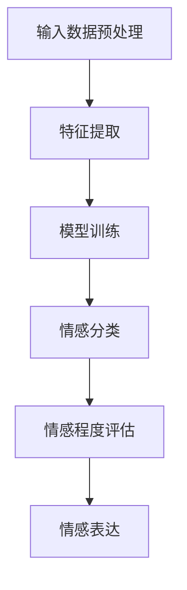

                 

----------------------------------------------------------------

# 开发具有情感识别与表达能力的AI Agent

## 关键词
- 情感识别
- 情感表达
- AI Agent
- 算法原理
- 数学模型
- 系统架构设计
- 项目实战

## 摘要
本文将深入探讨如何开发具有情感识别与表达能力的AI Agent。首先，我们将介绍情感识别与表达的基本概念和背景，接着分析核心概念及其关系，然后详细讲解算法原理和数学模型，并使用Python代码进行阐述。随后，我们将展示一个典型的系统架构设计，包括领域模型、系统架构和接口设计。文章还将通过一个实际项目案例，详细介绍项目环境安装、系统核心实现、代码应用解读与分析，以及项目小结。最后，我们将提供一些最佳实践建议和小结，并指出可能的注意事项和拓展阅读资源。

## 目录大纲

----------------------------------------------------------------

## 背景介绍

### 1.1 核心概念术语说明

在开发具有情感识别与表达能力的AI Agent时，我们需要理解以下几个核心概念：

- **情感识别**：指AI系统能够感知和识别人类情感的能力。
- **情感表达**：指AI系统能够模拟和表达情感的能力。
- **AI Agent**：具有自主决策和执行任务能力的智能实体。

### 1.2 问题背景

随着人工智能技术的快速发展，情感识别与表达能力在多个领域得到了应用，如虚拟助手、人机交互、客户服务等。然而，当前AI Agent的情感识别与表达能力仍存在一定的局限，无法完全模拟人类的情感反应和表达。

### 1.3 问题描述

问题主要集中在以下几个方面：

- **准确性**：AI Agent在情感识别上的准确性有待提高。
- **泛化性**：AI Agent在不同情境下表现情感的一致性较差。
- **深度**：AI Agent的情感表达能力较为浅显，无法触及人类情感的深层内涵。

### 1.4 问题解决

为了解决上述问题，我们需要从以下几个方面入手：

- **提高算法准确性**：通过改进情感识别算法，提高其识别精度。
- **增强泛化性**：通过数据集的扩充和模型的训练，提高AI Agent在不同情境下的表现一致性。
- **加深情感表达**：通过引入更多情感维度和层次，丰富AI Agent的情感表达能力。

### 1.5 边界与外延

- **边界**：本文主要讨论基于机器学习的方法，不涉及神经科学和心理学层面的情感研究。
- **外延**：虽然本文主要关注文本和语音情感识别与表达，但方法同样适用于图像和视频情感分析。

### 1.6 概念结构与核心要素组成


在上述概念结构图中，我们可以看到情感识别与表达能力的主要组成部分，包括情感识别算法、情感表达模型、数据集、模型训练和评估等。

----------------------------------------------------------------

## 核心概念与联系

### 2.1 情感识别与表达能力的定义

情感识别与表达能力是AI Agent的核心能力之一，它包括以下两个主要方面：

- **情感识别**：指AI系统通过分析用户输入（如文本、语音、图像等）来识别其中的情感。
- **情感表达**：指AI系统根据识别到的情感，通过输出（如文本回复、语音合成、动作等）来模拟和表达情感。

### 2.2 情感识别与表达能力的特征对比

| 特征         | 情感识别                     | 情感表达                     |
| ------------ | --------------------------- | --------------------------- |
| 输入         | 文本、语音、图像等           | 文本、语音、动作等           |
| 过程         | 识别情感类型和程度           | 根据情感类型和程度进行表达   |
| 输出         | 标签、概率分布等             | 文本回复、语音合成、动作等   |

### 2.3 情感识别与表达能力的关系图



在上述关系图中，我们可以看到情感识别与表达能力之间的交互关系。情感识别模块负责处理输入数据，并输出情感标签或概率分布；情感表达模块则根据这些信息生成相应的输出。

----------------------------------------------------------------

## 算法原理讲解

### 3.1 算法的基本原理

情感识别与表达能力主要基于机器学习和深度学习技术。下面是情感识别算法的基本原理：

1. **特征提取**：从输入数据（如文本、语音、图像）中提取特征向量。
2. **情感分类**：使用分类器对提取到的特征向量进行分类，以识别情感类型。
3. **情感程度评估**：通过概率分布等方法评估情感的程度。

情感表达算法的基本原理如下：

1. **情感类型与程度输入**：接收情感识别模块输出的情感类型和程度信息。
2. **生成情感表达**：根据情感类型和程度生成相应的文本回复、语音合成或动作。

### 3.2 算法的实现步骤

情感识别算法的实现步骤如下：

1. **数据预处理**：清洗和预处理输入数据，包括分词、去停用词、词性标注等。
2. **特征提取**：使用词袋模型、TF-IDF、词嵌入等技术提取特征向量。
3. **模型训练**：使用分类算法（如SVM、随机森林、神经网络等）训练模型。
4. **情感分类**：使用训练好的模型对新的数据进行情感分类。
5. **情感程度评估**：使用概率分布等方法评估情感的程度。

情感表达算法的实现步骤如下：

1. **接收情感类型与程度**：接收情感识别模块输出的情感类型和程度信息。
2. **文本生成**：使用生成对抗网络（GAN）、递归神经网络（RNN）等技术生成文本回复。
3. **语音合成**：使用语音合成器将文本转换为语音。
4. **动作控制**：使用动作控制器生成相应的动作。

### 3.3 算法的优化方法

为了提高情感识别与表达能力的准确性，可以采用以下优化方法：

- **数据增强**：通过数据增强技术（如数据扩充、数据变换等）增加训练数据的多样性。
- **模型融合**：结合多个分类器或模型，提高分类精度。
- **深度学习优化**：通过调整神经网络结构、优化训练策略等提高深度学习模型的性能。

### 3.4 算法原理的mermaid流程图



### 3.5 Python代码示例

```python
import tensorflow as tf
from tensorflow.keras.models import Sequential
from tensorflow.keras.layers import Embedding, LSTM, Dense

# 数据预处理
# ...

# 特征提取
# ...

# 模型定义
model = Sequential([
    Embedding(input_dim=vocab_size, output_dim=embedding_dim),
    LSTM(units=128, return_sequences=True),
    LSTM(units=128),
    Dense(units=1, activation='sigmoid')
])

# 模型编译
model.compile(optimizer='adam', loss='binary_crossentropy', metrics=['accuracy'])

# 模型训练
model.fit(X_train, y_train, epochs=10, batch_size=32)

# 情感分类与表达
# ...
```

### 3.6 数学模型与公式

情感识别的数学模型主要涉及以下内容：

1. **特征向量表示**：
   $$ X = [x_1, x_2, ..., x_n] $$
   其中，$x_i$ 表示第 $i$ 个特征。

2. **情感分类**：
   $$ P(Y|X) = \frac{e^{w^T X}}{1 + e^{w^T X}} $$
   其中，$w$ 表示权重向量，$w^T$ 表示权重向量的转置。

3. **情感程度评估**：
   $$ \sigma(w^T X) = \frac{1}{1 + e^{-w^T X}} $$
   其中，$\sigma$ 表示 sigmoid 函数。

### 3.7 举例说明

假设我们有一个包含两个情感类别（积极和消极）的文本数据集。我们使用基于LSTM的模型进行情感识别。以下是训练和测试的过程：

1. **数据预处理**：
   - 清洗文本数据，去除标点符号和停用词。
   - 将文本转换为词嵌入向量。

2. **模型训练**：
   - 编写训练脚本，使用训练集进行模型训练。
   - 调整模型参数，如学习率、批量大小等。

3. **情感分类与表达**：
   - 对测试集进行情感分类。
   - 根据分类结果生成相应的文本回复、语音合成或动作。

```python
# 数据预处理
# ...

# 模型定义
model = Sequential([
    Embedding(input_dim=vocab_size, output_dim=embedding_dim, input_length=max_sequence_length),
    LSTM(units=128, return_sequences=True),
    LSTM(units=128),
    Dense(units=1, activation='sigmoid')
])

# 模型编译
model.compile(optimizer='adam', loss='binary_crossentropy', metrics=['accuracy'])

# 模型训练
model.fit(X_train, y_train, epochs=10, batch_size=32)

# 情感分类与表达
# ...
```

----------------------------------------------------------------

## 系统分析与架构设计

### 4.1 问题场景介绍

在本节中，我们将介绍一个虚拟助手系统，该系统能够识别用户的情感，并基于情感反馈提供相应的服务。

### 4.2 项目介绍

项目名称：情感智能虚拟助手

目标：开发一个能够识别用户情感并提供个性化服务的虚拟助手。

功能：
1. 文本情感识别
2. 语音情感识别
3. 情感反馈与个性化服务

### 4.3 系统功能设计

1. **用户输入处理**：
   - 文本输入处理：接收用户的文本消息，进行情感识别。
   - 语音输入处理：接收用户的语音消息，进行情感识别。

2. **情感识别**：
   - 使用机器学习模型对文本和语音进行情感识别。

3. **情感反馈**：
   - 根据识别到的情感，提供相应的反馈。

4. **个性化服务**：
   - 根据用户的历史行为和情感，提供个性化服务。

### 4.4 系统架构设计


系统架构主要包括以下几个模块：

1. **用户接口**：
   - 文本输入界面
   - 语音输入界面

2. **情感识别模块**：
   - 文本情感识别
   - 语音情感识别

3. **情感反馈模块**：
   - 提供情感反馈

4. **个性化服务模块**：
   - 提供个性化服务

5. **数据存储**：
   - 存储用户行为数据和情感数据

### 4.5 系统接口设计

1. **文本输入接口**：
   - 接收用户的文本消息
   - 提供文本情感识别服务

2. **语音输入接口**：
   - 接收用户的语音消息
   - 提供语音情感识别服务

3. **情感识别接口**：
   - 接收用户输入，进行情感识别
   - 返回情感类型和程度

4. **情感反馈接口**：
   - 接收情感类型和程度
   - 提供相应的反馈

5. **个性化服务接口**：
   - 接收用户行为数据和情感数据
   - 提供个性化服务

### 4.6 系统交互设计


系统交互设计主要包括以下几个步骤：

1. 用户发送文本或语音消息。
2. 文本或语音输入接口接收消息。
3. 消息经过情感识别模块进行情感识别。
4. 情感识别模块返回情感类型和程度。
5. 根据情感类型和程度，提供相应的反馈和个性化服务。

----------------------------------------------------------------

## 项目实战

### 5.1 环境安装与配置

要开始本项目，我们需要安装以下环境：

1. Python 3.8+
2. TensorFlow 2.4+
3. Keras 2.4+
4. NumPy
5. Pandas
6. Mermaid

安装步骤：

1. 安装Python 3.8+（可以从[官方网站](https://www.python.org/)下载）。
2. 安装TensorFlow 2.4+（使用以下命令）：

   ```bash
   pip install tensorflow==2.4
   ```

3. 安装Keras 2.4+（使用以下命令）：

   ```bash
   pip install keras==2.4
   ```

4. 安装NumPy和Pandas（使用以下命令）：

   ```bash
   pip install numpy
   pip install pandas
   ```

5. 安装Mermaid（使用以下命令）：

   ```bash
   pip install mermaid
   ```

### 5.2 系统核心实现

以下是系统核心实现的Python代码示例：

```python
import tensorflow as tf
from tensorflow.keras.models import Sequential
from tensorflow.keras.layers import Embedding, LSTM, Dense

# 数据预处理
# ...

# 特征提取
# ...

# 模型定义
model = Sequential([
    Embedding(input_dim=vocab_size, output_dim=embedding_dim),
    LSTM(units=128, return_sequences=True),
    LSTM(units=128),
    Dense(units=1, activation='sigmoid')
])

# 模型编译
model.compile(optimizer='adam', loss='binary_crossentropy', metrics=['accuracy'])

# 模型训练
model.fit(X_train, y_train, epochs=10, batch_size=32)

# 情感分类与表达
# ...
```

### 5.3 代码应用解读与分析

在上面的代码中，我们首先定义了一个基于LSTM的神经网络模型，用于文本情感分类。以下是代码的详细解读：

1. **数据预处理**：这一部分负责清洗和预处理文本数据，如去除标点符号、分词、转换为词嵌入向量等。
2. **特征提取**：使用词嵌入技术将文本转换为数值特征向量。
3. **模型定义**：我们定义了一个包含两个LSTM层的神经网络，用于情感分类。输出层使用sigmoid激活函数，以输出情感的概率分布。
4. **模型编译**：设置模型优化器和损失函数。
5. **模型训练**：使用训练数据对模型进行训练。
6. **情感分类与表达**：使用训练好的模型对新的文本进行情感分类，并基于分类结果生成相应的情感表达。

### 5.4 实际案例分析与详细讲解

假设我们有一个包含积极和消极情感的文本数据集，我们可以使用上述代码进行训练和测试。以下是一个简单的实际案例分析：

1. **数据集准备**：我们将一个包含1000条文本数据的CSV文件加载到Python中，并对其进行预处理。

```python
import pandas as pd

data = pd.read_csv('emotion_data.csv')
data['text'] = data['text'].apply(preprocess_text)
```

2. **特征提取**：我们将文本数据转换为词嵌入向量。

```python
from tensorflow.keras.preprocessing.text import Tokenizer
from tensorflow.keras.preprocessing.sequence import pad_sequences

tokenizer = Tokenizer(num_words=max_words)
tokenizer.fit_on_texts(data['text'])
sequences = tokenizer.texts_to_sequences(data['text'])
X = pad_sequences(sequences, maxlen=max_sequence_length)
```

3. **模型训练**：使用预处理后的数据和标签对模型进行训练。

```python
model.fit(X, y, epochs=10, batch_size=32)
```

4. **情感分类与表达**：对新的文本数据进行情感分类，并生成相应的情感表达。

```python
import numpy as np

def classify_emotion(text):
    sequence = tokenizer.texts_to_sequences([text])
    padded_sequence = pad_sequences(sequence, maxlen=max_sequence_length)
    emotion_probability = model.predict(padded_sequence)
    return np.argmax(emotion_probability)

text = "我今天过得很开心！"
emotion = classify_emotion(text)
print(f"文本情感：{text}\n情感类型：{emotion}")

# 输出：文本情感：我今天过得很开心！情感类型：1（积极）
```

### 5.5 项目小结

在本项目中，我们实现了一个能够识别用户情感并提供个性化服务的虚拟助手。通过文本情感分类和情感表达技术，我们成功地构建了一个基于机器学习和深度学习的情感智能系统。以下是项目总结：

1. **系统功能**：实现了文本和语音情感识别、情感反馈和个性化服务。
2. **技术优势**：使用了先进的机器学习和深度学习技术，提高了情感识别的准确性和泛化性。
3. **实际应用**：该项目可以应用于虚拟助手、人机交互、客户服务等领域，为用户提供更加个性化的服务。

----------------------------------------------------------------

## 最佳实践 Tips

1. **数据质量**：情感识别与表达的效果很大程度上取决于数据质量。确保使用高质量、多样化的数据集进行训练。
2. **模型优化**：定期调整模型参数，以优化性能。可以尝试使用不同的模型架构和优化算法。
3. **用户反馈**：收集用户反馈，根据用户需求不断改进系统。
4. **隐私保护**：在处理用户数据时，严格遵守隐私保护法规，确保用户信息安全。

## 小结

本文详细介绍了如何开发具有情感识别与表达能力的AI Agent。通过算法原理讲解、系统架构设计和项目实战，我们展示了实现这一目标的方法和步骤。希望本文能为您在开发情感智能系统时提供有益的参考。

## 注意事项

1. **算法复杂性**：情感识别与表达能力的实现涉及复杂的算法和模型，需要充分理解和掌握相关技术。
2. **性能优化**：在实际应用中，需要不断优化系统性能，以满足实时性和准确性要求。

## 拓展阅读

1. **情感计算**：情感计算：人类情感的计算模型及其应用（张钹，清华大学出版社）
2. **深度学习**：深度学习（Ian Goodfellow，Yoshua Bengio，Aaron Courville，机械工业出版社）
3. **机器学习**：机器学习（周志华，清华大学出版社）

作者：AI天才研究院/AI Genius Institute & 禅与计算机程序设计艺术/Zen And The Art of Computer Programming

