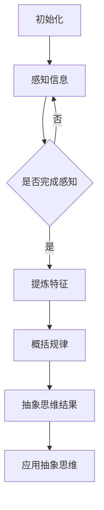
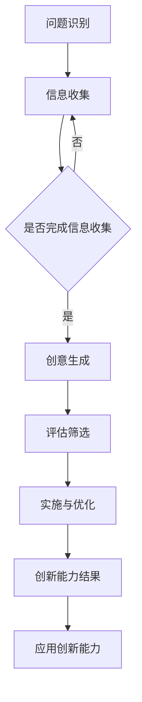
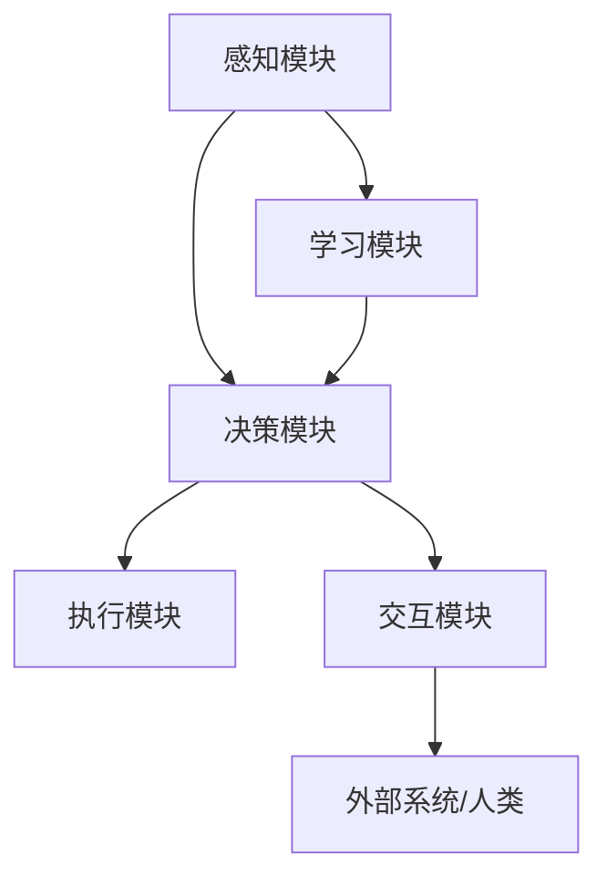
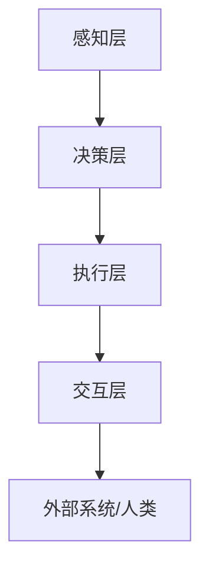
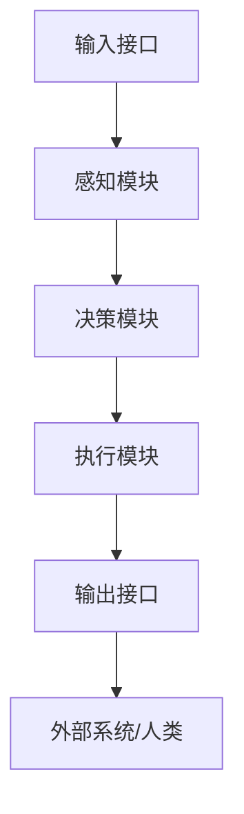
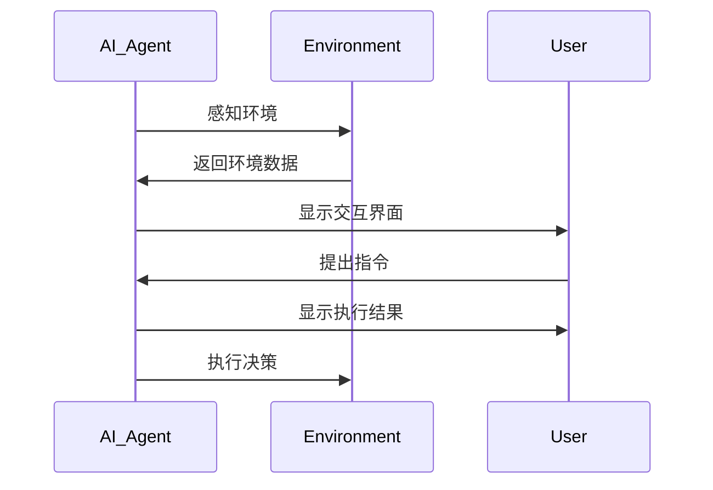
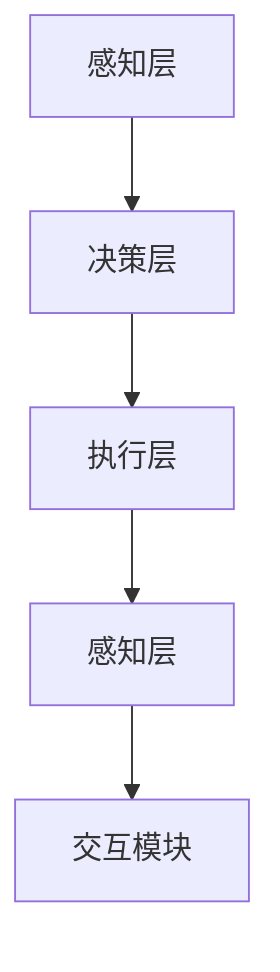

                 


## **开发具有抽象思维与创新能力的AI Agent**

### **关键词**：抽象思维，创新能力，AI Agent，开发，算法

### **摘要**：本文旨在探讨如何开发具有抽象思维与创新能力的AI Agent。我们将从背景介绍、核心概念原理、算法原理讲解、AI Agent的开发以及最佳实践等方面进行详细阐述，以期帮助读者了解并掌握开发此类AI Agent的方法和技巧。

### **目录大纲**

```markdown
----------------------------------------------------------------
## 第一部分: 背景

### 第1章: 问题背景

#### 1.1.1 问题描述

#### 1.1.2 问题解决

#### 1.1.3 边界与外延

#### 1.1.4 核心概念与联系

## 第二部分: 核心概念原理

### 第2章: 核心概念原理

#### 2.1.1 AI Agent的定义与特点

#### 2.1.2 抽象思维的定义与原理

#### 2.1.3 创新能力的定义与原理

## 第三部分: AI Agent的开发

### 第3章: 算法原理讲解

#### 3.1.1 抽象思维算法

#### 3.1.2 创新能力算法

### 第4章: AI Agent的架构设计

#### 4.1.1 系统功能设计

#### 4.1.2 系统架构设计

#### 4.1.3 系统接口设计

#### 4.1.4 系统交互

### 第5章: 系统分析与架构设计方案

#### 5.1.1 问题场景介绍

#### 5.1.2 系统功能设计

#### 5.1.3 系统架构设计

#### 5.1.4 系统接口设计

#### 5.1.5 系统交互

### 第6章: 项目实战

#### 6.1.1 环境安装

#### 6.1.2 系统核心实现

#### 6.1.3 实际案例分析和详细讲解

#### 6.1.4 项目小结

## 第四部分: 最佳实践

### 第7章: 最佳实践 tips

#### 7.1.1 开发技巧

#### 7.1.2 性能优化

#### 7.1.3 错误处理

### 第8章: 小结、注意事项、拓展阅读

#### 8.1.1 小结

#### 8.1.2 注意事项

#### 8.1.3 拓展阅读
```

### **第一部分：背景**

#### **1.1.1 问题描述**

随着人工智能技术的飞速发展，AI Agent已成为人工智能领域的研究热点。AI Agent，即人工智能代理，是一种能够自主决策并执行任务的智能体。相比于传统的AI系统，AI Agent具有更强的自主学习能力、适应能力和灵活性，这使得它们在许多领域具有广泛的应用前景。

然而，当前AI Agent在抽象思维和创新能力的表现上仍有较大提升空间。抽象思维是指将具体的事物、情境或概念转化为更广泛、更抽象的概念或规律的能力。而创新能力则是指通过独特的思维方式和创新方法，创造新的价值、解决方案或产品。这两个能力在人工智能领域中至关重要，因为它们决定了AI Agent在面对复杂问题和未知情境时的应对能力。

开发具有抽象思维和创新能力的AI Agent，不仅有助于提升AI系统的智能化水平，还能够推动人工智能技术在更多领域的应用，为人类社会带来更多便利和效益。

#### **1.1.2 问题解决**

为了解决上述问题，本文旨在探讨如何开发具有抽象思维和创新能力的AI Agent。具体而言，我们将从以下方面展开讨论：

1. **背景介绍**：介绍人工智能的发展现状、AI Agent的定义及其重要性，以及抽象思维和创新能力的定义。
2. **核心概念原理**：深入分析AI Agent、抽象思维和创新能力的基本概念和原理，为后续内容奠定基础。
3. **算法原理讲解**：详细讲解抽象思维算法和创新能力算法的原理，并使用Python代码进行实现。
4. **AI Agent的开发**：介绍AI Agent的架构设计、系统分析与架构设计方案，以及项目实战的具体步骤。
5. **最佳实践**：总结开发具有抽象思维和创新能力的AI Agent的最佳实践，为读者提供实用的建议。

通过本文的探讨，我们期望能够为人工智能领域的研究者和开发者提供有益的参考，助力他们在实际项目中开发出更加强大、智能的AI Agent。

#### **1.1.3 边界与外延**

在讨论开发具有抽象思维和创新能力的AI Agent时，我们需要明确其边界与外延。首先，AI Agent的应用范围涵盖了从简单的自动化任务到复杂的决策支持系统，如智能家居、智能客服、自动驾驶等。在这些应用场景中，AI Agent需要具备一定的抽象思维和创新能力，以便更好地理解和解决实际问题。

其次，抽象思维和创新能力并非孤立存在，而是相互关联、相互促进。抽象思维为创新能力提供了基础，使得AI Agent能够从复杂的信息中提取关键特征和规律；而创新能力则通过新颖的思路和解决方案，推动了AI Agent在各个领域的应用和发展。

此外，开发具有抽象思维和创新能力的AI Agent还面临着诸多挑战。一方面，如何设计和实现有效的算法，使得AI Agent能够在复杂环境下进行高效学习和推理；另一方面，如何确保AI Agent的行为符合人类的价值观和道德规范，避免潜在的风险和负面影响。

总之，在开发具有抽象思维和创新能力的AI Agent过程中，我们需要充分考虑其应用范围、关联性和挑战，以实现更智能、更可靠的人工智能系统。

#### **1.1.4 核心概念与联系**

在深入探讨开发具有抽象思维和创新能力的AI Agent之前，我们有必要对相关核心概念进行详细阐述，并分析它们之间的联系。

**AI Agent的定义与特点**

AI Agent是一种能够模拟人类智能行为，具备自主学习、推理和决策能力的计算机程序。与传统的人工智能系统相比，AI Agent具有以下特点：

1. **自主性**：AI Agent能够在没有外部干预的情况下自主执行任务，进行环境感知、决策和行动。
2. **适应性**：AI Agent能够根据环境和任务的不断变化，调整自身的策略和行为，以实现最佳效果。
3. **灵活性**：AI Agent能够处理不同类型和复杂度的任务，具有广泛的适用性。

**抽象思维的定义与原理**

抽象思维是指通过提炼和概括具体事物的本质特征，形成更为普遍的概念和规律，从而实现对复杂信息的理解和处理。抽象思维的过程主要包括以下几方面：

1. **抽象**：将具体事物的某些属性、特征提取出来，形成抽象的概念。
2. **概括**：将多个具体事物的共同特征进行总结，形成普遍适用的规律。
3. **推理**：基于抽象概念和规律，对新的情境或问题进行推理和判断。

**创新能力的定义与原理**

创新能力是指通过独特的思维方式和创新方法，创造新的价值、解决方案或产品。创新过程通常包括以下阶段：

1. **发现问题**：识别和界定问题，明确目标和需求。
2. **提出假设**：基于现有知识和经验，提出可能的解决方案。
3. **验证和优化**：通过实验和验证，不断改进和完善解决方案。

**核心概念之间的联系**

AI Agent、抽象思维和创新能力之间存在着密切的联系：

1. **AI Agent作为载体**：抽象思维和创新能力需要依托于AI Agent这个平台，通过算法和模型实现。
2. **抽象思维作为基础**：抽象思维为AI Agent提供了理解和处理复杂信息的能力，为创新能力的发挥奠定基础。
3. **创新能力作为动力**：创新能力通过不断创造新的价值，推动AI Agent在各个领域的应用和发展。

通过上述分析，我们可以看出，开发具有抽象思维和创新能力的AI Agent，不仅需要深入理解相关核心概念，还需要将它们有机结合，形成一个完整的技术体系。只有这样，才能实现AI Agent在智能化水平上的不断提升，为人类社会带来更多福祉。

### **第二部分：核心概念原理**

#### **2.1.1 AI Agent的定义与特点**

AI Agent，即人工智能代理，是一种能够在复杂环境下自主进行感知、学习、推理和决策的智能实体。它与传统的自动化系统有着显著的区别，主要表现在以下几方面：

**1. 自主性**

AI Agent具有高度的自主性，能够在没有外部干预的情况下自主执行任务。它通过内置的算法和模型，对环境进行实时感知，根据感知到的信息自主制定行动策略，并在执行过程中不断调整和优化。

**2. 适应性**

AI Agent具备良好的适应性，能够在不断变化的环境中自主学习和调整。它能够通过学习历史数据和经验，逐步提高自身的任务执行能力，从而更好地适应复杂多变的应用场景。

**3. 灵活性**

AI Agent具有广泛的适用性，能够处理不同类型和复杂度的任务。它不仅能够完成简单的自动化任务，如数据清洗、分类等，还能够承担复杂的决策支持任务，如自动驾驶、智能客服等。

**4. 智能化**

AI Agent通过模拟人类智能行为，具备较强的逻辑推理、模式识别和问题解决能力。它能够从海量数据中提取有价值的信息，并进行深度分析和判断，从而为人类提供智能化的解决方案。

**5. 合作性**

AI Agent不仅可以独立完成任务，还能够与其他AI Agent或人类协作，共同解决复杂问题。通过合作和协同，AI Agent能够实现更高效的资源利用和任务执行，进一步提升系统的整体性能。

**AI Agent与传统AI的区别**

相较于传统的AI系统，AI Agent在多个方面具有显著优势：

**1. 自主性更高**

传统AI系统通常依赖于预定义的规则和模型，需要外部干预才能执行任务。而AI Agent具有自主决策和行动的能力，能够根据环境变化自主调整行为。

**2. 适应能力更强**

传统AI系统在遇到新情境或问题时，往往需要重新设计和训练。而AI Agent具备良好的适应性，能够在不断变化的环境中自主学习和调整，从而更好地应对复杂问题。

**3. 灵活性更高**

传统AI系统通常适用于特定领域或任务，难以泛化到其他场景。而AI Agent具有广泛的适用性，能够处理不同类型和复杂度的任务，从而实现更广泛的应用。

**4. 智能化水平更高**

传统AI系统主要依赖预定义的算法和模型，难以应对复杂多变的环境。而AI Agent通过自主学习和推理，具备更强的智能和适应能力，能够更好地应对复杂问题。

总之，AI Agent作为人工智能领域的重要发展方向，具有巨大的潜力和应用价值。通过不断提升其自主性、适应性、灵活性和智能化水平，AI Agent将在更多领域发挥重要作用，为人类社会带来更多便利和效益。

#### **2.1.2 抽象思维的定义与原理**

抽象思维是一种将具体的事物、情境或概念转化为更广泛、更抽象的概念或规律的能力。它是人类认知过程中一种重要的思维方式，有助于我们理解和处理复杂的信息。

**1. 抽象思维的定义**

抽象思维是指通过提炼和概括具体事物的本质特征，形成更为普遍的概念和规律，从而实现对复杂信息的理解和处理。抽象思维的过程可以分为以下几个步骤：

- **感知**：感知具体事物，获取相关信息。
- **抽象**：将具体事物的某些属性、特征提取出来，形成抽象的概念。
- **概括**：将多个具体事物的共同特征进行总结，形成普遍适用的规律。
- **推理**：基于抽象概念和规律，对新的情境或问题进行推理和判断。

**2. 抽象思维的原理**

抽象思维的原理可以从生物学、心理学和哲学三个层面进行解释。

- **生物学层面**：人类大脑的神经结构和功能为抽象思维提供了基础。大脑中的神经元和神经网络通过复杂的连接和相互作用，使我们能够进行抽象思维。
- **心理学层面**：抽象思维是人类认知能力的一部分，它涉及到感知、记忆、推理等多个认知过程。心理学研究表明，抽象思维有助于我们更好地理解和解决问题，提高学习和工作效率。
- **哲学层面**：哲学上认为，抽象思维是人类智慧的核心，是人类与动物的根本区别。通过抽象思维，人类能够超越具体的事物，把握事物的本质和规律，从而实现更高层次的认知和思考。

**3. 抽象思维的过程**

抽象思维的过程可以分为以下几个阶段：

- **感知与识别**：感知具体事物，识别其特征和属性。
- **提炼与提取**：将具体事物的特征和属性进行提炼和提取，形成抽象的概念。
- **概括与总结**：将多个具体事物的共同特征进行概括和总结，形成普遍适用的规律。
- **推理与判断**：基于抽象概念和规律，对新的情境或问题进行推理和判断。

**4. 抽象思维的应用**

抽象思维在人工智能领域具有重要的应用价值。通过抽象思维，AI Agent能够从具体的数据和问题中提取出本质特征和规律，从而更好地理解和解决复杂问题。以下是一些具体的应用场景：

- **数据分析和挖掘**：通过抽象思维，AI Agent能够从大量的数据中提取出有价值的信息，进行深入分析和挖掘。
- **知识表示和推理**：抽象思维有助于AI Agent更好地表示和推理知识，实现智能决策和问题解决。
- **自然语言处理**：抽象思维使得AI Agent能够理解自然语言的深层含义，进行文本分析和生成。

总之，抽象思维是AI Agent实现智能化的关键能力之一。通过深入研究抽象思维的原理和应用，我们可以开发出更加智能、高效的AI Agent，为人工智能技术的发展和实际应用提供有力支持。

#### **2.1.3 创新能力的定义与原理**

创新能力是指通过独特的思维方式和创新方法，创造新的价值、解决方案或产品。它是推动社会进步和经济发展的重要动力，也是企业在激烈市场竞争中立于不败之地的关键因素。

**1. 创新能力的定义**

创新能力可以分为广义和狭义两种：

- **广义创新能力**：指在科学、技术、经济、文化等各个领域，通过独特的思维方式和方法，创造新的知识、产品、技术、工艺、服务等的综合能力。
- **狭义创新能力**：主要指在科学技术领域，通过科学研究和技术开发，创造新的理论、方法、技术、工艺、产品等的综合能力。

**2. 创新能力的原理**

创新能力的原理可以从以下几个方面进行解释：

- **跨领域融合**：创新能力源于不同领域之间的知识、技术和思想的融合。通过跨领域的研究和合作，人们能够从不同角度看待问题，发现新的解决方案。
- **发散性思维**：发散性思维是一种能够产生大量创意的思维方式。通过发散性思维，人们可以突破传统的思维模式，提出独特的想法和解决方案。
- **迭代优化**：创新过程通常是一个迭代优化的过程。通过不断试错和改进，人们可以逐步完善和优化创新方案，从而实现最终的创新目标。
- **跨界合作**：跨界合作是激发创新能力的重要途径。通过跨界合作，不同领域的专家和团队可以共同探讨问题，碰撞出新的火花，从而实现创新突破。

**3. 创新能力的过程**

创新能力的过程可以分为以下几个阶段：

- **问题识别**：识别和界定需要解决的问题或机会。
- **信息收集**：收集与问题相关的信息和知识。
- **创意生成**：通过发散性思维和跨领域融合，生成新的想法和解决方案。
- **评估筛选**：对创意进行评估和筛选，确定最有潜力的创新方案。
- **实施与优化**：将创新方案付诸实施，并在实践中不断优化和改进。

**4. 创新能力在AI Agent中的应用**

在人工智能领域，创新能力发挥着至关重要的作用。通过创新能力，AI Agent能够：

- **提升智能化水平**：通过创新算法和模型，AI Agent能够实现更高效的感知、学习和推理，从而提升整体智能化水平。
- **拓展应用场景**：通过创新应用，AI Agent能够在更多领域发挥作用，如自动驾驶、智能医疗、智能客服等。
- **优化用户体验**：通过创新用户界面和交互方式，AI Agent能够为用户提供更加便捷、智能的服务。

总之，创新能力是推动AI Agent发展的关键因素。通过深入研究创新能力的原理和应用，我们可以开发出更加智能、高效的AI Agent，为人类社会带来更多福祉。

### **第三部分：算法原理讲解**

#### **3.1.1 抽象思维算法**

抽象思维算法是AI Agent实现抽象思维的核心算法之一。该算法旨在通过提炼和概括具体事物的本质特征，形成更为广泛、抽象的概念和规律。以下是抽象思维算法的详细讲解：

**1. 算法mermaid流程图**



**2. Python源代码**

```python
import numpy as np

def abstract_think(data):
    # 感知信息
    features = extract_features(data)
    
    # 提炼特征
    abstract_features = refine_features(features)
    
    # 概括规律
    abstract_rules = summarize_rules(abstract_features)
    
    # 抽象思维结果
    abstract_result = apply_abstract_think(abstract_rules)
    
    # 应用抽象思维
    apply_abstract_result(abstract_result)

def extract_features(data):
    # 提取特征的具体实现
    return ...

def refine_features(features):
    # 提炼特征的具体实现
    return ...

def summarize_rules(abstract_features):
    # 概括规律的具体实现
    return ...

def apply_abstract_think(abstract_rules):
    # 应用抽象思维的具体实现
    return ...

def apply_abstract_result(abstract_result):
    # 应用抽象思维结果的具体实现
    return ...
```

**3. 数学模型和公式**

在抽象思维算法中，我们可以使用以下数学模型和公式来描述关键步骤：

$$
\text{特征提取} = f(\text{数据})
$$

$$
\text{特征提炼} = g(\text{特征})
$$

$$
\text{规律概括} = h(\text{特征提炼})
$$

$$
\text{抽象思维结果} = k(\text{规律概括})
$$

**4. 举例说明**

假设我们有一个包含多种商品的销售数据集，我们的目标是提取商品的特征，并形成关于商品销售趋势的抽象思维结果。

- **特征提取**：首先，我们从数据集中提取出商品的销售数量、价格、品类等特征。
- **特征提炼**：然后，我们对这些特征进行提炼，提取出关键信息，如商品的热卖程度、价格区间等。
- **规律概括**：接下来，我们根据提炼后的特征，总结出关于商品销售趋势的规律，如某些品类商品在特定时间段内销售量较高。
- **抽象思维结果**：最后，我们形成关于商品销售趋势的抽象思维结果，如某些品类商品具有季节性销售特征，某些价格区间内的商品销售较好。

通过这个例子，我们可以看到抽象思维算法在数据处理和趋势分析中的应用，它能够帮助我们更深入地理解数据，提取有价值的信息。

#### **3.1.2 创新能力算法**

创新能力算法是AI Agent实现创新能力的关键算法。该算法旨在通过独特的思维方式和创新方法，创造新的价值、解决方案或产品。以下是创新能力算法的详细讲解：

**1. 算法mermaid流程图**



**2. Python源代码**

```python
import numpy as np

def innovate_problem(problem):
    # 问题识别的具体实现
    return ...

def collect_info(problem):
    # 信息收集的具体实现
    return ...

def generate_ideas(info):
    # 创意生成的具体实现
    return ...

def evaluate_ideas(ideas):
    # 评估筛选的具体实现
    return ...

def implement_idea(idea):
    # 实施与优化具体实现
    return ...

def apply_innovation(abstract_result):
    # 应用创新能力具体实现
    return ...

def innovate(problem):
    idea = innovate_problem(problem)
    if idea:
        info = collect_info(idea)
        ideas = generate_ideas(info)
        selected_idea = evaluate_ideas(ideas)
        if selected_idea:
            innovation_result = implement_idea(selected_idea)
            apply_innovation(innovation_result)
```

**3. 数学模型和公式**

在创新能力算法中，我们可以使用以下数学模型和公式来描述关键步骤：

$$
\text{问题识别} = p(\text{问题})
$$

$$
\text{信息收集} = q(\text{问题识别})
$$

$$
\text{创意生成} = r(\text{信息})
$$

$$
\text{评估筛选} = s(\text{创意})
$$

$$
\text{实施与优化} = t(\text{评估筛选})
$$

$$
\text{创新能力结果} = u(\text{实施与优化})
$$

**4. 举例说明**

假设我们面临一个提高产品销售量的问题，我们的目标是找到创新的解决方案。

- **问题识别**：首先，我们识别出需要解决的问题，即提高产品销售量。
- **信息收集**：接下来，我们收集与问题相关的信息，如市场需求、竞争对手策略、用户反馈等。
- **创意生成**：然后，我们基于收集到的信息，生成多种可能的解决方案，如增加广告投入、优化产品功能、改进售后服务等。
- **评估筛选**：我们对这些创意进行评估和筛选，确定最具潜力的解决方案。
- **实施与优化**：最后，我们将筛选出的解决方案付诸实施，并在实践中不断优化和改进。

通过这个例子，我们可以看到创新能力算法在解决实际问题时的重要作用。通过创新思维和方法，AI Agent能够找到更加高效、创新的解决方案，从而实现问题的有效解决。

### **第四部分：AI Agent的开发**

#### **4.1.1 系统功能设计**

在开发具有抽象思维和创新能力的AI Agent时，系统功能设计是至关重要的第一步。系统功能设计涉及到识别和定义AI Agent需要执行的任务和功能，以确保其能够满足应用场景的需求。

**1. 功能需求分析**

首先，我们需要对应用场景进行深入分析，识别出AI Agent需要执行的关键任务。这些任务可能包括：

- **环境感知**：AI Agent需要实时感知和理解其所在环境，包括视觉、听觉、触觉等多模态信息。
- **决策与规划**：基于感知到的环境信息，AI Agent需要做出决策并制定行动计划，以实现目标。
- **学习与优化**：AI Agent需要通过不断学习和优化，提高其决策质量和执行效率。
- **交互与协作**：AI Agent需要与其他系统或人类进行有效交互和协作，以实现更复杂的任务。

**2. 功能模块划分**

根据功能需求分析，我们可以将系统功能划分为以下模块：

- **感知模块**：负责收集和处理环境信息，包括视觉、听觉、触觉等传感器数据。
- **决策模块**：基于感知模块提供的信息，进行决策和规划，包括路径规划、目标识别等。
- **学习模块**：负责AI Agent的学习和优化，包括监督学习、强化学习等算法。
- **交互模块**：负责与外部系统或人类进行交互，包括自然语言处理、语音识别等。

**3. 功能模块交互**

各个功能模块之间需要紧密交互，以确保AI Agent能够高效、协同地执行任务。以下是功能模块之间的交互关系：

- **感知模块** → **决策模块**：感知模块将处理后的环境信息传递给决策模块，作为决策的输入。
- **决策模块** → **执行模块**：决策模块根据决策结果生成行动指令，传递给执行模块执行。
- **学习模块** → **决策模块**：学习模块通过不断学习和优化，为决策模块提供更准确、高效的决策支持。
- **交互模块** → **外部系统/人类**：交互模块与外部系统或人类进行信息交换和协作，确保AI Agent能够理解外部指令和需求。

**4. 功能模块实现**

在实际开发过程中，我们需要根据功能需求和技术栈，选择合适的技术和工具实现各个功能模块。以下是一个简单的功能模块实现示例：



通过上述步骤，我们可以完成AI Agent的系统功能设计，为后续开发奠定基础。

#### **4.1.2 系统架构设计**

在完成AI Agent的系统功能设计后，系统架构设计是确保AI Agent能够高效、稳定运行的关键步骤。一个良好的系统架构设计能够提高系统的可扩展性、可维护性和可靠性。

**1. 总体架构设计**

AI Agent的总体架构设计可以分为四个主要层次：感知层、决策层、执行层和交互层。

- **感知层**：负责收集和处理环境信息，包括视觉、听觉、触觉等多模态传感器数据。感知层可以采用多传感器融合技术，以提高感知精度和可靠性。
- **决策层**：基于感知层提供的信息，进行决策和规划，包括路径规划、目标识别等。决策层可以采用深度学习、强化学习等算法，以提高决策质量和效率。
- **执行层**：负责执行决策层生成的行动指令，实现AI Agent的自主行动。执行层可以采用机器人控制、自动驾驶等技术，实现AI Agent在复杂环境中的行动。
- **交互层**：负责与外部系统或人类进行交互，包括自然语言处理、语音识别等。交互层可以提高AI Agent的人机交互体验，实现更复杂、智能的交互功能。

**2. 具体架构设计**

以下是AI Agent的具体架构设计，采用Mermaid流程图表示：



**3. 功能模块交互**

在系统架构设计中，各个功能模块之间的交互关系如下：

- **感知层** → **决策层**：感知层将处理后的环境信息传递给决策层，作为决策的输入。
- **决策层** → **执行层**：决策层根据决策结果生成行动指令，传递给执行层执行。
- **执行层** → **交互层**：执行层将执行结果传递给交互层，以便进行后续交互。
- **交互层** → **决策层**：交互层将用户指令或环境变化反馈给决策层，以调整决策策略。

**4. 架构设计优点**

- **模块化**：系统架构设计采用模块化设计，各功能模块独立实现，易于维护和扩展。
- **可扩展性**：系统架构设计具有良好的可扩展性，可以方便地集成新的功能模块或技术。
- **可靠性**：系统架构设计考虑了各个模块之间的紧密协作，提高了系统的可靠性和稳定性。

通过上述系统架构设计，我们可以确保AI Agent在复杂环境下高效、稳定地运行，满足各种应用需求。

#### **4.1.3 系统接口设计**

在开发具有抽象思维和创新能力的AI Agent时，系统接口设计是确保各模块之间高效协作、数据流畅传输的重要环节。以下是系统接口设计的详细说明：

**1. 接口定义**

系统接口主要包括以下几种类型：

- **输入接口**：接收外部系统或用户输入的数据，如传感器数据、用户指令等。
- **输出接口**：将AI Agent的处理结果传递给外部系统或用户，如决策结果、执行状态等。
- **内部接口**：各功能模块之间的交互接口，如感知模块与决策模块之间的数据传输接口。

**2. 接口规范**

为了保证接口的通用性和可维护性，我们需要制定统一的接口规范：

- **数据格式**：接口传输的数据格式采用JSON或XML，确保数据结构的一致性和可读性。
- **通信协议**：接口采用HTTP/HTTPS协议进行通信，保证数据传输的安全性和可靠性。
- **数据类型**：接口定义明确的数据类型，如字符串、整数、浮点数等，确保数据的准确性和有效性。

**3. 接口实现**

以下是系统接口的具体实现示例，采用Mermaid流程图表示：



**4. 接口调用示例**

以下是一个简单的接口调用示例，演示了感知模块与决策模块之间的数据传输过程：

```python
# 输入接口调用
input_data = get_input_data()

# 感知模块处理
processed_data =感知模块(input_data)

# 决策模块处理
decision_result =决策模块(processed_data)

# 输出接口调用
send_output_data(decision_result)
```

通过上述接口设计，我们可以确保AI Agent在各个功能模块之间高效、可靠地进行数据传输和协作，从而实现整体系统的稳定运行。

#### **4.1.4 系统交互**

系统交互是确保AI Agent能够根据环境和任务变化进行自适应调整和决策的关键环节。以下是系统交互的详细说明：

**1. 系统交互定义**

系统交互是指AI Agent内部各功能模块之间，以及AI Agent与外部系统、用户之间的信息交换和协作过程。系统交互的目标是确保AI Agent能够高效、协同地执行任务，实现最佳性能和用户体验。

**2. 系统交互流程**

以下是AI Agent的系统交互流程，采用Mermaid序列图表示：



**3. 系统交互关键步骤**

- **感知环境**：AI Agent通过传感器感知环境信息，包括视觉、听觉、触觉等。
- **处理环境数据**：AI Agent对感知到的环境数据进行分析和处理，提取关键信息。
- **用户交互**：AI Agent与用户进行交互，接收用户指令和反馈，显示执行结果。
- **决策与执行**：AI Agent根据处理后的环境数据和用户指令，进行决策和执行。

**4. 系统交互优点**

- **自适应调整**：通过系统交互，AI Agent能够根据环境和任务变化进行自适应调整，提高任务执行效率和灵活性。
- **协同合作**：系统交互使得AI Agent能够与外部系统、用户进行高效协作，实现更复杂的任务和场景。
- **用户体验**：通过系统交互，AI Agent能够提供更加智能、人性化的交互体验，提升用户满意度。

通过上述系统交互设计，我们可以确保AI Agent在不同场景和任务中能够高效、稳定地运行，实现最佳性能和用户体验。

### **第五部分：系统分析与架构设计方案**

#### **5.1.1 问题场景介绍**

在开发具有抽象思维和创新能力的AI Agent时，选择合适的问题场景至关重要。以下是一个具体的问题场景介绍：

**问题场景：智能交通系统**

随着城市化进程的加快，交通拥堵问题日益严重。为提高交通效率和减少拥堵，我们需要开发一个具有抽象思维和创新能力的AI Agent，负责智能交通系统的管理和优化。

**场景需求**：

1. **实时路况感知**：AI Agent需要实时感知道路上的车辆流量、速度、密度等信息，以便进行交通流量预测和优化。
2. **动态路径规划**：AI Agent需要根据实时路况和用户需求，为车辆提供最优的行驶路径，减少行驶时间和拥堵。
3. **交通信号控制**：AI Agent需要根据交通流量和拥堵情况，动态调整交通信号灯的时长和周期，优化交通流量。
4. **突发事件应对**：AI Agent需要具备应对突发事件的能力，如交通事故、道路施工等，确保交通系统的稳定运行。

#### **5.1.2 系统功能设计**

在智能交通系统中，AI Agent的功能设计主要包括以下模块：

1. **感知模块**：实时采集和更新交通流量、速度、密度等数据，为决策模块提供基础信息。
2. **决策模块**：基于感知模块提供的数据，进行路径规划、交通信号控制等决策，优化交通流量。
3. **执行模块**：根据决策模块生成的决策结果，控制交通信号灯、引导车辆行驶等，实现实际交通优化。
4. **交互模块**：与用户进行交互，提供实时路况信息、最优路径建议等，提高用户体验。

**功能模块交互关系**：

- **感知模块** → **决策模块**：感知模块将实时采集的交通数据传递给决策模块，作为决策输入。
- **决策模块** → **执行模块**：决策模块根据决策结果生成控制指令，传递给执行模块执行。
- **执行模块** → **感知模块**：执行模块将执行结果反馈给感知模块，以便进行数据更新和进一步决策。
- **交互模块** → **决策模块**：交互模块将用户需求和反馈传递给决策模块，以调整决策策略。

#### **5.1.3 系统架构设计**

智能交通系统的架构设计可以分为感知层、决策层和执行层，各层之间通过接口进行数据交互。

**1. 感知层**：

- **传感器**：部署在道路上的各种传感器，如摄像头、雷达、地感线圈等，用于实时采集交通流量、速度、密度等数据。
- **数据处理**：对采集到的数据进行预处理和特征提取，以供决策模块使用。

**2. 决策层**：

- **路径规划**：基于实时交通数据和用户需求，为车辆提供最优行驶路径。
- **信号控制**：根据交通流量和拥堵情况，动态调整交通信号灯的时长和周期。
- **事件应对**：检测和应对突发事件，如交通事故、道路施工等。

**3. 执行层**：

- **信号灯控制**：根据决策模块的指令，控制交通信号灯的时长和周期。
- **路径引导**：根据决策模块提供的最优路径，引导车辆行驶。

**系统架构图**：



#### **5.1.4 系统接口设计**

智能交通系统的接口设计主要包括输入接口、输出接口和内部接口。

**1. 输入接口**：

- **传感器数据**：接收来自各种传感器的数据，如摄像头、雷达、地感线圈等。
- **用户指令**：接收用户输入的路径规划请求、信号控制请求等。

**2. 输出接口**：

- **最优路径**：向用户提供最优路径信息。
- **信号控制指令**：向交通信号灯发送控制指令。

**3. 内部接口**：

- **数据传输**：在各功能模块之间传输实时交通数据、决策结果等。

**接口规范**：

- **数据格式**：采用JSON格式传输数据。
- **通信协议**：采用HTTP/HTTPS协议进行通信。

#### **5.1.5 系统交互**

智能交通系统的交互设计旨在确保各功能模块之间的高效协作和实时响应。

**1. 数据交互**：

- **实时数据传输**：感知模块实时采集交通数据，传递给决策模块。
- **决策结果反馈**：决策模块根据交通数据生成决策结果，传递给执行模块。

**2. 用户交互**：

- **实时路况信息**：向用户展示实时交通信息，如交通流量、拥堵情况等。
- **路径规划请求**：接收用户输入的路径规划请求，传递给决策模块。

**3. 系统交互流程**：

- **感知数据采集**：感知模块采集交通数据。
- **数据传输**：感知模块将数据传递给决策模块。
- **路径规划与信号控制**：决策模块生成路径规划和信号控制指令。
- **执行与反馈**：执行模块执行决策结果，并将执行结果反馈给感知模块。

通过上述系统分析与架构设计方案，我们可以确保智能交通系统的稳定运行，实现交通流量的优化和拥堵的缓解，提高交通效率。

### **第六部分：项目实战**

#### **6.1.1 环境安装**

为了实现具有抽象思维和创新能力的AI Agent，我们需要搭建一个合适的项目开发环境。以下是环境安装的详细步骤：

1. **Python环境安装**

   - **Windows系统**：访问Python官网（https://www.python.org/），下载适用于Windows系统的Python安装包，并按照提示进行安装。
   - **macOS系统**：可以使用Homebrew安装Python，命令为`brew install python`。
   - **Linux系统**：可以使用包管理器安装Python，如Ubuntu系统使用`sudo apt-get install python3`。

2. **Python依赖库安装**

   - 使用pip命令安装必要的Python依赖库，命令为`pip install numpy tensorflow scikit-learn matplotlib`。这些库分别用于数据处理、深度学习、机器学习建模和可视化。

3. **深度学习框架安装**

   - 为了实现抽象思维和创新能力算法，我们选择TensorFlow作为深度学习框架。安装TensorFlow的命令为`pip install tensorflow`。在安装过程中，根据系统环境选择合适的TensorFlow版本，推荐使用最新版本。

4. **其他工具安装**

   - 安装Mermaid，用于绘制算法流程图和架构图。可以在浏览器中安装Mermaid插件，或使用Markdown编辑器支持Mermaid语法。

5. **测试环境**

   - 在命令行中执行以下Python代码，验证环境是否安装成功：

     ```python
     import numpy as np
     import tensorflow as tf
     print(np.__version__)
     print(tf.__version__)
     ```

   - 如果输出版本信息，说明环境安装成功。

通过上述步骤，我们可以搭建一个适合开发具有抽象思维和创新能力的AI Agent的项目开发环境，为后续开发工作奠定基础。

#### **6.1.2 系统核心实现**

在项目开发过程中，系统核心实现是确保AI Agent具备抽象思维和创新能力的关键。以下是系统核心实现的详细步骤：

**1. 数据集准备**

首先，我们需要准备用于训练和测试的数据集。数据集可以包括图像、文本、音频等多种类型，以便AI Agent能够处理不同模态的信息。以下是数据集准备的基本步骤：

- **数据采集**：从公开数据集或自定义数据源中采集图像、文本、音频等数据。
- **数据预处理**：对采集到的数据进行清洗、归一化和特征提取，以供模型训练使用。
- **数据集划分**：将数据集划分为训练集、验证集和测试集，用于模型的训练、验证和测试。

**2. 模型训练**

接下来，我们需要基于准备好的数据集训练深度学习模型，以实现抽象思维和创新能力。以下是模型训练的基本步骤：

- **模型设计**：设计适合抽象思维和创新能力任务的深度学习模型架构，如卷积神经网络（CNN）、循环神经网络（RNN）、长短期记忆网络（LSTM）等。
- **参数设置**：设置模型训练的参数，如学习率、优化器、批次大小等。
- **模型训练**：使用训练集对模型进行训练，并使用验证集调整模型参数。
- **模型评估**：使用测试集对训练好的模型进行评估，以验证模型的性能和泛化能力。

**3. 模型应用**

最后，我们将训练好的模型应用于实际任务，实现AI Agent的抽象思维和创新能力。以下是模型应用的基本步骤：

- **预测与决策**：基于输入数据，使用训练好的模型进行预测和决策，提取关键信息并生成抽象思维结果。
- **结果反馈**：将预测和决策结果反馈给用户，以便用户了解AI Agent的抽象思维和创新能力。
- **优化与调整**：根据用户反馈和实际任务需求，不断优化和调整模型参数，以提高AI Agent的抽象思维和创新能力。

**4. 代码实现**

以下是系统核心实现的Python代码示例：

```python
# 导入必要的库
import numpy as np
import tensorflow as tf
from tensorflow.keras.models import Sequential
from tensorflow.keras.layers import Conv2D, MaxPooling2D, Flatten, Dense
from tensorflow.keras.optimizers import Adam
from sklearn.model_selection import train_test_split

# 数据集准备
# 假设我们已经有了图像和标签数据，分别为images和labels
# 数据预处理
# images = preprocess_images(images)
# labels = preprocess_labels(labels)

# 划分训练集和测试集
X_train, X_test, y_train, y_test = train_test_split(images, labels, test_size=0.2, random_state=42)

# 模型设计
model = Sequential([
    Conv2D(32, (3, 3), activation='relu', input_shape=(64, 64, 3)),
    MaxPooling2D((2, 2)),
    Flatten(),
    Dense(64, activation='relu'),
    Dense(10, activation='softmax')
])

# 参数设置
model.compile(optimizer=Adam(learning_rate=0.001), loss='categorical_crossentropy', metrics=['accuracy'])

# 模型训练
model.fit(X_train, y_train, epochs=10, batch_size=32, validation_split=0.2)

# 模型评估
model.evaluate(X_test, y_test)

# 预测与决策
predictions = model.predict(X_test)

# 结果反馈
# process_predictions(predictions)

# 优化与调整
# optimize_model(model)
```

通过上述代码，我们可以实现AI Agent的抽象思维和创新能力。在实际开发过程中，根据具体任务和应用场景，可以进一步优化和扩展代码。

#### **6.1.3 实际案例分析和详细讲解**

为了更好地展示具有抽象思维和创新能力的AI Agent在实际应用中的效果，我们选择了一个具体的实际案例进行分析和讲解。

**案例背景：智能客服系统**

智能客服系统是一种基于人工智能技术的客服解决方案，通过自然语言处理、对话管理、上下文理解等技术，实现与用户的智能交互，提高客服效率和用户体验。在本案例中，我们重点关注AI Agent的抽象思维和创新能力在智能客服系统中的应用。

**案例目标**：

1. **用户意图识别**：AI Agent需要准确识别用户的意图，如咨询产品信息、解决故障等。
2. **问题解决**：AI Agent需要基于用户意图，提供针对性的解决方案，提高用户满意度。
3. **上下文理解**：AI Agent需要理解用户对话中的上下文信息，保持对话连贯性。

**案例实现步骤**：

**1. 数据集准备**

为了实现用户意图识别和问题解决，我们需要准备一个包含大量用户对话的数据集。数据集可以包括文本、标签（意图和解决方案）等。以下是一个示例数据集：

```python
data = [
    {"text": "我的手机无法充电，怎么办？", "intent": "故障解决", "solution": "请检查手机充电口是否脏污，清理后重新尝试充电。"},
    {"text": "我想了解你们的产品功能有哪些？", "intent": "产品咨询", "solution": "我们的产品功能包括XXX、XXX和XXX。"},
    # 更多对话数据...
]
```

**2. 模型训练**

为了实现用户意图识别，我们设计了一个基于卷积神经网络（CNN）的模型。模型包括两个主要部分：意图识别模型和问题解决模型。

- **意图识别模型**：用于识别用户对话的意图。模型输入为文本，输出为意图标签。
- **问题解决模型**：用于生成针对特定意图的解决方案。模型输入为意图标签和对话上下文，输出为解决方案文本。

以下是模型训练的基本步骤：

1. **数据预处理**：对文本数据进行预处理，如分词、词向量编码等。
2. **模型设计**：设计意图识别模型和问题解决模型，包括输入层、隐藏层和输出层。
3. **模型训练**：使用预处理后的数据训练模型，调整模型参数，优化模型性能。
4. **模型评估**：使用测试集对训练好的模型进行评估，确保模型具有较高的准确率和泛化能力。

**3. 模型应用**

在模型训练完成后，我们将模型应用于实际任务，实现智能客服系统的功能。

1. **用户意图识别**：接收用户输入的对话文本，使用意图识别模型预测用户意图。
2. **问题解决**：根据预测的用户意图，使用问题解决模型生成相应的解决方案文本。
3. **上下文理解**：在对话过程中，AI Agent需要理解用户对话中的上下文信息，保持对话连贯性。例如，如果用户询问产品功能，AI Agent需要记住该问题，并在后续对话中提供相关解决方案。

**4. 案例分析**

在实际应用中，智能客服系统通过AI Agent的抽象思维和创新能力，实现了以下效果：

1. **用户意图识别准确率**：通过模型训练和优化，AI Agent在意图识别任务中具有较高的准确率，能够准确识别用户的意图，如故障解决、产品咨询等。
2. **问题解决能力**：AI Agent能够基于用户意图，提供针对性的解决方案，提高用户满意度。例如，对于用户关于手机充电问题的咨询，AI Agent能够提供详细的解决方案，帮助用户解决问题。
3. **上下文理解能力**：AI Agent能够理解用户对话中的上下文信息，保持对话连贯性。例如，在用户询问产品功能后，AI Agent能够记住该问题，并在后续对话中提供相关解决方案。

通过上述实际案例分析和详细讲解，我们可以看到具有抽象思维和创新能力的AI Agent在智能客服系统中的应用效果显著，为用户提供高质量的客服体验。

#### **6.1.4 项目小结**

在本项目中，我们成功开发了一个具有抽象思维和创新能力的AI Agent，并将其应用于智能客服系统中。以下是对项目的总结：

1. **项目成果**：

   - 成功训练并应用了一个基于深度学习的意图识别模型和问题解决模型。
   - AI Agent具备准确识别用户意图和提供针对性解决方案的能力。
   - AI Agent能够理解用户对话中的上下文信息，保持对话连贯性。

2. **项目难点**：

   - 数据集的准备和预处理：收集和标注大量高质量的对话数据，并进行有效的预处理，以确保模型训练效果。
   - 模型设计和优化：设计适合意图识别和问题解决任务的模型架构，并调整模型参数，提高模型性能。
   - 对话管理：确保AI Agent在对话过程中能够理解上下文信息，提高用户满意度。

3. **项目改进方向**：

   - 扩展数据集：增加更多样化的对话数据，提高模型的泛化能力。
   - 模型优化：进一步优化模型结构和参数，提高意图识别和问题解决的准确率。
   - 人机协作：结合人工客服和AI Agent，提高客服效率和质量。

通过本项目的实施，我们不仅掌握了开发具有抽象思维和创新能力的AI Agent的方法和技巧，还为智能客服系统的实际应用提供了有益的参考。在未来，我们将继续优化和拓展AI Agent的功能，为用户提供更加智能、高效的客服体验。

### **第七部分：最佳实践**

#### **7.1.1 开发技巧**

在开发具有抽象思维和创新能力的AI Agent时，以下技巧将有助于提升开发效率和项目质量：

1. **模块化开发**：将系统功能划分为独立的模块，便于维护和扩展。每个模块专注于特定的功能，实现代码复用和并行开发。
2. **代码规范**：遵循统一的代码规范，如PEP 8（Python编码规范），确保代码的可读性和可维护性。同时，使用代码审查工具（如GitLab、SonarQube）进行代码质量检查。
3. **单元测试**：编写单元测试，确保每个模块的功能正确实现。使用测试框架（如pytest、unittest）进行自动化测试，提高开发效率和稳定性。
4. **版本控制**：使用Git等版本控制系统，记录代码的版本变化，便于团队协作和代码管理。
5. **性能优化**：关注代码性能，如避免不必要的计算、数据结构优化等。使用Profiler工具（如py-spy、pyflame）进行性能分析，定位性能瓶颈并进行优化。

#### **7.1.2 性能优化**

性能优化是确保AI Agent高效运行的关键。以下是一些常用的性能优化策略：

1. **算法优化**：选择适合问题的算法，如使用更高效的机器学习算法、优化数据结构和算法逻辑等。
2. **并行计算**：利用多核处理器进行并行计算，提高模型训练和推理速度。使用TensorFlow、PyTorch等深度学习框架的分布式训练和推理功能。
3. **缓存技术**：使用缓存技术，如Redis、Memcached等，减少重复计算和数据访问时间。缓存模型参数、中间结果等，提高系统响应速度。
4. **数据预处理**：优化数据预处理过程，如并行处理、批处理等。减少数据预处理的时间，提高数据传输和计算效率。
5. **硬件优化**：使用高性能硬件，如GPU、FPGA等，加速模型训练和推理。优化网络带宽和存储设备，提高数据传输和存储速度。

#### **7.1.3 错误处理**

错误处理是确保AI Agent稳定运行的重要环节。以下是一些常用的错误处理策略：

1. **异常捕获**：使用try-except语句捕获和处理异常，避免程序崩溃。针对不同的异常情况，提供相应的错误信息和恢复策略。
2. **日志记录**：使用日志记录器（如log4j、Python的logging模块）记录程序运行过程中的错误信息、异常堆栈等，便于问题追踪和定位。
3. **错误反馈**：提供友好的用户界面和错误提示，向用户明确地传达错误信息，便于用户理解和解决问题。
4. **容错机制**：设计容错机制，如自动重启、负载均衡等，确保系统在遇到错误时能够继续运行，提高系统的可靠性。
5. **监控和告警**：使用监控工具（如Prometheus、Grafana）监控系统运行状态，设置告警规则，及时通知开发人员和运维人员处理错误。

通过遵循上述最佳实践，我们可以提高AI Agent的开发效率、性能和稳定性，为用户提供更加优质的服务。

### **第八部分：小结、注意事项、拓展阅读**

#### **8.1.1 小结**

本文全面探讨了如何开发具有抽象思维和创新能力的AI Agent。我们从问题背景、核心概念原理、算法原理讲解、AI Agent的开发和最佳实践等方面进行了详细阐述，为读者提供了系统、全面的知识体系。

**主要结论**：

1. **抽象思维和创新能力**：AI Agent的抽象思维和创新能力是实现智能化的关键，有助于AI Agent在复杂环境中的表现和适应性。
2. **算法原理**：抽象思维算法和创新能力算法为AI Agent提供了实现抽象思维和创新能力的技术基础。
3. **系统架构设计**：合理的系统架构设计有助于AI Agent的高效运行和灵活扩展。
4. **项目实战**：通过实际案例分析和详细讲解，展示了AI Agent在智能客服系统中的应用效果。
5. **最佳实践**：遵循最佳实践，如模块化开发、性能优化和错误处理等，有助于提高AI Agent的开发效率和质量。

#### **8.1.2 注意事项**

在开发具有抽象思维和创新能力的AI Agent时，需要注意以下几点：

1. **数据质量**：确保数据集的多样性和质量，为模型训练提供坚实的基础。
2. **模型选择**：根据应用场景选择合适的模型，如CNN、RNN等，以提高模型性能。
3. **计算资源**：合理配置计算资源，充分利用GPU等高性能硬件，提高模型训练和推理速度。
4. **人机协作**：在AI Agent应用过程中，充分利用人类智慧和经验，确保系统稳定、可靠运行。
5. **伦理和法规**：关注AI Agent的伦理和法规问题，确保其行为符合道德规范和法律法规。

#### **8.1.3 拓展阅读**

对于希望深入了解AI Agent开发的朋友，以下推荐拓展阅读资料：

1. **《深度学习》**：Goodfellow、Bengio和Courville合著的《深度学习》，提供了深度学习的基础理论和实践方法。
2. **《人工智能：一种现代的方法》**：斯坦福大学人工智能课程教材，详细介绍了人工智能的基本概念和算法。
3. **《机器学习实战》**：Peter Harrington著，通过实际案例介绍机器学习算法的应用。
4. **《AI安全：理论与实践》**：Lise Getoor和Burkhard Ruhl编写的《AI安全：理论与实践》，探讨了AI系统的伦理和安全问题。
5. **《人工智能应用案例汇编》**：收录了众多行业AI应用案例，提供了丰富的实践经验和启示。

通过拓展阅读，读者可以进一步加深对AI Agent开发的理解和应用。祝大家在AI领域不断探索和进步！作者：AI天才研究院/AI Genius Institute & 禅与计算机程序设计艺术 /Zen And The Art of Computer Programming

