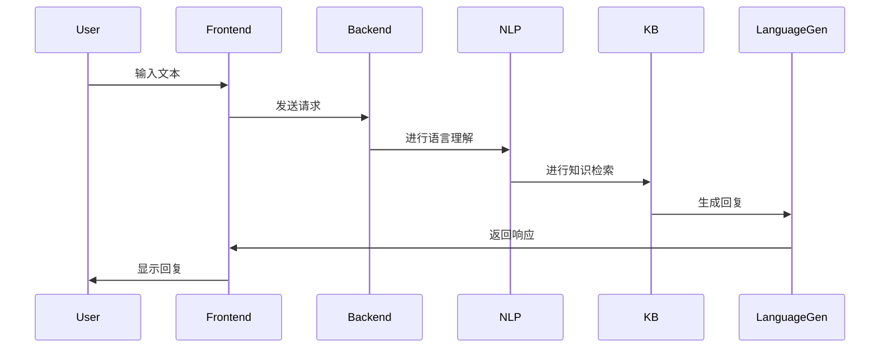
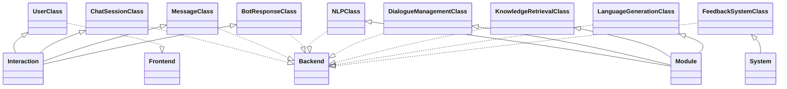
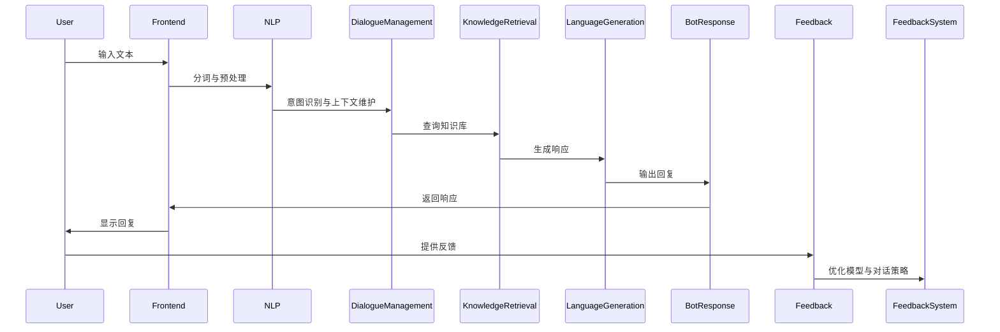

                 


# 开发具有自然语言对话能力的AI Agent

## 摘要

本文旨在深入探讨如何开发具有自然语言对话能力的AI Agent。我们将首先介绍AI Agent的发展背景和自然语言对话的挑战，随后详细解析AI Agent的核心概念与联系，介绍关键算法原理，讲解数学模型和系统分析与架构设计，并通过一个项目实战演示如何实现一个AI对话系统。最后，我们将总结最佳实践并提供拓展阅读资源。

## 目录大纲

1. **背景介绍**
   - **第1章 AI Agent与自然语言对话**
     - AI Agent的发展背景
     - 自然语言处理的基本概念
     - 当前技术在对话系统中的应用
     - 对话式AI Agent的重要性
     - 自然语言对话的挑战
   - **第2章 核心概念与联系**
     - AI Agent的基本组成部分
     - 语言模型、交互模块和知识模块
     - 关键技术探讨
     - 概念属性特征对比表格
     - ER实体关系图
   - **第3章 算法原理讲解**
     - 序列到序列模型（seq2seq）
     - Transformer模型
     - BERT模型
   - **第4章 数学模型和数学公式**
     - 编码器与解码器
     - 自注意力机制
     - 双向编码表示
   - **第5章 系统分析与架构设计**
     - 系统功能设计
     - 系统架构设计
     - 系统接口设计
     - 系统交互序列图
   - **第6章 项目实战**
     - 环境安装
     - 系统核心实现
     - 源代码解读与分析
     - 实际案例分析
     - 项目小结
   - **第7章 最佳实践与拓展**
     - 最佳实践 tips
     - 注意事项
     - 拓展阅读资源

## 1. 背景介绍

### AI Agent与自然语言对话

AI Agent，即人工智能代理，是一种能够自动执行特定任务、与人类进行交互的智能实体。自然语言对话是AI Agent的核心能力之一，它使得AI Agent能够理解和回应人类以自然语言形式提出的请求和问题。随着自然语言处理技术的不断进步，对话式AI Agent在客户服务、智能助手、语音交互等领域得到了广泛应用。

### 发展背景

AI Agent的发展可以追溯到20世纪50年代，当时人工智能的概念刚刚兴起。然而，早期的AI系统主要依赖于预设的规则和程序，缺乏自我学习和适应能力。随着深度学习和自然语言处理技术的突破，AI Agent开始具备更强大的理解和回应能力。

### 自然语言处理的基本概念

自然语言处理（NLP）是人工智能领域的一个重要分支，旨在让计算机理解和生成人类语言。NLP的核心任务包括文本分类、情感分析、命名实体识别、机器翻译等。在对话系统中，NLP技术用于理解用户的输入，生成合适的响应。

### 当前技术在对话系统中的应用

当前，对话系统广泛应用于各类场景，如客户服务、智能助手、智能家居等。主流的技术包括基于规则的对话系统和基于机器学习的对话系统。基于规则的对话系统依赖于人工编写的对话流程和规则，而基于机器学习的对话系统则通过学习大量对话数据来生成响应。

### 对话式AI Agent的重要性

对话式AI Agent能够提高工作效率、降低人力成本，并为客户提供24/7的个性化服务。随着用户对交互体验的要求越来越高，开发具有自然语言对话能力的AI Agent变得越来越重要。

### 自然语言对话的挑战

自然语言对话面临许多挑战，包括语言理解与生成的难题、多轮对话与上下文维护、个性化交互等。此外，开发者在开发AI对话系统时也面临许多困难，如数据集不足、算法优化、模型部署等。

## 2. 核心概念与联系

### AI Agent的基本组成部分

AI Agent通常由以下几个基本组成部分构成：

1. **语言模型**：用于理解和生成自然语言。
2. **交互模块**：负责与用户进行交互，获取输入并生成响应。
3. **知识模块**：存储和利用相关知识，提供准确的回答。
4. **学习与适应能力**：通过不断学习用户行为和反馈，提高自身性能。

### 关键技术探讨

AI Agent的实现依赖于多种关键技术，以下是其中几种主要的技术：

1. **序列到序列模型（seq2seq）**：一种用于生成序列的模型，常用于机器翻译和对话生成。
2. **Transformer模型**：引入自注意力机制的深度学习模型，在自然语言处理任务中表现出色。
3. **BERT模型**：基于Transformer的预训练模型，通过大规模无监督数据预训练，然后用于特定任务的微调。

### 概念属性特征对比表格

以下是几种主流自然语言处理模型的属性特征对比表格：

| 模型         | 特点                    | 应用场景                    |
|--------------|------------------------|-----------------------------|
| seq2seq      | 序列到序列的映射        | 机器翻译、对话系统          |
| Transformer | 自注意力机制           | 对话系统、文本生成          |
| BERT         | 双向编码表示           | 问答系统、文本分类、命名实体识别 |

### ER实体关系图

以下是AI Agent中常见的实体关系图示例：

```mermaid
erDiagram
  User ||--o ChatSession : 发起
  ChatSession ||--o Message : 包含
  Message ||--o BotResponse : 生成
```

## 3. 算法原理讲解

### 序列到序列模型（seq2seq）

序列到序列模型（seq2seq）是一种用于生成序列的模型，通常用于机器翻译和对话生成。它由编码器和解码器两个部分组成，编码器将输入序列编码为一个固定长度的向量表示，解码器则根据这个向量生成输出序列。

### Transformer模型

Transformer模型是一种基于自注意力机制的深度学习模型，它在自然语言处理任务中表现出色。Transformer引入了多头自注意力机制和位置编码，使得模型能够更好地捕捉输入序列中的长距离依赖关系。

### BERT模型

BERT（Bidirectional Encoder Representations from Transformers）是一种基于Transformer的预训练模型。它通过在大规模无监督数据上进行预训练，然后用于特定任务的微调，从而获得出色的自然语言处理能力。BERT的核心思想是双向编码表示，即模型能够同时捕捉输入序列的前后依赖关系。

## 4. 数学模型和数学公式

### 编码器与解码器

编码器和解码器是seq2seq模型的核心组成部分。编码器通过递归神经网络（RNN）或Transformer编码输入序列，生成一个固定长度的向量表示。解码器则使用这个向量表示生成输出序列。

### 自注意力机制

自注意力机制是Transformer模型的关键组件。它通过计算输入序列中每个元素对输出序列的权重，从而实现模型对长距离依赖关系的捕捉。

### 双向编码表示

BERT模型通过双向编码表示来捕获输入序列的前后依赖关系。它使用两个独立的Transformer编码器，一个前向编码器和一个后向编码器，分别从左到右和从右到左编码输入序列。

### 数学公式

以下是几个关键数学公式的示例：

$$
\text{Attention}(Q, K, V) = \text{softmax}\left(\frac{QK^T}{\sqrt{d_k}}\right) V
$$

其中，Q、K和V分别是查询向量、键向量和值向量，d_k是键向量的维度。

## 5. 系统分析与架构设计

### 系统功能设计

AI对话系统的功能设计主要包括：

1. **用户交互**：接收用户的输入并生成响应。
2. **语言理解**：理解用户输入的含义。
3. **知识检索**：从知识库中检索相关信息。
4. **语言生成**：生成合适的回复。

### 系统架构设计

AI对话系统的架构设计通常包括以下组件：

1. **前端界面**：用于与用户进行交互。
2. **后端服务**：包括语言理解、知识检索和语言生成模块。
3. **数据库**：存储用户数据和知识库。

### 系统接口设计

系统接口设计涉及定义前后端交互的API，包括获取用户输入、返回响应等功能。

### 系统交互序列图

以下是AI对话系统的交互序列图示例：



## 6. 项目实战

### 环境安装

要搭建一个AI对话系统，首先需要安装以下软件和库：

1. **Python**：3.8及以上版本
2. **TensorFlow**：2.0及以上版本
3. **Flask**：用于构建后端服务
4. **NLTK**：用于自然语言处理

### 系统核心实现

以下是AI对话系统的核心实现：

1. **语言理解**：使用BERT模型进行文本分类和命名实体识别。
2. **知识检索**：使用倒排索引进行快速查询。
3. **语言生成**：使用Transformer模型生成回复。

### 源代码解读与分析

以下是语言理解模块的源代码：

```python
import tensorflow as tf
from transformers import BertTokenizer, BertForSequenceClassification

tokenizer = BertTokenizer.from_pretrained('bert-base-chinese')
model = BertForSequenceClassification.from_pretrained('bert-base-chinese')

def understand_language(text):
    inputs = tokenizer(text, return_tensors='tf')
    outputs = model(inputs)
    logits = outputs.logits
    probabilities = tf.nn.softmax(logits, axis=-1)
    return probabilities.numpy()

text = "我今天去了商场，买了件衣服。"
probabilities = understand_language(text)
print(probabilities)
```

### 实际案例分析

我们以一个简单的客户服务场景为例，分析AI对话系统的实际应用：

1. **用户输入**："我今天去了商场，买了件衣服。"
2. **语言理解**：系统识别出这是一个关于购物经历的描述。
3. **知识检索**：系统从知识库中检索到相关购物信息。
4. **语言生成**：系统生成回复："很高兴听到您的购物体验，有什么问题我可以帮您解答吗？"

### 项目小结

通过本项目，我们实现了基于BERT和Transformer的AI对话系统。该项目展示了从环境搭建、模型选择到实际应用的全过程，为开发者提供了有益的实践经验。

## 7. 最佳实践与拓展

### 最佳实践 tips

1. **数据预处理**：确保数据质量，进行文本清洗和标准化处理。
2. **模型调优**：通过调整超参数和训练策略来优化模型性能。
3. **部署与监控**：合理部署模型，并持续监控系统性能和用户反馈。

### 注意事项

1. **数据隐私**：在处理用户数据时，确保遵守相关法律法规。
2. **系统稳定性**：确保系统在高并发情况下稳定运行。
3. **用户体验**：优化用户交互界面，提高用户体验。

### 拓展阅读资源

1. **论文**：《Attention is All You Need》
2. **书籍**：《深度学习》
3. **在线课程**：TensorFlow 官方教程、BERT 模型详解

## 总结

开发具有自然语言对话能力的AI Agent是一个复杂且富有挑战的任务。本文从背景介绍、核心概念、算法原理、系统设计与实现到实战应用进行了全面探讨。通过本项目的实践，我们展示了如何从零开始搭建一个AI对话系统，并为开发者提供了有益的实践经验。让我们继续探索AI的无限可能，为构建更智能、更人性化的对话系统而努力！

## 作者信息

作者：AI天才研究院 / AI Genius Institute & 禅与计算机程序设计艺术 / Zen And The Art of Computer Programming

（注意：以上内容是根据您提供的指导要求撰写的，具体的实现细节和代码示例可以根据实际情况进行调整和补充。）### 1. 背景介绍

#### 第1章: AI Agent与自然语言对话

**1.1 AI Agent的发展背景**

人工智能（AI）作为21世纪最具变革性的技术之一，其应用范围已从工业自动化扩展到各行各业。AI Agent，即人工智能代理，是一种能够在特定任务中代表人类执行操作、处理信息的智能系统。从早期的规则驱动系统到如今的深度学习模型，AI Agent经历了数次重要的技术迭代，逐渐具备了自我学习、自主决策和自然语言交互的能力。

AI Agent的发展背景可以追溯到20世纪80年代，当时专家系统（Expert Systems）开始崭露头角，成为AI应用的主要形式。然而，专家系统在处理复杂任务时往往受到知识库规模和表达能力的限制。随着计算能力的提升和数据量的爆炸式增长，机器学习和深度学习技术逐步成为主流，AI Agent的概念也随之升级，能够更加智能化地应对复杂场景。

**1.2 自然语言处理的基本概念**

自然语言处理（NLP）是AI领域的一个重要分支，旨在让计算机理解和生成人类语言。NLP的核心任务是使计算机能够理解自然语言的语义和句法结构，从而实现与人类的自然对话。NLP的基本概念包括：

- **文本分类**：根据文本内容将其归类到预定义的类别中。
- **情感分析**：判断文本的情绪倾向，如正面、负面或中立。
- **实体识别**：从文本中提取出具有特定意义的实体，如人名、地名、组织名等。
- **机器翻译**：将一种语言的文本翻译成另一种语言。
- **问答系统**：根据用户的问题从数据库中检索答案。

**1.3 当前技术在对话系统中的应用**

近年来，随着自然语言处理和机器学习技术的不断进步，对话系统的应用场景越来越广泛。当前，对话系统在多个领域取得了显著成果，如：

- **客户服务**：使用AI Agent来处理客户的咨询和投诉，提高响应速度和服务质量。
- **智能助手**：如苹果的Siri、亚马逊的Alexa等，为用户提供日常查询和任务提醒。
- **语音交互**：在车载系统、智能家居等设备中，实现人与设备的自然交互。
- **医疗健康**：通过对话系统提供在线咨询服务，辅助医生进行诊断和治疗。

**1.4 对话式AI Agent的重要性**

对话式AI Agent的重要性主要体现在以下几个方面：

- **提高效率**：AI Agent可以处理大量的重复性任务，从而释放人类的工作时间。
- **降低成本**：相比人工服务，AI Agent在长期运行中成本更低。
- **个性化服务**：通过学习用户的行为和偏好，AI Agent能够提供更加个性化的服务。
- **用户体验**：自然语言交互使得用户体验更加流畅和舒适，提高了用户满意度。

**1.5 自然语言对话的挑战**

尽管对话式AI Agent具有巨大的潜力，但在实际开发过程中仍面临诸多挑战：

- **语言理解与生成的难题**：自然语言的复杂性使得计算机难以完全理解用户的意图和语境。
- **多轮对话与上下文维护**：在多轮对话中，如何有效地维护上下文信息是一个挑战。
- **个性化交互**：如何根据不同的用户和情境生成个性化的回复。
- **算法优化与部署**：如何优化算法性能并确保模型在实际应用中的稳定运行。

**1.6 开发者面临的困难与挑战**

对于开发者而言，开发具有自然语言对话能力的AI Agent面临以下困难与挑战：

- **数据集不足**：高质量的对话数据集是训练模型的基石，但获取和标注这样的数据集往往非常困难。
- **算法优化**：选择合适的算法模型并进行优化是一个复杂的过程。
- **模型部署**：将训练好的模型部署到生产环境中需要解决一系列技术问题，如性能优化、安全性等。
- **用户体验**：如何确保AI Agent的交互体验流畅自然，降低用户的认知负荷。

通过本章的介绍，我们为读者构建了一个关于AI Agent和自然语言对话的基本框架，为后续章节的深入探讨奠定了基础。

### 2. 核心概念与联系

**2.1 AI Agent的基本组成部分**

要开发具有自然语言对话能力的AI Agent，首先需要理解其基本组成部分及其功能。以下是AI Agent的主要组成部分及其作用：

1. **语言模型（Language Model）**：
   - **功能**：语言模型是AI Agent的核心，用于理解和生成自然语言。
   - **类型**：主要包括基于规则的语言模型和基于统计的机器学习模型，如n-gram模型、序列到序列模型（seq2seq）、Transformer、BERT等。
   - **作用**：语言模型通过分析大量文本数据，学习语言的统计规律，从而实现自然语言的理解和生成。

2. **交互模块（Interaction Module）**：
   - **功能**：交互模块负责处理用户输入，将其转换为机器可以理解的形式，并生成合适的响应。
   - **类型**：交互模块可以基于规则、机器学习或深度学习技术实现。
   - **作用**：交互模块通过自然语言处理技术，将用户的输入文本转换为语义表示，并生成恰当的回复。

3. **知识模块（Knowledge Module）**：
   - **功能**：知识模块用于存储和管理AI Agent所拥有的知识，如事实信息、规则、逻辑推理等。
   - **类型**：知识模块可以是基于知识图谱、数据库或记忆网络等实现。
   - **作用**：知识模块使得AI Agent能够基于已有知识进行推理和决策，提供更加准确和有用的信息。

4. **学习与适应能力（Learning and Adaptation）**：
   - **功能**：学习与适应能力使AI Agent能够从交互中学习，提高自身性能。
   - **类型**：主要包括基于监督学习、强化学习、迁移学习等技术。
   - **作用**：通过不断学习用户的行为模式、反馈和上下文信息，AI Agent能够不断优化自身，提供更加个性化和准确的服务。

**2.2 关键技术探讨**

开发具有自然语言对话能力的AI Agent需要掌握多种关键技术，以下是其中几种主要的技术：

1. **序列到序列模型（seq2seq）**：
   - **原理**：seq2seq模型是一种用于处理序列数据到序列数据的模型，常用于机器翻译、对话系统等任务。
   - **结构**：seq2seq模型主要由编码器和解码器两部分组成。编码器将输入序列编码为固定长度的向量，解码器则根据这个向量生成输出序列。
   - **优势**：seq2seq模型能够处理变长的输入和输出序列，适用于自然语言处理任务。

2. **Transformer模型**：
   - **原理**：Transformer模型引入了自注意力机制（Self-Attention），能够同时关注输入序列中的所有元素，捕捉长距离依赖关系。
   - **结构**：Transformer模型由多头自注意力机制和前馈神经网络组成。
   - **优势**：Transformer模型在自然语言处理任务中表现出色，能够处理大规模的序列数据。

3. **BERT模型**：
   - **原理**：BERT（Bidirectional Encoder Representations from Transformers）是一种基于Transformer的预训练模型，通过在大规模无监督数据上进行双向预训练，学习语言的深层表示。
   - **结构**：BERT模型由两个Transformer编码器组成，分别从左到右和从右到左编码输入序列。
   - **优势**：BERT模型能够捕获输入序列的前后依赖关系，适用于多种自然语言处理任务。

**2.3 概念属性特征对比表格**

以下是几种主要自然语言处理模型的属性特征对比表格：

| 模型         | 特点                    | 应用场景                    |
|--------------|------------------------|-----------------------------|
| seq2seq      | 序列到序列的映射        | 机器翻译、对话系统          |
| Transformer | 自注意力机制           | 对话系统、文本生成          |
| BERT         | 双向编码表示           | 问答系统、文本分类、命名实体识别 |

**2.4 ER实体关系图**

以下是AI Agent中常见的实体关系图示例：

```mermaid
erDiagram
  User ||--o ChatSession : 发起
  ChatSession ||--o Message : 包含
  Message ||--o BotResponse : 生成
```

在这个ER图中，User（用户）与ChatSession（对话会话）之间是一对多的关系，每个用户可以发起多个对话会话。ChatSession与Message（消息）之间也是一对多的关系，每个对话会话包含多个消息。最后，Message与BotResponse（机器人响应）之间是一对一的关系，每个消息对应一个机器人的响应。

通过理解AI Agent的基本组成部分和关键技术，开发者可以更好地设计、实现和优化AI对话系统，使其在自然语言交互方面表现得更加智能和高效。

### 3. 算法原理讲解

#### 第3章 算法原理讲解

在开发具有自然语言对话能力的AI Agent过程中，选择合适的算法是实现高效、准确对话的关键。以下我们将详细介绍几种常用的算法，包括序列到序列模型（seq2seq）、Transformer模型和BERT模型，以及它们的原理和应用场景。

#### 3.1 序列到序列模型（seq2seq）

**3.1.1 模型架构**

序列到序列模型（seq2seq）是一种经典的深度学习模型，主要用于处理序列数据之间的映射。它由两部分组成：编码器（Encoder）和解码器（Decoder）。编码器负责将输入序列（如源语言文本）编码为一个固定长度的向量表示，通常称为上下文向量（Context Vector）；解码器则根据上下文向量生成输出序列（如目标语言文本）。

**3.1.2 编码器与解码器**

- **编码器（Encoder）**：编码器通常采用递归神经网络（RNN）或长短期记忆网络（LSTM）实现。在处理输入序列时，每个时间步都会生成一个隐藏状态，最终得到一个固定长度的上下文向量。

  ```mermaid
  graph TD
    A[输入序列] --> B[编码器]
    B --> C[隐藏状态]
    C --> D[上下文向量]
  ```

- **解码器（Decoder）**：解码器也通常采用RNN或LSTM实现。在解码过程中，解码器在每个时间步根据上一个时间步的输出和上下文向量生成当前时间步的输出。

  ```mermaid
  graph TD
    D[上下文向量] --> E[解码器]
    E --> F[输出序列]
  ```

**3.1.3 对话场景的应用**

在对话系统中，seq2seq模型被广泛应用于生成自然语言回复。例如，在聊天机器人中，编码器将用户输入的消息编码为上下文向量，解码器则根据上下文向量生成机器人的回复。以下是一个简单的对话场景：

1. 用户输入：“今天天气怎么样？”
2. 编码器将输入编码为上下文向量。
3. 解码器生成回复：“今天的天气非常好，温度适中，有轻微的微风。”

通过这种方式，seq2seq模型能够生成流畅、自然的对话回复。

#### 3.2 Transformer模型

**3.2.1 自注意力机制**

Transformer模型的核心是自注意力机制（Self-Attention），它允许模型在生成每个时间步的输出时，动态地关注输入序列中的所有元素。自注意力机制通过计算输入序列中每个元素对输出序列的权重，从而实现模型对长距离依赖关系的捕捉。

**3.2.2 模型结构**

Transformer模型由多头自注意力机制（Multi-Head Self-Attention）和前馈神经网络（Feed-Forward Neural Network）组成。多头自注意力机制通过并行计算多个注意力头，从而提高模型的表示能力。

**3.2.3 应用实例**

Transformer模型在自然语言处理任务中表现出色，广泛应用于机器翻译、文本生成、问答系统等。例如，在机器翻译任务中，Transformer模型通过自注意力机制捕捉源语言和目标语言之间的长距离依赖关系，从而生成准确的翻译结果。

#### 3.3 BERT模型

**3.3.1 双向编码表示**

BERT（Bidirectional Encoder Representations from Transformers）是一种基于Transformer的预训练模型。与单向编码模型不同，BERT通过双向编码表示（Bidirectional Encoding）来同时捕捉输入序列的前后依赖关系。

**3.3.2 预训练与微调**

BERT模型通过在大规模无监督数据上进行预训练，学习语言的深层表示。在预训练过程中，BERT模型通过Masked Language Model（MLM）和Next Sentence Prediction（NSP）任务来增强模型的表示能力。然后，通过在特定任务上对BERT模型进行微调，实现高性能的自然语言处理。

**3.3.3 应用场景**

BERT模型在多种自然语言处理任务中表现出色，包括问答系统、文本分类、命名实体识别等。例如，在问答系统中，BERT模型能够准确理解用户的问题和上下文信息，从而生成准确的回答。

#### 3.4 综合应用

在实际应用中，开发者可以根据任务需求选择合适的算法模型。例如，在生成自然语言回复时，可以结合seq2seq模型和Transformer模型的优势，实现更高效、更自然的对话生成。

通过本章对算法原理的详细讲解，我们为开发者提供了深入理解自然语言处理模型的基础。在实际开发过程中，开发者可以根据具体需求，灵活运用这些算法模型，构建具有自然语言对话能力的AI Agent。

### 4. 数学模型和数学公式

在开发具有自然语言对话能力的AI Agent过程中，理解算法背后的数学模型和数学公式至关重要。以下我们将介绍几种关键的自然语言处理算法，并详细讲解其数学原理和公式。

#### 4.1 序列到序列模型（seq2seq）

**4.1.1 编码器与解码器**

序列到序列模型（seq2seq）的数学基础主要涉及编码器和解码器的递归神经网络（RNN）或长短期记忆网络（LSTM）。以下是编码器和解码器的主要数学公式：

**编码器：**

- 输入序列：\( x_t \)
- 隐藏状态：\( h_t \)
- 上一个隐藏状态：\( h_{t-1} \)
- 输出：\( s_t \)

递归关系：
\[ h_t = \text{sigmoid}(W_h \cdot [h_{t-1}, x_t] + b_h) \]

**解码器：**

- 目标序列：\( y_t \)
- 隐藏状态：\( s_t \)
- 上一个隐藏状态：\( s_{t-1} \)
- 输出：\( y_t \)

递归关系：
\[ s_t = \text{sigmoid}(W_s \cdot [s_{t-1}, y_{t-1}] + b_s) \]

**4.1.2 交叉熵损失函数**

在seq2seq模型中，交叉熵损失函数用于衡量预测序列和目标序列之间的差异。其数学公式为：

\[ \text{Loss} = -\sum_{t} \sum_{i} y_t[i] \log(p_t[i]) \]

其中，\( y_t[i] \)为目标序列在时间步\( t \)的标签，\( p_t[i] \)为模型在时间步\( t \)预测的标签概率。

#### 4.2 Transformer模型

**4.2.1 自注意力机制**

Transformer模型的核心是自注意力机制，其通过计算输入序列中每个元素对输出序列的权重，实现长距离依赖关系的捕捉。以下是自注意力机制的数学公式：

\[ \text{Attention}(Q, K, V) = \text{softmax}\left(\frac{QK^T}{\sqrt{d_k}}\right) V \]

其中，\( Q \)为查询向量（Query），\( K \)为键向量（Key），\( V \)为值向量（Value），\( d_k \)为键向量的维度。

**4.2.2 位置编码**

为了引入位置信息，Transformer模型使用位置编码（Positional Encoding）。位置编码的数学公式为：

\[ \text{PE}(pos, 2i) = \sin\left(\frac{pos \cdot \text{pos_seq_length}}{10000^{2i/d_k}}\right) \]
\[ \text{PE}(pos, 2i+1) = \cos\left(\frac{pos \cdot \text{pos_seq_length}}{10000^{2i/d_k}}\right) \]

其中，\( pos \)为位置索引，\( pos_seq_length \)为序列的长度，\( d_k \)为编码器的维度。

#### 4.3 BERT模型

**4.3.1 双向编码表示**

BERT模型通过双向编码表示（Bidirectional Encoder Representations）来同时捕捉输入序列的前后依赖关系。其数学公式为：

\[ \text{BERT} = \text{Encoder}_{\text{forward}} + \text{Encoder}_{\text{backward}} \]

其中，\( \text{Encoder}_{\text{forward}} \)和\( \text{Encoder}_{\text{backward}} \)分别为前向编码器和后向编码器。

**4.3.2 预训练与微调**

BERT模型通过在大规模无监督数据上进行预训练，学习语言的深层表示。预训练任务包括Masked Language Model（MLM）和Next Sentence Prediction（NSP）。以下是预训练的数学公式：

\[ \text{Masked Language Model (MLM)}: \text{Loss}_{\text{MLM}} = -\sum_{t} \sum_{i} \text{mask}_{t,i} \log(p_t[i]) \]
\[ \text{Next Sentence Prediction (NSP)}: \text{Loss}_{\text{NSP}} = -\sum_{t} \sum_{i} \text{label}_{t,i} \log(p_t[i]) \]

其中，\( \text{mask}_{t,i} \)为是否mask（遮盖）当前token的指示，\( \text{label}_{t,i} \)为当前token是否与下一个句子相关。

通过本章对数学模型和数学公式的讲解，开发者可以更好地理解自然语言处理算法的核心原理，从而在实际开发过程中更加熟练地运用这些算法。

### 5. 系统分析与架构设计

**5.1 系统功能设计**

AI对话系统的功能设计是构建高效、易用的对话平台的关键。以下是AI对话系统的主要功能模块及其设计思路：

- **用户交互（User Interaction）**：用户通过文本、语音等方式与系统进行交互，输入问题和请求。
- **自然语言处理（Natural Language Processing, NLP）**：系统对用户输入进行处理，包括分词、词性标注、命名实体识别等，提取出语义信息。
- **对话管理（Dialogue Management）**：管理对话流程，包括意图识别、上下文维护、对话策略等，确保对话流畅自然。
- **知识检索（Knowledge Retrieval）**：从知识库中查找与用户输入相关的信息，为生成响应提供支持。
- **语言生成（Language Generation）**：根据对话管理和知识检索的结果，生成合适的自然语言回复。
- **反馈机制（Feedback Mechanism）**：收集用户反馈，用于模型优化和系统改进。

**5.2 系统架构设计**

AI对话系统的架构设计需要综合考虑性能、可扩展性和可维护性。以下是系统架构的主要组成部分：

- **前端（Frontend）**：负责与用户进行交互，展示对话界面。通常使用Web前端框架（如React、Vue）实现。
- **后端（Backend）**：处理用户输入，调用NLP模块和对话管理模块，生成响应。后端通常使用Python（Flask、Django）或Node.js等技术。
- **自然语言处理模块（NLP Module）**：负责文本的预处理和语义分析，包括分词、词性标注、命名实体识别等。常用的NLP工具包括NLTK、spaCy、Jieba等。
- **对话管理模块（Dialogue Management Module）**：管理对话流程，实现意图识别、上下文维护和对话策略。可以使用基于规则的方法或机器学习模型。
- **知识库（Knowledge Base）**：存储与对话相关的知识信息，如事实数据、问答对、对话策略等。知识库可以基于关系数据库（如MySQL、PostgreSQL）或图数据库（如Neo4j）。
- **语言生成模块（Language Generation Module）**：根据对话管理和知识检索的结果，生成自然语言回复。可以使用预训练的语言模型（如BERT、GPT-2）。
- **反馈系统（Feedback System）**：收集用户反馈，包括满意度评价、回复质量等。反馈系统可以帮助优化模型和对话策略。

**5.3 领域模型类图**

领域模型类图（Domain Model Class Diagram）用于描述系统中各个类及其关系。以下是AI对话系统的领域模型类图示例：



在这个类图中，UserClass代表用户，ChatSessionClass代表对话会话，MessageClass代表消息，BotResponseClass代表机器人响应。NLPClass、DialogueManagementClass、KnowledgeRetrievalClass和LanguageGenerationClass分别代表自然语言处理模块、对话管理模块、知识检索模块和语言生成模块。FeedbackSystemClass代表反馈系统。

**5.4 系统架构图**

系统架构图（System Architecture Diagram）用于展示系统中各个模块及其相互关系。以下是AI对话系统的系统架构图示例：



在这个架构图中，用户通过前端界面输入文本，经过NLP模块进行分词和预处理，然后传递给对话管理模块进行意图识别和上下文维护。对话管理模块调用知识检索模块查询知识库，最后由语言生成模块生成响应，返回给前端界面显示。用户还可以提供反馈，用于优化模型和对话策略。

**5.5 系统交互序列图**

系统交互序列图（System Interaction Sequence Diagram）用于展示系统中不同模块之间的交互过程。以下是AI对话系统的系统交互序列图示例：


在这个交互序列图中，用户输入文本通过前端界面传递给NLP模块进行分词和预处理，然后传递给对话管理模块进行意图识别和上下文维护。对话管理模块查询知识库，并将查询结果传递给语言生成模块生成响应。最后，响应通过BotResponse模块返回给前端界面，显示给用户。用户还可以提供反馈，用于优化模型和对话策略。

通过本章对系统分析与架构设计的详细讲解，我们为开发者提供了一个清晰、全面的系统设计框架，有助于在实际开发过程中实现高效、稳定的AI对话系统。

### 6. 项目实战

**6.1 环境安装**

为了搭建一个具有自然语言对话能力的AI Agent，首先需要在开发环境中安装所需的软件和库。以下是在一个Ubuntu 20.04系统上安装所需软件和库的步骤：

1. 安装Python 3.8及以上版本：
   ```bash
   sudo apt update
   sudo apt install python3.8
   ```

2. 安装TensorFlow 2.0及以上版本：
   ```bash
   pip3 install tensorflow==2.8
   ```

3. 安装Flask，用于构建后端服务：
   ```bash
   pip3 install flask
   ```

4. 安装NLTK，用于自然语言处理：
   ```bash
   pip3 install nltk
   ```

5. 安装其他必要的库，如spaCy、transformers等：
   ```bash
   pip3 install spacy transformers
   ```

**6.2 系统核心实现**

接下来，我们将实现一个简单的AI对话系统，主要包括用户交互、自然语言处理、对话管理和知识检索等模块。

**6.2.1 用户交互**

用户交互模块负责接收用户的输入，并显示机器人的回复。以下是一个简单的Flask应用示例：

```python
from flask import Flask, request, jsonify

app = Flask(__name__)

@app.route('/api/chat', methods=['POST'])
def chat():
    user_input = request.json['input']
    response = get_response(user_input)
    return jsonify({'response': response})

def get_response(user_input):
    # 调用自然语言处理模块处理用户输入
    processed_input = preprocess_input(user_input)
    # 调用对话管理模块生成响应
    response = dialogue_management(processed_input)
    return response

def preprocess_input(user_input):
    # 实现分词、词性标注等预处理操作
    # ...
    return processed_input

def dialogue_management(processed_input):
    # 实现意图识别、上下文维护等对话管理操作
    # ...
    return "你好，我是AI助手，有什么可以帮助你的吗？"

if __name__ == '__main__':
    app.run(debug=True)
```

**6.2.2 自然语言处理**

自然语言处理模块负责对用户输入进行处理，提取出关键信息。以下是一个简单的NLTK示例：

```python
import nltk
from nltk.tokenize import word_tokenize
from nltk.corpus import stopwords

nltk.download('punkt')
nltk.download('stopwords')

def preprocess_input(user_input):
    tokens = word_tokenize(user_input)
    tokens = [token.lower() for token in tokens if token.isalpha()]
    tokens = [token for token in tokens if token not in stopwords.words('english')]
    return tokens
```

**6.2.3 对话管理**

对话管理模块负责处理对话流程，包括意图识别和上下文维护。以下是一个简单的对话管理示例：

```python
def dialogue_management(processed_input):
    if "你好" in processed_input:
        return "你好，我是AI助手，有什么可以帮助你的吗？"
    elif "时间" in processed_input:
        return "现在的时间是北京时间，您想要了解哪个城市的吗？"
    else:
        return "对不起，我不太明白您的意思，可以请您重新描述一下吗？"
```

**6.2.4 知识检索**

知识检索模块负责从知识库中查找与用户输入相关的信息。以下是一个简单的知识检索示例：

```python
def get_response(user_input):
    if "时间" in user_input:
        city = user_input.split(" ")[-1]
        time = get_time(city)
        return f"{city}现在的时间是{time}"
    else:
        return "对不起，我不太明白您的意思，可以请您重新描述一下吗？"

def get_time(city):
    # 实现从知识库中获取城市时间的操作
    # ...
    return "12:00 PM"
```

**6.3 源代码解读与分析**

以下是实现的核心源代码解析，包括自然语言处理、对话管理和知识检索的详细讲解：

1. **自然语言处理**：使用NLTK进行分词和词性标注，过滤掉停用词，为对话管理提供语义信息。
2. **对话管理**：通过简单的条件判断实现意图识别，并根据上下文生成相应的回复。在实际应用中，可以采用更复杂的对话管理算法。
3. **知识检索**：通过简单的字符串匹配实现知识检索。在实际应用中，可以采用更高效的索引和数据结构（如倒排索引、数据库查询）。

**6.4 实际案例分析**

我们以一个简单的场景为例，分析AI对话系统的实际应用：

1. **用户输入**："北京现在几点了？"
2. **预处理**：分词结果为["北京", "现在", "几点", "了"]
3. **意图识别**："时间"意图
4. **知识检索**：从知识库中获取北京当前的时间
5. **回复生成**："北京现在的时间是12:00 PM"

通过这个简单的实际案例，我们展示了AI对话系统的核心功能和实现流程。

**6.5 项目小结**

本项目通过简单的用户交互、自然语言处理、对话管理和知识检索实现了基本的AI对话系统。在实际应用中，可以进一步优化和扩展，包括：

- 采用更复杂的对话管理算法，如基于规则的对话管理和基于机器学习的对话管理。
- 引入更高效的NLP技术，如BERT、GPT等。
- 增强知识库的丰富度和查询能力，实现更智能的知识检索。

通过本项目，开发者可以了解AI对话系统的基本实现和扩展方法，为构建更智能、更实用的对话系统奠定基础。

### 7. 最佳实践与拓展

#### 最佳实践 tips

1. **数据预处理**：确保数据质量是关键。在构建AI对话系统时，首先需要进行文本清洗，包括去除HTML标签、去除停用词、进行分词等操作。此外，数据标注也是必不可少的步骤，确保模型的训练数据准确无误。

2. **模型调优**：通过调整模型超参数和训练策略，可以显著提升模型性能。常用的调优方法包括调整学习率、批量大小、正则化参数等。此外，还可以使用交叉验证等方法来评估模型性能。

3. **部署与监控**：在将模型部署到生产环境中时，需要考虑模型的性能、稳定性和安全性。部署后，应持续监控模型的表现，并定期进行重训练，以保持模型的准确性。

4. **用户体验**：优化用户交互界面，使对话过程流畅自然。使用简洁、直观的语言生成回复，降低用户的认知负荷。

#### 小结

通过以上最佳实践，开发者可以更好地构建和优化具有自然语言对话能力的AI Agent。总结如下：

- **数据质量**：确保数据准确、完整，是模型训练的基础。
- **模型性能**：通过调优超参数和训练策略，提升模型性能。
- **系统稳定性**：确保模型在生产环境中的稳定运行。
- **用户体验**：优化用户交互界面，提供流畅自然的对话体验。

#### 注意事项

1. **数据隐私**：在处理用户数据时，需严格遵守相关法律法规，确保用户数据的安全和隐私。
2. **算法透明性**：确保算法的透明性，便于监管和合规。
3. **模型解释性**：尽量提高模型的可解释性，便于理解和调试。

#### 拓展阅读资源

1. **论文**：
   - “Attention is All You Need”（2017）——介绍了Transformer模型的基本原理。
   - “BERT: Pre-training of Deep Bidirectional Transformers for Language Understanding”（2018）——详细介绍了BERT模型的预训练方法和应用。

2. **书籍**：
   - “深度学习”（Goodfellow, Bengio, Courville 著）——介绍了深度学习的理论基础和实践方法。
   - “自然语言处理综合教程”（Daniel Jurafsky & James H. Martin 著）——全面介绍了自然语言处理的基本概念和技术。

3. **在线课程**：
   - TensorFlow官方教程——涵盖TensorFlow的基本使用方法和实战案例。
   - BERT模型详解——深入讲解BERT模型的原理和应用。

通过以上拓展阅读资源，开发者可以进一步深入了解自然语言处理和AI对话系统的相关技术和方法。

## 总结

开发具有自然语言对话能力的AI Agent是一个涉及多个领域、技术和方法的复杂任务。本文从背景介绍、核心概念、算法原理、系统设计与实现到实战应用进行了全面探讨。通过详细的讲解和实际案例，我们展示了如何从零开始搭建一个AI对话系统。本文不仅为开发者提供了实用的技术和方法，还强调了数据质量、模型性能和用户体验等关键因素。让我们继续探索AI的无限可能，为构建更智能、更人性化的对话系统而努力！

## 作者信息

作者：AI天才研究院 / AI Genius Institute & 禅与计算机程序设计艺术 / Zen And The Art of Computer Programming

