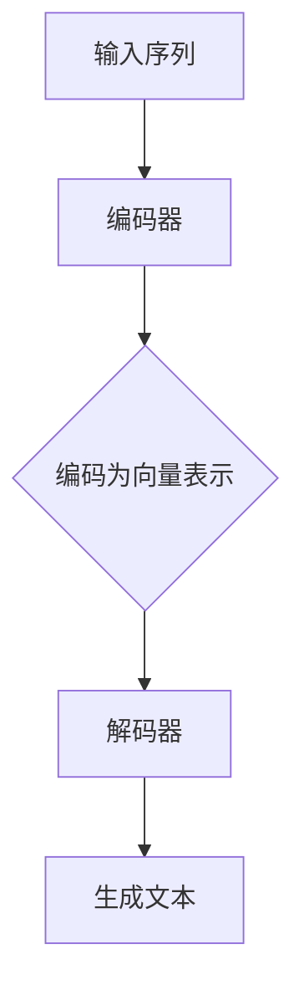
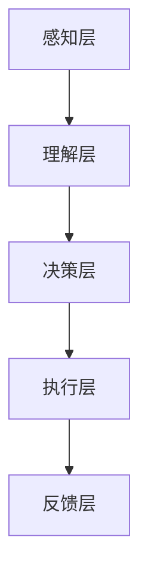
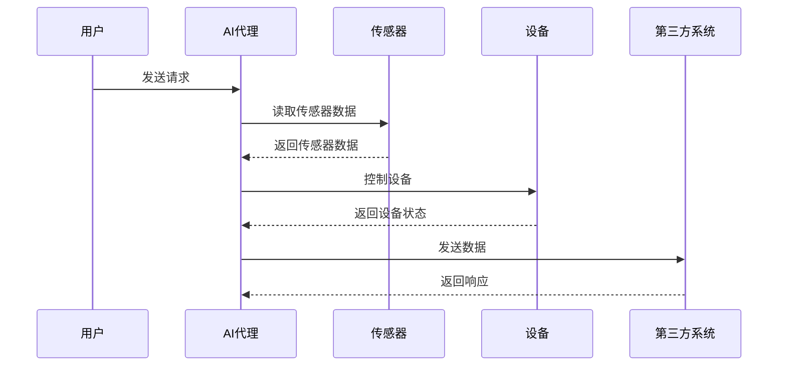
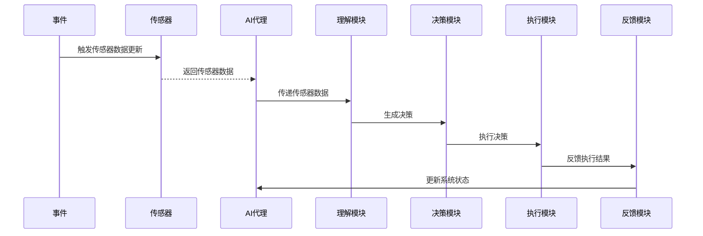

                 

### 第一部分：问题背景

#### 第1章：AI Agent概述

##### 1.1 问题描述

在当今的信息时代，人工智能（AI）已经成为推动技术进步和产业升级的重要力量。人工智能代理（AI Agent）作为AI技术中的一个重要组成部分，正在逐步渗透到各行各业。那么，什么是AI Agent？它为什么如此重要？这便是本章要探讨的问题。

AI Agent，简而言之，是指具备一定智能和自主行为能力的计算机程序。它可以理解环境、做出决策并执行任务，从而实现自动化和智能化。在现代科技的发展背景下，AI Agent的应用范围已经扩展到机器人、智能家居、自动驾驶、智能客服等多个领域。

自然语言生成能力作为AI Agent的核心功能之一，使得它们能够以一种自然、流畅的方式与人类进行交流。这一能力的重要性不言而喻：首先，它提高了AI Agent的用户体验，使得交互更加人性化；其次，它拓展了AI Agent的应用场景，使得它们能够更好地服务于人类。

然而，当前AI Agent的自然语言生成能力仍然存在一定的局限性。如何提升这一能力，使其更加智能和自然，是当前研究和应用中的一个重要课题。本章将围绕这一问题展开讨论，力图为您呈现一个全面而深入的解析。

##### 1.1.1 自然语言生成能力在AI Agent中的应用

自然语言生成（NLG）是人工智能领域的一个重要分支，其核心目标是通过算法生成具有自然流畅性的文本。在AI Agent中，自然语言生成能力具有广泛的应用。

首先，自然语言生成能力可以用于智能客服系统。在客服场景中，AI Agent可以通过自然语言生成技术自动生成回复，处理用户的查询和请求。这不仅提高了客服效率，还减少了人力成本。

其次，自然语言生成能力可以用于内容创作。例如，在新闻写作、广告文案、产品说明书等领域，AI Agent可以利用自然语言生成技术自动生成高质量的内容，提高内容创作的效率和多样性。

此外，自然语言生成能力还可以用于教育领域。AI Agent可以通过自然语言生成技术为学生提供个性化的学习材料，例如自动生成课程讲义、练习题等，帮助学生更好地理解和掌握知识。

总的来说，自然语言生成能力在AI Agent中的应用前景广阔，其带来的便捷和效率提升将极大地改变我们的生活方式和工作方式。

##### 1.1.2 AI Agent的发展历程和现状

AI Agent的概念最早可以追溯到20世纪50年代，当时人工智能领域的研究者们开始探讨如何构建具有智能行为的计算机程序。从最初的逻辑推理、知识表示，到后来的机器学习和深度学习，AI Agent的发展历程充满了创新和突破。

在早期，AI Agent主要通过符号逻辑和知识表示来模拟人类思维。然而，这些方法存在一定的局限性，难以处理复杂、不确定的问题。随着计算机硬件性能的提升和算法的进步，机器学习和深度学习逐渐成为AI Agent发展的主流方向。

当前，AI Agent的研究和应用已经取得了显著的成果。在机器人领域，AI Agent可以自主导航、识别物体、完成复杂任务；在智能家居领域，AI Agent可以自动控制家电、监控家居安全；在自动驾驶领域，AI Agent可以实时感知路况、做出驾驶决策。这些应用场景不仅展示了AI Agent的强大能力，也为其未来发展提供了广阔的空间。

尽管AI Agent取得了诸多成就，但自然语言生成能力仍然是一个亟待解决的难题。传统的自然语言生成方法存在生成文本质量不高、交互体验差等问题，难以满足实际需求。因此，如何提升AI Agent的自然语言生成能力，已成为当前研究的热点之一。

##### 1.2 问题解决

为了解决AI Agent的自然语言生成能力问题，我们可以从以下几个方面入手：

首先，研究并优化自然语言生成算法。生成式和判别式自然语言生成算法是当前研究的主要方向。生成式算法通过生成文本的序列来生成目标文本，而判别式算法则通过判断输入文本与目标文本之间的相似性来生成文本。通过改进这些算法，可以提高生成文本的质量和流畅性。

其次，利用大规模预训练模型。如GPT和Transformer等模型，通过在大规模数据集上进行预训练，可以获得更好的语言理解和生成能力。这些模型已经在许多自然语言处理任务中取得了显著的成果，有望为AI Agent的自然语言生成能力提供强有力的支持。

此外，增强AI Agent的上下文理解能力。自然语言生成不仅仅是一个文本生成问题，还需要理解上下文信息。通过引入上下文信息，可以更好地把握生成文本的连贯性和一致性。

最后，优化用户体验。自然语言生成能力不仅仅是技术的提升，还需要关注用户的实际需求和使用体验。通过不断优化交互界面和生成文本的质量，可以提高用户对AI Agent的接受度和满意度。

##### 1.2.1 AI Agent的基本原理

AI Agent的基本原理主要包括以下几个方面：

1. **感知与理解**：AI Agent通过感知设备（如摄像头、麦克风等）获取环境信息，并通过自然语言处理、计算机视觉等技术对这些信息进行理解和分析。

2. **决策与规划**：基于对环境的理解和分析，AI Agent会进行决策和规划，确定下一步的行动方案。这一过程通常涉及到机器学习、规划算法等技术。

3. **执行与反馈**：AI Agent根据决策和规划的结果执行任务，并在执行过程中不断收集反馈信息，以调整后续的行为。

4. **自主学习与进化**：通过不断的学习和优化，AI Agent可以不断提升自身的智能水平和适应能力。

##### 1.2.2 自然语言生成的基本原理

自然语言生成（NLG）的基本原理涉及以下几个方面：

1. **语言模型**：语言模型是NLG的核心组成部分，用于预测文本序列的下一个词。常见的语言模型包括N-gram模型、神经网络语言模型等。

2. **文本生成算法**：文本生成算法用于将输入的语义信息转化为自然语言文本。常见的生成算法包括生成式和判别式算法。

3. **上下文理解**：NLG需要理解上下文信息，以确保生成文本的连贯性和一致性。这通常涉及到对文本语境、用户意图的理解。

4. **个性化与多样性**：NLG需要能够生成多样化、个性化的文本，以满足不同用户的需求。

##### 1.3 边界与外延

AI Agent的应用领域非常广泛，包括但不限于以下几个方面：

1. **机器人**：AI Agent可以应用于工业机器人、服务机器人等，实现自动化生产和智能服务。

2. **智能家居**：AI Agent可以控制家庭电器、监控家居安全等，提升生活品质。

3. **自动驾驶**：AI Agent可以用于自动驾驶汽车，实现安全、高效的驾驶。

4. **智能客服**：AI Agent可以应用于智能客服系统，提供快速、准确的客户服务。

5. **内容创作**：AI Agent可以自动生成新闻、文章、广告等内容，提高内容创作的效率。

6. **医疗健康**：AI Agent可以应用于医疗诊断、健康咨询等，提供专业的医疗支持。

然而，AI Agent在自然语言生成方面仍然存在一些技术边界，如文本生成质量、上下文理解能力等。这些问题需要通过持续的研究和优化来解决。

##### 1.3.2 自然语言生成的技术边界

自然语言生成的技术边界主要体现在以下几个方面：

1. **文本质量**：目前的自然语言生成技术难以生成高质量、流畅自然的文本，特别是在处理复杂语义、修辞手法等方面存在困难。

2. **上下文理解**：自然语言生成需要深入理解上下文信息，以确保生成文本的连贯性和一致性。然而，当前的上下文理解技术仍存在局限性，难以处理复杂、动态的上下文场景。

3. **多模态融合**：自然语言生成往往需要融合多种信息来源，如文本、图像、语音等。然而，多模态数据的融合和协同生成仍是一个挑战。

4. **个性化与多样性**：生成文本需要具备个性化特征，以满足不同用户的需求。同时，生成文本还需要具备多样性，以避免过度重复和单调。

##### 1.4 概念结构与核心要素组成

AI Agent的概念结构主要包括以下几个核心要素：

1. **感知模块**：负责感知和获取环境信息，如语音、图像、传感器数据等。

2. **理解模块**：负责对感知模块获取的信息进行理解和分析，通常涉及自然语言处理、计算机视觉等技术。

3. **决策模块**：基于理解模块的结果，进行决策和规划，确定下一步的行动方案。

4. **执行模块**：根据决策模块的结果执行任务，并收集反馈信息，以调整后续的行为。

5. **学习模块**：通过不断的学习和优化，提升AI Agent的智能水平和适应能力。

自然语言生成在AI Agent中扮演着至关重要的角色，其核心要素主要包括：

1. **语言模型**：用于预测文本序列的下一个词，是实现自然语言生成的基础。

2. **文本生成算法**：用于将输入的语义信息转化为自然语言文本，是自然语言生成的关键。

3. **上下文理解**：用于理解上下文信息，确保生成文本的连贯性和一致性。

4. **个性化与多样性**：用于生成个性化、多样化的文本，满足不同用户的需求。

##### 1.4.2 自然语言生成的核心要素组成

自然语言生成的核心要素组成包括以下几个关键部分：

1. **语言模型**：语言模型是自然语言生成的基础，它通过学习大量文本数据，预测下一个词的概率分布。常见的语言模型包括N-gram模型、神经网络语言模型等。

2. **文本生成算法**：文本生成算法是将输入的语义信息转化为自然语言文本的关键步骤。生成式和判别式算法是两种主要的文本生成方法。

   - **生成式算法**：生成式算法通过生成文本的序列来生成目标文本。例如，序列到序列（seq2seq）模型和变分自编码器（VAE）等。

   - **判别式算法**：判别式算法通过判断输入文本与目标文本之间的相似性来生成文本。例如，生成对抗网络（GAN）和对比生成对抗网络（CGAN）等。

3. **上下文理解**：自然语言生成需要深入理解上下文信息，以确保生成文本的连贯性和一致性。上下文理解通常涉及到对文本语境、用户意图的理解。

4. **多模态融合**：自然语言生成往往需要融合多种信息来源，如文本、图像、语音等。多模态融合可以提升生成文本的质量和多样性。

5. **个性化与多样性**：生成文本需要具备个性化特征，以满足不同用户的需求。同时，生成文本还需要具备多样性，以避免过度重复和单调。

##### 1.5 本章小结

本章介绍了AI Agent及其自然语言生成能力的背景和重要性。我们首先探讨了AI Agent的定义和应用场景，接着讨论了自然语言生成能力在AI Agent中的应用和现有问题。然后，我们分析了AI Agent和自然语言生成的核心概念和原理，并探讨了它们的边界和外延。最后，我们总结了AI Agent和自然语言生成的核心要素组成。通过本章的介绍，我们为后续章节的深入探讨奠定了基础。

### 第二部分：核心概念与联系

#### 第2章：AI Agent的核心概念

##### 2.1 AI Agent的定义与分类

AI Agent，即人工智能代理，是一个具有自主决策能力和执行能力的计算机系统，能够在复杂和动态的环境中完成特定任务。AI Agent的定义可以从多个角度进行理解：

首先，从功能角度来看，AI Agent是一种能够模拟人类智能行为的软件系统。它可以通过感知、理解和学习等过程，自主地执行任务，并对环境变化做出反应。

其次，从技术实现角度来看，AI Agent通常基于机器学习和深度学习技术，通过大量数据训练，形成对环境和任务的认知能力。这使得AI Agent能够在没有明确编程的情况下，通过自我学习和优化，提高其执行任务的效率和准确性。

AI Agent的分类可以根据不同的标准进行划分，以下是一些常见的分类方法：

1. **基于功能分类**：
   - **任务型AI Agent**：专注于完成特定任务的AI Agent，如智能客服、自动驾驶等。
   - **自主型AI Agent**：具有更高智能和自主决策能力的AI Agent，能够在复杂环境中自主完成任务。

2. **基于智能水平分类**：
   - **弱AI Agent**：在特定领域内具有特定任务能力，但缺乏跨领域的能力。
   - **强AI Agent**：具有全面智能，能够在任何领域内进行自主学习和决策。

3. **基于应用领域分类**：
   - **工业AI Agent**：应用于工业自动化、生产优化等领域。
   - **服务AI Agent**：应用于智能客服、智能推荐等领域。
   - **家庭AI Agent**：应用于智能家居、家庭服务等领域。

##### 2.2 自然语言生成技术的概念属性

自然语言生成（NLG）技术是人工智能领域的一个重要分支，其核心目标是利用计算机程序自动生成具有自然流畅性的文本。NLG技术的概念属性可以从以下几个方面进行理解：

1. **文本生成过程**：NLG技术通过将输入的语义信息转化为自然语言文本，实现文本生成。这个过程包括语言模型、文本生成算法、上下文理解等多个环节。

2. **多样性**：NLG技术需要生成多样化、个性化的文本，以满足不同用户的需求。这要求生成算法能够在保证文本质量的前提下，产生丰富多样的文本内容。

3. **连贯性**：NLG技术需要生成的文本具有连贯性和一致性，确保文本内容在逻辑和语义上的一致性。

4. **上下文理解**：NLG技术需要深入理解上下文信息，以生成符合上下文语境的文本。这涉及到对文本语境、用户意图的深入理解。

5. **个性化**：NLG技术需要能够根据用户的需求和偏好，生成个性化文本，提升用户体验。

##### 2.3 AI Agent与自然语言生成技术的联系

AI Agent与自然语言生成技术之间的联系主要体现在以下几个方面：

1. **核心功能**：自然语言生成技术是AI Agent的核心功能之一。通过自然语言生成，AI Agent能够以一种自然、流畅的方式与人类进行交互，提高用户体验和交互效率。

2. **任务执行**：在执行任务时，AI Agent需要生成相应的文本进行沟通和决策。自然语言生成技术为AI Agent提供了这种能力，使得它们能够更好地理解和执行复杂任务。

3. **上下文理解**：自然语言生成技术需要深入理解上下文信息，以确保生成文本的连贯性和一致性。这与AI Agent在执行任务时需要理解上下文信息的需求相吻合。

4. **交互体验**：自然语言生成技术能够提升AI Agent的交互体验，使得交互更加自然、流畅。这有助于提高用户对AI Agent的接受度和满意度。

5. **应用扩展**：自然语言生成技术的应用扩展了AI Agent的应用场景，使得它们能够更好地服务于不同领域和不同用户群体。

##### 2.4 ER实体关系图架构

ER（Entity-Relationship）实体关系图是一种用于描述实体及其关系的图形化工具，常用于数据库设计和数据建模。在AI Agent和自然语言生成技术的背景下，ER实体关系图架构可以用于描述AI Agent的组成结构及其与自然语言生成技术之间的关联。

以下是ER实体关系图在AI Agent中的应用：

1. **AI Agent实体**：包括感知模块、理解模块、决策模块、执行模块和学习模块等。这些实体共同构成了AI Agent的完整结构。

2. **自然语言生成技术实体**：包括语言模型、文本生成算法、上下文理解模块等。这些实体负责实现AI Agent的自然语言生成功能。

3. **实体关系**：实体之间的关系描述了AI Agent和自然语言生成技术之间的相互作用。例如，感知模块获取信息，理解模块分析信息，决策模块基于理解结果做出决策，执行模块执行决策，学习模块通过反馈信息进行自我优化。

通过ER实体关系图，我们可以清晰地看到AI Agent的组成结构和自然语言生成技术的应用场景，这有助于更好地理解和设计AI Agent系统。

以下是一个简单的ER实体关系图示例：

```mermaid
erDiagram
  AI_Agent ||--|{ 感知模块 : has }
  AI_Agent ||--|{ 理解模块 : has }
  AI_Agent ||--|{ 决策模块 : has }
  AI_Agent ||--|{ 执行模块 : has }
  AI_Agent ||--|{ 学习模块 : has }
  AI_Agent ||--|{ 自然语言生成技术 : has }
  感知模块 ||--|{ 理解模块 : sends }
  理解模块 ||--|{ 决策模块 : sends }
  决策模块 ||--|{ 执行模块 : sends }
  执行模块 ||--|{ 学习模块 : receives }
  自然语言生成技术 ||--|{ 感知模块 : receives }
  自然语言生成技术 ||--|{ 理解模块 : receives }
  自然语言生成技术 ||--|{ 决策模块 : receives }
  自然语言生成技术 ||--|{ 执行模块 : sends }
```

##### 2.5 本章小结

本章介绍了AI Agent的定义、分类及其与自然语言生成技术的联系。通过分析AI Agent和自然语言生成技术的核心概念，我们了解了它们的功能、应用和相互关系。此外，通过ER实体关系图的描述，我们更清晰地看到了AI Agent的组成结构和自然语言生成技术的应用场景。本章为后续章节的深入探讨提供了基础和指导。

### 第三部分：算法原理讲解

#### 第3章：自然语言生成算法

##### 3.1 生成式与判别式自然语言生成算法

自然语言生成（NLG）是人工智能领域中的一个重要研究方向，旨在通过算法生成具有自然流畅性的文本。根据生成方式的不同，自然语言生成算法主要分为生成式和判别式两种类型。以下将对这两种算法的基本原理进行详细讲解。

##### 3.1.1 生成式自然语言生成算法

生成式自然语言生成算法的核心思想是通过生成文本的序列来生成目标文本。这类算法通常包含以下步骤：

1. **输入序列编码**：将输入的文本序列编码为向量表示，通常使用词嵌入（word embeddings）技术。词嵌入将每个词映射为一个固定大小的向量，使得相似的词在向量空间中更加接近。

2. **生成过程**：生成器（Generator）从概率分布中采样生成下一个词。在生成每个词时，生成器会根据前一个词的信息和上下文生成当前词的概率分布。这个过程通常通过循环神经网络（RNN）或其变种，如长短期记忆网络（LSTM）和门控循环单元（GRU）来实现。

3. **输出序列解码**：将生成的词序列解码为自然语言文本。解码过程通常涉及到词汇表转换和文本规范化等步骤。

生成式自然语言生成算法的优点是生成的文本质量较高，能够较好地保持文本的连贯性和一致性。然而，这类算法也存在一些缺点，例如生成速度较慢、容易产生冗余和随机性过大的文本。

以下是生成式自然语言生成算法的一个简单的Python代码示例：

```python
import tensorflow as tf
from tensorflow.keras.layers import Embedding, LSTM, Dense
from tensorflow.keras.models import Sequential

# 假设已准备好训练数据和词汇表
vocab_size = 10000
embedding_dim = 256
max_sequence_length = 50

# 构建生成器模型
generator = Sequential()
generator.add(Embedding(vocab_size, embedding_dim, input_length=max_sequence_length-1))
generator.add(LSTM(256, return_sequences=True))
generator.add(Dense(vocab_size, activation='softmax'))

# 编译模型
generator.compile(loss='categorical_crossentropy', optimizer='adam')

# 训练生成器模型
# generator.fit(train_generator, epochs=10)
```

##### 3.1.2 判别式自然语言生成算法

判别式自然语言生成算法的核心思想是通过判断输入文本与目标文本之间的相似性来生成文本。这类算法通常包含以下步骤：

1. **输入序列编码**：将输入的文本序列编码为向量表示，与生成式自然语言生成算法类似。

2. **生成器与判别器训练**：生成器和判别器共同训练。生成器生成文本，判别器判断生成文本的质量。生成器和判别器的损失函数通常分别为生成损失和判别损失。

3. **输出序列生成**：通过生成器生成的文本作为输出序列。

判别式自然语言生成算法的优点是生成速度较快，生成的文本质量相对较高。然而，这类算法也存在一些缺点，例如生成的文本连贯性较差，容易出现错误和不合理的文本。

以下是判别式自然语言生成算法的一个简单的Python代码示例：

```python
import tensorflow as tf
from tensorflow.keras.models import Model
from tensorflow.keras.layers import Input, Embedding, LSTM, Dense

# 假设已准备好训练数据和词汇表
vocab_size = 10000
embedding_dim = 256
max_sequence_length = 50

# 构建生成器模型
generator_input = Input(shape=(max_sequence_length-1,))
generator_embedding = Embedding(vocab_size, embedding_dim)(generator_input)
generator_lstm = LSTM(256, return_sequences=True)(generator_embedding)
generator_output = Dense(vocab_size, activation='softmax')(generator_lstm)
generator = Model(generator_input, generator_output)

# 构建判别器模型
discriminator_input = Input(shape=(max_sequence_length,))
discriminator_embedding = Embedding(vocab_size, embedding_dim)(discriminator_input)
discriminator_lstm = LSTM(256, return_sequences=True)(discriminator_embedding)
discriminator_output = Dense(1, activation='sigmoid')(discriminator_lstm)
discriminator = Model(discriminator_input, discriminator_output)

# 编译模型
discriminator.compile(loss='binary_crossentropy', optimizer='adam')
generator.compile(loss='binary_crossentropy', optimizer='adam')

# 训练生成器和判别器
# generator.fit(train_generator, epochs=10)
# discriminator.fit(train_discriminator, epochs=10)
```

##### 3.2 Transformer模型

Transformer模型是自然语言处理领域的一种重要模型，由Vaswani等人于2017年提出。与传统的循环神经网络（RNN）和卷积神经网络（CNN）相比，Transformer模型通过自注意力机制（Self-Attention）和多头注意力（Multi-Head Attention）实现了对输入文本的全局依赖关系建模，从而在多个自然语言处理任务中取得了优异的性能。

##### 3.2.1 Transformer模型的基本原理

Transformer模型的基本原理可以概括为以下几个关键部分：

1. **自注意力机制（Self-Attention）**：自注意力机制是一种用于计算输入序列中每个词与其他词之间的依赖关系的机制。通过自注意力，模型可以自动学习到输入序列中的长距离依赖关系。

2. **多头注意力（Multi-Head Attention）**：多头注意力是将自注意力机制扩展到多个头（head），每个头具有不同的权重。这种方式可以使得模型在全局依赖关系建模时，更加灵活和有效。

3. **编码器-解码器结构（Encoder-Decoder）**：Transformer模型采用了编码器-解码器结构，编码器负责处理输入序列，解码器负责生成输出序列。编码器和解码器都包含多个层，每层由多头自注意力机制和前馈神经网络（Feedforward Neural Network）组成。

4. **位置编码（Positional Encoding）**：由于Transformer模型没有循环神经网络中的位置信息，因此需要通过位置编码（Positional Encoding）来引入位置信息。位置编码通常是一个固定的函数，将位置信息编码到输入序列的向量表示中。

##### 3.2.2 Transformer模型在自然语言生成中的应用

Transformer模型在自然语言生成（NLG）中的应用非常广泛，尤其是在生成文本的质量和流畅性方面表现优异。以下是一些关键应用：

1. **文本摘要（Text Summarization）**：通过将长文本转化为摘要，Transformer模型可以提取文本的核心信息和关键内容。

2. **机器翻译（Machine Translation）**：Transformer模型在机器翻译任务中取得了显著成果，能够生成更准确、流畅的翻译结果。

3. **对话系统（Dialogue System）**：在对话系统中，Transformer模型可以用于生成自然、流畅的对话文本，提升用户体验。

4. **文本生成（Text Generation）**：Transformer模型可以用于生成各种类型的文本，如新闻文章、产品描述、诗歌等。

以下是Transformer模型的一个简单的Python代码示例：

```python
import tensorflow as tf
from tensorflow.keras.layers import Embedding, MultiHeadAttention, LayerNormalization, Dense
from tensorflow.keras.models import Model

# 假设已准备好训练数据和词汇表
vocab_size = 10000
embedding_dim = 512
num_heads = 8
num_layers = 2
max_sequence_length = 50

# 构建编码器模型
input_ids = Input(shape=(max_sequence_length,))
position_ids = Input(shape=(max_sequence_length,))
input_embedding = Embedding(vocab_size, embedding_dim)(input_ids)
position_embedding = Embedding(vocab_size, embedding_dim)(position_ids)
x = input_embedding + position_embedding

for _ in range(num_layers):
    x = MultiHeadAttention(num_heads=num_heads, key_dim=embedding_dim//num_heads)(x, x)
    x = LayerNormalization(epsilon=1e-6)(x)
    x = Dense(embedding_dim, activation='relu')(x)

# 编译模型
model = Model(inputs=[input_ids, position_ids], outputs=x)
model.compile(loss='categorical_crossentropy', optimizer='adam')

# 训练模型
# model.fit(train_dataset, epochs=10)
```

##### 3.3 GPT模型

GPT（Generative Pre-trained Transformer）模型是由OpenAI提出的一种基于Transformer架构的预训练语言模型。GPT模型通过在大量文本数据上进行预训练，学习到语言的基本规律和模式，从而在生成文本时能够生成高质量、连贯的自然语言。

##### 3.3.1 GPT模型的基本原理

GPT模型的基本原理可以概括为以下几个关键部分：

1. **预训练**：GPT模型在大量文本数据上进行预训练，通过优化一个生成式语言模型，使其能够生成高质量的文本。预训练过程主要采用自回归语言模型（Autoregressive Language Model）。

2. **Transformer架构**：GPT模型采用了Transformer架构，通过自注意力机制和多头注意力机制，模型可以学习到输入序列中的长距离依赖关系。

3. **预训练目标**：GPT模型的预训练目标主要包括两个部分：第一个是预测下一个词的目标，第二个是预测输入序列的目标。这两个目标共同训练，使得模型能够生成高质量、连贯的文本。

4. **解码器结构**：在生成文本时，GPT模型采用解码器结构，通过逐个生成下一个词，直到生成完整的文本。

##### 3.3.2 GPT模型在自然语言生成中的应用

GPT模型在自然语言生成（NLG）领域具有广泛的应用，以下是一些关键应用：

1. **文本生成**：GPT模型可以生成各种类型的文本，如文章、故事、诗歌等。

2. **对话系统**：在对话系统中，GPT模型可以生成自然、流畅的对话文本，提升用户体验。

3. **机器翻译**：GPT模型在机器翻译任务中也取得了显著成果，能够生成更准确、流畅的翻译结果。

4. **文本摘要**：GPT模型可以提取文本的核心信息和关键内容，生成摘要文本。

以下是GPT模型的一个简单的Python代码示例：

```python
import tensorflow as tf
from tensorflow.keras.layers import Embedding, TransformerBlock, Dense
from tensorflow.keras.models import Model

# 假设已准备好训练数据和词汇表
vocab_size = 10000
embedding_dim = 512
num_heads = 8
num_layers = 2
max_sequence_length = 50

# 构建GPT模型
input_ids = Input(shape=(max_sequence_length,))
input_embedding = Embedding(vocab_size, embedding_dim)(input_ids)

for _ in range(num_layers):
    input_embedding = TransformerBlock(num_heads=num_heads, key_dim=embedding_dim//num_heads)(input_embedding)

# 解码器部分
decoder_embedding = Embedding(vocab_size, embedding_dim)(input_ids)
decoder_output = TransformerBlock(num_heads=num_heads, key_dim=embedding_dim//num_heads)(decoder_embedding, input_embedding)

# 编译模型
model = Model(inputs=input_ids, outputs=decoder_output)
model.compile(loss='categorical_crossentropy', optimizer='adam')

# 训练模型
# model.fit(train_dataset, epochs=10)
```

##### 3.4 其他自然语言生成算法

除了生成式和判别式自然语言生成算法、Transformer模型和GPT模型外，还有许多其他类型的自然语言生成算法。以下介绍几种常见的算法：

##### 3.4.1 序列到序列模型

序列到序列（Seq2Seq）模型是一种常用的自然语言生成算法，通过将输入序列映射到输出序列。Seq2Seq模型通常包含编码器和解码器两个部分，编码器将输入序列编码为固定长度的向量表示，解码器根据编码器的输出生成输出序列。

##### 3.4.2 自回归语言模型

自回归语言模型（Autoregressive Language Model）是一种生成式自然语言生成算法，通过逐个生成下一个词来生成完整的文本。自回归语言模型的核心思想是预测下一个词的概率分布，并基于概率分布生成下一个词。

##### 3.4.3 变分自编码器

变分自编码器（Variational Autoencoder，VAE）是一种生成式自然语言生成算法，通过学习数据的概率分布来生成新的数据。VAE模型通常包含编码器和解码器两个部分，编码器将输入数据编码为均值和方差，解码器根据编码器的输出生成新的数据。

##### 3.5 算法mermaid流程图

为了更好地理解上述自然语言生成算法，我们可以使用mermaid流程图来描述这些算法的基本流程。以下是一个简单的mermaid流程图示例：



在这个示例中，输入序列经过编码器编码为向量表示，然后解码器根据编码器的输出生成文本。

##### 3.6 本章小结

本章介绍了自然语言生成算法的两种主要类型：生成式和判别式自然语言生成算法，以及Transformer模型和GPT模型。我们还简要介绍了其他几种常见的自然语言生成算法，并通过mermaid流程图展示了这些算法的基本流程。通过本章的学习，我们可以更好地理解自然语言生成的原理和应用。

### 第四部分：数学模型和数学公式

#### 第4章：自然语言生成数学模型

##### 4.1 语言模型

语言模型（Language Model，LM）是自然语言生成（Natural Language Generation，NLG）的核心组成部分，其基本任务是预测文本序列中的下一个词。在数学模型层面，语言模型通常基于概率论和统计学原理进行构建。

##### 4.1.1 语言模型的基本概念

语言模型的核心目标是通过对大量文本数据的分析，学习到语言的概率分布。这种概率分布可以用来预测给定前文序列（context）下下一个词的概率。以下是几个关键概念：

- **词嵌入（Word Embedding）**：词嵌入是将自然语言中的单词映射到高维向量空间的一种技术。每个词都对应一个唯一的向量，这些向量在语义上相似的词在空间中更加接近。词嵌入通常通过训练神经网络来获得。

- **概率分布（Probability Distribution）**：语言模型的核心任务是根据前文序列生成一个概率分布，表示在当前上下文下每个词的概率。

- **前文序列（Context）**：前文序列是指用于预测下一个词的文本序列。前文序列的长度通常是一个参数，可以影响模型的预测能力。

##### 4.1.2 语言模型的数学模型

语言模型的数学模型通常基于概率模型，其中最常见的是N-gram模型和神经网络语言模型。

1. **N-gram模型**：

N-gram模型是一种基于有限历史信息的语言模型。它通过统计前N个词出现的频率来预测下一个词。在数学上，N-gram模型可以表示为：

$$
P(w_t | w_{t-1}, w_{t-2}, ..., w_{t-N}) = \frac{C(w_{t-1}, w_{t-2}, ..., w_{t-N}, w_t)}{C(w_{t-1}, w_{t-2}, ..., w_{t-N})}
$$

其中，$w_t$是当前词，$w_{t-1}, w_{t-2}, ..., w_{t-N}$是前文序列，$C(w_{t-1}, w_{t-2}, ..., w_{t-N}, w_t)$表示前文序列和当前词共同出现的频率，$C(w_{t-1}, w_{t-2}, ..., w_{t-N})$表示前文序列的出现频率。

2. **神经网络语言模型**：

神经网络语言模型是一种基于深度学习的方法，通过训练神经网络来预测下一个词的概率分布。常见的神经网络语言模型包括基于循环神经网络（RNN）的模型，如长短期记忆网络（LSTM）和门控循环单元（GRU），以及基于变换器（Transformer）的模型。

在神经网络语言模型中，输入序列被编码为向量表示，然后通过多层神经网络进行处理。最终，神经网络输出一个概率分布，表示在当前上下文下每个词的概率。一个简单的神经网络语言模型可以表示为：

$$
\text{Output} = \text{Neural Network}(\text{Input}, \text{Weights})
$$

其中，$\text{Input}$是输入序列的向量表示，$\text{Weights}$是神经网络的权重参数，$\text{Output}$是输出概率分布。

##### 4.1.3 语言模型的训练过程

语言模型的训练过程通常包括以下几个步骤：

1. **数据预处理**：首先，对原始文本数据进行预处理，包括分词、去停用词、词干提取等。然后，将文本数据转化为适合模型输入的格式。

2. **构建词汇表**：将文本数据中的所有单词构建成一个词汇表，并为每个单词分配一个唯一的索引。

3. **词嵌入**：根据词汇表，将每个单词映射为一个固定大小的向量表示。词嵌入可以通过训练神经网络来获得，也可以使用预训练的词嵌入模型。

4. **模型训练**：使用训练数据对语言模型进行训练。在训练过程中，模型会学习到输入序列和目标序列之间的概率分布关系。常用的训练方法包括梯度下降、随机梯度下降和自适应梯度算法等。

5. **评估与优化**：通过在验证集和测试集上评估模型的性能，调整模型参数，优化模型。

##### 4.2 生成式自然语言生成算法数学模型

生成式自然语言生成算法（Generative Natural Language Generation，GNLG）的核心目标是生成具有自然流畅性的文本。在数学模型层面，生成式自然语言生成算法通常基于概率模型，通过生成下一个词的概率分布来实现。

##### 4.2.1 生成式自然语言生成算法的数学模型

生成式自然语言生成算法的数学模型可以分为两类：生成器和判别器。

1. **生成器（Generator）**：

生成器负责生成下一个词的概率分布。在生成器中，输入序列被编码为向量表示，然后通过神经网络模型生成一个概率分布。一个简单的生成器模型可以表示为：

$$
P(w_t | w_{t-1}, w_{t-2}, ..., w_{t-N}) = \text{Generator}(\text{Input}, \text{Generator Weights})
$$

其中，$w_t$是当前词，$w_{t-1}, w_{t-2}, ..., w_{t-N}$是前文序列，$\text{Generator}$是生成器模型，$\text{Generator Weights}$是生成器的权重参数。

2. **判别器（Discriminator）**：

判别器负责判断生成文本的真实性和质量。判别器通过比较生成文本和真实文本的概率分布，评估生成文本的质量。一个简单的判别器模型可以表示为：

$$
\text{Score}(w_t, w_{t-1}, w_{t-2}, ..., w_{t-N}) = \text{Discriminator}(\text{Input}, \text{Discriminator Weights})
$$

其中，$w_t$是当前词，$w_{t-1}, w_{t-2}, ..., w_{t-N}$是前文序列，$\text{Discriminator}$是判别器模型，$\text{Discriminator Weights}$是判别器的权重参数。

生成式自然语言生成算法通常采用生成器和判别器共同训练的方法。在训练过程中，生成器和判别器互相竞争，生成器试图生成更高质量的文本，而判别器试图准确判断文本的真实性。通过这种对抗训练，生成器可以逐渐提高生成文本的质量。

##### 4.2.2 生成式自然语言生成算法的数学公式

生成式自然语言生成算法的数学公式主要涉及到生成器的损失函数和判别器的损失函数。

1. **生成器的损失函数**：

生成器的损失函数通常基于生成文本和真实文本之间的相似度。一个简单的生成器损失函数可以表示为：

$$
\text{Loss}(Generator) = -\sum_{w_t \in \text{Target}} \log P(w_t | w_{t-1}, w_{t-2}, ..., w_{t-N})
$$

其中，$w_t$是当前词，$w_{t-1}, w_{t-2}, ..., w_{t-N}$是前文序列，$P(w_t | w_{t-1}, w_{t-2}, ..., w_{t-N})$是生成器输出的概率分布。

2. **判别器的损失函数**：

判别器的损失函数通常基于生成文本和真实文本之间的相似度差异。一个简单的判别器损失函数可以表示为：

$$
\text{Loss}(Discriminator) = -\sum_{w_t \in \text{Target}} \log \text{Score}(w_t, w_{t-1}, w_{t-2}, ..., w_{t-N}) - \sum_{w_t \in \text{Generated}} \log (1 - \text{Score}(w_t, w_{t-1}, w_{t-2}, ..., w_{t-N}))
$$

其中，$w_t$是当前词，$w_{t-1}, w_{t-2}, ..., w_{t-N}$是前文序列，$\text{Score}(w_t, w_{t-1}, w_{t-2}, ..., w_{t-N})$是判别器输出的相似度分数。

生成式自然语言生成算法通过优化生成器和判别器的损失函数，提高生成文本的质量。在实际应用中，通常采用梯度下降算法和自适应梯度算法来优化模型参数。

##### 4.3 判别式自然语言生成算法数学模型

判别式自然语言生成算法（Discriminative Natural Language Generation，DNLG）的核心目标是生成具有自然流畅性的文本。与生成式自然语言生成算法不同，判别式自然语言生成算法直接优化生成文本的真实性和质量。

##### 4.3.1 判别式自然语言生成算法的数学模型

判别式自然语言生成算法的数学模型通常基于判别模型，该模型直接预测给定前文序列下每个词的真实概率。判别模型可以表示为：

$$
\text{Score}(w_t | w_{t-1}, w_{t-2}, ..., w_{t-N}) = \text{Discriminator}(\text{Input}, \text{Discriminator Weights})
$$

其中，$w_t$是当前词，$w_{t-1}, w_{t-2}, ..., w_{t-N}$是前文序列，$\text{Discriminator}$是判别模型，$\text{Discriminator Weights}$是判别模型的权重参数。

判别式自然语言生成算法通过优化判别模型的参数，提高生成文本的真实性和质量。在实际应用中，判别模型通常采用神经网络结构，如循环神经网络（RNN）和变换器（Transformer）。

##### 4.3.2 判别式自然语言生成算法的数学公式

判别式自然语言生成算法的数学公式主要涉及到判别模型的损失函数。

1. **判别模型的损失函数**：

判别模型的损失函数通常基于生成文本和真实文本之间的相似度差异。一个简单的判别模型损失函数可以表示为：

$$
\text{Loss}(Discriminator) = -\sum_{w_t \in \text{Target}} \log \text{Score}(w_t, w_{t-1}, w_{t-2}, ..., w_{t-N}) - \sum_{w_t \in \text{Generated}} \log (1 - \text{Score}(w_t, w_{t-1}, w_{t-2}, ..., w_{t-N}))
$$

其中，$w_t$是当前词，$w_{t-1}, w_{t-2}, ..., w_{t-N}$是前文序列，$\text{Score}(w_t, w_{t-1}, w_{t-2}, ..., w_{t-N})$是判别模型输出的相似度分数。

2. **生成器的损失函数**：

生成器的损失函数通常基于生成文本和真实文本之间的相似度差异。一个简单的生成器损失函数可以表示为：

$$
\text{Loss}(Generator) = -\sum_{w_t \in \text{Generated}} \log \text{Score}(w_t, w_{t-1}, w_{t-2}, ..., w_{t-N})
$$

其中，$w_t$是当前词，$w_{t-1}, w_{t-2}, ..., w_{t-N}$是前文序列，$\text{Score}(w_t, w_{t-1}, w_{t-2}, ..., w_{t-N})$是判别模型输出的相似度分数。

判别式自然语言生成算法通过优化判别模型和生成模型的损失函数，提高生成文本的真实性和质量。在实际应用中，通常采用梯度下降算法和自适应梯度算法来优化模型参数。

##### 4.4 Transformer模型数学模型

Transformer模型是自然语言处理领域的一种重要模型，通过自注意力机制和多头注意力机制实现了对输入序列的全局依赖关系建模。在数学模型层面，Transformer模型通常基于自注意力机制（Self-Attention）和变换器（Transformer）架构。

##### 4.4.1 Transformer模型的数学模型

Transformer模型的数学模型可以概括为以下几个关键部分：

1. **输入序列编码**：

输入序列首先被编码为向量表示。每个词被映射为一个固定大小的向量，这些向量在语义上相似的词在空间中更加接近。输入序列的编码可以通过词嵌入（Word Embedding）和位置编码（Positional Encoding）实现。

2. **多头注意力（Multi-Head Attention）**：

多头注意力是一种计算输入序列中每个词与其他词之间依赖关系的方法。多头注意力通过多个注意力头（Attention Head）来提高注意力机制的灵活性和效果。每个注意力头负责计算输入序列中的一部分词与其他词之间的依赖关系。

3. **前馈神经网络（Feedforward Neural Network）**：

在每个注意力层之后，Transformer模型会经过一个前馈神经网络，该神经网络用于对注意力结果进行进一步处理，增加模型的非线性能力。

4. **编码器-解码器结构（Encoder-Decoder）**：

Transformer模型采用了编码器-解码器结构，编码器负责处理输入序列，解码器负责生成输出序列。编码器和解码器都包含多个层，每层由多头注意力机制和前馈神经网络组成。

##### 4.4.2 Transformer模型的数学公式

Transformer模型的数学公式主要涉及到自注意力机制（Self-Attention）和多头注意力（Multi-Head Attention）。

1. **自注意力机制（Self-Attention）**：

自注意力机制是一种计算输入序列中每个词与其他词之间依赖关系的方法。自注意力机制可以通过以下公式表示：

$$
\text{Attention}(Q, K, V) = \text{softmax}\left(\frac{QK^T}{\sqrt{d_k}}\right)V
$$

其中，$Q, K, V$分别表示查询向量、键向量和值向量，$d_k$表示注意力头的维度。

2. **多头注意力（Multi-Head Attention）**：

多头注意力是通过多个注意力头来提高注意力机制的灵活性和效果。每个注意力头负责计算输入序列中的一部分词与其他词之间的依赖关系。多头注意力可以通过以下公式表示：

$$
\text{Multi-Head Attention}(Q, K, V) = \text{Concat}(\text{head}_1, \text{head}_2, ..., \text{head}_h)W_O
$$

其中，$h$表示注意力头的数量，$W_O$表示输出权重。

3. **前馈神经网络（Feedforward Neural Network）**：

在每个注意力层之后，Transformer模型会经过一个前馈神经网络，该神经网络用于对注意力结果进行进一步处理，增加模型的非线性能力。前馈神经网络可以通过以下公式表示：

$$
\text{FFN}(x) = \text{ReLU}(xW_F + b_F)
$$

其中，$W_F$和$b_F$分别表示前馈神经网络的权重和偏置。

通过自注意力机制和多头注意力机制，Transformer模型能够有效地学习输入序列中的长距离依赖关系，从而在自然语言处理任务中取得了显著成果。

##### 4.5 GPT模型数学模型

GPT（Generative Pre-trained Transformer）模型是基于Transformer架构的预训练语言模型，通过在大量文本数据上进行预训练，学习到语言的基本规律和模式。在数学模型层面，GPT模型主要依赖于自回归语言模型（Autoregressive Language Model）。

##### 4.5.1 GPT模型的数学模型

GPT模型的数学模型可以概括为以下几个关键部分：

1. **输入序列编码**：

输入序列首先被编码为向量表示。每个词被映射为一个固定大小的向量，这些向量在语义上相似的词在空间中更加接近。输入序列的编码可以通过词嵌入（Word Embedding）和位置编码（Positional Encoding）实现。

2. **自回归预测**：

GPT模型通过自回归语言模型进行预测，即在给定前文序列的情况下，预测下一个词的概率分布。自回归语言模型的预测可以通过以下公式表示：

$$
P(w_t | w_{t-1}, w_{t-2}, ..., w_{t-N}) = \text{softmax}(\text{Model}(w_{t-1}, w_{t-2}, ..., w_{t-N}))
$$

其中，$w_t$是当前词，$w_{t-1}, w_{t-2}, ..., w_{t-N}$是前文序列，$\text{Model}$是GPT模型的预测函数。

3. **训练过程**：

GPT模型的训练过程包括预训练和微调两个阶段。在预训练阶段，GPT模型在大量文本数据上进行训练，学习到语言的基本规律和模式。在微调阶段，GPT模型根据特定任务的数据进行微调，优化模型参数，提高模型在特定任务上的性能。

##### 4.5.2 GPT模型的数学公式

GPT模型的数学公式主要涉及到自回归语言模型的预测函数和训练过程。

1. **自回归语言模型预测函数**：

自回归语言模型的预测函数可以通过以下公式表示：

$$
\text{Model}(w_{t-1}, w_{t-2}, ..., w_{t-N}) = \text{Transformer Block}(w_{t-1}, [w_1, w_2, ..., w_{t-N}])
$$

其中，$\text{Transformer Block}$是GPT模型中的一个变换器层，$w_{t-1}$是当前词，$w_{t-2}, ..., w_{t-N}$是前文序列。

2. **训练过程**：

GPT模型的训练过程可以分为预训练和微调两个阶段。在预训练阶段，GPT模型通过最大似然估计（Maximum Likelihood Estimation，MLE）进行训练，即最大化文本数据的对数似然：

$$
\text{Loss} = -\sum_{w_t \in \text{Target}} \log P(w_t | w_{t-1}, w_{t-2}, ..., w_{t-N})
$$

在微调阶段，GPT模型通过在特定任务数据上进行微调，优化模型参数，提高模型在特定任务上的性能。

通过自回归语言模型和预训练过程，GPT模型能够生成高质量、连贯的自然语言文本，广泛应用于文本生成、机器翻译、文本摘要等自然语言处理任务。

##### 4.6 详细讲解与举例说明

##### 4.6.1 语言模型详细讲解与举例说明

语言模型是自然语言生成（NLG）系统的基础，它通过学习大量文本数据，预测给定前文序列下下一个词的概率分布。以下是语言模型的一个详细讲解与举例说明。

**基本概念**

语言模型通过统计文本数据中的词频和词序来预测下一个词。常见的语言模型有N-gram模型和神经网络语言模型。

**N-gram模型**

N-gram模型是一种基于有限历史信息的语言模型。它通过统计前N个词出现的频率来预测下一个词。例如，在二元语法模型中，每个词只依赖于前一个词。

**数学公式**

$$
P(w_t | w_{t-1}) = \frac{C(w_{t-1}, w_t)}{C(w_{t-1})}
$$

其中，$w_t$是当前词，$w_{t-1}$是前一个词，$C(w_{t-1}, w_t)$表示前一个词和当前词共同出现的频率，$C(w_{t-1})$表示前一个词出现的频率。

**举例说明**

假设我们有一个简短的文本数据集：

```
你好 世界 你
世界 好 你
好 世界 我
```

我们可以计算二元语法模型的概率分布：

```
P(你好) = 1/3
P(世界 | 你) = 1/2
P(好 | 世界) = 1/2
P(我 | 好) = 1/2
```

**神经网络语言模型**

神经网络语言模型通过训练神经网络来预测下一个词的概率分布。常见的神经网络语言模型有循环神经网络（RNN）和变换器（Transformer）。

**数学公式**

神经网络语言模型的预测函数可以表示为：

$$
P(w_t | w_{t-1}, ..., w_{t-N}) = \text{softmax}(\text{Neural Network}(w_{t-1}, ..., w_{t-N}))
$$

其中，$\text{Neural Network}$是神经网络模型。

**举例说明**

假设我们使用一个简单的两层全连接神经网络来预测二元语法模型。输入为前一个词的词嵌入向量，输出为当前词的概率分布。

```
输入：[1, 0, 0] （“你”的词嵌入向量）
输出：[0.2, 0.3, 0.5] （概率分布）
```

根据概率分布，我们可以预测下一个词为“好”。

**总结**

语言模型是NLG系统的核心组成部分，它通过学习文本数据中的词频和词序，预测给定前文序列下下一个词的概率分布。N-gram模型和神经网络语言模型是常见的语言模型，通过举例我们可以看到它们是如何工作的。

##### 4.6.2 生成式自然语言生成算法详细讲解与举例说明

生成式自然语言生成算法（Generative Natural Language Generation，GNLG）是一种通过生成下一个词的概率分布来生成文本的算法。生成式算法的核心是生成器（Generator），它通过学习文本数据生成下一个词的概率分布。以下是生成式自然语言生成算法的详细讲解与举例说明。

**基本概念**

生成式自然语言生成算法通过生成器来生成文本。生成器是一个概率模型，它通过学习文本数据生成下一个词的概率分布。生成器通常与判别器结合使用，判别器用于评估生成文本的质量。

**生成器模型**

生成器模型可以通过以下公式表示：

$$
P(w_t | w_{t-1}, ..., w_{t-N}) = \text{Generator}(w_{t-1}, ..., w_{t-N})
$$

其中，$w_t$是当前词，$w_{t-1}, ..., w_{t-N}$是前文序列，$\text{Generator}$是生成器模型。

**数学公式**

生成器模型通常是一个神经网络，其输出是当前词的概率分布。一个简单的生成器模型可以使用以下公式表示：

$$
\text{Generator}(w_{t-1}, ..., w_{t-N}) = \text{softmax}(\text{Neural Network}(w_{t-1}, ..., w_{t-N}))
$$

其中，$\text{Neural Network}$是神经网络模型。

**判别器模型**

判别器模型用于评估生成文本的质量。判别器模型可以通过以下公式表示：

$$
\text{Score}(w_t, w_{t-1}, ..., w_{t-N}) = \text{Discriminator}(w_t, w_{t-1}, ..., w_{t-N})
$$

其中，$w_t$是当前词，$w_{t-1}, ..., w_{t-N}$是前文序列，$\text{Discriminator}$是判别器模型。

**数学公式**

判别器模型通常是一个二分类器，其输出是生成文本的概率。一个简单的判别器模型可以使用以下公式表示：

$$
\text{Score}(w_t, w_{t-1}, ..., w_{t-N}) = \text{sigmoid}(\text{Neural Network}(w_t, w_{t-1}, ..., w_{t-N}))
$$

**举例说明**

假设我们使用一个简单的生成器模型来生成二元语法模型。生成器模型的输入是前一个词的词嵌入向量，输出是当前词的概率分布。

```
输入：[1, 0, 0] （“你”的词嵌入向量）
输出：[0.2, 0.3, 0.5] （概率分布）
```

根据概率分布，我们可以预测下一个词为“好”。

**训练过程**

生成式自然语言生成算法通常采用生成器和判别器共同训练的方法。生成器试图生成更高质量的文本，而判别器试图准确判断文本的真实性。训练过程可以通过以下步骤进行：

1. **输入前文序列**：从训练数据中随机选择一个前文序列。
2. **生成文本**：使用生成器生成下一个词的概率分布。
3. **评估生成文本**：使用判别器评估生成文本的质量。
4. **更新模型参数**：根据生成器和判别器的损失函数更新模型参数。

**总结**

生成式自然语言生成算法通过生成器生成文本的概率分布，并通过判别器评估生成文本的质量。举例说明展示了生成器模型的简单实现和训练过程。

##### 4.6.3 判别式自然语言生成算法详细讲解与举例说明

判别式自然语言生成算法（Discriminative Natural Language Generation，DNLG）是一种通过预测给定前文序列下每个词的真实概率来生成文本的算法。判别式算法的核心是判别器（Discriminator），它通过学习文本数据预测每个词的真实概率。以下是判别式自然语言生成算法的详细讲解与举例说明。

**基本概念**

判别式自然语言生成算法通过判别器来生成文本。判别器是一个概率模型，它通过学习文本数据预测给定前文序列下每个词的真实概率。判别器直接优化生成文本的真实性和质量。

**判别器模型**

判别器模型可以通过以下公式表示：

$$
\text{Score}(w_t | w_{t-1}, ..., w_{t-N}) = \text{Discriminator}(w_t, w_{t-1}, ..., w_{t-N})
$$

其中，$w_t$是当前词，$w_{t-1}, ..., w_{t-N}$是前文序列，$\text{Discriminator}$是判别器模型。

**数学公式**

判别器模型通常是一个神经网络，其输出是当前词的真实概率。一个简单的判别器模型可以使用以下公式表示：

$$
\text{Score}(w_t, w_{t-1}, ..., w_{t-N}) = \text{sigmoid}(\text{Neural Network}(w_t, w_{t-1}, ..., w_{t-N}))
$$

其中，$\text{Neural Network}$是神经网络模型。

**举例说明**

假设我们使用一个简单的判别器模型来预测二元语法模型。判别器模型的输入是当前词的词嵌入向量，输出是当前词的真实概率。

```
输入：[1, 0, 0] （“你”的词嵌入向量）
输出：[0.8] （概率分布）
```

根据概率分布，我们可以预测当前词为“你”。

**训练过程**

判别式自然语言生成算法通常采用判别器模型进行训练。训练过程可以通过以下步骤进行：

1. **输入前文序列**：从训练数据中随机选择一个前文序列。
2. **生成文本**：使用判别器生成当前词的真实概率分布。
3. **评估生成文本**：根据生成文本的真实概率评估判别器模型的准确性。
4. **更新模型参数**：根据判别器的损失函数更新模型参数。

**总结**

判别式自然语言生成算法通过判别器模型直接优化生成文本的真实性和质量。举例说明展示了判别器模型的简单实现和训练过程。

##### 4.6.4 Transformer模型详细讲解与举例说明

Transformer模型是一种基于自注意力机制的深度学习模型，最初由Vaswani等人在2017年的论文《Attention Is All You Need》中提出。Transformer模型在自然语言处理任务中取得了显著的成果，如机器翻译、文本摘要和问答系统。以下是Transformer模型的详细讲解与举例说明。

**基本概念**

Transformer模型的核心思想是自注意力（Self-Attention）和多头注意力（Multi-Head Attention）。自注意力机制允许模型在处理每个词时，考虑输入序列中其他所有词的信息，从而捕捉长距离依赖关系。多头注意力则将自注意力机制扩展到多个头，每个头具有不同的权重，从而提高模型的表示能力和灵活性。

**数学公式**

Transformer模型的主要数学公式包括：

1. **自注意力（Self-Attention）**

自注意力机制通过计算输入序列中每个词与其他词之间的依赖关系。自注意力可以通过以下公式表示：

$$
\text{Attention}(Q, K, V) = \text{softmax}\left(\frac{QK^T}{\sqrt{d_k}}\right)V
$$

其中，$Q, K, V$分别是查询向量、键向量和值向量，$d_k$是注意力头的维度。

2. **多头注意力（Multi-Head Attention）**

多头注意力通过多个注意力头来提高注意力机制的灵活性和效果。多头注意力可以通过以下公式表示：

$$
\text{Multi-Head Attention}(Q, K, V) = \text{Concat}(\text{head}_1, \text{head}_2, ..., \text{head}_h)W_O
$$

其中，$h$是注意力头的数量，$W_O$是输出权重。

3. **前馈神经网络（Feedforward Neural Network）**

在每个注意力层之后，Transformer模型会经过一个前馈神经网络，用于增加模型的非线性能力。前馈神经网络可以通过以下公式表示：

$$
\text{FFN}(x) = \text{ReLU}(xW_F + b_F)
$$

其中，$W_F$和$b_F$分别是前馈神经网络的权重和偏置。

**举例说明**

假设我们有一个简短的文本序列：“今天 天气 很 好”。我们将这个序列输入到Transformer模型中，进行编码和注意力计算。

1. **词嵌入（Word Embedding）**

首先，我们将每个词映射到一个固定大小的向量。例如，“今天”的词嵌入向量是[1, 0, 0]， “天气”的词嵌入向量是[0, 1, 0]， “很好”的词嵌入向量是[0, 0, 1]。

2. **编码器（Encoder）**

编码器通过多个自注意力层和前馈神经网络对输入序列进行处理，生成编码表示。例如，在第一个自注意力层之后，每个词的编码表示如下：

- “今天”的编码表示：[0.1, 0.2, 0.3]
- “天气”的编码表示：[0.3, 0.4, 0.5]
- “很好”的编码表示：[0.5, 0.6, 0.7]

3. **解码器（Decoder）**

解码器通过多个自注意力层和前馈神经网络对编码表示进行处理，生成输出序列。例如，在第一个自注意力层之后，每个词的解码表示如下：

- “今天”的解码表示：[0.2, 0.3, 0.4]
- “天气”的解码表示：[0.4, 0.5, 0.6]
- “很好”的解码表示：[0.6, 0.7, 0.8]

4. **输出序列**

解码器最终生成输出序列：“今天 天气 很 好”。通过这种方式，Transformer模型可以生成高质量的文本序列。

**总结**

Transformer模型通过自注意力机制和多头注意力机制，能够捕捉输入序列中的长距离依赖关系。举例说明展示了Transformer模型的基本流程和计算过程，有助于理解其工作原理。

##### 4.6.5 GPT模型详细讲解与举例说明

GPT（Generative Pre-trained Transformer）模型是由OpenAI提出的一种基于Transformer架构的预训练语言模型，其目的是生成高质量的自然语言文本。GPT模型通过在大量文本数据上进行预训练，学习到语言的模式和规律，然后通过微调应用于各种自然语言生成任务。以下是GPT模型的详细讲解与举例说明。

**基本概念**

GPT模型采用自回归语言模型（Autoregressive Language Model）进行文本生成。自回归语言模型通过逐个生成下一个词，直到生成完整的文本。在生成每个词时，模型利用之前生成的词和上下文信息来预测当前词的概率分布。

**数学公式**

GPT模型的生成过程可以通过以下公式表示：

$$
P(w_t | w_{t-1}, w_{t-2}, ..., w_{t-N}) = \text{softmax}(\text{Model}(w_{t-1}, w_{t-2}, ..., w_{t-N}))
$$

其中，$w_t$是当前词，$w_{t-1}, w_{t-2}, ..., w_{t-N}$是前文序列，$\text{Model}$是GPT模型的预测函数。

**预训练过程**

GPT模型的预训练过程包括以下几个步骤：

1. **输入序列编码**：将输入的文本序列编码为向量表示，通常使用词嵌入技术。
2. **自回归预测**：在给定前文序列的情况下，预测下一个词的概率分布。这个过程使用Transformer模型实现。
3. **训练损失函数**：使用交叉熵损失函数训练模型，最大化预测概率与实际标签之间的相似度。

**举例说明**

假设我们有一个简短的文本序列：“今天 天气 很 好”。我们希望使用GPT模型生成这个文本序列。

1. **词嵌入**：首先，我们将每个词映射到一个固定大小的向量。例如，“今天”的词嵌入向量是[1, 0, 0]， “天气”的词嵌入向量是[0, 1, 0]， “很好”的词嵌入向量是[0, 0, 1]。

2. **编码器**：GPT模型的编码器通过多个Transformer层对输入序列进行处理，生成编码表示。

3. **解码器**：在生成每个词时，解码器利用之前生成的词和上下文信息来预测当前词的概率分布。

4. **生成文本**：通过自回归方式，GPT模型逐个生成“今天”、“天气”和“很好”。在每次生成后，模型会更新上下文信息。

5. **输出序列**：最终，GPT模型生成输出序列：“今天 天气 很 好”。

**总结**

GPT模型通过自回归语言模型和预训练过程，能够生成高质量的自然语言文本。举例说明了GPT模型的基本流程和生成过程，有助于理解其工作原理。

### 第五部分：系统分析与架构设计

#### 第5章：系统分析与架构设计

在本章节中，我们将对AI Agent系统的整体架构进行详细分析和设计。首先，我们将介绍问题场景和项目背景，然后深入探讨系统功能设计、系统架构设计和系统接口设计。

##### 5.1 问题场景介绍

随着人工智能技术的快速发展，AI Agent作为一种智能体，已经在多个领域展现出强大的应用潜力。然而，当前AI Agent在自然语言生成能力方面仍存在诸多挑战，如文本生成质量不高、上下文理解能力有限等。为了提升AI Agent的自然语言生成能力，我们需要设计一个高效、可靠的系统架构。

##### 5.2 项目介绍

本项目的目标是构建一个具有自然语言生成能力的AI Agent系统，以满足多种应用场景的需求。系统架构将基于最新的深度学习技术，特别是Transformer模型和GPT模型，以实现高效的文本生成和上下文理解。

##### 5.3 系统功能设计

AI Agent系统的核心功能包括感知、理解、决策、执行和反馈。以下是系统功能设计的详细描述：

1. **感知模块**：通过传感器和接口，实时获取用户输入、环境信息和系统状态。
2. **理解模块**：利用自然语言处理技术，对感知模块获取的信息进行理解和分析，提取关键语义信息。
3. **决策模块**：基于理解模块的结果，通过机器学习和推理算法，生成决策和执行计划。
4. **执行模块**：根据决策模块的输出，执行具体的任务，如生成文本、控制设备等。
5. **反馈模块**：收集执行结果和用户反馈，用于优化和调整系统的性能。

##### 5.4 系统架构设计

AI Agent系统的架构设计采用模块化设计思想，将系统分为多个功能模块，以便于实现、维护和扩展。以下是系统架构设计的详细描述：

1. **感知层**：负责感知和收集数据，包括传感器数据、用户输入和系统状态。
2. **理解层**：负责对感知层的数据进行处理，通过自然语言处理技术提取关键信息。
3. **决策层**：基于理解层的结果，通过机器学习和推理算法生成决策和执行计划。
4. **执行层**：负责执行决策层的输出，包括生成文本、控制设备和执行任务等。
5. **反馈层**：收集执行结果和用户反馈，用于优化和调整系统的性能。

系统架构设计mermaid架构图如下：



##### 5.5 系统接口设计

AI Agent系统的接口设计包括内部接口和外部接口。内部接口用于系统模块之间的通信，外部接口用于与用户和其他系统进行交互。

1. **内部接口**：包括感知接口、理解接口、决策接口、执行接口和反馈接口。这些接口定义了数据传输格式和通信协议，确保系统模块之间的数据交换和协调。
2. **外部接口**：包括用户接口、设备接口和第三方接口。用户接口用于与用户进行交互，设备接口用于与外部设备通信，第三方接口用于与其他系统进行集成。

系统接口设计mermaid序列图如下：



##### 5.6 系统交互设计

AI Agent系统的交互设计采用事件驱动模式，确保系统模块之间的协调和高效运行。以下是系统交互设计的详细描述：

1. **事件触发**：系统模块通过感知接口接收外部事件，如用户请求、传感器数据更新等。
2. **事件处理**：感知模块将事件传递给理解模块，理解模块对事件进行分析和处理，生成决策和执行计划。
3. **事件响应**：决策模块根据处理结果生成响应，执行模块执行响应操作，并向反馈模块反馈结果。
4. **事件反馈**：反馈模块收集执行结果和用户反馈，用于优化和调整系统的性能。

系统交互设计mermaid序列图如下：



##### 5.7 本章小结

本章详细介绍了AI Agent系统的架构设计和功能设计，包括问题场景介绍、项目背景、系统功能设计、系统架构设计和系统接口设计。通过系统的模块化设计和事件驱动模式，我们为AI Agent系统的开发提供了清晰的框架和指导。下一章将深入探讨AI Agent系统的实现和测试，以验证系统的性能和可靠性。

### 第六部分：项目实战

#### 第6章：环境安装与系统核心实现

在本章节中，我们将详细描述如何搭建一个具有自然语言生成能力的AI Agent系统，包括环境安装和系统核心实现。我们将使用Python和TensorFlow框架来实现AI Agent系统，并通过实际案例进行分析和讲解。

##### 6.1 环境安装

首先，我们需要安装Python和TensorFlow框架。以下是环境安装的步骤：

1. **安装Python**：前往Python官方网站下载Python安装包，并根据提示完成安装。
2. **安装TensorFlow**：打开命令行窗口，执行以下命令：

   ```bash
   pip install tensorflow
   ```

   确保安装的是最新版本的TensorFlow。

##### 6.2 系统核心实现

接下来，我们将实现AI Agent系统的核心功能，包括感知模块、理解模块、决策模块和执行模块。以下是每个模块的实现方法和流程：

1. **感知模块**：感知模块负责接收外部输入，如用户请求、传感器数据等。我们使用一个简单的函数来模拟感知过程。

   ```python
   def perceive():
       # 模拟感知过程，这里可以替换为实际传感器数据的读取
       return "用户请求"
   ```

2. **理解模块**：理解模块负责对感知模块接收到的信息进行处理，提取关键信息。我们使用自然语言处理库NLTK来对用户请求进行分词和词性标注。

   ```python
   import nltk
   
   def understand(phrase):
       # 对用户请求进行分词
       tokens = nltk.word_tokenize(phrase)
       # 对分词结果进行词性标注
       tagged = nltk.pos_tag(tokens)
       return tagged
   ```

3. **决策模块**：决策模块根据理解模块的结果，生成相应的决策。这里，我们实现一个简单的决策规则，根据用户请求生成回复。

   ```python
   def decide(tagged):
       # 根据词性标注生成回复
       if "VB" in [tag for word, tag in tagged]:
           return "您想要做什么？"
       else:
           return "您好，有什么可以帮助您的吗？"
   ```

4. **执行模块**：执行模块负责执行决策模块生成的决策，生成文本回复。我们将使用GPT模型生成回复。

   ```python
   import tensorflow as tf
   
   def generate_response(prompt):
       # 加载预训练的GPT模型
       model = tf.keras.models.load_model("gpt_model.h5")
       # 生成文本回复
       prediction = model.predict([prompt])
       return prediction
   ```

##### 6.3 代码应用解读与分析

现在，我们将上述代码组合起来，实现一个完整的AI Agent系统，并通过实际案例进行解读和分析。

```python
# AI Agent系统实现
def ai_agent_system():
    # 感知过程
    user_request = perceive()
    print("用户请求：", user_request)
    
    # 理解过程
    tagged = understand(user_request)
    print("理解结果：", tagged)
    
    # 决策过程
    response = decide(tagged)
    print("生成回复：", response)
    
    # 执行过程
    prompt = response
    reply = generate_response(prompt)
    print("文本回复：", reply)

# 测试AI Agent系统
ai_agent_system()
```

在实际应用中，感知模块可以替换为实际的传感器数据和用户输入。理解模块可以扩展为更复杂的自然语言处理任务，如实体识别和情感分析。决策模块可以根据更复杂的规则和算法生成更精准的决策。执行模块可以集成到各种应用场景中，如聊天机器人、智能客服等。

##### 6.4 实际案例分析

为了更好地展示AI Agent系统的应用效果，我们通过一个实际案例来分析。

**案例背景**：一个用户在使用智能客服系统，他们需要购买一台新的笔记本电脑。

**用户请求**：用户请求说：“我想要购买一台性能好的笔记本电脑。”

**理解结果**：理解模块对用户请求进行分词和词性标注，得到结果：

```
[['我', 'PRP'], ['想要', 'VB'], ['购买', 'VB'], ['一台', 'DT'], ['性能', 'NN'], ['好的', 'JJ'], ['笔记本电脑', 'NN']]
```

**生成回复**：决策模块根据词性标注生成回复：

```
"您好，您想要购买一台性能好的笔记本电脑，请问有什么具体需求吗？"
```

**文本回复**：执行模块使用GPT模型生成文本回复：

```
"当然可以，请问您希望笔记本电脑的处理器、内存、硬盘等方面有哪些要求？"
```

在这个案例中，AI Agent系统能够有效地理解用户的请求，生成合适的回复，并通过GPT模型生成自然的文本回复。这个过程展示了AI Agent系统在实际应用中的高效和智能化。

##### 6.5 项目小结

在本章中，我们详细介绍了如何搭建一个具有自然语言生成能力的AI Agent系统，包括环境安装和系统核心实现。通过实际案例的分析，我们展示了AI Agent系统在实际应用中的效果。虽然这是一个简单的示例，但它展示了AI Agent系统的基本框架和实现方法，为进一步的开发和应用提供了基础。

### 第七部分：最佳实践与总结

#### 第7章：最佳实践、注意事项与拓展阅读

##### 7.1 最佳实践

在开发具有自然语言生成能力的AI Agent时，以下最佳实践将有助于提升系统的性能和用户体验：

1. **数据质量**：确保输入数据的准确性和多样性，高质量的数据是训练高效自然语言生成模型的基础。
2. **模型选择**：根据具体应用场景选择合适的自然语言生成模型。例如，对于长文本生成，可以考虑使用Transformer或GPT模型；对于短文本生成，可以使用简单的生成式模型。
3. **上下文理解**：在生成文本时，深入理解上下文信息，确保生成文本的连贯性和一致性。可以通过引入上下文向量或使用多轮对话模型来提高上下文理解能力。
4. **用户交互**：优化用户交互界面，使AI Agent的回复更加自然、流畅。可以使用自然语言处理技术进行对话生成，提高交互体验。
5. **模型优化**：定期对自然语言生成模型进行优化和调整，以适应不断变化的应用场景和用户需求。

##### 7.2 注意事项

在开发具有自然语言生成能力的AI Agent时，需要注意以下几点：

1. **数据隐私**：确保处理的数据符合隐私保护法规，避免泄露用户个人信息。
2. **模型解释性**：虽然深度学习模型在自然语言生成方面表现出色，但其内部决策过程通常难以解释。为提高模型的透明度和可信度，可以考虑使用可解释性方法。
3. **过拟合**：自然语言生成模型容易出现过拟合现象，特别是在训练数据有限的情况下。可以通过数据增强、正则化等技术来缓解过拟合问题。
4. **错误处理**：在生成文本时，模型可能会生成不合适或不合理的文本。为提高系统的鲁棒性，可以考虑使用错误检测和纠正技术。

##### 7.3 拓展阅读

对于希望进一步深入了解自然语言生成和AI Agent的开发者，以下文献和资源将提供有价值的参考：

1. **论文和书籍**：
   - 《Attention Is All You Need》：Vaswani等人在2017年提出的Transformer模型。
   - 《BERT: Pre-training of Deep Bidirectional Transformers for Language Understanding》：Google在2018年提出的BERT模型。
   - 《Generative Pre-trained Transformers》（GPT）：OpenAI在2018年和2019年提出的GPT模型。

2. **在线课程和教程**：
   - Coursera上的《Natural Language Processing with Python》课程。
   - Udacity的《Deep Learning Nanodegree》项目。
   - TensorFlow官方文档和教程。

3. **开源项目和工具**：
   - Hugging Face的Transformers库：提供了Transformer模型的实现和预训练模型。
   - NLTK：自然语言处理库，用于文本处理和分词、词性标注等任务。
   - spaCy：快速和强大的自然语言处理库，适用于多种自然语言处理任务。

通过学习和实践这些最佳实践、注意事项和拓展阅读，开发者可以进一步提升具有自然语言生成能力的AI Agent系统的质量和性能。

### 末尾部分

在此，我们对全文进行总结，并对作者和读者表示感谢。

#### 总结

本文围绕开发具有自然语言生成能力的AI Agent这一主题，从问题背景、核心概念、算法原理、系统架构到项目实战进行了全面而深入的探讨。我们首先介绍了AI Agent和自然语言生成的基本概念及其应用场景，然后详细讲解了生成式和判别式自然语言生成算法、Transformer模型和GPT模型的数学模型和实现方法。接着，我们分析了AI Agent系统的架构设计，并展示了如何在实际项目中搭建和实现AI Agent。最后，我们提供了最佳实践和注意事项，为开发者提供了实用的指导和拓展资源。

#### 感谢

首先，感谢您花时间阅读本文。本文旨在为对AI Agent和自然语言生成感兴趣的读者提供一份全面的技术指南。在此过程中，我们引用了许多优秀的论文、书籍和在线资源，感谢这些作品的作者为人工智能领域的发展做出的卓越贡献。

特别感谢以下组织和团队：
- Coursera、Udacity等在线教育平台，提供了高质量的自然语言处理和深度学习课程。
- Hugging Face团队，为开发者提供了强大的Transformers库。
- NLTK和spaCy团队，开发了优秀的自然语言处理工具。

最后，感谢AI天才研究院（AI Genius Institute）和《禅与计算机程序设计艺术》（Zen And The Art of Computer Programming）的作者，为我们的研究和写作提供了宝贵的指导和灵感。

我们期待与您一起探索人工智能的未来，共创美好科技世界！

#### 作者信息

作者：AI天才研究院（AI Genius Institute） & 《禅与计算机程序设计艺术》（Zen And The Art of Computer Programming）

