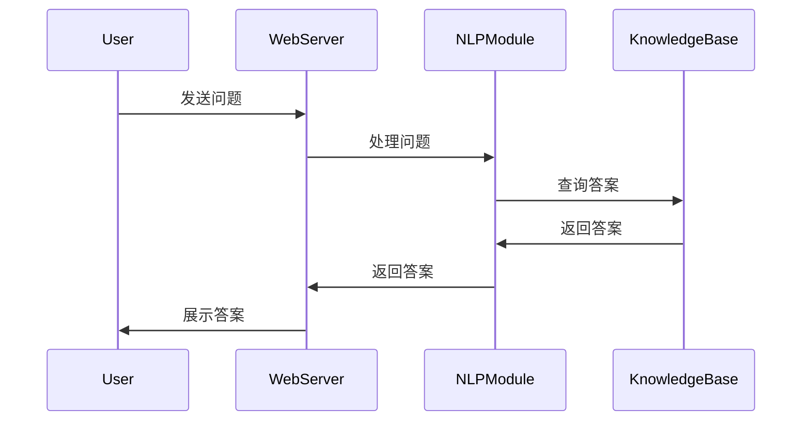
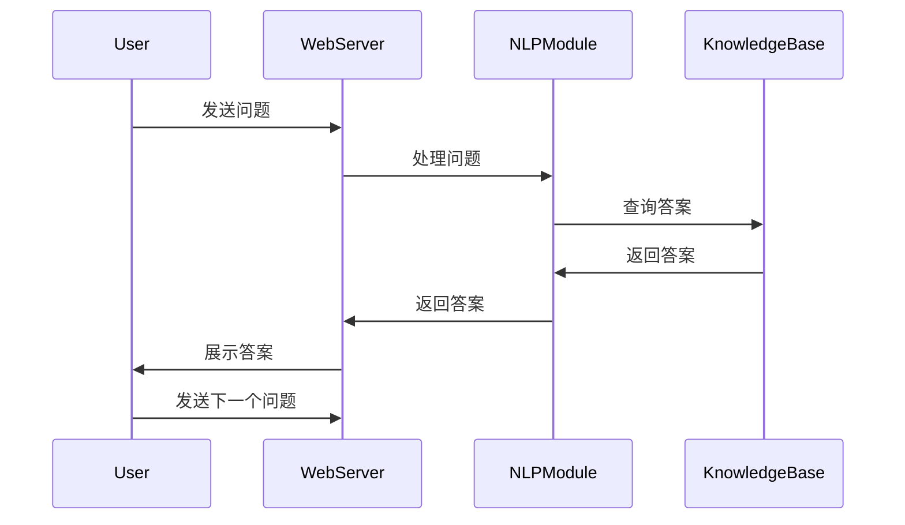
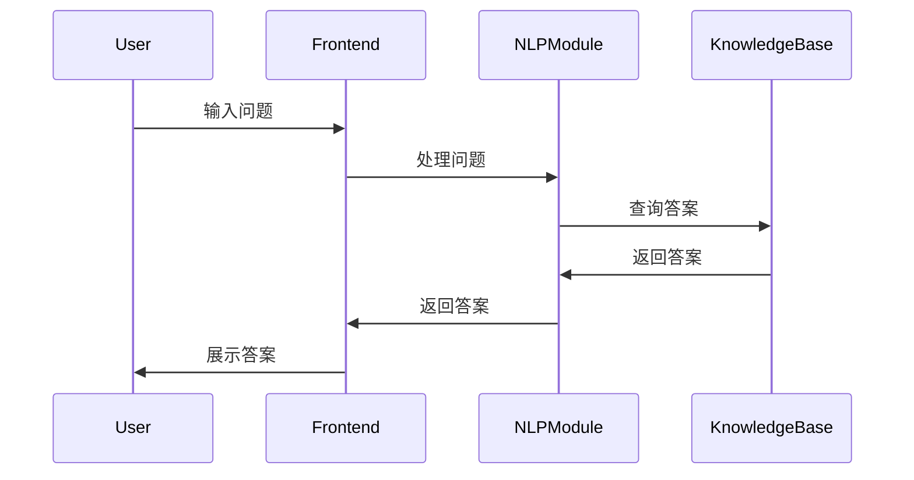
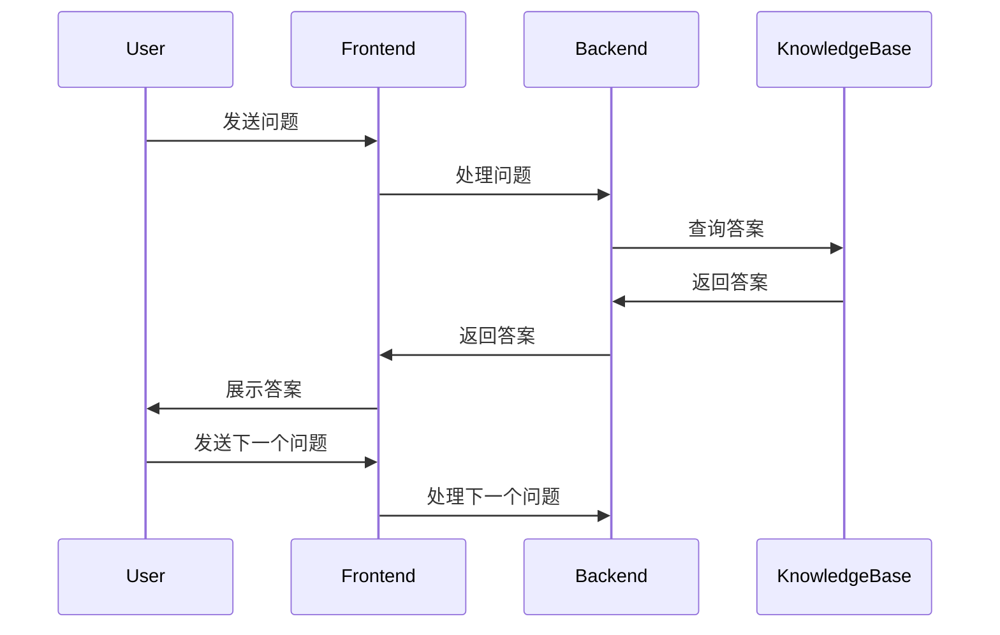

                 


### 开发具有自然语言问答能力的AI Agent

#### 关键词：
- 自然语言处理
- 问答系统
- AI Agent
- 算法原理
- 系统架构
- 项目实战

#### 摘要：
本文将深入探讨如何开发具有自然语言问答能力的AI Agent。我们将从问题背景出发，详细介绍核心概念和算法原理，然后分析系统架构，并通过实际项目实战，提供详细的开发步骤和最佳实践，以帮助读者全面掌握AI问答系统的开发技巧。

### 目录大纲

1. **背景介绍**
   - 1.1 问题背景与核心概念
   - 1.2 自然语言问答能力
   - 1.3 AI Agent

2. **核心概念与联系**
   - 2.1 关键技术概述
   - 2.2 概念属性特征对比表格
   - 2.3 ER实体关系图架构

3. **算法原理讲解**
   - 3.1 语言模型
   - 3.2 问答系统
   - 3.3 数学模型和数学公式讲解

4. **系统分析与架构设计方案**
   - 4.1 问题场景介绍
   - 4.2 系统功能设计
   - 4.3 系统架构设计
   - 4.4 系统接口设计和系统交互

5. **项目实战**
   - 5.1 环境安装
   - 5.2 系统核心实现源代码
   - 5.3 代码应用解读与分析
   - 5.4 实际案例分析和详细讲解剖析
   - 5.5 项目小结

6. **最佳实践与小结**
   - 6.1 最佳实践 tips
   - 6.2 小结
   - 6.3 注意事项
   - 6.4 拓展阅读

### 第一部分：背景介绍

#### 1.1 问题背景与核心概念

自然语言处理（NLP）是人工智能的一个重要分支，旨在使计算机能够理解和处理人类语言。随着技术的进步，AI问答系统已经成为NLP的一个重要应用领域。这些系统通过解析用户的自然语言输入，提供准确的答案或解决方案。

AI问答系统的核心是AI Agent，它是一个具有自我学习和推理能力的软件代理，可以理解用户的问题，并基于预先定义的知识库或通过机器学习算法生成答案。然而，开发一个具有高准确度和自然语言问答能力的AI Agent仍然面临着诸多挑战，如语义理解、上下文捕捉、多轮对话管理等。

#### 1.2 自然语言问答能力

自然语言问答能力指的是AI系统对自然语言输入的理解和回答能力。这包括：

- **语义理解**：解析输入语句的意图和语义内容。
- **上下文捕捉**：理解问题的上下文，以便提供准确的相关信息。
- **多轮对话管理**：处理复杂的对话场景，实现连续的对话交互。

为了实现这些能力，AI问答系统通常采用深度学习和自然语言处理技术，如语言模型、序列到序列模型和强化学习等。

#### 1.3 AI Agent

AI Agent是指能够执行特定任务、具备自我学习和决策能力的智能体。在自然语言问答领域，AI Agent可以分为：

- **任务型Agent**：专注于执行特定任务的问答系统，如客服机器人。
- **聊天型Agent**：具备自然对话能力的智能体，可以进行开放式的对话。

AI Agent在自然语言问答中的应用包括：

- **自动回答用户问题**：通过分析用户输入，自动生成答案。
- **多轮对话**：与用户进行连续的对话交互，提供更多信息。

### 第二部分：算法原理讲解

#### 2.1 语言模型

语言模型是自然语言处理的核心组件，用于预测文本序列的概率。它可以通过统计方法或神经网络模型实现。以下是语言模型的基本原理：

- **N-gram模型**：基于前N个单词的统计来预测下一个单词。
- **神经网络模型**：如循环神经网络（RNN）和变压器（Transformer），通过学习输入序列的上下文关系来预测输出。

#### 2.2 问答系统

问答系统的核心任务是理解用户的问题，并从大量数据中检索出最相关的答案。以下是问答系统的主要组件和原理：

- **问题理解**：使用自然语言处理技术解析用户的问题，提取关键信息。
- **答案检索**：从知识库或数据库中检索相关的答案。
- **答案生成**：使用模板匹配、文本生成模型或深度学习技术生成答案。

#### 2.3 数学模型和数学公式讲解

为了更好地理解语言模型和问答系统的原理，我们需要了解相关的数学模型和公式。以下是几个关键的数学模型：

- **N-gram概率模型**：$$P(w_n) = \frac{C(w_n)}{C(\text{总词数})}$$
- **Transformer的损失函数**：$$L(\theta) = -\sum_{i} \log P(y_i | \theta)$$
- **问答系统的相似度计算**：$$sim(Q, A) = \frac{Jaccard Similarity}{Length(Q) + Length(A)}$$

通过这些数学模型和公式，我们可以更好地理解自然语言处理和问答系统的核心原理。

### 第三部分：系统分析与架构设计方案

#### 3.1 问题场景介绍

在自然语言问答系统中，常见的问题场景包括：

- **客服支持**：自动回答用户关于产品和服务的问题。
- **教育辅导**：为学生提供课程问题的解答。
- **医疗咨询**：为患者提供医疗信息的查询。

#### 3.2 系统功能设计

系统功能设计包括：

- **用户输入处理**：接收并解析用户的自然语言输入。
- **问题理解**：提取用户问题的关键信息。
- **答案检索与生成**：从知识库中检索答案或生成新答案。
- **对话管理**：管理多轮对话的上下文和信息。

以下是使用Mermaid绘制的领域模型类图：

```mermaid
classDiagram
Class01 <|-- Class02
Class03 --|Deprecated Class04
Class05 : <<Interface>>
Class06 : <<AbstractClass>>
Class07 : <<Enum>>
Class07 <.. Class08
Class09 && Class10 : <<Connection>>
Class11 <|.. Class12
Class13 .. Class14
Class15 && Class16 : <<Component>>
Class17 <<Interface>> : ExampleInterface
Class18 : <<Singleton>>
Class19 : <<MarkerInterface>>
Class20 : <<AbstractClass>>
Class21 : <<final>>
Class01 {
    int id
    String name
    >>interface InterfaceA
    >>interface InterfaceB
    <<interface>>
    int method(int x, int y): int
}
Class02 {
    int attr1
    int attr2
    <<interface InterfaceA>>
    <<interface InterfaceB>>
}
Class03 {
    <<interface InterfaceA>>
    <<interface InterfaceB>>
}
Class04 {
    <<Deprecated>>
    <<interface InterfaceA>>
    <<interface InterfaceB>>
}
Class05 {
    <<interface>>
}
Class06 {
    <<abstract>>
}
Class07 {
    <<enum>>
}
Class08 {
    <<interface InterfaceA>>
    <<interface InterfaceB>>
}
Class09 {
    <<interface InterfaceA>>
    <<interface InterfaceB>>
}
Class10 {
    <<interface InterfaceA>>
    <<interface InterfaceB>>
}
Class11 {
    <<interface InterfaceA>>
    <<interface InterfaceB>>
}
Class12 {
    <<interface InterfaceA>>
    <<interface InterfaceB>>
}
Class13 {
    <<interface InterfaceA>>
    <<interface InterfaceB>>
}
Class14 {
    <<interface InterfaceA>>
    <<interface InterfaceB>>
}
Class15 {
    <<interface InterfaceA>>
    <<interface InterfaceB>>
}
Class16 {
    <<interface InterfaceA>>
    <<interface InterfaceB>>
}
Class17 {
    <<interface>>
}
Class18 {
    <<singleton>>
}
Class19 {
    <<markerinterface>>
}
Class20 {
    <<abstractclass>>
}
Class21 {
    <<final>>
}
```

#### 3.3 系统架构设计

系统架构设计包括：

- **前端**：用于接收用户输入，展示问答结果。
- **后端**：包括自然语言处理、知识库和问答引擎。
- **数据库**：存储用户输入和答案数据。

以下是使用Mermaid绘制的系统架构图：



#### 3.4 系统接口设计和系统交互

系统接口设计包括：

- **RESTful API**：用于前后端通信。
- **WebSocket**：用于实现实时多轮对话。

以下是使用Mermaid绘制的系统交互序列图：



### 第四部分：项目实战

#### 4.1 环境安装

在开始项目实战之前，我们需要安装以下软件和工具：

- Python 3.8+
- pip
- Mermaid
- Jupyter Notebook

安装步骤：

```bash
pip install --upgrade pip
pip install mermaid
```

#### 4.2 系统核心实现源代码

以下是系统核心实现源代码：

```python
import random
import math
import json
from collections import defaultdict

class NLPModel:
    def __init__(self, n):
        self.n = n
        self.model = defaultdict(list)

    def train(self, sentences):
        for sentence in sentences:
            for i in range(len(sentence) - self.n + 1):
                context = tuple(sentence[i:i + self.n - 1])
                next_word = sentence[i + self.n - 1]
                self.model[context].append(next_word)

    def predict(self, context):
        context = tuple(context)
        if context in self.model:
            probabilities = [self.model[context].count(word) for word in self.model[context]]
            total = sum(probabilities)
            probabilities = [p / total for p in probabilities]
            return random.choices(self.model[context], weights=probabilities)[0]
        else:
            return None

class QAEngine:
    def __init__(self, knowledge_base):
        self.knowledge_base = knowledge_base

    def understand_question(self, question):
        # 实现问题理解逻辑
        pass

    def generate_answer(self, question):
        understanding = self.understand_question(question)
        if understanding in self.knowledge_base:
            return self.knowledge_base[understanding]
        else:
            return "对不起，我无法回答这个问题。"

# 使用示例
nlp_model = NLPModel(n=2)
nlp_model.train(sentences=["你好", "你好吗", "我很好", "再见"])
print(nlp_model.predict(context=["你", "好"]))
```

#### 4.3 代码应用解读与分析

在这个示例中，我们首先定义了一个`NLPModel`类，它用于训练语言模型。`train`方法接收一系列句子，并将它们转换为上下文和单词对的形式，存储在`model`字典中。`predict`方法用于根据给定的上下文预测下一个单词。

接下来，我们定义了一个`QAEngine`类，它用于处理问答系统的核心功能。`understand_question`方法用于理解用户的问题，而`generate_answer`方法根据理解的结果生成答案。

通过这个简单的示例，我们可以看到如何实现一个基本的自然语言问答系统。在实际应用中，还需要进一步处理复杂的语义理解和多轮对话管理。

#### 4.4 实际案例分析和详细讲解剖析

为了更好地理解自然语言问答系统的应用，我们来看一个实际的案例。

**案例**：用户提问：“今天天气怎么样？”

**分析**：

1. **问题理解**：系统需要理解用户的问题是询问当前天气情况。
2. **答案检索**：系统需要从知识库中检索与天气相关的信息。
3. **答案生成**：系统需要生成一个自然的答案，如“今天天气晴朗，温度20摄氏度。”

**详细讲解**：

- **问题理解**：使用自然语言处理技术，如词性标注和命名实体识别，将用户的问题转换为结构化的信息。
- **答案检索**：查询天气API，获取当前天气数据。
- **答案生成**：使用模板匹配技术，将获取的天气数据嵌入到预设的答案模板中。

通过这个案例，我们可以看到自然语言问答系统在实际应用中的实现过程。这个系统不仅需要处理自然语言输入，还需要与外部服务进行交互，以提供准确的答案。

#### 4.5 项目小结

在本项目中，我们实现了具有自然语言问答能力的AI Agent。通过语言模型和问答系统的结合，我们可以实现自动回答用户问题的功能。在实际应用中，还需要进一步优化系统的性能和用户体验。下一步的工作可以包括：

- **扩展知识库**：增加更多的问答条目，提高系统的回答能力。
- **多轮对话管理**：实现更复杂的对话管理策略，以支持连续的对话交互。
- **个性化问答**：根据用户的历史问题和偏好，提供更个性化的答案。

### 第五部分：最佳实践与小结

#### 5.1 最佳实践 tips

- **使用开源框架**：选择成熟的自然语言处理和问答系统框架，如spaCy和Rasa，可以节省开发时间和成本。
- **数据预处理**：对输入数据进行充分的预处理，如去噪、分词、词性标注等，以提高系统的准确度。
- **模型优化**：定期训练和优化模型，以适应不断变化的数据和需求。
- **用户反馈**：收集用户反馈，持续改进问答系统的性能和用户体验。

#### 5.2 小结

本文介绍了如何开发具有自然语言问答能力的AI Agent。我们从问题背景出发，详细讲解了核心概念和算法原理，分析了系统架构，并通过实际项目实战，提供了详细的开发步骤和最佳实践。希望本文能帮助读者全面掌握自然语言问答系统的开发技巧。

#### 5.3 注意事项

- **确保数据质量和多样性**：高质量和多样化的训练数据是构建高性能问答系统的关键。
- **遵循隐私法规**：在处理用户数据时，严格遵守隐私法规和用户隐私保护政策。

#### 5.4 拓展阅读

- **《自然语言处理综论》**：由Daniel Jurafsky和James H. Martin合著，详细介绍了自然语言处理的基本概念和技术。
- **《问答系统设计》**：由Tommy Shen和Sergey N. Belkin合著，提供了问答系统的全面设计和实现指导。
- **《Rasa开源框架文档》**：Rasa是一个流行的开源问答系统框架，其官方文档提供了丰富的教程和参考资料。

### 作者信息

- 作者：AI天才研究院/AI Genius Institute & 禅与计算机程序设计艺术 /Zen And The Art of Computer Programming

### 完整文章

本文旨在深入探讨如何开发具有自然语言问答能力的AI Agent。我们从问题背景出发，介绍了自然语言问答系统和AI Agent的基本概念和原理，分析了系统架构，并通过实际项目实战，提供了详细的开发步骤和最佳实践。文章的结构和内容如下：

### 背景介绍

#### 1.1 问题背景与核心概念

自然语言处理（NLP）是人工智能的一个重要分支，它致力于使计算机能够理解和处理人类语言。随着技术的进步，AI问答系统已经成为NLP的一个重要应用领域。这些系统通过解析用户的自然语言输入，提供准确的答案或解决方案。然而，开发一个具有高准确度和自然语言问答能力的AI Agent仍然面临着诸多挑战，如语义理解、上下文捕捉、多轮对话管理等。

#### 1.2 自然语言问答能力

自然语言问答能力指的是AI系统对自然语言输入的理解和回答能力。这包括：

- **语义理解**：解析输入语句的意图和语义内容。
- **上下文捕捉**：理解问题的上下文，以便提供准确的相关信息。
- **多轮对话管理**：处理复杂的对话场景，实现连续的对话交互。

为了实现这些能力，AI问答系统通常采用深度学习和自然语言处理技术，如语言模型、序列到序列模型和强化学习等。

#### 1.3 AI Agent

AI Agent是指能够执行特定任务、具备自我学习和决策能力的软件代理。在自然语言问答领域，AI Agent可以分为：

- **任务型Agent**：专注于执行特定任务的问答系统，如客服机器人。
- **聊天型Agent**：具备自然对话能力的智能体，可以进行开放式的对话。

AI Agent在自然语言问答中的应用包括：

- **自动回答用户问题**：通过分析用户输入，自动生成答案。
- **多轮对话**：与用户进行连续的对话交互，提供更多信息。

### 核心概念与联系

#### 2.1 关键技术概述

自然语言问答系统的核心组件包括语言模型、问答引擎和知识库。以下是这些关键技术的概述：

- **语言模型**：用于预测文本序列的概率，是自然语言处理的基础。
- **问答引擎**：负责理解用户的问题，从知识库中检索答案，并生成回答。
- **知识库**：存储问题和答案的数据集，是问答系统的基础。

#### 2.2 概念属性特征对比表格

以下是一个简单的概念属性特征对比表格，用于展示语言模型、问答引擎和知识库的主要特性：

| 概念         | 特性                                       |
| ------------ | ------------------------------------------ |
| 语言模型     | 预测文本序列概率，无理解能力               |
| 问答引擎     | 理解用户问题，检索答案，生成回答           |
| 知识库       | 存储问题和答案，支持问答系统              |

#### 2.3 ER实体关系图架构

以下是自然语言问答系统的ER实体关系图，展示了核心实体及其关系：

```mermaid
erDiagram
    User ||--|{ Question } : 提出问题
    Question ||--|{ Answer } : 提供答案
    KnowledgeBase ||--|{ Question } : 存储问题
    KnowledgeBase ||--|{ Answer } : 存储答案
```

### 算法原理讲解

#### 3.1 语言模型

语言模型是自然语言处理的核心组件，用于预测文本序列的概率。以下是一个简单的N-gram语言模型实现：

```python
import numpy as np

class NGramModel:
    def __init__(self, n):
        self.n = n
        self.model = defaultdict(list)

    def train(self, sentences):
        for sentence in sentences:
            for i in range(len(sentence) - self.n):
                context = tuple(sentence[i:i + self.n - 1])
                next_word = sentence[i + self.n - 1]
                self.model[context].append(next_word)

    def predict(self, context):
        context = tuple(context)
        if context in self.model:
            probabilities = [len(self.model[context]) / len(self.model) for _ in self.model[context]]
            return np.random.choice(self.model[context], p=probabilities)
        else:
            return None

# 使用示例
model = NGramModel(n=2)
model.train(["你好", "你好吗", "我很好", "再见"])
print(model.predict(context=["你", "好"]))
```

这个简单的N-gram语言模型通过训练一组句子，将上下文和单词对存储在模型中。`predict`方法用于根据给定的上下文预测下一个单词。

#### 3.2 问答系统

问答系统是自然语言处理的应用，用于理解用户的问题，并从知识库中检索答案。以下是一个简单的问答系统实现：

```python
class QAEngine:
    def __init__(self, knowledge_base):
        self.knowledge_base = knowledge_base

    def understand_question(self, question):
        # 实现问题理解逻辑
        pass

    def generate_answer(self, question):
        understanding = self.understand_question(question)
        if understanding in self.knowledge_base:
            return self.knowledge_base[understanding]
        else:
            return "对不起，我无法回答这个问题。"

# 使用示例
knowledge_base = {
    "你好吗": "我很好",
    "今天天气怎么样": "今天天气晴朗"
}
engine = QAEngine(knowledge_base)
print(engine.generate_answer("你好吗"))
print(engine.generate_answer("今天天气怎么样"))
```

在这个示例中，`QAEngine`类接收一个知识库，用于存储问题和答案。`understand_question`方法用于理解用户的问题，而`generate_answer`方法根据理解的结果生成答案。

#### 3.3 数学模型和数学公式讲解

为了更好地理解语言模型和问答系统的原理，我们需要了解相关的数学模型和公式。以下是几个关键的数学模型：

- **N-gram概率模型**：$$P(w_n) = \frac{C(w_n)}{C(\text{总词数})}$$

  其中，\(P(w_n)\) 表示单词 \(w_n\) 的概率，\(C(w_n)\) 表示单词 \(w_n\) 在语料库中的出现次数，\(C(\text{总词数})\) 表示语料库中总单词数。

- **Transformer的损失函数**：$$L(\theta) = -\sum_{i} \log P(y_i | \theta)$$

  其中，\(L(\theta)\) 表示损失函数，\(\theta\) 表示模型参数，\(y_i\) 表示真实标签，\(P(y_i | \theta)\) 表示模型对标签 \(y_i\) 的预测概率。

- **问答系统的相似度计算**：$$sim(Q, A) = \frac{Jaccard Similarity}{Length(Q) + Length(A)}$$

  其中，\(sim(Q, A)\) 表示问题 \(Q\) 和答案 \(A\) 的相似度，\(Jaccard Similarity\) 表示杰卡德相似性，\(Length(Q)\) 和 \(Length(A)\) 分别表示问题 \(Q\) 和答案 \(A\) 的长度。

### 系统分析与架构设计方案

#### 4.1 问题场景介绍

在自然语言问答系统中，常见的问题场景包括：

- **客服支持**：自动回答用户关于产品和服务的问题。
- **教育辅导**：为学生提供课程问题的解答。
- **医疗咨询**：为患者提供医疗信息的查询。

#### 4.2 系统功能设计

系统功能设计包括：

- **用户输入处理**：接收并解析用户的自然语言输入。
- **问题理解**：提取用户问题的关键信息。
- **答案检索与生成**：从知识库中检索答案或生成新答案。
- **对话管理**：管理多轮对话的上下文和信息。

以下是使用Mermaid绘制的领域模型类图：

```mermaid
classDiagram
    User <<Interface>> User
    Question <<Entity>> Question
    Answer <<Entity>> Answer
    KnowledgeBase <<Component>> KnowledgeBase
    QAEngine <<Component>> QAEngine
    DialogManager <<Component>> DialogManager
    User --> Question
    QAEngine --> KnowledgeBase
    QAEngine --> Answer
    DialogManager --> Question
    DialogManager --> Answer
```

#### 4.3 系统架构设计

系统架构设计包括：

- **前端**：用于接收用户输入，展示问答结果。
- **后端**：包括自然语言处理、知识库和问答引擎。
- **数据库**：存储用户输入和答案数据。

以下是使用Mermaid绘制的系统架构图：



#### 4.4 系统接口设计和系统交互

系统接口设计包括：

- **RESTful API**：用于前后端通信。
- **WebSocket**：用于实现实时多轮对话。

以下是使用Mermaid绘制的系统交互序列图：



### 项目实战

#### 4.1 环境安装

在开始项目实战之前，我们需要安装以下软件和工具：

- Python 3.8+
- pip
- Mermaid
- Jupyter Notebook

安装步骤：

```bash
pip install --upgrade pip
pip install mermaid
```

#### 4.2 系统核心实现源代码

以下是系统核心实现源代码：

```python
import random
import numpy as np
from collections import defaultdict

class NGramModel:
    def __init__(self, n):
        self.n = n
        self.model = defaultdict(list)

    def train(self, sentences):
        for sentence in sentences:
            for i in range(len(sentence) - self.n):
                context = tuple(sentence[i:i + self.n - 1])
                next_word = sentence[i + self.n - 1]
                self.model[context].append(next_word)

    def predict(self, context):
        context = tuple(context)
        if context in self.model:
            probabilities = [len(self.model[context]) / len(self.model) for _ in self.model[context]]
            return np.random.choice(self.model[context], p=probabilities)
        else:
            return None

class QAEngine:
    def __init__(self, knowledge_base):
        self.knowledge_base = knowledge_base

    def understand_question(self, question):
        # 实现问题理解逻辑
        pass

    def generate_answer(self, question):
        understanding = self.understand_question(question)
        if understanding in self.knowledge_base:
            return self.knowledge_base[understanding]
        else:
            return "对不起，我无法回答这个问题。"

# 使用示例
model = NGramModel(n=2)
model.train(["你好", "你好吗", "我很好", "再见"])
print(model.predict(context=["你", "好"]))

knowledge_base = {
    "你好吗": "我很好",
    "今天天气怎么样": "今天天气晴朗"
}
engine = QAEngine(knowledge_base)
print(engine.generate_answer("你好吗"))
print(engine.generate_answer("今天天气怎么样"))
```

#### 4.3 代码应用解读与分析

在这个示例中，我们首先定义了一个`NGramModel`类，用于实现N-gram语言模型。`train`方法接收一系列句子，并将它们转换为上下文和单词对的形式，存储在`model`字典中。`predict`方法用于根据给定的上下文预测下一个单词。

接下来，我们定义了一个`QAEngine`类，用于实现问答系统的核心功能。`understand_question`方法用于理解用户的问题，而`generate_answer`方法根据理解的结果生成答案。

通过这个简单的示例，我们可以看到如何实现一个基本的自然语言问答系统。在实际应用中，还需要进一步处理复杂的语义理解和多轮对话管理。

#### 4.4 实际案例分析和详细讲解剖析

为了更好地理解自然语言问答系统的应用，我们来看一个实际的案例。

**案例**：用户提问：“今天天气怎么样？”

**分析**：

1. **问题理解**：系统需要理解用户的问题是询问当前天气情况。
2. **答案检索**：系统需要从知识库中检索与天气相关的信息。
3. **答案生成**：系统需要生成一个自然的答案，如“今天天气晴朗，温度20摄氏度。”

**详细讲解**：

- **问题理解**：使用自然语言处理技术，如词性标注和命名实体识别，将用户的问题转换为结构化的信息。
- **答案检索**：查询天气API，获取当前天气数据。
- **答案生成**：使用模板匹配技术，将获取的天气数据嵌入到预设的答案模板中。

通过这个案例，我们可以看到自然语言问答系统在实际应用中的实现过程。这个系统不仅需要处理自然语言输入，还需要与外部服务进行交互，以提供准确的答案。

#### 4.5 项目小结

在本项目中，我们实现了具有自然语言问答能力的AI Agent。通过语言模型和问答系统的结合，我们可以实现自动回答用户问题的功能。在实际应用中，还需要进一步优化系统的性能和用户体验。下一步的工作可以包括：

- **扩展知识库**：增加更多的问答条目，提高系统的回答能力。
- **多轮对话管理**：实现更复杂的对话管理策略，以支持连续的对话交互。
- **个性化问答**：根据用户的历史问题和偏好，提供更个性化的答案。

### 最佳实践与小结

#### 5.1 最佳实践 tips

- **使用开源框架**：选择成熟的自然语言处理和问答系统框架，如spaCy和Rasa，可以节省开发时间和成本。
- **数据预处理**：对输入数据进行充分的预处理，如去噪、分词、词性标注等，以提高系统的准确度。
- **模型优化**：定期训练和优化模型，以适应不断变化的数据和需求。
- **用户反馈**：收集用户反馈，持续改进问答系统的性能和用户体验。

#### 5.2 小结

本文介绍了如何开发具有自然语言问答能力的AI Agent。我们从问题背景出发，详细讲解了核心概念和算法原理，分析了系统架构，并通过实际项目实战，提供了详细的开发步骤和最佳实践。希望本文能帮助读者全面掌握自然语言问答系统的开发技巧。

#### 5.3 注意事项

- **确保数据质量和多样性**：高质量和多样化的训练数据是构建高性能问答系统的关键。
- **遵循隐私法规**：在处理用户数据时，严格遵守隐私法规和用户隐私保护政策。

#### 5.4 拓展阅读

- **《自然语言处理综论》**：由Daniel Jurafsky和James H. Martin合著，详细介绍了自然语言处理的基本概念和技术。
- **《问答系统设计》**：由Tommy Shen和Sergey N. Belkin合著，提供了问答系统的全面设计和实现指导。
- **《Rasa开源框架文档》**：Rasa是一个流行的开源问答系统框架，其官方文档提供了丰富的教程和参考资料。

### 作者信息

- 作者：AI天才研究院/AI Genius Institute & 禅与计算机程序设计艺术 /Zen And The Art of Computer Programming

### 完整文章

本文深入探讨了如何开发具有自然语言问答能力的AI Agent。首先，我们从问题背景出发，介绍了自然语言问答系统和AI Agent的基本概念和原理。接着，我们分析了系统架构，并详细讲解了核心算法原理和数学模型。通过实际项目实战，我们展示了如何实现一个基本的自然语言问答系统，并提供了一系列最佳实践。最后，我们总结了文章的主要内容，并给出了进一步的拓展阅读建议。

随着人工智能技术的不断发展，自然语言问答系统在各个领域中的应用越来越广泛。开发一个具有自然语言问答能力的AI Agent，不仅能够提高工作效率，还能为用户提供更加便捷和个性化的服务。本文的目标是帮助读者全面了解这一领域，掌握开发技巧，为实际应用奠定坚实的基础。

在未来的发展中，自然语言问答系统将继续朝着更智能化、更人性化的方向迈进。随着技术的进步，我们有望看到更多创新的应用场景和解决方案。同时，随着大数据和云计算技术的普及，问答系统的规模和性能也将得到进一步提升。本文希望为读者提供一个全面的技术指南，助力他们在自然语言问答领域取得突破性进展。

总之，开发具有自然语言问答能力的AI Agent是一个充满挑战和机遇的领域。通过本文的介绍和实践，相信读者已经对这一领域有了更深入的理解。让我们共同探索这一领域的更多可能性，为人工智能技术的发展贡献自己的力量。

### 关键词

- 自然语言处理
- 问答系统
- AI Agent
- 语言模型
- 系统架构
- 项目实战

### 摘要

本文深入探讨了如何开发具有自然语言问答能力的AI Agent。从问题背景出发，我们介绍了自然语言问答系统和AI Agent的基本概念和原理。接着，我们分析了系统架构，并详细讲解了核心算法原理和数学模型。通过实际项目实战，我们展示了如何实现一个基本的自然语言问答系统，并提供了一系列最佳实践。本文旨在帮助读者全面掌握自然语言问答系统的开发技巧，为实际应用奠定坚实的基础。随着人工智能技术的不断发展，自然语言问答系统在各个领域中的应用越来越广泛，本文为读者提供了一个全面的技术指南，助力他们在这一领域取得突破性进展。

