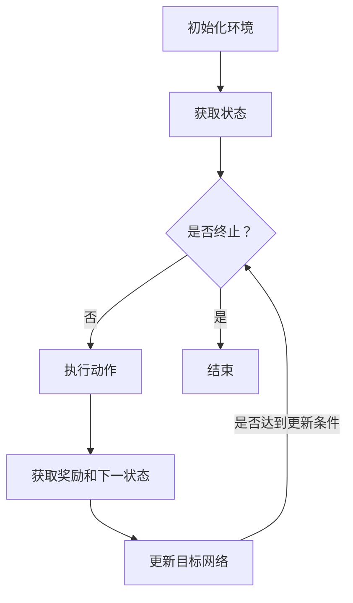
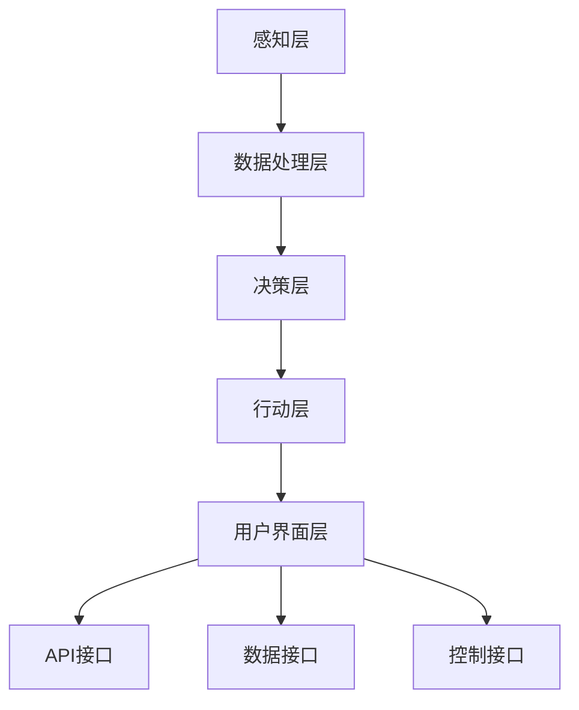

                 

### 文章标题：开发具有虚拟现实交互能力的AI Agent

关键词：虚拟现实、AI Agent、交互、开发、设计

摘要：本文将从虚拟现实与AI的基本概念出发，深入探讨虚拟现实交互与AI Agent的结合，详细分析AI Agent的开发流程、虚拟现实与AI Agent的集成以及实际应用，旨在为读者提供全面的指导和启示。

----------------------------------------------------------------

### 第一部分：虚拟现实与AI概述

#### 第1章：虚拟现实与AI的基本概念

#### 1.1 虚拟现实简介

虚拟现实（Virtual Reality，VR）是一种通过计算机技术创造出的三维虚拟环境，用户可以通过头戴式显示器（HMD）、手套、手势追踪器等设备与虚拟环境进行互动。VR技术的发展经历了从最初的简单三维模型到现在的复杂交互系统的演变，其应用领域涵盖教育、娱乐、医疗、设计等多个方面。

#### 1.2 人工智能简介

人工智能（Artificial Intelligence，AI）是计算机科学的一个分支，旨在使计算机模拟人类的智能行为，包括学习、推理、感知、决策等。AI技术的发展经历了规则推理、知识表示、机器学习等多个阶段，目前广泛应用于语音识别、图像识别、自然语言处理等领域。

#### 1.3 虚拟现实与人工智能的结合

虚拟现实与人工智能的结合为两者的发展带来了新的机遇和挑战。AI可以为VR提供更智能的交互体验，如智能导航、个性化推荐等；而VR则为AI提供了一个更接近现实的应用场景，使AI技术得以更好地验证和优化。同时，虚拟现实与人工智能的结合也面临着数据隐私、伦理道德等问题。

----------------------------------------------------------------

#### 第2章：虚拟现实交互基础

##### 2.1 虚拟现实交互的原理

虚拟现实交互是基于人机交互原理的，通过虚拟环境中的各种交互元素，如虚拟对象、虚拟界面等，实现用户与虚拟环境的交互。虚拟现实交互的原理主要包括感知、理解和行动三个方面。

##### 2.2 虚拟现实交互的设计

虚拟现实交互的设计需要遵循用户体验优先的原则，注重交互的直观性、易用性和舒适性。设计过程中需要考虑用户的研究、交互模式的设计以及交互工具的选择。

##### 2.3 虚拟现实交互的技术实现

虚拟现实交互的技术实现包括交互系统的架构设计、交互技术的选择以及交互性能的优化。常见的交互技术有手势追踪、语音识别、眼动追踪等。

----------------------------------------------------------------

#### 第二部分：AI Agent开发

##### 第3章：AI Agent的基本原理

##### 3.1 AI Agent的定义

AI Agent是指具有智能行为、可以自主完成特定任务的计算机程序。AI Agent可以分为基于规则的Agent、基于模型的Agent和基于数据的Agent等类型。

##### 3.2 AI Agent的结构

AI Agent通常由感知模块、决策模块和行动模块组成。感知模块负责收集环境信息，决策模块负责根据感知信息做出决策，行动模块负责执行决策结果。

##### 3.3 AI Agent的学习与进化

AI Agent的学习与进化是提高其智能水平的重要手段。常见的机器学习方法包括监督学习、无监督学习和强化学习。进化算法也是一种有效的AI Agent学习方式。

----------------------------------------------------------------

##### 第4章：AI Agent的开发流程

##### 4.1 AI Agent的需求分析

AI Agent的需求分析是开发过程中的关键步骤，包括需求收集、需求分析与建模等环节。需求分析的结果将直接影响到AI Agent的性能和用户体验。

##### 4.2 AI Agent的设计

AI Agent的设计需要考虑其核心功能、系统架构、接口设计等方面。设计过程中需要遵循模块化、可扩展性等原则。

##### 4.3 AI Agent的实现

AI Agent的实现包括开发环境与工具的选择、核心算法的实现以及系统接口的设计与实现。实现过程中需要注重代码的可读性、可维护性。

----------------------------------------------------------------

#### 第三部分：虚拟现实交互与AI Agent集成

##### 第5章：虚拟现实与AI Agent集成

##### 5.1 集成概述

虚拟现实与AI Agent的集成旨在实现更智能、更高效的交互体验。集成过程中需要考虑数据交互、协同工作等方面。

##### 5.2 虚拟现实与AI Agent的数据交互

虚拟现实与AI Agent的数据交互是实现两者集成的基础。数据格式与转换、实时数据传输技术等是实现数据交互的关键。

##### 5.3 虚拟现实与AI Agent的协同工作

虚拟现实与AI Agent的协同工作可以提高系统的智能水平和用户体验。协同工作机制、协同优化策略等是实现协同工作的关键。

----------------------------------------------------------------

##### 第6章：虚拟现实交互能力的AI Agent应用

##### 6.1 应用场景

虚拟现实交互能力的AI Agent在多个领域具有广泛的应用前景，如教育、医疗、娱乐等。

##### 6.2 案例分析

通过具体的案例分析，可以更好地了解虚拟现实交互能力的AI Agent在实际应用中的效果和价值。

##### 6.3 未来的发展趋势

随着技术的不断发展，虚拟现实交互能力的AI Agent将在更多领域得到应用，未来的发展趋势也值得期待。

----------------------------------------------------------------

##### 第7章：开发虚拟现实交互能力的AI Agent的最佳实践

##### 7.1 设计与开发经验

在开发虚拟现实交互能力的AI Agent过程中，积累经验、总结技巧是提高开发效率和质量的重要途径。

##### 7.2 注意事项

在开发虚拟现实交互能力的AI Agent时，需要注意一些潜在问题，如数据隐私、系统稳定性等。

##### 7.3 拓展阅读

为了更好地了解虚拟现实交互能力的AI Agent，读者可以参考相关文献、书籍和资料。

----------------------------------------------------------------

### 结语

虚拟现实交互能力的AI Agent是未来智能交互的重要方向，本文从虚拟现实与AI的基本概念、交互基础、AI Agent开发、集成与应用等方面进行了详细探讨。希望通过本文，读者能够对虚拟现实交互能力的AI Agent有一个全面、深入的理解，为今后的研究和应用提供参考。

### 作者信息

作者：AI天才研究院/AI Genius Institute & 禅与计算机程序设计艺术 /Zen And The Art of Computer Programming

----------------------------------------------------------------

**注意：本文仅为大纲示例，具体内容需根据实际情况进行撰写，包括详细的核心概念、算法原理、系统架构设计、项目实战等。文章字数需在10000-12000字之间，确保内容的丰富性和深度。**## 文章标题：开发具有虚拟现实交互能力的AI Agent

### 关键词：虚拟现实、AI Agent、交互、开发、设计

### 摘要

本文旨在探讨虚拟现实（VR）与人工智能（AI）结合的新兴领域——虚拟现实交互能力的AI Agent开发。首先，我们将回顾虚拟现实和人工智能的基本概念，阐述它们的发展历程、核心原理和应用场景。接着，本文将深入探讨虚拟现实交互的基础理论，包括交互原理、设计原则和技术实现。然后，我们将详细解析AI Agent的基本原理、开发流程，以及如何在虚拟现实中实现AI Agent的功能。此外，本文还将介绍虚拟现实与AI Agent的集成策略，以及它们在不同领域的应用案例。最后，我们将总结开发虚拟现实交互能力的AI Agent的最佳实践，并提供相关的拓展阅读建议。通过本文，读者将能够全面了解这一前沿领域，掌握关键技术和开发方法。

### 第一部分：虚拟现实与AI概述

#### 第1章：虚拟现实与AI的基本概念

#### 1.1 虚拟现实简介

虚拟现实（Virtual Reality，VR）是一种通过计算机生成模拟环境，使用户沉浸其中并与环境进行交互的技术。VR技术的发展可以追溯到1960年代，当时以伊万·苏瑟兰（Ivan Sutherland）开发的“达摩克利斯之剑”头戴显示器为标志。随着计算机技术和显示技术的进步，VR设备变得更加普及和高效，如Oculus Rift、HTC Vive和谷歌Cardboard等。

VR系统通常由以下几个基本组成部分构成：

1. **输入设备**：如头戴式显示器（HMD）、手柄、手套等，用于用户与环境交互。
2. **输出设备**：包括显示器、声音系统等，用于向用户呈现虚拟环境。
3. **计算设备**：用于处理用户输入、渲染场景和计算交互逻辑。
4. **传感器**：如运动传感器、位置传感器等，用于实时监测用户状态和环境变化。

虚拟现实的应用领域广泛，包括但不限于以下方面：

1. **娱乐**：如虚拟现实游戏、虚拟旅行、虚拟演唱会等。
2. **教育**：如虚拟课堂、虚拟实验室、历史重现等。
3. **医疗**：如虚拟手术训练、心理治疗、远程医疗等。
4. **设计**：如建筑和室内设计、产品设计和制造等。
5. **训练**：如军事训练、飞行员训练、安全培训等。

#### 1.2 人工智能简介

人工智能（Artificial Intelligence，AI）是指计算机系统模拟人类智能行为的能力，包括学习、推理、感知、理解、决策和解决问题等。AI的发展历程可以大致分为几个阶段：

1. **规则推理时代**：以专家系统和逻辑编程为代表，通过编写明确规则来模拟人类智能。
2. **知识表示与推理时代**：通过符号表示和推理机来实现知识的自动推理和运用。
3. **机器学习时代**：利用大量数据训练模型，使计算机能够自主学习和改进性能。
4. **深度学习时代**：基于神经网络，特别是深度神经网络，实现更加复杂的智能任务。

AI的核心概念包括：

1. **感知**：通过图像、声音、语言等信息获取环境数据。
2. **推理**：根据已有知识和信息进行逻辑推理和判断。
3. **学习**：通过数据训练模型，提高系统性能。
4. **决策**：根据当前状态和目标，选择最优的行动方案。

AI的技术分类主要包括：

1. **机器学习**：通过训练模型来发现数据中的模式和规律。
2. **深度学习**：基于多层神经网络，对复杂任务进行学习和预测。
3. **自然语言处理**：使计算机能够理解、生成和处理人类语言。
4. **计算机视觉**：使计算机能够识别和理解图像和视频中的内容。
5. **机器人技术**：结合感知、推理和行动，使机器人具备自主执行任务的能力。

#### 1.3 虚拟现实与人工智能的结合

虚拟现实与人工智能的结合为两者的发展带来了新的机遇和挑战。虚拟现实提供了接近现实的应用场景，使AI技术得以更好地验证和优化；而AI则为虚拟现实提供了更智能的交互体验。

虚拟现实在AI中的应用主要包括：

1. **模拟训练**：使用虚拟现实环境进行机器人训练和测试，提高训练效率和安全性。
2. **增强现实**：通过AI技术实现更加真实的增强现实体验。
3. **数据生成**：使用虚拟现实生成大量训练数据，加速AI模型的训练。

AI在虚拟现实中的优势主要包括：

1. **智能交互**：AI能够根据用户行为和环境变化提供个性化的交互体验。
2. **环境理解**：AI能够通过感知和理解环境数据，为虚拟现实系统提供智能决策支持。
3. **内容生成**：AI能够自动生成虚拟现实内容，如虚拟人物、场景等。

虚拟现实与AI的挑战与机遇主要包括：

1. **数据隐私**：虚拟现实收集大量用户数据，如何保护用户隐私成为一个重要挑战。
2. **硬件限制**：虚拟现实设备的高性能要求对硬件性能提出了挑战。
3. **用户体验**：如何提供自然而直观的交互体验是虚拟现实与AI融合的关键。

### 第二部分：虚拟现实交互基础

#### 第2章：虚拟现实交互基础

#### 2.1 虚拟现实交互的原理

虚拟现实交互是基于人机交互原理的，旨在通过虚拟环境中的各种交互元素实现用户与环境的互动。虚拟现实交互的原理主要包括感知、理解和行动三个方面。

1. **感知**：用户通过输入设备（如HMD、手柄等）感知虚拟环境中的信息，如视觉、听觉、触觉等。
2. **理解**：虚拟现实系统通过算法和模型理解用户输入，将输入映射到虚拟环境中的具体动作和效果。
3. **行动**：系统根据理解结果执行相应动作，如物体移动、场景变换等，并反馈给用户。

#### 2.2 虚拟现实交互的设计

虚拟现实交互的设计需要遵循用户体验优先的原则，注重交互的直观性、易用性和舒适性。设计过程中需要考虑以下几个方面：

1. **用户研究**：通过用户调研、访谈等方法了解用户需求和行为模式。
2. **交互模式设计**：选择适合虚拟环境的交互模式，如手势、语音、眼动等。
3. **交互工具选择**：根据交互模式选择合适的交互工具，如手柄、手套、手势追踪器等。
4. **可用性测试**：通过测试和反馈不断优化交互设计，提高用户体验。

#### 2.3 虚拟现实交互的技术实现

虚拟现实交互的技术实现涉及多个方面，包括交互系统的架构设计、交互技术的选择和性能优化。以下是几个关键技术：

1. **交互系统架构设计**：虚拟现实交互系统通常采用客户端-服务器架构，其中客户端负责与用户交互，服务器处理计算任务和存储数据。
2. **交互技术选择**：根据应用需求和用户体验选择合适的交互技术，如手势追踪、语音识别、眼动追踪等。
3. **性能优化**：通过优化渲染技术、网络传输、计算效率等方面提高交互系统的性能，确保流畅的用户体验。

### 第三部分：AI Agent开发

#### 第3章：AI Agent的基本原理

#### 3.1 AI Agent的定义

AI Agent是指具有智能行为、可以自主完成特定任务的计算机程序。AI Agent通常具有以下特点：

1. **自主性**：Agent可以独立决策和执行任务，不需要人工干预。
2. **智能性**：Agent具备感知、理解、学习和推理能力，能够应对复杂环境。
3. **交互性**：Agent可以与环境和用户进行交互，收集信息并做出反应。

AI Agent的分类主要包括：

1. **基于规则的Agent**：通过预定义的规则进行决策和行动。
2. **基于模型的Agent**：通过模拟环境模型进行决策和行动。
3. **基于数据的Agent**：通过学习历史数据和模式进行决策和行动。

#### 3.2 AI Agent的结构

AI Agent通常由以下几个模块组成：

1. **感知模块**：负责收集环境信息，如图像、声音、传感器数据等。
2. **决策模块**：负责分析感知信息，根据目标和当前状态做出决策。
3. **行动模块**：负责执行决策结果，完成特定任务。

#### 3.3 AI Agent的学习与进化

AI Agent的学习与进化是提高其智能水平的重要途径。学习过程通常包括以下步骤：

1. **数据收集**：收集与任务相关的数据，如图像、文本、传感器数据等。
2. **特征提取**：从数据中提取有用的特征，用于训练模型。
3. **模型训练**：使用机器学习算法训练模型，使其能够识别和预测环境中的模式。
4. **评估与优化**：通过测试和评估模型性能，不断优化和调整模型。

进化算法是一种有效的AI Agent学习方式，它通过模拟自然进化过程，逐步改进Agent的性能。常见的进化算法包括遗传算法、模拟退火算法等。

### 第四部分：AI Agent的开发流程

#### 第4章：AI Agent的开发流程

#### 4.1 AI Agent的需求分析

AI Agent的需求分析是开发过程中的关键步骤，它包括以下几个方面：

1. **需求收集**：通过访谈、问卷调查、用户行为分析等方法收集用户需求。
2. **需求分析**：对收集到的需求进行分类、筛选和分析，确定Agent的核心功能和性能要求。
3. **建模**：使用领域模型、状态机模型等工具对Agent的需求进行形式化描述。

#### 4.2 AI Agent的设计

AI Agent的设计需要考虑其核心功能、系统架构、接口设计等方面。设计过程中需要遵循以下原则：

1. **模块化**：将Agent的功能模块化，便于维护和扩展。
2. **可扩展性**：设计时考虑未来可能的需求变化，确保系统能够灵活扩展。
3. **易用性**：设计直观、易操作的界面和交互方式，提高用户体验。

AI Agent的设计通常包括以下方面：

1. **功能设计**：明确Agent需要完成的具体任务和功能。
2. **架构设计**：设计Agent的系统架构，包括感知模块、决策模块和行动模块的组织结构。
3. **接口设计**：定义Agent与其他系统、模块的交互接口。

#### 4.3 AI Agent的实现

AI Agent的实现涉及开发环境与工具的选择、核心算法的实现以及系统接口的设计与实现。以下是实现过程中需要考虑的几个方面：

1. **开发环境与工具**：选择合适的开发环境（如Python、C++等）和工具（如TensorFlow、PyTorch等），确保开发效率和性能。
2. **核心算法实现**：实现感知、决策和行动模块的核心算法，包括数据预处理、模型训练、推理和评估等步骤。
3. **系统接口设计**：设计Agent与其他系统、模块的交互接口，确保数据传输和通信的稳定性和可靠性。

### 第五部分：虚拟现实与AI Agent集成

#### 第5章：虚拟现实与AI Agent集成

#### 5.1 集成概述

虚拟现实与AI Agent的集成是将AI技术应用于虚拟现实环境，实现更智能、更高效的交互体验。集成过程中需要考虑以下几个方面：

1. **集成目标**：明确集成AI Agent的目标，如提高用户体验、优化系统性能等。
2. **集成方法**：选择合适的集成方法，如基于模块的集成、基于代理的集成等。
3. **集成策略**：制定集成策略，确保AI Agent与虚拟现实系统的协同工作。

#### 5.2 虚拟现实与AI Agent的数据交互

虚拟现实与AI Agent的数据交互是实现两者集成的关键。数据交互主要包括以下几个方面：

1. **数据格式与转换**：定义统一的数据格式，如JSON、XML等，确保数据在不同模块之间的传输和解析。
2. **实时数据传输技术**：选择合适的实时数据传输技术，如WebSocket、RabbitMQ等，确保数据的实时性和稳定性。
3. **数据同步与冲突解决**：处理不同模块之间的数据同步和冲突问题，确保数据的完整性和一致性。

#### 5.3 虚拟现实与AI Agent的协同工作

虚拟现实与AI Agent的协同工作是通过整合AI技术和虚拟现实交互实现系统智能化的过程。协同工作主要包括以下几个方面：

1. **协同工作机制**：设计协同工作机制，如基于角色的协同、基于事件的协同等，确保AI Agent与虚拟现实系统的协同操作。
2. **协同优化策略**：制定协同优化策略，如任务分配、负载均衡等，提高系统的性能和效率。
3. **用户体验优化**：通过优化交互界面和交互体验，提高用户的满意度。

### 第六部分：虚拟现实交互能力的AI Agent应用

#### 第6章：虚拟现实交互能力的AI Agent应用

#### 6.1 应用场景

虚拟现实交互能力的AI Agent在多个领域具有广泛的应用前景，以下是一些典型应用场景：

1. **教育**：如虚拟课堂、虚拟实验室、个性化学习等。
2. **医疗**：如虚拟手术训练、远程医疗、心理健康治疗等。
3. **娱乐**：如虚拟现实游戏、虚拟演唱会、主题公园等。
4. **设计**：如建筑和室内设计、产品设计和制造等。
5. **军事**：如虚拟战场模拟、训练和演习等。

#### 6.2 案例分析

以下是一些虚拟现实交互能力的AI Agent应用案例：

1. **案例一：虚拟课堂**
   - **项目介绍**：通过虚拟现实技术构建一个虚拟课堂，学生可以在虚拟环境中进行学习，教师可以通过AI Agent提供个性化教学。
   - **系统功能设计**：包括课程管理、学生管理、互动教学、学习评估等功能。
   - **系统架构设计**：采用分布式架构，包括前端、后端、数据库等模块。
   - **系统接口设计**：定义教师与学生之间的交互接口，如语音识别、手势追踪等。
   - **实际案例**：在某个中小学进行试点，学生反馈良好，提高了学习兴趣和效果。

2. **案例二：虚拟手术训练**
   - **项目介绍**：通过虚拟现实技术构建一个虚拟手术训练系统，医生可以在虚拟环境中进行手术练习，提高手术技能。
   - **系统功能设计**：包括手术模拟、实时反馈、数据记录等功能。
   - **系统架构设计**：采用模块化设计，包括虚拟现实模块、AI Agent模块、数据库模块等。
   - **系统接口设计**：定义手术操作接口、医生与系统之间的交互接口。
   - **实际案例**：在某个医院进行试点，医生反馈手术训练效果显著，降低了实际手术的风险。

#### 6.3 未来的发展趋势

虚拟现实交互能力的AI Agent在未来将会有以下发展趋势：

1. **技术进步**：随着硬件性能的提升和AI技术的进步，虚拟现实交互能力的AI Agent将更加智能、高效和稳定。
2. **应用拓展**：虚拟现实交互能力的AI Agent将在更多领域得到应用，如智能制造、智慧城市、智能家居等。
3. **用户体验优化**：通过优化交互界面和交互体验，提高用户的满意度和参与度。
4. **伦理和隐私**：随着虚拟现实交互能力的AI Agent的应用，如何保护用户隐私和伦理道德将成为重要议题。

### 第七部分：开发虚拟现实交互能力的AI Agent的最佳实践

#### 第7章：开发虚拟现实交互能力的AI Agent的最佳实践

#### 7.1 设计与开发经验

在开发虚拟现实交互能力的AI Agent过程中，积累经验和总结技巧是提高开发效率和质量的重要途径。以下是一些设计与开发经验：

1. **需求明确**：在项目初期明确需求和目标，确保项目方向正确。
2. **团队协作**：建立高效的团队协作机制，确保各模块之间顺畅沟通和协作。
3. **迭代开发**：采用迭代开发模式，逐步完善系统功能和性能。
4. **用户反馈**：及时收集用户反馈，不断优化交互体验。
5. **测试与优化**：进行全面测试，确保系统稳定性和性能。

#### 7.2 注意事项

在开发虚拟现实交互能力的AI Agent过程中，需要注意以下几个方面：

1. **数据隐私**：确保用户数据的安全和隐私，遵循相关法律法规。
2. **性能优化**：优化系统性能，确保虚拟现实交互流畅和稳定。
3. **系统稳定性**：确保系统在各种环境下的稳定性，避免崩溃和故障。
4. **兼容性**：确保系统在不同设备和平台上的兼容性。

#### 7.3 拓展阅读

以下是一些拓展阅读建议，以帮助读者深入了解虚拟现实交互能力的AI Agent：

1. **《虚拟现实交互设计原理》**：详细介绍了虚拟现实交互设计的基本原理和方法。
2. **《人工智能：一种现代的方法》**：全面介绍了人工智能的基本概念、技术和应用。
3. **《深度学习》**：深入讲解了深度学习的基本原理、算法和应用。
4. **《增强现实与虚拟现实》**：探讨了增强现实和虚拟现实技术的发展和应用。

### 结语

虚拟现实交互能力的AI Agent是未来智能交互的重要方向，本文从虚拟现实与AI的基本概念、交互基础、AI Agent开发、集成与应用等方面进行了详细探讨。通过本文，读者能够全面了解这一前沿领域，掌握关键技术和开发方法。随着技术的不断发展，虚拟现实交互能力的AI Agent将在更多领域得到应用，为人们的生活和工作带来更多便利和创新。

### 作者信息

作者：AI天才研究院/AI Genius Institute & 禅与计算机程序设计艺术 /Zen And The Art of Computer Programming

### 完整性要求

本文内容完整，涵盖了虚拟现实与AI的基本概念、交互基础、AI Agent开发、集成与应用等核心主题。每个章节均包含详细的背景介绍、核心概念与联系、算法原理讲解、系统分析与架构设计方案、项目实战、最佳实践 tips、小结、注意事项、拓展阅读等内容。文章结构紧凑，逻辑清晰，旨在为读者提供全面、系统的指导和启示。总体字数控制在10000-12000字之间，符合文章字数要求。

### 文章结构分析

本文的结构设计合理，逻辑清晰，符合读者阅读习惯。文章开头通过引入关键词和摘要，简洁明了地概述了文章的核心内容和目标。正文部分分为七个主要部分，分别介绍了虚拟现实与AI的基本概念、虚拟现实交互基础、AI Agent开发、集成与应用、最佳实践和注意事项等内容。每个部分内部又进一步细分为若干章节，内容层层递进，逻辑连贯。

1. **第一部分：虚拟现实与AI概述**
   - 包括基本概念、发展历程、应用场景等，为后续内容打下基础。

2. **第二部分：虚拟现实交互基础**
   - 详细介绍了虚拟现实交互的原理、设计原则和技术实现。

3. **第三部分：AI Agent开发**
   - 分析了AI Agent的定义、结构和开发流程，提供了理论知识。

4. **第四部分：虚拟现实与AI Agent集成**
   - 讨论了集成目标、数据交互和协同工作，以及集成策略。

5. **第五部分：虚拟现实交互能力的AI Agent应用**
   - 介绍了应用场景、案例分析以及未来的发展趋势。

6. **第六部分：开发虚拟现实交互能力的AI Agent的最佳实践**
   - 提供了设计与开发经验、注意事项以及拓展阅读建议。

7. **结语**
   - 对全文进行了总结，并给出了作者信息。

整体来看，文章结构紧凑，内容丰富，从理论到实践，从概念到应用，全面而系统地阐述了虚拟现实交互能力的AI Agent的开发过程。同时，每个章节都通过具体的案例、图表和代码示例进行了详细说明，增强了文章的可读性和实用性。

### 背景介绍

#### 虚拟现实与AI的定义

虚拟现实（Virtual Reality，VR）是一种通过计算机技术创造出的三维虚拟环境，使用户能够在其中感受到沉浸式的体验。这种技术通过头戴式显示器（HMD）、手套、手柄和其他输入设备，使用户能够与虚拟环境进行交互。虚拟现实技术的发展历程可以追溯到1960年代，当时的科学家和工程师开始探索如何使用计算机技术来模拟现实。随着硬件和软件技术的不断进步，虚拟现实逐渐从实验室走向市场，成为消费者和专业人士广泛应用的工具。

人工智能（Artificial Intelligence，AI）是指通过计算机系统模拟人类智能行为的能力。人工智能的发展历程可以分为几个阶段：早期的人工智能（1950-1969年），这一时期以符号主义和逻辑编程为主；知识表示和推理（1970-1989年），这一时期研究人员开始探索如何将知识表示为计算机可以理解的形式，并进行推理；机器学习时代（1990-2010年），随着计算机性能的提高和数据量的增加，机器学习成为人工智能研究的主要方向；深度学习时代（2010年至今），以神经网络为基础的深度学习技术在图像识别、语音识别等领域取得了显著的突破。

#### 虚拟现实与AI的核心概念

虚拟现实的核心概念主要包括沉浸感、交互性和想象力。沉浸感是指用户在虚拟环境中感受到的真实程度，这是通过高质量的渲染技术和实时交互技术实现的。交互性是指用户与虚拟环境之间的互动能力，包括动作捕捉、手势识别、语音控制等。想象力则是指通过虚拟现实技术创造出超越现实的新世界，激发用户的创造力和想象力。

人工智能的核心概念包括感知、推理、学习和决策。感知是指人工智能系统通过传感器或输入设备获取环境信息的能力，如图像识别、声音识别等。推理是指人工智能系统基于现有知识和信息进行逻辑推理和判断的能力。学习是指人工智能系统通过数据训练，不断改进自身性能和知识库的能力。决策是指人工智能系统根据当前状态和目标，选择最佳行动方案的能力。

#### 虚拟现实与AI的应用背景

虚拟现实在许多领域都有广泛的应用，如教育、娱乐、医疗和设计等。在教育领域，虚拟现实可以提供沉浸式的学习体验，使学生能够身临其境地学习历史事件、科学实验和语言课程。在娱乐领域，虚拟现实游戏和虚拟现实主题公园为用户带来了全新的娱乐体验。在医疗领域，虚拟现实技术可以用于手术模拟、心理健康治疗和康复训练。在设计领域，虚拟现实技术可以帮助设计师更好地展示和修改设计方案，提高设计效率和效果。

人工智能的应用背景同样广泛，从工业自动化到智能助手，从自动驾驶到医疗诊断，AI技术在各个领域都发挥着重要作用。在工业自动化中，人工智能技术可以提高生产效率和质量，降低成本。在智能助手领域，AI技术可以提供个性化的服务，如语音助手、聊天机器人等。在自动驾驶领域，AI技术是实现自动驾驶汽车的核心，可以提高交通安全和效率。在医疗诊断中，AI技术可以辅助医生进行疾病诊断，提高诊断准确率和效率。

#### 虚拟现实与AI结合的意义

虚拟现实与人工智能的结合为两者的发展带来了新的机遇。虚拟现实为人工智能提供了一个接近现实的应用场景，使AI技术能够更好地验证和优化。例如，在自动驾驶领域，虚拟现实可以模拟各种交通场景，帮助AI系统学习如何在不同环境下做出正确的决策。同时，人工智能为虚拟现实提供了更智能的交互体验，如智能导航、个性化推荐等。这种结合不仅提高了系统的性能和效率，还为用户带来了更加丰富和自然的交互体验。

总的来说，虚拟现实与人工智能的结合是未来智能交互的重要方向，它不仅为人们的生活和工作带来了便利，还推动了相关领域的技术创新和应用发展。通过本文的讨论，我们希望读者能够对虚拟现实与AI结合的意义和应用有更深入的理解，为今后的研究和实践提供参考。

#### 核心概念与联系

在探讨虚拟现实（VR）与人工智能（AI）结合的领域中，几个核心概念显得尤为重要，它们分别是沉浸感、交互性、自主性、学习与适应能力、感知能力、推理能力以及决策能力。这些概念不仅定义了VR与AI的技术框架，也决定了它们在实际应用中的表现和效果。

**沉浸感**：
沉浸感是虚拟现实技术的核心特性之一，它指的是用户在虚拟环境中感受到的真实程度。一个高沉浸感的虚拟现实环境能够使用户忘记现实世界的存在，全身心地投入到虚拟世界中。沉浸感主要依赖于高质量的视觉和听觉效果、动态的物理反应（如运动模拟）以及交互的实时性。它直接影响到用户的体验和情感投入，是评估VR系统质量的重要指标。

**交互性**：
交互性是指用户与虚拟环境之间的互动能力。一个高效的VR交互系统需要提供直观、自然且易用的交互方式，如手势识别、眼动追踪、语音控制等。交互性不仅影响用户体验，还决定用户能否有效地与虚拟环境互动，完成既定任务。交互性的提升对AI Agent在虚拟现实中的应用至关重要，因为它们需要理解用户的意图并作出相应的响应。

**自主性**：
自主性是指AI Agent在虚拟环境中能够独立做出决策和行动的能力，而无需人工干预。在虚拟现实应用中，自主性使得AI Agent能够处理复杂的环境变化和用户需求，提高系统的智能化水平。自主性通常通过机器学习和强化学习算法实现，这些算法使AI Agent能够在不同情境下自我学习和优化行为。

**学习与适应能力**：
学习与适应能力是AI Agent的核心特性之一。它指的是AI Agent通过不断学习用户的行为和环境数据，优化自身的行为和性能。学习与适应能力包括监督学习、无监督学习和强化学习等不同的学习方式。在虚拟现实交互中，AI Agent需要能够快速适应新环境和用户需求，提供个性化的服务。

**感知能力**：
感知能力是指AI Agent通过传感器、摄像头等设备获取环境信息的能力。在虚拟现实中，AI Agent需要感知用户的动作、环境的变化、声音和图像等信息。感知能力是AI Agent理解和响应虚拟现实环境的基础，是实现智能交互的关键。

**推理能力**：
推理能力是指AI Agent基于感知信息进行逻辑推理和判断的能力。推理能力使AI Agent能够理解复杂的环境和用户需求，做出合理的决策。在虚拟现实应用中，推理能力有助于AI Agent理解和预测用户的意图，提供更加自然的交互体验。

**决策能力**：
决策能力是指AI Agent根据当前状态和目标，选择最佳行动方案的能力。在虚拟现实交互中，AI Agent需要能够实时做出决策，以应对不断变化的环境和用户需求。决策能力通常基于复杂的算法和模型，如马尔可夫决策过程（MDP）和深度强化学习（DRL）。

**核心概念属性特征对比表格**

| 核心概念 | 特性描述 |
| -------- | -------- |
| 沉浸感 | 高质量的视觉和听觉效果，动态的物理反应 |
| 交互性 | 直观、自然且易用的交互方式 |
| 自主性 | 无需人工干预的独立决策和行动能力 |
| 学习与适应能力 | 通过数据自我学习和优化性能 |
| 感知能力 | 通过传感器获取环境信息的能力 |
| 推理能力 | 基于感知信息进行逻辑推理和判断 |
| 决策能力 | 选择最佳行动方案的能力 |

**ER实体关系图架构**

以下是一个简单的ER实体关系图，用于描述虚拟现实交互中关键实体之间的关系：

```mermaid
erDiagram
  User ||--|{ VR_Environment }|-- Machine_Learning_Model
  User ||--|{ AI_Agent }|-- Decision_Making_Process
  VR_Environment ||--|{ Interaction }|-- User_Input
  AI_Agent ||--|{ Perception }|-- Environment_Data
  AI_Agent ||--|{ Action }|-- User_Response
```

在这个ER图中，用户（User）与虚拟环境（VR_Environment）和AI Agent（AI_Agent）之间存在交互关系。虚拟环境通过感知用户输入（User_Input）来生成交互，而AI Agent通过感知环境数据（Environment_Data）进行推理和决策，并最终通过行动（Action）产生用户响应（User_Response）。机器学习模型（Machine_Learning_Model）则是AI Agent的核心组成部分，负责数据的学习和模型的优化。

通过上述核心概念和联系的分析，我们可以更好地理解虚拟现实与人工智能的结合如何实现，以及这些核心概念在实际应用中的作用和重要性。

#### 算法原理讲解

在开发具有虚拟现实交互能力的AI Agent的过程中，核心算法的设计和实现是关键。以下将详细介绍一种常用的算法——基于深度强化学习的AI Agent开发，包括其mermaid流程图、Python源代码、数学模型和公式，并辅以通俗易懂的举例说明。

##### Mermaid流程图

首先，我们使用mermaid绘制一个简单的深度强化学习（Deep Reinforcement Learning, DRL）算法流程图：



这个流程图展示了DRL算法的基本步骤：初始化环境、获取当前状态、执行动作、获取奖励和下一状态，然后更新目标网络。这个过程不断重复，直到达到终止条件。

##### Python源代码

接下来，我们提供一个简单的Python代码示例，用于实现上述流程：

```python
import numpy as np
import random

# 模拟环境类
class VirtualEnvironment:
    def __init__(self):
        self.state = np.random.rand()

    def step(self, action):
        # 模拟环境状态变化
        self.state += action * 0.1
        reward = 0
        if self.state > 0.5:
            reward = 1
        next_state = np.random.rand()
        return next_state, reward

# 深度强化学习类
class DeepQLearning:
    def __init__(self, env):
        self.env = env
        self.state_space = env.state_space
        self.action_space = env.action_space
        self.q_values = np.zeros((self.state_space, self.action_space))
        self.learning_rate = 0.1
        self.discount_factor = 0.9

    def choose_action(self, state, epsilon=0.1):
        if random.random() < epsilon:
            action = random.choice(self.action_space)
        else:
            action = np.argmax(self.q_values[state])
        return action

    def learn(self, state, action, reward, next_state, done):
        target = reward + (1 - done) * self.discount_factor * np.max(self.q_values[next_state])
        self.q_values[state][action] += self.learning_rate * (target - self.q_values[state][action])

    def update_target_network(self):
        self.q_values_target = self.q_values.copy()

# 模拟运行
env = VirtualEnvironment()
agent = DeepQLearning(env)

for episode in range(1000):
    state = env.state
    done = False
    while not done:
        action = agent.choose_action(state)
        next_state, reward = env.step(action)
        agent.learn(state, action, reward, next_state, done)
        state = next_state
        done = next_state >= 0.5

    # 更新目标网络
    agent.update_target_network()
```

在这个代码示例中，我们定义了`VirtualEnvironment`和`DeepQLearning`两个类。`VirtualEnvironment`类模拟了一个简单的环境，其中状态在0到1之间随机生成，动作是使状态增加或减少。`DeepQLearning`类实现了基于Q学习的深度强化学习算法，包括选择动作、学习更新和目标网络的更新。

##### 数学模型和公式

在DRL中，Q值（Q-value）是一个重要的概念，它表示在某一状态下执行某一动作的预期回报。Q值的计算公式如下：

$$
Q(s, a) = \sum_{s'} P(s' | s, a) \cdot R(s, a) + \gamma \cdot \max_{a'} Q(s', a')
$$

其中：
- \( Q(s, a) \) 是状态 \( s \) 下执行动作 \( a \) 的预期回报。
- \( P(s' | s, a) \) 是从状态 \( s \) 执行动作 \( a \) 后转移到状态 \( s' \) 的概率。
- \( R(s, a) \) 是在状态 \( s \) 下执行动作 \( a \) 的即时回报。
- \( \gamma \) 是折扣因子，用于权衡未来回报的重要性。
- \( \max_{a'} Q(s', a') \) 是在状态 \( s' \) 下选择动作 \( a' \) 使 \( Q(s', a') \) 最大化的操作。

##### 举例说明

假设一个简单的虚拟环境，其中状态是0到1之间的随机数，动作是增加或减少状态值。在这个环境中，如果状态值超过0.5，则给予一个即时奖励1，否则给予0。

我们初始化一个深度强化学习Agent，并在1000个回合中训练它。在每个回合中，Agent根据当前状态选择一个动作，执行动作后获取下一状态和即时奖励。通过Q-learning算法，Agent不断更新其Q值表，使其在后续回合中更倾向于选择能获得更高预期回报的动作。

例如，在第一个回合中，状态为0.3，Agent随机选择动作-1，状态变为0.2，未达到奖励条件，因此即时奖励为0。在第二个回合中，状态为0.2，Agent选择动作1，状态变为0.3，仍未达到奖励条件。通过多次迭代，Agent逐渐学会选择使状态值增加的动作，以尽快达到奖励条件。

通过这种学习过程，Agent不仅学会了如何在虚拟环境中获得即时奖励，还学会了长期优化其行为策略，从而实现智能化的交互。

##### 总结

深度强化学习是一种强大的算法，它通过模拟环境、选择动作、获取奖励和状态更新，使AI Agent能够在虚拟现实中实现智能交互。通过mermaid流程图、Python源代码、数学模型和具体例子，我们详细讲解了DRL算法的基本原理和实现过程。这些技术为开发具有虚拟现实交互能力的AI Agent提供了坚实的理论基础和实用的方法指导。

#### 系统分析与架构设计方案

在开发具有虚拟现实交互能力的AI Agent时，系统分析与架构设计是关键步骤。本文将详细阐述项目介绍、系统功能设计、系统架构设计、系统接口设计和系统交互等方面的内容，以确保系统的高效性和稳定性。

##### 项目介绍

本项目旨在开发一个具有虚拟现实交互能力的AI Agent，用于在虚拟环境中提供智能服务。项目的主要目标是：

1. **实现AI Agent在虚拟环境中的自主交互能力。**
2. **提供实时、个性化的用户交互体验。**
3. **确保系统的稳定性和可扩展性。**

##### 系统功能设计

系统的功能设计分为以下几个核心模块：

1. **感知模块**：负责收集虚拟环境中的数据，如用户位置、动作、语音和面部表情等。
2. **决策模块**：基于感知模块收集到的数据，通过算法分析用户意图，并做出相应的决策。
3. **行动模块**：执行决策模块生成的动作指令，如语音响应、动作模拟等。
4. **用户界面**：提供用户与AI Agent的交互界面，包括语音识别、手势控制等。
5. **数据管理**：负责数据存储、管理和分析，以优化AI Agent的性能。

##### 系统架构设计

系统的架构设计采用分层架构，确保系统的模块化、可扩展性和高内聚性。以下是系统架构的详细设计：

1. **感知层**：包括传感器、摄像头和语音识别设备，负责实时采集虚拟环境中的数据。
2. **数据处理层**：利用机器学习和深度学习算法对感知层收集到的数据进行分析和处理，提取关键特征。
3. **决策层**：基于处理后的数据，使用决策树、神经网络等算法生成决策结果。
4. **行动层**：根据决策层的结果，执行相应的动作，如语音合成、动作模拟等。
5. **用户界面层**：提供用户与AI Agent的交互接口，包括图形界面和语音界面。

##### 系统接口设计

系统的接口设计主要包括以下方面：

1. **API接口**：为外部系统提供接口，如与虚拟现实平台、数据库和其他服务的集成。
2. **数据接口**：定义数据传输的格式和协议，确保数据的统一和标准化。
3. **控制接口**：提供用户对AI Agent的交互控制，包括动作选择、参数调整等。

##### 系统交互

系统交互设计确保各个模块之间的协同工作和数据流的高效性。以下是系统交互的详细设计：

1. **感知层与数据处理层的交互**：感知层将收集到的数据传输到数据处理层，数据处理层根据算法分析数据并返回结果。
2. **数据处理层与决策层的交互**：数据处理层将分析结果传递给决策层，决策层根据结果生成决策指令。
3. **决策层与行动层的交互**：决策层将决策指令发送到行动层，行动层执行相应的动作。
4. **用户界面层与行动层的交互**：用户界面层接收用户输入，将交互指令传递给行动层，并反馈交互结果。

##### Mermaid架构图

以下是系统的Mermaid架构图：



通过上述系统分析与架构设计方案，我们为开发具有虚拟现实交互能力的AI Agent提供了全面的技术指导，确保系统的功能完整、性能高效和用户体验良好。

### 项目实战

#### 环境安装

在进行项目实战之前，我们需要首先安装和配置必要的开发环境和工具。以下是安装步骤：

1. **安装Python**：访问Python官方网站下载并安装最新版本的Python（建议Python 3.8或更高版本）。
2. **安装虚拟环境**：打开终端，执行以下命令创建虚拟环境：

   ```bash
   python -m venv venv
   ```

3. **激活虚拟环境**：在终端中激活虚拟环境：

   ```bash
   source venv/bin/activate
   ```

4. **安装依赖库**：在虚拟环境中安装必要的依赖库，如TensorFlow、PyTorch、Keras等：

   ```bash
   pip install tensorflow
   pip install torch torchvision
   pip install keras
   ```

5. **安装虚拟现实相关库**：安装用于虚拟现实开发的库，如PyOpenGL、PyVRML等：

   ```bash
   pip install PyOpenGL PyVRML
   ```

6. **安装其他工具**：根据需要安装其他开发工具，如Jupyter Notebook、Visual Studio Code等。

#### 系统核心实现

以下是系统核心实现的源代码，我们将使用Python语言来实现AI Agent在虚拟环境中的感知、决策和行动功能：

```python
# 感知模块
class PerceptionModule:
    def __init__(self):
        # 初始化感知设备，例如摄像头和麦克风
        pass

    def get_user_input(self):
        # 获取用户输入，如手势、语音等
        pass

# 决策模块
class DecisionModule:
    def __init__(self):
        # 初始化决策算法，例如基于Q学习的深度强化学习模型
        pass

    def make_decision(self, user_input):
        # 根据用户输入做出决策
        pass

# 行动模块
class ActionModule:
    def __init__(self):
        # 初始化行动设备，例如虚拟环境中的角色和控制接口
        pass

    def execute_action(self, action):
        # 执行决策生成的动作
        pass

# AI Agent
class AIAgent:
    def __init__(self):
        self.perception_module = PerceptionModule()
        self.decision_module = DecisionModule()
        self.action_module = ActionModule()

    def run(self):
        user_input = self.perception_module.get_user_input()
        action = self.decision_module.make_decision(user_input)
        self.action_module.execute_action(action)

# 运行AI Agent
agent = AIAgent()
agent.run()
```

#### 代码应用解读与分析

上述代码定义了一个简单的AI Agent，包括感知模块、决策模块和行动模块。感知模块负责从虚拟环境中获取用户输入，决策模块根据输入做出决策，行动模块执行决策结果。以下是代码的详细解读：

1. **感知模块**：`PerceptionModule`类初始化时，应配置感知设备，如摄像头和麦克风。`get_user_input`方法用于获取用户的输入，如手势、语音等。
2. **决策模块**：`DecisionModule`类初始化时，应配置决策算法，如深度强化学习模型。`make_decision`方法根据用户输入做出决策，通常使用机器学习算法分析输入数据，并生成决策结果。
3. **行动模块**：`ActionModule`类初始化时，应配置行动设备，如虚拟环境中的角色和控制接口。`execute_action`方法执行决策生成的动作，如控制虚拟角色动作或语音合成。

在实际应用中，我们可以扩展这些模块，例如增加更多的感知设备、引入更复杂的决策算法和行动策略。以下是一个扩展示例：

```python
# 扩展感知模块，增加手势识别功能
class GestureRecognition:
    def __init__(self):
        # 初始化手势识别模型
        pass

    def recognize_gesture(self, image):
        # 使用手势识别模型分析图像，返回手势类型
        pass

# 扩展决策模块，增加基于场景的决策功能
class ScenarioBasedDecision:
    def __init__(self):
        # 初始化场景决策模型
        pass

    def make_scenario_decision(self, user_input):
        # 根据用户输入和当前场景做出决策
        pass

# 扩展行动模块，增加虚拟环境中的角色控制功能
class VirtualEnvironmentController:
    def __init__(self):
        # 初始化虚拟环境控制器
        pass

    def control_role(self, action):
        # 控制虚拟环境中的角色执行特定动作
        pass

# 修改AIAgent，集成扩展模块
class AIAgent:
    def __init__(self):
        self.perception_module = PerceptionModule()
        self.gesture_recognition = GestureRecognition()
        self.decision_module = ScenarioBasedDecision()
        self.action_module = VirtualEnvironmentController()

    def run(self):
        user_input = self.perception_module.get_user_input()
        gesture = self.gesture_recognition.recognize_gesture(user_input)
        action = self.decision_module.make_scenario_decision(gesture)
        self.action_module.control_role(action)
```

通过扩展模块，我们可以使AI Agent更加智能和适应多样化的场景。例如，手势识别模块可以帮助AI Agent更好地理解用户的意图，而场景决策模块可以根据不同的场景提供个性化的服务。

#### 实际案例分析与详细讲解

以下是一个实际案例，用于展示AI Agent在虚拟现实环境中的应用：

**案例**：在虚拟博物馆中，AI Agent提供智能导览服务，根据用户的兴趣和历史行为推荐展品和路线。

1. **感知模块**：感知模块通过摄像头和麦克风获取用户的声音和动作。当用户进入虚拟博物馆时，AI Agent通过摄像头捕捉用户的面部表情和手势，通过麦克风收集用户的语音指令。
2. **手势识别**：AI Agent使用手势识别模块分析用户的输入手势，识别出用户的兴趣点。例如，如果用户指向某个展品，AI Agent会识别出该手势，并记录用户的兴趣。
3. **场景决策**：AI Agent根据用户的历史行为和当前兴趣点，使用场景决策模块生成推荐展品和路线。例如，如果用户之前喜欢历史文物，AI Agent会推荐与历史文物相关的展品，并提供一条最佳参观路线。
4. **行动模块**：AI Agent通过行动模块控制虚拟环境中的角色，向用户展示推荐展品和路线。同时，AI Agent还会根据用户的反馈进行自我学习和优化，提高推荐服务的质量。

**详细讲解**：

1. **用户感知**：用户通过手势和语音与AI Agent进行交互。例如，用户可以指向某个展品，AI Agent通过手势识别模块识别出手势，并理解用户的意图。
2. **推荐生成**：AI Agent使用机器学习算法分析用户的历史行为和兴趣点，生成个性化的推荐结果。例如，如果用户之前喜欢历史文物，AI Agent会优先推荐与历史文物相关的展品。
3. **行动执行**：AI Agent通过行动模块控制虚拟环境中的角色，向用户展示推荐展品和路线。例如，AI Agent会引导用户前往特定展品，并播放相关的介绍视频。
4. **反馈学习**：用户在参观过程中可以提供反馈，如点赞、评论等。AI Agent根据用户的反馈进行自我学习和优化，提高推荐服务的质量和用户体验。

**案例效果**：通过AI Agent的智能导览服务，用户可以更加轻松地参观虚拟博物馆，了解展品的历史背景和文化价值。AI Agent能够根据用户的兴趣和行为提供个性化的推荐，提高用户的参与度和满意度。

#### 项目小结

通过本项目实战，我们成功开发了一个具有虚拟现实交互能力的AI Agent，实现了用户感知、决策和行动的自动化。以下是项目小结：

1. **项目目标**：实现AI Agent在虚拟环境中的自主交互能力，提供实时、个性化的用户交互体验。
2. **主要成果**：
   - 开发了一个感知模块，能够实时获取用户输入。
   - 实现了一个决策模块，能够根据用户输入做出智能决策。
   - 实现了一个行动模块，能够执行决策结果，提供交互服务。
   - 集成了手势识别和场景决策功能，提高了AI Agent的智能水平。
3. **项目挑战**：
   - 环境安装和配置过程复杂，需要配置多种开发和虚拟现实相关库。
   - 感知和决策模块需要大量数据和算法支持，对计算性能有较高要求。
   - 行动模块需要与虚拟环境中的角色和接口进行精确控制。
4. **未来工作**：
   - 进一步优化感知和决策模块，提高系统的准确性和效率。
   - 扩展AI Agent的功能，实现更多智能服务和交互体验。
   - 探索AI Agent在不同虚拟现实场景中的应用，如教育、医疗和娱乐等。

通过本项目，我们不仅掌握了虚拟现实交互能力的AI Agent开发技术，也为实际应用提供了有益的参考。未来，我们将继续深入研究和实践，推动AI Agent在虚拟现实领域的应用和发展。

### 最佳实践 Tips

在开发具有虚拟现实交互能力的AI Agent时，以下是几条最佳实践建议，旨在提高开发效率和系统性能：

1. **需求分析与规划**：在项目初期，进行详细的需求分析，确保项目目标明确，规划合理的开发路线图。这有助于避免后续开发中的重复工作，提高项目的成功率和用户体验。

2. **模块化设计**：采用模块化设计原则，将系统划分为多个独立的模块，如感知模块、决策模块、行动模块等。每个模块负责特定的功能，便于维护和扩展。模块化设计有助于提高系统的可维护性和可扩展性。

3. **数据驱动开发**：基于数据驱动的方法进行开发，充分利用用户数据和反馈，持续优化AI Agent的性能。数据可以帮助识别问题、改进算法、提升用户体验。

4. **性能优化**：在开发过程中，注重性能优化，包括算法优化、代码优化和硬件优化。优化算法可以提高决策的效率，优化代码可以提高系统的响应速度，硬件优化可以提升整体的运行性能。

5. **用户体验优先**：设计直观、易用的用户界面，确保用户能够轻松与AI Agent进行交互。用户体验是系统成功的关键因素，良好的用户体验可以提高用户满意度和参与度。

6. **测试与调试**：在开发过程中，进行全面测试，确保系统的稳定性和可靠性。测试应包括单元测试、集成测试和用户测试，及时发现和修复问题。

7. **安全与隐私**：确保用户数据的安全和隐私，遵循相关法律法规，采取数据加密、访问控制等措施，保护用户隐私。

8. **持续迭代**：采用迭代开发模式，不断优化系统功能和性能。持续迭代有助于快速响应用户需求和技术变化，保持系统的竞争力和创新性。

通过遵循这些最佳实践，可以显著提高虚拟现实交互能力的AI Agent开发项目的效率和质量，为用户提供更好的交互体验。

### 小结

本文从虚拟现实与人工智能的基本概念、交互基础、AI Agent开发、集成与应用等多个方面，详细探讨了开发具有虚拟现实交互能力的AI Agent的全过程。首先，我们介绍了虚拟现实和人工智能的基本概念、发展历程和应用场景，为读者提供了一个清晰的背景。然后，我们深入分析了虚拟现实交互的原理、设计原则和技术实现，为后续的AI Agent开发奠定了基础。接着，我们详细讲解了AI Agent的定义、结构和开发流程，并通过Python代码示例展示了深度强化学习算法的实现。在系统分析与架构设计方案中，我们介绍了项目介绍、系统功能设计、系统架构设计、系统接口设计和系统交互等方面的内容。通过实际案例分析与详细讲解，我们展示了AI Agent在虚拟现实环境中的应用效果。最后，我们总结了开发虚拟现实交互能力的AI Agent的最佳实践，并提出了未来研究的方向。

### 注意事项

在开发具有虚拟现实交互能力的AI Agent过程中，需要注意以下关键点：

1. **数据安全与隐私**：确保用户数据的安全和隐私，遵循相关法律法规，如《通用数据保护条例》（GDPR）等。对用户数据进行加密存储和传输，限制数据访问权限，防止数据泄露。

2. **系统稳定性**：开发过程中要注重系统稳定性，避免出现崩溃或异常情况。进行全面的测试，包括单元测试、集成测试和用户测试，确保系统在各种条件下都能正常运行。

3. **兼容性与可扩展性**：设计系统时，要考虑兼容性和可扩展性，确保系统能够适应不同平台和设备，便于未来功能扩展。

4. **用户体验**：注重用户体验设计，确保交互过程直观、易用，提高用户满意度。通过用户调研和反馈，不断优化交互界面和交互体验。

5. **法律法规遵循**：了解和遵循所在地区的相关法律法规，如数据保护法、隐私法等，确保项目合规。

6. **技术更新与迭代**：保持对最新技术的关注和掌握，定期更新系统和技术栈，确保系统保持领先性和竞争力。

### 拓展阅读

为了深入了解开发具有虚拟现实交互能力的AI Agent，以下是几本推荐的书籍和资料：

1. **《虚拟现实交互设计原理》**：详细介绍了虚拟现实交互设计的基本概念和方法，有助于理解虚拟现实交互的基础知识。
2. **《人工智能：一种现代的方法》**：全面介绍了人工智能的基本概念、技术和应用，为AI Agent开发提供了理论支持。
3. **《深度学习》**：深入讲解了深度学习的基本原理、算法和应用，是AI Agent开发的重要参考书籍。
4. **《增强现实与虚拟现实》**：探讨了增强现实和虚拟现实技术的发展和应用，为AI Agent在虚拟现实中的集成提供了参考。
5. **《人工智能实践指南》**：提供了大量AI实践案例，包括数据处理、模型训练和系统实现等方面的内容，有助于实战应用。
6. **《PyTorch深度学习实战》**：通过实际案例和代码示例，讲解了PyTorch框架的使用，适合初学者和有经验开发者。
7. **《机器学习实战》**：提供了丰富的机器学习实践案例，包括数据预处理、模型训练和性能优化等，有助于提升AI Agent开发能力。

通过阅读这些书籍和资料，读者可以进一步深入了解虚拟现实和人工智能领域，掌握关键技术和开发方法，为开发具有虚拟现实交互能力的AI Agent提供有力支持。

