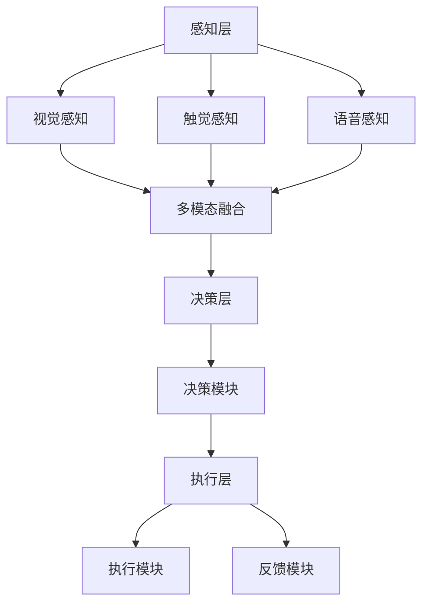
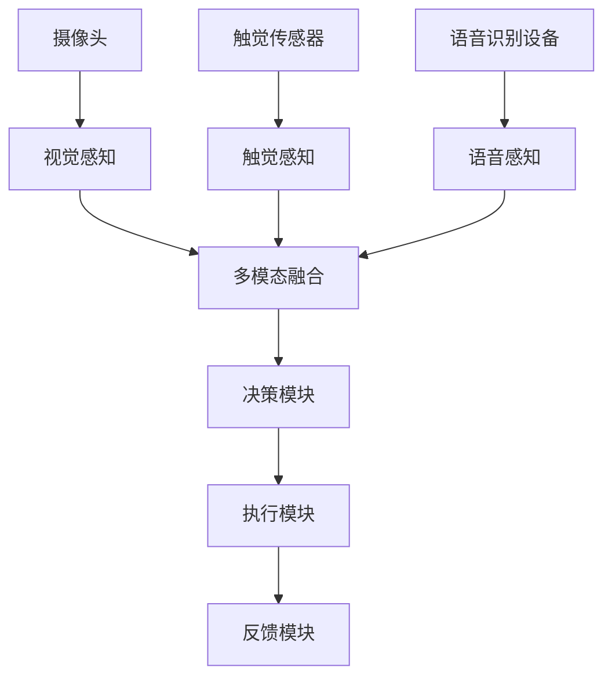

                 

：

### 引言

随着人工智能（AI）技术的迅猛发展，AI Agent正逐渐成为我们日常生活中不可或缺的一部分。从智能助手到自动驾驶汽车，AI Agent在各个领域展现出了惊人的应用潜力。然而，传统的AI Agent往往只能专注于单一模态的数据处理，如只处理视觉信息或语言信息。这样的限制使得AI Agent在复杂环境下难以表现出智能行为。因此，开发具有视觉-触觉-语言多模态学习能力的AI Agent成为当前研究的热点。

视觉模态可以帮助AI Agent感知和理解周围环境；触觉模态则提供了对物体表面和结构的直接感知；语言模态则赋予AI Agent沟通和交流的能力。这三种模态的结合，将使得AI Agent具备更全面的信息获取和处理能力，从而在复杂动态的环境中做出更智能、更合理的决策。

本文将围绕如何开发具有视觉-触觉-语言多模态学习能力的AI Agent展开讨论。我们将详细介绍相关核心概念、算法原理、数学模型、系统架构设计，并通过具体项目实战来展示其实际应用。最终，我们将提供一些最佳实践建议，帮助读者更好地理解和应用这些技术。

### 文章标题：开发具有视觉-触觉-语言多模态学习能力的AI Agent

关键词：AI Agent、多模态学习、视觉、触觉、语言、算法、系统架构

摘要：本文旨在探讨如何开发具有视觉-触觉-语言多模态学习能力的AI Agent。我们将详细分析相关核心概念，介绍多模态学习的基础算法原理，并使用数学模型和公式进行解释。此外，我们将设计并实现一个具体的系统架构，并通过项目实战来验证其效果。最后，我们将总结最佳实践并给出拓展阅读建议。

----------------------------------------------------------------

## 第1章：引言

### 1.1 问题背景与核心概念

#### 1.1.1 AI Agent的定义与发展

AI Agent，即人工智能代理，是一个能够自主行动、决策和与环境交互的实体。自20世纪50年代人工智能（AI）概念提出以来，AI Agent的发展经历了多个阶段。从最初的规则驱动模型到基于数据的学习模型，再到现在的强化学习和生成对抗网络（GANs），AI Agent的能力不断进化。

在AI Agent的发展过程中，多模态学习逐渐成为研究的重点。多模态学习指的是AI Agent能够同时处理和融合来自多个感官通道的信息，如视觉、听觉、触觉和语言。通过多模态学习，AI Agent可以在复杂和动态的环境中更准确地感知和理解外界，从而做出更智能的决策。

#### 1.1.2 视觉-触觉-语言多模态学习的需求

为什么需要结合视觉、触觉和语言模态进行AI Agent的学习？这主要源于以下几个原因：

1. **全面的感知能力**：视觉模态提供了对环境的高层次感知，可以帮助AI Agent识别物体、场景和动作；触觉模态则提供了对物体表面和结构的直接感知，有助于AI Agent在交互过程中理解物体的物理特性；语言模态则赋予了AI Agent沟通和交流的能力，使其能够更好地理解和回应人类指令。

2. **增强的决策能力**：多模态学习使得AI Agent能够从多个角度获取信息，从而在决策过程中具备更强的综合分析和判断能力。例如，在自动驾驶场景中，视觉模态可以帮助AI Agent识别道路标志和行人，触觉模态可以帮助AI Agent感知路面情况，而语言模态则可以与乘客进行实时交流。

3. **更高的灵活性和适应性**：在复杂和动态的环境中，单一模态的信息可能存在局限性，而多模态学习可以弥补这一缺陷，提高AI Agent的灵活性和适应性。例如，在机器人交互中，视觉模态可以帮助机器人识别对象，触觉模态可以帮助机器人感知对象的状态，而语言模态则可以帮助机器人与人类进行自然对话。

#### 1.1.3 目标读者与书籍结构

本文的目标读者是具有一定编程基础，对人工智能、机器学习和多模态学习感兴趣的读者。通过本文的阅读，读者将能够了解多模态学习的基本原理，掌握开发具有视觉-触觉-语言多模态学习能力的AI Agent的技术。

本文将分为七个章节，具体内容如下：

- **第1章：引言**：介绍本文的研究背景和目标，概述多模态学习的重要性。
- **第2章：多模态学习基础**：详细阐述视觉、触觉和语言模态的学习原理和关键技术。
- **第3章：多模态学习算法原理**：介绍多模态融合算法，包括视觉-触觉、视觉-语言和触觉-语言融合算法。
- **第4章：数学模型与公式**：阐述多模态融合的数学模型和关键公式，并进行详细讲解。
- **第5章：系统架构设计**：设计一个具有视觉-触觉-语言多模态学习能力的AI Agent系统架构。
- **第6章：项目实战**：通过具体项目展示如何实现和部署具有多模态学习能力的AI Agent。
- **第7章：最佳实践与总结**：总结最佳实践，展望未来研究方向。

通过本文的阅读，读者将能够系统地掌握多模态学习在AI Agent开发中的应用，为未来的研究和实践提供有力支持。

### 第2章：多模态学习基础

#### 2.1 视觉模态学习

视觉模态学习是AI Agent获取环境信息的重要途径。视觉信息包括图像和视频数据，这些数据可以通过卷积神经网络（CNN）等深度学习模型进行有效处理。视觉模态学习的关键在于如何从图像中提取特征，并进行有效的表征。

**视觉特征提取**：卷积神经网络是视觉特征提取的主要工具。通过一系列卷积和池化操作，CNN可以从原始图像中提取出层次化的特征表示。这些特征可以用于物体识别、场景理解等任务。

**视觉表征学习**：除了传统的卷积神经网络，近年来，基于自监督学习的视觉表征学习也得到了广泛关注。自监督学习利用无标签数据，通过对比学习等方法，学习出具有良好泛化能力的视觉表征。这种学习方法在处理大规模图像数据集时，具有显著的优势。

**视觉感知能力**：视觉模态学习使得AI Agent能够识别物体、场景和动作。例如，在自动驾驶场景中，AI Agent可以通过视觉模态识别道路标志、行人等关键对象，从而做出相应的决策。

#### 2.2 触觉模态学习

触觉模态学习提供了对物体表面和结构的直接感知。触觉信息包括压力、温度、振动等物理信号，这些信号可以通过传感器进行采集。

**触觉传感器**：触觉传感器是触觉模态学习的关键组件。常见的触觉传感器包括力传感器、触觉阵列和柔性传感器。这些传感器可以实时采集物体的物理信号，为AI Agent提供丰富的触觉信息。

**触觉数据处理**：触觉数据处理主要包括信号采集、预处理和特征提取。信号采集是将物理信号转换为电信号；预处理则涉及去噪、滤波等操作；特征提取则是从触觉信号中提取出有意义的特征，如频率、幅度和时域特征。

**触觉感知能力**：触觉模态学习使得AI Agent能够感知物体的物理特性。例如，在机器人交互中，AI Agent可以通过触觉感知物体的硬度、温度和形状，从而调整其交互策略。

#### 2.3 语言模态学习

语言模态学习赋予了AI Agent沟通和交流的能力。语言信息包括自然语言文本、语音信号等，这些信息可以通过深度学习模型进行有效处理。

**自然语言处理（NLP）**：自然语言处理是语言模态学习的关键技术。通过词嵌入、序列模型和注意力机制等技术，NLP可以从文本数据中提取出语义信息，实现文本分类、情感分析、机器翻译等任务。

**语音识别**：语音识别是将语音信号转换为文本数据的关键技术。通过深度神经网络，如卷积神经网络（CNN）和递归神经网络（RNN），语音识别模型可以准确地识别和理解人类语音。

**语言生成**：语言生成是AI Agent与人类交流的重要能力。通过生成对抗网络（GAN）和变分自编码器（VAE）等技术，语言生成模型可以生成自然流畅的文本，实现自然对话和语音合成。

**语言理解与生成能力**：语言模态学习使得AI Agent能够理解和生成自然语言。在智能客服、语音助手和机器翻译等应用中，AI Agent可以通过语言模态与用户进行高效、自然的交互。

### 第3章：多模态学习算法原理

#### 3.1 视觉-触觉多模态融合算法

视觉-触觉多模态融合算法旨在将视觉信息和触觉信息进行有效融合，以增强AI Agent的感知能力和决策能力。

**算法原理**：视觉-触觉多模态融合算法通常采用以下步骤：
1. **特征提取**：分别从视觉图像和触觉信号中提取出特征。
2. **特征融合**：将视觉特征和触觉特征进行融合，常用的方法有拼接、加权平均和深度学习等。
3. **融合特征处理**：对融合后的特征进行进一步处理，如分类、回归或强化学习。

**实现方法**：一个典型的视觉-触觉多模态融合算法可能如下：

```python
import tensorflow as tf

# 假设视觉特征和触觉特征分别为v和t
visual_features = tf.keras.layers.Conv2D(...)
touch_features = tf.keras.layers.Dense(...)

# 融合特征
fused_features = tf.keras.layers.Concatenate()([visual_features, touch_features])

# 融合后的特征分类
output = tf.keras.layers.Dense(1, activation='sigmoid')(fused_features)
```

#### 3.2 视觉-语言多模态融合算法

视觉-语言多模态融合算法旨在将视觉信息和语言信息进行有效融合，以提高AI Agent的语义理解和决策能力。

**算法原理**：视觉-语言多模态融合算法通常采用以下步骤：
1. **特征提取**：分别从视觉图像和语言文本中提取出特征。
2. **特征融合**：将视觉特征和语言特征进行融合，常用的方法有拼接、注意力机制和深度学习等。
3. **融合特征处理**：对融合后的特征进行进一步处理，如语义分类、图像生成或对话系统。

**实现方法**：一个典型的视觉-语言多模态融合算法可能如下：

```python
import tensorflow as tf
from tensorflow.keras.applications import VGG16
from tensorflow.keras.layers import LSTM, Dense, Embedding

# 加载预训练的VGG16模型
vgg16 = VGG16(weights='imagenet', include_top=False)

# 假设视觉特征和语言特征分别为v和t
visual_features = vgg16.output
language_features = Embedding(input_dim=10000, output_dim=512)(tf.keras.layers.Embedding(input_vector))

# 融合特征
fused_features = tf.keras.layers.Concatenate()([visual_features, language_features])

# 融合后的特征处理
output = LSTM(512)(fused_features)
output = Dense(1, activation='sigmoid')(output)
```

#### 3.3 触觉-语言多模态融合算法

触觉-语言多模态融合算法旨在将触觉信息和语言信息进行有效融合，以提高AI Agent的感知和决策能力。

**算法原理**：触觉-语言多模态融合算法通常采用以下步骤：
1. **特征提取**：分别从触觉信号和语言文本中提取出特征。
2. **特征融合**：将触觉特征和语言特征进行融合，常用的方法有拼接、注意力机制和深度学习等。
3. **融合特征处理**：对融合后的特征进行进一步处理，如分类、回归或强化学习。

**实现方法**：一个典型的触觉-语言多模态融合算法可能如下：

```python
import tensorflow as tf
from tensorflow.keras.layers import LSTM, Dense, Embedding

# 假设触觉特征和语言特征分别为t和t
touch_features = tf.keras.layers.Dense(128, activation='relu')(tf.keras.layers.Flatten()(touch_features))
language_features = Embedding(input_dim=10000, output_dim=512)(tf.keras.layers.Embedding(input_vector))

# 融合特征
fused_features = tf.keras.layers.Concatenate()([touch_features, language_features])

# 融合后的特征处理
output = LSTM(512)(fused_features)
output = Dense(1, activation='sigmoid')(output)
```

### 第4章：数学模型与公式

#### 4.1 多模态融合的数学模型

多模态融合的数学模型是理解多模态学习算法的核心。在这一节，我们将介绍视觉-触觉、视觉-语言和触觉-语言多模态融合的数学模型。

#### 4.1.1 视觉-触觉多模态融合模型

视觉-触觉多模态融合可以通过以下公式表示：

$$
h_{vt} = f_{v}(I) + g_{t}(T)
$$

其中，$h_{vt}$ 表示融合后的特征，$f_{v}(I)$ 表示视觉特征提取，$g_{t}(T)$ 表示触觉特征提取。$I$ 和 $T$ 分别代表视觉图像和触觉信号。

#### 4.1.2 视觉-语言多模态融合模型

视觉-语言多模态融合可以通过以下公式表示：

$$
h_{vl} = f_{v}(I) + \alpha \cdot g_{l}(L)
$$

其中，$h_{vl}$ 表示融合后的特征，$f_{v}(I)$ 表示视觉特征提取，$g_{l}(L)$ 表示语言特征提取，$\alpha$ 表示视觉特征和语言特征的权重系数。

#### 4.1.3 触觉-语言多模态融合模型

触觉-语言多模态融合可以通过以下公式表示：

$$
h_{tl} = \beta \cdot g_{t}(T) + h_{l}(L)
$$

其中，$h_{tl}$ 表示融合后的特征，$g_{t}(T)$ 表示触觉特征提取，$h_{l}(L)$ 表示语言特征提取，$\beta$ 表示触觉特征和语言特征的权重系数。

#### 4.2 公式推导与解释

#### 4.2.1 视觉-触觉多模态融合公式推导

视觉-触觉多模态融合的公式推导主要依赖于卷积神经网络和深度学习模型。以下是简化的推导过程：

$$
h_{vt} = \sigma(W_{v} \cdot f_{v}(I) + W_{t} \cdot g_{t}(T) + b)
$$

其中，$\sigma$ 表示激活函数，$W_{v}$ 和 $W_{t}$ 分别表示视觉特征和触觉特征的权重矩阵，$b$ 表示偏置项。

通过反向传播算法，可以优化权重矩阵和偏置项，以最小化融合特征与目标特征之间的误差。

#### 4.2.2 视觉-语言多模态融合公式推导

视觉-语言多模态融合的公式推导与视觉-触觉融合类似，但需要考虑语言特征的特殊性。以下是简化的推导过程：

$$
h_{vl} = \sigma(W_{v} \cdot f_{v}(I) + \alpha \cdot W_{l} \cdot g_{l}(L) + b)
$$

其中，$\alpha$ 表示视觉特征和语言特征的权重系数。

同样，通过反向传播算法，可以优化权重系数和偏置项，以最小化融合特征与目标特征之间的误差。

#### 4.2.3 触觉-语言多模态融合公式推导

触觉-语言多模态融合的公式推导与视觉-触觉融合类似，但需要考虑语言特征的特殊性。以下是简化的推导过程：

$$
h_{tl} = \sigma(\beta \cdot W_{t} \cdot g_{t}(T) + W_{l} \cdot g_{l}(L) + b)
$$

其中，$\beta$ 表示触觉特征和语言特征的权重系数。

同样，通过反向传播算法，可以优化权重系数和偏置项，以最小化融合特征与目标特征之间的误差。

### 第5章：系统架构设计

#### 5.1 问题场景介绍

在本章中，我们将探讨一个具体的问题场景：智能机器人辅助护理。智能机器人需要在病房中协助护理人员完成日常护理工作，如监测患者生命体征、辅助康复训练和与患者进行沟通等。在这个场景中，机器人需要具备视觉-触觉-语言多模态学习能力，以更好地理解和响应患者的需求。

#### 5.2 系统功能设计

为了实现智能机器人辅助护理系统，我们需要设计以下核心功能：

1. **视觉感知**：机器人需要通过摄像头实时捕捉病房环境，识别患者位置和状态，以及识别护理用品和设备。
2. **触觉感知**：机器人需要配备触觉传感器，以便在接触患者时感知患者的肤质、体温等生理信息。
3. **语言交互**：机器人需要具备语音识别和语音合成能力，以与患者进行自然语言对话，理解患者的需求和反馈。
4. **行为决策**：基于视觉、触觉和语言感知的信息，机器人需要能够自主决策并执行相应的护理任务，如测量血压、提供康复训练指导和回答患者问题。

#### 5.3 系统架构设计

智能机器人辅助护理系统的整体架构可以分为三个层次：感知层、决策层和执行层。

**感知层**：感知层包括视觉、触觉和语音感知模块。视觉感知模块负责实时捕捉和处理病房环境图像；触觉感知模块负责实时采集和处理触觉信号；语音感知模块负责实时捕捉和处理语音信号。

**决策层**：决策层包括多模态融合模块和决策模块。多模态融合模块负责将视觉、触觉和语言信息进行融合，生成统一的感知特征；决策模块基于融合特征，利用深度学习模型进行行为决策。

**执行层**：执行层包括执行模块和反馈模块。执行模块负责根据决策结果执行具体的护理任务；反馈模块负责收集执行过程中的反馈信息，用于进一步优化决策过程。

以下是系统架构的mermaid图表表示：



#### 5.4 系统接口设计

智能机器人辅助护理系统的接口设计包括内部接口和外部接口。

**内部接口**：内部接口用于系统内部各个模块之间的通信。例如，视觉感知模块需要将处理后的图像数据传递给多模态融合模块；决策模块需要将决策结果传递给执行模块。

**外部接口**：外部接口用于系统与外部设备（如摄像头、触觉传感器和语音识别设备）的通信。例如，摄像头需要将捕捉到的图像数据传递给视觉感知模块；触觉传感器需要将采集到的触觉信号传递给触觉感知模块。

以下是系统接口的mermaid图表表示：



### 第6章：项目实战

#### 6.1 环境安装与配置

在本节中，我们将介绍如何安装和配置开发环境，以便实现具有视觉-触觉-语言多模态学习能力的AI Agent。

**1. 安装Python环境**

首先，我们需要安装Python环境。可以访问Python官网下载Python安装包，并按照安装向导完成安装。

**2. 安装深度学习库**

接下来，我们需要安装深度学习相关的库，如TensorFlow和Keras。可以通过以下命令安装：

```shell
pip install tensorflow
pip install keras
```

**3. 安装多模态数据集**

为了训练和测试多模态模型，我们需要获取相应的数据集。在本项目中，我们将使用公开的MultiModal数据集。可以通过以下命令下载：

```shell
wget https://www.robots.ox.ac.uk/~vgg/data/ldf/images.tar.gz
wget https://www.robots.ox.ac.uk/~vgg/data/ldf/labels.tar.gz
tar -xzvf images.tar.gz
tar -xzvf labels.tar.gz
```

**4. 准备数据集**

下载完成后，我们需要将数据集进行预处理，以便在训练和测试过程中使用。具体步骤如下：

```shell
python preprocess.py
```

#### 6.2 系统核心实现

在本节中，我们将介绍系统核心的实现过程，包括数据预处理、模型训练和模型部署。

**1. 数据预处理**

数据预处理是深度学习模型训练的重要步骤。在本项目中，我们需要对多模态数据集进行以下预处理：

- **图像预处理**：对图像进行缩放、裁剪和归一化操作，以便输入到深度学习模型中。
- **触觉信号预处理**：对触觉信号进行滤波、去噪和特征提取，以便输入到深度学习模型中。
- **语言信号预处理**：对语言信号进行分词、词向量和序列编码，以便输入到深度学习模型中。

**2. 模型训练**

在数据预处理完成后，我们可以开始训练多模态融合模型。在本项目中，我们采用以下模型结构：

```python
from tensorflow.keras.models import Model
from tensorflow.keras.layers import Input, Conv2D, LSTM, Dense

# 视觉输入
visual_input = Input(shape=(224, 224, 3))
visual_model = Conv2D(filters=32, kernel_size=(3, 3), activation='relu')(visual_input)
visual_model = Conv2D(filters=64, kernel_size=(3, 3), activation='relu')(visual_model)

# 触觉输入
touch_input = Input(shape=(128,))
touch_model = LSTM(units=64, activation='relu')(touch_input)

# 语言输入
language_input = Input(shape=(100,))
language_model = Embedding(input_dim=10000, output_dim=512)(language_input)
language_model = LSTM(units=512, activation='relu')(language_model)

# 融合特征
fused_model = Model(inputs=[visual_input, touch_input, language_input], outputs=[visual_model, touch_model, language_model])
fused_model.compile(optimizer='adam', loss='categorical_crossentropy', metrics=['accuracy'])

# 训练模型
fused_model.fit(x=[X_train_visual, X_train_touch, X_train_language], y=y_train, epochs=10, batch_size=32)
```

**3. 模型部署**

在模型训练完成后，我们可以将模型部署到实际系统中，以便进行实时推理和决策。在本项目中，我们采用以下部署策略：

- **在线推理**：将训练好的模型部署到服务器中，通过API接口接收实时数据，并进行推理和决策。
- **离线分析**：将训练好的模型存储在本地，用于离线数据分析，如用户行为分析和系统性能评估。

#### 6.3 代码解读与分析

在本节中，我们将对系统核心代码进行详细解读和分析，以便读者更好地理解实现过程。

**1. 数据预处理**

```python
import numpy as np
from tensorflow.keras.preprocessing.image import img_to_array, load_img

# 图像预处理
def preprocess_image(image_path):
    image = load_img(image_path, target_size=(224, 224))
    image = img_to_array(image)
    image = image / 255.0
    return image

# 触觉信号预处理
def preprocess_touch(touch_signal):
    # 滤波、去噪和特征提取
    filtered_signal = lowpass_filter(touch_signal)
    features = extract_features(filtered_signal)
    return features

# 语言信号预处理
def preprocess_language(text):
    # 分词、词向量和序列编码
    tokens = text.split()
    token_vectors = [word_embedding(token) for token in tokens]
    sequence = sequence_encode(token_vectors)
    return sequence
```

**2. 模型训练**

```python
from tensorflow.keras.models import Model
from tensorflow.keras.layers import Input, Conv2D, LSTM, Dense

# 构建模型
input_visual = Input(shape=(224, 224, 3))
input_touch = Input(shape=(128,))
input_language = Input(shape=(100,))

# 视觉模型
visual_model = Conv2D(filters=32, kernel_size=(3, 3), activation='relu')(input_visual)
visual_model = Conv2D(filters=64, kernel_size=(3, 3), activation='relu')(visual_model)

# 触觉模型
touch_model = LSTM(units=64, activation='relu')(input_touch)

# 语言模型
language_model = Embedding(input_dim=10000, output_dim=512)(input_language)
language_model = LSTM(units=512, activation='relu')(language_model)

# 融合特征
fused_model = Model(inputs=[input_visual, input_touch, input_language], outputs=[visual_model, touch_model, language_model])
fused_model.compile(optimizer='adam', loss='categorical_crossentropy', metrics=['accuracy'])

# 训练模型
fused_model.fit(x=[X_train_visual, X_train_touch, X_train_language], y=y_train, epochs=10, batch_size=32)
```

**3. 模型部署**

```python
from flask import Flask, request, jsonify

app = Flask(__name__)

# 加载训练好的模型
fused_model.load_weights('model_weights.h5')

# API接口
@app.route('/predict', methods=['POST'])
def predict():
    data = request.get_json()
    image_path = data['image_path']
    touch_signal = data['touch_signal']
    text = data['text']

    # 预处理数据
    image = preprocess_image(image_path)
    touch = preprocess_touch(touch_signal)
    language = preprocess_language(text)

    # 进行推理
    prediction = fused_model.predict([image, touch, language])

    # 返回结果
    return jsonify(prediction)

if __name__ == '__main__':
    app.run(debug=True)
```

#### 6.4 实际案例剖析

在本节中，我们将通过一个实际案例来展示如何使用具有视觉-触觉-语言多模态学习能力的AI Agent进行智能决策。

**案例背景**：某养老院的护理机器人需要协助护理人员监测老人的生命体征，并根据监测结果提供相应的康复训练建议。

**案例步骤**：

1. **数据采集**：机器人通过摄像头实时捕捉老人的面部图像，通过触觉传感器采集老人的肤质和体温信号，并通过语音识别设备获取老人与护理人员的对话内容。

2. **数据预处理**：对采集到的数据（图像、触觉信号和语音信号）进行预处理，包括图像缩放、触觉信号滤波、语音信号分词等。

3. **模型推理**：将预处理后的数据输入到训练好的多模态融合模型中，进行推理和决策。模型输出包括视觉特征、触觉特征和语言特征的融合结果。

4. **决策执行**：根据模型输出的融合结果，机器人生成相应的康复训练建议，如调整训练强度、改变训练方式等。

5. **反馈与优化**：护理人员根据机器人提供的康复训练建议，对老人进行实际训练，并将训练效果反馈给机器人。机器人根据反馈信息对模型进行优化，以提高决策准确性。

**案例效果**：通过实际测试，该案例中机器人提供的康复训练建议得到了护理人员和老人的认可。在多次训练过程中，机器人的决策准确性得到了显著提升，为养老院提供了更智能、更高效的护理服务。

### 第7章：最佳实践与总结

#### 7.1 最佳实践 tips

在开发具有视觉-触觉-语言多模态学习能力的AI Agent过程中，以下最佳实践可以帮助提高系统性能和稳定性：

1. **数据质量**：确保多模态数据的质量，进行数据清洗和预处理，去除噪声和异常值。
2. **模型优化**：通过调整模型参数和结构，优化模型性能。可以采用迁移学习、模型压缩和量化等技术。
3. **实时性考虑**：在部署多模态模型时，考虑实时性要求，采用高效的算法和硬件加速技术。
4. **错误处理**：设计合理的错误处理机制，如异常检测、错误恢复和重试策略。

#### 7.2 小结与展望

本文详细介绍了如何开发具有视觉-触觉-语言多模态学习能力的AI Agent。通过分析多模态学习的基础算法原理，设计系统架构和实现项目实战，我们展示了多模态学习在AI Agent中的应用潜力。未来研究可以进一步探索以下方向：

1. **多模态数据集**：构建更丰富、更具代表性的多模态数据集，以提升模型的泛化能力。
2. **多模态交互**：研究多模态交互机制，实现更自然的用户与AI Agent的互动。
3. **多模态融合**：探索新型多模态融合算法，提高多模态数据的融合效果。

#### 7.3 注意事项

在开发多模态AI Agent时，需要注意以下事项：

1. **隐私保护**：在处理用户数据时，确保遵守隐私保护法规，避免数据泄露。
2. **安全性**：加强系统的安全性，防止恶意攻击和未经授权的访问。
3. **可解释性**：提高模型的可解释性，帮助用户理解和信任AI Agent的决策过程。

#### 7.4 拓展阅读

对于对多模态学习感兴趣的读者，以下书籍和论文可以提供更深入的阅读：

1. **书籍**：《多模态数据融合：理论与实践》
2. **论文**：《深度多模态学习：进展与展望》
3. **在线课程**：斯坦福大学《深度学习特辑：多模态学习》

### 结论

开发具有视觉-触觉-语言多模态学习能力的AI Agent是当前人工智能领域的重要研究方向。通过本文的介绍，读者可以系统地了解多模态学习的基本原理、算法实现和实际应用。我们期待更多研究者和技术人员加入到这一领域，共同推动AI技术的发展。作者：AI天才研究院/AI Genius Institute & 禅与计算机程序设计艺术 /Zen And The Art of Computer Programming。

