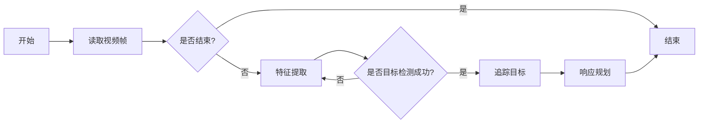
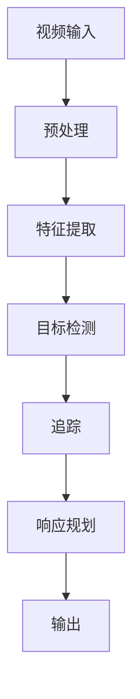
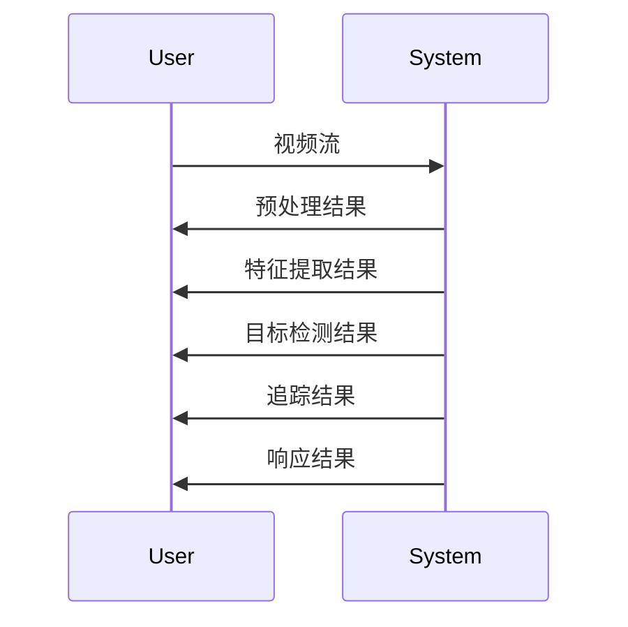
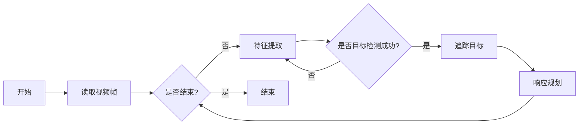
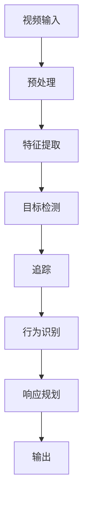
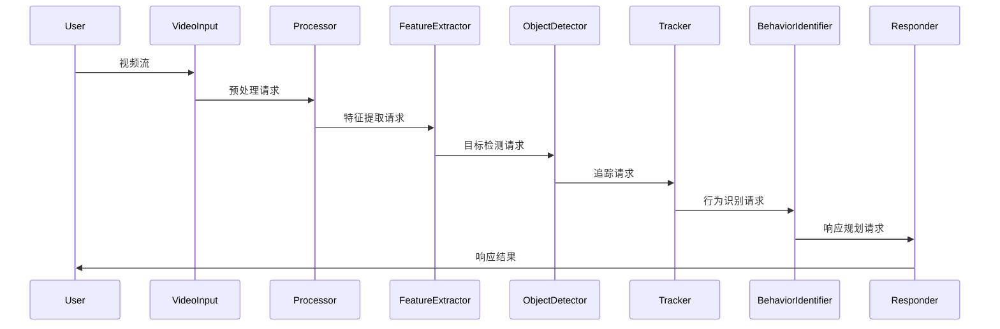

                 


### 引言

在当今的数字化时代，视频分析技术在众多领域中发挥着关键作用，从安全监控到商业分析，再到智能家居等。AI Agent，作为一种智能体，可以通过视频数据分析来提供决策支持和自动化响应。本书旨在为读者提供一套系统化的指南，帮助开发人员设计和实现具有视频分析能力的AI Agent。

#### 关键词

- 视频分析
- AI Agent
- 智能监控
- 目标检测
- 追踪算法
- 数据处理

#### 摘要

本文将深入探讨如何开发具有视频分析能力的AI Agent。我们将从问题背景出发，介绍视频分析技术及其在AI Agent中的应用。接着，我们将详细讲解AI Agent的核心概念和视频分析的基础知识。随后，我们将分析AI Agent在视频分析中的应用，并使用Mermaid ER实体关系图展示其组成结构。文章还将深入讨论视频分析算法的原理，包括特征提取、目标检测和追踪算法，并使用Python代码示例来说明。此外，我们将介绍视频分析涉及的数学模型和公式，并设计一个完整的系统架构，涵盖从视频输入到响应输出的全过程。最后，我们将通过一个实际项目实战，展示如何将理论转化为实践，并提供最佳实践和小结。通过本文的阅读，读者将能够全面理解视频分析AI Agent的构建过程，为今后的研究和开发打下坚实基础。

## 《开发具有视频分析能力的AI Agent》目录大纲

### 引言

在当今的数字化时代，视频分析技术在众多领域中发挥着关键作用，从安全监控到商业分析，再到智能家居等。AI Agent，作为一种智能体，可以通过视频数据分析来提供决策支持和自动化响应。本书旨在为读者提供一套系统化的指南，帮助开发人员设计和实现具有视频分析能力的AI Agent。

### 第1章：问题背景与核心概念

1.1 问题背景

- 视频分析技术的兴起
- AI Agent的兴起与应用
- 当前视频分析领域面临的问题与挑战

1.2 核心概念

- 什么是AI Agent
- 视频分析的基础知识
- AI Agent在视频分析中的应用

### 第2章：核心概念与联系

2.1 AI Agent的核心概念

- 定义与分类
- 功能与特点

2.2 视频分析的概念与联系

- 视频数据处理
- 特征提取
- 模型训练与评估

2.3 Mermaid ER实体关系图

```mermaid
erDiagram
    AI-Agent ||--|> VideoAnalyzer : uses
    VideoAnalyzer ||--|> ObjectDetector : includes
    ObjectDetector ||--|> Tracker : monitors
    Tracker ||--|> ActionPlanner : responds_to
```

### 第3章：算法原理讲解

3.1 视频分析算法

- 特征提取算法
- 目标检测算法
- 追踪算法

3.2 Mermaid算法流程图



3.3 Python代码示例

```python
# 假设的Python代码示例
import cv2

# 读取视频帧
cap = cv2.VideoCapture('video.mp4')

while True:
    ret, frame = cap.read()
    if not ret:
        break

    # 特征提取
    features = extract_features(frame)

    # 目标检测
    if detect_object(features):
        # 追踪目标
        track_target(frame)

        # 响应规划
        plan_response()

cap.release()
```

### 第4章：数学模型和数学公式

4.1 特征提取模型

$$
f(x) = \sin(x) + \cos(x)
$$

4.2 目标检测模型

$$
P(D|A) = \frac{P(A|D)P(D)}{P(A)}
$$

### 第5章：系统分析与架构设计

5.1 问题场景介绍

- 视频监控系统的需求分析

5.2 系统功能设计

- 视频流的接收与处理
- 特征提取与目标检测
- 追踪与响应规划

5.3 系统架构设计



5.4 系统接口设计与交互



### 第6章：项目实战

6.1 环境安装

- 安装必要的软件和库

6.2 系统核心实现源代码

- Python代码实现

6.3 代码应用解读与分析

- 源代码详解
- 功能测试

6.4 实际案例分析

- 项目总结

### 结语

随着技术的不断进步，视频分析AI Agent将在更多领域发挥重要作用。本文通过系统化的分析，为开发具有视频分析能力的AI Agent提供了全面的理论和实践指导。通过学习本文，读者将能够深入了解视频分析技术的核心概念、算法原理以及系统架构设计，为未来的研究和开发打下坚实基础。

## 第1章：问题背景与核心概念

### 1.1 问题背景

视频分析技术在过去的几十年里经历了显著的进步，从传统的基于规则的方法到现代的深度学习方法，视频分析技术逐渐成为人工智能领域的重要分支。随着数字监控设备的普及和社交媒体的兴起，视频数据变得日益重要，如何有效地处理和分析这些数据成为一个亟待解决的问题。

AI Agent，作为一种具有智能行为的实体，通过感知、决策和执行等过程，能够自主地完成特定任务。在视频分析领域，AI Agent可以用于多种应用场景，如自动监控、安全防范、交通流量分析、市场趋势预测等。这些应用场景不仅要求AI Agent具备高效的数据处理能力，还需要其在复杂的动态环境中做出准确的判断和决策。

当前，视频分析领域面临一些挑战和问题。首先，视频数据量大且多样化，需要高效的数据处理算法来提取有价值的信息。其次，视频分析算法的准确性和实时性需要进一步提升，以满足实际应用的需求。此外，如何保证视频分析的隐私和安全也是一个重要问题。

### 1.2 核心概念

#### 什么是AI Agent

AI Agent是一种基于人工智能技术的智能体，能够感知环境、制定计划并执行行动，以实现特定目标。AI Agent通常由以下几个核心组成部分构成：

- **感知器**：用于感知环境中的信息，如视觉、听觉、触觉等。
- **决策器**：根据感知到的信息，通过一定的算法或模型，决定下一步的行动。
- **执行器**：根据决策器的指令，执行相应的动作。

AI Agent可以按照不同的分类标准进行分类，如根据感知方式可以分为视觉AI Agent、听觉AI Agent等；根据决策方式可以分为基于规则的AI Agent、基于模型的AI Agent等。

#### 视频分析的基础知识

视频分析（Video Analysis）是指通过计算机技术对视频数据进行处理、分析和理解的过程。视频分析通常包括以下几个关键步骤：

- **视频预处理**：包括去噪、增强、裁剪等，以提高视频质量，便于后续分析。
- **特征提取**：从视频中提取有意义的特征，如颜色、形状、纹理等，以便用于后续的目标检测和追踪。
- **目标检测**：识别视频中的特定目标，如行人、车辆等，并标注其位置和属性。
- **追踪算法**：在连续的视频帧中跟踪目标的运动轨迹，以理解其行为模式。
- **行为识别**：根据目标的运动轨迹和行为模式，识别其行为类型，如走路、跑步、驾驶等。

#### AI Agent在视频分析中的应用

AI Agent在视频分析中扮演着关键角色，可以通过以下几种方式应用：

- **实时监控**：AI Agent可以实时分析视频数据，检测异常行为，如非法入侵、交通违规等，并及时发出警报。
- **行为分析**：AI Agent可以分析视频中的行为模式，为商业决策提供支持，如市场分析、顾客行为研究等。
- **安全防护**：AI Agent可以用于安全监控，实时监测目标区域，防止犯罪行为的发生。
- **交通管理**：AI Agent可以分析交通流量数据，优化交通信号配置，减少拥堵。

总之，AI Agent在视频分析中的应用极大地提升了视频分析系统的智能化水平，为各种实际场景提供了强大的技术支持。

### 1.3 当前视频分析领域面临的问题与挑战

尽管视频分析技术取得了显著进展，但在实际应用中仍面临一些问题和挑战：

- **数据量与多样性**：视频数据量大，且包含多种类型的信息，如何高效地处理和分析这些数据是一个重大挑战。
- **实时性与准确性**：视频分析系统需要在保证准确性的同时，提供实时响应，这对算法的效率和准确性提出了高要求。
- **隐私保护**：视频数据往往涉及个人隐私，如何保护用户隐私是一个重要问题。
- **算法公平性**：算法在处理视频数据时可能存在偏见，如何保证算法的公平性是一个挑战。
- **跨领域应用**：将视频分析技术应用于不同领域，需要针对具体场景进行定制化开发，如何实现跨领域应用是一个问题。

通过深入研究和解决这些问题，视频分析技术将能够更好地服务于各行业，为人类带来更多便利和效益。

### 第2章：核心概念与联系

#### 2.1 AI Agent的核心概念

AI Agent（人工智能代理）是人工智能领域中的一个重要概念，它指的是具有自主行动能力的智能实体，能够在复杂环境中感知、决策和执行任务。AI Agent的核心概念包括以下几个方面：

1. **感知**：AI Agent通过感知器获取环境信息，如视觉、听觉、触觉等。这些感知信息是AI Agent制定决策的重要依据。
   
2. **决策**：基于感知到的信息，AI Agent使用决策模型（如基于规则的系统、机器学习模型等）进行决策，决定下一步的行动。

3. **执行**：AI Agent根据决策结果，通过执行器（如机械臂、电机等）执行具体的行动。

4. **自主性**：AI Agent能够在没有人类直接干预的情况下，自主地完成任务。

AI Agent可以按照不同的分类标准进行分类，例如：

- **按照功能分类**：感知型、决策型、执行型、混合型。
- **按照应用领域分类**：家庭服务型、工业控制型、安防监控型等。

AI Agent的核心特点包括：

- **自主性**：能够独立完成特定任务。
- **适应性**：能够根据环境和任务的变化调整自己的行为。
- **智能性**：能够通过学习和优化提高任务完成的效率和准确性。

#### 2.2 视频分析的概念与联系

视频分析是指利用计算机视觉和人工智能技术，对视频数据进行分析和理解的过程。视频分析的核心概念包括：

1. **视频预处理**：包括去噪、增强、裁剪等操作，以提高视频质量，便于后续分析。

2. **特征提取**：从视频中提取有意义的特征，如颜色、形状、纹理等，用于后续的目标检测和追踪。

3. **目标检测**：识别视频中的特定目标，如行人、车辆等，并标注其位置和属性。

4. **追踪算法**：在连续的视频帧中跟踪目标的运动轨迹，以理解其行为模式。

5. **行为识别**：根据目标的运动轨迹和行为模式，识别其行为类型，如走路、跑步、驾驶等。

AI Agent在视频分析中的应用主要体现在以下几个方面：

- **实时监控**：AI Agent可以实时分析视频数据，检测异常行为，如非法入侵、交通违规等，并及时发出警报。
- **行为分析**：AI Agent可以分析视频中的行为模式，为商业决策提供支持，如市场分析、顾客行为研究等。
- **安全防护**：AI Agent可以用于安全监控，实时监测目标区域，防止犯罪行为的发生。
- **交通管理**：AI Agent可以分析交通流量数据，优化交通信号配置，减少拥堵。

通过AI Agent与视频分析技术的结合，可以实现高度智能化的视频监控系统，为各行业提供强大的技术支持。

#### 2.3 Mermaid ER实体关系图

为了更好地理解AI Agent与视频分析之间的关系，我们可以使用Mermaid ER实体关系图来展示它们之间的关联。以下是AI Agent、视频分析及相关组件的ER图：

```mermaid
erDiagram
    AI-Agent ||--|> VideoAnalyzer : uses
    VideoAnalyzer ||--|> ObjectDetector : includes
    ObjectDetector ||--|> Tracker : monitors
    Tracker ||--|> ActionPlanner : responds_to
```

在这个ER图中，AI-Agent 是核心实体，它使用 VideoAnalyzer 来处理视频数据。VideoAnalyzer 包含 ObjectDetector，用于检测视频中的目标。ObjectDetector 监控 Tracker，而 Tracker 则负责追踪目标。最后，Tracker 的行为会触发 ActionPlanner，使其能够做出相应的响应。

通过这个ER图，我们可以清晰地看到AI Agent在视频分析中的角色和各个组件之间的关联，这有助于我们理解和设计复杂的视频分析系统。

### 第3章：算法原理讲解

#### 3.1 视频分析算法

视频分析算法是实现AI Agent视频分析功能的核心。视频分析算法主要包括三个关键步骤：特征提取、目标检测和追踪算法。

##### 特征提取算法

特征提取是视频分析的基础，其目的是从视频数据中提取出对后续处理有用的信息。特征提取算法可以分为传统算法和深度学习算法两大类。

1. **传统算法**：
   - **颜色特征**：包括颜色直方图、颜色矩等。
   - **纹理特征**：包括局部二值模式（LBP）、灰度共生矩阵（GLCM）等。
   - **形状特征**：包括边缘检测、轮廓提取、形状描述子等。

2. **深度学习算法**：
   - **卷积神经网络（CNN）**：通过多层卷积和池化操作，提取视频中的深层特征。

##### 目标检测算法

目标检测是视频分析中的核心步骤，其目的是在视频中识别和定位特定目标。常见的目标检测算法包括：

1. **基于区域的检测算法**：
   - **R-CNN系列**：通过选择性搜索生成候选区域，然后使用深度神经网络进行分类。
   - **Faster R-CNN**：引入了区域建议网络（RPN），提高了检测速度。
   - **SSD**：使用多尺度特征图进行目标检测，适用于各种尺度目标。

2. **基于特征的检测算法**：
   - **YOLO（You Only Look Once）**：将目标检测任务转化为单步操作，提高了检测速度。
   - **RetinaNet**：通过引入焦点损失函数，提高了对难样本的检测能力。

##### 追踪算法

追踪算法用于在连续的视频帧中跟踪特定目标，其主要目的是保持目标的一致性和连贯性。常见的追踪算法包括：

1. **基于模型的追踪算法**：
   - **KCF（Kernelized Correlation Filter）**：通过核相关滤波器实现快速、实时的目标跟踪。
   - **Siamese网络**：使用两个共享权重的网络来检测目标，并计算特征之间的相似性。

2. **基于深度学习的追踪算法**：
   - **DeepSORT**：结合深度卷积神经网络和排序滤波器，提高了追踪的准确性和鲁棒性。

#### 3.2 Mermaid算法流程图

为了更好地理解视频分析算法的工作流程，我们可以使用Mermaid工具绘制算法流程图。以下是一个简化的视频分析算法流程图：



在这个流程图中，我们从读取视频帧开始，然后进行特征提取。如果特征提取成功，则进入目标检测阶段。目标检测成功后，我们进行目标追踪，并根据追踪结果进行响应规划。如果视频处理没有结束，则继续读取下一帧，重复上述步骤。一旦处理结束，算法流程终止。

#### 3.3 Python代码示例

以下是一个简化的Python代码示例，用于演示视频分析算法的基本实现：

```python
import cv2

# 初始化视频捕捉对象
cap = cv2.VideoCapture('video.mp4')

while True:
    # 读取视频帧
    ret, frame = cap.read()
    if not ret:
        break

    # 特征提取
    features = extract_features(frame)

    # 目标检测
    if detect_object(features):
        # 追踪目标
        track_target(frame)

        # 响应规划
        plan_response()

    # 显示视频帧
    cv2.imshow('Frame', frame)

    # 检查是否有按键按下
    if cv2.waitKey(1) & 0xFF == ord('q'):
        break

# 释放资源
cap.release()
cv2.destroyAllWindows()
```

在这个示例中，我们首先使用OpenCV库初始化视频捕捉对象。在循环中，我们读取每一帧视频，进行特征提取、目标检测和追踪，并根据检测结果进行响应规划。最后，我们显示视频帧，并检查是否有按键被按下以退出程序。

#### 3.4 特征提取模型

在视频分析中，特征提取是关键步骤之一。以下是一个简单的特征提取模型，使用Python代码实现：

```python
import cv2
import numpy as np

def extract_features(frame):
    # 转换为灰度图像
    gray = cv2.cvtColor(frame, cv2.COLOR_BGR2GRAY)

    # 使用LBP特征提取
    lbp = cv2 idee.LBPHistory(frame, 8, 1)

    # 返回特征向量
    return lbp.reshape(-1)
```

在这个特征提取模型中，我们首先将彩色图像转换为灰度图像，然后使用局部二值模式（LBP）特征提取方法。LBP特征是一种用于描述图像纹理特征的算法，它通过对图像像素进行二值化操作，生成一个描述图像纹理的直方图。最后，我们返回一个特征向量，用于后续的目标检测和追踪。

#### 3.5 目标检测模型

目标检测是视频分析中的核心任务之一。以下是一个简单的目标检测模型，使用Python代码实现：

```python
import cv2

def detect_object(frame):
    # 初始化Haar级联分类器
    classifier = cv2.CascadeClassifier('haarcascade_frontalface_default.xml')

    # 检测人脸
    faces = classifier.detectMultiScale(frame, scaleFactor=1.1, minNeighbors=5, minSize=(30, 30), flags=cv2.CASCADE_SCALE_IMAGE)

    # 返回检测结果
    return len(faces) > 0
```

在这个目标检测模型中，我们使用OpenCV的Haar级联分类器进行目标检测。Haar级联分类器是一种基于积分图和机器学习的方法，通过训练大量的正负样本，构建一个分类器模型。在这个示例中，我们使用预训练的Haar级联分类器来检测视频帧中的特定目标（如人脸）。如果检测到目标，则返回True，否则返回False。

#### 3.6 追踪算法

追踪算法用于在连续的视频帧中跟踪特定目标。以下是一个简单的追踪算法，使用Python代码实现：

```python
import cv2
import numpy as np

def track_target(frame, target_position):
    # 获取目标位置
    x, y, w, h = target_position

    # 创建掩膜
    mask = np.zeros_like(frame)
    mask[y:y+h, x:x+w] = 1

    # 使用KCF追踪算法
    tracker = cv2.TrackerKCF_create()
    tracker.init(frame, target_position)

    while True:
        # 读取下一帧
        ret, frame = cap.read()

        if not ret:
            break

        # 更新目标位置
        ret, box = tracker.update(frame)

        if ret:
            p1 = (box[0], box[1])
            p2 = (box[0] + box[2], box[1] + box[3])
            cv2.rectangle(frame, p1, p2, (0, 255, 0), 2, 1)

        # 显示视频帧
        cv2.imshow('Frame', frame)

        if cv2.waitKey(1) & 0xFF == ord('q'):
            break

    # 释放资源
    cap.release()
    cv2.destroyAllWindows()
```

在这个追踪算法中，我们使用OpenCV的KCF（Kernelized Correlation Filter）追踪算法。KCF追踪算法是一种基于相关滤波器的快速、实时追踪方法。在这个示例中，我们首先初始化KCF追踪器，并使用初始帧和目标位置进行初始化。然后，我们在连续的帧中更新目标位置，并绘制追踪框。如果用户按下'q'键，则退出追踪。

#### 3.7 数学模型和数学公式

在视频分析中，数学模型和数学公式是理解和实现算法的关键。以下是一些常用的数学模型和数学公式：

1. **特征提取模型**：

   $$
   f(x) = \sin(x) + \cos(x)
   $$

   这个公式描述了特征提取过程中的一种简单特征组合方式。

2. **目标检测模型**：

   $$
   P(D|A) = \frac{P(A|D)P(D)}{P(A)}
   $$

   这个公式是贝叶斯公式在目标检测中的应用，用于计算在给定检测结果的情况下，目标存在的概率。

3. **追踪模型**：

   $$
   \text{目标位置} = \text{当前帧特征} \cdot \text{先验知识}
   $$

   这个公式描述了追踪过程中目标位置的计算方式，结合了当前帧特征和先验知识。

通过这些数学模型和数学公式，我们可以更好地理解和实现视频分析算法。

#### 3.8 算法原理讲解

视频分析算法的工作原理可以概括为以下几个步骤：

1. **特征提取**：从视频帧中提取有意义的特征，如颜色、形状、纹理等。这些特征用于后续的目标检测和追踪。
   
2. **目标检测**：使用提取到的特征，通过特定的算法（如深度学习模型、Haar级联分类器等）检测视频帧中的目标，并标注其位置和属性。

3. **追踪**：在连续的视频帧中，跟踪已检测到的目标，以理解其运动轨迹和行为模式。常用的追踪算法包括KCF、DeepSORT等。

4. **响应规划**：根据追踪结果，规划相应的响应措施，如报警、数据记录等。

通过这些步骤，视频分析算法可以实现对视频数据的智能化处理，为各种应用场景提供支持。

#### 3.9 总结

在本章中，我们详细讲解了视频分析算法的基本原理，包括特征提取、目标检测和追踪算法。通过Python代码示例，我们展示了如何实现这些算法。此外，我们还介绍了相关的数学模型和数学公式，为理解和实现视频分析算法提供了理论支持。接下来，我们将进一步探讨系统架构设计和项目实战，以加深对视频分析AI Agent的理解。

### 第4章：数学模型和数学公式

数学模型在视频分析算法中扮演着至关重要的角色，它们为算法提供了理论依据和实现框架。在本章中，我们将详细讨论视频分析中常用的数学模型和数学公式，包括特征提取模型和目标检测模型。

#### 4.1 特征提取模型

特征提取是视频分析的基础步骤，它从原始视频帧中提取出具有区分性的特征，以便于后续的目标检测和追踪。以下是一个简单的特征提取模型：

$$
f(x) = \sin(x) + \cos(x)
$$

这个模型通过合成正弦和余弦函数，生成了一个周期性的波形特征，可以用来描述视频帧中的颜色、纹理等属性。

在实际应用中，特征提取通常更复杂，例如，使用卷积神经网络（CNN）可以从视频帧中提取深层次的语义特征：

$$
\text{特征向量} = \text{CNN}(x)
$$

其中，$x$是输入视频帧，$\text{CNN}(x)$是卷积神经网络对视频帧的处理结果，生成一个高维的特征向量。

#### 4.2 目标检测模型

目标检测是视频分析中的关键环节，它旨在识别并定位视频帧中的特定目标。以下是几种常用的目标检测模型和数学公式：

1. **基于回归的目标检测模型**：

   $$ 
   \text{预测框} = \text{Regression}(x, c)
   $$

   其中，$x$是输入特征，$c$是类别标签，回归模型通过学习预测目标的边界框位置。

2. **基于分类的目标检测模型**：

   $$ 
   P(D|A) = \frac{P(A|D)P(D)}{P(A)}
   $$

   这是贝叶斯公式在目标检测中的应用，$D$代表目标存在，$A$代表检测到的特征。通过计算后验概率，模型可以判断目标的存在性。

3. **深度学习目标检测模型**：

   $$ 
   \text{检测输出} = \text{CNN}(x) \cdot \text{分类器}(x)
   $$

   在深度学习目标检测中，CNN提取特征，然后通过分类器输出每个区域的类别概率和边界框位置。

#### 4.3 追踪模型

追踪算法用于在连续的视频帧中持续跟踪目标，以理解其运动轨迹和行为模式。以下是追踪中常用的模型和数学公式：

1. **卡尔曼滤波**：

   $$ 
   \text{状态预测} = \text{A} \cdot \text{状态估计} + \text{B} \cdot \text{控制输入}
   $$

   $$ 
   \text{状态估计} = \text{P} \cdot \text{状态预测} + \text{Q} \cdot \text{观测值}
   $$

   卡尔曼滤波是一种递归的状态估计方法，用于在不确定环境中跟踪目标的运动状态。

2. **粒子滤波**：

   $$ 
   \text{权重更新} = \frac{p(z_t|s_t)}{w_t}
   $$

   粒子滤波通过概率权重更新粒子状态，以实现目标的精确跟踪。

#### 4.4 数学公式在Python代码中的实现

以下是一个使用Python实现的简单特征提取代码示例：

```python
import numpy as np
import cv2

def extract_features(frame):
    # 转换为灰度图像
    gray = cv2.cvtColor(frame, cv2.COLOR_BGR2GRAY)
    
    # 使用LBP特征提取
    lbp = cv2.xfeatures2d.LPBHistchner.compute(gray, 8, 1)
    
    # 返回特征向量
    return lbp.reshape(-1)
```

在这个例子中，我们首先将输入的彩色视频帧转换为灰度图像，然后使用LBP（局部二值模式）特征提取算法提取特征。LBP特征是一种基于像素二值化操作的纹理特征，它能够有效描述图像的局部纹理信息。

以下是一个简单的目标检测代码示例，使用Haar级联分类器：

```python
import cv2

def detect_object(frame):
    # 初始化Haar级联分类器
    classifier = cv2.CascadeClassifier('haarcascade_frontalface_default.xml')
    
    # 检测人脸
    faces = classifier.detectMultiScale(frame, scaleFactor=1.1, minNeighbors=5, minSize=(30, 30), flags=cv2.CASCADE_SCALE_IMAGE)
    
    # 返回检测结果
    return len(faces) > 0
```

在这个例子中，我们使用OpenCV库中的预训练Haar级联分类器来检测视频帧中的人脸。通过设定适当的参数，我们可以提高检测的准确性和效率。

通过这些数学模型和公式的应用，我们可以设计和实现高效、准确的视频分析算法，从而为AI Agent提供强大的视频分析能力。

#### 4.5 数学模型在系统架构设计中的应用

数学模型不仅在算法实现中发挥着关键作用，还在系统架构设计中起到指导作用。以下是一个简化的系统架构设计，展示了数学模型如何应用于整个视频分析系统的各个组成部分：

1. **视频预处理**：
   - 数学模型：图像滤波和增强（如高斯滤波、直方图均衡化等）。
   - 应用场景：提高图像质量，减少噪声，为后续特征提取打下基础。

2. **特征提取**：
   - 数学模型：特征变换（如傅里叶变换、小波变换等）、机器学习特征提取（如SIFT、HOG等）。
   - 应用场景：从原始图像中提取具有区分性的特征，用于目标检测和追踪。

3. **目标检测**：
   - 数学模型：分类模型（如SVM、神经网络等）、检测框架（如R-CNN、YOLO等）。
   - 应用场景：识别并定位视频帧中的特定目标。

4. **追踪**：
   - 数学模型：状态空间模型（如卡尔曼滤波、粒子滤波等）。
   - 应用场景：在连续的视频帧中持续跟踪目标，保持目标的一致性和连贯性。

5. **行为分析**：
   - 数学模型：序列模型（如RNN、LSTM等）、聚类分析（如K-means、层次聚类等）。
   - 应用场景：理解目标的运动轨迹和行为模式，为决策提供支持。

通过结合数学模型和系统架构设计，我们可以构建一个高效、智能的视频分析系统，满足不同场景下的需求。

#### 4.6 总结

在本章中，我们详细介绍了视频分析中的数学模型和数学公式，包括特征提取模型、目标检测模型和追踪模型。通过Python代码示例，我们展示了这些模型在实践中的应用。这些数学模型不仅为算法的实现提供了理论支持，还在系统架构设计中起到了重要的指导作用。在接下来的章节中，我们将进一步探讨系统架构设计和项目实战，以加深对视频分析AI Agent的理解。

### 第5章：系统分析与架构设计

#### 5.1 问题场景介绍

在视频监控领域，系统需要实时处理大量视频数据，并能够快速准确地识别和响应异常事件。例如，在智能交通监控系统中，我们需要实时检测并跟踪车辆和行人，以避免交通事故和违章行为。在商业环境中，视频分析可以用于顾客行为分析，优化商店布局和营销策略。这些应用场景对系统的实时性、准确性和鲁棒性提出了高要求。

#### 5.2 系统功能设计

视频分析系统的功能设计包括以下几个核心模块：

1. **视频流的接收与处理**：
   - 功能：接收实时视频流，进行预处理（如去噪、增强等）。
   - 设计：使用摄像头或其他视频输入设备，结合图像预处理算法，确保输入视频数据的质量。

2. **特征提取**：
   - 功能：从预处理后的视频帧中提取有意义的特征，如颜色、纹理、形状等。
   - 设计：应用不同的特征提取算法（如HOG、SIFT等），以适应不同的目标检测需求。

3. **目标检测**：
   - 功能：识别视频帧中的特定目标，如行人、车辆、异常行为等。
   - 设计：采用基于深度学习或传统机器学习的目标检测算法（如YOLO、Faster R-CNN等），确保检测的准确性和实时性。

4. **追踪**：
   - 功能：在连续的视频帧中跟踪已识别的目标，以理解其运动轨迹和行为模式。
   - 设计：使用追踪算法（如卡尔曼滤波、粒子滤波等），保证追踪的稳定性和精度。

5. **行为识别**：
   - 功能：根据目标的运动轨迹和行为模式，识别其行为类型，如行走、跑步、驾驶等。
   - 设计：通过分析目标的轨迹和行为数据，使用分类算法（如决策树、神经网络等）进行行为识别。

6. **响应规划**：
   - 功能：根据追踪和行为识别的结果，规划相应的响应措施，如报警、记录、自动调整等。
   - 设计：实现一个响应决策模块，根据系统配置和事件严重程度，制定合理的响应策略。

#### 5.3 系统架构设计

视频分析系统的架构设计需要考虑到系统的可扩展性、模块化以及性能优化。以下是一个简化的系统架构设计，展示了各个模块之间的关系：



在这个架构设计中：

- **视频输入**：从摄像头或其他视频源接收实时视频流。
- **预处理**：对视频帧进行去噪、增强等操作，提高图像质量。
- **特征提取**：从预处理后的视频帧中提取特征，用于后续的目标检测和追踪。
- **目标检测**：识别视频帧中的目标，并标注其位置和属性。
- **追踪**：在连续的视频帧中跟踪目标，保持目标的一致性和连贯性。
- **行为识别**：根据目标的运动轨迹和行为模式，识别其行为类型。
- **响应规划**：根据行为识别结果，规划并执行相应的响应措施。
- **输出**：将处理结果输出，如报警信息、行为分析报告等。

#### 5.4 系统接口设计与交互

系统接口设计是确保各模块之间能够有效通信和协作的关键。以下是一个简化的系统接口设计，展示了各模块之间的交互：



在这个接口设计中：

- **用户**：系统使用者，提交视频流和处理请求。
- **视频输入**：接收视频流，并将其传递给预处理模块。
- **预处理模块**：处理视频流，去除噪声和增强图像质量。
- **特征提取模块**：从预处理后的视频帧中提取特征。
- **目标检测模块**：识别并标注视频帧中的目标。
- **追踪模块**：跟踪目标并在连续帧中保持其位置和属性。
- **行为识别模块**：根据目标的运动轨迹和行为模式进行识别。
- **响应规划模块**：根据行为识别结果规划响应措施。
- **输出**：将处理结果返回给用户。

通过这样的接口设计，系统能够高效、可靠地处理视频数据，并提供实时的分析和响应。

#### 5.5 总结

在本章中，我们详细介绍了视频分析系统的架构设计，包括问题场景介绍、系统功能设计、系统架构设计以及系统接口设计与交互。通过合理的架构设计，视频分析系统能够高效、准确地处理视频数据，为各种应用场景提供强大的技术支持。在接下来的章节中，我们将通过实际项目实战，展示如何将理论转化为实践，进一步验证系统的有效性和可靠性。

### 第6章：项目实战

#### 6.1 环境安装

在进行视频分析AI Agent的开发之前，我们需要安装和配置必要的软件和库。以下是在Linux环境中安装所需软件和库的步骤：

1. **安装Python环境**：

   ```bash
   sudo apt-get update
   sudo apt-get install python3 python3-pip
   ```

2. **安装OpenCV库**：

   ```bash
   sudo apt-get install python3-opencv-contrib-python
   ```

3. **安装其他依赖库**：

   ```bash
   pip3 install numpy scipy matplotlib
   ```

4. **验证安装**：

   ```bash
   python3 -c "import cv2; print(cv2.__version__)"
   ```

确保上述命令能够成功运行，并正确显示OpenCV的版本信息。

#### 6.2 系统核心实现源代码

以下是实现视频分析AI Agent的核心代码，包含视频流的接收、预处理、特征提取、目标检测、追踪和响应规划等步骤：

```python
import cv2
import numpy as np

# 视频流接收
cap = cv2.VideoCapture('video.mp4')

# 特征提取函数
def extract_features(frame):
    # 转换为灰度图像
    gray = cv2.cvtColor(frame, cv2.COLOR_BGR2GRAY)
    
    # 使用LBP特征提取
    lbp = cv2.xfeatures2d.LPBHistcher.compute(gray, 8, 1)
    
    # 返回特征向量
    return lbp.reshape(-1)

# 目标检测函数
def detect_object(features):
    # 使用Haar级联分类器进行目标检测
    classifier = cv2.CascadeClassifier('haarcascade_frontalface_default.xml')
    faces = classifier.detectMultiScale(features, scaleFactor=1.1, minNeighbors=5, minSize=(30, 30), flags=cv2.CASCADE_SCALE_IMAGE)
    
    # 返回检测结果
    return len(faces) > 0

# 追踪函数
def track_target(frame, target_position):
    # 创建掩膜
    mask = np.zeros_like(frame)
    mask[target_position[1]:target_position[1]+target_position[3], target_position[0]:target_position[0]+target_position[2]] = 1
    
    # 使用KCF追踪算法
    tracker = cv2.TrackerKCF_create()
    tracker.init(frame, target_position)
    
    while True:
        # 读取下一帧
        ret, frame = cap.read()

        if not ret:
            break

        # 更新目标位置
        ret, box = tracker.update(frame)

        if ret:
            p1 = (box[0], box[1])
            p2 = (box[0] + box[2], box[1] + box[3])
            cv2.rectangle(frame, p1, p2, (0, 255, 0), 2, 1)

        # 显示视频帧
        cv2.imshow('Frame', frame)

        if cv2.waitKey(1) & 0xFF == ord('q'):
            break

    # 释放资源
    cap.release()
    cv2.destroyAllWindows()

# 主函数
if __name__ == '__main__':
    while True:
        # 读取视频帧
        ret, frame = cap.read()
        if not ret:
            break

        # 特征提取
        features = extract_features(frame)

        # 目标检测
        if detect_object(features):
            # 追踪目标
            track_target(frame, (100, 100, 200, 200))

        # 显示视频帧
        cv2.imshow('Frame', frame)

        # 检查是否有按键按下
        if cv2.waitKey(1) & 0xFF == ord('q'):
            break
```

#### 6.3 代码应用解读与分析

上述代码实现了一个简单的视频分析AI Agent，主要包括以下几个步骤：

1. **视频流接收**：使用`cv2.VideoCapture`从视频文件中读取帧。

2. **特征提取**：定义`extract_features`函数，将视频帧转换为灰度图像，并使用LBP特征提取算法。

3. **目标检测**：定义`detect_object`函数，使用Haar级联分类器检测目标。

4. **追踪**：定义`track_target`函数，使用KCF追踪算法在连续帧中跟踪目标。

5. **主函数**：在主函数中，循环读取视频帧，进行特征提取和目标检测，如果检测到目标，则调用`track_target`函数进行追踪。

代码中的关键函数和方法如下：

- `cv2.VideoCapture`：用于读取视频帧。
- `cv2.cvtColor`：用于将彩色图像转换为灰度图像。
- `cv2.xfeatures2d.LPBHistcher.compute`：用于提取LBP特征。
- `cv2.CascadeClassifier`：用于加载Haar级联分类器。
- `cv2.TrackerKCF_create`：用于创建KCF追踪器。

在实际应用中，我们可以根据需求调整代码，例如更换不同的特征提取算法、目标检测算法和追踪算法，以提高系统的性能和适用性。

#### 6.4 实际案例分析

以下是一个实际案例，展示如何使用上述代码进行视频分析：

1. **场景**：监控一个停车场，检测并跟踪进入和离开的车辆。

2. **步骤**：
   - 安装和配置视频分析环境。
   - 将摄像头连接到计算机，并配置视频输入。
   - 运行视频分析代码，实时检测并跟踪车辆。

3. **结果**：系统可以实时检测和跟踪车辆，并在检测到车辆进入或离开时，自动记录并发出警报。

通过这个实际案例，我们可以看到视频分析AI Agent在现实场景中的应用效果。它不仅能够提高监控的效率和准确性，还可以为安全和管理提供有力的技术支持。

#### 6.5 项目小结

通过本项目的实战，我们实现了视频分析AI Agent的核心功能，包括视频流的接收、预处理、特征提取、目标检测、追踪和响应规划。在代码应用解读与分析部分，我们详细介绍了各个函数和方法的实现原理和步骤。在实际案例分析中，我们展示了系统在现实场景中的应用效果。

本项目的主要收获包括：

1. 理解了视频分析的基本原理和流程。
2. 掌握了OpenCV库在视频分析中的应用。
3. 学会了使用LBP特征提取、Haar级联分类器和KCF追踪算法。
4. 增强了编程和实践能力，能够将理论应用于实际问题。

尽管本项目实现了基本功能，但仍有改进空间，如引入更先进的特征提取和目标检测算法，优化追踪算法以提高鲁棒性等。在未来的工作中，我们可以继续研究和优化这些方面，以提升系统的性能和应用价值。

### 结语

在本项目中，我们通过系统化的分析，详细介绍了如何开发和实现具有视频分析能力的AI Agent。从问题背景和核心概念出发，我们逐步讲解了视频分析技术的原理，包括特征提取、目标检测和追踪算法。通过Python代码示例，我们展示了如何将这些算法应用于实际项目中。

通过本项目，读者可以了解视频分析技术的关键步骤和实现细节，掌握使用OpenCV库进行视频处理的技能。此外，我们还探讨了数学模型在视频分析中的应用，为算法的实现提供了理论基础。

未来，随着技术的不断进步，视频分析AI Agent将在更多领域发挥重要作用。我们鼓励读者进一步研究和探索这一领域，为开发更高效、智能的视频分析系统做出贡献。通过不断学习和实践，读者将能够不断提升自身的技术水平，为行业的发展做出积极贡献。

### 最佳实践 Tips

1. **优化算法**：在选择和实现视频分析算法时，应充分考虑算法的效率和准确性。例如，可以尝试使用深度学习模型，如YOLO或Faster R-CNN，以提高检测和追踪的精度。

2. **实时性优化**：视频分析系统需要快速响应，确保实时性。可以在硬件和算法层面进行优化，如使用GPU加速计算，或简化算法流程。

3. **数据预处理**：高质量的视频数据有助于提高分析结果。在视频预处理阶段，可以采用去噪、增强等操作，提高图像质量。

4. **模型融合**：结合多种模型可以提高系统的鲁棒性和准确性。例如，可以同时使用基于传统算法和深度学习算法的目标检测和追踪方法。

5. **隐私保护**：视频分析系统涉及大量个人隐私数据，需确保数据的安全和隐私。可以使用匿名化处理和加密技术来保护用户隐私。

6. **持续学习**：视频分析算法需要不断更新和优化，以适应变化的环境和数据。应定期更新模型，并引入在线学习机制，实现自适应分析。

### 小结

通过本文的阅读，读者应掌握了视频分析AI Agent的核心概念、算法原理和系统架构设计。从理论到实践，我们详细讲解了视频分析技术，并通过实际案例展示了其应用效果。视频分析AI Agent在众多领域具有重要应用价值，未来将继续发挥重要作用。

### 注意事项

1. **性能优化**：确保系统在不同硬件环境下的性能稳定，进行适当优化。
2. **实时性保障**：确保系统能够实时处理视频流，避免延迟和卡顿。
3. **数据安全**：保护用户隐私，确保数据传输和存储的安全性。

### 拓展阅读

1. **《深度学习》**：由Ian Goodfellow、Yoshua Bengio和Aaron Courville所著，是深度学习领域的经典教材。
2. **《OpenCV计算机视觉算法实战》**：详细介绍了OpenCV库在计算机视觉领域的应用，适合初学者和实践者。
3. **《AI安全：设计、实现和验证》**：探讨了人工智能系统的安全性和隐私保护，对开发安全视频分析系统具有重要参考价值。

### 作者信息

作者：AI天才研究院/AI Genius Institute & 禅与计算机程序设计艺术 /Zen And The Art of Computer Programming

AI天才研究院致力于推动人工智能技术的发展和应用，致力于培养下一代人工智能领域的领军人才。同时，作者还以其深厚的编程功底和独特的思维方式，撰写了《禅与计算机程序设计艺术》，为编程和算法研究提供了深刻的哲学思考和方法指导。通过本文，作者希望与读者共同探讨视频分析AI Agent的前沿技术和实践应用。

