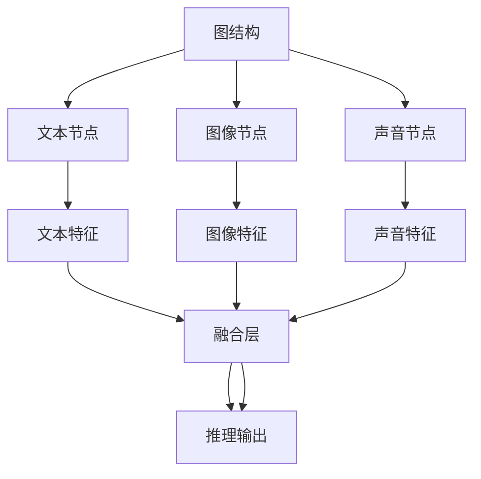
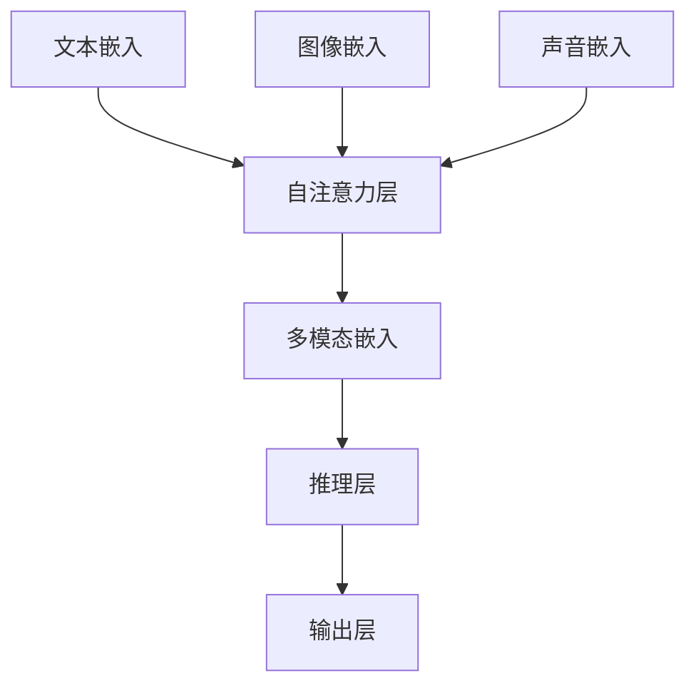
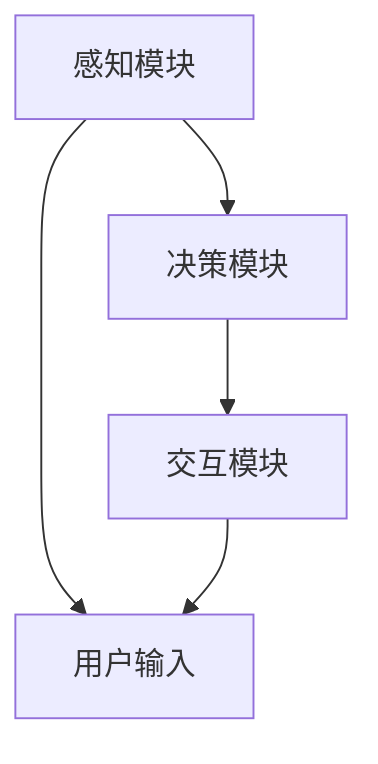

                 

# 开发具有跨模态推理能力的AI Agent

## 关键词

- 跨模态推理
- AI Agent
- 跨模态数据融合
- 跨模态表示学习
- 跨模态推理算法

## 摘要

本文将深入探讨开发具有跨模态推理能力的AI Agent的过程。首先，我们将介绍AI Agent与跨模态推理的基本概念，并分析其在实际应用中的重要性和面临的挑战。接着，我们将详细讨论跨模态推理的技术基础，包括跨模态数据融合、跨模态表示学习和跨模态推理算法。随后，我们将重点探讨如何设计和实现跨模态AI Agent，以及如何优化其性能和解决安全与伦理问题。最后，我们将展望跨模态推理技术的未来发展趋势和潜在应用前景。

## 引言与背景

### 1.1 AI技术的基本概念与发展历程

人工智能（AI）是一门研究、开发和应用使计算机模拟人类智能行为的科学。自20世纪50年代诞生以来，AI技术经历了多个发展阶段，从早期的符号主义、连接主义到现代的深度学习和强化学习。AI技术广泛应用于自然语言处理、计算机视觉、语音识别和智能决策等领域，逐渐改变了我们的生活方式和工作模式。

### 1.2 跨模态推理的概念与重要性

跨模态推理是指AI系统在不同模态（如文本、图像、声音、视频等）之间进行信息转换和推理的能力。随着多模态数据的爆炸式增长，跨模态推理在智能搜索、情感分析、智能交互和智能监控等领域具有广泛的应用前景。例如，一个跨模态AI Agent可以同时理解和处理图像和语音信息，从而提供更加自然和丰富的用户体验。

### 1.3 跨模态推理的应用场景

跨模态推理在多个领域具有重要的应用价值。以下是几个典型的应用场景：

1. **智能搜索与推荐系统**：跨模态推理可以融合文本和图像信息，为用户提供更准确和个性化的搜索结果和推荐内容。
2. **情感分析与智能交互**：跨模态推理可以同时分析文本和语音的情感信息，为智能助手和虚拟助手提供更自然的情感交互能力。
3. **智能监控与安全**：跨模态推理可以实时监测和识别异常行为，提高安防系统的准确性和响应速度。
4. **医疗诊断与健康管理**：跨模态推理可以融合医学图像、文本病历和患者语音信息，为医生提供更全面和准确的诊断依据。

### 1.4 跨模态推理的关键挑战与解决方案

尽管跨模态推理具有广泛的应用前景，但其在实际应用中仍面临一些关键挑战：

1. **数据融合**：如何有效融合不同模态的数据是一个重要问题。传统的特征融合方法难以充分利用各模态数据的特点，需要探索更加先进的融合技术。
2. **表示学习**：如何学习不同模态之间的有效表示是一个关键挑战。目前，基于深度学习的跨模态表示学习方法取得了一定的进展，但仍然需要进一步优化。
3. **推理算法**：如何设计有效的跨模态推理算法是一个关键问题。现有的跨模态推理算法大多基于单模态推理算法的扩展，需要针对多模态数据进行专门设计和优化。

针对这些挑战，研究者们提出了多种解决方案：

1. **多模态特征融合**：通过设计多模态特征提取和融合模型，如多模态神经网络（MMNN）和图神经网络（GNN），提高跨模态数据融合的效果。
2. **跨模态表示学习**：通过使用深度学习技术，如卷积神经网络（CNN）和Transformer模型，学习不同模态之间的有效表示。
3. **推理算法优化**：通过针对多模态数据的特点设计新的推理算法，如基于图神经网络的跨模态推理算法和基于因果关系的推理算法，提高跨模态推理的性能。

### 1.5 本章小结

本章介绍了AI Agent与跨模态推理的基本概念、应用场景和关键挑战。在后续章节中，我们将进一步探讨跨模态推理的技术基础和实现方法，以便为开发具有跨模态推理能力的AI Agent提供理论基础和实践指导。

----------------------------------------------------------------

## 跨模态推理技术基础

### 2.1 跨模态数据融合

跨模态数据融合是跨模态推理的基础。数据融合的目标是将不同模态的数据（如文本、图像、声音和视频）转换为统一表示，以便后续的推理和分析。以下是一些常见的跨模态数据融合方法：

1. **特征级融合**：将不同模态的特征（如文本的词向量、图像的CNN特征和声音的MFCC特征）直接拼接，形成新的多模态特征向量。这种方法简单有效，但容易丢失各模态的独特信息。
   
   $$ 
   \text{新特征向量} = [\text{文本特征}, \text{图像特征}, \text{声音特征}] 
   $$

2. **表示级融合**：通过学习共享的嵌入空间，将不同模态的数据映射到同一空间。这种方法能够更好地保留各模态的语义信息，但需要复杂的模型结构。

   $$ 
   \text{嵌入空间} = \phi(\text{文本数据}, \text{图像数据}, \text{声音数据}) 
   $$

3. **模型级融合**：将多个独立的模态模型融合为一个统一的模型，如多模态神经网络（MMNN）。这种方法能够充分利用各模态模型的优势，但需要协调不同模型之间的交互。

### 2.2 跨模态特征提取方法

跨模态特征提取是跨模态推理的关键步骤。以下是几种常用的跨模态特征提取方法：

1. **文本特征提取**：常用的方法包括词袋模型、TF-IDF和词嵌入（如Word2Vec、GloVe）。词嵌入能够更好地捕捉词与词之间的语义关系，是文本特征提取的主要方向。

   $$ 
   \text{词嵌入} = \text{Word2Vec}(\text{文本数据}) 
   $$

2. **图像特征提取**：常用的方法包括卷积神经网络（CNN）和基于图神经网络（GNN）的方法。CNN能够自动学习图像的层次特征，而GNN能够更好地捕捉图像中的局部结构和关系。

   $$ 
   \text{图像特征} = \text{CNN}(\text{图像数据}) 
   $$

3. **声音特征提取**：常用的方法包括梅尔频率倒谱系数（MFCC）和长时间短期记忆网络（LSTM）。MFCC能够有效捕捉声音的时频特征，而LSTM能够处理序列数据。

   $$ 
   \text{声音特征} = \text{LSTM}(\text{声音数据}) 
   $$

### 2.3 跨模态数据融合模型

跨模态数据融合模型是跨模态推理的核心。以下是几种常用的跨模态数据融合模型：

1. **多模态神经网络（MMNN）**：MMNN将不同模态的特征通过多层神经网络进行融合，能够充分利用各模态的特征信息。

   $$ 
   \text{输出} = \text{MMNN}([\text{文本特征}, \text{图像特征}, \text{声音特征}]) 
   $$

2. **图神经网络（GNN）**：GNN能够处理具有复杂关系的多模态数据，通过图结构来表示不同模态之间的关联。

   $$ 
   \text{输出} = \text{GNN}(\text{图结构}) 
   $$

3. **Transformer模型**：Transformer模型在自然语言处理领域取得了显著的成功，通过自注意力机制实现跨模态特征的有效融合。

   $$ 
   \text{输出} = \text{Transformer}([\text{文本特征}, \text{图像特征}, \text{声音特征}]) 
   $$

### 2.4 实例分析：文本与图像数据的融合

以下是一个文本与图像数据的融合实例，使用基于Transformer的多模态神经网络（MMNN）进行跨模态特征提取和融合：

```python
import tensorflow as tf
from tensorflow.keras.layers import Embedding, Conv2D, Flatten, Concatenate, Dense
from tensorflow.keras.models import Model

# 文本特征提取
text_embedding = Embedding(input_dim=vocab_size, output_dim=embedding_dim)(text_input)
text_embedding = Flatten()(text_embedding)

# 图像特征提取
image_embedding = Conv2D(filters=32, kernel_size=(3, 3), activation='relu')(image_input)
image_embedding = Flatten()(image_embedding)

# 多模态特征融合
multi_modal_embedding = Concatenate()([text_embedding, image_embedding])
multi_modal_embedding = Dense(units=128, activation='relu')(multi_modal_embedding)

# 推理输出
output = Dense(units=1, activation='sigmoid')(multi_modal_embedding)

# 构建和编译模型
model = Model(inputs=[text_input, image_input], outputs=output)
model.compile(optimizer='adam', loss='binary_crossentropy', metrics=['accuracy'])

# 模型训练
model.fit([text_data, image_data], labels, epochs=10, batch_size=32)
```

### 2.5 本章小结

本章详细介绍了跨模态数据融合、跨模态特征提取方法和跨模态数据融合模型。在下一章中，我们将探讨跨模态表示学习，进一步深化对跨模态推理技术基础的理解。

----------------------------------------------------------------

### 3.1 跨模态嵌入技术

跨模态嵌入技术是一种将不同模态的数据映射到同一嵌入空间的方法，使得跨模态数据可以在同一框架内进行计算和分析。这种技术能够有效捕捉不同模态之间的语义关系，是跨模态推理的重要基础。

#### 3.1.1 嵌入技术的基本原理

跨模态嵌入技术的基本原理是将文本、图像、声音等不同模态的数据映射到低维连续向量空间中。通过学习得到的映射函数，可以将不同模态的数据转换为具有相似语义的嵌入向量。这种嵌入向量不仅能够表示各模态的独有特征，还能够捕捉不同模态之间的共性和差异。

#### 3.1.2 常见的嵌入方法

1. **词嵌入**：词嵌入（Word Embedding）是将文本中的单词映射到低维向量空间的方法。常见的词嵌入方法包括Word2Vec、GloVe和BERT等。这些方法通过大量的语料库学习单词的语义表示，使得具有相似语义的单词在向量空间中相互接近。

   $$ 
   \text{word\_vector} = \text{Word2Vec}(\text{文本数据}) 
   $$

2. **图像嵌入**：图像嵌入（Image Embedding）是将图像数据映射到低维向量空间的方法。常用的图像嵌入方法包括CNN和图嵌入（Graph Embedding）。CNN可以自动学习图像的层次特征，而图嵌入可以处理图像中的局部结构和关系。

   $$ 
   \text{image\_embedding} = \text{CNN}(\text{图像数据}) 
   $$

3. **声音嵌入**：声音嵌入（Sound Embedding）是将声音数据映射到低维向量空间的方法。常用的声音嵌入方法包括MFCC和循环神经网络（RNN）。MFCC可以捕捉声音的时频特征，而RNN可以处理序列数据。

   $$ 
   \text{sound\_embedding} = \text{LSTM}(\text{声音数据}) 
   $$

#### 3.1.3 跨模态嵌入的优势

1. **减少数据差异**：通过跨模态嵌入，不同模态的数据被映射到同一嵌入空间中，从而减少了模态之间的差异，使得跨模态数据可以在同一框架内进行计算和分析。
   
2. **提高计算效率**：跨模态嵌入技术使得跨模态数据可以在较低的维度上进行处理，从而提高了计算效率。

3. **增强语义理解**：通过跨模态嵌入，不同模态的数据能够在同一嵌入空间中相互关联，从而增强了语义理解能力。

#### 3.1.4 跨模态嵌入的应用场景

1. **多模态信息检索**：跨模态嵌入技术可以用于多模态信息检索，如图像-文本检索、视频-文本检索等。通过跨模态嵌入，可以有效地将图像、文本和视频等不同模态的数据进行融合，提高检索的准确性和效率。

2. **多模态情感分析**：跨模态嵌入技术可以用于多模态情感分析，如文本-图像情感分析、文本-声音情感分析等。通过跨模态嵌入，可以更好地理解不同模态的情感信息，提高情感分析的准确性。

3. **多模态知识图谱**：跨模态嵌入技术可以用于构建多模态知识图谱，将文本、图像、声音等不同模态的数据进行关联，从而形成一个统一的语义表示。

### 3.2 跨模态Transformer模型

跨模态Transformer模型是一种基于Transformer架构的多模态嵌入方法。Transformer模型在自然语言处理领域取得了显著的成功，其核心思想是使用自注意力机制（Self-Attention）对序列数据进行建模。跨模态Transformer模型将这种自注意力机制扩展到多模态数据，从而实现对不同模态数据的高效融合和推理。

#### 3.2.1 Transformer模型的基本原理

Transformer模型的核心是自注意力机制（Self-Attention），它允许模型在序列数据中关注不同位置的信息，并通过权重分配来聚合这些信息。自注意力机制能够捕捉序列数据中的长距离依赖关系，从而提高模型的表示能力。

#### 3.2.2 跨模态Transformer模型的工作原理

跨模态Transformer模型将自注意力机制扩展到多模态数据。具体来说，跨模态Transformer模型将不同模态的数据映射到同一嵌入空间，并在自注意力机制中同时考虑这些模态的信息。这种跨模态嵌入方法能够有效融合不同模态的语义信息，提高模型的跨模态推理能力。

#### 3.2.3 跨模态Transformer模型的应用场景

1. **跨模态文本生成**：跨模态Transformer模型可以用于文本生成任务，如图像描述生成、视频脚本生成等。通过跨模态嵌入和自注意力机制，模型可以同时考虑图像和文本的信息，生成更加自然和连贯的文本描述。

2. **跨模态问答系统**：跨模态Transformer模型可以用于跨模态问答系统，如图像问答、视频问答等。通过跨模态嵌入和自注意力机制，模型可以同时理解图像和文本问题，提供准确的答案。

3. **跨模态情感分析**：跨模态Transformer模型可以用于跨模态情感分析，如文本-图像情感分析、文本-声音情感分析等。通过跨模态嵌入和自注意力机制，模型可以同时考虑不同模态的情感信息，提高情感分析的准确性。

### 3.3 跨模态自监督学习

跨模态自监督学习是一种无需人工标注数据的方法，通过利用未标记的多模态数据进行自我监督学习，从而学习到跨模态的嵌入表示。这种学习方法不仅能够提高跨模态推理的性能，还能够降低数据标注的成本。

#### 3.3.1 自监督学习的基本原理

自监督学习的基本原理是利用数据中的冗余和相关性来自我学习。在跨模态自监督学习中，模型通过预测未标记的多模态数据中的某个模态，从而学习到跨模态的嵌入表示。常见的自监督学习方法包括预测模态缺失、预测模态对应关系和预测模态变换等。

#### 3.3.2 跨模态自监督学习的方法

1. **预测模态缺失**：在训练过程中，模型需要预测缺失的模态数据，从而学习到跨模态的嵌入表示。这种方法可以通过生成对抗网络（GAN）等生成模型来实现。

   $$ 
   \text{预测} \ \text{缺失的模态数据} = \text{GAN}(\text{完整模态数据}) 
   $$

2. **预测模态对应关系**：在训练过程中，模型需要预测不同模态之间的对应关系，从而学习到跨模态的嵌入表示。这种方法可以通过构建多模态图和图神经网络（GNN）来实现。

   $$ 
   \text{预测} \ \text{模态对应关系} = \text{GNN}(\text{多模态图}) 
   $$

3. **预测模态变换**：在训练过程中，模型需要预测不同模态之间的变换关系，从而学习到跨模态的嵌入表示。这种方法可以通过多模态Transformer模型等端到端模型来实现。

   $$ 
   \text{预测} \ \text{模态变换} = \text{Transformer}(\text{多模态数据}) 
   $$

### 3.4 实例分析：语音与视频数据的表示学习

以下是一个语音与视频数据的表示学习实例，使用基于多模态Transformer的自监督学习方法进行跨模态嵌入表示学习：

```python
import tensorflow as tf
from tensorflow.keras.layers import Embedding, Conv2D, LSTM, Dense, Concatenate
from tensorflow.keras.models import Model

# 语音特征提取
speech_embedding = LSTM(units=128, return_sequences=True)(speech_input)

# 视频特征提取
video_embedding = Conv2D(filters=32, kernel_size=(3, 3), activation='relu')(video_input)
video_embedding = Flatten()(video_embedding)

# 多模态嵌入
multi_modal_embedding = Concatenate()([speech_embedding, video_embedding])

# 自监督学习输出
output = Dense(units=1, activation='sigmoid')(multi_modal_embedding)

# 构建和编译模型
model = Model(inputs=[speech_input, video_input], outputs=output)
model.compile(optimizer='adam', loss='binary_crossentropy', metrics=['accuracy'])

# 模型训练
model.fit([speech_data, video_data], labels, epochs=10, batch_size=32)
```

### 3.5 本章小结

本章详细介绍了跨模态嵌入技术、跨模态Transformer模型和跨模态自监督学习。在下一章中，我们将探讨跨模态推理算法，进一步深化对跨模态推理技术基础的理解。

----------------------------------------------------------------

### 4.1 跨模态推理的核心算法

跨模态推理算法是实现跨模态AI Agent的关键。这些算法旨在将不同模态的数据信息进行整合，以产生具有综合理解的推理结果。以下是几种核心的跨模态推理算法：

#### 4.1.1 多模态神经网络（MMNN）

多模态神经网络（MMNN）是一种将多个独立的模态模型通过某种方式融合为一个统一模型的算法。常见的MMNN结构包括串联结构、并行结构以及混合结构。以下是一个简单的MMNN结构的示例：

```python
import tensorflow as tf
from tensorflow.keras.layers import Embedding, Conv2D, LSTM, Dense, Concatenate, Flatten
from tensorflow.keras.models import Model

# 文本特征提取
text_embedding = Embedding(input_dim=vocab_size, output_dim=embedding_dim)(text_input)
text_embedding = Flatten()(text_embedding)

# 图像特征提取
image_embedding = Conv2D(filters=32, kernel_size=(3, 3), activation='relu')(image_input)
image_embedding = Flatten()(image_embedding)

# 声音特征提取
speech_embedding = LSTM(units=128, return_sequences=False)(speech_input)

# 多模态特征融合
multi_modal_embedding = Concatenate()([text_embedding, image_embedding, speech_embedding])
multi_modal_embedding = Dense(units=128, activation='relu')(multi_modal_embedding)

# 推理输出
output = Dense(units=1, activation='sigmoid')(multi_modal_embedding)

# 构建和编译模型
model = Model(inputs=[text_input, image_input, speech_input], outputs=output)
model.compile(optimizer='adam', loss='binary_crossentropy', metrics=['accuracy'])

# 模型训练
model.fit([text_data, image_data, speech_data], labels, epochs=10, batch_size=32)
```

#### 4.1.2 图神经网络（GNN）

图神经网络（GNN）是一种用于处理图结构数据的学习算法，通过捕捉节点和边之间的关系进行信息传播。在跨模态推理中，GNN可以用于表示和融合具有复杂关系的多模态数据。以下是一个基于GNN的跨模态推理算法的示例：



在这个示例中，GNN通过多层信息传播将文本、图像和声音节点之间的特征进行融合，最终生成推理输出。

#### 4.1.3 Transformer模型

Transformer模型是一种基于自注意力机制的深度神经网络架构，最初在自然语言处理领域取得了巨大的成功。近年来，Transformer模型也被广泛应用于跨模态推理任务中。以下是一个基于Transformer的跨模态推理算法的示例：



在这个示例中，文本、图像和声音嵌入向量分别通过自注意力机制进行交互，生成多模态嵌入向量，然后通过推理层和输出层生成最终的推理结果。

#### 4.1.4 跨模态Transformer模型的优缺点

**优点**：

1. **强大的表示能力**：Transformer模型的自注意力机制能够捕捉长距离依赖关系，使得模型具有强大的表示能力。
2. **并行处理**：Transformer模型可以并行处理序列数据，提高了训练效率。
3. **模块化**：Transformer模型具有良好的模块化特性，可以方便地集成其他模块，如编码器和解码器。

**缺点**：

1. **计算复杂度**：由于自注意力机制的计算复杂度较高，Transformer模型在处理大规模数据时可能会面临性能瓶颈。
2. **训练时间较长**：Transformer模型需要大量的训练时间，尤其是在跨模态推理任务中，由于数据多样性和复杂性，训练过程可能会更加耗时。

#### 4.1.5 跨模态推理算法的评估与优化

跨模态推理算法的评估与优化是确保模型性能的关键步骤。以下是一些常见的评估与优化方法：

1. **评估指标**：常见的评估指标包括准确率（Accuracy）、精确率（Precision）、召回率（Recall）和F1分数（F1 Score）等。根据不同的任务类型，可以选择适当的评估指标。

2. **数据增强**：通过增加训练数据的多样性，可以提高模型的泛化能力。常见的数据增强方法包括数据缩放、旋转、裁剪等。

3. **模型压缩**：为了提高模型的运行效率，可以采用模型压缩技术，如模型剪枝（Model Pruning）和量化（Quantization）。

4. **分布式训练**：通过分布式训练，可以将计算任务分布在多个计算节点上，加快训练速度。

5. **交叉验证**：使用交叉验证方法，可以评估模型的泛化能力，并选择最佳的超参数设置。

### 4.2 跨模态推理流程

跨模态推理流程通常包括以下几个关键步骤：

1. **数据预处理**：对文本、图像、声音等不同模态的数据进行预处理，包括数据清洗、归一化和特征提取等。
2. **数据融合**：将不同模态的数据通过特征提取和融合模型（如MMNN、GNN或Transformer）进行融合，生成统一的嵌入表示。
3. **推理计算**：使用融合后的嵌入表示进行推理计算，生成推理结果。
4. **结果验证**：对推理结果进行验证，评估模型的性能，并根据评估结果进行调整和优化。

#### 4.2.1 跨模态推理流程实例

以下是一个跨模态推理流程的实例，使用基于Transformer的多模态神经网络进行跨模态推理：

1. **数据预处理**：
   - 文本数据：进行分词、去停用词和词嵌入。
   - 图像数据：进行预处理，如尺寸归一化和归一化。
   - 声音数据：进行预处理，如谱图生成和特征提取。

2. **数据融合**：
   - 使用Transformer模型将文本、图像和声音数据融合为多模态嵌入向量。

3. **推理计算**：
   - 使用融合后的嵌入向量进行推理，生成最终的推理结果。

4. **结果验证**：
   - 对推理结果进行评估，如计算准确率、精确率和召回率等。

### 4.3 跨模态推理的应用案例

跨模态推理在多个领域具有广泛的应用。以下是一些典型的应用案例：

1. **多模态信息检索**：跨模态推理可以用于图像-文本检索，如使用文本查询检索相关图像，或者使用图像查询检索相关文本。
2. **多模态情感分析**：跨模态推理可以用于分析文本、图像和声音的情感信息，从而提供更准确的情感判断。
3. **智能交互**：跨模态推理可以用于智能助手和虚拟助手的交互，如同时理解用户的语音和手势信息。
4. **多模态医疗诊断**：跨模态推理可以用于多模态医疗数据的诊断，如结合医学图像、文本病历和患者语音信息进行综合诊断。

### 4.4 算法评估与优化

跨模态推理算法的评估与优化是一个不断迭代的过程。以下是一些评估与优化的方法：

1. **性能评估**：使用多种评估指标（如准确率、精确率、召回率和F1分数）对算法进行性能评估，以确定算法在不同任务上的表现。
2. **超参数调优**：通过调整模型超参数（如学习率、批量大小、隐藏层单元数等），找到最优的超参数配置。
3. **数据预处理**：对数据预处理方法进行调整，如增加数据增强、改进数据清洗策略等，以提高模型性能。
4. **模型压缩**：使用模型压缩技术，如模型剪枝和量化，减少模型的大小和计算复杂度，提高模型的运行效率。
5. **分布式训练**：采用分布式训练方法，将模型训练任务分布在多个计算节点上，以加快训练速度。

### 4.5 本章小结

本章介绍了跨模态推理的核心算法、跨模态推理流程和应用案例。在下一章中，我们将探讨如何设计和实现具有跨模态推理能力的AI Agent。

----------------------------------------------------------------

## 第5章 跨模态AI Agent的设计与实现

### 5.1 跨模态AI Agent的概念与架构

跨模态AI Agent是指具有跨模态推理能力的智能体，能够理解和处理多种模态的数据，以实现复杂任务。一个典型的跨模态AI Agent架构包括以下几个关键模块：

1. **感知模块**：用于接收和处理来自不同模态的数据，如文本、图像、声音等。
2. **决策模块**：基于感知模块的信息，进行推理和决策，以生成适当的响应。
3. **交互模块**：与用户或其他系统进行交互，以获取输入和反馈。

以下是一个简单的跨模态AI Agent架构图：



### 5.2 跨模态感知模块设计

跨模态感知模块是跨模态AI Agent的核心，负责接收和处理多种模态的数据。以下是一个跨模态感知模块的设计方案：

#### 5.2.1 文本感知

文本感知模块主要用于接收和处理文本数据。常见的文本感知方法包括：

- **词嵌入**：使用预训练的词嵌入模型，如Word2Vec、GloVe或BERT，将文本转换为向量表示。
- **文本分类**：使用分类器（如SVM、CNN或Transformer）对文本进行分类，以提取文本的特征。

示例代码：

```python
from tensorflow.keras.layers import Embedding, LSTM, Dense
from tensorflow.keras.models import Sequential

# 创建序列模型
model = Sequential()
model.add(Embedding(input_dim=vocab_size, output_dim=embedding_dim))
model.add(LSTM(units=128))
model.add(Dense(units=num_classes, activation='softmax'))

# 编译模型
model.compile(optimizer='adam', loss='categorical_crossentropy', metrics=['accuracy'])

# 训练模型
model.fit(text_data, labels, epochs=10, batch_size=32)
```

#### 5.2.2 图像感知

图像感知模块主要用于接收和处理图像数据。常见的图像感知方法包括：

- **卷积神经网络（CNN）**：使用CNN提取图像的特征。
- **特征提取**：使用预训练的CNN模型（如VGG、ResNet或Inception）提取图像的特征。

示例代码：

```python
from tensorflow.keras.applications import VGG16
from tensorflow.keras.layers import Flatten, Dense
from tensorflow.keras.models import Model

# 加载预训练的VGG16模型
base_model = VGG16(weights='imagenet')
x = base_model.output
x = Flatten()(x)
x = Dense(units=128, activation='relu')(x)

# 创建分类模型
model = Model(inputs=base_model.input, outputs=x)

# 训练模型
model.fit(image_data, labels, epochs=10, batch_size=32)
```

#### 5.2.3 声音感知

声音感知模块主要用于接收和处理声音数据。常见的声音感知方法包括：

- **梅尔频率倒谱系数（MFCC）**：使用MFCC提取声音的特征。
- **循环神经网络（RNN）**：使用RNN提取声音的序列特征。

示例代码：

```python
from tensorflow.keras.layers import LSTM, Dense
from tensorflow.keras.models import Sequential

# 创建序列模型
model = Sequential()
model.add(LSTM(units=128, return_sequences=True))
model.add(LSTM(units=64))
model.add(Dense(units=num_classes, activation='softmax'))

# 编译模型
model.compile(optimizer='adam', loss='categorical_crossentropy', metrics=['accuracy'])

# 训练模型
model.fit(speech_data, labels, epochs=10, batch_size=32)
```

### 5.3 跨模态决策模块设计

跨模态决策模块是基于感知模块的信息进行推理和决策的关键。以下是一个跨模态决策模块的设计方案：

#### 5.3.1 跨模态融合

跨模态融合是将不同模态的数据进行整合，以生成统一的表示。常见的方法包括：

- **特征级融合**：将不同模态的特征进行拼接或加权融合。
- **表示级融合**：将不同模态的数据映射到同一嵌入空间。
- **模型级融合**：将多个独立的模态模型融合为一个统一模型。

示例代码：

```python
from tensorflow.keras.layers import Concatenate, Dense
from tensorflow.keras.models import Model

# 跨模态特征级融合
model = Model(inputs=[text_input, image_input, speech_input], outputs=Concatenate()([text_embedding, image_embedding, speech_embedding]))

# 跨模态表示级融合
model = Model(inputs=[text_input, image_input, speech_input], outputs=Dense(units=128, activation='relu')(Concatenate()([text_embedding, image_embedding, speech_embedding])))

# 跨模态模型级融合
model = Model(inputs=[text_input, image_input, speech_input], outputs=Dense(units=num_classes, activation='softmax')(Concatenate()([text_embedding, image_embedding, speech_embedding]))
```

#### 5.3.2 推理算法

跨模态决策模块的推理算法是核心，决定了AI Agent的推理能力和表现。常见的方法包括：

- **基于规则的推理**：使用预设的规则进行推理，如专家系统。
- **基于模型的推理**：使用神经网络模型进行推理，如CNN、RNN或Transformer。

示例代码：

```python
from tensorflow.keras.models import Sequential
from tensorflow.keras.layers import Conv2D, LSTM, Dense

# 创建基于CNN和RNN的融合模型
model = Sequential()
model.add(Conv2D(filters=32, kernel_size=(3, 3), activation='relu', input_shape=(image_height, image_width, 3)))
model.add(LSTM(units=128, return_sequences=True))
model.add(LSTM(units=64))
model.add(Dense(units=num_classes, activation='softmax'))

# 编译模型
model.compile(optimizer='adam', loss='categorical_crossentropy', metrics=['accuracy'])

# 训练模型
model.fit([image_data, text_data, speech_data], labels, epochs=10, batch_size=32)
```

### 5.4 跨模态交互模块设计

跨模态交互模块是AI Agent与用户或其他系统进行交互的接口。以下是一个跨模态交互模块的设计方案：

#### 5.4.1 文本交互

文本交互是通过自然语言处理技术实现人机交互的一种方式。常见的方法包括：

- **文本生成**：使用预训练的语言模型（如GPT或BERT）生成文本响应。
- **对话管理**：使用对话管理算法（如规则基

