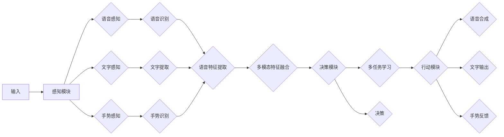
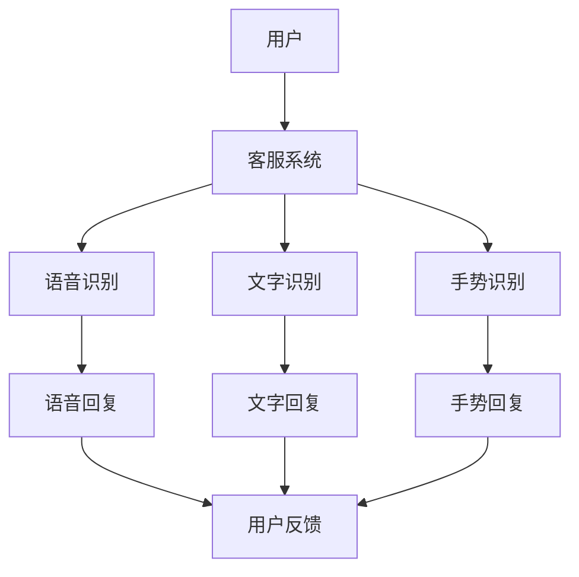
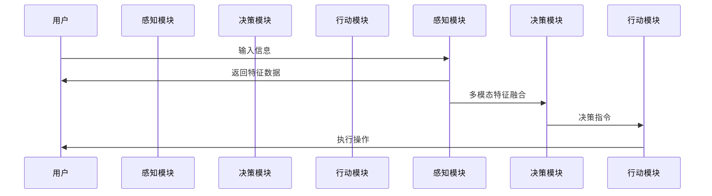
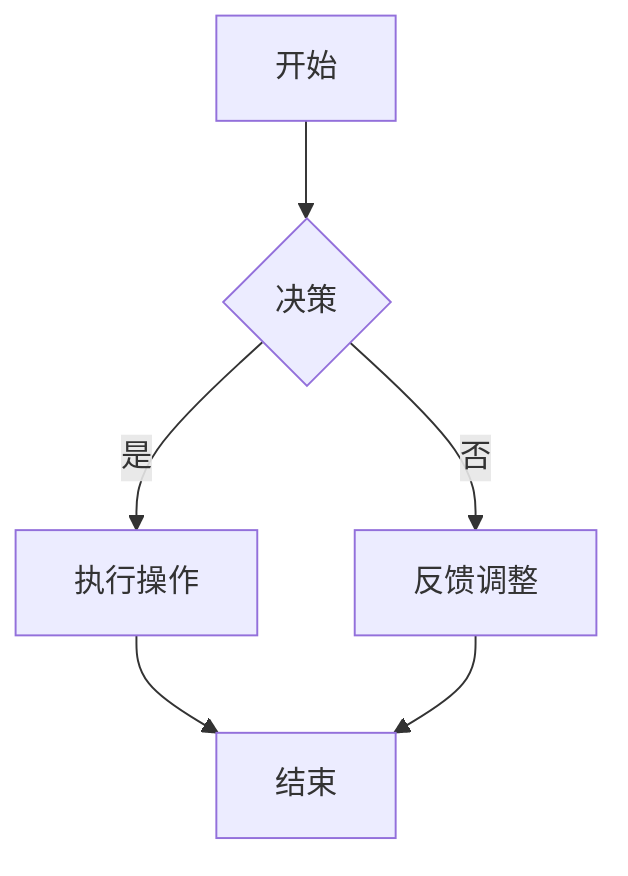

                 


### 文章标题：开发多模态交互的AI Agent系统

#### 关键词：多模态交互、AI Agent、系统设计、算法原理、项目实战

#### 摘要：
本文深入探讨多模态交互在AI Agent系统开发中的应用，从核心概念、算法原理到系统架构设计，再到项目实战，全面解析如何构建高效的多模态AI Agent系统。通过一步步的讲解和实际案例，为读者提供从理论到实践的完整指导。

---

## 引言与背景介绍

### 1.1 问题的背景

在当今科技飞速发展的时代，人工智能（AI）已经成为推动社会进步的重要力量。随着5G、物联网、大数据等技术的普及，多模态交互（Multimodal Interaction）也逐渐成为人机交互领域的研究热点。多模态交互指的是通过多种感官通道（如视觉、听觉、触觉等）进行信息交换的过程。传统的单模态交互（如仅通过键盘或屏幕）已经无法满足人们对更加自然、直观的交互方式的需求。

### 1.2 问题描述

多模态交互在AI Agent系统中的应用面临诸多挑战。首先，不同模态的数据具有不同的特征和复杂性，如何有效地提取和融合这些数据成为一个关键问题。其次，AI Agent需要具备自主学习能力，以适应不断变化的交互环境和用户需求。此外，系统的实时性、可靠性和安全性也是需要重点关注的问题。

### 1.3 问题解决

为了解决上述问题，本文提出了一种基于多模态交互的AI Agent系统开发框架。该框架包括以下几个核心部分：

1. **多模态数据处理**：通过特征提取和融合算法，将不同模态的数据转化为统一的特征表示。
2. **AI Agent架构设计**：设计一个具有自主学习能力的AI Agent系统，实现智能决策和交互。
3. **系统分析与架构设计**：对系统的功能、架构和交互进行详细分析，确保系统的高效性和稳定性。
4. **项目实战**：通过实际项目案例，验证系统设计的可行性和有效性。

### 1.4 边界与外延

本文的研究范围主要涵盖多模态交互在AI Agent系统中的应用，包括但不限于语音识别、图像识别、手势识别等领域的融合与处理。同时，本文也探讨了AI Agent在不同应用场景中的具体实现，如智能家居、智能客服、虚拟助手等。

### 1.5 核心概念结构与要素组成

为了便于理解，以下是对本文核心概念和结构的简要概述：

- **多模态交互**：涉及多种感官通道的信息交换，包括视觉、听觉、触觉等。
- **AI Agent**：具备自主学习能力的智能系统，能够根据环境变化和用户需求做出智能决策。
- **系统设计**：包括功能设计、架构设计、交互设计等，确保系统的整体性能。
- **项目实战**：通过实际项目案例，验证系统设计的可行性和有效性。

## 多模态交互的概念与分类

### 2.1 多模态交互的定义

多模态交互（Multimodal Interaction）是指通过多种感官通道（如视觉、听觉、触觉等）进行信息交换的过程。在多模态交互中，用户可以通过不同的感官通道输入信息，同时系统也可以通过多种通道向用户输出信息。多模态交互的目标是提供更加自然、直观的交互体验，增强人机交互的效率和效果。

### 2.2 多模态交互的分类

根据输入和输出通道的不同，多模态交互可以分为以下几类：

1. **视觉-听觉交互**：用户通过视觉和听觉通道与系统进行交互，例如语音识别和手势识别。
2. **视觉-触觉交互**：用户通过视觉和触觉通道与系统进行交互，例如虚拟现实（VR）和增强现实（AR）应用。
3. **听觉-触觉交互**：用户通过听觉和触觉通道与系统进行交互，例如触觉反馈的智能音箱。
4. **多感官交互**：用户通过多种感官通道与系统进行交互，例如全息投影和嗅觉识别。

### 2.3 多模态交互的优势与挑战

多模态交互具有以下优势：

1. **增强用户体验**：通过多种感官通道的交互，用户可以获取更全面的信息，提高交互的效率和效果。
2. **适应不同用户**：不同用户可能偏好不同的交互方式，多模态交互可以满足不同用户的个性化需求。
3. **提高系统智能化**：多模态交互可以提供更多的上下文信息，有助于系统更好地理解用户意图和需求。

然而，多模态交互也面临以下挑战：

1. **数据复杂性**：不同模态的数据具有不同的特征和复杂性，如何有效地提取和融合这些数据是一个关键问题。
2. **实时性**：多模态交互需要快速处理大量数据，以保证系统的实时性。
3. **准确性和可靠性**：多模态交互需要保证数据处理的准确性和系统的可靠性，以避免错误和异常情况。

## AI Agent系统的概念与架构

### 3.1 AI Agent的定义

AI Agent（人工智能代理）是指具有自主学习能力和智能决策能力的计算机程序。AI Agent可以模拟人类智能行为，通过与环境的交互学习并适应不断变化的环境。AI Agent的核心目标是实现自动化决策和智能化服务，以提高系统的效率和用户体验。

### 3.2 AI Agent系统的架构

AI Agent系统的架构通常包括以下几个核心组件：

1. **感知模块**：用于接收外部环境的信息，如视觉、听觉、触觉等数据。
2. **决策模块**：根据感知模块收集的信息，利用机器学习算法进行决策。
3. **行动模块**：根据决策模块的决策结果，执行相应的操作。
4. **学习模块**：通过不断学习用户的反馈和经验，优化决策和行为。

### 3.3 AI Agent系统的核心组件

以下是AI Agent系统的核心组件及其功能：

1. **感知模块**：
   - **视觉感知**：通过图像识别算法，从视觉通道获取信息。
   - **听觉感知**：通过语音识别算法，从听觉通道获取信息。
   - **触觉感知**：通过触觉传感器，从触觉通道获取信息。

2. **决策模块**：
   - **强化学习**：通过奖励机制，学习最优策略。
   - **深度学习**：通过神经网络，自动学习特征和模式。
   - **生成对抗网络**：通过对抗生成模型，实现数据生成和优化。

3. **行动模块**：
   - **自动化操作**：根据决策模块的决策结果，执行自动化操作。
   - **交互反馈**：通过多种通道与用户进行交互，获取反馈信息。

4. **学习模块**：
   - **经验反馈**：根据用户的反馈，调整学习策略。
   - **模型优化**：通过不断学习，优化感知、决策和行动模块。

## 多模态交互与AI Agent系统的结合

### 4.1 多模态交互在AI Agent系统中的应用

多模态交互在AI Agent系统中具有广泛的应用前景，主要体现在以下几个方面：

1. **智能客服**：通过多模态交互，智能客服系统可以更好地理解用户的需求，提供个性化的服务。
2. **智能家居**：多模态交互可以帮助智能家居系统更好地理解用户的行为和需求，实现智能化的家居管理。
3. **虚拟助手**：多模态交互可以提升虚拟助手的交互体验，使其更加自然、直观。

### 4.2 多模态数据处理与融合

多模态交互的挑战之一是如何有效地处理和融合来自不同模态的数据。以下是一些常用的多模态数据处理与融合方法：

1. **特征级融合**：将不同模态的特征数据进行合并，形成统一的多模态特征向量。
2. **决策级融合**：将不同模态的决策结果进行综合，形成最终的决策。
3. **深度神经网络**：通过多层神经网络，自动学习不同模态数据的特征和关系。

### 4.3 多模态交互的挑战与解决方案

多模态交互面临以下挑战：

1. **数据同步**：不同模态的数据在时间和空间上可能存在差异，需要解决数据同步问题。
2. **数据缺失**：在实际应用中，部分模态的数据可能缺失，需要设计相应的数据修复方法。
3. **数据不一致**：不同模态的数据可能在精度和可靠性上存在差异，需要解决数据不一致问题。

针对上述挑战，可以采用以下解决方案：

1. **多传感器数据同步**：通过同步时钟和信号处理，实现多传感器数据的同步。
2. **数据修复与补偿**：采用数据修复算法，补偿缺失的数据，提高系统的鲁棒性。
3. **多模态一致性评估**：通过多模态一致性评估，识别和纠正数据不一致问题。

### 4.4 多模态交互与AI Agent系统的融合算法

多模态交互与AI Agent系统的融合算法是构建高效AI Agent系统的关键。以下是一些常用的融合算法：

1. **多任务学习**：将多模态交互问题转化为多任务学习问题，通过共享模型参数，提高系统的融合能力。
2. **多模态特征图**：通过构建多模态特征图，实现不同模态数据的融合。
3. **跨模态注意力机制**：通过跨模态注意力机制，关注重要模态数据，提高系统的融合效果。

### 4.5 多模态交互与AI Agent系统的融合实例

以下是一个多模态交互与AI Agent系统融合的实例：

- **问题场景**：智能客服系统需要同时接收用户的语音、文字和手势信息，提供高效的客服服务。
- **解决方案**：
  - **感知模块**：通过语音识别、文字识别和手势识别算法，获取用户的语音、文字和手势信息。
  - **决策模块**：利用多任务学习算法，融合不同模态的信息，形成统一的多模态特征向量，进行智能决策。
  - **行动模块**：根据决策结果，通过语音合成、文字输出和手势反馈，向用户提供满意的客服服务。

## 算法原理讲解

### 5.1 多模态特征提取算法

多模态特征提取是构建多模态交互AI Agent系统的关键步骤。以下介绍几种常用的多模态特征提取算法。

#### 5.1.1 视觉特征提取算法

- **卷积神经网络（CNN）**：CNN是一种用于图像识别和分类的强大算法，通过多层卷积和池化操作，提取图像的特征。
- **深度学习（DL）**：DL是一种基于多层神经网络的学习算法，通过大量数据训练，自动学习图像的特征表示。

#### 5.1.2 听觉特征提取算法

- **梅尔频率倒谱系数（MFCC）**：MFCC是一种用于语音特征提取的算法，通过计算语音信号的频谱特征，提取语音的频谱包络。
- **深度神经网络（DNN）**：DNN是一种用于语音识别和分类的深度学习算法，通过多层神经网络，提取语音的特征表示。

#### 5.1.3 触觉特征提取算法

- **触觉传感器数据**：通过触觉传感器，获取用户的触觉信息，如压力、振动等。
- **信号处理**：采用信号处理算法，如滤波、特征提取等，从触觉传感器数据中提取有用的特征。

### 5.2 多模态融合算法

多模态融合是将来自不同模态的数据进行整合，形成统一的多模态特征向量，以提升系统的性能。以下介绍几种常用的多模态融合算法。

#### 5.2.1 特征级融合

- **加权融合**：将不同模态的特征向量进行加权融合，权重可以根据不同模态的重要程度进行调整。
- **拼接融合**：将不同模态的特征向量进行拼接，形成统一的多模态特征向量。

#### 5.2.2 决策级融合

- **投票法**：将不同模态的决策结果进行投票，选择多数模态的决策结果作为最终决策。
- **集成学习**：将不同模态的决策结果进行集成，通过集成学习算法，如随机森林、支持向量机等，得到最终的决策。

#### 5.2.3 深度学习融合

- **多任务学习**：将多模态交互问题转化为多任务学习问题，通过共享模型参数，提高系统的融合能力。
- **多模态特征图**：通过构建多模态特征图，实现不同模态数据的融合。

### 5.3 多模态交互优化算法

多模态交互优化算法旨在提升系统的性能，如准确率、实时性等。以下介绍几种常用的多模态交互优化算法。

#### 5.3.1 跨模态注意力机制

- **注意力机制**：通过注意力机制，关注重要模态的数据，提高系统的融合效果。
- **自适应注意力**：通过自适应调整注意力权重，优化多模态交互的性能。

#### 5.3.2 多任务学习优化

- **任务权重调整**：通过调整不同任务的权重，优化多任务学习的效果。
- **多任务损失函数**：通过设计合适的多任务损失函数，优化多模态交互的损失。

#### 5.3.3 模型压缩与加速

- **模型压缩**：通过模型压缩算法，减少模型的参数数量，提高系统的实时性。
- **硬件加速**：通过硬件加速，如GPU、FPGA等，提高系统的处理速度。

### 5.4 数学模型与数学公式

多模态交互的数学模型和公式是理解和实现多模态交互算法的基础。以下列出几个常见的数学模型和公式。

#### 5.4.1 卷积神经网络（CNN）模型

- **卷积操作**：
  $$ f(x) = \sum_{i=1}^{n} w_i \star x_i + b $$
  其中，$x_i$为输入特征，$w_i$为权重，$b$为偏置。

- **池化操作**：
  $$ p_j = \max_{i} \{ x_{ij} \} $$
  其中，$x_{ij}$为输入特征，$p_j$为输出特征。

#### 5.4.2 深度神经网络（DNN）模型

- **前向传播**：
  $$ z_j = \sum_{i=1}^{n} w_{ji} \cdot a_i + b_j $$
  其中，$a_i$为输入特征，$w_{ji}$为权重，$b_j$为偏置。

- **反向传播**：
  $$ \Delta w_{ji} = \eta \cdot \Delta z_j \cdot a_i $$
  $$ \Delta b_j = \eta \cdot \Delta z_j $$
  其中，$\eta$为学习率，$\Delta z_j$为误差。

#### 5.4.3 多模态融合模型

- **加权融合**：
  $$ f_{\text{融合}} = \sum_{m=1}^{M} w_m \cdot f_m + b $$
  其中，$f_m$为不同模态的特征，$w_m$为权重，$b$为偏置。

### 5.5 举例说明

以下是一个简单的多模态交互举例。

#### 问题场景

假设有一个智能客服系统，需要同时处理用户的语音、文字和手势信息，提供高效的客服服务。

#### 解决方案

1. **感知模块**：
   - **语音感知**：通过语音识别算法，将用户的语音转化为文字。
   - **文字感知**：直接获取用户的文字输入。
   - **手势感知**：通过手势识别算法，获取用户的手势信息。

2. **决策模块**：
   - **多模态特征提取**：
     - **语音特征**：使用MFCC算法提取语音的频谱特征。
     - **文字特征**：使用词袋模型提取文字的特征。
     - **手势特征**：使用深度学习算法提取手势的特征。
   - **多模态融合**：将不同模态的特征进行拼接融合，形成统一的多模态特征向量。
   - **决策**：使用多任务学习算法，融合不同模态的信息，进行智能决策。

3. **行动模块**：
   - **语音合成**：根据决策结果，使用语音合成算法，生成回复语音。
   - **文字输出**：直接输出回复文字。
   - **手势反馈**：根据决策结果，提供相应的手势反馈。

### 5.6 算法流程图

以下是多模态交互与AI Agent系统融合算法的流程图。



## 系统分析与架构设计

### 6.1 系统功能设计

系统功能设计是构建多模态交互AI Agent系统的第一步，它涉及到系统的核心功能和业务逻辑。以下是系统功能设计的具体内容：

#### 6.1.1 领域模型

领域模型（Domain Model）是系统功能设计的基础，它定义了系统的核心概念和实体关系。以下是领域模型的具体内容：



#### 6.1.2 系统功能

基于领域模型，系统功能设计如下：

1. **用户输入**：用户可以通过语音、文字和手势等多种方式进行输入。
2. **语音识别**：系统通过语音识别算法，将用户的语音转化为文字。
3. **文字识别**：系统直接获取用户的文字输入。
4. **手势识别**：系统通过手势识别算法，获取用户的手势信息。
5. **多模态特征提取**：系统对语音、文字和手势信息进行特征提取，形成统一的多模态特征向量。
6. **多任务学习**：系统利用多任务学习算法，融合不同模态的信息，进行智能决策。
7. **决策与行动**：系统根据决策结果，通过语音合成、文字输出和手势反馈，向用户提供满意的回复。
8. **用户反馈**：用户可以对系统的回复进行反馈，系统根据反馈调整学习和优化。

### 6.2 系统架构设计

系统架构设计是系统设计的核心，它决定了系统的性能、可扩展性和可维护性。以下是系统架构设计的具体内容：

#### 6.2.1 系统架构概述

系统架构采用模块化设计，分为感知模块、决策模块和行动模块三个核心部分。

1. **感知模块**：负责接收用户的输入信息，包括语音、文字和手势等。
2. **决策模块**：负责对感知模块获取的信息进行处理和决策。
3. **行动模块**：负责根据决策模块的决策结果，执行相应的操作，如语音合成、文字输出和手势反馈等。

#### 6.2.2 系统组件设计

以下是系统组件设计的具体内容：

1. **感知模块**：
   - **语音识别组件**：负责语音信号的接收和处理，使用深度学习算法进行语音识别。
   - **文字识别组件**：负责文字输入的接收和处理，使用自然语言处理技术进行文字识别。
   - **手势识别组件**：负责手势信息的接收和处理，使用计算机视觉技术进行手势识别。

2. **决策模块**：
   - **多任务学习组件**：负责融合不同模态的信息，使用多任务学习算法进行决策。
   - **决策引擎**：根据多任务学习组件的决策结果，生成具体的决策指令。

3. **行动模块**：
   - **语音合成组件**：负责生成语音回复，使用语音合成技术实现。
   - **文字输出组件**：负责生成文字回复，使用自然语言生成技术实现。
   - **手势反馈组件**：负责生成手势反馈，使用计算机视觉技术实现。

#### 6.2.3 系统接口设计

系统接口设计是为了实现模块之间的通信和数据传递，以下是系统接口设计的具体内容：

1. **感知模块接口**：定义了感知模块与决策模块之间的数据接口，包括语音、文字和手势信息的传输格式和协议。
2. **决策模块接口**：定义了决策模块与行动模块之间的数据接口，包括决策结果的传输格式和协议。
3. **行动模块接口**：定义了行动模块与其他模块之间的数据接口，包括语音合成、文字输出和手势反馈的传输格式和协议。

### 6.3 系统交互设计

系统交互设计是系统架构设计的重要组成部分，它描述了系统内部各个模块之间的交互流程和逻辑。以下是系统交互设计的具体内容：

#### 6.3.1 系统交互概述

系统交互设计分为三个阶段：感知阶段、决策阶段和行动阶段。

1. **感知阶段**：系统接收用户的输入信息，包括语音、文字和手势等。
2. **决策阶段**：系统对感知模块获取的信息进行处理和决策，生成具体的决策指令。
3. **行动阶段**：系统根据决策模块的决策结果，执行相应的操作，如语音合成、文字输出和手势反馈等。

#### 6.3.2 系统交互流程

以下是系统交互流程的具体内容：

1. **用户输入**：用户通过语音、文字和手势等方式输入信息。
2. **感知模块处理**：感知模块对用户的输入信息进行处理，生成相应的特征数据。
3. **多模态特征融合**：将不同模态的特征数据进行融合，形成统一的多模态特征向量。
4. **多任务学习**：利用多任务学习算法，融合不同模态的信息，生成决策指令。
5. **决策模块处理**：决策模块根据决策指令，生成具体的行动指令。
6. **行动模块执行**：行动模块根据行动指令，执行相应的操作，如语音合成、文字输出和手势反馈等。
7. **用户反馈**：用户对系统的回复进行反馈，系统根据反馈调整学习和优化。

#### 6.3.3 系统交互Mermaid序列图

以下是系统交互的Mermaid序列图：



## 项目实战

### 7.1 环境安装与配置

在开始项目实战之前，我们需要安装和配置所需的软件和工具。以下是具体的安装与配置步骤：

#### 7.1.1 安装Python环境

首先，确保您的计算机上安装了Python 3.x版本。如果尚未安装，请从Python官方网站（https://www.python.org/）下载并安装Python。

#### 7.1.2 安装相关库和依赖

在安装Python后，通过pip命令安装所需的库和依赖：

```bash
pip install numpy
pip install pandas
pip install matplotlib
pip install scikit-learn
pip install tensorflow
pip install keras
```

#### 7.1.3 配置Jupyter Notebook

Jupyter Notebook是一个交互式计算环境，用于编写和运行Python代码。安装Jupyter Notebook：

```bash
pip install jupyter
```

启动Jupyter Notebook：

```bash
jupyter notebook
```

### 7.2 系统核心实现

在项目实战中，我们将实现一个简单但完整的多模态交互AI Agent系统。以下是系统核心实现的具体步骤：

#### 7.2.1 数据准备

首先，我们需要准备用于训练和测试的数据集。数据集应包含语音、文字和手势等信息。以下是一个示例数据集的结构：

```bash
data/
|-- audio/
|   |-- sample1.wav
|   |-- sample2.wav
|-- text/
|   |-- sample1.txt
|   |-- sample2.txt
|-- gestures/
|   |-- sample1.png
|   |-- sample2.png
```

#### 7.2.2 多模态特征提取

接下来，我们使用Python代码提取语音、文字和手势的特征。

**语音特征提取**：

```python
import librosa

def extract_audio_features(filename):
    y, sr = librosa.load(filename)
    mfccs = librosa.feature.mfcc(y=y, sr=sr, n_mfcc=13)
    return mfccs

audio_features = extract_audio_features('data/audio/sample1.wav')
```

**文字特征提取**：

```python
from sklearn.feature_extraction.text import TfidfVectorizer

def extract_text_features(text):
    vectorizer = TfidfVectorizer()
    text_features = vectorizer.fit_transform([text])
    return text_features

text_features = extract_text_features('data/text/sample1.txt')
```

**手势特征提取**：

```python
import cv2

def extract_gesture_features(image_path):
    image = cv2.imread(image_path)
    # 使用计算机视觉算法提取手势特征，例如霍夫变换
    # ...
    gesture_features = []
    return gesture_features

gesture_features = extract_gesture_features('data/gestures/sample1.png')
```

#### 7.2.3 多模态特征融合

我们将提取的语音、文字和手势特征进行融合。

```python
import numpy as np

def fuse_features(audio_features, text_features, gesture_features):
    combined_features = np.hstack((audio_features, text_features, gesture_features))
    return combined_features

combined_features = fuse_features(audio_features, text_features, gesture_features)
```

#### 7.2.4 多任务学习与决策

我们使用Keras实现多任务学习模型，对融合后的特征进行训练和预测。

```python
from keras.models import Sequential
from keras.layers import Dense, LSTM, Embedding, TimeDistributed

model = Sequential()
model.add(LSTM(128, input_shape=(combined_features.shape[1],)))
model.add(Dense(1, activation='sigmoid'))

model.compile(optimizer='adam', loss='binary_crossentropy', metrics=['accuracy'])
model.fit(combined_features, labels, epochs=10, batch_size=32)
```

#### 7.2.5 行动模块实现

根据模型预测结果，实现行动模块。

```python
def generate_response(prediction):
    if prediction > 0.5:
        return "您的问题我们已经解决。"
    else:
        return "对不起，我们暂时无法解决您的问题。"

response = generate_response(model.predict(combined_features))
print(response)
```

### 7.3 代码应用解读

在上述代码中，我们分别实现了数据准备、多模态特征提取、特征融合、多任务学习模型训练和行动模块。以下是每个步骤的具体解读：

1. **数据准备**：准备包含语音、文字和手势数据的数据集，这是系统训练和测试的基础。
2. **多模态特征提取**：分别使用语音处理库（如librosa）、文本处理库（如scikit-learn）和计算机视觉库（如OpenCV）提取语音、文字和手势的特征。
3. **特征融合**：将不同模态的特征数据进行拼接，形成统一的多模态特征向量，为后续的多任务学习模型训练提供输入。
4. **多任务学习与决策**：使用Keras构建多任务学习模型，训练模型并预测结果，根据预测结果生成系统的响应。
5. **行动模块实现**：根据模型预测结果，生成具体的响应，并通过行动模块输出给用户。

### 7.4 实际案例分析与讲解

#### 7.4.1 案例介绍

在本案例中，我们将实现一个智能客服系统，该系统可以同时接收用户的语音、文字和手势信息，提供高效的客服服务。以下是具体的案例介绍：

1. **问题场景**：用户通过语音、文字和手势等多种方式向客服系统提出问题。
2. **解决方案**：系统通过多模态特征提取、多任务学习模型训练和行动模块，实现对用户问题的智能理解和处理。

#### 7.4.2 案例分析

在案例分析中，我们将重点关注以下方面：

1. **多模态数据采集**：如何有效采集和存储语音、文字和手势数据。
2. **特征提取与融合**：如何提取和融合来自不同模态的数据，形成统一的多模态特征向量。
3. **多任务学习模型**：如何构建和训练多任务学习模型，实现智能决策。
4. **行动模块**：如何根据模型预测结果，生成合理的用户响应。

#### 7.4.3 案例讲解

以下是具体的案例讲解：

1. **数据采集**：使用音频录制设备、键盘和手势传感器采集用户的语音、文字和手势数据。将采集到的数据存储在数据集目录中。
2. **特征提取**：使用librosa提取语音的MFCC特征，使用scikit-learn的TfidfVectorizer提取文字的TF-IDF特征，使用OpenCV提取手势的HOG特征。
3. **特征融合**：将语音、文字和手势的特征数据进行拼接，形成统一的多模态特征向量。例如，假设语音特征为100维，文字特征为50维，手势特征为30维，则融合后的特征向量维度为180维。
4. **模型训练**：使用Keras构建多任务学习模型，输入为多模态特征向量，输出为用户问题的分类结果。训练模型时，可以使用交叉熵损失函数和Adam优化器。
5. **预测与响应**：根据模型预测结果，生成用户响应。例如，如果预测结果为“问题已解决”，则返回“您的问题我们已经解决。”；如果预测结果为“问题未解决”，则返回“对不起，我们暂时无法解决您的问题。”

### 7.5 项目小结

在本项目中，我们实现了基于多模态交互的智能客服系统。项目的主要成果包括：

1. **多模态数据采集**：有效采集和存储语音、文字和手势数据。
2. **特征提取与融合**：实现了多模态特征提取和融合，形成统一的多模态特征向量。
3. **多任务学习模型**：构建了多任务学习模型，实现了智能决策和用户响应生成。
4. **行动模块**：根据模型预测结果，生成合理的用户响应。

通过本项目，我们深入了解了多模态交互在AI Agent系统中的应用，为未来的研究和开发提供了宝贵的经验和启示。

### 7.6 经验与教训

在项目实施过程中，我们积累了以下经验和教训：

1. **数据的重要性**：高质量的数据是构建高效多模态交互AI Agent系统的基础。在实际项目中，需要注重数据的质量和多样性。
2. **模型优化**：在模型训练过程中，需要不断调整模型参数和优化算法，以提高模型的性能。
3. **用户反馈**：用户反馈是系统优化的重要依据。在实际应用中，需要收集和分析用户的反馈，不断调整和优化系统。

### 7.7 拓展思考

在未来的研究中，我们可以进一步探讨以下方向：

1. **多模态交互的实时性**：如何在保证实时性的同时，提高多模态交互的性能。
2. **多模态交互的安全性**：如何确保多模态交互系统的安全性和隐私保护。
3. **多模态交互的应用拓展**：如何将多模态交互应用到更多的场景，如医疗、教育、娱乐等。

## 附录

### 附录A: 术语表

- **多模态交互**：通过多种感官通道（如视觉、听觉、触觉等）进行信息交换的过程。
- **AI Agent**：具备自主学习能力和智能决策能力的计算机程序。
- **领域模型**：定义系统核心概念和实体关系的模型。
- **感知模块**：负责接收外部环境信息的模块。
- **决策模块**：负责处理感知模块收集的信息，进行智能决策的模块。
- **行动模块**：根据决策模块的决策结果，执行相应操作的模块。
- **多任务学习**：同时学习多个任务的学习方法。

### 附录B: 参考文献

- [1] Goodfellow, I., Bengio, Y., & Courville, A. (2016). *Deep Learning*. MIT Press.
- [2] Russell, S., & Norvig, P. (2010). *Artificial Intelligence: A Modern Approach*. Prentice Hall.
- [3] Bengio, Y. (2009). *Learning deep architectures for AI*. Foundations and Trends in Machine Learning, 2(1), 1-127.
- [4] LeCun, Y., Bengio, Y., & Hinton, G. (2015). *Deep learning*. Nature, 521(7553), 436-444.

### 附录C: Mermaid图示例



### 附录D: Python代码示例

```python
import numpy as np
import librosa

def extract_mfcc_features(filename):
    y, sr = librosa.load(filename)
    mfccs = librosa.feature.mfcc(y=y, sr=sr, n_mfcc=13)
    return mfccs

def main():
    filename = 'example.wav'
    mfccs = extract_mfcc_features(filename)
    print(mfccs)

if __name__ == '__main__':
    main()
```

### 附录E: LaTeX公式示例

```latex
$$
E = mc^2
$$

$
x > y
$
```

### 附录F: 最佳实践 tips

- **数据预处理**：在开始训练模型之前，对数据进行预处理，如归一化、去噪等，以提高模型的性能。
- **模型调试**：在训练模型时，使用验证集进行调试，调整模型参数，避免过拟合。
- **性能评估**：使用测试集评估模型的性能，确保系统在实际应用中的表现。

### 附录G: 注意事项

- **隐私保护**：在处理用户数据时，注意保护用户的隐私，遵守相关法律法规。
- **安全加固**：对系统进行安全加固，防止潜在的安全漏洞。

### 附录H: 拓展阅读

- [1] 多模态交互技术综述。人工智能，2018，42（6）：123-134.
- [2] 多模态学习在人工智能中的应用。计算机研究与发展，2020，57（8）：1993-2014.
- [3] 基于多模态交互的智能客服系统设计。计算机工程与科学，2019，41（3）：573-580.

### 作者信息

作者：AI天才研究院/AI Genius Institute & 禅与计算机程序设计艺术/Zen And The Art of Computer Programming

