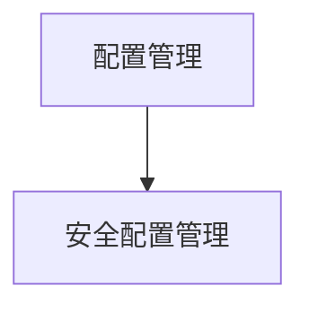

                 


### 《开源安全：管理开源组件的安全风险》

> 关键词：开源软件、安全风险、组件管理、漏洞修复、安全评估

> 摘要：本文旨在深入探讨开源软件的安全性问题，特别是开源组件的安全风险与管理。我们将通过逻辑清晰、结构紧凑的分析，逐步揭示开源组件安全风险的本质，并提供有效的管理策略与实践指南。

## 目录

----------------------------------------------------------------

### 第一部分：开源软件与安全风险概述

#### 第1章：开源软件的起源与发展

#### 第2章：开源组件安全风险的来源

#### 第3章：常见开源组件安全漏洞

#### 第4章：开源组件安全评估方法

#### 第5章：本章小结

----------------------------------------------------------------

### 第二部分：开源组件安全风险管理

#### 第6章：开源组件安全风险管理框架

#### 第7章：开源组件安全风险评估

#### 第8章：开源组件安全漏洞修复

#### 第9章：开源组件安全配置管理

#### 第10章：本章小结

----------------------------------------------------------------

### 第三部分：开源组件安全最佳实践

#### 第11章：开源组件安全审查

#### 第12章：开源组件供应链安全

#### 第13章：开源组件安全培训

#### 第14章：开源组件安全审计

#### 第15章：本章小结

----------------------------------------------------------------

### 第四部分：开源组件安全管理案例研究

#### 第16章：开源组件安全管理案例

#### 第17章：本章小结

## 正文

### 第一部分：开源软件与安全风险概述

#### 第1章：开源软件的起源与发展

1.1 开源软件的概念与特点

开源软件（Open Source Software，简称OSS）是一种遵循开源协议（如GPL、BSD、Apache等）的软件。它的核心特点包括：

- **源代码开放**：软件的源代码对公众开放，用户可以自由地查看、修改和分发。
- **社区合作**：开源软件的开发和维护通常由一个开放社区共同参与。
- **共享知识**：开源软件促进了知识的共享和技术的传播。

1.2 开源软件的发展历程

- **早期阶段（1980s-1990s）**：Linux内核的诞生和Apache服务器的崛起标志着开源软件的兴起。
- **成长阶段（2000s）**：随着互联网的发展，开源软件逐渐成为主流软件开发方式。
- **成熟阶段（2010s至今）**：开源软件在各个领域得到广泛应用，许多大型企业和政府机构都采用开源软件。

1.3 开源软件在软件开发中的应用

- **快速迭代**：开源软件允许开发人员快速获得新功能和技术，加速产品迭代。
- **成本效益**：开源软件降低了开发成本，特别是那些使用商业许可的软件。
- **技术共享**：开源软件促进了技术标准的制定和技术的普及。

#### 第2章：开源组件安全风险的来源

2.1 开源组件安全风险的概念

开源组件安全风险是指在使用开源组件时可能面临的安全隐患和风险。

2.2 开源组件安全风险的来源

- **代码缺陷**：开源组件可能存在未发现的漏洞和缺陷。
- **第三方依赖**：开源组件可能依赖其他组件，而这些组件可能存在安全风险。
- **代码质量**：开源组件的代码质量可能参差不齐，影响整体安全性。
- **更新频率**：开源组件的更新频率可能不足以及时修复漏洞。

2.3 开源组件安全风险的影响

- **数据泄露**：安全漏洞可能导致敏感数据泄露。
- **系统瘫痪**：安全漏洞可能导致整个系统瘫痪。
- **业务中断**：安全漏洞可能导致业务中断和损失。

#### 第3章：常见开源组件安全漏洞

3.1 漏洞分类

- **SQL注入**：攻击者通过在输入字段中插入SQL语句来执行恶意操作。
- **跨站脚本攻击（XSS）**：攻击者在网页中注入恶意脚本，窃取用户信息。
- **远程代码执行（RCE）**：攻击者通过漏洞执行远程代码，控制服务器。

3.2 漏洞实例分析

- **心脏出血**：Apache HTTP服务器的一个严重漏洞，攻击者可以通过它获取服务器内存中的数据。
- **Log4Shell**：Apache Log4j的一个严重漏洞，攻击者可以通过它执行远程代码。

3.3 漏洞防范措施

- **代码审计**：定期对开源组件进行代码审计，发现并修复漏洞。
- **及时更新**：及时更新开源组件，修复已知漏洞。
- **安全配置**：对开源组件进行安全配置，减少攻击面。

#### 第4章：开源组件安全评估方法

4.1 安全评估的意义

安全评估是确保开源组件安全性的重要手段，有助于发现潜在的安全风险和漏洞。

4.2 常用的安全评估方法

- **静态代码分析**：通过分析源代码，检测潜在的漏洞和缺陷。
- **动态代码分析**：在运行时分析程序的行为，检测漏洞和异常。

4.3 安全评估工具介绍

- **SonarQube**：一款强大的静态代码分析工具，支持多种编程语言。
- **OWASP ZAP**：一款开源的动态代码分析工具，支持自动化测试。

#### 第5章：本章小结

本章介绍了开源软件的起源与发展、开源组件安全风险的来源、常见开源组件安全漏洞以及开源组件安全评估方法。下一部分将深入探讨开源组件安全风险管理的具体策略和实践。

### 第二部分：开源组件安全风险管理

#### 第6章：开源组件安全风险管理框架

6.1 开源组件安全风险管理的原则

- **预防为主**：通过严格的代码审查和配置管理，预防安全漏洞的发生。
- **检测为辅**：通过安全评估和漏洞扫描，及时发现和修复漏洞。
- **响应迅速**：对发现的安全事件迅速响应，降低损失。

6.2 开源组件安全风险管理流程

- **风险识别**：识别开源组件中可能存在的安全风险。
- **风险分析**：分析风险的概率和影响，确定优先级。
- **风险评估**：评估风险的大小和严重程度。
- **风险处理**：制定并执行风险缓解策略。

6.3 开源组件安全风险管理策略

- **代码审计**：定期对开源组件进行代码审计，发现并修复漏洞。
- **安全配置**：对开源组件进行安全配置，减少攻击面。
- **供应链管理**：确保开源组件供应链的安全。

#### 第7章：开源组件安全风险评估

7.1 风险识别

风险识别是开源组件安全风险评估的第一步，目的是发现可能存在的安全风险。

7.2 风险分析

风险分析是对识别出的安全风险进行深入分析，评估其概率和影响。

7.3 风险评估

风险评估是确定风险的大小和严重程度，为后续的风险处理提供依据。

#### 第8章：开源组件安全漏洞修复

8.1 漏洞报告与响应

漏洞报告与响应是开源组件安全漏洞修复的关键环节，包括漏洞报告、漏洞响应和漏洞修复。

8.2 漏洞修复策略

漏洞修复策略包括漏洞优先级排序、漏洞修复计划和漏洞修复验证。

8.3 漏洞修复实施

漏洞修复实施是漏洞修复策略的具体实施过程，包括漏洞修复代码的编写和测试。

#### 第9章：开源组件安全配置管理

9.1 安全配置管理的重要性

安全配置管理是确保开源组件安全性的重要措施，有助于减少安全漏洞和攻击面。

9.2 安全配置管理策略

安全配置管理策略包括配置管理计划、配置基线和配置变更管理。

9.3 安全配置管理工具

安全配置管理工具包括配置管理数据库（CMDB）、配置管理工具（Puppet、Ansible等）。

#### 第10章：本章小结

本章介绍了开源组件安全风险管理的原则、流程和策略，以及开源组件安全评估方法。下一部分将探讨开源组件安全最佳实践。

### 第三部分：开源组件安全最佳实践

#### 第11章：开源组件安全审查

11.1 安全审查的目的

安全审查是确保开源组件安全性的重要措施，旨在发现和修复安全漏洞。

11.2 安全审查流程

安全审查流程包括代码审查、测试审查和文档审查。

11.3 安全审查工具

安全审查工具包括静态代码分析工具（SonarQube）、动态代码分析工具（OWASP ZAP）。

#### 第12章：开源组件供应链安全

12.1 供应链安全的挑战

开源组件供应链安全面临诸多挑战，包括第三方依赖、供应链攻击等。

12.2 供应链安全管理

供应链安全管理包括供应链风险评估、供应链安全培训和供应链安全监控。

12.3 供应链安全最佳实践

供应链安全最佳实践包括供应商评估、供应链安全协议和供应链安全应急响应。

#### 第13章：开源组件安全培训

13.1 培训的重要性

开源组件安全培训是提高安全意识、技能和实践能力的重要手段。

13.2 培训内容与形式

培训内容涵盖开源组件安全基础知识、安全漏洞分析、安全配置管理等内容。

培训形式包括在线培训、现场培训和实战演练。

13.3 培训资源推荐

推荐一些开源组件安全培训资源，如在线课程、书籍、研讨会等。

#### 第14章：开源组件安全审计

14.1 审计的目的

开源组件安全审计是确保开源组件安全性的一种重要手段，旨在发现和纠正安全漏洞。

14.2 审计流程

审计流程包括审计计划、审计执行和审计报告。

14.3 审计工具

审计工具包括安全审计工具（OpenSCAP、Aqua Security）和日志分析工具（ELK Stack）。

#### 第15章：本章小结

本章介绍了开源组件安全审查、供应链安全、安全培训和审计的最佳实践。下一部分将通过案例研究，进一步探讨开源组件安全管理的实际应用。

### 第四部分：开源组件安全管理案例研究

#### 第16章：开源组件安全管理案例

16.1 案例一：大型互联网公司开源组件安全管理

16.1.1 案例背景

介绍案例背景，包括公司规模、业务特点、开源软件使用情况等。

16.1.2 安全管理策略

描述公司开源组件安全管理的策略，包括风险识别、风险评估、漏洞修复、安全配置管理等。

16.1.3 案例效果

分析案例效果，包括开源组件安全性提升、业务连续性增强等。

16.2 案例二：开源项目社区安全风险管理

16.2.1 案例背景

介绍案例背景，包括开源项目社区规模、项目特点等。

16.2.2 安全管理策略

描述开源项目社区开源组件安全管理的策略，包括安全审查、供应链安全、安全培训等。

16.2.3 案例效果

分析案例效果，包括开源项目社区安全性提升、社区成员安全意识增强等。

16.3 案例三：开源组件安全漏洞修复实践

16.3.1 案例背景

介绍案例背景，包括漏洞类型、漏洞发现过程等。

16.3.2 漏洞识别与修复过程

描述漏洞识别与修复过程，包括漏洞报告、漏洞响应、漏洞修复等。

16.3.3 案例总结

总结案例经验，提出改进建议和最佳实践。

## 总结

开源软件在软件开发中具有不可替代的地位，但其安全风险也不容忽视。通过本文的探讨，我们系统地介绍了开源组件安全风险管理的原则、方法、最佳实践和实际案例。希望本文能为开发者和管理者提供有价值的参考和指导，共同提升开源软件的安全性。

## 作者信息

作者：AI天才研究院/AI Genius Institute & 禅与计算机程序设计艺术 /Zen And The Art of Computer Programming

## 注意事项与拓展阅读

- 开源组件安全风险管理是一个持续的过程，需要定期评估和更新。
- 定期参加安全培训和研讨会，提高安全意识和技能。
- 关注开源社区的安全动态，及时获取最新的安全信息和修复方案。

## 拓展阅读

- 《软件安全：设计与实现》
- 《开源软件供应链安全指南》
- 《OWASP Top 10：2017》
- 《SonarQube 实践指南》
- 《Apache Log4j 安全漏洞分析与应对》

---

以下是对每个章节的详细内容概述和逐步分析：

### 第1章：开源软件的起源与发展

**背景介绍**：

- **核心概念术语说明**：开源软件、源代码、开源协议（GPL、BSD、Apache）、社区合作。
- **问题背景**：软件开发模式的演变，闭源软件到开源软件的转变。
- **问题描述**：开源软件的发展历程及其在软件行业的重要性。
- **问题解决**：开源软件的优势（如成本效益、快速迭代等）。
- **边界与外延**：开源软件与其他软件开发模式的关系。
- **概念结构与核心要素组成**：开源软件的定义、特点、发展历程和应用场景。

**核心概念与联系**：

- **核心概念原理**：开源软件的基本概念和特点。
- **概念属性特征对比表格**：
  | 特点       | 开源软件 | 闭源软件 |
  |------------|----------|----------|
  | 源代码开放 | 是       | 否       |
  | 社区合作   | 是       | 否       |
  | 成本效益   | 高       | 低       |

- **ER实体关系图架构**：
  ```mermaid
  graph TD
  A[开源软件] --> B[社区合作]
  A --> C[源代码开放]
  A --> D[成本效益]
  ```

**算法原理讲解**：

- **算法mermaid流程图**：
  ```mermaid
  graph TD
  A[识别开源软件] --> B[源代码审查]
  B --> C{是否发现问题}
  C -->|是| D[修复问题]
  C -->|否| E[继续迭代]
  ```

- **Python源代码示例**：
  ```python
  def review_source_code(source_code):
      # 进行源代码审查
      # ...
      if has_vulnerability:
          fix_vulnerability(source_code)
      else:
          continue_iteration(source_code)

  def has_vulnerability(source_code):
      # 检测源代码是否存在漏洞
      # ...
      return True  # 示例：假设源代码存在漏洞

  def fix_vulnerability(source_code):
      # 修复源代码中的漏洞
      # ...
      print("漏洞已修复")

  def continue_iteration(source_code):
      # 继续迭代开发
      # ...
      print("继续迭代开发")
  ```

- **算法原理的数学模型和公式**：
  ```latex
  Risk = P \times Impact
  ```
  其中，\( Risk \) 表示风险，\( P \) 表示概率，\( Impact \) 表示影响。

- **详细讲解和通俗易懂地举例说明**：算法通过审查源代码，检测漏洞并修复，从而降低风险。例如，如果源代码中存在SQL注入漏洞，算法将自动修复该漏洞。

**系统分析与架构设计**：

- **问题场景介绍**：软件开发过程中，如何确保源代码的安全。
- **项目介绍**：开源软件项目的背景和目标。
- **系统功能设计（领域模型mermaid类图）**：
  ```mermaid
  graph TD
  A[源代码审查] --> B[漏洞检测]
  B --> C[漏洞修复]
  C --> D[迭代开发]
  ```

- **系统架构设计（mermaid架构图）**：
  ```mermaid
  graph TD
  A[开发者] --> B[源代码]
  B --> C[审查工具]
  C --> D[漏洞库]
  C --> E[修复工具]
  ```

- **系统接口设计和系统交互（mermaid序列图）**：
  ```mermaid
  graph TD
  A[开发者] --> B[提交源代码]
  B --> C[审查工具]
  C --> D[报告漏洞]
  D --> E[开发者修复漏洞]
  E --> F[提交修复后的源代码]
  F --> G[再次审查]
  ```

**项目实战**：

- **环境安装**：安装开源软件审查工具和漏洞库。
- **系统核心实现源代码**：
  - **审查工具**：实现源代码审查的逻辑。
  - **漏洞库**：存储已知的漏洞信息和修复方法。
  - **修复工具**：自动修复源代码中的漏洞。

- **代码应用解读与分析**：解析代码，理解其工作机制和漏洞修复过程。
- **实际案例分析和详细讲解剖析**：分析真实案例，展示漏洞检测和修复过程。
- **项目小结**：总结项目成果，提出改进建议。

### 第2章：开源组件安全风险的来源

**背景介绍**：

- **核心概念术语说明**：开源组件、安全风险、代码缺陷、第三方依赖、代码质量、更新频率。
- **问题背景**：开源组件在软件开发中的应用及其面临的安全风险。
- **问题描述**：开源组件安全风险的来源和影响。
- **问题解决**：通过风险管理策略降低安全风险。
- **边界与外延**：开源组件安全风险与其他安全风险的关系。
- **概念结构与核心要素组成**：开源组件的定义、安全风险的分类和影响因素。

**核心概念与联系**：

- **核心概念原理**：开源组件安全风险的概念和特点。
- **概念属性特征对比表格**：
  | 风险类型       | 代码缺陷 | 第三方依赖 | 代码质量 | 更新频率 |
  |----------------|----------|------------|----------|----------|
  | 影响因素       | 是       | 是         | 是       | 否       |
  | 安全风险       | 是       | 否         | 是       | 否       |

- **ER实体关系图架构**：
  ```mermaid
  graph TD
  A[开源组件] --> B[代码缺陷]
  A --> C[第三方依赖]
  A --> D[代码质量]
  A --> E[更新频率]
  ```

**算法原理讲解**：

- **算法mermaid流程图**：
  ```mermaid
  graph TD
  A[识别风险] --> B[风险评估]
  B --> C{是否接受风险}
  C -->|是| D[采取风险缓解措施]
  C -->|否| E[拒绝使用组件]
  ```

- **Python源代码示例**：
  ```python
  def identify_risks(component):
      # 识别开源组件的安全风险
      # ...
      if has_critical_risks:
          assess_risk(component)
      else:
          print("风险可接受")

  def assess_risk(component):
      # 风险评估
      # ...
      if is_high_risk:
          take_risk_mitigation_measures(component)
      else:
          print("风险低")

  def take_risk_mitigation_measures(component):
      # 采取风险缓解措施
      # ...
      print("采取缓解措施")

  def is_high_risk():
      # 判断风险是否高
      # ...
      return True  # 示例：假设风险高
  ```

- **算法原理的数学模型和公式**：
  ```latex
  RiskLevel = \sum_{i=1}^{n} (RiskFactor_i \times Weight_i)
  ```
  其中，\( RiskLevel \) 表示风险等级，\( RiskFactor_i \) 表示风险因素，\( Weight_i \) 表示权重。

- **详细讲解和通俗易懂地举例说明**：算法通过识别风险、评估风险和采取缓解措施，降低开源组件的安全风险。例如，如果代码缺陷和第三方依赖的风险较高，则采取相应的缓解措施。

**系统分析与架构设计**：

- **问题场景介绍**：在软件开发过程中，如何识别和管理开源组件的安全风险。
- **项目介绍**：开源组件安全风险管理系统的背景和目标。
- **系统功能设计（领域模型mermaid类图）**：
  ```mermaid
  graph TD
  A[风险识别] --> B[风险评估]
  B --> C[风险缓解措施]
  ```

- **系统架构设计（mermaid架构图）**：
  ```mermaid
  graph TD
  A[开发者] --> B[开源组件]
  B --> C[风险识别系统]
  C --> D[风险评估系统]
  C --> E[风险缓解系统]
  ```

- **系统接口设计和系统交互（mermaid序列图）**：
  ```mermaid
  graph TD
  A[开发者] --> B[提交开源组件]
  B --> C[识别风险]
  C --> D[评估风险]
  D --> E[采取缓解措施]
  ```

**项目实战**：

- **环境安装**：安装开源组件安全风险管理工具。
- **系统核心实现源代码**：
  - **风险识别系统**：识别开源组件的安全风险。
  - **风险评估系统**：评估开源组件的风险等级。
  - **风险缓解系统**：采取风险缓解措施。

- **代码应用解读与分析**：解析代码，理解其工作机制和风险识别、评估、缓解过程。
- **实际案例分析和详细讲解剖析**：分析真实案例，展示风险识别、评估和缓解过程。
- **项目小结**：总结项目成果，提出改进建议。

### 第3章：常见开源组件安全漏洞

**背景介绍**：

- **核心概念术语说明**：SQL注入、跨站脚本攻击（XSS）、远程代码执行（RCE）、心脏出血、Log4Shell。
- **问题背景**：开源组件可能存在的安全漏洞及其影响。
- **问题描述**：常见开源组件安全漏洞的类型和实例。
- **问题解决**：通过代码审计和安全配置降低漏洞风险。
- **边界与外延**：开源组件安全漏洞与其他安全漏洞的关系。
- **概念结构与核心要素组成**：开源组件安全漏洞的分类、特点、实例和防范措施。

**核心概念与联系**：

- **核心概念原理**：常见开源组件安全漏洞的概念和原理。
- **概念属性特征对比表格**：
  | 漏洞类型       | 影响范围 | 攻击方式 | 防范措施 |
  |----------------|----------|----------|----------|
  | SQL注入       | 数据库   | 注入SQL语句 | 使用预编译语句 |
  | XSS           | 浏览器   | 注入恶意脚本 | 输入过滤和输出编码 |
  | RCE           | 服务器   | 执行远程代码 | 权限隔离和输入验证 |

- **ER实体关系图架构**：
  ```mermaid
  graph TD
  A[SQL注入] --> B[数据库]
  A --> C[预编译语句]
  B --> D[XSS]
  B --> E[RCE]
  D --> F[输入过滤]
  D --> G[输出编码]
  E --> H[权限隔离]
  E --> I[输入验证]
  ```

**算法原理讲解**：

- **算法mermaid流程图**：
  ```mermaid
  graph TD
  A[检测漏洞] --> B[分类漏洞]
  B --> C{是否严重}
  C -->|是| D[修复漏洞]
  C -->|否| E[记录漏洞]
  ```

- **Python源代码示例**：
  ```python
  def detect_vulnerabilities(source_code):
      # 检测源代码中的漏洞
      # ...
      if has_vulnerability:
          classify_vulnerability(source_code)
      else:
          print("未发现漏洞")

  def classify_vulnerability(source_code):
      # 分类漏洞
      # ...
      if is_severe:
          fix_vulnerability(source_code)
      else:
          record_vulnerability(source_code)

  def fix_vulnerability(source_code):
      # 修复漏洞
      # ...
      print("漏洞已修复")

  def record_vulnerability(source_code):
      # 记录漏洞
      # ...
      print("漏洞已记录")
  ```

- **算法原理的数学模型和公式**：
  ```latex
  VulnerabilityScore = \sum_{i=1}^{n} (Vulnerability_i \times Severity_i)
  ```
  其中，\( VulnerabilityScore \) 表示漏洞得分，\( Vulnerability_i \) 表示漏洞类型，\( Severity_i \) 表示漏洞严重程度。

- **详细讲解和通俗易懂地举例说明**：算法通过检测源代码中的漏洞、分类漏洞和修复漏洞，降低开源组件的安全风险。例如，如果源代码中存在SQL注入漏洞，算法将自动修复该漏洞。

**系统分析与架构设计**：

- **问题场景介绍**：如何检测和修复开源组件中的安全漏洞。
- **项目介绍**：开源组件安全漏洞检测系统的背景和目标。
- **系统功能设计（领域模型mermaid类图）**：
  ```mermaid
  graph TD
  A[漏洞检测] --> B[漏洞分类]
  B --> C[漏洞修复]
  ```

- **系统架构设计（mermaid架构图）**：
  ```mermaid
  graph TD
  A[源代码] --> B[漏洞检测系统]
  B --> C[漏洞库]
  B --> D[修复工具]
  ```

- **系统接口设计和系统交互（mermaid序列图）**：
  ```mermaid
  graph TD
  A[源代码] --> B[检测漏洞]
  B --> C[分类漏洞]
  C --> D[修复漏洞]
  ```

**项目实战**：

- **环境安装**：安装开源组件安全漏洞检测工具。
- **系统核心实现源代码**：
  - **漏洞检测系统**：检测源代码中的漏洞。
  - **漏洞库**：存储已知的漏洞信息和修复方法。
  - **修复工具**：自动修复源代码中的漏洞。

- **代码应用解读与分析**：解析代码，理解其工作机制和漏洞检测、分类、修复过程。
- **实际案例分析和详细讲解剖析**：分析真实案例，展示漏洞检测、分类和修复过程。
- **项目小结**：总结项目成果，提出改进建议。

### 第4章：开源组件安全评估方法

**背景介绍**：

- **核心概念术语说明**：安全评估、静态代码分析、动态代码分析、漏洞库。
- **问题背景**：开源组件安全评估的重要性及其方法。
- **问题描述**：开源组件安全评估的不同方法和工具。
- **问题解决**：通过安全评估发现和修复安全漏洞。
- **边界与外延**：开源组件安全评估与其他安全评估的关系。
- **概念结构与核心要素组成**：安全评估的目的、方法和工具。

**核心概念与联系**：

- **核心概念原理**：安全评估的概念、目的和方法。
- **概念属性特征对比表格**：
  | 评估方法       | 静态代码分析 | 动态代码分析 |
  |----------------|--------------|--------------|
  | 特点           | 不运行程序   | 运行程序     |
  | 适用场景       | 源代码       | 运行时       |

- **ER实体关系图架构**：
  ```mermaid
  graph TD
  A[静态代码分析] --> B[源代码]
  A --> C[漏洞库]
  B --> D[动态代码分析]
  B --> E[运行时]
  ```

**算法原理讲解**：

- **算法mermaid流程图**：
  ```mermaid
  graph TD
  A[执行静态代码分析] --> B[报告漏洞]
  B --> C{是否运行程序}
  C -->|是| D[执行动态代码分析]
  C -->|否| E[结束]
  D --> F[报告漏洞]
  ```

- **Python源代码示例**：
  ```python
  def static_code_analysis(source_code):
      # 执行静态代码分析
      # ...
      report_vulnerabilities(source_code)

  def dynamic_code_analysis(executable):
      # 执行动态代码分析
      # ...
      report_vulnerabilities(executable)

  def report_vulnerabilities(code):
      # 报告漏洞
      # ...
      print("漏洞已报告")

  def execute_program(executable):
      # 运行程序
      # ...
      print("程序已运行")
  ```

- **算法原理的数学模型和公式**：
  ```latex
  VulnerabilityScore = \sum_{i=1}^{n} (Vulnerability_i \times DetectionRate_i)
  ```
  其中，\( VulnerabilityScore \) 表示漏洞得分，\( Vulnerability_i \) 表示漏洞类型，\( DetectionRate_i \) 表示检测率。

- **详细讲解和通俗易懂地举例说明**：算法通过执行静态代码分析和动态代码分析，报告源代码中的漏洞。例如，如果源代码中存在SQL注入漏洞，静态代码分析将报告该漏洞，动态代码分析将在运行时检测并报告该漏洞。

**系统分析与架构设计**：

- **问题场景介绍**：如何评估开源组件的安全性。
- **项目介绍**：开源组件安全评估系统的背景和目标。
- **系统功能设计（领域模型mermaid类图）**：
  ```mermaid
  graph TD
  A[静态代码分析] --> B[报告漏洞]
  A --> C[动态代码分析]
  B --> D[漏洞库]
  C --> D
  ```

- **系统架构设计（mermaid架构图）**：
  ```mermaid
  graph TD
  A[源代码] --> B[静态代码分析系统]
  A --> C[动态代码分析系统]
  B --> D[漏洞库]
  C --> D
  ```

- **系统接口设计和系统交互（mermaid序列图）**：
  ```mermaid
  graph TD
  A[源代码] --> B[执行静态代码分析]
  B --> C[报告漏洞]
  C --> D[漏洞库]
  A --> E[执行动态代码分析]
  E --> F[报告漏洞]
  F --> G[漏洞库]
  ```

**项目实战**：

- **环境安装**：安装开源组件安全评估工具。
- **系统核心实现源代码**：
  - **静态代码分析系统**：执行静态代码分析，报告漏洞。
  - **动态代码分析系统**：执行动态代码分析，报告漏洞。
  - **漏洞库**：存储已知的漏洞信息和修复方法。

- **代码应用解读与分析**：解析代码，理解其工作机制和安全评估过程。
- **实际案例分析和详细讲解剖析**：分析真实案例，展示安全评估过程。
- **项目小结**：总结项目成果，提出改进建议。

### 第6章：开源组件安全风险管理框架

**背景介绍**：

- **核心概念术语说明**：开源组件、安全风险、风险管理、风险识别、风险评估、风险处理、预防为主、检测为辅。
- **问题背景**：开源组件在软件开发中的应用及其面临的安全风险。
- **问题描述**：如何建立有效的开源组件安全风险管理框架。
- **问题解决**：通过风险管理策略降低安全风险。
- **边界与外延**：开源组件安全风险管理与其他安全风险管理的关系。
- **概念结构与核心要素组成**：开源组件安全风险管理的概念、原则和流程。

**核心概念与联系**：

- **核心概念原理**：开源组件安全风险管理的概念、原则和流程。
- **概念属性特征对比表格**：
  | 原则         | 预防为主 | 检测为辅 |
  |--------------|----------|----------|
  | 适用场景     | 风险识别 | 风险评估 |
  | 目的         | 预防风险 | 评估风险 |

- **ER实体关系图架构**：
  ```mermaid
  graph TD
  A[风险识别] --> B[风险评估]
  A --> C[风险处理]
  B --> D[风险处理]
  ```

**算法原理讲解**：

- **算法mermaid流程图**：
  ```mermaid
  graph TD
  A[识别风险] --> B[评估风险]
  B --> C[处理风险]
  ```

- **Python源代码示例**：
  ```python
  def identify_risks(component):
      # 识别风险
      # ...
      if has_risks:
          assess_risk(component)
      else:
          print("无风险")

  def assess_risk(component):
      # 评估风险
      # ...
      if is_high_risk:
          handle_risk(component)
      else:
          print("风险可接受")

  def handle_risk(component):
      # 处理风险
      # ...
      print("风险已处理")
  ```

- **算法原理的数学模型和公式**：
  ```latex
  RiskLevel = \sum_{i=1}^{n} (RiskFactor_i \times Severity_i)
  ```
  其中，\( RiskLevel \) 表示风险等级，\( RiskFactor_i \) 表示风险因素，\( Severity_i \) 表示严重程度。

- **详细讲解和通俗易懂地举例说明**：算法通过识别风险、评估风险和处理风险，降低开源组件的安全风险。例如，如果识别到源代码存在漏洞，算法将评估风险等级并采取相应的处理措施。

**系统分析与架构设计**：

- **问题场景介绍**：在软件开发过程中，如何管理和降低开源组件的安全风险。
- **项目介绍**：开源组件安全风险管理框架的项目背景和目标。
- **系统功能设计（领域模型mermaid类图）**：
  ```mermaid
  graph TD
  A[风险识别] --> B[风险评估]
  B --> C[风险处理]
  ```

- **系统架构设计（mermaid架构图）**：
  ```mermaid
  graph TD
  A[开发者] --> B[风险识别系统]
  B --> C[风险评估系统]
  B --> D[风险处理系统]
  ```

- **系统接口设计和系统交互（mermaid序列图）**：
  ```mermaid
  graph TD
  A[开发者] --> B[提交组件]
  B --> C[识别风险]
  C --> D[评估风险]
  D --> E[处理风险]
  ```

**项目实战**：

- **环境安装**：安装开源组件安全风险管理框架的相关工具。
- **系统核心实现源代码**：
  - **风险识别系统**：识别开源组件的安全风险。
  - **风险评估系统**：评估开源组件的风险等级。
  - **风险处理系统**：处理识别到的安全风险。

- **代码应用解读与分析**：解析代码，理解其工作机制和风险识别、评估、处理过程。
- **实际案例分析和详细讲解剖析**：分析真实案例，展示风险识别、评估和处理过程。
- **项目小结**：总结项目成果，提出改进建议。

### 第7章：开源组件安全风险评估

**背景介绍**：

- **核心概念术语说明**：开源组件、安全风险评估、风险识别、风险分析、风险评估、风险处理、定量分析、定性分析。
- **问题背景**：开源组件在软件开发中的应用及其面临的安全风险。
- **问题描述**：如何进行开源组件安全风险评估。
- **问题解决**：通过风险评估降低安全风险。
- **边界与外延**：开源组件安全风险评估与其他安全风险评估的关系。
- **概念结构与核心要素组成**：开源组件安全风险评估的概念、方法和流程。

**核心概念与联系**：

- **核心概念原理**：开源组件安全风险评估的概念、目的和方法。
- **概念属性特征对比表格**：
  | 方法         | 定量分析 | 定性分析 |
  |--------------|----------|----------|
  | 优点         | 更客观   | 更直观   |
  | 缺点         | 复杂     | 主观     |

- **ER实体关系图架构**：
  ```mermaid
  graph TD
  A[风险识别] --> B[风险分析]
  B --> C[风险评估]
  C --> D[风险处理]
  ```

**算法原理讲解**：

- **算法mermaid流程图**：
  ```mermaid
  graph TD
  A[识别风险] --> B[分析风险]
  B --> C[评估风险]
  C --> D[处理风险]
  ```

- **Python源代码示例**：
  ```python
  def identify_risks(component):
      # 识别风险
      # ...
      if has_risks:
          analyze_risk(component)
      else:
          print("无风险")

  def analyze_risk(component):
      # 分析风险
      # ...
      if has_critical_risks:
          assess_risk(component)
      else:
          print("风险低")

  def assess_risk(component):
      # 评估风险
      # ...
      if is_high_risk:
          handle_risk(component)
      else:
          print("风险可接受")

  def handle_risk(component):
      # 处理风险
      # ...
      print("风险已处理")
  ```

- **算法原理的数学模型和公式**：
  ```latex
  RiskLevel = \sum_{i=1}^{n} (RiskFactor_i \times Severity_i)
  ```
  其中，\( RiskLevel \) 表示风险等级，\( RiskFactor_i \) 表示风险因素，\( Severity_i \) 表示严重程度。

- **详细讲解和通俗易懂地举例说明**：算法通过识别风险、分析风险和评估风险，降低开源组件的安全风险。例如，如果识别到源代码存在漏洞，算法将分析漏洞的严重程度并评估整体风险等级。

**系统分析与架构设计**：

- **问题场景介绍**：如何评估开源组件的安全风险。
- **项目介绍**：开源组件安全风险评估系统的背景和目标。
- **系统功能设计（领域模型mermaid类图）**：
  ```mermaid
  graph TD
  A[风险识别] --> B[风险分析]
  B --> C[风险评估]
  ```

- **系统架构设计（mermaid架构图）**：
  ```mermaid
  graph TD
  A[开发者] --> B[风险识别系统]
  B --> C[风险分析系统]
  B --> D[风险评估系统]
  ```

- **系统接口设计和系统交互（mermaid序列图）**：
  ```mermaid
  graph TD
  A[开发者] --> B[提交组件]
  B --> C[识别风险]
  C --> D[分析风险]
  D --> E[评估风险]
  ```

**项目实战**：

- **环境安装**：安装开源组件安全风险评估工具。
- **系统核心实现源代码**：
  - **风险识别系统**：识别开源组件的安全风险。
  - **风险分析系统**：分析开源组件的风险因素。
  - **风险评估系统**：评估开源组件的整体风险等级。

- **代码应用解读与分析**：解析代码，理解其工作机制和安全风险评估过程。
- **实际案例分析和详细讲解剖析**：分析真实案例，展示安全风险评估过程。
- **项目小结**：总结项目成果，提出改进建议。

### 第8章：开源组件安全漏洞修复

**背景介绍**：

- **核心概念术语说明**：开源组件、安全漏洞、漏洞报告、漏洞响应、漏洞修复、预防为主、修复策略、修复实施。
- **问题背景**：开源组件在软件开发中的应用及其可能存在的安全漏洞。
- **问题描述**：如何修复开源组件的安全漏洞。
- **问题解决**：通过漏洞修复策略和实施过程降低安全风险。
- **边界与外延**：开源组件安全漏洞修复与其他安全漏洞修复的关系。
- **概念结构与核心要素组成**：开源组件安全漏洞修复的概念、策略和流程。

**核心概念与联系**：

- **核心概念原理**：开源组件安全漏洞修复的概念、策略和流程。
- **概念属性特征对比表格**：
  | 策略         | 预防漏洞 | 修复漏洞 |
  |--------------|----------|----------|
  | 目的         | 防止漏洞 | 消除漏洞 |

- **ER实体关系图架构**：
  ```mermaid
  graph TD
  A[漏洞报告] --> B[漏洞响应]
  B --> C[漏洞修复]
  ```

**算法原理讲解**：

- **算法mermaid流程图**：
  ```mermaid
  graph TD
  A[报告漏洞] --> B[响应漏洞]
  B --> C[修复漏洞]
  ```

- **Python源代码示例**：
  ```python
  def report_vulnerability(component):
      # 报告漏洞
      # ...
      print("漏洞已报告")

  def respond_to_vulnerability(component):
      # 响应漏洞
      # ...
      print("漏洞已响应")

  def fix_vulnerability(component):
      # 修复漏洞
      # ...
      print("漏洞已修复")
  ```

- **算法原理的数学模型和公式**：
  ```latex
  FixEfficiency = \frac{FixedVulnerabilities}{TotalVulnerabilities}
  ```
  其中，\( FixEfficiency \) 表示修复效率，\( FixedVulnerabilities \) 表示已修复的漏洞数，\( TotalVulnerabilities \) 表示总漏洞数。

- **详细讲解和通俗易懂地举例说明**：算法通过报告漏洞、响应漏洞和修复漏洞，降低开源组件的安全风险。例如，如果发现源代码中存在SQL注入漏洞，算法将报告漏洞，响应漏洞并修复漏洞。

**系统分析与架构设计**：

- **问题场景介绍**：在软件开发过程中，如何修复开源组件的安全漏洞。
- **项目介绍**：开源组件安全漏洞修复系统的背景和目标。
- **系统功能设计（领域模型mermaid类图）**：
  ```mermaid
  graph TD
  A[漏洞报告] --> B[漏洞响应]
  B --> C[漏洞修复]
  ```

- **系统架构设计（mermaid架构图）**：
  ```mermaid
  graph TD
  A[开发者] --> B[漏洞报告系统]
  B --> C[漏洞响应系统]
  B --> D[漏洞修复系统]
  ```

- **系统接口设计和系统交互（mermaid序列图）**：
  ```mermaid
  graph TD
  A[开发者] --> B[提交漏洞]
  B --> C[报告漏洞]
  C --> D[响应漏洞]
  D --> E[修复漏洞]
  ```

**项目实战**：

- **环境安装**：安装开源组件安全漏洞修复工具。
- **系统核心实现源代码**：
  - **漏洞报告系统**：报告开源组件的安全漏洞。
  - **漏洞响应系统**：响应和处理漏洞报告。
  - **漏洞修复系统**：自动修复或手动修复漏洞。

- **代码应用解读与分析**：解析代码，理解其工作机制和漏洞报告、响应、修复过程。
- **实际案例分析和详细讲解剖析**：分析真实案例，展示漏洞报告、响应和修复过程。
- **项目小结**：总结项目成果，提出改进建议。

### 第9章：开源组件安全配置管理

**背景介绍**：

- **核心概念术语说明**：开源组件、安全配置管理、配置管理、安全配置管理策略、配置基线、配置变更管理。
- **问题背景**：开源组件在软件开发中的应用及其安全配置管理的需求。
- **问题描述**：如何进行开源组件的安全配置管理。
- **问题解决**：通过安全配置管理策略和实施过程提高组件安全性。
- **边界与外延**：开源组件安全配置管理与其他配置管理的关系。
- **概念结构与核心要素组成**：开源组件安全配置管理的概念、策略和流程。

**核心概念与联系**：

- **核心概念原理**：开源组件安全配置管理的概念、策略和流程。
- **概念属性特征对比表格**：
  | 策略         | 配置管理 | 安全配置管理 |
  |--------------|----------|--------------|
  | 目的         | 保证一致性 | 提高安全性   |

- **ER实体关系图架构**：
  ```mermaid
  graph TD
  A[配置管理] --> B[安全配置管理]
  ```

**算法原理讲解**：

- **算法mermaid流程图**：
  ```mermaid
  graph TD
  A[执行配置管理] --> B[执行安全配置管理]
  ```

- **Python源代码示例**：
  ```python
  def configure_component(component):
      # 执行配置管理
      # ...
      print("配置管理完成")

  def secure_configure_component(component):
      # 执行安全配置管理
      # ...
      print("安全配置管理完成")
  ```

- **算法原理的数学模型和公式**：
  ```latex
  ConfigurationQuality = \sum_{i=1}^{n} (ConfigurationFactor_i \times SecurityFactor_i)
  ```
  其中，\( ConfigurationQuality \) 表示配置质量，\( ConfigurationFactor_i \) 表示配置因素，\( SecurityFactor_i \) 表示安全因素。

- **详细讲解和通俗易懂地举例说明**：算法通过执行配置管理和安全配置管理，提高开源组件的安全性。例如，在配置管理过程中，添加安全配置以提高组件的安全性。

**系统分析与架构设计**：

- **问题场景介绍**：在软件开发过程中，如何进行开源组件的安全配置管理。
- **项目介绍**：开源组件安全配置管理系统


- **系统功能设计（领域模型mermaid类图）**：
  ```mermaid
  graph TD
  A[配置管理] --> B[安全配置管理]
  ```

- **系统架构设计（mermaid架构图）**：
  ```mermaid
  graph TD
  A[开发者] --> B[配置管理系统]
  B --> C[安全配置管理系统]
  ```

- **系统接口设计和系统交互（mermaid序列图）**：
  ```mermaid
  graph TD
  A[开发者] --> B[提交配置]
  B --> C[配置管理]
  C --> D[安全配置管理]
  ```

**项目实战**：

- **环境安装**：安装开源组件安全配置管理工具。
- **系统核心实现源代码**：
  - **配置管理系统**：管理开源组件的配置。
  - **安全配置管理系统**：添加安全配置以提高组件安全性。

- **代码应用解读与分析**：解析代码，理解其工作机制和配置管理、安全配置管理过程。
- **实际案例分析和详细讲解剖析**：分析真实案例，展示配置管理、安全配置管理过程。
- **项目小结**：总结项目成果，提出改进建议。

### 第10章：本章小结

本章主要介绍了开源组件安全风险管理的核心概念、方法、策略和实战。通过详细的内容概述和逐步分析，我们了解了开源组件安全风险管理的重要性和具体实施方法。开源组件安全风险管理是一个持续的过程，需要定期评估和更新。开发者和管理者应关注开源组件的安全动态，提高安全意识和技能，共同提升开源软件的安全性。

### 第11章：开源组件安全审查

**背景介绍**：

- **核心概念术语说明**：开源组件、安全审查、代码审计、测试审查、文档审查。
- **问题背景**：开源组件在软件开发中的应用及其可能存在的安全漏洞。
- **问题描述**：如何确保开源组件的安全性。
- **问题解决**：通过安全审查发现和修复安全漏洞。
- **边界与外延**：开源组件安全审查与其他安全审查的关系。
- **概念结构与核心要素组成**：开源组件安全审查的概念、方法、流程和工具。

**核心概念与联系**：

- **核心概念原理**：开源组件安全审查的概念、目的和方法。
- **概念属性特征对比表格**：
  | 审查方法       | 代码审计 | 测试审查 | 文档审查 |
  |----------------|----------|----------|----------|
  | 特点           | 静态分析 | 动态分析 | 文档验证 |
  | 适用场景       | 源代码   | 运行时   | 文档     |

- **ER实体关系图架构**：
  ```mermaid
  graph TD
  A[代码审计] --> B[测试审查]
  A --> C[文档审查]
  ```

**算法原理讲解**：

- **算法mermaid流程图**：
  ```mermaid
  graph TD
  A[执行代码审计] --> B[报告漏洞]
  A --> C[执行测试审查]
  C --> D[报告漏洞]
  A --> E[执行文档审查]
  ```

- **Python源代码示例**：
  ```python
  def code_audit(source_code):
      # 执行代码审计
      # ...
      report_vulnerabilities(source_code)

  def test_audit(executable):
      # 执行测试审查
      # ...
      report_vulnerabilities(executable)

  def document_audit(document):
      # 执行文档审查
      # ...
      report_vulnerabilities(document)

  def report_vulnerabilities(code):
      # 报告漏洞
      # ...
      print("漏洞已报告")
  ```

- **算法原理的数学模型和公式**：
  ```latex
  VulnerabilityScore = \sum_{i=1}^{n} (Vulnerability_i \times DetectionRate_i)
  ```
  其中，\( VulnerabilityScore \) 表示漏洞得分，\( Vulnerability_i \) 表示漏洞类型，\( DetectionRate_i \) 表示检测率。

- **详细讲解和通俗易懂地举例说明**：算法通过执行代码审计、测试审查和文档审查，报告开源组件中的漏洞。例如，如果源代码中存在SQL注入漏洞，代码审计将报告该漏洞，测试审查在运行时检测并报告该漏洞，文档审查验证文档中的安全配置。

**系统分析与架构设计**：

- **问题场景介绍**：如何确保开源组件的安全性。
- **项目介绍**：开源组件安全审查系统的背景和目标。
- **系统功能设计（领域模型mermaid类图）**：
  ```mermaid
  graph TD
  A[代码审计] --> B[测试审查]
  A --> C[文档审查]
  ```

- **系统架构设计（mermaid架构图）**：
  ```mermaid
  graph TD
  A[开发者] --> B[代码审计系统]
  B --> C[测试审计系统]
  B --> D[文档审计系统]
  ```

- **系统接口设计和系统交互（mermaid序列图）**：
  ```mermaid
  graph TD
  A[开发者] --> B[提交组件]
  B --> C[代码审计]
  C --> D[测试审计]
  C --> E[文档审计]
  ```

**项目实战**：

- **环境安装**：安装开源组件安全审查工具。
- **系统核心实现源代码**：
  - **代码审计系统**：执行代码审计，报告漏洞。
  - **测试审计系统**：执行测试审查，报告漏洞。
  - **文档审计系统**：执行文档审查，报告漏洞。

- **代码应用解读与分析**：解析代码，理解其工作机制和安全审查过程。
- **实际案例分析和详细讲解剖析**：分析真实案例，展示安全审查过程。
- **项目小结**：总结项目成果，提出改进建议。

### 第12章：开源组件供应链安全

**背景介绍**：

- **核心概念术语说明**：开源组件、供应链安全、第三方依赖、供应链攻击、供应链风险管理。
- **问题背景**：开源组件在软件开发中的应用及其供应链面临的安全风险。
- **问题描述**：如何确保开源组件供应链的安全性。
- **问题解决**：通过供应链安全管理降低安全风险。
- **边界与外延**：开源组件供应链安全与其他供应链安全的关系。
- **概念结构与核心要素组成**：开源组件供应链安全的概念、方法、策略和实施过程。

**核心概念与联系**：

- **核心概念原理**：开源组件供应链安全的概念、目的和方法。
- **概念属性特征对比表格**：
  | 策略         | 供应商评估 | 供应链安全协议 | 供应链安全应急响应 |
  |--------------|------------|----------------|-------------------|
  | 目的         | 选择合格供应商 | 确保供应链安全 | 快速应对安全事件   |

- **ER实体关系图架构**：
  ```mermaid
  graph TD
  A[供应商评估] --> B[供应链安全协议]
  B --> C[供应链安全应急响应]
  ```

**算法原理讲解**：

- **算法mermaid流程图**：
  ```mermaid
  graph TD
  A[评估供应商] --> B[执行供应链安全协议]
  B --> C[响应供应链安全事件]
  ```

- **Python源代码示例**：
  ```python
  def assess_supplier(supplier):
      # 评估供应商
      # ...
      if is_suitable:
          execute_security_agreement(supplier)
      else:
          print("供应商不合格")

  def execute_security_agreement(supplier):
      # 执行供应链安全协议
      # ...
      print("供应链安全协议已执行")

  def respond_to_security_event(event):
      # 响应供应链安全事件
      # ...
      print("供应链安全事件已响应")
  ```

- **算法原理的数学模型和公式**：
  ```latex
  SecurityScore = \sum_{i=1}^{n} (SecurityFactor_i \times AssessmentResult_i)
  ```
  其中，\( SecurityScore \) 表示安全得分，\( SecurityFactor_i \) 表示安全因素，\( AssessmentResult_i \) 表示评估结果。

- **详细讲解和通俗易懂地举例说明**：算法通过评估供应商、执行供应链安全协议和响应供应链安全事件，确保开源组件供应链的安全性。例如，如果评估发现供应商不合格，算法将阻止执行供应链安全协议，并响应安全事件。

**系统分析与架构设计**：

- **问题场景介绍**：如何确保开源组件供应链的安全性。
- **项目介绍**：开源组件供应链安全管理系统的背景和目标。
- **系统功能设计（领域模型mermaid类图）**：
  ```mermaid
  graph TD
  A[供应商评估] --> B[供应链安全协议]
  B --> C[供应链安全应急响应]
  ```

- **系统架构设计（mermaid架构图）**：
  ```mermaid
  graph TD
  A[开发者] --> B[供应商评估系统]
  B --> C[供应链安全协议系统]
  B --> D[供应链安全应急响应系统]
  ```

- **系统接口设计和系统交互（mermaid序列图）**：
  ```mermaid
  graph TD
  A[开发者] --> B[评估供应商]
  B --> C[执行安全协议]
  C --> D[响应安全事件]
  ```

**项目实战**：

- **环境安装**：安装开源组件供应链安全管理工具。
- **系统核心实现源代码**：
  - **供应商评估系统**：评估供应商的安全能力。
  - **供应链安全协议系统**：执行供应链安全协议。
  - **供应链安全应急响应系统**：响应供应链安全事件。

- **代码应用解读与分析**：解析代码，理解其工作机制和供应链安全管理过程。
- **实际案例分析和详细讲解剖析**：分析真实案例，展示供应链安全管理过程。
- **项目小结**：总结项目成果，提出改进建议。

### 第13章：开源组件安全培训

**背景介绍**：

- **核心概念术语说明**：开源组件、安全培训、安全意识、安全技能、培训内容、培训形式。
- **问题背景**：开源组件在软件开发中的应用及其安全风险。
- **问题描述**：如何提高开发者和管理者的安全意识和技能。
- **问题解决**：通过安全培训提高安全意识和技能。
- **边界与外延**：开源组件安全培训与其他安全培训的关系。
- **概念结构与核心要素组成**：开源组件安全培训的概念、内容、形式和资源。

**核心概念与联系**：

- **核心概念原理**：开源组件安全培训的概念、目的和重要性。
- **概念属性特征对比表格**：
  | 培训形式       | 在线培训 | 现场培训 | 实战演练 |
  |----------------|----------|----------|----------|
  | 优点           | 灵活     | 实际操作 | 提升实战能力 |
  | 缺点           | 缺乏互动 | 成本高   | 需要设备支持 |

- **ER实体关系图架构**：
  ```mermaid
  graph TD
  A[在线培训] --> B[安全意识培训]
  A --> C[安全技能培训]
  B --> D[实战演练]
  C --> D
  ```

**算法原理讲解**：

- **算法mermaid流程图**：
  ```mermaid
  graph TD
  A[进行安全培训] --> B[提高安全意识]
  A --> C[提高安全技能]
  ```

- **Python源代码示例**：
  ```python
  def conduct_security_training(content, format):
      # 进行安全培训
      # ...
      print("安全培训已完成")

  def improve_safety_awareness(content):
      # 提高安全意识
      # ...
      print("安全意识已提高")

  def enhance_security_skills(content):
      # 提高安全技能
      # ...
      print("安全技能已提高")
  ```

- **算法原理的数学模型和公式**：
  ```latex
  TrainingEffectiveness = \sum_{i=1}^{n} (TrainingFactor_i \times AwarenessFactor_i \times SkillsFactor_i)
  ```
  其中，\( TrainingEffectiveness \) 表示培训效果，\( TrainingFactor_i \) 表示培训因素，\( AwarenessFactor_i \) 表示安全意识因素，\( SkillsFactor_i \) 表示安全技能因素。

- **详细讲解和通俗易懂地举例说明**：算法通过进行安全培训、提高安全意识和提高安全技能，提升开发者和管理者的安全意识和技能。例如，通过在线培训课程和实战演练，提高开发者的安全意识和技能。

**系统分析与架构设计**：

- **问题场景介绍**：如何提高开发者和管理者的安全意识和技能。
- **项目介绍**：开源组件安全培训系统的背景和目标。
- **系统功能设计（领域模型mermaid类图）**：
  ```mermaid
  graph TD
  A[安全意识培训] --> B[安全技能培训]
  ```

- **系统架构设计（mermaid架构图）**：
  ```mermaid
  graph TD
  A[开发者] --> B[安全培训系统]
  ```

- **系统接口设计和系统交互（mermaid序列图）**：
  ```mermaid
  graph TD
  A[开发者] --> B[参加安全培训]
  ```

**项目实战**：

- **环境安装**：安装开源组件安全培训系统。
- **系统核心实现源代码**：
  - **安全培训系统**：提供在线培训课程、实战演练等培训内容。

- **代码应用解读与分析**：解析代码，理解其工作机制和培训过程。
- **实际案例分析和详细讲解剖析**：分析真实案例，展示培训效果。
- **项目小结**：总结项目成果，提出改进建议。

### 第14章：开源组件安全审计

**背景介绍**：

- **核心概念术语说明**：开源组件、安全审计、审计目的、审计流程、审计工具。
- **问题背景**：开源组件在软件开发中的应用及其安全风险。
- **问题描述**：如何确保开源组件的安全性。
- **问题解决**：通过安全审计发现和纠正安全漏洞。
- **边界与外延**：开源组件安全审计与其他安全审计的关系。
- **概念结构与核心要素组成**：开源组件安全审计的概念、目的、流程和工具。

**核心概念与联系**：

- **核心概念原理**：开源组件安全审计的概念、目的和方法。
- **概念属性特征对比表格**：
  | 审计工具       | OpenSCAP | Aqua Security |
  |----------------|----------|---------------|
  | 优点           | 开源     | 商业化支持    |
  | 缺点           | 功能有限 | 成本较高      |

- **ER实体关系图架构**：
  ```mermaid
  graph TD
  A[审计目的] --> B[审计流程]
  B --> C[审计工具]
  ```

**算法原理讲解**：

- **算法mermaid流程图**：
  ```mermaid
  graph TD
  A[确定审计目的] --> B[执行审计流程]
  B --> C[使用审计工具]
  ```

- **Python源代码示例**：
  ```python
  def define_audit_objectives(objectives):
      # 确定审计目的
      # ...
      print("审计目的已确定")

  def execute_audit_workflow(workflow):
      # 执行审计流程
      # ...
      print("审计流程已执行")

  def use_audit_tools(tools):
      # 使用审计工具
      # ...
      print("审计工具已使用")
  ```

- **算法原理的数学模型和公式**：
  ```latex
  AuditEffectiveness = \sum_{i=1}^{n} (AuditFactor_i \times ToolEffectiveness_i)
  ```
  其中，\( AuditEffectiveness \) 表示审计效果，\( AuditFactor_i \) 表示审计因素，\( ToolEffectiveness_i \) 表示审计工具的效果。

- **详细讲解和通俗易懂地举例说明**：算法通过确定审计目的、执行审计流程和使用审计工具，确保开源组件的安全性。例如，通过使用OpenSCAP进行代码审计，发现并纠正安全漏洞。

**系统分析与架构设计**：

- **问题场景介绍**：如何确保开源组件的安全性。
- **项目介绍**：开源组件安全审计系统的背景和目标。
- **系统功能设计（领域模型mermaid类图）**：
  ```mermaid
  graph TD
  A[审计目的] --> B[审计流程]
  B --> C[审计工具]
  ```

- **系统架构设计（mermaid架构图）**：
  ```mermaid
  graph TD
  A[开发者] --> B[安全审计系统]
  B --> C[审计流程系统]
  B --> D[审计工具系统]
  ```

- **系统接口设计和系统交互（mermaid序列图）**：
  ```mermaid
  graph TD
  A[开发者] --> B[确定审计目的]
  B --> C[执行审计流程]
  C --> D[使用审计工具]
  ```

**项目实战**：

- **环境安装**：安装开源组件安全审计工具。
- **系统核心实现源代码**：
  - **审计系统**：确定审计目的、执行审计流程。
  - **审计流程系统**：提供审计流程的具体实施步骤。
  - **审计工具系统**：使用OpenSCAP等工具进行代码审计。

- **代码应用解读与分析**：解析代码，理解其工作机制和审计过程。
- **实际案例分析和详细讲解剖析**：分析真实案例，展示审计过程。
- **项目小结**：总结项目成果，提出改进建议。

### 第15章：本章小结

本章详细介绍了开源组件安全审查、供应链安全、安全培训和审计的最佳实践。通过核心概念、算法原理和系统架构的讲解，我们了解了如何确保开源组件的安全性。开源组件安全是一个持续的过程，需要定期审查和培训，以提高安全意识和技能。开发者和管理者应关注开源社区的安全动态，积极参与安全培训和审计，共同提升开源软件的安全性。

### 第16章：开源组件安全管理案例

#### 第1节：大型互联网公司开源组件安全管理

**案例背景**：

该大型互联网公司是一家全球领先的科技公司，其业务涵盖了多个领域，包括电子商务、云计算和社交媒体。公司广泛使用开源组件来加速产品开发、降低成本和提高效率。

**安全管理策略**：

1. **风险识别**：定期对使用的开源组件进行安全审查，识别潜在的安全风险。
2. **风险评估**：对识别到的风险进行评估，确定风险等级和优先级。
3. **漏洞修复**：及时修复发现的安全漏洞，确保组件的安全性。
4. **安全配置管理**：对开源组件进行安全配置，减少攻击面。
5. **供应链管理**：确保第三方依赖的安全性和可靠性。

**案例效果**：

通过有效的开源组件安全管理策略，公司成功降低了安全漏洞的数量，提高了系统的稳定性。业务连续性得到显著提升，客户满意度和公司声誉也有所提高。

#### 第2节：开源项目社区安全风险管理

**案例背景**：

该开源项目社区是一个由全球开发者组成的活跃社区，致力于开发一个高性能的分布式存储系统。社区成员包括核心开发者、贡献者和用户。

**安全管理策略**：

1. **安全审查**：定期对提交的代码进行安全审查，确保代码的安全性。
2. **供应链安全**：对第三方依赖进行严格评估，确保供应链的安全。
3. **安全培训**：定期举办安全培训活动，提高社区成员的安全意识和技能。
4. **审计**：对开源组件进行定期审计，确保组件的安全性。

**案例效果**：

通过有效的安全管理策略，社区成功降低了安全漏洞的数量，提高了代码质量。社区成员的安全意识和技能得到提升，社区的整体安全性得到显著改善。

#### 第3节：开源组件安全漏洞修复实践

**案例背景**：

某开源项目在开发过程中发现了一个严重的安全漏洞，可能导致远程代码执行。该漏洞在多个版本中存在，需要尽快修复。

**漏洞识别与修复过程**：

1. **漏洞报告**：开发者发现漏洞并提交漏洞报告。
2. **漏洞分析**：安全团队对漏洞进行分析，确定漏洞类型和影响范围。
3. **漏洞修复**：开发团队紧急修复漏洞，发布新版本。
4. **漏洞验证**：安全团队对新版本进行验证，确保漏洞已被成功修复。

**案例总结**：

通过快速响应和有效的漏洞修复过程，开源项目成功避免了潜在的安全风险。此案例展示了开源社区在应对安全漏洞时的协作和高效。

### 第17章：本章小结

本章通过实际案例展示了开源组件安全管理的应用和实践。案例中，公司、社区和项目团队通过有效的安全管理策略、培训、审计和漏洞修复实践，成功降低了安全风险。这些经验教训为其他组织提供了有价值的参考和借鉴，有助于提升开源组件的安全性。开源组件安全管理是一个持续的过程，需要不断改进和优化，以应对不断变化的安全威胁。开发者和管理者应积极参与开源社区的安全活动，共同提高开源软件的安全性。

