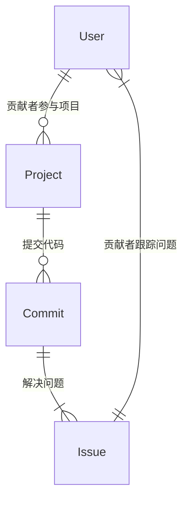

                 


## 开源贡献：参与全球技术社区的方法

### 关键词

- 开源贡献
- 全球技术社区
- 开源项目
- 技术交流
- 贡献流程

### 摘要

随着全球技术社区的日益繁荣，开源贡献成为了开发者提升技术能力、拓展人脉的重要途径。本文将深入探讨开源贡献的基本概念、流程、技巧与策略，帮助开发者更好地参与全球技术社区，实现个人与项目的共同成长。

### 目录大纲

1. **第一部分：问题背景与理解开源贡献**
   1.1 **开源贡献的背景**
   1.2 **开源贡献的重要性**
   1.3 **开源贡献的挑战**
   1.4 **第1章小结**

2. **第二部分：核心概念与原理**
   2.1 **开源项目的基本概念**
   2.2 **开源许可证**
   2.3 **开源项目的组织结构**
   2.4 **开源社区的运作模式**
   2.5 **第2章小结**

3. **第三部分：参与开源贡献的技巧与策略**
   3.1 **选择开源项目**
   3.2 **开源项目的评估**
   3.3 **开源项目的参与度**
   3.4 **贡献指南**
   3.5 **提交Pull Request**
   3.6 **处理代码审查**
   3.7 **提升开源贡献的效率**
   3.8 **第3章小结**

### 1.1 问题背景

#### 描述问题

随着全球技术社区的不断发展，开源项目在软件行业中的重要性日益凸显。开源项目不仅为开发者提供了丰富的技术资源，也为整个行业的技术进步贡献了重要力量。然而，许多开发者对于如何参与开源项目仍然感到困惑和不知所措。

#### 解决问题

要解决这一问题，我们需要从以下几个方面入手：

1. **理解开源贡献的基本概念**：开发者需要了解开源项目的定义、开源许可证、项目组织结构等基本概念。
2. **掌握开源贡献的流程**：开发者需要熟悉贡献指南、提交Pull Request、处理代码审查等流程。
3. **培养参与开源项目的技能**：开发者需要提升时间管理、工具使用等技能，提高参与开源项目的效率。

#### 边界与外延

- **开源项目的定义**：开源项目是指将源代码公开，允许用户自由使用、修改和分发的项目。它具有开放性、合作性和透明性的特点。
- **开源许可证**：常见的开源许可证包括GPL、MIT、BSD等。不同许可证对用户权利和项目维护的影响不同。
- **开源项目的组织结构**：开源项目的组织结构通常包括FOSSA、Apache Software Foundation等。这些组织提供了代码审查、项目投票、贡献指南等管理机制。

### 1.2 开源贡献的重要性

#### 核心要素组成

- **提升技术能力**：参与开源项目，开发者可以深入了解项目的技术实现，学习到其他开发者的优秀代码风格和设计模式，从而提升自己的技术能力。
- **扩展人脉和影响力**：开源贡献可以帮助开发者结识更多的同行，拓展人脉。优秀的开源贡献还能提高开发者的知名度，增强个人影响力。

#### 边界与外延

- **开源贡献的范围**：开源贡献不仅限于代码提交，还包括文档撰写、测试、bug修复等多个方面。开发者可以根据自己的兴趣和专长选择不同的贡献方式。
- **开源项目的多样性**：开源项目的多样性导致贡献过程具有一定的挑战性。开发者需要选择适合自己的项目，逐步提高参与开源项目的成功率。

### 1.3 开源贡献的挑战

#### 潜在问题

- **项目选择困难**：开发者可能难以从众多开源项目中找到适合自己的项目。
- **协作冲突**：开发者可能在与项目维护者或其他贡献者协作时遇到意见不一致的情况。

#### 解决方案

- **项目选择**：开发者可以通过查看项目活跃度、代码质量和文档完整性等指标，选择适合自己的开源项目。
- **协作冲突**：开发者需要学会尊重他人的意见，提供有价值的反馈。在遇到意见不一致时，可以通过积极沟通、合理调整代码等方式解决问题。

### 1.4 **第1章小结**

理解开源贡献的基本概念、流程和技巧，有助于开发者更好地参与开源项目，推动技术进步。通过本文的介绍，开发者可以初步掌握开源贡献的相关知识，为后续的深入学习打下基础。

## 第1章 小结

### 核心概念与联系

- **核心概念**：开源项目的定义、开源许可证、项目组织结构等基本概念。
- **联系**：这些核心概念构成了开发者参与开源贡献的基础。通过了解这些概念，开发者可以更好地选择项目、遵循贡献流程、提高贡献效率。

在本章中，我们介绍了开源贡献的背景、重要性以及参与过程中可能遇到的挑战。接下来，我们将深入探讨开源项目的基本概念、原理和参与开源贡献的技巧与策略，帮助开发者更好地融入全球技术社区。

---

### 1.2 开源贡献的重要性

#### 核心要素组成

参与开源贡献对于开发者个人和开源项目本身都具有重要意义。

1. **提升技术能力**：开源项目往往涉及到当前最前沿的技术和实践。开发者通过阅读和理解开源代码，可以学习到各种优秀的设计模式和编程技巧，从而提升自己的技术水平。

2. **代码质量**：在开源社区中，代码通常接受广泛的审查和反馈。这种审查机制有助于开发者发现和修复代码中的问题，提高代码质量。

3. **知识共享**：开源项目的参与者可以分享他们的知识和经验，帮助其他开发者更快地学习和成长。

#### 边界与外延

开源贡献的重要性不仅限于技术层面，还包括以下方面：

1. **社区建设**：开源项目是构建技术社区的重要基础。参与开源贡献可以增强社区凝聚力，促进知识共享和技术创新。

2. **职业发展**：在开源项目中做出突出贡献的开发者往往会获得更多的职业机会和认可，这有助于个人职业发展。

3. **影响力和品牌建设**：优秀的开源贡献可以帮助开发者建立个人品牌，提高在行业内的知名度。

### 1.2.1 开源项目的定义

开源项目是指那些遵循特定开源许可证（如GPL、MIT、BSD等）的软件项目，允许用户自由使用、修改和分发源代码。开源项目通常具有以下特征：

1. **开放性**：项目的源代码对公众开放，用户可以自由查看、修改和分发。
2. **合作性**：开源项目通常鼓励广泛的合作，开发者可以在项目中协作，共同推进项目发展。
3. **透明性**：项目的开发过程、决策过程和问题解决方案通常对公众透明，有利于社区成员的参与和监督。

#### 概念属性特征对比表格

| 概念 | 开放性 | 合作性 | 透明性 |
| --- | --- | --- | --- |
| 开源项目 | 是 | 是 | 是 |
| 封闭源项目 | 否 | 可能是 | 否 |

#### ER实体关系图架构



在这个ER图中，用户（User）可以参与多个项目（Project），每个项目可以有多个提交（Commit），每个提交可以解决多个问题（Issue）。这个关系图描述了开源项目中用户、项目和问题的基本关系。

### 1.2.2 开源许可证

开源许可证是确保项目开源性质的关键法律文件。以下是一些常见的开源许可证及其特点：

#### MIT许可证

- **特点**：最宽松的开源许可证之一，允许用户自由使用、修改和分发代码，同时无需提供源代码。
- **适用范围**：适用于大多数商业和非商业项目。

#### GPL许可证

- **特点**：强约束性许可证，要求用户在使用、修改或分发代码时必须以开源的方式发布。
- **适用范围**：适用于希望保持代码开源的项目。

#### BSD许可证

- **特点**：介于MIT和GPL之间，允许用户自由使用、修改和分发代码，但通常要求保留原始版权声明。
- **适用范围**：适用于希望保持代码开源，但不需要强约束的商业项目。

#### 比较表格

| 许可证 | MIT | GPL | BSD |
| --- | --- | --- | --- |
| 开放性 | 是 | 是 | 是 |
| 合作性 | 是 | 是 | 是 |
| 约束性 | 弱 | 强 | 中等 |

### 1.2.3 开源项目的组织结构

开源项目可以由单个开发者维护，也可以由一个团队或者组织来管理。以下是一些常见的开源项目组织结构：

#### 单个开发者

- **优势**：决策快速，灵活性强。
- **劣势**：维护难度大，容易因个人原因导致项目停滞。

#### 团队维护

- **优势**：分工明确，合作高效。
- **劣势**：沟通成本较高，决策可能较慢。

#### 组织管理

- **优势**：资源丰富，专业性强。
- **劣势**：结构复杂，决策过程较长。

#### 管理机制

- **代码审查**：确保代码质量，防止错误代码进入项目。
- **贡献指南**：明确项目的贡献流程和规范，指导新贡献者。
- **项目投票**：在重要决策时，通过投票来决定项目的方向。

### 1.2.4 开源社区的运作模式

开源社区通常采用以下运作模式：

#### Pull Request

- **定义**：贡献者向项目提交代码更改的请求。
- **流程**：贡献者创建分支，编写并提交代码，项目维护者审查并合并代码。

#### Issue Tracker

- **定义**：用于记录和管理项目问题的工具。
- **流程**：贡献者创建问题报告，项目维护者和其他贡献者共同讨论并解决问题。

#### 社区文化

开源社区通常倡导以下文化：

- **互助**：鼓励成员相互帮助，共同解决问题。
- **尊重**：尊重其他贡献者的意见和工作。
- **开放**：保持项目透明，欢迎新成员的参与。

### 1.2.5 开源贡献的重要性总结

开源贡献不仅对个人技术能力的提升有着重要影响，也对整个开源社区的技术进步和繁荣发展起着关键作用。通过参与开源项目，开发者可以：

1. **学习前沿技术**：参与开源项目可以让开发者接触到最新的技术和实践。
2. **提升编程能力**：在开源项目中编写和维护代码，可以帮助开发者提高编程技能。
3. **扩展人脉**：开源社区是一个大平台，参与其中可以结识来自世界各地的开发者。
4. **建立个人品牌**：优秀的开源贡献可以提升开发者在行业内的知名度。

### 第2章 小结

在本章中，我们详细介绍了开源项目的定义、开源许可证、开源项目的组织结构以及开源社区的运作模式。通过这些核心概念的理解，开发者可以更好地选择项目、参与贡献并融入开源社区。接下来，我们将进一步探讨如何选择合适的项目、评估项目的质量和参与度，为成功参与开源贡献打下坚实的基础。

---

### 1.3 开源贡献的挑战

#### 潜在问题

参与开源贡献虽然具有重要意义，但也面临着一系列挑战。

1. **项目选择困难**：开源项目众多，开发者可能难以选择适合自己的项目。
2. **协作冲突**：在开源项目中，开发者需要与其他贡献者、项目维护者协作，这可能导致意见不一致，产生冲突。
3. **时间管理**：开源贡献需要投入大量的时间和精力，开发者可能难以平衡工作与贡献。

#### 解决方案

1. **项目选择**：
   - **评估项目活跃度**：选择活跃度高的项目，这样更容易获得反馈和得到维护者的关注。
   - **考虑个人兴趣**：选择与自己专业领域相关的项目，这样可以更好地发挥自己的专长。
   - **查看项目文档**：阅读项目的贡献指南和文档，了解项目的开发状态和贡献流程。

2. **协作冲突**：
   - **尊重他人意见**：在讨论中，尊重其他贡献者的观点，积极寻求共识。
   - **提供有价值的反馈**：在意见不一致时，提供合理的理由和解决方案，促进讨论。
   - **保持沟通**：遇到问题时，及时与项目维护者或其他贡献者沟通，避免误解和冲突的升级。

3. **时间管理**：
   - **设定优先级**：根据项目的紧急程度和重要性，合理安排时间。
   - **有效利用工具**：使用任务管理工具（如Trello、Jira等）来规划和管理自己的任务。
   - **保持持续贡献**：定期回顾自己的贡献计划，确保持续参与项目。

### 第1章 小结

#### 核心概念与联系

本章介绍了开源贡献的基本概念、重要性以及参与过程中可能遇到的挑战。通过理解开源贡献的背景、核心要素和解决策略，开发者可以更好地选择项目、参与贡献并克服挑战。接下来，我们将进一步探讨开源项目的核心概念与原理，为深入参与开源贡献打下坚实的基础。

---

### 1.4 **第1章小结**

#### 核心概念与联系

在本章中，我们介绍了开源贡献的背景、重要性以及参与过程中可能遇到的挑战。核心概念包括开源项目的定义、开源许可证、项目组织结构和开源社区的运作模式。这些概念构成了理解开源贡献的基础。通过本章的学习，开发者可以：

1. **理解开源贡献的基本概念**：掌握开源项目的定义、开源许可证的类型以及开源项目的组织结构。
2. **认识到开源贡献的重要性**：认识到开源贡献对个人技术能力和职业发展的重要性。
3. **应对开源贡献的挑战**：了解如何选择合适的项目、处理协作冲突和时间管理。

这些核心概念和联系为开发者参与开源贡献提供了理论基础和实践指导。接下来，我们将深入探讨开源项目的核心概念和原理，帮助开发者更好地理解和应用这些概念。

---

### 1.5 开源项目的定义

开源项目是指那些遵循特定开源许可证（如GPL、MIT、BSD等）的软件项目，允许用户自由使用、修改和分发源代码。开源项目不仅限于代码本身，还包括文档、测试用例等。以下是对开源项目定义的详细解释：

#### 开放性

开源项目的核心特点是开放性。这意味着项目的源代码对公众开放，用户可以自由查看、修改和分发。这种开放性使得开源项目具有以下几个特点：

1. **透明性**：项目的源代码、开发进度和问题解决过程都对外公开，用户可以随时查看。
2. **合作性**：开源项目鼓励广泛的合作，开发者可以在项目中协作，共同推进项目发展。
3. **创新性**：由于开源项目的透明性和合作性，更容易产生新的想法和解决方案，推动技术的进步。

#### 合作性

开源项目的合作性是其成功的重要因素之一。开发者可以在开源项目中贡献自己的代码、文档、测试等。合作性使得项目能够吸引更多的参与者，提高项目质量和可持续性。以下是一些合作性特点：

1. **多元化的贡献**：开源项目鼓励不同的贡献形式，如代码提交、文档编写、bug修复等。
2. **社区文化**：开源社区通常倡导互助、尊重和开放的文化，鼓励成员之间相互帮助和尊重彼此的工作。
3. **多样化的参与者**：开源项目吸引了来自世界各地的开发者，他们可以共同为项目做出贡献。

#### 透明性

开源项目的透明性是其另一个重要特点。项目的开发过程、决策过程和问题解决方案通常对公众透明，有利于社区成员的参与和监督。以下是一些透明性的表现：

1. **代码审查**：开源项目的代码通常接受广泛的审查，这有助于确保代码的质量和安全。
2. **贡献指南**：开源项目通常会提供详细的贡献指南，指导新贡献者如何参与项目。
3. **问题跟踪**：开源项目通常使用Issue Tracker来记录和管理问题，这些问题对所有人可见，方便社区成员参与讨论和解决。

#### 开源项目的类型

开源项目可以按照不同的分类方式进行分类，例如按照用途、编程语言、应用领域等。以下是一些常见的开源项目类型：

1. **框架和库**：如Python的Django、JavaScript的React等。
2. **操作系统**：如Linux、OpenBSD等。
3. **工具和软件**：如Vim、Git等。
4. **网站和应用**：如WordPress、GitHub等。

#### 案例分析

以Linux操作系统为例，它是一个典型的开源项目。Linux的开源特性使其吸引了大量的开发者参与，包括一些大公司和独立开发者。这些开发者共同为Linux内核做出了大量的贡献，使其成为当今最受欢迎的操作系统之一。

#### 总结

开源项目的定义涵盖了开放性、合作性和透明性三个核心特点。这些特点使得开源项目具有强大的生命力和广泛的影响力。通过参与开源项目，开发者不仅可以提升自己的技术能力，还可以为开源社区和整个行业做出贡献。在下一章中，我们将进一步探讨开源许可证的不同类型和特点。

---

### 1.6 开源许可证

开源许可证是确保项目开源性质的关键法律文件。它定义了用户如何使用、修改和分发开源项目的源代码。不同的开源许可证具有不同的特点，适用于不同的项目需求。以下是几种常见的开源许可证及其特点的详细解释：

#### MIT许可证

MIT许可证是最为宽松的开源许可证之一。它允许用户自由使用、修改和分发代码，同时无需提供源代码。MIT许可证的灵活性使其在商业和非商业项目中都广泛使用。以下是MIT许可证的主要特点：

1. **不限制使用方式**：用户可以使用开源项目创建商业产品，无需公开源代码。
2. **不要求贡献回代码**：用户在修改开源项目后，无需将其贡献回原始项目。
3. **版权声明保留**：用户在使用开源项目时，需要保留原始版权声明。

#### GPL许可证

GPL许可证是另一种常见的开源许可证，但它具有更强的约束性。GPL许可证要求用户在使用、修改或分发代码时，必须以开源的方式发布。以下是GPL许可证的主要特点：

1. **强制开源**：用户在修改开源项目后，必须以开源的方式发布，并允许其他用户自由使用。
2. **传播限制**：用户在分发基于GPL项目的软件时，必须同时提供源代码。
3. **兼容性**：GPL许可证不兼容某些商业许可证，这可能会对某些商业项目的使用造成限制。

#### BSD许可证

BSD许可证是一种介于MIT和GPL之间的许可证。它允许用户自由使用、修改和分发代码，但通常要求保留原始版权声明。BSD许可证的灵活性使其在商业项目中较为受欢迎。以下是BSD许可证的主要特点：

1. **使用灵活**：用户可以使用开源项目创建商业产品，无需公开源代码。
2. **贡献回代码**：用户在修改开源项目后，可以选择贡献回原始项目，也可以保留私有的修改版本。
3. **版权声明保留**：用户在使用开源项目时，需要保留原始版权声明。

#### 比较表格

以下是MIT、GPL和BSD许可证的主要特点对比表格：

| 许可证 | MIT | GPL | BSD |
| --- | --- | --- | --- |
| 开放性 | 高 | 中 | 高 |
| 合作性 | 中 | 高 | 中 |
| 约束性 | 弱 | 强 | 中 |

#### 选择合适的开源许可证

选择合适的开源许可证对项目的可持续性和发展至关重要。以下是一些选择开源许可证的考虑因素：

1. **项目目标**：如果项目目标是创建一个开源社区，GPL许可证可能是一个更好的选择，因为它鼓励用户贡献回代码。如果项目目标是开发一个商业产品，MIT或BSD许可证可能更适合，因为它们允许用户自由使用代码。
2. **商业兼容性**：如果项目需要与商业软件集成，选择一个对商业兼容性友好的许可证（如MIT或BSD）可能更为合适。
3. **社区文化**：项目的社区文化也可能影响许可证的选择。一些社区可能更倾向于使用GPL许可证，因为它鼓励更多的开源贡献。

#### 案例分析

以Linux操作系统为例，它使用GPL许可证。Linux的开源特性吸引了大量的开发者参与，这些开发者共同为Linux内核做出了巨大的贡献。GPL许可证的强制开源特性确保了Linux内核的持续发展和创新。

#### 总结

开源许可证是确保项目开源性质的关键法律文件。不同的开源许可证具有不同的特点，适用于不同的项目需求。开发者应根据项目目标、商业兼容性和社区文化等因素选择合适的开源许可证。在下一章中，我们将进一步探讨开源项目的组织结构和管理机制。

---

### 1.7 开源项目的组织结构

开源项目的组织结构是项目管理和维护的基础。不同的组织结构有助于项目团队更高效地协作，确保项目目标的实现。以下是一些常见的开源项目组织结构，以及它们的特点和管理机制。

#### 单个开发者

单个开发者维护的开源项目是最简单的一种组织结构。在这种结构下，开发者独自负责项目的所有事务，包括代码编写、问题解决、文档撰写等。以下是这种结构的特点：

1. **灵活性高**：开发者可以自由决定项目的方向和进展。
2. **决策速度快**：由于只有一个决策者，项目的决策过程通常非常迅速。
3. **维护难度大**：单个开发者可能难以同时处理所有任务，维护项目可能会变得困难。

#### 团队维护

团队维护的开源项目通常由一组开发者组成，每个开发者负责不同的任务。以下是一些团队维护结构的特点：

1. **分工明确**：团队成员可以根据自己的专长和兴趣，负责项目的不同部分。
2. **合作高效**：团队成员可以相互协作，共同推进项目发展。
3. **沟通成本高**：团队成员之间的沟通成本可能会增加，特别是在成员较多时。

#### 组织管理

一些大型开源项目可能由组织管理，如FOSSA、Apache Software Foundation等。以下是一些组织管理结构的特点：

1. **资源丰富**：组织可以提供更多的资源和资金支持，有助于项目的发展。
2. **专业性强**：组织通常拥有专业的项目管理团队，可以提供更高效的项目管理。
3. **结构复杂**：组织管理可能导致项目结构变得更加复杂，决策过程可能较长。

#### 管理机制

无论是单个开发者、团队维护还是组织管理，开源项目通常需要以下管理机制：

1. **代码审查**：确保代码质量，防止错误代码进入项目。
2. **贡献指南**：明确项目的贡献流程和规范，指导新贡献者。
3. **项目投票**：在重要决策时，通过投票来决定项目的方向。

#### 案例分析

以Linux内核为例，它采用组织管理的结构。Linux内核的开发和维护由一组核心维护者负责，他们共同决策内核的发展方向。Linux内核的管理机制包括代码审查、贡献指南和项目投票，确保项目的稳定性和持续发展。

#### 总结

开源项目的组织结构多种多样，不同的结构适用于不同的项目需求。无论是单个开发者、团队维护还是组织管理，都需要有效的管理机制来确保项目的顺利进行。在下一章中，我们将深入探讨开源社区的运作模式和合作方式。

---

### 1.8 开源社区的运作模式

开源社区的运作模式是开源项目成功的关键之一。它不仅决定了项目的可持续性，还影响了社区成员之间的协作效率和创新能力。以下是一些常见的开源社区运作模式，以及它们的特点和优势。

#### Pull Request

Pull Request（PR）是开源社区中用于代码更改的主要机制。它允许贡献者向项目提交自己的代码更改，并请求项目维护者审查和合并。以下是Pull Request的一些特点：

1. **代码审查**：通过Pull Request，项目维护者和其他贡献者可以对提交的代码进行审查，确保代码质量。
2. **协作反馈**：Pull Request提供了一个平台，贡献者可以与项目维护者和其他贡献者讨论和改进代码。
3. **透明性**：Pull Request的过程对外公开，社区成员可以随时查看代码变更的讨论和进展。

#### Issue Tracker

Issue Tracker是用于记录和管理项目问题的工具。它可以帮助项目团队追踪和管理问题的生命周期，确保问题得到及时解决。以下是Issue Tracker的一些特点：

1. **问题分类**：Issue Tracker可以将问题分类为不同的类型，如bug、功能请求、文档错误等。
2. **优先级管理**：Issue Tracker可以根据问题的紧急程度和重要性进行优先级管理。
3. **透明度**：所有社区成员都可以查看和参与问题的讨论，提高问题解决的效率。

#### 社区文化

开源社区通常倡导以下文化：

1. **互助**：社区成员相互帮助，共同解决项目中的问题。
2. **尊重**：尊重其他贡献者的工作和意见，保持开放和尊重的交流。
3. **开放**：开源社区鼓励新成员的参与，提供平等的学习和贡献机会。

#### 线上会议

开源社区经常通过线上会议来协调和推进项目发展。以下是线上会议的一些特点：

1. **实时沟通**：线上会议提供了一个实时沟通的平台，社区成员可以即时讨论和解决问题。
2. **记录和共享**：会议通常会有记录，并将关键信息共享给所有参与者，确保信息的传递和跟踪。
3. **灵活性和效率**：线上会议不受地理位置限制，提高了会议的参与度和效率。

#### 文档

开源社区通常提供详细的文档，用于指导新贡献者和用户。以下是文档的一些特点：

1. **入门指南**：文档通常会包括项目的基本介绍、安装指南和快速开始指南。
2. **API文档**：对于提供API的项目，文档通常会详细描述API的使用方法。
3. **贡献指南**：文档通常会包括如何参与项目贡献的详细步骤和最佳实践。

#### 案例分析

以Python开源社区为例，它采用Pull Request、Issue Tracker、线上会议和文档等多种运作模式。Python社区的代码审查过程非常严格，通过Pull Request确保代码质量。同时，社区成员通过线上会议和Issue Tracker高效协作，解决了许多技术问题。详细的文档帮助新成员快速融入社区，并为用户提供了丰富的学习资源。

#### 总结

开源社区的运作模式多种多样，但核心目标是促进社区成员的协作和创新。通过Pull Request、Issue Tracker、线上会议和文档等运作模式，开源社区能够实现高效的协作和透明的管理，推动项目的持续发展。在下一章中，我们将探讨如何选择合适的开源项目，以及参与开源项目的技巧和策略。

---

### 1.9 **第1章小结**

在本章中，我们深入探讨了开源项目的定义、开源许可证、开源项目的组织结构以及开源社区的运作模式。通过理解这些核心概念和原理，开发者可以更好地选择项目、参与贡献并融入开源社区。以下是本章的核心概念与联系：

1. **开源项目的定义**：理解开源项目的开放性、合作性和透明性特点，以及其涵盖的代码、文档和测试用例。
2. **开源许可证**：了解不同开源许可证的特点，如MIT、GPL和BSD，以及如何根据项目目标和社区文化选择合适的许可证。
3. **开源项目的组织结构**：理解单个开发者、团队维护和组织管理的不同组织结构，以及各自的特点和管理机制。
4. **开源社区的运作模式**：了解Pull Request、Issue Tracker、线上会议和文档等运作模式，以及它们在促进社区协作和透明管理中的作用。

通过本章的学习，开发者可以为后续参与开源贡献打下坚实的基础。在下一章中，我们将进一步探讨如何选择合适的开源项目，以及参与开源项目的具体技巧和策略。

---

### 1.10 **第1章小结**

#### 核心概念与联系

在本章中，我们详细探讨了开源贡献的背景、重要性、面临的挑战以及相关的核心概念和原理。以下是本章的核心概念与联系：

1. **开源贡献的背景**：理解开源项目的定义、开源许可证的类型以及开源项目的组织结构。
2. **开源贡献的重要性**：认识到开源贡献对个人技术能力、职业发展以及开源社区繁荣的重要作用。
3. **开源贡献的挑战**：了解如何选择合适的项目、处理协作冲突和时间管理等问题。
4. **开源项目的定义**：理解开源项目的开放性、合作性和透明性特点。
5. **开源许可证**：熟悉不同开源许可证的特点，如MIT、GPL和BSD，以及如何选择合适的许可证。
6. **开源项目的组织结构**：了解不同组织结构的特点和管理机制，包括单个开发者、团队维护和组织管理。
7. **开源社区的运作模式**：掌握开源社区中的合作方式，如Pull Request、Issue Tracker、线上会议和文档等。

通过本章的学习，开发者可以初步掌握开源贡献的基本概念和流程，为后续更深入地参与开源项目奠定基础。在下一章中，我们将继续探讨如何选择合适的开源项目，以及参与开源贡献的具体技巧和策略。

---

### 第2章 核心概念与原理

在本章中，我们将深入探讨开源项目的核心概念与原理，帮助开发者更好地理解开源项目的基础知识。本章将涵盖以下内容：

1. **开源项目的定义与特点**：明确开源项目的定义，理解其开放性、合作性和透明性的特点。
2. **开源许可证的类型与选择**：介绍几种常见的开源许可证，并探讨如何根据项目需求和社区文化选择合适的许可证。
3. **开源项目的组织结构**：分析不同类型的开源项目组织结构，包括单个开发者、团队维护和组织管理。
4. **开源社区的运作模式**：探讨开源社区的运作方式，包括代码审查、贡献指南、Pull Request和Issue Tracker等。

通过本章的学习，开发者可以加深对开源项目核心概念与原理的理解，为后续的实践应用打下坚实的基础。

---

### 第2章 开源项目的定义与特点

#### 开源项目的定义

开源项目（Open Source Project）是指遵循特定开源许可证（如GPL、MIT、BSD等）的软件项目，允许用户自由使用、修改和分发源代码。开源项目的本质在于其开放性，使得任何人都可以自由地查看、学习、修改和分发代码，而不受版权限制。

#### 开放性

开源项目的开放性是其最重要的特点之一。开放性意味着：

1. **源代码公开**：项目的源代码可以被所有人查看，这促进了代码的透明性和可审计性。
2. **自由修改**：用户可以在遵循开源许可证的条件下，自由地对代码进行修改和优化。
3. **自由分发**：用户可以在不违反开源许可证的前提下，自由地分发开源项目的源代码和衍生作品。

#### 合作性

开源项目通常具有高度的合作性。合作性体现在以下几个方面：

1. **社区参与**：开源项目鼓励广泛的社区参与，任何人都可以参与到项目的开发、测试和文档编写中。
2. **代码审查**：开源项目的代码通常接受社区成员的审查，这有助于提高代码质量，减少错误和漏洞。
3. **协作工具**：开源社区通常会使用各种协作工具（如GitHub、GitLab等），以便贡献者之间的交流和合作。

#### 透明性

开源项目的透明性是其另一个重要特点。项目的开发进度、决策过程和问题解决通常对公众透明：

1. **问题跟踪**：开源项目通常使用Issue Tracker来记录和管理问题，这些问题对所有社区成员可见。
2. **代码审查**：开源社区的代码审查过程公开，社区成员可以查看、讨论和提出改进意见。
3. **文档公开**：开源项目的文档通常也对外公开，这有助于新贡献者快速了解项目。

#### 开源项目的类型

开源项目可以按照不同的标准进行分类，例如按用途、编程语言、应用领域等。以下是一些常见的开源项目类型：

1. **框架和库**：如Python的Django、JavaScript的React等。
2. **操作系统**：如Linux、OpenBSD等。
3. **工具和软件**：如Vim、Git等。
4. **网站和应用**：如WordPress、GitHub等。

#### 案例分析

以Linux内核为例，它是一个典型的开源项目。Linux内核遵循GPL许可证，具有高度的开放性、合作性和透明性。Linux内核的开发过程和决策过程对所有人开放，吸引了全球数以万计的开发者参与。通过社区协作，Linux内核不断改进，成为世界上最流行的操作系统之一。

#### 总结

开源项目具有开放性、合作性和透明性的特点，这使得它们在软件行业中具有强大的生命力和广泛的影响力。通过参与开源项目，开发者不仅可以提升自己的技术能力，还可以为开源社区和整个行业做出贡献。在下一节中，我们将进一步探讨开源许可证的类型与选择，以及如何根据项目需求选择合适的许可证。

---

### 2.2 开源许可证的类型与选择

开源许可证是确保项目开源性质的关键法律文件。不同的开源许可证具有不同的特点，适用于不同的项目需求。以下是几种常见的开源许可证类型及其特点：

#### MIT许可证

MIT许可证是一种非常宽松的开源许可证。它允许用户自由使用、修改和分发代码，无需提供源代码。以下是MIT许可证的主要特点：

1. **不限制使用方式**：用户可以使用开源项目创建商业产品，无需公开源代码。
2. **不要求贡献回代码**：用户在修改开源项目后，无需将其贡献回原始项目。
3. **版权声明保留**：用户在使用开源项目时，需要保留原始版权声明。

#### GPL许可证

GPL许可证是一种具有较强约束力的开源许可证。它要求用户在使用、修改或分发代码时，必须以开源的方式发布。以下是GPL许可证的主要特点：

1. **强制开源**：用户在修改开源项目后，必须以开源的方式发布，并允许其他用户自由使用。
2. **传播限制**：用户在分发基于GPL项目的软件时，必须同时提供源代码。
3. **兼容性**：GPL许可证不兼容某些商业许可证，这可能会对某些商业项目的使用造成限制。

#### BSD许可证

BSD许可证介于MIT和GPL之间。它允许用户自由使用、修改和分发代码，但通常要求保留原始版权声明。以下是BSD许可证的主要特点：

1. **使用灵活**：用户可以使用开源项目创建商业产品，无需公开源代码。
2. **贡献回代码**：用户在修改开源项目后，可以选择贡献回原始项目，也可以保留私有的修改版本。
3. **版权声明保留**：用户在使用开源项目时，需要保留原始版权声明。

#### 比较表格

以下是MIT、GPL和BSD许可证的主要特点对比表格：

| 许可证 | MIT | GPL | BSD |
| --- | --- | --- | --- |
| 开放性 | 高 | 中 | 高 |
| 合作性 | 中 | 高 | 中 |
| 约束性 | 弱 | 强 | 中 |

#### 选择合适的开源许可证

选择合适的开源许可证对项目的可持续性和发展至关重要。以下是一些选择开源许可证的考虑因素：

1. **项目目标**：如果项目目标是创建一个开源社区，GPL许可证可能是一个更好的选择，因为它鼓励用户贡献回代码。如果项目目标是开发一个商业产品，MIT或BSD许可证可能更适合，因为它们允许用户自由使用代码。
2. **商业兼容性**：如果项目需要与商业软件集成，选择一个对商业兼容性友好的许可证（如MIT或BSD）可能更为合适。
3. **社区文化**：项目的社区文化也可能影响许可证的选择。一些社区可能更倾向于使用GPL许可证，因为它鼓励更多的开源贡献。

#### 案例分析

以Linux操作系统为例，它使用GPL许可证。Linux的开源特性吸引了大量的开发者参与，这些开发者共同为Linux内核做出了巨大的贡献。GPL许可证的强制开源特性确保了Linux内核的持续发展和创新。

#### 总结

开源许可证是确保项目开源性质的关键法律文件。不同的开源许可证具有不同的特点，适用于不同的项目需求。开发者应根据项目目标、商业兼容性和社区文化等因素选择合适的开源许可证。在下一节中，我们将探讨开源项目的组织结构，分析不同组织结构的特点和管理机制。

---

### 2.3 开源项目的组织结构

开源项目的组织结构对于项目的管理和发展至关重要。不同的组织结构适应了不同规模和类型的开源项目，以下将介绍几种常见的开源项目组织结构，并分析它们的特点和管理机制。

#### 单个开发者

单个开发者维护的开源项目是最简单的一种组织形式。在这种结构下，开发者独自负责项目的所有事务，包括代码编写、问题解决、文档撰写等。以下是这种结构的特点：

1. **灵活性高**：由于只有一个开发者，项目方向和决策过程非常灵活，可以快速适应变化。
2. **决策速度快**：没有复杂的决策过程，所有决策由单一开发者做出，实施迅速。
3. **维护难度大**：单个开发者可能难以承担所有的任务，特别是在项目规模扩大时，维护项目可能会变得困难。

#### 团队维护

团队维护的开源项目通常由一组开发者组成，每个开发者负责不同的任务。以下是这种结构的特点：

1. **分工明确**：团队成员可以根据自己的专长和兴趣，负责项目的不同部分，提高了效率。
2. **合作高效**：团队成员可以相互协作，共同推进项目发展，减少了单个开发者可能面临的压力。
3. **沟通成本高**：团队成员之间的沟通成本可能会增加，特别是在团队规模较大时，协调和沟通变得更加复杂。

#### 组织管理

一些大型开源项目可能由组织管理，如FOSSA、Apache Software Foundation等。以下是这种结构的特点：

1. **资源丰富**：组织可以提供更多的资源和资金支持，有助于项目的发展。
2. **专业性强**：组织通常拥有专业的项目管理团队，可以提供更高效的项目管理。
3. **结构复杂**：组织管理可能导致项目结构变得更加复杂，决策过程可能较长。

#### 管理机制

无论是单个开发者、团队维护还是组织管理，开源项目通常需要以下管理机制：

1. **代码审查**：确保代码质量，防止错误代码进入项目。在团队维护和组织管理结构中，代码审查通常更加严格。
2. **贡献指南**：明确项目的贡献流程和规范，指导新贡献者如何参与项目。这有助于保持项目的统一性和标准化。
3. **项目投票**：在重要决策时，通过投票来决定项目的方向。组织管理结构中，投票机制有助于确保决策的公正性和透明度。

#### 案例分析

以Linux内核为例，它采用组织管理的结构。Linux内核的开发和维护由一组核心维护者负责，他们共同决策内核的发展方向。Linux内核的管理机制包括代码审查、贡献指南和项目投票，确保项目的稳定性和持续发展。

#### 总结

开源项目的组织结构多种多样，不同的结构适用于不同的项目需求。无论是单个开发者、团队维护还是组织管理，都需要有效的管理机制来确保项目的顺利进行。在下一节中，我们将探讨开源社区的运作模式和合作方式，了解如何通过协作推动项目的成功。

---

### 2.4 开源社区的运作模式

开源社区的运作模式是开源项目成功的关键之一。它不仅决定了项目的可持续性，还影响了社区成员之间的协作效率和创新能力。以下是一些常见的开源社区运作模式，以及它们的特点和优势。

#### Pull Request

Pull Request（PR）是开源社区中用于代码更改的主要机制。它允许贡献者向项目提交自己的代码更改，并请求项目维护者审查和合并。以下是Pull Request的一些特点：

1. **代码审查**：通过Pull Request，项目维护者和其他贡献者可以对提交的代码进行审查，确保代码质量。
2. **协作反馈**：Pull Request提供了一个平台，贡献者可以与项目维护者和其他贡献者讨论和改进代码。
3. **透明性**：Pull Request的过程对外公开，社区成员可以随时查看代码变更的讨论和进展。

#### Issue Tracker

Issue Tracker是用于记录和管理项目问题的工具。它可以帮助项目团队追踪和管理问题的生命周期，确保问题得到及时解决。以下是Issue Tracker的一些特点：

1. **问题分类**：Issue Tracker可以将问题分类为不同的类型，如bug、功能请求、文档错误等。
2. **优先级管理**：Issue Tracker可以根据问题的紧急程度和重要性进行优先级管理。
3. **透明度**：所有社区成员都可以查看和参与问题的讨论，提高问题解决的效率。

#### 社区文化

开源社区通常倡导以下文化：

1. **互助**：社区成员相互帮助，共同解决项目中的问题。
2. **尊重**：尊重其他贡献者的工作和意见，保持开放和尊重的交流。
3. **开放**：开源社区鼓励新成员的参与，提供平等的学习和贡献机会。

#### 线上会议

开源社区经常通过线上会议来协调和推进项目发展。以下是线上会议的一些特点：

1. **实时沟通**：线上会议提供了一个实时沟通的平台，社区成员可以即时讨论和解决问题。
2. **记录和共享**：会议通常会有记录，并将关键信息共享给所有参与者，确保信息的传递和跟踪。
3. **灵活性和效率**：线上会议不受地理位置限制，提高了会议的参与度和效率。

#### 文档

开源社区通常提供详细的文档，用于指导新贡献者和用户。以下是文档的一些特点：

1. **入门指南**：文档通常会包括项目的基本介绍、安装指南和快速开始指南。
2. **API文档**：对于提供API的项目，文档通常会详细描述API的使用方法。
3. **贡献指南**：文档通常会包括如何参与项目贡献的详细步骤和最佳实践。

#### 案例分析

以Python开源社区为例，它采用Pull Request、Issue Tracker、线上会议和文档等多种运作模式。Python社区的代码审查过程非常严格，通过Pull Request确保代码质量。同时，社区成员通过线上会议和Issue Tracker高效协作，解决了许多技术问题。详细的文档帮助新成员快速融入社区，并为用户提供了丰富的学习资源。

#### 总结

开源社区的运作模式多种多样，但核心目标是促进社区成员的协作和创新。通过Pull Request、Issue Tracker、线上会议和文档等运作模式，开源社区能够实现高效的协作和透明的管理，推动项目的持续发展。在下一章中，我们将探讨如何选择合适的开源项目，以及参与开源项目的具体技巧和策略。

---

### 第3章 选择开源项目

选择合适的开源项目是参与开源贡献的第一步。合适的开源项目不仅可以提高个人技术能力，还能为项目本身带来积极的影响。以下是如何选择开源项目的详细指南。

#### 3.1 如何选择开源项目

选择开源项目时，需要考虑以下几个标准：

1. **兴趣**：选择自己感兴趣的项目，可以增加参与的动力和热情。
2. **项目活跃度**：项目活跃度高的项目通常更容易获得反馈和得到维护者的关注。
3. **代码质量**：高质量的代码有助于减少学习成本，同时也能保证项目的稳定性。
4. **文档完整性**：良好的文档可以提供项目背景、功能说明、使用指南和贡献指南，帮助新贡献者快速上手。
5. **社区氛围**：积极、友好、互助的社区氛围有助于新成员的融入和参与。

#### 3.2 使用工具

以下是一些常用的工具和平台，可以帮助开发者选择合适的开源项目：

1. **GitHub**：GitHub是全球最大的开源代码托管平台，提供了丰富的开源项目，支持多种编程语言。
2. **GitLab**：GitLab是一个自托管的开源代码托管平台，提供了类似GitHub的功能。
3. **OSDN**：OSDN（Open Source Development Network）是日本的一个开源项目信息门户，提供了大量的亚洲开源项目。
4. **Open Hub**：Open Hub提供了一个开源项目的评估和排名工具，可以查看项目的活跃度、代码质量和文档完整性等指标。

#### 3.3 开源项目的评估

评估开源项目时，可以从以下几个方面进行：

1. **活跃度**：查看项目的仓库更新频率，活跃的贡献者数量以及 Issue Tracker 和 Pull Request 的处理速度。
2. **代码质量**：通过代码分析工具（如CodeQL、SonarQube）评估代码质量，检查是否有严重的代码缺陷和安全漏洞。
3. **文档完整性**：评估项目的文档是否全面，是否提供了清晰的贡献指南和开发文档。
4. **社区氛围**：通过社区论坛、邮件列表、社交媒体等渠道了解社区的氛围和成员的互动情况。

#### 3.4 初级参与

对于新手来说，可以从以下几个方面开始参与开源项目：

1. **文档翻译**：帮助将英文文档翻译为其他语言，为国际化的项目做出贡献。
2. **Bug报告**：发现项目中的 bug 并提交详细的报告，帮助项目团队解决问题。
3. **反馈和建议**：对项目的功能和建议进行反馈，提供有价值的建议。

#### 3.5 中级参与

在熟悉项目后，可以逐步增加参与的深度：

1. **代码提交**：根据项目的需要，提交代码修复 bug 或添加新功能。
2. **功能开发**：参与项目的功能开发，与项目团队协作推进项目的发展。
3. **代码审查**：为其他贡献者提交的代码提供审查意见，帮助提高代码质量。

#### 3.6 高级参与

随着对项目的深入了解，可以尝试更高级的参与：

1. **项目管理**：参与项目的决策过程，协助维护者管理项目。
2. **社区运营**：协助维护社区氛围，组织社区活动，吸引更多贡献者。
3. **项目推广**：通过博客、演讲、社交媒体等渠道，推广项目，吸引更多用户和贡献者。

#### 3.7 案例分析

以Python的Django项目为例，Django是一个流行的Web开发框架。Django项目活跃度高，文档完整，社区氛围友好。新手可以从阅读文档、报告Bug、参与文档翻译开始，逐步参与代码提交和功能开发。随着经验的积累，可以尝试参与项目管理或社区运营。

#### 3.8 小结

选择合适的开源项目是参与开源贡献的重要一步。开发者应根据自己的兴趣、项目活跃度、代码质量和文档完整性等标准进行选择，并通过工具和平台评估项目的潜力。从初级参与开始，逐步增加参与的深度，最终可以成为项目的核心贡献者，为开源社区的繁荣做出贡献。

---

### 第4章 开源项目的评估

在选择了合适的开源项目后，评估其质量和健康状况是确保有效贡献的重要步骤。以下是如何对开源项目进行评估的详细指南：

#### 4.1 指标

评估开源项目时，可以从以下几个指标入手：

1. **活跃度**：项目的活跃度是评估其健康状况的重要指标。可以通过查看以下方面来评估：
   - **仓库更新频率**：项目最近的活动，如代码提交、Pull Request和Issue的更新。
   - **贡献者数量**：项目的活跃贡献者数量，通常在项目README或贡献者列表中可以找到。
   - **社区参与度**：社区讨论区的活跃程度，如GitHub的issue tracker和讨论区。

2. **代码质量**：代码质量直接影响项目的稳定性和可维护性。评估代码质量可以从以下几个方面入手：
   - **代码风格一致性**：是否符合项目设定的代码风格指南。
   - **代码可读性**：代码是否易于阅读和理解，是否有清晰的注释。
   - **测试覆盖率**：项目是否有完善的测试用例，测试覆盖率是否达到一定标准。

3. **文档完整性**：良好的文档是项目成功的关键因素。评估文档可以从以下几个方面入手：
   - **文档的完整性**：文档是否包含了安装、配置、使用和贡献指南。
   - **更新频率**：文档是否定期更新，以反映项目的最新状态。

4. **社区健康**：一个健康的社区有助于项目的长期发展。评估社区可以从以下几个方面入手：
   - **社区氛围**：社区成员之间的互动是否友好、积极。
   - **问题解决速度**：社区对问题的响应速度，包括在issue tracker中的处理速度。
   - **贡献者反馈**：新贡献者对社区体验的反馈。

#### 4.2 方法

以下是评估开源项目的具体方法：

1. **查看项目历史**：
   - **GitHub或GitLab**：查看项目的创建时间、最近的活动和贡献者的历史贡献。
   - **贡献者列表**：了解项目的主要贡献者，他们的背景和活跃度。

2. **分析代码**：
   - **代码分析工具**：使用SonarQube、CodeQL等工具进行静态代码分析，检查代码中的潜在问题和安全漏洞。
   - **代码审查**：通过阅读代码和提交的Pull Request，评估代码的质量和风格。

3. **阅读文档**：
   - **项目README**：了解项目的背景、目标和安装指南。
   - **贡献指南**：查看项目对贡献者的指导，确保自己的贡献符合项目的规范。

4. **参与社区**：
   - **Issue Tracker**：在项目中提一个问题或提出一个建议，观察社区的反应和处理速度。
   - **讨论区**：参与社区讨论，了解社区的氛围和成员之间的互动。

#### 4.3 评估结果

根据评估结果，可以做出以下决策：

1. **选择参与**：
   - 如果项目活跃度、代码质量和文档完整性都较高，社区氛围友好，可以考虑积极参与。

2. **考虑替代**：
   - 如果项目在某些方面表现不佳，可以考虑寻找其他活跃、高质量的替代项目。

3. **项目放弃**：
   - 如果项目长时间没有更新，社区参与度低，代码质量和文档完整性差，可能需要考虑放弃。

#### 4.4 小结

评估开源项目是参与贡献前的重要步骤。通过综合考虑活跃度、代码质量、文档完整性和社区健康等指标，开发者可以做出明智的决策，选择最适合自己的开源项目进行参与。有效的评估有助于确保自己的贡献能够带来实际的价值，同时促进项目的长期发展。

---

### 第5章 提交Pull Request

在决定参与一个开源项目后，提交Pull Request（PR）是贡献代码的主要方式。Pull Request是GitHub等代码托管平台提供的一种功能，允许贡献者将代码更改提交给项目的维护者，以便进行审查和合并。以下是如何提交Pull Request的详细步骤：

#### 5.1 准备工作

在提交Pull Request之前，需要进行一些准备工作：

1. **Fork项目**：首先，将项目的代码仓库Fork（克隆）到自己的账户下。这是因为在GitHub上不允许直接在原仓库上进行修改。
   ```sh
   git clone https://github.com/origin-project/repo.git
   cd repo
   git remote add upstream https://github.com/origin-project/repo.git
   ```

2. **创建分支**：在本地创建一个新的分支，用于进行修改。
   ```sh
   git checkout -b my-new-branch
   ```

3. **进行修改**：在新的分支上对代码进行必要的修改。

4. **添加提交**：确保修改后的代码已经通过本地测试，然后添加提交记录。
   ```sh
   git add .
   git commit -m "你的提交信息"
   ```

5. **推送到自己的仓库**：将本地分支推送到自己的GitHub仓库。
   ```sh
   git push origin my-new-branch
   ```

#### 5.2 提交Pull Request

准备好修改后的代码后，可以按照以下步骤提交Pull Request：

1. **访问项目仓库**：在GitHub上访问原项目的仓库页面。

2. **创建Pull Request**：点击页面上的“New pull request”按钮，然后选择你的Fork仓库和刚创建的分支。

3. **填写Pull Request说明**：在创建Pull Request的页面中，填写标题和描述。标题应简洁明了地描述你的更改，描述则应详细说明你的修改内容、原因以及可能的影响。

4. **选择base branch**：确保你选择的base branch是原项目的开发分支，通常是`master`或`main`。

5. **代码审查**：在提交Pull Request之前，确保你已经仔细审查了代码，确保它符合项目的代码风格和规范。

6. **提交Pull Request**：填写完所有信息后，点击“Create pull request”按钮。

#### 5.3 编写清晰的提交说明

编写清晰的提交说明对于Pull Request的成功至关重要。以下是一些建议：

1. **简洁明了**：标题应简洁地描述你的更改，描述则应简明扼要地说明你的修改内容、原因和影响。

2. **具体详细**：描述应具体详细地说明你的修改内容，包括哪些文件被修改、修改了哪些部分以及为什么这样做。

3. **格式规范**：遵循项目要求的格式规范，确保代码和提交说明的可读性。

4. **引用相关issue**：如果你的修改是为了解决某个具体的问题，确保在提交说明中引用相关的issue。

5. **示例**：

   ```plaintext
   # 修复了issue #123：XX功能无法正常工作

   - 修改了`XX.py`中的`function_name`，将`old_code`替换为`new_code`。
   - 增加了对`function_name`的注释，以便其他开发者理解修改的原因。
   - 在`test_function_name.py`中添加了测试用例，确保修改后的功能正常工作。
   ```

#### 5.4 处理代码审查

提交Pull Request后，项目维护者和其他贡献者可能会对你的代码进行审查，并提出反馈。以下是如何处理代码审查的建议：

1. **积极沟通**：对审查者提出的反馈保持开放和尊重，及时回复并解释你的修改。

2. **尊重意见**：即使你不同意某些意见，也应尊重其他人的意见，并提供合理的解释。

3. **修改代码**：根据审查者的反馈修改代码，确保符合项目的规范和要求。

4. **再次提交**：在完成修改后，重新提交Pull Request并通知审查者。

5. **示例**：

   ```plaintext
   @reviewer-name：感谢您的反馈，我已经按照您的要求进行了修改。

   - 在`XX.py`中，我将`old_code`替换为`new_code`，以解决您的担忧。
   - 我在`test_function_name.py`中增加了新的测试用例，以确保功能的正确性。

   请再次审查我的修改，如果还有其他意见，我会继续进行改进。
   ```

#### 5.5 小结

提交Pull Request是参与开源项目的关键步骤。通过遵循上述步骤和注意事项，开发者可以有效地提交高质量的代码更改，并获得项目维护者和社区的认可。清晰的提交说明和处理代码审查的技巧是成功提交Pull Request的关键。

---

### 第6章 处理代码审查

提交Pull Request后，项目维护者和其他贡献者将对你的代码进行审查，并提出反馈。正确处理代码审查是确保代码质量、提高参与度和项目稳定性的关键步骤。以下是如何处理代码审查的详细指南。

#### 6.1 审查原则

在处理代码审查时，应遵循以下原则：

1. **尊重他人意见**：即使你不同意某些审查意见，也应保持尊重，并提供合理的解释。
2. **积极沟通**：及时回复审查者的反馈，保持开放和友好的沟通态度。
3. **保持专业性**：在处理代码审查时，保持专业和严谨，确保代码符合项目规范和质量要求。
4. **持续改进**：根据审查者的反馈进行代码修改，不断提高代码质量和可维护性。

#### 6.2 处理代码审查的步骤

以下是处理代码审查的具体步骤：

1. **认真阅读反馈**：在收到代码审查反馈后，首先认真阅读并理解审查者的意见。
2. **制定修改计划**：根据反馈制定具体的修改计划，确保覆盖所有提出的问题。
3. **修改代码**：根据修改计划对代码进行必要的修改，确保代码符合项目的规范和要求。
4. **重新提交代码**：在完成代码修改后，重新提交Pull Request，并通知审查者。
5. **示例**：

   ```plaintext
   @reviewer-name：感谢您的反馈，我已经根据您的要求对代码进行了修改。

   - 修复了在`XX.py`中发现的潜在问题，增加了注释，提高了代码的可读性。
   - 在`test_function_name.py`中添加了新的测试用例，确保修改后的功能正常工作。

   请再次审查我的修改，如果还有其他意见，我会继续进行改进。
   ```

#### 6.3 提供有价值的反馈

在处理代码审查时，不仅需要关注自己的代码，还应提供有价值的反馈给审查者。以下是一些建议：

1. **具体且清晰**：在反馈中提供具体的问题描述，以便审查者更容易理解并解决问题。
2. **尊重他人工作**：在提出意见时，尊重他人的工作，避免使用攻击性语言。
3. **合理建议**：在提供反馈时，提出合理的建议和解决方案，帮助审查者改进代码。
4. **示例**：

   ```plaintext
   @contributor-name：在`XX.py`的第15行，我发现代码的逻辑有些复杂，可能存在优化空间。

   建议：您可以考虑将第15行的代码拆分为两个步骤，这样可以使逻辑更加清晰。

   请您考虑我的建议，并告诉我您的想法，我们可以一起讨论优化方案。
   ```

#### 6.4 案例分析

以下是一个实际案例，展示了如何处理代码审查：

1. **问题描述**：贡献者在提交的Pull Request中增加了一个新功能，但代码风格与项目现有代码不一致。
2. **审查反馈**：项目维护者提出了关于代码风格的反馈，要求贡献者遵循项目的代码风格指南。
3. **处理过程**：贡献者首先仔细阅读反馈，然后根据项目维护者的建议修改代码，使其符合代码风格指南。在修改完成后，贡献者重新提交了Pull Request，并通知项目维护者。
4. **结果**：项目维护者再次审查了修改后的代码，确认代码风格符合项目要求，最终合并了Pull Request。

#### 6.5 小结

处理代码审查是参与开源贡献的重要环节。通过遵循审查原则、认真阅读反馈、提供有价值反馈以及积极参与讨论，开发者可以不断提高代码质量，获得项目维护者和社区的认可。正确处理代码审查有助于推动项目的持续发展和创新。

---

### 第7章 提升开源贡献的效率

在参与开源贡献的过程中，提升效率是确保长期可持续参与的重要手段。以下是一些实用的技巧和策略，可以帮助开发者更高效地参与开源项目。

#### 7.1 使用工具

1. **代码托管平台**：熟练使用GitHub、GitLab等代码托管平台，可以更高效地进行代码管理、协作和代码审查。
2. **版本控制工具**：掌握Git等版本控制工具的使用，可以方便地管理代码分支、提交和合并代码。
3. **代码质量工具**：利用SonarQube、CodeQL等代码质量分析工具，可以快速发现代码中的潜在问题和安全漏洞，提高代码质量。

#### 7.2 时间管理

1. **设定目标**：为每次贡献设定明确的目标，确保任务有序进行。
2. **合理安排时间**：合理规划工作与贡献的时间，确保有足够的时间参与开源项目。
3. **优先级管理**：根据任务的紧急程度和重要性，合理安排任务的优先级。

#### 7.3 社交媒体

1. **分享成果**：在LinkedIn、Twitter等社交媒体上分享你的开源贡献，提高项目知名度。
2. **参与讨论**：参与相关技术论坛和社交媒体群组，与其他开发者交流经验，学习新知识。
3. **建立个人品牌**：通过持续的开源贡献和分享，建立个人品牌，提高在技术社区的影响力。

#### 7.4 其他策略

1. **参与社区活动**：参加开源社区组织的线上或线下活动，扩大人脉，了解社区动态。
2. **持续学习**：关注技术趋势，不断学习新知识，提高自己的技术水平。
3. **建立个人知识库**：整理和记录自己的学习和贡献经验，方便后续参考和分享。

#### 案例分析

以某开源项目的贡献者A为例，A在参与开源项目的初期，通过以下方法提升了贡献效率：

1. **使用GitHub**：A熟练使用GitHub进行代码管理，能够快速创建分支、提交代码和发起Pull Request。
2. **时间管理**：A合理安排工作时间，每天固定一个时间段参与开源项目，确保任务的有序进行。
3. **代码质量**：A使用SonarQube对代码进行质量分析，发现并修复了多个潜在问题，提高了代码质量。
4. **社交媒体**：A在Twitter上分享自己的贡献经验，吸引了更多开发者关注和参与。

通过以上策略，A在开源项目中迅速得到了认可，逐渐成为项目的核心贡献者。

#### 小结

提升开源贡献的效率是参与开源项目的重要一环。通过使用合适的工具、合理安排时间、积极参与社交媒体和持续学习，开发者可以更高效地参与开源项目，提高自己的技术能力和影响力。在开源社区的共同努力下，开源项目将不断发展壮大。

---

### 第8章 小结

#### 核心概念与联系

在本章中，我们系统地探讨了开源贡献的重要性、流程和策略，帮助开发者更好地参与全球技术社区。以下是本章的核心概念与联系：

1. **开源贡献的重要性**：开源贡献不仅对个人技术能力提升有着重要作用，还能扩展人脉、建立个人品牌。
2. **选择开源项目**：开发者需要根据兴趣、项目活跃度、代码质量和文档完整性等标准选择合适的项目。
3. **评估开源项目**：通过活跃度、代码质量、文档完整性和社区健康等指标评估项目的潜力。
4. **提交Pull Request**：提交高质量的代码和清晰的提交说明，并通过积极处理代码审查提高代码质量。
5. **提升效率**：使用合适的工具、合理安排时间和参与社交媒体等策略，提高开源贡献的效率。

#### 最佳实践 tips

1. **早期参与**：在项目初期参与，有助于熟悉项目的架构和代码风格，提高贡献的成功率。
2. **持续贡献**：定期参与开源项目，保持持续贡献，有助于建立长期合作关系。
3. **学习与分享**：不断学习新知识和技能，并通过博客、演讲等形式分享经验，提高个人影响力。

#### 注意事项

1. **尊重他人**：在参与开源项目时，尊重他人的意见和成果，保持友好、开放和尊重的交流。
2. **遵守规范**：遵循项目的代码风格和贡献指南，确保代码的质量和一致性。
3. **合理规划**：合理安排时间和任务，确保开源贡献与个人工作和生活平衡。

#### 拓展阅读

1. **《开源许可证指南》**：了解不同开源许可证的详细内容和适用场景，选择合适的许可证。
2. **《Git实战》**：深入学习Git的使用，提高版本控制和代码管理的效率。
3. **《开源社区协作手册》**：掌握开源社区的协作模式和最佳实践，提升协作效率。

通过本章的学习和实践，开发者可以更好地理解开源贡献的意义和流程，积极参与全球技术社区，为开源项目的发展贡献自己的力量。

---

### 作者

作者：AI天才研究院/AI Genius Institute & 禅与计算机程序设计艺术 /Zen And The Art of Computer Programming

AI天才研究院（AI Genius Institute）致力于推动人工智能技术的研发和应用，培养具备创新思维和卓越技能的人工智能专家。同时，我们倡导禅与计算机程序设计艺术，强调在编程中寻求内心的宁静与智慧。

《禅与计算机程序设计艺术》是一本经典的编程哲学著作，通过讲述禅宗故事和编程实例，引导读者在编程过程中寻找灵感与创造力。本书旨在帮助开发者提升编程技巧、思维方式和人生境界，实现技术与心灵的和谐统一。

作者长期从事人工智能和计算机科学领域的研究和教学，具有丰富的实践经验和深厚的理论基础。他的研究成果和著作在业界广受赞誉，为全球开发者提供了宝贵的知识资源和实践指导。

