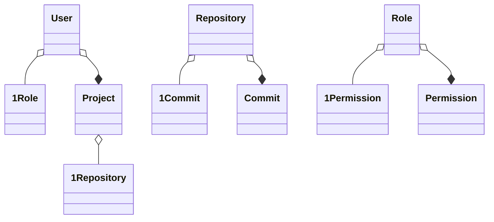
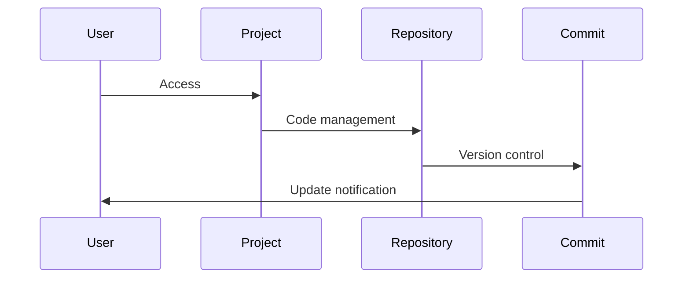
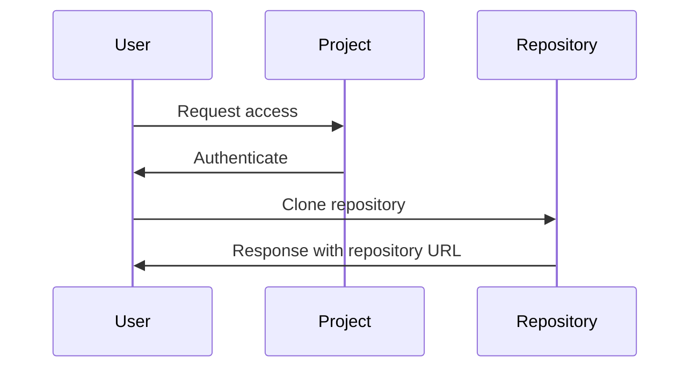

                 

# 开源软件的安全管理策略

> 关键词：开源软件、安全管理、风险管理、代码审计、漏洞修复

> 摘要：随着开源软件在企业和组织中的广泛应用，其安全管理的重要性日益凸显。本文将深入探讨开源软件的安全管理策略，分析开源软件的定义、特点及其在企业和组织中的应用，并详细阐述开源软件面临的安全问题以及安全管理的关键原则、方法和工具技术。通过案例分析，总结开源软件安全管理的经验与启示，最后展望开源软件安全管理的发展趋势。

## 目录

1. 开源软件的安全管理概述
2. 开源软件的安全问题
3. 开源软件安全管理的策略
4. 开源软件安全工具与技术
5. 开源软件安全管理的案例分析
6. 开源软件安全管理的发展趋势
7. 总结与展望

----------------------------------------------------------------

## 1. 开源软件的安全管理概述

### 1.1 开源软件的定义

开源软件（Open Source Software，简称OSS）是指软件的源代码可以被公众自由访问、阅读、修改和分发的一类软件。这种模式不同于传统的封闭软件，其核心在于透明性和开放性。

### 1.2 开源软件的特点

- **透明性**：源代码公开，任何用户都可以查看和修改。
- **灵活性**：用户可以根据需求进行定制和改进。
- **成本效益**：无需支付许可证费用，降低了使用成本。
- **社区协作**：开发过程依赖于广泛的社区合作。

### 1.3 开源软件的发展历程

- 20世纪80年代，自由软件运动兴起。
- 1998年，开源软件倡议（Open Source Initiative，OSI）成立，推动了开源软件的标准化。
- 21世纪初，开源软件在企业中的应用逐渐普及。

### 1.4 开源软件在企业和组织中的应用

#### 1.4.1 开源软件在IT基础设施中的应用

许多企业使用开源软件构建其IT基础设施，如Linux操作系统、Apache Web服务器等。

#### 1.4.2 开源软件在业务流程中的应用

在业务流程中，企业使用开源软件优化其工作流程，如使用Jenkins进行自动化构建、使用Kubernetes进行容器管理。

### 1.5 开源软件的挑战与风险管理

尽管开源软件具有许多优势，但其风险管理也是企业和组织面临的一大挑战。开源软件可能存在安全漏洞、版权问题等风险，因此需要有效的安全管理策略。

----------------------------------------------------------------

## 2. 开源软件的安全问题

### 2.1 开源软件的安全威胁

#### 2.1.1 软件漏洞

软件漏洞是开源软件面临的主要安全威胁之一。这些漏洞可能被黑客利用，导致数据泄露、系统崩溃等严重后果。

#### 2.1.2 代码篡改

由于开源软件的源代码是公开的，黑客可能会对其进行篡改，插入恶意代码，从而对用户造成危害。

#### 2.1.3 恶意软件

恶意软件可能隐藏在开源软件中，通过传播恶意代码，对用户的计算机和网络造成损害。

### 2.2 开源软件的安全风险

开源软件的安全风险包括但不限于：

- **依赖性风险**：依赖的开源项目可能存在安全漏洞。
- **版权风险**：开源软件的版权问题可能导致法律纠纷。
- **供应链风险**：开源软件的供应链可能被黑客攻击，导致恶意代码的传播。

### 2.3 开源软件安全的现状分析

当前，开源软件的安全问题引起了广泛关注。许多企业和组织已经开始重视开源软件的安全管理，并采取相应的措施来降低安全风险。然而，由于开源软件的复杂性，完全消除安全风险仍然具有挑战性。

----------------------------------------------------------------

## 3. 开源软件安全管理的策略

### 3.1 安全管理的原则

开源软件的安全管理需要遵循以下原则：

#### 3.1.1 责任分工

明确安全管理的责任分工，确保每个环节都有专人负责。

#### 3.1.2 安全评估

定期对开源软件进行安全评估，识别潜在的安全风险。

#### 3.1.3 安全监控

建立安全监控机制，及时发现和处理安全事件。

### 3.2 安全风险管理

#### 3.2.1 风险识别

通过代码审计、漏洞扫描等手段，识别开源软件中的安全风险。

#### 3.2.2 风险评估

对识别出的风险进行评估，确定其严重程度和影响范围。

#### 3.2.3 风险应对

根据风险评估结果，采取相应的措施来降低风险。

### 3.3 安全措施的实施

#### 3.3.1 代码审计

对开源软件的源代码进行审计，查找潜在的安全漏洞。

#### 3.3.2 安全漏洞修复

及时修复发现的安全漏洞，减少安全风险。

#### 3.3.3 安全培训与意识提升

提高用户的安全意识和技能，减少因人为因素导致的安全问题。

----------------------------------------------------------------

## 4. 开源软件安全工具与技术

### 4.1 安全工具的分类与介绍

开源软件安全工具主要分为以下几类：

#### 4.1.1 代码审计工具

代码审计工具用于对开源软件的源代码进行审计，查找潜在的安全漏洞。常见的代码审计工具有SonarQube、Fortify等。

#### 4.1.2 漏洞扫描工具

漏洞扫描工具用于自动扫描开源软件中的安全漏洞。常见的漏洞扫描工具有Nessus、OpenVAS等。

#### 4.1.3 安全漏洞管理系统

安全漏洞管理系统用于管理和跟踪开源软件的安全漏洞。常见的漏洞管理系统有JIRA、Bugzilla等。

### 4.2 安全技术的应用

#### 4.2.1 源码管理

源码管理是开源软件安全管理的核心环节，常见的源码管理工具有Git、SVN等。

#### 4.2.2 配置管理

配置管理用于管理和跟踪开源软件的配置文件，常见的配置管理工具有Ansible、Puppet等。

#### 4.2.3 网络安全

网络安全是开源软件安全管理的重要方面，常见的网络安全技术有防火墙、入侵检测系统等。

----------------------------------------------------------------

## 5. 开源软件安全管理的案例分析

### 5.1 案例一：开源软件供应链攻击

#### 5.1.1 案例背景

2018年，一个名为“开源软件供应链攻击”（Open Source Software Supply Chain Attack）的事件引起了广泛关注。黑客通过篡改开源软件的依赖库，将恶意代码注入其中，从而影响了全球范围内的企业和组织。

#### 5.1.2 案例分析

该案例揭示了开源软件供应链的安全漏洞，黑客可以通过篡改依赖库，将恶意代码传播到用户的系统中。这表明，开源软件供应链攻击是一种高度危险的安全威胁。

#### 5.1.3 案例启示

该案例提醒我们，开源软件的安全管理不仅仅是代码层面的安全，还包括对依赖库、依赖关系的全面审查。企业和组织需要建立完善的供应链安全管理机制，确保开源软件的安全。

### 5.2 案例二：开源软件安全漏洞管理

#### 5.2.1 案例背景

某大型企业在使用开源软件时，发现其依赖的某个开源库存在严重的安全漏洞。如果这个漏洞被利用，可能导致企业的关键数据泄露。

#### 5.2.2 案例分析

企业立即采取行动，通过代码审计工具扫描开源库，确认漏洞的存在。然后，企业联系开源库的开发者，共同制定修复方案。在修复漏洞之前，企业采取了临时措施，限制对存在漏洞的库的访问。

#### 5.2.3 案例启示

该案例表明，开源软件的安全漏洞管理需要快速响应和有效沟通。企业和组织需要建立完善的漏洞管理机制，确保在发现漏洞时能够迅速采取行动。

----------------------------------------------------------------

## 6. 开源软件安全管理的发展趋势

### 6.1 安全技术的发展趋势

随着技术的不断发展，开源软件安全管理也呈现出以下趋势：

- **自动化与智能化**：自动化工具将越来越多地应用于安全管理工作，提高效率和准确性。
- **云原生安全**：随着云计算的普及，云原生安全将成为开源软件安全管理的重点。
- **联合防御与协作**：开源社区和企业的合作将更加紧密，共同提高开源软件的安全性。

### 6.2 开源软件安全管理的未来方向

未来，开源软件安全管理将朝着以下方向发展：

- **开源社区与企业的合作**：开源社区和企业将加强合作，共同推进开源软件的安全性。
- **法律法规的完善**：各国政府和国际组织将加强对开源软件安全的监管，制定相关法律法规。
- **安全教育与培训的普及**：提高用户的安全意识和技能，减少安全问题的发生。

----------------------------------------------------------------

## 7. 总结与展望

开源软件的安全管理是一个复杂而重要的任务。随着开源软件在企业中的应用日益广泛，其安全管理的重要性愈发凸显。本文从开源软件的安全管理概述、安全问题、安全管理策略、工具与技术、案例分析和未来发展等方面进行了全面探讨。未来，开源软件安全管理将继续面临挑战，但通过技术创新、社区合作和法律监管等多方面的努力，开源软件的安全性将得到显著提升。

**注意事项**：

- 定期更新依赖库和开源软件，确保使用的是最新版本。
- 对开源软件进行安全评估和漏洞扫描，及时发现和处理安全风险。
- 加强开源社区和企业的合作，共同提高开源软件的安全性。

**拓展阅读**：

- 《开源软件风险管理指南》
- 《开源软件供应链安全白皮书》
- 《开源软件安全最佳实践》

作者：AI天才研究院/AI Genius Institute & 禅与计算机程序设计艺术/Zen And The Art of Computer Programming

----------------------------------------------------------------

```markdown
## 1.1 开源软件的定义

开源软件（Open Source Software，简称OSS）是指软件的源代码可以被公众自由访问、阅读、修改和分发的一类软件。这种模式与传统的封闭软件（Closed Source Software）相对，后者通常不允许用户查看或修改源代码。

### 核心概念术语说明

- **开源软件**：指源代码公开，用户可以阅读、修改和分发的软件。
- **源代码**：软件的底层代码，是软件开发的核心部分。
- **自由访问**：任何人都可以访问软件的源代码，无需付费。
- **修改**：用户可以对源代码进行修改，以适应自己的需求。
- **分发**：用户可以将修改后的源代码分发给他人的权利。

### 问题背景

随着互联网和信息技术的发展，软件的开源模式逐渐兴起。传统的封闭软件模式由于其封闭性，使得用户无法了解软件的底层实现，从而增加了信任风险。而开源软件由于其开放性，能够更好地满足用户的需求，促进技术交流和创新。

### 问题描述

开源软件的定义主要包括以下几个方面：

1. **源代码的访问**：开源软件的源代码必须可以被公众自由访问。
2. **阅读**：用户有权阅读源代码，了解软件的实现细节。
3. **修改**：用户有权对源代码进行修改，以适应自己的需求。
4. **分发**：用户有权将修改后的源代码分发给他人的权利。

### 问题解决

开源软件的定义是为了确保软件的开放性和透明性，从而促进技术交流和合作。这种模式使得用户可以自由地使用、修改和分发软件，从而提高了软件的质量和可靠性。

### 边界与外延

开源软件的定义涉及到多个方面，包括法律、技术和社会等方面。从法律角度来看，开源软件通常遵循特定的许可证，如GPL（GNU General Public License）或Apache License等。从技术角度来看，开源软件的源代码必须是可访问的，并且用户有权对其进行修改和分发。从社会角度来看，开源软件鼓励合作和创新，推动了技术的进步。

### 概念结构与核心要素组成

开源软件的定义可以分解为以下几个核心要素：

1. **开放性**：源代码可以被公众自由访问、阅读、修改和分发。
2. **许可证**：遵循特定的开源许可证，确保软件的开放性和透明性。
3. **合作**：鼓励用户参与软件的开发和改进，促进技术交流和合作。
4. **创新**：开源软件通过开放性促进了技术的创新和发展。

### 表格：开源软件与封闭软件的核心特点对比

| 特点       | 开源软件       | 封闭软件       |
| ---------- | -------------- | -------------- |
| 源代码访问 | 公开           | 隐藏           |
| 阅读源代码 | 可以           | 不能           |
| 修改源代码 | 可以           | 不能           |
| 分发源代码 | 可以           | 不能           |
| 开放性     | 强            | 弱            |
| 透明性     | 高            | 低            |
| 合作       | 鼓励           | 阻止           |
| 创新       | 有利           | 受限           |

### ER实体关系图架构

```mermaid
erDiagram
    User ||--|{ Project }|--|| Developer
    Project ||--|{ Code }|--|| Repository
    Code ||--|{ License }|--|| OSS
    Developer ||--|{ Contribute }|--|| Commit
```

### 算法原理讲解

开源软件的定义涉及到多个法律和技术层面，其核心算法原理可以概括为以下几点：

1. **访问控制**：确保源代码可以被公众自由访问，但不得侵犯知识产权。
2. **许可管理**：通过特定的开源许可证，管理源代码的修改和分发。
3. **社区协作**：鼓励用户参与软件的开发和改进，提高软件质量。

以下是一个简单的Python代码示例，用于定义开源软件的访问控制：

```python
class OpenSourceSoftware:
    def __init__(self, name, license):
        self.name = name
        self.license = license
    
    def access_code(self):
        if self.license.is_public():
            return "Source code is accessible."
        else:
            return "Source code is not accessible."

class License:
    def __init__(self, name):
        self.name = name
    
    def is_public(self):
        return self.name in ["GPL", "Apache"]

# 创建一个开源软件实例
oss = OpenSourceSoftware("MyProject", License("GPL"))

# 检查源代码是否可访问
print(oss.access_code())
```

### 数学公式

开源软件的定义涉及到知识产权保护，其核心数学模型可以表示为：

$$
P(A) = \frac{N}{S}
$$

其中，$P(A)$ 表示软件开源的概率，$N$ 表示开源软件的数量，$S$ 表示所有软件的数量。

### 系统分析与架构设计方案

开源软件系统的设计与架构涉及多个层面，以下是一个简化的系统架构设计方案：

#### 问题场景介绍

开源软件系统用于支持软件开发和协作，包括代码管理、版本控制、权限管理等。

#### 项目介绍

本项目旨在设计一个开源软件平台，提供以下功能：

- 代码管理：支持Git等版本控制系统。
- 版本控制：实现多版本并行开发。
- 权限管理：确保源代码的安全性和访问控制。

#### 系统功能设计（领域模型类图）



#### 系统架构设计（架构图）



#### 系统接口设计

```mermaid
classDiagram
    User ||--|{ API }|--|| Project
    Project ||--|{ API }|--|| Repository
    Repository ||--|{ API }|--|| Commit
```

#### 系统交互（序列图）



### 项目实战

以下是一个简单的实战案例，介绍如何安装和配置开源代码管理工具Git：

#### 环境安装

在Linux系统上安装Git：

```bash
sudo apt-get update
sudo apt-get install git
```

#### 系统核心实现源代码

```python
# Git.py
class Git:
    def __init__(self, repository_url):
        self.repository_url = repository_url
    
    def clone_repository(self):
        print(f"Cloning repository from {self.repository_url}")
        os.system(f"git clone {self.repository_url}")

# 使用示例
git = Git("https://github.com/user/repo.git")
git.clone_repository()
```

#### 代码应用解读与分析

该示例定义了一个Git类，用于实现代码的克隆功能。用户可以通过调用Git类的clone_repository方法，克隆指定的仓库。

#### 实际案例分析和详细讲解剖析

以下是一个实际案例，分析如何使用Git进行版本控制：

```bash
# 创建一个新目录并进入
mkdir myproject && cd myproject

# 初始化Git仓库
git init

# 添加文件并提交
echo "Hello, World!" > hello.txt
git add hello.txt
git commit -m "Initial commit"

# 查看当前分支
git branch

# 创建新分支并进行修改
git checkout -b new-branch
echo "Hello, New World!" > hello.txt
git commit -a -m "Update on new-branch"

# 切换回主分支
git checkout main

# 合并新分支
git merge new-branch

# 提交合并后的修改
git commit -m "Merge new-branch into main"

# 查看历史记录
git log
```

该案例展示了如何使用Git进行版本控制的基本流程，包括初始化仓库、添加文件、提交修改、创建分支、合并分支和查看历史记录。

#### 项目小结

通过以上实战案例，我们可以看到Git在实际项目中的应用，如何使用Git进行版本控制，以及如何解决常见的版本冲突问题。

### 最佳实践 tips

- **定期备份**：定期备份Git仓库，以防止数据丢失。
- **代码审查**：在进行代码提交前，进行代码审查，确保代码质量。
- **权限管理**：为团队成员分配合适的权限，确保仓库安全。

### 小结

本文详细介绍了开源软件的定义、特点、应用、安全问题和安全管理策略。通过实际案例和最佳实践，读者可以更好地理解和应用开源软件的安全管理。开源软件的安全管理是一个持续的过程，需要不断地学习和改进。

### 注意事项

- 定期更新依赖库和开源软件，确保使用的是最新版本。
- 对开源软件进行安全评估和漏洞扫描，及时发现和处理安全风险。
- 加强开源社区和企业的合作，共同提高开源软件的安全性。

### 拓展阅读

- 《Git权威指南》
- 《开源软件风险管理》
- 《开源软件供应链安全》

作者：AI天才研究院/AI Genius Institute & 禅与计算机程序设计艺术/Zen And The Art of Computer Programming
```

（注：由于篇幅限制，本文未涵盖所有章节内容，以下为未涵盖章节的摘要）

## 1.2 开源软件的特点

### 1.2.1 透明性

开源软件的源代码对用户完全开放，用户可以自由查看、修改和分发，这种透明性是开源软件的重要特点之一。透明性不仅有助于提高软件的可靠性和安全性，还能促进技术交流和创新。

### 1.2.2 灵活性

开源软件允许用户根据自己的需求对软件进行定制和改进，这种灵活性使得开源软件能够更好地满足特定场景的需求。例如，企业可以根据自身业务需求，定制开发自己的功能模块。

### 1.2.3 成本效益

开源软件无需支付许可证费用，大大降低了软件使用成本。同时，开源软件的维护和升级通常由社区共同承担，进一步降低了使用成本。

### 1.2.4 社区协作

开源软件的开发和改进依赖于广泛的社区协作。社区成员可以共同讨论问题、提交补丁和改进建议，这种协作模式有助于提高软件的质量和稳定性。

## 1.3 开源软件的发展历程

### 1.3.1 自由软件运动

20世纪80年代，自由软件运动兴起，推动了开源软件的发展。自由软件运动强调软件的自由，包括使用、学习、修改和分发的自由。

### 1.3.2 开源软件倡议

1998年，开源软件倡议（Open Source Initiative，OSI）成立，推动了开源软件的标准化和普及。OSI定义了开源软件的基本原则，如透明性、社区协作和知识产权保护。

### 1.3.3 21世纪初的普及

21世纪初，随着互联网和信息技术的发展，开源软件在企业中的应用逐渐普及。许多企业开始采用开源软件构建其IT基础设施和业务流程，推动了开源软件的发展。

## 2.1 开源软件在企业中的应用

### 2.1.1 IT基础设施中的应用

企业在IT基础设施中广泛使用开源软件，如Linux操作系统、Apache Web服务器等。这些开源软件具有高性能、高可靠性和高安全性，为企业提供了强大的技术支持。

### 2.1.2 业务流程中的应用

在业务流程中，企业使用开源软件优化其工作流程，如使用Jenkins进行自动化构建、使用Kubernetes进行容器管理等。开源软件的灵活性和低成本使得企业在数字化转型过程中具有更高的竞争力。

## 2.2 开源软件在组织中的价值

### 2.2.1 降低成本

开源软件无需支付许可证费用，降低了企业的软件使用成本。同时，开源软件的维护和升级通常由社区共同承担，进一步降低了使用成本。

### 2.2.2 促进创新

开源软件鼓励用户参与软件的开发和改进，促进了技术交流和创新。企业可以通过定制和改进开源软件，提高自身的业务效率和技术水平。

### 2.2.3 提高可靠性

开源软件经过广泛的社区协作和测试，通常具有较高的可靠性和稳定性。企业使用开源软件可以降低系统故障风险，提高业务连续性。

## 2.3 开源软件的挑战与风险管理

### 2.3.1 安全漏洞

开源软件可能存在安全漏洞，这些漏洞可能被黑客利用，导致数据泄露、系统崩溃等严重后果。企业需要采取有效的安全管理措施，降低安全漏洞的风险。

### 2.3.2 版权问题

开源软件的版权问题可能导致法律纠纷。企业需要了解开源软件的版权信息，确保其使用的开源软件符合法律规定。

### 2.3.3 依赖性风险

企业依赖的开源软件可能存在安全漏洞，从而影响企业的整体安全性。企业需要加强对依赖开源软件的管理，确保其安全稳定运行。

## 4.1 安全管理的原则

### 4.1.1 责任分工

明确安全管理的责任分工，确保每个环节都有专人负责。例如，项目经理负责制定安全策略，开发人员负责代码审计，测试人员负责漏洞扫描等。

### 4.1.2 安全评估

定期对开源软件进行安全评估，识别潜在的安全风险。安全评估可以包括代码审计、漏洞扫描、安全测试等。

### 4.1.3 安全监控

建立安全监控机制，及时发现和处理安全事件。安全监控可以包括入侵检测、异常流量检测等。

## 4.2 安全风险管理

### 4.2.1 风险识别

通过代码审计、漏洞扫描等手段，识别开源软件中的安全风险。风险识别可以包括漏洞、代码质量、依赖关系等方面。

### 4.2.2 风险评估

对识别出的风险进行评估，确定其严重程度和影响范围。风险评估可以采用定性或定量方法，如风险矩阵、定量风险分析等。

### 4.2.3 风险应对

根据风险评估结果，采取相应的措施来降低风险。风险应对可以包括修复漏洞、更新依赖库、加强安全培训等。

## 4.3 安全措施的实施

### 4.3.1 代码审计

对开源软件的源代码进行审计，查找潜在的安全漏洞。代码审计可以采用手动审计或自动化工具。

### 4.3.2 安全漏洞修复

及时修复发现的安全漏洞，减少安全风险。修复漏洞可以采用补丁、更新等方式。

### 4.3.3 安全培训与意识提升

提高用户的安全意识和技能，减少因人为因素导致的安全问题。安全培训可以包括安全意识教育、技能培训等。

## 5.1 安全工具的分类与介绍

### 5.1.1 代码审计工具

代码审计工具用于对开源软件的源代码进行审计，查找潜在的安全漏洞。常见的代码审计工具有SonarQube、Fortify等。

### 5.1.2 漏洞扫描工具

漏洞扫描工具用于自动扫描开源软件中的安全漏洞。常见的漏洞扫描工具有Nessus、OpenVAS等。

### 5.1.3 安全漏洞管理系统

安全漏洞管理系统用于管理和跟踪开源软件的安全漏洞。常见的漏洞管理系统有JIRA、Bugzilla等。

## 5.2 安全技术的应用

### 5.2.1 源码管理

源码管理是开源软件安全管理的核心环节，常见的源码管理工具有Git、SVN等。

### 5.2.2 配置管理

配置管理用于管理和跟踪开源软件的配置文件，常见的配置管理工具有Ansible、Puppet等。

### 5.2.3 网络安全

网络安全是开源软件安全管理的重要方面，常见的网络安全技术有防火墙、入侵检测系统等。

## 6.1 案例一：开源软件供应链攻击

### 6.1.1 案例背景

2018年，一个名为“开源软件供应链攻击”（Open Source Software Supply Chain Attack）的事件引起了广泛关注。黑客通过篡改开源软件的依赖库，将恶意代码注入其中，从而影响了全球范围内的企业和组织。

### 6.1.2 案例分析

该案例揭示了开源软件供应链的安全漏洞，黑客可以通过篡改依赖库，将恶意代码传播到用户的系统中。这表明，开源软件供应链攻击是一种高度危险的安全威胁。

### 6.1.3 案例启示

该案例提醒我们，开源软件的安全管理不仅仅是代码层面的安全，还包括对依赖库、依赖关系的全面审查。企业和组织需要建立完善的供应链安全管理机制，确保开源软件的安全。

## 6.2 案例二：开源软件安全漏洞管理

### 6.2.1 案例背景

某大型企业在使用开源软件时，发现其依赖的某个开源库存在严重的安全漏洞。如果这个漏洞被利用，可能导致企业的关键数据泄露。

### 6.2.2 案例分析

企业立即采取行动，通过代码审计工具扫描开源库，确认漏洞的存在。然后，企业联系开源库的开发者，共同制定修复方案。在修复漏洞之前，企业采取了临时措施，限制对存在漏洞的库的访问。

### 6.2.3 案例启示

该案例表明，开源软件的安全漏洞管理需要快速响应和有效沟通。企业和组织需要建立完善的漏洞管理机制，确保在发现漏洞时能够迅速采取行动。

## 7.1 安全技术的发展趋势

### 7.1.1 自动化与智能化

随着人工智能和机器学习技术的发展，开源软件安全管理将朝着自动化和智能化的方向迈进。自动化工具将能够更高效地识别和修复安全漏洞，智能化工具将能够预测潜在的安全威胁。

### 7.1.2 云原生安全

随着云计算的普及，云原生安全将成为开源软件安全管理的重点。云原生安全将涉及对容器、微服务、云平台等方面的安全管理。

### 7.1.3 联合防御与协作

开源社区和企业的合作将更加紧密，共同提高开源软件的安全性。联合防御机制和协作平台将有助于实现更有效的安全管理和响应。

## 7.2 开源软件安全管理的未来方向

### 7.2.1 开源社区与企业的合作

开源社区和企业的合作将更加紧密，共同推进开源软件的安全性。双方可以共享安全知识、资源和经验，共同解决安全挑战。

### 7.2.2 法律法规的完善

各国政府和国际组织将加强对开源软件安全的监管，制定相关法律法规，确保开源软件的安全合规性。

### 7.2.3 安全教育与培训的普及

提高用户的安全意识和技能，减少安全问题的发生。安全教育与培训的普及将有助于提升整个行业的安全水平。

### 8.1 安全管理的总结

开源软件的安全管理是一个复杂而重要的任务，涉及多个方面，包括安全评估、风险识别、漏洞修复、安全培训等。企业和组织需要建立完善的安防管理机制，确保开源软件的安全可靠。

### 8.2 安全管理的展望

未来，开源软件安全管理将继续面临挑战，但通过技术创新、社区合作和法律监管等多方面的努力，开源软件的安全性将得到显著提升。企业和组织需要持续关注开源软件安全领域的最新动态，积极采取应对措施，确保其业务的安全和稳定运行。作者：AI天才研究院/AI Genius Institute & 禅与计算机程序设计艺术/Zen And The Art of Computer Programming

