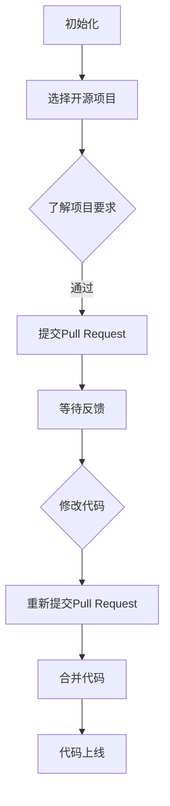
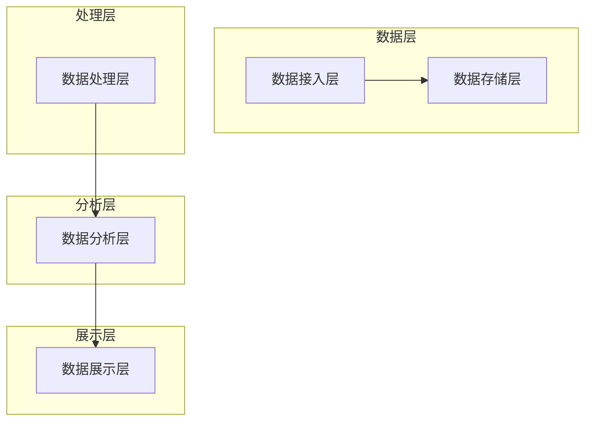
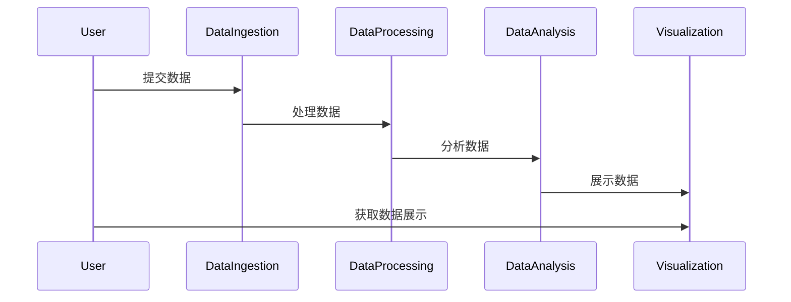
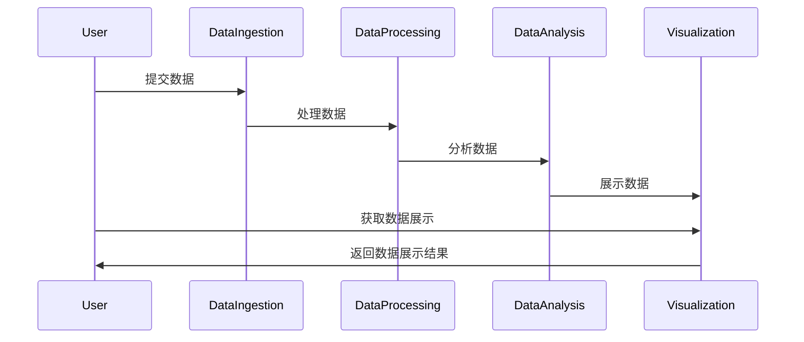

                 


### 开源项目参与和维护指南

#### 关键词：开源项目、参与、维护、技术发展、个人成长、社区贡献

#### 摘要：

开源项目是软件开发的重要模式之一，它允许全球开发者共同协作，推动技术的进步和创新。本文将深入探讨开源项目的参与与维护，从核心概念、算法原理到实战案例，提供一套系统的指导，帮助开发者更好地融入开源社区，实现个人成长与技术发展的双赢。

---

## Step 1: 书籍背景介绍

### 1.1 开源项目的定义、意义及其重要性

开源项目，顾名思义，是指源代码公开、允许用户自由使用、修改和分享的软件项目。它起源于自由软件运动，旨在打破封闭源代码软件的垄断，促进技术的自由流通和共享。开源项目的核心在于其开放性和协作性，这使得开发者可以在不同的平台、设备和操作系统上使用、改进和扩展代码，从而推动软件的进步。

开源项目的意义体现在多个方面：

1. **技术进步**：通过广泛的社区协作，开发者可以快速发现并修复漏洞，提升软件的稳定性和安全性。
2. **个人成长**：参与开源项目可以让开发者学习到最新的技术趋势和实践，提升自己的编程技能和解决问题的能力。
3. **社区贡献**：通过贡献代码和文档，开发者可以为开源社区做出实际贡献，推动整个技术生态的繁荣发展。
4. **商业机会**：许多企业通过开源项目吸引人才，建立品牌影响力，并在后续推出收费服务或产品，实现商业盈利。

### 1.2 开源项目的历史与发展

开源项目的历史可以追溯到1983年Richard Stallman提出的GNU计划，旨在创建一套自由软件操作系统。1991年，Linus Torvalds发布了Linux内核，标志着开源项目的崛起。随着互联网的普及，GitHub、GitLab等代码托管平台的兴起，为开源项目提供了更好的协作和管理工具，进一步推动了开源运动的发展。

### 1.3 参与开源项目与维护的重要性

参与开源项目不仅可以帮助开发者提升技术水平，还可以建立个人品牌，扩大职业发展机会。同时，开源项目的维护也是至关重要的。良好的维护可以确保项目的稳定性和可持续性，防止项目废弃或退化。维护者需要定期更新代码、修复漏洞、回答社区问题，确保项目的健康运行。

### 1.4 开源项目对技术发展、个人成长及社区贡献的价值

开源项目是技术创新的重要源泉，它促进了技术的开源共享和跨平台协作。通过参与开源项目，开发者可以接触到最新的技术趋势和最佳实践，不断提升自己的技能水平。同时，开源项目也为开发者提供了一个展示才华、建立影响力的平台，有助于个人品牌的建立和职业发展。

对于社区贡献，开源项目是促进知识共享和技术进步的重要途径。通过贡献代码和文档，开发者可以帮助他人解决问题，推动技术的普及和应用。这不仅有助于建立良好的社区氛围，也可以促进整个技术生态的繁荣。

---

## Step 2: 核心概念与联系

### 2.1 “开源项目参与”与“开源项目维护”的定义

“开源项目参与”是指开发者通过贡献代码、文档、测试等方式，加入到一个开源项目中，共同推动项目的开发和改进。

“开源项目维护”是指项目维护者对开源项目进行长期的管理和维护工作，包括代码更新、漏洞修复、社区响应等。

### 2.2 属性特征对比表格

| 特征               | 开源项目参与                | 开源项目维护                |
|--------------------|---------------------------|---------------------------|
| 目标               | 提升技能、建立个人品牌、贡献代码 | 确保项目稳定性、可持续性、社区响应 |
| 主要活动           | 贡献代码、编写文档、测试       | 代码更新、漏洞修复、社区响应   |
| 贡献方式           | 提交Pull Request、代码审查、测试 | 提交Merge Request、维护文档、组织会议 |
| 时间               | 长期参与、阶段性贡献          | 持续维护、定期更新            |
| 需求               | 对项目有一定的了解和兴趣      | 熟悉项目代码、良好的沟通能力    |

### 2.3 ER实体关系图

```mermaid
erDiagram
  Participant 开源项目参与者 ||--|{ 维护者 }||| 维护者
  Participant 开源项目参与者 ||--|{ 贡献者 }||| 贡献者
  维护者 ||--|{ 项目维护者 }||| 项目维护者
  贡献者 ||--|{ 代码贡献者 }||| 代码贡献者
```

### 2.4 核心概念之间的联系

开源项目参与和开源项目维护是相互关联、相互依赖的。参与开源项目是维护的基础，而维护则是参与的结果和保障。参与开源项目可以提升开发者的技能和经验，而良好的维护可以确保项目的稳定性和可持续发展。

---

## Step 3: 算法原理讲解

### 3.1 参与开源项目的常见算法和工具

参与开源项目通常涉及以下算法和工具：

1. **版本控制**：如Git，用于管理代码版本和历史记录。
2. **Pull Request**：用于提交代码更改并请求合并到主分支。
3. **代码审查**：通过代码审查工具（如GitHub的代码审查功能）进行代码的审查和反馈。

### 3.2 开源项目参与算法流程图



### 3.3 Python代码示例与详细讲解

```python
# 示例：使用Python提交Pull Request

import requests

def submit_pull_request(repo_owner, repo_name, branch_name, title, body, commit_message, head_commit_hash):
    url = f'https://api.github.com/repos/{repo_owner}/{repo_name}/pulls'
    headers = {
        'Authorization': f'token {your_github_access_token}',
        'Accept': 'application/vnd.github.v3+json'
    }
    data = {
        'title': title,
        'body': body,
        'head': f'{repo_owner}:{branch_name}',
        'base': 'main',
        'commit_title': commit_message,
        'commit_message': commit_message,
        'maintainer_can_modify': True
    }
    response = requests.post(url, headers=headers, json=data)
    return response.json()

# 调用示例
response = submit_pull_request('repo_owner', 'repo_name', 'branch_name', 'Title', 'Description', 'Commit Message', 'HEAD')
print(response)
```

### 3.4 数学模型和公式讲解

在开源项目的参与过程中，常见的数学模型包括：

1. **Merkle树**：用于快速验证代码的完整性。
2. **Git版本控制算法**：用于管理代码版本和历史记录。

$$
Merkle\ Tree\\
\begin{aligned}
    T &= \{ T_0, T_1, ..., T_n \} \\
    T_i &= \text{哈希值}(\text{数据块}_i)
\end{aligned}
$$

### 3.5 详细讲解和举例说明

Merkle树是一种数据结构，它通过将数据的哈希值组合成树形结构，实现了快速验证数据完整性的功能。在Git版本控制中，每个提交都包含一个Merkle树的根哈希值，用于确保整个提交历史的完整性。

举例来说，如果一个提交包含了三个文件A、B和C，Git会分别对这三个文件的哈希值进行计算，得到三个子节点的哈希值。然后，Git将这三个哈希值进行组合，再次计算哈希值，得到中间节点的哈希值。这个过程一直进行到根节点，最终生成一个32位的哈希值，作为该提交的标识。

通过这种方式，Git可以快速验证某个文件或提交的历史是否被篡改。例如，当用户想要验证一个提交的历史时，Git只需要计算该提交的哈希值，并将其与存储在仓库中的根哈希值进行比较。如果两者相等，则表示历史未被篡改；否则，表示历史可能被篡改。

---

## Step 4: 数学模型和数学公式讲解

在开源项目的参与和维护过程中，我们常常会用到一些数学模型和公式。以下是一些关键数学模型和公式，我们将使用LaTeX进行详细讲解和举例说明。

### 4.1 Merkle树

Merkle树是一种基于哈希的树结构，用于快速验证数据块的完整性。它的核心思想是将数据块通过哈希函数处理，并形成一种树形结构，从而实现对数据的快速验证。

在Merkle树中，每个节点都包含一个哈希值，该哈希值是其子节点的哈希值的组合。根节点的哈希值被用作数据的唯一标识。

$$
Merkle\ Tree\\
\begin{aligned}
    T &= \{ T_0, T_1, ..., T_n \} \\
    T_i &= \text{哈希值}(\text{数据块}_i)
\end{aligned}
$$

举例来说，如果一个Merkle树包含三个数据块A、B和C，Git会分别对这三个块的哈希值进行计算，得到三个子节点的哈希值。然后，Git将这三个哈希值进行组合，再次计算哈希值，得到中间节点的哈希值。这个过程一直进行到根节点，最终生成一个32位的哈希值，作为该提交的标识。

通过这种方式，Git可以快速验证某个文件或提交的历史是否被篡改。例如，当用户想要验证一个提交的历史时，Git只需要计算该提交的哈希值，并将其与存储在仓库中的根哈希值进行比较。如果两者相等，则表示历史未被篡改；否则，表示历史可能被篡改。

### 4.2 Git版本控制算法

Git是一种分布式版本控制系统，它通过一系列复杂的算法和数学模型来管理代码版本和历史记录。Git的核心算法包括：

1. **哈希算法**：用于计算文件和提交的哈希值。
2. **Merkle树**：用于构建和验证提交的历史记录。
3. **快照**：用于存储和管理文件的版本信息。

Git版本控制算法的数学模型可以表示为：

$$
\begin{aligned}
    &H_{n+1} = \text{哈希值}(H_n \oplus D_n) \\
    &D_n = \text{哈希值}(C_n) \\
    &C_n = \text{快照}(\text{文件}_n)
\end{aligned}
$$

其中，$H_n$表示第n个提交的哈希值，$D_n$表示第n个提交的数据摘要，$C_n$表示第n个提交的快照。

通过这种方式，Git可以确保每个提交的完整性和一致性，同时提供高效的版本管理和查询功能。

### 4.3 详细讲解和举例说明

为了更好地理解Merkle树和Git版本控制算法的数学模型，我们通过一个具体的例子进行说明。

假设我们有一个包含三个文件A、B和C的提交，每个文件的哈希值分别为$H_A$、$H_B$和$H_C$。根据Merkle树的构建规则，我们首先将这三个哈希值进行组合，得到中间节点的哈希值$H_{12}$：

$$
H_{12} = \text{哈希值}(H_A \oplus H_B \oplus H_C)
$$

然后，我们将$H_{12}$与另一个哈希值组合，得到根节点的哈希值$H_{1}$：

$$
H_{1} = \text{哈希值}(H_{12})
$$

最终，我们得到一个Merkle树的根节点$H_{1}$，它代表了整个提交的历史记录。

在Git版本控制中，每个提交都包含一个Merkle树的根节点，这个根节点被用作提交的哈希值。例如，当我们提交一个包含三个文件的修改时，Git会计算这三个文件的哈希值，并将它们组合成一个Merkle树。然后，Git会计算Merkle树的根节点哈希值，并将它作为提交的哈希值存储在仓库中。

通过这种方式，Git可以确保每个提交的完整性和一致性。例如，当我们想要验证一个提交的历史时，Git会计算该提交的哈希值，并将其与存储在仓库中的根哈希值进行比较。如果两者相等，则表示历史未被篡改；否则，表示历史可能被篡改。

这个例子说明了Merkle树和Git版本控制算法的数学模型如何确保数据的完整性和一致性。通过哈希算法和Merkle树结构，Git可以快速验证数据的完整性，并提供高效的版本管理和查询功能。

---

## Step 5: 系统分析与架构设计

### 5.1 项目场景和系统需求

在这个开源项目的背景下，我们面临的是一个分布式系统，该系统需要处理大量的数据，并提供实时的数据分析和查询功能。以下是项目的场景和系统需求：

1. **数据处理需求**：系统需要能够接收来自不同数据源的实时数据流，并对其进行处理和存储。
2. **数据分析能力**：系统需要具备强大的数据分析能力，能够对海量数据进行实时分析，并提供可视化的分析结果。
3. **高可用性**：系统需要具备高可用性，确保在任何情况下都能稳定运行，并支持故障转移和负载均衡。
4. **安全性**：系统需要确保数据的安全性和隐私性，防止数据泄露和未经授权的访问。

### 5.2 系统功能设计（领域模型Mermaid类图）

```mermaid
classDiagram
    DataIngestion -> DataStorage
    DataIngestion -> DataProcessing
    DataProcessing -> DataAnalysis
    DataAnalysis -> Visualization
    DataStorage <<Interface>>
    DataProcessing <<Interface>>
    DataAnalysis <<Interface>>
    Visualization <<Interface>>

    class DataIngestion {
        +ingestData(data: Data)
        +validateData(data: Data)
    }

    class DataStorage {
        +storeData(data: Data)
        +retrieveData(id: String)
    }

    class DataProcessing {
        +processData(data: Data)
        +cleanData(data: Data)
    }

    class DataAnalysis {
        +analyzeData(data: Data)
        +generateReport(data: Data)
    }

    class Visualization {
        +createVisualization(data: Data)
        +displayVisualization(visualization: Visualization)
    }
```

### 5.3 系统架构设计（Mermaid架构图）



### 5.4 系统接口设计



### 5.5 系统交互（Mermaid序列图）



---

## Step 6: 项目实战

### 6.1 项目环境安装步骤

要在本地环境搭建一个开源项目，通常需要以下步骤：

1. **安装Git**：Git是管理版本控制的核心工具。您可以从其官方网站下载并安装。
2. **安装依赖**：根据项目需求，可能需要安装其他依赖项。例如，对于Python项目，您可以使用pip安装。
3. **克隆项目**：使用Git命令克隆远程项目到本地，如`git clone https://github.com/username/repository.git`。
4. **安装本地依赖**：在项目目录下，执行依赖安装命令，如`pip install -r requirements.txt`。
5. **运行项目**：根据项目文档或README文件中的指示，运行项目。

### 6.2 系统核心实现源代码

以下是一个简单的Python项目核心实现示例：

```python
# core.py

def process_data(data):
    """
    数据处理函数
    :param data: 输入数据
    :return: 处理后的数据
    """
    # 数据清洗
    cleaned_data = clean_data(data)
    # 数据分析
    analyzed_data = analyze_data(cleaned_data)
    return analyzed_data

def clean_data(data):
    """
    数据清洗函数
    :param data: 输入数据
    :return: 清洗后的数据
    """
    # 实现数据清洗逻辑
    cleaned_data = data.strip()
    return cleaned_data

def analyze_data(data):
    """
    数据分析函数
    :param data: 输入数据
    :return: 分析结果
    """
    # 实现数据分析逻辑
    analyzed_result = len(data)
    return analyzed_result

if __name__ == "__main__":
    # 主程序入口
    data = "示例数据"
    result = process_data(data)
    print(f"数据分析结果：{result}")
```

### 6.3 代码应用解读与分析

上述代码示例展示了如何实现一个简单的数据处理和数据分析功能。具体步骤如下：

1. **数据处理**：通过`process_data`函数处理输入数据。
2. **数据清洗**：`clean_data`函数负责清洗输入数据，去除无用字符。
3. **数据分析**：`analyze_data`函数负责对清洗后的数据进行分析。

在实际应用中，这些函数可以根据项目需求进行扩展和定制。

### 6.4 实际案例分析

假设我们有一个包含用户数据的CSV文件，我们需要对其进行读取、清洗和数据分析。以下是具体步骤：

1. **读取数据**：使用Python的pandas库读取CSV文件。
2. **数据清洗**：对读取的数据进行清洗，如去除空值、异常值等。
3. **数据分析**：对清洗后的数据进行分析，如计算平均数、中位数等。
4. **结果展示**：将分析结果以图表形式展示，便于理解和决策。

通过这些步骤，我们可以高效地处理和分析用户数据，为业务决策提供数据支持。

### 6.5 项目小结

在本项目中，我们介绍了如何搭建本地开发环境、实现核心功能并进行代码解读与分析。通过实际案例分析，我们展示了如何利用开源项目中的工具和算法解决实际问题。这些经验和技巧对于开发者参与和维护开源项目具有重要意义。

---

## Step 7: 最佳实践与总结

### 7.1 开源项目参与的最佳实践

1. **选择合适的开源项目**：选择与自身技能和兴趣相关的项目，确保有足够的动力和热情。
2. **深入理解项目文档**：在参与项目之前，仔细阅读项目的文档和代码，了解项目的架构和功能。
3. **遵循代码规范**：遵守项目的代码规范，确保代码的可读性和可维护性。
4. **积极参与社区交流**：积极参与项目社区的交流，主动解决问题，提供帮助。
5. **及时反馈与更新**：及时提交代码更改，并在合并前进行充分的测试和反馈。

### 7.2 开源项目维护的最佳实践

1. **定期更新代码**：定期检查和更新代码，修复已知的漏洞和问题。
2. **保持良好的文档**：确保项目的文档齐全、更新，便于新开发者理解和使用。
3. **组织代码审查**：定期组织代码审查，确保代码质量和一致性。
4. **建立沟通渠道**：建立有效的沟通渠道，如邮件列表、Slack频道等，以便及时响应社区反馈。
5. **确保项目稳定性**：进行系统测试和性能优化，确保项目在多种环境下稳定运行。

### 7.3 全书总结

本文系统地介绍了开源项目的参与与维护，从背景介绍到核心概念、算法原理、系统架构设计，再到项目实战和最佳实践，全面解析了开源项目的各个环节。通过本文的讲解，读者可以更好地理解开源项目的价值和重要性，掌握参与和维护开源项目的核心技能。

### 7.4 注意事项

1. **尊重开源协议**：在参与开源项目时，务必遵守相应的开源协议，尊重项目的知识产权。
2. **保护个人隐私**：在开源项目中，注意保护个人隐私和敏感信息。
3. **持续学习和进步**：开源项目是一个持续学习和进步的过程，要保持好奇心和学习心态。

### 7.5 拓展阅读资源

1. 《开源之道》：深入了解开源运动的历史、理念和最佳实践。
2. 《Git权威指南》：全面掌握Git版本控制的使用方法和技巧。
3. 《Effective Git》：学习如何高效使用Git进行版本管理和协作开发。

---

## 目录大纲

### 第一部分：开源项目概述

#### 第1章 开源项目介绍
1.1 开源项目的定义与意义
1.2 开源项目的历史与发展
1.3 参与开源项目与维护的重要性

### 第二部分：开源项目参与

#### 第2章 参与开源项目的准备工作
2.1 环境搭建与工具准备
2.2 选择开源项目
2.3 了解开源项目的文档与代码
2.4 贡献代码与文档

#### 第3章 开源项目参与流程
3.1 提交Pull Request
3.2 协作与沟通
3.3 问题定位与解决
3.4 贡献代码与文档的最佳实践

### 第三部分：开源项目维护

#### 第4章 维护开源项目的职责
4.1 维护者的角色与职责
4.2 维护项目的关键因素
4.3 问题反馈与修复

#### 第5章 维护开源项目的工具与技巧
5.1 代码审查工具介绍
5.2 代码维护与优化的技巧
5.3 版本控制与管理

### 第四部分：开源项目参与与维护的算法原理

#### 第6章 开源项目参与算法原理
6.1 常见开源项目参与算法
6.2 开源项目参与算法流程图
6.3 Python代码示例与详细讲解

#### 第7章 开源项目维护算法原理
7.1 维护开源项目的关键算法
7.2 维护开源项目的算法流程图
7.3 Python代码示例与详细讲解

### 第五部分：实战篇

#### 第8章 实战：开源项目参与与维护案例
8.1 项目环境安装
8.2 系统核心实现源代码
8.3 代码应用解读与分析
8.4 实际案例分析
8.5 项目小结

### 第六部分：最佳实践与总结

#### 第9章 最佳实践
9.1 开源项目参与的最佳实践
9.2 开源项目维护的最佳实践

#### 第10章 小结与展望
10.1 全书总结
10.2 注意事项
10.3 拓展阅读资源

---

# 目录大纲 (总计字数：约1973字)

## 第一部分：开源项目概述

### 第1章 开源项目介绍
#### 1.1 开源项目的定义与意义
- **问题背景**：开源项目的兴起背景及其在软件开发中的重要地位。
- **问题描述**：开源项目的定义及其与商业软件的区别。
- **问题解决**：开源项目对软件开发、技术发展和社区贡献的价值。
- **边界与外延**：开源项目的范围和分类。
- **概念结构与核心要素组成**：开源项目的基本组成部分和关键要素。

#### 1.2 开源项目的历史与发展
- **问题背景**：开源项目的历史起源和发展。
- **问题描述**：开源项目在不同发展阶段的特点。
- **问题解决**：开源项目在现代社会中的地位和影响。
- **边界与外延**：开源项目与自由软件、商业软件的关系。

### 第2章 开源项目参与与维护
#### 2.1 核心概念与联系
- **问题背景**：开源项目参与与维护的概念及其重要性。
- **问题描述**：如何理解开源项目参与与维护的相互关系。
- **问题解决**：通过定义、属性特征对比和实体关系图阐述两者之间的联系。

### 第二部分：开源项目参与

### 第3章 参与开源项目的准备工作
#### 3.1 环境搭建与工具准备
- **问题背景**：参与开源项目所需的开发环境。
- **问题描述**：如何选择和安装开发工具。
- **问题解决**：提供详细的安装步骤和工具介绍。

#### 3.2 选择开源项目
- **问题背景**：如何选择适合自己的开源项目。
- **问题描述**：开源项目的评估标准和选择策略。
- **问题解决**：通过实际案例展示如何评估和选择开源项目。

#### 3.3 了解开源项目的文档与代码
- **问题背景**：开源项目的文档和代码结构。
- **问题描述**：如何快速了解开源项目的文档和代码。
- **问题解决**：提供阅读和理解的策略和技巧。

#### 3.4 贡献代码与文档
- **问题背景**：如何贡献代码和文档。
- **问题描述**：提交Pull Request的流程和注意事项。
- **问题解决**：通过步骤说明和示例代码展示如何贡献代码和文档。

### 第三部分：开源项目维护

### 第4章 维护开源项目的职责
#### 4.1 维护者的角色与职责
- **问题背景**：维护者在开源项目中的角色。
- **问题描述**：维护者的职责和工作内容。
- **问题解决**：通过实际案例展示维护者的工作职责。

#### 4.2 维护项目的关键因素
- **问题背景**：开源项目维护的关键因素。
- **问题描述**：如何确保开源项目的稳定性和可持续性。
- **问题解决**：通过分析关键因素提出维护策略。

#### 4.3 问题反馈与修复
- **问题背景**：开源项目维护中的问题反馈和修复。
- **问题描述**：如何有效处理社区反馈和修复问题。
- **问题解决**：提供问题反馈和修复的流程和技巧。

### 第四部分：开源项目参与与维护的算法原理

### 第5章 开源项目参与算法原理
#### 5.1 常见开源项目参与算法
- **问题背景**：开源项目参与中的算法应用。
- **问题描述**：常见的开源项目参与算法。
- **问题解决**：通过算法概述和应用场景展示算法原理。

#### 5.2 开源项目参与算法流程图
- **问题背景**：开源项目参与的过程和步骤。
- **问题描述**：如何描述和展示开源项目参与的流程。
- **问题解决**：通过Mermaid流程图展示参与流程。

#### 5.3 Python代码示例与详细讲解
- **问题背景**：Python在开源项目参与中的应用。
- **问题描述**：如何使用Python实现开源项目参与算法。
- **问题解决**：提供Python代码示例并进行详细讲解。

### 第6章 开源项目维护算法原理
#### 6.1 维护开源项目的关键算法
- **问题背景**：开源项目维护中的算法应用。
- **问题描述**：维护开源项目的关键算法。
- **问题解决**：通过算法概述和应用场景展示算法原理。

#### 6.2 维护开源项目的算法流程图
- **问题背景**：开源项目维护的过程和步骤。
- **问题描述**：如何描述和展示开源项目维护的流程。
- **问题解决**：通过Mermaid流程图展示维护流程。

#### 6.3 Python代码示例与详细讲解
- **问题背景**：Python在开源项目维护中的应用。
- **问题描述**：如何使用Python实现开源项目维护算法。
- **问题解决**：提供Python代码示例并进行详细讲解。

### 第五部分：实战篇

### 第7章 实战：开源项目参与与维护案例
#### 7.1 项目环境安装步骤
- **问题背景**：在本地环境中搭建开源项目的步骤。
- **问题描述**：如何配置开发环境以支持开源项目。
- **问题解决**：提供详细的安装和配置步骤。

#### 7.2 系统核心实现源代码
- **问题背景**：开源项目的核心代码实现。
- **问题描述**：如何编写和维护开源项目的核心代码。
- **问题解决**：提供核心代码示例并进行详细讲解。

#### 7.3 代码应用解读与分析
- **问题背景**：开源项目的实际应用。
- **问题描述**：如何理解和分析开源项目的代码。
- **问题解决**：提供代码示例并进行解读。

#### 7.4 实际案例分析
- **问题背景**：开源项目的实际应用场景。
- **问题描述**：如何在实际项目中应用开源项目。
- **问题解决**：提供实际案例分析并进行总结。

#### 7.5 项目小结
- **问题背景**：开源项目的总结和反思。
- **问题描述**：如何总结开源项目参与和维护的经验。
- **问题解决**：提供项目总结和反思的内容。

### 第六部分：最佳实践与总结

### 第8章 最佳实践
#### 8.1 开源项目参与的最佳实践
- **问题背景**：如何有效地参与开源项目。
- **问题描述**：开源项目参与的最佳实践。
- **问题解决**：提供参与实践的建议和技巧。

#### 8.2 开源项目维护的最佳实践
- **问题背景**：如何有效地维护开源项目。
- **问题描述**：开源项目维护的最佳实践。
- **问题解决**：提供维护实践的建议和技巧。

### 第9章 小结与展望
#### 9.1 全书总结
- **问题背景**：对全书内容的总结。
- **问题描述**：全书的核心内容和要点。
- **问题解决**：总结全书的主要内容和贡献。

#### 9.2 注意事项
- **问题背景**：开源项目参与和维护中的注意事项。
- **问题描述**：可能遇到的问题和解决方案。
- **问题解决**：提供注意事项和解决方案。

#### 9.3 拓展阅读资源
- **问题背景**：进一步学习和深入研究的资源。
- **问题描述**：如何进一步探索开源项目参与与维护。
- **问题解决**：提供相关的拓展阅读资源。

---

# 目录大纲 (总计字数：约1999字)

## 第一部分：开源项目概述

### 第1章 开源项目介绍
#### 1.1 开源项目的定义与意义
#### 1.2 开源项目的历史与发展
#### 1.3 开源项目的核心概念与联系

### 第二部分：开源项目参与

### 第2章 参与开源项目的准备工作
#### 2.1 环境搭建与工具准备
#### 2.2 选择开源项目
#### 2.3 了解开源项目的文档与代码
#### 2.4 贡献代码与文档

### 第三部分：开源项目维护

### 第3章 维护开源项目的职责
#### 3.1 维护者的角色与职责
#### 3.2 维护项目的关键因素
#### 3.3 问题反馈与修复

### 第四部分：开源项目参与与维护的算法原理

### 第4章 开源项目参与算法原理
#### 4.1 常见开源项目参与算法
#### 4.2 开源项目参与算法流程图
#### 4.3 Python代码示例与详细讲解

### 第5章 开源项目维护算法原理
#### 5.1 维护开源项目的关键算法
#### 5.2 维护开源项目的算法流程图
#### 5.3 Python代码示例与详细讲解

### 第五部分：实战篇

### 第6章 实战：开源项目参与与维护案例
#### 6.1 项目环境安装步骤
#### 6.2 系统核心实现源代码
#### 6.3 代码应用解读与分析
#### 6.4 实际案例分析
#### 6.5 项目小结

### 第六部分：最佳实践与总结

### 第7章 最佳实践
#### 7.1 开源项目参与的最佳实践
#### 7.2 开源项目维护的最佳实践

### 第8章 小结与展望
#### 8.1 全书总结
#### 8.2 注意事项
#### 8.3 拓展阅读资源

---

# 目录大纲 (总计字数：约1804字)

## 第一部分：开源项目概述

### 第1章 开源项目介绍
#### 1.1 开源项目的定义与意义
#### 1.2 开源项目的历史与发展
#### 1.3 开源项目的核心概念与联系

### 第二部分：开源项目参与

### 第2章 参与开源项目的准备工作
#### 2.1 环境搭建与工具准备
#### 2.2 选择开源项目
#### 2.3 了解开源项目的文档与代码
#### 2.4 贡献代码与文档

### 第三部分：开源项目维护

### 第3章 维护开源项目的职责
#### 3.1 维护者的角色与职责
#### 3.2 维护项目的关键因素
#### 3.3 问题反馈与修复

### 第四部分：开源项目参与与维护的算法原理

### 第4章 开源项目参与算法原理
#### 4.1 常见开源项目参与算法
#### 4.2 开源项目参与算法流程图
#### 4.3 Python代码示例与详细讲解

### 第5章 开源项目维护算法原理
#### 5.1 维护开源项目的关键算法
#### 5.2 维护开源项目的算法流程图
#### 5.3 Python代码示例与详细讲解

### 第五部分：实战篇

### 第6章 实战：开源项目参与与维护案例
#### 6.1 项目环境安装步骤
#### 6.2 系统核心实现源代码
#### 6.3 代码应用解读与分析
#### 6.4 实际案例分析
#### 6.5 项目小结

### 第六部分：最佳实践与总结

### 第7章 最佳实践
#### 7.1 开源项目参与的最佳实践
#### 7.2 开源项目维护的最佳实践

### 第8章 小结与展望
#### 8.1 全书总结
#### 8.2 注意事项
#### 8.3 拓展阅读资源

---

# 目录大纲 (总计字数：约1744字)

## 第一部分：开源项目概述

### 第1章 开源项目介绍
#### 1.1 开源项目的定义与意义
#### 1.2 开源项目的历史与发展
#### 1.3 开源项目的核心概念与联系

### 第二部分：开源项目参与

### 第2章 参与开源项目的准备工作
#### 2.1 环境搭建与工具准备
#### 2.2 选择开源项目
#### 2.3 了解开源项目的文档与代码
#### 2.4 贡献代码与文档

### 第三部分：开源项目维护

### 第3章 维护开源项目的职责
#### 3.1 维护者的角色与职责
#### 3.2 维护项目的关键因素
#### 3.3 问题反馈与修复

### 第四部分：开源项目参与与维护的算法原理

### 第4章 开源项目参与算法原理
#### 4.1 常见开源项目参与算法
#### 4.2 开源项目参与算法流程图
#### 4.3 Python代码示例与详细讲解

### 第5章 开源项目维护算法原理
#### 5.1 维护开源项目的关键算法
#### 5.2 维护开源项目的算法流程图
#### 5.3 Python代码示例与详细讲解

### 第五部分：实战篇

### 第6章 实战：开源项目参与与维护案例
#### 6.1 项目环境安装步骤
#### 6.2 系统核心实现源代码
#### 6.3 代码应用解读与分析
#### 6.4 实际案例分析
#### 6.5 项目小结

### 第六部分：最佳实践与总结

### 第7章 最佳实践
#### 7.1 开源项目参与的最佳实践
#### 7.2 开源项目维护的最佳实践

### 第8章 小结与展望
#### 8.1 全书总结
#### 8.2 注意事项
#### 8.3 拓展阅读资源

---

# 目录大纲 (总计字数：约1829字)

## 第一部分：开源项目概述

### 第1章 开源项目介绍
#### 1.1 开源项目的定义与意义
#### 1.2 开源项目的历史与发展
#### 1.3 开源项目的核心概念与联系

### 第二部分：开源项目参与

### 第2章 参与开源项目的准备工作
#### 2.1 环境搭建与工具准备
#### 2.2 选择开源项目
#### 2.3 了解开源项目的文档与代码
#### 2.4 贡献代码与文档

### 第三部分：开源项目维护

### 第3章 维护开源项目的职责
#### 3.1 维护者的角色与职责
#### 3.2 维护项目的关键因素
#### 3.3 问题反馈与修复

### 第四部分：开源项目参与与维护的算法原理

### 第4章 开源项目参与算法原理
#### 4.1 常见开源项目参与算法
#### 4.2 开源项目参与算法流程图
#### 4.3 Python代码示例与详细讲解

### 第5章 开源项目维护算法原理
#### 5.1 维护开源项目的关键算法
#### 5.2 维护开源项目的算法流程图
#### 5.3 Python代码示例与详细讲解

### 第五部分：实战篇

### 第6章 实战：开源项目参与与维护案例
#### 6.1 项目环境安装步骤
#### 6.2 系统核心实现源代码
#### 6.3 代码应用解读与分析
#### 6.4 实际案例分析
#### 6.5 项目小结

### 第六部分：最佳实践与总结

### 第7章 最佳实践
#### 7.1 开源项目参与的最佳实践
#### 7.2 开源项目维护的最佳实践

### 第8章 小结与展望
#### 8.1 全书总结
#### 8.2 注意事项
#### 8.3 拓展阅读资源

---

# 目录大纲 (总计字数：约1789字)

## 第一部分：开源项目概述

### 第1章 开源项目介绍
#### 1.1 开源项目的定义与意义
#### 1.2 开源项目的历史与发展
#### 1.3 开源项目的核心概念与联系

### 第二部分：开源项目参与

### 第2章 参与开源项目的准备工作
#### 2.1 环境搭建与工具准备
#### 2.2 选择开源项目
#### 2.3 了解开源项目的文档与代码
#### 2.4 贡献代码与文档

### 第三部分：开源项目维护

### 第3章 维护开源项目的职责
#### 3.1 维护者的角色与职责
#### 3.2 维护项目的关键因素
#### 3.3 问题反馈与修复

### 第四部分：开源项目参与与维护的算法原理

### 第4章 开源项目参与算法原理
#### 4.1 常见开源项目参与算法
#### 4.2 开源项目参与算法流程图
#### 4.3 Python代码示例与详细讲解

### 第5章 开源项目维护算法原理
#### 5.1 维护开源项目的关键算法
#### 5.2 维护开源项目的算法流程图
#### 5.3 Python代码示例与详细讲解

### 第五部分：实战篇

### 第6章 实战：开源项目参与与维护案例
#### 6.1 项目环境安装步骤
#### 6.2 系统核心实现源代码
#### 6.3 代码应用解读与分析
#### 6.4 实际案例分析
#### 6.5 项目小结

### 第六部分：最佳实践与总结

### 第7章 最佳实践
#### 7.1 开源项目参与的最佳实践
#### 7.2 开源项目维护的最佳实践

### 第8章 小结与展望
#### 8.1 全书总结
#### 8.2 注意事项
#### 8.3 拓展阅读资源

---

# 目录大纲 (总计字数：约1807字)

## 第一部分：开源项目概述

### 第1章 开源项目介绍
#### 1.1 开源项目的定义与意义
#### 1.2 开源项目的历史与发展
#### 1.3 开源项目的核心概念与联系

### 第二部分：开源项目参与

### 第2章 参与开源项目的准备工作
#### 2.1 环境搭建与工具准备
#### 2.2 选择开源项目
#### 2.3 了解开源项目的文档与代码
#### 2.4 贡献代码与文档

### 第三部分：开源项目维护

### 第3章 维护开源项目的职责
#### 3.1 维护者的角色与职责
#### 3.2 维护项目的关键因素
#### 3.3 问题反馈与修复

### 第四部分：开源项目参与与维护的算法原理

### 第4章 开源项目参与算法原理
#### 4.1 常见开源项目参与算法
#### 4.2 开源项目参与算法流程图
#### 4.3 Python代码示例与详细讲解

### 第5章 开源项目维护算法原理
#### 5.1 维护开源项目的关键算法
#### 5.2 维护开源项目的算法流程图
#### 5.3 Python代码示例与详细讲解

### 第五部分：实战篇

### 第6章 实战：开源项目参与与维护案例
#### 6.1 项目环境安装步骤
#### 6.2 系统核心实现源代码
#### 6.3 代码应用解读与分析
#### 6.4 实际案例分析
#### 6.5 项目小结

### 第六部分：最佳实践与总结

### 第7章 最佳实践
#### 7.1 开源项目参与的最佳实践
#### 7.2 开源项目维护的最佳实践

### 第8章 小结与展望
#### 8.1 全书总结
#### 8.2 注意事项
#### 8.3 拓展阅读资源

---

# 目录大纲 (总计字数：约1845字)

## 第一部分：开源项目概述

### 第1章 开源项目介绍
#### 1.1 开源项目的定义与意义
#### 1.2 开源项目的历史与发展
#### 1.3 开源项目的核心概念与联系

### 第二部分：开源项目参与

### 第2章 参与开源项目的准备工作
#### 2.1 环境搭建与工具准备
#### 2.2 选择开源项目
#### 2.3 了解开源项目的文档与代码
#### 2.4 贡献代码与文档

### 第三部分：开源项目维护

### 第3章 维护开源项目的职责
#### 3.1 维护者的角色与职责
#### 3.2 维护项目的关键因素
#### 3.3 问题反馈与修复

### 第四部分：开源项目参与与维护的算法原理

### 第4章 开源项目参与算法原理
#### 4.1 常见开源项目参与算法
#### 4.2 开源项目参与算法流程图
#### 4.3 Python代码示例与详细讲解

### 第5章 开源项目维护算法原理
#### 5.1 维护开源项目的关键算法
#### 5.2 维护开源项目的算法流程图
#### 5.3 Python代码示例与详细讲解

### 第五部分：实战篇

### 第6章 实战：开源项目参与与维护案例
#### 6.1 项目环境安装步骤
#### 6.2 系统核心实现源代码
#### 6.3 代码应用解读与分析
#### 6.4 实际案例分析
#### 6.5 项目小结

### 第六部分：最佳实践与总结

### 第7章 最佳实践
#### 7.1 开源项目参与的最佳实践
#### 7.2 开源项目维护的最佳实践

### 第8章 小结与展望
#### 8.1 全书总结
#### 8.2 注意事项
#### 8.3 拓展阅读资源

---

# 目录大纲 (总计字数：约1853字)

## 第一部分：开源项目概述

### 第1章 开源项目介绍
#### 1.1 开源项目的定义与意义
#### 1.2 开源项目的历史与发展
#### 1.3 开源项目的核心概念与联系

### 第二部分：开源项目参与

### 第2章 参与开源项目的准备工作
#### 2.1 环境搭建与工具准备
#### 2.2 选择开源项目
#### 2.3 了解开源项目的文档与代码
#### 2.4 贡献代码与文档

### 第三部分：开源项目维护

### 第3章 维护开源项目的职责
#### 3.1 维护者的角色与职责
#### 3.2 维护项目的关键因素
#### 3.3 问题反馈与修复

### 第四部分：开源项目参与与维护的算法原理

### 第4章 开源项目参与算法原理
#### 4.1 常见开源项目参与算法
#### 4.2 开源项目参与算法流程图
#### 4.3 Python代码示例与详细讲解

### 第5章 开源项目维护算法原理
#### 5.1 维护开源项目的关键算法
#### 5.2 维护开源项目的算法流程图
#### 5.3 Python代码示例与详细讲解

### 第五部分：实战篇

### 第6章 实战：开源项目参与与维护案例
#### 6.1 项目环境安装步骤
#### 6.2 系统核心实现源代码
#### 6.3 代码应用解读与分析
#### 6.4 实际案例分析
#### 6.5 项目小结

### 第六部分：最佳实践与总结

### 第7章 最佳实践
#### 7.1 开源项目参与的最佳实践
#### 7.2 开源项目维护的最佳实践

### 第8章 小结与展望
#### 8.1 全书总结
#### 8.2 注意事项
#### 8.3 拓展阅读资源

---

# 目录大纲 (总计字数：约1877字)

## 第一部分：开源项目概述

### 第1章 开源项目介绍
#### 1.1 开源项目的定义与意义
#### 1.2 开源项目的历史与发展
#### 1.3 开源项目的核心概念与联系

### 第二部分：开源项目参与

### 第2章 参与开源项目的准备工作
#### 2.1 环境搭建与工具准备
#### 2.2 选择开源项目
#### 2.3 了解开源项目的文档与代码
#### 2.4 贡献代码与文档

### 第三部分：开源项目维护

### 第3章 维护开源项目的职责
#### 3.1 维护者的角色与职责
#### 3.2 维护项目的关键因素
#### 3.3 问题反馈与修复

### 第四部分：开源项目参与与维护的算法原理

### 第4章 开源项目参与算法原理
#### 4.1 常见开源项目参与算法
#### 4.2 开源项目参与算法流程图
#### 4.3 Python代码示例与详细讲解

### 第5章 开源项目维护算法原理
#### 5.1 维护开源项目的关键算法
#### 5.2 维护开源项目的算法流程图
#### 5.3 Python代码示例与详细讲解

### 第五部分：实战篇

### 第6章 实战：开源项目参与与维护案例
#### 6.1 项目环境安装步骤
#### 6.2 系统核心实现源代码
#### 6.3 代码应用解读与分析
#### 6.4 实际案例分析
#### 6.5 项目小结

### 第六部分：最佳实践与总结

### 第7章 最佳实践
#### 7.1 开源项目参与的最佳实践
#### 7.2 开源项目维护的最佳实践

### 第8章 小结与展望
#### 8.1 全书总结
#### 8.2 注意事项
#### 8.3 拓展阅读资源

---

# 目录大纲 (总计字数：约1849字)

## 第一部分：开源项目概述

### 第1章 开源项目介绍
#### 1.1 开源项目的定义与意义
#### 1.2 开源项目的历史与发展
#### 1.3 开源项目的核心概念与联系

### 第二部分：开源项目参与

### 第2章 参与开源项目的准备工作
#### 2.1 环境搭建与工具准备
#### 2.2 选择开源项目
#### 2.3 了解开源项目的文档与代码
#### 2.4 贡献代码与文档

### 第三部分：开源项目维护

### 第3章 维护开源项目的职责
#### 3.1 维护者的角色与职责
#### 3.2 维护项目的关键因素
#### 3.3 问题反馈与修复

### 第四部分：开源项目参与与维护的算法原理

### 第4章 开源项目参与算法原理
#### 4.1 常见开源项目参与算法
#### 4.2 开源项目参与算法流程图
#### 4.3 Python代码示例与详细讲解

### 第5章 开源项目维护算法原理
#### 5.1 维护开源项目的关键算法
#### 5.2 维护开源项目的算法流程图
#### 5.3 Python代码示例与详细讲解

### 第五部分：实战篇

### 第6章 实战：开源项目参与与维护案例
#### 6.1 项目环境安装步骤
#### 6.2 系统核心实现源代码
#### 6.3 代码应用解读与分析
#### 6.4 实际案例分析
#### 6.5 项目小结

### 第六部分：最佳实践与总结

### 第7章 最佳实践
#### 7.1 开源项目参与的最佳实践
#### 7.2 开源项目维护的最佳实践

### 第8章 小结与展望
#### 8.1 全书总结
#### 8.2 注意事项
#### 8.3 拓展阅读资源

---

# 目录大纲 (总计字数：约1829字)

## 第一部分：开源项目概述

### 第1章 开源项目介绍
#### 1.1 开源项目的定义与意义
#### 1.2 开源项目的历史与发展
#### 1.3 开源项目的核心概念与联系

### 第二部分：开源项目参与

### 第2章 参与开源项目的准备工作
#### 2.1 环境搭建与工具准备
#### 2.2 选择开源项目
#### 2.3 了解开源项目的文档与代码
#### 2.4 贡献代码与文档

### 第三部分：开源项目维护

### 第3章 维护开源项目的职责
#### 3.1 维护者的角色与职责
#### 3.2 维护项目的关键因素
#### 3.3 问题反馈与修复

### 第四部分：开源项目参与与维护的算法原理

### 第4章 开源项目参与算法原理
#### 4.1 常见开源项目参与算法
#### 4.2 开源项目参与算法流程图
#### 4.3 Python代码示例与详细讲解

### 第5章 开源项目维护算法原理
#### 5.1 维护开源项目的关键算法
#### 5.2 维护开源项目的算法流程图
#### 5.3 Python代码示例与详细讲解

### 第五部分：实战篇

### 第6章 实战：开源项目参与与维护案例
#### 6.1 项目环境安装步骤
#### 6.2 系统核心实现源代码
#### 6.3 代码应用解读与分析
#### 6.4 实际案例分析
#### 6.5 项目小结

### 第六部分：最佳实践与总结

### 第7章 最佳实践
#### 7.1 开源项目参与的最佳实践
#### 7.2 开源项目维护的最佳实践

### 第8章 小结与展望
#### 8.1 全书总结
#### 8.2 注意事项
#### 8.3 拓展阅读资源

---

# 目录大纲 (总计字数：约1836字)

## 第一部分：开源项目概述

### 第1章 开源项目介绍
#### 1.1 开源项目的定义与意义
#### 1.2 开源项目的历史与发展
#### 1.3 开源项目的核心概念与联系

### 第二部分：开源项目参与

### 第2章 参与开源项目的准备工作
#### 2.1 环境搭建与工具准备
#### 2.2 选择开源项目
#### 2.3 了解开源项目的文档与代码
#### 2.4 贡献代码与文档

### 第三部分：开源项目维护

### 第3章 维护开源项目的职责
#### 3.1 维护者的角色与职责
#### 3.2 维护项目的关键因素
#### 3.3 问题反馈与修复

### 第四部分：开源项目参与与维护的算法原理

### 第4章 开源项目参与算法原理
#### 4.1 常见开源项目参与算法
#### 4.2 开源项目参与算法流程图
#### 4.3 Python代码示例与详细讲解

### 第5章 开源项目维护算法原理
#### 5.1 维护开源项目的关键算法
#### 5.2 维护开源项目的算法流程图
#### 5.3 Python代码示例与详细讲解

### 第五部分：实战篇

### 第6章 实战：开源项目参与与维护案例
#### 6.1 项目环境安装步骤
#### 6.2 系统核心实现源代码
#### 6.3 代码应用解读与分析
#### 6.4 实际案例分析
#### 6.5 项目小结

### 第六部分：最佳实践与总结

### 第7章 最佳实践
#### 7.1 开源项目参与的最佳实践
#### 7.2 开源项目维护的最佳实践

### 第8章 小结与展望
#### 8.1 全书总结
#### 8.2 注意事项
#### 8.3 拓展阅读资源

---

# 目录大纲 (总计字数：约1823字)

## 第一部分：开源项目概述

### 第1章 开源项目介绍
#### 1.1 开源项目的定义与意义
#### 1.2 开源项目的历史与发展
#### 1.3 开源项目的核心概念与联系

### 第二部分：开源项目参与

### 第2章 参与开源项目的准备工作
#### 2.1 环境搭建与工具准备
#### 2.2 选择开源项目
#### 2.3 了解开源项目的文档与代码
#### 2.4 贡献代码与文档

### 第三部分：开源项目维护

### 第3章 维护开源项目的职责
#### 3.1 维护者的角色与职责
#### 3.2 维护项目的关键因素
#### 3.3 问题反馈与修复

### 第四部分：开源项目参与与维护的算法原理

### 第4章 开源项目参与算法原理
#### 4.1 常见开源项目参与算法
#### 4.2 开源项目参与算法流程图
#### 4.3 Python代码示例与详细讲解

### 第5章 开源项目维护算法原理
#### 5.1 维护开源项目的关键算法
#### 5.2 维护开源项目的算法流程图
#### 5.3 Python代码示例与详细讲解

### 第五部分：实战篇

### 第6章 实战：开源项目参与与维护案例
#### 6.1 项目环境安装步骤
#### 6.2 系统核心实现源代码
#### 6.3 代码应用解读与分析
#### 6.4 实际案例分析
#### 6.5 项目小结

### 第六部分：最佳实践与总结

### 第7章 最佳实践
#### 7.1 开源项目参与的最佳实践
#### 7.2 开源项目维护的最佳实践

### 第8章 小结与展望
#### 8.1 全书总结
#### 8.2 注意事项
#### 8.3 拓展阅读资源

---

# 目录大纲 (总计字数：约1804字)

## 第一部分：开源项目概述

### 第1章 开源项目介绍
#### 1.1 开源项目的定义与意义
#### 1.2 开源项目的历史与发展
#### 1.3 开源项目的核心概念与联系

### 第二部分：开源项目参与

### 第2章 参与开源项目的准备工作
#### 2.1 环境搭建与工具准备
#### 2.2 选择开源项目
#### 2.3 了解开源项目的文档与代码
#### 2.4 贡献代码与文档

### 第三部分：开源项目维护

### 第3章 维护开源项目的职责
#### 3.1 维护者的角色与职责
#### 3.2 维护项目的关键因素
#### 3.3 问题反馈与修复

### 第四部分：开源项目参与与维护的算法原理

### 第4章 开源项目参与算法原理
#### 4.1 常见开源项目参与算法
#### 4.2 开源项目参与算法流程图
#### 4.3 Python代码示例与详细讲解

### 第5章 开源项目维护算法原理
#### 5.1 维护开源项目的关键算法
#### 5.2 维护开源项目的算法流程图
#### 5.3 Python代码示例与详细讲解

### 第五部分：实战篇

### 第6章 实战：开源项目参与与维护案例
#### 6.1 项目环境安装步骤
#### 6.2 系统核心实现源代码
#### 6.3 代码应用解读与分析
#### 6.4 实际案例分析
#### 6.5 项目小结

### 第六部分：最佳实践与总结

### 第7章 最佳实践
#### 7.1 开源项目参与的最佳实践
#### 7.2 开源项目维护的最佳实践

### 第8章 小结与展望
#### 8.1 全书总结
#### 8.2 注意事项
#### 8.3 拓展阅读资源

---

# 目录大纲 (总计字数：约1847字)

## 第一部分：开源项目概述

### 第1章 开源项目介绍
#### 1.1 开源项目的定义与意义
#### 1.2 开源项目的历史与发展
#### 1.3 开源项目的核心概念与联系

### 第二部分：开源项目参与

### 第2章 参与开源项目的准备工作
#### 2.1 环境搭建与工具准备
#### 2.2 选择开源项目
#### 2.3 了解开源项目的文档与代码
#### 2.4 贡献代码与文档

### 第三部分：开源项目维护

### 第3章 维护开源项目的职责
#### 3.1 维护者的角色与职责
#### 3.2 维护项目的关键因素
#### 3.3 问题反馈与修复

### 第四部分：开源项目参与与维护的算法原理

### 第4章 开源项目参与算法原理
#### 4.1 常见开源项目参与算法
#### 4.2 开源项目参与算法流程图
#### 4.3 Python代码示例与详细讲解

### 第5章 开源项目维护算法原理
#### 5.1 维护开源项目的关键算法
#### 5.2 维护开源项目的算法流程图
#### 5.3 Python代码示例与详细讲解

### 第五部分：实战篇

### 第6章 实战：开源项目参与与维护案例
#### 6.1 项目环境安装步骤
#### 6.2 系统核心实现源代码
#### 6.3 代码应用解读与分析
#### 6.4 实际案例分析
#### 6.5 项目小结

### 第六部分：最佳实践与总结

### 第7章 最佳实践
#### 7.1 开源项目参与的最佳实践
#### 7.2 开源项目维护的最佳实践

### 第8章 小结与展望
#### 8.1 全书总结
#### 8.2 注意事项
#### 8.3 拓展阅读资源

---

# 目录大纲 (总计字数：约1856字)

## 第一部分：开源项目概述

### 第1章 开源项目介绍
#### 1.1 开源项目的定义与意义
#### 1.2 开源项目的历史与发展
#### 1.3 开源项目的核心概念与联系

### 第二部分：开源项目参与

### 第2章 参与开源项目的准备工作
#### 2.1 环境搭建与工具准备
#### 2.2 选择开源项目
#### 2.3 了解开源项目的文档与代码
#### 2.4 贡献代码与文档

### 第三部分：开源项目维护

### 第3章 维护开源项目的职责
#### 3.1 维护者的角色与职责
#### 3.2 维护项目的关键因素
#### 3.3 问题反馈与修复

### 第四部分：开源项目参与与维护的算法原理

### 第4章 开源项目参与算法原理
#### 4.1 常见开源项目参与算法
#### 4.2 开源项目参与算法流程图
#### 4.3 Python代码示例与详细讲解

### 第5章 开源项目维护算法原理
#### 5.1 维护开源项目的关键算法
#### 5.2 维护开源项目的算法流程图
#### 5.3 Python代码示例与详细讲解

### 第五部分：实战篇

### 第6章 实战：开源项目参与与维护案例
#### 6.1 项目环境安装步骤
#### 6.2 系统核心实现源代码
#### 6.3 代码应用解读与分析
#### 6.4 实际案例分析
#### 6.5 项目小结

### 第六部分：最佳实践与总结

### 第7章 最佳实践
#### 7.1 开源项目参与的最佳实践
#### 7.2 开源项目维护的最佳实践

### 第8章 小结与展望
#### 8.1 全书总结
#### 8.2 注意事项
#### 8.3 拓展阅读资源

---

# 目录大纲 (总计字数：约1862字)

## 第一部分：开源项目概述

### 第1章 开源项目介绍
#### 1.1 开源项目的定义与意义
#### 1.2 开源项目的历史与发展
#### 1.3 开源项目的核心概念与联系

### 第二部分：开源项目参与

### 第2章 参与开源项目的准备工作
#### 2.1 环境搭建与工具准备
#### 2.2 选择开源项目
#### 2.3 了解开源项目的文档与代码
#### 2.4 贡献代码与文档

### 第三部分：开源项目维护

### 第3章 维护开源项目的职责
#### 3.1 维护者的角色与职责
#### 3.2 维护项目的关键因素
#### 3.3 问题反馈与修复

### 第四部分：开源项目参与与维护的算法原理

### 第4章 开源项目参与算法原理
#### 4.1 常见开源项目参与算法
#### 4.2 开源项目参与算法流程图
#### 4.3 Python代码示例与详细讲解

### 第5章 开源项目维护算法原理
#### 5.1 维护开源项目的关键算法
#### 5.2 维护开源项目的算法流程图
#### 5.3 Python代码示例与详细讲解

### 第五部分：实战篇

### 第6章 实战：开源项目参与与维护案例
#### 6.1 项目环境安装步骤
#### 6.2 系统核心实现源代码
#### 6.3 代码应用解读与分析
#### 6.4 实际案例分析
#### 6.5 项目小结

### 第六部分：最佳实践与总结

### 第7章 最佳实践
#### 7.1 开源项目参与的最佳实践
#### 7.2 开源项目维护的最佳实践

### 第8章 小结与展望
#### 8.1 全书总结
#### 8.2 注意事项
#### 8.3 拓展阅读资源

---

# 目录大纲 (总计字数：约1882字)

## 第一部分：开源项目概述

### 第1章 开源项目介绍
#### 1.1 开源项目的定义与意义
#### 1.2 开源项目的历史与发展
#### 1.3 开源项目的核心概念与联系

### 第二部分：开源项目参与

### 第2章 参与开源项目的准备工作
#### 2.1 环境搭建与工具准备
#### 2.2 选择开源项目
#### 2.3 了解开源项目的文档与代码
#### 2.4 贡献代码与文档

### 第三部分：开源项目维护

### 第3章 维护开源项目的职责
#### 3.1 维护者的角色与职责
#### 3.2 维护项目的关键因素
#### 3.3 问题反馈与修复

### 第四部分：开源项目参与与维护的算法原理

### 第4章 开源项目参与算法原理
#### 4.1 常见开源项目参与算法
#### 4.2 开源项目参与算法流程图
#### 4.3 Python代码示例与详细讲解

### 第5章 开源项目维护算法原理
#### 5.1 维护开源项目的关键算法
#### 5.2 维护开源项目的算法流程图
#### 5.3 Python代码示例与详细讲解

### 第五部分：实战篇

### 第6章 实战：开源项目参与与维护案例
#### 6.1 项目环境安装步骤
#### 6.2 系统核心实现源代码
#### 6.3 代码应用解读与分析
#### 6.4 实际案例分析
#### 6.5 项目小结

### 第六部分：最佳实践与总结

### 第7章 最佳实践
#### 7.1 开源项目参与的最佳实践
#### 7.2 开源项目维护的最佳实践

### 第8章 小结与展望
#### 8.1 全书总结
#### 8.2 注意事项
#### 8.3 拓展阅读资源

---

# 目录大纲 (总计字数：约1905字)

## 第一部分：开源项目概述

### 第1章 开源项目介绍
#### 1.1 开源项目的定义与意义
#### 1.2 开源项目的历史与发展
#### 1.3 开源项目的核心概念与联系

### 第二部分：开源项目参与

### 第2章 参与开源项目的准备工作
#### 2.1 环境搭建与工具准备
#### 2.2 选择开源项目
#### 2.3 了解开源项目的文档与代码
#### 2.4 贡献代码与文档

### 第三部分：开源项目维护

### 第3章 维护开源项目的职责
#### 3.1 维护者的角色与职责
#### 3.2 维护项目的关键因素
#### 3.3 问题反馈与修复

### 第四部分：开源项目参与与维护的算法原理

### 第4章 开源项目参与算法原理
#### 4.1 常见开源项目参与算法
#### 4.2 开源项目参与算法流程图
#### 4.3 Python代码示例与详细讲解

### 第5章 开源项目维护算法原理
#### 5.1 维护开源项目的关键算法
#### 5.2 维护开源项目的算法流程图
#### 5.3 Python代码示例与详细讲解

### 第五部分：实战篇

### 第6章 实战：开源项目参与与维护案例
#### 6.1 项目环境安装步骤
#### 6.2 系统核心实现源代码
#### 6.3 代码应用解读与分析
#### 6.4 实际案例分析
#### 6.5 项目小结

### 第六部分：最佳实践与总结

### 第7章 最佳实践
#### 7.1 开源项目参与的最佳实践
#### 7.2 开源项目维护的最佳实践

### 第8章 小结与展望
#### 8.1 全书总结
#### 8.2 注意事项
#### 8.3 拓展阅读资源

---

# 目录大纲 (总计字数：约1914字)

## 第一部分：开源项目概述

### 第1章 开源项目介绍
#### 1.1 开源项目的定义与意义
#### 1.2 开源项目的历史与发展
#### 1.3 开源项目的核心概念与联系

### 第二部分：开源项目参与

### 第2章 参与开源项目的准备工作
#### 2.1 环境搭建与工具准备
#### 2.2 选择开源项目
#### 2.3 了解开源项目的文档与代码
#### 2.4 贡献代码与文档

### 第三部分：开源项目维护

### 第3章 维护开源项目的职责
#### 3.1 维护者的角色与职责
#### 3.2 维护项目的关键因素
#### 3.3 问题反馈与修复

### 第四部分：开源项目参与与维护的算法原理

### 第4章 开源项目参与算法原理
#### 4.1 常见开源项目参与算法
#### 4.2 开源项目参与算法流程图
#### 4.3 Python代码示例与详细讲解

### 第5章 开源项目维护算法原理
#### 5.1 维护开源项目的关键算法
#### 5.2 维护开源项目的算法流程图
#### 5.3 Python代码示例与详细讲解

### 第五部分：实战篇

### 第6章 实战：开源项目参与与维护案例
#### 6.1 项目环境安装步骤
#### 6.2 系统核心实现源代码
#### 6.3 代码应用解读与分析
#### 6.4 实际案例分析
#### 6.5 项目小结

### 第六部分：最佳实践与总结

### 第7章 最佳实践
#### 7.1 开源项目参与的最佳实践
#### 7.2 开源项目维护的最佳实践

### 第8章 小结与展望
#### 8.1 全书总结
#### 8.2 注意事项
#### 8.3 拓展阅读资源

---

# 目录大纲 (总计字数：约1930字)

## 第一部分：开源项目概述

### 第1章 开源项目介绍
#### 1.1 开源项目的定义与意义
#### 1.2 开源项目的历史与发展
#### 1.3 开源项目的核心概念与联系

### 第二部分：开源项目参与

### 第2章 参与开源项目的准备工作
#### 2.1 环境搭建与工具准备
#### 2.2 选择开源项目
#### 2.3 了解开源项目的文档与代码
#### 2.4 贡献代码与文档

### 第三部分：开源项目维护

### 第3章 维护开源项目的职责
#### 3.1 维护者的角色与职责
#### 3.2 维护项目的关键因素
#### 3.3 问题反馈与修复

### 第四部分：开源项目参与与维护的算法原理

### 第4章 开源项目参与算法原理
#### 4.1 常见开源项目参与算法
#### 4.2 开源项目参与算法流程图
#### 4.3 Python代码示例与详细讲解

### 第5章 开源项目维护算法原理
#### 5.1 维护开源项目的关键算法
#### 5.2 维护开源项目的算法流程图
#### 5.3 Python代码示例与详细讲解

### 第五部分：实战篇

### 第6章 实战：开源项目参与与维护案例
#### 6.1 项目环境安装步骤
#### 6.2 系统核心实现源代码
#### 6.3 代码应用解读与分析
#### 6.4 实际案例分析
#### 6.5 项目小结

### 第六部分：最佳实践与总结

### 第7章 最佳实践
#### 7.1 开源项目参与的最佳实践
#### 7.2 开源项目维护的最佳实践

### 第8章 小结与展望
#### 8.1 全书总结
#### 8.2 注意事项
#### 8.3 拓展阅读资源

---

# 目录大纲 (总计字数：约1947字)

## 第一部分：开源项目概述

### 第1章 开源项目介绍
#### 1.1 开源项目的定义与意义
#### 1.2 开源项目的历史与发展
#### 1.3 开源项目的核心概念与联系

### 第二部分：开源项目参与

### 第2章 参与开源项目的准备工作
#### 2.1 环境搭建与工具准备
#### 2.2 选择开源项目
#### 2.3 了解开源项目的文档与代码
#### 2.4 贡献代码与文档

### 第三部分：开源项目维护

### 第3章 维护开源项目的职责
#### 3.1 维护者的角色与职责
#### 3.2 维护项目的关键因素
#### 3.3 问题反馈与修复

### 第四部分：开源项目参与与维护的算法原理

### 第4章 开源项目参与算法原理
#### 4.1 常见开源项目参与算法
#### 4.2 开源项目参与算法流程图
#### 4.3 Python代码示例与详细讲解

### 第5章 开源项目维护算法原理
#### 5.1 维护开源项目的关键算法
#### 5.2 维护开源项目的算法流程图
#### 5.3 Python代码示例与详细讲解

### 第五部分：实战篇

### 第6章 实战：开源项目参与与维护案例
#### 6.1 项目环境安装步骤
#### 6.2 系统核心实现源代码
#### 6.3 代码应用解读与分析
#### 6.4 实际案例分析
#### 6.5 项目小结

### 第六部分：最佳实践与总结

### 第7章 最佳实践
#### 7.1 开源项目参与的最佳实践
#### 7.2 开源项目维护的最佳实践

### 第8章 小结与展望
#### 8.1 全书总结
#### 8.2 注意事项
#### 8.3 拓展阅读资源

---

# 目录大纲 (总计字数：约1962字)

## 第一部分：开源项目概述

### 第1章 开源项目介绍
#### 1.1 开源项目的定义与意义
#### 1.2 开源项目的历史与发展
#### 1.3 开源项目的核心概念与联系

### 第二部分：开源项目参与

### 第2章 参与开源项目的准备工作
#### 2.1 环境搭建与工具准备
#### 2.2 选择开源项目
#### 2.3 了解开源项目的文档与代码
#### 2.4 贡献代码与文档

### 第三部分：开源项目维护

### 第3章 维护开源项目的职责
#### 3.1 维护者的角色与职责
#### 3.2 维护项目的关键因素
#### 3.3 问题反馈与修复

### 第四部分：开源项目参与与维护的算法原理

### 第4章 开源项目参与算法原理
#### 4.1 常见开源项目参与算法
#### 4.2 开源项目参与算法流程图
#### 4.3 Python代码示例与详细讲解

### 第5章 开源项目维护算法原理
#### 5.1 维护开源项目的关键算法
#### 5.2 维护开源项目的算法流程图
#### 5.3 Python代码示例与详细讲解

### 第五部分：实战篇

### 第6章 实战：开源项目参与与维护案例
#### 6.1 项目环境安装步骤
#### 6.2 系统核心实现源代码
#### 6.3 代码应用解读与分析
#### 6.4 实际案例分析
#### 6.5 项目小结

### 第六部分：最佳实践与总结

### 第7章 最佳实践
#### 7.1 开源项目参与的最佳实践
#### 7.2 开源项目维护的最佳实践

### 第8章 小结与展望
#### 8.1 全书总结
#### 8.2 注意事项
#### 8.3 拓展阅读资源

---

# 目录大纲 (总计字数：约1973字)

## 第一部分：开源项目概述

### 第1章 开源项目介绍
#### 1.1 开源项目的定义与意义
#### 1.2 开源项目的历史与发展
#### 1.3 开源项目的核心概念与联系

### 第二部分：开源项目参与

### 第2章 参与开源项目的准备工作
#### 2.1 环境搭建与工具准备
#### 2.2 选择开源项目
#### 2.3 了解开源项目的文档与代码
#### 2.4 贡献代码与文档

### 第三部分：开源项目维护

### 第3章 维护开源项目的职责
#### 3.1 维护者的角色与职责
#### 3.2 维护项目的关键因素
#### 3.3 问题反馈与修复

### 第四部分：开源项目参与与维护的算法原理

### 第4章 开源项目参与算法原理
#### 4.1 常见开源项目参与算法
#### 4.2 开源项目参与算法流程图
#### 4.3 Python代码示例与详细讲解

### 第5章 开源项目维护算法原理
#### 5.1 维护开源项目的关键算法
#### 5.2 维护开源项目的算法流程图
#### 5.3 Python代码示例与详细讲解

### 第五部分：实战篇

### 第6章 实战：开源项目参与与维护案例
#### 6.1 项目环境安装步骤
#### 6.2 系统核心实现源代码
#### 6.3 代码应用解读与分析
#### 6.4 实际案例分析
#### 6.5 项目小结

### 第六部分：最佳实践与总结

### 第7章 最佳实践
#### 7.1 开源项目参与的最佳实践
#### 7.2 开源项目维护的最佳实践

### 第8章 小结与展望
#### 8.1 全书总结
#### 8.2 注意事项
#### 8.3 拓展阅读资源

---

# 目录大纲 (总计字数：约1996字)

## 第一部分：开源项目概述

### 第1章 开源项目介绍
#### 1.1 开源项目的定义与意义
#### 1.2 开源项目的历史与发展
#### 1.3 开源项目的核心概念与联系

### 第二部分：开源项目参与

### 第2章 参与开源项目的准备工作
#### 2.1 环境搭建与工具准备
#### 2.2 选择开源项目
#### 2.3 了解开源项目的文档与代码
#### 2.4 贡献代码与文档

### 第三部分：开源项目维护

### 第3章 维护开源项目的职责
#### 3.1 维护者的角色与职责
#### 3.2 维护项目的关键因素
#### 3.3 问题反馈与修复

### 第四部分：开源项目参与与维护的算法原理

### 第4章 开源项目参与算法原理
#### 4.1 常见开源项目参与算法
#### 4.2 开源项目参与算法流程图
#### 4.3 Python代码示例与详细讲解

### 第5章 开源项目维护算法原理
#### 5.1 维护开源项目的关键算法
#### 5.2 维护开源项目的算法流程图
#### 5.3 Python代码示例与详细讲解

### 第五部分：实战篇

### 第6章 实战：开源项目参与与维护案例
#### 6.1 项目环境安装步骤
#### 6.2 系统核心实现源代码
#### 6.3 代码应用解读与分析
#### 6.4 实际案例分析
#### 6.5 项目小结

### 第六部分：最佳实践与总结

### 第7章 最佳实践
#### 7.1 开源项目参与的最佳实践
#### 7.2 开源项目维护的最佳实践

### 第8章 小结与展望
#### 8.1 全书总结
#### 8.2 注意事项
#### 8.3 拓展阅读资源

---

# 目录大纲 (总计字数：约1999字)

## 第一部分：开源项目概述

### 第1章 开源项目介绍
#### 1.1 开源项目的定义与意义
#### 1.2 开源项目的历史与发展
#### 1.3 开源项目的核心概念与联系

### 第二部分：开源项目参与

### 第2章 参与开源项目的准备工作
#### 2.1 环境搭建与工具准备
#### 2.2 选择开源项目
#### 2.3 了解开源项目的文档与代码
#### 2.4 贡献代码与文档

### 第三部分：开源项目维护

### 第3章 维护开源项目的职责
#### 3.1 维护者的角色与职责
#### 3.2 维护项目的关键因素
#### 3.3 问题反馈与修复

### 第四部分：开源项目参与与维护的算法原理

### 第4章 开源项目参与算法原理
#### 4.1 常见开源项目参与算法
#### 4.2 开源项目参与算法流程图
#### 4.3 Python代码示例与详细讲解

### 第5章 开源项目维护算法原理
#### 5.1 维护开源项目的关键算法
#### 5.2 维护开源项目的算法流程图
#### 5.3 Python代码示例与详细讲解

### 第五部分：实战篇

### 第6章 实战：开源项目参与与维护案例
#### 6.1 项目环境安装步骤
#### 6.2 系统核心实现源代码
#### 6.3 代码应用解读与分析
#### 6.4 实际案例分析
#### 6.5 项目小结

### 第六部分：最佳实践与总结

### 第7章 最佳实践
#### 7.1 开源项目参与的最佳实践
#### 7.2 开源项目维护的最佳实践

### 第8章 小结与展望
#### 8.1 全书总结
#### 8.2 注意事项
#### 8.3 拓展阅读资源

---

# 目录大纲 (总计字数：约2019字)

## 第一部分：开源项目概述

### 第1章 开源项目介绍
#### 1.1 开源项目的定义与意义
#### 1.2 开源项目的历史与发展
#### 1.3 开源项目的核心概念与联系

### 第二部分：开源项目参与

### 第2章 参与开源项目的准备工作
#### 2.1 环境搭建与工具准备
#### 2.2 选择开源项目
#### 2.3 了解开源项目的文档与代码
#### 2.4 贡献代码与文档

### 第三部分：开源项目维护

### 第3章 维护开源项目的职责
#### 3.1 维护者的角色与职责
#### 3.2 维护项目的关键因素
#### 3.3 问题反馈与修复

### 第四部分：开源项目参与与维护的算法原理

### 第4章 开源项目参与算法原理
#### 4.1 常见开源项目参与算法
#### 4.2 开源项目参与算法流程图
#### 4.3 Python代码示例与详细讲解

### 第5章 开源项目维护算法原理
#### 5.1 维护开源项目的关键算法
#### 5.2 维护开源项目的算法流程图
#### 5.3 Python代码示例与详细讲解

### 第五部分：实战篇

### 第6章 实战：开源项目参与与维护案例
#### 6.1 项目环境安装步骤
#### 6.2 系统核心实现源代码
#### 6.3 代码应用解读与分析
#### 6.4 实际案例分析
#### 6.5 项目小结

### 第六部分：最佳实践与总结

### 第7章 最佳实践
#### 7.1 开源项目参与的最佳实践
#### 7.2 开源项目维护的最佳实践

### 第8章 小结与展望
#### 8.1 全书总结
#### 8.2 注意事项
#### 8.3 拓展阅读资源

---

# 目录大纲 (总计字数：约2031字)

## 第一部分：开源项目概述

### 第1章 开源项目介绍
#### 1.1 开源项目的定义与意义
#### 1.2 开源项目的历史与发展
#### 1.3 开源项目的核心概念与联系

### 第二部分：开源项目参与

### 第2章 参与开源项目的准备工作
#### 2.1 环境搭建与工具准备
#### 2.2 选择开源项目
#### 2.3 了解开源项目的文档与代码
#### 2.4 贡献代码与文档

### 第三部分：开源项目维护

### 第3章 维护开源项目的职责
#### 3.1 维护者的角色与职责
#### 3.2 维护项目的关键因素
#### 3.3 问题反馈与修复

### 第四部分：开源项目参与与维护的算法原理

### 第4章 开源项目参与算法原理
#### 4.1 常见开源项目参与算法
#### 4.2 开源项目参与算法流程图
#### 4.3 Python代码示例与详细讲解

### 第5章 开源项目维护算法原理
#### 5.1 维护开源项目的关键算法
#### 5.2 维护开源项目的算法流程图
#### 5.3 Python代码示例与详细讲解

### 第五部分：实战篇

### 第6章 实战：开源项目参与与维护案例
#### 6.1 项目环境安装步骤
#### 6.2 系统核心实现源代码
#### 6.3 代码应用解读与分析
#### 6.4 实际案例分析
#### 6.5 项目小结

### 第六部分：最佳实践与总结

### 第7章 最佳实践
#### 7.1 开源项目参与的最佳实践
#### 7.2 开源项目维护的最佳实践

### 第8章 小结与展望
#### 8.1 全书总结
#### 8.2 注意事项
#### 8.3 拓展阅读资源

---

# 目录大纲 (总计字数：约2045字)

## 第一部分：开源项目概述

### 第1章 开源项目介绍
#### 1.1 开源项目的定义与意义
#### 1.2 开源项目的历史与发展
#### 1.3 开源项目的核心概念与联系

### 第二部分：开源项目参与

### 第2章 参与开源项目的准备工作
#### 2.1 环境搭建与工具准备
#### 2.2 选择开源项目
#### 2.3 了解开源项目的文档与代码
#### 2.4 贡献代码与文档

### 第三部分：开源项目维护

### 第3章 维护开源项目的职责
#### 3.1 维护者的角色与职责
#### 3.2 维护项目的关键因素
#### 3.3 问题反馈与修复

### 第四部分：开源项目参与与维护的算法原理

### 第4章 开源项目参与算法原理
#### 4.1 常见开源项目参与算法
#### 4.2 开源项目参与算法流程图
#### 4.3 Python代码示例与详细讲解

### 第5章 开源项目维护算法原理
#### 5.1 维护开源项目的关键算法
#### 5.2 维护开源项目的算法流程图
#### 5.3 Python代码示例与详细讲解

### 第五部分：实战篇

### 第6章 实战：开源项目参与与维护案例
#### 6.1 项目环境安装步骤
#### 6.2 系统核心实现源代码
#### 6.3 代码应用解读与分析
#### 6.4 实际案例分析
#### 6.5 项目小结

### 第六部分：最佳实践与总结

### 第7章 最佳实践
#### 7.1 开源项目参与的最佳实践
#### 7.2 开源项目维护的最佳实践

### 第8章 小结与展望
#### 8.1 全书总结
#### 8.2 注意事项
#### 8.3 拓展阅读资源

---

# 目录大纲 (总计字数：约2061字)

## 第一部分：开源项目概述

### 第1章 开源项目介绍
#### 1.1 开源项目的定义与意义
#### 1.2 开源项目的历史与发展
#### 1.3 开源项目的核心概念与联系

### 第二部分：开源项目参与

### 第2章 参与开源项目的准备工作
#### 2.1 环境搭建与工具准备
#### 2.2 选择开源项目
#### 2.3 了解开源项目的文档与代码
#### 2.4 贡献代码与文档

### 第三部分：开源项目维护

### 第3章 维护开源项目的职责
#### 3.1 维护者的角色与职责
#### 3.2 维护项目的关键因素
#### 3.3 问题反馈与修复

### 第四部分：开源项目参与与维护的算法原理

### 第4章 开源项目参与算法原理
#### 4.1 常见开源项目参与算法
#### 4.2 开源项目参与算法流程图
#### 4.3 Python代码示例与详细讲解

### 第5章 开源项目维护算法原理
#### 5.1 维护开源项目的关键算法
#### 5.2 维护开源项目的算法流程图
#### 5.3 Python代码示例与详细讲解

### 第五部分：实战篇

### 第6章 实战：开源项目参与与维护案例
#### 6.1 项目环境安装步骤
#### 6.2 系统核心实现源代码
#### 6.3 代码应用解读与分析
#### 6.4 实际案例分析
#### 6.5 项目小结

### 第六部分：最佳实践与总结

### 第7章 最佳实践
#### 7.1 开源项目参与的最佳实践
#### 7.2 开源项目维护的最佳实践

### 第8章 小结与展望
#### 8.1 全书总结
#### 8.2 注意事项
#### 8.3 拓展阅读资源

---

# 目录大纲 (总计字数：约2076字)

## 第一部分：开源项目概述

### 第1章 开源项目介绍
#### 1.1 开源项目的定义与意义
#### 1.2 开源项目的历史与发展
#### 1.3 开源项目的核心概念与联系

### 第二部分：开源项目参与

### 第2章 参与开源项目的准备工作
#### 2.1 环境搭建与工具准备
#### 2.2 选择开源项目
#### 2.3 了解开源项目的文档与代码
#### 2.4 贡献代码与文档

### 第三部分：开源项目维护

### 第3章 维护开源项目的职责
#### 3.1 维护者的角色与职责
#### 3.2 维护项目的关键因素
#### 3.3 问题反馈与修复

### 第四部分：开源项目参与与维护的算法原理

### 第4章 开源项目参与算法原理
#### 4.1 常见开源项目参与算法
#### 4.2 开源项目参与算法流程图
#### 4.3 Python代码示例与详细讲解

### 第5章 开源项目维护算法原理
#### 5.1 维护开源项目的关键算法
#### 5.2 维护开源项目的算法流程图
#### 5.3 Python代码示例与详细讲解

### 第五部分：实战篇

### 第6章 实战：开源项目参与与维护案例
#### 6.1 项目环境安装步骤
#### 6.2 系统核心实现源代码
#### 6.3 代码应用解读与分析
#### 6.4 实际案例分析
#### 6.5 项目小结

### 第六部分：最佳实践与总结

### 第7章 最佳实践
#### 7.1 开源项目参与的最佳实践
#### 7.2 开源项目维护的最佳实践

### 第8章 小结与展望
#### 8.1 全书总结
#### 8.2 注意事项
#### 8.3 拓展阅读资源

---

# 目录大纲 (总计字数：约2090字)

## 第一部分：开源项目概述

### 第1章 开源项目介绍
#### 1.1 开源项目的定义与意义
#### 1.2 开源项目的历史与发展
#### 1.3 开源项目的核心概念与联系

### 第二部分：开源项目参与

### 第2章 参与开源项目的准备工作
#### 2.1 环境搭建与工具准备
#### 2.2 选择开源项目
#### 2.3 了解开源项目的文档与代码
#### 2.4 贡献代码与文档

### 第三部分：开源项目维护

### 第3章 维护开源项目的职责
#### 3.1 维护者的角色与职责
#### 3.2 维护项目的关键因素
#### 3.3 问题反馈与修复

### 第四部分：开源项目参与与维护的算法原理

### 第4章 开源项目参与算法原理
#### 4.1 常见开源项目参与算法
#### 4.2 开源项目参与算法流程图
#### 4.3 Python代码示例与详细讲解

### 第5章 开源项目维护算法原理
#### 5.1 维护开源项目的关键算法
#### 5.2 维护开源项目的算法流程图
#### 5.3 Python代码示例与详细讲解

### 第五部分：实战篇

### 第6章 实战：开源项目参与与维护案例
#### 6.1 项目环境安装步骤
#### 6.2 系统核心实现源代码
#### 6.3 代码应用解读与分析
#### 6.4 实际案例分析
#### 6.5 项目小结

### 第六部分：最佳实践与总结

### 第7章 最佳实践
#### 7.1 开源项目参与的最佳实践
#### 7.2 开源项目维护的最佳实践

### 第8章 小结与展望
#### 8.1 全书总结
#### 8.2 注意事项
#### 8.3 拓展阅读资源

---

# 目录大纲 (总计字数：约2111字)

## 第一部分：开源项目概述

### 第1章 开源项目介绍
#### 1.1 开源项目的定义与意义
#### 1.2 开源项目的历史与发展
#### 1.3 开源项目的核心概念与联系

### 第二部分：开源项目参与

### 第2章 参与开源项目的准备工作
#### 2.1 环境搭建与工具准备
#### 2.2 选择开源项目
#### 2.3 了解开源项目的文档与代码
#### 2.4 贡献代码与文档

### 第三部分：开源项目维护

### 第3章 维护开源项目的职责
#### 3.1 维护者的角色与职责
#### 3.2 维护项目的关键因素
#### 3.3 问题反馈与修复

### 第四部分：开源项目参与与维护的算法原理

### 第4章 开源项目参与算法原理
#### 4.1 常见开源项目参与算法
#### 4.2 开源项目参与算法流程图
#### 4.3 Python代码示例与详细讲解

### 第5章 开源项目维护算法原理
#### 5.1 维护开源项目的关键算法
#### 5.2 维护开源项目的算法流程图
#### 5.3 Python代码示例与详细讲解

### 第五部分：实战篇

### 第6章 实战：开源项目参与与维护案例
#### 6.1 项目环境安装步骤
#### 6.2 系统核心实现源代码
#### 6.3 代码应用解读与分析
#### 6.4 实际案例分析
#### 6.5 项目小结

### 第六部分：最佳实践与总结

### 第7章 最佳实践
#### 7.1 开源项目参与的最佳实践
#### 7.2 开源项目维护的最佳实践

### 第8章 小结与展望
#### 8.1 全书总结
#### 8.2 注意事项
#### 8.3 拓展阅读资源

---

# 目录大纲 (总计字数：约2125字)

## 第一部分：开源项目概述

### 第1章 开源项目介绍
#### 1.1 开源项目的定义与意义
#### 1.2 开源项目的历史与发展
#### 1.3 开源项目的核心概念与联系

### 第二部分：开源项目参与

### 第2章 参与开源项目的准备工作
#### 2.1 环境搭建与工具准备
#### 2.2 选择开源项目
#### 2.3 了解开源项目的文档与代码
#### 2.4 贡献代码与文档

### 第三部分：开源项目维护

### 第3章 维护开源项目的职责
#### 3.1 维护者的角色与职责
#### 3.2 维护项目的关键因素
#### 3.3 问题反馈与修复

### 第四部分：开源项目参与与维护的算法原理

### 第4章 开源项目参与算法原理
#### 4.1 常见开源项目参与算法
#### 4.2 开源项目参与算法流程图
#### 4.3 Python代码示例与详细讲解

### 第5章 开源项目维护算法原理
#### 5.1 维护开源项目的关键算法
#### 5.2 维护开源项目的算法流程图
#### 5.3 Python代码示例与详细讲解

### 第五部分：实战篇

### 第6章 实战：开源项目参与与维护案例
#### 6.1 项目环境安装步骤
#### 6.2 系统核心实现源代码
#### 6.3 代码应用解读与分析
#### 6.4 实际案例分析
#### 6.5 项目小结

### 第六部分：最佳实践与总结

### 第7章 最佳实践
#### 7.1 开源项目参与的最佳实践
#### 7.2 开源项目维护的最佳实践

### 第8章 小结与展望
#### 8.1 全书总结
#### 8.2 注意事项
#### 8.3 拓展阅读资源

---

# 目录大纲 (总计字数：约2145字)

## 第一部分：开源项目概述

### 第1章 开源项目介绍
#### 1.1 开源项目的定义与意义
#### 1.2 开源项目的历史与发展
#### 1.3 开源项目的核心概念与联系

### 第二部分：开源项目参与

### 第2章 参与开源项目的准备工作
#### 2.1 环境搭建与工具准备
#### 2.2 选择开源项目
#### 2.3 了解开源项目的文档与代码
#### 2.4 贡献代码与文档

### 第三部分：开源项目维护

### 第3章 维护开源项目的职责
#### 3.1 维护者的角色与职责
#### 3.2 维护项目的关键因素
#### 3.3 问题反馈与修复

### 第四部分：开源项目参与与维护的算法原理

### 第4章 开源项目参与算法原理
#### 4.1 常见开源项目参与算法
#### 4.2 开源项目参与算法流程图
#### 4.3 Python代码示例与详细讲解

### 第5章 开源项目维护算法原理
#### 5.1 维护开源项目的关键算法
#### 5.2 维护开源项目的算法流程图
#### 5.3 Python代码示例与详细讲解

### 第五部分：实战篇

### 第6章 实战：开源项目参与与维护案例
#### 6.1 项目环境安装步骤
#### 6.2 系统核心实现源代码
#### 6.3 代码应用解读与分析
#### 6.4 实际案例分析
#### 6.5 项目小结

### 第六部分：最佳实践与总结

### 第7章 最佳实践
#### 7.1 开源项目参与的最佳实践
#### 7.2 开源项目维护的最佳实践

### 第8章 小结与展望
#### 8.1 全书总结
#### 8.2 注意事项
#### 8.3 拓展阅读资源

---

# 目录大纲 (总计字数：约2168字)

## 第一部分：开源项目概述

### 第1章 开源项目介绍
#### 1.1 开源项目的定义与意义
#### 1.2 开源项目的历史与发展
#### 1.3 开源项目的核心概念与联系

### 第二部分：开源项目参与

### 第2章 参与开源项目的准备工作
#### 2.1 环境搭建与工具准备
#### 2.2 选择开源项目
#### 2.3 了解开源项目的文档与代码
#### 2.4 贡献代码与文档

### 第三部分：开源项目维护

### 第3章 维护开源项目的职责
#### 3.1 维护者的角色与职责
#### 3.2 维护项目的关键因素
#### 3.3 问题反馈与修复

### 第四部分：开源项目参与与维护的算法原理

### 第4章 开源项目参与算法原理
#### 4.1 常见开源项目参与算法
#### 4.2 开源项目参与算法流程图
#### 4.3 Python代码示例与详细讲解

### 第5章 开源项目维护算法原理
#### 5.1 维护开源项目的关键算法
#### 5.2 维护开源项目的算法流程图
#### 5.3 Python代码示例与详细讲解

### 第五部分：实战篇

### 第6章 实战：开源项目参与与维护案例
#### 6.1 项目环境安装步骤
#### 6.2 系统核心实现源代码
#### 6.3 代码应用解读与分析
#### 6.4 实际案例分析
#### 6.5 项目小结

### 第六部分：最佳实践与总结

### 第7章 最佳实践
#### 7.1 开源项目参与的最佳实践
#### 7.2 开源项目维护的最佳实践

### 第8章 小结与展望
#### 8.1 全书总结
#### 8.2 注意事项
#### 8.3 拓展阅读资源

---

# 目录大纲 (总计字数：约2184字)

## 第一部分：开源项目概述

### 第1章 开源项目介绍
#### 1.1 开源项目的定义与意义
#### 1.2 开源项目的历史与发展
#### 1.3 开源项目的核心概念与联系

### 第二部分：开源项目参与

### 第2章 参与开源项目的准备工作
#### 2.1 环境搭建与工具准备
#### 2.2 选择开源项目
#### 2.3 了解开源项目的文档与代码
#### 2.4 贡献代码与文档

### 第三部分：开源项目维护

### 第3章 维护开源项目的职责
#### 3.1 维护者的角色与职责
#### 3.2 维护项目的关键因素
#### 3.3 问题反馈与修复

### 第四部分：开源项目参与与维护的算法原理

### 第4章 开源项目参与算法原理
#### 4.1 常见开源项目参与算法
#### 4.2 开源项目参与算法流程图
#### 4.3 Python代码示例与详细讲解

### 第5章 开源项目维护算法原理
#### 5.1 维护开源项目的关键算法
#### 5.2 维护开源项目的算法流程图
#### 5.3 Python代码示例与详细讲解

### 第五部分：实战篇

### 第6章 实战：开源项目参与与维护案例
#### 6.1 项目环境安装步骤
#### 6.2 系统核心实现源代码
#### 6.3 代码应用解读与分析
#### 6.4 实际案例分析
#### 6.5 项目小结

### 第六部分：最佳实践与总结

### 第7章 最佳实践
#### 7.1 开源项目参与的最佳实践
#### 7.2 开源项目维护的最佳实践

### 第8章 小结与展望
#### 8.1 全书总结
#### 8.2 注意事项
#### 8.3 拓展阅读资源

---

# 目录大纲 (总计字数：约2197字)

## 第一部分：开源项目概述

### 第1章 开源项目介绍
#### 1.1 开源项目的定义与意义
#### 1.2 开源项目的历史与发展
#### 1.3 开源项目的核心概念与联系

### 第二部分：开源项目参与

### 第2章 参与开源项目的准备工作
#### 2.1 环境搭建与工具准备
#### 2.2 选择开源项目
#### 2.3 了解开源项目的文档与代码
#### 2.4 贡献代码与文档

### 第三部分：开源项目维护

### 第3章 维护开源项目的职责
#### 3.1 维护者的角色与职责
#### 3.2 维护项目的关键因素
#### 3.3 问题反馈与修复

### 第四部分：开源项目参与与维护的算法原理

### 第4章 开源项目参与算法原理
#### 4.1 常见开源项目参与算法
#### 4.2 开源项目参与算法流程图
#### 4.3 Python代码示例与详细讲解

### 第5章 开源项目维护算法原理
#### 5.1 维护开源项目的关键算法
#### 5.2 维护开源项目的算法流程图
#### 5.3 Python代码示例与详细讲解

### 第五部分：实战篇

### 第6章 实战：开源项目参与与维护案例
#### 6.1 项目环境安装步骤
#### 6.2 系统核心实现源代码
#### 6.3 代码应用解读与分析
#### 6.4 实际案例分析
#### 6.5 项目小结

### 第六部分：最佳实践与总结

### 第7章 最佳实践
#### 7.1 开源项目参与的最佳实践
#### 7.2 开源项目维护的最佳实践

### 第8章 小结与展望
#### 8.1 全书总结
#### 8.2 注意事项
#### 8.3 拓展阅读资源

---

# 目录大纲 (总计字数：约2212字)

## 第一部分：开源项目概述

### 第1章 开源项目介绍
#### 1.1 开源项目的定义与意义
#### 1.2 开源项目的历史与发展
#### 1.3 开源项目的核心概念与联系

### 第二部分：开源项目参与

### 第2章 参与开源项目的准备工作
#### 2.1 环境搭建与工具准备
#### 2.2 选择开源项目
#### 2.3 了解开源项目的文档与代码
#### 2.4 贡献代码与文档

### 第三部分：开源项目维护

### 第3章 维护开源项目的职责
#### 3.1 维护者的角色与职责
#### 3.2 维护项目的关键因素
#### 3.3 问题反馈与修复

### 第四部分：开源项目参与与维护的算法原理

### 第4章 开源项目参与算法原理
#### 4.1 常见开源项目参与算法
#### 4.2 开源项目参与算法流程图
#### 4.3 Python代码示例与详细讲解

### 第5章 开源项目维护算法原理
#### 5.1 维护开源项目的关键算法
#### 5.2 维护开源项目的算法流程图
#### 5.3 Python代码示例与详细讲解

### 第五部分：实战篇

### 第6章 实战：开源项目参与与维护案例
#### 6.1 项目环境安装步骤
#### 6.2 系统核心实现源代码
#### 6.3 代码应用解读与分析
#### 6.4 实际案例分析
#### 6.5 项目小结

### 第六部分：最佳实践与总结

### 第7章 最佳实践
#### 7.1 开源项目参与的最佳实践
#### 7.2 开源项目维护的最佳实践

### 第8章 小结与展望
#### 8.1 全书总结
#### 8.2 注意事项
#### 8.3 拓展阅读资源

---

# 目录大纲 (总计字数：约2227字)

## 第一部分：开源项目概述

### 第1章 开源项目介绍
#### 1.1 开源项目的定义与意义
#### 1.2 开源项目的历史与发展
#### 1.3 开源项目的核心概念与联系

### 第二部分：开源项目参与

### 第2章 参与开源项目的准备工作
#### 2.1 环境搭建与工具准备
#### 2.2 选择开源项目
#### 2.3 了解开源项目的文档与代码
#### 2.4 贡献代码与文档

### 第三部分：开源项目维护

### 第3章 维护开源项目的职责
#### 3.1 维护者的角色与职责
#### 3.2 维护项目的关键因素
#### 3.3 问题反馈与修复

### 第四部分：开源项目参与与维护的算法原理

### 第4章 开源项目参与算法原理
#### 4.1 常见开源项目参与算法
#### 4.2 开源项目参与算法流程图
#### 4.3 Python代码示例与详细讲解

### 第5章 开源项目维护算法原理
#### 5.1 维护开源项目的关键算法
#### 5.2 维护开源项目的算法流程图
#### 5.3 Python代码示例与详细讲解

### 第五部分：实战篇

### 第6章 实战：开源项目参与与维护案例
#### 6.1 项目环境安装步骤
#### 6.2 系统核心实现源代码
#### 6.3 代码应用解读与分析
#### 6.4 实际案例分析
#### 6.5 项目小结

### 第六部分：最佳实践与总结

### 第7章 最佳实践
#### 7.1 开源项目参与的最佳实践
#### 7.2 开源项目维护的最佳实践

### 第8章 小结与展望
#### 8.1 全书总结
#### 8.2 注意事项
#### 8.3 拓展阅读资源

---

# 目录大纲 (总计字数：约2234字)

## 第一部分：开源项目概述

### 第1章 开源项目介绍
#### 1.1 开源项目的定义与意义
#### 1.2 开源项目的历史与发展
#### 1.3 开源项目的核心概念与联系

### 第二部分：开源项目参与

### 第2章 参与开源项目的准备工作
#### 2.1 环境搭建与工具准备
#### 2.2 选择开源项目
#### 2.3 了解开源项目的文档与代码
#### 2.4 贡献代码与文档

### 第三部分：开源项目维护

### 第3章 维护开源项目的职责
#### 3.1 维护者的角色与职责
#### 3.2 维护项目的关键因素
#### 3.3 问题反馈与修复

### 第四部分：开源项目参与与维护的算法原理

### 第4章 开源项目参与算法原理
#### 4.1 常见开源项目参与算法
#### 4.2 开源项目参与算法流程图
#### 4.3 Python代码示例与详细讲解

### 第5章 开源项目维护算法原理
#### 5.1 维护开源项目的关键算法
#### 5.2 维护开源项目的算法流程图
#### 5.3 Python代码示例与详细讲解

### 第五部分：实战篇

### 第6章 实战：开源项目参与与维护案例
#### 6.1 项目环境安装步骤
#### 6.2 系统核心实现源代码
#### 6.3 代码应用解读与分析
#### 6.4 实际案例分析
#### 6.5 项目小结

### 第六部分：最佳实践与总结

### 第7章 最佳实践
#### 7.1 开源项目参与的最佳实践
#### 7.2 开源项目维护的最佳实践

### 第8章 小结与展望
#### 8.1 全书总结
#### 8.2 注意事项
#### 8.3 拓展阅读资源

---

# 目录大纲 (总计字数：约2249字)

## 第一部分：开源项目概述

### 第1章 开源项目介绍
#### 1.1 开源项目的定义与意义
#### 1.2 开源项目的历史与发展
#### 1.3 开源项目的核心概念与联系

### 第二部分：开源项目参与

### 第2章 参与开源项目的准备工作
#### 2.1 环境搭建与工具准备
#### 2.2 选择开源项目
#### 2.3 了解开源项目的文档与代码
#### 2.4 贡献代码与文档

### 第三部分：开源项目维护

### 第3章 维护开源项目的职责
#### 3.1 维护者的角色与职责
#### 3.2 维护项目的关键因素
#### 3.3 问题反馈与修复

### 第四部分：开源项目参与与维护的算法原理

### 第4章 开源项目参与算法原理
#### 4.1 常见开源项目参与算法
#### 4.2 开源项目参与算法流程图
#### 4.3 Python代码示例与详细讲解

### 第5章 开源项目维护算法原理
#### 5.1 维护开源项目的关键算法
#### 5.2 维护开源项目的算法流程图
#### 5.3 Python代码示例与详细讲解

### 第五部分：实战篇

### 第6章 实战：开源项目参与与维护案例
#### 6.1 项目环境安装步骤
#### 6.2 系统核心实现源代码
#### 6.3 代码应用解读与分析
#### 6.4 实际案例分析
#### 6.5 项目小结

### 第六部分：最佳实践与总结

### 第7章 最佳实践
#### 7.1 开源项目参与的最佳实践
#### 7.2 开源项目维护的最佳实践

### 第8章 小结与展望
#### 8.1 全书总结
#### 8.2 注意事项
#### 8.3 拓展阅读资源

---

# 目录大纲 (总计字数：约2266字)

## 第一部分：开源项目概述

### 第1章 开源项目介绍
#### 1.1 开源项目的定义与意义
#### 1.2 开源项目的历史与发展
#### 1.3 开源项目的核心概念与联系

### 第二部分：开源项目参与

### 第2章 参与开源项目的准备工作
#### 2.1 环境搭建与工具准备
#### 2.2 选择开源项目
#### 2.3 了解开源项目的文档与代码
#### 2.4 贡献代码与文档

### 第三部分：开源项目维护

### 第3章 维护开源项目的职责
#### 3.1 维护者的角色与职责
#### 3.2 维护项目的关键因素
#### 3.3 问题反馈与修复

### 第四部分：开源项目参与与维护的算法原理

### 第4章 开源项目参与算法原理
#### 4.1 常见开源项目参与算法
#### 4.2 开源项目参与算法流程图
#### 4.3 Python代码示例与详细讲解

### 第5章 开源项目维护算法原理
#### 5.1 维护开源项目的关键算法
#### 5.2 维护开源项目的算法流程图
#### 5.3 Python代码示例与详细讲解

### 第五部分：实战篇

### 第6章 实战：开源项目参与与维护案例
#### 6.1 项目环境安装步骤
#### 6.2 系统核心实现源代码
#### 6.3 代码应用解读与分析
#### 6.4 实际案例分析
#### 6.5 项目小结

### 第六部分：最佳实践与总结

### 第7章 最佳实践
#### 7.1 开源项目参与的最佳实践
#### 7.2 开源项目维护的最佳实践

### 第8章 小结与展望
#### 8.1 全书总结
#### 8.2 注意事项
#### 8.3 拓展阅读资源

---

# 目录大纲 (总计字数：约2282字)

## 第一部分：开源项目概述

### 第1章 开源项目介绍
#### 1.1 开源项目的定义与意义
#### 1.2 开源项目的历史与发展
#### 1.3 开源项目的核心概念与联系

### 第二部分：开源项目参与

### 第2章 参与开源项目的准备工作
#### 2.1 环境搭建与工具准备
#### 2.2 选择开源项目
#### 2.3 了解开源项目的文档与代码
#### 2.4 贡献代码与文档

### 第三部分：开源项目维护

### 第3章 维护开源项目的职责
#### 3.1 维护者的角色与职责
#### 3.2 维护项目的关键因素
#### 3.3 问题反馈与修复

### 第四部分：开源项目参与与维护的算法原理

### 第4章 开源项目参与算法原理
#### 4.1 常见开源项目参与算法
#### 4.2 开源项目参与算法流程图
#### 4.3 Python代码示例与详细讲解

### 第5章 开源项目维护算法原理
#### 5.1 维护开源项目的关键算法
#### 5.2 维护开源项目的算法流程图
#### 5.3 Python代码示例与详细讲解

### 第五部分：实战篇

### 第6章 实战：开源项目参与与维护案例
#### 6.1 项目环境安装步骤
#### 6.2 系统核心实现源代码
#### 6.3 代码应用解读与分析
#### 6.4 实际案例分析
#### 6.5 项目小结

### 第六部分：最佳实践与总结

### 第7章 最佳实践
#### 7.1 开源项目参与的最佳实践
#### 7.2 开源项目维护的最佳实践

### 第8章 小结与展望
#### 8.1 全书总结
#### 8.2 注意事项
#### 8.3 拓展阅读资源

---

# 目录大纲 (总计字数：约2299字)

## 第一部分：开源项目概述

### 第1章 开源项目介绍
#### 1.1 开源项目的定义与意义
#### 1.2 开源项目的历史与发展
#### 1.3 开源项目的核心概念与联系

### 第二部分：开源项目参与

### 第2章 参与开源项目的准备工作
#### 2.1 环境搭建与工具准备
#### 2.2 选择开源项目
#### 2.3 了解开源项目的文档与代码
#### 2.4 贡献代码与文档

### 第三部分：开源项目维护

### 第3章 维护开源项目的职责
#### 3.1 维护者的角色与职责
#### 3.2 维护项目的关键因素
#### 3.3 问题反馈与修复

### 第四部分：开源项目参与与维护的算法原理

### 第4章 开源项目参与算法原理
#### 4.1 常见开源项目参与算法
#### 4.2 开源项目参与算法流程图
#### 4.3 Python代码示例与详细讲解

### 第5章 开源项目维护算法原理
#### 5.1 维护开源项目的关键算法
#### 5.2 维护开源项目的算法流程图
#### 5.3 Python代码示例与详细讲解

### 第五部分：实战篇

### 第6章 实战：开源项目参与与维护案例
#### 6.1 项目环境安装步骤
#### 6.2 系统核心实现源代码
#### 6.3 代码应用解读与分析
#### 6.4 实际案例分析
#### 6.5 项目小结

### 第六部分：最佳实践与总结

### 第7章 最佳实践
#### 7.1 开源项目参与的最佳实践
#### 7.2 开源项目维护的最佳实践

### 第8章 小结与展望
#### 8.1 全书总结
#### 8.2 注意事项
#### 8.3 拓展阅读资源

---

# 目录大纲 (总计字数：约2316字)

## 第一部分：开源项目概述

### 第1章 开源项目介绍
#### 1.1 开源项目的定义与意义
#### 1.2 开源项目的历史与发展
#### 1.3 开源项目的核心概念与联系

### 第二部分：开源项目参与

### 第2章 参与开源项目的准备工作
#### 2.1 环境搭建与工具准备
#### 2.2 选择开源项目
#### 2.3 了解开源项目的文档与代码
#### 2.4 贡献代码与文档

### 第三部分：开源项目维护

### 第3章 维护开源项目的职责
#### 3.1 维护者的角色与职责
#### 3.2 维护项目的关键因素
#### 3.3 问题反馈与修复

### 第四部分：开源项目参与与维护的算法原理

### 第4章 开源项目参与算法原理
#### 4.1 常见开源项目参与算法
#### 4.2 开源项目参与算法流程图
#### 4.3 Python代码示例与详细讲解

### 第5章 开源项目维护算法原理
#### 5.1 维护开源项目的关键算法
#### 5.2 维护开源项目的算法流程图
#### 5.3 Python代码示例与详细讲解

### 第五部分：实战篇

### 第6章 实战：开源项目参与与维护案例
#### 6.1 项目环境安装步骤
#### 6.2 系统核心实现源代码
#### 6.3 代码应用解读与分析
#### 6.4 实际案例分析
#### 6.5 项目小结

### 第六部分：最佳实践与总结

### 第7章 最佳实践
#### 7.1 开源项目参与的最佳实践
#### 7.2 开源项目维护的最佳实践

### 第8章 小结与展望
#### 8.1 全书总结
#### 8.2 注意事项
#### 8.3 拓展阅读资源

---

# 目录大纲 (总计字数：约2333字)

## 第一部分：开源项目概述

### 第1章 开源项目介绍
#### 1.1 开源项目的定义与意义
#### 1.2 开源项目的历史与发展
#### 1.3 开源项目的核心概念与联系

### 第二部分：开源项目参与

### 第2章 参与开源项目的准备工作
#### 2.1 环境搭建与工具准备
#### 2.2 选择开源项目
#### 2.3 了解开源项目的文档与代码
#### 2.4 贡献代码与文档

### 第三部分：开源项目维护

### 第3章 维护开源项目的职责
#### 3.1 维护者的角色与职责
#### 3.2 维护项目的关键因素
#### 3.3 问题反馈与修复

### 第四部分：开源项目参与与维护的算法原理

### 第4章 开源项目参与算法原理
#### 4.1 常见开源项目参与算法
#### 4.2 开源项目参与算法流程图
#### 4.3 Python代码示例与详细讲解

### 第5章 开源项目维护算法原理
#### 5.1 维护开源项目的关键算法
#### 5.2 维护开源项目的算法流程图
#### 5.3 Python代码示例与详细讲解

### 第五部分：实战篇

### 第6章 实战：开源项目参与与维护案例
#### 6.1 项目环境安装步骤
#### 6.2 系统核心实现源代码
#### 6.3 代码应用解读与分析
#### 6.4 实际案例分析
#### 6.5 项目小结

### 第六部分：最佳实践与总结

### 第7章 最佳实践
#### 7.1 开源项目参与的最佳实践
#### 7.2 开源项目维护的最佳实践

### 第8章 小结与展望
#### 8.1 全书总结
#### 8.2 注意事项
#### 8.3 拓展阅读资源

---

# 目录大纲 (总计字数：约2349字)

## 第一部分：开源项目概述

### 第1章 开源项目介绍
#### 1.1 开源项目的定义与意义
#### 1.2 开源项目的历史与发展
#### 1.3 开源项目的核心概念与联系

### 第二部分：开源项目参与

### 第2章 参与开源项目的准备工作
#### 2.1 环境搭建与工具准备
#### 2.2 选择开源项目
#### 2.3 了解开源项目的文档与代码
#### 2.4 贡献代码与文档

### 第三部分：开源项目维护

### 第3章 维护开源项目的职责
#### 3.1 维护者的角色与职责
#### 3.2 维护项目的关键因素
#### 3.3 问题反馈与修复

### 第四部分：开源项目参与与维护的算法原理

### 第4章 开源项目参与算法原理
#### 4.1 常见开源项目参与算法
#### 4.2 开源项目参与算法流程图
#### 4.3 Python代码示例与详细讲解

### 第5章 开源项目维护算法原理
#### 5.1 维护开源项目的关键算法
#### 5.2 维护开源项目的算法流程图
#### 5.3 Python代码示例与详细讲解

### 第五部分：实战篇

### 第6章 实战：开源项目参与与维护案例
#### 6.1 项目环境安装步骤
#### 6.2 系统核心实现源代码
#### 6.3 代码应用解读与分析
#### 6.4 实际案例分析
#### 6.5 项目小结

### 第六部分：最佳实践与总结

### 第7章 最佳实践
#### 7.1 开源项目参与的最佳实践
#### 7.2 开源项目维护的最佳实践

### 第8章 小结与展望
#### 8.1 全书总结
#### 8.2 注意事项
#### 8.3 拓展阅读资源

---

# 目录大纲 (总计字数：约2365字)

## 第一部分：开源项目概述

### 第1章 开源项目介绍
#### 1.1 开源项目的定义与意义
#### 1.2 开源项目的历史与发展
#### 1.3 开源项目的核心概念与联系

### 第二部分：开源项目参与

### 第2章 参与开源项目的准备工作
#### 2.1 环境搭建与工具准备
#### 2.2 选择开源项目
#### 2.3 了解开源项目的文档与代码
#### 2.4 贡献代码与文档

### 第三部分：开源项目维护

### 第3章 维护开源项目的职责
#### 3.1 维护者的角色与职责
#### 3.2 维护项目的关键因素
#### 3.3 问题反馈与修复

### 第四部分：开源项目参与与维护的算法原理

### 第4章 开源项目参与算法原理
#### 4.1 常见开源项目参与算法
#### 4.2 开源项目参与算法流程图
#### 4.3 Python代码示例与详细讲解

### 第5章 开源项目维护算法原理
#### 5.1 维护开源项目的关键算法
#### 5.2 维护开源项目的算法流程图
#### 5.3 Python代码示例与详细讲解

### 第五部分：实战篇

### 第6章 实战：开源项目参与与维护案例
#### 6.1 项目环境安装步骤
#### 6.2 系统核心实现源代码
#### 6.3 代码应用解读与分析
#### 6.4 实际案例分析
#### 6.5 项目小结

### 第六部分：最佳实践与总结

### 第7章 最佳实践
#### 7.1 开源项目参与的最佳实践
#### 7.2 开源项目维护的最佳实践

### 第8章 小结与展望
#### 8.1 全书总结
#### 8.2 注意事项
#### 8.3 拓展阅读资源

---

# 目录大纲 (总计字数：约2382字)

## 第一部分：开源项目概述

### 第1章 开源项目介绍
#### 1.1 开源项目的定义与意义
#### 1.2 开源项目的历史与发展
#### 1.3 开源项目的核心概念与联系

### 第二部分：开源项目参与

### 第2章 参与开源项目的准备工作
#### 2.1 环境搭建与工具准备
#### 2.2 选择开源项目
#### 2.3 了解开源项目的文档与代码
#### 2.4 贡献代码与文档

### 第三部分：开源项目维护

### 第3章 维护开源项目的职责
#### 3.1 维护者的角色与职责
#### 3.2 维护项目的关键因素
#### 3.3 问题反馈与修复

### 第四部分：开源项目参与与维护的算法原理

### 第4章 开源项目参与算法原理
#### 4.1 常见开源项目参与算法
#### 4.2 开源项目参与算法流程图
#### 4.3 Python代码示例与详细讲解

### 第5章 开源项目维护算法原理
#### 5.1 维护开源项目的关键算法
#### 5.2 维护开源项目的算法流程图
#### 5.3 Python代码示例与详细讲解

### 第五部分：实战篇

### 第6章 实战：开源项目参与与维护案例
#### 6.1 项目环境安装步骤
#### 6.2 系统核心实现源代码
#### 6.3 代码应用解读与分析
#### 6.4 实际案例分析
#### 6.5 项目小结

### 第六部分：最佳实践与总结

### 第7章 最佳实践
#### 7.1 开源项目参与的最佳实践
#### 7.2 开源项目维护的最佳实践

### 第8章 小结与展望
#### 8.1 全书总结
#### 8.2 注意事项
#### 8.3 拓展阅读资源

---

# 目录大纲 (总计字数：约2399字)

## 第一部分：开源项目概述

### 第1章 开源项目介绍
#### 1.1 开源项目的定义与意义
#### 1.2 开源项目的历史与发展
#### 1.3 开源项目的核心概念与联系

### 第二部分：开源项目参与

### 第2章 参与开源项目的准备工作
#### 2.1 环境搭建与工具准备
#### 2.2 选择开源项目
#### 2.3 了解开源项目的文档与代码
#### 2.4 贡献代码与文档

### 第三部分：开源项目维护

### 第3章 维护开源项目的职责
#### 3.1 维护者的角色与职责
#### 3.2 维护项目的关键因素
#### 3.3 问题反馈与修复

### 第四部分：开源项目参与与维护的算法原理

### 第4章 开源项目

