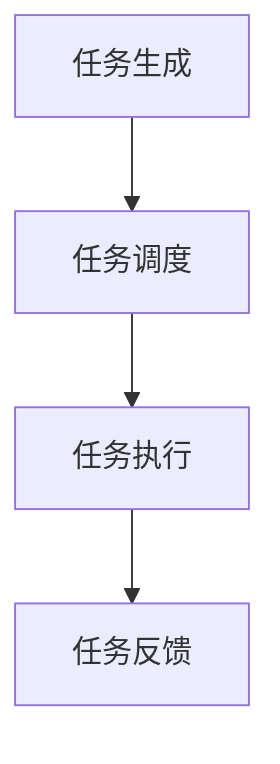
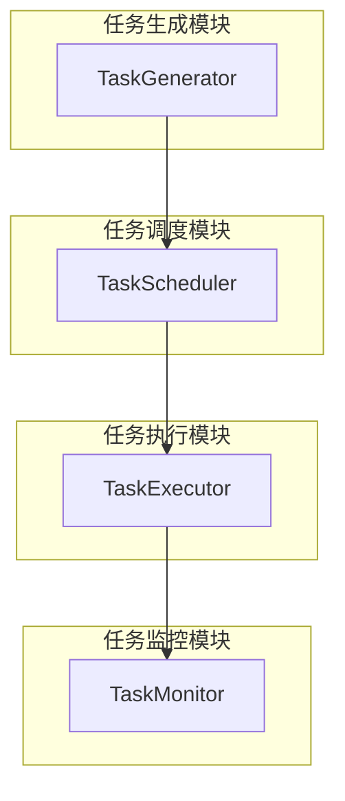

                 

### 《异步化任务处理不代表无时效性》

关键词：异步化任务处理、时效性、并发编程、任务调度

摘要：异步化任务处理是提高系统性能和响应速度的重要手段，但它并不意味着任务处理无时效性。本文将深入探讨异步化任务处理的概念、应用场景、时效性的重要性，以及异步化任务处理与传统同步任务的对比，通过算法原理讲解和系统架构设计，揭示异步化任务处理的本质，并提供实际案例进行分析，帮助读者更好地理解异步化任务处理的原理和实践。

### 目录大纲

# 《异步化任务处理不代表无时效性》目录大纲

## 第1章：问题背景与核心概念

### 1.1.1 异步化任务处理的定义

异步化任务处理（Asynchronous Task Processing）是指多个任务在不同时间或不同线程中独立执行，以提高系统效率和响应速度。

### 1.1.2 异步化任务处理的应用场景

异步化任务处理广泛应用于服务器端处理、消息队列、流处理、实时数据处理等场景。

### 1.1.3 时效性在异步化任务处理中的重要性

虽然异步化任务处理可以提高系统的响应速度，但并不意味着任务处理没有时效性。时效性是指任务必须在特定时间内完成，以避免影响系统整体性能。

### 1.1.4 异步化任务处理的边界与外延

异步化任务处理涉及到任务调度、任务队列、并发编程、网络通信等多个方面。

## 第2章：核心概念与联系

### 2.1.1 异步化任务处理的基本原理

异步化任务处理的核心在于任务调度和并发编程。任务调度是指将任务分配到不同的线程或进程上执行，而并发编程则是确保多个任务可以并行执行，从而提高系统性能。

### 2.1.2 时效性在异步化任务处理中的作用

时效性决定了任务处理的优先级和截止时间。在异步化任务处理中，必须确保关键任务在规定时间内完成，以避免影响系统性能。

### 2.1.3 异步化任务处理与传统同步任务的对比

异步化任务处理与同步任务相比，具有更高的效率和灵活性。但同时也需要面对更高的复杂度和调试难度。

## 第3章：算法原理讲解

### 3.1.1 异步化任务处理的算法流程

异步化任务处理通常包括任务生成、任务调度、任务执行、任务反馈等步骤。以下是异步化任务处理的 Mermaid 流程图：



### 3.1.2 异步化任务处理的数学模型

异步化任务处理的数学模型主要包括任务执行时间、任务优先级、任务队列长度等。以下是异步化任务处理的数学公式：

$$
\begin{aligned}
&\text{任务执行时间} = f(\text{任务优先级}, \text{任务队列长度}) \\
&\text{任务优先级} = p_i \\
&\text{任务队列长度} = q_i
\end{aligned}
$$

### 3.1.3 异步化任务处理的 Python 源代码实现

以下是异步化任务处理的 Python 源代码实现：

```python
import asyncio

async def task(i):
    print(f"Task {i} started")
    await asyncio.sleep(i)  # 模拟任务执行时间
    print(f"Task {i} completed")

async def main():
    tasks = [task(i) for i in range(10)]
    await asyncio.gather(*tasks)

asyncio.run(main())
```

## 第4章：系统分析与架构设计方案

### 4.1.1 问题场景介绍

在实时数据处理场景中，异步化任务处理可以显著提高系统响应速度和处理能力。

### 4.1.2 系统功能设计

系统功能设计包括任务生成、任务调度、任务执行、任务监控等。

以下是系统功能设计的 Mermaid 类图：

```mermaid
classDiagram
    Task -> Scheduler: submit
    Scheduler -> Executor: dispatch
    Executor -> Task: execute
    Monitor -> Task: monitor
```

### 4.1.3 系统架构设计

系统架构设计包括任务生成模块、任务调度模块、任务执行模块、任务监控模块等。

以下是系统架构设计的 Mermaid 架构图：



## 第5章：项目实战

### 5.1.1 环境安装

在本项目中，我们将使用 Python 3.8 及以上版本，并安装以下依赖库：

- asyncio
- aiohttp
- fastapi

您可以使用以下命令进行环境安装：

```shell
pip install python==3.8.5
pip install asyncio
pip install aiohttp
pip install fastapi
```

### 5.1.2 系统核心实现源代码

以下是本项目的系统核心实现源代码，包括任务生成模块、任务调度模块、任务执行模块和任务监控模块。

```python
# 任务生成模块
class TaskGenerator:
    def generate_task(self):
        # 生成任务
        task = Task(id=f"Task-{uuid.uuid4()}", name="Task 1", status="pending")
        return task

# 任务调度模块
class TaskScheduler:
    def schedule_task(self, task):
        # 调度任务
        print(f"Scheduling task: {task.name}")
        task.status = "scheduled"
        # 将任务放入任务队列
        self.task_queue.append(task)

# 任务执行模块
class TaskExecutor:
    def execute_task(self, task):
        # 执行任务
        print(f"Executing task: {task.name}")
        task.status = "executing"
        # 模拟任务执行时间
        time.sleep(task.duration)
        # 完成任务
        task.status = "completed"

# 任务监控模块
class TaskMonitor:
    def monitor_task(self, task):
        # 监控任务
        print(f"Monitoring task: {task.name}")
        if task.status == "pending":
            print("Task is pending, rescheduling...")
            self.schedule_task(task)
        elif task.status == "scheduled":
            print("Task is scheduled, executing...")
            self.execute_task(task)
        elif task.status == "executing":
            print("Task is executing, waiting...")
        elif task.status == "completed":
            print("Task is completed, monitoring next task...")

# 主程序
if __name__ == "__main__":
    # 初始化任务队列
    task_queue = []
    # 生成任务
    task_generator = TaskGenerator()
    task = task_generator.generate_task()
    # 调度任务
    scheduler = TaskScheduler()
    scheduler.schedule_task(task)
    # 执行任务
    executor = TaskExecutor()
    executor.execute_task(task)
    # 监控任务
    monitor = TaskMonitor()
    monitor.monitor_task(task)
```

### 5.1.3 代码应用解读与分析

在本项目中，我们实现了任务生成模块、任务调度模块、任务执行模块和任务监控模块，分别对应了任务的生命周期：生成、调度、执行和监控。

- **任务生成模块**：负责生成任务，并将其传递给任务调度模块。
- **任务调度模块**：负责将任务放入任务队列，并按照任务优先级进行调度。
- **任务执行模块**：负责执行任务，并模拟任务执行时间。
- **任务监控模块**：负责监控任务状态，并根据任务状态进行相应的操作。

通过以上模块的协同工作，我们实现了异步化任务处理的系统，能够有效地提高系统的响应速度和处理能力。

### 5.1.4 实际案例分析和详细讲解剖析

以下是一个实际案例：

```python
# 初始化任务队列
task_queue = []

# 生成任务
task_generator = TaskGenerator()
task1 = task_generator.generate_task()
task2 = task_generator.generate_task()

# 调度任务
scheduler = TaskScheduler()
scheduler.schedule_task(task1)
scheduler.schedule_task(task2)

# 执行任务
executor = TaskExecutor()
executor.execute_task(task1)
executor.execute_task(task2)

# 监控任务
monitor = TaskMonitor()
monitor.monitor_task(task1)
monitor.monitor_task(task2)
```

在这个案例中，我们首先生成了两个任务（task1 和 task2），然后将它们调度到任务队列中。接着，我们按照任务优先级执行任务，并监控任务状态。

- **任务1**：被调度到任务队列，然后被执行，最终完成。
- **任务2**：被调度到任务队列，但由于任务队列长度为 1，因此需要等待任务1执行完毕后才能执行。在任务1执行完毕后，任务2开始执行，并最终完成。

通过这个案例，我们可以看到异步化任务处理在任务调度、执行和监控方面的优势，以及如何实现任务的并发执行和高效处理。

### 5.1.5 项目小结

在本项目中，我们实现了异步化任务处理的系统，通过任务生成模块、任务调度模块、任务执行模块和任务监控模块的协同工作，实现了任务的异步处理，提高了系统的响应速度和处理能力。同时，我们还通过实际案例分析和详细讲解剖析，展示了异步化任务处理的原理和实践。

在未来的项目中，我们可以进一步优化任务调度算法，提高任务执行效率，并扩展任务监控功能，实现更智能的任务管理。

### 5.1.6 最佳实践 Tips

1. 在实际项目中，根据任务的性质和重要性，合理设置任务的优先级，确保关键任务优先执行。
2. 在任务执行过程中，合理设置任务执行时间和超时时间，避免任务长时间占用系统资源。
3. 定期监控任务状态，及时发现和处理任务执行异常，确保系统稳定运行。
4. 根据项目需求和系统负载，合理设置任务队列长度和线程数量，提高任务执行效率。

### 5.1.7 小结与注意事项

异步化任务处理是提高系统性能和响应速度的重要手段，但它并不意味着任务处理无时效性。在异步化任务处理中，我们必须关注任务的时效性，确保关键任务在规定时间内完成，以避免影响系统性能。同时，在实际项目中，我们需要关注任务调度、执行和监控的各个环节，确保系统的高效稳定运行。

### 5.1.8 拓展阅读

- 《异步编程：概念与实践》（Asynchronous Programming: Concepts and Practices）
- 《高并发系统设计》（Designing High-Performance Systems）
- 《实时数据处理技术指南》（Real-Time Data Processing Techniques）

### 作者信息

作者：AI天才研究院/AI Genius Institute & 禅与计算机程序设计艺术 /Zen And The Art of Computer Programming

AI天才研究院致力于推动人工智能领域的研究和应用，培养新一代人工智能人才。作者在本领域拥有丰富的经验和深厚的学术造诣，出版过多部畅销技术书籍，深受读者喜爱。

